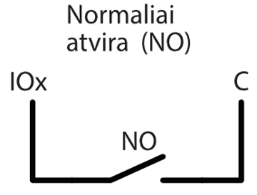
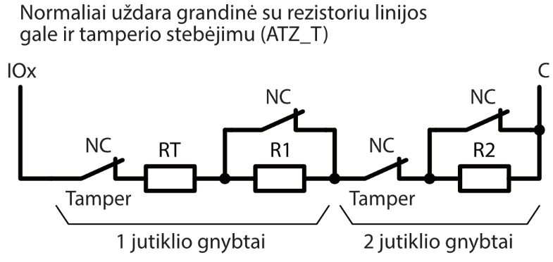
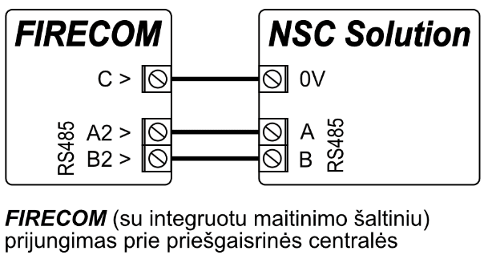
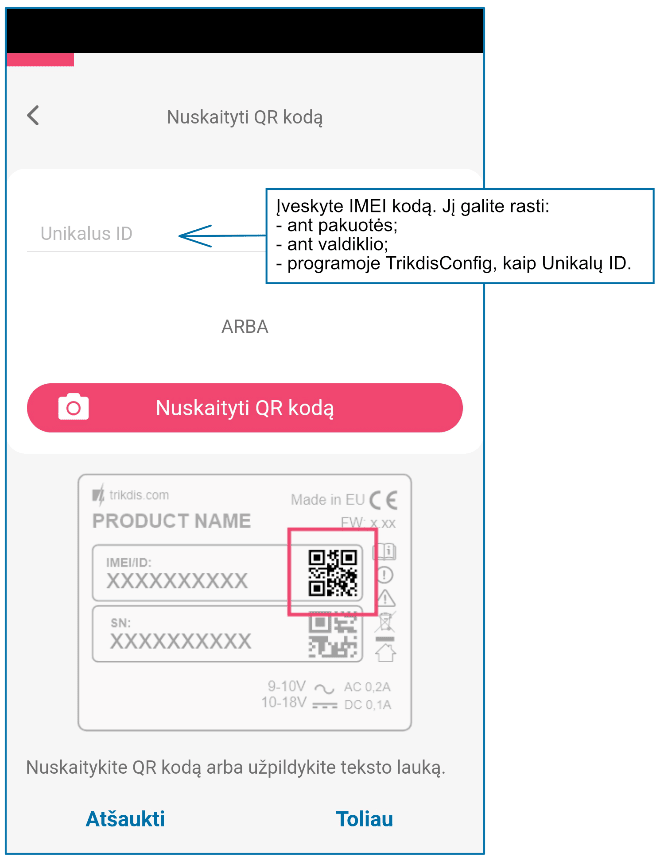

# Priešgaisrinės centralės komunikatorius FIRECOM

  

## Aprašymas 

FIRECOM komunikatorius atitinka EN 54-21:2006 standarto reikalavimus; EN 54-4:1997/AC:1999/A1:2002/A2:2006.

Gaminys atitinka EN54-21 A priedo 1 tipo perdavimo sistemos veikimo reikalavimus.

FIRECOM Communicator sertifikato Nr.: 1922-CPR-2083. Gaisro aptikimo ir priešgaisrinės signalizacijos sistemos. Įranga aliarmų siuntimui ir pranešimų apie gedimus nukreipimui. Maitinimo įranga.

Prekė sertifikuota įgaliotos gaminių sertifikavimo įstaigos: Nr.1922 "Dedal", Nesebar Mladost str. 50, Bulgarija, 8230

Trikdis techninės pagalbos kontaktai: support@trikdis.lt, +37067422877.

Komunikatorius FIRECOM skirtas perduoti priešgaisrinių centralių pranešimus per LAN ir/arba mobiliojo ryšio tinklus į CSP (centralizuoto stebėjimo pulto) imtuvą.

Veikimo principas. Kai pažeidžiamas komunikatoriaus įėjimas (zona), FIRECOM perduos įvykio pranešimą į centralizuoto stebėjimo pulto imtuvą ir į Protegus2 programėlę per mobilųjį internetą ir/arba per LAN tinklą. Taip pat gali siųsti SMS pranešimus arba paskambinti. Komunikatorius yra su 4G modemu.

**Savybės**

Pranešimai saugos tarnybai

- Siunčia įvykius per vietinį LAN tinklą ir (arba) per 4G mobilų internetą.

  - Pranešimai galimais ryšio kanalais išsiunčiami parinktu prioritetu.

- Centrinio stebėjimo pulte pranešimai priimami TRIKDIS IP imtuvu arba SIA DC-09 IP protokolu veikiančiu IP imtuvu.

- Pranešimų perdavimo į CSP prioriteto priskyrimas: pranešimai pirmiausia perduodami į CSP ir tik po to – objekto šeimininkui.

- Pranešimus galima perduoti į du skirtingų saugos tarnybų CSP IP imtuvus.

- Įvykių pranešimai perduodami Contact ID arba SIA kodais.

**Pranešimai vartotojams**

- Paskambina į pasirinktus telefono numerius (iki 8 naudotojų).

- Siunčia SMS pranešimus apie įvykius (iki 8 naudotojų).

- „Push” ir specialūs garso įspėjimai apie įvykius per Protegus2 programėlę.

- Nuotolinis temperatūros stebėjimas.

**Nuotolinis išėjimų valdymas**

- Protegu0 2 programėle.

- Paskambinus įrenginio telefono numeriu.

- SMS žinutėmis.

**Nustatymai ir įrengimas**

- Greitas ir lengvas įrengimas.

- Įrenginio konfigūravimas prijungus USB kabeliu arba nuotoliniu būdu naudojant TrikdisConfig programą.

- Nuotolinis programinės įrangos atnaujinimas.

- Du parametrų nustatymo lygiai (paskyros): instaliuotojui ir administratoriui.

**Įėjimai ir išėjimai**

- 3 reliniai išėjimai (1 A, 30V DC).

- „FLOOP“ įėjimas skirtas 2laidžių priešgaisrinių jutiklių prijungimui.

- 10 I/O kontaktų, iš kurių kiekvieną galima nustatyti kaip įėjimo (IN) arba išėjimo (OUT) kontaktą. Įėjimo (IN) tipai: NC, NO, EOL, EOL-T, ATZ, ATZ-T. EOL ir ATZ grandinėse galima naudoti skirtingų nominalų rezistorius.

- Su iO plėtimo moduliais IN įėjimų skaičių galima išplėsti iki 32 vnt., o OUT išėjimų skaičių galima išplėsti iki 16 vnt.

- iO serijos išplėtimo moduliams prijungti naudojama RS485 jungtis.

- RS485 2 sąsaja naudojama priešgaisrinėms centralėms prijungti.

### Techniniai parametrai

| Parametras | Aprašymas |
|------------|-----------|
| LTE modemo dažniai: /​ EU (Europa) /​ LA (Lotynų Amerika) | LTE-FDD: B1/​B3/​B5/​B7/​B8/​B20/​B28 /​ LTE-FDD: B2/​B3/​B4/​B5/​B7/​B8/​B28/​B66 |
| Maitinimo įtampa | 15-32 V nuolatinės srovės, 2,5 A. |
| Naudojama srovė | Iki 50 mA (budėjimo režime). /​ Iki 300 mA (duomenų siuntimo metu). /​ Iki 2,5 A (prijungus maksimaliai galimą apkrovą išoriniais įrenginiais). |
| Atsarginis maitinimo šaltinis [BAT] | 12 V švino - rūgštinis akumuliatorius, 4 Ah/​7 Ah |
| Akumuliatoriaus įkrovos srovė | Iki 500 mA |
| Išorinių įrenginių maitinimo įtampa ir srovė [AUX] | Nuolatinė 12 V, iki 1 A |
| Perdavimo protokolas | TRK, SIA DC-09_2007, SIA DC-09_2012, SIA DC-09_IPcom, TL150 |
| Šifravimo raktas | 6 simbolių šifravimo raktas. |
| Ryšio su CSP protokolai | TCP/​IP arba UDP/​IP |
| Įvykių pranešimai | Contact ID, SIA kodai |
| LAN modulis | Taip, integruotas |
| LAN tinklo konfigūracijos tipas | DHCP arba rankinis |
| SIM kortelė | 1 vnt., NANO dydžio |
| Pranešimų siuntimo parinktys | Iki 2 IP ir Port adresų;​ Į iOS/​Android Protegus2 mobiliąsias programas;​ SMS žinutės (iki aštuonių numerių);​ Skambučiai (iki aštuonių numerių). |
| Įvykių pranešimų perdavimo kanalai | 4G, Ethernet (LAN), SMS, skambutis |
| Pranešimų šifravimas | Yra |
| Vidinis laikrodis | Yra |
| Vartotojai | 40 |
| Dvigubos paskirties kontaktai [I/​O] | 10 Programuojant nustatoma IN arba OUT funkcija. Kai nustatyta IN, galima priskirti tipą: NC, NO, EOL, EOL_T, ATZ, ATZ_T. Kai nustatyta OUT, kontaktas tampa atvirojo kolektoriaus (OC) tipo išvadų, komutuojančiu iki 100 mA srovę. |
| Grupių skaičius | 8 |
| Zonų skaičius | 10 (20 zonų, naudojant ATZ), (su plėtikliais plečiamas iki 32 zonų) |
| PGM išėjimų skaičius | 3 reliniai (1 A, 30V DC). (Priskyrus I/​O gnybtams išėjimo darbo režimą galima gauti 13 PGM išėjimų. Su plėtikliais plečiamas iki 16 išėjimų) |
| Buferinės atmintinės talpa | Iki 60 įvykių. |
| Įvykių žurnalo atmintis | Iki 1000 įvykių. Seniausi įrašai trinami automatiškai. |
| Veikimo konfigūravimas | Su kompiuterine programa TrikdisConfig nuotoliniu būdu arba lokaliai per USB Type-C. Nuotoliniu būdu SMS žinutėmis. |
| 1-Wire magistralės ilgis [1 WIRE] | Iki 30 m |
| Suderinami temperatūros jutikliai | Maxim®/​Dallas® DS18S20, DS18B20;​ AM2301 serijos |
| Didžiausias temperatūros jutiklių, jungiamų prie 1-Wire magistralės, skaičius | 8 (Dallas) arba 1 (jei naudojamas AM2301 serijos jutiklis) |
| RS485 magistralė | 2 vnt. |
| RS485 magistralės ilgis | Iki 100 m |
| Palaikomi moduliai | iO-8 - plėtimo modulis;​ /​ iO-MO – iO-WL radijo bangų imtuvas;​ /​ iO-LORA – plėtimo modulis;​ /​ iO8-LORA – plėtimo modulis;​ /​ PB-LORA – panikos mygtukas;​ /​ REL-LORA - plėtimo modulis;​ /​ priešgaisrinė centralė su ESPA 4.4.4 sąsaja;​ /​ NSC Solution - priešgaisrinė centralė;​ /​ INIM Smartline - priešgaisrinė centralė;​ /​ C-TEC Cast ZFP – priešgaisrinė centralė. |
| Darbo aplinkos sąlygos | Temperatūra nuo -10 °C iki +50 °C, santykinė drėgmė – iki 80% prie +20 °C. |
| Komunikatoriaus matmenys | 235 x 205 x 92 mm |
| Svoris | 1.35 kg |

### Komunikatoriaus FIRECOM elementai 

1. Ryšio ir veikimo šviesinė indikacija
2. Mygtukas
3. Nenaudojamas
4. Rezervinio maitinimo kontaktų kaladėlė
5. Pagrindinio maitinimo kontaktų kaladėlė
6. „RESET“ mygtukas
7. Išorinių kontaktų kaladėlė

### Išorinių kontaktų paskirtis 

| Gnybtas | Aprašymas |
|---------|-----------|
| Maitinimo gnybtas „+“ | Maitinimo gnybtas (15 - 32 V nuolatinės srovės teigiamas gnybtas) |
| Maitinimo gnybtas „-“ | Maitinimo gnybtas (15 - 32 V nuolatinės srovės neigiamas gnybtas) |
| BAT+ | Atsarginio maitinimo šaltinio teigiamas gnybtas 12 V |
| BAT- | Atsarginio maitinimo šaltinio neigiamas gnybtas 12 V |
| AUX+ | Išorinių įrenginių teigiamas 12 V maitinimo gnybtas |
| AUX- | Bendras neigiamas gnybtas |
| A1 RS485 | RS485 skirtas iO išplėtimo įrenginiams prijungti |
| A2 RS485 | RS485 sąsaja priešgaisrinės centralės prijungimui |
| IO1 – IO10 | Įėjimo/​išėjimo gnybtai (gamyklinis nustatymas – įėjimas) |
| C | Bendras neigiamas gnybtas |
| AUX+ | Išorinių įrenginių teigiamas 12 V maitinimo gnybtas |
| FLOOP | Gnybtas 2-laidžiam priešgaisriniam jutikliui prijungti |
| +5 V | „1-Wire“ įrenginių teigiamas 5 V, 0,2 A maitinimo gnybtas |
| 1 WIRE | „1-Wire“ duomenų magistralės gnybtas |
| C | Bendras neigiamas gnybtas |
| NO1/​C1/​NC1 | 1-o relinio PGM išėjimo gnybtai |
| NO2/​C2/​NC2 | 2-o relinio PGM išėjimo gnybtai |
| NO3/​C3/​NC3 | 3-o relinio PGM išėjimo gnybtai |

### Šviesinė veikimo indikacija 

| Indikatorius | Būklė | Aprašymas |
|--------------|-------|-----------|
| SIM | Nešviečia | Nėra ryšio su GSM tinklu |
| SIM | Mirksi žaliai | Vyksta SIM kortelės registracija GSM tinkle. |
| SIM | Šviečia žaliai | SIM kortelė priregistruota GSM tinkle. |
| SIM | Šviečia žaliai ir mirksi geltonai | Komunikatorius prisijungė prie GSM tinklo. Pakankamas 4G signalo stiprumas yra 3 lygis (trys geltoni sumirksėjimai). |
| ETH | Mirksi žaliai | LAN kabelis atjungtas arba DHCP problema. |
| ETH | Šviečia žaliai | Prisijungta prie LAN tinklo. |
| DAT / DATA | Nešviečia | Išsiųsti visi įvykių pranešimai |
| DAT / DATA | Šviečia žaliai | Siunčiamas pranešimas. |
| DAT / DATA | Šviečia geltonai (DAT) | Yra neišsiųstų įvykių pranešimų buferinėje atmintyje |
| STA / TROUBLE | Mirksi žaliai (STA) | Sistema veikia be nesklandumų. |
| STA / TROUBLE | Nešviečia (TROUBLE) | Sistema veikia be nesklandumų. |
| STA / TROUBLE | 1 raudonas mirktelėjimas | Nėra SIM kortelės |
| STA / TROUBLE | 2 raudoni mirktelėjimai | Neteisingas SIM kortelės PIN kodas |
| STA / TROUBLE | 3 raudoni mirktelėjimai | Nepavyksta prisijungti prie GSM tinklo |
| STA / TROUBLE | 4 raudoni mirktelėjimai | Nepavyksta prisijungti prie CSP imtuvo per 1-ą kanalą |
| STA / TROUBLE | 5 raudoni mirktelėjimai | Nepavyksta prisijungti prie CSP imtuvo per 2-ą kanalą |
| STA / TROUBLE | 6 raudoni mirktelėjimai | Nėra pagrindinio maitinimo |
| STA / TROUBLE | 7 raudoni mirktelėjimai | AUX gedimas (viršsrovis) |
| STA / TROUBLE | 8 raudoni mirktelėjimai | Baterijos gedimas |
| STA / TROUBLE | 9 raudoni mirktelėjimai | LAN kabelis atjungtas |
| STA / TROUBLE | 10 raudonų mirktelėjimų | LAN DHCP problema |
| FPS / POWER | Nešviečia | Neprijungtas maitinimas |
| FPS / POWER | Šviečia žaliai | Maitinimo įtampa gera |
| FPS / POWER | 1 žalias mirktelėjimas | Nėra maitinimo iš kintamos srovės tinklo |
| FPS / POWER | 2 žali mirktelėjimai | Nepakankama maitinimo įtampa atsarginio maitinimo šaltinyje |

### Medžiagos reikalingos montavimo darbams 

Prieš pradėdami įrengimą, įsitikinkite, kad turite:

1.  USB Type-С tipo kabelį, kuris reikalingas konfigūravimui.

2.  Mažiausiai 4 gyslų kabelį komunikatoriaus prijungimui prie priešgaisrinės centralės.

3.  Plokščią 2,5 mm atsuktuvą.

4.  Išorinę GSM anteną, jeigu įrengimo vietoje ryšys silpnas.

5.  Aktyvuotą nano-SIM kortelę (PIN kodo reikalavimas gali būti išjungtas).

6.  Priešgaisrinės centralės, prie kurios bus jungiamas komunikatorius, instrukciją.

Reikalingas medžiagas galite užsisakyti iš vietinio platintojo.

## Komunikatoriaus maitinimas 

### Pagrindinis maitinimas 

Komunikatorius turi būti maitinamas iš nuolatinės srovės šaltinio. Nenutrūkstamam sistemos maitinimui užtikrinti, prie komunikatoriaus dar turi būti prijungtas rezervinio maitinimo šaltinis – 12 V akumuliatorius.

### Rezervinis maitinimas 

Sutrikus sistemos maitinimui iš pagrindinio maitinimo šaltinio, bus formuojamas įvykio „*Tinklo maitinimo dingimas*“ pranešimas ir komunikatorius automatiškai persijungs sistemą maitinti iš rezervinio 12 V akumuliatoriaus. Akumuliatoriaus įtampai sumažėjus iki 11,5 V, bus formuojamas įvykio „*Žema baterijos įtampa*“ pranešimas. Akumuliatorius bus atjungtas jei jis išsikraus žemiau 9,5 V. Atsiradus kintamos srovės tinklo įtampai, bus formuojamas „*Tinklo maitinimo atsistatymas*“ pranešimas ir automatiškai prasidės akumuliatoriaus įkrovimo procesas. Akumuliatoriaus įtampai atsistačius iki 12,6 V, bus formuojamas įvykio „*Baterijos įtampos atsistatymas*“ pranešimas.

### Komunikatoriaus komplektas 

| Pavadinimas | Kiekis |
|----|:--:|
| Komunikatoriaus FIRECOM plokštė su antena, įmontuota į metalinį korpusą | 1 vnt. |
| Metalinis korpusas su Mean Well impulsiniu maitinimo šaltiniu | 1 vnt. |
| Rezistorius 10 kΩ | 20 vnt. |
| Akumuliatoriaus prijungimo laidas | 1 vnt. |
| Sabotažo jutiklis (angl. Tamper) | 1 vnt. |
| Kontaktų kaladėlė su 3,15 A saugikliu | 1 vnt. |
| Tvirtinimo elementai (medvaržtis – 4 vnt., plastikinis diubelis – 4vnt.) | 1 kompl. |

!!! note
    USB Type-C kabelis, skirtas komunikatoriui programuoti, kartu
    neteikiamas.
## Sistemos įrengimas 

**FIRECOM plokštės matmenys**

Paveikslėlyje pateiktos komunikatoriaus plokštės ir jos tvirtinimo kiaurymių matmenys (pateikta milimetrais), bei jų išdėstymas.

### Prietaisų prijungimo eiliškumas

1.  Jei naudojate SIM kortelę, į SIM kortelės laikiklį įdėkite prie mobiliojo tinklo jau priregistruotą SIM kortelę.

2.  Jei naudojate LAN tinklą, prijunkite LAN kabelį.

3.  Vadovaudamiesi pateiktomis schemomis prijunkite priešgaisrinės centralės PGM išėjimus, gaisro jutiklius, signalizatorius, valdomus įtaisus.

4.  Prijunkite kintamosios srovės maitinimo laidus prie gnybtų.

5.  Į montažinį korpusą įstatykite rezervinio maitinimo akumuliatorių. Jo gnybtus prijunkite prie komunikatoriaus rezervinio maitinimo šaltinio jungties BAT+ / BAT–.

!!! note
    Renkantis akumuliatorių, jis turi būti įkrautas iki 80% per 24 valandas,
    o likusi talpa pasiekiama per artimiausias 48 valandas, kad atitiktų
    EN54 standarto reikalavimus.
### Jutiklių jungimas

Komunikatoriaus plokštėje yra 10 kontaktų IO1–IO10 (įėjimai) jutiklių grandinėms prijungti. Panaudojus įėjimų plėtiklius (***iO-8, iO-MO, iO-LORA, iO8-LORA**)*, įėjimų skaičių galima padidinti iki 32. Bet kurį kontaktą galima nustatyti kaip įėjimą ir priskirti zonos atributus: grandinės tipą (NO, NC, EOL, EOL_T, ATZ, ATZ_T); jautrumą į trumpalaikius grandinės įvykius; (žr. 6.6 „Langas „Zonų įėjimai““).

#### Jutiklių jungimo schemos.

  <figure style="margin: 0;">
    
  </figure>
  <figure style="margin: 0;">
    
  </figure>
  <figure style="margin: 0;">
    
  </figure>

  <figure style="margin: 0;">
    
  </figure>
  <figure style="margin: 0;">
    
  </figure>
  <figure style="margin: 0;">
    
  </figure>

  <figure style="margin: 0;">
    
  </figure>
  <figure style="margin: 0;">
    
  </figure>

### Dūmų jutiklių jungimas 

Dvilaidžių dūmų jutiklių prijungimo schemos.

Dvilaidžių dūmų jutiklių prijungimo schema prie „**FLOOP**“ išėjimo. Kai yra naudojama šia jungimo schema, reikia lange **„Zonų įėjimai“** nurodyti **„Įėjimo“** tipą **„Priešgaisrinis jutiklis (2laidis)“**. Dūmų jutiklių aliarmo srovė turi būti didesnė nei 10 mA. Prie „**FLOOP**“ išvesties galima prijungti iki 8 dūmų jutiklių.

Dvilaidžių dūmų jutiklių su reliniu moduliu SM1 prijungimo schemos. Norint prie pasirinkto įėjimo prijungti dūmų jutiklio grandinę reikia aktyvuoti įėjimą (IOx) ir nustatyti grandinės tipą (NO, NC, EOL, EOL_T, ATZ, ATZ_T) (žr. 6.6 „Langas „Zonų įėjimai“). Jungiant dūmų jutiklio maitinimo grandinę prie PGM išėjimo (IO10), išėjimui turi būti su nustatyta funkcija „**Gaisro jutiklių atstatymas**“ (žr. 6.7 „Langas „PGM išėjimai““).

\* Relė (K1) naudojama nutrūkusio laido ir nuimto gaisro detektoriaus aptikimui. Jei nenaudojate relės (K1), kontaktas K1 turi būti užtrumpintas.

Arba

Keturlaidžių dūmų jutiklių prijungimo schema.

Norint prie pasirinkto įėjimo prijungti dūmų jutiklio grandinę reikia aktyvuoti įėjimą (IOx) ir nustatyti grandinės tipą (NO, NC, EOL, EOL_T, ATZ, ATZ_T) (žr. 6.6 „Langas „Zonų įėjimai“). Jungiant keturlaidžio dūmų jutiklio maitinimo grandinę prie PGM išėjimo (IO10), išėjimui turi būti su nustatyta funkcija „**Gaisro jutiklių atstatymas**“ (žr. 6.7 „Langas „PGM išėjimai““).

\* Relė (K1) naudojama nutrūkusio laido ir nuimto gaisro detektoriaus aptikimui. Jei nenaudojate relės (K1), kontaktas K1 turi būti užtrumpintas.

### Priešgaisrinės centralės ir komunikatoriaus jungimo schema 

  <figure style="margin: 0;">
    
  </figure>
  <figure style="margin: 0;">
    
  </figure>

Jei norite stebėti priešgaisrinės centralės būseną, prijunkite atitinkamus jo išėjimus prie FIRECOM įėjimų. Priešgaisrinės centralės išėjimai (PGM1, PGM2, PGM3) turi būti sukonfigūruoti kaip centralės būsenos išėjimai (Aliarmas, Gedimas ir kt.).

### Priešgaisrinės centralės su protokolų ESPA4.4.4 prijungimo schema 

  <figure style="margin: 0;">
    
  </figure>
  <figure style="margin: 0;">
    
  </figure>

FIRECOM komunikatoriaus nustatymai su TrikdisConfig jungiant su priešgaisrine centrale.

1.  Pasirinkite „**ESPA4.4.4“**.

2.  Pasirinkite sąsajos tipą.

3.  FIRECOM komunikatoriaus ir gaisro centralės duomenų perdavimo parametrai turi būti vienodi.

4. Įveskite vartotojų, kurie turėtų gauti žinutes iš FIRECOM, telefono numerius ir el. pašto adresus.

5. Jei norite, kad vartotojas gautų žinutes (arba skambučius) apie įvykius, pažymėkite laukelį **SMS** (arba **Skamb.**).

6. Sukonfigūruokite ryšio kanalą, jei pranešimai turi būti siunčiami į CSP imtuvą. Įvykių pranešimai perduodami naudojant SIA DC-09 protokolą.

Išbandykite sistemą. Aktyvuokite gaisro signalizaciją ir patikrinkite, ar FIRECOM pranešimai siunčiami į CSP (centrinį stebėjimo pultą) ir į Protegus2.

### Priešgaisrinės centralės NSC Solution prijungimo schema 

  <figure style="margin: 0;">
    
  </figure>
  <figure style="margin: 0;">
    
  </figure>

FIRECOM komunikatoriaus nustatymai su TrikdisConfig jungiant su **NSC Solution** priešgaisrine centrale.

1.  Pasirinkite „**NSC solution“** priešgaisrinę centralę.

2.  „**NSC slave adresas**“ neturėtų sutapti su prijungtų priešgaisrinės centralės modulių adresais.

3. Įveskite vartotojų, kurie turėtų gauti žinutes iš FIRECOM, telefono numerius ir el. pašto adresus.

4. Vartotojai gaus SMS žinutes ir skambučius apie pažymėtus įvykius. CID stulpelyje galite pridėti papildomų CID įvykių kodų. Prie naujų kodų turite įvesti SMS žinučių tekstus. Jei norite, kad vartotojas gautų žinutes (arba skambučius) apie įvykius, pažymėkite „**SMS**“ (arba „**Skamb.**“) laukelį.

5. Sukonfigūruokite ryšio kanalą, jei pranešimai turi būti siunčiami į CSP imtuvą.

Sukonfigūravus komunikatorių FIRECOM, įjunkite priešgaisrinės centralės maitinimą. Palaukite, kol bus įkelta priešgaisrinės centralės programinė įranga. Centralėje būtina nuskaityti modulius, prijungtus prie RS485 magistralės. Priešgaisrinėje centralėje paspauskite: **PROG.>INSTALLER>(įveskite instaliuotojo kodą) 00000 OK>(pasirinkite) SETTINGS>ENTER>(pasirinkite) SCAN RS485>ENTER**. Palaukite, kol nuskaitymas bus baigtas. Grįžkite į pagrindinį ekraną du kartus paspausdami „**CANCEL**“.

Išbandykite sistemą. Aktyvuokite gaisro signalizaciją ir patikrinkite, ar FIRECOM pranešimai siunčiami į CSP (centrinį stebėjimo pultą) ir į Protegus2.

### Priešgaisrinės centralės INIM SMARTLINE prijungimo schema 

  <figure style="margin: 0;">
    
  </figure>
  <figure style="margin: 0;">
    
  </figure>

**INIM Smartline** centralei reikia nustatyti „**Slave**“ režimą, kai ji prijungta prie komunikatoriaus per RS485 sąsają.

!!! note
    Jei prie **INIM Smartline** centralės prijungti kartotuvai, tai
    FIRECOM negalite prijungti per RS485 sąsają. / Kai FIRECOM
    prijungtas prie **INIM Smartline** centralės per RS485 sąsają, iO
    plėtimo moduliai nepalaikomi.
FIRECOM komunikatoriaus nustatymai su TrikdisConfig jungiant su **INIM SMARTLINE** priešgaisrine centrale.

1.  Pasirinkite **Inim Smartline** priešgaisrine centrale.

2. Įveskite vartotojų, kurie turėtų gauti žinutes iš FIRECOM, telefono numerius ir el. pašto adresus.

3. Vartotojai gaus SMS žinutes ir skambučius apie pažymėtus įvykius. CID stulpelyje galite pridėti papildomų CID įvykių kodų. Prie naujų kodų turite įvesti SMS žinučių tekstus. Jei norite, kad vartotojas gautų žinutes (arba skambučius) apie įvykius, pažymėkite „**SMS**“ (arba „**Skamb.**“) laukelį.

4. Sukonfigūruokite ryšio kanalą, jei pranešimai turi būti siunčiami į CSP imtuvą.

Išbandykite sistemą. Aktyvuokite gaisro signalizaciją ir patikrinkite, ar FIRECOM pranešimai siunčiami į CSP (centrinį stebėjimo pultą) ir į Protegus2.

### Priešgaisrinės centralės C-TEC Cast ZFP prijungimo schema 

  <figure style="margin: 0;">
    
  </figure>
  <figure style="margin: 0;">
    
  </figure>

FIRECOM komunikatoriaus nustatymai su TrikdisConfig jungiant su **C-TEC Cast ZFP** priešgaisrine centrale.

1.  Pasirinkite **C-TEC Cast ZFP** priešgaisrine centrale.

2. Įveskite vartotojų, kurie turėtų gauti žinutes iš FIRECOM, telefono numerius ir el. pašto adresus.

3. Vartotojai gaus SMS žinutes ir skambučius apie pažymėtus įvykius. CID stulpelyje galite pridėti papildomų CID įvykių kodų. Prie naujų kodų turite įvesti SMS žinučių tekstus. Jei norite, kad vartotojas gautų žinutes (arba skambučius) apie įvykius, pažymėkite „**SMS**“ (arba „**Skamb.**“) laukelį.

4. Sukonfigūruokite ryšio kanalą, jei pranešimai turi būti siunčiami į CSP imtuvą.

Įdiekite **ZFPtools** programą savo kompiuteryje. Paleiskite programą **ZFPtools**. Įjunkite priešgaisrinės centralės maitinimą. Palaukite, kol bus įkelta priešgaisrinės centralės programinė įranga. Prijunkite USB2.0 A-B kabelį tarp priešgaisrinės centralės ir kompiuterio.

5. Atidarykite „**Node View**“ skirtuką.

6. Nuskaitykite priešgaisrinės centralės nustatymus.

7. Įveskite kodą (gamyklinis kodas – 4444).

2.  Spustelėkite „ОК“.

3. Pasirinkite „**BMS Interface**“.

2.  Spustelėkite laisvą piktogramą.

11. Spustelėkite „**Edit Devices**“.

12. Skirtuke „**Device**“ įveskite sistemos pavadinimą.

13. Skirtuke „**Properties**“ įveskite sistemos pavadinimą.

14. Nurodykite „**ABUS RS485**“ sąsają, prie kurios prijungtas FIRECOM komunikatorius.

15. Nustatykite pranešimus.

16. Įrašykite nustatymus į priešgaisrinę centralę.

17. Įveskite kodą (gamyklinis kodas – 4444).

18. Spustelėkite „OK“.

Priešgaisrinė centralė užprogramuota. Atjunkite USB2.0 A-B kabelį nuo priešgaisrinės centralės.

Išbandykite sistemą. Aktyvuokite gaisro signalizaciją ir patikrinkite, ar FIRECOM pranešimai siunčiami į CSP (centrinį stebėjimo pultą) ir į Protegus2.

### Temperatūros jutiklio prijungimo schema 

 / 

### Relės, LED indikatoriaus prijungimo schemos 

 / 

### Priešgaisrinės centralės įėjimų ir komunikatoriaus jungimo schema 

Pagal EN54 standartą gaisrinė centralė iš komunikatoriaus turi gauti informaciją apie ryšio su stebėjimo pultu gedimą, taip pat apie sėkmingą pranešimo gavimą į CSP. Prijunkite komunikatoriaus PGM išėjimus (pvz.: „Relay1“ ir „Relay2“) prie specialių gaisrinės centralės įėjimų. „Relay1“ PGM išėjimui turi būti nustatytas „Pulto kanalo sutrikimas“ režimas. „Relay2“ PGM išėjimui turi būti nustatytas „Patvirtinimas gautas“ režimas. „Relay1“ išėjimas aktyvuojamas kai dingsta ryšys su stebėjimo pultu. „Relay2“ išėjimas aktyvuojamas 5 sek. sėkmingai išsiuntus pranešimą stebėjimo pultui.

### iO serijos išplėtimo modulių prijungimo schemos 

Jei reikia, kad komunikatorius FIRECOM turėtų daugiau įėjimų IN arba išėjimų OUT, prijunkite laidinį arba belaidį TRIKDIS iO serijos įėjimų ir išėjimų plėtiklį. FIRECOM konfigūravimas su plėtimo moduliais aprašytas p. 6.5. „Langas „Moduliai“.

  <figure style="margin: 0;">
    
  </figure>
  <figure style="margin: 0;">
    
  </figure>

LORA plėtimo modulių prijungimo schema

### Komunikatoriaus įjungimas 

Norint įjungti komunikatorių, reikia įjungti jo maitinimo šaltinį. Jei komunikatorius veikia tinkamai, turi užsidegti ši FIRECOM šviesinė indikacija:

- Diodas „**STA**“ turi mirksėti žaliai (pakankama maitinimo įtampa);

- Diodas „**SIM**“ turi šviesti žaliai ir mirksėti geltonai, kai komunikatorius prisiregistravęs prie mobilaus ryšio tinklo; ir/arba „**ETH**“ indikatorius šviečia žaliai, kai komunikatorius yra prijungtas prie LAN tinklo.

!!! note
    Pakankamas 4G signalo lygis - 3 (trys „**SIM**" indikatoriaus geltoni
    mirksniai). / Jeigu suskaičiuojate mažiau nei 3 geltonus „**SIM**" diodo
    mirksnius, tai mobilaus ryšio signalo lygis nepakankamas. Rekomenduojame
    pasirinkti kitą komunikatoriaus įrengimo vietą arba naudoti jautresnę
    GSM anteną. / Jei šviesinė indikacija kitokia, ieškokite indikacijos
    reikšmės skyriuje 1.4 „Šviesinė veikimo indikacija". / Jei FIRECOM
    šviesos indikatorius visiškai neaktyvus, patikrinkite maitinimo šaltinį
    ir sujungimus.
## Greitas konfigūravimas su programa *TrikdisConfig* 

1.  Parsisiųskite konfigūravimo programą TrikdisConfig iš <u>www.trikdis.lt</u> (programą rasite paieškos lauke surinkę „TrikdisConfig“) ir ją įdiekite*.*

2.  Sujunkite FIRECOM su kompiuteriu USB Type-C kabeliu.

3.  Paleiskite TrikdisConfig. Programa automatiškai atpažins prijungtą įrenginį ir atidarys FIRECOM konfigūravimo langą.

4.  Paspauskite **Skaityti [F4]**, kad programa pateiktų esamas FIRECOM veikimo parametrų reikšmes. Jei atsivers administratoriaus arba instaliuotojo kodo įvedimo reikalavimo langelis, įveskite 6 skaitmenų kodą.

Žemiau aprašome nustatymus, kuriuos reikia pakeisti, kad komunikatorius pradėtų siųsti pranešimus į Protegus2 programėlę arba į stebėjimo pultą.

### Nustatymai ryšiui su Protegus2 programėle 

**Lange „Sistemos parinktys“:**

1.  Įveskite **SIM kortelės PIN kodą**.

2.  Pakeiskite **APN** vardą. **APN** rasite SIM operatoriaus interneto puslapyje. „Internet” yra universalus ir veikia daugelio operatorių tinkluose.

**Lange „Vartotojai ir pranešimai“:**

3. Pažymėkite varnele „**Įgalinti jungimąsi“** prie Protegus2 serviso.

2.  Pakeiskite ***Protegus2* „Aplikacijos prieigos kodą“**, jeigu norite, kad vartotojų prašytų jį suvesti, jiems pridedant sistemą Protegus2 programėlėje (gamyklinis slaptažodis – 123456).

**Lange „Pranešimai į ST pultą“:**

3. Jei prie komunikatoriaus prijungtas LAN kabelis, tai pažymėkite langelį „**Automatinis**“ (automatinis registracijos režimas), kad komunikatorius FIRECOM automatiškai nuskaitytų tinklo nustatymus (potinklio kaukę, šliuzą) ir jam bus priskirtas IP adresas.

2.  Nustatomi parametrai, kaip komunikatorius siųs pranešimus į Protegus2. Eilės tvarka nustatomi ryšio tipai. Nepavykus jungtis pirminiu ryšio tipu, pereinama į sekantį ir t.t. Jei atsarginiu ryšio tipu pavyko perduoti pranešimą į Protegus2, tai „**Grįžimą į pagrindinį“** ryšio tipą bus bandoma atlikti po nustatyto laiko tarpo.

**Lange „Zonų įėjimai“:**

3. Pažymėkite varnele, jei norite, kad vartotojas gautų pranešimus į Protegus2 apie zonų būsenos pasikeitimus.

**Lange „PGM išėjimai“:**

4. Pažymėkite varnele, jei norite, kad vartotojas gautų pranešimus į Protegus2 apie PGM išėjimų būsenos pasikeitimus.

**Lange „Sistemos įvykiai“:**

5. Pažymėkite varnele, jei norite, kad vartotojas gautų pranešimus į Protegus2 apie komunikatoriaus vidinių įvykių būsenos pasikeitimus.

Baigę konfigūravimą, paspauskite mygtuką **Įrašyti [F5]** ir atjunkite USB kabelį.

!!! note
    Plačiau apie kitus FIRECOM nustatymus TrikdisConfig žr.
    skyrių 6 „TrikdisConfig langų aprašymas".
### Nustatymai ryšiui su Stebėjimo pultu 

**Lange „Sistemos parinktys“:**

1.  Įrašykite **Objekto numerį** (4 simbolių šešioliktainis numeris, 0-9, A-F. **Nenaudokite FFFE, FFFF objekto numerių**.).

2.  Įveskite **SIM kortelės PIN** **kodą**.

3.  Pakeiskite „**APN“** vardą. Jį rasite SIM operatoriaus interneto puslapyje. „Internet” yra universalus ir veikia daugelio operatorių tinkluose.

**Lange „Pranešimai į ST pultą“:**

4. Jei prie komunikatoriaus prijungtas LAN kabelis, tai pažymėkite langelį „**Automatinis**“ (automatinis registracijos režimas), kad komunikatorius FIRECOM automatiškai nuskaitytų tinklo nustatymus (potinklio kaukę, šliuzą) ir jam bus priskirtas IP adresas.

2.  Nustatomi parametrai, kaip komunikatorius siųs pranešimus į CSP kanalus. Eilės tvarka nustatomi ryšio tipai. Nepavykus jungtis pirminiu ryšio tipu, pereinama į sekantį ir t.t. Jei atsarginiu ryšio tipu pavyko perduoti pranešimą į CSP, tai „**Grįžimą į pagrindinį“** ryšio tipą bus bandoma atlikti po nustatyto laiko tarpo.

3. **Ryšio būdas** – pasirinkite, kuriuo protokolu (TCP arba UDP) turėtų būti siunčiami pranešimai.

2.  **Domenas arba IP** – įrašykite imtuvo domeno arba IP adresą.
3. **Prievadas** – įrašykite imtuvo prievado (*angl. port*) numerį tinkle.

2.  **Protokolas** – pasirinkite, kuria koduote turėtų būti siunčiami pranešimai: **TRK** (į TRIKDIS imtuvus), **DC-09_2007** arba **DC-09_2012** (į universalius imtuvus), **TL150** (į SUR-GARD imtuvus).

3.  **Šifravimo raktas** – įrašykite šifravimo raktą, kuris yra nustatytas imtuve.

!!! note
    Jei pasirinkote **DC-09** pranešimų perdavimo koduotę, papildomai
    **„Pranešimai į ST pultą"** lange, skirtuke „**Nuostatos"**, įveskite
    objekto, linijos ir imtuvo numerius.
11. (Rekomenduojama) Sukonfigūruokite „**Atsarginio kanalo“** nustatymus.

12. Sukonfigūruokite „**Lygiagretus ryšio kanalas**“, jei pranešimai bus siunčiami į antrąjį CSP imtuvą.

Baigę konfigūravimą paspauskite mygtuką **Įrašyti [F5]** ir atjunkite USB kabelį.

!!! note
    Plačiau apie kitus FIRECOM nustatymus TrikdisConfig žr.
    skyrių 6 „TrikdisConfig langų aprašymas".
## Nuotolinis valdymas 

### Komunikatoriaus registravimas Protegus2 programėlėje 

Naudodami Protegus2, sistemos vartotojai gali matyti sistemos būseną ir gauti pranešimus apie sistemos įvykius.

1.  Parsisiųskite ir paleiskite Protegus2 programėlę arba naudokite versiją naršyklėje [www.protegus.app](https://www.protegus.app):

    

      
      
      
    

2.  Registruokitės ir susikurkite naują paskyrą arba prisijunkite savo vartotojo vardu ir slaptažodžiu.

!!! note
    Sistemos registravimo prie Protegus2 metu FIRECOM
    komunikatorius turi būti:
    
    1.  Su įstatyta ir aktyvuota SIM kortele ir įvestu arba išjungtu PIN
        kodu;
    
    2.  Įjungta Protegus2 servisas paslauga. Žr. 6.4 Langas
        „Vartotojai ir pranešimai";
    
    3.  Įjungtu maitinimu („**STA**" LED mirksi žaliai);
    
    4.  Prisiregistravęs prie tinklo („**SIM**" LED šviečia žaliai ir mirksi
        geltonai; ir/arba „**ETH**" LED šviečia žaliai, kai prisijungęs prie
        LAN tinklo).
3. Paspauskite „Pridėti sistemą“ ir įveskite *FIRECOM* „*IMEI/Unikalus ID*“ numerį. Jį rasite ant gaminio ir pakuotės lipduko. Įvedę, paspauskite mygtuką „Toliau“.

### Konfigūravimas ir valdymas SMS žinutėmis 

1.  **Pakeiskite administratoriaus slaptažodį**

Saugumui užtikrinti, pakeiskite gamyklinį administratoriaus SMS slaptažodį. Išsiųskite tokio formato SMS žinutę:

#### PSW 123456 xxxxxx

| **123456** | Gamyklinis administratoriaus slaptažodis         |
|------------|--------------------------------------------------|
| **xxxxxx** | Naujasis 6-ženklis administratoriaus slaptažodis |

1.  **Leiskite valdyti kitiems naudotojams**

Sistemą galima valdyti su SMS arba skambučiu tik tais telefono numeriais, kurie yra įrašyti vartotojų sąraše. Iš administratoriaus telefono nusiųskite SMS žinutes su asmenų telefonų numeriais ir vardais, įgalindami juos valdyti sistemą:

#### SETN xxxxxx PHONEx=+PHONENR#NAME#EMAIL

| **xxxxxx** | 6-ženklis administratoriaus slaptažodis |
|----|----|
| **x** | Naudotojo numeris sąraše. (Įrašę 1, perleisite administratoriaus teises kitam asmeniui.) |
| **PHONENR** | Naudotojo telefono numeris |
| **NAME** | Naudotojo vardas |
| **EMAIL** | Naudotojo elektroninis paštas |

#### SMS komandų sąrašas

| Komanda | Duomenys | Aprašymas |
|---------|----------|-----------|
| INFO |  | Informacijos apie komunikatorių užklausa. Į atsakymą bus įtraukti: objekto pavadinimas, srities būsena, IMEI numeris, GSM signalo lygis, programinės įrangos versija ir gaminio serijos numeris. Pvz.: INFO 123456 |
| RESET |  | Prietaiso paleidimas veikti iš naujo. Pvz.: RESET 123456 |
| OUTPUTx | ON | Įjungti išėjimą, kur “x” - išėjimo numeris. Pvz.: OUTPUT1 123456 ON |
| OUTPUTx | OFF | Išjungti išėjimą, kur “x” - išėjimo numeris. Pvz.: OUTPUT1 123456 OFF |
| OUTPUTx | PULSE=ttt | Keletui sekundžių įjungti išėjimą - “x” reiškia OUT išėjimo numerį, o “ttt” yra trijų skaitmenų skaičius, reiškiantis impulso trukmę sekundėmis. / Pvz.: OUTPUT1 123456 PULSE=002 |
| PSW | Naujas slaptažodis | Slaptažodžio keitimas. Pvz.: PSW 123456 654123 |
| TIME | YYYY/MM/DD,12:00:00 | Datos ir laiko nustatymas. Pvz.: TIME 123456 2023/05/09,12:23:00 |
| TXTA | Objekto pavadinimas | Objekto vardo įrašymas. Pvz.: TXTA 123456 Namas |
| RDR | PhoneNR#SMStext | SMS pranešimų peradresavimas į nurodytą numerį. Telefono numeris turi būti su "+" ženklu ir šalies kodu. / Pvz.: RDR 123456 +37061234567#peradresuojamas tekstas |
| ASKI |  | Siųsti SMS pranešimą apie įėjimų IN būsenas. Pvz.: ASKI 123456 |
| ASKO |  | Siųsti SMS pranešimą apie išėjimų OUT būsenas. Pvz.: ASKO 123456 |
| ASKT |  | Siųsti SMS pranešimą apie visų temperatūros jutiklių reikšmes. / Pvz.: ASKT 123456 |
| FRS |  | Perkrauna gaisro jutiklio išėjimą, jei išėjimui OUT priskirta funkcija „Gaisro jutiklių atstatymas“. Pvz.: FRS 123456 |
| SETN | PhoneX=PhoneNR#Name#email | Pridėti telefono numerį, vartotojo vardą, elektroninį paštą ir priskirti jį vartotojui „x“. „x“ reiškia telefono numerio eilės numerį sąraše. Telefono numeris turi būti su "+" ženklu ir šalies kodu. Telefono numeris nuo vartotojo vardo turi būti atskirtas # simboliu. / Pvz.: SETN 123456 PHONE5=+37061234567#JONAS#jonas@trikdis.lt |
| SETN | PhoneX=DEL | Įrašyto telefono numerio ir vartotojo vardo pašalinimas iš sistemos. / Pvz.: SETN 123456 PHONE5=DEL |
| UUSD | *Uusd code# | Siunčia UUSD kodą operatoriui. Pvz.: UUSD 123456 *245# |
| CONNECT | Protegus=ON | Prisijungti prie Protegus cloud serviso. / Pvz.: CONNECT 123456 PROTEGUS=ON |
| CONNECT | Protegus=OFF | Atsijungti nuo Protegus cloud serviso. / Pvz.: CONNECT 123456 PROTEGUS=OFF |
| CONNECT | Code=123456 | Protegus cloud serviso kodas. Pvz.: CONNECT 123456 CODE=123456 |
| CONNECT | IP=0.0.0.0:8000 | Nurodomas pagrindinio serverio jungimosi kanalo TCP IP ir Port. / Pvz.: CONNECT 123456 IP=0.0.0.0:8000 |
| CONNECT | IP=0 | Jei norima išjungti pagrindinį kanalą. Pvz.: CONNECT 123456 IP=0 |
| CONNECT | ENC=123456 | TRK šifravimo raktas. Pvz.: CONNECT 123456 ENC=123456 |
| CONNECT | APN=Internet | APN vardas. Pvz.: CONNECT 123456 APN=INTERNET |
| CONNECT | USER=user | APN naudotojas. Pvz.: CONNECT 123456 USER=User |
| CONNECT | PSW=password | APN slaptažodis. Pvz.: CONNECT 123456 PSW=Password |

### PGM išėjimų valdymas skambučiu 

Norėdami valdyti PGM išėjimą nuotoliniu būdu atlikite šiuos veiksmus:

- Vartotojui turi būti priskirtas išėjimų OUT valdymas ir išėjimui OUT priskirtas tipas „Nuotolinis valdymas“ (naudojant TrikdisConfig).

- Paskambinkite į FIRECOM SIM kortelės numerį. FIRECOM atsilieps ir telefono aparato skaičių klaviatūra surinkite komandą (žiūrėti į lentelę).

#### Telefono aparato klaviatūroje surenkamų valdymo komandų sąrašas

| Klaviatūros klavišai | Funkcija | Aprašymas |
|----------------------|----------|-----------|
| [išėjimo nr]*[būsenos nr]# | Pasirinkto OUT išėjimo valdymas | Valdo konkretų PGM išėjimą. Būsena: [0] – išėjimas išjungtas; [1] – išėjimas įjungtas; [2] – išjungtas impulso trukmei; [3] – įjungtas impulso trukmei; (impulso trukmė aprašyta TrikdisConfig programoje, PGM lentelėje). [#] – šis simbolis reiškia kodo pabaigą. Pvz. (įjungti 1 išėjimą): 1*1# Pvz. (išjungti 1 išėjimą): 1*0# Pvz. (įjungti 2 išėjimą „Impulso trukmei“, nurodytai TrikdisConfig „PGM išėjimai“ lentelėje): 2*3# |
| # | Įvesti komandą iš naujo | Jei įvedant komandą padarėte klaidą, nuspauskite telefono klaviatūroje „#“ ir įveskite komandą iš naujo. |

## TrikdisConfig langų aprašymas 

### TrikdisConfig būsenos juostos aprašymas 

Prijungus komunikatorių FIRECOM TrikdisConfig būsenų juostoje pateiks informaciją apie prijungtą gaminį.

| Pavadinimas | Aprašymas |
|----|----|
| IMEI/​Unikalus ID | Gaminio IMEI numeris |
| Būsena | Darbinė būsena |
| Įrenginys | Gaminio tipas (turi rodyti FC_xxxx) |
| SN | Gaminio serijinis numeris |
| BL | Paleidyklės versija |
| FW | Gaminio programinės įrangos versija |
| HW | Gaminio aparatinės įrangos versija |
| Būsena | Sujungimo su programa būdas (per USB arba nuotolinis) |
| Teisės | Prieigos lygis (rodomas po to, kai patvirtintas prieigos kodas) |

Paspaudus mygtuką **Skaityti [F4]**, programa nuskaitys ir parodys nustatymus, kurie yra įrašyti komunikatorių. Su TrikdisConfig, nustatykite reikiamus nustatymus pagal žemiau pateiktus programos langų aprašymus.

### Langas „Sistemos parinktys“ 

**Skirtukas „Pagrindiniai“**

**Parinkčių grupė „Pagrindiniai“**

- **Objekto numeris** – jei pranešimai bus siunčiami į CSP (centralizuoto stebėjimo pultą), įrašykite CSP suteiktą objekto numerį (4 simbolių šešioliktainis numeris, 0-9, A-F. **Nenaudokite FFFE, FFFF objekto numerių**.).

- **Objekto pavadinimas** – objektui suteikiamas pavadinimas, kuris bus siunčiamas SMS pranešimais vartotojui.

- **Testo periodas** – pažymėjus šią parinktį, bus įjungtas periodinių „Test“ pranešimų siuntimas nustatytu periodu.

- **Pradėti testą** - pažymėkite lauką ir nurodykite laiką, kada turėtų būti išsiųstas testo pranešimas.

- **Išvalyti atmintį po paleidimo iš naujo** – paleidžiant veikti iš naujo bus ištrinti visi neišsiųsti įvykių pranešimai.

- **Pavadinimų kalba** – nustatykite pageidaujamą kalbą ir SMS pranešimuose bus naudojami specifiniai tos kalbos simboliai.

- Galima **Sustabdyti pranešimų perdavimą, kai ...** daug vienodų **pasikartojančių įvykių įvyko per ... s**.

- **Atkurti pranešimų perdavimą po ...** – nustatykite laiką, po kurio pranešimų apie įvykius sustabdymas bus atšauktas. Galimos reikšmės nuo 0 iki 999 minučių.

- **Skambinti –** įvykus įvykiui, FIRECOM skambins vartotojui (-ams) tiek kartų, kiek nustatyta. Jei skambutis bus atmestas arba bus atsiliepta, FIRECOM daugiau nebeskambins. Skambinimo trukmė - 20 sekundžių.

- **Varžos nominalas** – nurodykite prie jutiklių prijungiamų rezistorių varžų nominalus (angl. EOL – End Of Line resistors).

- **Komunikacijos tikrinimas** - nurodykite laiko intervalą, po kurio komunikatorius patikrins atsarginius ryšio kanalus, siunčiant pranešimus į CSP. Išsiuntus pranešimus rezerviniais ryšio kanalais komunikatorius vėl persijungs į pagrindinį ryšio kanalą.

**Parinkčių grupė „SIM“**

- Įveskite **SIM PIN kodą.** Jei SIM kortelės PIN kodo įvedimo reikalavimas išjungtas, palikite gamyklos nustatytą kodo reikšmę.

  - **APN** – ryšio tiekėjo mobilaus interneto prieigos adresas **APN** būtina įrašyti, kai pranešimai turės būti siunčiami į Protegus2 debesiją arba į CSP per mobilųjį internetą.
- Jei SIM kortelės ryšio tiekėjas reikalauja, įveskite **APN** vartotojo vardą ir slaptažodį laukeliuose **Vartotojas** ir **Slaptažodis.**

- **Susieti ICCID** - įveskite SIM kortelės ICCID numerį, jei norite, kad komunikatorius veiktų tik su šia SIM kortele.

**Parinkčių grupė „Laiko parametrai“**

Nustatyti laiką galima paspaudus mygtuką „**Nustatyti PK“**. Jei „**Laiko nustatymas“** lauke nurodyta „**Išjungta“**, tai komunikatoriuje bus nustatytas kompiuterio laikas. Jei „**Laiko nustatymas“** lauke nurodytas serveris arba modemas, tai komunikatorius sinchronizuos savo laiką pagal nurodytą serverį arba modemą.

- **Laiko juosta (min)** – nurodykite savo šalies laiko juostą. Jei komunikatorių montuosite Lietuvoje, nustatykite „**+3“** reikšmę.

- **Laiko nustatymas** – nurodykite, su kuriuo serveriu FIRECOM sinchronizuos vidinį laikrodį. Sinchronizacija vyksta kai komunikatorius įjungiamas.

- **Vasaros laiko persukimas** – pažymėjus lauką varnele, komunikatoriaus vidinis laikrodis bus automatiškai pervestas į vasaros arba į žiemos laiką.

- **Įtampos dingimo uždelsimas** – dingus įtampai pagrindiniame maitinimo šaltinyje, po nurodyto laiko uždelsimo bus išsiustas pranešimas apie maitinimo įtampos dingimą. Kai maitinimo įtampa atsistatys, tai po nurodyto laiko uždelsimo bus išsiustas pranešimas apie maitinimo įtampos atsistatymą.

**Skirtukas „Grupės“**

Zonas galima priskirti grupėms. Kiekvienos grupės pavadinimas gali būti pakeistas. Grupės pavadinimas bus matomas Protegus2.

**Skirtukas „Prisijungimas“**

**Parinkčių grupė „Prieigos kodai“**

- **Administratoriaus kodas** – *(gamyklinis kodas - 123456)* suteikia pilną prieigą prie konfigūravimo (kodas turi būti 6 simbolių ilgio; jį gali sudaryti lotyniškos raidės ir/arba skaičiai).

- **SMS slaptažodis** – *(gamyklinis kodas - 123456)* naudojamas saugiai valdyti SMS pranešimais. Saugumui užtikrinti, pakeiskite jį į tik Jums žinomą šešiaženklį kodą.

- **Instaliuotojo kodas** – (*gamyklinis kodas - 654321*) suteikia prieigą prie sistemos konfigūravimo montuotojui. Saugumui užtikrinti, pakeiskite jį į tik Jums žinomą šešiaženklį kodą.

!!! note
    Jei nustatytas numatytasis *administratoriaus kodas* (123456), programa
    nereikalaus jo įvesti ir po mygtuko **Skaityti [F4]** paspaudimo
    pateiks esamų nustatytų gaminio veikimo parametrų reikšmes.
**Parinkčių grupė „Instaliuotojo teisės“**

Administratorius gali nustatyti, kuriuos parametrus galės keisti instaliuotojas.

### Langas „Pranešimai į ST pultą“ 

**Skirtukas „Pranešimai“**

Komunikatorius siunčia pranešimus į stebėjimo pultą per internetą (IP).

Pagrindiniam ryšio kanalui galima priskirti atsarginį ryšio kanalą, kuris bus naudojamas nutrūkus ryšiui pagrindiniu kanalu.

Pranešimai į stebėjimo pultą perduodami užkoduoti ir apsaugoti slaptažodžiu. Pranešimams priimti ir perduoti į stebėjimo programą reikalingas TRIKDIS imtuvas:

- IP pranešimams – priėmimo programa IPcom Windows/Linux, aparatinis IP/SMS imtuvas RL14 arba daugiakanalis imtuvas RM14.

Parinkčių grupė „Pagrindinis kanalas“ („Lygiagretusis ryšio kanalas“)

- **Ryšio tipas** – pasirinkite ryšio su stebėjimo pulto imtuvu būdą.

- **Domenas arba IP** – įrašykite imtuvo domeno arba IP adresą.

- **Prievadas** – įrašykite imtuvo prievado (*angl. port*) numerį tinkle.

- **Protokolas** – **TRK** protokolu perduodamus įvykių pranešimus priims TRIKDIS IP imtuvai; o **SIA DC-09** protokolais – IP imtuvai, gebantys priimti SIA DC-09 protokolais perduodamus įvykių pranešimus (pasirinkus **SIA DC** protokolą, galima pasirinkti pranešimų perdavimo formatą SIA-DCS); **TL150** protokolu perduodamus įvykių pranešimus priims SUR-GARD IP imtuvai.

- **Šifravimo raktas** - 6 skaitmenų pranešimų šifravimo raktas. Į komunikatorių įrašytas šifravimo raktas turi sutapti su įrašytu į imtuvą raktu.

Nustačius lygiagretaus pulto kanalo parametrus, pranešimai vienu metu bus siunčiami abiem pulto kanalais. Abiejuose kanaluose negali būti to pačio imtuvo nustatymai.

Parinkčių grupė „Atsarginis kanalas“ („Lygiagretaus kanalo atsarginis“)

Įgalinkite atsarginio kanalo režimą, kad nutrūkus ryšiui, pranešimai apie įvykius būtų siunčiami atsarginiu kanalu. Sukonfigūruokite atsarginį kanalą, naudodami tokius pačius nustatymo laukus, kaip aprašyta aukščiau.

**Skirtukas „Nuostatos“**

**Parinkčių grupė „Parametrai“**

- **Grįžti prie pagrindinio po** – laikas, kuriam pasibaigus, FIRECOM bandys atstatyti ryšį ir perduoti pranešimus „Pagrindiniu kanalu“.

- **IP PING periodas** – vidinių PING ryšio tikrinimo signalų siuntimo periodas. Šie pranešimai siunčiami tik IP kanalu. Jų imtuvas neperduoda į stebėjimo programą, taip jos neapkraudamas. Į stebėjimo programą perduodama tik tada, kai imtuvas negauna PING pranešimo iš įrenginio per nustatytą laiką.

Pagal nutylėjimą, imtuvas perduos „*Connection lost*” prarasto ryšio pranešimą į stebėjimo programą praėjus trigubai ilgesniam laikui nei nustatytas komunikatoriaus PING pranešimo periodas. Pvz., jei nustatytas 3 minučių PING, imtuvas perduos prarasto ryšio pranešimą negavęs PING per 9 minutes.

Kartu PING pranešimai palaiko aktyvią ryšio sesiją tarp įrenginio ir imtuvo. Aktyvi sesija reikalinga, kad komunikatorių būtų galima konfigūruoti ir valdyti nuotoliniu būdu. Rekomenduojame nustatyti ne ilgesnį nei 5 minučių PING periodą.

- **Pereiti prie atsarginio po** – nurodomas nesėkmingų bandymų perduoti pranešimą „**Pagrindiniu kanalu**“ skaičius. Nepavykus perduoti nustatytą skaičių kartų, įrenginys jungsis perduoti pranešimus „**Atsarginiu kanalu**“.

- **DNS1, DNS2** – (angl. Domain Name System) serveris, kuris nurodo domeno IP adresą. Naudojamas, kai ryšio kanalo „**Domenas arba IP**“ lauke nurodytas ne IP adresas, o domenas. Gamyklinis nustatymas - Google DNS serverių adresai.

- **SIA DC-09 obj. Nr.** – <u>įveskite objekto numerį. Pasirinkus DC-09 koduotę, bus naudojamas šiame lauke įrašytas objekto numeris</u>. Galite įvesti 3-16 simbolių šešioliktainį numerį, kurį suteikia stebėjimo pultas.

- **SIA DC-09 imtuvo Nr.** – įveskite imtuvo numerį.

- **SIA DC-09 linijos Nr.** - įveskite linijos numerį imtuve.

- **Esamas laikas SIA** - pažymėkite langelį, kad stebėjimo pultui siunčiamuose pranešimuose būtų nurodytas modulyje nustatytas laikas.

**Parinkčių grupė „Siuntimo tvarka“**

Nustatomi parametrai, kaip komunikatorius siųs pranešimus į CSP kanalus ir į Protegus2. Eilės tvarka nustatomi ryšio tipai. Nepavykus jungtis pirminiu ryšio tipu, pereinama į sekantį ir t.t. Jei atsarginiu ryšio tipu pavyko perduoti pranešimą į CSP, tai „**Grįžimą į pagrindinį“** ryšio tipą bus bandoma atlikti po nustatyto laiko tarpo.

- **Pagrindinis** – nurodykite ryšio tipą (SIM, Ethernet (LAN)) su CSP imtuvu ir Protegus2.

- **Atsarginis** – nurodykite ryšio tipą (SIM, Ethernet (LAN)) su CSP imtuvu ir Protegus2.

- **Atsarginis 2** – nurodykite ryšio tipą (SIM, Ethernet (LAN)) su CSP imtuvu ir Protegus2.

- **Grįžimas į pagrindinį (abiems kanalams)** – laikas, kuriam pasibaigus, FIRECOM bandys atstatyti ryšį pagrindiniu kanalo tipu, jei veikė atsarginiu kanalu, min.

**Parinkčių grupė „LAN tinklo nustatymai“**

- **Automatinis** – registracijos prie LAN tinklo režimas (rankinis arba automatinis). Pažymėkite langelį (automatinis registracijos režimas) komunikatorius FIRECOM automatiškai nuskaitys tinklo nustatymus (potinklio kaukę, šliuzą) ir jai bus priskirtas IP adresas.

- **Fiksuotas IP** – statinis IP adresas įrašomas pasirinkus rankinį registracijos rėžimą.

- **Potinklio kaukė** – potinklio kaukė įrašoma pasirinkus rankinį registracijos rėžimą.

- **Numatytasis šliuzas** – tinklų sietuvo adresas įrašomas pasirinkus rankinį registracijos rėžimą.

- **LAN gedimų indikatorius** – pažymėkite langelį, kad komunikatoriaus šviesos diodas užsidegtų, kai nėra LAN ryšio.

**Parinkčių grupė „SIM parametrai“**

- **Išjungti SIM kortelės nebuvimo indikaciją** – pažymėjus langelį, bus išjungta SIM kortelės nebuvimo indikacija komunikatoriuje FIRECOM, kai jis naudojamas be SIM kortelės.

- **Naudoti skambutį ir SMS, kai veikiama per IP tinklą** – pažymėjus langelį, bus įjungtas komunikatoriaus valdymas skambučiu ir SMS žinutėmis. Jei laukas nepažymėtas ir naudojamas LAN ryšis tai SMS ir skambučiai nėra naudojami. Jei laukas nepažymėtas ir LAN ryšio nėra, FIRECOM galima valdyti skambučiu ir SMS. FIRECOM siųs SMS vartotojui.

- **Išjungti SIM kortelės mobiliųjų duomenų naudojimą** – pažymėjus langelį, bus išjungtas mobiliųjų duomenų naudojimas. Duomenys bus siunčiami tik per LAN. Jei dings LAN ryšis FIRECOM kaups duomenis atmintyje. Kai LAN ryšis atsistatys FIRECOM išsiųs duomenys per LAN.

### Langas „Vartotojai ir pranešimai“ 

**Skirtukas „Vartotojai“**

**Parinkčių grupė „Vartotojai ir pranešimai vartotojams“**

- **Nr.** – vartotojo eilės numeris.

- **Vardas** – vartotojo vardas. Šie vardai bus įrašyti į įvykių SMS pranešimus ir į Protegus2.

- **Telefono numeris** – vartotojo telefono numeris, į kurį bus siunčiami SMS pranešimai. Numerius būtina įvesti su tarptautiniu kodu. Pirmi 8 numeriai gaus pranešimus apie įvykius SMS žinutėmis ir skambučiu.

- **El-paštas** - įrašykite vartotojo el-paštą, kad vartotojas būtų pakviestas į Protegus2 sistemą valdyti.

- **OUT** – kai parinktis pažymėta, vartotojas gali nuotoliniu būdu valdyti išėjimus (skambučiu, SMS).

- **ACK** – kai parinktis pažymėta, FIRECOM siųs SMS žinutes vartotojui su „**Atsakymo SMS tekstu“** po kiekvienos gautos SMS komandos.

- **FWD** - pažymėjus šią parinktį, vartotojui bus peradresuoti ne iš sistemos vartotojų gautos SMS žinutes (pvz., SIM kortelės sąskaitos likutis, atsitiktiniai reklaminiai pranešimai ir t. t. ).

**Skirtukas „Protegus“**

**Parinkčių grupė „Mobilioji aplikacija“**

- **Įgalinti jungimąsi** – Protegus2 serviso įjungimas, FIRECOM galės keistis duomenimis su Protegus2 programėle ir bus galima su TrikdisConfig atlikti konfigūravimą nuotoliniu būdu.

- **Lygiagretus siuntimas** – įgalintas lygiagretus pranešimų siuntimas „**Pagrindiniu kanalu“** ir į Protegus2.

- **Aplikacijos prieigos kodas** - prisijungimo su Protegus2 6 skaitmenų kodas (gamyklinis kodas - 123456).

**Skirtukas „SMS atsakymo tekstai“**

**Parinkčių grupė „Atsakymas SMS žinute“**

- Atsakymų į SMS žinutėmis siųstas valdymo komandas tekstus galima redaguoti laukelyje „**SMS žinutės tekstas“**. Taip pat čia yra SMS žinučių tekstai, kurie naudojami aktyvuojant įėjimus ar išėjimus.

### Langas „Moduliai“

**Skirtukas „RS485 moduliai“**

**Parinkčių grupė „RS485 moduliai“**

- **ID** – modulio eilės numeris.

- **Modulis** – pasirinkite naudojamą modulį (modulis iO-8, iO-MO, iO-LORA, iO8-LORA, PB-LORA, REL-LORA) iš modulių sąrašo.

- **Serijos Nr**. – privalomas 6 skaitmenų numeris, kuris pateikiamas ant modulio korpuso ir pakuotės.

- **Pavadinimas** – galite suteikti moduliui pavadinimą.

- **Mikroprogramos versija** - bus rodoma modulio mikroprogramos versija, kai FIRECOM suras prijungtą modulį.

**Parinkčių grupė „RS4852 sąsaja“**

Priešgaisrines centrales (**ESPA4.4.4** sąsaja, **NSC solution**, **INIM smartline**, **C-TEC Cast ZFP**) galima prijungti prie FIRECOM komunikatoriaus RS485 2 sąsajos. Priešgaisrinių centralių prijungimo schemos ir nustatymai pateikti 3.5-3.8 punktuose.

### Langas „Zonų įėjimai“ 

**Skirtukas „Zonų nustatymai“**

- **Zonos Nr.** – zonos eilės numeris.

- **Pavadinimas** - zonai gali būti suteiktas pavadinimas, kuris naudojamas SMS pranešimuose ir Protegus2.

- **Įėjimas** – galima parinkti, kokį FIRECOM ar plėtimo modulio IN įėjimą priskirti zonai.

- **Grupė** – zonos priskyrimas grupei.

- **Tipas** – iš sąrašo pasirinkite prie zonos įėjimo IN prijungtos grandinės tipą: NC – normaliai uždaras kontaktas, NO – normaliai atviras kontaktas, EOL – varža grandinės gale. EOL_T – su varža grandinės gale ir tamperio stebėjimu; ATZ - dviejų zonų normaliai uždara grandinė su varžomis linijos gale, be tamperio sekimo funkcijos; ATZ_T- dviejų zonų normaliai uždara grandinė su varžomis linijos gale, su tamperio sekimo funkcija.

- **CSP** – kai parinktis pažymėta, zonos pranešimai apie įvykius bus siunčiami į centralizuoto stebėjimo pultą.

- **Prot**. – kai parinktis pažymėta, zonos įvykių pranešimai bus siunčiami į Protegus2 programėlę.

- **Užlaikymas** – IN įėjimo zonų reakcijos laikas milisekundėmis.

**Skirtukas „SMS ir skambučiai“**

Šis langas bus rodomas, jei bent vienas vartotojo telefono numeris yra aprašytas [lange *„Vartotojai ir pranešimai"*](#Users_window)*.*

- **Zn** – zonos numeris su įvykių identifikavimo žodžiu. Gali būti *„Įvykis“* arba „*Grįžtis*“.

- **Vartotojas / SMS ir Skambutis** – pažymėkite, kokiu būdu vartotojai turi būti informuoti apie kiekvienos zonos įvykius – SMS žinutėmis ar/ir skambučiais.

**Skirtukas „Zonų kodai“**

Suveikus zonai komunikatorius išsius pranešimą apie įvykį. Įėjimui priskiriamas Contact ID (SIA) kodas, kuris bus išsiustas į CSP ir Protegus2.

- **Įgalinti** – pažymėkite įvykių laukus, kuriu pranešimai bus siunčiami į CSP ir Protegus2.

- **Į/A** – nurodykite komunikatoriaus įvykio siuntimo sąlyga („Įvykis“ (E) arba „Atsistatymas“ (R)).

- **CID** – įvykio kodas.

- **SIA** – įvykio kodas.

- **Grupė** – įrašykite grupės numerį, kuris bus siunčiamas įvykus įvykiui.

- **Zona** - įrašykite zonos numerį, kuris bus siunčiamas įvykus įvykiui.

### Langas „PGM išėjimai“ 

**Skirtukas „Išėjimai“**

- **PGM Nr.** – nurodo PGM išėjimo eilės numerį.

- **Pavadinimas** – įrašykite PGM išėjimo pavadinimą.

- **Išėjimas** – priskirkite FIRECOM ar išorinio įrenginio OUT išėjimus prie PGM.

- **Išėjimo aprašymas** – OUT išėjimo veikimo režimo parinkimas.

- **Impulso trukmė, s** – laukelyje galima nustatyti pageidaujamą OUT įsijungimo trukmę nuo 0 iki 9999 sekundžių.

- **CSP** - pažymėjus šią parinktį, išėjimo įvykių pranešimai bus siunčiami į centralizuoto stebėjimo pultą.

- **Prot**. - pažymėjus šią parinktį, išėjimo įvykių pranešimai bus siunčiami į Protegus2 programėlę.

**Skirtukas „Nustatyti veikimą“**

- **Nr** – išėjimo eilės numeris.
- **Įgalinti** – įgalina PGM veikimo algoritmą.

- **PGM Nr.** – pasirenkamas norimas PGM išėjimas OUT, kuris bus valdomas įvykus įvykiui nurodytam stulpeliuose „**Faktorius“**, „**Faktoriaus Nr.“**, „**Pradėti kai“**, „**Nustatyta reikšmė“**.

- **Veiksmas**:
- **Išj. PGM** – išėjimo OUT būsena - „Išjungta“.

- **Įj. PGM** – išėjimo OUT būsena - „Įjungta“.

- **Impulsu Išjungti** – pradinė išėjimo OUT būsena - „Įjungta“. Po komandos OUT būsena „**Impulso trukmės“** metu taps „Išjungta“, o vėliau automatiškai grįš į pradinę „Įjungta“ būseną**.**

- **Impulsu Įjungti** – pradinė išėjimo OUT būsena - „Išjungta“. Po komandos OUT būsena „**Impulso trukmės“** metu taps „Įjungta“, o vėliau automatiškai grįš į pradinę „Išjungta“ būseną**.**
- **Impulso trukmė, s** – galima nustatyti pageidaujamą nuo 0 iki 9999 sekundžių impulso trukmę.

- **Faktorius/Faktoriaus Nr.** – galima parinkti, koks įvykis (*Įėjimas (zona), Gautos SMS žinutės, Įėjimo gedimas*) sąlygos OUT išėjimo įjungimą.

- **Pradėti, kai** – galima nustatyti papildomą OUT išėjimo įjungimo nuo „**Faktoriaus“** įvykio sąlygą.

- **Nustatyta reikšmė** – priklausomai nuo stulpelyje „**Faktorius“** pasirinktos sąlygos galima nustatyti reikšmę (gaunamos SMS žinutės tekstą), kurią nustačius bus atliktas veiksmas **(**kuris nurodytas stulpelyje **„Veiksmas“**). SMS žinutės tekstą galima išskirti % ženklais. % ženklais išskiriamas raktinis žodis iš viso gauto SMS pranešimo, pagal kurį bus aktyvuotas PGM išėjimas.

**%.....%** - gaunamos SMS žinutės teksto dalis turi sutapti su tekstu įrašytu tarp % ženklų (pvz. **%naMAs%**. SMS žinutėje turi būti įrašytas tekstas, kuriame būtų tekstas „**naMAs**“. SMS žinutės pavyzdys: **PoilsionaMAs25864**).

**.....%** - gaunamos SMS žinutės teksto pradžia turi sutapti su tekstu įrašytu iki % ženklo (pvz. **naMAs%**. SMS žinutė turi prasidėti tekstu „**naMAs“**. SMS žinutės pavyzdys: **naMAsddss**).

**%.....** - gaunamos SMS žinutės teksto pabaiga turi sutapti su tekstu įrašytu po % ženklo. (pvz. **%naMAs**. SMS žinutė turi pasibaigti tekstu „**naMAs“**. SMS žinutės pavyzdys: **1144naMAs**).

SMS žinutės tekste yra svarbios didžiosios ir mažosios raidės.

**Skirtukas „Grafikas“**

- **Nr.** – grafiko eilės numeris.

- **Įgalinti** – įjungti grafiką.

- **Laikas nuo** – nustatomas laikas, kada PGM turės būti įjungtas (grafiko pradžios laikas).

- **Laikas iki** – nustatomas laikas, kada PGM turės būti išjungtas (grafiko pabaigos laikas).
- **Pr – S** – galima pažymėti savaitės dienas, kada PGM turės būti įjungtas/išjungtas.

**Skirtukas „SMS ir skambučiai“**

Šis skirtukas bus rodomas, jei bent vienas vartotojo telefono numeris yra aprašytas [lange „Vartotojai ir pranešimai"](#Users_window). Tik pirmiems 8 vartotojams galima padaryti šios nustatymus.

- **PGM** – rodomas OUT išėjimo numeris ir įjungimo/išjungimo įvykio tipas („Įvykis“ – OUT išėjimo įjungimo įvykis ir „Grįžtis“ – OUT išjungimo įvykis).

- **Vartotojas / SMS ir Skambutis** – galima parinkti, kurį vartotoją SMS žinute ar/ir skambučiu informuoti, kai OUT išėjimas bus įjungtas/išjungtas.

### Langas „Jutikliai“ 

- **Nr** – temperatūros jutiklio eilės numeris.

- **Įrenginys** – pasirinktas temperatūros jutiklis bus priskirtas prie eilės numerio.

- **Serijos Nr.** - temperatūros jutiklio serijos numeris, kurį nuskaito komunikatorius.

- **Jutiklio pavadinimas** – suteikite temperatūros jutikliui pavadinimą.

- **Maks.** – didžiausia ribinė temperatūros jutiklio reikšmė, kurią viršijus, bus formuojamas pranešimas apie įvykį. Kad būtų formuojamas pranešimas, turi būti uždėta varnelė „**Maks**“ stulpelyje.

- **Min.** – mažiausia ribinė temperatūros jutiklio reikšmė, žemiau kurios nukritus, bus formuojamas pranešimas apie įvykį. Kad būtų formuojamas pranešimas, turi būti uždėta varnelė „**Min**“ stulpelyje.

- **Uždelsimas** - įvykis bus išsiųstas, jei per nustatytą laiką bus viršyta jutiklio išmatuota (MAX arba MIN) reikšmė. Uždelsimo laikas nurodomas minutėmis.

- **Jutiklio tipas** – nurodykite prijungiamo temperatūros jutiklio tipą („Dallas 1Wire“ – galima prijungti 8 vnt. temperatūros jutiklių. Pasirinkus Dallas jutiklius jie bus priregistruojami automatiškai; „Drėgmės ir temperatūros (AM23xx tipo)“ – galima prijungti 1 vnt. AM2301 temperatūros ir drėgmės jutiklį. Pasirinkus „Drėgmės ir temperatūros (AM23xx tipo)“ jutiklį jis turi būti rankiniu būdu priskirtas stulpelyje **„Įrenginys“**.).

### Langas „Sistemos įvykiai“ 

**Skirtukas „Įvykiai“**

- **Nr.** – įvykio numeris pagal sąrašą.

- **Įvykio pavadinimas** – įvykio pavadinimas.

- **Įgalinti** – įgalinti įvykio atpažinimą ir pranešimo generavimą.

- **CSP** – parinktų įvykių pranešimai bus siunčiami į CSP.

- **Prot**. – parinktų įvykių pranešimai bus siunčiami į Protegus2 programėlę.

- **CID kodas** – įvykio Contact ID kodas.

- **Įvykio SMS tekstas** – įvykio pranešimo tekstas SMS žinutėje.

- **Grįžties įvykio SMS tekstas** - grįžties įvykio pranešimo tekstas SMS žinutėje.

**Skirtukas „SMS ir skambučiai“**

Šis skirtukas bus rodomas, jei bent vienas vartotojo telefono numeris yra aprašytas [lange „Vartotojai ir pranešimai"](#Users_window)*.*

- **Nr.** – įvykio numeris ir identifikavimo žodis (*Įvykis*, *Grįžtis*).

- **Įvykio SMS tekstas** – tekstas, kuris bus įrašytas į SMS pranešimus apie įvykius.

- **Vartotojas / SMS ir Skambutis** - pažymėkite, kokiu būdu vartotojai turi būti informuoti apie kiekvieną įvykį – SMS žinute ir/arba skambučiu.

### Langas „Įvykių žurnalas“

- Mygtukas **„Nuskaityti“** – komanda, kuria galima nuskaityti įvykių žurnalą iš įrenginio atminties.

- Mygtukas „**Išvalyti“** – komanda, kuria galima išvalyti įvykių žurnalo įrašus iš įrenginio atminties.

- Lentelėje galima rasti **Įvykio Nr.**, **Laiką**, **CID** kodą, **Įvykio pavadinimą**. Įvykių žurnalo istorijoje gali būti parodyta iki 1000 įvykių išsaugotų FIRECOM atmintyje.

### Gamyklinių nustatymų atstatymas 

Norint atkurti komunikatoriaus gamyklinius nustatymus, reikia nuspausti programos TrikdisConfig mygtuką „**Atkurti“.**

## Nuotolinis veikimo parametrų nustatymas 

!!! note
    Nuotolinis konfigūravimas veiks tik tuomet, kai FIRECOM:
    
    1.  Įstatyta aktyvuota SIM kortelė ir įvestas arba išjungtas PIN kodas.
    
    2.  Įjungta Protegus2 servisas paslauga. Žr. 6.4 Langas
        „Vartotojai ir pranešimai".
    
    3.  Įjungtas maitinimas („STA" LED mirksi žaliai).
    
    4.  Prisiregistravęs prie tinklo („SIM" LED šviečia žaliai ir mirksi
        geltonai; ir/arba „ETH" LED šviečia žaliai, kai prisijungęs prie LAN
        tinklo).
    
    Jei „SIM" šviečia geltonai arba „DAT" šviečia geltonai, gaminiui
    nepavyksta prisijungti prie GSM ir/arba Protegus2.
1.  Kompiuteryje paleiskite konfigūravimo programą TrikdisConfig.

2.  Lauke „**Nuotolinė prieiga“** įveskite komunikatoriaus „*IMEI/Unikalus ID“* numerį. Šį numerį rasite ant įrenginio pakuotės ir nugarėlės lipdukų.

3. (Nebūtina) Langelyje „**Sistemos pavadinimas“** įveskite norimą komunikatoriaus pavadinimą.

2.  Paspauskite „**Konfigūravimas“**.

3.  Atsidariusiame lange paspauskite **Skaityti [F4]**. Programai paprašius, įveskite administratoriaus arba instaliuotojo kodą.

4.  Nustatykite norimus parametrus ir pabaigę nuspauskite **Įrašyti [F5]**. Jei norite baigti darbą su TrikdisConfig, spauskite „**Atsijungti“.**

## Komunikatoriaus testavimas 

Kai konfigūravimas ir instaliavimas baigtas, atlikite sistemos patikrą:

1.  Norėdami išbandyti komunikatoriaus įėjimą, suaktyvinkite jį. Patikrinkite, ar įvykiai buvo gauti Centriniame Stebėjimo Pulte (CSP) ir/arba Protegus2 programėlėje.

2.  Norėdami išbandyti komunikatoriaus išėjimus, juos įjunkite nuotoliniu būdu ir patikrinkite jų veikimą. Patikrinkite, ar įvykiai buvo gauti Centriniame Stebėjimo Pulte (CSP) ir/arba Protegus2 programėlėje.

3.  Atlikite priešgaisrinės signalizacijos bandymą, kad įsitikintumėte, jog CSP tinkamai priima įvykius.

## Programinės įrangos atnaujinimas 

!!! note
    Prijungus komunikatorių prie TrikdisConfig, programa automatiškai
    pasiūlys atnaujinti įrenginio veikimo programą, jeigu yra atnaujinimų.
    Šiam veikimui reikalingas interneto ryšys. Antivirusinė programa,
    ugniasienė arba griežti prieigos prie tinklo nustatymai gali blokuoti
    automatinių atnaujinimų funkciją. Šiuo atveju turėsite perkonfigūruoti
    savo antivirusinę programą.
Komunikatoriaus veikimo programą galima atnaujinti ar pakeisti ir rankiniu būdu. Po atnaujinimo išlieka visi ankstesni komunikatoriaus nustatymai. Veikimo programą įrašant rankiniu būdu, ją galima pakeisti į naujesnę arba senesnę versiją. Atlikite šiuos žingsnius:

1.  Paleiskite ***TrikdisConfig**.*

2.  Prijunkite komunikatorių per USB Type-C kabelį prie kompiuterio arba prisijunkite prie komunikatoriaus nuotoliniu būdu.

3.  Jei yra naujesnė gamyklinė programinė įranga, programa pasiūlys įdiegti naujesnės gamyklinės programinės įrangos versijos bylą.

4.  Parinkite programos TrikdisConfig meniu „**Programos atnaujinimas“**.

5. Paspauskite mygtuką „**Atverti failą“** ir parinkite reikiamą programinės įrangos bylą. Naujausias gaminių programinės įrangos bylas galite atsisiųsti iš tinklapio <u>www.trikdis.lt.</u>

2.  Paspauskite atnaujinimo mygtuką **Naujinti [F12]**.

3.  Palaukite, kol bus atlikti atnaujinimai.

## Saugos reikalavimai 

Komunikatorių turi įrengti ir prižiūrėti kvalifikuoti specialistai.

Prieš instaliavimą prašome atidžiai perskaityti šį vadovą, kad išvengtumėte klaidų, dėl kurių galimi įrangos darbo sutrikimai ar net rimti gedimai.

Prieš jungdami bet kokius elektros kontaktus, atjunkite elektros tiekimą.

Dėl bet kokių pakeitimų, modernizavimo ar remonto, kurie atlikti be gamintojo sutikimo, bus nutraukiamas teisės į garantiją galiojimas.

Įrenginys pasibaigus eksploatacijai turi būti utilizuojamas pagal vietinius galiojančius teisės aktus ir jo bei jį sudarančių komponentų negalima išmesti kaip buitinių atliekų.
