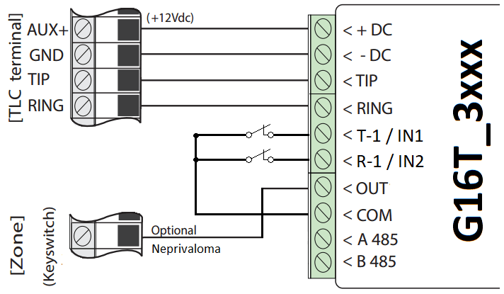
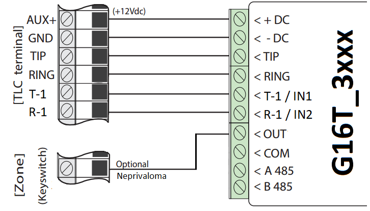

# GSM komunikatorius G16T

  

## Aprašymas 

Mobilaus ryšio komunikatorius G16T gali būti prijungtas prie bet kurios apsaugos centralės, kuri turi telefoninį komunikatorių ir palaiko siuntimą Contact ID protokolu DTMF tonais.

Komunikatorius gali perduoti pilną įvykių informaciją į saugos tarnybos stebėjimo pulto imtuvą.

Komunikatorius veikia su Protegus programėle. Su Protegus vartotojai gali valdyti savo apsaugos sistemą nuotoliniu būdu ir gauti pranešimus apie įvykius. Protegus programėlė veikia su visomis kitų gamintojų apsaugos sistemomis, prie kurių prijungtas komunikatorius. Komunikatorius gali siųsti pranešimus į saugos tarnybos pultą ir veikti su Protegus programėle vienu metu.

GSM komunikatorius G16T sertifikuotas aukščiausia Grade 4 EN50131 saugumo klase.

**Savybės**

Jungiamas prie centralės telefoninio komunikatoriaus:

- Jungiamas su apsaugos centralės telefoniniu komunikatoriumi 2 arba 4 laidais.

- Sujungus 4 laidais, bus stebima telefono linija tarp centralės ir komunikatoriaus.

Siunčia įvykius į stebėjimo pulto imtuvą:

- Siunčia įvykius į TRIKDIS programinius arba aparatūrinius imtuvus, kurie dirba su bet kuria stebėjimo programa.

- Gali siųsti įvykius į SIA DC-09 imtuvus.

- Gali siųsti įvykius į SUR-GARD imtuvus. Priede yra kodų (Contact ID į SIA) keitimo lentelė.

- Ryšio stebėjimas siunčiant PING užklausą į IP imtuvą kas 30 sekundžių (arba kitu nustatytu periodu).

- Atsarginis kanalas, kuris bus naudojamas nutrūkus ryšiui pirminiu kanalu.

- Pranešimų į pultą perdavimas SMS žinutėmis. SMS žinutės bus išsiųstos net ir tada, kai sutrinka IP ryšys mobiliojo ryšio operatoriaus tinkle.

- Įgalinus lygiagrečius ryšio kanalus, įvykiai bus siunčiami į du imtuvus vienu metu.

- Kai įjungta *Protegus* paslauga, įvykiai visų pirma siunčiami į CSP ir tik po to - programėlės naudotojams.

**Veikia su Protegus programėle:**

- „*Push*” ir specialūs garso įspėjimai apie įvykius.

- Nuotolinis sistemos įjungimas/išjungimas.

- Nuotolinis prijungtų įrenginių valdymas (šviesų, vartų, kondicionieriaus, šildymo, pievutės laistymo ir kt.).

- Temperatūros stebėsena (su išplėtėju iO arba iO-WL).

- Skirtingos vartotojų teisės administratoriui, instaliuotojui ir vartotojui.

**Informuoja vartotojus:**

- Vartotojus galima informuoti apie įvykius ne tik su Protegus programėle, bet ir su SMS žinutėmis bei skambučiu.

**Valdomi išėjimai ir įėjimai:**

- 1 išėjimas, valdomas su:

  - Protegus programėle.

  - SMS.

- 2 pasirenkamo tipo įėjimai, tipai: NC; NO; NC/EOL; NO/EOL; NC/DEOL; NO/DEOL.

- Pridėkite papildomų įėjimų ir valdomų išėjimų su laidiniais ir belaidžiais iO plėtikliais.

**Greitai sukonfigūruojamas:**

- Nustatymai gali būti išsaugoti į failą ir greitai įrašyti į kitus komunikatorius.

- Du prieigos prie nustatymų lygiai: instaliuotojui ir CSP administratoriui.

- Nuotolinis konfigūravimas ir programinės įrangos atnaujinimas.

### Komunikatoriaus modelių tipai 

Ši instrukcija skirta šiems komunikatoriaus modeliams:

- G16T_321x – 3 versija, 1 SIM, 2G modemas.

- G16T_331x – 3 versija, 1 SIM, 3G modemas.

- G16T_341x – 3 versija, 1 SIM, 4G modemas.

- G16T_3M1x – 3 versija, 1 SIM, LTE CatM1 & EGPRS modemas.

### Techniniai parametrai 

| Parametras | Aprašymas |
|----|----|
| Prijungimas prie centralės | Per telefoninį komunikatorių (TIP RING kontaktai) |
| Įėjimai | 2, pasirenkamo tipo: NC;​ NO;​ NC/​EOL;​ NO/​EOL;​ NC/​DEOL;​ NO/​DEOL /​ Galima praplėsti su iO serijos plėtikliais |
| Išėjimas | 1, OC tipas, iki 0,15 A nuolatinės srovės, 30 V maks. /​ Galima praplėsti su iO serijos plėtikliais |
| 2G modemo dažniai | 850 /​ 900 /​ 1800 /​ 1900 MHz |
| 3G modemo dažniai | 800 /​ 850 /​ 900 /​ 1900 /​ 2100 MHz |
| 4G modemo dažniai | Priklausomai nuo regiono |
| Maitinimo įtampa | 10-18 V nuolatinės srovės |
| Naudojama srovė | 60-100 mA (budėjimo režime) /​ Iki 250 mA (duomenų siuntimo metu) |
| Perdavimo protokolai | TRK, DC-09_2007, DC-09_2012, TL150 |
| Pranešimo šifravimas | AES 128 |
| Veikimo konfigūravimas | Su kompiuterio programa TrikdisConfig nuotoliniu būdu arba lokaliai per USB Mini-B. /​ Nuotoliniu būdu SMS žinutėmis. |
| Atmintis | Iki 60 pranešimų |
| Darbo aplinkos sąlygos | Temperatūra nuo -10 °C iki +50 °C, santykinė drėgmė – iki 80%, prie +20 °C. |
| Komunikatoriaus matmenys | 92 x 62 x 26 mm |
| Svoris | 80 g |

### Komunikatoriaus elementai 

1.  GSM antena SMA jungtis.

2.  Šviesos indikatoriai.

3.  Priekinio dangtelio atidarymo plyšys.

4.  Gnybtai laidų prijungimui.

5.  USB Mini-B jungtis komunikatoriui programuoti.

6.  SIM kortelės laikiklis.

### Išorinių kontaktų paskirtis 

| Gnybtas | Aprašymas |
|----|----|
| +DC | maitinimo gnybtas (10-18 V nuolatinės srovės teigiamas gnybtas) |
| -DC | maitinimo gnybtas (10-18 V nuolatinės srovės neigiamas gnybtas) |
| TIP | Gnybtas sujungiamas su apsaugos centralės TIP gnybtu |
| RING | Gnybtas sujungiamas su apsaugos centralės RING gnybtu |
| T-1 /​ IN1 | Gnybtas telefono linijos stebėjimui arba įėjimo gnybtas, pasirenkamo tipo NC;​ NO;​ NC/​EOL;​ NO/​EOL;​ NC/​DEOL;​ NO/​DEOL |
| R-1 /​ IN2 | Gnybtas telefono linijos stebėjimui arba įėjimo gnybtas, pasirenkamo tipo NC;​ NO;​ NC/​EOL;​ NO/​EOL;​ NC/​DEOL;​ NO/​DEOL |
| OUT | Išėjimo gnybtas (OC tipo), srovė iki 0,15 A |
| COM | Bendrasis gnybtas (neigiamas) |
| A 485 | *RS485* magistralės A kontaktas |
| B 485 | *RS485* magistralės B kontaktas |

### Šviesinė veikimo indikacija 

| Indikatorius | Būklė | Aprašymas | NETWORK (Tinklas) | Nešviečia Geltonas mirksi Šviečia žalia ir mirksi geltona | Nėra ryšio su GSM tinklu. Jungiasi prie GSM tinklo. Komunikatorius prisijungė prie GSM tinklo. Pakankamas GSM signalo stiprumas 2G ryšiui yra 5 lygis (penki geltoni sumirksėjimai), o 3G, 4G ryšiui – 3 lygis (trys geltoni sumirksėjimai). | DATA (Duomenys) | Nešviečia Šviečia žaliai Mirksi žaliai | Nėra neišsiųstų įvykių pranešimų. Yra neišsiųstų pranešimų. (konfigūravimo režimas) duomenys perkeliami į komunikatorių arba iš jo. | POWER (Maitinimas) | Nešviečia Šviečia žalia Šviečia geltona Šviečia žalia ir mirksi geltona Šviečia geltona | Nėra maitinimo . Maitinimo įtampa yra pakankama. Maitinimo įtampa yra nepakankama (≤11.5 V). (konfigūravimo režimas) komunikatorius parengtas konfigūravimui. (konfigūravimo režimas) nėra ryšio su kompiuteriu. | TROUBLE (Nesklandumas) | Nešviečia 1 raudonas mirksnis 2 raudoni mirksniai 3 raudoni mirksniai 4 raudoni mirksniai 5 raudoni mirksniai 6 raudoni mirksniai 7 raudoni mirksniai Mirksi raudona Šviečia raudona | Komunikatorius veikia gerai, be nesklandumų. SIM kortelė neaptikta. Problemos su SIM kortelės PIN kodu (neteisingas PIN kodas). Programavimo problemos (nėra APN). Prisijungimo prie GSM tinklo problemos. Prisijungimo prie mobiliojo duomenų tinklo problemos. Nėra ryšio su imtuvu. Dingo ryšys su centrale. (konfigūravimo režimas) atminties klaida. (konfigūravimo režimas) programinės įrangos klaida. |
|--------------|-------|-----------|-------------------|-----------------------------------------------------------------|----------------------------------------------------------------------------------------------------------------------------------------------------------------------------------------------------------------------------------------------------|-----------------|----------------------------------------------|-------------------------------------------------------------------------------------------------------------------------------------------|--------------------|-----------------------------------------------------------------------------------------------------|------------------------------------------------------------------------------------------------------------------------------------------------------------------------------------------------------------------------------|------------------------|-----------------------------------------------------------------------------------------------------------------------------------------------------------------------------------------------------------------|------------------------------------------------------------------------------------------------------------------------------------------------------------------------------------------------------------------------------------------------------------------------------------------------------------------------------------------------------------------------------------------------------------------------------------------|

### Komunikatoriaus G16T panaudojimo struktūrinė schema 

!!! note
    Prieš pradėdami, įsitikinkite, kad turite:
    
    1.  USB Mini-B tipo kabelį, reikalingas konfigūravimui.
    
    2.  Mažiausiai 4 gyslų kabelį komunikatoriaus prijungimui prie apsaugos
        centralės.
    
    3.  Plokščią 2,5 mm atsuktuvą.
    
    4.  Išorinę GSM anteną, jeigu vietoje silpnas ryšys.
    
    5.  Aktyvuotą nano-SIM kortelę (PIN kodo reikalavimas gali būti
        išjungtas).
    
    6.  Apsaugos centralės instrukcija, prie kurios bus jungiamas
        komunikatorius.
    
    Reikalingas medžiagas galite užsisakyti iš vietinio platintojo.
## Greitas konfigūravimas su programa *TrikdisConfig* 

1.  Parsisiųskite konfigūravimo programą TrikdisConfig iš [www.trikdis.lt](http://www.trikdis.lt) (programą rasite paieškos lauke surinkę „TrikdisConfig“), ir ją įdiekite.

2.  Plokščiu atsuktuvu nuimkite G16T dangtelį, kaip parodyta žemiau:

1.  Su USB Mini-B kabeliu sujunkite G16T su kompiuteriu.

2.  Paleiskite TrikdisConfig. Programa automatiškai atpažins prijungtą gaminį ir atidarys G16T konfigūravimo langą.

3.  Spustelkite programos mygtuką **Skaityti [F4]**, kad ji pateiktų esamas G16T veikimo parametrų reikšmes. Jei atsivers administratoriaus arba instaliatoriaus kodo įvedimo reikalavimo langelis, įveskite 6 skaitmenų kodą.

Žemiau aprašome nustatymus, kuriuos reikia pakeisti, kad komunikatorius pradėtų siųsti pranešimus į stebėjimo pultą ir kad apsaugos centralę būtų galima valdyti su Protegus programėle.

### Nustatymai ryšiui su Protegus programėle 

**Lango „Pranešimai vartotojui“ kortelėje „Protegus servisas“:**

1.  Pažymėkite varnele **Leisti prisijungti** prie **Protegus serviso**.

2.  Galite pakeisti prisijungimo prie **Protegus Cloud slaptažodį**, jeigu norite, kad vartotojų prašytų jį suvesti pridedant sistemą Protegus programėlėje (gamyklinis – 123456).

**Lange „SIM kortelė“:**

3. Įveskite **SIM kortelės PIN kodą**.

2.  Pakeiskite **APN** vardą. **APN** rasite SIM operatoriaus interneto puslapyje. „Internet“ yra universalus ir veikia daugelio operatorių tinkluose.

Baigę konfigūravimą paspauskite mygtuką **Įrašyti [F5]** ir atjunkite USB kabelį.

!!! note
    Plačiau apie kitus G16T nustatymus TrikdisConfig žr. skyrių
    **6 „TrikdisConfig langų aprašymas"**.
!!! note
    Nepamirškite įjungti centralės telefoninio komunikatoriaus ir jį
    tinkamai nustatyti, kad centralė siųstų įvykius. Apsaugos centralės
    konfigūravimas aprašytas skyriuje **4 „Apsaugos centralės
    programavimas".**
### Nustatymai ryšiui su Stebėjimo pultu 

**Lange „Sistemos parinktis“:**

1.  Įrašykite **Objekto numerį (Nenaudokite FFFE, FFFF objekto numerių**.**)**.

Lange „Pranešimai į CSP“, parinkčių grupėje „Pirminis ryšio kanalas“:

2. **Ryšio būdas** – pasirinkite **IP** ryšio būdą (Nerekomenduojame naudoti SMS kaip pirminio kanalo).

2.  **Protokolas** – pasirinkite, kuria koduote turėtų būti siunčiami pranešimai: **TRK** (į TRIKDIS imtuvus), **DC-09_2007** arba **DC-09_2012** (į universalius imtuvus), **TL150** (į SUR-GARD imtuvus).

3.  **TRK šifravimo raktas** – įrašykite šifravimo raktą, kuris yra nustatytas imtuve.

4.  **Domenas arba IP** – įrašykite imtuvo domeno arba IP adresą.

5.  **Prievadas** – įrašykite imtuvo prievado (*angl. port*) numerį tinkle.

6.  **TCP arba UDP** – pasirinkite, kuriuo protokolu (TCP arba UDP) turėtų būti siunčiami pranešimai.

!!! note
    Jei norite nustatyti ryšį su pultu **SMS** žinutėmis, reikės nustatyti
    tik **šifravimo raktą** ir **telefono numerį**. SMS pranešimus gali
    priimti tik TRIKDIS stebėjimo pulto IP/SMS imtuvas RL14, daugiakanalis
    imtuvas RM14 ir SMS imtuvas GM14. / Jei pasirinkote **DC-09** pranešimų
    perdavimo koduotę, papildomai **Siuntimas į CSP** lange, skirtuke
    **Parametrai**, įveskite objekto, linijos ir imtuvo numerius.
7. (Rekomenduojama) Sukonfigūruokite **Atsarginio kanalo režimo** nustatymus.

2.  (Rekomenduojama) Įveskite **Atsarginio SMS kanalo** telefono numerį.

**Lange „SIM kortelė“:**

10. Įveskite **SIM kortelės PIN** kodą.

11. Pakeiskite **APN** vardą. Jį rasite SIM operatoriaus interneto puslapyje „Internet” yra universalus ir veikia daugelio operatorių tinkluose.

Baigę konfigūravimą paspauskite mygtuką **Įrašyti [F5]** ir atjunkite USB kabelį.

!!! note
    Plačiau apie kitus G16T nustatymus TrikdisConfig žr. skyrių
    6 „TrikdisConfig langų aprašymas".
!!! note
    Nepamirškite įjungti centralės telefoninio komunikatoriaus ir jį
    tinkamai nustatyti, kad centralė siųstų įvykius. Kaip tai atlikti
    aprašyta skyriuje **4 „Apsaugos centralės programavimas"**.
## Sujungimų schemos, įrengimas ir paleidimas veikti 

### Tvirtinimas 

1.  Nuimkite viršutinį dangtelį, ištraukite kontaktinių kaladėlių kištukinę dalį.

2.  Įstatykite nano-SIM kortelę.

3.  Išimkite plokštę iš korpuso pagrindo.

4.  Korpuso pagrindą savisriegiais pritvirtinkite pageidaujamoje vietoje.

5.  Įstatykite plokštę į korpuso pagrindą ir įstatykite kontaktines kaladėles.

6.  Prisukite GSM anteną.

7.  Uždarykite viršutinį dangtį.

!!! note
    Įsitikinkite, kad SIM kortelė yra aktyvuota. / Įsitikinkite, kad įjungta
    mobilaus interneto paslauga, jei bus naudojama Protegus programėlė
    arba ryšys su pultu IP kanalu. / Jei norite išvengti PIN kodo įvedimo
    TrikdisConfig, įdėkite SIM kortelę į telefoną ir išjunkite PIN
    kodo užklausos funkciją.
### Apsaugos centralės prijungimo schema su komunikatoriumi 

Sujunkite komunikatorių su centrale pagal vieną iš žemiau pateiktų prijungimo schemų.

### G16T prijungimo schema prie centralės jungiklio (angl. keyswitch) zonos 

Vadovaukitės šiomis schemomis, jei apsaugos centralė bus valdoma su G16T PGM išėjimu įjungiant/išjungiant centralės jungiklio (angl. keyswitch) zoną.

!!! note
    G16T komunikatorius turi vieną programuojamą išėjimą OUT (PGM),
    kuris gali valdyti viena apsaugos sistemos sritį. TrikdisConfig
    lange "**Sistemos parinktys**" **Išėjimo OUT1 valdymas** turi būti
    nustatyta **Nuotolinis valdymas** (numatytas nustatymas).
### Įėjimų prijungimo schemos 

Komunikatorius turi 2 įėjimo gnybtus (IN1, IN2) prijungti NO, NC, NO/EOL, C/EOL, NO/DEOL, NC/DEOL tipo grandinėms. Gamyklinis įėjimų nustatymas – stebėti NO tipo grandinę. Kitą įėjimo grandinės tipą galima nustatyti TrikdisConfig lange „**Sistemos parinktys“ → Įėjimų IN1 ir IN2 tipai**.

NO, NC, NO/EOL, C/EOL, NO/DEOL, NC/DEOL tipo grandinių laidinių sujungimų schemos:

!!! note
    Jei reikia, kad komunikatorius turėtų daugiau įėjimų IN arba išėjimų
    OUT, arba turėtų magistralę temperatūros jutikliui, prijunkite laidinį
    arba belaidį TRIKDIS iO serijos įėjimų ir išėjimų plėtiklį.
### Relės prijungimo schema 

Nuotoliniu būdu su relės kontaktais galima valdyti (įjungti/išjungti) įvairius elektrinius prietaisus.

### iO serijos plėtimo modulių prijungimo schemos 

Jei reikia, kad komunikatorius turėtų daugiau įėjimų IN arba išėjimų OUT, arba turėtų magistralę temperatūros jutikliui, prijunkite laidinį arba belaidį TRIKDIS iO serijos įėjimų ir išėjimų plėtiklį. G16T konfigūravimas su plėtimo moduliais aprašytas p. 6.6. „Langas „RS485 moduliai“.

### WiFi modulio W485 prijungimo schema 

Modulis *W485* skirtas įvykių siuntimui ir valdymui naudojant WiFi interneto ryšį. Naudojant *W485* kartu su *G16T* pranešimai į CSP ir į *Protegus* siunčiami WiFi interneto tinklu ir mobilus internetas nenaudojamas. Jei sutrinka WiFi ryšys duomenys perduodami per mobilųjį internetą. Atsistačius WiFi ryšiui, *G16T* pradeda toliau siusti pranešimus per *W485*. / *G16T* konfigūravimas su WiFi moduliu *W485* aprašytas p. 6.6. „Langas „RS485 moduliai“. / Komunikatoriuje *G16T* turi būti įstatyta SIM kortelė, kad veiktu *W485.*

### „Ethernet“ modulio E485 prijungimo schema 

Modulis *E485* skirtas įvykių siuntimui ir valdymui naudojant laidinį interneto ryšį. Naudojant *E485* kartu su *G16T* pranešimai į CSP ir į *Protegus* siunčiami laidiniais interneto tinklais ir mobilusis internetas nenaudojamas. Jei sutrinka laidinis interneto tinklas duomenys į CSP perduodami per mobilųjį internetą. Atsistačius laidinio interneto tinklui, *G16T* pradeda toliau siusti pranešimus per *E485*. / *G16T* konfigūravimas su „Ethernet“ moduliu *E485* aprašytas p. 6.6. „Langas „RS485 moduliai“. / Komunikatoriuje *G16* turi būti įstatyta SIM kortelė, kad veiktu *E485.*

### Komunikatoriaus paleidimas veikti 

Norint paleisti veikti komunikatorių, reikia įjungti apsaugos centralės maitinimą. Turi užsidegti ši G16T komunikatoriaus šviesinė indikacija:

- Diodas „POWER“ turi šviesti žaliai (pakankama maitinimo įtampa);

- Diodas „NETWORK“ turi šviesti žaliai ir mirksėti geltonai, kai prisiregistravęs prie tinklo.

!!! note
    Pakankamas GSM signalo lygis -- 5 (5 „NETWORK" diodo geltoni mirksniai).
    Pakankamas 3G/4G signalo lygis - 3 (3 „NETWORK" diodo geltoni
    mirksniai). / Jeigu suskaičiuojate mažiau geltonų „NETWORK" diodo
    mirksnių, tai GSM signalo lygis nepakankamas. Rekomenduojame arba
    pasirinkti kitą komunikatoriaus įrengimo vietą, arba naudoti jautresnę
    GSM anteną. / Jei šviesinė indikacija kitokia, kad nustatytumėte, kas
    nutikę, žiūrėkite skyrių **1.5 „Šviesinė veikimo indikacija".** / Jei
    G16T indikacija visai nešviečia, patikrinkite maitinimo šaltinį ir
    sujungimus.
## Apsaugos centralės programavimas 

Kad apsaugos centralė siųstų įvykius per telefoninį komunikatorių, jis turi būti įjungtas ir tinkamai sukonfigūruotas. Vadovaudamiesi tam tikros apsaugos centralės programavimo vadovu, nustatykite centralės telefoninį komunikatorių:

1.  Įjunkite centralės PSTN telefoninį komunikatorių.

2.  Įveskite pulto imtuvo telefono numerį (galite naudoti bet kokį ne trumpesnį nei 2 skaitmenų skaičių. G16T atsilieps centralei skambinant bet kuriuo numeriu).

3.  Pasirinkite DTMF režimą.

4.  Pasirinkite Contact ID ryšio formatą.

5.  Įveskite centralės 4 skaitmenų objekto numerį.

Nustatykite centralės zonos, prie kurios prijungtas G16T išėjimas OUT, tipą į jungiklio (angl. keyswitch) zoną apsaugos centralei įjungti/išjungti nuotoliniu būdu.

!!! note
    Jungiklio zonos tipas gali būti impulsas arba lygis. G16T valdomas
    išėjimas OUT numatytai veiks 3 sekundžių impulsiniu režimu. Galite
    pakeisti impulso trukmę arba pakeisti išėjimo režimą į lygis
    Protegus nustatymuose. Žr. skyrių **5.2 „Papildomi nustatymai
    PGM-ui, prijungtam prie apsaugos sistemos jungiklio zonos".**
### Honeywell Vista centralės telefoninio komunikatoriaus programavimas 

Naudodami centralės klaviatūrą, eikite į nurodytas sekcijas ir nustatykite jas taip, kaip nurodyta:

- \*41 - įveskite pulto imtuvo telefono numerį;

- \*43 - įveskite centralės objekto numerį;

- \*47 - nustatykite Toninį rinkimą į [1] ir įveskite numerio rinkimo bandymų kartų skaičių;

- \*48 – Contact ID. Naudojamas numatytasis nustatymas, \*48 turi būti nustatyta 7;

- \*49 - Split / Dual pranešimas. \*49, turi būti nustatyta 5;

- \*50 – Pranešimo apie įsilaužimą siuntimo delsa (neprivaloma). Numatytoji reikšmė yra [2,0], dėl kurios 30 sekundžių bus uždelstas pranešimo apie įvykį siuntimas. Jei norite, kad pranešimas apie įvykį būtų išsiųstas nedelsiant, nustatykite [0,0].

**Išeiti iš programavimo režimo**.

Kai visi reikalingi nustatymai padaryti būtina išeiti iš programavimo režimo. Klaviatūroje surinkite \*99.

### "Honeywell Vista 48" centralės specialieji nustatymai 

Jei norite naudoti G16T su "**Honeywell Vista 48**" centrale, atlikite toliau nurodytus nustatymus, kaip nurodyta lentelėje:

| Skyrius | Duomenys                         | Skyrius | Duomenys | Skyrius | Duomenys |
|:-------:|----------------------------------|:-------:|:--------:|:-------:|:--------:|
|  \*41   | 1111 (imtuvo telefono numeris)   |  \*60   |    1     |  \*69   |    1     |
|  \*42   | 1111                             |  \*61   |    1     |  \*70   |    1     |
|  \*43   | 1234 (centralės objekto numeris) |  \*62   |    1     |  \*71   |    1     |
|  \*44   | 1234                             |  \*63   |    1     |  \*72   |    1     |
|  \*45   | 1111                             |  \*64   |    1     |  \*73   |    1     |
|  \*47   | 1                                |  \*65   |    1     |  \*74   |    1     |
|  \*48   | 7                                |  \*66   |    1     |  \*75   |    1     |
|  \*50   | 1                                |  \*67   |    1     |  \*76   |    1     |
|  \*59   | 0                                |  \*68   |    1     |         |          |

Kai visi reikalingi nustatymai padaryti, būtina išeiti iš programavimo režimo. Klaviatūroje surinkite \*99.

## Nuotolinis valdymas 

### Apsaugos sistemos pridėjimas *Protegus* programėlėje 

Su Protegus vartotojai galės valdyti savo apsaugos sistemą nuotoliniu būdu. Jie taip pat matys sistemos būseną ir gaus pranešimus apie sistemos įvykius.

1.  Parsisiųskite ir paleiskite Protegus programėlę arba naudokite versiją naršyklėje <u>www.protegus.app.</u>

    

      
      
      
    

2.  Registruokitės ir susikurkite naują paskyrą arba prisijunkite savo vartotojo vardu ir slaptažodžiu.

!!! note
    Pridėjimo prie Protegus metu G16T turi būti:
    
    1.  Įstatyta aktyvuota SIM kortelė ir įvestas arba išjungtas PIN kodas;
    
    2.  Įjungta Protegus servisas paslauga. Žr. **6.4 Langas
        "Pranešimai vartotojui"**.
    
    3.  Įjungtas maitinimas („POWER" LED mirksi žaliai);
    
    4.  Prisiregistravęs prie tinklo („NETWORK" LED šviečia žaliai ir mirksi
        geltonai).
3. Paspauskite **Pridėti sistemą** ir įveskite G16T IMEI/Unikalus ID numerį. Jį rasite ant gaminio arba pakuotės lipduko. Įvedę, paspauskite „**Toliau**“.

    

### Papildomi nustatymai sistemos įjungimui/išjungimui su jungiklio zoną 

!!! note
    Centralės zonai, prie kurios prijungtas G16T išėjimas OUT, turi
    būti nustatytas zonos tipas - jungiklis (angl. keyswitch).
Sekite nurodymus žemiau, jei apsaugos centralė bus valdoma su G16T PGM išėjimu įjungiant/išjungiant centralės jungiklio (angl. keyswitch) zoną:

1.  Naujame lange šoniniame meniu spustelėkite „**Sritys**“. Atsidariusiame lange nurodykite, kiek signalizacijos sričių yra sistemoje ir paspauskite „**Toliau**“.

    

2.  Naujame lange nurodykite, koks yra kiekvienos iš nurodytų sričių numeris apsaugos sistemoje, ir spustelėkite „**Išsaugoti**“.

    

3.  Šoniniame meniu paspauskite „Nustatymai“ ir atsidariusiame lange paspauskite „Nustatymai“. Pažymėkite varnele „**Naudoti PGM sistemos Įjungimui/išjungimui**“ ir nurodykite, kurią sritį valdys išėjimas. Vienas G16T OUT išėjimas gali būti skirtas tik vienai sričiai valdyti.

4. Pasirinkite **Lygis** arba **Impulsas**, priklausomai nuo to, koks centralės jungiklio zonos (angl. keyswitch) tipas. Taip pat galite pakeisti impulso intervalo trukmę, jei tai reikalinga prijungiamai centralei.

2.  Papildomam saugumui, galite pasirinkti „**Naudoti programėlės slaptažodį įjungimui/išjungimui**”. Tuomet paspaudus mygtuką įjungti/išjungti apsaugos sistemą, atsivers programėlės slaptažodžio įvedimo užklausos langas.

### Sistemos įjungimas/išjungimas su Protegus 

1.  Kad suvaldytumėte sistemą, eikite į Protegus langą „**Sritys**“.

2.  „**Sritys**“ lange paspauskite ant srities mygtuko. Atsivėrusiame lange pasirinkite veiksmą (įjungti arba išjungti apsaugos sistemos sritį).

3.  Paprašius, įveskite vartotojo kodą arba Protegus slaptažodį.

### Konfigūravimas ir valdymas SMS žinutėmis 

Komunikatorių nuotoliniu būdu galima valdyti ir konfigūruoti SMS pranešimais.

SMS pranešimo struktūra: Slaptažodis `[tarpas]` Komanda `[tarpas]` Duomenys

Kaip slaptažodį naudokite **Administratoriaus kodą** (gali įvykdyti *INFO, RESET, OUTPUT1, CONNECT* komandas) arba **Instaliatoriaus kodą (**gali įvykdyti *INFO, RESET, OUTPUT1* komandas**)**.

#### SMS komandų sąrašas

| Komanda | Duomenys | Aprašymas |
|---------|----------|-----------|
| INFO |  | Informacijos apie įrenginį užklausa. Į atsakymą bus įtraukti: įrenginio tipas, IMEI numeris, serijos numeris ir programinės įrangos versija. Pvz.: 123456 INFO |
| RESET |  | Prietaiso paleidimas veikti iš naujo. Pvz.: 123456 RESET |
| OUTPUT1 | ON | Įjungti išėjimą OUTPUT1. Pvz.: 123456 OUTPUT1 ON |
| OUTPUT1 | OFF | Išjungti išėjimą OUTPUT1. Pvz.: 123456 OUTPUT1 OFF |
| OUTPUT1 | PULSE=tttt | Įjungti išėjimą OUTPUT1 tam tikram laikui. “tttt” yra impulso trukmė sekundėmis, nurodoma keturiais skaitmenimis. Pvz.: 123456 OUTPUT1 PULSE=0002 |
| CONNECT | Protegus=ON | Įjungti prieigą prie Protegus paslaugos. Pvz.: 123456 CONNECT PROTEGUS=ON |
| CONNECT | Protegus=OFF | Išjunti prieigą prie Protegus paslaugos. Pvz.: 123456 CONNECT PROTEGUS=OFF |
| CONNECT | IP=0.0.0.0:8000 | Nustatyti pirminio ryšio kanalo IP adresą ir Prievado numerį. / Pvz. 123456 CONNECT IP=192.120.120.255:8000 |
| CONNECT | ENC=123456 | Nustatyti TRK šifravimo raktą. Pvz.: 123456 CONNECT ENC=123456 |
| CONNECT | APN=Internet | Nustatyti APN vardą. Pvz.: 123456 CONNECT APN=INTERNET |
| CONNECT | USER=user | Nustatyti APN naudotoją. Pvz.: 123456 CONNECT USER=User |
| CONNECT | PASS=password | Nustatyti APN slaptažodį. Pvz.: 123456 CONNECT PASS=Password |
| CONNECT | CP= | įjungti/išjungti telefoninės linijos „DTMF“ sąsają (1- Išjungti ; 2 - Įjungti). / Pvz. 123456 CONNECT CP=2 |

Galite apriboti, iš kurių telefono numerių siunčiamas komandas įrenginys priims ir vykdys. Kaip tai atlikti aprašyta skyriuje 6.4 „Langas „Pranešimai vartotojui““, skirtuke “Valdymas SMS žinutėmis”.

## TrikdisConfig langų aprašymas 

### *TrikdisConfig* būsenos juostos aprašymas 

Prijungus G16T TrikdisConfig būsenų juostoje pateiks informaciją apie prijungtą gaminį:

| Pavadinimas | Aprašymas |
|----|----|
| IMEI/​Unikalus ID | Gaminio IMEI numeris |
| Būsena | Darbinė būsena |
| Įrenginys | Gaminio tipas (turi rodyti G16T) |
| SN | Gaminio serijinis numeris |
| BL | Paleidyklės versija |
| FW | Gaminio programinės įrangos versija |
| HW | Gaminio aparatinės įrangos versija |
| Būsena | Sujungimo su programa būdas (per USB arba nuotolinis) |
| Administratorius | Prieigos lygis (rodomas po to, kai patvirtintas prieigos kodas) |

Paspaudus mygtuką **Skaityti [F4]**, programa nuskaitys ir parodys nustatymus, kurie yra įrašyti G16T. Su TrikdisConfig, nustatykite reikiamus nustatymus pagal žemiau pateiktus programos langų aprašymus.

### Langas „Sistemos parinktys“ 

**Parinkčių grupė „Pagrindinės“**

- **Objekto numeris** – jei pranešimai bus siunčiami į CSP (centralizuoto stebėjimo pultą), įrašykite CSP suteiktą objekto numerį (4 simbolių šešioliktainis numeris, 0-9, A-F. **Nenaudokite FFFE, FFFF objekto numerių**.).

- **Naudoti centralės obj. Nr.** – jei langelis pažymėtas varnele, tai komunikatorius siųs su pranešimais ne „**Objekto numeris**“ laukelyje nustatyta reikšmę, o centralėje įvestą objekto numerį.

- **Laukti patvirtinimo iš CSP** – jei langelis pažymėtas varnele, tai po kiekvieno įvykio pranešimo išsiuntimo komunikatorius lauks patvirtinimo iš IP imtuvo, kad jis pranešimą sėkmingai priėmė. Jei komunikatorius negaus patvirtinimo signalo, jis neformuos ryšio pabaigos (kiss-off) signalo. Nesulaukęs ryšio pabaigos signalo, centralės telefoninis komunikatorius pakartotinai transliuos įvykio pranešimą.

- **Centralės modelis** – įjungti/išjungti komunikatoriaus telefoninės linijos „DTMF“ sąsają.

- **Dial tone dažnis** – dažnis, kuriuo G16T palaiko ryšį su centralės per telefoniniu komunikatoriumi.

- **Linijos kontrolė** – pažymėjus šį lauką, bus atliekama telefoninės linijos tarp komunikatoriaus ir centralės kontrolė. Kontrolė veiks, kai centralės telefoninis komunikatorius su G16T sujungtas 4 laidais (žr. 3.2 „Apsaugos centralės prijungimo schema su komunikatoriumi“.).

- **Įėjimų IN1 ir IN2 tipas** – parinkite įėjimo tipą iš sąrašo (NO, NC, NO/EOL, C/EOL, NO/DEOL, NC/DEOL).

- **Išėjimo OUT1 režimas** – parinkite išėjimo veikimo funkciją iš sąrašo.

- **Laiko nustatymas** – pasirinkite, kurį serverį naudoti laiko sinchronizacijai.

**Parinkčių grupė „Prisijungimas“**

- **Administratoriaus kodas** – leidžia prieiti prie visų konfigūravimo funkcijų (gamyklinis kodas – 123456).

- **Instaliatoriaus kodas** – leidžia ribotai keisti komunikatoriaus konfigūraciją. (gamyklinis kodas - 654321).

- **„Atkurti“ gali tik administratorius** – uždėjus varnelę, gaminiui atkurti gamyklinius parametrus bus leidžiama tik įvedus administratoriaus kodą.

  **Pastaba**: jei laukelis **„Atkurti“ gali tik administratorius** pažymėtas, o administratoriaus kodo nežinote, gamyklinius parametrus galės atkurti tik gamintojas – UAB „Trikdis“. Paslauga mokama.

- **Instaliuotojui leisti keisti** – administratorius gali nustatyti, kuriuos parametrus galės keisti instaliuotojas.

### Langas „Pranešimai į CSP“ 

**Skirtukas „CSP nustatymai“**

Komunikatorius siunčia pranešimus į stebėjimo pultą per mobilųjį internetą (IP) arba SMS pranešimais.

Pranešimai gali būti siunčiami keliais ryšio kanalais. Pirmas ir antras ryšio kanalai gali veikti lygiagrečiai, taip komunikatorius gali siųsti įvykius tuo pačiu metu į du imtuvus. Tiek pirmam, tiek ir antram kanalui galima priskirti atsarginį ryšio kanalą, kuris bus naudojamas nutrūkus ryšiui pirminiu kanalu.

Pranešimai į stebėjimo pultą perduodami užkoduoti ir apsaugoti slaptažodžiu. Pranešimams priimti ir perduoti į stebėjimo programą reikalingas TRIKDIS imtuvas:

- IP pranešimams – priėmimo programa IPcom Windows/Linux, aparatinis IP/SMS imtuvas RL14 arba daugiakanalis imtuvas RM14.

- SMS pranešimams – aparatinis IP/SMS imtuvas RL14, daugiakanalis imtuvas RM14 arba SMS imtuvas GM14.

Ryšys su SMS pranešimais yra ypatingai naudingas kaip atsarginis kanalas, nes veikia, kai sutrinka mobiliojo interneto ryšys operatoriaus tinkle. Nerekomenduojame naudoti SMS kaip pirminio kanalo.

**Parinkčių grupė „Pirminis ryšio kanalas“**

- **Ryšio būdas** – pasirinkite ryšio su stebėjimo pulto imtuvu būdą (IP, SMS).

- **Protokolas** – **TRK** protokolu perduodamus įvykių pranešimus priims Trikdžio IP imtuvai; o **SIA DC-09** protokolais – IP imtuvai, gebantys priimti SIA DC-09 protokolais perduodamus įvykių pranešimus; **TL150** protokolu perduodamus įvykių pranešimus priims SUR-GARD IP imtuvai.

- **TRK šifravimo raktas** – 6 skaitmenų pranešimų šifravimo raktas. Į komunikatorių įrašytas šifravimo raktas turi būti toks, koks įrašytas į imtuvą, t.y. turi sutapti, būti vienodas.

- **Domenas arba IP** – įrašykite imtuvo domeno arba IP adresą.

- **Prievadas** – įrašykite imtuvo prievado (*angl. port*) numerį tinkle.

- **TCP ar UDP** – pasirinkite įvykių perdavimo protokolą (TCP arba UDP).

- **Telefono numeris** (tik SMS pranešimams) – įrašykite TRIKDIS SMS imtuvo telefono numerį. Telefono numeris turi būti su šalies kodu (pvz., 370xxxxxxxx).

#### Parinkčių grupė „Lygiagretusis ryšio kanalas”

Šio kanalu pranešimai perduodami lygiagrečiai su pirmu kanalu. Įgalinus antrą kanalą pranešimai gali būti siunčiami vienu metu į du imtuvus (pvz., į lokalų ir į centralizuotą stebėjimo pultus). Lygiagretaus ryšio kanalo nustatymo laukai tokie patys kaip aprašyta aukščiau.

**Parinkčių grupės „Atsarginio kanalo režimas”**

Įgalinkite atsarginio kanalo režimą, kad, nutrūkus ryšiui, įvykiai būtų siunčiami atsarginiu kanalu. Sukonfigūruokite atsarginį kanalą, nustatymo laukai tokie patys kaip aprašyta aukščiau.

**Atsarginio SMS kanalo numeris**

Atsarginiu SMS kanalu pranešimai siunčiami tada, kai jų nepavyksta perduoti pirmu, antru ir atsarginiu kanalais. Jis ypatingai naudingas, nes veikia net ir tada, kai sutrinka IP ryšys mobiliojo ryšio operatoriaus tinkle.

Šis kanalas veikia tik tada, kai yra nustatytas IP režimas pirmame kanale ir jo atsarginiame kanale.

SMS pranešimai bus siunčiami į stebėjimo pulto SMS imtuvą: 1) iš karto, pradėjus veikti komunikatoriui pirmą kartą; ir 2) po TCP/IP ar UDP/IP ryšio nutrūkimo pirmame kanale ir jo atsarginio ryšio kanale.

- **Atsarginio SMS kanalo numeris** – įrašykite TRIKDIS stebėjimo pulto SMS imtuvo GM14 telefono numerį. Telefono numeris turi būti su šalies kodu (pvz., 370xxxxxxxx).

**Skirtukas „Parametrai“**

**Parinkčių grupė „Parametrai“**

- **Testo periodas** – ryšio tikrinimo TEST pranešimų periodas. Jie siunčiami kaip Contact ID pranešimai ir perduodami į stebėjimo programą.

- **IP ping periodas** – vidinių PING ryšio tikrinimo signalų siuntimo periodas. Šie pranešimai siunčiami tik IP kanalu.  
  Jų imtuvas neperduoda į stebėjimo programą, taip jos neapkraudamas. Į stebėjimo programą perduodama tik tada, kai imtuvas negauna PING pranešimo iš įrenginio per nustatytą laiką.

  Numatytai imtuvas perduos „*Connection lost*” prarasto ryšio pranešimą į stebėjimo programą praėjus trigubai ilgesniam laikui nei nustatytas komunikatoriaus PING pranešimo periodas. Pvz., jei nustatytas 3 minučių PING, imtuvas perduos prarasto ryšio pranešimą negavęs PING per 9 minutes.

  Kartu PING pranešimai palaiko aktyvią ryšio sesiją tarp įrenginio ir imtuvo. Aktyvi sesija reikalinga, kad komunikatorių būtų galima konfigūruoti ir valdyti nuotoliniu būdu. Rekomenduojame nustatyti ne ilgesnį nei 5 minučių PING periodą.

- **Pereiti į atsarginį po** – nurodomas nesėkmingų bandymų perduoti pranešimą Pagrindiniu kanalu skaičius. Nepavykus perduoti nustatytą skaičių kartų, įrenginys jungsis perduoti pranešimus Atsarginiu kanalu.

- **Grįžti iš atsarginio po** – laikas, kuriam pasibaigus, **G16T** bandys atstatyti ryšį ir perduoti pranešimus Pagrindiniu kanalu.

- **DNS1, DNS2** – (angl. Domain Name System) nurodomas serveris, kuris nurodo domeno IP adresą. Naudojamas, kai ryšio kanalo **Domenas arba IP** lauke nurodytas ne IP adresas, o domenas. Gamykliškai nustatyti Google DNS serverių adresai.

**Parinkčių grupė „DC-09 parametrai“**

Nustatymai rodomi, kai ryšio kanalo **Protokolas** lauke pasirinkta **DC-09_2007** arba **DC-09_2012** koduotė pranešimų siuntimui.

- **DC-09** **obj. Nr.** – <u>įveskite objekto numerį. Pasirinkus DC-09 koduotę, bus naudojamas šiame lauke įrašytas objekto numeris</u>. Galite įvesti 3-16 simbolių šešioliktainį numerį**,** kurį suteikia stebėjimo pultas.

- **DC-09 linijos Nr**. – įveskite linijos numerį imtuve.

- **DC-09 imtuvo Nr.** – įveskite imtuvo numerį.

### Langas „Pranešimai vartotojui“ 

**Skirtukas „PROTEGUS servisas“**

Protegus paslauga leidžia vartotojams nuotoliniu būdu stebėti ir valdyti komunikatorių. Daugiau informacijos apie Protegus paslaugą rasite [www.protegus.app](https://www.protegus.app).

**Parinkčių grupė „Protegus servisas“**

- **Leisti prisijungti** – Protegus serviso įjungimas, G16T galės keistis duomenimis su Protegus programėle ir bus galima su TrikdisConfig atlikti konfigūravimą nuotoliniu būdu.

- **PROTEGUS Cloud prieigos kodas** - prisijungimo su Protegus 6 skaitmenų kodas (gamyklinis kodas - 123456).

**Skirtukas „SMS ir skambučiai“**

Galite nustatyti, kad vartotojai apie įvykius būtų informuojami SMS pranešimais arba skambučiu.

- **Objekto pavadinimas** – suteikite pavadinimą sistemai, prie kurios prijungtas komunikatorius. Kiekvienas SMS pranešimas bus perduodamas su objekto pavadinimu.

- **SMS kalba** - parinkite SMS pranešimų kalbą (SMS pranešimai gali būti siunčiami įvairiais rašmenimis).

- **“Telefono numeris SMS/skambučio pranešimams” lentelė** – įrašykite iki 4 vartotojų telefono numerius, kuriems bus siunčiami pranešimai arba skambinama. Telefono numeriai turi būti su šalies kodu, pavyzdžiui, +370xxxxxxxx, 00370xxxxxxxx ar 370xxxxxxxx.

- **„Srities pavadinimas”, „Vartotojo vardas”, „Zonos pavadinimas” lentelės** – kiekvienam vartotojui, zonai ar sričiai gali būti suteiktas pavadinimas, kuris bus naudojamas SMS pranešimuose. Į atitinkamą lentelę įrašykite vartotojo, zonos arba srities eilės numerį ir greta numerio įrašykite pavadinimą.

- **CID įvykių lentelė** – galite pakeisti, į kuriuos telefono numerius bus siunčiami SMS pranešimai arba skambinama apie kiekvieną iš įrašytų įvykių.

Galite pakeisti įvykių SMS žinučių tekstus, pakeisti Contact ID (CID) kodus, ir įrašyti naujus įvykius bei jų aprašymus.

**Skirtukas „Valdymas SMS žinutėmis“**

Galite į komunikatorių nusiųsti SMS komandą, kuri suvaldys išėjimą arba pakeis nustatymus. Valdymo SMS komandas rasite skyriuje **5.4 „Konfigūravimas ir valdymas SMS žinutėmis“.**

- **SMS atsakymo žinutės testas** – SMS tekstas, kurį vartotojas gauna po SMS komandos išsiuntimo. SMS žinutės tekstą galima redaguoti.

- **Telefonų numeriai nuotoliniam valdymui** – galite įrašyti telefono numerius, iš kurių siunčiamas komandas įrenginys priims ir vykdys.

!!! note
    Jeigu nebus įrašytas nei vienas telefono numeris, įrenginys priims
    komandas iš bet kurio telefono numerio. Bet kuriuo atveju, saugumą
    užtikrina reikalavimas į SMS komandą įvesti administratoriaus arba
    instaliuotojo slaptažodį.
### Langas „SIM kortelė“ 

!!! note
    1\. Prieš naudodami SIM kortelę, įsitikinkite, ar ji aktyvuota. / 2. Jei
    bus naudojamas mobilusis interneto ryšys pranešimams perduoti IP kanalu
    į saugos tarnybos imtuvą arba į Protegus, patikrinkite, ar įjungta
    mobiliųjų duomenų perdavimo paslauga.

**Parinkčių grupė „SIM kortelė“**

- **SIM kortelės PIN kodas** – įveskite SIM kortelės PIN kodą. Šį kodą galite išjungti įdėdami SIM kortelę į mobilų telefoną ir išjungdami šią užklausą. Jei PIN kodo užklausą SIM kortelėje išjungėte, laukelyje palikite gamyklos įvestą reikšmę.

- **APN** – įveskite APN (angl. Access Point Name). Jis reikalingas, kad komunikatorius galėtų prisijungti prie interneto. APN rasite SIM operatoriaus interneto puslapyje. „Internet” yra universalus ir veikia daugelio operatorių tinkluose.

- **Vartotojas, slaptažodis** – jei reikia, įveskite vardą ir slaptažodį prisijungimui prie APN.

- **Nutraukti registraciją esant tarptinkliniam ryšiui** – funkcija draudžianti komunikatoriui jungtis prie užsienio šalies GSM ryšio tiekėjo tinklų. Pažymėkite šį laukelį, jei komunikatorius įrengtas netoli pasienio ar pasienyje.

### Langas „RS485 moduliai“ 

**Skirtukas „Modulių sąrašas“**

Prie komunikatoriaus galima prijungti **iO** serijos plėtiklius, kuriais pridėsite papildomus įėjimus, valdomus išėjimus ir magistralę temperatūros jutikliams. Prijungti plėtikliai turi būti įtraukti į **Modulių sąrašo** lentelę.

- **Nr** – modulio eilės numeris.

- **Modulio tipas** – iš sąrašo išrinkite prie komunikatoriaus RS485 magistralės prijungtą modulį.

- **Serijos numeris** – įveskite prijungto modulio serijinį numerį (6 skaitmenys). Numerį rasite ant lipduko, užklijuoto ant prijungto modulio arba jo įpakavimo dėžutės.

Išrinkus prijungtą modulį ir nurodžius jo serijos numerį, nuspauskite mygtuką **Įrašyti [F5].** Kai pakeitimas bus įrašytas, atjunkite USB Mini-B kabelį nuo komunikatoriaus. Palaukite apie minutę (komunikatorius turi priregistruoti prijungtą modulį). Prijunkite USB Mini-B kabelį prie komunikatoriaus. Nuspauskite mygtuką **Skaityti [F4]**. Pereikite prie **RS485 moduliai → Modulis.**

**Skirtukai „Modulis“**

Prie komunikatoriaus pridėjus plėtiklį kaip aprašyta aukščiau, **RS485 moduliai** lange atsiras naujas skirtukas su šio modulio nustatymais. Skirtukui suteikiamas eilės numeris. Žemiau aprašome nustatymų laukus **iO-8** ir **iO** serijos plėtikliams, WiFi moduliui W485, „Ethernet“ moduliui E485.

**iO-8 plėtiklio nustatymų langas**

Plėtiklis iO-8 turi 8 universalius (įėjimo/išėjimo) gnybtus. Galima prijungti keturis iO-8 plėtiklius.

- **Įėjimų** **skaičius** - pasirinkite, kiek gnybtų priskirti įėjimo (IN) režimą. Likę kontaktai taps valdomais išėjimais (OUT).

Valdomų išėjimų nustatymai (priskirti išėjimą apsaugos sistemos įjungimui/išjungimui arba naudoti nuotoliniam įrenginių valdymui) atliekami tiesiogiai Protegus programėlėje.

Lentelėje įėjimams (INPUT) galima priskirti Contact ID įvykių ir atsistatymo kodus. Suveiksminus įėjimą, komunikatorius išsiųs pranešimą su nurodytu įvykio kodu į stebėjimo pulto imtuvą, Protegus programėlę ir SMS (į vartotojo telefono numerį).

**Contact ID įvykio kodas**:

- **Įgalinti** – leisti pranešimo siuntimą, kai suveiksminamas įėjimas.

- **Į/A** – galima pasirinkti, kokio tipo pranešimas bus siunčiamas suveiksminus įėjimą – **Įvykis** arba **Atsistatymas**.

- **CID** – įėjimui priskiriamas suveikimo Contact ID kodas.

- **Sritis** – nurodoma sritis, kuriai priskirtas įėjimas. Nusistato automatiškai: jei modulis Nr. 1, tai sritis 91; jei modulis Nr. 4, tai sritis 94.

- **Zona** – įėjimui priskiriamas zonos numeris, kuris bus įrašytas pranešime.

**Contact ID atsistatymo kodas**:

- **Įgalinti** - leisti pranešimo siuntimą, kai įvyksta atsistatymas.

- **Į/A** - galima pasirinkti, kokio tipo pranešimas bus siunčiamas įėjimui atsistačius – **Atsistatymas** arba **Įvykis**.

- **CID** - įėjimui priskiriamas atsistatymo Contact ID kodas.

- **Sritis** - nurodoma sritis, kuriai priskirti įėjimai. Nusistato automatiškai, jei modulis Nr. 1, tai sritis 91. Jei modulis Nr. 4, tai sritis 94.

- **Zona** - įėjimui priskiriamas zonos numeris, kuris bus įrašytas pranešime.

- **Objekto ID** – įėjimui (IN) gali būti priskirtas objekto numeris, kuris skirsis nuo komunikatoriaus G16T objekto numerio.

- **Įėjimo tipas** – nurodomas įėjimo tipas (NO arba NC).

Kad vartotojams apie įėjimų suveikimus būtų siunčiami SMS pranešimai arba skambinama, įrašykite įėjimui priskirtą Contact ID įvykio kodą į lentelę lange **Langas „Pranešimai vartotojui“ → SMS ir skambučiai**.

**iO plėtiklio nustatymų langas**

Plėtiklis iO turi: 1 įėjimo, 1 išėjimo (relės kontaktai) gnybtus ir 1-Wire magistralę temperatūros jutiklių prijungimui.

- **Įėjimo IN1 tipas** – nurodomas įėjimo tipas (NO arba NC).

- **Max ◦C(T1)** – didžiausia ribinė temperatūros daviklio reikšmė, kurią viršijus bus formuojamas pranešimas apie įvykį. Kad būtų formuojamas pranešimas, jis turi būti įgalintas lentelėje.

- **Min ◦C(T2)** – mažiausia ribinė temperatūros daviklio reikšmė, žemiau kurios nukritus, bus formuojamas pranešimas apie įvykį. Kad būtų formuojamas pranešimas, jis turi būti įgalintas lentelėje.

Lentelėje įvykiams galima priskirti Contact ID įvykių ir atsistatymo kodus. Suveiksminus įėjimą, komunikatorius pranešimą su nurodytu įėjimo kodu išsiųs į stebėjimo pulto imtuvą ir Protegus programėlę. Nustatykite kaip aprašyta ankstesniame puslapyje apie **iO-8 plėtiklio nustatymų langą**.

#### WiFi modulio W485 nustatymų langas

- **DHCP režimas** – WiFi modulio registracijos tinkle rėžimas (rankinis arba automatinis).

- **Statinis IP** – statinis IP adresas esant rankiniam registracijos rėžimui.

- **Potinklio kaukė** – potinklio kaukė esant rankiniam registracijos rėžimui.

- **Numatytasis šliuzas** – tinklų sietuvo adresas esant rankiniam registracijos rėžimui.

- **Wifi SSID pavadinimas** - WiFi tinklo (prie kurio jungsis modulis W485)pavadinimas.

- **Wifi SSID slaptažodis** - WiFi tinklo slaptažodis.

Lentelėje RS485 duomenų magistralės ryšio sutrikimo įvykiui galima priskirti Contact ID įvykio ir atsistatymo kodus. Sutrikus arba atsistačius ryšiui tarp W485 ir G16T, komunikatorius G16T pranešimą su nurodytu CID kodu išsiųs į stebėjimo pulto imtuvą ir Protegus programėlę.

!!! note
    Kad pranešimai būtu siunčiami į CSP ir į Protegus reikia
    sukonfigūruoti G16T, žr. p. 2.1 „Nustatymai ryšiui su
    Protegus programėle" ir p. 2.2 „Nustatymai ryšiui su stebėjimo
    pultu". / **Komunikatoriuje *G16T* turi būti įstatyta SIM kortelė, kad
    veiktu *W485.***
#### „Ethernet“ modulio E485 nustatymų langas

- **DHCP režimas** – „Ethernet“ modulio registracijos tinkle rėžimas (rankinis arba automatinis).

- **Statinis IP** – statinis IP adresas esant rankiniam registracijos rėžimui.

- **Potinklio kaukė** – potinklio kaukė esant rankiniam registracijos rėžimui.

- **Numatytasis šliuzas** – tinklų sietuvo adresas esant rankiniam registracijos rėžimui.

Lentelėje RS485 duomenų magistralės ryšio sutrikimo įvykiui galima priskirti Contact ID įvykio ir atsistatymo kodus. Sutrikus arba atsistačius ryšiui tarp E485 ir G16T, komunikatorius G16T pranešimą su nurodytu CID kodu išsiųs į stebėjimo pulto imtuvą ir Protegus programėlę.

!!! note
    Kad pranešimai būtu siunčiami į CSP ir į Protegus reikia sukonfigūruoti
    G16T, žr. p. 2.2 „Nustatymai ryšiui su stebėjimo pultu" ir
    p. 2.1 „Nustatymai ryšiui su Protegus programėle". / **Komunikatoriuje
    *G16T* turi būti įstatyta SIM kortelė, kad veiktu *E485.***
### Langas „Įvykiu aprašas“ 

Šiame lange galima įjungti, išjungti ir pakeisti įrenginio siunčiamus vidinius pranešimus. Išjungus vidinį pranešimą šiame lange, jis nebus siunčiamas nepriklausomai nuo kitų nustatymų.

- **COMMUNICATION** – pranešimas apie ryšio sutrikimą tarp centralės ir G16T, kai yra įjungta ryšio linijos kontrolė.

- **IN_ALARM** – pranešimas apie įėjimo (IN) grandinės suveikimą.

- **IN_TAMPER** – pranešimas apie įėjimo (IN) grandinės tamperio suveikimą.

- **PING** – PING ryšio patikros pranešimas.

- **POWER** – pranešimas apie žemą maitinimo įtampą.

- **REMOTE_STARTED** – pranešimas apie nuotolinį prisijungimą konfigūruoti G16T su TrikdisConfig.

- **REMOTE_FINISHED** – pranešimas apie atsijungimą nuo nuotolinio konfigūravimo su TrikdisConfig.

- **START** – pranešimas apie G16T prijungimą prie tinklo.

- **TEST** – periodinis testo pranešimas.

!!! note
    Norėdami įjungti periodinius TEST pranešimus ir nustatyti laikotarpį,
    eikite į **Langas „Siuntimas į CSP" → Parametrai → Testo periodas**.
- **Įgalinti** – pažymėjus varnele, įgalinamas pranešimo siuntimas.

Galite pakeisti kiekvieno įvykio Contact ID kodą, taip pat su pranešimu nurodomą zonos ir srities numerį.

### Gamyklinių nustatymų atstatymas 

Norint atkurti komunikatoriaus gamyklinius nustatymus, reikia nuspausti programos TrikdisConfig mygtuką **Atkurti.**

## Nuotolinis veikimo parametrų nustatymas 

!!! note
    Nuotolinis konfigūravimas veiks tik tuomet, kai G16T:
    
    1.  Įstatyta aktyvuota SIM kortelė ir įvestas arba išjungtas PIN kodas;
    
    2.  Įjungta Protegus servisas paslauga. Žr. **6.4 Langas
        "Pranešimai vartotojui"**.
    
    3.  Įjungtas maitinimas („POWER" LED mirksi žaliai);
    
    4.  Prisiregistravęs prie tinklo („NETWORK" LED šviečia žaliai ir mirksi
        geltonai).
1.  Kompiuteryje paleiskite konfigūravimo programą TrikdisConfig.

2.  Lauke **Nuotolinė prieiga** įveskite komunikatoriaus *IMEI/Unikalus ID* numerį. Šį numerį rasite ant įrenginio pakuotės ir nugarėlės lipdukų.
1.  (Nebūtina) Langelyje **Sistemos pavadinimas** įveskite norimą komunikatoriaus pavadinimą.

2.  Paspauskite **Konfigūravimas**.

3.  Atsidariusiame lange paspauskite **Skaityti [F4]**. Programai paprašius, įveskite administratoriaus arba instaliuotojo kodą.

4.  Nustatykite norimus nustatymus ir pabaigę nuspauskite **Įrašyti [F5]**.

## GSM komunikatoriaus *G16T* testavimas 

Kai konfigūravimas ir diegimas bus baigti, atlikite sistemos patikrą:

1.  Sugeneruokite įvykį:

- įjungdami/išjungdami saugojimo režimą su apsaugos centralės klaviatūra;

- suveiksmindami centralės zoną esant įjungtam saugojimo režimui.

1.  Patikrinkite, ar įvykiai buvo gauti Centriniame stebėjimo pulte ir/arba Protegus programėlėje.

2.  Norėdami išbandyti komunikatoriaus įėjimą, suveiksminkite jį ir patikrinkite, ar gavėjai gauna teisingus pranešimus.

3.  Norėdami išbandyti komunikatoriaus išėjimus, juos įjunkite nuotoliniu būdu ir patikrinkite jų veikimą.

4.  Jei bus naudojamas nuotolinis centralės valdymas, įjunkite bei išjunkite centralės saugojimo režimą nuotoliniu būdu su Protegus programėle.

## Programinės įrangos atnaujinimas 

!!! note
    Prijungus komunikatorių prie TrikdisConfig, programa automatiškai
    pasiūlys atnaujinti įrenginio veikimo programą, jeigu yra atnaujinimų.
    Šiam veikimui reikalingas interneto ryšys. Antivirusinė programa,
    ugniasienė arba griežti prieigos prie tinklo nustatymai gali blokuoti
    automatinių atnaujinimų funkciją.
Komunikatoriaus veikimo programą galima atnaujinti ar pakeisti ir rankiniu būdu. Po atnaujinimo išlieka visi ankstesni komunikatoriaus nustatymai. Veikimo programą įrašant rankiniu būdu, ją galima pakeisti į naujesnę arba senesnę versiją. Atlikite šiuos žingsnius:

1.  Paleiskite ***TrikdisConfig**.*

2.  Prijunkite komunikatorių per USB Mini-B kabelį prie kompiuterio arba prisijunkite prie komunikatoriaus nuotoliniu būdu.

    - Jei yra naujesnė gamyklinė programinė įranga, programa pasiūlys įdiegti naujesnės gamyklinės programinės įrangos versijos bylą.

3.  Parinkite programos TrikdisConfig meniu **Programos naujinimas**.

    

4.  Paspauskite mygtuką **Atverti failą** ir parinkite reikiamą programinės įrangos bylą. Jei neturite bylos, visi tinklapio [www.trikdis.lt](http://www.trikdis.lt) registruoti vartotojai gali nemokamai parsisiųsti naujausias gaminių programinės įrangos bylas.

5.  Paspauskite atnaujinimo mygtuką **Naujinti [F12].**

6.  Palaukite, kol bus atlikti atnaujinimai.

## Turinys

## Saugos reikalavimai 

Komunikatorių turi įrengti ir prižiūrėti kvalifikuoti specialistai.

Prieš instaliavimą prašome atidžiai perskaityti šį vadovą, kad išvengtumėte klaidų, dėl kurių galimi įrangos darbo sutrikimai ar net rimti gedimai.

Prieš jungdami bet kokius elektros kontaktus atjunkite elektros tiekimą.

Dėl bet kokių pakeitimų, modernizavimo ar remonto, kurie atlikti be gamintojo sutikimo, bus nutraukiamas teisės į garantiją galiojimas.

Įrenginys pasibaigus eksploatacijai turi būti utilizuojamas pagal vietinius galiojančius teisės aktus ir jo bei jį sudarančių komponentų negalima išmesti kaip buitinių atliekų.

## Priedas 

Komunikatorius gali dirbti su SUR-GARD imtuvu. Komunikatorius, gautus iš signalizacijos centralės, Contact ID kodus konvertuoja į SIA kodus.

**Contact ID į SIA kodus konvertavimo lentelė**

| **Sistemos įvykis** | **CID kodas** | **SIA kodas** |
|----|:--:|:--:|
| Medicininis pavojus | E100 | "MA" |
| Asmeninis pavojus | E101 | "QA" |
| Gaisro aliarmas zonoje: <z> | E110 | "FA" |
| Nuspaustas gaisro pavojaus mygtukas zonoje <z> | E115 | "FA" |
| Vandens nuotėkis zonoje <z> | E113 | "SA" |
| Užpuolimas zonoje: <z> | E120 | "PA" |
| Užpultas vartotojas <v> | E121 | "HA" |
| Užpuolimas zonoje: <z> | E122 | "PA" |
| Užpuolimas zonoje: <z> | E123 | "PA" |
| Užpuolimas zonoje: <z> | E124 | "HA" |
| Užpuolimas zonoje: <z> | E125 | "HA" |
| Aliarmas zonoje: <z> | E130 | "BA" |
| Aliarmas zonoje: <z> | E131 | "BA" |
| Aliarmas zonoje: <z> | E132 | "BA" |
| Aliarmas zonoje: <z> | E133 | "BA" |
| Aliarmas zonoje: <z> | E134 | "BA" |
| Aliarmas zonoje: <z> | E135 | "BA" |
| Pažeista elektroninė apsauga | E137 | "TA" |
| Įsibrovimo į zoną <z> patvirtinimas | E139 | "BV" |
| Aliarmas zonoje: <z> | E140 | "UA" |
| Sistemos gedimas (143) | E143 | "ET" |
| Išardytas signalizacijos įrenginys zonoje <z> | E144 | "TA" |
| Išardytas signalizacijos įrenginys zonoje <z> | E145 | "TA" |
| Aliarmas zonoje: <z> | E146 | "BA" |
| Aliarmas zonoje: <z> | E150 | "UA" |
| Zonoje <z> aptiktas dujų nuotėkis | E151 | "GA" |
| Zonoje <z> aptiktas vandens nuotėkis | E154 | "WA" |
| Folijos trūkis zonoje: <z> | E155 | "BA" |
| Per aukšta sensoriaus <n> temperatūra | E158 | "KA" |
| Per žema sensoriaus <n> temperatūra | E159 | "ZA" |
| Zonoje <z> viršyta CO dujų norma | E162 | "GA" |
| Gaisro gedimas zonoje: <z> | E200 | "FS" |
| Aliarmo stebėjimas | E220 | "BA" |
| Sistemos gedimas (300) | E300 | "YP" |
| Sutriko maitinimas kintama įtampa | E301 | "AT" |
| Išsikrovė akumuliatorius | E302 | "YT" |
| Sistemos gedimas (304) | E304 | "YF" |
| Sistema pasileido veikti iš naujo | E305 | "RR" |
| Pasikeitė sistemos programavimas | E306 | "YG" |
| Sistema nustojo funkcionuoti | E308 | "RR" |
| Akumuliatoriaus gedimas (309) | E309 | "YT" |
| Įžeminimo gedimas | E310 | "US" |
| Akumuliatorius nebeveikia | E311 | "YM" |
| Suveikė maksimalios srovės apsauga | E312 | "YP" |
| Vartotojas <v> perkrovė sistemą (313) | E313 | "RR" |
| Sirenos gedimas | E320 | "RC" |
| Sistemos gedimas (321) | E321 | "YA" |
| Sistemos gedimas (330) | E330 | "ET" |
| Sistemos gedimas (332) | E332 | "ET" |
| Sistemos gedimas (333) | E333 | "ET" |
| Sistemos gedimas (336) | E336 | "VT" |
| Sistemos gedimas (338) | E338 | "ET" |
| Sistemos gedimas (341) | E341 | "ET" |
| Sistemos gedimas (342) | E342 | "ET" |
| Sistemos gedimas (343) | E343 | "ET" |
| Sistemos gedimas (344) | E344 | "XQ" |
| Sistemos ryšio klaida (350) | E350 | "YC" |
| Sistemos ryšio klaida (351) | E351 | "LT" |
| Sistemos ryšio klaida (352) | E352 | "LT" |
| Sistemos gedimas (353) | E353 | "YC" |
| Sistemos ryšio klaida (354) | E354 | "YC" |
| Sistemos gedimas (355) | E355 | "UT" |
| Gaisro gedimas zonoje: <z> | E373 | "FT" |
| Gedimas zonoje: <z> | E374 | "EE" |
| Gedimas zonoje: <z> | E378 | "BG" |
| Gedimas zonoje: <z> | E380 | "UT" |
| Nėra ryšio su bevieliu zonos <z> jutikliu | E381 | "US" |
| Belaidžio modulio gedimas (382) | E382 | "UY" |
| Pažeista elektroninė apsauga | E383 | "TA" |
| Išsikrovė baterija belaidėje zonoje: <z> | E384 | "XT" |
| Gedimas zonoje: <z> (389) | E389 | "ET" |
| Gedimas zonoje: <z> (391) | E391 | "NA" |
| Gedimas zonoje: <z> (393) | E393 | "NC" |
| Vartotojas <v> išjungė sistemą | E400 | "OP" |
| Vartotojas <v> išjungė sistemą | E401 | "OP" |
| Automatinis išjungimas | E403 | "OA" |
| Atidėtas išjungimas. Vartotojas <v> | E405 | "OR" |
| Vartotojas <v> atšaukė aliarmą | E406 | "BC" |
| Nuotolinis išjungimas <v> kodu | E407 | "OP" |
| Greitas išjungimas | E408 | "OP" |
| Nuotoliniu būdu įjungta Nesaugoma | E409 | "OS" |
| Užklausa, kurią pateikė CSP | E411 | "RB" |
| Įvykdytas duomenų atsisiuntimas | E412 | "RS" |
| Vartotojui <v> įėjimas uždraustas | E421 | "JA" |
| Vartotojui <v> leistas įėjimas | E422 | "DG" |
| Priverstinė prieiga zonoje <z> | E423 | "DF" |
| Vartotojui <v> išėjimas uždraustas | E424 | "DD" |
| Vartotojui <v> leistas išėjimas | E425 | "DR" |
| Ankstyvas išjungimas <v> kodu | E451 | "OK" |
| Vėlyvas įjungimas <v> kodu | E452 | "OJ" |
| Vartotojui <v> nepavyko išjungti sistemos | E453 | "CT" |
| Vartotojui <v> nepavyko įjungti sistemos | E454 | "CI" |
| Automatinis įjungimas nepavyko | E455 | "CI" |
| Dalinis įjungimas kodu: <v> | E456 | "CG" |
| Išėjimo pažeidimas. Vartotojas <v> | E457 | "EE" |
| Išjungimas po aliarmo, vartotojas: <v> | E458 | "OR" |
| Recent arm <v> user | E459 | "CR" |
| Klaviatūra surinktas negaliojantis signalizacijos valdymo kodas | E461 | "JA" |
| Vartotojas <v> prailgino automatinio įjungimo laiką | E464 | "CE" |
| Įrenginys išjungtas (501) | E501 | "RL" |
| Įrenginys įjungtas (520) | E520 | "RO" |
| Belaidis jutiklis zonoje: <z> išjungtas (552) | E552 | "YS" |
| Zonos <z> stebėjimas laikinai išjungtas | E570 | "UB" |
| Zonos <z> stebėjimas laikinai išjungtas | E571 | "FB" |
| Zonos <z> stebėjimas laikinai išjungtas | E572 | "MB" |
| Zonos <z> stebėjimas laikinai išjungtas | E573 | "BB" |
| <v> laikinai išjungė zonos stebėjimą | E574 | "CG" |
| Zonos <z> stebėjimas laikinai išjungtas | E576 | "UB" |
| Zonos <z> stebėjimas po išjungimo vėl įjungtas | E577 | "UB" |
| Vent zonos stebėjimas laikinai išjungtas | E579 | "UB" |
| Rankinis testavimo pranešimas | E601 | "RX" |
| Periodinis testavimo pranešimas | E602 | "RP" |
| Sisteminis įvykis (605) | E605 | "JL" |
| Sisteminis įvykis (606) | E606 | "LF" |
| Vartotojas <v> aktyvavo jutiklių patikrą | E607 | "TS" |
| Periodinis testavimo pranešimas su gedimu | E608 | "RY" |
| Sisteminis įvykis (622) | E622 | "JL" |
| Sisteminis įvykis (623) | E623 | "JL" |
| Vartotojas <v> nustatė naują sistemos laiką | E625 | "JT" |
| Netikslus Laikas/Data | E626 | "JT" |
| Pradėtas sistemos programavimas | E627 | "LB" |
| Sistemos programavimas baigtas | E628 | "LS" |
| Sisteminis įvykis (631) | E631 | "JS" |
| Sisteminis įvykis (632) | E632 | "JS" |
| Sistema neaktyvi (654) | E654 | "CD" |
| Medicininis pavojus atsistatė | R100 | "MH" |
| Asmeninis pavojus atsistatė | R101 | "QH" |
| Nebėra gaisro aliarmo zonoje: <z> | R110 | "FH" |
| Vandens nuotėkio jutiklis po pavojaus atsistatė | R113 | "SH" |
| Užpuolimas zonoje: <z> atsistatė | R120 | "PH" |
| Užpuolimo signalą atšaukė vartotojas <v> | R121 | "HH" |
| Užpuolimas zonoje: <z> atsistatė | R122 | "PH" |
| Užpuolimas zonoje: <z> atsistatė | R123 | "PH" |
| Užpuolimas zonoje: <z> atsistatė | R124 | "HH" |
| Užpuolimas zonoje: <z> atsistatė | R125 | "HH" |
| Zonos <z> jutiklis po pavojaus atsistatė | R130 | "BH" |
| Zonos <z> jutiklis po pavojaus atsistatė | R131 | "BH" |
| Zonos <z> jutiklis po pavojaus atsistatė | R132 | "BH" |
| Zonos <z> jutiklis po pavojaus atsistatė | R133 | "BH" |
| Zonos <z> jutiklis po pavojaus atsistatė | R134 | "BH" |
| Zonos <z> jutiklis po pavojaus atsistatė | R135 | "BH" |
| Elektroninės apsaugos grandinė po pažeidimo atsistatė | R137 | "TA" |
| Zonos <z> jutiklis po pavojaus atsistatė | R140 | "UH" |
| Nebėra sistemos gedimo (143) | R143 | "UR" |
| Zonos <z> jutiklis po sabotažo pavojaus atsistatė | R144 | "TR" |
| Zonos <z> jutiklis po sabotažo pavojaus atsistatė | R145 | "TR" |
| Zonos <z> jutiklis po sabotažo pavojaus atsistatė | R146 | "BH" |
| Zonos <z> jutiklis po pavojaus atsistatė | R150 | "UH" |
| Dujų jutiklis po pavojaus atsistatė | R151 | "GH" |
| Vandens nuotėkio jutiklis po pavojaus atsistatė | R154 | "WH" |
| Atsistatymas: Folijos trūkis zonoje: <z> | R155 | "BH" |
| Sensoriaus <n> temperatūra normalizavosi | R158 | "KH" |
| Sensoriaus <n> temperatūra normalizavosi | R159 | "ZH" |
| CO dujų jutiklis po pavojaus atsistatė | R162 | "GH" |
| Nebėra gaisro gedimo zonoje: <z> | R200 | "FV" |
| Aliarmo atkūrimo stebėjimas | R220 | "BH" |
| Nebėra sistemos gedimo (300) | R300 | "YA" |
| Maitinimas kintama įtampa atsikūrė | R301 | "AR" |
| Akumuliatorius įkrautas | R302 | "YR" |
| Nebėra sistemos gedimo (304) | R304 | "YG" |
| Sistemos atstatymas atkurtas zonoje: <z> | R305 | "RR" |
| Akumuliatoriaus gedimas atsistatė (309) | R309 | "YR" |
| Nebėra įžeminimo gedimo | R310 | "UR" |
| Akumuliatorius po gedimo vėl veikia | R311 | "YR" |
| Įjungta apsauga nuo viršsrovių | R312 | "YQ" |
| Sirenos gedimas atsistatė (320) | R320 | "RO" |
| Nebėra sistemos gedimo (321) | R321 | "YH" |
| Nebėra sistemos gedimo (330) | R330 | "ER" |
| Nebėra sistemos gedimo (332) | R332 | "ER" |
| Nebėra sistemos gedimo (333) | R333 | "ER" |
| Nebėra sistemos gedimo (336) | R336 | "VR" |
| Nebėra sistemos gedimo (338) | R338 | "ER" |
| Nebėra sistemos gedimo (341) | R341 | "ER" |
| Nebėra sistemos gedimo (342) | R342 | "ER" |
| Nebėra sistemos ryšio klaidos (350) | R350 | "YK" |
| Nebėra sistemos gedimo (344) | R344 | "XH" |
| Nebėra sistemos ryšio klaidos (351) | R351 | "LR" |
| Nebėra sistemos ryšio klaidos (352) | R352 | "LR" |
| Nebėra sistemos gedimo (353) | R353 | "YK" |
| Nebėra sistemos ryšio klaidos (354) | R354 | "YK" |
| Nebėra sistemos gedimo (355) | R355 | "UJ" |
| Nebėra gaisro gedimo zonoje: <z> | R373 | "FJ" |
| Nebėra gedimo zonoje: <z> | R374 | "EA" |
| Nebėra gedimo zonoje: <z> | R380 | "UJ" |
| Atkurtas ryšys su bevieliu zonos <z> jutikliu | R381 | "UR" |
| Nebėra belaidžio modulio gedimo (382) | R382 | "BR" |
| Elektroninės apsaugos grandinė po pažeidimo atsistatė | R383 | "TR" |
| Atsistatė baterija belaidėje zonoje: <z> | R384 | "XR" |
| Nebėra gedimo zonoje: <z> (391) | R391 | "NS" |
| Nebėra gedimo zonoje: <z> (393) | R393 | "NS" |
| Vartotojas <v> įjungė sistemą | R400 | "CL" |
| Vartotojas <v> įjungė sistemą | R401 | "CL" |
| Automatinis įjungimas | R403 | "CA" |
| Nuotolinis įjungimas <v> kodu | R407 | "CL" |
| Greitas įjungimas | R408 | "CL" |
| Nuotoliniu būdu įjungta Saugoma | R409 | “CS” |
| Vartotojas <v> įjungė STAY režimą | R441 | "CG" |
| Ankstyvas įjungimas <v> kodu | R451 | “CK” |
| Vėlyvas išjungimas <v> kodu | R452 | “CJ” |
| Vartotojui <v> nepavyko išjungti sistemos | R454 | “CI” |
| Dalinis įjungimas kodu: <v> | R456 | "CG" |
| Įrenginys įjungtas (501) | R501 | "RG" |
| Įrenginys įjungtas (520) | R520 | "RC" |
| Recent disarm <v> user | R459 | “CR” |
| Belaidis jutiklis zonoje: <z> įjungtas (552) | R552 | "YK" |
| Zonos <z> stebėjimas po išjungimo vėl įjungtas | R570 | "UU" |
| Zonos <z> stebėjimas po išjungimo vėl įjungtas | R571 | "FU" |
| Zonos <z> stebėjimas po išjungimo vėl įjungtas | R572 | "MU" |
| Zonos <z> stebėjimas po išjungimo vėl įjungtas | R573 | "BU" |
| <v> zonos stebėjimą po išjungimo vėl įjungė | R574 | "CF" |
| Zonos <z> stebėjimas po išjungimo vėl įjungtas | R576 | "UU" |
| Zonos <z> stebėjimas po išjungimo vėl įjungtas | R577 | "UU" |
| Vent zonos stebėjimas po išjungimo vėl įjungtas | R579 | "UU" |
| Vartotojas <v> išjungė jutiklių patikrą | R607 | "TE" |
| Vartotojas <v> nustatė naują sistemos laiką | R625 | "JT" |
| Sistema aktyvi (654) | R654 | "CD" |
