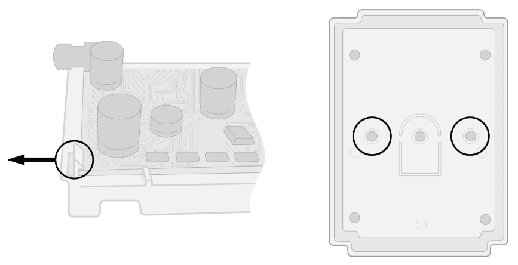
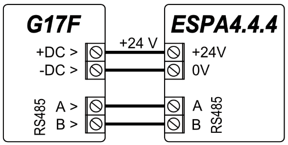
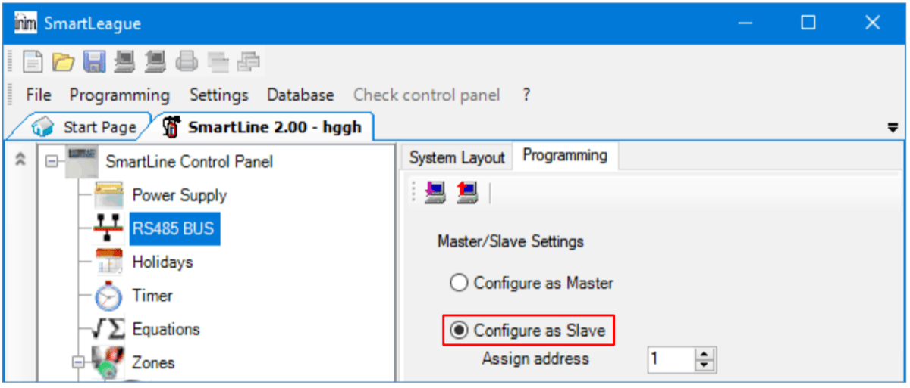

# Priešgaisrinės centralės GSM komunikatorius G17F

  

## 1. Aprašymas 

Komunikatorius G17F atitinka standarto EN 54-21:2006 reikalavimus.

Gaminys atitinka EN54-21 standarto A priedo veikimo reikalavimams 1 tipo perdavimo sistemos tipui.

Komunikatorius G17F sertifikato Nr: 1922-CPR-1974. Gaisro aptikimo ir priešgaisrinės signalizavimo sistemos. Gaisro pavojaus ir įspėjimo apie gedimą signalizavimo maršruto parinkimo įranga.

Gaminį sertifikavo įgaliota gaminių sertifikavimo įstaiga: No.1922 “Dedal”, Nesebar Mladost str. 50, Bulgaria, 8230

Trikdis techninės pagalbos kontaktai: <support@trikdis.lt>, +37067422877

G17F skirtas perduoti priešgaisrinių centralių pranešimus per mobiliojo ryšio tinklus.

Veikimo principas. Kai pažeidžiamas komunikatoriaus įėjimas (zona), G17F perduos įvykio pranešimą į centralizuoto stebėjimo pulto imtuvą arba į Protegus2 programėlę per mobilųjį internetą. Taip pat gali siųsti SMS pranešimus arba paskambinti. Komunikatorių galima įsigyti su 2G arba 4G modemu.

**Savybės**

Pranešimai saugos tarnybai

- Siunčia įvykius į TRIKDIS programinius arba aparatūrinius imtuvus, kurie dirba su bet kuria stebėjimo programa.

- Gali siųsti įvykius į SIA DC-09 imtuvus.

- Nutrūkus ryšiui pagrindiniu kanalu, gali siųsti pranešimus į atsarginį imtuvą.

- Pranešimų į pultą perdavimas SMS žinutėmis. Ypatingai naudingas, nes veikia net ir tada, kai sutrinka IP ryšys mobiliojo ryšio operatoriaus tinkle.

- Mobiliojo tinklo slopinimo atpažinimas.

- Gali vienu metu siųsti pranešimus į saugos tarnybos imtuvą ir veikti per *Protegus2* programėlę. Galima nustatyti prioritetą įvykių siuntimui į pultą.

- Įvykių pranešimai perduodami Contact ID kodais.

Pranešimai vartotojams

- Paskambina į pasirinktus telefono numerius (iki 8 naudotojų).

- Siunčia SMS pranešimus apie įvykius.

- „Push” ir specialūs garso įspėjimai apie įvykius per *Protegus2* programėlę.

**Nuotolinis išėjimų valdymas**

- Protegus2 programėle.

- Paskambinus įrenginio telefono numeriu.

- SMS žinutėmis.

**Nustatymai ir įrengimas**

- Greitas ir lengvas įrengimas.

- Įrenginio konfigūravimas prijungus USB kabeliu arba nuotoliniu būdu naudojant TrikdisConfig programą.

- Nuotolinis programinės įrangos atnaujinimas.

- Du parametrų nustatymo lygiai (paskyros): instaliuotojui ir administratoriui.

**Įėjimai ir išėjimai**

- 3 pasirenkamo tipo įėjimai: NO, NC, EOL (4,7kΩ, 10 kΩ).

- 3 dvigubos paskirties I/O kontaktai, kurios galima nustatyti kaip įėjimo (IN) arba išėjimo (OUT) kontaktą. Pasirenkamo tipo įėjimai: NO, NC, EOL (4,7kΩ, 10 kΩ).

- RS485 jungtis iO serijos išplėtimo moduliams prijungti.

- Naudojant iO serijos išplėtėjus, įėjimų (IN) arba išėjimų (OUT) skaičių galima išplėsti iki 12 vnt.

### 1.1 Techniniai parametrai

| Parametras | Aprašymas |
|------------|-----------|
| GSM/​GPRS modemo dažniai | 850 /​ 900 /​ 1800 /​ 1900 MHz |
| LTE modemo dažniai | 700 /​ 800 /​ 900 /​ 1800 /​ 2100 /​ 2600 MHz |
| Maitinimo įtampa | 9-32 V nuolatinės srovės. |
| Naudojama srovė | 50 mA (budėjimo režime). /​ Iki 200 mA (duomenų siuntimo metu). |
| Perdavimo protokolas | TRK, SIA DC-09_2007, SIA DC-09_2012 |
| Šifravimo raktas | 6 simbolių šifravimo raktas. |
| Ryšio būdas su CSP | TCP/​IP arba UDP/​IP, SMS |
| Įvykių kodai | Contact ID kodai. |
| Atmintis | Iki 60 pranešimų. |
| Įėjimai ir išėjimai | 3 įėjimai, nustatomi NO, NC, EOL (4,7kΩ, 10 kΩ) tipo įėjimai. /​ 3 dvigubos paskirties kontaktai (IN/​OUT), gali būti nustatomi kaip NO, NC, EOL (4,7kΩ, 10 kΩ) tipo įėjimai arba atvirojo kolektoriaus (OC) tipo išėjimai, komutuojantys iki 100 mA srovę. |
| Įvykių atmintis | Iki 1000 įvykių. |
| Veikimo konfigūravimas | Su kompiuterine programa TrikdisConfig nuotoliniu būdu arba lokaliai per USB Mini-B. Nuotoliniu būdu SMS žinutėmis. |
| RS485 magistralės ilgis | Iki 100 m |
| Palaikomi moduliai | iO – plėtimo modulis;​ /​ iO-WL - iO-MO – iO-WL radijo bangų imtuvas;​ /​ iO-8 - plėtimo modulis;​ /​ E485 – „Ethernet“ modulis /​ W485(W17u) – WiFi modulis /​ iO-LORA – plėtimo modulis;​ /​ iO8-LORA – plėtimo modulis;​ /​ PB-LORA – panikos mygtukas;​ /​ REL-LORA - plėtimo modulis;​ /​ INIM Smartline - priešgaisrinė centralė;​ /​ NSC Solution - priešgaisrinė centralė;​ /​ C-TEC Cast ZFP – priešgaisrinė centralė;​ /​ priešgaisrinė centralė su ESPA4.4.4 protokolu. |
| Darbo aplinkos sąlygos | Temperatūra nuo -10 °C iki +50 °C, santykinė drėgmė – iki 80% prie +20 °C. |
| Komunikatoriaus matmenys | 92 x 62 x 25 mm |
| Svoris | g |

### 1.2 G17F komunikatoriaus elementai 

1.  GSM antenos SMA jungtis.

2.  Šviesiniai indikatoriai.

3.  Priekinio dangtelio atidarymo plyšys.

4.  Gnybtai laidų prijungimui.

5.  USB Mini-B jungtis komunikatoriui programuoti.

6.  SIM kortelės laikiklis.

### 1.3 Išorinių kontaktų paskirtis

| Gnybtas | Aprašymas |
|---------|-----------|
| +DC | Maitinimo gnybtas (9 - 32 V nuolatinės srovės teigiamas gnybtas) |
| -DC | Maitinimo gnybtas (9 - 32 V nuolatinės srovės neigiamas gnybtas) |
| 1 IN | 1-as įėjimo gnybtas, pasirenkamo tipo NO, NC, EOL (4,7kΩ, 10 kΩ) (gamyklinis nustatymas: IN, EOL=10 kΩ) |
| 2 IN | 2-as įėjimo gnybtas, pasirenkamo tipo NO, NC, EOL (4,7kΩ, 10 kΩ) (gamyklinis nustatymas: IN, EOL=10 kΩ) |
| COM | Bendras (neigiamas) gnybtas |
| 3 I/​O | 3-ias dvigubos paskirties gnybtas (IN/​OUT), nustatomas įėjimo tipas NO, NC, EOL (4,7kΩ, 10 kΩ) (gamyklinis nustatymas: IN, EOL=10 kΩ) arba atvirojo kolektoriaus (OC) tipo išėjimas, komutuojantys iki 100 mA srovę |
| 4 I/​O | 4-as dvigubos paskirties gnybtas (IN/​OUT), nustatomas įėjimo tipas NO, NC, EOL (4,7kΩ, 10 kΩ) (gamyklinis nustatymas: IN, EOL=10 kΩ) arba atvirojo kolektoriaus (OC) tipo išėjimas, komutuojantys iki 100 mA srovę |
| COM | Bendras (neigiamas) gnybtas |
| 5 I/​O | 5-as dvigubos paskirties gnybtas (IN/​OUT), nustatomas įėjimo tipas NO, NC, EOL (4,7kΩ, 10 kΩ) (gamyklinis nustatymas: IN, EOL=10 kΩ) arba atvirojo kolektoriaus (OC) tipo išėjimas, komutuojantys iki 100 mA srovę |
| 6 IN | 6-as įėjimo gnybtas, pasirenkamo tipo NO, NC, EOL (4,7kΩ, 10 kΩ) (gamyklinis nustatymas: IN, EOL=10 kΩ) |
| A RS485 | RS485 gnybtai skirti prijungti iO serijos įėjimų ir išėjimų plėtikliams, INIM Smartline priešgaisrinei centralei, NSC Solution priešgaisrinei centralei, C-TEC Cast ZFP priešgaisrinei centralei, priešgaisrinei centralei su ESPA4.4.4 protokolu, moduliams E485 ir W485 |

### 1.4 Šviesinė veikimo indikacija 

| Indikatorius | Būklė | Aprašymas |
|--------------|-------|-----------|
| Network / (Tinklas) | Nešviečia | Nėra ryšio su GSM tinklu |
| Network / (Tinklas) | Šviečia žaliai ir mirksi geltonai | Komunikatorius prisijungė prie GSM tinklo. Pakankamas GSM signalo stiprumas GPRS ryšiui yra 5 lygis (penki geltoni sumirksėjimai) ir 4G ryšiui 3 lygis (trys geltoni sumirksėjimai). |
| Data / (Duomenys) | Šviečia žaliai | Siunčiamas pranešimas |
| Data / (Duomenys) | Šviečia geltonai | Yra neišsiųstų įvykių pranešimų buferinėje atmintyje |
| Power / (Maitinimas) | Mirksi žaliai | Maitinimo įtampa gera |
| Power / (Maitinimas) | Mirksi geltonai | Maitinimo įtampa per maža |
| Power / (Maitinimas) | Mirksi žaliai ir geltonai | Įjungtas konfigūravimo režimas |
| Trouble / (Nesklandumas) | Nešviečia ir nemirksi | Veikia be nesklandumų |
| Trouble / (Nesklandumas) | 1 mirktelėjimas | Nėra SIM kortelės |
| Trouble / (Nesklandumas) | 2 mirktelėjimai | Neteisingas SIM kortelės PIN kodas |
| Trouble / (Nesklandumas) | 3 mirktelėjimai | Nepavyksta prisijungti prie GSM tinklo |
| Trouble / (Nesklandumas) | 4 mirktelėjimai | Nepavyksta prisijungti prie IP imtuvo pirminiu kanalu |
| Trouble / (Nesklandumas) | 5 mirktelėjimai | Nepavyksta prisijungti prie IP imtuvo atsarginiu kanalu |
| Trouble / (Nesklandumas) | 6 mirktelėjimai | Nenustatytas vidinis G17F laikrodis |
| Trouble / (Nesklandumas) | 7 mirktelėjimai | Nepakankama maitinimo įtampa |
| Trouble / (Nesklandumas) | 9 mirktelėjimai | Ryšio su RS485 moduliu sutrikimas |

### 1.5 Medžiagos reikalingos montavimo darbams 

Prieš pradėdami įrengimą, įsitikinkite, kad turite:

1.  USB Mini-B tipo kabelį, kuris reikalingas konfigūravimui.

2.  Mažiausiai 4 gyslų kabelį komunikatoriaus prijungimui prie priešgaisrinės centralės.

3.  Plokščią 2,5 mm atsuktuvą.

4.  Išorinę GSM anteną, jeigu įrengimo vietoje ryšys silpnas.

5.  Aktyvuotą nano-SIM kortelę (PIN kodo reikalavimas gali būti išjungtas).

6.  Priešgaisrinės centralės, prie kurios bus jungiamas komunikatorius, instrukciją.

Reikalingas medžiagas galite užsisakyti iš vietinio platintojo.

## 2. Greitas konfigūravimas su programa *TrikdisConfig* 

1.  Parsisiųskite konfigūravimo programą TrikdisConfig iš <u>www.trikdis.lt</u> (programą rasite paieškos lauke surinkę „TrikdisConfig“) ir ją įdiekite*.*

2.  Plokščiu atsuktuvu nuimkite G17F dangtelį kaip parodyta žemiau:

1.  Sujunkite G17F su kompiuteriu USB Mini-B kabeliu.

2.  Paleiskite TrikdisConfig. Programa automatiškai atpažins prijungtą įrenginį ir atidarys G17F konfigūravimo langą.

3.  Paspauskite **Skaityti [F4]**, kad programa pateiktų esamas G17F veikimo parametrų reikšmes. Jei atsivers administratoriaus arba instaliuotojo kodo įvedimo reikalavimo langelis, įveskite 6 skaitmenų kodą.

Žemiau aprašome nustatymus, kuriuos reikia pakeisti, kad komunikatorius pradėtų siųsti pranešimus į Protegus2 programėlę arba į stebėjimo pultą.

### 2.1 Nustatymai ryšiui su Protegus2 programėle 

**Lango „Vartotojai ir pranešimai“ kortelėje „Mobilioji aplikacija“:**

1.  Pažymėkite varnele **Įgalinti jungimąsi** prie Protegus serviso.

2.  Pakeiskite **PROTEGUS Aplikacijos prieigos kodą**, jeigu norite, kad vartotojų prašytų jį suvesti, jiems pridedant sistemą Protegus2 programėlėje (gamyklinis slaptažodis – 123456).

**Lango „Sistemos parinktys“ kortelėje „SIM“:**

3. Įveskite **SIM kortelės PIN kodą**.

2.  Pakeiskite **APN** vardą. **APN** rasite SIM operatoriaus interneto puslapyje. „Internet” yra universalus ir veikia daugelio operatorių tinkluose.

**Lange „Zonų įejimai“:**

3. Pažymėkite varnele, jei norite, kad vartotojas gautų pranešimus į Protegus2 apie zonų būsenos pasikeitimus.

**Lange „PGM išėjimai“:**

4. Pažymėkite varnele, jei norite, kad vartotojas gautų pranešimus į Protegus2 apie PGM išėjimų būsenos pasikeitimus.

**Lange „Sistemos įvykiai“:**

5. Pažymėkite varnele, jei norite, kad vartotojas gautų pranešimus į Protegus2 apie komunikatoriaus vidinių įvykių būsenos pasikeitimus.

Baigę konfigūravimą, paspauskite mygtuką **Įrašyti [F5]** ir atjunkite USB kabelį.

!!! note
    Plačiau apie kitus G17F nustatymus TrikdisConfig žr. skyrių
    5 „TrikdisConfig langų aprašymas".
### 2.2 Nustatymai ryšiui su Stebėjimo pultu 

**Lange „Sistemos parinktys“:**

1.  Įrašykite **Objekto numerį** (4 simbolių šešioliktainis numeris, 0-9, A-F. **Nenaudokite FFFE, FFFF objekto numerių**.).

2.  Įveskite **SIM kortelės PIN** kodą.

3.  Pakeiskite **APN** vardą. Jį rasite SIM operatoriaus interneto puslapyje. „Internet” yra universalus ir veikia daugelio operatorių tinkluose.

**Lange „Pranešimai į ST pultą“:**

4. **Ryšio būdas** – pasirinkite ryšio būdą (nerekomenduojame naudoti SMS kaip pirminio kanalo).

2.  **Domenas arba IP** – įrašykite imtuvo domeno arba IP adresą.

3.  **Prievadas** – įrašykite imtuvo prievado (*angl. port*) numerį tinkle.

4.  **Protokolas** – pasirinkite, kuria koduote turėtų būti siunčiami pranešimai: **TRK** (į TRIKDIS imtuvus), **DC-09_2007** arba **DC-09_2012** (į universalius imtuvus).

5.  **Šifravimo raktas** – įrašykite šifravimo raktą, kuris yra nustatytas imtuve.

!!! note
    Jei norite nustatyti ryšį su pultu **SMS** žinutėmis, reikės nustatyti
    tik **šifravimo raktą** ir **telefono numerį**. SMS pranešimus gali
    priimti TRIKDIS stebėjimo pulto IP/SMS imtuvas RL14, daugiakanalis
    imtuvas RM14 ir SMS imtuvas GM14. / Jei pasirinkote
    **DC-09** pranešimų perdavimo koduotę, papildomai **„Pranešimai į ST
    pultą"** lange, skirtuke **Parametrai**, įveskite objekto, linijos ir
    imtuvo numerius.
1.  (Rekomenduojama) Sukonfigūruokite **Atsarginio kanalo** nustatymus.

2.  (Rekomenduojama) Įveskite **Atsarginio kanalo 2** telefono numerį.

Baigę konfigūravimą paspauskite mygtuką **Įrašyti [F5]** ir atjunkite USB kabelį.

!!! note
    Plačiau apie kitus G17F nustatymus TrikdisConfig žr. skyrių
    5 „TrikdisConfig langų aprašymas".
## 3. Sistemos sujungimų schemos, įrengimas ir paleidimas 

### 3.1 Tvirtinimas 

1.  Prieš įrengdami sistemą įsitikinkite, kad toje vietoje, kur bus tvirtinamas *G17F*, geras GSM signalo stiprumas.

2.  Nuimkite viršutinį dangtelį, ištraukite kontaktinių kaladėlių kištukines dalis.

3.  Išimkite plokštę.

4.  Korpuso pagrindą varžtais pritvirtinkite pageidaujamoje vietoje.

5.  Surinkite plokštę ir kontaktines kaladėles atgal.

6.  Prisukite GSM anteną.

7.  Įstatykite nano-SIM kortelę. SIM kortelė turi būti priregistruota GSM tinkle su jau įjungtomis ir veikiančiomis paslaugomis, pvz., gali paskambinti, išsiųsti ir priimti SMS žinutes, veikia mobilusis internetas. <u>Kaip įjungti pageidaujamas paslaugas, teiraukitės SIM kortelės mobiliojo ryšio operatoriaus.</u>

!!! note
    Įsitinkite, kad SIM kortelė yra aktyvuota. / Įsitikinkite, kad įjungta
    mobiliojo interneto paslauga, jei bus naudojamas ryšys IP kanalu arba
    bus naudojama programėlė Protegus2. / Jei norite išvengti PIN kodo
    įvedimo TrikdisConfig, įdėkite SIM kortelę į telefoną ir išjunkite
    PIN kodo užklausos funkciją.
8. Norėdami konfigūruoti G17F nuotoliniu būdu, įdėkite SIM kortelę su išjungta PIN kodo užklausa. Įjunkite maitinimą komunikatoriui. Jei G17F nebuvo sukonfigūruotas su TrikdisConfig ir nebuvo įjungta Protegus serviso paslauga, išsiųskite SMS žinutę: **CONNECT  123456  PROTEGUS=ON,APN=INTERNET**

2.  Punkte 6 “Nuotolinis veikimo parametrų nustatymas” aprašytas konfigūravimas nuotoliniu būdu.

3.  Uždarykite viršutinį dangtį.

### 3.2 Priešgaisrinės centralės ir komunikatoriaus jungimo schema 

Jei norite stebėti priešgaisrinės centralės būseną, prijunkite atitinkamus jo išėjimus prie *G17F* įėjimų. Priešgaisrinės centralės išėjimai (PGM1, PGM2, PGM3) turi būti sukonfigūruoti kaip centralės būsenos išėjimai (Aliarmas, Gedimas ir kt.).

## 4. Priešgaisrinės centralės ESPA4.4.4 prijungimo schema 

G17F komunikatoriaus nustatymai su TrikdisConfig jungiant su priešgaisrine centrale **ESPA4.4.4**.

1.  Pasirinkite „**ESPA4.4.4“** priešgaisrinę centralę.

2.  Pasirinkite sąsajos spartą.

3.  G17F komunikatoriaus ir gaisro centralės duomenų perdavimo parametrai turi būti vienodi.

4. Įrašykite vartotojų telefonų numerius, kurie turėtų gauti pranešimus iš komunikatoriaus G17F.

5. Jei norite, kad vartotojas gautų žinutes (arba skambučius) apie įvykius, pažymėkite laukelį **SMS** (arba **Skamb.**).

6. Sukonfigūruokite ryšio kanalą, jei pranešimai turi būti siunčiami į CSP imtuvą. Įvykių pranešimai perduodami naudojant SIA DC-09 protokolą.

Išbandykite sistemą. Aktyvuokite gaisro signalizaciją ir patikrinkite, ar G17F pranešimai siunčiami į CSP (centrinį stebėjimo pultą) ir į Protegus2.

## 5. Priešgaisrinės centralės NSC Solution prijungimo schema 

G17F komunikatoriaus nustatymai su TrikdisConfig jungiant su priešgaisrine centrale **NSC Solution**.

1.  Pasirinkite „**NSC solution“** priešgaisrinę centralę.

2.  „**NSC slave adresas**“ neturėtų sutapti su prijungtų priešgaisrinės centralės modulių adresais.

3. Įrašykite vartotojų telefonų numerius, kurie turėtų gauti pranešimus iš komunikatoriaus G17F.

4. Vartotojai gaus SMS žinutes ir skambučius apie pažymėtus įvykius. CID stulpelyje galite pridėti papildomų CID įvykių kodų. Prie naujų kodų turite įvesti SMS žinučių tekstus. Jei norite, kad vartotojas gautų žinutes (arba skambučius) apie įvykius, pažymėkite „**SMS**“ (arba „**Skamb.**“) laukelį.

5. Sukonfigūruokite ryšio kanalą, jei pranešimai turi būti siunčiami į CSP imtuvą.

Sukonfigūravus komunikatorių G17F, įjunkite priešgaisrinės centralės maitinimą. Palaukite, kol bus įkelta priešgaisrinės centralės programinė įranga. Centralėje būtina nuskaityti modulius, prijungtus prie RS485 magistralės. Priešgaisrinėje centralėje paspauskite: **PROG.>INSTALLER>(įveskite instaliuotojo kodą) 00000 OK>(pasirinkite) SETTINGS>ENTER>(pasirinkite) SCAN RS485>ENTER**. Palaukite, kol nuskaitymas bus baigtas. Grįžkite į pagrindinį ekraną du kartus paspausdami „**CANCEL**“.

Išbandykite sistemą. Aktyvuokite gaisro signalizaciją ir patikrinkite, ar G17F pranešimai siunčiami į CSP (centrinį stebėjimo pultą) ir į Protegus2.

### 5.1 Priešgaisrinės centralės INIM Smartline ir komunikatoriaus jungimo schema 

**INIM Smartline** centralei reikia nustatyti **Slave** režimą, kai ji prijungta prie komunikatoriaus G17F per RS485 sąsają.

!!! note
    Jei prie **INIM Smartline** centralės prijungti kartotuvai, tai
    G17F negalite prijungti per RS485 sąsają. / Kai G17F
    prijungtas prie **INIM Smartline** centralės per RS485 sąsają, iO
    plėtimo moduliai nepalaikomi.
Nustatymai TrikdisConfig, kai prijungta priešgaisrinė centralė INIM Smartline

**Langas „Moduliai“:**

1.  Pasirinkite modulį **INIM Smartline**.

**Langas „Vartotojai ir pranešimai“:**

2. Įrašykite vartotojų telefonų numerius, kurie turėtų gauti pranešimus iš komunikatoriaus G17F.

3. Vartotojai gaus SMS pranešimus ir skambučius, kurie pažymėti varnele. **CID** kodų stulpelyje galima pridėti papildomų **CID** įvykių kodų. Prie naujų kodų reikia surašyti **SMS teksto** pranešimus. Kad vartotojas gautų pranešimus (arba skambučius) apie įvykius, pažymėkite **SMS** (arba **Skambutis**) lauką varnele.

2.  Sukonfigūruokite ryšio kanalą, jei pranešimai turi būti siunčiami į CSP imtuvą.

Išbandykite sistemą. Aktyvuokite gaisro signalizaciją ir patikrinkite, ar G17F pranešimai siunčiami į CSP (centrinį stebėjimo pultą) ir į Protegus2.

## 6. Priešgaisrinės centralės C-TEC Cast ZFP prijungimo schema 

G17F komunikatoriaus nustatymai su TrikdisConfig jungiant su priešgaisrine centrale **C-TEC Cast ZFP**.

1.  Pasirinkite **C-TEC Cast ZFP** priešgaisrine centrale.

1.  Įveskite vartotojų, kurie turėtų gauti žinutes iš G17F, telefono numerius.

2. Vartotojai gaus SMS žinutes ir skambučius apie pažymėtus įvykius. CID stulpelyje galite pridėti papildomų CID įvykių kodų. Prie naujų kodų turite įvesti SMS žinučių tekstus. Jei norite, kad vartotojas gautų žinutes (arba skambučius) apie įvykius, pažymėkite „**SMS**“ (arba „**Skamb.**“) laukelį.

3. Sukonfigūruokite ryšio kanalą, jei pranešimai turi būti siunčiami į CSP imtuvą.

Įdiekite **ZFPtools** programą savo kompiuteryje. Paleiskite programą **ZFPtools**. Įjunkite priešgaisrinės centralės maitinimą. Palaukite, kol bus įkelta priešgaisrinės centralės programinė įranga. Prijunkite USB2.0 A-B kabelį tarp priešgaisrinės centralės ir kompiuterio.

4. Atidarykite „**Node View**“ skirtuką.

5. Nuskaitykite priešgaisrinės centralės nustatymus.

6. Įveskite kodą (gamyklinis kodas – 4444).

2.  Spustelėkite „ОК“.

3. Pasirinkite „**BMS Interface**“.

2.  Spustelėkite laisvą piktogramą.

11. Spustelėkite „**Edit Devices**“.

12. Skirtuke „**Device**“ įveskite sistemos pavadinimą.

13. Skirtuke „**Properties**“ įveskite sistemos pavadinimą.

14. Nurodykite „**ABUS RS485**“ sąsają, prie kurios prijungtas komunikatorius G17F.

15. Nustatykite pranešimus.

16. Įrašykite nustatymus į priešgaisrinę centralę.

17. Įveskite kodą (gamyklinis kodas – 4444).

18. Spustelėkite „OK“.

Priešgaisrinė centralė užprogramuota. Atjunkite USB2.0 A-B kabelį nuo priešgaisrinės centralės.

Išbandykite sistemą. Aktyvuokite gaisro signalizaciją ir patikrinkite, ar G17F pranešimai siunčiami į CSP (centrinį stebėjimo pultą) ir į Protegus2.

### 6.1 Įėjimo prijungimo schemos 

Komunikatorius turi šešis (1IN – 6IN) įėjimo gnybtus (trys gnybtai yra dvigubos paskirties IN/OUT) prijungti NO, NC, EOL (4,7kΩ, 10 kΩ) tipo grandinėms. Gamyklinis įėjimo nustatymas – stebėti EOL tipo grandinę. Kitą įėjimo tipą galima nustatyti TrikdisConfig lange **Zonų įėjimai**.

NO, NC, EOL tipo grandinių laidinių sujungimų schemos:

### 6.2 iO serijos plėtimo modulių prijungimo schema 

Jei reikia, kad komunikatorius turėtų daugiau įėjimų IN arba išėjimų OUT prijunkite laidinį arba belaidį TRIKDIS iO serijos įėjimų ir išėjimų plėtiklį.

### 6.3 iO-8 plėtimo modulio prijungimo schema 

Jei reikia, kad komunikatorius turėtų daugiau įėjimų IN arba išėjimų OUT, prijunkite laidinį TRIKDIS *iO-8* įėjimų ir išėjimų plėtiklį.

### 6.4 LORA serijos išplėtimo modulių prijungimo schema 

LORA plėtimo modulių prijungimo schema.

### 6.5 WiFi modulio W485 (W17U) prijungimo schema 

Komunikatoriaus *G17F* veikimo programos versija nuo 1.08. / Modulis *W485* skirtas įvykių siuntimui ir valdymui naudojant WiFi interneto ryšį. Naudojant *W485* kartu su *G17F* pranešimai į CSP ir į *Protegus2* siunčiami Wi-Fi interneto tinklu ir mobilus internetas nenaudojamas. Jei sutrinka Wi-Fi ryšys duomenys perduodami per mobilųjį internetą. Atsistačius WiFi ryšiui, *G17F* pradeda toliau siusti pranešimus per *W485*. / *G17F* konfigūravimas su WiFi moduliu *W485* aprašytas p. 5.5. „Langas „Moduliai“. / Naudojant modulį *W485* kartu su *G17F* SIM kortelė nebūtina.

### 6.6 „Ethernet“ modulio E485 prijungimo schema 

Komunikatoriaus *G17F* veikimo programos versija nuo 1.08. / Modulis *E485* skirtas įvykių siuntimui ir valdymui naudojant laidinį interneto ryšį. Naudojant *E485* kartu su *G17F* pranešimai į CSP ir į *Protegus2* siunčiami laidiniais interneto tinklais ir mobilusis internetas nenaudojamas. Jei sutrinka laidinis interneto tinklas duomenys į CSP perduodami per mobilųjį internetą. Atsistačius laidinio interneto tinklui, *G17F* pradeda toliau siusti pranešimus per *E485*. / *G17F* konfigūravimas su „Ethernet“ moduliu *E485* aprašytas p. 5.5. „Langas „Moduliai“. / Naudojant modulį *E485* kartu su *G17F* SIM kortelė nebūtina.

### 6.7 Komunikatoriaus įjungimas 

Norint įjungti komunikatorių, pirma reikia užtikrinti maitinimo šaltinį priešgaisrinei centralei. Jei komunikatorius veikia tinkamai, turi užsidegti ši G17F šviesinė indikacija:

- Diodas „POWER“ turi šviesti žaliai (pakankama maitinimo įtampa);

- Diodas „NETWORK“ turi šviesti žaliai ir mirksėti geltonai, kai komunikatorius prisiregistravęs prie mobilaus ryšio tinklo.

!!! note
    Pakankamas GSM signalo lygis - 5 (penki „NETWORK" indikatoriaus geltoni
    mirksniai). Pakankamas 4G signalo lygis - 3 (trys „NETWORK"
    indikatoriaus geltoni mirksniai). / Jeigu suskaičiuojate mažiau nei 3
    geltonus „NETWORK" diodo mirksnius, tai GSM signalo lygis nepakankamas.
    Rekomenduojame pasirinkti kitą komunikatoriaus įrengimo vietą arba
    naudoti jautresnę GSM anteną. / Jei šviesinė indikacija kitokia,
    ieškokite indikacijos reikšmės skyriuje 1.4 „Šviesinė veikimo
    indikacija". / Jei G17F šviesos indikatorius visiškai neaktyvus,
    patikrinkite maitinimo šaltinį ir sujungimus.
## 7. Nuotolinis valdymas 

### 7.1 Komunikatoriaus registravimas Protegus2 programėlėje 

Naudodami Protegus2, sistemos vartotojai gali matyti sistemos būseną ir gauti pranešimus apie sistemos įvykius.

1.  Parsisiųskite ir paleiskite Protegus2 programėlę arba naudokite versiją naršyklėje [www.protegus.app](https://www.protegus.app):

    

      
      
      
    

2.  Registruokitės ir susikurkite naują paskyrą arba prisijunkite savo vartotojo vardu ir slaptažodžiu.

!!! note
    Sistemos registravimo prie Protegus2 metu G17F
    komunikatorius turi būti:
    
    1.  Su įstatyta ir aktyvuota SIM kortele ir įvestu arba išjungtu PIN
        kodu;
    
    2.  Įjungta Protegus servisas paslauga. Žr. 5.4 Langas
        „Vartotojai ir pranešimai";
    
    3.  Įjungtu maitinimu („POWER" LED šviečia žaliai);
    
    4.  Prisiregistravęs prie tinklo („NETWORK" LED šviečia žaliai ir mirksi
        geltonai).
3. Paspauskite Pridėti sistemą ir įveskite *G17F* „*IMEI/Unikalus ID*“ numerį. Jį rasite ant gaminio ir pakuotės lipduko. Įvedę, paspauskite mygtuką „Toliau“.

### 7.2 Konfigūravimas ir valdymas SMS žinutėmis 

1.  **Pakeiskite administratoriaus slaptažodį**

Saugumui užtikrinti, pakeiskite gamyklinį administratoriaus SMS slaptažodį. Išsiųskite tokio formato SMS žinutę:

#### PSW 123456 xxxxxx

| **123456** | Gamyklinis administratoriaus slaptažodis         |
|------------|--------------------------------------------------|
| **xxxxxx** | Naujasis 6-ženklis administratoriaus slaptažodis |

1.  **Leiskite valdyti kitiems naudotojams**

Sistemą galima valdyti su SMS arba skambučiu tik tais telefono numeriais, kurie yra įrašyti vartotojų sąraše. Iš administratoriaus telefono nusiųskite SMS žinutes su asmenų telefonų numeriais ir vardais, įgalindami juos valdyti sistemą:

#### SETN xxxxxx PHONEx=+PHONENR#NAME

| **xxxxxx** | 6-ženklis administratoriaus slaptažodis |
|----|----|
| **x** | Naudotojo numeris sąraše. (Įrašę 1, perleisite administratoriaus teises kitam asmeniui.) |
| **PHONENR** | Naudotojo telefono numeris |
| **NAME** | Naudotojo vardas |

> ####
>
> #### SMS komandų sąrašas

| Komanda | Duomenys | Aprašymas |
|---------|----------|-----------|
| INFO |  | Informacijos apie komunikatorių užklausa. Į atsakymą bus įtraukti: komunikatoriaus tipas, IMEI numeris, serijos numeris ir programinės įrangos versija. Pvz.: INFO 123456 |
| RESET |  | Prietaiso paleidimas veikti iš naujo. Pvz.: RESET 123456 |
| OUTPUTx | ON | Įjungti išėjimą, kur “x” - išėjimo numeris. / Pvz.: OUTPUT1 123456 ON |
| OUTPUTx | OFF | Išjungti išėjimą, kur “x” - išėjimo numeris. / Pvz.: OUTPUT1 123456 OFF |
| OUTPUTx | PULSE=ttt | Keletui sekundžių įjungti išėjimą - “x” reiškia OUT išėjimo numerį, o “ttt” yra trijų skaitmenų skaičius, reiškiantis impulso trukmę sekundėmis. / Pvz.: OUTPUT1 123456 PULSE=002 |
| PSW | Naujas slaptažodis | Slaptažodžio keitimas. Pvz.: PSW 123456 654123 |
| TIME | YYYY/MM/DD,12:00:00 | Datos ir laiko nustatymas. / Pvz.: TIME 123456 2019/01/09,12:23:00 |
| TXTA | Objekto pavadinimas | Objekto vardo įrašymas. Pvz.: TXTA 123456 Namas |
| TXTE | Z1= / ........ / Z12= | SMS su zonos pavojaus pranešimu redagavimas: Z1...Z12 – įėjimo zonos numeris. / Pvz.: TXTE 123456 Z1=ALARM in Zone1 |
| TXTR | Z1= / ........ / Z12= | SMS su zonos atstatymo pranešimu redagavimas: Z1...Z12 – įėjimo zonos numeris. / Pvz.: TXTR 123456 Z1=Restore Zone1 |
| RDR | PhoneNR#SMStext | SMS pranešimų peradresavimas į nurodytą numerį. Telefono numeris turi būti su "+" ženklu ir šalies kodu. / Pvz.: RDR 123456 +37061234567#peradresuojamas tekstas |
| ASKI |  | Siųsti SMS pranešimą apie įėjimų IN būsenas. / Pvz.: ASKI 123456 |
| ASKO |  | Siųsti SMS pranešimą apie išėjimų OUT būsenas. / Pvz.: ASKO 123456 |
| SETN | PhoneX=PhoneNR#Name | Pridėti telefono numerį, vartotojo vardą ir priskirti jį vartotojui „x“. „x“ reiškia telefono numerio eilės numerį sąraše. Telefono numeris turi būti su "+" ženklu ir šalies kodu. Telefono numeris nuo vartotojo vardo turi būti atskirtas # simboliu. Pvz.: SETN 123456 PHONE5=+37061234567#JONAS |
| SETN | PhoneX=DEL | Įrašyto telefono numerio ir vartotojo vardo pašalinimas iš sistemos. / Pvz.: SETN 123456 PHONE5=DEL |
| UUSD | *Uusd code# | Siunčia UUSD kodą operatoriui. Pvz.: UUSD 123456 *245# |
| CONNECT | Protegus=ON | Prisijungti prie Protegus cloud serviso. / Pvz.: CONNECT 123456 PROTEGUS=ON |
| CONNECT | Protegus=OFF | Atsijungti nuo Protegus cloud serviso. / Pvz.: CONNECT 123456 PROTEGUS=OFF |
| CONNECT | Code=123456 | Protegus cloud serviso kodas. / Pvz.: CONNECT 123456 CODE=123456 |
| CONNECT | IP=0.0.0.0:8000 | Nurodomas pagrindinio serverio jungimosi kanalo TCP IP ir Port. Pvz.: CONNECT 123456 IP=0.0.0.0:8000 |
| CONNECT | IP=0 | Jei norima išjungti pagrindinį kanalą. / Pvz.: CONNECT 123456 IP=0 |
| CONNECT | ENC=123456 | TRK šifravimo raktas. Pvz.: CONNECT 123456 ENC=123456 |
| CONNECT | APN=Internet | APN vardas. Pvz.: CONNECT 123456 APN=INTERNET |
| CONNECT | USER=user | APN naudotojas. Pvz.: CONNECT 123456 USER=User |
| CONNECT | PSW=password | APN slaptažodis. Pvz.: CONNECT 123456 PSW=Password |

### 7.3 PGM išėjimų valdymas skambučiu 

!!! note
    Jei sistemoje nėra pridėtų naudotojų, pirmasis paskambinęs į G17F
    taps sistemos administratoriumi ir bus vienintelis naudotojas, kuris
    galės valdyti G17F telefono skambučiu ir SMS komandomis. / Jei
    norite leisti sistemą valdyti skambučiu papildomiems naudotojams,
    įveskite juos TrikdisConfig arba suteikite teises SMS komandomis.
Norėdami valdyti PGM išėjimą nuotoliniu būdu atlikite šiuos veiksmus:

- Vartotojui turi būti priskirtas išėjimų OUT valdymas ir išėjimui OUT priskirtas tipas „Nuotolinis valdymas“ (naudojant TrikdisConfig).

- Paskambinkite į G17F SIM kortelės numerį. G17F atsilieps ir telefono aparato skaičių klaviatūra surinkite komandą (žiūrėti į lentelę).

#### Telefono aparato klaviatūroje surenkamų valdymo komandų sąrašas

| Klaviatūros klavišai | Funkcija | Aprašymas |
|----------------------|----------|-----------|
| [išėjimo nr]*[būsenos nr]# | Pasirinkto OUT išėjimo valdymas | Valdo konkretų PGM išėjimą. Būsena: [0] – išėjimas išjungtas; [1] – išėjimas įjungtas; [2] – išjungtas impulso trukmei; [3] – įjungtas impulso trukmei; (impulso trukmė aprašyta TrikdisConfig programoje, PGM lentelėje). [#] – šis simbolis reiškia kodo pabaigą. Pvz. (įjungti 1 išėjimą): 1*1# Pvz. (išjungti 1 išėjimą): 1*0# Pvz. (įjungti 2 išėjimą Impulso trukmei, nurodytai TrikdisConfig „PGM išėjimai“ lentelėje): 2*3# |
| # | Įvesti komandą iš naujo | Jei įvedant komandą padarėte klaidą, nuspauskite telefono klaviatūroje # ir įveskite komandą iš naujo. |

## 8. *TrikdisConfig* langų aprašymas 

### 8.1 TrikdisConfig būsenos juostos aprašymas 

Prijungus G17F TrikdisConfig būsenų juostoje pateiks informaciją apie prijungtą gaminį.

| **Pavadinimas** | **Aprašymas** |
|----|----|
| IMEI/​Unikalus ID | Gaminio IMEI numeris |
| Būsena | Darbinė būsena |
| Įrenginys | Gaminio tipas (turi rodyti G17F) |
| SN | Gaminio serijinis numeris |
| BL | Paleidyklės versija |
| FW | Gaminio programinės įrangos versija |
| HW | Gaminio aparatinės įrangos versija |
| Būsena | Sujungimo su programa būdas (per USB arba nuotolinis) |
| Teisės | Prieigos lygis (rodomas po to, kai patvirtintas prieigos kodas) |

Paspaudus mygtuką **Skaityti [F4]**, programa nuskaitys ir parodys nustatymus, kurie yra įrašyti G17F. Su TrikdisConfig, nustatykite reikiamus nustatymus pagal žemiau pateiktus programos langų aprašymus.

### 8.2 Langas „Sistemos parinktys“ 

**Skirtukas „Pagrindiniai“**

**Parinkčių grupė „Pagrindiniai“**

- **Objekto numeris** – jei pranešimai bus siunčiami į CSP (centralizuoto stebėjimo pultą), įrašykite CSP suteiktą objekto numerį (4 simbolių šešioliktainis numeris, 0-9, A-F. **Nenaudokite FFFE, FFFF objekto numerių**.).

- **Objekto pavadinimas** – objektui suteikiamas pavadinimas, kuris bus siunčiamas SMS pranešimais vartotojui.

- **Testo periodas** – pažymėjus šią parinktį, bus įjungtas periodinių „Test“ pranešimų siuntimas nustatytu periodu.

- **Laiko nustatymas** – galima parinkti serverį, su kuriuo bus sinchronizuojamas laikas. Pasirinkus *„IP serveris“*, laikas sinchronizuosis su IP imtuvo laiku, pasirinkus „*GSM modemas“*, sinchronizuosis su GSM ryšio tiekėjo serverio laiku.

- **Išvalyti atmintį po paleidimo iš naujo** – paleidžiant veikti iš naujo bus ištrinti visi neišsiųsti įvykių pranešimai.

- **Pavadinimų kalba** – nustatykite pageidaujamą kalbą ir SMS pranešimuose, zonų pavadinimuose bus naudojami specifiniai tos kalbos simboliai.

- Galima **Sustabdyti pranešimų perdavimą, kai ...** daug vienodų **pasikartojančių įvykių įvyko per ... s**.

- **Atkurti pranešimų perdavimą po ...** – nustatykite laiką, po kurio pranešimų apie įvykius sustabdymas bus atšauktas. Galimos reikšmės nuo 0 iki 999 minučių.

- **Įtampos tikrinimo riba** – nurodomas maitinimo įtampos dydis (12 V arba 24 V), pagal kurį bus formuojamas pranešimas apie žemą maitinimo šaltinio įtampos lygį.

**Parinkčių grupė „SIM“**

- Įveskite **SIM PIN kodą.**

  - **APN** – ryšio tiekėjo mobilaus interneto prieigos adresas. **APN** būtina įrašyti, kai pranešimai turės būti siunčiami į Protegus2 programėlę arba į CSP per GPRS.
- Jei SIM kortelės GPRS ryšio tiekėjas reikalauja, įveskite APN vartotojo vardą ir slaptažodį laukeliuose **Vartotojas** ir **Slaptažodis.**

**Parinkčių grupė „Laiko juosta“**

- **Laiko juosta (min)** – nurodykite savo šalies laiko juostą. Jei komunikatorių montuosite Lietuvoje, nustatykite „**+3“** reikšmę.

- **Vasaros laiko persukimas** – pažymėjus lauką varnele, komunikatoriaus vidinis laikrodis bus automatiškai pervestas į vasaros arba į žiemos laiką.

**Skirtukas „Prisijungimas“**

**Parinkčių grupė „Prieigos kodai“**

- **Administratoriaus kodas** – leidžia prieiti prie visų konfigūravimo funkcijų (gamyklinis kodas – 123456).

- **SMS slaptažodis** – nuotolinio valdymo ir programavimo SMS žinutėmis slaptažodis (gamyklinis kodas – 123456).

- **Instaliuotojo kodas** – leidžia ribotai keisti komunikatoriaus konfigūraciją (gamyklinis kodas – 654321).

**Parinkčių grupė „Instaliuotojo teisės“**

Administratorius gali nustatyti, kuriuos parametrus galės keisti instaliuotojas.

## 9. Langas „Pranešimai į ST pultą“ 

Komunikatorius gali siųsti pranešimus į stebėjimo pultą per internetą (IP) arba SMS pranešimais.

Pagrindiniam ryšio kanalui galima priskirti atsarginį ryšio kanalą, kuris bus naudojamas nutrūkus ryšiui pagrindiniu kanalu.

Pranešimai į stebėjimo pultą perduodami užkoduoti ir apsaugoti slaptažodžiu. Pranešimams priimti ir perduoti į stebėjimo programą reikalingas TRIKDIS imtuvas:

- IP pranešimams – priėmimo programa IPcom Windows/Linux, aparatinis IP/SMS imtuvas RL14 arba daugiakanalis imtuvas RM14.

- SMS pranešimams – aparatinis IP/SMS imtuvas RL14, daugiakanalis imtuvas RM14 arba SMS imtuvas GM14.

Ryšys SMS pranešimais yra ypatingai naudingas kaip atsarginis kanalas, nes veikia, kai sutrinka mobiliojo interneto ryšys operatoriaus tinkle. Nerekomenduojame naudoti SMS kaip pagrindinio kanalo.

**Parinkčių grupė „Pagrindinis kanalas“**

- **Ryšio būdas** – pasirinkite ryšio su stebėjimo pulto imtuvu būdą.

- **Domenas arba IP** – įrašykite imtuvo domeno arba IP adresą.

- **Prievadas** – įrašykite imtuvo prievado (*angl. port*) numerį tinkle.

- **Protokolas** – **TRK** protokolu perduodamus įvykių pranešimus priims TRIKDIS IP imtuvai, o **SIA DC-09** protokolais – IP imtuvai, gebantys priimti SIA DC-09 protokolais perduodamus įvykių pranešimus.

- **Telefono numeris** – (tik SMS pranešimams) įrašykite TRIKDIS SMS imtuvo telefono numerį. Telefono numeris turi būti su šalies kodu (pvz., 370xxxxxxxx).

- **Šifravimo raktas** - 6 skaitmenų pranešimų šifravimo raktas. Į komunikatorių įrašytas šifravimo raktas turi sutapti su įrašytu į imtuvą raktu.

**Parinkčių grupė „Atsarginis kanalas“**

Įgalinkite atsarginio kanalo režimą, kad nutrūkus ryšiui, pranešimai apie įvykius būtų siunčiami atsarginiu kanalu. Sukonfigūruokite atsarginį kanalą, naudodami tokius pačius nustatymo laukus, kaip aprašyta aukščiau.

**Parinkčių grupė „Parametrai“**

- **Grįžti prie pagrindinio po** – laikas, kuriam pasibaigus, G17F bandys atstatyti ryšį ir perduoti pranešimus Pagrindiniu kanalu.

- **IP PING periodas** – vidinių PING ryšio tikrinimo signalų siuntimo periodas. Šie pranešimai siunčiami tik IP kanalu. Jų imtuvas neperduoda į stebėjimo programą, taip jos neapkraudamas. Į stebėjimo programą perduodama tik tada, kai imtuvas negauna PING pranešimo iš įrenginio per nustatytą laiką.

Pagal nutylėjimą, imtuvas perduos „*Connection lost*” prarasto ryšio pranešimą į stebėjimo programą praėjus trigubai ilgesniam laikui nei nustatytas komunikatoriaus PING pranešimo periodas. Pvz., jei nustatytas 3 minučių PING, imtuvas perduos prarasto ryšio pranešimą negavęs PING per 9 minutes.

Kartu PING pranešimai palaiko aktyvią ryšio sesiją tarp įrenginio ir imtuvo. Aktyvi sesija reikalinga, kad komunikatorių būtų galima konfigūruoti ir valdyti nuotoliniu būdu. Rekomenduojame nustatyti ne ilgesnį nei 5 minučių PING periodą.

- **SMS PING periodas** – SMS ryšio su pultu tikrinimo signalo siuntimo periodas.

- **Pereiti prie atsarginio po** – nurodomas nesėkmingų bandymų perduoti pranešimą **Pagrindiniu kanalu** skaičius. Nepavykus perduoti nustatytą skaičių kartų, įrenginys jungsis perduoti pranešimus **Atsarginiu kanalu**.

- **DNS1, DNS2** – (angl. Domain Name System) serveris, kuris nurodo domeno IP adresą. Naudojamas, kai ryšio kanalo **Domenas arba IP** lauke nurodytas ne IP adresas, o domenas. Gamyklinis nustatymas - Google DNS serverių adresai.

Nustatymai rodomi, kai ryšio kanalo **Protokolas** lauke pasirinkta **DC-09_2007** arba **DC-09_2012** koduotė pranešimų siuntimui.

- **SIA DC-09 obj. Nr.** – <u>įveskite objekto numerį. Pasirinkus DC-09 koduotę, bus naudojamas šiame lauke įrašytas objekto numeris</u>. Galite įvesti 3-16 simbolių šešioliktainį numerį, kurį suteikia stebėjimo pultas.

- **SIA DC-09 imtuvo Nr.** – įveskite imtuvo numerį.

- **SIA DC-09 linijos Nr.** - įveskite linijos numerį imtuve.

**Parinkčių grupė „Atsarginis kanalas 2“**

- **Telefono numeris** - (tik SMS pranešimams) įrašykite TRIKDIS SMS imtuvo telefono numerį. Telefono numeris turi būti su šalies kodu (pvz., 370xxxxxxxx).

### 9.1 Langas „Vartotojai ir pranešimai“ 

**Skirtukas „Vartotojai“**

**Parinkčių grupė „Vartotojai ir pranešimai vartotojams“**

- **Nr.** – vartotojo eilės numeris.

- **Vardas** – vartotojo vardas. Šie vardai bus įrašyti į pranešimų apie įvykius SMS žinutes.

- **Telefono numeris** – vartotojo telefono numeris, į kurį bus siunčiami SMS pranešimai. Numerius būtina įvesti su tarptautiniu kodu.

- **OUT** – kai parinktis pažymėta, vartotojas gali nuotoliniu būdu valdyti išėjimus.

- **ACK** – kai parinktis pažymėta, G17F siųs SMS žinutes vartotojui su **Atsakymo SMS tekstu** po kiekvienos gautos SMS komandos.

- **FWD** - pažymėjus šią parinktį, vartotojui bus peradresuoti ne iš sistemos vartotojų gautos SMS žinutes (pvz., SIM kortelės sąskaitos likutis, atsitiktiniai reklaminiai pranešimai ir t. t. ).

**Parinkčių grupė „Mobilioji aplikacija“**

- **Įgalinti jungimąsi** – Protegus serviso įjungimas, G17F galės keistis duomenimis su Protegus2 programėle ir bus galima su TrikdisConfig atlikti konfigūravimą nuotoliniu būdu.

- **Lygiagretus siuntimas** – įgalintas lygiagretus pranešimų siuntimas **Pagrindiniu kanalu** ir į Protegus2.

- **Aplikacijos prieigos kodas** - prisijungimo su Protegus2 6 skaitmenų kodas (gamyklinis kodas - 123456).

**Skirtukas „SMS atsakymo tekstai“**

**Parinkčių grupė „Atsakymas SMS žinute“**

- Atsakymų į SMS žinutėmis siųstas valdymo komandas tekstus galima redaguoti laukelyje **SMS žinutės tekstas**.

**Skirtukas „SMS INIM centralės įvykiams“**

Šis langas bus rodomas, jei bent vieno vartotojo telefono numeris yra įrašytas [lange „Vartotojai ir pranešimai"](#Users_window)*.*

- **Zn** – įvykio numeris pagal sąrašą.

- **CID** – įvykio Contact ID kodas.

- **SMS tekstas** – įvykio SMS pranešimo tekstas.

- **Vartotojas / SMS ir Skambutis** - pažymėkite, kokiu būdu vartotojai turi būti informuoti apie kiekvieną įvykį – SMS žinute ir/arba skambučiu.

### 9.2 Langas „Moduliai“

**Parinkčių grupė „RS485 moduliai“**

- **ID** – modulio eilės numeris.

- **Modulis** – pasirinkite naudojamą modulį (modulis iO, iO-WL, iO-8, Inim Smartline, E485, W485, iO-LORA, iO8-LORA, PB-LORA, REL-LORA, NSC Solution, C-TEC Cast ZFP, ESPA4.4.4) iš modulių sąrašo.

- **Serijos Nr**. – privalomas 6 skaitmenų numeris, kuris pateikiamas ant modulio korpuso ir pakuotės.

- **Pavadinimas** – galite suteikti moduliui pavadinimą.

- **Mikroprogramos versija** - bus rodoma modulio mikroprogramos versija, kai G17F suras prijungtą modulį.

**Skirtukas „W485 parametrai“**

**WiFi modulio W485 (W17u) nustatymų langas**

**Parinkčių grupė „Komunikatoriaus tinklo nustatymai“**

- **DHCP režimas** – WiFi modulio registracijos tinkle rėžimas (rankinis arba automatinis). Pažymėkite langelį (automatinis registracijos režimas) ir WiFi modulis automatiškai nuskaitys tinklo nustatymus (potinklio kaukę, šliuzą) ir jam bus priskirtas IP adresas.
- **Statinis IP** – statinis IP adresas esant rankiniam registracijos rėžimui.

- **Potinklio kaukė** – potinklio kaukė esant rankiniam registracijos rėžimui.

- **Numatytasis šliuzas** – tinklų sietuvo adresas esant rankiniam registracijos rėžimui.
- **WiFi SSID pavadinimas** – nurodykite WiFi tinklo pavadinimą, prie kurio prisijungs W485 (W17u).

- **WiFi SSID slaptažodis** – nurodykite WiFi tinklo slaptažodį.

**Parinkčių grupė „SIM parametrai“**

- **Išjungti SIM kortelės nebuvimo indikaciją** – pažymėdami langelį, bus išjungta SIM kortelės nebuvimo indikacija valdiklyje G17F.

- **Naudoti skambutį ir SMS, kai veikiama per IP tinklą** – pažymėdami langelį, bus įjungtas valdiklio valdymas skambučiu ir SMS žinutėmis. Jei laukas nepažymėtas ir yra WiFi tinklas tai SMS ir skambučiai nėra naudojami. Jei laukas nepažymėtas ir WiFi tinklo nėra, G17F galima valdyti skambučiu ir SMS. G17F sius SMS vartotojui.

- **Išjungti SIM kortelės mobiliųjų duomenų naudojimą** – pažymėdami langelį, bus išjungtas mobiliųjų duomenų naudojimas iš SIM kortelės. Duomenys bus siunčiami tik per WiFi modulį W485. Jei dings WiFi tinklas G17F kaups duomenys atmintyje. Kai WiFi tinklas atsistatys G17F išsius duomenys per WiFi modulį W485.

**Skirtukas „E485 parametrai“**

**„Ethernet“ modulio E485 nustatymų langas**

**Parinkčių grupė „Kominikatoriaus tinklo nustatymai“**

- **DHCP režimas** – „Ethernet“ modulio registracijos tinkle rėžimas (rankinis arba automatinis).

- **Statinis IP** – statinis IP adresas esant rankiniam registracijos rėžimui.

- **Potinklio kaukė** – potinklio kaukė esant rankiniam registracijos rėžimui.

- **Numatytasis šliuzas** – tinklų sietuvo adresas esant rankiniam registracijos rėžimui.

**Parinkčių grupė „SIM parametrai“**

- **Išjungti SIM kortelės nebuvimo indikaciją** – pažymėdami langelį, bus išjungta SIM kortelės nebuvimo indikacija valdiklyje G17F.

- **Naudoti skambutį ir SMS, kai veikaima per IP tnklą** – pažymėdami langelį, bus įjungtas valdiklio valdymas skambučiu ir SMS žinutėmis. Jei laukas nepažymėtas ir yra internetas tai SMS ir skambučiai nėra naudojami. Jei laukas nepažymėtas ir interneto nėra, G17F galima valdyti skambučiu ir SMS. G17F sius SMS vartotojui.

- **Išjungti SIM kortelės mobiliųjų duomenų naudojimą** – pažymėdami langelį, bus išjungtas mobiliųjų duomenų naudojimas iš SIM kortelės. Duomenys bus siunčiami tik per „Ethernet“ modulį E485. Jei dings internetas G17F kaups duomenys atmintyje. Kai internetas atsistatys G17F išsius duomenys per „Ethernet“ modulį E485.

### 9.3 Langas „Zonų įėjimai“ 

**Skirtukas „Zonų nustatymai“**

- **Zonos Nr.** – zonos eilės numeris.

- **Pavadinimas** - zonai gali būti suteiktas pavadinimas, kuris naudojamas SMS pranešimuose.

- **Įėjimas** – galima parinkti, kokį G17F ar plėtimo modulio IN įėjimą priskirti zonai.

- **Paskirtis** – kiekvienai zonai priskirta **24 valandų** funkcija. Pažeidus šią zoną, nedelsiant bus siunčiamas pranešimas apie įvykį.

- **Tipas** – iš sąrašo pasirinkite prie zonos įėjimo IN prijungtos grandinės tipą: NC – normaliai uždaras kontaktas, NO – normaliai atviras kontaktas, EOL – su (4,7 kΩ arba 10 kΩ) varža grandinės gale.

- **CSP** – kai parinktis pažymėta, zonos pranešimai apie įvykius bus siunčiami į centralizuoto stebėjimo pultą.

- **Prot**. – kai parinktis pažymėta, zonos įvykių pranešimai bus siunčiami į Protegus2 programėlę.

- **Užlaikymas** – IN įėjimo zonų reakcijos laikas milisekundėmis.

- **CID kodas** - įvykio Contact ID kodas.

- **SIA E** – įvykio kodas SIA formatu.

- **SIA R** – atsistatymo kodas SIA formatu.

- **Kilpa** – kilpos numeris nurodomas pranešime.

**Skirtukas „SMS ir skambučiai“**

Šis langas bus rodomas, jei bent vieno vartotojo telefono numeris yra įrašytas [lange *„Vartotojai ir pranešimai"*](#Users_window)*.*

- **Zn** – zonos numeris su įvykių identifikavimo žodžiu. Gali būti *„Įvykis“* arba „*Grįžtis*“.

- **SMS tekstas** – zonos įvykio aprašymas, kuris bus įtrauktas į vartotojui siunčiamas įvykių SMS žinutes.

- **Vartotojas / SMS ir Skambutis** – pažymėkite, kokiu būdu vartotojai turi būti informuoti apie kiekvienos zonos įvykius – SMS žinutėmis ar/ir skambučiais.

### 9.4 Langas „PGM išėjimai“

**Skirtukas „Išėjimai“**

- **PGM Nr.** – nurodo PGM išėjimo eilės numerį.

- **Išėjimas** – priskirkite G17F ar išorinio įrenginio OUT išėjimus prie PGM.

- **Išėjimo aprašymas** – OUT išėjimo veikimo režimo parinkimas.

- **Impulso trukmė, s** – laukelyje galima nustatyti pageidaujamą OUT įsijungimo trukmę nuo 0 iki 9999 sekundžių.

- **CSP** - pažymėjus šią parinktį, išėjimo įvykių pranešimai bus siunčiami į centralizuoto stebėjimo pultą.

- **Prot**. - pažymėjus šią parinktį, išėjimo įvykių pranešimai bus siunčiami į Protegus2 programėlę.

- **SIA E** – įvykio kodas SIA formatu.

- **SIA R** – atsistatymo kodas SIA formatu.

**Skirtukas „SMS ir skambučiai“**

Šis langas bus rodomas, jei bent vieno Vartotojo telefono numeris yra įrašytas [lange *„Vartotojai ir pranešimai"*](#Users_window)*.*

- **PGM** – rodomas OUT išėjimo numeris ir įjungimo/išjungimo įvykio tipas („Įvykis“ – OUT išėjimo įjungimo įvykis ir „Grįžtis“ – OUT išjungimo įvykis).

- **SMS tekstas** – OUT išėjimo įjungimo/išjungimo įvykio pavadinimas, kuris bus įtrauktas į įvykio SMS pranešimą.

- **Vartotojas / SMS ir Skambutis** – galima parinkti, kurį vartotoją SMS žinute ar/ir skambučiu informuoti, kai OUT išėjimas bus įjungtas/išjungtas.

### 9.5 Langas „Sistemos įvykiai“ 

**Skirtukas „Įvykiai“**

- **Nr.** – įvykio numeris pagal sąrašą.

- **Įvykio pavadinimas** – įvykio pavadinimas.

- **Įgalinti** – įgalinti įvykio atpažinimą.

- **CSP** – parinktų įvykių pranešimai bus siunčiami į CSP.

- **Prot**. – parinktų įvykių pranešimai bus siunčiami į Protegus2 programėlę.

- **CID kodas** – įvykio Contact ID kodas.

- **SIA E** – įvykio kodas SIA formatu.

- **SIA R** – atsistatymo kodas SIA formatu.

- **Kilpa** – kilpos numeris nurodomas pranešime.

- **Įvykio SMS tekstas** – įvykio pranešimo tekstas SMS žinutėje.

- **Grįžties įvykio SMS tekstas** - grįžties įvykio pranešimo tekstas SMS žinutėje.

**Skirtukas „SMS ir skambučiai“**

Šis langas bus rodomas, jei bent vieno Vartotojo telefono numeris yra įrašytas [lange *„Vartotojai ir pranešimai"*](#Users_window)*.*

- **Nr.** – įvykio numeris ir identifikavimo žodis (*Įvykis*, *Grįžtis*).

- **Įvykio SMS tekstas** – tekstas, kuris bus įrašytas į SMS pranešimus apie įvykius.

- **Vartotojas / SMS ir Skambutis** - pažymėkite, kokiu būdu vartotojai turi būti informuoti apie kiekvieną įvykį – SMS žinute ir/arba skambučiu.

### 9.6 Langas „Įvykių žurnalas“

- Mygtukas **Nuskaityti** – komanda, kuria galima nuskaityti įvykių žurnalą iš įrenginio atminties.

- Mygtukas **Išvalyti** – komanda, kuria galima išvalyti įvykių žurnalo įrašus iš įrenginio atminties.

- Lentelėje galima rasti **Įvykio Nr.**, **Laiką**, **CID** kodą, **Įvykio pavadinimą**. Įvykių žurnalo istorijoje gali būti parodyta iki 1000 įvykių išsaugotų G17F atmintyje.

### 9.7 Gamyklinių nustatymų atstatymas 

Norint atkurti komunikatoriaus gamyklinius nustatymus, reikia nuspausti programos TrikdisConfig mygtuką **Atkurti.**

## 10. Nuotolinis veikimo parametrų nustatymas 

!!! note
    Nuotolinis konfigūravimas veiks tik tuomet, kai G17F:
    
    1.  Įstatyta aktyvuota SIM kortelė ir įvestas arba išjungtas PIN kodas.
    
    2.  Įjungta Protegus servisas paslauga. Žr. 5.4 Langas
        „Vartotojai ir pranešimai".
    
    3.  Įjungtas maitinimas („POWER" LED šviečia žaliai).
    
    4.  Prisiregistravęs prie tinklo („NETWORK" LED šviečia žaliai ir mirksi
        geltonai).
    
    Jei „NETWORK" šviečia geltonai arba „DATA" šviečia geltonai, gaminiui
    nepavyksta prisijungti prie GSM ir/arba Protegus2.
1.  Kompiuteryje paleiskite konfigūravimo programą TrikdisConfig.

2.  Lauke **Nuotolinė prieiga** įveskite komunikatoriaus *IMEI/Unikalus ID* numerį. Šį numerį rasite ant įrenginio pakuotės ir nugarėlės lipdukų.

3. (Nebūtina) Langelyje **Sistemos pavadinimas** įveskite norimą komunikatoriaus pavadinimą.

2.  Paspauskite **Konfigūravimas**.

3.  Atsidariusiame lange paspauskite **Skaityti [F4]**. Programai paprašius, įveskite administratoriaus arba instaliuotojo kodą.

4.  Nustatykite norimus parametrus ir pabaigę nuspauskite **Įrašyti [F5]**. Jei norite baigti darbą su TrikdisConfig, spauskite **Atsijungti.**

## 11. GSM komunikatoriaus G17F testavimas 

Kai konfigūravimas ir instaliavimas baigtas, atlikite sistemos patikrą:

1.  Norėdami išbandyti komunikatoriaus įėjimą, suaktyvinkite jį. Patikrinkite, ar įvykiai buvo gauti Centriniame Stebėjimo Pulte (CSP) ir/arba Protegus2 programėlėje.

2.  Norėdami išbandyti komunikatoriaus išėjimus, juos įjunkite nuotoliniu būdu ir patikrinkite jų veikimą. Patikrinkite, ar įvykiai buvo gauti Centriniame Stebėjimo Pulte (CSP) ir/arba Protegus2 programėlėje.

3.  Atlikite priešgaisrinės signalizacijos bandymą, kad įsitikintumėte, jog CSP tinkamai priima įvykius.

## 12. Programinės įrangos atnaujinimas 

!!! note
    Prijungus komunikatorių prie TrikdisConfig, programa automatiškai
    pasiūlys atnaujinti įrenginio veikimo programą, jeigu yra atnaujinimų.
    Šiam veikimui reikalingas interneto ryšys. Antivirusinė programa,
    ugniasienė arba griežti prieigos prie tinklo nustatymai gali blokuoti
    automatinių atnaujinimų funkciją.
Komunikatoriaus veikimo programą galima atnaujinti ar pakeisti ir rankiniu būdu. Po atnaujinimo išlieka visi ankstesni komunikatoriaus nustatymai. Veikimo programą įrašant rankiniu būdu, ją galima pakeisti į naujesnę arba senesnę versiją. Atlikite šiuos žingsnius:

1.  Paleiskite ***TrikdisConfig**.*

2.  Prijunkite komunikatorių per USB Mini-B kabelį prie kompiuterio arba prisijunkite prie komunikatoriaus nuotoliniu būdu. Jei yra naujesnė gamyklinė programinė įranga, programa pasiūlys įdiegti naujesnės gamyklinės programinės įrangos versijos bylą.

3.  Parinkite programos TrikdisConfig meniu **Programos atnaujinimas**.

4. Paspauskite mygtuką **Atverti failą** ir parinkite reikiamą programinės įrangos bylą.

2.  Paspauskite atnaujinimo mygtuką **Naujinti [F12]**.

3.  Palaukite, kol bus atlikti atnaujinimai.

## 13. Saugos reikalavimai 

Komunikatorių turi įrengti ir prižiūrėti kvalifikuoti specialistai.

Prieš instaliavimą prašome atidžiai perskaityti šį vadovą, kad išvengtumėte klaidų, dėl kurių galimi įrangos darbo sutrikimai ar net rimti gedimai.

Prieš jungdami bet kokius elektros kontaktus, atjunkite elektros tiekimą.

Dėl bet kokių pakeitimų, modernizavimo ar remonto, kurie atlikti be gamintojo sutikimo, bus nutraukiamas teisės į garantiją galiojimas.

Įrenginys pasibaigus eksploatacijai turi būti utilizuojamas pagal vietinius galiojančius teisės aktus ir jo bei jį sudarančių komponentų negalima išmesti kaip buitinių atliekų.
