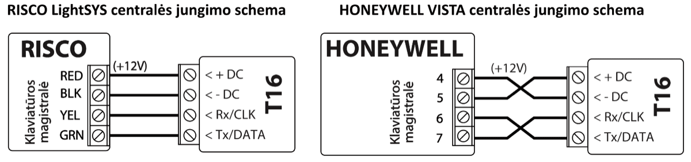
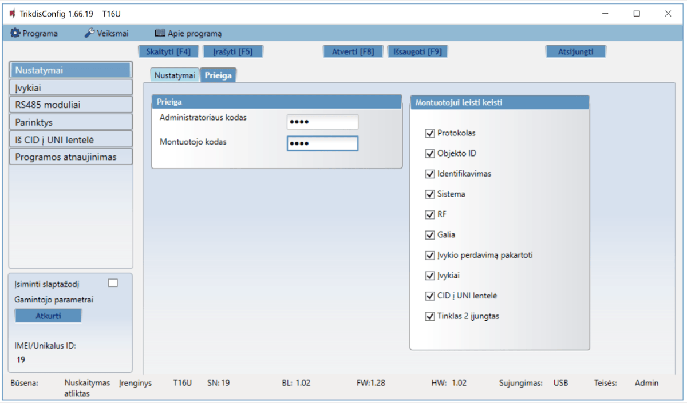

# Siųstuvas T16

## Aprašymas 

Radijo siųstuvas T16 yra daugiafunkcinis radijo įrenginys, naudojamas apsaugos centralių įvykių pranešimams perduoti per "Trikdis" radijo tinklus.

Siųstuvas gali siųsti savus įvykių pranešimus ir įvykių pranešimus, gautus iš apsaugos centralių į CSP (centralizuotą stebėjimo pultą) su galimybe iš CSP nukreipti galutiniam vartotojui.

#### Savybės

Komunikacija

- Įvykių pranešimų siuntimas į CSP.

- RAS3, RAS2M, LARS1, LARS radijo tinklo protokolai.

- Išėjimo galia nuo 1 W iki 5 W.

- Galimybė naudoti išorinį IP siųstuvą kaip pagrindinį ryšio kanalą.

- Įvykių pranešimų perdavimas Contact ID ir 4+2 kodais.

- Apsaugos centralių paskyros ID naudojimas daugiasritėms sistemoms.

Konfigūravimas

- Paprastas ir greitas instaliavimas.

- Siųstuvo gamyklinės programinės įrangos atnaujinimas.

- Du parametrų nustatymo lygiai (paskyros), instaliuotojui ir administratoriui.

- Galimybė konfigūruoti nuotoliniu būdu naudojant IP siųstuvą.

Nuoseklus prievadas, įėjimai ir išėjimai

- Universalus nuoseklus prievadas įvairioms apsaugos centralėms prijungti.

- TIP/RING telefono linijos sąsaja gali priimti pranešimus Contact ID ir 4+2 kodais iš centralės.

- RS485 sąsaja IP siųstuvams ir išplėtimo moduliams.

- 6 įėjimai, pasirenkamas tipas: NC, NO, EOL (2,2 kΩ). (*T16V*, *T16U*)

5 įėjimai, pasirenkamas tipas: NC, NO, EOL (2,2 kΩ). (*T16U5*)

- 1 išėjimas. (*T16V*, *T16U*)

2 išėjimai. (*T16U5*)

### Veikimo aprašymas 

Siųstuvas jungiamas prie apsauginės centralės išvadų, nuskaito ten esamus signalus ir juos transformuoja į pranešimus, atitinkančius protokolo Contact ID kodus.

Jei siųstuvas nustatytas transliuoti RAS-3 radijo sistemos kodavimu, tai *Contact ID* pranešimas transliuojamas nepakeistas. Nustačius, kad siųstuvas transliuotų kitais radijo sistemų kodais, pranešimai konvertuojami į tos sistemos kodus. Konvertavimo lentelė saugoma siųstuvo atmintyje ir, reikalui esant, gali būti koreguojama. Jei priėmimui naudojama *TRIKDIS* įranga, tai gauti bet kokiu kodavimu transliuoti pranešimai perduodami į stebėjimo programą tiksliomis jų reikšmėmis.

Prie siųstuvo *IN* išvadų (toliau įėjimų) gali būti jungiama *NC, NO* ar *EOL=2,2 kΩ* tipo išorinė grandinė. Pakitus grandinės būsenai arba jai atsistačius į pradinę, siųstuvas išsiųs to įvykio pranešimą.

Priimtus apsaugos centralės pranešimus, siųstuvas nustatytu radijo dažniu bei kodavimu transliuoja į eterį. Tas pats pranešimas gali būti pakartotas 1-10 kartų. Galima nustatyti, kad siųstuvas pranešimus transliuotų dviejų skirtingų radijo sistemų kodavimais, dviem skirtingais radijo dažniais bei su skirtingais saugomą objektą identifikuojančiais numeriais.

Siųstuvas periodiškai siunčia ryšio patikrinimo **Test** pranešimus. Savalaikį šių pranešimų priėmimą kontroliuoja stebėjimo pulto pranešimų stebėjimo programa. Galima nuolatos siųsti **PING** pranešimus, kurių savalaikį priėmimą kontroliuoja stebėjimo pulto priėmimo įranga.

Siųstuvas automatiškai tikrina maitinimo įtampą. Įtampai nukritus žemiau 11,5 ±0,2 V ribos, siųstuvas išsiųs pranešimą apie maitinimo įtampos nepakankamumą. Įtampai pakilus virš 12,6 ±0,2 V ribos, siųstuvas išsiųs pranešimą apie maitinimo įtampos atsistatymą.

Maitinimo įtampai nukritus žemiau 10 ±0,2 V ribos, siųstuvas persijungs veikti „miego“ režimu. Prieš persijungiant, siųstuvas išsiųs apie tai pranešimą. Veikdamas „miego“ režimu, siųstuvas nekaupia ir nesiunčia jokių pranešimų. Siųstuvas iš „miego“ režimo persijungs veikti darbiniu režimu tik tada, kai 12,6 V maitinimo įtampa išlieka stabili įjungus siųstuvo galią.

**Nuolatinės srovės maitinimo šaltinis.** T16 turi būti sujungtas tiesiai su maitinimo gnybtais (AUX) arba 12 V akumuliatoriaus gnybtais. Siųstuvo maitinimo laido skerspjūvis ne mažiau 1 mm2. Perduodant duomenis siųstuvas vartoja 1,2 A srovę, todėl maitinimo įtampos stabilumas yra svarbus patikimam siųstuvo darbui.

**Antena.** Antena labai svarbi kokybiško ryšio užtikrinimui. Naudokite tik tinkamo dažnio ir galios anteną. Jei naudojama 1/4 λ antena, ji turi būti vertikaliai orientuota ir sumontuota kuo aukščiau. Stenkitės vengti montuoti anteną vietose, kurios nuo priėmimo antenos uždengtos metaliniais skydais arba gelžbetoninėms pertvaromis. Geriausia ryšio kokybė užtikrinama esant tiesioginiam matomumui tarp siųstuvo ir imtuvo antenų. Be to dažniausiai ryšio kokybę galima pagerinti stengiantis iškelti anteną kuo didesniame aukštyje. Antena prie siųstuvo jungiama naudojant koaksialinį 50 Ω kabelį. Kuo ilgesnis kabelis, tuo didesni signalo nuostoliai jame. Rekomenduojama naudoti iki 10 metrų ilgio kabelį. Kai kabelio ilgis yra mažesnis nei 5 m rekomenduojamas RG-58U arba geresnis kabelis. Ilgam kabeliui naudokite kabelį su mažesniu slopinimu. Įrengus siųstuvą, reikia patikrinti ryšio kokybę. Tam reikia pasiųsti kelis pranešimus, ir patikrinti signalo lygį imtuve. Tinkamas yra ne žemesnis nei 3 lygio signalas.

**Duomenų kabelis**. Duomenų kabelis sujungiantis radijo siųstuvą ir apsaugos centralę turi būti ne ilgesnis nei 50 cm. Jei duomenų kabelis ilgesnis, reikia naudoti ekranuotą kabelį. Duomenų kabelis jungiamas centralėje prie klaviatūros magistralės, nuosekliosios jungties arba centralės telefoninio komunikatoriaus. Venkite kabelio montavimo lygiagrečiai su kintamos srovės jėgos kabeliais, antenos kabeliu ar kitais stipriais elektromagnetinio lauko šaltiniais.

**RS485 sąsaja**. Prie siųstuvo RS485 sąsajos galima prijungti modulius W485, E485 ir TM17. Kai RS485 magistralės ilgis yra didesnis nei 1 m, naudokite vytos poros kabelį (STP 4x2x0,5). Venkite kabelio montavimo lygiagrečiai su kintamos srovės jėgos kabeliais, antenos kabeliu ir kitais stipriais elektromagnetinio lauko šaltiniais.

### Techniniai parametrai 

| Parametras | T16V | T16U | T16U5 |
|------------|------|------|-------|
| Maitinimo įtampa | 10-15 V nuolatinės srovės |  |  |
| Naudojama srovė | Iki 50 mA (budėjimo režime) Iki 1,2 A (siuntimo režime) |  |  |
| Radijo dažniai | 136 MHz – 174 MHz (VHF) | 430 MHz – 512 MHz (UHF) | 430 MHz – 470 MHz (UHF) |
| Radijo kanalai | 2 |  |  |
| RF išėjimo varža | 50 Ω |  |  |
| Šalutiniai spinduliavimai | Atitinka EN 300 113 |  |  |
| Transliacijos RF protokolai | RAS3, RAS2M, LARS, LARS1, LARS_RAS2M, LARS1_RAS2M |  |  |
| Įvykio pranešimo transliacijos trukmė | 60-400 ms (priklauso nuo pasirinkto radijo protokolo) |  |  |
| Atmintis | Iki 32 pranešimų |  |  |
| įėjimas | 6, nustatomas tipas: NC, NO, EOL (2,2 кΩ) | 6, nustatomas tipas: NC, NO, EOL (2,2 кΩ) | 5, nustatomas tipas: NC, NO, EOL (2,2 кΩ) |
| Išėjimas | 1, OC tipo, komutavimo įtampa 15 V, 1 A | 1, OC tipo, komutavimo įtampa 15 V, 1 A | 2, OC tipo, komutavimo įtampa 15 V, 1 A |
| Įvykių pranešimų formatas | Contact ID;​ 4+2 |  |  |
| Darbinės aplinkos sąlygos | Temperatūra nuo –20 °C iki +50 °C, santykinis oro drėgnumas 80 %, kai temperatūra siekia +20 °C |  |  |
| Matmenys | 113 x 71 x 26 mm |  |  |
| Svoris | 0,10 kg |  |  |

Imtuvai, priimantys *T16* serijos siųstuvo skirtingais radijo sistemų formatais siunčiamus pranešimus

|                | RAS-002 | RAS-2M | LARS  | LARS1 | RAS-3 |
|----------------|:-------:|:------:|:-----:|:-----:|:-----:|
| TRIKDIS R7     |  **+**  | **+**  | **+** | **+** |       |
| TRIKDIS RF7    |  **+**  | **+**  | **+** | **+** |       |
| TRIKDIS R11    |  **+**  | **+**  | **+** | **+** | **+** |
| TRIKDIS RF11   |  **+**  | **+**  | **+** | **+** | **+** |
| Kitų gamintojų |         |        | **+** | **+** |       |

### Siųstuvo elementai 

|  |  | Antenos SMA jungtis. Šviesos indikatoriai. Priekinio dangtelio atidarymo plyšys. Gnybtai laidų prijungimui. |
|--|--|-------------------------------------------------------------------------------------------------------------|
| T16V, T16U | T16U5 |  |

### Išorinių gnybtų paskirtis 

| Kontaktas | Aprašymas |
|----|----|
| +DC | Maitinimo gnybtas (10-15 V nuolatinės srovės teigiamas gnybtas) |
| -DC | Maitinimo gnybtas (10-15 V nuolatinės srovės neigiamas gnybtas) |
| Rx/​CLK | Apsaugos centralės nuoseklaus prievado gnybtas CLK |
| Tx/​DATA | Apsaugos centralės nuoseklaus prievado gnybtas DATA |
| A RS485 | *RS485* magistralės A kontaktas |
| B RS485 | *RS485* magistralės B kontaktas |
| COM/​RING | Bendras (neigiamas) gnybtas arba telefoninio komunikatoriaus RING gnybtas |
| TIP | Telefoninio komunikatoriaus TIP gnybtas |
| IN1/​R-1 | 1 įėjimo gnybtas, pasirenkamo tipo: NC, NO, EOL (2,2 kΩ). (gamyklinis nustatymas NO) arba gnybtas telefono linijos stebėjimui |
| IN2/​T-1 | 2 įėjimo gnybtas, pasirenkamo tipo: NC, NO, EOL (2,2 kΩ). (gamyklinis nustatymas NO) arba gnybtas telefono linijos stebėjimui |
| IN3 | 3 įėjimo gnybtas, pasirenkamo tipo: NC, NO, EOL (2,2 kΩ). (gamyklinis nustatymas NO) |
| IN4 | 4 įėjimo gnybtas, pasirenkamo tipo: NC, NO, EOL (2,2 kΩ). (gamyklinis nustatymas NO) |
| COM | Bendras (neigiamas) gnybtas |
| IN5 | 5 įėjimo gnybtas, pasirenkamo tipo: NC, NO, EOL (2,2 kΩ). (gamyklinis nustatymas NO) |
| IN6 /​ arba | 6 įėjimo gnybtas, pasirenkamo tipo: NC, NO, EOL (2,2 kΩ). (gamyklinis nustatymas NO). (T16V, T16U) |
| OUT1 | Išėjimo gnybtas, atviro kolektoriaus tipo, srovė iki 1 A. (T16U5) |
| OUT1 /​ arba | Išėjimo gnybtas, atviro kolektoriaus tipo, srovė iki 1 A. (T16V, T16U) |
| OUT2 | Išėjimo gnybtas, atviro kolektoriaus tipo, srovė iki 1 A. (T16U5) |

### Šviesinė veikimo indikacija 

| Indikatorius | Veikimas | Aprašymas |
|--------------|----------|-----------|
| NETWORK (Tinklas) | Mirksi žaliai | Radijo siųstuvas siunčia duomenys |
| DATA (Duomenys) | Šviečia žaliai | Yra neišsiųstų įvykių pranešimų buferinėje atmintyje |
| DATA (Duomenys) | Šviečia raudonai | Perpildyta buferinė atmintis |
| DATA (Duomenys) | Mirksi raudonai (1/1) | Sujungimo problema su apsaugos centrale |
| DATA (Duomenys) | Mirksi raudonai (1/10) | RS-485 modulių sujungimo problema |
| POWER (Maitinimas) | Mirksi žaliai | Maitinimo įtampa yra pakankama |
| POWER (Maitinimas) | Mirksi geltonai | Žemo lygio maitinimo įtampa |
| POWER (Maitinimas) | Mirksi žaliai ir geltonai | (Konfigūravimo režimas) prijungtas USB kabelis |

### Medžiagos reikalingos montavimo darbams 

Prieš pradėdami įsitikinkite, kad turite:

1.  Konfigūracijai reikalingą USB kabelį („Mini-B“ tipo);

2.  Bent 4 gyslų kabelį siųstuvui prie apsaugos centralės prijungti;

3.  Apsaugos centralės instrukciją, prie kurios bus jungiamas siųstuvas;

4.  Anteną;

5.  Plokščią 2,5 mm atsuktuvą.

Reikalingas medžiagas galite užsisakyti iš vietinio platintojo.

## Sujungimų schemos ir įrengimas 

### Apsaugos centralių prijungimo schemos 

**Apsaugos centralių, prie kurių galima prijungti siųstuvus *T16V****, **T16U*** **ir *T16U5,* sąrašas**

| Gamintojas | Centralės modelis | T16V, T16U, T16U5 |
|------------|-------------------|-------------------|
| DSC® | PC1616, PC1832, PC1864, PC1616, PC1832, PC1864 | + |
| PYRONIX® | MATRIX 424, MATRIX 832, MATRIX 832+, MATRIX 6, MATRIX 816 | + |
| GE® | CADDX NX-4, NX-6, NX-8, NX-8E | + |
| PARADOX® | SPECTRA SPxxxx, 1727, 1728, 1738 | + |
| PARADOX® | MAGELLAN MG5000, MG5050 | + |
| PARADOX® | DIGIPLEX EVO48, EVO192, EVOHD, NE96, EVO96 | + |
| PARADOX® | ESPRIT E55, E65, 728ULT, 738ULT | + |
| SECOlink | PAS832 | + |
| TEXECOM | PREMIER 412, 816, 816+, 832 / PREMIER ELITE 12, 24, 48, 88, 168, 640 | + |
| CROW | RUNNER | + |
| ARGUS-SPECTR | Strelec RROP | + |
| BOLID | C2000 | + |
| ROVALANT | A6-06 (LARS / MAYAK) | + |
| RISCO | LightSYS | + |
| Honeywell | Vista | + |
| INIM | Smartline | + |
| Centralės, turinčios telefoninį komunikatorių | Formatai: Contact ID; 3/1, 4/1, 4/2 2300; 3/1, 4/1, 4/2 1400 | + |

Siųstuvų ***T16V**, **T16U**, **T16U5*** zonas (įėjimus IN) galima tiesiogiai jungti prie įvairių įrenginių (pvz.: jutiklių, panikos mygtuko, sirenos išėjimo) arba prie centralės programuojamų išėjimų PGM. Būtina įvertinti jungiamo įrenginio veikimą ir pasirinkti tinkamą zonos (įėjimo *IN*) tipą.

**Nuolatinės srovės maitinimo šaltinis**. Siųstuvui prijungti prie maitinimo šaltinio naudokite laidą ne mažiau 1 mm². Venkite ilgų kabelių (rekomenduojamas ilgis iki 1m). Venkite kabelio montavimo lygiagrečiai su kintamos srovės jėgos kabeliais, antenos kabeliu ar kitais stipriais elektromagnetinio lauko šaltiniais. Radijo siųstuvas pranešimo siuntimo metu vartoja 1,2 A srovę, todėl būtinas stabilus energijos šaltinis siųstuvo maitinimui (apsaugos centralės AUX gnybtai, arba prijungti tiesiogiai prie akumuliatoriaus gnybtų).

**Duomenų kabelis**. Duomenų kabelis sujungiantis radijo siųstuvą ir apsaugos centralę turi būti ne ilgesnis nei 50 cm. Jei duomenų kabelis ilgesnis reikia naudoti ekranuota kabelį. Duomenų kabelis jungiamas centralėje prie klaviatūros magistralės, nuosekliosios jungties arba centralės telefoninio komunikatoriaus. Venkite kabelio montavimo lygiagrečiai su kintamos srovės jėgos kabeliais, antenos kabeliu ar kitais stipriais elektromagnetinio lauko šaltiniais.

### Apsaugos centralės telefoninio komunikatoriaus prijungimo schema

!!! note
    T16 negalima jungti prie veikiančios telefoninės linijos.
Vadovaudamiesi centralės programavimo instrukcija, nustatykite centralės telefoninio komunikatoriaus veikimo parametrus:

- Įveskite keturženklį centralės identifikacijos numerį (angl. Account number, 0-9, A-F);

- Įveskite dviženklį telefoninio imtuvo numerį, kuriuo, įvykus įvykiui, centralė turės skambinti (pvz.: 12). Jei centralės TLC programavimo taisyklė reikalauja, po numerio įveskite numerio pabaigos ženklą;

- Nustatykite pranešimų perdavimo DTMF tonais būdą;

- Nustatykite automatinį pranešimų perdavimo protokolą Contact ID;

- Jei norite perduoti specialius pranešimus arba centralė neturi automatinio Contact ID kodų formavimo, ranka įveskite reikiamus įvykių kodus.

Suformuokite centralės pranešimą ir patikrinkite sąsajos veikimą. Šviesos indikatoriaus „**DATA**“ žybsėjimas parodys, kada siųstuvas priima centralės pranešimus.

Patikrinkite, ar nustatytam adresatui siųstuvas teisingai perdavė visus bandymo metu suformuotus centralės pranešimus.

### Įėjimo zonų prijungimo schemos 

Siųstuvas turi 6 (arba 5) įėjimo gnybtus (IN1, IN2, IN3, IN4, IN5, IN6) NO, NC, EOL tipo grandinėms prijungti. Gamyklinis įėjimų nustatymas – stebėti NO tipo grandinę. Kitą įėjimo grandinės tipą galima nustatyti TrikdisConfig lange **Reports → Inputs**.

NO, NC, EOL tipo grandinių laidinių sujungimų schemos:

### Centralės PGM-ų prijungimo schema 

Siųstuvo įėjimų (IN) nustatymo tipas NO arba NC.

### Sirenos prijungimo schema 

Sirena jungiama, kai prie siųstuvo yra prijungtas skaitytuvais *TM17*. Sireną, naudojančią iki 1 A srovę, galima prijungti prie siųstuvo *T16* OUT1 (arba OUT2) išėjimo. Jį aktyvuojama jei saugojimo režime siųstuve suveikia vienas iš įėjimų (IN). Sirena išjungiama po 3 minučių arba naudojant kontaktinį raktą (iButton).

### RS485 modulių prijungimo schemos 

Kai RS485 magistralės ilgis yra didesnis nei 1 m, naudokite vytos poros kabelį (STP 4x2x0,5). Venkite kabelio montavimo lygiagrečiai su kintamos srovės jėgos kabeliais, antenos kabeliu ir kitais stipriais elektromagnetinio lauko šaltiniais.

Wi-Fi modulis W485 suderinamas su T16 radijo siųstuvų. Kai įdiegsite ir užprogramuosite, W485 bevieliu būdu išsiųs pranešimus iš T16 per Wi-Fi interneto maršrutizatorių į CSP (centralizuotą stebėjimo pultą).

„Ethernet“ modulis E485 suderinamas su T16 radijo siųstuvų. Kai įdiegsite ir užprogramuosite, E485 laidiniu kompiuteriniu tinklu išsiųs pranešimus iš T16 į CSP (centralizuotą stebėjimo pultą).

## Veikimo parametrų nustatymas su programa TrikdisConfig 

1.  Parsisiųskite konfigūravimo programą TrikdisConfig iš [www.trikdis.com/lt](http://www.trikdis.com/lt)/ (programą rasite paieškos lauke surinkę „TrikdisConfig“), ir ją įdiekite.

2.  Plokščiu atsuktuvu nuimkite T16 dangtelį kaip parodyta žemiau:

1.  Su USB Mini-B kabeliu prijunkite T16 prie kompiuterio.

2.  Paleiskite konfigūravimo programą TrikdisConfig. Programa automatiškai atpažins prijungtą gaminį. Jei reikalaujama, įveskite administratoriaus arba instaliuotojo kodą iššokančiame langelyje ir TrikdisConfig automatiškai atidarys T16 konfigūravimo langą.

### TrikdisConfig būsenos juostos aprašymas 

Prijungus T16 prie programos TrikdisConfig ir nuspaudus mygtuką **Skaityti [F4]**, programa būsenų juostoje pateiks informaciją apie prijungtą gaminį:

| Pavadinimas | Aprašymas |
|----|----|
| Unikalus ID | Gaminio serijinis numeris |
| Būsena | Darbinė būsena |
| Įrenginys | Gaminio tipas (turi rodyti T16) |
| SN | Gaminio serijinis numeris |
| BL | Paleidyklės versija |
| FW | Gaminio programinės įrangos versija |
| HW | Gaminio aparatinės įrangos versija |
| Būsena | Sujungimo su programa būdas (per USB arba nuotolinis) |
| Role | Prieigos lygis (rodomas po to, kai patvirtintas prieigos kodas) |

!!! note
    Mygtukas **Skaityti [F4]**, kuri nuspaudus programa nuskaitytų ir
    parodytų nustatymus, kurie yra įrašyti įrenginyje. / Mygtukas **Įrašyti
    [F5]**, kuri nuspaudus bus įrašyti į įrenginį programoje padaryti
    nustatymai. / Mygtukas **Išsaugoti [F9]**, kuri nuspaudus padaryti
    nustatymai bus išsaugoti konfigūravimo byloje. Išsaugotus nustatymus
    vėliau galėsite įkelti į kitus įrenginius. **[Tai leidžia greitai
    konfigūruoti keletą gaminių su vienodais
    nustatymais.]{.underline}** / Mygtukas **Atverti [F8]**, kuri
    nuspaudus ir pasirinkus konfigūravimo bylą programoje bus atverti ir
    parodyti išsaugoti nustatymai. / Norėdami atkurti gamyklinius
    nustatymus, paspauskite **Atkurti** mygtuką lango apačioje kairėje.
Naujai programuojant T16, pirmiausia reikia nuskaityti jo konfigūraciją (gamyklinę), nuspaudus mygtuką **Skaityti [F4]**. Su TrikdisConfig, nustatykite reikiamus nustatymus pagal žemiau pateiktus programos langų aprašymus.

### Langas “Pagrindinis”

**Skirtukas „Nustatymai“**

**Parinkčių grupė „Pagrindiniai nustatymai“**

- **Nuoseklioji sąsaja** – pažymėkite, kai T16 yra prijungtas prie nuosekliosios sąsajos.

- **Telefono linijos sąsaja** - pažymėkite, kai T16 yra prijungtas prie centralės telefono linijos komunikatoriaus.

- **Apsaugos centralės modelis** – nurodomas apsaugos centralės tipas, prie kurios bus prijungtas siųstuvas.

**Parinkčių grupė „Radijo dažnis 1“**

- **Įjungta** – pažymėkite lauką ir bus įjungtas siųstuvo radijo kanalas.

- **RF protokolas** – nurodykite radijo ryšio protokolą, kuris bus naudojamas (RAS-2M, RAS-3, RAS-3-UID, LARS, LARS1, LARS_RAS2M, LARS1_RAS2M).

- **Objekto numeris** – įrašykite vartotojo identifikavimo numerį siųstuvo siunčiamiems vidiniams įvykiams ir prijungtos centralės įvykiams.

- **Grupė** – įrašykite dalinį vartotojo identifikavimo ID (naudojamas tik su LARS RF protokolų).

- **Naudoti centralės obj. Nr.** – pažymėkite langelį ir centralės įvykiai bus siunčiami su apsaugos centralės identifikavimo numerių ID. Ne visos centralės leidžia naudoti identifikavimo numerį.

- **Sistema** – radijo tinklo sistemos numeris. Naudojamas suskirstyti objektus (vartotojus) į grupes radijo ryšio tinkle.

- **RF pavadinimas/Dažnis** – radijo kanalo dažnio pavadinimas, kurį galima aprašyti lange **Parinktys > Galimi radijo dažniai**.

- **RF galia** – pasirinkite siųstuvo galia (1-5 W).

- **Įvykį siųsti** – įrašykite įvykių perdavimų pakartojimu kartus (1-10 kartu). (Rekomenduojama palikti gamyklinius nustatymus).

- **Test įvykį siųsti** – nurodykite testo perdavimo pakartojimu kartus (1-10 kartu). (Rekomenduojama palikti gamyklinius nustatymus).

**Parinkčių grupė „Radijo dažnis 2“**

Nustatymai analogiški kaip ir **Radijo dažnis 1**.

**Skirtukas „Prieiga“**

**Parinkčių grupė „Prieiga“**

- **Administratoriaus kodas** – suteikia pilną prieigą prie siųstuvo konfigūravimo. Kodas yra iki 6 simbolių ilgio, ir yra iš skaitmenų arba lotynišku radžiu. (Gamyklinis kodas - 1234).

- **Instaliatoriaus kodas** - suteikia ribotą prieigą prie siųstuvo konfigūravimo (Gamyklinis kodas - 1234).

**Parinkčių grupė „Montuotojui leisti keisti“**

Konfigūruojant radijo siųstuvą T16 yra du prieigos lygiai (administratoriaus ir instaliuotojo). Administratoriaus prieiga leidžia prieiti prie visų konfigūravimo funkcijų. Instaliuotojo prieiga leidžia ribotai keisti siųstuvo konfigūraciją. Administratorius nustato, kuriuos parametrus galės keisti instaliuotojas (vartotojas).

### Langas “Pranešimai” 

**Skirtukas „Įėjimai“**

- **Įjungta** – pažymėkite langelį, kad įjungti įvykio siuntimą, kai suveikia įėjimas.

- **Nr** – priskirkite įėjimui numerį.

- **Tipas** – nurodykite įėjimo tipą (NO, NC, EOL).

- **Užlaikymas** – nurodykite įėjimo suveikimo vėlinimo laiką (s).

- **Įvykis F1** –įvykio kodas siunčiamas radijo siųstuvo 1 ryšio kanalu (CID kodas nusistato automatiškai).

- **Atsistatymas F1** – įvykio atsistatymo kodas siunčiamas radijo siųstuvo 1 ryšio kanalu (CID kodas nusistato automatiškai).

- **Įvykis F2** – įvykio kodas siunčiamas radijo siųstuvo 2 ryšio kanalu (CID kodas nusistato automatiškai).

- **Atsistatymas F2** – įvykio atsistatymo kodas siunčiamas radijo siųstuvo 2 ryšio kanalu (CID kodas nusistato automatiškai).

**Skirtukas „Įvykiai“**

- **Įgalinta** – pažymėkite langelį, kad įjungti vidiniu įvykiu pranešimu siuntimą:
- **Žema baterijos įtampa** – maitinimo įtampa žemesnė 11,5 V.

- **Miego režimas** – maitinimo įtampa žemesnė 10 V.

- **Konfigūracija pakeista** – siųstuvo konfigūravimo keitimas.

- **RS485 klaida** – prijungtų prietaisu prie RS485 magistralės sutrikimas.

- **Nėra ryšio su centrale** – prarastas ryšys tarp siųstuvo ir apsaugos centralės.

- **Maitinimo įjungimas** – maitinimo siųstuvui įjungimas.

- **Ypatingas** – specialaus kodo naudojimas radijo tinkle, kai naudojamas radijo signalo kartotuvas su „klausymo“ ir „atšaukimo“ režimu.

- **Testas** – periodinio Testo pranešimas.

- **TM17 Išjungimas/Įjungimas** – siunčiami pranešimai Įjungta/Išjungta, kai naudojamas skaitytuvas TM17.

- **Maitinimo šaltinio gedimas** – siunčiamas maitinimo įtampos gedimas, kai nuolatinės srovės maitinimo šaltinio įtampa žemesnė 11,5 V.
- **Radijo dažnis 1** – pirmo radijo kanalo vidiniu įvykiu kodai, kurie bus siunčiami įvykus įvykiu ir jam atsistačius.
- **Radijo dažnis 2** – antro radijo kanalo vidiniu įvykiu kodus, kurie bus siunčiami įvykus įvykiu ir jam atsistačius.

**Skirtukas „Ryšio kontrolė“**

- **Testo periodas** – nurodykite laiko tarpą tarp testo pranešimo siuntimu 1 ir 2 ryšio kanalais. Periodinių bandymų pranešimų tikslas yra radijo sistemų periodiško funkcionalumo bandymas. Tipinis bandymo laikotarpis yra 24 val.. Tačiau jis gali būti sutrumpintas iki 1 valandos. Testo pranešimą automatiškai stebi CSP stebėjimo programinė įranga. Jei iš objekto nėra Testo pranešimų generuojamas įspėjimas.
- **Primas testas po** – nurodykite uždelsimo laiką pirmo Testo pranešimo siuntimui po maitinimo įjungimo. Tikslas - turėti galimybę siusti pranešimus išskirstytus per dieną (24 valandas), kad radijo tinkle išvengti tinklo perkrovų. Nurodomi laikai 1 ir 2 ryšio kanalams.

- **Siųsti testą tik tuo atveju, jei nėra įvykio** – pažymėkite langelį Testo pranešimo siuntimui, tik kai nėra siunčiamų įvykiu pranešimų.

- **PING periodas** – nurodykite kas kokį laiko tarpa bus siunčiamas PING signalas**.** Pagrindinis "PING" pranešimų tikslas yra kontroliuoti saugomo objekto įrangos veiksnumą. PING pranešimas sugeneruojamas per trumpą laiką (kas 5-10 minučių) ir išsiunčiamas. PING pranešimai automatiškai stebimi CSP imtuvo. Svarbu suprasti, kad radijo tinklas yra skirtas pranešimams perduoti apie įvykius, tai reiškia, kad PING pranešimai gali būti naudojami tik iš svarbiausiu saugomu objektu radijo tinkle, kad būtų išvengta tinklo perkrovimo.

- **Siųsti Ping tik tuo atveju, jei nėra įvykio** – pažymėkite langelį PING signalo siuntimui, tik kai nėra siunčiamų įvykiu pranešimų.

### Langas “RS485 moduliai” 

**Skirtukas „Modulių sąrašas“**

- **Automatiškai aptikti išorinį RS485 įrenginį** – pažymėkite langelį varnele ir bus įjungtas prijungtu moduliu prie RS485 magistralės automatinis atpažinimas.

- **Pavadinimas (Type)** – iš sąrašo išrenkamas prie siųstuvo magistralės RS485 prijungtas modulis.

- **Serijos numeris (Serial)** - nurodomas prijungto modulio serijinis numeris. Numerį rasite ant lipduko, užklijuoto ant prijungto modulio arba jo įpakavimo dėžutės.

- **Siųsti patvirtinimą į centralę** – jei IP siųstuvas (WiFi, LAN) yra prijungtas prie T16 RS485 magistralės kaip pagrindinis kanalas. Pažymėjus langelį varnele centralė gauna patvirtinimą apie išsiusto pranešimo gavimą pultu. Taip užtikrinamas didesnis pranešimų perdavimo patikimumas. Ne visos centralės turi tokia galimybę. Išrinkus centralė, kurį šios galimybės neturi langelis bus neaktyvus.

!!! note
    Prie siųstuvo T16 galima prijungti tik po vieną TM17,
    W485(arba E485) modulius.
**Skirtukas „ТМ17“**

Prie siųstuvo T16 yra galimybė prijungti skaitytuvą TM17. Prijungus skaitytuvą TM17, siųstuvą galima naudoti kaip apsaugos centralę. Skaitytuvui galima priskirti 9 kontaktinius (iButton) raktus (vienas iš kurių „Pagrindinis raktas“), kuriais bus valdoma saugos būsena (įjungti/išjungti).

- **Dkey 1 – Dkey 9** – į langelius įrašomi identifikaciniai kontaktiniu (iButton) raktu numeriai.

- **Garso lygis** – įrašykite skaitytuvo garso signalo stiprumo lygį (galimos reikšmės nuo 0 iki 100).

- **Protegus O/C kodas** - kodas naudojamas įjungimui/išjungimui apsaugos sistemai su Protegus (gamyklinis kodas – 1234). Langas matomas tik konfigūruojant per USB kabelį (nuotolinėje konfigūracijoje nematomas).

#### Kontaktinių (iButton) raktų registravimas 

1.  Jei kontaktinių raktų sąrašas tuščias, pirmas priglaustas prie skaitytuvo raktas priregistruojamas ir įrašomas į pirmąją sąrašo eilutę ir jam priskiriama „**Pagrindinio rakto“** funkcija.

2.  Norint įjungti kontaktinių raktų registravimo režimą, reikia „**Pagrindinį raktą**“ priglausti prie raktų skaitytuvo akies ir palaikyti jį ne trumpiau nei 10 sekundžių. „**State**“ indikatorius užges. Kai įsijungs registravimo režimas, skaitytuvo TM17 LED indikatorius pradės mirksėti žaliai ir atsiras garsinis signalas.

3.  Naujai registruojama raktą priglauskite ir palaikykite prie skaitytuvo akies. Skaitytuvo garsinis signalas nutils. Raktas įrašytas į sąrašą. Atitraukite raktą nuo skaitytuvo. Skaitytuvo žalias indikatorius nustos mirksėti ir užsidegs žaliai. Po keliu sekundžių skaitytuvas automatiškai išeina iš rakto registravimo režimo. Užsidega „**State**“ indikatorius žaliai ir užgesta skaitytuvo žalias indikatorius.

4.  Norint priregistruoti dar vieną kontaktinį raktą reikia įjungti kontaktinio rakto registravimo režimą iš naujo.

5.  Norint ištrinti visus raktus (ir pagrindinį), reikia palaikyti **„Pagrindinį raktą“** priglaudus prie skaitytuvo ne trumpiau 20 s.

#### Siųstuvo naudojimas kaip apsaugos centralę 

Prijungus skaitytuvą TM17, siųstuvą galima naudoti kaip apsaugos centralę. Prie įėjimu (IN1 – IN6) galima prijungti apsaugos jutikliu kontaktus. Jei prie radijo siųstuvo yra prijungtas W485 (arba E485) modulis, tada apsaugos sistemą galima valdyti nuotoliniu būdu per kompiuterinį tinklą.

#### Įėjimų (IN) ir išėjimo (OUT) gamykliniai nustatymai

| Kontaktas | Aprašymas |
|-----------|-----------|
| IN1 | 1 įėjimo gnybtas, pasirenkamo tipo: NC, NO, EOL (2,2 kΩ). (gamyklinis nustatymas NO). Įėjimo/​išėjimo zona. Įjungus signalizaciją, per išėjimo iš patalpų laiką leidžiamas Įėjimo zonos pažeidimas. Jei po šio laiko zona išlieka pažeista, formuojamas išėjimo OUT1 signalas bei siunčiamas pranešimas. Pažeidus zoną esant įjungtai signalizacijai, pradedama skaičiuoti įėjimo į patalpas laikas. Per šį laiką signalizacija turi būti išjungta, antraip bus formuojamas išėjimo OUT1 signalas bei siunčiamas pranešimas. |
| IN2 (IN3, IN4, IN5, IN6) | 2 (3, 4, 5, 6) įėjimo gnybtas, pasirenkamo tipo: NC, NO, EOL (2,2 kΩ). (gamyklinis nustatymas NO). Momentinė zona. Pažeidus zoną esant įjungtai signalizacijai, bus nedelsiant formuojamas išėjimo OUT1 (arba OUT2) signalas bei siunčiamas pranešimas. |
| OUT1 /​ arba | Išėjimo gnybtas, atviro kolektoriaus tipo, srovė iki 1 A. Gnybtas skirtas sirenai prijungti. (T16V, T16U) |
| OUT2 | Išėjimo gnybtas, atviro kolektoriaus tipo, srovė iki 1 A. Gnybtas skirtas sirenai prijungti. (T16U5) |

Apie saugojimo metu suveikusius įėjimus informuoja TM17 mirksintys atitinkamų įėjimu indikatoriai. Išjungus saugojimo režimą (pridėti prie skaitytuvo raktą), indikatoriai nenustoja mirksėti. Tam, kad jie nustotų mirksėti, reikia dar kartą pridėti prie skaitytuvo raktą.

#### *TM17* skaitytuvo šviesinė indikacija

| Indikatorius | Būklė | Aprašymas |
|--------------|-------|-----------|
| 1 (2, 3, 4, 5, 6) | Nešviečia | Zona nesuveikus |
| 1 (2, 3, 4, 5, 6) | Šviečia raudonai | Zona suveikus |
| 1 (2, 3, 4, 5, 6) | Mirksi raudonai | Suveikusi zona sukėlė apsaugos sistemos suveikimą |
| State / (būsena) | Šviečia žaliai | Srities apsaugos signalizacija išjungta |
| State / (būsena) | Mirksi žaliai | Skaičiuojamas išėjimo laikas |
| State / (būsena) | Šviečia raudonai | Srities apsaugos signalizacija įjungta |
| State / (būsena) | Mirksi raudonai | Skaičiuojamas įėjimo laikas |
| Trouble / (Nesklandumas) | Nešviečia ir nemirksi | Veikia be nesklandumų |
| Trouble / (Nesklandumas) | 9 mirktelėjimai raudonai | Ryšio su RS485 moduliu sutrikimas |

**Skirtukas „W485“**

**Parinkčių grupė „Pagrindinis“**

- **Įjungta** – pažymėjus lauką varnele, bus įjungtas Pagrindinis ryšio kanalas.

- **TRK šifravimo raktas** – 6 skaitmenų pranešimų šifravimo raktas. Į komunikatorių įrašytas šifravimo raktas turi būti toks, koks įrašytas į imtuvą, t.y. turi sutapti, būti vienodas.

- **Domenas arba IP** – įrašykite imtuvo domeno arba IP adresą.

- **Prievadas** – įrašykite imtuvo prievado (*angl. port*) numerį tinkle.

- **TCP ar UDP** – pasirinkite įvykių perdavimo protokolą (TCP arba UDP).

**Parinkčių grupė „Atsarginis“**

Įgalinkite atsarginio kanalo režimą, kad, nutrūkus ryšiui, įvykiai būtų siunčiami atsarginiu kanalu. Sukonfigūruokite atsarginį kanalą, nustatymo laukai tokie patys ir Pagrindinio ryšio kanalo.

**Parinkčių grupė „Protegus“**

- **Įjungta** - Protegus serviso įjungimas, T16 galės keistis duomenimis su Protegus programėle ir bus galima su TrikdisConfig atlikti konfigūravimą nuotoliniu būdu.

- **DHCP režimas** – WiFi modulio registracijos tinkle rėžimas (rankinis arba automatinis).

- **Statinis IP** – statinis IP adresas esant rankiniam registracijos rėžimui.

- **Potinklio kaukė** – potinklio kaukė esant rankiniam registracijos rėžimui.

- **Numatytasis šliuzas** – tinklų sietuvo adresas esant rankiniam registracijos rėžimui.

- **DNS1, DNS2** – (angl. Domain Name System) nurodomas serveris, kuris nurodo domeno IP adresą. Naudojamas, kai ryšio kanalo **Domenas arba IP** lauke nurodytas ne IP adresas, o domenas. Gamykliškai nustatyti Google DNS serverių adresai.

- **Wifi SSID pavadinimas** - WiFi tinklo (prie kurio jungsis modulis W485) pavadinimas.
- **Wifi SSID slaptažodis** - WiFi tinklo slaptažodis.

**Skirtukas „E485“**

**Parinkčių grupė „Pagrindinis“**

- **Įjungta** – pažymėjus lauką varnele, bus įjungtas Pagrindinis ryšio kanalas.

- **TRK šifravimo raktas** – 6 skaitmenų pranešimų šifravimo raktas. Į komunikatorių įrašytas šifravimo raktas turi būti toks, koks įrašytas į imtuvą, t.y. turi sutapti, būti vienodas.

- **Domenas arba IP** – įrašykite imtuvo domeno arba IP adresą.

- **Prievadas** – įrašykite imtuvo prievado (*angl. port*) numerį tinkle.

- **TCP ar UDP** – pasirinkite įvykių perdavimo protokolą (TCP arba UDP).

**Parinkčių grupė „Atsarginis“**

Įgalinkite atsarginio kanalo režimą, kad, nutrūkus ryšiui, įvykiai būtų siunčiami atsarginiu kanalu. Sukonfigūruokite atsarginį kanalą, nustatymo laukai tokie patys ir Pagrindinio ryšio kanalo.

**Parinkčių grupė „Protegus“**

- **Įjungta** - Protegus serviso įjungimas, T16 galės keistis duomenimis su Protegus programėle ir bus galima su TrikdisConfig atlikti konfigūravimą nuotoliniu būdu.

- **DHCP režimas** –„Ethernet“ modulio registracijos tinkle rėžimas (rankinis arba automatinis).

- **Statinis IP** – statinis IP adresas esant rankiniam registracijos rėžimui.

- **Potinklio kaukė** – potinklio kaukė esant rankiniam registracijos rėžimui.

- **Numatytasis šliuzas** – tinklų sietuvo adresas esant rankiniam registracijos rėžimui.

- **DNS1, DNS2** – (angl. Domain Name System) nurodomas serveris, kuris nurodo domeno IP adresą. Naudojamas, kai ryšio kanalo **Domenas arba IP** lauke nurodytas ne IP adresas, o domenas. Gamykliškai nustatyti Google DNS serverių adresai.

### Langas “Parinktys” 

**Parinkčių grupė „Galimi radijo dažniai“**

Galima Pridėti/Pašalinti radijo dažnius prie sąrašo, kuriuose gali dirbti siųstuvas T16. Radijo dažniams suteikiami „Pavadinimai“.

### Langas „Iš CID į UNI lentelė” 

Contact ID kodai, gauti iš signalizacijos centralės, konvertuojami į radijo sistemos (RAS2M, LARS) kodus. Tik Contact ID pranešimai, aprašyti lentelėje (CID stulpelis), yra konvertuojami į radijo sistemos kodus ir perduodami CSP. Simbolis "?" reiškia bet kurį skaičių pozicijoje. Simbolis "z" reiškia, kad numeris pozicijoje pridedamas prie pagrindinio radijo sistemos kodo. <u>Lentelė redaguojama, tačiau prašome padaryti tai atsakingai ir tik tuo atveju, jei tai tikrai būtina, nes jei lentelėje atsiras klaidų, sistema gali netinkamai veikti.</u>

!!! note
    Baigę konfigūravimą paspauskite mygtuką **Įrašyti [F5]**, sulaukite
    kol duomenys bus įrašyti ir atjunkite USB kabelį.
### Gamyklinių nustatymų atstatymas 

Norint atkurti siųstuvo gamyklinius nustatymus, reikia nuspausti programos TrikdisConfig mygtuką **Atkurti.**

## Radijo siųstuvo T16 testavimas 

Kai konfigūracija ir diegimas bus baigti, atlikite sistemos patikrą:

1.  Patikrinkite, ar maitinimas yra įjungtas;

2.  Norėdami išbandyti T16 įėjimus, suveikdinkite juos ir įsitikinkite, kad CSP imtuvą pasiekia teisingi pranešimai;

3.  Atlikite signalizacijos bandymą, kad įsitikintumėte, jog signalizacijos įvykių pranešimus CSP (centralizuotas stebėjimo pultas) tinkamai priima.

## Programinės aparatinės įrangos atnaujinimas 

!!! note
    Prijungus T16 prie TrikdisConfig, programa pasiūlys
    atnaujinti įrenginio veikimo programą, jeigu yra atnaujinimų. Šiam
    veikimui reikalingas interneto ryšys. / Jei jūsų kompiuteryje yra
    instaliuota antivirusinė programa, ji gali blokuoti automatinio
    gamyklinės programinės įrangos atnaujinimo funkciją. Šiuo atveju
    turėsite perkonfigūruoti savo antivirusinę programą.
T16 veikimo programą galima atnaujinti ar pakeisti rankiniu būdu. Po atnaujinimo išlieka visi ankstesni nustatyti T16 parametrai, jei yra uždėta varnelė prie „**Išsaugoti nustatymus**“. Veikimo programą įrašant rankiniu būdu, ji gali būti pakeista į naujesnę arba senesnę versiją. Atlikite šiuos žingsnius:

1.  Paleiskite ***TrikdisConfig**.*

2.  Prijunkite T16 per USB Mini-B kabelį prie kompiuterio. Jei yra naujesnė gamyklinė programinė įranga, programa pasiūlys įdiegti naujesnės gamyklinės programinės įrangos versijos bylą.

3.  Parinkite gamyklinės programinės įrangos submeniu **Programos naujinimas**.

    

4.  Paspauskite gamyklinės programinės įrangos atidarymo langelį **Atverti failą** ir parinkite reikiamą gamyklinės programinės įrangos bylą. Jei neturite bylos, naujausią gamyklinės programinės įrangos bylą galite parsisiųsti <u>kaip registruotas vartotojas</u> iš [www.trikdis.com](http://www.trikdis.com) , pagal T16 parsisiuntimo sekciją.

5.  Paspauskite atnaujinimo mygtuką **Naujinti [F12]**.

6.  Palaukite, kol bus atlikti atnaujinimai.

## Saugos reikalavimai 

Radijo siųstuvą turi įrengti ir prižiūrėti kvalifikuoti specialistai.

Prieš įrengdami, atidžiai perskaitykite šį vadovą, kad išvengtumėte klaidų, dėl kurių prietaisas gali blogai veikti ar net būti sugadintas.

Prieš jungdami bet kokius elektros kontaktus atjunkite elektros tiekimą.

Ne gamintojo atlikti gaminio pakeitimai, modifikacijos ar remontai panaikina gamintojo suteiktą garantiją.

