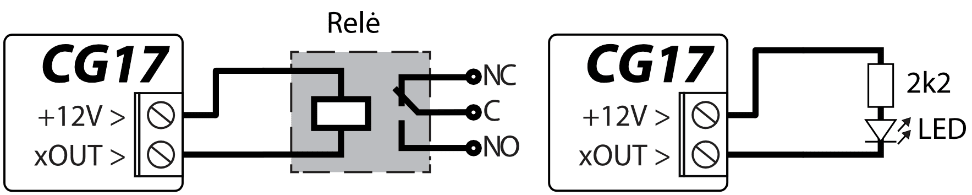
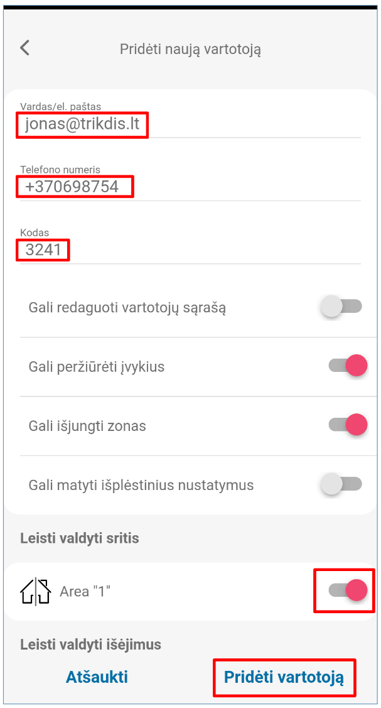

# GSM apsaugos centralė *CG17*

  

## 1. Aprašymas 

CG17 yra daugiafunkcė apsaugos centralė su integruotu mobiliojo ryšio komunikatoriumi. Centralė leidžia sukurti į 8 sritis sugrupuotų 12 laidinių ir belaidžių zonų sistemą.

Su CG17 galite:

- Įrengti paprastą apsaugos sistemą, kurią galima stebėti ir valdyti nuotoliniu būdu su Protegus2 programėle.

- Valdyti įvairią įrangą nuotoliniu būdu (pvz., šildymo ar ventiliacijos sistemas, vartų automatiką) ir stebėti temperatūrą.

- Stebėti temperatūrą, degalų lygį, nuolatinės įtampos lygį ar kitus parametrus.

- Pranešti vartotojams apie įvykius.

- Siųsti įvykių pranešimus į saugos tarnybos imtuvą.

**Savybės**

Siunčia įvykius į stebėjimo pulto imtuvą:

- Siunčia įvykius į TRIKDIS programinius arba aparatūrinius imtuvus, kurie dirba su bet kuria stebėjimo programa.

- Gali siųsti pranešimus apie įvykius į SIA DC-09 imtuvus.

- Ryšio kontrolė siunčiant PING pranešimus į IP imtuvą kas 30 sekundžių (arba pagal vartotojo nustatytą laikotarpį).

- Atsarginis ryšio kanalas bus naudojamas, jei bus prarastas ryšis pagrindiniu kanalu.

- Pranešimų į pultą perdavimas SMS žinutėmis. Jis ypatingai naudingas, nes veikia net ir tada, kai sutrinka IP ryšys mobiliojo ryšio operatoriaus tinkle.

- Kai įjungta „Protegus“ paslauga, įvykiai iš pradžių siunčiami į ST pulto imtuvą ir tik po to siunčiami *Protegus2* programėlės vartotojams.

Dirba su „Protegus2“ programėle:

- „Push” ir specialūs garso įspėjimai apie įvykius.

- Nuotolinis sistemos valdymas (Arm / Disarm).

- Nuotolinis prijungtų įrenginių valdymas (šviestuvai, vartai, vėdinimo sistemos, šildymas, purkštuvai ir kt.).

- Nuotolinė temperatūros kontrolė (su iO, iO-WL, iO-LORA išplėtėjais).

- Skirtingos administratoriaus, instaliuotojo ir vartotojo teisės.

- Vartotojai gali būti informuojami apie įvykius SMS žinutėmis ir telefono skambučiu.

**Pranešimai vartotojams apie įvykius:**

- Paskambina į pasirinktus telefono numerius (iki 8 naudotojų).

- Siunčia SMS pranešimus apie įvykius.

- „Push” ir specialūs garso įspėjimai apie įvykius su Protegus2 programėle.

**Nuotolinis sistemos ir išėjimų valdymas:**

- Naudojant Protegus2 programėlę.

- Naudojant kontaktinių raktų (iButton) skaitytuvą.

- Naudojant RFID skaitytuvą su klaviatūra (Wiegand 26/34).

- Skambindami į įrenginio telefono numerį.

- Naudojant SMS žinutes.

- Naudojant automatinį „jei ... tada“ algoritmą. Pvz. kai įėjimas yra suveiksminamas arba temperatūra viršija tam tikrą ribą, išėjimas bus įjungtas.

**Palaiko šiuos išplėtėjus:**

- iO, LORA serijos išplėtėjai, kurie padidina įėjimų (IN) ir išėjimų (OUT) skaičių.

- GPS imtuvas (naudingas saugant bankomatus ir prekybos automatus).

- Degalų lygio jutiklis. Degalų rezervuarų apsaugai ir lygio stebėjimui.

- Atsarginis 12 V akumuliatoriaus maitinimas ir krovimas.

**Įėjimai ir išėjimai:**

- 1 įėjimas, 2 išėjimai ir 3 dvigubi I/O kontaktai, kurios galima nustatyti kaip įėjimo (IN) arba išėjimo (OUT) kontaktą.

- Vieno laido duomenų šyna (*1-Wire*), skirta prijungti temperatūros jutiklį (iki 8 vnt.) ir kontaktinį (*iButton*) raktų skaitytuvą.

- Naudojant iO, LORA serijos išplėtėjus, įėjimų (IN) ir išėjimų (OUT) skaičių galima išplėsti iki 12 vnt.

**Paprastas diegimas:**

- Gamykliniai nustatymai leidžia naudoti valdiklį kaip apsaugos centralę arba kaip komunikatorių.

- Parametrus galima išsaugoti faile ir greitai įrašyti į kitus įrenginius.

- Įrenginio konfigūravimas prijungus USB kabeliu arba nuotoliniu būdu naudojant TrikdisConfig programą.

- Du parametrų nustatymo lygiai (paskyros), instaliuotojui ir administratoriui.

### 1.1 Įrenginio tipai 

Ši instrukcija galioja šiems CG17 modeliams:

- CG17_12, CG17 centralė su 2G modemu.

- CG17_14, CG17_1E, CG17_1S, CG17 centralė su 4G modemu.

### 1.2 Techniniai parametrai

| Parametras | Aprašymas |
|------------|-----------|
| GSM/​GPRS modemo dažniai | 850 /​ 900 /​ 1800 /​ 1900 MHz |
| 4G modemo dažniai: Europa Lotinų Amerika | - LTE-FDD Bands: B1/​B3/​B5/​B7/​B8/​B20/​B28 /​ - GSM Bands: B2/​B3/​B5/​B8 /​ - LTE-FDD Bands: B2/​B3/​B4/​B5/​B7/​B8/​B28/​B66 /​ - GSM Bands: B2/​B3/​B5/​B8 |
| Maitinimo šaltinis [AC /​ DC] | Nuolatinės srovės 16-32 V arba kintamos srovės 16-18 V |
| Srovės naudojimas | Iki 50 mA (budint), /​ Iki 200 mA (trumpalaikis, siuntimo metu) |
| Atsarginis maitinimo šaltinis [BAT] | 12 V švino - rūgštinis akumuliatorius |
| Akumuliatoriaus įkrovos srovė | Iki 500 mA |
| Išorinių įrenginių maitinimo įtampa ir srovė [+12 V] | Nuolatinė 12 V, iki 1 A |
| Įėjimai [IN] | 1 vnt., nustatomas NC, NO, EOL=10 kΩ, EOL_T tipas |
| Sričių skaičius | 8 |
| Zonų skaičius | 4, (su plėtikliais plečiamas iki 12 zonų) |
| PGM išėjimų skaičius | 2 (priskyrus IO gnybtams išėjimo darbo režimą galima gauti 5 PGM išėjimus. Su plėtikliais plečiamas iki 12 išėjimų) |
| 1-Wire magistralės ilgis [1 WIRE] | Iki 30 m |
| Naudotini temperatūros davikliai | Maxim®/​Dallas® DS18S20, DS18B20 |
| Didžiausias temperatūros daviklių, jungiamų prie 1-Wire magistralės, skaičius | 8 vnt. |
| Naudotini kontaktiniai (iButton) raktai [1 WIRE] | Maxim®/​Dallas® DS1990A |
| Didžiausias kontaktinių (iButton) raktų skaičius | 12 vnt. |
| RS485 magistralės ilgis | Iki 100 m |
| Didžiausias įrenginių, jungiamų prie RS485 magistralės, skaičius | 8 vnt. |
| Palaikoma klaviatūra | Crow CR-16, Crow LCD, Crow touch keypad |
| Palaikomi moduliai | iO-8 - plėtimo modulis;​ /​ iO – plėtimo modulis;​ /​ iO-MOD – iO-WL radijo bangų imtuvas;​ /​ iO-WL – bevielis plėtimo modulis;​ /​ RF-SH – bevielių jutiklių radijo bangų imtuvas;​ /​ E485 – prijungimo prie „Ethernet“ tinklo modulis;​ /​ W485 – prijungimo prie WiFi tinklo modulis;​ /​ TM17 – iButton raktų skaitytuvas;​ /​ CZ-Dallas – iButton raktų skaitytuvas;​ /​ FLS - kuro lygio jutiklis „Strela RS485“;​ /​ iO-LORA - plėtimo modulis;​ /​ iO8-LORA - plėtimo modulis;​ /​ PB-LORA – panikos mygtukas;​ /​ REL-LORA – plėtimo modulis. |
| Buferinės atmintinės talpa | 60 įvykių |
| Ryšio kanalų skaičius | 2 kanalai (pirmas kanalas: pagrindinis, atsarginis;​ antras kanalas: Protegus) |
| Vidinis laikrodis | Yra |
| Įvykių pranešimų perdavimo kanalai | GPRS arba 4G, SMS |
| Ryšys su CSP | TCP /​ IP arba UDP /​ IP, arba SMS |
| Ryšio protokolai | TRK, šifruotas SIA DC-09_2007, SIA DC-09_2012, SIA DC-09_IPcom |
| Darbinė aplinka | Nuo -10 °C iki + 50 °C, santykinė oro drėgmė 0-80%, kai yra 0- +20 °C (be kondensato) |
| Matmenys | 113x 70 x 25 mm |
| Svoris | 0,10 kg |

### 1.3 Išorinių kontaktų paskirtis

1.  GSM antenos SMA tipo jungtis.

2.  Šviesiniai LED indikatoriai.

3.  Viršutinio dangtelio atidarymo anga.

4.  Išorinių kontaktų kištukinės jungtys.

5.  USB Mini-B jungtis *CG17* programuoti.

6.  „Nano“ dydžio SIM kortelės laikiklis.

| Kontaktas | Aprašymas |
|----|----|
| AC /​ +DC | Maitinimo šaltinio kontaktas (16-18 V kintamos srovės arba teigiamas 16-24 V nuolatinės srovės) |
| AC /​ -DC | Maitinimo šaltinio kontaktas (16-18 V kintamos srovės arba neigiamas 16-24 V nuolatinės srovės) |
| BAT+ | Atsarginio maitinimo šaltinio teigiamo gnybto kontaktas 12 V |
| BAT- | Atsarginio maitinimo šaltinio neigiamo gnybto kontaktas 12 V |
| +5 V | *1-Wire* įrenginių teigiamas 5 V maitinimo kontaktas |
| 1 WIRE | *1-Wire* duomenų magistralės kontaktas |
| A 485 | *RS485* magistralės A kontaktas |
| B 485 | *RS485* magistralės B kontaktas |
| 1 IN | Įėjimo kontaktas Nr.1 (gamyklinis nustatymas „Įėjimo“, zonos tipas EOL) |
| 2 I/​O | Įėjimo /​ išėjimo kontaktas: įėjimo kontaktas Nr.2 arba išėjimo kontaktas OC tipo. (gamyklinis nustatymas „Vidaus“, zonos tipas EOL) |
| COM | Bendras neigiamas gnybtas |
| 3 I/​O | Įėjimo /​ išėjimo kontaktas: įėjimo kontaktas Nr.3 arba išėjimo kontaktas OC tipo. (gamyklinis nustatymas „Momentinė“, zonos tipas EOL) |
| 4 I/​O | Įėjimo /​ išėjimo kontaktas: įėjimo kontaktas Nr.4 arba išėjimo kontaktas OC tipo. (gamyklinis nustatymas „Gaisro“, zonos tipas EOL) |
| +12 V | Išorinių įrenginių teigiamas 12 V maitinimo kontaktas |
| 5 OUT | OC tipo išėjimo kontaktas (gamyklinis nustatymas „Gaisro daviklių atstatymas“) |
| 6 OUT | OC tipo išėjimo kontaktas (gamyklinis nustatymas „Sirena“) |

### 1.4 Šviesinė veikimo indikacija 

| Indikatorius | Būklė | Aprašymas |
|--------------|-------|-----------|
| NETWORK (Tinklas) | Šviečia žaliai | Prisijungta prie GSM tinklo |
| NETWORK (Tinklas) | Mirksi geltonai | Rodomas GSM signalo stipris nuo 0 iki 5. Pakankamas 3. |
| DATA (Duomenys) | Šviečia žaliai | Siunčiamas pranešimas |
| DATA (Duomenys) | Šviečia geltonai | Yra neišsiųstų įvykių pranešimų buferinėje atmintyje |
| POWER (Maitinimas) | Mirksi žaliai | Maitinimo įtampa gera |
| POWER (Maitinimas) | Mirksi geltonai | Maitinimo įtampa per žema |
| POWER (Maitinimas) | Mirksi žaliai ir geltonai | Įjungtas konfigūravimo režimas |
| TROUBLE (Nesklandumas) | Nešviečia ir nemirksi | Veikia be nesklandumų |
| TROUBLE (Nesklandumas) | 1 mirktelėjimas | Nėra SIM kortelės |
| TROUBLE (Nesklandumas) | 2 mirktelėjimai | Neteisingas SIM kortelės PIN kodas |
| TROUBLE (Nesklandumas) | 3 mirktelėjimai | Nepavyksta prisijungti prie GSM tinklo |
| TROUBLE (Nesklandumas) | 4 mirktelėjimai | Nepavyksta prisijungti prie IP imtuvo pirminiu kanalu |
| TROUBLE (Nesklandumas) | 5 mirktelėjimai | Nepavyksta prisijungti prie IP imtuvo atsarginiu kanalu |
| TROUBLE (Nesklandumas) | 6 mirktelėjimai | Nenustatytas vidinis CG17 laikrodis |
| TROUBLE (Nesklandumas) | 7 mirktelėjimai | Nepakankama maitinimo įtampa atsarginio maitinimo šaltinyje |
| TROUBLE (Nesklandumas) | 8 mirktelėjimai | Nėra maitinimo iš kintamos srovės tinklo |
| TROUBLE (Nesklandumas) | 9 mirktelėjimai | Ryšio sutrikimas su RS485 moduliu |

### 1.5 Medžiagos, reikalingos montavimo darbams 

Prieš pradėdami montavimą įsitikinkite, kad turite reikiamas medžiagas, kurias galite užsisakyti iš vietinio platintojo.

## 2. Greitas konfigūravimas su programa *TrikdisConfig* 

1.  Parsisiųskite konfigūravimo programą TrikdisConfig iš [www.trikdis.lt](http://www.trikdis.lt) (programą rasite paieškos lauke surinkę „TrikdisConfig“), ir ją įdiekite*.*

2.  Plokščiu atsuktuvu nuimkite CG17 dangtelį kaip parodyta žemiau:

1.  Su USB Mini-B kabeliu sujunkite CG17 su kompiuteriu.

2.  Paleiskite TrikdisConfig. Programa automatiškai atpažins prijungtą gaminį ir atidarys CG17 konfigūravimo langą.

3.  Spustelkite programos mygtuką **Skaityti [F4]**, kad ji pateiktų esamas CG17 veikimo parametrų reikšmes. Jei atsivers administratoriaus arba instaliatoriaus kodo įvedimo reikalavimo langelis, įveskite 6 skaitmenų kodą.

Žemiau aprašome nustatymus, kuriuos reikia pakeisti, kad CG17 pradėtų siųsti pranešimus į Stebėjimo pultą ir kad apsaugos centralę būtų galima valdyti su Protegus2 programėle.

### 2.1 Nustatymai ryšiui su Protegus2 programėle 

**Lango „Sistemos parinktys“ kortelėje „SIM“:**

1.  Įveskite „**SIM kortelės PIN kodą“**.

2.  Pakeiskite „**APN“** vardą. „**APN“** rasite SIM operatoriaus interneto puslapyje. „Internet” yra universalus ir veikia daugelio operatorių tinkluose.

**Lango „Vartotojai ir pranešimai“ kortelėje „PROTEGUS servisas“:**

3. Pažymėkite varnele „**Įgalinti jungimąsi“** prie Protegus serviso.

2.  Pakeiskite prisijungimo prie „**Aplikacijos prieigos kodą“**, jeigu norite, kad vartotojų prašytų jį suvesti pridedant sistemą Protegus2 programėlėje (gamyklinis – 123456).

Baigę konfigūravimą paspauskite mygtuką **Įrašyti [F5]** ir atjunkite USB kabelį.

!!! note
    Plačiau apie kitus CG17 nustatymus TrikdisConfig žr. 4
    „Veikimo parametrų nustatymas su programa TrikdisConfig".
### 2.2 Nustatymai ryšiui su Stebėjimo pultu 

**Lange „Sistemos parinktys“:**

1.  Įrašykite „**Objekto numerį“ (Nenaudokite FFFE, FFFF objekto numerių)**.

2.  Įveskite „**SIM PIN** **kodą“**.

3.  Pakeiskite „**APN“** vardą. Jį rasite SIM operatoriaus interneto puslapyje. „Internet” yra universalus ir veikia daugelio operatorių tinkluose.

Lange „Pranešimai į ST pultą“, parinkčių grupėje „Pagrindinis kanalas“:

4. **Ryšio būdas** – pasirinkite **IP** ryšio būdą (Nerekomenduojame naudoti SMS kaip pirminį kanalą).

2.  **Domenas arba IP** – įrašykite imtuvo domeno arba IP adresą.

3.  **Prievadas** – įrašykite imtuvo prievado (*angl. port*) numerį tinkle.

4.  **Protokolas** – pasirinkite, kuria koduote turėtų būti siunčiami pranešimai: **TRK** (į TRIKDIS imtuvus), **DC-09_2007, DC-09_2012** arba **DC-09_IPcom** (į universalius imtuvus).

5.  **Šifravimo raktas** – įrašykite šifravimo raktą, kuris yra nustatytas imtuve.

!!! note
    Jei norite nustatyti ryšį su pultu **SMS** žinutėmis, reikės nustatyti
    tik „**Šifravimo raktą"** ir „**Telefono numerį"**. SMS pranešimus gali
    priimti TRIKDIS stebėjimo pulto IP/SMS imtuvas RL14, daugiakanalis
    imtuvas RM14 ir SMS imtuvas GM14. / Jei pasirinkote
    **DC-09** pranešimų perdavimo koduotę, papildomai „**Lange „Pranešimai į
    ST pultą"** skirtuke **Parametrai**, įveskite objekto, imtuvo ir linijos
    numerius.
1.  (Rekomenduojama) Sukonfigūruokite „**Atsarginio kanalo“** režimo nustatymus.

2.  (Rekomenduojama) Įveskite SMS „**Atsarginio kanalo 2“** telefono numerį.

Baigę konfigūravimą paspauskite mygtuką **Įrašyti [F5]** ir atjunkite USB kabelį.

!!! note
    Plačiau apie kitus CG17 nustatymus TrikdisConfig žr. skyrių
    4 „Veikimo parametrų nustatymas su programa TrikdisConfig".
## 3. Sujungimų schemos ir įrengimas 

### 3.1 Tvirtinimas 

1.  Prieš diegdami įsitikinkite, kad toje vietoje, kur bus įrengtas *CG17*, yra geras GSM signalo lygis.

2.  Nuimkite viršutinį dangtelį, ištraukite abiejų kontaktinių kaladėlių kištukines dalis.

3.  Išimkite plokštę.

4.  Korpuso pagrindą varžtais pritvirtinkite pageidaujamoje vietoje.

5.  Atgal surinkite plokštę ir kontaktines kaladėles.

6.  Prisukite GSM anteną.

7.  Įstatykite nano-SIM kortelę. SIM kortelė turi būti jau priregistruota GSM tinkle su jau įjungtomis ir veikiančiomis reikiamomis paslaugomis, pvz., gali paskambinti, išsiųsti ir priimti SMS žinutes, veikia mobilusis internetas. <u>Apie tai, kaip įjungti pageidaujamas paslaugas, teiraukitės SIM kortelės mobiliojo ryšio operatoriaus.</u>

!!! note
    \*\*
    
    Įsitinkite, kad SIM kortelė yra aktyvuota.
    
    Įsitikinkite, kad įjungta mobilaus interneto paslauga, jei bus
    naudojamas ryšys IP kanalu.
    
    Jei norite išvengti PIN kodo įvedimo TrikdisConfig, įdėkite SIM
    kortelę į telefoną ir išjunkite PIN kodo užklausos funkciją.
1.  Norėdami konfigūruoti CG17 nuotoliniu būdu, įdėkite SIM kortelę su išjungta PIN kodo užklausa. Įjunkite maitinimą CG17. Nusiųskite SMS žinutę: **CONNECT 123456 PROTEGUS=ON,APN=INTERNET**

2.  Punkte **5.5 “Nuotolinis veikimo parametrų nustatymas”** aprašytas konfigūravimas nuotoliniu būdu.

3.  Uždarykite viršutinį dangtį.

### 3.2 Zonų įėjimų prijungimo schemos 

CG17 turi keturis įėjimus IN įvairiems signalizacijos jutikliams prijungti. Galimi jutiklių pajungimai: NO – normaliai atviras kontaktas; NC- normaliai uždaras kontaktas; EOL – normaliai uždara grandinė su 10 kΩ varža linijos gale; EOL_T - normaliai uždara grandinė su 10 kΩ varža linijos gale ir tamperio stebėjimu.

**Gamykliniai zonų nustatymai**

| Zona  | Aprašymas                                                    |
|-------|--------------------------------------------------------------|
| 1 IN  | Gamyklinis nustatymas „Įėjimo“, zonos tipas EOL, 1 sritis    |
| 2 I/​O | Gamyklinis nustatymas „Vidaus“, zonos tipas EOL, 1 sritis    |
| 3 I/​O | Gamyklinis nustatymas „Momentinė“, zonos tipas EOL, 1 sritis |
| 4 I/​O | Gamyklinis nustatymas „Gaisro“, zonos tipas EOL, 1 sritis    |

Zonų nustatymų keitimas, sričių priskyrimas aprašyti skyriuje 4.7 „Langas „Zonų įėjimai“”.

Galimos sujungimų schemos:

### 3.3 Dūmų jutiklio prijungimo schemos 

Kad nuotoliniu būdu būtų galima dūmų jutiklį po suveikimo paleisti veikti iš naujo, PGM išėjimui priskirkite funkciją „**Gaisro daviklių atstatymas“** (žr. TrikdisConfig langas „[PGM išėjimai“ –> skirtukas „Išėjimai“](#Output_tab)).

- **Keturių laidų dūmų jutiklio prijungimas**

- **Dviejų laidų dūmų jutiklio prijungimas**

1.  naudojant EOL zoną (arba NC, be rezistoriaus).

2. naudojant EOL zoną (arba NO, be rezistoriaus).

\*SM1 – Trikdžio pagamintas suderinimo modulis, leidžiantis nuotoliniu būdu 2 laidų dūmų jutiklį po suveikimo paleisti veikti iš naujo.

### 3.4 Temperatūros daviklio prijungimo schema 

- Temperatūros davikliai jungiami pagal pateiktą schemą. Prie *CG17* galima prijungti Maxim®/Dallas® DS18S20, DS18B20 temperatūros daviklius (iki 8 vnt.).

- Jungiant temperatūros daviklį laidu, ilgesniu nei 0,5 m, rekomenduojame naudoti vytos poros kabelį (UTP4x2x0,5 arba STP4x2x0,5).

Laidų spalvos:

**Vdd** – raudonas laidas, junkite jį prie *+5 V* kontakto;

**DQ -** geltonas laidas, junkite jį prie *1-Wire* kontakto;

**GND** - juodas laidas, junkite jį prie *COM* kontakto.

### 3.5 Relės ir LED prijungimo schemos 

### 3.6 Kontaktinių raktų skaitytuvų prijungimo schemos 

**TM17** skaitytuvas prie CG17 jungiamas per *RS485* duomenų jungtį. *RS485* duomenų jungties laidų ilgis gali būti iki 100 m. Prie CG17 galima prijungti iki 8 skaitytuvų TM17.

**iButton raktų skaitytuvas** prie CG17 jungiamas per “*1 Wire“* jungtį. Jungties laidų ilgis gali būti iki 30 m:

!!! note
    Raktų priregistravimas prie CG17 aprašytas p. 4.4.1 „Kontaktinių
    (iButton) raktų registravimas".
### 3.7 Belaidžių jutiklių imtuvo RF-SH prijungimo schema 

Belaidžių jutiklių imtuvas *RF-SH* skirtas dirbti su *Crow* firmos belaidžiais gaminiais (judesio jutikliai, magnetiniai kontaktai, sirenos, nuotolinio valdymo pulteliai ir t.t.). Prie *CG17* galima prijungti vieną *RF-SH* imtuvą.

### 3.8 iO serijos išplėtimo modulių prijungimo schemos 

Jei reikia, kad apsaugos centralė CG17 turėtų daugiau įėjimų IN arba išėjimų OUT, prijunkite laidinį arba belaidį TRIKDIS iO serijos įėjimų ir išėjimų plėtiklį. CG17 konfigūravimas su plėtimo moduliais aprašytas p. 4.5. „Langas „Moduliai““. Prie CG17 galima prijungti iki 8 plėtimo iO-8 modulių. iO-8 modulyje galima išnaudoti visas arba tik kelias zonas. Bendras CG17 zonų skaičius yra 12 vnt.

  <figure style="margin: 0;">
    
  </figure>
  <figure style="margin: 0;">
    
  </figure>

### 3.9 Klaviatūros Crow CR-16 prijungimo schema 

Prie *CG17* galima prijungti iki 8 klaviatūrų (Crow CR-16 Runner, Crow LCD Runner, Crow Touch Runner arba Crow CR-16 PowerWave). Programoje *TrikdisConfig* reikia pažymėti, kad bus naudojama Crow klaviatūra (žr. p. 4.2 „Langas „Sistemos parinktys““).

### 3.10 Sirenos prijungimo schema 

- Sireną, naudojančią iki 1 A srovę, galima prijungti prie 5 OUT išėjimo arba 6 OUT išėjimo.

- Sireną, naudojančią iki 100 mA srovę, galima prijungti prie bet kurio OUT išėjimo.

- Išėjimui OUT turi būti priskirta funkcija „Sirena“ ir nurodyta apsaugos signalizacijos sritis.

### 3.11 iO serijos plėtimo modulių prijungimo schemos 

!!! note
    Jungiant temperatūros daviklį laidu, ilgesniu nei 0,5 m, rekomenduojama
    naudoti **vytos poros kabelį (UTP4x2x0,5 arba STP4x2x0,5**).
    
    Prie vieno CG17 gali būti prijungti:
    
    1.  Iki keturių **iO-MOD** modulių.
    
    2.  Iki aštuonių **iO** ar / ir **iO-WL** modulių.
    
    **iButton raktų skaitytuvai** ir **temperatūros davikliai** jungiami
    prie *1-Wire* gnybto.
### 3.12 Kuro lygio jutiklio Strela RS485 prijungimo schema 

Prie CG17 galima prijungti vieną kuro jutiklį „STRELA S485“. Kai prijungtas kuro jutiklis kiti moduliai (iO-8, iO, iO-WL, RF-SH, TM17, E485, W485, iO-LORA, iO8-LORA, PB-LORA, REL-LORA) nesijungia prie CG17.

**Kuro jutiklio kalibravimas ir paruošimas darbui su *CG17***

Kuro jutiklį „STRELA S485“ (http://strela-fls.com/products/fuel_level_sensors_strela.html) būtina kalibruoti su gamintojo kalibravimo programine įranga DUTConfig (http://strela-fls.com/programs.html) nurodant bako talpą – kitaip jutiklio matavimai gali būti netikslūs.

1.  Prijunkite kuro jutiklį prie kompiuterio su programavimo adapteriu. Paspauskite „Rudą“ mygtuką ant adapterio, kad užsidegtų žalia lemputė RS-485 UART skyriuje.

2.  Paleiskite programą DUTConfig. Pasirinkite „**Interface sensor**“.

3. „**View**“ režimas „**Standart“**.

2.  Paspauskite „**Connect**“ ir palaukite.

3. Kai kuro jutiklis prisijungia prie DUTConfig atsiranda langas **Connection: ON**.

    

2.  Paspauskite mygtuką „**Edit**“ ir kalibruokite jutiklį su pilno ir tuščio kuro bako parinktimis.

3.  Kalibravimas realiomis sąlygomis: a) Pilnas kuro bakas ir jutiklis yra degalų bake – nuspauskite mygtuką „**Full tank**“; b) Tuščias kuro bakas, kai jutiklis yra ištrauktas iš kuro bako – nuspauskite mygtuką „**Empty tank**“**.**

4.  Paspauskite „**OK**“ mygtuką, kad reikšmės būtų įrašytos.

    

5.  Perjungti „**View**“ režimą į „**Extended**“.

10. Užpildykite šią lentelę pagal degalų bako formą. Paprastas būdas tiesiog nustatykite, kad 0% panardinimas yra 0 litrų, o 100% panardinimas yra jūsų kuro bako talpa. (pavyzdyje nurodytas 200 l pilnas degalų bakas).

11. Užpildę šią lentelę paspauskite „**OK“**.

12. Nuspauskite mygtuką „**Disconnect**“.

13. Atjunkite kuro jutiklį ir prijunkite jį prie CG17.

### 3.13 Akumuliatoriaus prijungimo schema 

Prie CG17 gali būti prijungtas 12 V akumuliatorius. Nutrūkus maitinimui iš kintamos srovės elektros tinklo, bus siunčiamas įvykio pranešimas „*Nėra maitinimo kintamos srovės įtampos“ („AC fault“)*, o CG17 automatiškai persijungs į 12 V akumuliatorių.

- Kai akumuliatoriaus įtampa nukris iki 11,5 V, bus išsiųstas įvykio „*Per žema akumuliatoriaus įtampa“* pranešimas (*„Battery low“*).

- Kai akumuliatorius išsikraus žemiau 9,5 V, nesant maitinimo iš elektros tinklo, CG17 išsijungs.

- Atsiradus tinklo įtampai, bus išsiųstas įvykio „*Atsistatė kintamos srovės įtampos maitinimas“ („AC restore“)* pranešimas ir automatiškai prasidės akumuliatoriaus įkrovimo procesas.

- Akumuliatoriaus įtampai pakilus iki 12,6 V, bus išsiųstas įvykio „A*kumuliatorius įkrautas“ („Battery restore“)* pranešimas.

**Akumuliatoriaus prijungimas:**

- Įstatykite atsarginio maitinimo akumuliatorių į korpusą.

- Prijunkite jo laidus prie *CG17* atsarginio maitinimo šaltinio kontaktų BAT+ / BAT–.

- Patikrinkite ar *CG17* krovimo srovė užtikrina akumuliatoriaus krovimą.

### 3.14 CG17 prijungimo prie apsaugos centralės schema 

*CG17*, dirbant komunikatoriaus režime, įėjimams IN (I/O) turi būti priskirta „24 valandų“ funkcija ir nurodytas grandinės tipas „NO“ arba „NC“. / *CG17* įėjimų suveikimui/atsistatymui galima įrašyti SMS įvykių pranešimų tekstus, kuriuos gaus vartotojas. / Apsaugos centralės PGM išėjimams turi būti priskirti įvykiai.

### 3.15 Įtampos matavimas su CG17 

Su *CG17* galima atlikti nuolatinės įtampos matavimą. Įtampai matuoti galima pasirinkti keturis *CG17* įėjimus 1IN, 2IN, 3IN, 4IN. Matuojama įtampa nuo 0 V iki 30 V (viršijus 30 V apsaugos centralė *CG17* bus sugadinta). Prie „1IN“ ir „COM“ gnybtų reikia prijungti matuojamą įtampą. „1IN“ - teigiamas gnybtas. „COM“ – neigiamas gnybtas.

Prijunkite CG17 prie kompiuterio su USB Mini-B kabeliu. Paleiskite programą TrikdisConfig. Programa automatiškai atpažins prijungtą gaminį ir atidarys CG17 konfigūravimo langą. „**Jutiklių**“ lange nurodykite „**IN1 įtampą**“ ir taip pat nurodykite įtampos dydį, kurį viršijus (sumažėjus) bus formuojamas pranešimas.

- **Maks.** – didžiausia ribinė įtampos reikšmė, kurią viršijus, bus formuojamas pranešimas apie įvykį. Kad būtų formuojamas pranešimas, turi būti uždėta varnelė **Maks** stulpelyje. **Įtampos reikmė nurodoma voltais**.

- **Min.** – mažiausia ribinė įtampos reikšmė, žemiau kurios nukritus, bus formuojamas pranešimas apie įvykį. Kad būtų formuojamas pranešimas, turi būti uždėta varnelė **Min** stulpelyje. **Įtampos reikšmė nurodoma voltais**.

PGM išėjimas gali būti valdomas kai matuojama įtampa viršija nustatytą reikšmę arba yra žemesnė nustatytos reikšmės. TrikdisConfig programoje reikia pasirinkti „**PGM**“ išėjimą ir nustatyti jam „**Nuotolinis valdymas**“ veikimo režimą.

Pereikite prie skirtuko **Nustatyti veikimą**.

- **Įgalinti** – pažymėkite lauką varnele, kad įgalinti PGM veikti.

- **PGM Nr.** – nurodykite PGM išėjimo numerį, kurį valdys įėjimas „1IN“.

- **Veiksmas -** nustatykite PGM veikimo režimą:
- **Išj. PGM** – PGM išėjimo būsena - „Išjungta“.

- **Įj. PGM** – PGM išėjimo būsena - „Įjungta“.

- **Impulsu Išjungti** – pradinė PGM išėjimo būsena - „Įjungta“. Po komandos PGM būsena „**Impulso trukmės**“ metu taps „Išjungta“, o vėliau automatiškai grįš į pradinę „Įjungta“ būseną**.**

- **Impulsu Įjungti** – pradinė PGM išėjimo būsena - „Išjungta“. Po komandos PGM būsena „**Impulso trukmės**“ metu taps „Įjungta“, o vėliau automatiškai grįš į pradinę „Išjungta“ būseną**.**
- **Impulso trukmė, s** – galima nustatyti pageidaujamą nuo 0 iki 9999 sekundžių impulso trukmę.

- **Faktorius** – pasirinkite „**Temperatūra**“.

- **Faktoriaus Nr.** – priskirkite įtampos matavimo įėjimą „1IN“.

- **Pradėti, kai** – nustatykite papildomą PGM išėjimo valdymo sąlygą.
- **Nustatyta reikšmė** – nurodykite įtampos dydį (V), kurį stebės valdiklis ir valdys PGM išėjimą.

### 3.16 WiFi modulio W485 prijungimo schema 

Modulis *W485* skirtas įvykių siuntimui ir valdymui naudojant WiFi interneto ryšį. Naudojant *W485* kartu su *CG17* (programinės įrangos versija nuo Ver.1.13) pranešimai į CSP ir į *Protegus2* siunčiami Wi-Fi interneto tinklu ir mobilus internetas nenaudojamas. Jei sutrinka Wi-Fi ryšys duomenys perduodami per mobilųjį internetą. Atsistačius WiFi ryšiui, *CG17* pradeda toliau siusti pranešimus per *W485*. / *CG17* konfigūravimas su WiFi moduliu *W485* aprašytas p. 4.5. „Langas „Moduliai“. / Naudojant modulį *W485* kartu su apsaugos centrale *CG17* SIM kortelė nebūtina. / Prie *CG17* galima prijungti vieną *W485* modulį.

### 3.17 „Ethernet“ modulio E485 prijungimo schema 

Modulis *E485* skirtas įvykių siuntimui ir valdymui naudojant laidinį interneto ryšį. Naudojant *E485* kartu su *CG17* (programinės įrangos versija nuo Ver.1.13) pranešimai į CSP ir į *Protegus2* siunčiami laidiniais interneto tinklais ir mobilusis internetas nenaudojamas. Jei sutrinka laidinis interneto tinklas duomenys į CSP perduodami per mobilųjį internetą. Atsistačius laidinio interneto tinklui, *CG17* pradeda toliau siusti pranešimus per *E485*. / *CG17* konfigūravimas su „Ethernet“ moduliu *E485* aprašytas p. 4.5. „Langas „Moduliai“. / Naudojant modulį *E485* kartu su apsaugos centrale *CG17* SIM kortelė nebūtina. / Prie *CG17* galima prijungti vieną *E485* modulį.

### 3.18 iO-LORA plėtimo modulių prijungimo schema 

Valdiklio veikimo programos versija nuo 1.18 arba aukštesnė.

Prijunkite RF-LORA transiverį prie CG17. Po to galite naudoti iO-LORA, iO8-LORA, PB-LORA, REL-LORA modulius. Prie CG17 galima prijungti vieną RF-LORA transiverį.

Paleiskite TrikdisConfig. Prijunkite CG17 per USB Mini-B kabelį prie kompiuterio arba nuotoliniu būdu. Spustelkite programos TrikdisConfig mygtuką **Skaityti [F4]**, kad ji pateiktų esamas valdiklio veikimo parametrų reikšmes. Jei programa pareikalaus, iššokusiame langelyje įveskite administratoriaus arba montuotojo kodą. "**Modulių**" sąraše išsirinkite modulį LORA, kurį naudojate. Lauke "**Serijos Nr.**" įrašykite gaminio serijos numerį.

Atlikus pakeitimus nuspauskite **Įrašyti [F5]**. Palaukite, kol bus atlikti atnaujinimai. Nuspauskite "**Atsijungti**" ir atjunkite USB kabelį.

## 4. Veikimo parametrų nustatymas su programa *TrikdisConfig* 

1.  Parsisiųskite konfigūravimo programą TrikdisConfig iš [www.trikdis.com/lt](http://www.trikdis.com/lt)/ (programą rasite paieškos lauke surinkę „TrikdisConfig“) ir ją įdiekite.

2.  Plokščiu atsuktuvu nuimkite CG17 dangtelį kaip parodyta žemiau:

1.  Su USB Mini-B kabeliu prijunkite CG17 prie kompiuterio.

2.  Paleiskite konfigūravimo programą TrikdisConfig. Programa automatiškai atpažins prijungtą gaminį ir automatiškai atidarys CG17 konfigūravimo langą.

3.  Spustelkite programos mygtuką **Skaityti [F4]**, kad ji pateiktų esamas CG17 veikimo parametrų reikšmes. Jei reikalaujama, įveskite *administratoriaus* arba *instaliuotojo* kodą iššokančiame langelyje.

### 4.1 TrikdisConfig būklės juostos aprašymas 

Prijungus CG17 prie programos TrikdisConfig, programa būsenų juostoje pateiks informaciją apie prijungtą gaminį:

#### Būsenų juosta

| Pavadinimas | Aprašymas |
|----|----|
| IMEI/​Unikalus ID | Gaminio IMEI numeris |
| Būsena | Darbinė būsena |
| Modulis | Gaminio tipas (turi rodyti CG17) |
| SN | Gaminio serijinis numeris |
| BL | Paleidyklės versija |
| FW | Gaminio programinės įrangos versija |
| HW | Gaminio aparatinės įrangos versija |
| Būsena | Sujungimo su programa būdas (per USB arba nuotolinis) |
| Teisės | Prieigos lygis (rodomas po to, kai patvirtintas prieigos kodas) |

!!! note
    Paspauskite **Skaityti [F4]**, kad programa nuskaitytų ir parodytų
    nustatymus, kurie yra įrašyti įrenginyje. / Paspauskite **Įrašyti
    [F5]**, kad įrašytumėte ekrane rodomus nustatymus į
    įrenginį. / Paspauskite **Išsaugoti [F9]**, kad išsaugotumėte
    nustatymus į konfigūravimo bylą, kurią po to galėtumėte įkelti į kitus
    įrenginius. Tai leidžia greitai sukonfigūruoti keletą gaminių su tokiais
    pačiais nustatymais. / Paspauskite **Atverti [F8]** ir pasirinkite
    anksčiau išsaugotą konfigūravimo bylą, kad programa atvertų ir ekrane
    parodytų anksčiau išsaugotus nustatymus. / Norėdami atkurti gamyklinius
    nustatymus, paspauskite atkūrimo mygtuką „**Atkurti**" lango apačioje
    kairėje.
Paspaudus mygtuką **Skaityti [F4]**, programa nuskaitys ir parodys nustatymus, kurie yra įrašyti CG17. Su TrikdisConfig, nustatykite reikiamus nustatymus pagal žemiau pateiktus programos langų aprašymus.

### 4.2 Langas „Sistemos parinktys“ 

**Skirtukas „Pagrindiniai“**

**Parinkčių grupė „Pagrindiniai“**

- Jei pranešimai bus siunčiami į CSP, įrašykite CSP suteiktą „**Objekto numerį**“ (4 simbolių šešioliktainis skaičius, 0-9, A-F. **Nenaudokite FFFE, FFFF objekto numerių**).

- **Objekto pavadinimas** bus įrašytas į įvykių SMS pranešimus (iki 20 simbolių, galima naudoti raides ir skaičius).

- **Testo periodas** – kai pažymėsite parinktį, bus įjungtas periodinių „Test“ pranešimų siuntimas kas nustatytą periodą.

- **Sritys testiniame SMS** – pažymėkite sričių numerius, kurių būsenos bus siunčiamos testo pranešime.

- **Laiko nustatymas –** galima parinkti serverį, su kuriuo bus sinchronizuojamas laikas. Pasirinkus *„CSP serveris“*, laikas sinchronizuosis su IP imtuvo laiku, pasirinkus „*GSM modemas“*, sinchronizuosis su GSM ryšio tiekėjo serverio laiku.

- **Išvalyti atmintį po paleidimo iš naujo** – paleidžiant veikti iš naujo bus ištrinti visi neišsiųsti įvykių pranešimai.

- **Pavadinimų kalba** – nustatykite pageidaujamą kalbą ir SMS pranešimuose bus naudojami specifiniai tos kalbos simboliai.

- Galima **Sustabdyti pranešimų siuntimą, kai ...** daug vienodų **pasikartojančių įvykių įvyko per ... s**.

- **Atkurti pranešimų perdavimą po ...** – nustatykite laiką, po kurio pranešimų apie įvykius sustabdymas bus atšauktas. Laikas nuo 0 iki 999 minučių.

- **Skambinti –** įvykus įvykiui, CG17 skambins vartotojui (-ams) tiek kartų, kiek nustatyta. Jei skambutis bus atmestas arba bus atsiliepta, CG17 daugiau nebeskambins. Skambinimo trukmė - 20 sekundžių.

- **Naudoti Crow klaviatūrą** – nurodykite Crow klaviatūros tipą (**Crow** **CR-16, Crow LCD, Crow Touch**), kuris bus prijungtas prie centralės.

- **Modemo perkrovimas -** galima nustatyti gamino modemo perkrovimą nustatytu metu.

- **Įtampos dingimo uždelsimas -** dingus įtampai pagrindiniame maitinimo šaltinyje, po nurodyto uždelsimo laiko bus išsiustas pranešimas apie maitinimo įtampos dingimą. Kai maitinimo įtampa atsistatys, tai po nurodyto uždelsimo laiko bus išsiustas pranešimas apie maitinimo įtampos atsistatymą.

**Parinkčių grupė „SIM“**

- Įveskite „**SIM PIN kodą**“**.**

  - **APN** – ryšio tiekėjo mobilaus interneto prieigos adresas. APN būtina įrašyti, kai pranešimai turės būti siunčiami į Protegus debesiją arba į CSP per GPRS.
- Jei SIM kortelės GPRS ryšio tiekėjas reikalauja, įveskite APN vartotojo vardą ir slaptažodį laukeliuose „**Vartotojas**“ ir „**Slaptažodis**“**.**

**Parinkčių grupė „Sričių nustatymai“**

- Nustatomas „**Sričių skaičius**“, į kiek savarankiškų dalių signalizacijos sistema bus padalinta.

Jei sirena prijungta ir išėjimas OUT (turi būti priskirtas sričiai) yra nustatytas kaip „**Sirena***“*:

- **Sirenos trukmė** – sirenos veikimo trukmė suveikus signalizacijai. Laikas nuo 0 iki 999 sekundžių.

- **Sirenos šūksnis** – signalizacijos įjungimo metu, sirena trumpam suveiks 1 kartą, o išsijungimo metu, suveiks 2 kartus.

- **Įėjimo laikas** – įėjimui skirtas laikas, kad būtų galima įeiti per „*Įėjimo*“ zoną. Laikas nuo 0 iki 999 sekundžių.

- **Išėjimo laikas** – išėjimui skirtas laikas, kad būtų galima išeiti per „*Įėjimo*“ zoną. Laikas nuo 0 iki 999 sekundžių. Kai signalizacija įjungiama naudojantis Protegus2 programėle ar telefono skambučiu, sistema „**Išėjimo laiko**“ neskaičiuos.

- **Jungiklio režimas** nustato signalizacijos įjungimo/išjungimo būdą, naudojantis zona „*Jungiklis*“*.* Parenkamas valdymas „*Impulsu*“ arba „*Lygiu*“*.*

- **Tamperio režimas -** nurodykite reakcijos būdą (*Tylus*/*Garsinis kai įjungta*/*Garsinis visada*), kai sistema aptiks jutiklio sabotažo įvykį. „*Tylus*“ – bus siunčiami įvykio pranešimai bet sirena neįsijungs; „*Garsinis kai įjungta*“ - bus siunčiami įvykio pranešimai bet sirena įsijungs tik tada jei sabotažo įvykis įvyks kai patalpos saugomos; „*Garsinis visada*“ - bus išsiųsti įvykio pranešimai ir sirena įsijungs net ir nesant saugojimo režime.

**Skirtukas „Prisijungimas“**

**Parinkčių grupė „Prieigos kodai“**

- **Administratoriaus kodas** – *(gamyklinis kodas - 123456)* suteikia pilną prieigą prie konfigūravimo (kodas turi būti 6 simbolių ilgio; jį gali sudaryti lotyniškos raidės ir/arba skaičiai).

- **SMS slaptažodis** – *(gamyklinis kodas - 123456)* naudojamas saugiai valdyti SMS pranešimais. Saugumui užtikrinti, pakeiskite jį į tik Jums žinomą šešiaženklį kodą.

- **Instaliuotojo kodas** – (*gamyklinis kodas - 654321*) suteikia prieigą prie sistemos konfigūravimo montuotojui. Saugumui užtikrinti, pakeiskite jį į tik Jums žinomą šešiaženklį kodą.

!!! note
    Jei nustatytas numatytasis *administratoriaus kodas* (123456), programa
    nereikalaus jo įvesti ir po mygtuko **Skaityti [F4]** paspaudimo
    pateiks esamų nustatytų gaminio veikimo parametrų reikšmes.
**Parinkčių grupė „Instaliuotojo teisės“**

- Nurodo montuotojo teises.

### 4.3 Langas „Pranešimai į ST pultą“ 

**Parinkčių grupės „Pagrindinis kanalas“ ir „Atsarginis kanalas“**

- **Ryšio būdas** – pasirinkite ryšio su imtuvu protokolą (TCP/IP, UDP/IP, SMS).

- **Domenas arba IP** – įrašykite imtuvo domeno arba IP adresą.

- **Prievadas** – įrašykite imtuvo prievado (*angl. port*) numerį tinkle.

- **Protokolas – TRK** įvykių perdavimas su Trikdis imtuvais, **SIA DC-09** įvykių perdavimas su universaliais imtuvais.

- **Telefono numeris** – CSP imtuvo, galinčio priimti SMS pranešimus, telefono numeris.

- **Šifravimo Raktas** – 6 skaitmenų pranešimų šifravimo raktas, turintis atitikti CSP pranešimų imtuvo šifravimo raktą.

**Parinkčių grupė „Parametrai“**

- **Grįžti prie pagrindinio po** – laikas, kuriam pasibaigus, CG17 bandys atstatyti ryšį pagrindiniu kanalu, min.

- **IP PING periodas** – ryšio tikrinimo signalų PING siuntimo GPRS kanalu periodas, s. Kad įjungtumėte signalų siuntimo funkciją, varnele pažymėkite langelį.

- **SMS PING periodas** – ryšio tikrinimo signalų PING siuntimo SMS kanalu periodas, min. Kad įjungtumėte signalų siuntimo funkciją, varnele pažymėkite langelį.

- **Pereiti prie atsarginio po** – nurodomas nesėkmingų bandymų perduoti pranešimą *pagrindiniu* kanalu skaičius. Nepavykus perduoti, bus jungiamasi pranešimus perduoti *atsarginiu* kanalu.

- **DNS1–DNS2** – DNS serverių adresai.

- **SIA DC-09 obj. Nr.** – nurodomas objekto numeris.

- **SIA DC-09 imtuvo Nr.** – nurodomas imtuvo numeris.

- **SIA DC-09 linijos Nr.** – nurodomas linijos numeris.

**Parinkčių grupė „Atsarginis kanalas 2“**

- **Telefono numeris** - CSP imtuvo, galinčio priimti SMS pranešimus, telefono numeris (pvz.: 370xxxxxxxx). *Atsarginiu* *SMS* kanalu pranešimai siunčiami tada, kai jų nepavyksta perduoti *pagrindiniu* ir *atsarginiu* kanalais. Jis ypatingai naudingas, nes veikia net ir tada, kai sutrinka IP ryšys mobiliojo ryšio operatoriaus tinkle. Šis kanalas veikia tik tada, kai yra nustatytas GPRS režimas *pagrindiniame* kanale ir *atsarginiame* kanale. SMS pranešimai bus siunčiami į stebėjimo pulto SMS imtuvą: 1) iš karto, pradėjus veikti CG17 pirmą kartą; ir 2) po TCP/IP ar UDP/IP ryšio nutrūkimo *pagrindiniame* ir *atsarginio ryšio* kanaluose.

### 4.4 Langas „Vartotojai ir pranešimai“ 

**Skirtukas „Vartotojai“**

**Parinkčių grupė „Vartotojai ir pranešimai vartotojams“**

- **Nr** – vartotojo eilės numeris.

- **Vardas** – vartotojo vardas arba el. paštas. Šie vardai bus įrašyti į įvykių SMS pranešimus. Administratorius gali nurodyti vartotojo el. paštą. Tai leis vartotojui prisijungti prie Protegus2.

- **Telefono numeris** – vartotojo telefono numeris, iš kurio nuotoliniu būdu bus valdoma signalizacija ir į kurį bus siunčiami SMS pranešimai. Numerius būtina įvesti su tarptautiniu kodu.

- **Kodas** – vartotojui priskirtas signalizacijos įjungimo ir išjungimo kodas.

- **Sritys** – vartotojui priskiriamos sritys, kurias jis gali valdyti. „*Vartotojas ID9“* gali valdyti tik 1 sritį, parametras nekeičiamas.

- **I** – pažymėkite parinktį, jei norite leisti vartotojui ĮJUNGTI signalizaciją.

- **O** – pažymėkite parinktį, jei norite leisti vartotojui IŠJUNGTI signalizaciją.

  - Jei **OUT** ir **REC** parinktys nepasirinktos, bet pasirinktos **I** ir **O** parinktys, tai, kai vartotojas paskambins į CG17, jo skambutis bus atmestas, o signalizacija perjungs saugojimo režimą į priešingą, t. y., signalizacija bus įjungta arba išjungta.

  - Pasirinkta tik **OUT** parinktis vartotojui leis paskambinti į CG17 ir DTMF tonais įjungti ar išjungti pageidaujamą OUT išėjimą.

- **REC** – bus naudojamas ateityje.

  - **ACK** – kai parinktis pažymėta, CG17 vartotojui siųs SMS žinutes su **atsakymo SMS tekstu** po kiekvienos gautos SMS komandos gavimo.

- **FWD** – pažymėkite parinktį, jei norite vartotojui peradresuoti ne iš sistemos vartotojų gautas SMS žinutes (pvz., SIM kortelės sąskaitos likutis, atsitiktiniai reklaminiai pranešimai ir t. t. ).

**Parinkčių grupė „Mobilioji aplikacija“**

- **Įgalinti jungimąsi** – Protegus serviso įjungimas, CG17 galės keistis duomenimis su Protegus2 programėle ir bus galima su TrikdisConfig atlikti konfigūravimą nuotoliniu būdu.

- **Lygiagretus siuntimas** – įgalintas lygiagretus pranešimų siuntimas *pagrindiniu* kanalu ir į Protegus2.

- **Aplikacijos prieigos kodas** – prisijungimo su Protegus2 6 skaitmenų kodas.

**Parinkčių grupė „*iButton* raktai“**

!!! note
    Vienam vartotojui galima priskirti daugiau nei vieną raktą! Visi naujai
    priregistruoti raktai bus priskirti „*Vartotojui ID9*" (Be vardo). Tik
    aštuoniems vartotojams galima priskirti vardus. Leidimai „*Vartotojui ID
    9*" gali būti nustatyti „**Vartotojo ID9 leidimai**".
- **Nr** – rakto eilės numeris.

- **Vartotojas** – rakto priskyrimas vartotojui. Norint raktą priskirti vartotojui, reikia „**ID9**“ pakeisti į bet kurį kitą vartotojo *Nr* iš lentelės „**Vartotojai ir pranešimai**“. (pvz. norint priskirti raktą vartotojui Nr.3 reikia „ID9“ pakeisti į „ID3“).

- **iButton kodas** – identifikacinis *iButton* rakto numeris arba RFID kortelės ID numeris.

- **Valdymas** – parinkite, kokį veiksmą turės atlikti sistema, raktą nuskaičius skaitytuvu (pvz., TM17): Jokio / Įjungti signalizaciją / Išjungti signalizaciją / Įjungti ir išjungti signalizaciją.

#### Kontaktinių (iButton) raktų registravimas 

Kontaktinių raktų registravimas su skaitytuvu TM17.

1.  Jei „iButton raktai“ sąrašas tuščias, pirmas priregistruotas raktas įrašomas į pirmąją sąrašo eilutę ir jam priskiriama „**Pagrindinio rakto“** funkcija.

2.  Norint įjungti kontaktinių raktų registravimo režimą, reikia „**Pagrindinį raktą**“ priglausti prie raktų skaitytuvo ir palaikyti jį ne trumpiau nei 10 sekundžių. Kai įsijungs registravimo režimas, skaitytuvo TM17 LED indikatorius „*State“* (liet. būsena) pradės mirksėti žaliai.

3.  Kad priregistruotumėte vartotojų raktus, vieną po kito raktus priglauskite ir palaikykite prie skaitytuvo. Rakto priregistravimą žymės 3 garsiniai skaitytuvo signalai.

4.  Baigus registruoti kontaktinius (*iButton*) vartotojų raktus, vėl „**Pagrindinį raktą“** priglauskite prie skaitytuvo, kad išjungtumėte registravimo režimą. Kai registravimo režimas išsijungs, nustos mirksėti skaitytuvo TM17 LED indikatorius „*State“.*

5.  Norint ištrinti visus raktus (ir pagrindinį), reikia palaikyti **„Pagrindinį raktą“** priglaudus prie skaitytuvo ne trumpiau 20 s.

    Kontaktinių raktų registravimas su iButton raktų skaitytuvu.
1.  Jei „iButton raktai“ sąrašas tuščias, pirmas priregistruotas raktas įrašomas į pirmąją sąrašo eilutę ir jam priskiriama „**Pagrindinio rakto“** funkcija.

2.  Norint įjungti kontaktinių raktų registravimo režimą, reikia „**Pagrindinį raktą**“ priglausti prie raktų skaitytuvo ir palaikyti jį ne trumpiau nei 10 sekundžių.

3.  Kad priregistruotumėte vartotojų raktus, vieną po kito raktus priglauskite ir palaikykite prie skaitytuvo.

4.  Baigus registruoti kontaktinius (*iButton*) vartotojų raktus, vėl „**Pagrindinį raktą“** priglauskite prie skaitytuvo, kad išjungtumėte registravimo režimą.

5.  Norint ištrinti visus raktus (ir pagrindinį), reikia palaikyti **„Pagrindinį raktą“** priglaudus prie skaitytuvo ne trumpiau 20 s.

!!! note
    „Pagrindinio rakto" paskirtis -- kitiems kontaktiniams raktams
    registruoti.
#### RFID kortelių registravimas 

Yra naudojama apsaugos centralė CG17 su iO-LORA moduliu, prie kurio prijungtas RFID skaitytuvas su klaviatūra. RFID kortelės ID numeris įvedamas programoje TrikdisConfig į „iButton kodas“ langelį.

Atlikus pakeitimus nuspauskite **Įrašyti [F5]**. Palaukite, kol bus atlikti atnaujinimai.

**Skirtukas „SMS atsakymo tekstai“**

**Parinkčių grupė „Atsakymas SMS žinute“**

- Atsakymų į SMS žinutėmis siųstas valdymo komandas tekstus galima redaguoti laukelyje „**SMS žinutės tekstas**“.

### 4.5 Langas „Moduliai“ 

**Skirtukas „RS485 moduliai“**

**Parinkčių grupė „RS485 moduliai“**

- **ID** – modulio eilės numeris.

- **Modulis** – pasirinkite naudojamą modulį (moduliai iO, iO-WL, TM17, iO-8, RF-SH, FLS, E485, W485, iO-LORA, iO8-LORA, PB-LORA, REL-LORA) iš modulių sąrašo.

- **Serijos Nr.** – privalomas 6 skaitmenų numeris, kuris pateikiamas lipdukuose ant modulio korpuso ir pakuotės.

- **Sritis** – modulio priskyrimas sričiai (TM17 rodys tos srities, kuriai jis priskirtas, būseną, taip pat ir šiai sričiai priskirtų zonų būsenas).

- **Pavadinimas** – galite suteikti moduliui pavadinimą.
- **Mikroprogramos versija** – bus rodoma modulio mikroprogramos versija, kai CG17 suras prijungtą modulį.

**WiFi modulio W485 nustatymų langas**

**Parinkčių grupė „Komunikatoriaus tinklo nustatymai“**

- **DHCP režimas** – WiFi modulio registracijos tinkle rėžimas (rankinis arba automatinis).

- **Statinis IP** – statinis IP adresas esant rankiniam registracijos rėžimui.

- **Potinklio kaukė** – potinklio kaukė esant rankiniam registracijos rėžimui.

- **Numatytasis šliuzas** – tinklų sietuvo adresas esant rankiniam registracijos rėžimui.

- **Wifi SSID pavadinimas** - WiFi tinklo (prie kurio jungsis modulis W485) pavadinimas.

- **Wifi SSID slaptažodis** - WiFi tinklo slaptažodis.

**Parinkčių grupė „SIM parametrai“**

- **Išjungti SIM kortelės nebuvimo indikaciją** – pažymėjus lauką bus išjungta SIM kortelės nebuvimo indikacija, kai CG17 dirba be SIM kortelės.

- **Naudoti skambutį ir SMS, kai veikiama per IP tinklą** – pažymėjus lauką bus naudojamas skambutis ir SMS žinutės informacijai perduoti kartu su prijungtu WiFi moduliu W485. Jei laukas nepažymėtas ir yra WiFi tinklas tai SMS ir skambučiai nėra naudojami. Jei laukas nepažymėtas ir WiFi tinklo nėra, CG17 skambins ir sius SMS vartotojui.

- **Išjungti SIM kortelės mobiliųjų duomenų naudojimą** – pažymėjus lauką bus išjungtas mobiliųjų duomenų naudojimas iš SIM kortelės. Duomenys bus siunčiami tik per WiFi modulį W485. Jei dings WiFi tinklas CG17 kaups duomenys atmintyje. Kai WiFi tinklas atsistatys CG17 išsius duomenys per WiFi modulį W485.

!!! note
    Kad pranešimai būtu siunčiami į CSP ir į Protegus2 reikia
    sukonfigūruoti CG17, žr. p. 2.2 „Nustatymai ryšiui su stebėjimo
    pultu" ir p. 2.1 „Nustatymai ryšiui su Protegus2
    programėle". / Naudojant modulį W485 kartu su apsaugos centrale
    CG17 (programinės įrangos versija nuo Ver.1.13) SIM kortelė
    nebūtina***.***
**„Ethernet“ modulio E485 nustatymų langas**

**Parinkčių grupė „Komunikatoriaus tinklo nustatymai“**

- **DHCP režimas** – „Ethernet“ modulio registracijos tinkle rėžimas (rankinis arba automatinis).

- **Statinis IP** – statinis IP adresas esant rankiniam registracijos rėžimui.

- **Potinklio kaukė** – potinklio kaukė esant rankiniam registracijos rėžimui.

- **Numatytasis šliuzas** – tinklų sietuvo adresas esant rankiniam registracijos rėžimui.

**Parinkčių grupė „SIM parametrai“**

- **Išjungti SIM kortelės nebuvimo indikaciją** – pažymėjus lauką bus išjungta SIM kortelės nebuvimo indikacija, kai CG17 dirba be SIM kortelės.

- **Naudoti skambutį ir SMS, kai veikiama per IP tinklą** – pažymėjus lauką bus naudojamas skambutis ir SMS žinutės informacijai perduoti kartu su prijungtu „Ethernet“ moduliu E485. Jei laukas nepažymėtas ir yra internetas tai SMS ir skambučiai nėra naudojami. Jei laukas nepažymėtas ir interneto nėra, CG17 skambins ir sius SMS vartotojui.

- **Išjungti SIM kortelės mobiliųjų duomenų naudojimą** – pažymėjus lauką bus išjungtas mobiliųjų duomenų naudojimas iš SIM kortelės. Duomenys bus siunčiami tik per modulį E485. Jei dings internetas CG17 kaups duomenys atmintyje. Kai internetas atsistatys CG17 išsius duomenys per modulį E485.

!!! note
    Kad pranešimai būtu siunčiami į CSP ir į Protegus2 reikia
    sukonfigūruoti CG17, žr. p. 2.2 „Nustatymai ryšiui su stebėjimo
    pultu" ir p. 2.1 „Nustatymai ryšiui su Protegus2
    programėle". / Naudojant modulį E485 kartu su apsaugos centrale
    CG17 (programinės įrangos versija nuo Ver.1.13) SIM kortelė
    nebūtina***.***
**Skirtukas „Integruojami moduliai“**

**Parinkčių grupė „Integruojami moduliai“**

- **Įrenginys** – pasirinkite naudojamą GPS modulį.

- **Perduoti koordinates kas \_\_ min, kai nėra judėjimo arba kas \_\_ sek., kai aptiktas judėjimas arba zonos aliarmas** – nurodomi koordinačių siuntimo laiko intervalai, kai režimas įprastas ir kai aptinkamas judėjimas arba zonos aliarmas.

- **Judesio aptikimas** – jei laukas pažymėtas, tai pasikeitus koordinačių skirtumui daugiau nei nurodyta bus traktuojamas aliarmas. Koordinatės bus siunčiamos pagreitintai.

- **Vidurkinimo koeficientai, Lėtas vidurkis** – siunčiamos vidurkinamos koordinatės, kai nėra judesio (vidurkinimas atliekamas iš nurodyto koordinačių kiekio – 256, arba turi būti nurodytas kitas skaitmuo).

- **Vidurkinimo koeficientai, Greitas vidurkis** - siunčiamos vidurkinamos koordinatės, kai yra judėjimas arba zonos aliarmas (vidurkinimas atliekamas iš nurodyto koordinačių kiekio – 8, arba turi būti nurodytas kitas skaitmuo).

- **Siųsti pranešimą kai aptiktas judėjimas** – jei laukas pažymėtas, siunčiamas CID įvykio kodas į CSP ir vartotojui į Protegus2 programėlę, kai aptinkamas judėjimas.

- **Pagreitinti koordinačių siuntimą, kai aliarmas zonoje** – nurodoma apsauginės signalizacijos zona, prie kurios prijungtas jutiklis. Jutiklio suveikimas (traktuojamas kaip aliarmas) pagreitina CG17 koordinačių siuntimą.

- **Pristabdyti koordinačių persiuntimą po aliarmo kai nėra judėjimo** – nurodomas laiko intervalas (minutėmis). Jei per šį laiką nesikeičia koordinatės ir nėra suveikimo zonoje, tai koordinačių siuntimas pereina į įprastą režimą.

Pranešimas su koordinatėmis siunčiamas į stebėjimo programą Monas MS.

#### Kuro lygio jutiklio STRELA RS485 registravimas 

!!! note
    Prieš naudojant kuro jutiklį „**Strela RS485**"**,** jis turi būti
    sukalibruotas su gamintojo programa „**DUTconfig**". Kuro jutiklis per
    adapterį prijungiamas prie kompiuterio ir kalibruojamas. Prijungus kuro
    jutiklį „**Strela RS485**" prie CG17 kiti RS485 moduliai
    (iO, iO-WL, TM17, iO-8, RH-SH, E485,
    W485, iO-LORA, iO8-LORA, PB-LORA,
    REL-LORA) taps neveiksnūs.
**Parinkčių grupė „RS485 moduliai“**

- **Modulis** – pasirinkite modulį „**FLS kuro lygio sensorius**“.

Nuspauskite **Įrašyti [F5]**. Sulaukite kol duomenys bus įrašyti. Ištraukite USB kabelį iš CG17. Palaukite apie 1 minutę. Prijunkite USB kabelį prie CG17. Nuspauskite **Skaityti [F4]**. Programa nuskaitys ir parodys nustatymus, kurie yra įrašyti CG17. Programos lange „**Moduliai**“ bus nurodytas kuro lygio jutiklio „**Strela S485**“ „**Serijos numeris**“ ir „**Mikroprogramos versija**“.

Pereikite prie lango „**Jutikliai**“.

- **Įrenginys** – pasirinkite „**Kuro lygio jutiklį**“.

- **Jutiklio pavadinimas** – suteikite jutikliui pavadinimą.

- **Maks.** – įrašykite didžiausią ribinę kuro kiekio reikšmę (litrais), kurią viršijus, bus formuojamas pranešimas apie įvykį. Kad pranešimas būtų išsiųstas, turi būti uždėta varnelė stulpelyje „**Maks**“.

- **Min.** – įrašykite mažiausią ribinę kuro kiekio reikšmę (litrais), žemiau kurios nukritus, bus formuojamas pranešimas apie įvykį. Kad pranešimas būtų išsiųstas, turi būti uždėta varnelė stulpelyje „**Min**“.

**Parinkčių grupė „Kuro jutiklio parametrai“**

- **Įgalinti kuro mažėjimo sekimą** – pažymėjus langelį varnele bus įgalintas kuro lygio stebėjimas.

- **Pradėti stebėjimą kai variklis paleidžiamas** – pažymėjus langelį varnele kuro lygio stebėjimas bus pradėtas nuo variklio užvedimo. Variklio užvedimo signalą reikia paduoti į CG17 įėjimą (zoną), kuri parenkama toliau.

- **Zona pagal kurią aptinkamas variklio veikimas** – nurodykite CG17 įėjimo (IN) numerį, pagal kurio suveikimą bus nustatytas variklio užvedimas.

- **Kuro suvartojimo norma** – įrašykite kuro suvartojimo normą.

Apie staigius kuro lygio pokyčius vartotojas bus informuotas SMS žinute. SMS žinutės tekstą vartotojas gali redaguoti.

**Kuro lygio jutiklio veikimo aprašymas.**

Kuro lygio jutiklis „**Strela RS485**“ prijungtas prie CG17 (žr. 3.10 „Kuro lygio jutiklio Strela RS485 prijungimo schema“). CG17 nustatyti matavimo parametrai. Kuro lygio jutiklis pradeda matavimus kai:

1.  Varnele pažymėtas langelis "**Įgalinti kuro mažėjimo sekimą**". Įjungus maitinimą CG17 kuro lygio jutiklis pradeda matuoti degalų sąnaudas. Matuoti baigiama, kai maitinimas CG17 išjungiamas.

2.  Varnelėmis pažymėti langeliai „**Įgalinti kuro mažėjimo sekimą**“ ir „**Pradėti stebėjimą kai variklis paleidžiamas**“. Dar reikia nurodyti įėjimo (IN) numerį, kuriam suveikus (variklis užvestas) bus pradėtas kuro lygio stebėjimas. Kai įėjimas (IN) atsistatys (variklis užgesintas) kuro lygio stebėjimas bus nutrauktas.

Kas kartą įjungiant kuro lygio jutiklį jis pamatuoja esamą degalų lygį ir sulygina su atmintyje įrašytu degalų lygiu, kuris buvo įrašytas prieš išjungiant kuro jutiklį. Jei esamas kuro lygis yra mažesnis, tai CG17 siunčia pranešimą apie kuro lygio sumažėjimą į saugos tarnybą ir/arba vartotojams.

Darbo metu kuro lygio jutiklis kiekvieną laiko intervalą matuoja kuro lygį ir lygina jį su vartojimo rodikliu. Jei kuro sunaudojimas per konkretų laiko intervalą didesnis už įvestą vartojimo rodiklį, tai CG17 siunčia pranešimą į saugos tarnybą ir/arba vartotojams.

### 4.6 Langas „Bevieliai jutikliai“ 

CG17 gali dirbti su firmos Crow belaidžiais „FW2“ ir „Shepherd“ serijos jutikliais, sirenomis, valdymo pulteliais naudojant RF-SH modulį.

#### Belaidės įrangos imtuvo RF-SH registravimas prie *CG17* 

1.  Imtuvą RF-SH ir CG17 sujunkite pagal schemą žr. 3.7 „Belaidžių jutiklių imtuvo RF-SH prijungimo schema“.

2.  Įjunkite maitinimą.

3.  Prijunkite USB Mini-B kabelį prie ***CG17*.**

4.  Paleiskite programą TrikdisConfig, nuspauskite mygtuką **Skaityti [F4]**.

5.  „**Modulių**“ sąraše išsirinkite „***RF-SH* belaidžių jutiklių imtuvas**“.

6.  Lauke „**Serijos numeris**“ įrašykite gaminio serijos numerį.

7.  Nuspauskite **Įrašyti [F5]**.

8.  Ištraukite USB Mini-B kabelį.

9.  Palaukite 1 minutę, kad CG17 ir RF-SH susirištų tarpusavyje.

10. Prijunkite USB Mini-B kabelį prie CG17.

11. Nuspauskite **Skaityti [F4]**.

12. Lange „**Moduliai**“ atsiras RF-SH mikroprogramos versija.

13. Modulis **RF-SH** priregistruotas prie CG17.

Belaidžių jutiklių registravimą galima atlikti visiems iš karto.

#### Belaidžių (FW2 serijos) jutiklių registravimas 

1.  Įsitikinkite, ar imtuvas RF-SH priregistruotas prie CG17 (žr. skyrių 4.6.1 aukščiau).

2.  Įjunkite maitinimą.

3.  Nuo imtuvo RF-SH nuimkite dangtelį.

4.  Nuspauskite ir palaikykite imtuvo RF-SH modulio mygtuką „**LEARN**“, kol LED indikatorius „**LEARN**“ nepradės mirksėti žaliai.

5.  Atleiskite mygtuką.

6.  Mirksintis žaliai LED indikatorius „**LEARN**“ parodo, kad RF-SH yra belaidžių jutiklių registravimo režime.

7.  Įdėkite į belaidį jutiklį bateriją ir sulaukite, kol nustos mirksėti jutiklio LED indikatoriai.

8.  Nuspauskite ir palaikykite imtuvo RF-SH mygtuką „**LEARN**“, kol LED indikatorius „**LEARN**“ nustos mirksėti žaliai. Imtuvas RF-SH išėjo iš registravimo režimo.

9.  Prijunkite USB Mini-B kabelį prie CG17.

10. Paleiskite TrikdisConfig, nuspauskite mygtuką **Skaityti [F4]**.

11. Programoje TrikdisConfig lange „**Bevieliai jutikliai**“ bus priregistruotų belaidžių jutiklių sąrašas. Lauke „**Serijos Nr.“** bus surašyti 7-ženkliai kodai, kurie turi sutapti su jutiklių kodais užrašytais ant korpuso nugaros arba ant plokštės.

12. Jutiklius būtina priskirti apsaugos centralės zonoms ir sritims (langas „**Zonų įėjimai**“). Atlikus pakeitimus nuspauskite **Įrašyti [F5]**.

13. Belaidis jutiklis pilnai priregistruotas.

!!! note
    Belaidžių jutiklių ištrynimas iš CG17 atminties:
    
    1.  Prijunkite USB Mini-B kabelį prie CG17.
    
    2.  Paleiskite **TrikdisConfig**, nuspauskite mygtuką
        **Skaityti [F4]**.
    
    3.  Programoje TrikdisConfig, lango „**Bevieliai jutikliai**"
        lauke „**Įrenginio tipai**", kur buvo priregistruotas **belaidis
        jutiklis**, nurodykite „**Išjungtas**" ir paspauskite
        **Įrašyti [F5]**. Belaidis jutiklis ištrintas iš CG17
        atminties.
#### Belaidžio (FW2 serijos) valdymo pultelio registravimas 

1.  Įsitikinkite, ar imtuvas *RF-SH* priregistruotas prie *CG17* (žr. skyrių 4.6.1 aukščiau).

2.  Įjunkite maitinimą.

3.  Nuo *RF-SH* nuimkite dangtį.

4.  Nuspauskite ir palaikykite imtuvo *RF-SH* modulio mygtuką „LEARN“, kol LED indikatorius „LEARN“ nepradės mirksėti žaliai.

5.  Atleiskite mygtuką.

6.  Mirksintis žaliai LED indikatorius „LEARN“ parodo, kad *RF-SH* yra belaidės įrangos registravimo režime.

7.  Nuspauskite pultelio 3 ir 4 mygtukus vienu metu ir laikykite. LED indikatorius pradės mirksėti geltonai. Po kelių sekundžių jis užges ir trumpam užsidegs žalias indikatorius.

8.  Atleiskite mygtukus 3 ir 4. Valdymo pultelis prisiregistravo.

9. Nuspauskite ir palaikykite imtuvo RF-SH mygtuką „**LEARN**“, kol LED indikatorius „**LEARN**“ nustos mirksėti žaliai. Imtuvas RF-SH išėjo iš registravimo režimo.

2.  Prijunkite USB Mini-B kabelį prie CG17.

3.  Paleiskite TrikdisConfig, nuspauskite mygtuką **Skaityti [F4]**.

4.  Programoje TrikdisConfig lange „**Bevieliai jutikliai**“ lauke „**Įrenginio tipas**“ turi atsirasti užrašas „**Pultelis**“ ir lauke „**Serijos Nr.**“ turi atsirasti 7-ženklis kodas, kuris turi sutapti su pultelio kodu užrašytu ant korpuso nugaros.

5.  Lauke „**Sritis**“ nurodykite apsaugos signalizacijos sritį, kurią valdys (įjungs/išjungs) pultelis.

6.  Lauke „**Vartotojas**“ nurodykite vartotojo numerį.

7.  Galite pultelio klavišams 3 ir 4 priskirti papildomas funkcijas (Išjungti, Įjungti sritį; Tylus aliarmas; Panikos aliarmas).

8.  Atlikus pakeitimus nuspauskite **Įrašyti [F5]**.

9.  Belaidis valdymo pultelis pilnai priregistruotas.

!!! note
    Belaidžio valdymo pultelio gamyklinių nustatymų atstatymas:
    
    1.  Pultelyje vienu metu paspaudžiami 2 ir 3 mygtukai ir laikomi kol
        indikatorius pradės mirksėti žaliai ir raudonai.
    
    2.  Užgesus indikatoriams galima atleisti mygtukus. Pultelio atmintis
        išvalyta.
#### Belaidės (FW2 serijos) sirenos registravimas 

1.  Įsitikinkite, ar imtuvas RF-SH priregistruotas prie CG17 (žr. skyrių 4.6.1 aukščiau).

2.  Įjunkite maitinimą.

3.  Nuo RF-SH nuimkite dangtį.

4.  Nuspauskite ir palaikykite imtuvo RF-SH modulio mygtuką „**LEARN**“, kol LED indikatorius „**LEARN**“ nepradės mirksėti žaliai.

5.  Atleiskite mygtuką.

6.  Mirksintis žaliai LED indikatorius „**LEARN**“ parodo, kad RF-SH yra belaidės įrangos registravimo režime.

7.  Nuimkite sirenos dangtį.

8.  Prijunkite sirenos maitinimą.

9.  Sirenos blykstė 30 sekundžių retai mirksės. Kai indikatorius nustos mirksėti, sirena pasiruošusi registracijai.

10. Sirenos plokštėje nuspauskite ir laikykite mygtuką „**LEARN**“.

11. Blykstė pradės mirksėti.

12. Atleiskite mygtuką. Kai blykstė nustos mirksėti, sirena bus sėkmingai prisiregistravusi.

13. Nuspauskite ir palaikykite imtuvo RF-SH mygtuką „**LEARN**“, kol LED indikatorius „**LEARN**“ nustos mirksėti žaliai. Imtuvas RF-SH išėjo iš registravimo režimo.

14. Prijunkite USB Mini-B kabelį prie CG17.

15. Paleiskite **TrikdisConfig**, nuspauskite mygtuką **Skaityti [F4]**.

16. Programoje TrikdisConfig lange „**Bevieliai jutikliai**“ lauke „**Įrenginio tipas**“ turi atsirasti užrašas „**Sirena**“ ir lauke „**Serijos Nr.**“ turi atsirasti 7-ženklis kodas, kuris turi sutapti su sirenos kodu užrašytu ant plokštės.

17. Lauke „**Sritis**“ nurodykite srities numerį ir paspauskite **Įrašyti [F5]**.

18. Belaidė vidinė sirena pilnai priregistruota.

!!! note
    Belaidės sirenos gamyklinių nustatymų atstatymas:
    
    1.  Nuimkite sirenos dangtį.
    
    2.  Atjunkite sirenos maitinimą.
    
    3.  Sirenos plokštėje nuspauskite „**LEARN**" mygtuką ir įjunkite
        maitinimą.
    
    4.  Laikykite „**LEARN**" mygtuką nuspaustą kol sirenos blykstė
        sumirksės 3 kartus.
    
    5.  Atleiskite mygtuką „**LEARN**". Sirenos blykstė dar 30 sekundžių
        retai mirksės.
    
    6.  Blykstė nustos mirksėti. Belaidės sirenos gamykliniai nustatymai
        atstatyti.
#### Belaidžių (SH serijos) jutiklių registravimas 

1.  Įsitikinkite, ar imtuvas RF-SH priregistruotas prie CG17 (žr. skyrių 4.6.1 aukščiau).

2.  Įjunkite maitinimą.

3.  Nuo imtuvo RF-SH nuimkite dangtelį.

4.  Nuspauskite ir palaikykite imtuvo RF-SH modulio mygtuką „**LEARN**“, kol LED indikatorius „**LEARN**“ nepradės mirksėti žaliai.

5.  Atleiskite mygtuką.

6.  Mirksintis žaliai LED indikatorius „**LEARN**“ parodo, kad RF-SH yra belaidžių jutiklių registravimo režime.

7.  Įdėkite į belaidį jutiklį bateriją ir sulaukite, kol nustos mirksėti jutiklio LED indikatorius žaliai raudonai. Kai registravimo procesas bus baigtas, jutiklyje 3 sekundėms užsidegs žalias LED indikatorius ir užges.

8.  Jei registracijos procesas nepavyko, LED indikatorius nustoja mirksėti. Išimkite bateriją, palaukite kelias sekundes (~ 10 sek.) ir pakartokite registravimo procesą.

9.  Nuspauskite ir palaikykite imtuvo RF-SH mygtuką „**LEARN**“, kol LED indikatorius „**LEARN**“ nustos mirksėti žaliai. Imtuvas RF-SH išėjo iš registravimo režimo.

10. Prijunkite USB Mini-B kabelį prie CG17.

11. Paleiskite TrikdisConfig, nuspauskite mygtuką **Skaityti [F4]**.

12. Programoje TrikdisConfig lange „**Bevieliai jutikliai**“ bus sąrašas priregistruotų belaidžių jutiklių. Lauke „**Serijos Nr.**“ bus surašyti 7-ženkliai kodai, kurie turi sutapti su jutiklių kodais užrašytais ant korpuso nugaros arba ant plokštės.

13. Jutiklius būtina priskirti apsaugos centralės zonoms ir sritims (langas „**Zonų įėjimai**“). Atlikus pakeitimus nuspauskite **Įrašyti [F5]**.

14. Belaidis jutiklis pilnai priregistruotas.

!!! note
    Belaidžių jutiklių ištrynimas iš CG17 atminties:
    
    1.  Prijunkite USB Mini-B kabelį prie CG17.
    
    2.  Paleiskite **TrikdisConfig**, nuspauskite mygtuką
        **Skaityti [F4]**.
    
    3.  Programoje TrikdisConfig, lango „**Bevieliai jutikliai**"
        lauke „**Įrenginio tipai**", kur buvo priregistruotas **belaidis
        jutiklis**, nurodykite „**Išjungtas**" ir paspauskite
        **Įrašyti [F5]**. Belaidis jutiklis ištrintas iš CG17
        atminties.
#### Belaidės (SH serijos) klaviatūros registravimas 

1.  Įsitikinkite ar RF-SH priregistruotas (žr. 4.6.1** **„Belaidės įrangos imtuvo RF-SH registravimas prie CG17“) prie CG17.

2.  Įjunkite maitinimą.

3.  Nuo RF-SH nuimkite dangtį.

4.  Nuspauskite ir palaikykite imtuvo RF-SH modulio mygtuką „**LEARN**“, kol LED indikatorius „**LEARN**“ nepradės mirksėti žaliai.

5.  Atleiskite mygtuką.

6.  Mirksintis žaliai LED indikatorius „**LEARN**“ parodo, kad RF-SH yra belaidės įrangos registravimo režime.

7.  Įdėkite į klaviatūrą baterijas ir sulaukite, kol nustos mirksėti klaviatūros žalias raudonas LED indikatorius . Kai registravimo procesas bus baigtas, klaviatūroje 3 sekundėms užsidegs  žalias LED indikatorius ir užges.

8.  Nuspauskite ir palaikykite imtuvo RF-SH mygtuką „**LEARN**“, kol LED indikatorius „**LEARN**“ nustos mirksėti žaliai. Imtuvas RF-SH išėjo iš registravimo režimo.

9.  Prijunkite USB Mini-B kabelį prie CG17.

10. Paleiskite **TrikdisConfig**, nuspauskite mygtuką **Skaityti [F4]**.

11. Programoje TrikdisConfig lange „**Bevieliai jutikliai**“ lauke „**Įrenginio tipas**“ turi atsirasti užrašas „**Klaviatūra SH**“ ir lauke „**Serijos Nr.**“ turi atsirasti 7-ženklis kodas, kuris turi sutapti su klaviatūros kodu užrašytu ant korpuso nugaros.

12. Lauke „**Sritis**“ nurodykite srities numerį.

13. Užbaigus visus nustatymus paspauskite **Įrašyti [F5]**.

14. Belaidė klaviatūra pilnai priregistruota.

!!! note
    Belaidžių jutiklių ištrynimas iš CG17 atminties:
    
    1.  Prijunkite USB Mini-B kabelį prie CG17.
    
    2.  Paleiskite **TrikdisConfig**, nuspauskite mygtuką
        **Skaityti [F4]**.
    
    3.  Programoje TrikdisConfig, lango „**Bevieliai jutikliai**"
        lauke „**Įrenginio tipai**", kur buvo priregistruotas
        „**Klaviatūra SH**", nurodykite „**Išjungtas**" ir paspauskite
        **Įrašyti [F5]**. Belaidė klaviatūra ištrinta iš CG17
        atminties.
### 4.7 Langas „Zonų įėjimai“ 

**Skirtukas „Zonų nustatymai“**

- **Zonos Nr** – zonos eilės numeris.

- **Pavadinimas** - įrašykite zonos pavadinimą.

- **Įėjimas** – galima parinkti, kokį CG17 ar plėtimo modulio IN įėjimą priskirti zonai.

- **Sritis** – zonos priskyrimas sričiai.

- **Paskirtis** – kiekvienai zonai galima priskirti vieną iš zonos funkcijų:

  - **Įėjimo** – magnetiniam įėjimo durų kontaktui prijungti. Šito tipo zonai yra nustatomi įėjimo ir išėjimo laikai.

    Kai įjungiama signalizacija, per nustatytą išėjimo laiką galima pažeisti „Įėjimo“ zoną. Jei pasibaigus laikui zona lieka pažeista, įjungiami OUT išėjimų „Sirena“ ir „Blykstė“ signalai ir siunčiamas pranešimas apie signalizacijos suveikimą.

    Kai signalizacija yra įjungta, „Įėjimo“ zonos pažeidimas pradeda įėjimo laiko skaičiavimą, per kurį turi būti išjungta signalizacija. Jei pasibaigus laikui signalizacija nebus išjungta, bus įjungti OUT išėjimų „Sirena“ ir „Blykstė“ signalai ir siunčiamas pranešimas apie signalizacijos suveikimą.

  - **Vidaus** – judesio jutikliui prie įėjimo durų prijungti.

    Kai signalizacija įjungta, pažeidus „Vidaus“ zoną, bus įjungiami OUT išėjimų „Sirena“ ir „Blykstė“ signalai ir išsiunčiamas pranešimas apie signalizacijos suveikimą.

    Jei esant įjungtai signalizacijai pirma pažeidžiama „Įėjimo“ zona, per nustatytą įėjimo laiką galima pažeisti ir „Vidaus“ zoną. Per nustatytą įėjimo laiką neišjungus signalizacijos bus įjungiami OUT išėjimų „Sirena“ ir „Blykstė“ signalai ir siunčiamas pranešimas apie signalizacijos suveikimą.
- **Momentinė** – judesio jutikliams prijungti. Kai signalizacija įjungta, pažeidus zoną „Momentinė“, bus įjungiami OUT išėjimų „Sirena“ ir „Blykstė“ signalai ir siunčiamas pranešimas apie signalizacijos suveikimą.

- **Gaisro** – gaisro jutikliams prijungti. Pažeidus šią zoną, nedelsiant bus formuojami OUT išėjimų „Sirena“ ir „Blykstė“ signalai bei siunčiamas įvykio pranešimas.

  - **Jungiklis** – kodinei klaviatūrai ar kitam jungikliui prijungti. Jungikliu pažeidus šią zoną, bus perjungtas signalizacijos režimas į įjungta arba išjungta. Signalizacija įsijungs saugoti per nustatytą „**Išėjimo laiką**“.

  - **24 valandų** – stiklo dūžio ir/arba kenkimo (angl. tamper detector) davikliams prijungti. Pažeidus šią zoną, nedelsiant bus formuojami OUT išėjimų „Sirena“ ir „Blykstė“ signalai bei siunčiamas įvykio pranešimas.

  - **Tylioji** – esant įjungtai signalizacijai, pažeidus šią zoną, nedelsiant bus siunčiamas įvykio pranešimas, tačiau „Sirena“ ir „Blykstė“ išėjimų signalai nebus formuojami.

  - **Tylioji 24** – pavojaus mygtukams prijungti. Pažeidus šią zoną, nepriklausomai nuo signalizacijos būsenos nedelsiant bus siunčiamas įvykio pranešimas, tačiau „Sirena“ ir „Blykstė“ išėjimų signalai nebus formuojami.
- **Tipas** – iš sąrašo pasirinkite prie zonos įėjimo IN prijungtos grandinės tipą: NC – normaliai uždaras kontaktas, NO – normaliai atviras kontaktas, EOL – su 10 kΩ varža grandinės gale, EOL_T - su varža (10 kΩ) grandinės gale ir tamperio stebėjimu.

- **Apėjimas (Bypass)** – uždėkite varnelę, jei norite leisti zoną apeiti (angl. bypass) ir nereaguoti į jos suveikimus.

- **Nepaisyti** – uždėkite varnelę, jei norite leisti įjungti signalizaciją su atvira zona. Įjungus signalizaciją, atviros zonos su „Nepais“ režimu pažeidimas sukels aliarmą.

- **CSP** – kai parinktis pažymėta, zonos įvykių pranešimai bus siunčiami į centralizuoto stebėjimo pultą.

- **Prot.** - kai parinktis pažymėta, zonos įvykių pranešimai bus siunčiami į Protegus debesiją.

- **Užlaikymas** – IN įėjimo zonų reakcijos laikas, milisekundėmis.

- **CID kodas** – įvykių Contact ID kodai. Kai bus pasirinkta zonos paskirtis, kodo reikšmė nusistatys automatiškai.

**Skirtukas „SMS ir skambučiai“**

Šis langas bus rodomas, jei bent vienas vartotojo telefono numeris yra aprašytas [lange *„Vartotojai ir pranešimai"*](#langas-vartotojai-ir-pranešimai)*.*

- **Zn** – zonos numeris su įvykių identifikavimo žodžiu. Gali būti *„Įvykis“* arba „*Grįžtis*“.

- **SMS tekstas** – zonos įvykio aprašymas, kuris bus įtrauktas į vartotojui siunčiamas įvykių SMS žinutes.

- **SMS/Skamb** – pažymėkite, kokiu būdu vartotojai turi būti informuoti apie kiekvienos zonos įvykius – SMS žinutėmis ar/ir skambučiais.

### 4.8 Langas „PGM išėjimai“ 

**Skirtukas „Išėjimai“**

- **PGM Nr**– nurodo PGM išėjimo eilės numerį.

- **Išėjimas** – priskirkite CG17 ar išorinio įrenginio OUT išėjimus prie PGM.

- **Sritis** – išėjimo OUT priskyrimas sričiai.

- **Išėjimo aprašymas** – OUT išėjimo veikimo režimo parinkimas.
- **Sirena** – skirtas sirenai prijungti.

- **Nuotolinis valdymas** – skirtas išoriniams elektros įrenginiams valdyti.

- **Gaisro daviklio atstatymas** – skirtas paleisti gaisro daviklį veikti iš naujo po jo suveikimo.

- **Sistemos būsena** – skirtas signalizacijos būsenos indikacijai prijungti. Pvz., LED rodys, kada signalizacija įjungta / išjungta.

- **Blykstė** – esant įjungtai signalizacijai, formuojamas ištisinis signalas, signalizaciją pažeidus – impulsinis. Signalas nutraukiamas išjungus signalizaciją.

- **Termostatas** – išėjimas OUT bus valdomas pagal nustatytą temperatūros jutiklio temperatūrą.
- **Impulso trukmė, s** – laukelyje galima nustatyti pageidaujamą OUT įsijungimo trukmę nuo 0 iki 9999 sekundžių.

- **CSP** – kai parinktis pažymėta, PGM išėjimo suveikimo/atsistatymo įvykių pranešimai bus siunčiami į CSP.

- **Prot.** - kai parinktis pažymėta, PGM išėjimo suveikimo/atsistatymo įvykių pranešimai bus siunčiami į Protegus debesiją.

**Skirtukas „Nustatyti veikimą“**

- **Nr** – išėjimo eilės numeris.
- **Įgalinti** – įgalina PGM veikti.

- **PGM Nr.** – pasirenkamas norimas PGM išėjimas OUT, kuris bus valdomas įvykus įvykiui nurodytam stulpeliuose „**Faktorius**“, „**Faktoriaus Nr.**“, „**Pradėti kai**“, „**Nustatyta reikšmė**“.

- **Veiksmas**:
- **Išj. PGM** – išėjimo OUT būsena - „Išjungta“.

- **Įj. PGM** – išėjimo OUT būsena - „Įjungta“.

- **Impulsu Išjungti** – pradinė išėjimo OUT būsena - „Įjungta“. Po komandos OUT būsena „**Impulso trukmės**“ metu taps „Išjungta“, o vėliau automatiškai grįš į pradinę „Įjungta“ būseną**.**

- **Impulsu Įjungti** – pradinė išėjimo OUT būsena - „Išjungta“. Po komandos OUT būsena „**Impulso trukmės**“ metu taps „Įjungta“, o vėliau automatiškai grįš į pradinę „Išjungta“ būseną**.**
- **Impulso trukmė, s** – galima nustatyti pageidaujamą nuo 0 iki 9999 sekundžių impulso trukmę.

- **Faktorius/Faktoriaus Nr.** – galima parinkti, koks įvykis (*Įėjimas (zona), Jutiklio reikšmė, Grafikas, GSM slopinimas*, *Sensoriaus gedimas*, *iButton (kontaktinis raktas), Saugoti įjungta, Saugoti išjungta, Gautos SMS žinutės*) sąlygos OUT išėjimo įjungimą.

  - OUT išėjimui galima priskirti grafiką, nurodantį, kada išėjimas turi būti įjungtas. „**Grafiko skirtuke**“ galima paruošti 10 skirtingų grafikų.

- **Pradėti, kai** – galima nustatyti papildomą OUT išėjimo įjungimo nuo „**Faktoriaus**“ įvykio sąlygą.

- **Nustatyta reikšmė** – priklausomai nuo stulpelyje „**Faktorius**“ pasirinktos sąlygos (*Gautos SMS žinutės, Jutiklio reikšmė*) galima nustatyti reikšmę (gaunamos SMS žinutės tekstą, nurodyti įtampos arba temperatūros reikšmę), kurią nustačius bus atliktas veiksmas **(**kuris nurodytas stulpelyje „**Veiksmas**“). SMS žinutės tekstą galima išskirti % ženklais. % ženklais išskiriamas raktinis žodis iš viso gauto SMS pranešimo, pagal kurį bus suveikdintas PGM išėjimas.

**%.....%** - gaunamos SMS žinutės teksto dalis turi sutapti su tekstu įrašytu tarp % ženklų (pav. **%naMAs%**. SMS žinutėje turi būti įrašytas tekstas, kuriame būtų tekstas „**naMAs**“. SMS žinutės pavyzdys: **PoilsionaMAs25864**).

**.....%** - gaunamos SMS žinutės teksto pradžia turi sutapti su tekstu įrašytu iki % ženklo (pav. **naMAs%**. SMS žinutė turi prasidėti tekstu „**naMAs“**. SMS žinutės pavyzdys: **naMAsddss**).

**%.....** - gaunamos SMS žinutės teksto pabaiga turi sutapti su tekstu įrašytu po % ženklo. (pav. **%naMAs**. SMS žinutė turi pasibaigti tekstu „**naMAs“**. SMS žinutės pavyzdys: **1144naMAs**).

SMS žinutės tekste yra svarbios didžiosios ir mažosios raidės.

**Skirtukas „Grafikas“**

- **Nr.** – grafiko eilės numeris.

- **Įgalinti** – įjungti grafiką.

- **Laikas nuo** – nustatomas laikas, kada OUT turės būti įjungtas (grafiko pradžios laikas).

- **Laikas iki** – nustatomas laikas, kada OUT turės būti išjungtas (grafiko pabaigos laikas).
- **Pr – S** – galima pažymėti savaitės dienas, kada OUT turės būti įjungtas/išjungtas.

**Skirtukas „Termostatas“**

- **Nr.** – termostato eilės numeris.

- **PGM Nr.** – nurodyti PGM išėjimo numerį, kurį valdys termostatas.

- **Veiksmas** – nustatyti termostato veikimo režimą: „Šildymas“ arba „Vėsinimas“.

- **Aktyvuoti** – pažymėjus lauką varnele, termostatas veiks su pažymėtu temperatūros jutikliu pagal nustatytą temperatūrą.

- **Jutiklio Nr. –** priskiriamas temperatūros jutiklis termostatui.

- **Temperatūra –** nustatoma temperatūra, kurią palaikys termostatas.

**Skirtukas „SMS ir skambučiai“**

Šis skirtukas bus rodomas, jei bent vienas vartotojo telefono numeris yra aprašytas [lange „Vartotojai ir pranešimai"](#langas-vartotojai-ir-pranešimai).

- **PGM** – rodomas OUT išėjimo numeris ir įjungimo/išjungimo įvykio tipas („Įvykis“ – OUT išėjimo įjungimo įvykis ir „Grįžtis“ – OUT išjungimo įvykis).

- **SMS tekstas** – OUT išėjimo įjungimo/išjungimo įvykio pavadinimas, kuris bus įtrauktas į įvykio SMS pranešimą.

- **Vartotojas / SMS ir Skambutis** – galite parinkti, kurį vartotoją SMS žinute ar/ir skambučiu informuoti, kada OUT išėjimas bus įjungtas/išjungtas.

### 4.9 Langas „Jutikliai“ 

- **Nr** – temperatūros daviklio eilės numeris.

- **Įrenginys** – pasirinktas temperatūros daviklis bus priskirtas prie eilės numerio.

- **Serijos Nr. -** temperatūros jutiklio serijos numeris, kurį nuskaito centralė.

- **Jutiklio pavadinimas** – suteikite temperatūros davikliui pavadinimą.

- **Maks.** – didžiausia ribinė temperatūros daviklio reikšmė, kurią viršijus, bus formuojamas pranešimas apie įvykį. Kad būtų formuojamas pranešimas, turi būti uždėta varnelė „**Maks**“ stulpelyje.

- **Min.** – mažiausia ribinė temperatūros daviklio reikšmė, žemiau kurios nukritus, bus formuojamas pranešimas apie įvykį. Kad būtų formuojamas pranešimas, turi būti uždėta varnelė „**Min**“ stulpelyje.

### 4.10 Langas „Sistemos įvykiai“ 

**Skirtukas „Įvykiai“**

- **Nr** – įvykio numeris pagal sąrašą.

- **Įvykio pavadinimas** – įvykio pavadinimas.

- **Įgalinti** – įgalinti įvykio atpažinimą.

- **CSP / Prot.** – parinktų įvykių pranešimai bus siunčiami į CSP ir/arba į Protegus debesiją.

- **CID kodas** – įvykio Contact ID kodas.

- **Įvykio SMS tekstas** – įvykio SMS pranešimo tekstas.

- **Grįžties įvykio SMS tekstas** – grįžties įvykio SMS pranešimo tekstas.

**Skirtukas „SMS ir skambučiai“**

Šis skirtukas bus rodomas, jei bent vienas vartotojo telefono numeris yra aprašytas [lange „Vartotojai ir pranešimai"](#langas-vartotojai-ir-pranešimai)*.*

- **Nr.** – įvykio numeris ir identifikavimo žodis (*Įvykis*, *Grįžtis*).

- **Įvykio SMS tekstas** – tekstas, kuris bus įrašytas į įvykių SMS pranešimus.

- **Vartotojas / SMS ir Skambutis** – pažymėkite, kokiu būdu vartotojai turi būti informuoti apie kiekvieną įvykį – SMS žinute ir/arba skambučiu.

### 4.11 Langas „Įvykių žurnalas“ 

- Mygtukas **Nuskaityti** – komanda, kuria galima nuskaityti įvykių žurnalą iš įrenginio atminties.

- Mygtukas **Išvalyti** – komanda, kuria galima išvalyti įvykių žurnalo įrašus iš įrenginio atminties.

- Lentelėje galima rasti „**Įvykio Nr.**“, „**Laiką**, **CID**“ kodą, „**Įvykio pavadinimą**“. Įvykių žurnalo istorijoje gali būti parodyta iki 1000 įvykių išsaugotų CG17 atmintyje.

### 4.12 Gamyklinių nustatymų atstatymas 

Norint atkurti centralės gamyklinius nustatymus, reikia nuspausti programos TrikdisConfig mygtuką **Atkurti.**

## 5. Nuotolinis valdymas 

### 5.1 Valdymas su *Protegus2* programėle 

Su Protegus2 vartotojai galės valdyti savo signalizaciją nuotoliniu būdu. Jie taip pat matys sistemos būseną ir gaus pranešimus apie sistemos įvykius.

1.  Parsisiųskite ir paleiskite Protegus2 programėlę arba naudokite versiją naršyklėje [www.protegus.app](https://www.protegus.app).

    

      
      
      
    

2. Prisijunkite savo vartotojo vardu ir slaptažodžiu arba registruokitės ir susikurkite naują paskyrą.

2.  Paspauskite „Pridėti sistemą“ ir įveskite *CG17* „Unikalus ID“ numerį. Šį numerį rasite ant gaminio arba pakuotės lipduko.

!!! note
    Pridėjimo prie Protegus2 metu CG17 turi būti:
    
    1.  Įjungta „Protegus servisas" paslauga. Paslaugos
        įjungimas aprašytas skyriuje 4.4 Langas „Vartotojai ir pranešimai"
        (parinkčių grupėje „Mobilioji aplikacija").
    
    2.  Įstatyta aktyvuota SIM kortelė ir įvestas arba išjungtas PIN kodas;
    
    3.  Įjungtas maitinimas („**POWER**" LED šviečia žaliai);
    
    4.  Prisiregistravęs prie tinklo („**NETWORK**" LED šviečia žaliai ir
        mirksi geltonai).
    
    Jei „**NETWORK**" šviečia geltonai arba „**DATA**" šviečia geltonai,
    gaminiui nepavyksta prisijungti prie GSM ir/arba Protegus2.
#### Valdykite sistemą *Protegus2* programėle 

1.  *Protegus2* programėlėje paspauskite spynutės mygtuką „Išjungti“.

2.  Įveskite vartotojo kodą.

#### Kitų naudotojų pridėjimas į Protegus2 

Paleiskite Protegus2 programėlę telefone. Prisijunkite savo vartotojo vardu ir slaptažodžiu.

1.  Nuspauskite „**Nustatymai**“**.**

1.  Nuspauskite „Sistemos konfigūracija“.

2. Nuspauskite „**Vartotojai**“.

3. Nuspauskite „**Pridėti naują vartotoją**“.

4. Įveskite vartotojo el. pašto adresą arba vartotojo vardą.

2.  Įveskite vartotojo telefono numerį.

3.  Įveskite kodą.

4.  Pažymėkite sritį, kurią valdys vartotojas.

5.  Pažymėkite PGM išėjimą, kurį valdys vartotojas.

6.  Nuspauskite „**Pridėti vartotoją**“.

11. Vartotojų sąraše atsiras naujas vartotojas.

12. Nuspauskite „**Atgal**“, kad sugrįžti į pagrindinį langą.

### 5.2 Valdymas SMS komandomis 

1.  **Įjunkite arba išjunkite apsaugos sistemą SMS žinute**

> #### ARM xxxxxx SYS:x
>
> #### DISARM xxxxxx SYS:x

| xxxxxx | 6-ženklis administratoriaus slaptažodis (*gamyklinis – 123456*) |
|----|----|
| ***x*** | Apsaugos signalizacijos srities numeris (1-8) |

1.  **Pakeiskite administratoriaus slaptažodį**

Saugumui užtikrinti, pakeiskite gamyklinį administratoriaus SMS slaptažodį. Nusiųskite tokio formato SMS žinutę:

#### PSW 123456 xxxxxx

| 123456 | Gamyklinis administratoriaus slaptažodis         |
|--------------|--------------------------------------------------|
| xxxxxx | Naujasis 6-ženklis administratoriaus slaptažodis |

1.  **Leiskite valdyti kitiems naudotojams**

Sistemą galima valdyti su SMS arba skambučiu tik tais telefono numeriais, kurie yra įrašyti vartotojų sąraše. Iš administratoriaus telefono nusiųskite SMS žinutes su asmenų telefonų numeriais ir vardais, kad jie galėtų valdyti sistemą:

#### SETN xxxxxx PHONEx=+PHONENR#NAME

| xxxxxx | 6-ženklis administratoriaus slaptažodis |
|--------|-----------------------------------------|
| x | Naudotojo numeris sąraše. (Įrašę 1, perleisite administratoriaus teises kitam asmeniui.) |
| PHONENR | Naudotojo telefono numeris |
| NAME | Naudotojo vardas |

1.  **Perkraukite dūmų jutiklius**

Dūmų jutiklių perkrovimas nuotoliniu būdu SMS žinute:

#### FRS xxxxxx

!!! note
    6-ženklis administratoriaus slaptažodis
!!! note
    Išėjimui OUT, prie kurio prijungti dūmu jutikliai, turi būti priskirtas
    tipas „Gaisro daviklių atstatymas", pagal gamyklinius nustatymus tai
    5 OUT išėjimas.
#### SMS komandų sąrašas

| Komanda | Duomenys | Aprašymas |
|:---|----|:---|
| *INFO* |  | Informacijos apie valdiklį užklausa. Į atsakymą bus įtraukti: valdiklio tipas, IMEI numeris, serijos numeris ir programinės įrangos versija. Pvz.: INFO 123456 |
| *RESET* |  | Prietaiso paleidimas iš naujo. Pvz.: RESET 123456 |
| *OUTPUTx* | *ON* | Įjungti išėjimą, kur “x” - išėjimo numeris. Pvz.: OUTPUT1 123456 ON |
|  | *OFF* | Išjungti išėjimą, kur “x” - išėjimo numeris. Pvz.: OUTPUT1 123456 OFF |
|  | *PULSE=ttt* | Keletui sekundžių įjungti išėjimą - “x” reiškia OUT išėjimo numerį, o “ttt” yra trijų skaitmenų skaičius, reiškiantis impulso trukmę sekundėmis. / Pvz.: OUTPUT1 123456 PULSE=002 |
| *PSW* | *Naujas slaptažodis* | Slaptažodžio keitimas. Pvz.: PSW 123456 654123 |
| *TIME* | *YYYY/MM/DD,12:00:00* | Datos ir laiko nustatymas. Pvz.: TIME 123456 2018/01/03,12:23:00 |
| *TXTA* | *Objekto pavadinimas* | Objekto vardo įrašymas. Pvz.: TXTA 123456 Namas |
| *TXTE* | *Z1=<Text>* / *........* / *Z12=<Text>* | SMS su zonos pavojaus pranešimu redagavimas: Z1...Z12 – įėjimo zonos numeris. / Pvz.: TXTE 123456 Z1=ALARM in Zone1 |
| *TXTR* | *Z1=<Text>* / *........* / *Z12=<Text>* | SMS su zonos atstatymo pranešimu redagavimas: Z1...Z12 – įėjimo zonos numeris. / Pvz.: TXTR 123456 Z1=Restore Zone1 |
| *RDR* | *PhoneNR#SMStext* | SMS pranešimų peradresavimas į nurodytą numerį. Telefono numeris turi būti su "+" ženklu ir šalies kodu. / Pvz.: RDR 123456 +37061234567#peradresuojamas tekstas |
| *ASKI* |  | Siųsti SMS pranešimą apie įėjimų IN būsenas. Pvz.: ASKI 123456 |
| *ASKO* |  | Siųsti SMS pranešimą apie OUT išėjimų būsenas. Pvz.: ASKO 123456 |
| *ASKT* |  | Siųsti SMS pranešimą apie visų temperatūros daviklių reikšmes. / Pvz.: ASKT 123456 |
| *DISARM* | *SYS:x* | Išjungti signalizaciją, kur „x“ – srities numeris (1-8). Pvz.: DISARM 123456 SYS:1 |
| *ARM* | *SYS:x* | Įjungti signalizaciją, kur „x“ – srities numeris (1-8). Pvz.: ARM 123456 SYS:1 |
| *FRS* |  | Perkrauna gaisro jutiklio išėjimą, jei išėjimui OUT priskirta funkcija “Gaisro daviklių atstatymas”. Pvz.: FRS 123456 |
| *SETN* | *PhoneX=PhoneNR#Name* | Pridėti telefono numerį, vartotojo vardą ir priskirti jį vartotojui „x“. "x" reiškia telefono numerio eilės numerį sąraše. Telefono numeris turi būti su "+" ženklu ir šalies kodu. Telefono numeris nuo vartotojo vardo turi būti atskirtas \# simboliu. Pvz.: SETN 123456 PHONE5=+37061234567#JONAS |
|  | *PhoneX=DEL* | Įrašyto telefono numerio ir vartotojo vardo trynimas. / Pvz.: SETN 123456 PHONE5=DEL |
| *UUSD* | *\*Uusd code#* | Siunčia UUSD kodą operatoriui. Pvz.: ***UUSD 123456 \*245#*** |
| *CONNECT* | *Protegus=ON* | Prisijungti prie Protegus cloud serviso. Pvz.: CONNECT 123456 PROTEGUS=ON |
|  | *Protegus=OFF* | Atsijungti nuo Protegus cloud serviso. Pvz.: CONNECT 123456 PROTEGUS=OFF |
|  | *Code=123456* | Protegus cloud serviso kodas. Pvz.: CONNECT 123456 CODE=123456 |
|  | *IP=0.0.0.0:8000* | Nurodomas pagrindinio serverio jungimosi kanalo TCP IP ir Port. / Pvz.: CONNECT 123456 IP=0.0.0.0:8000 |
|  | *IP=0* | Jei norima išjungti pagrindinį kanalą. Pvz.: CONNECT 123456 IP=0 |
|  | *ENC=123456* | TRK šifravimo raktas. Pvz.: CONNECT 123456 ENC=123456 |
|  | *APN=Internet* | APN vardas. Pvz.: CONNECT 123456 APN=INTERNET |
|  | *USER=user* | APN naudotojas. Pvz.: CONNECT 123456 USER=User |
|  | *PSW=password* | APN slaptažodis. Pvz.: CONNECT 123456 PSW=Password |
| *SETHx* |  | Nustatymai skirti termostatui „x”. „x” yra termostato numeris, kuris gali būti 1,2,3,4. |
|  | *Ty=45* | Nustato „y“ režimo (gali būti priskirti 4 režimai) temperatūrą. / Pvz. (pirmam termostatui antram režimui priskirti +45oC temperatūrą): / SETH1 123456 T2=45 |
|  | *Sy=2* | Nustato „y“ režimo (gali būti priskirti 4 režimai) temperatūros jutiklio numerį, pagal kurį bus vykdomas matavimas. / Pvz. (antram termostatui pirmam režimui priskirti 2 temperatūros jutiklį): / SETH2 123456 S1=2 |
|  | *O=1* | Termostatui priskiriamas OUT išėjimas (turi būti nustatytas OUT išėjimui “Nuotolinis valdymas” arba “Termostatas”). / Pvz. (pirmam termostatui priskirti pirmą išėjimą): SETH1 123456 O=1 |
|  | *A=2* | Nurodomas termostato darbo režimo temperatūros jutiklis (pasirinkti vieną iš keturių nurodytu termostato režimo temperatūros jutiklių). / Pvz. (priskirti pirmam termostatui trečia termostato temperatūros jutiklį): / SETH1 123456 A=3 |
|  | *M=C* | Nustatomas termostato veikimo būdas: ***C – vėsinimas; H – šildymas. / Pvz. (nustatyti pirmam termostatui vėsinimo veikimo režimą): / SETH1 123456 M=С*** |
|  |  | Viena SMS žinute gali būti keičiami vienas ar keli parametrai. Atskiri nustatymai atskiriami kableliu. / Pvz.: SETH2 123465 T2=55,S3=5,A=3,O=1,M=H / Antram termostatui nustatoma antra temperatūra +55oC; trečias režimas veiks pagal 5 temperatūros jutiklį; bus aktyvus 3 režimo temperatūros jutiklis; priskirtas valdymui išėjimas 1 OUT; termostato darbo režimas šildymas. |
| ASKH |  | Atsiunčia visų termostatų nustatymus SMS žinute. Pagrindinė informacija – ar termostatas įjungtas, šaldymas ar šildymas, aktyvaus termostato režimo numeris, ir visų nustatytų temperatūrų reikšmės. / Pvz.: ASKH 123456 |

### 5.3 Valdymas skambučiu 

!!! note
    Jei sistemoje nėra pridėtų vartotojų, pirmasis paskambinęs į CG17
    taps sistemos administratoriumi ir vienintelis galės valdyti CG17
    telefono skambučiu ir SMS komandomis. / Jei norite leisti sistemą
    valdyti skambučiu kitiems naudotojams, įveskite juos TrikdisConfig
    arba SMS komandomis.
**CG17 valdymo komandos telefono skambučiu**

Išėjimų OUT ir signalizacijos sričių valdymas skambučiu:

1.  Jei apsaugos signalizacija turi 1 sritį arba vartotojui nepriskirtas išėjimų valdymas: paskambinkite į CG17. Valdiklis skambutį atmes, signalizacijos saugojimo režimas pasikeis į priešingą esančiam.

2.  Jei vartotojui priskirtas išėjimų OUT valdymas ir išėjimui OUT priskirtas tipas „Nuotolinis valdymas“ (naudojant TrikdisConfig), arba apsaugos sistema CG17 suskirstyta į 2 arba daugiau sričių: paskambinkite į CG17. CG17 atsileps ir telefono aparato skaičių klaviatūra surinkite komandą (žiūrėti į lentelę).

    **Telefono aparato klaviatūroje surenkamų valdymo komandų sąrašas**

| Klaviatūros klavišai | Funkcija | Aprašymas |
|----------------------|----------|-----------|
| [1] | Pakeisti saugojimo režimą | Pakeičia saugojimo režimą į priešingą esančiam. Pvz.: 1 |
| [2][išėjimo nr][#][būsenos nr][*] | Pasirinkto OUT išėjimo valdymas | Valdo konkretų OUT išėjimą. Būsena: [0] - išėjimas išjungtas; [1] - išėjimas įjungtas; [2] - išjungtas impulso trukmei; [3] - įjungtas impulso trukmei; (impulso trukmė aprašyta TrikdisConfig programoje, PGM lentelėje) [*] - šis simbolis reiškia kodo pabaigą. Pvz. (įjungti išėjimą 5OUT): 21#1* Pvz. (įjungti išėjimą 6OUT Impulso trukmei, nurodytai TrikdisConfig „PGM išėjimai“ lentelėje): 22#3* |
| [6][srities nr][#] | Pasirinktos signalizacijos srities įjungimas | Pvz. (įjungti apsaugai 2 signalizacijos sritį): 62# |
| [7][srities nr][#] | Pasirinktos srities signalizacijos išjungimas | Pvz. (išjungti apsaugą 1 signalizacijos sričiai): 71# |

### 5.4 Nuotolinis veikimo parametrų nustatymas 

!!! note
    Nuotolinis konfigūravimas veiks tik tuomet, kai CG17:
    
    1.  Įjungta Protegus servisas paslauga. Paslaugos įjungimas
        aprašytas skyriuje 4.4 „Langas „Vartotojai ir pranešimai");
    
    2.  Įstatyta aktyvuota SIM kortelė ir įvestas arba išjungtas PIN kodas;
    
    3.  Įjungtas maitinimas („**POWER**" LED šviečia žaliai);
    
    4.  Prisiregistravęs prie tinklo („**NETWORK**" LED šviečia žaliai ir
        mirksi geltonai).
1.  Parsisiųskite programą TrikdisConfig iš [www.trikdis.lt](http://www.trikdis.lt)

2.  Įsitikinkite, kad valdiklis yra prisijungęs prie interneto ir jam įjungtas ryšys su Protegus2.

3.  Paleiskite konfigūravimo programą TrikdisConfig ir skyriaus „**Nuotolinė prieiga**“ laukelyje „**Unikalus ID**“ įrašykite turimo CG17 IMEI numerį (IMEI numeris nurodytas ant lipdukų, užklijuotų ant gaminio korpuso apatinės dalies ir pakuotės).

    

4.  Laukelyje „**Sistemos pavadinimas**“ norimu vardu pavadinkite CG17 su šiuo IMEI. Spauskite „**Konfigūravimas**“.

5.  Spustelkite mygtuką **Skaityti [F4]**, kad programa nuskaitytų CG17 nustatytų parametrų reikšmes. Jei atsivers „**Administratoriaus kodo**“ įvedimo reikalavimo langas, įveskite šešiaženklę *administratoriaus* kodo reikšmę. Norint, kad programa atsimintų kodą, reikia pažymėti langelį šalia „**Prisiminti slaptažodį**“ ir paspausti programos mygtuką **Įrašyti [F5]**.

6.  Nustatykite norimus nustatymus CG17 ir pabaigę nuspauskite **Įrašyti [F5]**. Jei norite atsijungti nuo CG17 nuspauskite „**Atsijungti**“ ir išeikite iš programos TrikdisConfig.

### 5.5 Nuotolinis valdymas su TrikdisConfig 

1.  Parsisiųskite programą TrikdisConfig iš [www.trikdis.lt](http://www.trikdis.lt)

2.  Įsitikinkite, kad valdiklis yra prisijungęs prie interneto ir jam įjungtas ryšys su Protegus2.

3.  Paleiskite konfigūravimo programą TrikdisConfig ir skyriaus „**Nuotolinė prieiga**“ laukelyje „**Unikalus ID**“ įrašykite turimo CG17 IMEI numerį (IMEI numeris nurodytas ant lipdukų, užklijuotų ant gaminio korpuso apatinės dalies ir pakuotės).

1.  Spauskite „**Valdymas**“.

2.  Įveskite savitarnos kodą (gamyklinis – 123456) ir nuspauskite mygtuką „**Gerai**“.

3. Atsivers nuotolinio valdymo langas, kuriame galima valdyti apsaugos centralės „**Sritis**“, stebėti „**Zonų“** būsenas, valdyti „**PGM išėjimus**“, stebėti „**Temperatūrą**“.

2.  Skirtukas „**Sritys**“**.** Nuspauskite mygtuką „**Saugoti**“ (arba „**Nesaugoti**“) ir įveskite vartotojo kodą ir apsaugos centralės sritis bus užrakinta (arba atrakinta).

3. Skirtukas „**Zonos**“. Šiame lange matomos zonų būsenos. Galima įjungti zonos apėjimą (Bypass).

4. Skirtukas „**PGM išėjimai**“. Šiame lange galima valdyti PGM išėjimus, kuriems nustatytas režimas „**Nuotolinis valdymas**“**.**

10. Skirtukas „**Temperatūros**“. Šiame lange bus galima stebėti temperatūros jutiklių rodmenis.

## 6. GSM apsaugos centralės CG17 testavimas 

Kai konfigūracija ir diegimas bus baigti, atlikite sistemos patikrą:

1.  Patikrinkite, ar maitinimas yra įjungtas;

2.  Patikrinkite tinklo ryšį („**NETWORK**“ indikatorius): pakankamas GSM signalo stiprumas yra 5 lygis (žaliai šviečia 4 sekundes ir penki geltonų indikatorių blyksniai). Pakankamas 3G signalo stiprumas yra 3 lygis (žaliai šviečia 4 sekundes ir trys geltonų indikatorių blyksniai). Jei raudona „**TROUBLE**“ lemputė mirksi 5 kartus, suraskite kitą vietą, kur sumontuoti CG17;

3.  Norėdami išbandyti CG17 įėjimus, įjunkite juos ir įsitikinkite, kad gavėjams pasiekiami teisingi pranešimai;

4.  Norėdami patikrinti CG17 išėjimus, aktyvinkite juos nuotoliniu būdu ir įsitikinkite, kad gavėjams yra pasiekiami teisingi pranešimai, o išėjimas aktyvuojamas taip, kaip turėtų;

5.  Atlikite signalizacijos bandymą, kad įsitikintumėte, jog CSP tinkamai priima įvykius.

## 7. Programinės įrangos atnaujinimas 

!!! note
    Prijungus CG17 prie TrikdisConfig, programa pasiūlys
    atnaujinti įrenginio veikimo programą, jeigu yra atnaujinimų. Šiam
    veikimui reikalingas interneto ryšys. / Jei jūsų kompiuteryje yra
    instaliuota antivirusinė programa, ji gali blokuoti automatinio
    gamyklinės programinės įrangos atnaujinimo funkciją. Šiuo atveju
    turėsite perkonfigūruoti savo antivirusinę programą.
CG17 veikimo programą galima atnaujinti ar pakeisti ir rankiniu būdu. Po atnaujinimo išlieka visi ankstesni CG17 parametrai. Veikimo programą įrašant rankiniu būdu, ji gali būti pakeista į naujesnę arba senesnę versiją.

Atlikite šiuos žingsnius:

1.  Paleiskite ***TrikdisConfig**.*

2.  Prijunkite CG17 per USB Mini-B kabelį prie kompiuterio arba prisijunkite prie CG17 nuotoliniu būdu. Jei yra naujesnė gamyklinė programinė įranga, programa pasiūlys įdiegti naujesnės gamyklinės programinės įrangos versijos bylą.

3.  Parinkite gamyklinės programinės įrangos submeniu „**Programos atnaujinimas**“.

4. Paspauskite gamyklinės programinės įrangos atidarymo langelį „**Atverti failą**“ ir parinkite reikiamą gamyklinės programinės įrangos bylą.

2.  Paspauskite atnaujinimo mygtuką **Naujinti [F12]**.

3.  Palaukite, kol bus atlikti atnaujinimai.

## 8. Turinys 

## 9. Saugos reikalavimai 

Patalpų elektroninės apsaugos nuo įsibrovimo sistemą įrengti ir aptarnauti gali tik kvalifikuoti asmenys.

Prieš įrengdami, atidžiai perskaitykite šį vadovą, kad išvengtumėte klaidų, dėl kurių prietaisas gali blogai veikti ar net būti sugadintas.

Prieš prijungdami prie elektros tinklo, visada išjunkite el. energijos tiekimą.

Ne gamintojo atlikti gaminio pakeitimai, modifikacijos ar remontai panaikina gamintojo suteiktą garantiją.

Laikykitės atliekų rūšiavimo taisyklių ir neišmeskite nenaudojamos įrangos komponentų su kitomis buitinėmis atliekomis.
