# S8/S9 belaidžių jutiklių pridėjimas prie FLEXi SP3

{ .trik-hero-img }

> [!NOTE]
> **Ekrano vaizdų kalba:** šiame vadove „Protegus“ ir „TrikdisConfig“ sąsajos rodomos anglų kalba. Veiksmuose paryškinti mygtukų ir meniu pavadinimai atitinka ekrane rodomus angliškus užrašus.

Susiekite S8 belaidžius jutiklius (PIR, durų ir langų magnetinius kontaktus, dūmų jutiklius, sirenas ir pultelius) su apsaugos centrale FLEXi SP3. Pasirinkite konfigūravimo būdą.

> [!IMPORTANT]
> **Programinės įrangos reikalavimas:** norint naudoti S8 belaidžius jutiklius, FLEXi SP3 turi veikti su 4 redakcijos programine įranga (`SP3_xxx4_0122.fw`, 1.22 ar naujesne versija).

> [!NOTE]
> **Aparatinės įrangos reikalavimas:** prieš susiedami jutiklius prijunkite RF-S8 imtuvą prie SP3 RS485 magistralės – žr. [FLEXi SP3 vadovo 3.13 skyrių „RF-S8 prijungimo schema“](index.md) – ir programos TrikdisConfig lange „Moduliai“ jį užregistruokite.

**Prieš pradedant – paruoškite jutiklius** (taikoma visiems būdams):

- Jei jutiklis anksčiau buvo susietas su bet kuria centrale, pirmiausia jį atsiekite: **5 sekundes** palaikykite nuspaudę jutiklio **mokymosi mygtuką**, tada atleiskite, kai indikatorius **tris kartus sumirksi žaliai**.
- Įdėkite baterijas į visus jutiklius, kuriuos ketinate susieti.
- Susiejimo metu RF-S8 imtuvą laikykite **mažiausiai 1 m atstumu** nuo jutiklių.

---

=== "Protegus mobilioji programėlė"

    Telefone turi būti įdiegta programėlė Protegus, o SP3 sistema jau pridėta prie jūsų paskyros.

    1. Atidarykite Protegus programėlę ir pasirinkite sistemą **SP3 kit**. Viršutiniame dešiniajame kampe bakstelėkite **⋮**.

        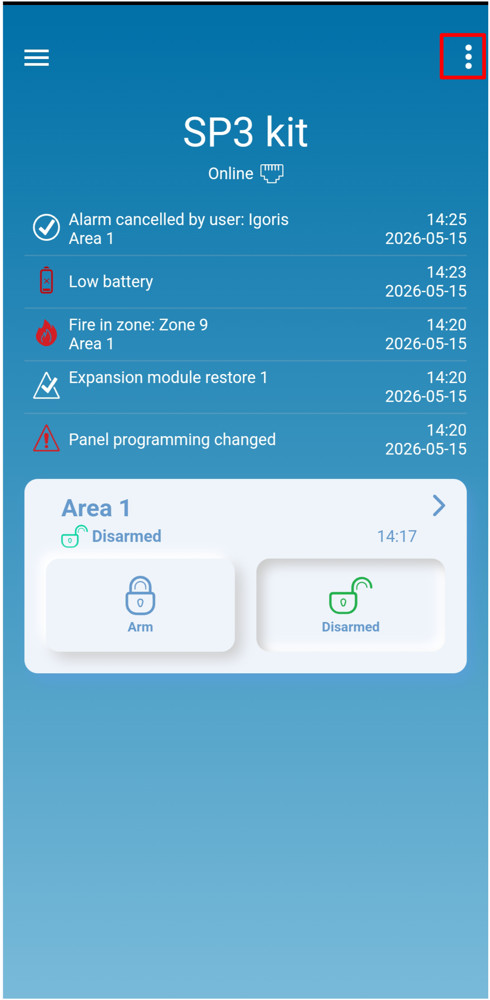{ .trik-mob-img }

    2. Bakstelėkite **System configuration**.

        { .trik-mob-img }

    3. Bakstelėkite **Devices**.

        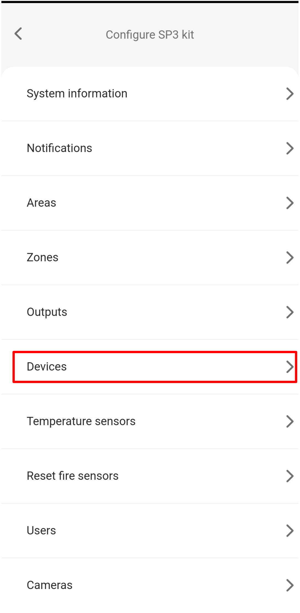{ .trik-mob-img }

    4. Bakstelėkite mygtuką **+**, kad pridėtumėte naują jutiklį.

        { .trik-mob-img }

    5. Pasirinkite jutiklio tipą, kurį norite susieti (pvz., **Smart PET PIR detector**).

        { .trik-mob-img }

    6. Programėlėje rodomas jutiklis **Learning** režimu ir mokymosi mygtuko schema. **Paspauskite ir palaikykite mokymosi mygtuką**, kol žalias indikatorius 2 sekundes švies nepertraukiamai.

        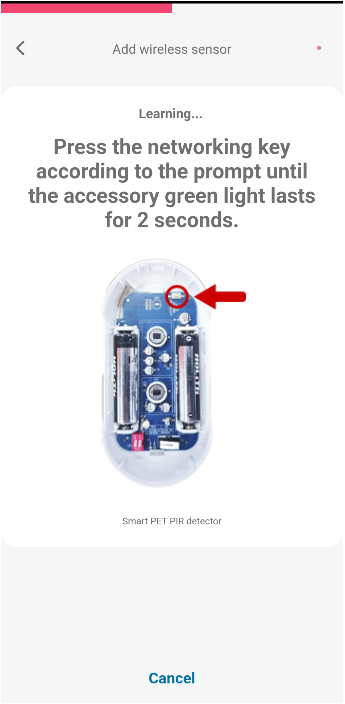{ .trik-mob-img }

    7. Aptikus jutiklį rodomas patvirtinimas su jo serijos numeriu. Bakstelėkite **OK**.

        { .trik-mob-img }

    8. Jutiklis rodomas sąraše su žyma **NEW**. Bakstelėkite jutiklį, kad atidarytumėte jo nustatymus.

        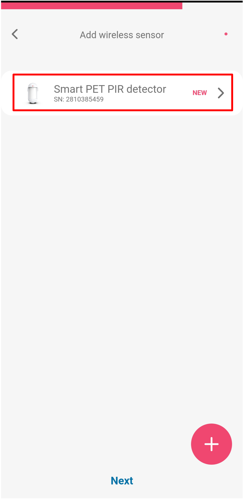{ .trik-mob-img }

    **Sukonfigūruokite zonos nustatymus:**

    9. Bakstelėkite **Zone settings**, kad išskleistumėte skyrių.

        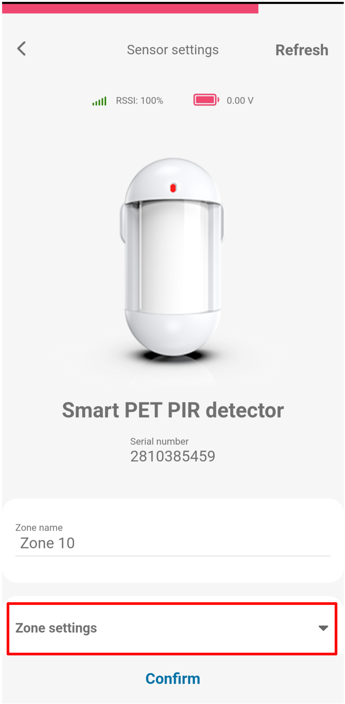{ .trik-mob-img }

    10. Nustatykite **Definition** (pvz., 24 hours) ir **Type** (pvz., NO), tada bakstelėkite **Confirm**.

        { .trik-mob-img }

    11. Norėdami pridėti kitą jutiklį, bakstelėkite **+** ir pakartokite 5–10 veiksmus. Susieję visus jutiklius, bakstelėkite **Next**.

        { .trik-mob-img }

    12. Sėkmės dialogo lange patvirtinamas susiejimas. Bakstelėkite **Close**.

        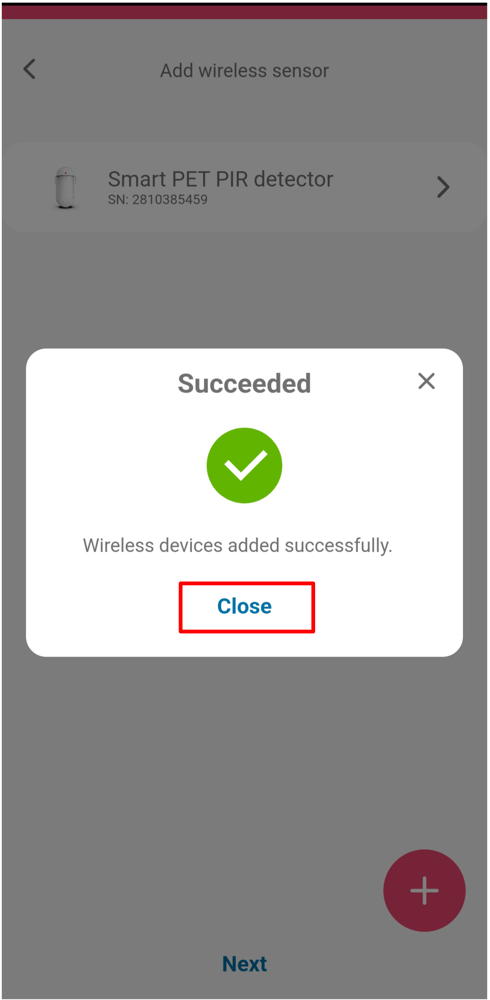{ .trik-mob-img }

    **Patikrinkite zonos būseną:**

    13. Sistemos pradžios ekrane bakstelėkite plytelę **Area 1**.

        { .trik-mob-img }

    14. Bakstelėkite **Zone statuses**.

        { .trik-mob-img }

    15. Ekrane **Zone status / bypass** pateikiamos visos zonos. Raudona įspėjimo piktograma reiškia, kad jutiklis šiuo metu yra atidarytas arba suveikęs. Bypass jungikliais galima laikinai išjungti atskiras zonas.

        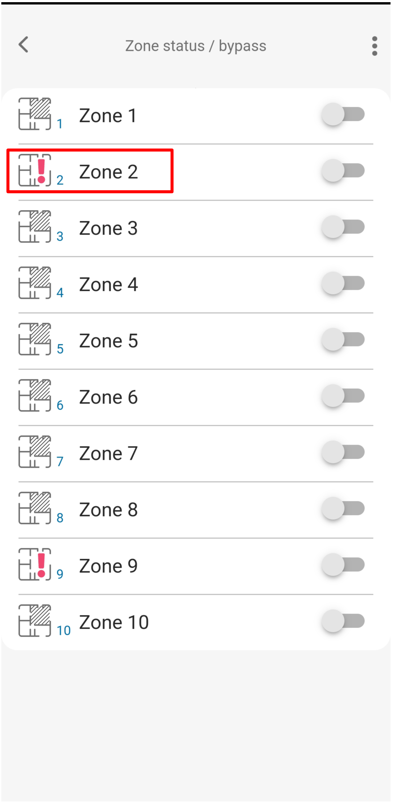{ .trik-mob-img }

=== "Protegus žiniatinklis"

    Darbalaukio naršyklėje atidarykite [web.protegus.app](https://web.protegus.app). SP3 sistema jau turi būti pridėta prie jūsų paskyros.

    1. Kairiajame skydelyje pasirinkite SP3 sistemą, tada sistemos meniu spustelėkite **Devices**.

        

    2. Spustelėkite mygtuką **+**, kad pridėtumėte naują belaidį jutiklį.

        

    3. Atidaromas skydelis **Add wireless sensor** su visais palaikomais jutiklių tipais. Spustelėkite jutiklio tipą, kurį norite susieti (pvz., **Smart PET PIR detector**).

        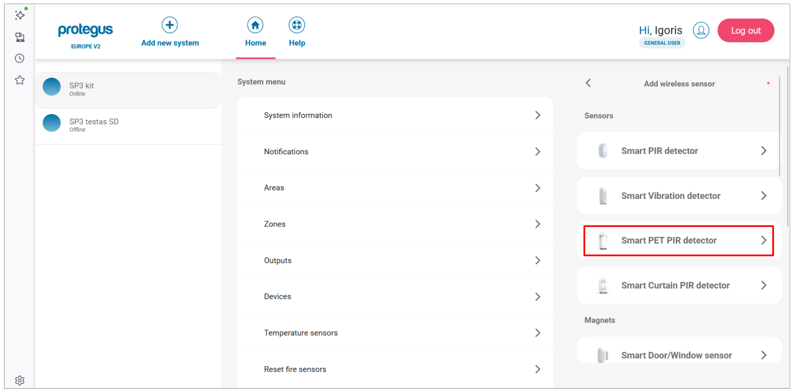

    4. Programėlė persijungia į **Learning** režimą ir parodo jutiklį su schema, nurodančia mokymosi mygtuko vietą.

        **Paspauskite ir palaikykite mokymosi mygtuką**, kol žalias indikatorius 2 sekundes švies nepertraukiamai (maždaug 4–5 sekundes).

        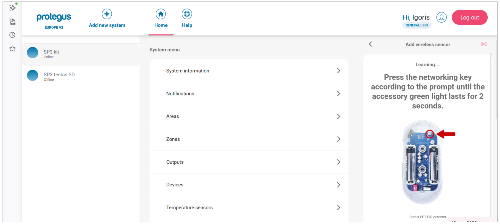

    5. Centralei aptikus jutiklį rodomas patvirtinimas su jo serijos numeriu. Spustelėkite **OK**.

        

    6. Jutiklis rodomas sąraše su žyma **NEW**. Norėdami pridėti kitą jutiklį, spustelėkite **+** ir pakartokite 3–5 veiksmus. Susieję visus jutiklius, spustelėkite **Next**.

        

    7. Sėkmės dialogo lange patvirtinamas susiejimas. Spustelėkite **Close**.

        

    **Sukonfigūruokite zonos nustatymus:**

    8. Sąraše **Devices** spustelėkite susietą jutiklį, kad atidarytumėte jo nustatymus. Spustelėkite **Zone settings**, kad išskleistumėte skyrių.

        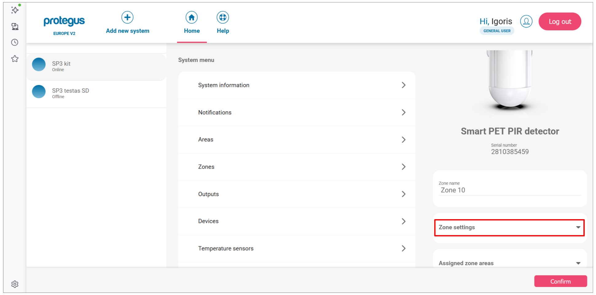

    9. Zonoje nustatykite **Definition** (pvz., Instant) ir **Type** (pvz., NO).

        

    **Patikrinkite zonos būseną:**

    10. Pradžios ekrane spustelėkite plytelę **Area 1**.

        

    11. Spustelėkite **Zone statuses**.

        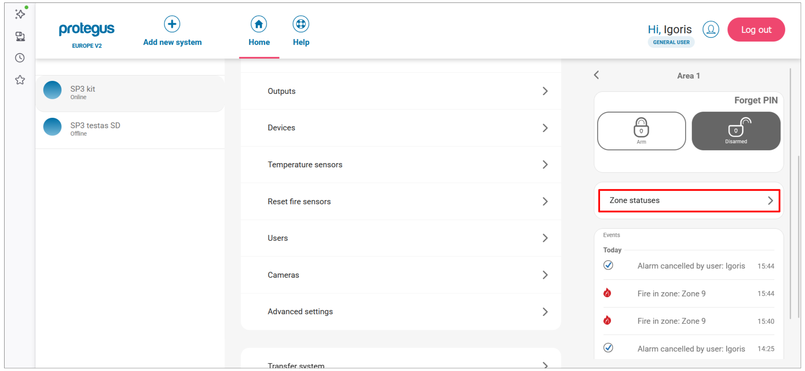

    12. Skydelyje **Zone status / bypass** pateikiamos visos zonos. Raudona zonos įspėjimo piktograma reiškia, kad jutiklis šiuo metu yra atidarytas arba suveikęs. Bypass jungikliais galima laikinai išjungti atskiras zonas.

        

=== "TrikdisConfig"

    Galimi du būdai: **nuotolinis** (per tinklą) arba **vietinis** (per USB, tinklo nereikia).

    #### Nuotolinis susiejimas

    Reikalavimai: aktyvinta SIM kortelė su išjungtu PIN, SIM kortelėje įjungtas mobilusis internetas, įjungta Protegus debesijos paslauga, SP3 įjungta (**PWR** šviesos diodas mirksi žaliai), SP3 yra prisijungusi prie tinklo (**NET** šviesos diodas šviečia žaliai ir mirksi geltonai).

    > [!WARNING]
    > Neregistruokite ir neatsiekite jutiklių, kai centralė veikia kitos operacijos mokymosi režimu. Prieš susiejimą kiekvieną jutiklį atsiekite: 5 sekundes palaikykite mokymosi mygtuką, kol jis tris kartus sumirksės žaliai. **Jei jutiklis netyčia atsiejamas, jis neveiks, kol nebus susietas iš naujo.**

    1. Atidarykite TrikdisConfig. Skyriuje **Remote access** įveskite centralės **Unique ID** (jis nurodytas įrenginio etiketėje), tada spustelėkite **Configure**.

        

    2. Spustelėkite **Read [F4]**. Jei būsite paraginti, įveskite administratoriaus arba montuotojo kodą.

    3. Atidarykite **Wireless sensors** ir spustelėkite **Learn sensors**.

        

    4. Atidaromas **Learning mode** dialogo langas. Kiekvienam jutikliui 5 sekundes palaikykite mokymosi mygtuką, kol jis **keturis kartus sumirksės žaliai**.

        

        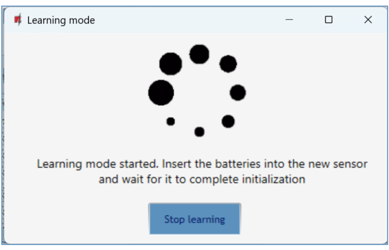

    5. Aptikus jutiklį atidaromas dialogo langas **New device was found**. Nustatykite **Zone number** ir **Zone definition** (pvz., Instant), tada spustelėkite **Save**.

        

    6. Learning mode būsenos eilutėje patvirtinama, kad įrenginys užregistruotas. Kiekvienam papildomam jutikliui pakartokite 4–5 veiksmus.

        

    7. Spustelėkite **Stop learning**. Kai būsite paraginti išsaugoti naujus parametrus, spustelėkite **Yes**.

        

    8. Spustelėkite **Read [F4]**. Skirtuke **Wireless sensors** dabar pateikiami visi užregistruoti jutikliai su jų serijos numeriais.

        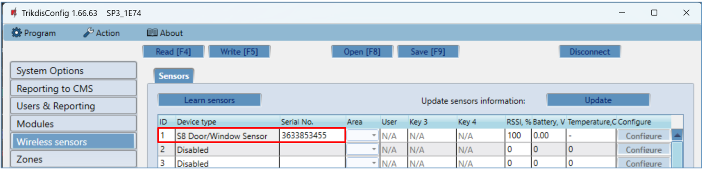

    9. Atidarykite skirtuką **Zones**. Patvirtinkite zonų ir sričių priskyrimą. Nustatykite **Type** į `EOL-T`, kad įjungtumėte apsaugą nuo sabotavimo. Spustelėkite **Write [F5]**.

        

    #### Vietinis susiejimas (be tinklo)

    RF-S8 imtuvo plokštėje yra mygtukas **LEARN** – juo galima įjungti ir išjungti mokymosi režimą nenaudojant kompiuterio.

    

    1. Patvirtinkite, kad RF-S8 užregistruotas prie SP3 (jis rodomas modulių sąraše po programinės įrangos paruošimo).
    2. Įjunkite SP3 maitinimą.
    3. Nuimkite RF-S8 dangtelį.
    4. Laikykite nuspaudę RF-S8 mygtuką **LEARN**, kol NETWORK šviesos diodas pradės mirksėti žaliai/raudonai. Atleiskite mygtuką.
    5. Susiekite kiekvieną jutiklį: 5 sekundes palaikykite mokymosi mygtuką, kol indikatorius keturis kartus sumirksės žaliai. Po kiekvieno sėkmingo susiejimo NETWORK šviesos diodas trumpam šviečia žaliai.
    6. Baigę laikykite nuspaudę RF-S8 mygtuką **LEARN**, kol NETWORK šviesos diodas nustos mirksėti. Atleiskite mygtuką – imtuvas išeis iš mokymosi režimo.
    7. Prijunkite USB Mini-B prie SP3. Atidarykite TrikdisConfig → **Read [F4]**.
    8. Skirtuke **Wireless sensors** patvirtinkite serijos numerius.
    9. Skirtuke **Zones** priskirkite zonas ir sritis → **Write [F5]**.

    #### Belaidžio jutiklio pašalinimas

    1. Prisijunkite prie SP3 (per USB arba nuotoliniu būdu) → **Read [F4]**.
    2. Skirtuke **Wireless sensors** nustatykite jutiklio **Device type** į `Disabled`.
    3. Spustelėkite **Write [F5]**.

---

## RF-S8 imtuvo šviesos diodų reikšmės

| LED | Būsena | Reikšmė |
|-----|--------|---------|
| NETWORK | Mirksi žaliai/raudonai | Aktyvus mokymosi režimas |
| NETWORK | Šviečia žaliai (5 s) | Jutiklis sėkmingai užregistruotas |
| POWER | Išjungtas | Nėra maitinimo įtampos |
| POWER | Mirksi žaliai | Normalus veikimas |
| POWER | Mirksi geltonai | Žema maitinimo įtampa (≤ 11,5 V) |
| POWER | Šviečia geltonai | Nėra RS485 ryšio su SP3 |
