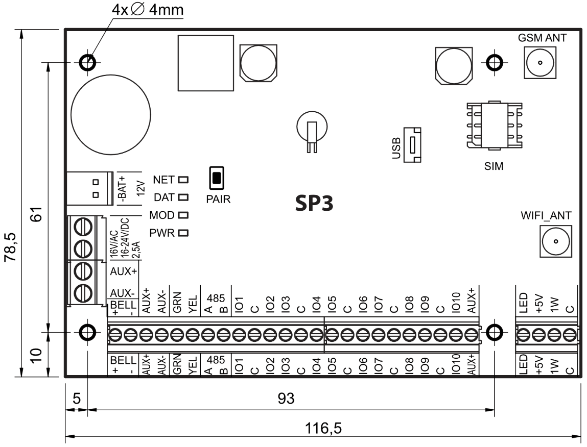
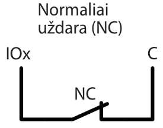
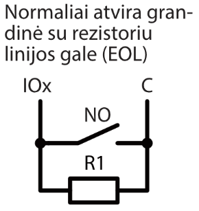
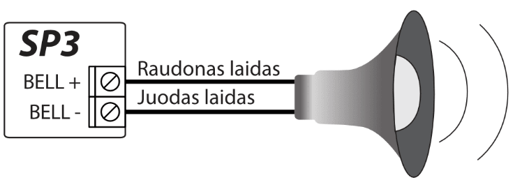

# Apsaugos centralė “FLEXi” SP3

## Aprašymas

Apsaugos centralė *“FLEXi” SP3 – tai apsaugos ir gaisro signalizavimo sistema su integruotu WiFi moduliu ir 2G/4G mobiliojo ryšio modemu. Centralė leidžia sukurti į 8 sritis sugrupuotų 32 laidinių ir belaidžių zonų sistemą. Patalpų apsaugą galima valdyti tiek nuotoliniu būdu (su mobiliąja programa Protegus2*, SMS, skambučiu), tiek klaviatūromis ir RFID. Informacija apie sistemos būklę gali būti siunčiama į saugos tarnybos centralizuoto stebėjimo pultą (CSP) ir objekto šeimininkui per WiFi ir (arba) per mobiliojo interneto tinklus.

**Kada rekomenduojame rinktis centralę *“FLEXi” SP3*?**

- Norint įrengti apsaugą mažose ar vidutinio dydžio patalpose panaudojant laidinius ir belaidžius jutiklius.

- Pakeisti patalpose jau esančią apsaugos centralę – “FLEXi” SP3 nustatymuose galima nustatyti laidinių zonų rezistorių nominalą į tokį, koks buvo naudojamas su senąja centrale. Nereikia keisti rezistorių kiekviename jutiklyje.

- Reikalingos išmaniojo namo funkcijos. Galima nuotoliniu būdu stebėti ir valdyti elektros prietaisus, sukurti prietaisų automatinio paleidimo ar sustabdymo užduotis.

**Savybės**

Pranešimų perdavimas į saugos tarnybos centralizuoto stebėjimo pultą (CSP):

- Per vietinį WiFi tinklą ir (arba) per 2G/4G mobilų internetą.

- Prijungus papildomus ryšio modulius, pranešimus galima siųsti „LAN Ethernet“, VHF/UHF radijo ir Sigfox ryšio kanalais.

- Pranešimai galimais ryšio kanalais išsiunčiami parinktu prioritetu.

- Centrinio stebėjimo pulte pranešimai priimami TRIKDIS IP imtuvu arba SIA DC-09 IP protokolu veikiančiu IP imtuvu.

- Pranešimų perdavimo į CSP prioriteto priskyrimas: pranešimai pirmiausia perduodami į CSP ir tik po to – objekto šeimininkui.

- Pranešimus galima perduoti į du skirtingų saugos tarnybų CSP IP imtuvus.

**Pranešimų perdavimas vartotojams:**

- Protegus2 mobiliąja programėle.

- SMS žinutėmis (iki aštuonių numerių).

- Skambučiu su įrašytu balsu (iki aštuonių numerių. Apsaugos centralei SP3_12xx su programinės aparatinės įrangos versija iki 1.13 imtinai).

- Nuotolinis apsaugos valdymas (Arm/Disarm/Stay/Sleep).

- Nuotolinis prijungtų elektros prietaisų valdymas (apšvietimo sistema, vartų varstymo automatika, vėdinimo, šildymo, laistymo sistemos ir kt.).

- Nuotolinis temperatūros stebėjimas.

**Įėjimai ir išėjimai:**

- 10 I/O kontaktų, iš kurių kiekvieną galima nustatyti kaip įėjimo (IN) arba išėjimo (OUT) kontaktą. Įėjimo (IN) tipai: ATZ, EOL, NC, NO. EOL ir ATZ grandinėse galima naudoti skirtingų nominalų rezistorius. Klaviatūromis, iO-8 ir iO-WL plėtimo moduliais IN įėjimų skaičių galima išplėsti iki 32.

- Plokštėje yra 2 dedikuoti išėjimai – „Bell“ ir „LED“. „Bell“ skirtas valdyti sireną, o „LED“ – šviesinius indikatorius. Su iO-8 ir iO-WL plėtimo moduliais išėjimų skaičių galima išplėsti iki 16.

- Septyni išėjimo veikimo režimai: kiekvienam išėjimui galima priskirti veikimo logiką pagal iš anksto nustatytą laiko grafiką ir savybes, pvz., termostato režimą.

- Vieno laido duomenų magistralė („1-Wire“) skirta prijungti temperatūros jutikliams (iki 8 vnt.) arba temperatūros ir dregmės jutikliui (1 vnt.) ir kontaktinių („iButton“) raktų skaitytuvui.

- GRN-YEL duomenų magistralė skirta prijungti iki aštuonių vieno tipo klaviatūrų.

- RS485 duomenų magistralė skirta prijungti iO serijos plėtimo modulius; RF-SH radijo bangų bevielių jutiklių imtuvui, E485 „Ethernet“ moduliui, T16 VHF arba UHF radijo siųstuvui, Sigfox moduliui.

**Apsaugos sistemos valdymas**

- 40 apsaugos sistemos valdymo kodų (kodas 4 skaitmenų). Galima nustatyti būdą, kuriuo klaviatūra surinktas vartotojo kodas taptų prievartos (angl. Duress) kodu, t.y. tokiu būdu surinkus vartotojo kodą, apsauga išsijungs ir į CSP bus išsiųstas specialus pranešimas, pranešantis, kad apsauga išjungta panaudojus prievartą.

- Valdymas klaviatūromis: SK-LED TouchPad (Protegus SK232 LED W), SK-LCD TouchPad (FLEXi SK232LCD), „Paradox“ K636, K10H(V) K32+LED, K32LED, K32LCD+, K35, TM50, TM70; „Crow“ klaviatūra CR16, CR-LCD; CZ-Dallas kontaktinių („iButton“) raktų skaitytuvas; TM17 kontaktinių raktų skaitytuvas, RFID skaitytuvas (Wiegand 26/34).

- Nuotolinis valdymas: Protegus2 mobiliąja programėle, telefono skambučiu arba SMS žinute.

**Paprastas diegimas:**

- Kelių dydžių „FLEXi” SP3 montažiniai rinkiniai, susidedantys iš dekoratyvinio balto metalinio korpuso su įmontuotu žeminančiu transformatoriumi arba impulsiniu maitinimo šaltiniu.

- Nustatyti gamykliniai „FLEXi” SP3 veikimo parametrai leidžia greitai įrengti mažo ir vidutinio dydžio patalpų apsaugos sistemą.

- „FLEXi” SP3 centralę galima įrengti vietoje buvusios centralės, jutikliuose nekeičiant EOL grandinių rezistorių nominalų.

- Atliktus nustatymus galima išsaugoti faile ateities panaudojimui.

- Įrenginio konfigūravimas galimas TrikdisConfig programa prisijungus USB kabeliu arba nuotoliniu būdu,.

- Prisijungus nuotoliniu būdu TrikdisConfig programa, galima ne tik keisti centralės „FLEXi” SP3 sisteminius parametrus, bet ir stebėti jos veikimą.

- Du parametrų keitimo prieigos nustatymo lygiai: montuotojo ir administratoriaus.

### Techniniai parametrai

| Parametras | Aprašymas |
|----|----|
| Maitinimo įtampa\[AC /​ DC\] | Kintamos srovės 16 V arba nuolatinės srovės 16-24 V, 2,5 A |
| Srovės naudojimas | Iki 50 mA (budint), /​ Iki 200 mA (trumpalaikis, siuntimo metu) /​ Iki 2,5 A (prijungus maksimaliai galimą apkrovą išoriniais įrenginiais) |
| Atsarginis maitinimo šaltinis \[BAT\] | 12 V švino - rūgštinis akumuliatorius, 4 Ah/​7 Ah |
| Akumuliatoriaus įkrovos srovė | Iki 500 mA |
| Išorinių įrenginių maitinimo įtampa ir srovė \[AUX\] | Nuolatinė 12 V, iki 1 A |
| Sirenos išėjimas \[BELL\] | 1 A |
| Išėjimas \[LED\] | 0,1 A |
| PGM išėjimas | 0,1 A |
| WiFi modulis | Taip, integruotas |
| WiFi dažnis, protokolas, šifravimo tipas | 2,4 GHz, 802.11 b/​g/​n, WPA, WPA2, WPA mixed |
| WiFi tinklo konfigūracijos tipas | DHCP arba rankinis |
| SIM kortelė | 1 vnt., NANO dydžio |
| GSM/​GPRS modemo dažniai „FLEXi” SP3_12xx | 850 /​ 900 /​ 1800 /​ 1900 MHz |
| 4G modemo dažniai „FLEXi” SP3_14E /​ „FLEXi” SP3_24E /​ EMEA /​ Tailandas | B1/​B3/​B7/​B8/​B20/​B28 |
| 4G modemo dažniai „FLEXi” SP3_24S /​ Lotynų Amerika /​ Australija /​ Naujoji Zelandija | B1/​B3/​B4/​B5/​B7/​B8/​B28 |
| 4G modemo dažniai „FLEXi” SP3_24A /​ Šiaurės Amerika | B2/​B4/​B12 |
| Pranešimų siuntimo parinktys | Iki 2 IP ir Port adresų;​ Į iOS/​Android Protegus2 mobiliąsias programas;​ SMS žinutės (iki aštuonių numerių);​ Skambučiai su įrašytu balsu (iki aštuonių numerių. Apsaugos centralei SP3_12xx su programinės aparatinės įrangos versija iki 1.13 imtinai). |
| Įvykių pranešimų perdavimo kanalai | GPRS arba 4G, WiFi, LAN (moduliu E485), SMS, Balso skambutis (iki aštuonių numerių. Apsaugos centralei SP3_12xx su programinės aparatinės įrangos versija iki 1.13 imtinai), VHF/​UHF radijo ryšiu (siųstuvu T16), Sigfox (moduliu SF485) |
| Ryšio su CSP protokolai | TCP /​ IP arba UDP /​ IP, arba SMS |
| Įvykių kodavimas | Contact ID kodai |
| Pranešimų šifravimas | TRK AES 128, SIA IP AES 128 |
| Vidinis laikrodis | Yra |
| Buferinės atmintinės talpa | 60 įvykių |
| Įvykių žurnalo atmintis | Iki 1000 įvykių. Seniausi įrašai trinami automatiškai. |
| Vartotojo kodai | 40 |
| Specialus apsaugos išjungimo kodas, reiškiantis, kad apsauga išjungta panaudojus prievartą (angl. Duress code) | Programuojant galima parinkti du vartotojo kodo surinkimo būdus |
| Dvigubos paskirties kontaktai \[I/​O\] | 10 Programuojant nustatoma IN arba OUT funkcija. Kai nustatyta IN, galima priskirti tipą: NC, NO, EOL, EOL_T, 3EOL, ATZ, ATZ_T. Kai nustatyta OUT, kontaktas tampa atvirojo kolektoriaus (OC) tipo išvadų, komutuojančiu iki 100 mA srovę |
| Sričių skaičius | 8 |
| Zonų skaičius | 10 (20 zonų, naudojant ATZ), (su plėtikliais plečiamas iki 32 zonų) |
| PGM išėjimų skaičius | 2 (priskyrus IO gnybtams išėjimo darbo režimą galima gauti 12 PGM išėjimų. Su plėtikliais plečiamas iki 16 išėjimų) |
| Prijungiamų klaviatūrų skaičius | 8 |
| Palaikomos klaviatūros | SK-LED TouchPad (Protegus SK232 LED W) /​ SK-LCD TouchPad (FLEXi SK232 LCD) /​ Paradox K636 /​ Paradox K10H(V) /​ Paradox K32 LED /​ Paradox K32+ LED /​ Paradox K32LCD+ /​ Paradox K35 /​ Paradox TM50 /​ Paradox TM70 /​ Crow CR16 /​ Crow CR-LCD |
| Didžiausias RFID skaitytuvų (Wiegand 26/​34) skaičius | 2 |
| 1-Wire magistralės ilgis \[1 WIRE\] | Iki 30 m |
| Suderinami temperatūros jutikliai | Maxim®/​Dallas® DS18S20, DS18B20;​ AM2301 serijos |
| Didžiausias temperatūros jutiklių, jungiamų prie 1-Wire magistralės, skaičius | 8 (Dallas) arba 1 (jei naudojamas AM2301 serijos jutiklis) |
| Suderinami kontaktiniai (iButton) raktai \[1 WIRE\] | Maxim®/​Dallas® DS1990A |
| Didžiausias kontaktinių (iButton) raktų skaičius | 40 |
| RS485 magistralės ilgis | Iki 100 m |
| Didžiausias įrenginių, jungiamų prie RS485 magistralės, skaičius | 8 |
| Palaikomi moduliai | iO-8 - plėtimo modulis;​ /​ iO – plėtimo modulis;​ /​ iO-MOD – iO-WL radijo bangų imtuvas;​ /​ iO-WL – bevielis plėtimo modulis;​ /​ RF-SH – bevielių jutiklių radijo bangų imtuvas;​ /​ E485 – prijungimo prie „Ethernet“ tinklo modulis;​ /​ TM17 – iButton raktų skaitytuvas;​ /​ CZ-Dallas – iButton raktų skaitytuvas;​ /​ T16 – VHF arba UHF radijo bangų siųstuvas;​ /​ SF485 – prijungimo prie Sigfox tinklo modulis;​ /​ iO-LORA – plėtimo modulis;​ /​ iO8-LORA – plėtimo modulis;​ /​ RFID skaitytuvas. |
| Darbinė aplinka | Temperatūra nuo -10 °C iki +50 °C, santykinė drėgmė – iki 80%, prie +20 °C, be kondensacijos. |
| Centralės matmenys | 117x79x25 mm |
| Svoris | 0,1 kg |

### Suderinamų modulių sąrašas

| Modulio pavadinimas                               | Srovė                  |
|---------------------------------------------------|------------------------|
| Klaviatūra SK-LED TouchPad (Protegus SK232 LED W) | Min 60 mA, max 150 mA  |
| Klaviatūra SK-LCD TouchPad (FLEXi SK232 LCD)      | Min 25 mA, max 60 mA   |
| Klaviatūra Paradox K636                           | Min 40 mA, max 70 mA   |
| Klaviatūra Paradox K10H(V)                        | Min 44 mA, max 72 mA   |
| Klaviatūra Paradox K32 LED                        | Min 49 mA, max 148 mA  |
| Klaviatūra Paradox K32+ LED                       | Min 49 mA, max 148 mA  |
| Klaviatūra Paradox K32LCD+                        | Min 70 mA, max 150 mA  |
| Klaviatūra Paradox K35                            | Min 30 mA, max 70 mA   |
| Klaviatūra Paradox ТМ50                           | Мin 100 mA, max 230 mA |
| Klaviatūra Paradox ТМ70                           | Min 200 mA, max 330 mA |
| Klaviatūra Crow CR16                              | Min 40 mA, max 75 mA   |
| Klaviatūra Crow CR-LCD                            | Min 40 mA, max 75 mA   |
| iO-8 plėtimo modulis                              | Iki 50 mA              |
| iO plėtimo modulis                                | Iki 50 mA              |
| iO-MOD - iO-WL radijo bangų imtuvas               | Min 50 mA, max 150 mA  |
| iO-WL bevielis plėtimo modulis                    | Iki 200 mA             |
| RF-SH bevielių jutiklių imtuvas                   | Iki 100 mA             |
| E485 „Ethernet“ komunikatorius                    | Min 50 mA, max 150 mA  |
| TM17 iButton raktų skaitytuvas                    | Iki 50 mA              |
| CZ-Dallas iButton raktų skaitytuvas               | Iki 25 mА              |
| T16 (VHF arba UHF) radijo bangų siųstuvas         | Min 100 mA, max 1,2 A  |
| SF485 Sigfox komunikatorius                       | Iki 100 mA             |
| RFID skaitytuvas (Wiegand 26/​34)                  | Iki 100 mA             |
| iO-LORA plėtimo modulis                           | Iki 50 mA              |
| iO-8 LORA plėtimo modulis                         | Iki 50 mA              |

### Išorinių kontaktų paskirtis

1.  Ryšio ir veikimo šviesinė indikacija.
2.  Rezervinio maitinimo kontaktų kaladėlė.
3.  Pagrindinio maitinimo kontaktų kaladėlė.
4.  Išorinių kontaktų kaladėlė.
5.  1-WIRE magistralės kontaktų kaladėlė.
6.  WiFi antenos SMA užsukamo tipo jungtis.
7.  Nano-SIM kortelės laikiklis.
8.  GSM antenos SMA užsukamo tipo jungtis.
9.  USB Mini-B jungtis centralės veikimo parametrams konfigūruoti.

| Kontaktas | Aprašymas |
|----|----|
| Maitinimo gnybtas | Maitinimo šaltinio gnybtas (16 V kintamos srovės arba teigiamas 16-24 V nuolatinės srovės) |
| Maitinimo gnybtas | Maitinimo šaltinio gnybtas (16 V kintamos srovės arba neigiamas 16-24 V nuolatinės srovės) |
| BAT+ | Atsarginio maitinimo šaltinio teigiamas gnybtas 12 V |
| BAT- | Atsarginio maitinimo šaltinio neigiamas gnybtas 12 V |
| AUX+ | Išorinių įrenginių teigiamas 12 V maitinimo gnybtas |
| AUX- | Bendras neigiamas gnybtas |
| GRN | Klaviatūros duomenų magistralė |
| YEL | Klaviatūros duomenų magistralė |
| A 485 | *RS485* magistralės A kontaktas |
| B 485 | *RS485* magistralės B kontaktas |
| IO1 – IO9 | Įėjimo/​išėjimo gnybtai (gamyklinis nustatymas – įėjimas) |
| IO10 | Įėjimo/​išėjimo gnybtas (gamyklinis nustatymas – PGM išėjimas, Gaisro jutiklių atstatymas)) |
| C | Bendras neigiamas gnybtas |
| LED | PGM išėjimas (gamyklinis nustatymas – Sistemos būsena) |
| +5 V | *1-Wire* įrenginių teigiamas 5 V maitinimo kontaktas |
| 1 WIRE | *1-Wire* duomenų magistralės kontaktas |
| C | Bendras neigiamas gnybtas |

### Šviesinė veikimo indikacija

| LED indikatorius | Veikimas | Aprašymas |
|----|----|----|
| NET / (Tinklas) | Mirksi žaliai | Vyksta SIM kortelės registracija GSM tinkle. |
| NET / (Tinklas) | Šviečia žaliai | SIM kortelė priregistruota GSM tinkle. |
| NET / (Tinklas) | Mirksi geltonai | Rodomas GSM signalo stiprumas nuo 0 iki 5. Pakankamas 3. |
| DAT / (Duomenys) | Nešviečia | Nėra neišsiųstų įvykių pranešimų |
| DAT / (Duomenys) | Šviečia žaliai | Siunčiamas pranešimas. |
| DAT / (Duomenys) | Šviečia geltonai | Yra neišsiųstų įvykių pranešimų buferinėje atmintyje. |
| MOD / (Indikatorius prisijungimo prie WiFi tinklo) | Mirksi žaliai | Jungiamasi prie WiFi tinklo. |
| MOD / (Indikatorius prisijungimo prie WiFi tinklo) | Šviečia žaliai | Prisijungta prie WiFi tinklo. |
| PWR / (Maitinimas) | Mirksi žaliai | Sistema veikia be nesklandumų. |
| PWR / (Maitinimas) | 1 raudonas mirksnis | Nėra SIM kortelės |
| PWR / (Maitinimas) | 2 raudoni mirksniai | Neteisingas SIM kortelės PIN kodas |
| PWR / (Maitinimas) | 3 raudoni mirksniai | Nepavyksta prisijungti prie GSM tinklo |
| PWR / (Maitinimas) | 4 raudoni mirksniai | Nepavyksta prisijungti prie CSP imtuvo per 1-ą kanalą |
| PWR / (Maitinimas) | 5 raudoni mirksniai | Nepavyksta prisijungti prie CSP imtuvo per 2-ą kanalą |
| PWR / (Maitinimas) | 6 raudoni mirksniai | Nenustatytas vidinis laikrodis |
| PWR / (Maitinimas) | 7 raudoni mirksniai | Nepakankama atsarginio maitinimo šaltinio įtampa |
| PWR / (Maitinimas) | 8 raudoni mirksniai | Nėra maitinimo iš kintamos srovės tinklo |
| PWR / (Maitinimas) | 9 raudoni mirksniai | Nepavyksta prisijungti prie WiFi tinklo |

## Apsaugos centralės maitinimas

### Pagrindinis maitinimas

Centralė ir visa apsaugos sistema gali būti maitinamos arba iš kintamos, arba iš nuolatinės srovės šaltinio. Abiem atvejais, nenutrūkstamam sistemos maitinimui užtikrinti, prie centralės dar turi būti prijungtas rezervinio maitinimo šaltinis – 12 V akumuliatorius. Siekiant užtikrinti standarto EN50131 reikalavimus, rezervinio maitinimo akumuliatorius turi būti toks, kad sistemai praradus maitinimą iš pagrindinio šaltinio, ji galėtų veikti 12 val. pagal II-ą apsaugos klasę arba 60 val. pagal III-ą apsaugos klasę. Įvertinkite papildomų įrenginių naudojamą srovę, ji nurodyta skyriuje 1.2 „Suderinamų modulių sąrašas“.

### Rezervinis maitinimas

Sutrikus sistemos maitinimui iš pagrindinio maitinimo šaltinio, bus formuojamas įvykio *AC Fault* pranešimas ir centralė automatiškai persijungs sistemą maitinti iš rezervinio – 12 V akumuliatoriaus. Akumuliatoriaus įtampai sumažėjus iki 11,5 V, bus formuojamas įvykio *Low* *Battery* pranešimas. Akumuliatorius bus atjungtas jei jis išsikraus žemiau 9,5 V. Atsiradus kintamos srovės tinklo įtampai, bus formuojamas *AC Restore* pranešimas ir automatiškai prasidės akumuliatoriaus įkrovimo procesas. Akumuliatoriaus įtampai atsistačius iki 12,6 V, bus formuojamas įvykio *Battery Restore* pranešimas.

### Centralės komplektai

#### Centralė *„FLEXi” SP3*

| Pavadinimas                                | Kiekis  |
|:-------------------------------------------|:--------|
| Centralės „FLEXi” SP3 plokštė              | 1 vnt.  |
| Akumuliatoriaus prijungimo laidas          | 1 vnt.  |
| Rezistorius 2,2 kΩ                         | 20 vnt. |
| Rezistorius 4,7 kΩ                         | 10 vnt. |
| Plastikinis laikiklis (tvirtinimo detalės) | 4 vnt.  |
| Antena ME301M su 2,5 m ilgio kabeliu       | 2 vnt.  |

#### Centralė *„FLEXi” SP3* KIT

| Pavadinimas                                                 | Kiekis  |
|:------------------------------------------------------------|:--------|
| Centralės „FLEXi” SP3 plokštė, įmontuota į metalinį korpusą | 1 vnt.  |
| Metalinis korpusas K01 su 40 VA transformatoriumi           | 1 vnt.  |
| Rezistorius 2,2 kΩ                                          | 20 vnt. |
| Rezistorius 4,7 kΩ                                          | 10 vnt. |
| Antena ME301M su 2,5 m ilgio kabeliu                        | 2 vnt   |
| Akumuliatoriaus prijungimo laidas                           | 1 vnt.  |
| Sabotažo jutiklis (angl. Tamper)                            | 1 vnt.  |
| Kontaktų kaladėlė su 0,5 A saugikliu                        | 1 vnt.  |

#### Centralė *„FLEXi” SP3* KITi

| Pavadinimas                                                       | Kiekis  |
|:------------------------------------------------------------------|:--------|
| Centralės „FLEXi” SP3 plokštė, įmontuota į metalinį korpusą       | 1 vnt.  |
| Metalinis korpusas K02 su Mean Well impulsiniu maitinimo šaltiniu | 1 vnt.  |
| Rezistorius 2,2 kΩ                                                | 20 vnt. |
| Rezistorius 4,7 kΩ                                                | 10 vnt. |
| Antena ME301M su 2,5 m ilgio kabeliu                              | 2 vnt   |
| Akumuliatoriaus prijungimo laidas                                 | 1 vnt.  |
| Sabotažo jutiklis (angl. Tamper)                                  | 1 vnt.  |
| Kontaktų kaladėlė su 3,15 A saugikliu                             | 1 vnt.  |

!!! note USB laidas (Mini-B tipo), skirtas centralei programuoti, kartu neteikiamas. \## Sistemos įrengimas

### Rekomenduojama įrengimo tvarka

**Sistemos planavimas:**

- Nubraižykite patalpų planą ir jame pažymėkite vietas, kur bus sumontuotas montažinis korpusas su centrale, klaviatūra (-os), signalizatoriai, automatiškai ir nuotoliniu būdu centralės valdoma įranga.

- Įvertinę patalpas, jų apsaugai keliamus reikalavimus ir galimų jutiklių charakteristikas, parinkite jutiklių tipus, skaičių ir nustatykite vietas, kur jie turėtų būti tvirtinami.

#### Centralės tvirtinimas montažiniame korpuse

Centralės plokštė montuojama į montažinį korpusą, kuriame sumontuotas žeminantis transformatorius su 500 mA saugikliu ir numatyta vieta rezervinio maitinimo akumuliatoriui. / Plastikiniais centralės plokštės atstumo laikikliais įtvirtinkite centralę į pasirinktą plastikinį arba metalinį montažinį korpusą. Jei parinkote metalinį korpusą, instaliacijos metu nepamirškite jo įžeminti. Naudojamas korpusas privalo tenkinti standartų EN 60950 ir EN 50131 reikalavimus.

**„FLEXi” SP3 plokštės matmenys**

Paveikslėlyje pateiktos centralės plokštės ir jos tvirtinimo kiaurymių matmenys (pateikta milimetrais), bei jų išdėstymas.

#### Prietaisų prijungimo eiliškumas

1.  Prie antenos jungčių prijunkite GSM ir WiFi antenas.

2.  Į SIM kortelės laikiklį įdėkite prie mobiliojo tinklo jau priregistruotą SIM kortelę.

3.  Vadovaudamiesi pateiktomis schemomis ir kiekvieno norimo prijungti gaminio prijungimo schemomis prijunkite durų ir langų magnetinius kontaktus, judesio, gaisro ir kitus jutiklius, signalizatorius, klaviatūras, valdomus įtaisus. Prie centralės išvadų prijunkite korpuso durelių ir tvirtinimo prie sienos sabotažo (angl. tamper) jutiklius.

4.  Prie centralės AC/DC gnybtų prijunkite pagrindinio maitinimo šaltinio laidus. Įjunkite pagrindinį maitinimą. „FLEXi” SP3 atpažins prie magistralių 1-WIRE ir YEL/GRN teisingai prijungtas klaviatūras, plėtiklius, sąsajas.

5.  Į montažinį korpusą įstatykite rezervinio maitinimo akumuliatorių. Jo gnybtus prijunkite prie centralės rezervinio maitinimo šaltinio jungties BAT+ / BAT–.

!!! note Akumuliatorius turi būti įkraunamas ne ilgiau nei per 72 val., kad apsaugos sistema atitiktų II-ą apsaugos klasę arba 24val., kad atitiktų III-ą apsaugos klasę. \#### Rekomendacijos centralės veikimo parametrams nustatyti

1.  Kaip prisijungti centralės konfigūravimui žr. sk. 5 „Veikimo parametrų nustatymas su programa TrikdisConfig

2.  Sisteminiai nustatymai:

    1.  **Pogrupiai.** Jei tam tikrą zonų grupių saugojimą pageidaujate įjungti atskirai, apsaugos sistemą galima padalinti į pogrupius. Kaip sistemą padalinti ir nustatyti reikiamus pogrupių atributus, žr. 5.2 „Langas „Sistemos parinktys““.

    2.  **Zonos.** Žr. skyrių 5.7 „Langas „Zonų įėjimai““, kad kiekvieną zoną nustatytumėte pagal jutiklių charakteristikas ir pageidaujamą apsaugos veikimą po įvykio toje zonoje. Jei apsaugos sistema padalinta į pogrupius, kiekvieną zoną galėsite priskirti pageidaujamam pogrupiui.

    3.  **Vartotojai.** Kad apsaugos sistemą būtų galima valdyti klaviatūra, iButton raktu ar telefono skambučiu (SMS žinute), turi būti sukurti sistemos *vartotojai*. Kaip sukurti *vartotoją* ir jam priskirti teises, žr. 5.4 „Langas „Vartotojai ir pranešimai““.

3.  Pranešimų siuntimas:

    1.  **Laiko nustatymas.** Norint gauti pranešimus su tikslia įvykio laiko žyme, reikia nustatyti centralės laikrodžio laiką, žr. 5.2 „Langas „Sistemos parinktys““.

    2.  **Pranešimų siuntimo įjungimas.** Pirminėje centralės konfigūracijoje visų įvykių pranešimų siuntimo funkcija įjungta. Įvykus bet kuriam įvykiui, jo pranešimas bus siunčiamas nustatytiems adresatams per nustatytus ryšio kanalus. Kad išjungtumėte pageidaujamo įvykio pranešimo siuntimą, žr. 5.10 „Langas „Sistemos įvykiai““.

    3.  **SIM kortelės parametrai.** Jei pranešimų siuntimas numatytas per mobiliuosius tinklus, reikia nustatyti naudojamos SIM kortelės parametrus žr. 5.2 „Langas „Sistemos parinktys““.

    4.  **Pranešimai į centralizuoto** **stebėjimo pultą.** Pirminėje centralės konfigūracijoje pranešimų siuntimas į centralizuoto stebėjimo pultą išjungtas. Kaip nustatyti pranešimų siuntimo į centralizuoto stebėjimo pultą parametrus, žr. 5.3 „Langas „Pranešimai į CSP““.

    5.  **Pranešimai vartotojui.** Pirminėje centralės konfigūracijoje įjungta komunikacija su Protegus debesija, o pranešimų siuntimas SMS žinutėmis ir skambinimas – išjungti. Kaip nustatyti pranešimų siuntimo į vartotojo mobilųjį telefoną parametrus, žr. 5.10 „Langas „Sistemos įvykiai““.

4.  Nuotolinis sistemos valdymas:

    1.  **Vartotojo prieiga.** Nuotoliniu būdu (telefono skambučiu ir (arba) SMS žinute) apsaugos sistemą valdyti gali tie vartotojai, kurių telefonų numeriai įvesti į „Vartotojų“ sąrašą. Kaip įvesti telefonų numerius, žr. 5.4 „Langas „Vartotojai ir pranešimai““.

    2.  **Valdymas telefono skambučiu.** Telefono skambučiu galima ne tik įjungti ar išjungti visų ar tik dalies patalpų saugojimą, bet ir valdyti (paleisti veikti ar išjungti) prie PGM išvadų prijungtą įrangą. Kaip nustatyti, kad telefono skambučiu būtų pakeista norimo PGM išvado, prie kurio prijungta įrangos valdymo grandinė, būsena, žr. 4.4 „Valdymas skambučiu“.

    3.  **Valdymas** **SMS** **žinutėmis.** SMS žinutėmis galima keisti kai kuriuos centralės veikimo parametrus, įjungti ar išjungti visų ar tik dalies patalpų saugojimą, valdyti (paleisti veikti ar išjungti) prie PGM išvadų prijungtą įrangą. SMS žinutėmis siunčiamų komandų sąrašą žr. 4.3 „Konfigūravimas ir valdymas SMS žinutėmis“.

5.  Papildomai:

    1.  **Valdymo kodų keitimas.** Rekomenduojame pakeisti gamyklos nustatytas pirmines apsaugos valdymo ir centralės konfigūravimo kodų reikšmes į tik Jums žinomas.

        - **Administratoriaus** **kodas** yra keičiamas programos meniu šakoje **Sistemos parinktys** skiltyje **Prisijungimas**.

        - Nuotolinio SMS valdymo kodas yra keičiamas programos meniu šakoje **Sistemos parinktys** skiltyje **Prisijungimas** laukelyje **SMS slaptažodis**.

        - **Instaliuotojo kodas** yra keičiamas programos meniu šakoje **Sistemos parinktys** skiltyje **Prisijungimas**.

### Jutiklių jungimas

Centralės plokštėje yra 10 kontaktų IO1–IO10 (įėjimai) jutiklių grandinėms prijungti. Panaudojus įėjimų plėtiklius (***iO, iO8, iO-WL, RF-SH, iO-LORA, iO8-LORA**)*, įėjimų skaičių galima padidinti iki 32. Bet kurį kontaktą galima nustatyti kaip įėjimą ir priskirti zonos atributus: grandinės tipą (NO, NC, EOL, EOL_T, 3EOL, ATZ, ATZ_T); jautrumą į trumpalaikius grandinės įvykius; zonos funkciją („Delay“, „Instant“, „Instant Stay“, „Interior“, „Interior Stay“, „Fire“, „Keyswitch“, „24_hour“, „Silent“, „Silent 24h“), žr. 5.7 „Langas „Zonų įėjimai““. iO8 ir iO8-LORA plėtikliai palaiko visus apsaugos centralės zonų varžų nominalus (EOL tipus).

**Jutiklių jungimo schemos.**

<figure style="margin: 0;">

</figure>

<figure style="margin: 0;">

</figure>

<figure style="margin: 0;">

</figure>

<figure style="margin: 0;">

</figure>

<figure style="margin: 0;">

</figure>

<figure style="margin: 0;">

</figure>

<figure style="margin: 0;">

</figure>

<figure style="margin: 0;">

</figure>

|  |  |
|----|----|

### Dūmų jutiklių jungimas

Dvilaidžių dūmų jutiklių prijungimo schemos.

Dvilaidžių dūmų jutiklių prijungimo schema prie PGM (LED) išėjimo. Kai yra naudojama šia jungimo schema, reikia **Gaisro kilpa naudoja LED išėjimą** lauką pažymėti varnele (žr. 5.2 „Langas „Sistemos parinktys““).

Dvilaidžių dūmų jutiklių su reliniu moduliu SM1 prijungimo schemos. Norint prie pasirinkto įėjimo prijungti dūmų jutiklio grandinę reikia įėjimui (IOx) nustatyti „Gaisro“ zonos funkciją (žr. 5.7 „Langas „Zonų įėjimai“). Jungiant dūmų jutiklio grandinę prie pasirinkto PGM išėjimo (IO10), išėjimui turi būti su nustatyta funkcija „**Gaisro jutiklių atstatymas**“ (žr. 5.8 „Langas „PGM išėjimai““).

Arba

Keturlaidžių dūmų jutiklių prijungimo schema.

Norint prie pasirinkto įėjimo prijungti dūmų jutiklio grandinę reikia įėjimui (IOx) nustatyti „Gaisro“ zonos funkciją (žr. 5.7 „Langas „Zonų įėjimai“). Jungiant keturlaidžio dūmų jutiklio grandinę prie pasirinkto PGM išėjimo (IO10), išėjimui turi būti su nustatyta funkcija „**Gaisro jutiklių atstatymas**“ (žr. 5.8 „Langas „PGM išėjimai““).

### Sirenos prijungimo schema

Lauko sirenos MR100 pajungimas ir nustatymai pavaizduoti schemoje. Jei apsaugos centralėje bus naudojamas kitas sirenos tamperio (SAB gnybtai) grandinės EOL stebėjimo būdas (gamyklinis nustatymas EOL 2,2 kΩ), tai reikia trumpikliu užtrumpinti kontaktus JPS1 ir nuosekliai į tamperio grandinę įjungti reikiamo nominalo rezistorių. IO9 įėjimui gamykliškai yra nustatytas **24 valandų** zonos tipas.

### Klaviatūrų, RFID skaitytuvų (Wiegand 26/34) prijungimo schemos

Prie klaviatūros magistralės galima prijungti iki 8 įrenginių. Programoje TrikdisConfig reikia nurodyti prijungiamos klaviatūros tipą (žr. 5.5 „Langas „Moduliai““). Centralė automatiškai atpažins ir užregistruos prijungtus įrenginius.

Prie centralės galima prijungti iki 2 RFID skaitytuvų. Klaviatūros prie centralės nesijungia, kai yra prijungti 2 RFID skaitytuvai.

### TM17, CZ-Dallas skaitytuvų prijungimo schemos

**CZ-Dallas iButton raktų skaitytuvas** prie „FLEXi” SP3 jungiamas per „*1 Wire“* magistralės. Magistralės laidų ilgis gali būti iki 30 m:

**TM17** skaitytuvas prie „FLEXi” SP3 jungiamas per *RS485* duomenų magistralės. *RS485* duomenų magistralės laidų ilgis gali būti iki 100 m.

### Temperatūros jutiklio prijungimo schema

 / 

### Relės, LED indikatoriaus prijungimo schemos

Nuotoliniu būdu su relės kontaktais galima valdyti (įjungti/išjungti) įvairius elektrinius prietaisus. Centralės universaliam įėjimo/išėjimo (I/O) gnybtui turi būti nustatytas išėjimo (OUT) veikimo režimas ir priskirtas veikimo tipas Nuotolinis valdymas.

### „Ethernet“ komunikatoriaus E485 prijungimo schema

Modulis *E485* leidžia centralei siųsti ir priimti valdymo komandas per laidinį interneto ryšį. Prie centralės prijungus modulį *E485*, pranešimai į CSP ir į *Protegus2* mobiliąją programą siunčiami laidiniais interneto tinklais, o mobilusis internetas nenaudojamas. Jei nutrūksta ryšys per laidinį internetą, pranešimai į CSP perduodami per mobilųjį internetą. Atsikūrus laidinio interneto ryšiui, centralė automatiškai išjungia pranešimų siuntimą per mobilųjį internetą ir vėl pradeda komunikuoti su CSP ir *Protegus2* mobiliąja programa per *E485*, t.y. per laidinį internetą.

Skyriuje p.5.3 „Langas „Pranešimai į ST pulta““ pasirenkamas ryšio prioritetas (GPRS, LAN, WiFi). „FLEXi” SP3 konfigūravimas su „Ethernet“ moduliu E485 aprašytas p. 5.5. „Langas „Moduliai“.

Prijungus modulį E485 prie centralės ir jei mobilus ryšis nenaudojamas, centralėje SIM kortelė nebūtina.

### RF-SH prijungimo schema

Su *RF-SH* apsaugos sistemai galima priskirti iki 64 bevielių pultelių, 16 bevielių sirenų, 32 bevielių jutiklių ir 8 bevielių klaviatūrų. / *„FLEXi” SP3* konfigūravimas su plėtimo moduliais aprašytas p. 5.5. „Langas „Moduliai“.

### iO serijos išplėtimo modulių prijungimo schemos

Jei reikia, kad apsaugos centralė „FLEXi” SP3 turėtų daugiau įėjimų IN arba išėjimų OUT, prijunkite laidinį arba belaidį TRIKDIS iO serijos įėjimų ir išėjimų plėtiklį. „FLEXi” SP3 konfigūravimas su plėtimo moduliais aprašytas p. 5.5. „Langas „Moduliai“.

<figure style="margin: 0;">

</figure>

<figure style="margin: 0;">

</figure>

### Radijo siųstuvo T16 prijungimo schema

Radijo siųstuvas *T16* naudojamas apsaugos centralių įvykių pranešimams perduoti per “Trikdis” radijo tinklus. / Siųstuvas gali siųsti savus įvykių pranešimus ir įvykių pranešimus, gautus iš apsaugos centralių į CSP (centralizuotą stebėjimo pultą) su galimybe iš CSP nukreipti galutiniam vartotojui.

### SF485 modulio prijungimo schema

*SF485* veikia kaip rezervinis ryšio kanalas, skirtas apsaugos centralės įvykiams perduoti į CSP (centralizuota stebėjimo pultą) arba į *Protegus2* mobiliąją programėlę per SigFox tinklą, kai nepavyksta įvykius perduoti pagrindiniu ryšio kanalu. Pranešimai perduodami „Contact ID“ formatu.

### Apsaugos centralės paleidimas veikti

Norint centralę paleisti veikti, reikia įjungti jos maitinimo šaltinį. Centralės plokštės šviesiniai diodai turi veikti taip:

- Diodas „PWR“ turi mirksėti žaliai – indikuoja, kad pakankama maitinimo įtampa;

- Diodas „NET“ turi šviesti žaliai ir periodiškai ne mažiau nei 3 kartus sužybsėti geltonai – žalia spalva indikuoja, kad SIM kortelė sėkmingai priregistruota prie mobiliojo ryšio tinklo, o geltonų žybsnių skaičius reiškia mobiliojo signalo lygį.

!!! note Pakankamas mobiliojo ryšio signalo lygis - 3 (trys „NET” indikatoriaus geltoni žybsniai). / Jei suskaičiuojate mažiau geltonų „NET” diodo žybsnių, tai mobiliojo ryšio signalo lygis nepakankamas. Rekomenduojame arba pasirinkti kitą centralės įrengimo vietą, arba pakeisti antenos vietą, arba naudoti jautresnę mobiliojo ryšio anteną. / Jei centralės šviesinė indikacija kitokia, kad nustatytumėte, kas nutikę, žiūrėkite skyrių 1.4 „Šviesinė veikimo indikacija”. / Jei „FLEXi” SP3 indikacija visai nešviečia, patikrinkite maitinimo šaltinį ir laidinius sujungimus. \## Nuotolinis valdymas

### *„FLEXi” SP3* priskyrimas prie vartotojo *Protegus2* paskyros

Su Protegus2 vartotojai galės valdyti apsaugos sistemą nuotoliniu būdu. Jie taip pat matys sistemos būseną ir gaus sistemos įvykių pranešimus.

1.  Jei dar nesate susikūręs asmeninės paskyros Protegus debesijoje, atsisiųskite Protegus2 aplikaciją arba atverkite naršyklėje [www.protegus.app](https://www.protegus.app) ir susikurkite asmeninę paskyrą.

    

      

    

2.  Spustelkite elektroniniu paštu gautą nuorodą, kad patvirtintumėte paskyros sukūrimą. Telefone paleiskite Protegus2 aplikaciją ir savo vartotojo vardu ir slaptažodžiu prie jos prisijunkite.

!!! note Pridėjimo prie Protegus2 metu „FLEXi” SP3 turi būti:

    1.  Įstatyta aktyvuota SIM kortelė su įvestu PIN arba išjungtu PIN kodo
        reikalavimu;

    2.  Įjungta Protegus servisas paslauga. Žr.5.4 „Vartotojai
        ir pranešimai" skiltyje **Protegus**;

    3.  Įjungtas maitinimas („PWR" LED mirksi žaliai);

    4.  Prisiregistravęs prie tinklo („NET" LED šviečia žaliai, kai
        prisiregistravęs prie GSM tinklo; ir/arba „MOD" LED šviečia žaliai,
        kai prisijungęs prie WiFi tinklo ).

3.  Paspauskite „Pridėti sistemą“ ir įveskite *„FLEXi” SP3* „*Unikalus ID*“ numerį. Jį rasite ant gaminio ir pakuotės lipduko. Įvedę, paspauskite „Toliau“.

### Sistemos įjungimas/išjungimas su *Protegus2*

1.  Kad suvaldytumėte sistemą, eikite į *Protegus2*.

2.  *Protegus2* lange paspauskite mygtuką „Išjungta“ (arba „Įjungta“). Atsivėrusiame lange įveskite asmeninį apsaugos įjungimo/išjungimo klaviatūra kodą.

3.  Jei programa pateikia visai kitą vaizdą ar nevykdo Jūsų komandų, pasirinkite *Nustatymai* -\> *Sistemos konfigūracija* -\> *Sistema nesinchronizuota?* ir spustelkite mygtuką „Sinchronizuoti“.

### Konfigūravimas ir valdymas SMS žinutėmis

Apsaugos centralę „FLEXi” SP3 nuotoliniu būdu galima valdyti ir konfigūruoti SMS pranešimais.

SMS pranešimo struktūra: Komanda `[tarpas]` Slaptažodis `[tarpas]` Duomenys

Pirminėje centralės konfigūracijoje SMS slaptažodžio reikšmė **123456**. Saugumo sumetimais rekomenduojame jį pakeisti į sau žinomą ir jo nepamiršti!

> #### 
>
> #### SMS komandų sąrašas

| Komanda | Duomenys | Aprašymas |
|----|----|----|
| INFO |  | Informacijos apie centralę užklausa. Į atsakymą bus įtraukti: objekto pavadinimas, srities būsena, IMEI numeris, GSM signalo lygis, programinės įrangos versija ir gaminio serijos numeris. Pvz.: INFO 123456 |
| RESET |  | Prietaiso paleidimas veikti iš naujo. Pvz.: RESET 123456 |
| OUTPUTx | ON | Įjungti išėjimą, kur “x” - išėjimo numeris. Pvz.: OUTPUT1 123456 ON |
|  | OFF | Išjungti išėjimą, kur “x” - išėjimo numeris. Pvz.: OUTPUT1 123456 OFF |
|  | PULSE=ttt | Keletui sekundžių įjungti išėjimą - “x” reiškia OUT išėjimo numerį, o “ttt” yra trijų skaitmenų skaičius, reiškiantis impulso trukmę sekundėmis. / Pvz.: OUTPUT1 123456 PULSE=002 |
| PSW | Naujas slaptažodis | Slaptažodžio keitimas. Pvz.: PSW 123456 654123 |
| TIME | YYYY/MM/DD,12:00:00 | Datos ir laiko nustatymas. Pvz.: TIME 123456 2018/01/03,12:23:00 |
| TXTA | Objekto pavadinimas | Objekto pavadinimo įrašymas. Pvz.: TXTA 123456 Namas |
| RDR | PhoneNR#SMStext | SMS pranešimų peradresavimas į nurodytą numerį. Telefono numeris turi būti su “+” ženklu ir šalies kodu. / Pvz.: RDR 123456 +37061234567#peradresuojamas tekstas |
| ASKI |  | Siųsti SMS pranešimą apie įėjimų IN būsenas. Pvz.: ASKI 123456 |
| ASKO |  | Siųsti SMS pranešimą apie OUT išėjimų būsenas. Pvz.: ASKO 123456 |
| ASKA |  | Siųsti SMS pranešimą apie sričių būsenas. Pvz.: ASKA 123456 |
| ASKT |  | Siųsti SMS pranešimą apie visų temperatūros jutiklių reikšmes. / Pvz.: ASKT 123456 |
| DISARM | SYS:x | Išjungti apsaugą, kur „x“ – srities numeris (1-8). Pvz.: DISARM 123456 SYS:1 |
| ARM | SYS:x | Įjungti apsaugą, kur „x“ – srities numeris (1-8). Pvz.: ARM 123456 SYS:1 |
| STAY | SYS:x | Įjungia „x“ sritį Stay režimu, kur „x“ – srities numeris (1-8). / Pvz.: STAY 123456 SYS:1 |
| SLEEP | SYS:x | Įjungia „x“ sritį Sleep režimu, kur „x“ – srities numeris (1-8). / Pvz.: SLEEP 123456 SYS:1 |
| FRS |  | Perkrauna gaisro jutiklio išėjimą, jei išėjimui OUT priskirta funkcija „Gaisro jutiklių atstatymas“. Pvz.: FRS 123456 |
| SETN | PhoneX=PhoneNR#Name#email | Pridėti telefono numerį, vartotojo vardą ir priskirti jį vartotojui „x“. „x“ reiškia telefono numerio eilės numerį sąraše. Telefono numeris turi būti su „+“ ženklu ir šalies kodu. Telefono numeris nuo vartotojo vardo turi būti atskirtas \# simboliu. Pvz.: SETN 123456 PHONE5=+37061234567#JONAS#jonas@trikdis.com |
| SETN | PhoneX=DEL | Įrašyto telefono numerio ir vartotojo vardo trynimas. / Pvz.: SETN 123456 PHONE5=DEL |
| UUSD | \*Uusd code# | Siunčia UUSD kodą operatoriui. Pvz.: UUSD 123456 \*245# |
| CONNECT | Protegus=ON | Prisijungti prie Protegus cloud serviso. Pvz.: CONNECT 123456 PROTEGUS=ON |
| CONNECT | Protegus=OFF | Atsijungti nuo Protegus cloud serviso. Pvz.: CONNECT 123456 PROTEGUS=OFF |
| CONNECT | Code=123456 | Protegus cloud serviso kodas. Pvz.: CONNECT 123456 CODE=123456 |
| CONNECT | IP=0.0.0.0:8000 | Nurodomas pagrindinio serverio jungimosi kanalo TCP IP ir Port. / Pvz.: CONNECT 123456 IP=0.0.0.0:8000 |
| CONNECT | IP=0 | Jei norima išjungti pagrindinį kanalą. Pvz.: CONNECT 123456 IP=0 |
| CONNECT | ENC=123456 | TRK šifravimo raktas. Pvz.: CONNECT 123456 ENC=123456 |
| CONNECT | APN=Internet | APN vardas. Pvz.: CONNECT 123456 APN=INTERNET |
| CONNECT | USER=user | APN naudotojas. Pvz.: CONNECT 123456 USER=User |
| CONNECT | PSW=password | APN slaptažodis. Pvz.: CONNECT 123456 PSW=Password |

### Valdymas skambučiu

!!! note Sistemos administratorius gali valdyti „FLEXi” SP3 telefono skambučiu ir SMS komandomis. / Jei norite leisti sistemą valdyti skambučiu kitiems asmenims, įveskite jų identifikavimo duomenis su programa TrikdisConfig arba SMS komandomis. / **<u>Valdymas skambučiu neveikia su apsaugos centralėmis *SP3_хх7х*. *SP3_12xx* apsaugos centralės neturi balso pranešimo su 1.14 ir naujesne programinės įrangos versija.</u>** **„FLEXi” SP3 valdymo komandos telefono skambučiu**

Išėjimų OUT ir apsaugos sričių valdymas skambučiu:

1.  Jei vartotojui priskirtas išėjimų OUT valdymas ir išėjimui OUT priskirtas tipas „Nuotolinis valdymas“ (naudojant TrikdisConfig), arba apsaugos sistema „FLEXi” SP3 suskirstyta į 1 arba daugiau sričių: paskambinkite „FLEXi” SP3 SIM kortelės telefono numeriu. „FLEXi” SP3 atsileps ir telefono skaičių klaviatūra surinkite komandą (žiūrėti į lentelę).

#### Telefono skaičių klaviatūra surenkamų valdymo komandų sąrašas

| Klaviatūros klavišai | Funkcija | Aprašymas |
|----|----|----|
| \[1\]\[srities nr\]\[#\] | Pasirinktos apsaugos srities įjungimas | Pvz. (įjungti apsaugos 1 srities saugojimą): 11# |
| \[2\]\[srities nr\]\[#\] | Pasirinktos apsaugos srities išjungimas | Pvz. (išjungti apsaugos 1 srities saugojimą): 21# |
| \[3\]\[išėjimo nr\]\[#\]\[būsenos nr\] | Pasirinkto OUT išėjimo valdymas | Valdo konkretų OUT išėjimą. Būsena: \[0\] – išėjimas nustatomas į padėtį „išjungtas“; \[1\] – išėjimas nustatomas į padėtį „įjungtas“; \[2\] - išėjimas nustatomas į padėtį „išjungtas“ nurodytai impulso trukmei; \[3\] - išėjimas nustatomas į padėtį „įjungtas“ nurodytai impulso trukmei; (impulso trukmė nustatoma programa TrikdisConfig, PGM lentelėje). Pvz. (nustatyti išėjimą 1OUT į padėtį „įjungta“): 31#1 Pvz. (išėjimas 2OUT nustatyti į padėtį „įjungtas“ Impulso trukmei, nurodytai TrikdisConfig „PGM išėjimai“ lentelėje): 32#3 |
| \[4\]\[#\]\[įrašo numeris\]\[#\] | Pradėti parinkto (1-5) garso failo įrašinėjimą skambučiu | Pvz. (įrašyti 1 balso įrašą): 4#1# |
| \[5\] | Perklausyti ką tik įrašytą balso įrašą | Pvz.: 5 |
| \[6\] | Patvirtinti įkalbėtą įrašą, t.y. išsaugoti | Pvz.: 6 |

Garso failo įrašo pradžią ir pabaigą palydi garso signalas. Garso failo įrašo trukmė 15 sek. Garso įrašo perklausos pabaigą palydi garso signalas. Garso įrašo išsaugojimo pabaigą pažymi garso signalas. Tik išgirdus garsinį signalą galima atlikti kitus veiksmus.

## Veikimo parametrų nustatymas su programa TrikdisConfig

1.  Iš tinklapio [www.trikdis.com/lt](http://www.trikdis.com/lt)/ į kompiuterį įdiekite konfigūravimo programą TrikdisConfig (programą rasite paieškos lauke surinkę „TrikdisConfig“).

2.  Su USB Mini-B kabeliu „FLEXi” SP3 prijunkite prie kompiuterio.

**Pastaba:** Jei „FLEXi” SP3 bus maitinama ir veiks, o Jūs ją USB kabeliu sujungsite su kompiuteriu, „FLEXi” SP3 nustos atlikti centralės funkcijas ir įsijungs veikti programavimo režimu.

1.  Paleiskite konfigūravimo programą TrikdisConfig. Programa automatiškai atpažins prijungtą gaminį ir automatiškai atidarys „FLEXi” SP3 konfigūravimo langą.

2.  Spustelkite programos mygtuką **Skaityti \[F4\]**, kad ji pateiktų esamas „FLEXi” SP3 veikimo parametrų reikšmes. Jei programa pareikalaus, iššokusiame langelyje įveskite *administratoriaus* arba *montuotojo* kodą.

### TrikdisConfig būsenos juostos aprašymas

Prijungus „FLEXi” SP3, TrikdisConfig būsenų juostoje pateiks prijungto gaminio informaciją.

| Pavadinimas | Aprašymas |
|----|----|
| IMEI/​Unikalus ID | Gaminio IMEI numeris |
| Būsena | Darbinė būsena |
| Modulis | Gaminio tipas (turi rodyti SP3_xxxx) |
| SN | Gaminio serijinis numeris |
| BL | Paleidyklės versija |
| FW | Gaminio programinės įrangos versija |
| HW | Gaminio aparatinės įrangos versija |
| Būsena | Sujungimo su programa būdas (per USB arba nuotolinis) |
| Teisės | Rodo, kokiomis teisėmis asmuo yra prisijungęs (rodomas po to, kai patvirtintas prieigos kodas) |

Paspaudus mygtuką **Skaityti \[F4\]**, programa nuskaitys ir parodys nustatymus, kurie yra įrašyti „FLEXi” SP3. Su TrikdisConfig, nustatykite reikiamus nustatymus pagal žemiau pateiktus programos langų aprašymus.

### Langas „Sistemos parinktys“

**Skirtukas „Pagrindiniai”**

**Parinkčių grupė „Pagrindiniai“**

- Jei pranešimai bus siunčiami į CSP, įrašykite CSP suteiktą **Objekto numerį** (4 simbolių šešioliktainis skaičius, 0-9, A-F. **Nenaudokite FFFE, FFFF objekto numerių.**).

- **Objekto pavadinimas** - bus įrašytas į įvykių SMS pranešimus (iki 20 simbolių, galima naudoti raides ir skaičius).

- **Testo periodas** - kai pažymėsite parinktį, bus įjungtas periodinių „Test“ pranešimų siuntimas kas nustatytą periodą, jei **Pradėti testą** lauke nėra pažymėtas ir nurodytas laikas.

- **Pradėti testą** – pažymėkite lauką ir nurodykite laiką, kada turėtų būti išsiųstas testo pranešimas.

- **Sritys testiniame SMS** – nurodykite numerius sričių, kurių esami įjungti saugojimo režimai būtų įrašyti į periodinį test SMS pranešimą.

- **Išvalyti atmintį po paleidimo iš naujo** – centralę paleidus veikti iš naujo, bus ištrinti visi buferinėje atmintyje užsilikę neišsiųsti įvykių pranešimai.

- **Pavadinimų kalba** – nustatykite pageidaujamą kalbą ir SMS pranešimuose bus naudojami specifiniai tos kalbos simboliai.

- Galima **Sustabdyti pranešimų siuntimą kai …** daug vienodų **pasikartojančių įvykių per … s.**

- **Atkurti pranešimų siuntimą po** – nustatykite laiką, po kurio pranešimų apie įvykius sustabdymas bus atšauktas. Laikas nuo 0 iki 999 minučių.

- **Skambinti** – įvykus įvykiui, „FLEXi” SP3 skambins vartotojui (-ams) tiek kartų, kiek nustatyta. Jei skambutis bus atmestas arba bus atsiliepta, „FLEXi” SP3 daugiau nebeskambins. Skambinimo trukmė - 20 sekundžių.

- **Varžos nominalas** – nurodykite prie jutiklių prijungiamų rezistorių varžų nominalus (angl. EOL – End Of Line resistors. RТ+R1+R2. Resistorius RТ – tamper; rezistorius R1 – jutiklis Nr.1; rezistorius R2 – jutiklis Nr.2).

- **Komunikacijos tikrinimas** – nurodykite laiko intervalą, po kurio centralė patikrins atsarginius ryšio kanalus, siunčiant pranešimus į CSP. Išsiuntus pranešimus rezerviniais ryšio kanalais centralė vėl persijungs į pagrindinį ryšio kanalą.

- **LED naudojamas priešgaisriniams jutikliams** - pažymėkite lauką varnele, kai gaisro dvilaidžius jutiklius jungsite į LED išėjimą.

**Parinkčių grupė „SIM“**

- Įveskite **SIM PIN kodą.** Jei SIM kortelės PIN kodo įvedimo reikalavimas išjungtas, palikite gamyklos nustatytą kodo reikšmę.

  - **APN** – ryšio tiekėjo mobilaus interneto prieigos adresas. APN būtina įrašyti, kai pranešimai turės būti siunčiami į Protegus debesiją arba į CSP per mobilųjį internetą.

- Jei SIM kortelės tiekėjas reikalauja, įveskite APN vartotojo vardą ir slaptažodį laukeliuose **Vartotojas** ir **Slaptažodis.**

- **Susieti ICCID** - įveskite SIM kortelės ICCID numerį, jei norite, kad centralė veiktų tik su šia SIM kortele.

**Parinkčių grupė „Laiko parametrai“**

Nustatyti laiką galima paspaudus mygtuką **Nustatyti PK**. Jei **Laiko nustatymas** lauke nurodyta **Išjungta**, tai centralėje bus nustatytas kompiuterio laikas. Jei **Laiko nustatymas** lauke nurodytas serveris arba modemas, tai centralė sinchronizuos savo laiką pagal nurodytą serverį arba modemą.

- **Laiko juosta (min)** – nurodykite savo šalies laiko juostą. Jei centralę montuosite Lietuvoje, nustatykite **+2** reikšmę.

- **Laiko nustatymas** – nurodykite, su kuriuo serveriu „FLEXi” SP3 sinchronizuos vidinį laikrodį. Sinchronizacija vyksta kai centralė įjungiama.

- **Vasaros laiko persukimas** – pažymėjus lauką varnele, centralės vidinis laikrodis bus automatiškai pervestas į vasaros arba į žiemos laiką.

- **Įtampos dingimo uždelsimas** – dingus įtampai pagrindiniame maitinimo šaltinyje, po nurodyto laiko uždelsimo bus išsiustas pranešimas apie maitinimo įtampos dingimą. Kai maitinimo įtampa atsistatys, tai po nurodyto laiko uždelsimo bus išsiustas pranešimas apie maitinimo įtampos atsistatymą.

**Skirtukas „Sritys“**

- **Sričių skaičius** – nurodykite sričių skaičių, į kiek savarankiškų dalių apsaugos sistema bus padalinta.

- **Srities pavadinimas** – įrašykite srities pavadinimą.

- **Įėjimas** – laikas, per kurį galima nekliudomai per „*Įėjimo*“ zoną prieiti prie klaviatūros ir išjungti patalpų saugojimą. Laikas nuo 0 iki 999 sekundžių.

- **Išėjimas** - laikas, per kurį klaviatūra surinkus patalpų saugojimo įjungimo kodą, galima nekliudomai išeiti per „*Įėjimo*“ zoną. Laikas nuo 0 iki 999 sekundžių. Jei patalpų saugojimą įjungsite nuotoliniu būdu, pvz., Protegus2 mobiliąja programa, sistema **Išėjimo laiko** neskaičiuos, o įsijungs saugoti iškart.

- **Sirena** – sirenos veikimo trukmė suveikus apsaugos sistemai. Laikas nuo 0 iki 999 sekundžių.

- **Šūksnis** - kai tik sistema įsijungs saugoti patalpas, sirena trumpam suveiks 1 kartą, o patalpų saugojimui išsijungus, sirena trumpam suveiks 2 kartus.

- **Auto-įjungimas** – pažymėkite lauką, kad sistema automatiškai vėl imtų patalpas saugoti po to, kai saugojimas buvo išjungtas nuotoliniu būdu, o per įeiti skirtą laiką nebuvo pažeista „*Įėjimo*“ zona.

- **Priverstinis** – pažymėkite lauką, kad būtų galima įjungti sistemą į (ARM) saugojimo režimą, jei nepažeista „*Įėjimo*“ zona.

- **Jungiklis** – nustato, kokiu būdu - *Impulsu* arba *Lygiu* – turi būti aktyvuota zona „*Jungiklis*“, kad sistema įsijungtų arba išsijungtų saugoti patalpas*.*

- **Sabotažo tipas** – nurodykite reakcijos būdą (*Tylus*/*Garsinis kai įjungta*/*Garsinis visada*), kai sistema aptiks jutiklio sabotažo įvykį. „*Tylus*“ – bus siunčiami įvykio pranešimai bet sirena neįsijungs; „*Garsinis kai įjungta*“ - bus siunčiami įvykio pranešimai bet sirena įsijungs tik tada jei sabotažo įvykis įvyks kai patalpos saugomos; „*Garsinis visada*“ - bus išsiųsti įvykio pranešimai ir sirena įsijungs net ir nesant saugojimo režime.

**Skirtukas „Grafikas“**

Lentelėje galite nustatyti automatinius apsaugos sistemos įjungimo ir išjungimo scenarijus, pasirenkant skirtingas savaitės dienas ir įtraukiant šventines dienas.

- **Įgalinta** – įjungti grafiką, kada sistema automatiškai įsijungtų ir išsijungtų saugoti patalpas.

- **Sritis** – nurodykite sistemos sritį, kuriai galios nurodytas grafikas.

- **Laikas** – nustatykite laiką, kada turi būti atliktas veiksmas.

- **Neįjungta** – pažymėkite lauką ir veiksmas bus įvykdytas tik jei sistema nėra įjungta pilnam saugojimui.

- **Veiksmas** – nustatykite saugojimo režimą (Disarm/Arm/Sleep/Stay), kuriuo sistema nurodytu laiku turės įsijungti saugoti patalpas.

- **Pirmadienis, … Sekmadienis** – pažymėkite savaitės dienas, kurioms norite, kad galiotų nustatytas saugojimo režimo įsijungimo paros laikas.

- **Šventės** – nustatykite grafikų galiojimo švenčių dienomis sąlygas (*Nenaudoti/Neveikti per šventes/Papildomai ir šventėmis/Tik per šventes*). *Nenaudoti* – švenčių dienų nėra. *Neveikti per šventes* – švenčių dienomis nevykdyti grafiko. *Papildomai ir šventėmis* – švenčių dienomis atlikti papildomą veiksmą. *Tik per šventes* – švenčių dienomis vykdyti grafiką.

- **Švenčių grupė** – nurodykite švenčių dienų grupę (Bet kuri/1/2/3/4), pagal kurią bus vykdomas grafikas šventinėmis dienomis. Pasirinkus „Bet kuri“ veikimas šventinėmis dienomis bus vykdomas pagal bet kurią aktyvią šventinę dieną.

**Skirtukas „Šventės“**

- **Įgalinta** – pažymėkite lauką varnele, kad įjungtumėte švenčių dienos grafiką.

- **Data nuo** – nurodykite švenčių dienų periodo pradžią.

- **Data iki** – nurodykite švenčių dienų periodo pabaigą. Jei šventinė diena yra tik viena, tai reikšmė turėtų sutapti su **Pradėti** reikšme.

- **Grupė1, Grupė2, Grupė3, Grupė4** – švenčių dienas sugrupuokite į grupes.

**Skirtukas „Gedimai“**

Jei yra pažymėtas bent vienas apsaugos centralės vidinio gedimo laukas, tai apsaugos centralę negalėsite įjungti, jei yra ši klaida.

**Skirtukas „Prisijungimas“**

**Parinkčių grupė „Prieigos kodai“**

- **Administratoriaus kodas** – *(gamyklinis kodas - 123456)* suteikia pilną prieigą prie konfigūravimo (kodas turi būti 6 simbolių ilgio; jį gali sudaryti lotyniškos raidės ir/arba skaičiai).

- **SMS slaptažodis** – *(gamyklinis kodas - 123456)* naudojamas saugiai valdyti SMS pranešimais. Saugumui užtikrinti, pakeiskite jį į tik Jums žinomą šešiaženklį kodą.

- **Instaliuotojo kodas** – (*gamyklinis kodas - 654321*) suteikia prieigą prie sistemos konfigūravimo montuotojui. Saugumui užtikrinti, pakeiskite jį į tik Jums žinomą šešiaženklį kodą.

!!! note Jei nustatytas numatytasis *administratoriaus kodas* (123456), programa nereikalaus jo įvesti ir po mygtuko **Skaityti \[F4\]** paspaudimo pateiks esamų nustatytų gaminio veikimo parametrų reikšmes. **Parinkčių grupė „Instaliuotojo teisės“**

- Nurodo montuotojo teises.

### Langas „Pranešimai į ST pultą“

**Skirtukas „Pranešimai“**

**Parinkčių grupė „Pagrindinis kanalas“ ir „Atsarginis kanalas“**

- **Ryšio būdas** – pasirinkite ryšio su imtuvu protokolą (TCP/IP, UDP/IP, SMS).

- **Domenas arba IP** – įrašykite imtuvo domeno arba IP adresą.

- **Prievadas** – įrašykite imtuvo prievado (*angl. port*) numerį tinkle.

- **Protokolas** – **TRK** protokolu perduodamus įvykių pranešimus priims Trikdžio IP imtuvai; o **SIA DC-09** protokolais – IP imtuvai, gebantys priimti SIA DC-09 protokolais perduodamus įvykių pranešimus.

- **Telefono numeris** – (tik SMS pranešimams) įrašykite TRIKDIS SMS imtuvo telefono numerį. Telefono numeris turi būti su šalies kodu (pvz., 370xxxxxxxx).

- **Šifravimo raktas** – 6 skaitmenų pranešimų šifravimo raktas, turintis atitikti CSP pranešimų imtuvo šifravimo raktą.

Nustačius lygiagretaus pulto kanalo parametrus, pranešimai vienu metu bus siunčiami abiem pulto kanalais. Abiejuose kanaluose negali būti to pačio imtuvo nustatymai.

**Parinkčių grupė „Atsarginis kanalas 2“**

- **Telefono numeris** – (tik SMS pranešimams) įrašykite TRIKDIS SMS imtuvo telefono numerį. Telefono numeris turi būti su šalies kodu (pvz., 370xxxxxxxx).

**Skirtukas „Nuostatos“**

**Parinkčių grupė „Parametrai“**

- **Grįžti prie pagrindinio po** – laikas, kuriam pasibaigus, „FLEXi” SP3 bandys atstatyti ryšį *pagrindiniu* kanalu, jei veikia *atsarginiu* CSP imtuvo adresu, min.

- **IP PING periodas** – ryšio tikrinimo signalų PING siuntimo GPRS kanalu periodas, s. Kad įjungtumėte signalų siuntimo funkciją, varnele pažymėkite langelį.

- **SMS PING periodas** – ryšio tikrinimo signalų PING siuntimo SMS kanalu periodas, min. Kad įjungtumėte signalų siuntimo funkciją, varnele pažymėkite langelį.

- **Pereiti prie atsarginio po** – nurodykite nesėkmingų bandymų perduoti pranešimą *pagrindiniu* kanalu skaičių. Nepavykus perduoti, bus jungiamasi pranešimus perduoti *atsarginiu* kanalu.

- **DNS1, DNS2** – DNS serverių adresai.

- **SIA DC-09 obj. Nr.** – nurodykite objekto numerį.

- **SIA DC-09 imtuvo Nr.** – nurodykite imtuvo numerį.

- **SIA DC-09 linijos Nr.** – nurodykite linijos numerį.

- **Esamas laikas SIA** - pažymėkite langelį, kad stebėjimo pultui siunčiamuose pranešimuose būtų nurodytas modulyje nustatytas laikas.

!!! note Nepriklausomai nuo jūsų IP nustatymų, įsitikinkite, kad jūsų DNS adresai atitinka tuos, kuriuos palaiko jūsų IPT. **Parinkčių grupė „Siuntimo tvarka“**

Nustatomi parametrai, kaip centralė siųs pranešimus į CSP kanalus ir į Protegus2. Eilės tvarka nustatomi ryšio tipai. Nepavykus jungtis pirminiu ryšio tipu, pereinama į sekantį ir t.t. Jei atsarginiu ryšio tipu pavyko perduoti pranešimą į CSP, tai **Grįžimą į pagrindinį** ryšio tipą bus bandoma atlikti po nustatyto laiko tarpo.

- **Pagrindinis** – nurodykite ryšio tipą (SIM, WiFi, E485(LAN)) su CSP imtuvu ir Protegus2.

- **Atsarginis** – nurodykite ryšio tipą (SIM, WiFi, E485(LAN)) su CSP imtuvu ir Protegus2.

- **Atsarginis 2** – nurodykite ryšio tipą (SIM, WiFi, E485(LAN)) su CSP imtuvu ir Protegus2.

- **Radijo T16 / SF485** – pažymėkite lauką varnele, kai siųstuvas T16 bus naudojamas informacijos siuntimui. Siųstuvas T16 veikia kaip atsarginis ryšio kanalas, jei bent vienas iš ryšio metodų (SIM, WiFi, E485(LAN)) yra panaudotas. Jei kitų ryšio metodų nėra, jis yra pagrindinis. T16 gali būti naudojamas tik pranešimams į CSP siųsti.

- **Grįžimas į pagrindinį (abiems kanalams)** – laikas, kuriam pasibaigus, „FLEXi” SP3 bandys atstatyti ryšį *pagrindiniu* kanalo tipu, jei veikė *atsarginiu* kanalu, min.

**Parinkčių grupė „Komunikatoriaus tinklo nustatymai“**

- **DHCP režimas** – registracijos prie WiFi tinklo režimas (rankinis arba automatinis). Pažymėkite langelį (automatinis registracijos režimas) centralė „FLEXi” SP3 automatiškai nuskaitys tinklo nustatymus (potinklio kaukę, šliuzą) ir jai bus priskirtas IP adresas.

- **Statinis IP** – statinis IP adresas įrašomas pasirinkus rankinį registracijos rėžimą.

- **Potinklio kaukė** – potinklio kaukė įrašoma pasirinkus rankinį registracijos rėžimą.

- **Numatytasis šliuzas** – tinklų sietuvo adresas įrašomas pasirinkus rankinį registracijos rėžimą.

- **WiFi SSID pavadinimas** – WiFi tinklo (prie kurio prisijungs centralė „FLEXi” SP3) pavadinimas.

- **WiFi SSID slaptažodis** – WiFi tinklo slaptažodis.

**Parinkčių grupė „SIM parametrai“**

- **Išjungti SIM kortelės nebuvimo indikaciją** – pažymėjus langelį, bus išjungta SIM kortelės nebuvimo indikacija centralėje „FLEXi” SP3, kai jį naudojama be SIM kortelės.

- **Naudoti skambutį ir SMS, kai veikiama per IP tinklą** – pažymėjus langelį, bus įjungtas centralės valdymas skambučiu ir SMS žinutėmis. Jei laukas nepažymėtas ir naudojamas WiFi ryšis tai SMS ir skambučiai nėra naudojami. Jei laukas nepažymėtas ir WiFi ryšio nėra, „FLEXi” SP3 galima valdyti skambučiu ir SMS. „FLEXi” SP3 siųs SMS vartotojui.

- **Išjungti SIM kortelės mobiliųjų duomenų naudojimą** – pažymėjus langelį, bus išjungtas mobiliųjų duomenų naudojimas. Duomenys bus siunčiami tik per WiFi. Jei dings WiFi ryšis „FLEXi” SP3 kaups duomenis atmintyje. Kai WiFi ryšis atsistatys „FLEXi” SP3 išsiųs duomenys per WiFi.

### Langas „Vartotojai ir pranešimai“

**Skirtukas „Vartotojai“**

**Parinkčių grupė „Vartotojai ir pranešimai vartotojams“**

- **Vardas** – vartotojo vardas. Šie vardai bus įrašyti į įvykių SMS pranešimus.

- **Telefono numeris** – telefono numeris, iš kurio nuotoliniu būdu bus valdoma apsaugos sistema ir į kurį bus siunčiami SMS pranešimai. Numerius būtina įvesti su tarptautiniu kodu. Pirmi 8 numeriai gaus pranešimus apie įvykius SMS žinutėmis ir skambučiu.

- **El-paštas** – įrašykite vartotojo el-paštą, kad vartotojas būtų pakviestas į Protegus2 sistemą valdyti.

- **Kodas** – vartotojui priskirtas apsaugos sistemos įjungimo ir išjungimo kodas.

- **Pakabuko kodas** – įrašykite RFID kortelės, RFID pakabuko, iButton kontaktinio rakto identifikacinį numerį.

- **Sritys** – vartotojui priskiriamos sritys, kurias jis gali valdyti.

- **I** – pažymėkite parinktį, jei norite leisti vartotojui ĮJUNGTI apsaugą.

- **O** – pažymėkite parinktį, jei norite leisti vartotojui IŠJUNGTI apsaugą.

- **OUT** – kai parinktis pažymėta, vartotojas galės paskambinti į „FLEXi” SP3 ir DTMF tonais įjungti ar išjungti pageidaujamą OUT išėjimą.

- **ACK** – kai parinktis pažymėta, „FLEXi” SP3 vartotojui siųs SMS žinutes su **atsakymo SMS tekstu** apie siųstos komandos įvykdymą.

- **FWD** – pažymėkite parinktį, jei norite vartotojui persiųsti ne iš sistemos gautas SMS žinutes (pvz., SIM kortelės sąskaitos likutis, atsitiktiniai reklaminiai pranešimai ir t. t. ).

#### RFID pakabukų (kortelių) registravimas

RFID pakabukų (kortelių) registravimą galima atlikti programoje *TrikdisConfig* įvedant jų ID numerius į lauką Pakabuko kodas. Nuspauskite mygtuką Įrašyti \[F5\], kad RFID pakabukų (kortelių) sąrašas būtų įrašytas į centralę.

#### Kontaktinių (iButton) raktų registravimas

Kontaktinių raktų registravimas skaitytuvu TM17.

1.  Jei **Pakabuko kodas** sąrašas tuščias, pirmas priregistruotas raktas įrašomas į pirmąją sąrašo eilutę ir jam priskiriama „**Pagrindinio rakto“** funkcija.

2.  Norint įjungti kontaktinių raktų registravimo režimą, reikia „**Pagrindinį raktą**“ priglausti prie raktų skaitytuvo „akies“ ir palaikyti jį ne trumpiau 10 sekundžių. Kai įsijungs registravimo režimas, skaitytuvo TM17 LED indikatorius „*State“* (liet. būsena) pradės mirksėti žaliai.

3.  Kad priregistruotumėte vartotojų raktus, vieną po kito raktus priglauskite ir palaikykite prie skaitytuvo „akies“. Rakto priregistravimą žymės 3 garsiniai skaitytuvo signalai.

4.  Baigus registruoti kontaktinius (*iButton*) vartotojų raktus, vėl „**Pagrindinį raktą“** priglauskite prie skaitytuvo „akies“, kad išjungtumėte registravimo režimą. Kai registravimo režimas išsijungs, nustos mirksėti skaitytuvo TM17 LED indikatorius „*State“.*

5.  Norint ištrinti visus raktus (ir pagrindinį), reikia palaikyti **„Pagrindinį raktą“** priglaudus prie skaitytuvo ne trumpiau 20 s.

Kontaktinių raktų registravimas su skaitytuvu CZ-Dallas.

1.  Jei **Pakabuko kodas** sąrašas tuščias, pirmas priregistruotas raktas įrašomas į pirmąją sąrašo eilutę ir jam priskiriama „**Pagrindinio rakto“** funkcija.

2.  Norint įjungti kontaktinių raktų registravimo režimą, reikia „**Pagrindinį raktą**“ priglausti prie raktų skaitytuvo „akies“ ir palaikyti jį ne trumpiau 10 sekundžių.

3.  Kad priregistruotumėte vartotojų raktus, vieną po kito raktus priglauskite ir palaikykite prie skaitytuvo „akies“.

4.  Baigus registruoti kontaktinius (*iButton*) vartotojų raktus, vėl „**Pagrindinį raktą“** priglauskite prie skaitytuvo „akies“, kad išjungtumėte registravimo režimą.

5.  Norint ištrinti visus raktus (ir pagrindinį), reikia palaikyti **„Pagrindinį raktą“** priglaudus prie skaitytuvo ne trumpiau 20 s.

!!! note „Pagrindinio rakto” paskirtis – kitiems kontaktiniams raktams registruoti. Naudojant „Pagrindinį raktą” komandų (ARM/DISARM) vykdymas turės uždelsimą. **Skirtukas „Protegus“**

**Parinkčių grupė „Mobilioji aplikacija“**

- **Įgalinti jungimąsi** – Protegus serviso įjungimas, „FLEXi” SP3 galės keistis duomenimis su Protegus2 programėle ir bus galima su TrikdisConfig atlikti konfigūravimą nuotoliniu būdu.

- **Lygiagretus siuntimas** – pažymėkite langelį ir bus leidžiama vienu metu perduoti pranešimus pagrindiniu kanalu (į CSP) ir į Protegus2.

- **Aplikacijos prieigos kodas** – prisijungimo su Protegus2 6 skaitmenų kodas.

**Skirtukas „SMS atsakymo tekstai“**

**Parinkčių grupė „Atsakymas SMS žinute“**

- Atsakymų į SMS žinutėmis siųstas valdymo komandas tekstus galima redaguoti laukelyje **SMS žinutės tekstas**.

### Langas „Moduliai“

**Skirtukas „Klaviatūros“**

- **Serijos Nr**. – klaviatūros serijinis numeris, kurį centralė aptinka automatiškai. Norint ištrinti klaviatūrą, reikia įrašyti nulius arba nuspausti **Pašalinti**.

- **Klaviatūros tipas** – klaviatūros tipas, kurį nuskaito centralė.

- **Pašalinti** – nuspaudus mygtuką iš sąrašo bus pašalinta klaviatūra.

**Parinkčių grupė „Klaviatūros parametrai“**

- **Klaviatūros tipas** – nurodykite klaviatūros tipą (Paradox/Protegus, Wiegand skaitytuvas, Crow CR Icon/LCD (ST)), kuris bus prijungtas prie centralės (GRN, YEL gnybtų).

- **Papildomas Wiegand skaitytuvas** – pažymėkite lauką jei bus prijungtas papildomas RFID kortelių skaitytuvas. Papildomas skaitytuvas jungiamas prie IO1 ir IO2 gnybtų, kurių šiuo atveju nebus galima naudoti kaip įėjimų arba išėjimų.

- **Įsibrovimo kodo tipas** – pasirinkite įsibrovimo kodo tipą. Jei esate priversti įjungti ar išjungti sistemos apsaugą, įvedę prieigos kodą su prievartos parinktimi, sistema įjungs arba išjungs apsaugą ir nedelsdama perduos tylųjį perspėjimą į CSP.

- **Greitas įjungimas** – naudojami mygtukai ARM, STAY, SLEEP greitam apsaugos sistemos įjungimui be kodo įvedimo.

- **Neteisingi kodai iki blokavimo** – nurodykite neteisingai įvedamų kodų skaičių, po kurio klaviatūra bus užblokuota.

- **Blokavimo laikas** – įrašykite klaviatūros blokavimo laiką.

- **Pavojaus tipas** – nurodykite koks bus pavojaus signalas (**Garsinis /** **Tylus / Išjungta)**, jei bus nuspausti **Pavojaus** funkciniai klavišai klaviatūroje. Kai yra nustatytas **Garsinis** pavojaus signalas į Protegus2 ir CSP (centralizuotas stebėjimo pultas) yra siunčiami pavojaus pranešimai, o centralėje bus įjungtas garsins signalas klaviatūroje ir įjungta sireną. Kai yra nustatytas **Tylus** pavojaus signalas į Protegus2 ir CSP yra siunčiami pavojaus pranešimai, o centralėje bus išjungti garsiniai signalai. Jei nustatyta **Išjungta** – tai į Protegus2 ir CSP pavojaus pranešimas nesiunčiamas.

- **Medicinos tipas** - nurodykite koks bus pavojaus signalas (**Garsinis /** **Tylus / Išjungta)**, jei bus nuspausti **Medicinos** funkciniai klavišai klaviatūroje. Kai yra nustatytas **Garsinis** pavojaus signalas į Protegus2 ir CSP yra siunčiami pavojaus pranešimai, o centralėje bus įjungtas garsins signalas klaviatūroje ir įjungta sireną. Kai yra nustatytas **Tylus** pavojaus signalas į Protegus2 ir CSP yra siunčiami pavojaus pranešimai, o centralėje bus išjungti garsiniai signalai. Jei nustatyta **Išjungta** – tai į Protegus2 ir CSP pavojaus pranešimai nesiunčiami.

- **Gaisro tipas** - nurodykite koks bus pavojaus signalas (**Garsinis /** **Tylus / Išjungta)**, jei bus nuspausti **Gaisro** funkciniai klavišai klaviatūroje. Kai yra nustatytas **Garsinis** pavojaus signalas į Protegus2 ir CSP yra siunčiami pavojaus pranešimai, o centralėje bus įjungtas garsins signalas klaviatūroje ir įjungta sireną. Kai yra nustatytas **Tylus** pavojaus signalas į Protegus2 ir CSP yra siunčiami pavojaus pranešimai, o centralėje bus išjungti garsiniai signalai. Jei nustatyta **Išjungta** – tai į Protegus2 ir CSP pavojaus pranešimai nesiunčiami.

- **Žemos įtampos skaitytuvas (1IO/2IO)** – pažymėkite langelį, kad pakeistumėte ryšio protokolą tarp apsaugos centralės ir skaitytuvo, jei prijungtas RFID skaitytuvas neveikia.

- **Naudoti pirštų anspaudus** – pažymėkite langelį, jei bus prijungtas pirštų atspaudų skaitytuvas su Wiegand 26/34 protokolu.

- **Nekeisti koduotės** - pažymėkite langelį, jei nenorite keisti SK-LCDTouchPad klaviatūros zonų ir sričių pavadinimų teksto kodavimo.

**Skirtukas „RS485 moduliai“**

**Parinkčių grupė „RS485 moduliai“**

- **ID** – modulio eilės numeris.

- **Modulis** – pasirinkite naudojamą modulį (moduliai iO, iO-WL, TM17, iO-8, RF-SH, E485, T16, SF485, iO-MO, iO-LORA, iO8-LORA) iš modulių sąrašo.

- **Serijos Nr.** – įrašykite privalomą 6 skaitmenų numerį, kuris pateikiamas lipdukuose ant modulio korpuso ir pakuotės.

- **Sritis** – modulio priskyrimas sričiai (TM17 rodys tos srities, kuriai jis priskirtas, būseną, taip pat ir šiai sričiai priskirtų zonų būsenas).

- **Pavadinimas** – galite suteikti moduliui pavadinimą.

- **Mikroprogramos versija** – bus rodoma modulio mikroprogramos versija, kai „FLEXi” SP3 suras prijungtą modulį.

**Skirtukas „E485 parametrai“**

- **DHCP režimas** – modulio E485 registracijos prie LAN tinklo režimas (rankinis arba automatinis). Pažymėkite langelį (automatinis registracijos režimas) centralė „FLEXi” SP3 automatiškai nuskaitys tinklo nustatymus (potinklio kaukę, šliuzą) ir jai bus priskirtas IP adresas.

- **Statinis IP** – statinis IP adresas įrašomas pasirinkus rankinį registracijos rėžimą.

- **Potinklio kaukė** – potinklio kaukė įrašoma pasirinkus rankinį registracijos rėžimą.

- **Numatytasis šliuzas** - tinklų sietuvo adresas įrašomas pasirinkus rankinį registracijos rėžimą.

### Langas „Belaidžiai“

Prijungus RF-SH modulį „FLEXi” SP3 gali dirbti su firmos Crow belaidžiais FW2 ir Shepherd serijos jutikliais, sirenomis, valdymo pulteliais.

#### Belaidės įrangos imtuvo RF-SH registravimas prie centralės *„FLEXi” SP3*

1.  Imtuvą RF-SH ir „FLEXi” SP3 sujunkite pagal schemą žr.3.10 „RF-SH prijungimo schema“.

2.  Įjunkite maitinimą.

3.  Prijunkite USB Mini-B kabelį prie ***„FLEXi” SP3*.**

4.  Paleiskite programą TrikdisConfig, nuspauskite mygtuką **Skaityti \[F4\]**.

5.  **Modulių** sąraše išsirinkite ***RF-SH* *belaidžių jutiklių imtuvas****.*

6.  Lauke **Serijos numeris** įrašykite gaminio serijos numerį.

7.  Nuspauskite **Įrašyti \[F5\]**.

8.  Ištraukite USB Mini-B kabelį.

9.  Palaukite 1 minutę, kad „FLEXi” SP3 ir RF-SH susijungtu tarpusavyje.

10. Prijunkite USB Mini-B kabelį prie „FLEXi” SP3.

11. Nuspauskite **Skaityti \[F4\]**.

12. Lange „**Moduliai**“ rodoma RF-SH mikroprogramos versija.

13. Modulis **RF-SH** priregistruotas prie „FLEXi” SP3.

Belaidžių jutiklių registravimą galima atlikti visiems iš karto.

#### Belaidžių (FW2 serijos) jutiklių registravimas

1.  Įsitikinkite, ar imtuvas RF-SH priregistruotas prie „FLEXi” SP3 (žr. skyrių 5.6.1 aukščiau).

2.  Įjunkite maitinimą.

3.  Nuo imtuvo RF-SH nuimkite dangtelį.

4.  Nuspauskite ir palaikykite imtuvo RF-SH modulio mygtuką **LEARN**, kol LED indikatorius **LEARN** pradės mirksėti žaliai.

5.  Atleiskite mygtuką.

6.  Mirksintis žaliai LED indikatorius **LEARN** parodo, kad RF-SH yra belaidžių jutiklių registravimo režime.

7.  Įdėkite į belaidį jutiklį bateriją ir sulaukite, kol nustos mirksėti jutiklio LED indikatoriai.

8.  Nuspauskite ir palaikykite imtuvo RF-SH mygtuką **LEARN**, kol LED indikatorius **LEARN** nustos mirksėti žaliai. Imtuvas RF-SH išėjo iš registravimo režimo.

9.  Prijunkite USB Mini-B kabelį prie „FLEXi” SP3.

10. Paleiskite TrikdisConfig, nuspauskite mygtuką **Skaityti \[F4\]**.

11. Programoje TrikdisConfig lange **Belaidžiai** bus sąrašas priregistruotų belaidžių jutiklių. Lauke **Serijos Nr.** bus surašyti 7-ženkliai kodai, kurie turi sutapti su jutiklių kodais užrašytais ant korpuso nugaros arba ant plokštės.

12. Jutiklius būtina priskirti apsaugos centralės zonoms ir sritims (langas **Zonų įėjimai**). Atlikus pakeitimus nuspauskite **Įrašyti \[F5\]**.

13. Belaidis jutiklis pilnai priregistruotas.

!!! note Belaidžių jutiklių ištrynimas iš „FLEXi” SP3 atminties:

    1.  Prijunkite USB Mini-B kabelį prie „FLEXi" SP3.

    2.  Paleiskite TrikdisConfig, nuspauskite mygtuką
        **Skaityti [F4]**.

    3.  Programoje TrikdisConfig, lango **Belaidžiai** lauke
        **Įrenginio tipai**, kur buvo priregistruotas **belaidis jutiklis**,
        nurodykite **Išjungtas** ir paspauskite **Įrašyti [F5]**. Belaidis
        jutiklis ištrintas iš „FLEXi" SP3 atminties.

#### Belaidžio (FW2 serijos) valdymo pultelio registravimas

1.  Įsitikinkite, ar imtuvas *RF-SH* priregistruotas prie *„FLEXi” SP3* (žr. skyrių 5.6.1 aukščiau).

2.  Įjunkite maitinimą.

3.  Nuo *RF-SH* nuimkite dangtį.

4.  Nuspauskite ir palaikykite imtuvo *RF-SH* modulio mygtuką LEARN, kol LED indikatorius LEARN pradės mirksėti žaliai.

5.  Atleiskite mygtuką.

6.  Mirksintis žaliai LED indikatorius LEARN parodo, kad *RF-SH* yra belaidės įrangos registravimo režime.

7.  Nuspauskite pultelio 3 ir 4 mygtukus vienu metu ir laikykite. LED indikatorius pradės mirksėti geltonai. Po kelių sekundžių jis užges ir trumpam užsidegs žalias indikatorius.

8.  Atleiskite mygtukus 3 ir 4. Valdymo pultelis prisiregistravo.

9.  Nuspauskite ir palaikykite imtuvo RF-SH mygtuką **LEARN**, kol LED indikatorius **LEARN** nustos mirksėti žaliai. Imtuvas RF-SH išėjo iš registravimo režimo.

10. Prijunkite USB Mini-B kabelį prie „FLEXi” SP3.

11. Paleiskite TrikdisConfig, nuspauskite mygtuką **Skaityti \[F4\]**.

12. Programoje TrikdisConfig lange **Belaidžiai** lauke **Įrenginio tipas** turi atsirasti užrašas **Pultelis** ir lauke **Serijos Nr.** turi atsirasti 7-ženklis kodas, kuris turi sutapti su pultelio kodu užrašytu ant korpuso.

13. Lauke **Sritis** nurodykite apsaugos sistemos sritį, kurią valdys (įjungs/išjungs) pultelis.

14. Lauke **Vartotojas** nurodykite vartotojo numerį.

15. Galite pultelio klavišams 3 ir 4 priskirti papildomas funkcijas (Išjungti, Įjungti sritį; Tylus aliarmas; Panikos aliarmas).

16. Atlikus pakeitimus nuspauskite **Įrašyti \[F5\]**.

17. Belaidis valdymo pultelis pilnai priregistruotas.

!!! note Belaidžio valdymo pultelio gamyklinių nustatymų atstatymas:

    1.  Pultelyje vienu metu paspaudžiami 2 ir 3 mygtukai ir laikomi kol
        indikatorius pradės mirksėti žaliai ir raudonai.

    2.  Užgesus indikatoriams galima atleisti mygtukus. Pultelio atmintis
        išvalyta.

#### Belaidės (FW2 serijos) sirenos registravimas

1.  Įsitikinkite, ar imtuvas RF-SH priregistruotas prie „FLEXi” SP3 (žr. skyrių 5.6.1 aukščiau).

2.  Įjunkite maitinimą.

3.  Nuo RF-SH nuimkite dangtį.

4.  Nuspauskite ir palaikykite imtuvo RF-SH modulio mygtuką **LEARN**, kol LED indikatorius **LEARN** pradės mirksėti žaliai.

5.  Atleiskite mygtuką.

6.  Mirksintis žaliai LED indikatorius **LEARN** parodo, kad RF-SH yra belaidės įrangos registravimo režime.

7.  Nuimkite sirenos dangtį.

8.  Prijunkite sirenos maitinimą.

9.  Sirenos blykstė 30 sekundžių retai mirksės. Kai indikatorius nustos mirksėti, sirena pasiruošusi registracijai.

10. Sirenos plokštėje nuspauskite ir laikykite mygtuką **LEARN**.

11. Blykstė pradės mirksėti.

12. Atleiskite mygtuką. Kai blykstė nustos mirksėti, sirena bus sėkmingai prisiregistravusi.

13. Nuspauskite ir palaikykite imtuvo RF-SH mygtuką **LEARN**, kol LED indikatorius **LEARN** nustos mirksėti žaliai. Imtuvas RF-SH išėjo iš registravimo režimo.

14. Prijunkite USB Mini-B kabelį prie „FLEXi” SP3.

15. Paleiskite TrikdisConfig, nuspauskite mygtuką **Skaityti \[F4\]**.

16. Programoje TrikdisConfig lange **Belaidžiai** lauke **Įrenginio tipas** turi atsirasti užrašas **Sirena** ir lauke **Serijos Nr.** turi atsirasti 7-ženklis kodas, kuris turi sutapti su sirenos kodu užrašytu ant plokštės.

17. Lauke **Sritis** nurodykite srities numerį ir paspauskite **Įrašyti \[F5\]**.

18. Belaidė vidinė sirena pilnai priregistruota.

!!! note Belaidės sirenos gamyklinių nustatymų atstatymas:

    1.  Nuimkite sirenos dangtį.

    2.  Atjunkite sirenos maitinimą.

    3.  Sirenos plokštėje nuspauskite **LEARN** mygtuką ir įjunkite
        maitinimą.

    4.  Laikykite **LEARN** mygtuką nuspaustą kol sirenos blykstė sumirksės
        3 kartus.

    5.  Atleiskite mygtuką **LEARN**. Sirenos blykstė dar 30 sekundžių retai
        mirksės.

    6.  Blykstė nustos mirksėti. Belaidės sirenos gamykliniai nustatymai
        atstatyti.

#### Belaidžių (SH serijos) jutiklių registravimas

1.  Įsitikinkite, ar imtuvas RF-SH priregistruotas prie „FLEXi” SP3 (žr. skyrių 5.6.1 aukščiau).

2.  Įjunkite maitinimą.

3.  Nuo imtuvo RF-SH nuimkite dangtelį.

4.  Nuspauskite ir palaikykite imtuvo RF-SH modulio mygtuką **LEARN**, kol LED indikatorius **LEARN** pradės mirksėti žaliai.

5.  Atleiskite mygtuką.

6.  Mirksintis žaliai LED indikatorius **LEARN** parodo, kad RF-SH yra belaidžių jutiklių registravimo režime.

7.  Įdėkite į belaidį jutiklį bateriją ir sulaukite, kol jutiklio LED indikatorius nustos mirksėti žaliai - raudonai. Kai registravimo procesas bus baigtas, jutiklyje 3 sekundėms užsidegs žalias LED indikatorius ir užges.

8.  Jei registracijos procesas nepavyko, LED indikatorius nustoja mirksėti. Išimkite bateriją, palaukite kelias sekundes (~ 10 sek.) ir pakartokite registravimo procesą.

9.  Nuspauskite ir palaikykite imtuvo RF-SH mygtuką **LEARN**, kol LED indikatorius **LEARN** nustos mirksėti žaliai. Imtuvas RF-SH išėjo iš registravimo režimo.

10. Prijunkite USB Mini-B kabelį prie „FLEXi” SP3.

11. Paleiskite TrikdisConfig, nuspauskite mygtuką **Skaityti \[F4\]**.

12. Programoje TrikdisConfig lange **Belaidžiai** bus sąrašas priregistruotų belaidžių jutiklių. Lauke **Serijos Nr.** bus surašyti 7-ženkliai kodai, kurie turi sutapti su jutiklių kodais užrašytais ant korpuso arba ant plokštės.

13. Jutiklius būtina priskirti apsaugos centralės zonoms ir sritims (langas **Zonų įėjimai**). Atlikus pakeitimus nuspauskite **Įrašyti \[F5\]**.

14. Belaidis jutiklis pilnai priregistruotas.

!!! note Belaidžių jutiklių ištrynimas iš „FLEXi” SP3 atminties:

    1.  Prijunkite USB Mini-B kabelį prie „FLEXi" SP3.

    2.  Paleiskite TrikdisConfig, nuspauskite mygtuką
        **Skaityti [F4]**.

    3.  Programoje TrikdisConfig, lango **Belaidžiai** lauke
        **Įrenginio tipai**, kur buvo priregistruotas **belaidis jutiklis**,
        nurodykite **Išjungtas** ir paspauskite **Įrašyti [F5]**. Belaidis
        jutiklis ištrintas iš „FLEXi" SP3 atminties.

#### Belaidės (SH serijos) klaviatūros registravimas

1.  Įsitikinkite, ar imtuvas RF-SH priregistruotas prie „FLEXi” SP3 (žr. skyrių 5.6.1 aukščiau).

2.  Įjunkite maitinimą.

3.  Nuo RF-SH nuimkite dangtį.

4.  Nuspauskite ir palaikykite imtuvo RF-SH modulio mygtuką **LEARN**, kol LED indikatorius **LEARN** pradės mirksėti žaliai.

5.  Atleiskite mygtuką.

6.  Mirksintis žaliai LED indikatorius **LEARN** parodo, kad RF-SH yra belaidės įrangos registravimo režime.

7.  Įdėkite į klaviatūrą baterijas ir sulaukite, kol nustos mirksėti klaviatūros žalias – raudonas LED indikatorius . Kai registravimo procesas bus baigtas, klaviatūroje 3 sekundėms užsidegs  žalias LED indikatorius ir užges.

8.  Nuspauskite ir palaikykite imtuvo RF-SH mygtuką **LEARN**, kol LED indikatorius **LEARN** nustos mirksėti žaliai. Imtuvas RF-SH išėjo iš registravimo režimo.

9.  Prijunkite USB Mini-B kabelį prie „FLEXi” SP3.

10. Paleiskite TrikdisConfig, nuspauskite mygtuką **Skaityti \[F4\]**.

11. Programoje TrikdisConfig lange **Belaidžiai** lauke **Įrenginio tipas** turi atsirasti užrašas **Klaviatūra SH** ir lauke **Serijos Nr.** turi atsirasti 7-ženklis kodas, kuris turi sutapti su klaviatūros kodu užrašytu ant korpuso.

12. Lauke **Sritis** nurodykite srities numerį.

13. Užbaigus visus nustatymus paspauskite **Įrašyti \[F5\]**.

14. Belaidė klaviatūra pilnai priregistruota.

!!! note Belaidžių jutiklių ištrynimas iš „FLEXi” SP3 atminties:

    1.  Prijunkite USB Mini-B kabelį prie „FLEXi" SP3.

    2.  Paleiskite TrikdisConfig, nuspauskite mygtuką
        **Skaityti [F4]**.

    3.  Programoje TrikdisConfig, lango **Belaidžiai** lauke
        **Įrenginio tipai**, kur buvo priregistruotas **Klaviatūra SH**,
        nurodykite **Išjungtas** ir paspauskite **Įrašyti [F5]**. Belaidė
        klaviatūra ištrinta iš „FLEXi" SP3 atminties.

### Langas „Zonų įėjimai“

**Skirtukas „Zonų nustatymai“**

- **Zonos Nr** – zonos eilės numeris.

- **Pavadinimas** – įrašykite zonos pavadinimą.

- **Įėjimas** – galima parinkti, kokį „FLEXi” SP3 ar plėtimo modulio IN įėjimą priskirti zonai.

- **Sritis** – zonos priskyrimas sričiai.

- **Paskirtis** – kiekvienai zonai galima priskirti vieną iš zonos funkcijų:

  - **Įėjimo** –įėjimo durų magnetiniam kontaktui prijungti. Šito tipo zonai yra nustatomi įėjimo ir išėjimo laikai.

Kai įjungiama apsauga, per nustatytą išėjimo laiką galima pažeisti „Įėjimo“ zoną. Jei pasibaigus laikui zona lieka pažeista, įjungiami OUT išėjimų „Sirena“ ir „Blykstė“ signalai ir siunčiamas pranešimas apie apsaugos sistemos suveikimą.

Kai apsauga yra įjungta, „Įėjimo“ zonos pažeidimas pradeda įėjimo laiko skaičiavimą, per kurį turi būti išjungta apsauga. Jei pasibaigus laikui apsauga nebus išjungta, bus įjungti OUT išėjimų „Sirena“ ir „Blykstė“ signalai ir siunčiamas pranešimas apie apsaugos sistemos suveikimą.

- **Vidaus** – judesio jutikliui prie įėjimo durų prijungti.

Kai apsauga įjungta, pažeidus „Vidaus“ zoną, bus įjungiami OUT išėjimų „Sirena“ ir „Blykstė“ signalai ir išsiunčiamas pranešimas apie apsaugos suveikimą.

Jei esant įjungtai apsaugai pirma pažeidžiama „Įėjimo“ zona, per nustatytą įėjimo laiką galima pažeisti ir „Vidaus“ zoną. Per nustatytą įėjimo laiką neišjungus apsaugos bus įjungiami OUT išėjimų „Sirena“ ir „Blykstė“ signalai ir siunčiamas pranešimas apie apsaugos sistemos suveikimą.

- **Vidaus (nakties)** – judesio jutikliui prie įėjimo durų prijungti.

Kai apsauga įjungta (ARM režimas), pažeidus „Vidaus (nakties)“ zoną, bus įjungiami OUT išėjimų „Sirena“ ir „Blykstė“ signalai ir išsiunčiamas pranešimas apie apsaugos sistemos suveikimą.

Jei esant įjungtai apsaugai (ARM režimas) pirma pažeidžiama „Įėjimo“ zona, per nustatytą įėjimo laiką galima pažeisti ir „Vidaus (nakties)“ zoną. Per nustatytą įėjimo laiką neišjungus apsaugos bus įjungiami OUT išėjimų „Sirena“ ir „Blykstė“ signalai ir siunčiamas pranešimas apie apsaugos sistemos suveikimą.

Kai apsauga įjungta STAY režimu, „Vidaus (nakties)“ zona nesaugoma.

- **Momentinė** – judesio jutikliams prijungti. Kai apsauga įjungta, pažeidus zoną „Momentinė“, bus įjungiami OUT išėjimų „Sirena“ ir „Blykstė“ signalai ir siunčiamas pranešimas apie apsaugos sistemos suveikimą.

- **Momentinė (nakties)** – judesio jutikliams prijungti. Kai apsauga įjungta (ARM režimas), pažeidus zoną „Momentinė (nakties)“, bus įjungiami OUT išėjimų „Sirena“ ir „Blykstė“ signalai ir siunčiamas pranešimas apie apsaugos sistemos suveikimą. Kai apsauga įjungta STAY režimu, „Momentinė (nakties)“ zona nesaugoma.

- **Gaisro** – gaisro jutikliams prijungti. Pažeidus šią zoną, nedelsiant bus formuojami OUT išėjimų „Sirena“ ir „Blykstė“ signalai bei siunčiamas įvykio pranešimas.

  - **Jungiklis** – kodinei klaviatūrai ar kitam jungikliui prijungti. Jungikliu pažeidus šią zoną, bus perjungtas apsaugos režimas į įjungta arba išjungta. Apsauga įsijungs saugoti per nustatytą **Išėjimo laiką**.

  - **24 valandų** – stiklo dūžio ir/arba kenkimo (angl. tamper detector) jutikliams prijungti. Pažeidus šią zoną, nedelsiant bus formuojami OUT išėjimų „Sirena“ ir „Blykstė“ signalai bei siunčiamas įvykio pranešimas.

  - **Tylioji** – esant įjungtai apsaugai, pažeidus šią zoną, nedelsiant bus siunčiamas įvykio pranešimas, tačiau „Sirena“ ir „Blykstė“ išėjimų signalai nebus formuojami.

  - **Tylioji 24** – pavojaus mygtukams prijungti. Pažeidus šią zoną, nepriklausomai nuo apsaugos sistemos būsenos, nedelsiant bus siunčiamas įvykio pranešimas, tačiau „Sirena“ ir „Blykstė“ išėjimų signalai nebus formuojami.

- **Tipas** – iš sąrašo pasirinkite prie zonos įėjimo IN prijungtos grandinės tipą: NC – normaliai uždaras kontaktas; NO – normaliai atviras kontaktas; EOL – su varža grandinės gale; EOL_T – su varža grandinės gale ir tamperio stebėjimu; ATZ – dviejų zonų normaliai uždara grandinė su varžomis linijos gale, be tamperio sekimo funkcijos (naudojant šį tipą, įėjimų sąraše reikia pasirinkti antrąją ATZ zoną); ATZ_T – dviejų zonų normaliai uždara grandinė su varžomis linijos gale, su tamperio sekimo funkcija (naudojant šį tipą, įėjimų sąraše reikia pasirinkti antrąją ATZ zoną); 3EOL –su varža grandinės gale ir tamperio sekimo funkcija (nustatymas skirtas kai yra naudojamas PIR jutiklis su anti-masking funkcija.).

- **Varpelis** – pažymėjus lauką varnele bus įjungtas zonos suveikimo varpelis. Kai zona bus aktyvuojama klaviatūra skleis garso signalą.

- **Apėjimas** – uždėkite varnelę, jei norite leisti zoną apeiti (angl. bypass) ir nereaguoti į jos suveikimus.

- **Nepaisyti** – uždėkite varnelę, jei norite leisti įjungti apsaugą su atvira zona. Įjungus apsaugą, atviros zonos su „Nepais“ režimu bus laikinai atjungtos. Atsistačius zonai, ji vėl bus įjungta ir pradėtas jos stebėjimas. Šios zonos pažeidimas sukels aliarmą.

- **CSP** – kai parinktis pažymėta, zonos įvykių pranešimai bus siunčiami į centralizuoto stebėjimo pultą (CSP).

- **Prot.** - kai parinktis pažymėta, zonos įvykių pranešimai bus siunčiami į Protegus debesiją.

- **Užlaikymas** – IN įėjimo zonų reakcijos laikas, milisekundėmis.

- **CID kodas** – įvykių Contact ID kodai. Kai bus pasirinkta zonos paskirtis, kodo reikšmė nusistatys automatiškai.

- **Balsas** – nurodykite balso pranešimo numerį, kuris bus atkurtas vartotojui, kai „FLEXi” SP3 centralė paskambins aliarmo metu (ši funkcija galioja SP3_12xx apsaugos centralei su programinės aparatinės įrangos versija iki 1.13 imtinai).

**Skirtukas „SMS ir skambučiai“**

Šis langas bus rodomas, jei bent vienas Vartotojas yra aprašytas [lange *„Vartotojai ir pranešimai”*](#Users_window)*.*

- **Zn** – zonos numeris su įvykių identifikavimo žodžiu. Gali būti *„Įvykis“* arba „*Grįžtis*“.

- **SMS tekstas** – zonos įvykio aprašymas, kuris bus įtrauktas į vartotojui siunčiamas įvykių SMS žinutes.

- **Vartotojas / SMS ir Skambutis** – pažymėkite, kokiu būdu vartotojai turi būti informuoti apie kiekvienos zonos įvykius – SMS žinutėmis ar/ir skambučiais.

### Langas „PGM išėjimai“

**Skirtukas „Išėjimas“**

- **PGM Nr**– nurodo PGM išėjimo eilės numerį.

- **Pavadinimas** - įrašykite PGM išėjimo pavadinimą.

- **Išėjimas** – priskirkite „FLEXi” SP3 ar išorinio įrenginio OUT išėjimus prie PGM.

- **Sritis** – išėjimo OUT priskyrimas sričiai.

- **Išėjimo aprašymas** – OUT išėjimo veikimo režimo parinkimas.

- **Sirena** – skirtas sirenai prijungti.

- **Nuotolinis valdymas** – skirtas elektros prietaisams valdyti.

- **Gaisro jutiklio atstatymas** – skirtas paleisti gaisro jutiklį veikti iš naujo po jo suveikimo.

- **Sistemos būsena** – skirtas apsaugos sistemos būsenos indikacijai prijungti. Pvz., LED rodys, kada apsauga įjungta / išjungta.

- **Blykstė** – esant įjungtai apsaugai, formuojamas ištisinis signalas, apsaugos sistemai suveikus – impulsinis. Signalas nutraukiamas išjungus apsaugą.

- **Termostatas** – skirtas PGM išėjimui veikti termostato režimu. Prie „FLEXi” SP3 turi būti prijungtas temperatūros jutiklis. PGM išėjimui turi būti nustatytas termostato režimas ir nurodyta temperatūra, kurią reikia palaikyti.

- **Varpelis** – skirta klaviatūros garsinio signalo atkartojimui.

- **Impulso trukmė, s** – laukelyje galima nustatyti pageidaujamą OUT įsijungimo trukmę nuo 0 iki 9999 sekundžių.

- **CSP** – kai parinktis pažymėta, PGM išėjimo suveikimo/atsistatymo įvykių pranešimai bus siunčiami į CSP.

- **Prot.** - kai parinktis pažymėta, PGM išėjimo suveikimo/atsistatymo įvykių pranešimai bus siunčiami į Protegus debesiją.

**Skirtukas „Nustatyti veikimą“**

- **Nr** – išėjimo eilės numeris.

- **Įgalinti** – įgalina PGM veikimo algoritmą.

- **PGM Nr.** – pasirenkamas norimas PGM išėjimas OUT, kuris bus valdomas įvykus įvykiui nurodytam stulpeliuose **Faktorius**, **Faktoriaus Nr.**, **Pradėti kai**, **Nustatyta reikšmė**.

- **Veiksmas**:

- **Išj. PGM** – išėjimo OUT būsena - „Išjungta“.

- **Įj. PGM** – išėjimo OUT būsena - „Įjungta“.

- **Impulsu Išjungti** – pradinė išėjimo OUT būsena - „Įjungta“. Po komandos OUT būsena **Impulso trukmės** metu taps „Išjungta“, o vėliau automatiškai grįš į pradinę „Įjungta“ būseną**.**

- **Impulsu Įjungti** – pradinė išėjimo OUT būsena - „Išjungta“. Po komandos OUT būsena **Impulso trukmės** metu taps „Įjungta“, o vėliau automatiškai grįš į pradinę „Išjungta“ būseną**.**

- **Impulso trukmė, s** – galima nustatyti pageidaujamą nuo 0 iki 9999 sekundžių impulso trukmę.

- **Faktorius/Faktoriaus Nr.** – galima parinkti, koks įvykis (*Įėjimas (zona), Temperatūra, GSM slopinimas*, *Temperatūros jutiklio gedimas*, *iButton (kontaktinis raktas), Saugoti įjungta, Saugoti išjungta, Gautos SMS žinutės, Įėjimas nesaugomas, Saugoma Stay, Saugoma Sleep*) sąlygos OUT išėjimo įjungimą.

  - OUT išėjimui galima priskirti grafiką, nurodantį, kada išėjimas turi būti įjungtas. **Grafiko skirtuke** galima paruošti 10 skirtingų grafikų.

- **Pradėti, kai** – galima nustatyti papildomą OUT išėjimo įjungimo nuo **Faktoriaus** įvykio sąlygą.

- **Nustatyta reikšmė** – priklausomai nuo stulpelyje **Faktorius** pasirinktos sąlygos (Gautos SMS žinutės, Temperatūra) galima nustatyti reikšmę (gaunamos SMS žinutės tekstą, nurodyti įtampos arba temperatūros reikšmę), kurią nustačius bus atliktas veiksmas **(**kuris nurodytas stulpelyje **Veiksmas**). SMS žinutės tekstą galima išskirti % ženklais. % ženklais išskiriamas raktinis žodis iš viso gauto SMS pranešimo, pagal kurį bus suveikdintas PGM išėjimas.

**%…..%** - gaunamos SMS žinutės teksto dalis turi sutapti su tekstu įrašytu tarp % ženklų (pav. **%naMAs%**. SMS žinutėje turi būti įrašytas tekstas, kuriame būtų tekstas „**naMAs**“. SMS žinutės pavyzdys: **PoilsionaMAs25864**).

**…..%** - gaunamos SMS žinutės teksto pradžia turi sutapti su tekstu įrašytu iki % ženklo (pav. **naMAs%**. SMS žinutė turi prasidėti tekstu „**naMAs“**. SMS žinutės pavyzdys: **naMAsddss**).

**%…..** - gaunamos SMS žinutės teksto pabaiga turi sutapti su tekstu įrašytu po % ženklo. (pav. **%naMAs**. SMS žinutė turi pasibaigti tekstu „**naMAs“**. SMS žinutės pavyzdys: **1144naMAs**).

SMS žinutės tekste yra svarbios didžiosios ir mažosios raidės.

**Skirtukas „Valdymas“**

**Parinkčių grupė „Įeigos kontrolė“**

- **Skaitytuvai** – išvardinti skaitytuvai, kurie gali būti prijungti prie centralės.

- **Įj.** – pažymėkite lauką varnele, kad skaitytuvas galėtų valdyti nurodytą PGM išėjimą.

- **Kodas -** pažymėkite lauką varnele, kad skaitytuvas galėtu valdyti nurodyta PGM išėjimą su kodu.

- **Išėjimas** – nurodykite PGM išėjimą, kurį valdys skaitytuvas. PGM išėjimui turi būti nustatytas **Nuotolinio valdymo** režimas.

- **Režimas** – nustatykite PGM suveikimo režimą (**Impulsas** arba **Lygis)**.

- **Srities veiksmas** – nustatykite centralės saugojimo režimo pasikeitimą, kai bus pridedamas iButton raktas arba RFID kortelė prie skaitytuvo.

**Parinkčių grupė „Paradox/Protegus valdymas“**

- **Funkcinis klavišas** – paspaudus ir palaikius funkcinius klavišus 3 sekundes, suveiks PGM išėjimas. Pasirinktas PGM išėjimas (jam turi būti nustatytas **Nuotolinio valdymo** režimas) suveiks impulso trukmei (jei nustatytas **Impulsas** darbo režimas) arba pasikeis PGM išėjimo signalo lygis (jei nustatytas darbo režimas **Lygis**).

**Skirtukas „Grafikas“**

- **Nr.** – grafiko eilės numeris.

- **Įgalinti** – įjungti grafiką.

- **Laikas nuo** – nustatomas laikas, kada PGM turės būti įjungtas (grafiko pradžios laikas).

- **Laikas iki** – nustatomas laikas, kada PGM turės būti išjungtas (grafiko pabaigos laikas).

- **Pr – S** – galima pažymėti savaitės dienas, kada PGM turės būti įjungtas/išjungtas.

**Skirtukas „Termostatas“**

- **Nr.** – termostato eilės numeris.

- **PGM Nr.** – nurodykite PGM išėjimo numerį, kurį valdys termostatas.

- **Veiksmas** – nustatykite termostato veikimo režimą: šildymas arba vėsinimas.

- **Aktyvuoti** – pažymėjus lauką varnele, termostatas veiks su pažymėtu temperatūros jutikliu pagal nustatytą temperatūrą.

- **Jutiklio Nr. –** priskiriamas temperatūros jutiklis termostatui.

- **Temperatūra –** nustatoma temperatūra, kurią palaikys termostatas.

**Skirtukas „SMS ir skambučiai“**

Šis skirtukas bus rodomas, jei bent vienas vartotojas yra aprašytas [lange „Vartotojai ir pranešimai”](#Users_window). Tik pirmiems 8 vartotojams galima padaryti šios nustatymus.

- **PGM** – rodomas OUT išėjimo numeris ir įjungimo/išjungimo įvykio tipas („Įvykis“ – OUT išėjimo įjungimo įvykis ir „Grįžtis“ – OUT išjungimo įvykis).

- **SMS tekstas** – OUT išėjimo įjungimo/išjungimo įvykio pavadinimas, kuris bus įtrauktas į įvykio SMS pranešimą.

- **Vartotojas / SMS ir Skambutis** – galite parinkti, kurį vartotoją SMS žinute ar/ir skambučiu informuoti, kada OUT išėjimas bus įjungtas/išjungtas.

### Langas „Jutikliai“

- **Nr** – temperatūros jutiklio eilės numeris.

- **Įrenginys** – pasirinktas temperatūros jutiklis bus priskirtas prie eilės numerio.

- **Serijos Nr.** - temperatūros jutiklio serijos numeris, kurį nuskaito centralė.

- **Jutiklio pavadinimas** – suteikite temperatūros jutikliui pavadinimą.

- **Maks.** – didžiausia ribinė temperatūros jutiklio reikšmė, kurią viršijus, bus formuojamas pranešimas apie įvykį. Kad būtų formuojamas pranešimas, turi būti uždėta varnelė **Maks** stulpelyje.

- **Min.** – mažiausia ribinė temperatūros jutiklio reikšmė, žemiau kurios nukritus, bus formuojamas pranešimas apie įvykį. Kad būtų formuojamas pranešimas, turi būti uždėta varnelė **Min** stulpelyje.

- **Uždelsimas** - įvykis bus išsiųstas, jei per nustatytą laiką bus viršyta jutiklio išmatuota (MAX arba MIN) reikšmė. Uždelsimo laikas nurodomas minutėmis.

- **Jutiklio tipas** – nurodykite prijungiamo temperatūros jutiklio tipą (Dallas 1Wire – galima prijungti 8 vnt. temperatūros jutiklių. Pasirinkus Dallas jutiklius jie bus priregistruojami automatiškai; Humidity & Temperature – galima prijungti 1 vnt. AM2301 temperatūros ir drėgmės jutiklį. Pasirinkus Humidity & Temperature jutiklį reikia rankiniu būdu iš sąrašo juos priskirti **Įrenginys** stulpelyje.).

### Langas „Sistemos įvykiai“

**Skirtukas „Įvykiai“**

- **Nr** – įvykio numeris pagal sąrašą.

- **Įvykio pavadinimas** – įvykio pavadinimas.

- **Įgalinti** – įgalinti įvykio atpažinimą ir pranešimo generavimą.

- **CSP / Prot.** – parinktų įvykių pranešimai bus siunčiami į CSP ir/arba į Protegus debesiją.

- **CID kodas** – įvykio Contact ID kodas.

- **Įvykio SMS tekstas** – įvykio SMS pranešimo tekstas.

- **Grįžties įvykio SMS tekstas** – grįžties įvykio SMS pranešimo tekstas.

**Skirtukas „SMS ir skambučiai“**

Šis skirtukas bus rodomas, jei bent vienas vartotojas yra aprašytas [lange „Vartotojai ir pranešimai”](#Users_window)*.*

- **Nr.** – įvykio numeris ir identifikavimo žodis (*Įvykis*, *Grįžtis*).

- **Įvykio SMS tekstas** – tekstas, kuris bus įrašytas į įvykių SMS pranešimus.

- **Vartotojas / SMS ir Skambutis** – pažymėkite, kokiu būdu vartotojai turi būti informuoti apie kiekvieną įvykį – SMS žinute ir/arba skambučiu.

### Langas „Įvykių žurnalas“

- Mygtukas **Nuskaityti** – komanda, kuria galima nuskaityti įvykių žurnalą iš įrenginio atminties.

- Mygtukas **Išvalyti** – komanda, kuria galima išvalyti įvykių žurnalo įrašus iš įrenginio atminties.

- Lentelėje galima rasti **Įvykio Nr.**, **Laiką**, **CID** kodą, **Įvykio pavadinimą**. Įvykių žurnalo istorijoje gali būti parodyta iki 1000 įvykių išsaugotų „FLEXi” SP3 atmintyje.

### Gamyklinių nustatymų atstatymas

Norint atkurti centralės gamyklinius nustatymus, reikia nuspausti programos TrikdisConfig mygtuką **Atkurti.**

### Programinės įrangos atnaujinimas

!!! note Prijungus „FLEXi” SP3 prie TrikdisConfig, programa pasiūlys atnaujinti įrenginio veikimo programą, jeigu yra atnaujinimų. Šiam veikimui reikalingas interneto ryšys. / Jei jūsų kompiuteryje yra instaliuota antivirusinė programa, ji gali blokuoti automatinio gamyklinės programinės įrangos atnaujinimo funkciją. Šiuo atveju turėsite perkonfigūruoti savo antivirusinę programą. „FLEXi” SP3 veikimo programą galima atnaujinti ar pakeisti ir rankiniu būdu. Po atnaujinimo išlieka visi ankstesni „FLEXi” SP3 parametrai. Veikimo programą įrašant rankiniu būdu, ji gali būti pakeista į naujesnę arba senesnę versiją.

Atlikite šiuos žingsnius:

1.  Paleiskite ***TrikdisConfig**.*

2.  Prijunkite „FLEXi” SP3 per USB Mini-B kabelį prie kompiuterio arba prisijunkite prie „FLEXi” SP3 nuotoliniu būdu. Jei yra naujesnė gamyklinė programinė įranga, programa pasiūlys įdiegti naujesnės gamyklinės programinės įrangos versijos bylą.

3.  Parinkite gamyklinės programinės įrangos submeniu **Programos naujinimas**.

4.  Paspauskite gamyklinės programinės įrangos atidarymo langelį **Atverti failą** ir parinkite reikiamą gamyklinės programinės įrangos bylą. Jei neturite bylos, naujausią gamyklinės programinės įrangos bylą galite parsisiųsti <u>kaip registruotas vartotojas</u> iš [www.trikdis.com](http://www.trikdis.com), pagal „FLEXi” SP3 parsisiuntimo sekciją.

5.  Paspauskite atnaujinimo mygtuką **Naujinti \[F12\]**.

6.  Palaukite, kol bus atlikti atnaujinimai.

Baigę konfigūravimą paspauskite mygtuką **Įrašyti \[F5\]** ir atjunkite USB kabelį.

## Turinys

**Garantija ir atsakomybės ribojimas**

Centralei suteikiama 24 mėnesių garantija, kuri įsigalioja nuo jos pirkimo-pardavimo datos. Garantijos metu užtikrinamas nemokamas dėl gamintojo kaltės atsiradusių gedimų remontas.

Garantija taikoma, jei centralė buvo įrengta kvalifikuotų specialistų pagal šį dokumentą ir elektros įrenginių įrengimo taisykles (<http://www3.lrs.lt/pls/inter3/dokpaieska.showdoc_l?p_id=418124&p_query=&p_tr2=2>) **ir eksploatuota pagal šį dokumentą ir saugos eksploatuojant elektros įrenginius** **taisykles** (<http://www3.lrs.lt/pls/inter3/dokpaieska.showdoc_l?p_id=368840&p_tr2=2>)**.**

Centralė remontui pateikiama gamintojo pakuotėje kartu su defektavimo aktu, nurodžius gedimo pobūdį.

Pasibaigus garantiniam laikotarpiui, centralės techninė priežiūra ir remontas atliekamas pirkėjo sąskaita.

Garantija gali būti nutraukta anksčiau laiko, jeigu:

- Centralę remontavo ar bandė remontuoti tai atlikti teisės neturintis asmuo;

- Centralė naudota ne pagal paskirtį;

- Centralė sandėliuota ir (arba) įrengta netinkamoje patalpoje, kurioje netinkamos klimatinės sąlygos, agresyvi cheminė aplinka;

- Centralė mechaniškai sulaužyta ir (arba) sąmoningai sugadinta;

- Centralė sugadinta *force majeure* (žaibo išlydžio ir kt.) aplinkybių.

Gamintojas neatsako:

- už centralės veikimo sutrikimus, jei centralė įrengta arba naudojama ne pagal jos naudojimo instrukciją.

- už centralės veikimo sutrikimus, jei šie atsirado sutrikus, dingus GSM/GPRS/Internet ryšiui arba atsiradus gedimams ryšio operatoriaus tinkluose.

- už centralės pirkėjui arba centralės vartotojui GSM/GPRS/Internet ryšio paslaugos teikimo nutraukimą arba apribojimą, ir neatlygina centralės pirkėjui arba centralės vartotojui dėl to atsiradusių turtinių arba neturtinių nuostolių.

- už elektros energijos tiekimo centralės pirkėjui arba centralės vartotojui nutraukimą arba apribojimą, ir neatlygina centralės pirkėjui arba centralės vartotojui dėl to atsiradusių turtinių arba neturtinių nuostolių.

- už centralės pirkėjo arba centralės vartotojo patalpų plėšimą, gaisrą, ar kitus patirtus nuostolius, ir dėl minėtų įvykių neatlygina centralės pirkėjui arba centralės vartotojui padarytos turtinės arba neturtinės žalos.

## Saugos reikalavimai

Prieš naudodami centralę, būtinai susipažinkite su šia instrukcija.

Centralė „FLEXi” SP3 – elektros įrenginys, todėl ją įrengti ir aptarnauti gali tik kvalifikuoti specialistai, vadovaudamiesi šiuo dokumentu ir elektros įrenginių įrengimo taisyklėmis (<http://www3.lrs.lt/pls/inter3/dokpaieska.showdoc_l?p_id=418124&p_query=&p_tr2=2>).

Atliekant centralės įrengimo darbus, jos maitinimas privalo būti išjungtas!

Patalpose centralė turi būti įrengta ribotos prieigos vietose ir saugiu atstumu nuo jautrios elektroninės įrangos. Centralė nėra atspari vibracijoms, kitam mechaniniam poveikiui, drėgmei ir agresyviai cheminei aplinkai. Centralė tenkina standarto EN 50131 keliamus reikalavimus taikomus II-ai atsparumo aplinkos poveikiui klasei.

!!! warning

    Naudojami korpusai, transformatoriai, akumuliatoriai ir programavimo
    įrenginiai turi atitikti standarto EN 60950 keliamus saugos
    reikalavimus.

    Įrenginys maitinamas iš 230 V įtampos 50 Hz dažnio elektros tinklo per
    žeminantį iki 16 -- 18 V įtampos II klasės transformatorių arba iš 16 --
    24 V nuolatinės srovės šaltinio. Rezerviniam maitinimui užtikrinti
    naudojamas 12 V ne mažesnės nei 7 Ah talpos akumuliatorius. Naudojama
    srovė priklauso nuo prijungtų išorinių įrenginių galios.

    Apsaugai elektros tiekimo grandinėje turi būti įrengtas dvipolis
    automatinis saugiklis. Skiriamasis tarpas tarp išjungimo kontaktų turi
    būti ne mažesnis nei 3 mm. Saugiklis turi būti montuojamas centralę
    aptarnaujantiems specialistams žinomoje vietoje.

    Centralė nuo elektros srovės tinklo atjungiama:

    - nuo kintamosios srovės tinklo -- išjungus automatinį saugiklį;

    - nuo akumuliatoriaus -- atkabinus gnybtus.
