# Paradox belaidžiai įrenginiai su „FLEXi“ SP3 (RTX3)

  

## Apsaugos centralės programinės įrangos pakeitimas

Centralės veikimo programą reikia pakeisti į programą, kuri veikia su bevieliais Paradox firmos jutikliais. Programinės įrangos bylą galite parsisiųsti <u>kaip registruotas vartotojas</u> iš [www.trikdis.com](http://www.trikdis.com), pagal „FLEXi” SP3 parsisiuntimo sekciją.

#### Centralės modifikacijos ir programinės versijos suderinamumo lentelė

| Centralės modifikacija | Programos versija suderinama su centralės modifikacija |
|:--:|:--:|
| 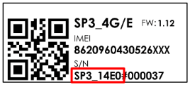 | SP3_1xx1_0112.fw |
| 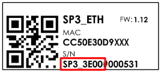 | SP3_3xx1_0112.fw |
|  | SP3_4xx1_0112.fw |
|  | SP3_5xx1_0112.fw |

Atlikite šiuos žingsnius įrašant veikimo programą rankiniu būdu:

1.  Paleiskite ***TrikdisConfig**.*

2.  Prijunkite „FLEXi” SP3 per USB Mini-B kabelį prie kompiuterio arba prisijunkite prie „FLEXi” SP3 nuotoliniu būdu.

3.  Parinkite gamyklinės programinės įrangos submeniu **„Programos naujinimas“**.

4.  Paspauskite gamyklinės programinės įrangos atidarymo langelį **„Atverti failą“** ir parinkite reikiamą gamyklinės programinės įrangos bylą.

5.  Paspauskite atnaujinimo mygtuką **Naujinti [F12]**.

6.  Palaukite, kol bus atlikti atnaujinimai.

7.  Paspauskite **„Atsijungti“** ir atjunkite USB kabelį.

Prie centralės prijunkite maitinimo laidus. Prijunkite belaidžių zonų išplėtimo modulį *RTX3*.

Į SIM kortelės laikiklį įdėkite prie mobiliojo tinklo jau priregistruotą SIM kortelę. Įjunkite maitinimą centralei. Palaukite kelias minutes. Prisijunkite su TrikdisConfig prie „FLEXi” SP3 nuotoliniu būdu. Programoje TrikdisConfig būsenos juostoje yra pateikta informacija apie įdiegtos veikimo programos versija ( 1 ). Langė **„Moduliai“**, lentelėje yra įtrauktas modulis RTX3 ( 2 ), kuris prijungtas prie centralės.

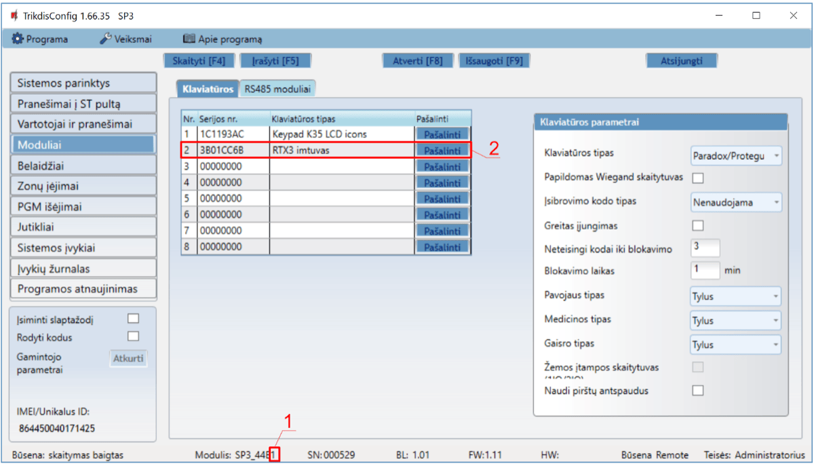

Prijungus belaidžių zonų išplėtimo modulį RTX3 „FLEXi“ SP3 gali dirbti su firmos Paradox belaidžiais jutikliais (magnetiniais kontaktais, PIR jutikliais, stiklo dūžio jutikliais(G550), dūmų jutikliais (SD360), nuotolinio valdymo pulteliais (REM2, REM25), sirenomis (SR230, SR250), klaviatūromis (K37), PGM ir zonos išplėtimo moduliu (2WPGM), kartotuvas (RPT1)).

## Belaidžių jutiklių registravimas

1.  Prie centralės turi būti priregistruotas modulis RTX3.

2.  Įjunkite centralės maitinimą. Įdėkite baterijas į jutiklį, palaukite kol nustos mirksėti LED indikatoriai.

3.  Prisijunkite su TrikdisConfig prie centralės „FLEXi” SP3 nuotoliniu būdu.

4.  Programoje TrikdisConfig lange **„Belaidžiai“** nuspauskite **„Jutiklių primokymas“**.

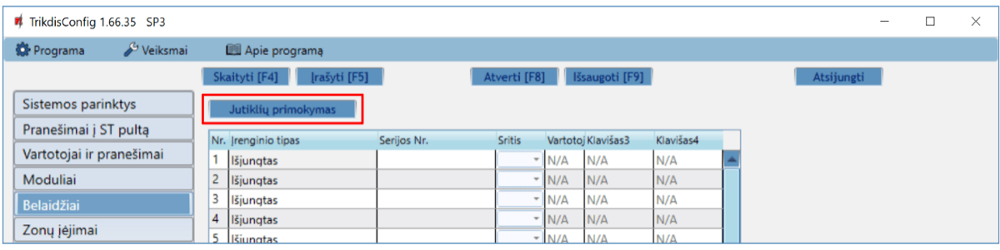

5.  Pasirinkite primokomo jutiklio tipą: **„Jutikliai“**.

6.  Nuspauskite mygtuką **„Pradėti“**.

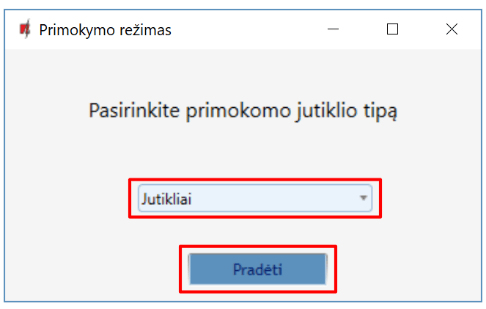

7.  Trumpam nuspauskite jutiklio Tamper mygtuką.

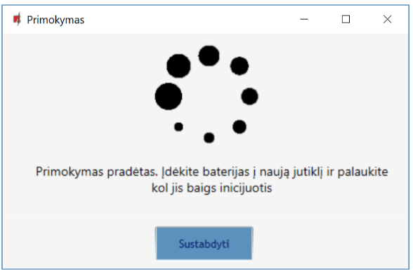

8.  Palaukite kelias sekundes. Centralė aptiks jutiklį.

9.  **„UID“** numeris turi sutapti su jutiklio serijos numeriu, kuris užrašytas ant jutiklio plokštės lipduko.

10. Reikia priskirti jutikliui **„Zonos numerį“** ir **„Zonos paskirtį“**.

11. Nuspauskite **„Išsaugoti“**.

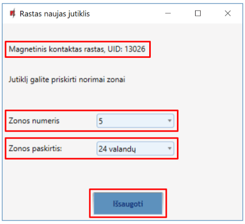

12. Naujas jutiklis įtrauktas į belaidžių įrenginių sąrašą.

13. **„UID“** numeris turi sutapti su jutiklio serijos numeriu, kuris yra užrašytas ant jutiklio plokštės lipduko.

14. Norint užbaigti belaidžių jutiklių registravimą nuspauskite **„Sustabdyti“**.

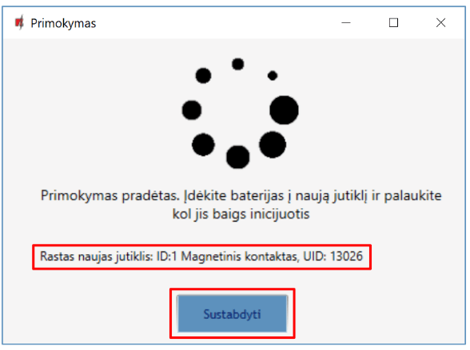

15. Nuspauskite **„Yes“** ir jutiklis bus įrašytas į centralę „FLEXi“ SP3.

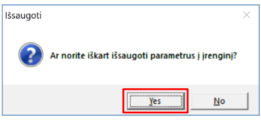

16. **„Belaidžių“** įrenginių sąraše bus įrašytas naujas belaidis jutiklis.

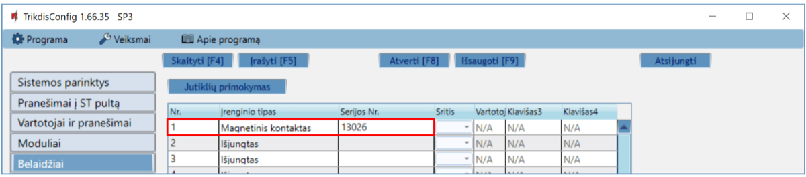

17. **„Zonų įėjimų“** lentelėje jutiklį būtina priskirti **„Sričiai“**, suteikti zonai **„Pavadinimą“**, nustatyti zonos **„Paskirtį“**.

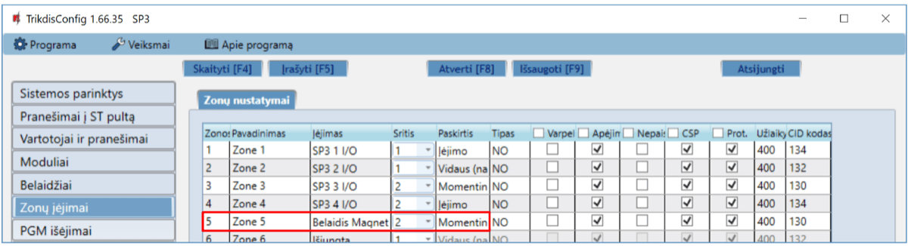

18. Atlikus pakeitimus nuspauskite **Įrašyti [F5]**.

19. Belaidis jutiklis pilnai priregistruotas.

!!! note
    Belaidžių jutiklių ištrynimas iš „FLEXi" SP3 atminties:

    1.  Paleiskite TrikdisConfig.

    2.  Prijunkite „FLEXi" SP3 per USB Mini-B kabelį prie kompiuterio
        arba prisijunkite prie „FLEXi" SP3 nuotoliniu būdu.
        Nuspauskite mygtuką **Skaityti [F4]**.

    3.  Programoje TrikdisConfig, lango **„Belaidžiai"** lauke
        **„Įrenginio tipai"**, kur buvo priregistruotas **belaidis
        jutiklis**, nurodykite **„Išjungtas"** ir paspauskite
        **Įrašyti [F5]**. Belaidis jutiklis ištrintas iš „FLEXi" SP3
        atminties.
## Belaidžio valdymo pultelio registravimas

1.  Prie centralės turi būti priregistruotas modulis RTX3.

2.  Įjunkite centralės maitinimą.

3.  Prisijunkite su TrikdisConfig prie centralės „FLEXi” SP3 nuotoliniu būdu.

4.  Programoje TrikdisConfig lange **„Belaidžiai“** nuspauskite **„Jutiklių primokymas“**.
5.  Pasirinkite primokomo įrenginio tipą: **„Pulteliai“**.

6.  Nuspauskite mygtuką **„Pradėti“.**

7.  Valdymo pultelyje turi būti įdėta baterija. Nuspauskite ir palaikykite pultelio bet kurį mygtuką, kad pultelyje užsidegtu LED indikatorius. Atleiskite mygtuką.

8.  Palaukite kelias sekundes. Centralė aptiks pultelį.

9.  **„UID“** numeris turi sutapti su pultelio serijos numeriu, kuris yra užrašytas ant korpuso.

10. Lauke **„Sritis“** nurodykite apsaugos sistemos sritį, kurią valdys (įjungs/išjungs) pultelis.

11. Lauke **„Vartotojas“** nurodykite vartotojo numerį, kuriam bus priskirtas valdymo pultelis.

12. Nuspauskite **„Išsaugoti“.**

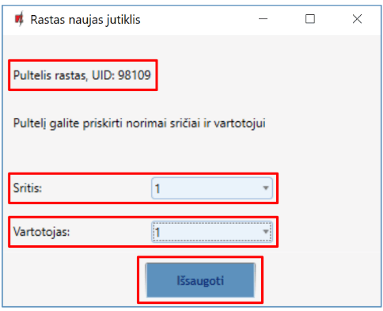

13. Naujas pultelis įtrauktas į belaidžių įrenginių sąrašą.

14. Norint užbaigti belaidžių pultelių registravimą nuspauskite **„Sustabdyti“.**

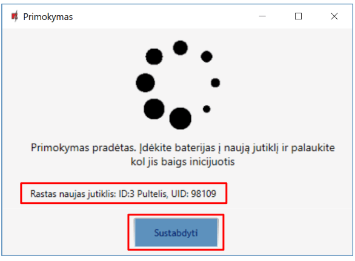

15. Nuspauskite **„Yes“** ir pultelis bus įrašytas į centralę „FLEXi“ SP3.

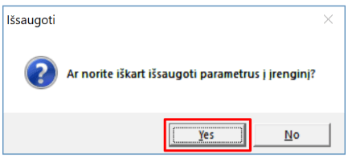

16. Belaidis pultelis įtrauktas į belaidžių įrenginių sąrašą.
17. Pultelio klavišams 3 ir 4 galite priskirti papildomas funkcijas (Išjungti, Įjungti sritį; Tylus aliarmas; Panikos aliarmas; PGM valdymas).

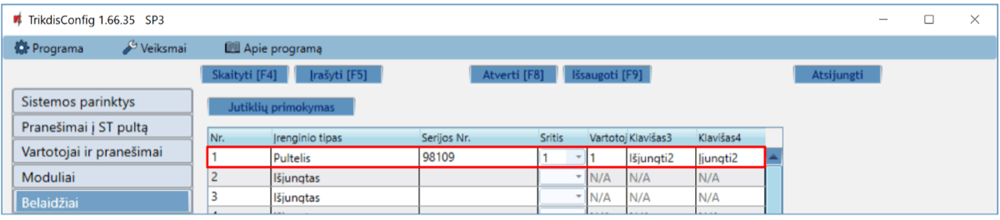

18. Atlikus pakeitimus nuspauskite **Įrašyti [F5]**.

19. Belaidis valdymo pultelis pilnai priregistruotas.

!!! note
    Belaidžio valdymo pultelio ištrynimas iš „FLEXi" SP3 atminties:

    1.  Paleiskite TrikdisConfig.

    2.  Prijunkite „FLEXi" SP3 per USB Mini-B kabelį prie kompiuterio
        arba prisijunkite prie „FLEXi" SP3 nuotoliniu būdu.
        Nuspauskite mygtuką **Skaityti [F4]**.

    3.  Programoje TrikdisConfig, lango **„Belaidžiai"** lauke
        **„Įrenginio tipai"**, kur buvo priregistruotas **belaidis
        pultelis**, nurodykite **„Išjungtas"** ir paspauskite
        **Įrašyti [F5]**. Belaidis jutiklis ištrintas iš „FLEXi" SP3
        atminties.
## Belaidės sirenos registravimas

1.  Prie centralės turi būti priregistruotas modulis RTX3.

2.  Įjunkite centralės maitinimą. Įdėkite į sireną baterija.

3.  Prisijunkite su TrikdisConfig prie centralės „FLEXi” SP3 nuotoliniu būdu.

4.  Programoje TrikdisConfig lange **„Belaidžiai“** nuspauskite **„Jutiklių primokymas“**.
5.  Pasirinkite primokomo įrenginio tipą: **„Sirenos“**.

6.  Nuspauskite mygtuką **„Pradėti“.**

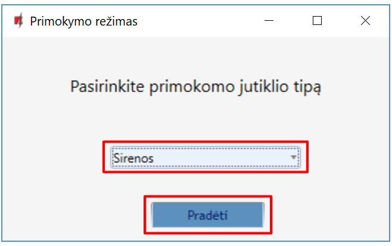

7.  Sirenos plokštėje nuspauskite ir palaikykite 3 sekundes „**LEARN“** mygtuką, sirenoje pradės mirksėti LED blykstė. Atleiskite mygtuką.

8.  Palaukite kelias sekundes. Centralė aptiks sireną.

9.  **„UID“** numeris turi sutapti su sirenos serijos numeriu, kuris yra užrašytas ant sirenos plokštės lipduko.

10. Lauke **„Sritis“** nurodykite apsaugos sistemos sritis, kurių aktyvavimas įjungs sirenos veikimą.

11. Nuspauskite **„Išsaugoti“.**

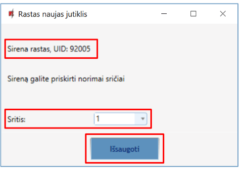

12. Belaidė sirena įtraukta į belaidžių įrenginių sąrašą.

13. Norint užbaigti belaidžių sirenų registravimą nuspauskite **„Sustabdyti“.**

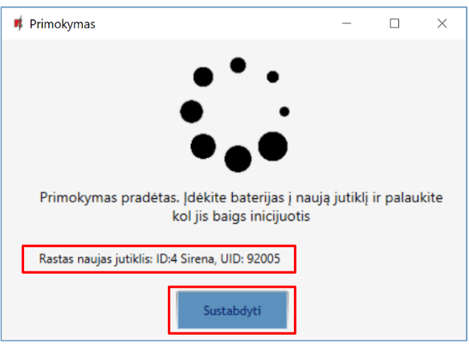

14. Nuspauskite **„Yes“** ir sirena bus įrašyta į centralę „FLEXi“ SP3.

15. Belaidė sirena įtraukta į belaidžių įrenginių sąrašą.

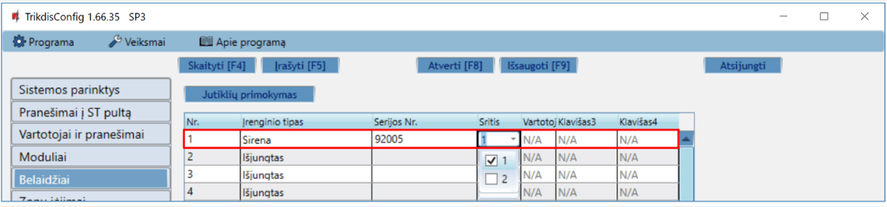

16. Atlikus pakeitimus nuspauskite **Įrašyti [F5]**.

17. Belaidė sirena pilnai priregistruota.

!!! note
    Belaidės sirenos ištrynimas iš „FLEXi" SP3 atminties:

    1.  Paleiskite TrikdisConfig.

    2.  Prijunkite „FLEXi" SP3 per USB Mini-B kabelį prie kompiuterio
        arba prisijunkite prie „FLEXi" SP3 nuotoliniu būdu.
        Nuspauskite mygtuką **Skaityti [F4]**.

    3.  Programoje TrikdisConfig, lango **„Belaidžiai"** lauke
        **„Įrenginio tipai"**, kur buvo priregistruota **belaidė sirena**,
        nurodykite **„Išjungtas"** ir paspauskite **Įrašyti [F5]**.
        Belaidė sirena ištrinta iš „FLEXi" SP3 atminties.
## Belaidės klaviatūros registravimas

1.  Prie centralės turi būti priregistruotas modulis RTX3.

2.  Įjunkite centralės maitinimą. Įdėkite į klaviatūrą baterijas.

3.  Prisijunkite su TrikdisConfig prie centralės „FLEXi” SP3 nuotoliniu būdu.

4.  Programoje TrikdisConfig lange **„Belaidžiai“** nuspauskite **„Jutiklių primokymas“**.
5.  Pasirinkite primokomo įrenginio tipą: **„Klaviatūros“**.

6.  Nuspauskite mygtuką **„Pradėti“.**

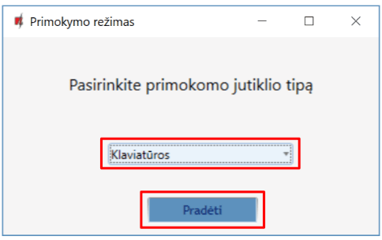

7.  Nuspauskite kartu ir palaikykite 3 sekundes klaviatūros mygtukus  ir [BYP]. Klaviatūra kelis kartus pyptelės. Atleiskite mygtukus.

8.  Palaukite kelias sekundes. Centralė aptiks klaviatūrą.

9.  **„UID“** numeris turi sutapti su klaviatūros serijos numeriu, kuris yra užrašytas ant klaviatūros korpuso.

10. Lauke **„Sritis“** nurodykite apsaugos sistemos sritį, kurią valdys klaviatūra.

11. Nuspauskite **„Išsaugoti“.**

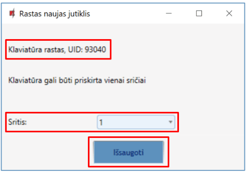

12. Belaidė klaviatūra įtraukta į belaidžių įrenginių sąrašą.

13. Norint užbaigti belaidžių klaviatūrų registravimą nuspauskite **„Sustabdyti“.**

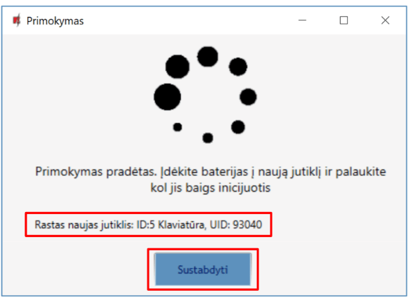

14. Nuspauskite **„Yes“** ir klaviatūra bus įrašyta į centralę „FLEXi“ SP3.

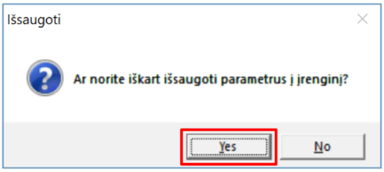

15. Belaidė klaviatūra įtraukta į belaidžių įrenginių sąrašą.

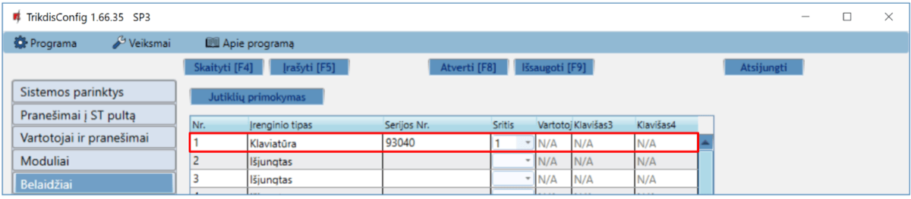

16. Atlikus pakeitimus nuspauskite **Įrašyti [F5]**.

17. Belaidė klaviatūra pilnai priregistruota.

!!! note
    Belaidės klaviatūros ištrynimas iš „FLEXi" SP3 atminties:

    1.  Paleiskite TrikdisConfig.

    2.  Prijunkite „FLEXi" SP3 per USB Mini-B kabelį prie kompiuterio
        arba prisijunkite prie „FLEXi" SP3 nuotoliniu būdu.
        Nuspauskite mygtuką **Skaityti [F4]**.

    3.  Programoje TrikdisConfig, lango **„Belaidžiai"** lauke
        **„Įrenginio tipai"**, kur buvo priregistruota **belaidė
        klaviatūra**, nurodykite **„Išjungtas"** ir paspauskite
        **Įrašyti [F5]**. Belaidė klaviatūra ištrinta iš „FLEXi" SP3
        atminties.
## Belaidžio dvipusio ryšio PGM modulio 2WPGM registravimas

1.  Prie centralės turi būti priregistruotas modulis RTX3.

2.  Įjunkite centralės maitinimą. Įjunkite maitinimą belaidžiui dvipusio ryšio PGM moduliui.

3.  Prisijunkite su TrikdisConfig prie centralės „FLEXi” SP3 nuotoliniu būdu.

4.  Programoje TrikdisConfig lange **„Belaidžiai“** nuspauskite **„Jutiklių primokymas“**.
5.  Pasirinkite primokomo įrenginio tipą: **„PGM įrenginys“**.

6.  Nuspauskite mygtuką **„Pradėti“.**

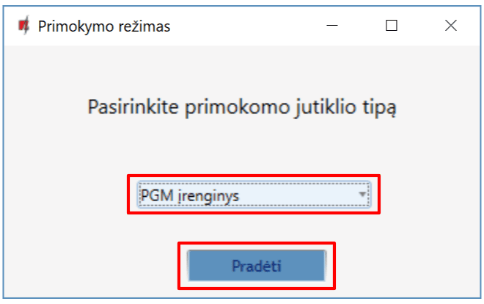

7.  Belaidžio dvipusio ryšio PGM modulyje nuimkite trumpiklį JP2 po kelių sekundžių uždėkite trumpiklį JP2 atgal.

8.  Palaukite kelias sekundes. Centralė aptiks modulį.

9.  **„UID“** numeris turi sutapti su modulio serijos numeriu, kuris yra užrašytas ant modulio lipduko.

10. Lauke **„Pasirinkite išėjimą“** nurodykite PGM išėjimo numerį.

11. Nuspauskite **„Išsaugoti“.**

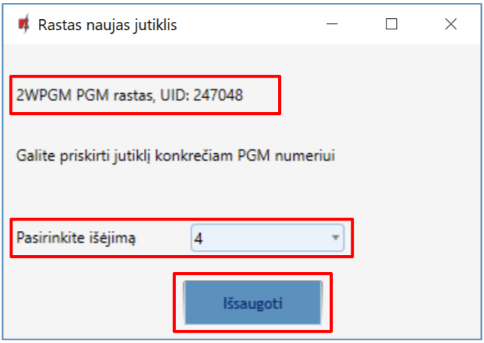

12. Belaidis dvipusio ryšio bevielis PGM modulis įtrauktas į belaidžių įrenginių sąrašą.

13. Norint užbaigti belaidžių modulių **2WPGM** registravimą nuspauskite **„Sustabdyti“.**

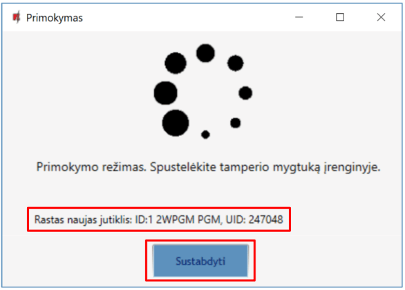

14. Nuspauskite **„Yes“** ir modulis **2WPGM** bus įrašytas į centralę „FLEXi“ SP3.

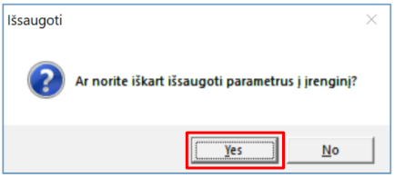

15. Belaidis modulis **2WPGM** įtrauktas į belaidžių įrenginių sąrašą.

16. PGM išėjimui galima priskirti **„Pavadinimą“**.

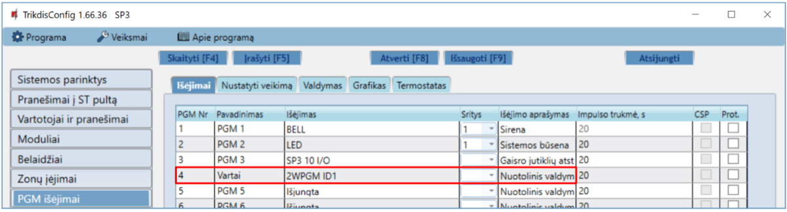

17. Atlikus pakeitimus nuspauskite **Įrašyti [F5]**.

18. Belaidis įrenginys **2WPGM** pilnai priregistruotas.

!!! note
    Belaidžio dvipusio ryšio PGM modulio **2WPGM** ištrynimas iš ***„FLEXi"
    SP3*** atminties:

    1.  Paleiskite TrikdisConfig.

    2.  Prijunkite „FLEXi" SP3 per USB Mini-B kabelį prie kompiuterio
        arba prisijunkite prie „FLEXi" SP3 nuotoliniu būdu.
        Nuspauskite mygtuką **Skaityti [F4]**.

    3.  Programoje TrikdisConfig, lango **„Belaidžiai"** lauke
        **„Įrenginio tipai"**, kur buvo priregistruotas **modulis 2WPGM**,
        nurodykite **„Išjungtas"** ir paspauskite **Įrašyti [F5]**.
        Belaidis modulis **2WPGM** ištrintas iš „FLEXi" SP3 atminties.
## Belaidžio ryšio kartotuvo RPT1 registravimas

1.  Prie centralės turi būti priregistruotas modulis RTX3.

2.  Įjunkite centralės maitinimą. Įjunkite maitinimą kartotuvui RPT1.

3.  Prisijunkite su TrikdisConfig prie centralės „FLEXi” SP3 nuotoliniu būdu.

4.  Programoje TrikdisConfig lange **„Belaidžiai“** nuspauskite **„Jutiklių primokymas“**.
5.  Pasirinkite primokomo įrenginio tipą: **„Kartotuvai“**.

6.  Nuspauskite mygtuką **„Pradėti“.**

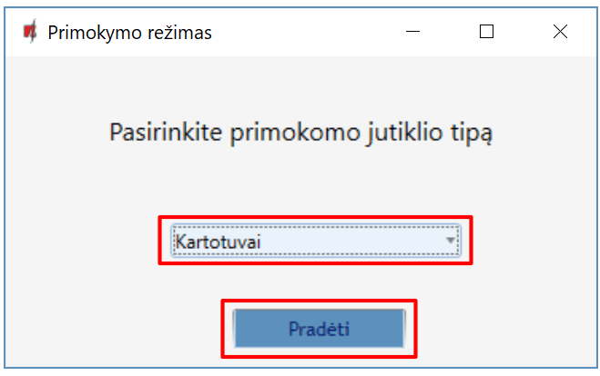

7.  Trumpam nuspauskite ***RPT1* „LEARN“** mygtuką.

8.  Palaukite kelias sekundes. Centralė aptiks kartotuvą RPT1.

9.  **„UID“** numeris turi sutapti su kartotuvo serijos numeriu, kuris yra užrašytas ant plokštės lipduko.

10. Norint užbaigti belaidžių kartotuvų registravimą nuspauskite **„Sustabdyti“.**

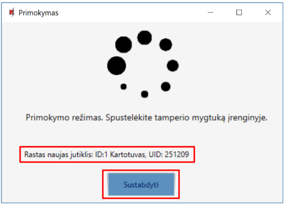

11. Nuspauskite **„Yes“** ir RPT1 bus įrašytas į centralę „FLEXi“ SP3.

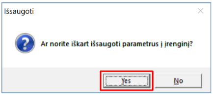

12. Belaidis ryšio kartotuvas RPT1 įtrauktas į belaidžių įrenginių sąrašą.

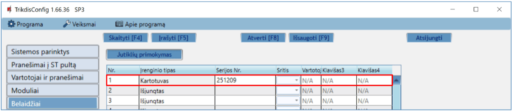

13. Atlikus pakeitimus nuspauskite **Įrašyti [F5]**.

14. Belaidis ryšio kartotuvas pilnai priregistruotas.

!!! note
    Belaidžio ryšio kartotuvo RPT1 ištrynimas iš „FLEXi" SP3
    atminties:

    1.  Paleiskite TrikdisConfig.

    2.  Prijunkite „FLEXi" SP3 per USB Mini-B kabelį prie kompiuterio
        arba prisijunkite prie „FLEXi" SP3 nuotoliniu būdu.
        Nuspauskite mygtuką **Skaityti [F4]**.

    3.  Programoje TrikdisConfig, lango **„Belaidžiai"** lauke
        **„Įrenginio tipai"**, kur buvo priregistruotas **kartotuvas
        *RPT1***, nurodykite **„Išjungtas"** ir paspauskite
        **Įrašyti [F5]**. Belaidis kartotuvas ištrintas iš ***„FLEXi"
        SP3*** atminties.
