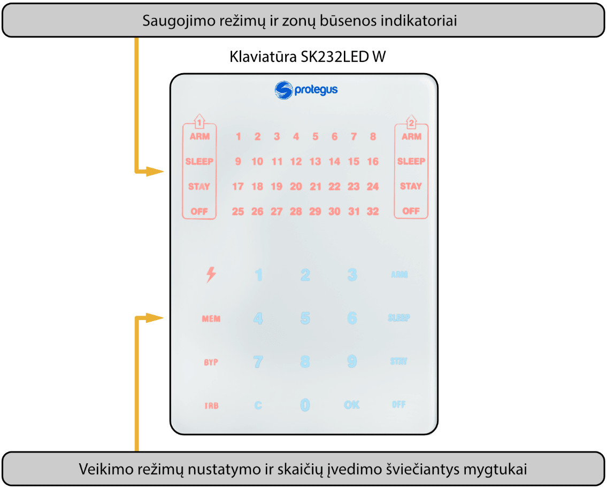
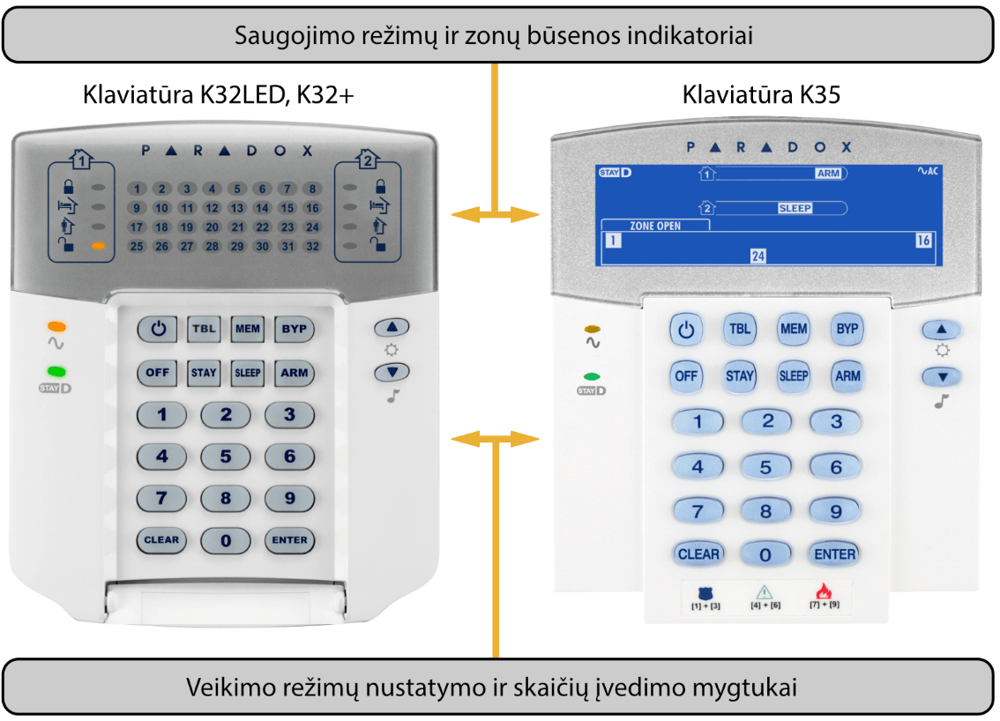

# „FLEXi“ SP3 apsaugos centralės su Protegus ir Paradox klaviatūromis vartotojo vadovas

#### **Aprašymas**

### OFF (DISARM)

Tai toks saugojimo režimas, kai saugoma tik dalis zonų. Signalizacija reaguos į **Gaisro**, **24 valandų**, **Tylioji 24 val** nustatytų zonų įvykius.

### ARM

Tai toks saugojimo režimas, kai saugomos visos zonos. Signalizacija reaguos į visus galimus įvykius.

### STAY

Tai toks saugojimo režimas, kai saugoma dalis zonų, bet zonose, nustatytose **Vidaus (nakties)** (Interior STAY) ir **Momentinė (nakties)** (Instant STAY), leidžiama judėti. Signalizacijai veikiant šiuo režimu ir pažeidus įėjimui skirtą **Įėjimo** (Delay) zoną, signalizacija suveiks tik pasibaigus įėjimui skirtam laikotarpiui.

### SLEEP

Tai toks saugojimo režimas, kai saugoma dalis zonų, bet zonose, nustatytose **Vidaus (nakties)** (Interior STAY) ir **Momentinė (nakties)** (Instant STAY), leidžiama judėti. Signalizacijai veikiant šiuo režimu ir pažeidus įėjimui skirtą **Įėjimo** (Delay) zoną, signalizacija suveiks nedelsiant.

### Apsaugos sistemos valdymas

Signalizacija gali būti valdoma šiais įrenginiais:

- *Trikdis* klaviatūra Protegus SK232LED W;

- *Paradox* klaviatūromis K32+, K32LED, K636, K10LED V/H, K35, TM50, TM70;

- *Crow* klaviatūromis CR-16, CR-LCD;

- *iButton* raktais;

- *RFID* kortelėmis.;

- Kodiniu ar kitu elektros jungikliu, keičiant Jungiklio (Keyswitch) nustatytos zonos būseną;

- Telefonu (paskambinus arba nusiuntus tam tikro turinio SMS žinutę);

- Protegus programėle;

- Nuotoline stebėjimo pulto komanda.

### Valdymo prieiga

Signalizacijos valdymo prieigai nustatyti naudojami valdymo kodai, pagal kuriuos skirtingiems vartotojams suteikiami skirtingi prieigos lygiai. Galimi keturženkliai valdymo kodai. Pasirenkant ir įvedant valdymo kodus naudojami tik skaičiai nuo 0 iki 9, kiti simboliai negalimi.

Galimi signalizacijos valdymo kodai:

- Administratoriaus kodas – šešių skaičių kombinacija (gamyklinis kodas - 123456). Administratoriaus kodas yra tik vienas. Jo negalima ištrinti, tačiau jį galima pakeisti. Su Administratoriaus kodu galima įvesti arba panaikinti kitų vartotojų valdymo kodus. Administratoriaus kodas negali Įjungti/Išjungti apsaugos sistemos;

- Vartotojų (*User*) kodas – keturių skaičių kombinacija signalizacijai įjungti/išjungti bei apsaugos zonoms laikinai atjungti. Rekomenduojama kiekvienam vartotojui suteikti asmeninį signalizacijos valdymo kodą. Modulio „FLEXi“ SP3 atmintyje galima nurodyti 40 vartotojų kodų;

- SMS slaptažodis – šešių skaičių kombinacija signalizacijai valdyti SMS žinutėmis (gamyklinis kodas - 123456).

### Apsaugos funkcijos

### **Pavadinimas**

#### **Aprašymas**

### Apėjimas / (Bypass)

Galimybė laikinai (vienam signalizacijos įjungimui) atjungti saugomos zonos kontrolę. Savybė naudojama norint įjungti signalizaciją, esant gedimui zonoje, ir kurio operatyviai pašalinti nepavyksta.

### Šūksnis / (Bell Squawk)

Trumpu sirenos signalu modulis gali perspėti apie patalpų signalizacijos įjungimą ir išjungimą.

### Varpelis / (Chime)

Esant išjungtai signalizacijai modulis gali trumpam įjungti klaviatūros garsinį signalizatorių – zumerį (angl. buzzer) ir/arba atitinkamai užprogramuotą PGM išėjimą ir taip perspėti, kad pažeidžiama zona.

### Auto-įjungimas (Re-ARM)

Tai apsauga nuo netyčinio signalizacijos išjungimo. Išjungus signalizaciją telefono skambučiu arba iš Protegus, bet nepažeidus įėjimo zonos, po įėjimui skirto laikotarpio (Entry Delay), centralė automatiškai įsijungs buvusiu saugojimo režimu.

### Papildomos funkcijos

| **Pavadinimas** | **Aprašymas** |
|:---|----|
| Temperatūros matavimas | Prie modulio „FLEXi“ SP3 gali būti prijungti temperatūros jutikliai DS18B20, DS18S20 (iki 8 vnt.) arba vienas temperatūros ir drėgmės jutiklis AM2301 ir kiekvienam nustatytos leistinos temperatūros svyravimo ribos. Temperatūrai pakitus daugiau nei nustatyta, bus suformuotas ir perduotas vartotojams atitinkamas pranešimas. |
| Nuotolinis įrenginių valdymas | Prie apsaugos modulio „FLEXi“ SP3 programuojamų, atvirojo kolektoriaus, išėjimų galima prijungti papildomus elektrotechninius įrenginius ir juos valdyti nuotoliniu būdu. |

## Signalizacijos valdymas

### Signalizacijos valdymas klaviatūra SK232LED W

Signalizacijos valdymo Trikdis klaviatūra SK232LED W užtikrina 32 zonų ir 2 sričių atvaizdavimą.

**Veikimo režimų nustatymo ir skaičių įvedimo mygtukai**

| **Mygtukai** | **Aprašymas** |
|:---|----|
|  | Nuolatos šviečiantis mygtukas reiškia maitinimą iš kintamos srovės tinklo, o mirksintis – rodo akumuliatoriaus gedimą. Nedega – išjungtas maitinimo įtampos šaltinis arba sistema veikia nuo akumuliatoriaus. Mygtukas taip pat naudojamas valdymo kodams redaguoti ir gaisro jutiklių perkrovimui. |
| MEM | Nuolatos šviečiantis mygtukas reiškia, kad yra naujos informacijos apie suveikimą atmintyje, o mirksintis – rodo veikimo MEM režimą. Mygtukas taip pat naudojamas atminties peržiūros režimui pasirinkti. |
| BYP | Nuolatos šviečiantis mygtukas reiškia, kad yra laikinai atjungtų zonų, o mirksintis – rodo veikimo BYPASS režimą. Mygtukas taip pat naudojamas laikino zonų atjungimo režimui pasirinkti. |
| TRB | Nuolatos šviečiantis mygtukas reiškia, kad užfiksuoti veikimo nesklandumai, o mirksintis – rodo veikimo TBL režimą. Mygtukas taip pat naudojamas nesklandumų peržiūros režimui pasirinkti. |
| 1, 2 ...9, 0 | Mygtukai skaitinėms reikšmėms įvesti. |
| C | Mygtukas naudojamas išėjimui iš režimo ir informacijos reikšmėms ištrinti. |
| OK | Mygtukas naudojamas nurodytam pasirinkimui patvirtinti. |
| ARM | Mygtukas pilnam saugojimo režimui **ARM** jungti. |
| SLEEP | Mygtukas **SLEEP** režimui jungti. |
| STAY | Mygtukas **STAY** režimui jungti. |
| OFF | Mygtukas **OFF** (DISARM) režimui jungti. |

> [!NOTE]
>     1. Programavimo režimui išjungti, ar klaidingai įvestai reikšmei
ištrinti, paspauskite mygtuką **C**.

2. Jei bent viena zona pažeista, signalizacija saugojimui neįsijungs
(kai nėra priskirta **FORCE** savybė zonoms).
### Signalizacijos valdymas klaviatūra Paradox

Signalizacijos valdymo Paradox klaviatūra K10LED V/H užtikrina 10 zonų ir 2 sričių atvaizdavimą.

Signalizacijos valdymo Paradox klaviatūra K636 užtikrina 10 zonų ir 1 srities atvaizdavimą.

Signalizacijos valdymo Paradox klaviatūros K32LED, K32+, K35 užtikrina 32 zonų ir 2 sričių atvaizdavimą.

**Veikimo režimų nustatymo ir skaičių įvedimo mygtukai**

| **Mygtukas** | **Aprašymas** |
|----|----|
|  | Gaisro jutiklių perkrovimo mygtukas. |
| MEM | Nuolatos šviečiantis mygtukas reiškia, kad yra naujos informacijos apie suveikimą atmintyje, o mirksintis – rodo veikimo MEM režimą. Mygtukas taip pat naudojamas atminties peržiūros režimui pasirinkti. |
| BYP | Nuolatos šviečiantis mygtukas reiškia, kad yra laikinai atjungtų zonų, o mirksintis - rodo veikimo BYPASS režimą. mygtukas taip pat naudojamas laikino zonų atjungimo režimui pasirinkti |
| TBL | Nuolatos šviečiantis mygtukas reiškia, kad užfiksuoti veikimo nesklandumai, o mirksintis –rodo veikimo TBL režimą. mygtukas taip pat naudojamas nesklandumų peržiūros režimui pasirinkti |
| 1, 2 ...9, 0 | Mygtukai skaitinėms reikšmėms įvesti. |
| CLEAR | Mygtukas naudojamas išėjimui iš režimo ir informacijos reikšmėms ištrinti. |
| ENTER | Mygtukas naudojamas nurodytam pasirinkimui patvirtinti. |
| ARM | Mygtukas pilnam saugojimo režimui **ARM** jungti. |
| SLEEP | Mygtukas **SLEEP** režimui jungti. |
| STAY | Mygtukas **STAY** režimui jungti. |
| OFF | Mygtukas **OFF** (DISARM) režimui jungti. |
|  | Maitinimo įtampos indikatorius. Šviečia – įjungta maitinimo įtampa. Mirksi – akumuliatoriaus gedimas. Nedega – išjungtas maitinimo įtampos šaltinis arba sistema veikia nuo akumuliatoriaus. |

> [!NOTE]
>     1. Programavimo režimui išjungti, ar klaidingai įvestai reikšmei
ištrinti, paspauskite mygtuką **CLEAR**.

2. Jei bent viena zona pažeista, signalizacija saugojimui neįsijungs
(kai nėra priskirta **FORCE** savybė zonoms).
## Greitas apsaugos įjungimas/išjungimas

Signalizacijos įjungimas/išjungimas su kodu. Apsaugos sistema turi **STAY** zonų.

Saugojimo režimai **ARM**, **STAY** ir **SLEEP** perjungiami į **OFF**/**DISARM**, o **OFF**/**DISARM** perjungiama į **ARM** arba **STAY** režimą.

Apsaugos režimo keitimas:

1. Suveskite **Vartotojo kodą**.

1. Jeigu sistema turi tik vieną sritį praleiskite žingsnį 2. Jeigu sistema turi daugiau negu vieną sritį, klaviatūroje pradės šviesti sričių numeriai, kurių režimus vartotojas gali keisti.

2. Nuspauskite pasirinktų sričių numerius.

3. Sritis, kurios buvo **ARM**, **STAY**, **SLEEP** režime, persijungs į režimą **OFF**/**DISARM**.

1. Kai signalizacija išjungta, šviečia indikatorius **OFF**.

2. Jeigu įjungta **Bell Squawk** funkcija, signalizacijai išsijungiant, sirena turi trumpai suveikti du kartus.

4. Sritims, kurios buvo **OFF**/**DISARM** režime, prasidės **Exit delay** laiko atskaita. Jeigu atskaitos metu bus pažeista **Delay** zona, įsijungs **ARM** režimas, jeigu **Delay** zona nebuvo pažeista, įsijungs **STAY** režimas.

1. Pradės šviesti atitinkamas klaviatūros indikatorius (**ARM** arba **STAY**).

2. Jeigu įjungta **Bell Squawk** funkcija, tai signalizacijai įsijungus, sirena vieną kartą trumpai suveiks.

### Signalizacijos įjungimas, ARM režimas

Apsaugos sistema padalinta į kelias sritis. Norint įjungti saugojimo režimą **ARM**:

1. Nuspauskite klaviatūros mygtuką **ARM**.

2. Klaviatūra suveskite **Vartotojo kodą**.

3. Paspauskite mygtukus su sričių, kurias norite valdyti, numeriais.

4. Patvirtinkite pasirinkimą paspaudus mygtuką **OK** (arba **ENTER**).

5. Išeikite iš patalpų ir uždarykite duris per išėjimui skirtą **Exit Delay** laiko atskaitą.

1. **Exit Delay** laiko atskaitos metu klaviatūros indikatorius **ARM** pradės mirksėti, o signalizacijai įsijungus – šviesti.

2. Jeigu įjungta **Bell Squawk** funkcija, tai signalizacijai įsijungus, sirena vieną kartą trumpai suveiks.

### Signalizacijos įjungimas, STAY režimas

Apsaugos sistema padalinta į kelias sritis. Norint įjungti saugojimo režimą **STAY**:

1. Nuspauskite klaviatūros mygtuką **STAY**.

2. Klaviatūra suveskite **Vartotojo kodą**.

3. Paspauskite mygtukus su sričių, kurias norite valdyti, numeriais.

4. Patvirtinkite pasirinkimą paspaudus mygtuką **OK** (arba **ENTER**).

5. Klaviatūros indikatorius **STAY** pradės šviesti.

1. Jeigu įjungta **Bell Squawk** funkcija, tai signalizacijai įsijungus, sirena vieną kartą trumpai suveiks.

> [!NOTE]
>     Bent viena zona turi būti nustatyta **Interior STAY** arba **Instant
STAY**, kitaip **STAY** režimas negalimas.
### Signalizacijos įjungimas, SLEEP režimas

Apsaugos sistema padalinta į kelias sritis. Norint įjungti saugojimo režimą **SLEEP**:

1. Nuspauskite klaviatūros mygtuką **SLEEP**.

2. Klaviatūra suveskite **Vartotojo kodą**.

3. Paspauskite mygtukus su sričių, kurias norite valdyti, numeriais.

4. Patvirtinkite pasirinkimą paspaudus mygtuką **OK** (arba **ENTER**).

5. Klaviatūros indikatorius **SLEEP** pradės šviesti.

1. Jeigu įjungta **Bell Squawk** funkcija, tai signalizacijai įsijungus, sirena vieną kartą trumpai suveiks.

### Signalizacijos išjungimas, OFF režimas

Kai patalpos saugomos **ARM** arba **STAY** režimu, tai įėjus į patalpas pro **Delay** zoną įsijungs įėjimui skirto laiko **Entry Delay** atskaita, per kurią turite spėti išjungti signalizaciją.

Norint išjungti saugojimo režimą (įjungti **OFF** / **DISARM** režimą):

1. Nuspauskite klaviatūros mygtuką **OFF**.

2. Klaviatūra suveskite **Vartotojo kodą**.

1. Jeigu sistema turi tik vieną sritį, praleiskite 3, 4 žingsnius.

3. Paspauskite mygtukus su sričių, kurias norite valdyti, numeriais.

4. Patvirtinkite pasirinkimą paspaudus mygtuką **OK** (arba **ENTER**).

1. Kai signalizacija išjungta, šviečia indikatorius **OFF**.

2. Jeigu įjungta **Bell Squawk** funkcija, signalizacijai išsijungiant, sirena turi trumpai suveikti du kartus.

#### Signalizacijos išjungimas po suveikimo

Signalizacijai išjungti:

1. Suveskite **Vartotojo kodą**.

1. Jeigu sistema turi tik vieną sritį, praleiskite 2, 3 žingsnius.

2. Paspauskite mygtukus su sričių numeriais, kurias norite valdyti.

3. Patvirtinkite pasirinkimą paspaudus mygtuką **OK** (arba **ENTER**).

1. Kai signalizacija išjungta, šviečia indikatorius **OFF**.

2. Jeigu įjungta **Bell Squawk** funkcija, signalizacijai išsijungiant, sirena turi trumpai suveikti du kartus.

3. Pradės šviesti indikatorius **MEM** ir mirksės pažeistos zonos. Nuspauskite **MEM** po to **C** (arba **CLEAR**), kad išjungti pažeistu zonų mirksėjimą.

## Laikinas zonos atjungimas (Bypass funkcija)

Norint įjungti **Bypass** funkciją:

1. Nuspauskite klaviatūros mygtuką **BYP**.

2. Suveskite **Vartotojo kodą**.

1. Indikatorius **BYP** pradės mirksėti.

3. Surinkite zonų, kurių kontrolę norite atjungti, dviženklius numerius.

4. Patvirtinkite pasirinkimą paspaudus mygtuką **OK** (arba **ENTER**).

5. Indikatorius **BYP** pradės šviesti.

**Bypass** funkcijos išjungimui pakartokite tuos pačius veiksmus, kaip ir laikinai atjungiant zonų stebėjimą.

### Signalizacijos suveikimų atminties peržiūra ir valymas

Suveikus signalizacijai, pradeda šviesti mygtukas **MEM**. Suveikimo priežasčiai nustatyti:

1. Nuspauskite klaviatūros mygtuką **MEM**.

2. Švytintis skaičiai rodys zonas, kurios iššaukė signalizacijos suveikimą.

3. Išėjimui iš šio režimo, nuspauskite mygtuką **C** (arba **CLEAR**).

1. Jeigu klaviatūra bus neatliekami jokie veiksmai, po minutės atminties peržiūros režimas išsijungs automatiškai , bet informacija atmintyje išliks ir švies indikatorius **MEM**.

4. Atmintis bus išvalyta kai signalizacija bus įjungta ir mygtukas **MEM** nustos šviesti.

### Gaisro (dūmų) jutiklių paleidimas veikti iš naujo

Po gaisro (dūmų) jutiklių suveikimo, norėdami jutiklių indikaciją paleisti veikti iš naujo:

1. Nuspauskite ir palaikykite 3 sekundes, klaviatūros mygtuką  (arba ).

1. Suveiks PGM išėjimas nustatytas veikti **Gaisro jutiklių atstatymas** režimu, prie kurio prijungti gaisro jutikliai.

2. Prie centralės zonos prijungti gaisro (dūmų) jutikliai bus paleisti veikti iš naujo.

### Pagalbos iškvietimo mygtukai

Klaviatūra galima išsiųsti pranešimus saugos tarnybai apie gresiantį pavojų ar reikalingą pagalbą. Ši savybė galima, jei naudojatės saugos tarnybos paslaugomis ir yra ryšys su stebėjimo pultu.

Nuspauskite kartu ir palaikykite 3 sekundes mygtukus:

> [!NOTE]
> 1  3, kad išsiųsti pranešimą ], kad išsiųsti pranešimą Panic apie jums gresiantį pavojų.

> [!NOTE]
> 4  6, kad išsiųsti pranešimą ], kad išsiųsti pranešimą Medical apie medicininės pagalbos poreikį.

> [!NOTE]
> 7  9, kad išsiųsti pranešimą ], kad išsiųsti pranešimą Fire apie gaisrą. apie gaisrą.

> [!NOTE]
> 1, kad išsiųsti pranešimą ], kad išsiųsti pranešimą Panic apie jums gresiantį pavojų.

> [!NOTE]
> 4, kad išsiųsti pranešimą ], kad išsiųsti pranešimą Medical apie medicininės pagalbos poreikį.

> [!NOTE]
> 7, kad išsiųsti pranešimą ], kad išsiųsti pranešimą Fire apie gaisrą. apie gaisrą.
### Signalizacijos nesklandumų peržiūra

Atsiradus veikimo nesklandumams, pradeda šviesti klaviatūros **TRB** mygtuko indikatorius. Signalizacijos nesklandumų peržiūrai:

1. Spauskite mygtuką **TRB**.

2. Klaviatūroje pradės šviesti, nesklandumų grupės.

3. Jeigu reikia nesklandumų grupę išskleisti spauskite ant atitinkamo mygtuko.

4. Išėjimui iš režimo nuspauskite mygtuką **C** ( arba **CLEAR**).

**Nesklandumų reikšmės**

| Gedimo grupė | Pasirinktos grupės reikšmė |
|--------------|----------------------------|
| 1: Sistema | 1 Nėra maitinimo iš kintamos srovės tinklo |
| 1: Sistema | 2 Akumuliatoriaus gedimas |
| 1: Sistema | 3 Nenustatytas laikrodis |
| 1: Sistema | 4 Viršyta maitinimo išėjimo AUX leistina srovė |
| 1: Sistema | 5 Viršyta sirenos išėjimo leistina srovė |
| 1: Sistema | 6 Nėra sirenos |
| 1: Sistema | 7 Gaisro jutiklių kilpos gedimas |
| 2: Ryšiai | 1 Sutrikęs pagrindinis ryšio kanalas (visais ryšio tipais) |
| 2: Ryšiai | 2 Sutrikęs antras ryšio kanalas (visais ryšio tipais) |
| 2: Ryšiai | 3 Sutrikęs Protegus ryšio kanalas (visais ryšio tipais) |
| 2: Ryšiai | 4 Nėra SIM kortelės |
| 2: Ryšiai | 5 SIM PIN kodas neteisingas |
| 2: Ryšiai | 6 Nepavyksta prisijungti prie GSM tinklo |
| 2: Ryšiai | 7 Nepavyksta prisijungti prie WiFi tinklo |
| 2: Ryšiai | 8 modulio E485 ryšio nesklandumai (žr. šviesinę modulio indikaciją) |
| 3: Zonos tamperis | Zonų numeriai, kurių tamperiai pažeisti. |
| 4: Magistralė 485 | 485 magistralės plėtiklių, kuriuose yra sutrikimai, numeriai |
| 5: Dingo RF jutiklis | Nebeveikia (praėjo patikros laikas) bevielis jutiklis. Zonos numeris parodo eiliškumą iš atskiros RF lentelės. |
| 6: RF baterija žema | Bevielis jutiklis pranešė, kad jo baterija baigia išsikrauti. Jutiklio numeris pagal atskirą RF lentelę. |
| 7: Antimaskingas | Zonų numeriai, kurių antimaskingas pažeistas. |

### Vartotojų valdymo kodų programavimas

#### Administratoriaus kodo keitimas

**Administratoriaus kodo** keitimas atliekamas programoje TrikdisConfig meniu šakoje **Sistemos parinktys / Prisijungimas / Prieigos kodas**.

#### Naujų vartotojų (User) kodų įvedimas

1. Nuspauskite klaviatūros mygtuką  (arba ).

2. Įveskite 6-ženklį **Administratoriaus** **kodą**.

1. Mygtukas  (arba ) pradės mirksėti.

3. Surinkite laisvą dviženklį vartotojo eilės numerį.

4. Įveskite 4-ženklį **Vartotojo** **kodą**.

5. Pakartotinai įveskite 4-ženklį **Vartotojo** **kodą**.

6. Įveskite sritis, kurias galės valdyti vartotojas.

7. Patvirtinkite pasirinkimą paspaudus mygtuką **OK** (arba **ENTER**).

8. Išėjimui iš režimo nuspauskite mygtuką **C** (arba **CLEAR**).

#### Vartotojų (User) kodų redagavimas

1. Nuspauskite klaviatūros mygtuką  (arba ).

2. Įveskite 6-ženklį **Administratoriaus** **kodą**.

1. Mygtukas  (arba ) pradės mirksėti.

3. Surinkite reikiamą dviženklį vartotojo eilės numerį.

4. Įveskite 4-ženklį **Vartotojo** **kodą**.

5. Pakartotinai įveskite 4-ženklį **Vartotojo** **kodą**.

6. Įveskite sritis, kurias galės valdyti vartotojas.

7. Patvirtinkite pasirinkimą paspaudus mygtuką **OK** (arba **ENTER**).

8. Išėjimui iš režimo nuspauskite mygtuką **C** (arba **CLEAR**).

#### Sričių peržiūra

Esamų sričių būsenos peržiūra.

| **Klaviatūros Paradox K32+, K32LED, K636, K10LED, K35** | **Klaviatūra Protegus SK232LED** |
|----|----|
| Nuspauskite kartų 1 ir 2 mygtukus ir palaikykite 3 sek., klaviatūra turi supypsėti | Nuspauskite 2 ir palaikykite mygtuką 3 sek., klaviatūra turi supypsėti |

LED indikatoriai nuo 1 iki 8 parodys sričių būsenas: Dega – įjungtas **Arm** (saugojimo) režimas; Mirksi – įjungtas **Stay** režimas; Nedega – **Disarm** arba išjungta.

## Paradox klaviatūros vartotojų kodų veiksmai

#### Vartotojų (User) kodų ištrynimas

Esamų vartotojų (**User**) kodų ištrynimui:

1. Nuspauskite klaviatūros mygtuką (arba ).

2. Įveskite 6-ženklį **Administratoriaus** **kodą**.

1. Mygtukas  (arba ) pradės mirksėti.

3. Surinkite reikiamą dviženklį vartotojo eilės numerį.

4. Nuspauskite mygtuką **SLEEP**.

5. Išėjimui iš režimo nuspauskite mygtuką **C** (arba **CLEAR**).

#### Užpuolimo (Duress) kodas

Jei esate priversti įjungti ar išjungti apsaugos sistemą, įvedę vartotojo kodą su įjungta prievartos parinktimi, sistema įjungs / išjungs apsaugą ir nedelsdama perduos tylųjį perspėjimą (Duress kodą) stebėjimo pultui. Prievartos kodą turi įjungti montuotojas. Užpuolimo kodas gali būti dviejų tipų: **Paskutinis skaičius didesnis vienetu** arba **„0“ vietoj pirmojo skaičiaus**.

## Valdymas iButton raktais

> [!NOTE]
>     Jei bent viena apsaugos zona bus pažeista, signalizacija saugojimui
neįsijungs.
iButton raktais galima nustatyti signalizacijos apsaugos režimus **ARM** / **STAY** / **OFF**. Saugojimo režimas **SLEEP** negalimas.

Prilieskite iButton raktą prie raktų skaitytuvo. Signalizacijos būsena pasikeis į priešingą. Jei buvo įjungta - išsijungs. Jei buvo išjungta – įsijungs ir prasidės išėjimui skirto **Exit Delay** laikotarpio atskaita. Jei per numatytą išėjimui laiką nepažeisite **Delay** nustatytos zonos ir esant **Interior STAY** ir **Instant STAY** nustatytoms zonoms, įsijungs saugojimo režimas **STAY**.

Ištrinti esamus ir įvesti naujus raktus įrengtoje ir veikiančioje signalizacijoje, galima naudojant parametrų nustatymo programą TrikdisConfig arba kontaktinių raktų skaitytuvą**.**

Kontaktinių raktų registravimas su skaitytuvu CZ-Dallas.

1. Jei **Pakabuko kodų** sąrašas tuščias, pridėkite kontaktinį raktą prie skaitytuvo „akies“ ir palaikykite 3 sekundes. Raktas bus priregistruotas ir įrašytas į pirmąją sąrašo eilutę ir jam priskiriama „**Pagrindinio rakto“** funkcija.

2. Norint įjungti kontaktinių raktų registravimo režimą, reikia „**Pagrindinį raktą**“ priglausti prie raktų skaitytuvo „akies“ ir palaikyti jį ne trumpiau nei 10 sekundžių.

3. Kad priregistruotumėte vartotojų raktus, vieną po kito raktus priglauskite ir palaikykite prie skaitytuvo „akies“.

4. Baigus registruoti kontaktinius (*iButton*) vartotojų raktus, vėl „**Pagrindinį raktą“** priglauskite prie skaitytuvo „akies“, kad išjungtumėte registravimo režimą.

5. Norint ištrinti visus raktus (ir pagrindinį), reikia palaikyti **„Pagrindinį raktą“** priglaudus prie skaitytuvo ne trumpiau 20 s.

## Valdymas RFID kortele (pakabuku)

> [!NOTE]
>     Jei bent viena apsaugos zona bus pažeista, signalizacija saugojimui
neįsijungs.
RFID kortele galima nustatyti signalizacijos apsaugos režimus **ARM** / **STAY** / **OFF**.

Prie apsaugos centralės turi būti prijungtas Wiegand (26/34) RFID skaitytuvas su klaviatūra. RFID pakabukų (kortelių) registravimą galima atlikti programoje TrikdisConfig įvedant jų ID numerius į lauką **Pakabuko kodas**.

Pridėkite RFID kortelę prie Wiegand skaitytuvo arba Wiegand skaitytuvo klaviatūroje įveskite **Vartotojo kodą** ir nuspauskite **\#**. Signalizacijos būsena pasikeis į priešingą. Jei buvo įjungta, - išsijungs. Jei buvo išjungta – įsijungs ir prasidės išėjimui skirto **Exit Delay** laikotarpio atskaita. Jei per numatytą išėjimui laiką nepažeisite **Delay** nustatytos zonos ir esant **Interior STAY** ir **Instant STAY** nustatytoms zonoms, įsijungs saugojimo režimas **STAY**.

## Valdymas skambučiu

> [!NOTE]
>     Jei bent viena apsaugos zona bus pažeista, signalizacija saugojimui
neįsijungs (kai nėra priskirta **FORCE** savybė zonoms). / Valdant
signalizacija telefono skambučiu galimas tik **ARM** arba **STAY**
saugojimo režimas. / Prieš skambinant, rekomenduojama pasitikslinti
esamą saugojimo rėžimą, išsiunčiant sričių būsenos užklausą SMS žinute
(komanda: **ASKA 123456**). Ir taip pat pasitikslinti esamas zonų
būsenas, išsiunčiant zonų būsenos užklausą SMS žinute (komanda: **ASKI
123456**).
Programuojant modulį yra įvedami vartotojų telefono numeriai ir nurodyta ką galima valdyti telefono skambučiu: įjungti/išjungti signalizaciją ar valdyti prijungtą prie modulio išėjimo **PGMx** elektrotechninę įrangą.

Paskambinkite apsaugos modulyje „FLEXi“ SP3 įstatytos SIM kortelės numeriu. Jei telefono numeris iš kurio skambinate yra nurodytas modulio atmintyje apsaugos centralė pakels „ragelį“ ir jums reikės įvesti valdymo komandą (žr. valdymo komandų lentelę).

### Telefono aparato skaičių klaviatūra surenkamų valdymo komandų sąrašas

| Klaviatūros klavišai | Funkcija | Aprašymas |
|----------------------|----------|-----------|
| 1[srities nr][#] | Pasirinktos signalizacijos srities įjungimas | Pvz. (įjungti signalizacijos 2 srities saugojimą): 12# |
| 2[srities nr][#] | Pasirinktos signalizacijos srities išjungimas | Pvz. (išjungti signalizacijos 2 srities saugojimą): 22# |
| 3[išėjimo nr][#][būsenos nr] | Pasirinkto OUT išėjimo valdymas | Valdo konkretų OUT išėjimą. Būsena: 0 – išėjimas nustatomas į padėtį „išjungtas“; 1 – išėjimas nustatomas į padėtį „įjungtas“; 2 - išėjimas nustatomas į padėtį „išjungtas“ nurodytai impulso trukmei; 3 - išėjimas nustatomas į padėtį „įjungtas“ nurodytai impulso trukmei; (impulso trukmė nustatoma programa TrikdisConfig, PGM lentelėje). Pvz. (nustatyti išėjimą 1OUT į padėtį „įjungta“): 31#1 Pvz. (išėjimą 2OUT nustatyti į padėtį „įjungtas“ Impulso trukmei, nurodytai TrikdisConfig „PGM išėjimai“ lentelėje): 32#3 |

Jei aktyvuota **Re-ARM** funkcija, po signalizacijos išjungimo komandos, pasibaigus nustatytam įėjimui skirtam laikotarpiui ir nepažeidus **Delay** zonos, signalizacija automatiškai įsijungs prieš tai buvusiu režimu.

## Valdymas SMS žinutėmis

SMS žinutėmis galima valdyti apsaugos centralę „FLEXI“ SP3 ir keisti dalį centralės parametrų. Visus modulio parametrus galima keisti tik TrikdisConfig programa.

SMS pranešimo struktūra: Komanda `[tarpas]` Slaptažodis `[tarpas]` Duomenys

Centralėje su gamyklos nustatyta pirmine konfigūracija SMS slaptažodžio reikšmė **123456**. Saugumo sumetimais rekomenduojame jį pakeisti į sau žinomą ir jo nepamiršti!

### SMS komandų sąrašas

| **Komanda** | **Duomenys** | **Aprašymas** |
|----|----|----|
| *INFO* |  | Informacijos apie centralę užklausa. Į atsakymą bus įtraukti: objekto pavadinimas, srities būsena, IMEI numeris, GSM signalo lygis, programinės įrangos versija ir serijos numeris. Pvz.: INFO 123456 |
| *RESET* |  | Prietaiso paleidimas iš naujo. Pvz.: RESET 123456 |
| *OUTPUTx* | *ON* | Įjungti išėjimą, kur „x“ - išėjimo numeris. Pvz.: OUTPUT1 123456 ON |
|  | *OFF* | Išjungti išėjimą, kur „x“ - išėjimo numeris. Pvz.: OUTPUT1 123456 OFF |
|  | *PULSE=ttt* | Keletui sekundžių įjungti išėjimą - „x“ reiškia OUT išėjimo numerį, o „ttt“ yra trijų skaitmenų skaičius, reiškiantis impulso trukmę sekundėmis. / Pvz.: OUTPUT1 123456 PULSE=002 |
| *PSW* | *Naujas SMS slaptažodis* | SMS slaptažodžio keitimas. Pvz.: PSW 123456 654123 |
| *TIME* | *YYYY/MM/DD,12:00:00* | Datos ir laiko nustatymas. Pvz.: TIME 123456 2020/01/02,12:23:00 |
| *TXTA* | *Objekto pavadinimas* | Objekto pavadinimo įrašymas. Pvz.: TXTA 123456 Namas |
| *RDR* | *PhoneNR#SMStext* | SMS pranešimų peradresavimas į nurodytą numerį. Telefono numeris turi būti su „+“ ženklu ir šalies kodu. / Pvz.: RDR 123456 +37061234567#peradresuojamas tekstas |
| *ASKI* |  | Siųsti SMS pranešimą apie įėjimų IN būsenas. Pvz.: ASKI 123456 |
| *ASKO* |  | Siųsti SMS pranešimą apie OUT išėjimų būsenas. Pvz.: ASKO 123456 |
| *ASKA* |  | Siųsti SMS pranešimą apie sričių būsenas. Pvz.: ASKA 123456 |
| *ASKT* |  | Siųsti SMS pranešimą apie visų temperatūros daviklių reikšmes. / Pvz.: ASKT 123456 |
| *DISARM* | *SYS:x* | Išjungti signalizaciją, kur „x“ – srities numeris (1-8). Pvz.: DISARM 123456 SYS:1 |
| *ARM* | *SYS:x* | Įjungti signalizaciją, kur „x“ – srities numeris (1-8). Pvz.: ARM 123456 SYS:1 |
| *STAY* | *SYS:x* | Įjungia „x“ sritį Stay režimu, kur „x“ – srities numeris (1-8). / Pvz.: STAY 123456 SYS:1 |
| *SLEEP* | *SYS:x* | Įjungia „x“ sritį Sleep režimu, kur „x“ – srities numeris (1-8). / Pvz.: SLEEP 123456 SYS:1 |
| *FRS* |  | Perkrauna gaisro jutiklio išėjimą, jei išėjimui OUT priskirta funkcija „Gaisro daviklių atstatymas“. Pvz.: FRS 123456 |
| *SETN* | *PhoneX=PhoneNR#Name#email* | Pridėti telefono numerį, vartotojo vardą ir priskirti jį vartotojui „x“. „x“ reiškia telefono numerio eilės numerį sąraše. Telefono numeris turi būti su „+“ ženklu ir šalies kodu. Telefono numeris nuo vartotojo vardo turi būti atskirtas „#“ simboliu. Pvz.: SETN 123456 PHONE5=+37061234567#JONAS#jonas@petras.lt |
|  | *PhoneX=DEL* | Įrašyto telefono numerio ir vartotojo vardo trynimas. / Pvz.: SETN 123456 PHONE5=DEL |
| *UUSD* | *\*Uusd code#* | Siunčia UUSD kodą operatoriui. Pvz.: ***UUSD 123456 \*245#*** |
| *CONNECT* | *Protegus=ON* | Prisijungti prie Protegus cloud serviso. Pvz.: CONNECT 123456 PROTEGUS=ON |
|  | *Protegus=OFF* | Atsijungti nuo Protegus cloud serviso. Pvz.: CONNECT 123456 PROTEGUS=OFF |
|  | *Code=123456* | Protegus cloud serviso kodas. Pvz.: CONNECT 123456 CODE=123456 |
|  | *IP=0.0.0.0:8000* | Nurodomas pagrindinio serverio jungimosi kanalo TCP IP ir Port. / Pvz.: CONNECT 123456 IP=0.0.0.0:8000 |
|  | *IP=0* | Jei norima išjungti pagrindinį kanalą. Pvz.: CONNECT 123456 IP=0 |
|  | *ENC=123456* | TRK šifravimo raktas. Pvz.: CONNECT 123456 ENC=123456 |
|  | *APN=Internet* | APN vardas. Pvz.: CONNECT 123456 APN=INTERNET |
|  | *USER=user* | APN naudotojas. Pvz.: CONNECT 123456 USER=User |
|  | *PSW=password* | APN slaptažodis. Pvz.: CONNECT 123456 PSW=Password |

## PGM išėjimų valdymas

PGM išėjimus galima valdyti iš klaviatūros. Programoje TrikdisConfig (**PGM išėjimai/Valdymas**) reikia priskirti funkciniams klavišams (Utility key) PGM išėjimus ir suveikimo tipus (Lygis arba Impulsas). Klaviatūroje nuspaudus (arba nuspaudus ir palaikius) atitinkamus mygtukus bus aktyvuojamas priskirtas PGM išėjimas.

| Funkciniai klavišai | Klaviatūros funkcinis klavišas TM50, TM70 / (nuspausti) | Pastabos Paradox / (nuspausti ir palaikyti 3 sek.) |
|---------------------|------------------------------------------------------------|-------------------------------------------------------|
| Funkcinis klavišas 1 | Utility key 1 | 1+2 |
| Funkcinis klavišas 2 | Utility key 2 | 4+5 |
| Funkcinis klavišas 3 | Utility key 3 | 7+8 |
| Funkcinis klavišas 4 | Utility key 4 | 2+3 |
| Funkcinis klavišas 5 | Utility key 5 | 5+6 |
| Funkcinis klavišas 6 | Utility key 6 | 8+9 |
