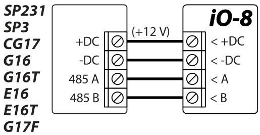
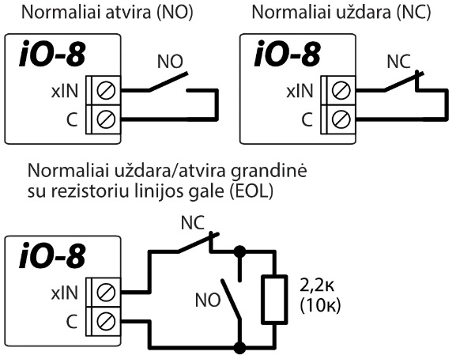
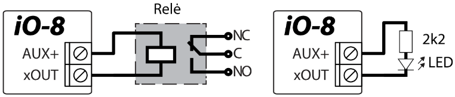
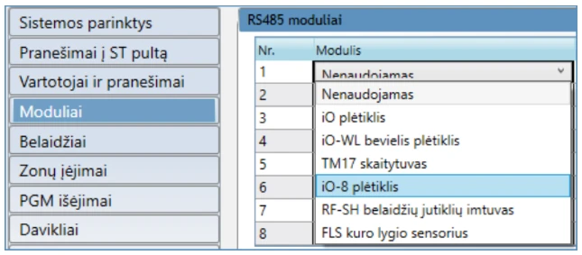
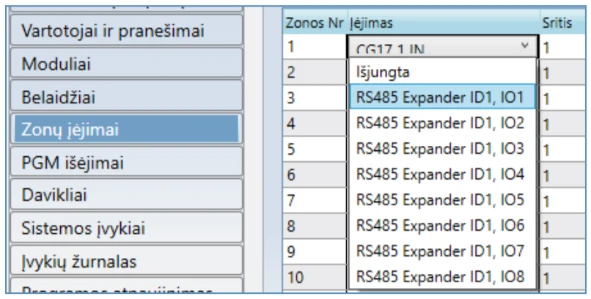

# iO-8 Įėjimų ir išėjimų plėtiklis

  

Su plėtikliu iO-8 jus galite padidinti įėjimų ir išėjimu skaičių suderinamuose **TRIKDIS** įrenginiuose.

iO-8 turi 8 įėjimo/išėjimo gnybtus, kuriuos galima nustatyti kaip įėjimo arba išėjimo gnybtus.

Apsilankykite iO-8 tinklalapyje trikdis.com, kur rasite prietaiso specifikaciją ir naujausią suderintų **TRIKDIS** įrenginių sąrašą.

Suderinamas su [SP3](../../control-panels/sp3/index.md), [CG17](../../control-panels/cg17/index.md), [GT+](../../alarm-communicators/cellular/gt-plus/index.md), [GT](../../alarm-communicators/cellular/gt/index.md), [G16](../../alarm-communicators/cellular/g16/index.md), [G16T](../../alarm-communicators/cellular/g16t/index.md), [G17F](../../alarm-communicators/fire-panels/g17f/index.md), [E16](../../alarm-communicators/e16/index.md), [E16T](../../alarm-communicators/e16t/index.md), [GATOR Cellular](../../gate-controllers/gator/index.md) ir [GATOR WiFi](../../gate-controllers/gator-wifi/index.md).

**Atlikite sekančius žingsnius su iO-8, kad jį parengti darbui:**

1.  Prijunkite iO-8 prie suderinamo **TRIKDIS** įrenginio, kaip parodyta:

2.  Sujunkite įėjimus, kaip parodyta:

Įėjimų jungimo schemas ir rezistorių dydžius nustato pagrindinis įrenginys, prie kurio prijungtas iO-8 modulis.

3.  Sujunkite išėjimus, kaip parodyta:

4.  Prijunkite USB kabelį prie pagrindinio **TRIKDIS** įrenginio ir atidarykite programą TrikdisConfig. Paspauskite **Skaityti [F4]**.

5.  Eikite į **Modulių** langą ir spustelėkite laisvą eilutę **RS485 modulių** srityje. Išskleidžiamajame sąraše pasirinkite **iO-8 plėtiklis**, kaip parodyta:

6.  Laukelyje dešinėje įveskite iO-8 serijos numerį (tik skaičius). Šį numerį rasite ant iO-8 lipduko.

7.  Išplečiamojo meniu languose **Zonų įėjimai** ir **PGM išėjimai** dabar matysite iO-8 įėjimus ir išėjimus, kuriuos galite įjungti:

    

Sąranka gali skirtis priklausomai nuo pagrindinio **TRIKDIS** prietaiso. Konfigūruokite **Zonų** ir **PGM išėjimų** nustatymus pagal pagrindinio įrenginio instrukciją.

8.  Nustatykite norimus nustatymus ir pabaigę paspauskite **Įrašyti [F5]** ir atjunkite USB kabelį.

9.  Suveikdinkite įėjimus ir įjunkite išėjimus, kad išbandytumėte įrenginį.
