# iO-LORA Belaidis plėtiklis

  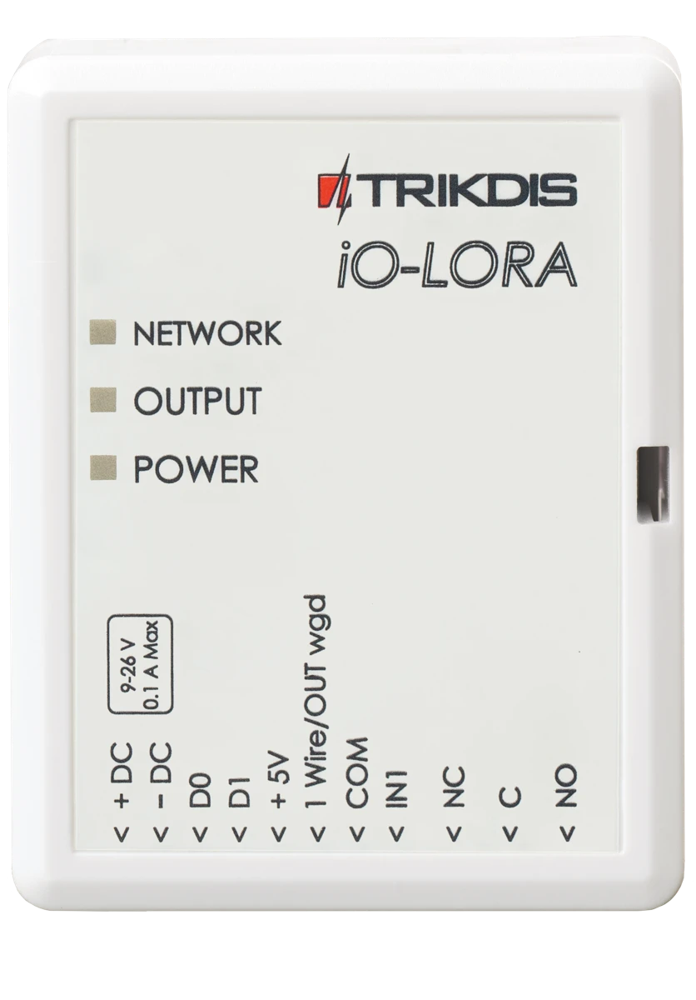

## Aprašymas 

iO-LORA belaidžiai plėtikliai su RF-LORA moduliu padidina apsaugos centralės "FLEXi" SP3 įėjimų ir išėjimų skaičių naudojant dvipusį belaidį RF ryšį.

Suderinamas su [SP3](../../control-panels/sp3/index.md) apsaugos centralize, [GATOR Cellular](../../gate-controllers/gator/index.md) ir [GATOR WiFi](../../gate-controllers/gator-wifi/index.md) vartų ir durų prieigos valdikliais.
Prie iO-LORA plėtiklio galima prijungti vieną temperatūros jutiklį ir kontaktinių ("iButton") raktų skaitytuvus. Su plėtiklio reliniu PGM išėjimu nuotoliniu būdu galima valdyti (įjungti/išjungti) įvairius elektrinius prietaisus. iO-LORA turi viena skaitmeninį įėjimą.

**Savybės**

Ryšys:

- Belaidžio ryšio veikimo atstumas tiesioginio matomumo zonoje iki 5000 m.

- Prie apsaugos centralės "*FLEXi*" *SP3* galima prijungti iki 8vnt. belaidžių plėtiklių *iO-LORA*.

- Gaminiai nuo HW iO-LO_x30x_7_230418 versijos komplektuojami su standartine antena, tinkančia daugumoje atvejų. <u>Tais atvejais kai reikia užtikrinti kokybišką ryšį kuo didesniu atstumu, reikia naudoti anteną (AX-ANT-KIT – 433 MHz, AX-ANT01S_SF – 868 MHz) su didesniu radijo signalo stiprinimu</u>.

Įėjimai ir išėjimai:

- Vieno laido duomenų magistralė ("1-Wire") skirta prijungti temperatūros jutiklį (1 vnt.) ir kontaktinių ("iButton") raktų skaitytuvui.
- 1 įėjimas, nustatomas tipas: NC, NO.

- 1 relinis išėjimas.

Prijungimas:
- Belaidis plėtiklis iO-LORA prie apsaugos centralės "FLEXi" SP3 prijungiamas per transiverį RF-LORA.

### Techniniai parametrai 

| Parametras | Aprašymas |
|----|----|
| Perdavimo dažnis | 4F modifikacija: 433,3 - 434,7 MHz /​ 8F modifikacija: 867 - 869 MHz |
| Moduliacijos tipas | LORA |
| Maitinimo įtampa | 9-26 V DC |
| Naudojama srovė | Iki 50 mA (budėjimo režime) /​ Iki 100 mA (duomenų siuntimo metu) |
| Pranešimo šifravimas | Taip |
| Veikimo atstumas atviroje erdvėje | Iki 5000 m |
| Įėjimas | 1 vnt., nustatomas tipas: NC, NO |
| Relinis išėjimas | 1 vnt., 250 V AC, 4 A |
| Temperatūros jutiklis | 1vnt., Maxim®/​Dallas® DS18S20, DS18B20 |
| Darbo aplinkos sąlygos | Temperatūra nuo -10 °C iki +50 °C, santykinė drėgmė – iki 80%, prie +20 °C. |
| Matmenys | 62 x 77 x 25 mm |
| Svoris | 80 g |

### Plėtiklio elementai 

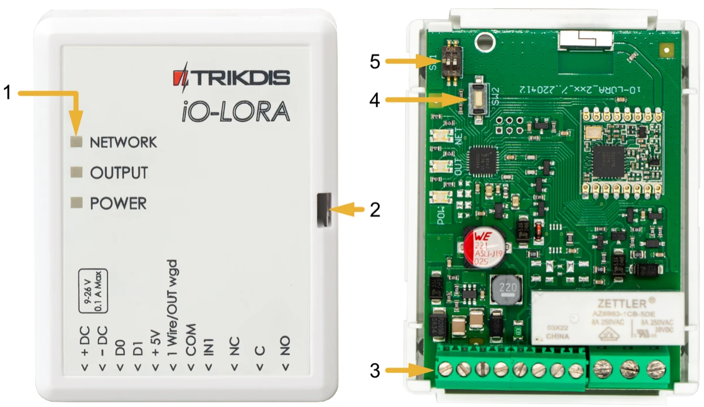

### Išorinių kontaktų paskirtis

| Gnybtas | Aprašymas |
|----|----|
| +DC | Maitinimo gnybtas (9-26 V nuolatinės srovės teigiamas gnybtas) |
| -DC | Maitinimo gnybtas (9-26 V nuolatinės srovės neigiamas gnybtas) |
| D0 | Nenaudojamas |
| D1 | Nenaudojamas |
| +5V | "**1-Wire**" įrenginių teigiamas 5 V maitinimo gnybtas |
| 1Wire /​ OUT wgd | "**1-Wire**" duomenų magistralės gnybtas („**OUT wgd**“ - nenaudojamas) |
| COM | Bendras neigiamas gnybtas |
| IN1 | 1 įėjimo gnybtas, pasirenkamo tipo NO, NC (gamyklinis nustatymas NO) |
| NC | Relės gnybtas NC |
| C | Relės gnybtas C |
| NO | Relės gnybtas NO |

### Šviesinė veikimo indikacija 

| Indikatorius | Būklė | Aprašymas |
|--------------|-------|-----------|
| NETWORK | Nešviečia | Nėra RF signalo. |
| NETWORK | Mirksi žaliai | RF signalo stiprumas nuo 0 – 10. Pakankamas 4. |
| OUTPUT/KEY | Šviečia žaliai | Aktyvuotas relinis išėjimas. |
| OUTPUT/KEY | Šviečia geltonai | Aktyvuotas Dallas raktas. |
| POWER | Nešviečia | Nėra maitinimo. |
| POWER | Mirksi žaliai | Maitinimo įtampa yra normali. |
| POWER | Mirksi geltona | Maitinimo įtampa yra žema (≤11.5 V). |

## Įrengimas, sujungimų schemos 

### Tvirtinimas 

1.  Nuimkite viršutinį dangtelį.

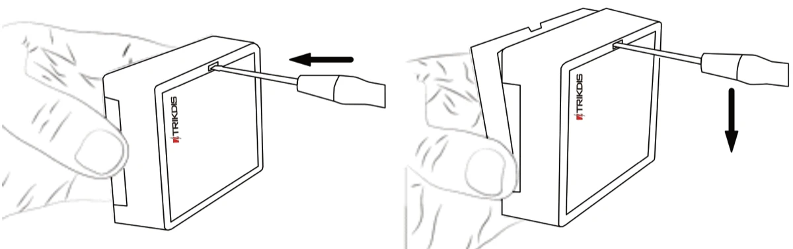

2.  Išimkite plokštę iš korpuso pagrindo.

3.  Korpuso pagrindą savisriegiais pritvirtinkite pageidaujamoje vietoje.

4.  Įstatykite plokštę į korpuso pagrindą.

5.  Uždarykite viršutinį dangtį.

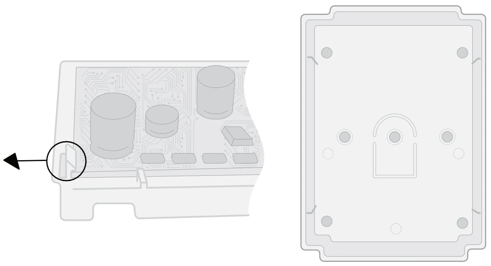

### Maitinimo šaltinio prijungimo schema 

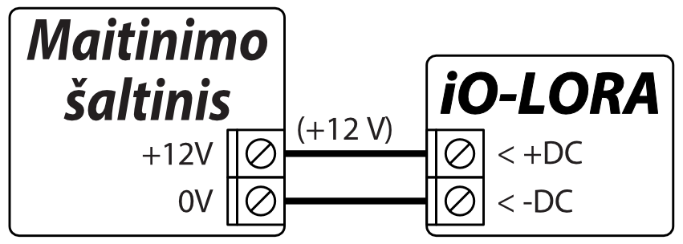

### Įėjimo prijungimo schemos 

iO-LORA turi 1 įėjimo gnybtą. Prie įėjimo gnybto galima prijungti NC, NO tipo grandines.

  <figure style="margin: 0;">
    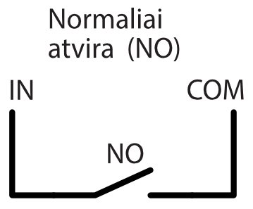
  </figure>
  <figure style="margin: 0;">
    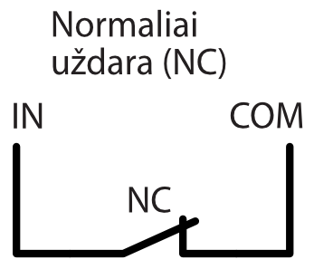
  </figure>

### Temperatūros jutiklio prijungimo schema 

Temperatūros jutikliai jungiami pagal pateiktą schemą. Prie *iO- LORA* plėtiklio galima prijungti Maxim®/Dallas® DS18S20, DS18B20 temperatūros jutiklius (1 vnt.). / Jungiant temperatūros jutiklį laidu, ilgesniu nei 0,5 m, rekomenduojame naudoti vytos poros kabelį (UTP4x2x0,5 arba STP4x2x0,5). / Plokštės gnybtas „+5V“ skirtas prie "1-Wire" magistralės prijungtiems įrenginiams maitinti 5 V nuolatine įtampa.

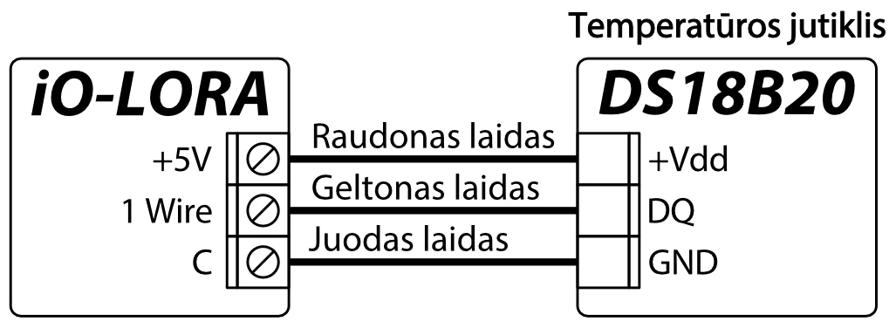

Leistina išėjimo srovė iki 0,2 A. Išėjimas apsaugotas nuo perkrovos. Viršijus leistiną srovę, maitinimas automatiškai atjungiamas. Centralė "FLEXi" SP3 prijungtus įrenginius automatiškai atpažįsta ir registruoja.

### CZ-Dallas skaitytuvo prijungimo schema 

**CZ-Dallas iButton** raktų skaitytuvas prie iO-LORA jungiamas prie "**1 Wire**" magistralės. Magistralės laidų ilgis gali būti iki 30 m.

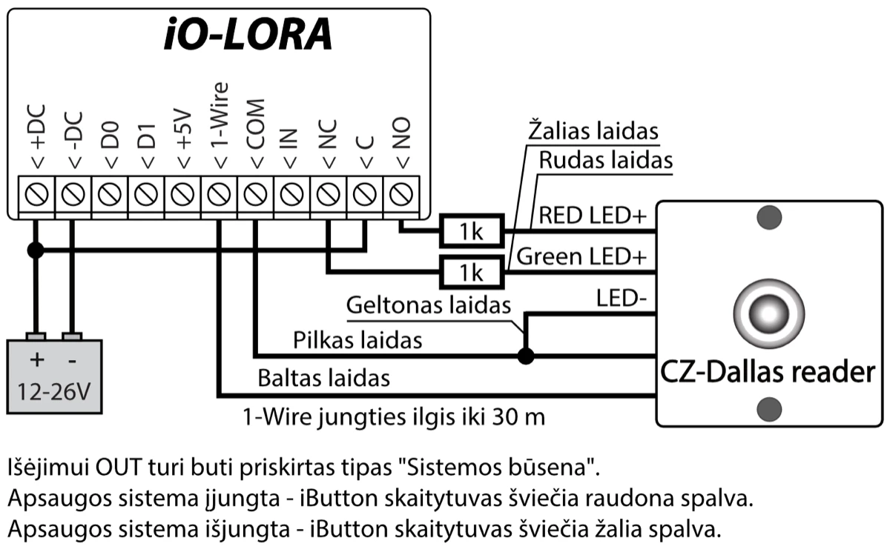

### iO-LORA plėtimo modulių prijungimo schema 

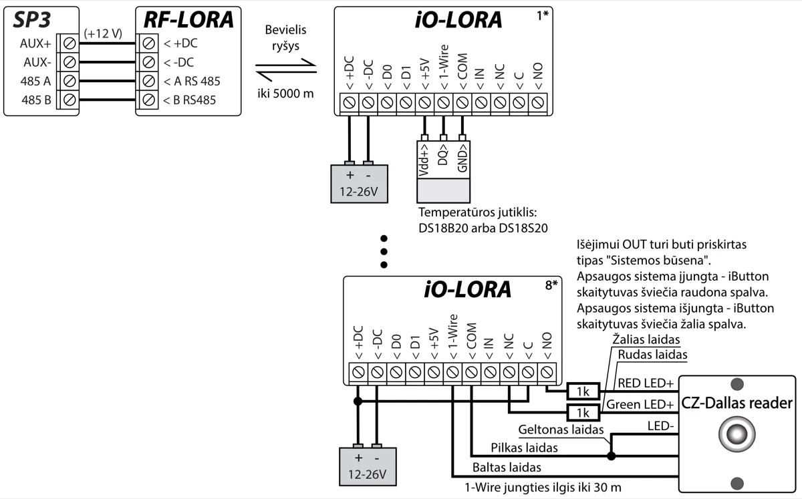

!!! note
    Prie apsaugos centralės "FLEXi" SP3 turi būti prijungtas
    transiveris RF-LORA ir gali būti prijungti iki 8 vnt.
    iO- LORA bevielių plėtiklių. / Jungiant temperatūros jutiklį
    laidu, ilgesniu nei 0,5 m, rekomenduojama naudoti vytos poros kabelį
    (UTP4x2x0,5 arba STP4x2x0,5). / iButton raktų skaitytuvai ir
    temperatūros jutiklis jungiami prie "**1-Wire**" gnybto.
## Apsaugos centralė “FLEXi” SP3

1.  Prie apsaugos centralės "FLEXi" SP3 turi būti prijungtas transiveris RF-LORA.

2.  Įjunkite centralės "FLEXi" SP3 maitinimą***.***

3.  Įjunkite maitinimą belaidžiui plėtikiui iO-LORA.

4.  Paleiskite ***TrikdisConfig**.*

5.  Prijunkite "FLEXi" SP3 per USB Mini-B kabelį prie kompiuterio arba nuotoliniu būdu.

6.  Spustelkite programos TrikdisConfig mygtuką **Skaityti [F4]**, kad ji pateiktų esamas "FLEXi" SP3 veikimo parametrų reikšmes. Jei programa pareikalaus, iššokusiame langelyje įveskite administratoriaus arba montuotojo kodą.

7.  "**Modulių**" sąraše išsirinkite "**iO-LORA plėtiklis**"**.**

8.  Lauke "**Serijos Nr.**" įrašykite iO-LORA serijos numerį.

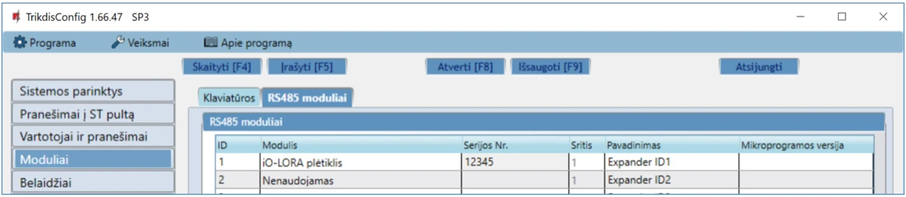

9.  "**Zonų įėjimo**" sąraše atlikite nustatymus plėtiklio zonai**.**

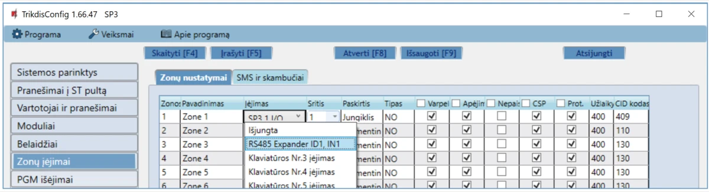

10. "**PGM išėjimų**" sąraše atlikite nustatymus plėtiklio PGM išėjimui**.**

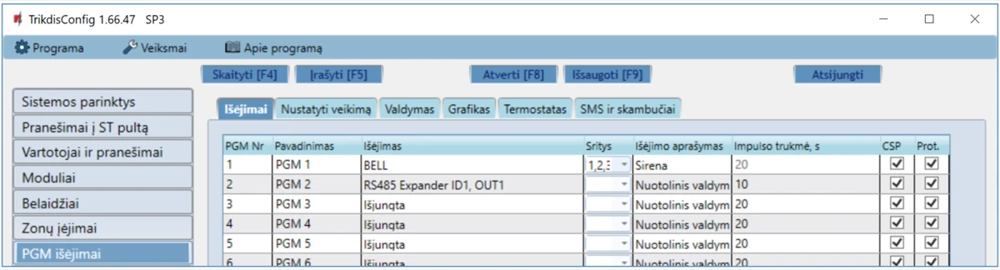

11. "**Jutikliai**" sąraše bus įtrauktas temperatūros jutiklis, jei plėtiklyje iO-LORA yra prijungtas temperatūros jutiklis.

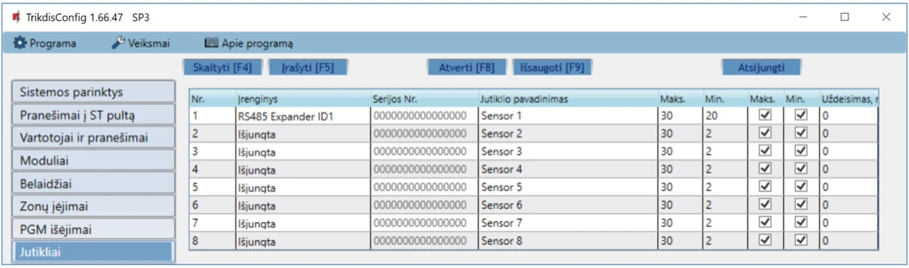

12. Atlikus pakeitimus nuspauskite **Įrašyti [F5]**.

13. Palaukite, kol bus atlikti atnaujinimai.

14. Nuspauskite "**Atsijungti**" ir atjunkite USB kabelį.

## Saugos reikalavimai 

Apsaugos signalizacijos sistemos modulius turi įrengti ir prižiūrėti kvalifikuoti specialistai.

Prieš instaliavimą prašome atidžiai perskaityti šį vadovą, kad išvengtumėte klaidų, dėl kurių galimi įrangos darbo sutrikimai ar net rimti gedimai.

Prieš jungdami bet kokius elektros kontaktus atjunkite elektros tiekimą.

Dėl bet kokių pakeitimų, modernizavimo ar remonto, kurie atlikti be gamintojo sutikimo, bus nutraukiamas teisės į garantiją galiojimas.

Įrenginys pasibaigus eksploatacijai turi būti utilizuojamas pagal vietinius galiojančius teisės aktus ir jo bei jį sudarančių komponentų negalima išmesti kaip buitinių atliekų.
