# iO8-LoRa Belaidis plėtiklis

  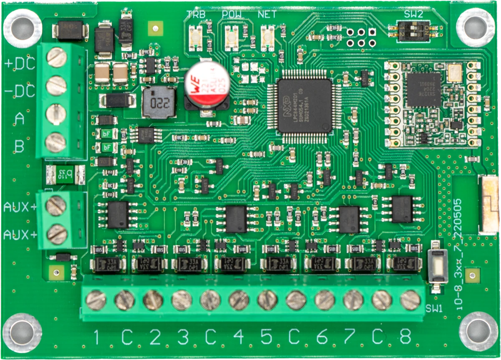

## Aprašymas 

iO-8-LORA belaidžiai plėtikliai su RF-LORA moduliu padidina apsaugos centralės "FLEXi" SP3 įėjimų ir išėjimų skaičių naudojant dvipusį belaidį RF ryšį.

Suderinamas su [SP3](../../control-panels/sp3/index.md) apsaugos centralize ir [GATOR Cellular](../../gate-controllers/gator/index.md) vartų ir durų prieigos valdikliu.
iO-8-LORA belaidis plėtiklis turi 8 universalius I/O kontaktus. Kiekvieną I/O kontaktą galima nustatyti veikti kaip įėjimą (IN) arba išėjimą (OUT).

**Savybės**

Ryšys:

- Belaidžio ryšio veikimo atstumas tiesioginio matomumo zonoje iki 5000 m.

- Prie apsaugos centralės "*FLEXi*" *SP3* galima prijungti iki 8vnt. belaidžių plėtiklių *iO-8-LORA*.

- Gaminiai nuo HW iO8_x5xx_7_230419 versijos komplektuojami su standartine antena, tinkančia daugumoje atvejų. <u>Tais atvejais kai reikia užtikrinti kokybišką ryšį kuo didesniu atstumu, reikia naudoti anteną (AX-ANT-KIT – 433 MHz, AX-ANT01S_SF – 868 MHz) su didesniu radijo signalo stiprinimu</u>.

Įėjimai ir išėjimai:
- 8 I/O kontaktai, iš kurių kiekvieną galima nustatyti kaip įėjimo (IN) arba išėjimo (OUT) kontaktą. Įėjimo (IN) tipai: ATZ, EOL, NC, NO. EOL ir ATZ grandinėse galima naudoti skirtingų nominalų rezistorius.

**Prijungimas:**

- Belaidis plėtiklis iO-8-LORA prie apsaugos centralės "FLEXi" SP3 prijungiamas per transiverį RF-LORA.

### Techniniai parametrai 

| Parametras | Aprašymas |
|----|----|
| Perdavimo dažnis | 4F modifikacija: 433,3 – 434,7 MHz /​ 8F modifikacija: 867 - 869 MHz |
| Moduliacijos tipas | LORA |
| Maitinimo įtampa | 10-26 V DC |
| Naudojama srovė | Iki 50 mA (budėjimo režime) /​ Iki 120 mA (duomenų siuntimo metu) |
| Pranešimo šifravimas | Taip |
| Veikimo atstumas atviroje erdvėje | Iki 5000 m |
| Dvigubos paskirties kontaktai [I/​O] | 8\. Konfigūruojant nustatoma IN arba OUT funkcija. Kai nustatyta IN, galima priskirti tipą: NC, NO, EOL, EOL_T, 3EOL, ATZ, ATZ_T. Kai nustatyta OUT, kontaktas tampa atvirojo kolektoriaus (OC) tipo išvadų, komutuojančiu iki 100 mA srovę |
| Darbo aplinkos sąlygos | Temperatūra nuo -10 °C iki +50 °C, santykinė drėgmė – iki 80%, prie +20 °C. |
| Matmenys | 65 x 90 x 12 mm |
| Svoris | 80 g |

### Plėtiklio elementai 

|  |
|--|
| Pastaba: |

### Išorinių kontaktų paskirtis

| Gnybtas | Aprašymas                                                       |
|---------|-----------------------------------------------------------------|
| +DC     | Maitinimo gnybtas (10-26 V nuolatinės srovės teigiamas gnybtas) |
| -DC     | Maitinimo gnybtas (10-26 V nuolatinės srovės neigiamas gnybtas) |
| A       | *RS485* magistralės A kontaktas                                 |
| B       | *RS485* magistralės B kontaktas                                 |
| 1- 8    | Įėjimo/​išėjimo gnybtai                                          |
| C       | Bendras neigiamas gnybtas                                       |

### Šviesinė veikimo indikacija 

| Indikatorius | Būklė | Aprašymas |
|--------------|-------|-----------|
| NETWORK / (Tinklas) | Nešviečia | Nėra RF signalo. |
| NETWORK / (Tinklas) | Mirksi žaliai | RF signalo stiprumas nuo 0 – 10. Pakankamas 3. |
| POWER / (Maitinimas) | Nešviečia | Nėra maitinimo. |
| POWER / (Maitinimas) | Mirksi žaliai | Maitinimo įtampa yra normali. |
| POWER / (Maitinimas) | Mirksi geltona | Maitinimo įtampa yra žema (≤11.5 V). |

## Įrengimas, sujungimų schemos 

### Maitinimo šaltinio prijungimo schema 

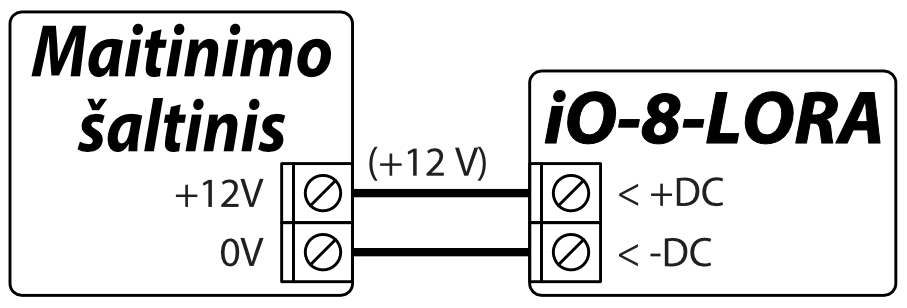

### Įėjimų prijungimo schemos 

iO-8-LORA plokštėje yra 8 kontaktai IO1–IO8 (įėjimai) jutiklių grandinėms prijungti. Bet kurį kontaktą galima nustatyti kaip įėjimą ir priskirti zonos atributus: grandinės tipą (NO, NC, EOL, EOL_T, 3EOL, ATZ, ATZ_T); jautrumą į trumpalaikius grandinės įvykius; zonos funkciją („Delay“, „Instant“, „Instant Stay“, „Interior“, „Interior Stay“, „Fire“, „Keyswitch“, „24_hour“, „Silent“, „Silent 24h“).

  <figure style="margin: 0;">
    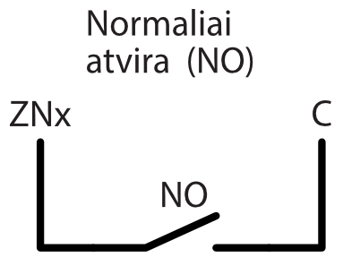
  </figure>
  <figure style="margin: 0;">
    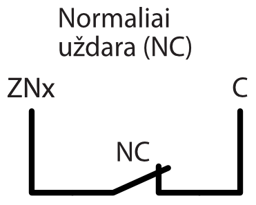
  </figure>
  <figure style="margin: 0;">
    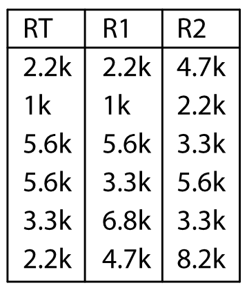
  </figure>

  <figure style="margin: 0;">
    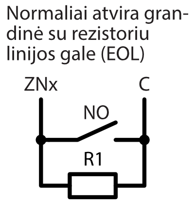
  </figure>
  <figure style="margin: 0;">
    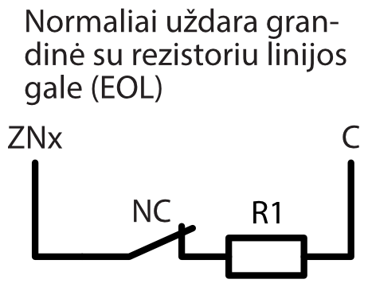
  </figure>
  <figure style="margin: 0;">
    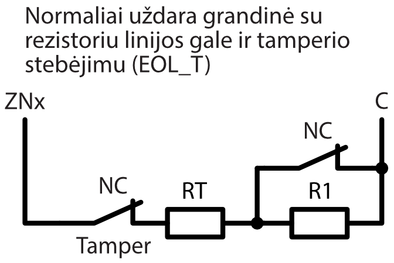
  </figure>

  <figure style="margin: 0;">
    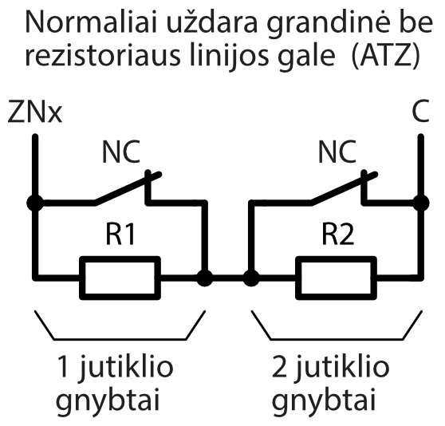
  </figure>
  <figure style="margin: 0;">
    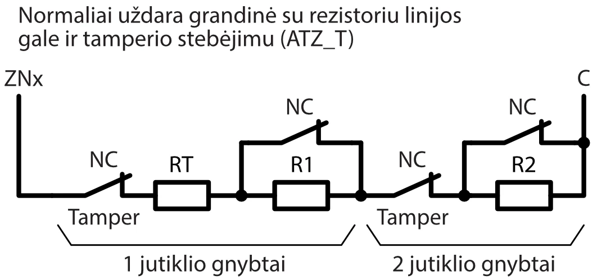
  </figure>

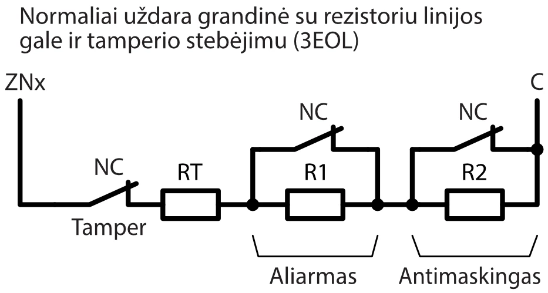

### Relės prijungimo schema 

Nuotoliniu būdu su relės kontaktais galima valdyti (įjungti/išjungti) įvairius elektrinius prietaisus. *iO-8-LORA* plėtiklio universaliam įėjimo/išėjimo (I/O) gnybtui turi būti nustatytas išėjimo (OUT) veikimo režimas ir priskirtas veikimo tipas "Nuotolinis valdymas".

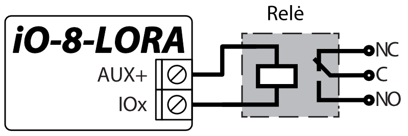

### iO-8-LORA plėtimo modulių prijungimo schema 

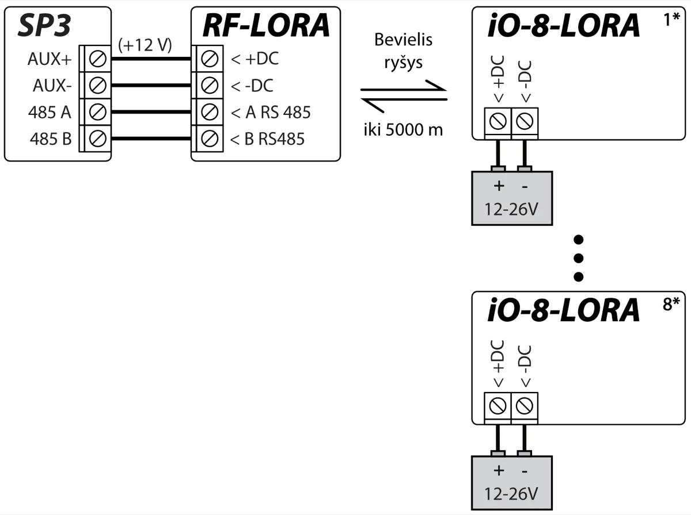

!!! note
    Prie apsaugos centralės "FLEXi" SP3 turi būti prijungtas
    transiveris RF-LORA ir gali būti prijungti iki 8 vnt.
    iO-8-LORA bevielių plėtiklių.
## Apsaugos centralė “FLEXi” SP3

1.  Prie apsaugos centralės "FLEXi" SP3 turi būti prijungtas transiveris RF-LORA.

2.  Įjunkite maitinimą centralėi "FLEXi" SP3.

3.  Įjunkite maitinimą belaidžiui plėtikiui iO-8-LORA.

4.  Paleiskite ***TrikdisConfig**.*

5.  Prijunkite "FLEXi" SP3 per USB Mini-B kabelį prie kompiuterio arba nuotoliniu būdu.

6.  Spustelkite programos TrikdisConfig mygtuką **Skaityti [F4]**, kad ji pateiktų esamas "FLEXi" SP3 veikimo parametrų reikšmes. Jei programa pareikalaus, iššokusiame langelyje įveskite administratoriaus arba montuotojo kodą.

7.  "**Modulių**" sąraše išsirinkite "**iO-8-LORA plėtiklis**"**.**

8.  Lauke "**Serijos Nr.**" įrašykite iO-8-LORA serijos numerį.

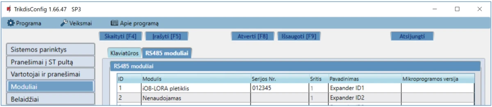

9.  "**Zonų įėjimo**" sąraše atlikite nustatymus plėtiklio zonoms**.**

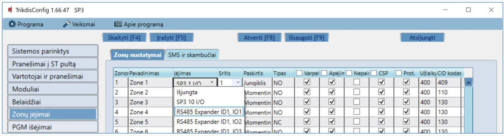

10. "**PGM išėjimų**" sąraše atlikite nustatymus plėtiklio PGM išėjimams**.**

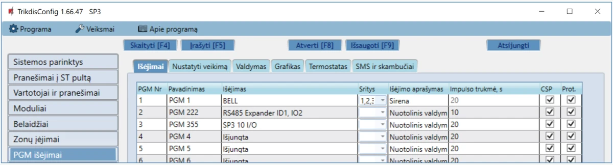

11. Atlikus pakeitimus nuspauskite **Įrašyti [F5]**.

12. Palaukite, kol bus atlikti atnaujinimai.

13. Nuspauskite "**Atsijungti**" ir atjunkite USB kabelį.

## Saugos reikalavimai

Apsaugos signalizacijos sistemos modulius turi įrengti ir prižiūrėti kvalifikuoti specialistai.

Prieš instaliavimą prašome atidžiai perskaityti šį vadovą, kad išvengtumėte klaidų, dėl kurių galimi įrangos darbo sutrikimai ar net rimti gedimai.

Prieš jungdami bet kokius elektros kontaktus atjunkite elektros tiekimą.

Dėl bet kokių pakeitimų, modernizavimo ar remonto, kurie atlikti be gamintojo sutikimo, bus nutraukiamas teisės į garantiją galiojimas.

Įrenginys pasibaigus eksploatacijai turi būti utilizuojamas pagal vietinius galiojančius teisės aktus ir jo bei jį sudarančių komponentų negalima išmesti kaip buitinių atliekų.
