# PB-LoRa Belaidis panikinis mygtukas

## Aprašymas

Gaminys PB-LORA skirtas perduoti pagalbos kvietimo pranešimą bevielių būdu. Pagalbos kvietimas inicijuojamas paspaudus mygtuką. Kaip pranešimo priėmimo įrenginys naudojamas RF-LORA modulis, kuris prijungtas prie apsaugos centralės “FLEXi” SP3.

Centralei galima priskirti 8 vnt. PB-LORA panikos mygtukų jei naudojama centralės veikimo programos versija 1.17 arba aukštesnė (pvz.: SP3_xxxx_0117.fw). Kai centralėje yra įrašyta 2 laidos veikimo programos versija 1.16 arba aukštesnė (pvz.: SP3_xxx2_0116.fw), tai centralei galima priskirti 250 vnt. PB-LORA panikos mygtukų.

**Savybės**

Ryšys:

- Belaidžio ryšio veikimo atstumas tiesioginio matomumo zonoje iki 5000 m.

Prijungimas:

- Belaidis panikos mygtukas *PB-LORA* prie apsaugos centralės “*FLEXi*”* SP3* prijungiamas per transiverį *RF-LORA*.

### Techniniai parametrai

| Parametras | Aprašymas |
|----|----|
| Perdavimo dažnis | 433,3-434,7 MHz |
| Moduliacijos tipas | LORA |
| Maitinimo įtampa | 3 V, baterija CR123A |
| Baterijos tarnavimo trukmė | Ne mažiau 3 metų |
| Naudojama srovė | Iki 0,008 mA (budėjimo režime) /​ Iki 50 mA (duomenų siuntimo metu) |
| Pranešimo šifravimas | Taip |
| Veikimo atstumas atviroje erdvėje | Iki 5000 m |
| Darbo aplinkos sąlygos | Temperatūra nuo -10 °C iki +50 °C, santykinė drėgmė – iki 80%, prie +20 °C |
| Matmenys | 62 x 77 x 25 mm |
| Svoris | 80 g |

### Panikos mygtuko elementai

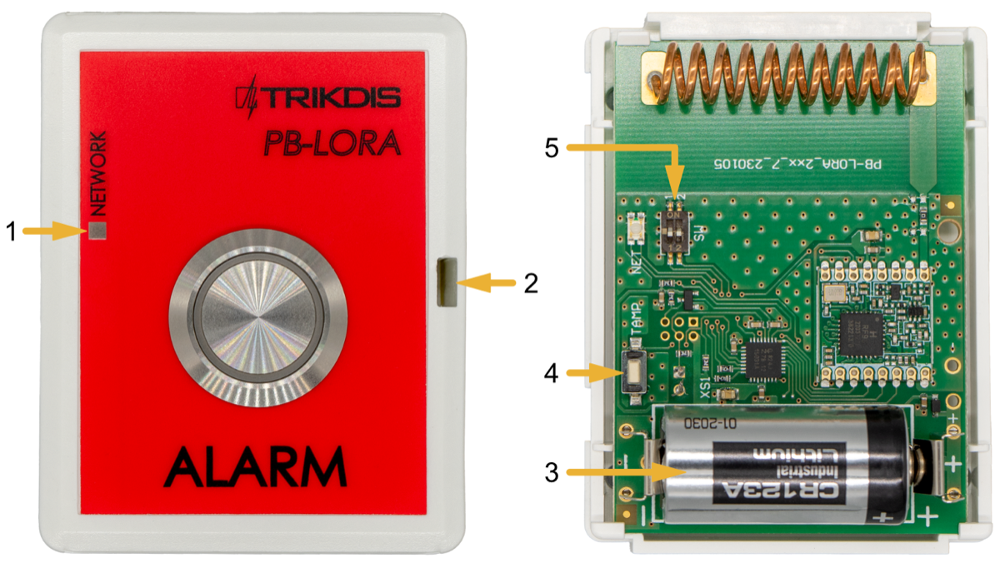

> **Pastaba:** elemento vieta nurodyta ant gaminio etiketės.

### Šviesinė veikimo indikacija

| Indikatorius | Veiksmas | Aprašymas |
|----|----|----|
| NETWORK | Po “Alarm” mygtuko paspaudimo | Pirmas mirktelėjimas žalias – pranešimo išsiuntimas, baterijos įtampa gera. |
| NETWORK | Pirmas mirktelėjimas raudonas – pranešimo išsiuntimas, baterijos įtampa žema. | Pirmas mirktelėjimas žalias – pranešimo išsiuntimas, baterijos įtampa gera. |
| NETWORK | Antras mirktelėjimas raudonas – gautas pranešimo priėmimo patvirtinimas iš modulio RF-LORA. |  |
| NETWORK | Po “TAMP” mygtuko paspaudimo |  |
| NETWORK | Pirmas mirktelėjimas raudonas – pranešimo išsiuntimas, baterijos įtampa žema. |  |
| NETWORK | Antras mirktelėjimas raudonas – gautas pranešimo priėmimo patvirtinimas iš modulio RF-LORA. |  |
| NETWORK | Trečias iki dvylikto mirktelėjimai – radijo signalo lygis. \* |  |

\* rekomenduojama naudoti kai yra ne mažiau keturių mirktelėjimų.

PASTABA: po baterijos įdėjimo rekomenduojama palaukti ne mažiau 10 sekundžių prieš pradedant įrenginio naudojimą.

## Įrengimas, sujungimų schemos

### Tvirtinimas

1.  Nuimkite viršutinį dangtelį.

2.  Išimkite plokštę iš korpuso pagrindo.

3.  Korpuso pagrindą savisriegiais pritvirtinkite pageidaujamoje vietoje.

4.  Įstatykite plokštę į korpuso pagrindą.

5.  Įstatykite baterija į modulį.

6.  Uždarykite viršutinį dangtį.

### Belaidžio PB-LORA panikos mygtuko prijungimo schema

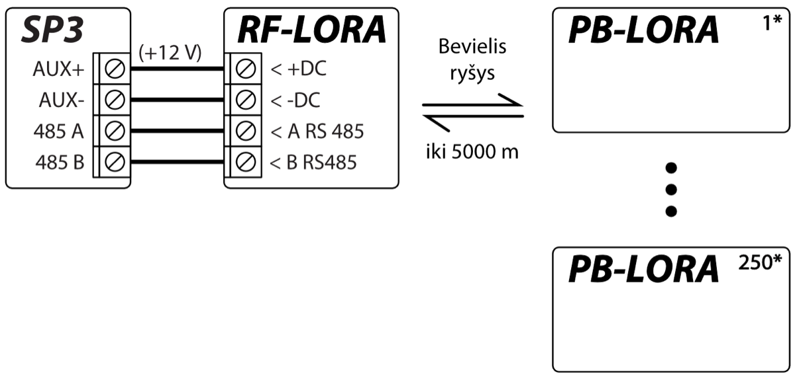

!!! note
    Prie apsaugos centralės “FLEXi” SP3 turi būti prijungtas transiveris RF-LORA ir gali būti prijungti iki 8 vnt. PB-LORA bevielių pavojaus mygtukų (centralės veikimo programos versija 1.17 arba aukštesnė. Pvz.: SP3_xxxx_0117.fw) arba iki 250 vnt. PB-LORA mygtukų (centralės 2 laidos veikimo programos versija 1.16 arba aukštesnė. Pvz.: SP3_xxx2_0116.fw).

## Apsaugos centralė “FLEXi” SP3

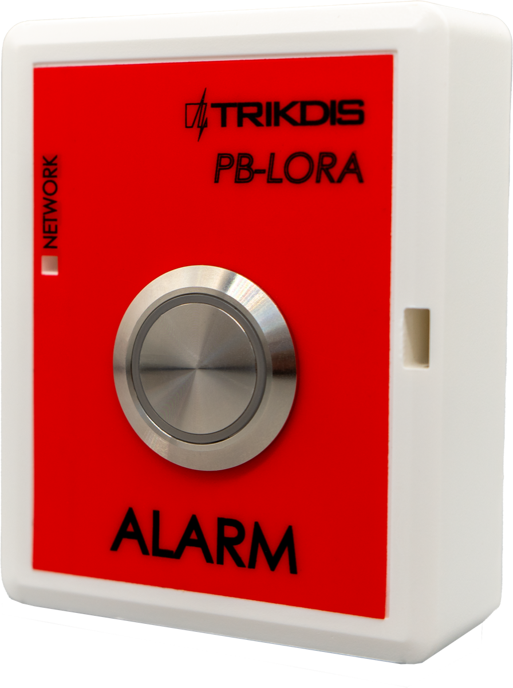

“*FLEXi*” *SP3* centralėje turi būti įrašyta veikimo programos versija 1.17 arba aukštesnė (pvz.: SP3_xxxx_0117.fw).

1.  Prie apsaugos centralės “FLEXi” SP3 turi būti prijungtas transiveris RF-LORA.

2.  Įjunkite maitinimą centralėi “FLEXi” SP3.

3.  Belaidžiame panikos mygtuke PB-LORA turi būti įstatyta baterija.

4.  Paleiskite ***TrikdisConfig**.*

5.  Prijunkite “FLEXi” SP3 per USB Mini-B kabelį prie kompiuterio arba nuotoliniu būdu.

6.  Spustelkite programos TrikdisConfig mygtuką **Skaityti \[F4\]**, kad ji pateiktų esamas “FLEXi” SP3 veikimo parametrų reikšmes. Jei programa pareikalaus, iššokusiame langelyje įveskite administratoriaus arba montuotojo kodą.

7.  “**Modulių**” sąraše išsirinkite “**PB-LORA panikos mygtukas**”**.**

8.  Lauke “**Serijos Nr.**” įrašykite PB-LORA serijos numerį.

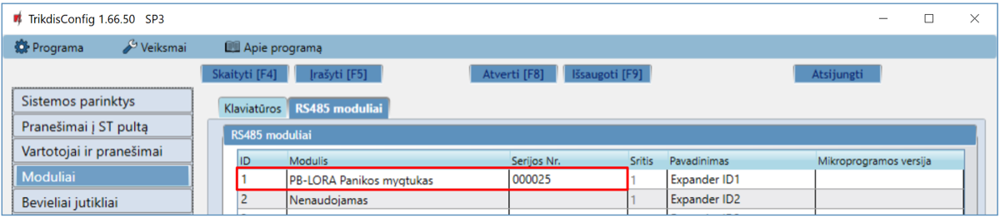

9.  “**Zonų įėjimo**” sąraše atlikite nustatymus panikos mygtukui**.**

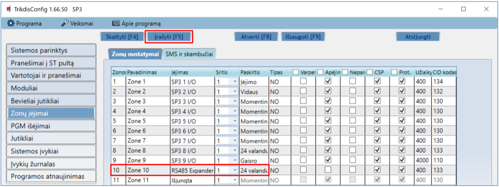

10. Atlikus pakeitimus nuspauskite **Įrašyti \[F5\]**.

11. Palaukite, kol bus atlikti atnaujinimai.

12. Ištraukite USB Mini-B kabelį.

13. Palaukite 1 minutę. Nuspauskite „**Alarm**“ mygtuką ant PB-LORA modulio.

14. Prijunkite USB Mini-B kabelį prie „FLEXi” SP3.

15. Nuspauskite **Skaityti \[F4\]**.

16. “**Modulių**” sąraše eilutėje “**PB-LORA panikos mygtukas**” bus nurodyta Mikroprogramos versija**.**

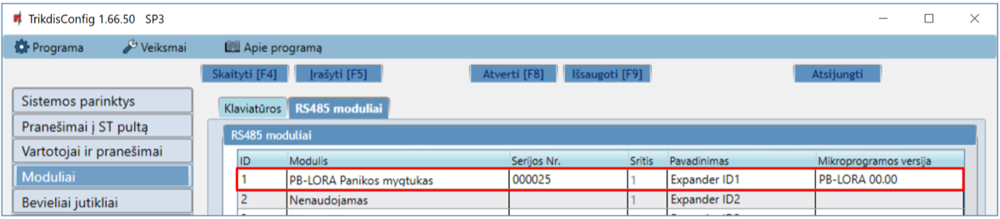

17. Nuspauskite “**Atsijungti**” ir atjunkite USB kabelį.

!!! note
    PB-LORA belaidžių panikos mygtukų ištrynimas iš „FLEXi” SP3 atminties:

    1.  Paleiskite ***TrikdisConfig**.*

    2.  Prijunkite „FLEXi" SP3 per USB Mini-B kabelį prie kompiuterio
        arba prisijunkite prie „FLEXi" SP3 nuotoliniu būdu.
        Nuspauskite mygtuką **Skaityti [F4]**.

    3.  Programoje TrikdisConfig, lango „**Moduliai"** lauke
        „**Modulis"**, kur buvo priregistruotas ***PB-LORA* panikos
        mygtukas**, nurodykite „**Nenaudojamas"** ir paspauskite
        **Įrašyti [F5]**. Belaidis jutiklis ištrintas iš „FLEXi" SP3
        atminties.

## belaidžių PB-LORA panikos mygtukų registravimas prie apsaugos centralės “FLEXi” SP3

“*FLEXi*” *SP3* centralėje turi būti įrašyta 2 laidos veikimo programos versija 1.16 arba aukštesnė (pvz.: SP3_xxx2_0116.fw).

1.  Prie apsaugos centralės “FLEXi” SP3 turi būti prijungtas transiveris RF-LORA.

2.  Įjunkite maitinimą centralėi “FLEXi” SP3.

3.  Belaidžiame panikos mygtuke PB-LORA turi būti įstatyta baterija.

4.  Paleiskite ***TrikdisConfig**.*

5.  Nuotoliniu būdu prisijunkite prie “FLEXi” SP3.

!!! note
    Nuotolinis konfigūravimas veiks tik tuomet, kai „FLEXi” SP3:

    1.  Sukonfigūruotas WiFi/LAN ryšio kanalas arba įstatyta aktyvuota SIM
        kortelė ir įvestas arba išjungtas PIN kodas.

    2.  SIM kortelėje įjungtas mobilus internetas.

    3.  Įjungta Protegus servisas paslauga.

    4.  Įjungtas maitinimas („**PWR**" LED mirksi žaliai).

    5.  Prisiregistravęs prie tinklo („**NET**" LED šviečia žaliai ir mirksi
        geltonai).

6.  TrikdisConfig lauke **„Nuotolinė prieiga“** įveskite centralės „FLEXi“ SP3 „**Unikalus ID“** numerį. Šį numerį rasite ant įrenginio pakuotės ir centralės plokštės.

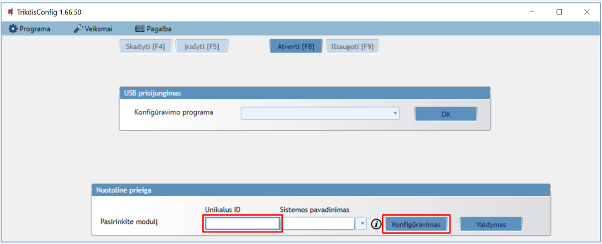

7.  Paspauskite **„Konfigūravimas“**.

8.  Atsidariusiame lange paspauskite **Skaityti \[F4\]**. Programai paprašius, įveskite administratoriaus arba instaliuotojo kodą.

9.  “**Modulių**” sąraše išsirinkite “**RF-LORA imtuvas**”**.**

10. Lauke “**Serijos Nr.**” įrašykite RF-LORA serijos numerį.

11. Nuspauskite **Įrašyti \[F5\]**.

12. Palaukite, kol bus atlikti atnaujinimai.

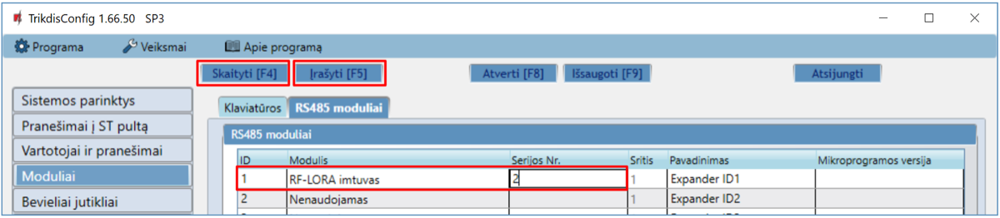

13. Palaukite 1 minutę.

14. Nuspauskite **Skaityti \[F4\]**.

15. “**Modulių**” sąraše eilutėje “**PB-LORA imtuvas**” bus nurodyta Mikroprogramos versija**.**

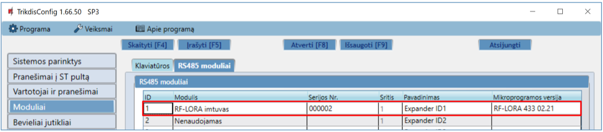

16. Pereikite į langą **„Bevieliai jutikliai“**.

17. Paspauskite **„Jutiklių primokymas“**.

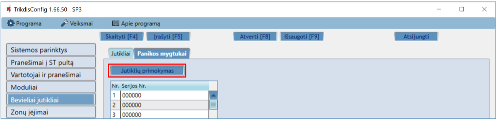

Belaidžių panikos mygtukų registravimą galima atlikti visiems iš karto.

Registruojant *PB-LORA* panikos mygtukus *RF-LORA* modulis turi būti ne arčiau 1 m atstumu nuo mygtukų.

18. Modulyje RF-LORA pradės mirksėti raudonai/žaliai LED indikatorius **„DATA/TROUBLE“**.

19. RF-LORA modulis yra perėjas į primokymo režimą. TrikdisConfig atvers programos primokymo langą.

20. PB-LORA plokštėje trumpam nuspauskite mygtuką „**TAMP**“.

21. Modulyje RF-LORA kelioms sekundėms žaliai užsidegs indikatorius **„DATA/TROUBLE“**. Po to modulyje RF-LORA pradės mirksėti raudonai/žaliai LED indikatorius **„DATA/TROUBLE“**.

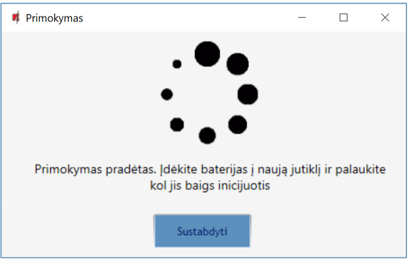

22. Po kelių sekundžių pavojaus mygtukas PB-LORA bus įtrauktas į jutiklių sąrašą.

23. **„UID“** numeris turi sutapti su PB -LORA serijos numeriu, kuris yra užrašytas ant korpuso lipduko.

24. Jei reikia primokyti sekanti pavojaus mygtuką, tai reikia trumpam nuspausti „**TAMP**“ mygtuką ant plokštės.

25. Jei jutiklių primokimas baigtas nuspauskite **„Sustabdyti“**.

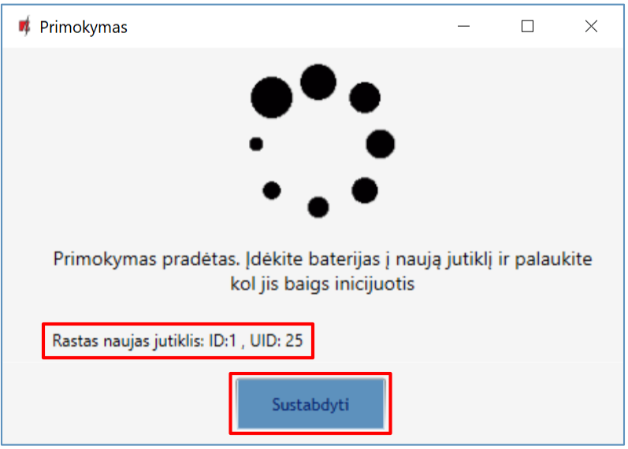

26. Atsivėrusiame lange paspauskite **„Yes“**. Priregistruoti PB-LORA belaidžiai pavojaus mygtukai bus įrašyti į centralės „FLEXi“ SP3 atminti.

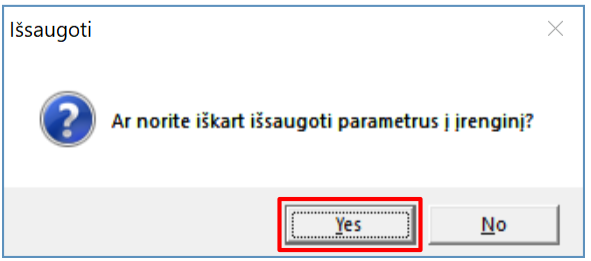

Palaukite kelias minutes. Nuspauskite mygtuką **Skaityti \[F4\]**.

Programoje TrikdisConfig lange **„Bevieliai jutikliai“** bus sąrašas priregistruotų PB-LORA belaidžių pavojaus mygtukų. Lauke **„Serijos Nr.“** bus surašyti 6-ženkliai pavojaus mygtukų serijiniai numeriai, kurie turi sutapti su PB-LORA serijiniais numeriais užrašytais ant korpuso nugaros.

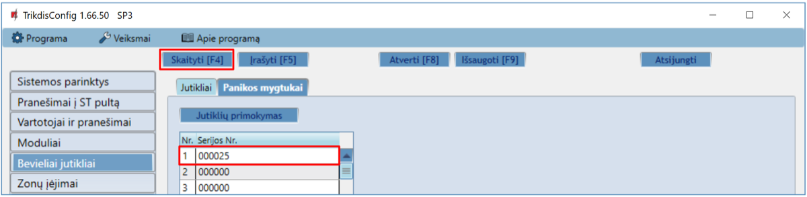

!!! note
    PB-LORA belaidžių panikos mygtukų ištrynimas iš „FLEXi” SP3 atminties:

    1.  Paleiskite ***TrikdisConfig**.*

    2.  Prijunkite „FLEXi" SP3 per USB Mini-B kabelį prie kompiuterio
        arba prisijunkite prie „FLEXi" SP3 nuotoliniu būdu.
        Nuspauskite mygtuką **Skaityti [F4]**.

    3.  Programoje TrikdisConfig, lange „**Bevieliai jutikliai"**
        lauke „**Serijos Nr."** įrašykite „**0**" ir paspauskite
        **Įrašyti [F5]**. PB-LORA belaidis pavojaus mygtukas
        ištrintas iš „FLEXi" SP3 atminties.

## Saugos reikalavimai

Apsaugos signalizacijos sistemos modulius turi įrengti ir prižiūrėti kvalifikuoti specialistai.

Prieš instaliavimą prašome atidžiai perskaityti šį vadovą, kad išvengtumėte klaidų, dėl kurių galimi įrangos darbo sutrikimai ar net rimti gedimai.

Prieš jungdami bet kokius elektros kontaktus atjunkite elektros tiekimą.

Dėl bet kokių pakeitimų, modernizavimo ar remonto, kurie atlikti be gamintojo sutikimo, bus nutraukiamas teisės į garantiją galiojimas.

Įrenginys pasibaigus eksploatacijai turi būti utilizuojamas pagal vietinius galiojančius teisės aktus ir jo bei jį sudarančių komponentų negalima išmesti kaip buitinių atliekų.
