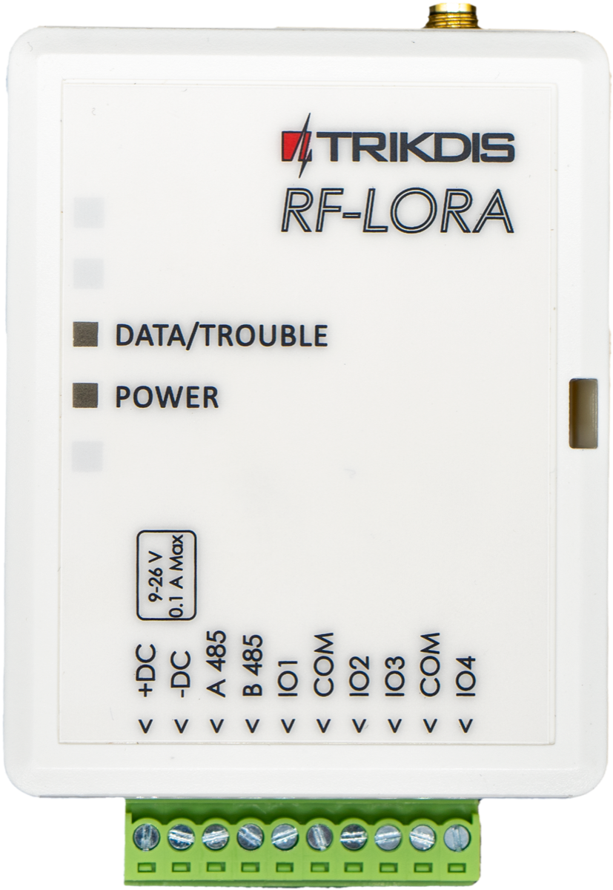
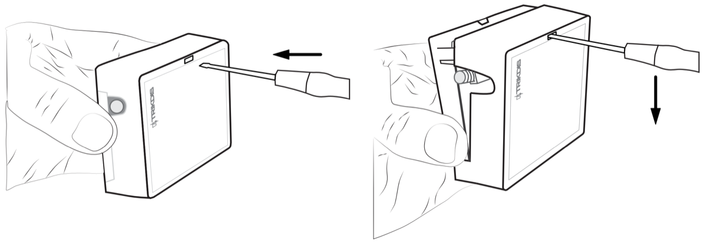
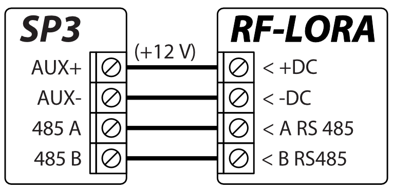
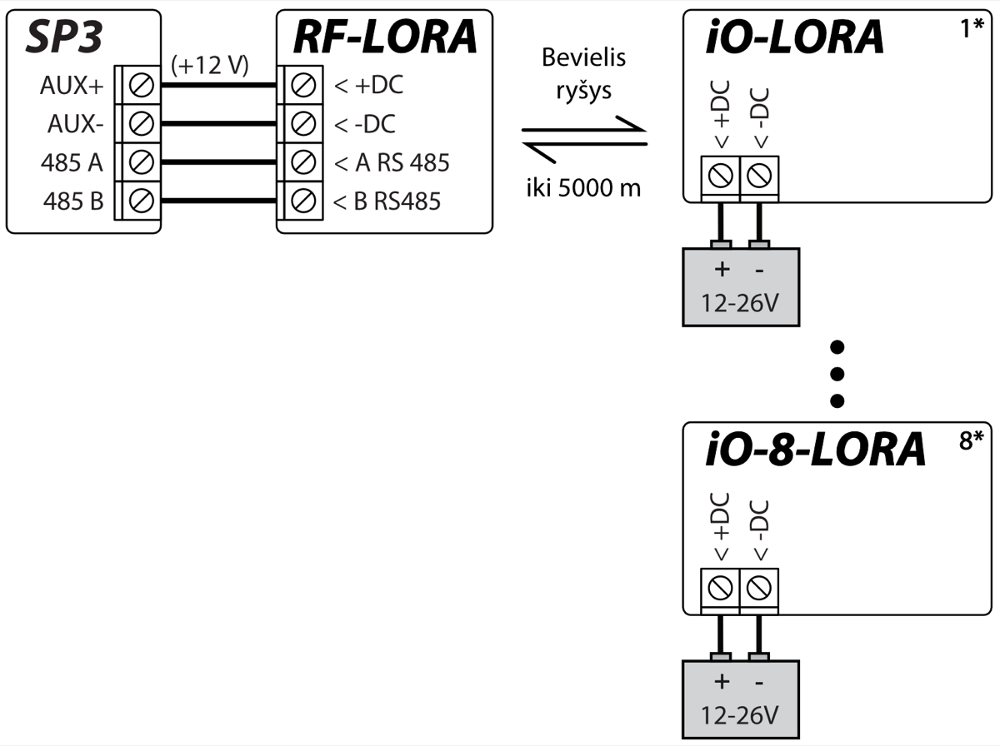
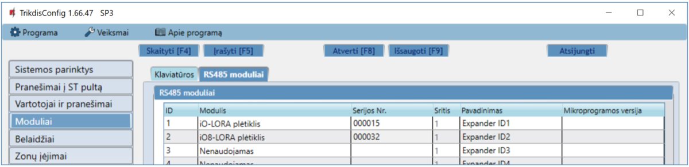
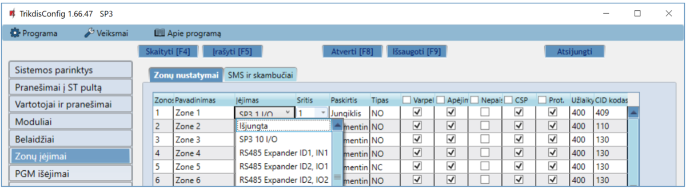
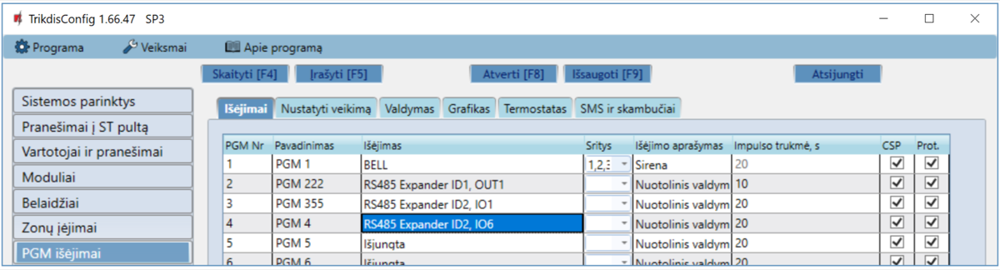

# RF-LoRa Belaidis Plėtiklis

## Aprašymas

Transiveris RF-LORA su belaidžiais plėtikliais iO-LORA ir iO-8-LORA padidina apsaugos centralės "FLEXi" SP3 įėjimų ir išėjimų skaičių naudojant dvipusį belaidį RF ryšį.

Prie apsaugos centralės "FLEXi" SP3 per transiverį RF-LORA galima prijungti iki 8 modulių LORA (iO-LORA, iO-8-LORA, PB-LORA).

**Savybės**

Ryšys:

- Belaidžio ryšio veikimo atstumas tiesioginio matomumo zonoje iki 5000 m.

- Prie apsaugos centralės "*FLEXi*" *SP3* galima prijungti vieną transiverį *RF-LORA*.

- Gaminys komplektuojamas su standartine antena, tinkančia daugumoje atvejų. <u>Tais atvejais kai reikia užtikrinti kokybišką ryšį kuo didesniu atstumu, reikia naudoti anteną (AX-ANT-KIT – 433 MHz, AX-ANT01S_SF – 868 MHz) su didesniu radijo signalo stiprinimu</u>.

Prijungimas:

- Transiveris *RF-LORA* prie apsaugos centralės "*FLEXi*"* SP3* prijungiamas per RS485 šyną.

### Techniniai parametrai 

| Parametras | Aprašymas |
|----|----|
| Perdavimo dažnis | 8F modifikacija: 867-869 MHz /​ 4F modifikacija: 433,3-434,7 MHz |
| Moduliacijos tipas | LORA |
| Maitinimo įtampa | 9-26 V DC |
| Naudojama srovė | Iki 50 mA (budėjimo režime) /​ Iki 150 mA (duomenų siuntimo metu) |
| Pranešimo šifravimas | Taip |
| Veikimo atstumas atviroje erdvėje | Iki 5000 m |
| Darbo aplinkos sąlygos | Temperatūra nuo -10 °C iki +50 °C, santykinė drėgmė – iki 80%, prie +20 °C. |
| Matmenys | 62 x 82 x 25 mm |
| Svoris | 80 g |

### Transiverio elementai

> **Pastaba:**

### Išorinių kontaktų paskirtis 

| Gnybtas | Aprašymas                                                      |
|---------|----------------------------------------------------------------|
| +DC     | Maitinimo gnybtas (9-26 V nuolatinės srovės teigiamas gnybtas) |
| -DC     | Maitinimo gnybtas (9-26 V nuolatinės srovės neigiamas gnybtas) |
| A 485   | *RS485* magistralės A kontaktas                                |
| B 485   | *RS485* magistralės B kontaktas                                |
| IO1-IO4 | Nenaudojamas                                                   |
| COM     | Nenaudojamas                                                   |

### Šviesinė veikimo indikacija 

| Indikatorius | Būklė | Aprašymas |
|--------------|-------|-----------|
| DATA/TROUBLE | Mirksi/dega raudonai | Ryšio sutrikimas su moduliu |
| DATA/TROUBLE | Mirksi žalia/raudona | Modulių LORA primokymo režimas |
| DATA/TROUBLE | Užsidegė žalia 3 sek. | Primokytas LORA modulis (primokymo režime) |
| POWER | Nešviečia | Nėra maitinimo. |
| POWER | Mirksi žaliai | Maitinimo įtampa yra normali. |
| POWER | Mirksi geltona | Maitinimo įtampa yra žema (≤11.5 V). |
| POWER | Šviečia geltonai | Nėra ryšio su centrale "FLEXi" SP3 per RS485 |

## Įrengimas, sujungimų schemos 

### Tvirtinimas 

1.  Nuimkite viršutinį dangtelį.

2.  Išimkite plokštę iš korpuso pagrindo.

3.  Korpuso pagrindą savisriegiais pritvirtinkite pageidaujamoje vietoje.

4.  Įstatykite plokštę į korpuso pagrindą.

5.  Uždarykite viršutinį dangtį.

### Transiverio RF-LORA prijungimas prie apsaugos centralės "FLEXi" SP3 

### LORA plėtimo modulių prijungimo schema 

## Konfigūracija naudojant TrikdisConfig

1.  Prie apsaugos centralės "FLEXi" SP3 turi būti prijungtas transiveris RF-LORA.

2.  Įjunkite maitinimą centralėi "FLEXi" SP3.

3.  Įjunkite maitinimą belaidžiams plėtikiams iO-LORA ir/arba iO-8-LORA.

4.  Paleiskite ***TrikdisConfig**.*

5.  Prijunkite "FLEXi" SP3 per USB Mini-B kabelį prie kompiuterio arba nuotoliniu būdu.

6.  Spustelkite programos TrikdisConfig mygtuką **Skaityti [F4]**, kad ji pateiktų esamas "FLEXi" SP3 veikimo parametrų reikšmes. Jei programa pareikalaus, iššokusiame langelyje įveskite administratoriaus arba montuotojo kodą.

7.  "**Modulių**" sąraše išsirinkite "**iO-LORA plėtiklis**" ("**iO-8-LORA plėtiklis**")**.**

8.  Lauke "**Serijos Nr.**" įrašykite gaminio serijos numerį.

9.  "**Zonų įėjimo**" sąraše atlikite nustatymus plėtiklio zonoms**.**

10. "**PGM išėjimų**" sąraše atlikite nustatymus plėtiklio PGM išėjimams**.**

11. "Atlikus pakeitimus nuspauskite **Įrašyti [F5]**.

12. Palaukite, kol bus atlikti atnaujinimai.

13. Nuspauskite "**Atsijungti**" ir atjunkite USB kabelį.

14. Suveikdinkite įėjimus ir įjunkite išėjimus, kad išbandytumėte įrenginį.

## Saugos reikalavimai

Apsaugos signalizacijos sistemos modulius turi įrengti ir prižiūrėti kvalifikuoti specialistai.

Prieš instaliavimą prašome atidžiai perskaityti šį vadovą, kad išvengtumėte klaidų, dėl kurių galimi įrangos darbo sutrikimai ar net rimti gedimai.

Prieš jungdami bet kokius elektros kontaktus atjunkite elektros tiekimą.

Dėl bet kokių pakeitimų, modernizavimo ar remonto, kurie atlikti be gamintojo sutikimo, bus nutraukiamas teisės į garantiją galiojimas.

Įrenginys pasibaigus eksploatacijai turi būti utilizuojamas pagal vietinius galiojančius teisės aktus ir jo bei jį sudarančių komponentų negalima išmesti kaip buitinių atliekų.
