# RF-S8 Belaidis transiveris

  

## Aprašymas 

Prijungus imtuvą RF-S8, apsaugos centralė „FLEXi” SP3 gali dirbti su „**S8**“ belaidžiais jutikliais, sirenomis, valdymo pulteliais.

**Savybės**

Ryšys:

- Belaidžio ryšio veikimo atstumas tiesioginio matomumo zonoje iki 500 m.

- Prie apsaugos centralės "*FLEXi*" *SP3* galima prijungti vieną imtuvą *RF- S8*.

- Gaminys komplektuojamas su standartine antena, tinkančia daugumoje atvejų.

Prijungimas:

- Imtuvas *RF-S8* prie apsaugos centralės "*FLEXi*"* SP3* prijungiamas per RS485 šyną.
### Techniniai parametrai 

| Parametras | Aprašymas |
|----|----|
| Maitinimo įtampa[DC] | nuolatinės srovės 9-26 V |
| Srovės naudojimas | Iki 50 mA (budint), /​ Iki 100 mA (trumpalaikis, siuntimo metu) |
| Radijo dažnis | 868 MHz |
| Radijo signalo galia | 25 mW |
| Ryšio atstumas | Iki 500 m |
| Darbo aplinkos sąlygos | Temperatūra nuo -10 °C iki +50 °C, santykinė drėgmė – iki 80%, prie +20 °C, be kondensacijos. |
| Matmenys | 92x62x25 mm |
| Svoris | 0,08 kg |

### Imtuvo elementai 

1.  RF antenos SMA jungtis.

2.  Šviesos indikatoriai.

3.  Dangtelio nuėmimo anga.

4.  Gnybtai laidų prijungimui.

5.  USB Mini-B jungtis skirta programinės įrangos atnaujinimui.

6.  Mygtukas belaidžių jutikių primokymo režimui įjungti/išjungti.

### Išorinių kontaktų paskirtis 

| Gnybtas | Aprašymas                                                      |
|---------|----------------------------------------------------------------|
| +DC     | Maitinimo gnybtas (9-26 V nuolatinės srovės teigiamas gnybtas) |
| -DC     | Maitinimo gnybtas (9-26 V nuolatinės srovės neigiamas gnybtas) |
| A 485   | *RS485* magistralės A kontaktas                                |
| B 485   | *RS485* magistralės B kontaktas                                |

### Šviesinė veikimo indikacija 

| LED indikatorius | Veikimas | Aprašymas |
|------------------|----------|-----------|
| NETWORK / (Tinklas) | Mirksi žalia/raudona | Daviklių primokymo režimas |
| NETWORK / (Tinklas) | Užsidegė žalia 5 sek. | Primokytas daviklis (primokymo režime) |
| POWER / (Maitinimas) | Nešviečia | Nėra maitinimo |
| POWER / (Maitinimas) | Mirksi žaliai | Maitinimo įtampa yra normali |
| POWER / (Maitinimas) | Mirksi geltona | Maitinimo įtampa yra žema (≤11.5 V) |
| POWER / (Maitinimas) | Šviečia geltonai | Nėra ryšio su centrale per RS485 |

## Apsaugos centralės programinės įrangos pakeitimas

Centralės „FLEXi” SP3 veikimo programą reikia pakeisti į 4 revizijos programą SP3_xxx4\_0122.fw (veikimo programos versija 1.22 arba aukštesnė), kad centralė galėtu dirbti su „**S8**“ belaidžiais jutikliais, sirenomis, valdymo pulteliais. Prie centralės reikia prijungti belaidžių jutiklių imtuvą RF-S8.

Programinės įrangos atnaujinimas:

1.  Imtuvą RF-S8 ir „FLEXi” SP3 sujunkite pagal schemą.

2.  Įjunkite maitinimą centralei „FLEXi“ SP3.

3.  Paleiskite ***TrikdisConfig**.*

4.  Prijunkite „FLEXi” SP3 per USB Mini-B kabelį prie kompiuterio.

5.  Parinkite gamyklinės programinės įrangos submeniu **„Programos atnaujinimas“**.

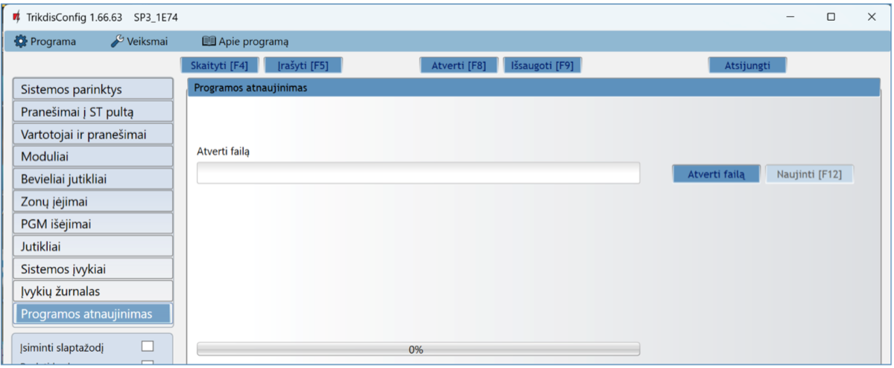

6.  Paspauskite gamyklinės programinės įrangos atidarymo langelį **„Atverti failą“** ir parinkite **SP3_xxx4\_0122.fw** programinės įrangos bylą.

7.  Paspauskite atnaujinimo mygtuką **Naujinti [F12]**.

8.  Palaukite, kol bus atlikti atnaujinimai.

9.  Atjunkite USB kabelį.

10. Palaukite 1 minutę.

11. Prijunkite USB Mini-B kabelį prie „FLEXi” SP3.

12. TrikdisConfig būsenų juostoje centralės pavadinime turi būti skaičius 4.

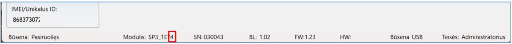

13. **„Modulių“** sąraše turi atsirasti **„RF-S8 imtuvas“** ir rodomas RF-S8 serijos numeris ir mikroprogramos versija**.** Jei matote RF-S8 siųstuvo-imtuvo programinės įrangos versiją, galite praleisti 14–22 veiksmus.

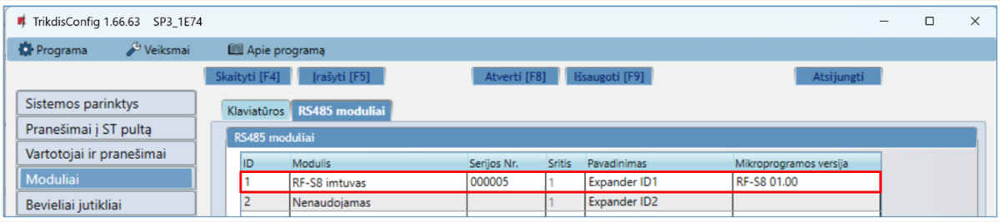

14. Jei RF-S8 imtuvas neatsirado, tai reikia **„Modulių“** sąraše išsirinkti **„RF-S8 imtuvą“.**

15. Lauke **„Serijos Nr.“** įrašykite gaminio RF-S8 serijos numerį. Serijos numerį rasite ant gaminio ir pakuotės etiketės.

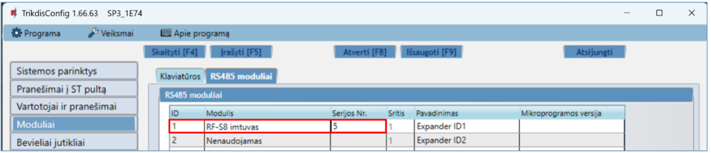

16. Nuspauskite **Įrašyti [F5]**.

17. Ištraukite USB Mini-B kabelį.

18. Palaukite 1 minutę, kad „FLEXi” SP3 ir RF-S8 susijungtu tarpusavyje.

19. Prijunkite USB Mini-B kabelį prie „FLEXi” SP3.

20. Nuspauskite **Skaityti [F4]**.

21. Lange „**Moduliai**“ rodoma RF-S8 mikroprogramos versija.

22. Modulis RF-S8 priregistruotas prie „FLEXi” SP3.

23. Ištraukite USB Mini-B kabelį.

24. Nuspauskite **„Atsijungti“**.

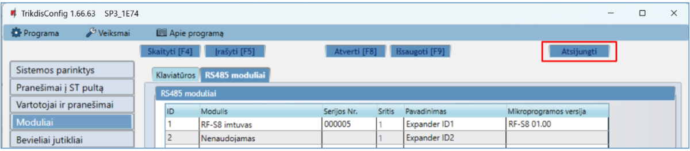

25. Palaukite 1 minutę.

## Belaidžių jutiklių registravimas 

### Nuotolinė belaidžių jutiklių registracija 

Dabar atliksime nuotolinį prisijungimą su TrikdisConfig prie centralės „FLEXi“ SP3.

!!! note
    Nuotolinis konfigūravimas veiks tik tuomet, kai „FLEXi" SP3:
    
    1.  Įstatyta aktyvuota SIM kortelė ir įvestas arba išjungtas PIN kodas.
    
    2.  SIM kortelėje įjungtas mobilus internetas.
    
    3.  Įjungta „Protegus servisas" paslauga.
    
    4.  Įjungtas maitinimas („**PWR**" LED mirksi žaliai).
    
    5.  Prisiregistravęs prie tinklo („**NET**" LED šviečia žaliai ir mirksi
        geltonai).
!!! note
    **Belaidžius jutiklius galima primokyti prie centralės ir juos taip
    pat galima atmokyti nuo centralės. <u>Kai atliekamas belaidžių jutiklių
    atsiejimas nuo centralės, centralė neturi būti primokymo
    režime</u>. Prieš primokant belaidžius jutiklius, juos reikia
    atmokyti nuo centralės. Paspauskite ir palaikykite nuspaudę 5 sekundes
    primokymo mygtuką. Kai belaidžio jutiklio indikatorius tris kartus
    sumirksės žaliai, atleiskite mygtuką. Belaidis jutiklis bus atsietas
    nuo centralės. Šią procedūrą rekomenduojama atlikti su visais
    belaidžiais jutikliais prieš juos primokant. SVARBU: ATSITIKTINAI
    ATLIKUS ATMOKYMĄ BEVIELIS JUTIKLIS SU CENTRALE NEBEVEIKS.**
TrikdisConfig lauke **„Nuotolinė prieiga“** įveskite centralės „FLEXi“ SP3 „**Unikalus ID“** numerį. Šį numerį rasite ant įrenginio pakuotės ir centralės plokštės.

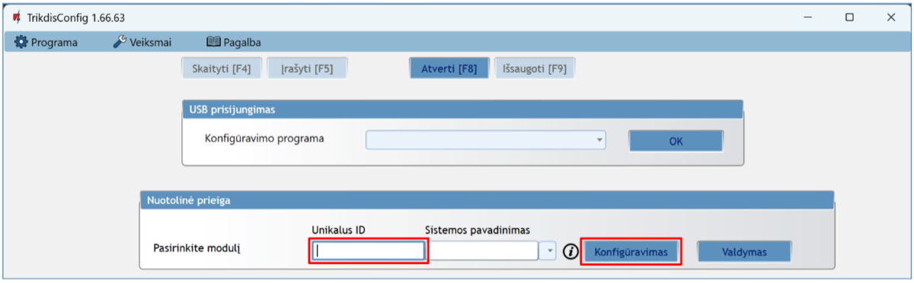

Paspauskite **„Konfigūravimas“**.

Atsidariusiame lange paspauskite **Skaityti [F4]**. Programai paprašius, įveskite administratoriaus arba instaliuotojo kodą.

Pereikite į langą **„Bevieliai jutikliai“**.

Paspauskite **„Jutiklių primokymas“**.

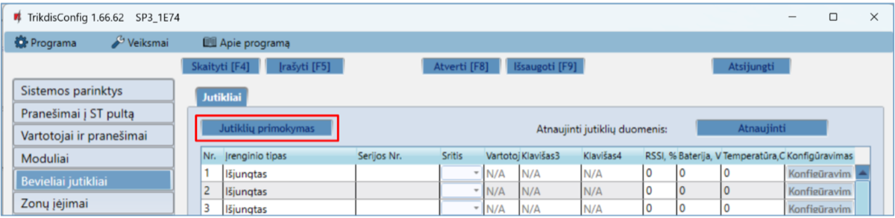

Belaidžių jutiklių registravimą galima atlikti visiems iš karto. Įdėkite į belaidžius jutiklius (PIR, magnetinis kontaktas, vandens nuotėkio jutiklis, dūmų jutiklis, sirena) baterijas.

Registruojant jutiklius *RF-S8* modulis turi būti ne arčiau 1 m atstumu nuo jutiklių.

1.  RF-S8 modulyje pradės mirksėti LED indikatorius **„NETWORK“** žaliai / raudonai.

2.  RF-S8 modulis yra perėjas į primokymo režimą. TrikdisConfig atvers programos primokymo langą.

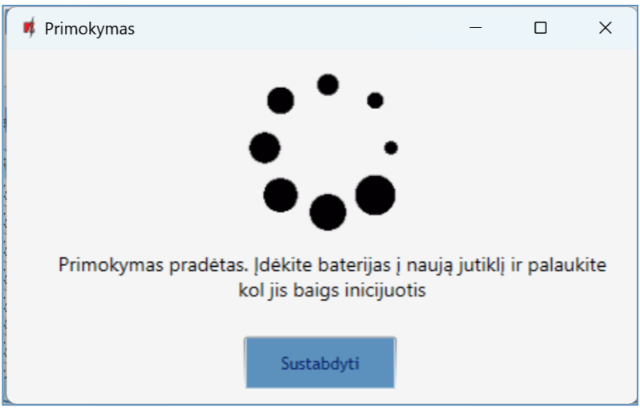

3.  Nuspausite ir palaikykite primokymo mygtuką 5 sekundes. Atleiskite mygtuką, kai indikatorius keturis kartus sumirksės žaliai.

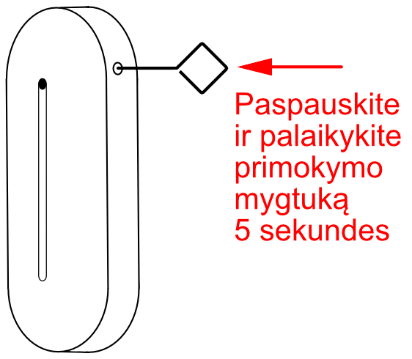

4.  RF-S8 modulyje **„NETWORK“** indikatorius trumpam užsidegs žalia spalva (tai reiškia, kad jutiklis priregistruotas). Po kelių sekundžių indikatorius “**NETWORK**” vėl mirksės žaliai/raudonai.

5.  TrikdisConfig atvers naują langą, kur reikia priskirti belaidžiui jutikliui **„Zonos numerį“**, **„Zonos paskirtį“**.

6.  Paspauskite **„Išsaugoti“**.

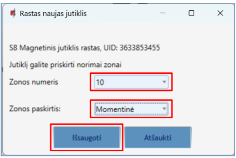

7.  Naujas jutiklis įtrauktas į jutiklių sąrašą.

8.  Jei reikia primokyti sekanti jutiklį, tai reikia nuspausti primokymo mygtuką jutiklyje. Ir atlikti nustatymus, kurie aprašyti aukščiau.

9.  Jei jutiklių primokymas baigtas nuspauskite **„Sustabdyti“**.

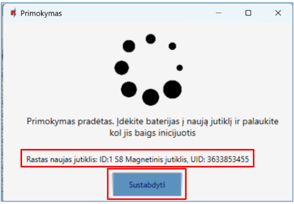

10. Atsivėrusiame lange paspauskite „**Yes**“. Priregistruoti belaidžiai jutikliai bus įrašyti į centralės „FLEXi“ SP3 atminti. Arba paspauskite „**No**“, jei norite papildomai nustatyti parametrus.

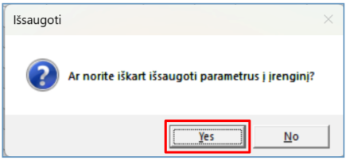

Palaukite kelias minutes. Nuspauskite mygtuką **Skaityti [F4]**.

Programoje TrikdisConfig lange **„Bevieliai jutikliai“** bus sąrašas priregistruotų belaidžių jutiklių. Lauke **„Serijos Nr.“** bus įrašytas jutiklio serijinis numeris.

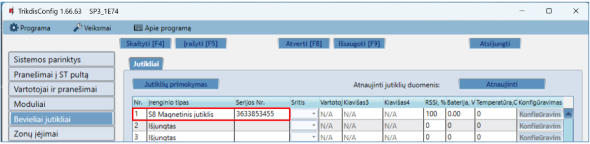

Patikrinkite ar jutikliai teisingai priskirti apsaugos centralės zonoms ir sritims (langas **„Zonų įėjimai“**).

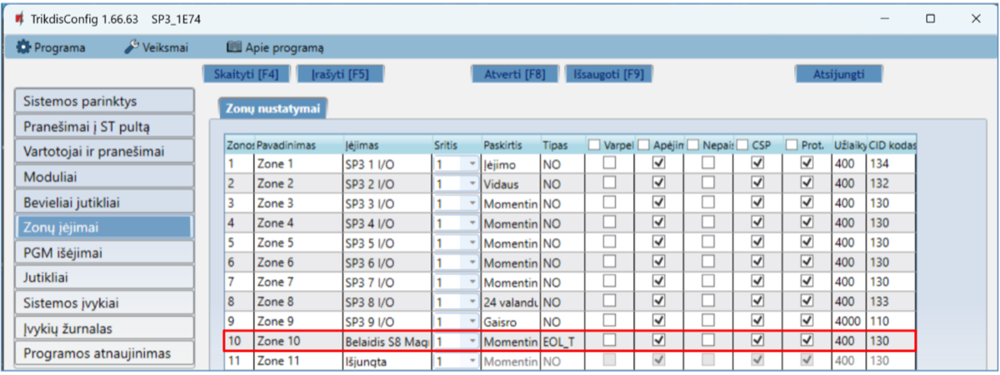

Jei nustatote zonos **„Tipą“** EOL-T, bus įjungtas jutiklio tamperio stebėjimo režimas.

Atlikus pakeitimus nuspauskite **Įrašyti [F5]**.

!!! note
    Belaidžių jutiklių ištrynimas iš „FLEXi" SP3 atminties:
    
    1.  Paleiskite ***TrikdisConfig**.*
    
    2.  Prijunkite „FLEXi" SP3 per USB Mini-B kabelį prie kompiuterio
        arba prisijunkite prie „FLEXi" SP3 nuotoliniu būdu.
        Nuspauskite mygtuką **Skaityti [F4]**.
    
    3.  Programoje TrikdisConfig, lango „**Bevieliai jutikliai"**
        lauke „**Įrenginio tipai"**, kur buvo priregistruotas **belaidis
        jutiklis**, nurodykite „**Išjungtas"** ir paspauskite
        **Įrašyti [F5]**. Belaidis jutiklis ištrintas iš „FLEXi" SP3
        atminties.
### Belaidžių jutiklių registravimas be nuotolinės prieigos 

Belaidžių jutiklių registravimą galima atlikti visiems iš karto. Įdėkite į belaidžius jutiklius (PIR, magnetinis kontaktas, vandens nuotėkio jutiklis, dūmų jutiklis, sirena) baterijas. **Registruojant jutiklius *RF-S8* modulis turi būti ne arčiau 1 m atstumu nuo jutiklių.**

1.  Įsitikinkite, ar imtuvas RF-S8 priregistruotas prie „FLEXi” SP3.

2.  Įjunkite maitinimą centralei.

3.  Nuo imtuvo RF-S8 nuimkite dangtelį.

4.  Nuspauskite ir palaikykite imtuvo RF-S8 modulio mygtuką „**LEARN“**, kol LED indikatorius “**NETWORK**” pradės mirksėti žaliai/raudonai.

5.  Atleiskite mygtuką.

6.  Mirksintis žaliai/raudonai LED “**NETWORK**“ indikatorius parodo, kad RF-S8 yra belaidžių jutiklių registravimo režime.
7.  Jutiklyje nuspausite ir palaikykite primokymo mygtuką 5 sekundes. Atleiskite mygtuką, kai indikatorius keturis kartus sumirksės žaliai.

8.  RF-S8 modulyje **„NETWORK“** indikatorius trumpam užsidegs žalia spalva (tai reiškia, kad jutiklis priregistruotas).

9.  Po kelių sekundžių indikatorius “**NETWORK**” vėl mirksės žaliai/raudonai.

10. Jei reikia primokyti sekanti jutiklį, tai reikia nuspausti primokymo mygtuką jutiklyje.

11. Jei jutiklių primokymas baigtas nuspauskite ir palaikykite mygtuką **„LEARN“,** kol LED indikatorius “**NETWORK**” nustos mirksėti žaliai/raudonai. Imtuvas RF-S8 išėjo iš registravimo režimo.

12. Prijunkite USB Mini-B kabelį prie „FLEXi” SP3.

13. Paleiskite TrikdisConfig, nuspauskite mygtuką **Skaityti [F4]**.

14. Programoje TrikdisConfig lange **„Bevieliai jutikliai“** bus sąrašas priregistruotų belaidžių jutiklių. Lauke **„Serijos Nr.“** įrašytas jutiklio serijinis numeris.

15. Patikrinkite ar jutikliai teisingai priskirti apsaugos centralės zonoms ir sritims (langas **„Zonų įėjimai“**).

16. Atlikus pakeitimus nuspauskite **Įrašyti [F5]**.

17. Belaidžiai jutikliai pilnai priregistruoti.
