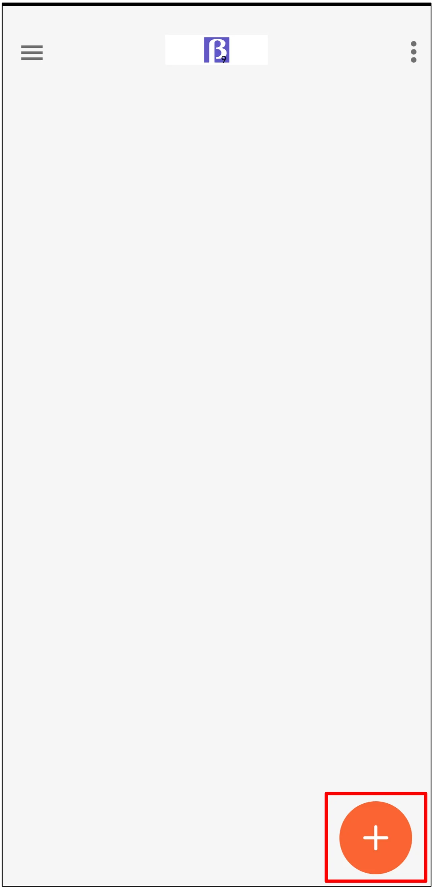
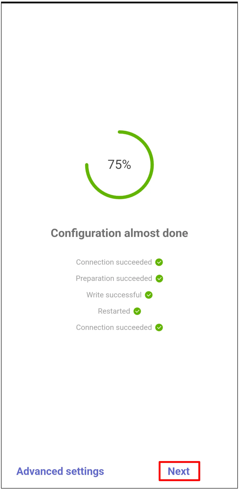
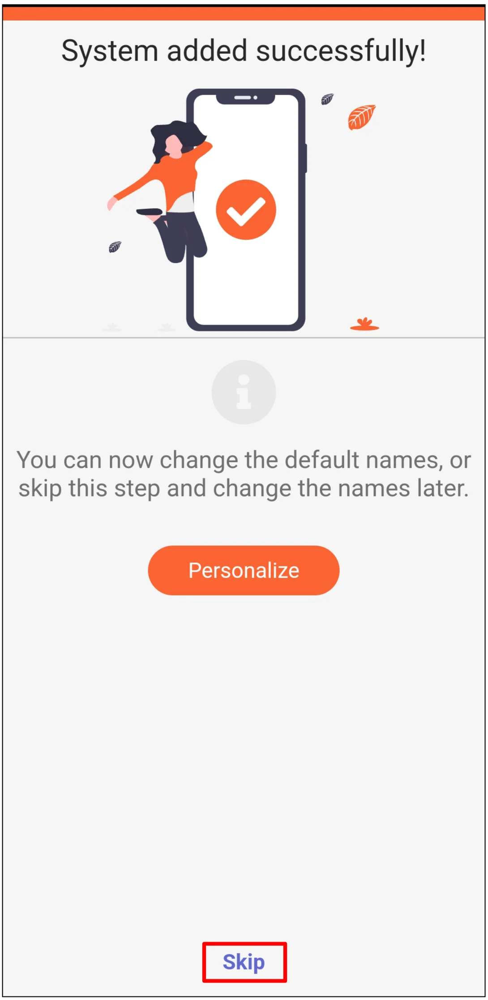
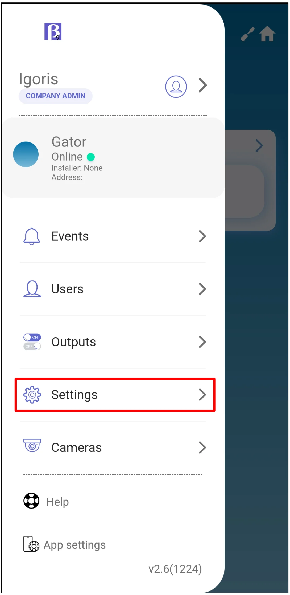
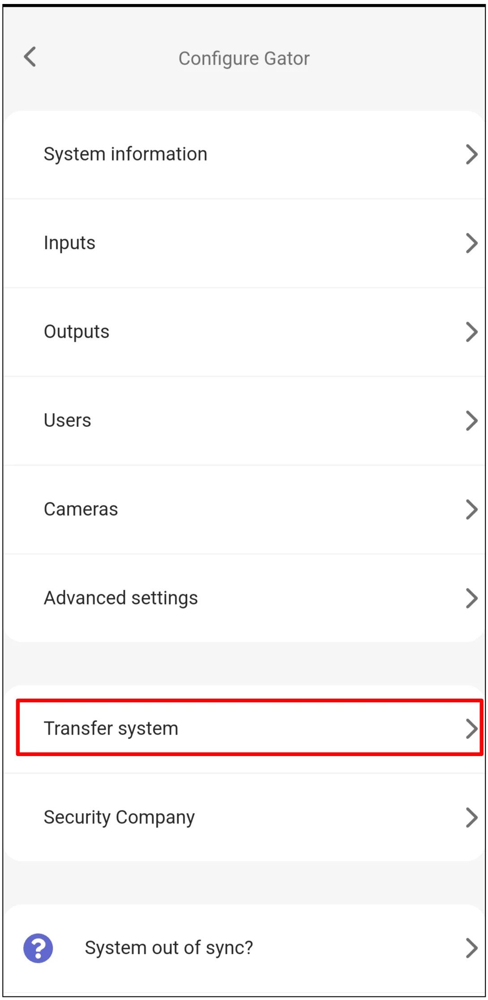
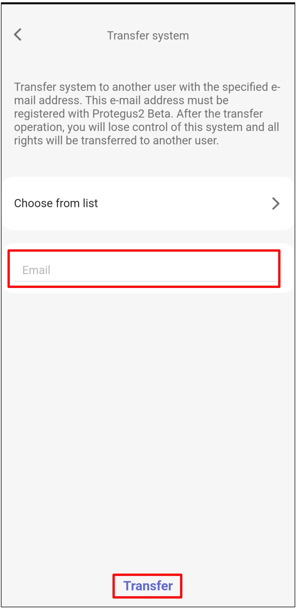

# GATOR LTE ir GATOR WiFi su iO4R greitas paruošimas

Trumpi prijungimo ir Protegus2 programavimo žingsniai, kaip prijungti iO4R plėtiklį prie GATOR LTE arba GATOR WiFi vartų valdiklio. Kitus montavimo ir konfigūravimo nustatymus rasite pilnuose [GATOR](../gator/index.md) ir [GATOR WiFi](../gator-wifi/index.md) vadovuose.

iO4R naudojamas pažangesniam vartų stebėjimui. Jis prideda stebimus apsaugos jutiklių Guard įėjimus ir leidžia įgaliotam specialistui laikinai apeiti jutiklio gedimą, kol bus atlikta techninė priežiūra. Protegus2 taip pat skaičiuoja pilnus vartų atidarymo ir uždarymo ciklus ir įspėja, kai reikia atlikti techninę priežiūrą. Tai padeda neplanuotus iškvietimus pakeisti suplanuotais aptarnavimo vizitais ir pasikartojančiomis priežiūros sutartimis.

!!! caution "Atsargiai"
    Montuoti ir prižiūrėti gali tik kvalifikuoti specialistai. Prieš jungdami laidus atjunkite tinklo ir žemos įtampos maitinimą. Laikykitės vartų automatikos gamintojo saugos instrukcijų ir vietinių elektros darbų reikalavimų.

## Būtinos sąlygos

- Paruoštas GATOR LTE arba GATOR WiFi vartų valdiklis. Jungiant laidus maitinimas turi būti atjungtas.
- iO4R plėtiklio serijos numeris.
- Protegus2 įmonės arba montuotojo paskyra ir valdiklio IMEI / Unique ID.
- Vartų būsenos jutiklis prijungtas prie valdiklio vartų padėties įėjimo.
- Vartų apsaugos jutikliai prijungti per iO4R plėtiklį, jeigu jie bus stebimi arba laikinai apeinami Protegus2 programoje.

## Laidų prijungimas

Prijunkite iO4R plėtiklį prie valdiklio RS485 magistralės ir maitinimo gnybtų, kaip parodyta žemiau.

!!! note "Pastaba"
    Schemoje parodyti GATOR LTE gnybtų pavadinimai. GATOR WiFi valdiklyje naudokite atitinkamus `+DC`, `-DC`, `A RS485` ir `B RS485` gnybtus iš GATOR WiFi vadovo.

Naudokite `3 I/O` kaip vartų padėties įėjimą ciklų skaičiavimui. Ciklas skaičiuojamas tik tada, kai vartai pilnai atsidaro ir pilnai užsidaro.

!!! important "Svarbu"
    Protegus2 stebėjimo sąrankoje `I/O 3` rezervuotas vartų padėčiai ir ciklų skaičiavimui. Jo neperkonfigūruokite. Įėjimai `IN1` ir `IN2` rezervuoti Wiegand.

## Valdiklio ir iO4R pridėjimas Protegus2 programoje

Prisijunkite prie Protegus2 naudodami įmonės arba montuotojo paskyrą, tada pridėkite valdiklį.

  

    <strong>1 žingsnis.</strong> Paspauskite <strong>Add new system</strong>.
    
  

  

    <strong>2 žingsnis.</strong> Įveskite valdiklio <strong>IMEI</strong>, tada paspauskite <strong>Next</strong>.
    
  

  

    <strong>3 žingsnis.</strong> Pasirinkite <strong>Advanced Gator Monitoring</strong>, tada paspauskite <strong>Next</strong>.
    
  

  

    <strong>4 žingsnis.</strong> Nustatykite <strong>Cycles</strong> skaičių, po kurio bus reikalinga techninė priežiūra, tada paspauskite <strong>Next</strong>.
    
  

  

    <strong>5 žingsnis.</strong> Įjunkite kiekvieną iO4R išėjimą, kuris prijungtas prie stebimo apsaugos jutiklio arba būsenos grandinės.
    
  

  

    <strong>6 žingsnis.</strong> Įveskite iO4R <strong>Serial number</strong>, tada paspauskite <strong>OK</strong>.
    
  

  

    <strong>7 žingsnis.</strong> Kiekvienam įjungtam išėjimui nustatykite pavadinimą ir piktogramą, išėjimo <strong>Type</strong> palikite <strong>Guard</strong>, priskirkite atitinkamą iO4R įėjimą ir įėjimo <strong>Type</strong> nustatykite pagal laidų prijungimą. Pavyzdyje parodytas įėjimo tipas yra <strong>NO</strong>. Paspauskite <strong>Next</strong>.
    
  

  

    <strong>8 žingsnis.</strong> Palaukite, kol Protegus2 įrašys duomenis.
    
  

  

    <strong>9 žingsnis.</strong> Paspauskite <strong>Next</strong>.
    
  

  

    <strong>10 žingsnis.</strong> Įveskite sistemos <strong>Name</strong>, tada paspauskite <strong>Next</strong>.
    
  

  

    <strong>11 žingsnis.</strong> Paspauskite <strong>Skip</strong>, jeigu dabar nenorite pridėti vartotojų.
    
  

  

    <strong>12 žingsnis.</strong> Palaukite apie 1 minutę, kol sąranka bus užbaigta.
    
  

## Sistemos perdavimas vartotojui

Baigę sąranką, perduokite sistemą vartotojo Protegus2 paskyrai.

  

    <strong>13 žingsnis.</strong> Paspauskite <strong>Menu</strong>.
    
  

  

    <strong>14 žingsnis.</strong> Paspauskite <strong>Settings</strong>.
    
  

  

    <strong>15 žingsnis.</strong> Paspauskite <strong>Transfer system</strong>.
    
  

  

    <strong>16 žingsnis.</strong> Įveskite vartotojo el. pašto adresą, tada paspauskite <strong>Transfer</strong>.
    
  

## Vartų stebėjimo ir valdymo patikra

Po perdavimo vartotojas turi prisijungti prie Protegus2 naudodamas savo paskyrą.

!!! warning "Įspėjimas"
    Vartų apsaugos jutiklio apėjimas gali išjungti saugos apsaugą. Apėjimą naudokite tik kaip laikiną, įgaliotą techninės priežiūros veiksmą ir prieš palikdami įrenginį naudoti atkurkite normalų jutiklio veikimą.

  

    <strong>17 žingsnis.</strong> Paspauskite <strong>Gate control</strong>, kad matytumėte vartų ciklų skaitiklį.
    
  

  

    <strong>18 žingsnis.</strong> Peržiūrėkite <strong>Total cycles</strong> ir <strong>Cycles to maintenance</strong>. Jei įgaliotas montuotojas turi patikrinti apsaugos jutiklių būseną, paspauskite <strong>Input status</strong>.
    
  

  

    <strong>19 žingsnis.</strong> <strong>Input status / bypass</strong> naudokite tik tada, kai apsaugos jutiklis patikrintas ir apėjimas reikalingas laikinai.
    
  

  

    <strong>20 žingsnis.</strong> Paspauskite vartų valdymo piktogramą, kad atidarytumėte vartus.
    
  

## Sistemos patikra

1. Pilnai atidarykite ir uždarykite vartus, tada patikrinkite, ar ciklų skaitiklis pasikeičia kaip tikėtasi.
2. Suaktyvinkite kiekvieną stebimą iO4R įėjimą ir patikrinkite, ar įėjimo būsena pasikeičia Protegus2 programoje.
3. Patikrinkite vartų valdymo piktogramą ir įsitikinkite, kad vartų automatika reaguoja tinkamai.
