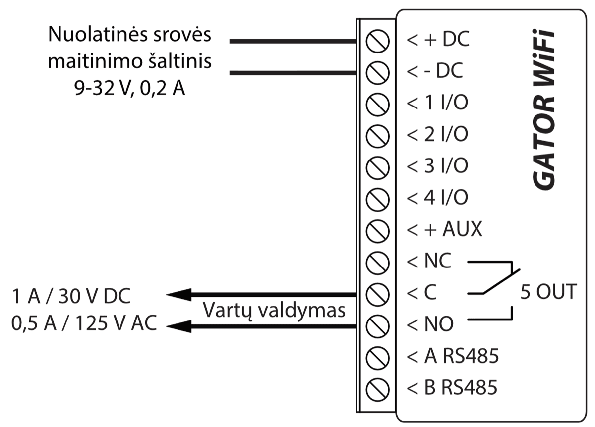
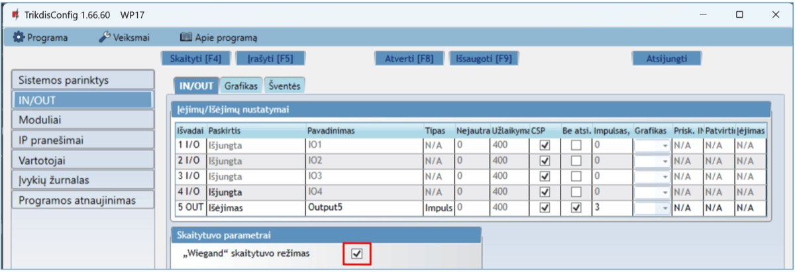
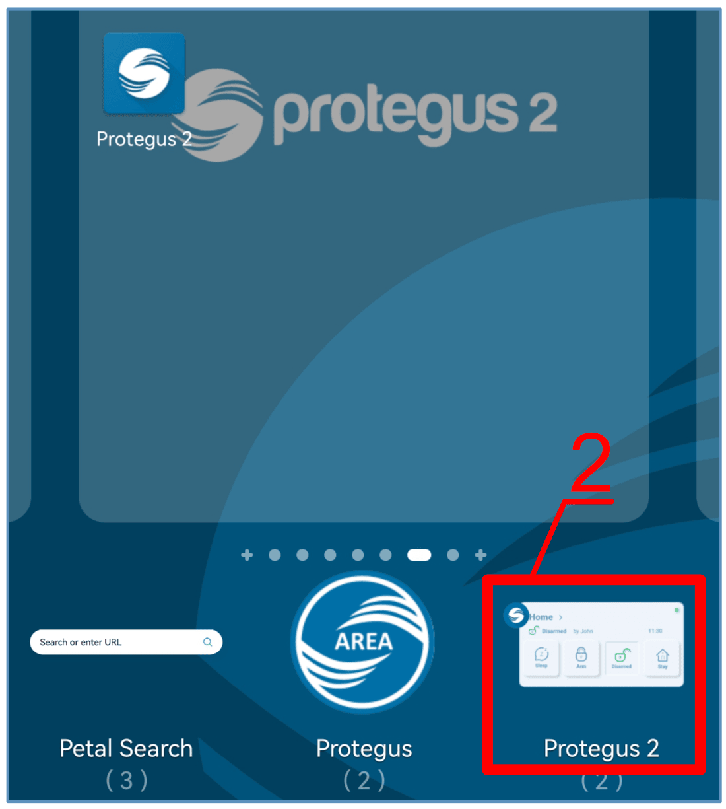
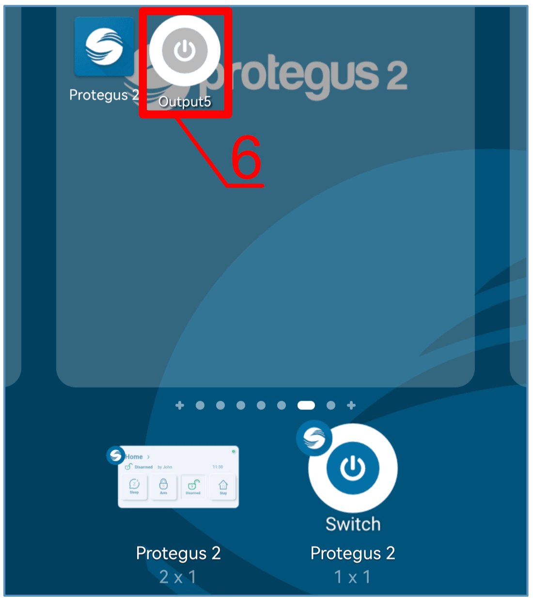

  

# Gator Wifi

Wi-Fi valdiklis GATOR WiFi skirtas automatinių durų (arba kitai elektros įrangai) valdymui nuotoliniu būdu.

GATOR WiFi galima valdyti su Protegus2 programėle. Valdikliui galima įvesti 1000 vartotojų (reikia nurodyti vartotojo e-mail). Valdikliui GATOR WiFi galima nustatyti vartotojų valdymo grafiką, nustatyti skaitliuką, kiek kartų vartotojas gali suvaldyti sistemą. Valdiklis gali siųsti pranešimus apie įėjimų ir išėjimų suveikimus ir atsistatymus į CSP (centralizuoto stebėjimo pulto) imtuvą ir į programėlę Protegus2.

**Savybės**

Nuotolinis valdymas

- Mobilioji/Web programėle *Protegus2.*

Pranešimai vartotojams

- Siunčia pranešimus apie įvykius į *Protegus2* programėlę.

Pranešimai saugos tarnybai

- Contact ID kodais siunčia įvykių pranešimus į TRIKDIS programinius arba aparatūrinius imtuvus, kurie dirba su bet kuria pranešimų stebėjimo programa.

- Gali vienu metu siųsti įvykių pranešimus ir į saugos tarnybos imtuvą, ir veikti su *Protegus2* programėle.

- Nutrūkus ryšiui su pagrindiniu imtuvu, pranešimai automatiškai perduodami į atsarginį imtuvą.

Įėjimai ir išėjimai

- 4 universalus įėjimai/išėjimai. Veikimo režimas nustatomas kaip įėjimas (NO; NC; EOL) arba išėjimas.

- 1 išėjimas (OUT) - relė.

- Su iO-LORA plėtikliu galima papildomai pridėti vieną įėjimą ir vieną išėjimą (relinis kontaktas). Iš viso galima pridėti 8 iO- LORA plėtiklių (pridėti iki 8 papildomų įėjimų ir 8 papildomų išėjimų).

#### Nustatymai ir diegimas

- Greitas ir paprastas paleidimas veikti.

- Naujų vartotojų pridėjimas ir esamų pašalinimas naudojantis Protegus2 programėle (prisijungus administratoriaus teisėmis), TrikdisConfig programa.

- Įrenginio konfigūravimas prijungus USB Mini-B kabeliu arba nuotoliniu būdu, naudojant TrikdisConfig programą.

- Nuotolinis programinės įrangos atnaujinimas.

### Techniniai parametrai

| Parametras | Aprašymas |
|:---|----|
| Maitinimo įtampa | 9-32 V nuolatinės srovės |
| Naudojama srovė | 150 mA |
| Universalus įėjimas/​išėjimas | 4 vnt., nustatomas arba įėjimas IN, kurio tipas: NC, NO, EOL=10 kΩ, arba išėjimas OUT (atviras kolektorius (OC) 50 mA) |
| Išėjimas | 1 vnt., relė, 1 A 30 V nuolatinės srovės, 0,5 A 125 V kintamos srovės |
| Ryšys su CSP | TCP/​IP arba UDP/​IP per Wi-Fi |
| Įvykių perdavimo protokolas | TRK_TCP arba TRK_UDP |
| Šifravimo raktas | 6 simbolių šifravimo raktas |
| Wi-Fi dažnis | 2,4 GHz |
| Wi-Fi protokolas | 802.11 b/​g/​n |
| Šifravimo tipas | WPA, WPA2, WPA mixed |
| Tinklo konfigūracijos tipas | DHCP arba rankinis tinklo konfigūravimas (naudojant telefoną ar nešiojamą kompiuterį) |
| Neišsiųstų įvykių atmintis | Iki 60 įvykių |
| Įvykių žurnalo atmintis | Iki 5000 įvykių |
| Vartotojai, kurie gali valdyti | 1000 |
| Palaikomi moduliai | iO-LORA – plėtimo modulis (naudojant iO-LORA prie GATOR WiFi turi būti prijungtas RF-LORA transiveris) |
| Darbinė aplinka | Temperatūra nuo –20 °C iki +50 °C, santykinis oro drėgnumas 80 %, kai temperatūra siekia +20 °C |
| Matmenys | 88 x 62 x 26 mm |
| Svoris | 80 g |

### Valdiklio elementai

1.  Šviesos indikatoriai.

2.  Priekinio dangtelio atidarymo plyšys.

3.  USB Mini-B jungtis valdikliui programuoti.

4.  Gnybtai laidų prijungimui.

5.  Mygtukas įjungiantis modulio Wi-Fi konfigūravimo režimą.

### Išorinių kontaktų paskirtis

| Gnybtas | Aprašymas                                                         |
|---------|:------------------------------------------------------------------|
| +DC     | Maitinimo gnybtas (9-32 V nuolatinės srovės teigiamas gnybtas)    |
| -DC     | Maitinimo gnybtas (9-32 V nuolatinės srovės neigiamas gnybtas)    |
| 1 I/​O   | Įėjimo/​išėjimo gnybtas (gamyklinis nustatymas – įėjimas, NO)      |
| 2 I/​O   | Įėjimo/​išėjimo gnybtas (gamyklinis nustatymas –įėjimas, NO)       |
| 3 I/​O   | Įėjimo/​išėjimo gnybtas (gamyklinis nustatymas – OC tipo išėjimas) |
| 4 I/​O   | Įėjimo/​išėjimo gnybtas (gamyklinis nustatymas – OC tipo išėjimas) |
| +AUX    | Išorinių įrenginių teigiamas maitinimo gnybtas                    |
| NC      | Relės gnybtas NC                                                  |
| C       | Relės gnybtas C                                                   |
| NO      | Relės gnybtas NO                                                  |
| A RS485 | *RS485* magistralės A kontaktas                                   |
| B RS485 | *RS485* magistralės B kontaktas                                   |

### Šviesinė veikimo indikacija

| Indikatorius | Veikimas | Aprašymas |
|--------------|----------|-----------|
| NETWORK (Tinklas) | Šviečia žaliai | Prisijungta prie Wi-Fi tinklo |
| NETWORK (Tinklas) | Mirksi žaliai | Jungiasi prie Wi-Fi tinklo |
| NETWORK (Tinklas) | Mirksi geltonai | Rodo ryšio stiprumą nuo 0 iki 5 |
| NETWORK (Tinklas) | Greitai mirksi žaliai geltonai | Wi-Fi konfigūravimo režimas |
| DATA / (Duomenys) | Šviečia žaliai | Siunčiamas pranešimas |
| DATA / (Duomenys) | Šviečia geltonai | Pranešimo išsiųsti nepavyksta |
| STATUS / (Būsena) | Mirksi žaliai | Veikia be nesklandumų |
| STATUS / (Būsena) | 1 mirktelėjimas raudonai | Nepavyksta prisijungti prie Wi-Fi tinklo |
| STATUS / (Būsena) | 2 mirktelėjimai raudonai | Žemas Wi-Fi ryšio stiprumas |
| STATUS / (Būsena) | 3 mirktelėjimai raudonai | Neprisijungta prie pagrindinio pulto kanalo |
| STATUS / (Būsena) | 4 mirktelėjimai raudonai | Neprisijungta prie Protegus2 serverio |
| STATUS / (Būsena) | 5 mirktelėjimai raudonai | Neprisijungta prie abiejų pulto kanalų |
| STATUS / (Būsena) | 6 mirktelėjimai raudonai | Nenustatytas modulio laikrodis |
| STATUS / (Būsena) | 7 mirktelėjimai raudonai | Žema maitinimo įtampa |

Jeigu LED indikacija visai nešviečia, patikrinkite maitinimo šaltinį ir sujungimus.

!!! note
    Prieš pradėdami įrengimą patikrinkite, ar turite visus reikiamus
    komponentus:
    
    1.  USB Mini-B tipo kabelį, reikalingas konfigūravimui.
    
    2.  Mažiausiai 4 gyslų kabelį valdiklio prijungimui.
    
    3.  Plokščią 2,5 mm atsuktuvą.
    
    Trūkstamus komponentus užsisakykite atskirai iš savo vietinio
    platintojo.
### Valdiklio *GATOR WiFi* pakuotės turinys

|  \- | Valdiklis GATOR WiFi    | 1 vnt. |
|----:|-------------------------------|--------|
|  \- | Rezistorius 10 kΩ             | 3 vnt. |
|  \- | Dvipusė lipni juostelė (5 cm) | 1 vnt. |
|  \- | Varžtas                       | 2 vnt. |

## Valdiklio GATOR WiFi laidinių sujungimų schemos

### Tvirtinimas

1.  Nuimkite viršutinį dangtelį. Ištraukite kontaktų kaladėlės kištukinę dalį.

2.  Išimkite plokštę.

3.  Korpuso pagrindą varžtais pritvirtinkite pageidaujamoje vietoje.

4.  Atgal surinkite plokštę ir kontaktinę kaladėlę.

5.  Uždarykite viršutinį dangtį.

### Maitinimo prijungimo schema

Laidais sujunkite valdiklį GATOR WiFi pagal pateiktą sujungimų schemą.

### RFID skaitytuvo (Wiegand 26/34) prijungimo schema

Valdiklio GATOR WiFi konfigūravimas su RFID skaitytuvų aprašytas p.5.3 „Langas IN/OUT“. Su RFID skaitytuvu galima valdyti tik išėjimą 5 OUT.

RFID skaitytuvo prijungimo schema prie valdiklio GATOR WiFi.

Programoje TrikdisConfig būtina pažymėti lauką **„Wiegand“ skaitytuvo režimas.** Paspaudus „Išėjimo“ mygtuką, valdiklio išėjimas 5OUT suveiks nustatytai impulso trukmei.

### iO-LORA plėtimo modulių prijungimo schema

Vartų valdiklio veikimo programos versija nuo 1.21.

Prijunkite RF-LORA transiverį prie GATOR WiFi. Po to galite naudoti iO-LORA plėtiklį, prie kurio prijungtas RFID skaitytuvas (Wiegand 26/34). RFID skaitytuvas valdo iO-LORA PGM išėjimą, prie kurio jis prijungtas. GATOR WiFi ir aštuoni prie jo prijungti iO-LORA moduliai gali valdyti devynias skirtingas duris.

Paleiskite TrikdisConfig. Prijunkite GATOR WiFi prie kompiuterio naudodami USB Mini-B kabelį arba nuotoliniu būdu. Spustelkite programos TrikdisConfig mygtuką **Skaityti [F4]**, kad ji pateiktų esamas valdiklio veikimo parametrų reikšmes. Jei programa pareikalaus, iššokusiame langelyje įveskite administratoriaus arba montuotojo kodą. "**Modulių**" sąraše išsirinkite "**iO-LORA valdiklis**". Lauke "**Serijos Nr.**" įrašykite gaminio serijos numerį.

"**IN/OUT**" sąraše „**6IN**“ nustatykite „**Išėjimo mygtukas**“. Paspaudus „**Išėjimo**“ mygtuką, iO-LORA išėjimas „**OUT7**“ suveiks nustatytai impulso trukmei.

Sąraše "**Vartotojai**" įrašykite RFID kortelės numerį, vartotojo vardą, įjunkite leidimą valdyti PGMą, nurodykite valdoma PGMą, kodą. Atlikus pakeitimus nuspauskite **Įrašyti [F5]**. Palaukite, kol bus atlikti atnaujinimai. Nuspauskite "**Atsijungti**" ir atjunkite USB kabelį.

Suveikdinkite su RFID kortele/kodu PGM išėjimą. Paspauskite išėjimo mygtuką (turi suveikti PGM išėjimas).

### Zonų įėjimų laidinių sujungimų schemos

GATOR WiFi turi keturis universalius **I/O** (įėjimas/išėjimas) gnybtus, kurie gali veikti kaip įėjimai arba išėjimai. Įėjimai gali veikti NC, NO, EOL režimais. Prijunkite įėjimus pagal nustatytą įėjimo tipą (NC, NO, EOL), kaip tai pavaizduota žemiau pateiktose schemose:

### Relės prijungimo schema

Nuotoliniu būdu su relės kontaktais galima valdyti (įjungti/išjungti) įvairius elektrinius prietaisus. xI/O gnybtui turi būti nustatytas Išėjimo veikimo režimas.

### LED prijungimo schema

xI/O gnybtui turi būti nustatytas Išėjimo veikimo režimas.

## Valdymas su *Protegus2* programėle

Su programėle vartotojai galės valdyti valdiklį nuotoliniu būdu. Jie taip pat matys sistemos būseną ir gaus visus sistemos įvykių pranešimus.

1.  Parsisiųskite ir paleiskite Protegus2 programėlę arba naudokite versiją naršyklėje [www.protegus.app](https://www.protegus.app)<u>.</u>

    

      
      
      
    

2.  Prisijunkite savo vartotojo vardu ir slaptažodžiu arba registruokitės ir susikurkite naują paskyrą.

!!! note
    Pridėjimo prie programėlės metu valdiklis turi būti:
    
    1.  Įjungtas maitinimas („**STATUS**" LED mirksi žaliai);
    
    2.  Prisiregistravęs prie tinklo („**NETWORK**" LED šviečia žaliai ir
        mirksi geltonai).
Paspauskite “**Pridėti sistemą**”.

Įveskite „**Unikalus ID**“ (MAC) numerį. Jį rasite ant gaminio ir pakuotės lipduko. Įvedę, paspauskite „**Toliau**“.

Spustelėkite „**Pradėkite „WiFi“ konfigūravimą WP17**“.

Plokščiu atsuktuvu nuimkite GATOR WiFi dangtelį. Nuspauskite ir palaikykite mygtuką „PAIR“ 3 sekundes. Indikatorius „**NETWORK**“ pradės greitai mirksėti žaliai geltonai. Atleiskite mygtuką. GATOR WiFi valdiklyje įsijungė registravimo režimas prie Wi-Fi tinklo.

Palaukite kol bus surastas GATOR WiFi (WP17) valdiklis. Spustelėkite „**Gerai**“.

Pasirinkite WiFi tinklą, prie kurio bus prijungtas valdiklis ***GATOR WiFi*.**

Įrašykite WiFi tinklo slaptažodį. Spustelėkite „**Gerai**“.

Spustelėkite „**Jungtis**“.

Palaukite kol valdiklis prisijungs.

Įveskite sistemos „**Pavadinimą**“. Spustelėkite „**Toliau**".

Spustelėkite „**Praleisti**".

Palaukite 1 minute. Valdiklis GATOR WiFi po kelių minučių pats išeis iš primokymo režimo (arba nuspauskite ir palaikykite „**PAIR**“ mygtuką 3 sekundes, kol indikatorius „**NETWORK**“ nustos greitai mirksėti žaliai geltonai).

Suvaldykite PGM išėjimą paspausdami ikoną „**Output5**“.

## Widget pridėjimas telefone

Vartų valdymo Widget galima įkelti į telefono ekraną. Telefonas turi turėti Android operacinę sistemą. Valdiklis turi būti priregistruotas programėlėje Protegus2. Telefone prisijunkite prie programėlės Protegus2. Uždarykite programėlės langą.

Pridėkite pirštą prie ekrano ir palaikykite. Atsiras parinkčių juosta.

1.  Nuspauskite „**Widgets**“.

Suraskite parinkčių juostoje Protegus2.

2. Nuspauskite Protegus2.

3. Nuspauskite „**Switch Protegus2**“.

4. Pasirinkite valdiklio „**WP17 Output5**“**.**

2.  Nuspauskite „**Pridėti valdiklį**“.

3. Telefono ekrane atsiras ikona.

4. Pereikite prie normalaus ekrano. Spustelkite ikoną.

Ekrane atsiras apskritimas, kuriame bus atvaizduotas PGM suveikimas.

5. Kai valdiklis prijungtas prie vartų automatikos su vartų būsenos indikacija, tai ikona atvaizduos atvirų/uždarų vartų būseną.

## Veikimo parametrų nustatymas programa *TrikdisConfig*

Su TrikdisConfig galite pakeisti valdiklio GATOR WiFi nustatymus (jei gamyklinių nustatymų nepakanka) pagal žemiau pateiktus programos langų aprašymus.

1.  Parsisiųskite konfigūravimo programą TrikdisConfig iš [www.trikdis.com/lt](http://www.trikdis.com/lt)/ (programą rasite paieškos lauke, surinkę „TrikdisConfig“) ir ją įdiekite.

2.  Plokščiu atsuktuvu nuimkite GATOR WiFi dangtelį, kaip parodyta žemiau:

1.  Su USB Mini-B kabeliu prijunkite GATOR WiFi prie kompiuterio.

2.  Paleiskite konfigūravimo programą TrikdisConfig. Programa automatiškai atpažins prijungtą gaminį ir automatiškai atidarys GATOR WiFi konfigūravimo langą.

3.  Spustelkite programos mygtuką **Skaityti [F4]**, kad ji pateiktų esamas GATOR WiFi veikimo parametrų reikšmes. Jei reikalaujama, įveskite administratoriaus arba instaliuotojo kodą iššokančiame lange.

!!! note
    Nuspaudus mygtuką **Skaityti [F4]**, programa nuskaitys ir parodys
    nustatymus, kurie yra įrašyti įrenginyje. / Nuspaudus mygtuką **Įrašyti
    [F5]**, įrenginį bus įrašyti programoje padaryti
    nustatymai. / Nuspaudus mygtuką **Išsaugoti [F9]**, padaryti
    nustatymai bus išsaugoti konfigūravimo byloje. Išsaugotus nustatymus
    vėliau galėsite įkelti į kitus įrenginius. Tai leidžia greitai
    konfigūruoti keletą gaminių su vienodais nustatymais. / Nuspaudus
    mygtuką **Atverti [F8** ir pasirinkus konfigūravimo bylą programoje bus
    atverti ir parodyti išsaugoti nustatymai. / Norėdami atkurti gamyklinius
    nustatymus, paspauskite **Atkurti** mygtuką lango apačioje kairėje.
### TrikdisConfig būsenų juosta

Prijungus GATOR WiFi prie programos TrikdisConfig, programa būsenų juostoje pateiks informaciją apie prijungtą gaminį:

| Pavadinimas      | Aprašymas                                             |
|------------------|-------------------------------------------------------|
| IMEI/​Unikalus ID | Gaminio MAC numeris                                   |
| Būsena           | Darbinė būsena                                        |
| Modulis          | Gaminio tipas (turi rodyti WP17_xxxx)           |
| SN               | Gaminio serijinis numeris                             |
| BL               | Paleidyklės versija                                   |
| FW               | Gaminio programinės įrangos versija                   |
| HW               | Gaminio aparatinės įrangos versija                    |
| Būsena           | Sujungimo su programa būdas (per USB arba nuotolinis) |

Paspaudus mygtuką **Skaityti [F4]**, programa nuskaitys ir parodys nustatymus, kurie yra įrašyti į GATOR WiFi. Su TrikdisConfig nustatykite reikiamus nustatymus pagal žemiau pateiktus programos langų aprašymus.

### Langas „Sistemos parinktys“

**Parinkčių grupė „Pagrindiniai“**

- **Objekto numeris** – įveskite objekto numerį (4 simbolių šešioliktainis skaičius, 0-9, A-F. **Nenaudokite FFFE, FFFF objekto numerių**).

- **Laiko nustatymas** – pasirinkite šaltinį, pagal kurį būtų nustatomas laikas.

- **Laiko juosta** – nurodoma, kai yra nurodytas laiko sinchronizavimo **NTP serveris**.

- **Vasaros laiko persukimas** – pažymėjus langelį, įjungsite automatinį laiko persukimą pavasario/rudens mėnesiais.

- **Vasaros laiko regionas** – pasirinkite regioną, kuriam priklauso jūsų šalis.

- **Administratoriaus kodas** – šiuo kodu prisijungusiam leidžiama keisti visus valdiklio veikimo parametrus.

- **Vartotojo sąrašo kalba** – parinkite kalbą (Vartotojų sąrašas gali būti įrašytas pasirinktos kalbos rašmenimis).

**Parinkčių grupė „Periodinis testas“**

- **Įgalinti testą** – pažymėjus langelį, įjungiamas periodinio testo pranešimo siuntimas.

- **Testo periodas** – nustatomas testo siuntimo laiko periodas.

- **Pradėti testą** – nurodomas testo pradžios laikas.

- **Į mobiliąją aplikaciją** – pažymėjus lauką testo pranešimas bus siunčiamas į Protegus2.

**Parinkčių grupė „Komunikatoriaus tinklo nustatymai“**

- **DHCP režimas** – Wi-Fi valdiklio registracijos tinkle rėžimas (rankinis arba automatinis).

- **Statinis IP** – statinis IP adresas esant rankiniam registracijos rėžimui.

- **Potinklio kaukė** – potinklio kaukė esant rankiniam registracijos rėžimui.

- **Numatytasis šliuzas** – tinklų sietuvo adresas esant rankiniam registracijos rėžimui.

- **Wifi SSID pavadinimas** – Wi-Fi tinklo pavadinimas, prie kurio jungsis valdiklis GATOR WiFi.
- **Wifi SSID slaptažodis** – Wi-Fi tinklo slaptažodis.

### Langas „IN/OUT“

**Skirtukas „IN/OUT“**

Įėjimų/Išėjimų nustatymų langas.

**Parinkčių grupė „Įėjimų/Išėjimų nustatymai“**

- **Išvadai** – nurodyti valdiklio įėjimų ir išėjimų gnybtų numeriai.

- **Paskirtis** – nurodyti gnybtų tipai (įėjimas, išėjimas, išjungta).

- **Pavadinimas** - įrašykite įėjimo IN arba išėjimo OUT pavadinimą.

- **Tipas** – nurodomas įėjimo tipas (NC, NO, EOL=10kΩ) arba išėjimo tipas (impulsas, lygis).

- **Nejautra** – įėjimas bus nejautrus nustatytą laiką po pirmo suveikimo. Norint išjungti šią funkciją laukelyje įrašykite 0.

- **Užlaikymas** - nurodykite įėjimo (IN) reakcijos laiką, ms.

- **CSP** – pažymėjus lauką, pranešimas bus siunčiamas į CSP (centralizuoto stebėjimo pultą) ir į Protegus2

- **Be atsi**. – išjungti atsistatymo įvykio siuntimą.
- **Impulsas** – išėjimo suveikimo laikas, kai išėjimui priskirtas „**Impulso**“ tipas.

- **Grafikas** – priskiriamas grafiko numeris, pagal kurį bus valdomas išėjimas.

- **Prisk. IN** – priskirti įėjimą (IN) išėjimui, kad pagal įėjimo suveikimą būtų matoma reali įrenginio būsena.

- **Patvirtinti** - nurodykite įėjimą, kuris turi būti aktyvus, kad galima būtu valdyti išėjimą.

- **Įėjimas** – pasirinktas įėjimas aktyvuos išėjimą.

**Parinkčių grupė „Skaitytuvo parametrai“**

- **„Wiegand“ skaitytuvo režimas** – pažymėkite langelį, jei prie GATOR WiFi valdiklio bus prijungtas RFID skaitytuvas („Wiegand 26/34“).

- **Įeigos kodai su išėjimais** - pažymėkite langelį ir įėjimų / išėjimų įvykiai bus siunčiami, kai išėjimas valdomas nuotoliniu būdu.

- **Išjungti filtrą** - pažymėjus lauką, bus išjungtas vidinis filtras naudojamas su skaitytuvu, kuris siunčia trumpus impulsus.

- **Žemos įtampos skaitytuvas** – pažymėjus lauką, bus įjungtas žemos įtampos skaitytuvas.

**Skirtukas „Grafikas“**

OUT išėjimas gali būti aktyvuotas pagal nustatyta grafiką. Būtina nurodyti laiką ir savaitės dienas, įgalinti grafiką ir priskirti grafiką Išėjimui.

- **Pavadinimas** – suteikite laiko grafikui pavadinimą.

- **Įgalinti** – pažymėkite lauką, kad būtų įjungtas tvarkaraštis.

- **Drausti** – pažymėkite lauką, kad uždrausti išėjimo valdymą kitais būdais, kai jis suveikė pagal nustatyta grafiką.

- **Rankinis** – pažymėjus lauką grafikas neįjungs išėjimo starto metu. Grafikas pradės veikti tik kai išėjimas bus suvaldytas vartotojo.

- **Išėjimo režimas** – nurodykite PGM išėjimo darbo režimą. **Lygis** – išėjimas bus aktyvuotas nurodytam laiko tarpui; **Impulsas** – išėjimas bus aktyvuotas grafiko pradžios ir grafiko pabaigos metu nustatytai impulso trukmei.

- **Šventinis režimas** – nurodykite, kaip tvarkaraštis turi elgtis šventinėmis dienomis (Nenaudoti / Neveikti per šventes / Papildomai ir šventėmis / Tik per šventes).

- **Šv.L.** – pažymėkite lauką, kad naudoti šventinių dienų laiką, kai tvarkaraštis suveikia per šventines dienas.

- **Grafiko pradžia** – nurodomas laikas ir savaitės dienos nuo kada valdiklio išėjimas bus suveikdintas.

- **Grafiko pabaiga** – nurodomas laikas ir savaitės dienos iki kada valdiklio išėjimas bus suveikdintas.

  **Skirtukas „Šventės“**

  Įveskite kalendorines šventines dienas, kuriu laikotarpyje bus galima nustatyti papildomą automatinį Išėjimų (OUT) veikimą numatytą **Grafikų** lentelėje.

  
- **Įj.** – pažymėkite lauką, kad būtu įjungtas švenčių tvarkaraštis.

- **Data nuo** – nurodykite šventinių dienų pradžią.

- **Data iki** - nurodykite šventinių dienų pabaigą.

- **Pradžios laikas per šventes** – nurodykite šventinės dienos pradžios valandas.

- **Pabaigos laikas per šventes** - nurodykite šventinės dienos pabaigos valandas.

### Langas „Moduliai“

Prie GATOR WiFi valdiklio galima prijungti iO-LORA modulius.

Prijungus RF-LORA transiverį, prie valdiklio GATOR WiFi galima prijungti iki 8 vnt. belaidžių iO-LORA plėtiklių. RFID skaitytuvai prijungti prie belaidžių iO – LORA plėtimo modulių gali valdyti dar iki 8 durų (GATOR WiFi vartų valdiklio veikimo programos versija nuo 1.21). Vienas iO-LORA plėtiklis su vienų RFID skaitytuvu valdo tik vienas duris.

- **Modulis** - iš sąrašo išrinkite prie valdiklio prijungtą iO-LORA modulį.

- **Serijos Nr**. - įveskite prijungto modulio serijinį numerį (6 skaitmenys). Numerį rasite ant lipduko, užklijuoto ant prijungto modulio arba jo įpakavimo dėžutės.

### Langas „IP pranešimai“

**Parinkčių grupė „Pagrindinis kanalas“**

Pranešimai iš valdiklio GATOR WiFi gali būti siunčiami į CSP. Tam reikia nustatyti ryšio kanalus su CSP imtuvu.

- **Ryšio būdas** – pasirinkite ryšio su CSP (centralizuoto stebėjimo pulto) imtuvu būdą (TCP/IP, UDP/IP).

- **Domenas arba IP** – įrašykite imtuvo domeno arba IP adresą.

- **Prievadas** – įrašykite imtuvo prievado (*angl. port*) numerį tinkle.

- **Šifravimo raktas** - 6 skaitmenų pranešimų šifravimo raktas, turintis atitikti CSP pranešimų imtuvo šifravimo raktą.

**Parinkčių grupė „Atsarginis kanalas“**

Nustatymai analogiški pagrindiniam ryšio kanalui.

**Parinkčių grupė „Parametrai“**

- **Grįžti prie pagrindinio po** – laiko tarpas, po kurio valdiklis bandys atstatyti ryšį su pagrindiniu kanalu.

- **IP PING periodas** – įjungti PING signalo siuntimą ir nurodyti jo periodo laiką.

- **Pereiti prie atsarginio po** – nurodomas bandymų skaičius prisijungti prie pagrindinio kanalo, po kurio automatiškai jungsis veikti per atsarginį ryšio kanalą.

**Parinkčių grupė „Mobilioji aplikacija“**

- **Įgalinti jungimąsi** – Protegus2 serviso įjungimas, GATOR WiFi galės keistis duomenimis su Protegus2 programėle ir bus galima su TrikdisConfig atlikti konfigūravimą nuotoliniu būdu.

- **Lygiagretus siuntimas** – pranešimai lygiagrečiai siunčiami į CSP, Protegus2 Priešingu atveju, pranešimai į Protegus2 bus nusiųsti tik tada, kai pranešimai bus perduoti į CSP.

- **Aplikacijos prieigos kodas** - prisijungimo su Protegus2 6 skaitmenų kodas (gamyklinis kodas - 123456).

### Langas „Vartotojai“

**Skirtukas „Vartotojai“**

- **El. pašto adresas** – įrašykite vartotojo el.pašto adresą.

- **RFID kodas** – įrašykite vartotojo RFID kortelės ID numerį, jei prie valdiklio prijungtas RFID skaitytuvas ir vartotojas turės RFID pakabuką (kortelę).

- **Vardas** - įrašykite vartotojo vardą.

- **Įj** – pažymėkite lauką, kad vartotojas būtu aktyvuotas.

- **Grafikas** – nurodykite grafiko numerį, pagal kurį vartotojas galės valdyti išėjimus OUT.

- **Išėjimai** – pažymėkite lauką varnele, kad vartotojas galėtu valdyti išėjimą (OUT).

- **Kodas** – kai prie vartų valdiklio yra prijungtas RFID skaitytuvas su klaviatūra (Wiegand 26/34), tai vartotojui galima suteikti keturių skaitmenų valdymo kodą.

- **Daugiau parametrų** - nuspaudus lauką, atsidaro papildomas langas su vartotojo nustatymais.

  **Vartotojų nustatymai (numeriai nuo 11 iki 1010)**
- Įgalintas – pažymėkite lauką, kad vartotojas galėtu valdyti išėjimus (OUT).

- Vardas – įveskite vartotojo vardą.

- El. pašto adresas – įveskite vartotojo el.pašto adresą.

- RFID kodas – kai prie valdiklio yra prijungtas RFID skaitytuvas su klaviatūra (Wiegand 26/34), tai vartotojui galima priskirti RFID kortelės ID numerį.

- Klaviatūros kodas – kai prie valdiklio yra prijungtas RFID skaitytuvas su klaviatūra (Wiegand 26/34), tai vartotojui galima suteikti valdymo kodą.

- Priskirtas tvarkaraštis – vartotojui priskiriamas laiko grafikas (nurodomas laiko grafiko numeris), kada jis gali valdyti išėjimus OUT.

- **Aktyvus nuo** – nurodoma data ir laikas, kada vartotojui leista valdyti valdiklį.

- **Aktyvus iki** – nurodoma data ir laikas iki kada vartotojas gali valdyti valdiklį.

- **Įgalinti skaitliuką** – pažymėjus lauką, įjungsite skaitliuką.

- **Nustatytasis skaitliukas** – nurodomas skaičius kiek kartų vartotojas gali valdyti valdiklį per nustatyta laiko tarpą.

- **Esamas skaitliukas** – esama valdymo kartų reikšmė.

- **Gali valdyti išėjimus** - pažymėkite išėjimus, kurios valdys vartotojas.

- **Gali valdyti iO-LORA išėjimus** - pažymėkite išėjimus, kurios valdys vartotojas.

#### RFID pakabukų (kortelių) registracija 

Prie valdiklio prijunkite RFID skaitytuvą (žr. p.2.3 „RFID skaitytuvo (Wiegand 26/34) prijungimo schema“). Įjunkite maitinimą valdikliui. Prijunkite USB Mini-B kabelį prie valdiklio. Programos TrikdisConfig lange „IN/OUT**“** pažymėkite „**„Wiegand“ skaitytuvo režimo“** lauką.

Programos lange „**Vartotojai**“ nuspauskite „**Registruokite RFID“**.

Atsivers RFID pakabukų (kortelių) registravimo langas.

Pridėkite RFID pakabuką (kortelę) prie RFID skaitytuvo. Kai skaitytuvas nuskaitys pakabuką (kortelę) atsivers naujas langas. Jame „**Įveskite vartotojo vardą“** ir pažymėkite lauką „**Vartotojas gali valdyti PGM išėjimą 5“**. Nuspauskite mygtuką „**PRIDĖTI“**. / Jei norite pridėti dar RFID pakabukų (kortelių), pakartokite aukščiau aprašytus veiksmus.

Kai registracija visų RFID pakabukų (kortelių) bus baigta nuspauskite mygtuką „**SUSTABDYTI registracija“**. / Nuspauskite mygtuką **Įrašyti [F5]**, kad RFID pakabukų sąrašas būtų įrašytas į valdiklį.

RFID pakabukų (kortelių) registravimą galima atlikti programoje TrikdisConfig įvedant jų ID numerius į lauką „**RFID kodas“**. Suteikite vartotojui „**Vardą“**, pažymėkite lauką „**Įj.**“ ir valdomo „**Išėjimo“** lauką. Nuspauskite mygtuką **Įrašyti [F5]**, kad RFID pakabukų (kortelių) sąrašas būtų įrašytas į valdiklį.

**Skirtukas „Grafikas“**

Vartotojui galima sudaryti tvarkarašti, nurodant laiką ir savaitės dienas kada jis galės valdyti išėjimą.

- **Pavadinimas** - įrašykite grafiko pavadinimą.

- **Įgalinti** – įjungti laiko grafiką, kada vartotojas galės valdyti valdiklio išėjimus.

- **Laikas nuo** – nurodomas laikas ir savaitės dienos nuo kada vartotojas gali valdyti valdiklio išėjimus.

- **Laikas iki** – nurodomas laikas ir savaitės dienos iki kada vartotojas gali valdyti valdiklio išėjimus.

**Skirtukas „Juodasis sąrašas“**

Į „**Juodąjį sąrašą“** įtraukiami vartotojų elektroninio pašto adresai, kuriems bus uždrausta valdyti GATOR WiFi.

Patogu į juodąjį sąrašą pridėti vartotojus tiesiai iš „**Įvykių žurnalo**. **Įvykių žurnale“** dešiniuoju pelės mygtuku spustelkite ant „**Vardo“** arba ID numerio RFID kortelės ir pasirinkite „**Pridėti į juodąjį sąrašą**“.

### Langas „Įvykių žurnalas“

Nuspauskite mygtuką „**Nuskaityti**. **Įvykių žurnalas“** bus nuskaitytas iš valdiklio atminties. „**Įvykių žurnalas“** suteikia informaciją apie valdiklio atliktus veiksmus ir jo vidinius įvykius.

### Gamyklinių nustatymų atstatymas

Prijunkite GATOR WiFi prie kompiuterio naudodami USB Mini-B kabelį. Valdiklio GATOR WiFi gamykliniams nustatymams atstatyti reikia programos TrikdisConfig lange nuspausti mygtuką „**Atkurti“**.

## Nuotolinis veikimo parametrų nustatymas

!!! note
    Nuotolinis konfigūravimas veiks tik tuomet, kai valdiklyje:
    
    1.  Įjungta Protegus2 servisas paslauga. Paslaugos įjungimas
        aprašytas skyriuje 5.5 Langas „IP pranešimai";
    
    2.  Prisiregistravęs prie Wi-Fi tinklo („**NETWORK**" LED šviečia žaliai
        ir mirksi geltonai).
1.  Parsisiųskite programą TrikdisConfig iš [www.trikdis.lt](http://www.trikdis.lt).

2.  Įsitikinkite, kad valdiklis yra prisijungęs prie interneto ir jam įjungtas ryšys su Protegus2.

3.  Paleiskite konfigūravimo programą TrikdisConfig ir skyriaus „**Nuotolinė prieiga“** laukelyje „**Unikalus ID“** įrašykite turimo valdiklio MAC numerį (MAC numeris nurodytas ant lipdukų, užklijuotų ant gaminio korpuso apatinės dalies ir pakuotės).

4. Laukelyje „**Sistemos pavadinimas“** norimu vardu pavadinkite valdiklį. Spauskite „**Konfigūravimas“**.

2.  Atsivers valdiklio konfigūravimo langas. Spustelkite mygtuką **Skaityti [F4]**, kad programa nuskaitytų valdiklio nustatytų parametrų reikšmes. Jei atsivers „**Administratoriaus kodo“** įvedimo reikalavimo langas, įveskite šešiaženklę *administratoriaus* kodo reikšmę. Norint, kad programa atsimintų kodą, reikia pažymėti langelį šalia „**Prisiminti slaptažodį“** ir paspausti programos mygtuką **Įrašyti [F5]**.

3.  Nustatykite norimus nustatymus valdiklyje, o pabaigę nuspauskite **Įrašyti [F5]**. Jei norite atsijungti nuo valdiklio nuspauskite „**Atsijungti“** ir išjunkite programą TrikdisConfig.

## Valdiklio GATOR WiFi testavimas

Kai konfigūracija ir diegimas bus baigti, atlikite sistemos patikrą:

1.  Patikrinkite, ar maitinimas yra įjungtas;

2.  Patikrinkite tinklo ryšį („**NETWORK**“ indikatorius šviečia žaliai ir mirksi geltonai);

3.  Norėdami išbandyti GATOR WiFi įėjimus, įjunkite juos ir įsitikinkite, kad gavėjams pasiekiami teisingi pranešimai;

4.  Norėdami patikrinti GATOR WiFi išėjimus, aktyvinkite juos nuotoliniu būdu ir įsitikinkite, kad gavėjams yra pasiekiami teisingi pranešimai, o išėjimai aktyvuojami taip, kaip turėtų.

## Programinės aparatinės įrangos atnaujinimas

!!! note
    Prijungus GATOR WiFi prie TrikdisConfig, programa pasiūlys
    atnaujinti įrenginio veikimo programą, jeigu yra atnaujinimų. Šiam
    veikimui reikalingas interneto ryšys. / Jei jūsų kompiuteryje yra
    instaliuota antivirusinė programa, ji gali blokuoti automatinio
    gamyklinės programinės įrangos atnaujinimo funkciją. Šiuo atveju
    turėsite perkonfigūruoti savo antivirusinę programą.
GATOR WiFi veikimo programą galima atnaujinti ar pakeisti ir rankiniu būdu. Po atnaujinimo išlieka visi ankstesni GATOR WiFi parametrai. Veikimo programą įrašant rankiniu būdu, ji gali būti pakeista į naujesnę arba senesnę versiją. Atlikite šiuos žingsnius:

1.  Paleiskite ***TrikdisConfig**.*

2.  Prijunkite GATOR WiFi prie kompiuterio naudodami USB Mini-B kabelį arba nuotoliniu būdu. Jei yra naujesnė gamyklinė programinė įranga, programa pasiūlys įdiegti naujesnės gamyklinės programinės įrangos versijos bylą.

3.  Parinkite gamyklinės programinės įrangos submeniu „**Programos naujinimas“**.

4.  Paspauskite gamyklinės programinės įrangos atidarymo langelį **Atverti failą** ir parinkite reikiamą gamyklinės programinės įrangos bylą.

    

5.  Paspauskite atnaujinimo mygtuką **Naujinti [F12]**.

6.  Palaukite, kol bus atlikti atnaujinimai.

## Turinys

## Saugos reikalavimai

Valdiklį įrengti ir aptarnauti gali tik kvalifikuoti asmenys.

Prieš įrengdami, atidžiai perskaitykite šį vadovą, kad išvengtumėte klaidų, dėl kurių prietaisas gali blogai veikti ar net būti sugadintas.

Visada išjunkite el. energijos tiekimą prieš atliekant prietaiso pajungimą.

Ne gamintojo atlikti gaminio pakeitimai, modifikacijos ar remontai panaikina gamintojo suteiktą garantiją.

Laikykitės atliekų rūšiavimo taisyklių ir neišmeskite nenaudojamos įrangos komponentų su kitomis buitinėmis atliekomis.
