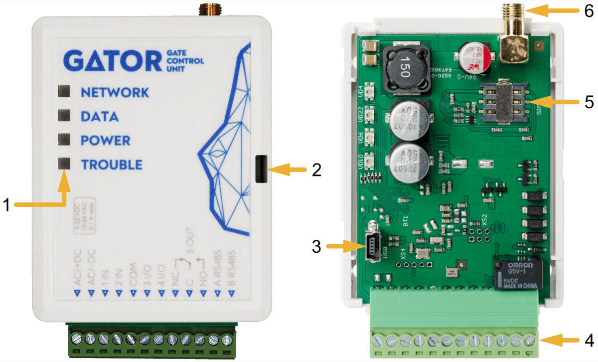
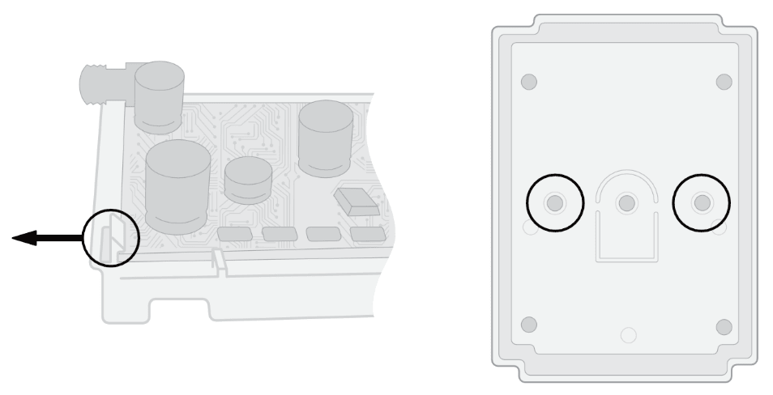
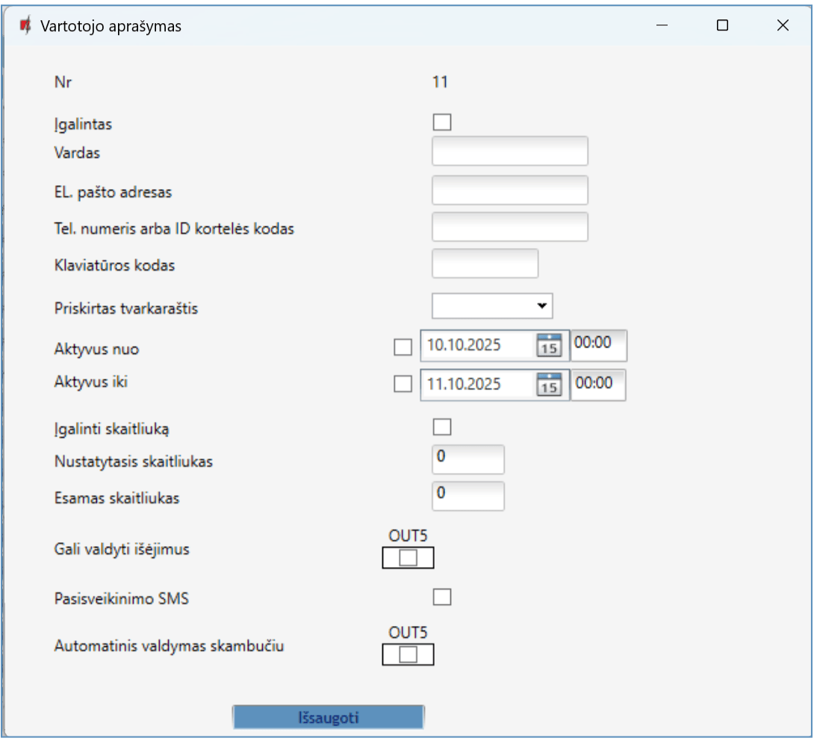

# GSM vartų valdiklis GATOR gali valdyti vartų automatiką ir kitą įrangą nuotoliniu būdu

  

##  Aprašymas 

GSM vartų valdiklis GATOR gali valdyti vartų automatiką ir kitą įrangą nuotoliniu būdu.

Valdiklį galima valdyti su Protegus2 programėle, telefono skambučiu ir SMS žinutėmis. Valdikliui galima įvesti 7 administratoriaus telefono numerius ir 1000 vartotojų telefono numerių. Valdikliui GATOR galima nustatyti vartotojų valdymo grafiką, nustatyti skaitliuką, kiek kartų vartotojas gali suvaldyti sistemą. GSM valdiklis gali siųsti SMS pranešimus apie įėjimų ir išėjimų suveikimus ir atsistatymus (SMS žinutės tekstą vartotojas gali keisti). Valdiklis gali siųsti pranešimus į saugos tarnybos imtuvą. Prijungus WiFi (W485) arba „Ethernet“ (E485) modulį prie valdiklio GATOR, galima siusti įvykių pranešimus ir valdyti valdiklį per bevielį arba laidinį interneto tinklą nenaudojant SIM kortelės mobiliųjų duomenų. Prijungus RF-LORA transiverį, prie valdiklio GATOR galima prijungti belaidį iO8-LORA plėtiklį (1 vnt.) ir belaidžius iO-LORA plėtiklius (iki 8 vnt.). RFID skaitytuvai prijungti prie belaidžių iO – LORA plėtimo modulių gali valdyti dar iki 8 durų (vartų valdiklio veikimo programos versija nuo 2.13). Vienas iO-LORA plėtiklis su vienų RFID skaitytuvu valdo tik vienas duris.

**Savybės**

Nuotolinis valdymas

- Mobiliąja / Interneto programėle *Protegus2*.

- SMS žinutėmis.

- Skambučiu.

Pranešimai vartotojams

- Siunčia pranešimus apie įvykius į *Protegus2* programėlę ir SMS pranešimais.

Pranešimai saugos tarnybai

- Contact ID kodais siunčia įvykių pranešimus į TRIKDIS programinius arba aparatūrinius imtuvus, kurie dirba su bet kuria pranešimų stebėjimo programa.

- Gali vienu metu siųsti įvykių pranešimus ir į saugos tarnybos imtuvą, ir veikti su *Protegus2* programėle.

- Nutrūkus ryšiui su pagrindiniu imtuvu, pranešimai automatiškai perduodami į atsarginį imtuvą.

Įėjimai ir išėjimai

- 2 įėjimai (IN), pasirenkamo tipo: NO; NC; EOL.

- 2 universalus įėjimai/išėjimai. Veikimo režimas nustatomas kaip įėjimas arba išėjimas.

- 1 išėjimas (OUT) - relė.

- Su iO-LORA plėtikliu galima papildomai pridėti vieną įėjimą ir vieną išėjimą (relinis kontaktas). Iš viso galima pridėti 8 iO- LORA plėtiklių (pridėti iki 8 papildomų įėjimų ir 8 papildomų išėjimų).

- Su iO8 arba iO8-LORA plėtikliu galima papildomai pridėti įėjimus ir išėjimus. Prie GATOR vartų valdiklio galima pridėti viena išplėtimo modulį iO8 arba iO8-LORA.

#### Nustatymai ir diegimas

- Greitas ir lengvas paleidimas veikti.

- Naujų vartotojų pridėjimas ir esamų pašalinimas naudojantis Protegus2 programėle (prisijungus administratoriaus teisėmis), SMS žinute, TrikdisConfig programa.

- Įrenginio konfigūravimas prijungus USB Mini-B kabeliu arba nuotoliniu būdu, naudojant TrikdisConfig programą.

- Nuotolinis programinės įrangos atnaujinimas.

- Du parametrų nustatymo lygiai (paskyros), instaliuotojui ir administratoriui.

### Techniniai parametrai 

| Parametras | Aprašymas |
|------------|-----------|
| 2G GSM modemo dažniai | 850 /​ 900 /​ 1800 /​ 1900 MHz |
| LTE modemo dažniai: EU (Europa) LA (Lotynų Amerika) | LTE-FDD: B1/​B3/​B5/​B7/​B8/​B20/​B28 LTE-FDD: B2/​B3/​B4/​B5/​B7/​B8/​B28/​B66 |
| Maitinimo įtampa | 9-32 V nuolatinės srovės 12-24 V kintamos srovės |
| Naudojama srovė | 100 mA |
| Įėjimas | 2 vnt., nustatomas tipas: NC, NO, EOL=10 kΩ |
| Universalus įėjimas/​išėjimas | 2 vnt., nustatomas arba įėjimas IN, kurio tipas: NC, NO, EOL=10 kΩ, arba išėjimas OUT (atviras kolektorius (OC) 50 mA) |
| Išėjimas | 1 vnt., relė, 1 A 30 V nuolatinės srovės, 0,5 A 125 V kintamos srovės |
| Neišsiųstų įvykių atmintis | Iki 60 įvykių |
| Įvykių žurnalo atmintis | Iki 5000 įvykių |
| Vartotojai, kurie gauna pranešimus ir gali valdyti | 7 |
| Vartotojai, kurie gali valdyti | 1000 |
| Darbinė aplinka | Temperatūra nuo –20 °C iki +50 °C, santykinis oro drėgnumas 80 %, kai temperatūra siekia +20 °C |
| Matmenys | 92 x 62 x 26 mm |
| Svoris | 80 g |

### Valdiklio elementai 

1.  Šviesos indikatoriai.

2.  Priekinio dangtelio atidarymo plyšys.

3.  USB Mini-B jungtis valdikliui programuoti.

4.  Gnybtai laidų prijungimui.

5.  Nano-SIM kortelės laikiklis.

6.  GSM antenos SMA jungtis.

### Išorinių kontaktų paskirtis 

| Gnybtas | Aprašymas |
|---------|-----------|
| AC/​+DC | Maitinimo gnybtas (9-32 V nuolatinės srovės teigiamas gnybtas;​ 12-24 V kintamos srovės) |
| AC/​-DC | Maitinimo gnybtas (9-32 V nuolatinės srovės neigiamas gnybtas;​ 12-24 V kintamos srovės) |
| 1 IN | 1 įėjimo gnybtas, pasirenkamo tipo NO, NC, EOL (gamyklinis nustatymas NO) |
| 2 IN | 2 įėjimo gnybtas, pasirenkamo tipo NO, NC, EOL (gamyklinis nustatymas Išjungta) |
| COM | Bendrasis gnybtas |
| 3 I/​O | Įėjimo/​išėjimo gnybtas (gamyklinis nustatymas – Išjungta) |
| 4 I/​O | Įėjimo/​išėjimo gnybtas (gamyklinis nustatymas – Išjungta) |
| NC | Relės gnybtas NC |
| C | Relės gnybtas C |
| NO | Relės gnybtas NO |
| A RS485 | RS485 magistralės A kontaktas |
| B RS485 | RS485 magistralės B kontaktas |

### Šviesinė veikimo indikacija 

| Indikatorius | Veikimas | Aprašymas |
|--------------|----------|-----------|
| NETWORK / (Tinklas) | Šviečia žaliai | Prisijungta prie GSM tinklo |
| NETWORK / (Tinklas) | Mirksi geltonai | GSM signalo stiprumas nuo 0 - 5. Pakankamas 3. |
| DATA / (Duomenys) | Šviečia žaliai | Siunčiamas pranešimas |
| DATA / (Duomenys) | Šviečia geltonai | Yra neišsiųstų įvykių pranešimų buferinėje atmintyje |
| POWER / (Maitinimas) | Mirksi žaliai | Maitinimo įtampa gera |
| POWER / (Maitinimas) | Mirksi geltonai | Maitinimo įtampos žemas lygis |
| POWER / (Maitinimas) | Mirksi žaliai ir geltonai | Įjungtas konfigūravimo režimas |
| TROUBLE / (Nesklandumas) | Nešviečia ir nemirksi | Veikia be nesklandumų |
| TROUBLE / (Nesklandumas) | 1 mirktelėjimas | Nėra SIM kortelės |
| TROUBLE / (Nesklandumas) | 2 mirktelėjimai | Neteisingas SIM kortelės PIN kodas |
| TROUBLE / (Nesklandumas) | 3 mirktelėjimai | Nepavyksta prisijungti prie GSM tinklo |
| TROUBLE / (Nesklandumas) | 4 mirktelėjimai | Nepavyksta prisijungti prie Protegus2 programėlės arba IP imtuvo pirminiu kanalu |
| TROUBLE / (Nesklandumas) | 5 mirktelėjimai | Nepavyksta prisijungti prie IP imtuvo atsarginiu kanalu |
| TROUBLE / (Nesklandumas) | 6 mirktelėjimai | Nenustatytas vidinis laikrodis |
| TROUBLE / (Nesklandumas) | 7 mirktelėjimai | Nepakankama maitinimo įtampa |

Jeigu LED indikacija visai nešviečia, patikrinkite maitinimo šaltinį ir sujungimus.

!!! note
    Prieš pradėdami įrengimą patikrinkite, ar turite visus reikiamus
    komponentus:
    
    1.  USB Mini-B tipo kabelį, reikalingas konfigūravimui.
    
    2.  Mažiausiai 4 gyslų kabelį valdiklio prijungimui.
    
    3.  Plokščią 2,5 mm atsuktuvą.
    
    4.  Išorinę GSM anteną, jeigu vietoje silpnas ryšys.
    
    5.  Aktyvuotą nano-SIM kortelę (PIN kodo reikalavimas gali būti
        išjungtas).
    
    6.  Vartų automatikos instrukcija, prie kurios bus jungiamas GSM vartų
        valdiklis.
    
    Trūkstamus komponentus užsisakykite atskirai iš savo vietinio
    platintojo.
### GSM vartų valdiklio *GATOR* pakuotės turinys 

|  \- | GSM vartų valdiklis GATOR | 1 vnt. |
|----:|---------------------------------|--------|
|  \- | GSM antena                      | 1 vnt. |
|  \- | Rezistorius 10 kΩ               | 3 vnt. |
|  \- | Dvipusė lipni juostelė (5 cm)   | 1 vnt. |
|  \- | Varžtas                         | 2 vnt. |

## GSM vartų valdiklio laidinių sujungimų schemos 

### Tvirtinimas

1.  Nuimkite viršutinį dangtelį. Ištraukite kontaktų kaladėlės kištukinę dalį.

2.  Išimkite plokštę.

3.  Korpuso pagrindą varžtais pritvirtinkite pageidaujamoje vietoje.

4.  Atgal surinkite plokštę ir kontaktinę kaladėlę.

5.  Prisukite GSM anteną.

6.  Įstatykite nano-SIM kortelę.

7.  Uždarykite viršutinį dangtį.

### Maitinimo prijungimo schema 

Laidais sujunkite valdiklį GATOR pagal pateiktą sujungimų schemą.

### Zonų laidinių įėjimų sujungimų schemos 

Valdiklis GATOR turi keturis įėjimus IN (du iš kurių yra universalūs ir gali veikti kaip įėjimai arba išėjimai) įvairiems signalizacijos jutikliams prijungti. Įėjimai gali veikti NC, NO, EOL režimais. Prijunkite įėjimus pagal nustatytą įėjimo tipą (NC, NO, EOL), kaip tai pavaizduota žemiau pateiktose schemose:

### Relės prijungimo schema

Relės prijungimo schema, kai valdiklio *GATOR* maitinamas nuo nuolatinės srovės maitinimo šaltinio. Nuotoliniu būdu su relės kontaktais galima valdyti (įjungti/išjungti) įvairius elektrinius prietaisus. Valdiklio universaliam įėjimo/išėjimo (I/O) gnybtui turi būti nustatytas išėjimo OUT veikimo režimas.

### Valdiklio ir vartų automatikos prijungimo schema 

Visi laidų prijungimo darbai atliekami tik atjungus maitinimo įtampą. / Vartų automatikos instrukcijoje yra detaliai aprašyta gnybtų paskirtis ir jų įtampa. / Vartų automatikos gnybtai IN, COM skirti vartų valdymui. / Vartų automatika turi vartų padėties išėjimą (OUT), kuris parodo kada vartai yra uždaryti arba atidaryti. Vartų padėties išėjimas gali būti įtampinis arba relinis. Schemoje pavaizduotas relės K1 prijungimas prie įtampinio vartų automatikos išėjimo. Vartų automatikos išėjimo įtampiniai gnybtai (OUT, N) turi įtampą (~230V) kai vartai atviri. Tarpinė relė K1 suveikia kai vartai atviri ir valdiklio *GATOR* 1IN įėjimas aktyvuojamas. Pagal *GATOR* 1IN įėjimo būseną turime tikslią informaciją apie vartų padėti (kada vartai yra uždaryti arba atidaryti).

GATOR konfigūravimą su vartų būsenos indikacija žr. p. 5.9 „Nustatymai vartų būsenos indikacijai“.

### RFID skaitytuvo (Wiegand 26/34) prijungimo schema 

Valdiklio GATOR konfigūravimas su RFID skaitytuvu aprašytas p. 5.3. „Langas „IN/OUT“.

Valdiklio GATOR ir vieno RFID skaitytuvo prijungimo schema.

Programoje TrikdisConfig būtina pažymėti, kad bus naudojamas vienas RFID skaitytuvas ir „Išėjimo“ mygtukas. Paspaudus „Išėjimo“ mygtuką, vartų valdiklio išėjimas 5OUT suveiks nustatytai impulso trukmei. Kai mygtukas „Išėjimas“ nėra prijungtas prie valdiklio, tai nereikia žymėti lauko „**IO3 kaip išėjimo mygtukas**“**.**

Valdiklio GATOR ir dviejų RFID skaitytuvų prijungimo schema.

Kai prie valdiklio yra prijungti du RFID skaitytuvai, tai programoje TrikdisConfig reikia tai nurodyti, kad bus naudojami du RFID skaitytuvai.

### WiFi modulio W485 prijungimo schema 

Vartų valdiklio veikimo programos versija nuo 1.06. / Modulis *W485* skirtas įvykių siuntimui ir valdymui naudojant WiFi interneto ryšį. Naudojant *W485* kartu su valdikliu pranešimai į CSP ir į *Protegus2* programėlę siunčiami WiFi interneto tinklu ir mobilus internetas nenaudojamas. Jei sutrinka WiFi ryšys duomenys perduodami per mobilųjį internetą. Atsistačius WiFi ryšiui, valdiklis pradeda toliau siusti pranešimus per *W485*. / Valdiklio konfigūravimas su WiFi moduliu *W485* aprašytas p. 5.4. „Langas „Moduliai“. / Naudojant modulį *W485* kartu su valdikliu SIM kortelė nebūtina.

### „Ethernet“ modulio E485 prijungimo schema

Vartų valdiklio veikimo programos versija nuo 1.06. / Modulis *E485* skirtas įvykių siuntimui ir valdymui naudojant laidinį interneto ryšį. Naudojant *E485* kartu su valdikliu pranešimai į CSP ir į *Protegus2* programėlę siunčiami laidiniais interneto tinklais ir mobilusis internetas nenaudojamas. Jei sutrinka laidinis interneto tinklas duomenys į CSP perduodami per mobilųjį internetą. Atsistačius laidinio interneto tinklui, valdiklis pradeda toliau siusti pranešimus per *E485*. / Valdiklio konfigūravimas su „Ethernet“ moduliu *E485* aprašytas p. 5.4. „Langas „Moduliai“. / Naudojant modulį *E485* kartu su valdikliu SIM kortelė nebūtina.

### Plėtiklio iO-LORA su RFID skaitytuvu prijungimo schema 

Vartų valdiklio veikimo programos versija nuo 2.13.

Prijunkite RF-LORA transiverį prie GATOR. Po to galite naudoti iO-LORA plėtiklį, prie kurio prijungtas RFID skaitytuvas (Wiegand 26/34). RFID skaitytuvas valdo iO-LORA PGM išėjimą, prie kurio jis prijungtas.

Paleiskite TrikdisConfig. Prijunkite GATOR per USB Mini-B kabelį prie kompiuterio arba nuotoliniu būdu. Spustelkite programos TrikdisConfig mygtuką **Skaityti [F4]**, kad ji pateiktų esamas valdiklio veikimo parametrų reikšmes. Jei programa pareikalaus, iššokusiame langelyje įveskite administratoriaus arba montuotojo kodą. "**Modulių**" sąraše išsirinkite "**iO-LORA valdiklis**". Lauke "**Serijos Nr.**" įrašykite gaminio serijos numerį.

"**IN/OUT**" sąraše „**6IN**“ nustatykite „**Išėjimo mygtukas**“. Paspaudus „**Išėjimo**“ mygtuką, iO-LORA išėjimas „**7OUT**“ suveiks nustatytai impulso trukmei.

Sąraše "**Vartotojai**" įrašykite RFID kortelės numerį, vartotojo vardą, įjunkite leidimą valdyti PGMą, nurodykite valdoma PGMą, kodą. Atlikus pakeitimus nuspauskite **Įrašyti [F5]**. Palaukite, kol bus atlikti atnaujinimai. Nuspauskite "**Atsijungti**" ir atjunkite USB kabelį.

Suveikdinkite su RFID kortele/kodu PGM išėjimą. Paspauskite išėjimo mygtuką (turi suveikti PGM išėjimas).

### Plėtiklio iO8, iO8-LORA prijungimo schema 

Jei reikia, kad vartų valdiklis *GATOR* turėtų daugiau įėjimų IN arba išėjimų OUT, prijunkite TRIKDIS *iO8* arba *iO8-LORA* serijos įėjimų ir išėjimų plėtiklį. Prie *GATOR* galima prijungti vieną *iO8* arba *iO8-LORA* plėtiklį. / *iO8* plėtiklio prijungimo schema.

iO8-LORA plėtiklio prijungimo schema.

## Greitas valdiklio paleidimas veikti 

!!! note
    Valdiklis yra gamykliškai sukonfigūruotas veikti. Paskambinus į
    valdiklio SIM kortelės numerį iš bet kurio telefono, 3 (trims) sekundėms
    įjungiamas 5 OUT relinis išėjimas. Jei toks valdiklio veikimas tinka, jį
    galite įrengti papildomai nekonfigūruojant.
1.  Į valdiklį turi būti įstatyta nano-SIM kortelė. Išjunkite SIM kortelės PIN kodo užklausą prieš įstatydami ją į valdiklį.

2.  Prijunkite maitinimo šaltinį prie valdiklio (žr. p. 2 „GSM vartų valdiklio GATOR laidinių sujungimų schemos”).

3.  Įjunkite maitinimą valdikliui. Turi užsidegti ši valdiklio šviesinė indikacija:

- „POWER” indikatorius mirksi žaliai;

- „NETWORK” indikatorius šviečia žaliai ir mirksi geltonai.

Gamykliniai nustatymai leidžia valdyti visiems, kurie paskambina į valdiklį įstatytos SIM kortelės telefono numeriu.

Nusiuntus SMS komandą su pirmojo naudotojo numeriu į valdiklį vartotojų telefonų sąrašą (SMS komandos pvz.: ***SETU 123456 +370xxxxxxxx#Petras**)* valdiklis reaguos tik sąraše esančių numerių skambučius. Valdiklis ignoruos skambučius iš kitų numerių.

!!! note
    Jei norite pakeisti gamyklinius nustatymus arba įjungti kitas valdiklio
    funkcijas, skaitykite skyrių 5 „Veikimo parametrų nustatymas programa
    TrikdisConfig".
## Nuotolinis valdymas 

### Valdymas skambučiu 

!!! note
    Pirmasis paskambinęs į valdiklį (arba nusiuntęs SMS) taps sistemos
    administratoriumi ir vienintelis galės administruoti ir valdyti valdiklį
    su SMS komandomis.
Paskambinkite į įdėtos SIM kortelės telefono numerį. Valdiklis automatiškai atmeta skambutį ir 3 (trims) sekundėms įjungiamas *<u>5 OUT</u>* relinis išėjimas. Gamykliniai nustatymai leidžia valdyti visiems, paskambinusiems į valdiklio SIM kortelės numerį.

### Valdymas telefono klaviatūra 

Valdiklis GATOR atsiliepia ir leidžia išėjimus valdyti skambučiu, kai vartotojui priskirti valdyti keli išėjimai OUT. Kaip suvaldyti skambučiu:

1.  Paskambinkite valdiklio SIM kortelės numeriu. Valdiklis pakels ragelį.

2.  Telefono klaviatūra surinkite valdymo komandą (komandos pavyzdžius rasite lentelėje **DTMF valdymo komandos**).

#### DTMF valdymo komandos (neveikia su GV17_2E70, GV17_2S70 gaminiais)

| DTMF kodas | Funkcija | Aprašymas |
|------------|----------|-----------|
| OUTPUT*STATE# | Išėjimo valdymas | Išėjimo valdymo komanda (įjungti/išjungti; įjungti/išjungti impulso trukmei). OUTPUT – valdomo išėjimo numeris. STATE – valdymo komanda: 0 – išjungti išėjimą; 1 – įjungti išėjimą; 2 – išjungti išėjimą impulso trukmei; 3 – įjungti išėjimą impulso trukmei; (išėjimo impulso trukmė nustatoma programoje TrikdisConfig, įėjimų/išėjimų nustatymų lentelėje) # - valdymo komandos užbaigimo ženklas. Pvz. (įjungti 5 išėjimą): 5*1# Pvz. (įjungti 4 išėjimą impulso trukmei): 4*3# |
| # | Komandos užbaigimo ženklas | Jei rašydami komandą suklydote, nuspauskite # ir pradėkite rašyti valdymo komandą iš naujo. |

### Valdymas su *Protegus2* programėle 

Su programėle vartotojai galės valdyti valdiklį nuotoliniu būdu. Jie taip pat matys sistemos būseną ir gaus visus sistemos įvykių pranešimus.

1.  Parsisiųskite ir paleiskite Protegus2 programėlę arba naudokite versiją naršyklėje [www.protegus.app](https://www.protegus.app)<u>.</u>

    

      
      
      
    

2.  Prisijunkite savo vartotojo vardu ir slaptažodžiu arba registruokitės ir susikurkite naują paskyrą.

!!! note
    Pridėjimo prie programėlės metu valdiklis turi būti:
    
    1.  Įjungta „Protegus servisas" paslauga. Paslaugos
        įjungimas aprašytas skyriuje 5.5 „Langas „IP pranešimai"";
    
    2.  Įjungtas maitinimas („**POWER**" LED mirksi žaliai);
    
    3.  Prisiregistravęs prie tinklo („**NETWORK**" LED šviečia žaliai ir
        mirksi geltonai).
3. Paspauskite “**Pridėti sistemą**”.

4. Įveskite „**Unikalus ID**“ (IMEI) numerį. Jį rasite ant gaminio ir pakuotės lipduko. Įvedę, paspauskite „**Toliau**“.

5. Įveskite sistemos „**Pavadinimą**“. Spustelėkite „**Toliau**".

6. Spustelėkite „**Praleisti**".

7. Palaukite 1 minute.

8. Suvaldykite PGM išėjimą paspausdami ikoną „**Output5**“.

### Widget pridėjimas telefone 

Vartų valdymo Widget galima įkelti į telefono ekraną. Valdiklis turi būti priregistruotas programėlėje Protegus2. Telefone prisijunkite prie programėlės Protegus2. Uždarykite programėlės langą.

Pridėkite pirštą prie ekrano ir palaikykite. Atsiras parinkčių juosta. / 1. Nuspauskite „**Widgets**“.

Suraskite parinkčių juostoje Protegus2.

1.  Nuspauskite Protegus2.

2. Nuspauskite „**Switch Protegus2**“.

3. Pasirinkite valdiklio „**Gator Output5**“**.**

2.  Nuspauskite „**Pridėti valdiklį**“.

3. Telefono ekrane atsiras ikona.

4. Pereikite prie normalaus ekrano. Spustelkite ikoną.

Ekrane atsiras apskritimas, kuriame bus atvaizduotas PGM suveikimas.

5. Kai valdiklis prijungtas prie vartų automatikos su vartų būsenos indikacija, tai ikona atvaizduos atvirų/uždarų vartų būseną.

### Vartotojų pridėjimas telefone 

Paleiskite Protegus2 programėlę telefone. Prisijunkite savo vartotojo vardu ir slaptažodžiu.

1.  Nuspauskite „**Nustatymai**“**.**

1.  Nuspauskite „**Sistemos konfigūracija**“.

2. Nuspauskite „**Vartotojai**“.

3. Nuspauskite „**Pridėti naują vartotoją**“.

4. Įveskite vartotojo el. pašto adresą.

2.  Įveskite vartotojo vardą.

3.  Įveskite vartotojo telefono numerį.

4.  Pažymėkite PGM išėjimą, kurį valdys vartotojas.

5.  Nuspauskite „**Pridėti vartotoją**“.

10. Vartotojų sąraše atsiras naujas vartotojas.

11. Nuspauskite „**Atgal**“, kad sugrįžti į pagrindinį langą.

### Valdymas SMS žinutėmis 

Valdykite relinį OUT5 išėjimą su šiomis SMS komandomis:

**OUTPUT5 xxxxxx ON**

**OUTPUT5 xxxxxx OFF**

**OUTPUT5 xxxxxx PULSE=002**

| xxxxxx | 6-ženklis administratoriaus slaptažodis. (gamyklinis kodas – 123456). |
|--------|-----------------------------------------------------------------------|
| ON | Įjungti išėjimą. |
| OFF | Išjungti išėjimą. |
| PULSE=ttt | Įjungti išėjimą tam tikram laikui. “ttt” yra impulso trukmė sekundėmis. |

Su SMS galite valdyti kitus išėjimus, kurios reikia įgalinti TrikdisConfig.

SMS valdymo komandų sąrašas

| Komanda | Duomenys | Paaiškinimas |
|---------|----------|--------------|
| OUTPUTx | ON | Įjungti išėjimą. „x“ – išėjimo numeris. Pvz.: OUTPUT5 123456 ON |
| OUTPUTx | OFF | Išjungti išėjimą. „x“ – išėjimo numeris. Pvz.: OUTPUT5 123456 OFF |
| OUTPUTx | PULSE=ttt | Įjungti išėjimą tam tikram laikui. „ttt“ yra impulso trukmė sekundėmis, nuo 1 iki 999. Pvz.: OUTPUT5 123456 PULSE=002 |

### Administravimas SMS žinutėmis 

1.  **Pakeiskite administratoriaus slaptažodį**

Saugumui užtikrinti, pakeiskite gamyklinį administratoriaus SMS slaptažodį. Nusiųskite tokio formato SMS žinutę:

#### PSW 123456 xxxxxx

| 123456 | Gamyklinis administratoriaus slaptažodis. |
|--------|-------------------------------------------|
| xxxxxx | Naujasis 6-ženklis administratoriaus slaptažodis. |

1.  **Leiskite valdyti tik tam tikriems asmenims**

Galite leisti sistemą valdyti tik tam tikriems asmenims. Iš administratoriaus telefono nusiųskite SMS žinutes su asmenų telefonų numeriais ir vardais:

#### SETU xxxxxx +PHONENo#NAME#EMAIL

| xxxxxx | 6-ženklis administratoriaus slaptažodis. |
|--------|------------------------------------------|
| PHONENo | Naudotojo telefono numeris. |
| NAME | Naudotojo vardas. |
| EMAIL | Naudotojo el. paštas. |

Įrašius pirmojo naudotojo numerį į valdiklio vartotojų telefonų sąrašą, valdiklis reaguos tik į skambučius į sąrašą įrašytų numerių. Valdiklis ignoruos skambučius iš kitų numerių.

1.  **Suteikite sistemos administravimo teises kitam asmeniui**

Galite suteikti administratoriaus teises kitiems asmenims. Jie gaus sistemos informacinius pranešimus ir galės pridėti vartotojus. Nusiųskite tokio formato SMS žinutę:

#### SETA xxxxxx Nox=+PHONENo#NAME#EMAIL

| xxxxxx | 6-ženklis administratoriaus slaptažodis. |
|--------|------------------------------------------|
| Nox | x – administratoriaus numeris sąraše. (Įrašę 1, perleisite administratoriaus teises kitam asmeniui.) |
| PHONENo | Naudotojo telefono numeris. |
| NAME | Naudotojo vardas. |
| EMAIL | Naudotojo el. paštas. |

SMS konfigūravimo komandų sąrašas

| Komanda | Duomenys | Paaiškinimas |
|---------|----------|--------------|
| INFO |  | Užklausa apie valdiklį. Atsakyme bus rodomas: valdiklio tipas, IMEI numeris, GSM signalo lygis, maitinimo įtampos dydis, programinės įrangos versija, serijos numeris, data ir laikas. Pvz.: INFO 123456 |
| ASKI |  | Įėjimų būsenos užklausa. Pvz.: ASKI 123456 |
| ASKO |  | Išėjimų būsenos užklausa. Pvz.: ASKO 123456 |
| SETA | NoX=phoneNo#name#email | Įtraukti administratorių į sąrašą. Į nurodytą eilutę įrašo telefono numerį, vartotojo vardą ir e-mail. Būtina numerį atskirti nuo vardo grotelėmis (#). Numeris turi būtinai prasidėti „+“ ir tarptautiniu kodu. Pvz.: SETA 123456 No3=+37061234567#Jonas#jonas@trikdis.lt |
| SETA | NoX=DEL | Iš nurodytos vietos ištrina telefono numerį ir vartotojo vardą. Pvz.: SETA 123456 No2=DEL |
| SETU | phoneNo#name#email | Įtraukti naują vartotoją. Įrašo telefono numerį, vartotojo vardą ir e-mail. Būtina numerį atskirti nuo vardo grotelėmis (#). Numeris turi būtinai prasidėti „+“ ir tarptautiniu kodu. Pvz.: SETU 123456 +37061234567#Petras#petras@trikdis.lt |
| DELU | phoneNo | Ištrinti vartotoją pagal jo telefono numerį. Pvz.: DELU 123456 +37061234567 |
| DELU | name | Ištrinti vartotoją pagal jo vartotojo vardą. Pvz.: DELU 123456 Petras |
| DELU | email | Ištrinti vartotoją pagal jo e-mail. Pvz.: DELU 123456 petras@trikdis.lt |
| SETB | Email/phoneNo | Pridėti įrašą į juodąjį sąrašą (e-mail; telefono Nr.). Pvz.: SETB 123456 petras_S@trikdis.lt Pvz.: SETB 123456 +37060123456 |
| DELB | ALL | Trinti visa juodąjį sąrašą. Pvz.: DELB 123456 ALL |
| DELB | Email/phoneNo | Trinti konkretų įrašą iš juodojo sąrašo (e-mail svarbu didžiosios ir mažosios raidės). Pvz.: DELB 123456 petras_S@trikdis.lt Pvz.: DELB 123456 +37060123456 |
| RESET |  | Valdiklio paleidimas iš naujo. Pvz.: RESET 123456 |
| PSW | Naujas slaptažodis | Slaptažodžio keitimas. Pvz.: PSW 123456 654123 |
| TXTA | Object name | Objekto vardo įrašymas. Pvz.: TXTA 123456 Namas |
| TXTE | N1= / …… / N5= | Nustatyti SMS tekstą apie suaktyvintą įėjimą ar išėjimą. N1…N5 yra kaladėlės gnybto numeris. Pvz.: TXTE 123456 N1=Aliarmas svetainėje |
| TXTR | N1= / …… / N5= | Nustatyti SMS tekstą apie įėjimo ar išėjimo atsistatymą. N1…N5 yra kaladėlės gnybto numeris. Pvz.: TXTR 123456 N5=Relė išjungta |
| SETD | IDx=yy | Nustatyti „x“ įėjimo neaktyvumo laiką. „yy“ yra neaktyvumo laikas minutėmis, nuo 0 iki 2880. Suaktyvinus įėjimą, valdiklis išsiųs pranešimą ir nereaguos į tolesnius grandinės pažeidimus per nustatytą neaktyvumo laiką. Įrašius 0, neaktyvumas bus išjungtas. Pvz.: SETD 123456 ID1=30 |
| RESD | IDx | Atnaujina „x“ įėjimo neaktyvumo laiką, jei jis buvo pradėtas skaičiuoti. Pvz.: RESD 123456 ID1 |
| TIME | YYYY/MM/DD, / HH:mm:ss | Datos ir laiko nustatymas. Pvz.: TIME 123456 2025/05/09,10:03:00 |
| RDR | PhoneNO#SMStext | Peradresuoja SMS tekstą nurodytu telefono numeriu. Pvz.: RDR 123456 +37061234567#papildyti sąskaitą 10EUR |
| HELLO | ON | Įgalinkite naujo vartotojo informavimą SMS žinute apie jo pridėjimą prie vartų valdiklio per Protegus2 programėlę arba SMS žinutę. Pvz.: HELLO 123456 ON |
| HELLO | OFF | Išjungti funkciją informuoti naują vartotoją SMS žinute apie jo pridėjimą prie vartų valdiklio per Protegus2 programėlę arba SMS žinutę. Pvz.: HELLO 123456 OFF |
| NATH | ON | Įjungti „Not authorized“ veikimo režimą, nekeičiant kitų parametrų. Pvz.: NATH 123456 ON Kai valdiklis valdo kelis PGM išėjimus, tai SMS būtu toks (įjungia „Not authorized“ ir nurodytus PGM išėjimus, o likusius PGM išėjimus išjungia): Pvz.: NATH 123456 ON=5,7,22 |
| NATH | OFF | Išjungti „Not authorized“ veikimo režimą. Pvz.: NATH 123456 OFF |
| UUSD | *UUSD code# | Nusiunčia UUSD kodą ryšio operatoriui. Su operatoriaus nurodytais UUSD kodais galima pasitikrinti arba papildyti SIM kortelės sąskaitą, atlikti kitus veiksmus. Pvz.: UUSD 123456 *245# |
| CONNECT | Protegus=ON | Prisijungti prie Protegus cloud. Pvz.: CONNECT 123456 PROTEGUS=ON |
| CONNECT | Protegus=OFF | Atsijungti nuo Protegus cloud. Pvz.: CONNECT 123456 PROTEGUS=OFF |
| CONNECT | APN=Internet | APN vardas. Pvz.: CONNECT 123456 APN=INTERNET |
| CONNECT | USER=user | APN naudotojas. Pvz.: CONNECT 123456 USER=User |
| CONNECT | PSW=password | APN slaptažodis. Pvz.: CONNECT 123456 PSW=password |
| CONNECT | Code=password | Pakeisti Protegus Cloud prisijungimo slaptažodį. Pvz.: CONNECT 123456 Code=123456 |

## Veikimo parametrų nustatymas programa *TrikdisConfig* 

Su TrikdisConfig galite pakeisti valdiklio nustatymus (jei gamyklinių nustatymų nepakanka) pagal žemiau pateiktus programos langų aprašymus.

1.  Parsisiųskite konfigūravimo programą TrikdisConfig iš [www.trikdis.com/lt](http://www.trikdis.com/lt)/ (programą rasite paieškos lauke, surinkę „TrikdisConfig“) ir ją įdiekite.

2.  Plokščiu atsuktuvu nuimkite valdiklio dangtelį, kaip parodyta žemiau:

1.  Su USB Mini-B kabeliu prijunkite valdiklį prie kompiuterio.

2.  Paleiskite konfigūravimo programą TrikdisConfig. Programa automatiškai atpažins prijungtą gaminį ir automatiškai atidarys valdiklio konfigūravimo langą.

3.  Spustelkite programos mygtuką **Skaityti [F4]**, kad ji pateiktų esamas valdiklio veikimo parametrų reikšmes. Jei reikalaujama, įveskite administratoriaus arba instaliuotojo kodą iššokančiame lange.

!!! note
    Nuspaudus mygtuką **Skaityti [F4]**, programa nuskaitys ir parodys
    nustatymus, kurie yra įrašyti įrenginyje. / Nuspaudus mygtuką **Įrašyti
    [F5]**, į valdiklį bus įrašyti programoje padaryti
    nustatymai. / Nuspaudus mygtuką **Išsaugoti [F9]**, padaryti
    nustatymai bus išsaugoti konfigūravimo byloje. Išsaugotus nustatymus
    vėliau galėsite įkelti į kitus įrenginius. Tai leidžia greitai
    konfigūruoti keletą gaminių su vienodais nustatymais. / Nuspaudus
    mygtuką **Atverti [F8]** ir pasirinkus konfigūravimo bylą programoje
    bus atverti ir parodyti išsaugoti nustatymai. / Norėdami atkurti
    gamyklinius nustatymus, paspauskite **Atkurti** mygtuką lango apačioje
    kairėje.
### TrikdisConfig būsenų juosta 

Prijungus valdiklį prie programos TrikdisConfig, programa būsenų juostoje pateiks informaciją apie prijungtą gaminį:

| Pavadinimas | Aprašymas |
|-------------|-----------|
| IMEI/​Unikalus ID | Gaminio IMEI numeris |
| Būsena | Darbinė būsena |
| Įrenginys | Gaminio tipas (turi rodyti GV17_xxxx) |
| SN | Gaminio serijinis numeris |
| BL | Paleidyklės versija |
| FW | Gaminio programinės įrangos versija |
| HW | Gaminio aparatinės įrangos versija |
| Būsena | Sujungimo su programa būdas (per USB arba nuotolinis) |
| Teisės | Prieigos lygis (rodomas po to, kai patvirtintas prieigos kodas) |

Paspaudus mygtuką **Skaityti [F4]**, programa nuskaitys ir parodys nustatymus, kurie yra įrašyti į valdiklį. Su TrikdisConfig nustatykite reikiamus nustatymus pagal žemiau pateiktus programos langų aprašymus.

### Langas „Sistemos parinktys“ 

**Parinkčių grupė „Pagrindiniai“**

- **Objekto numeris** – įveskite objekto numerį (4 simbolių šešioliktainis skaičius, 0-9, A-F. **Nenaudokite FFFE, FFFF objekto numerių**.).

- **Objekto pavadinimas** – kiekvienas pranešimas bus siunčiamas su objekto pavadinimu.

- **Laiko nustatymas** – pasirinkite šaltinį, pagal kurį būtų nustatomas laikas.

- **Laiko sinchronizavimas pagal SMS** - pažymėkite langelį ir įveskite valdiklio telefono SIM kortelės numerį. Telefono numeris turi būti su tarptautiniu kodu.

- **Administratoriaus kodas** – šiuo kodu prisijungusiam leidžiama keisti visus valdiklio veikimo parametrus.

- **Pavadinimų kalba** – SMS pranešimai siunčiami pasirinktos kalbos rašmenimis.

- **Padėti ragelį po** – valdiklis atmeta skambutį po nurodyto laiko trukmės.

- **Modemo perkrovimas** – galima nustatyti gamino modemo perkrovimą nustatytu metu.

**Parinkčių grupė „Periodinis testas“**

- **Įgalinti testą** – pažymėjus langelį, įjungiamas periodinio testo pranešimo siuntimas.

- **Testo periodas** – nustatomas testo siuntimo laiko periodas.

- **Pradėti testą** – nurodomas testo pradžios laikas.

- **SMS žinutės tekstas** – įrašomas testo SMS žinutės tekstas.

- **Į mobiliąją aplikaciją** – pažymėjus lauką, testo pranešimas bus siunčiamas į Protegus2 programėle.

**Parinkčių grupė „SIM“**

- **SIM PIN kodas** – įveskite SIM kortelės PIN kodą.

- **APN** – įveskite APN pavadinimą. **Auto** – jei laukelis pažymėtas, SIM kortelė automatiškai ieškos APN pagal vidinį sąrašą Vidiniame sąraše yra kelių globalių mobiliojo ryšio operatorių APN ir kelių šalių vidaus mobilaus ryšio operatorių APN. Jei mobiliojo tinklo operatorius nebus rastas, bus naudojama laukelyje įvesta APN reikšmė.

- **Vartotojas** – jei reikalaujama, įveskite vartotojo vardą.

- **Slaptažodis** – jei reikalaujama, įveskite slaptažodį.

- **Operatoriaus kodas** – jei laukelyje bus įvestas kodas, valdiklis jungsis tik prie parinkto mobilaus tinklo operatoriaus. Mobilaus tinklo operatoriaus kodas sudarytas iš MCC + MNC kodų. Šis nustatymas aktualus globalioms SIM kortelėms.

**Parinkčių grupė „Laiko juosta“**

Protegus2 galite nustatyti esama savo šalies laiką. Norėdami tai padaryti, turite nurodyti savo šalies laiko juostą ir nurodyti, ar jūsų šalyje yra taikomas vasaros laikas.

- **Laiko juosta (val.)** – pažymėkite langelį ir įveskite savo šalies laiko juostą.

- **Vasaros laikas persukimas** - pažymėkite langelį, jei jūsų šalyje yra taikomas vasaros laikas.

**Parinkčių grupė „SMS atsakymo tekstai“**

- **Forsuoti pasisveikinimo žinutę** – pažymėkite lauką varnele, kad prie valdiklio naujam pridėtam su SMS žinute arba su programėle Protegus2 vartotojui būtų išsiųsta SMS žinutė. (Šią funkciją galima išjungti SMS žinute (HELLO 123456 OFF)).

### Langas „IN/OUT“ 

**Skirtukas „IN/OUT“**

- **Išvadai** – nurodyti valdiklio įėjimų ir išėjimų gnybtų numeriai.

- **Paskirtis** – nurodyti gnybtų tipai (išjungta, įėjimas, išėjimas).

- **Pavadinimas** - įrašykite įėjimo IN arba išėjimo OUT pavadinimą.

- **Įvykio SMS tekstas** – įrašomas SMS žinutės įvykio tekstas.

- **Grįžties įvykio SMS tekstas** – įrašomas SMS žinutės tekstas įvykus grįžties įvykiui.

- **Tipas** – nurodomas įėjimo tipas (NC, NO, EOL=10kΩ).

- **Nejautra** – įėjimas bus nejautrus nustatytą laiką po pirmo suveikimo. Norint išjungti šią funkciją laukelyje įrašykite 0.

- **Užlaikymas** – nurodykite zonos reakcijos laiką, ms.

- **CSP** – pažymėjus lauką, pranešimas bus siunčiamas į CSP (centralizuoto stebėjimo pultą) ir į Protegus2 programėlę.

- **Be atsi**. – išjungti atsistatymo įvykio siuntimą.
- **Impulso trukmė** – išėjimo suveikimo laikas, kai išėjimui priskirtas **Impulso** tipas.

- **Grafikas** – priskiriamas grafiko numeris, pagal kurį bus valdomas išėjimas.

- **Prisk. IN** – priskirti įėjimą (IN) išėjimui, kad pagal įėjimo suveikimą būtų matoma reali įrenginio būsena.

- **CID** – įvykio Contact ID kodas.

- **Patvirtinti** – nurodykite įėjimą, kuris turi būti aktyvus, kad galima būtu valdyti išėjimą.

- **Įėjimas** – pasirinktas įėjimas aktyvuos išėjimą.

**Parinkčių grupė „Skaitytuvo parametrai“**

- **„Wiegand“ skaitytuvo režimas** – nurodykite prie valdiklio prijungtu „Wiegand“ RFID skaitytuvų skaičių.

- **IO3 kaip išėjimo mygtukas** – pažymėkite lauką varnele, jei yra prijungtas „Išėjimo“ mygtukas prie vartų valdiklio. „Išėjimo“ mygtuko aktyvavimas įjungs nustatytai impulso trukmei išėjimą (5OUT).

- **Žemos įtampos skaitytuvas** – pažymėjus lauką, bus įjungtas žemos įtampos skaitytuvas.

- **Išjungti filtrą** - pažymėjus lauką, bus išjungtas vidinis filtras naudojamas su skaitytuvu, kuris siunčia trumpus impulsus.

**Parinkčių grupė „Darbo būsena“**

- **Įgalinti darbo statuso funkciją** – pažymėjus lauką varnele, įjungsite darbo statuso būsenos rodymą programėlėje Protegus2.

- **Įeigos kodai su išėjimais** – pažymėjus lauką, bus siunčiami įėjimo/išėjimo įvykių pranešimai kai išėjimas suvaldomas nuotolinių būdu.

- **Automatinė pabaiga** - galima nurodyti, kada bus užbaigta darbo laiko apskaita.

- **Pabaigos laikas/trukmė** – nurodoma darbo laiko apskaitos pabaiga. Atsižvelgiant į ankstesnį nustatymą, įvedamas konkretus paros laikas arba laiko intervalas.

**Skirtukas „Grafikas“**

Išėjimai (OUT) gali būti valdomi automatiškai pagal nustatyta tvarkaraštį.

- **Pavadinimas** – suteikite laiko grafikui pavadinimą.

- **Įgalinti** – pažymėkite lauką, kad būtų įjungtas tvarkaraštis.

- **Drausti** – pažymėkite lauką, kad uždrausti išėjimo valdymą kitais būdais, kai jis suveikė pagal nustatyta grafiką.

- **Rankinis** – pažymėjus lauką grafikas neįjungs išėjimo starto metu. Grafikas pradės veikti tik kai išėjimas bus suvaldytas vartotojo.

- **Išėjimo režimas** – nurodykite PGM išėjimo darbo režimą. **Lygis** – išėjimas bus aktyvuotas nurodytam laiko tarpui; **Impulsas** – išėjimas bus aktyvuotas grafiko pradžios ir grafiko pabaigos metu nustatytai impulso trukmei.

- **Šventinis režimas** – nurodykite, kaip tvarkaraštis turi elgtis šventinėmis dienomis (Nenaudoti / Neveikti per šventes / Papildomai ir šventėmis / Tik per šventes).

- **Šv.L.** – pažymėkite lauką, kad naudoti šventinių dienų laiką, kai tvarkaraštis suveikia per šventines dienas.

- **Grafiko pradžia** – nurodomas laikas ir savaitės dienos nuo kada valdiklio išėjimas bus suveikdintas.

- **Grafiko pabaiga** – nurodomas laikas ir savaitės dienos iki kada valdiklio išėjimas bus suveikdintas.

  Jei grafikų lentelėje nustatytas išėjimo veikimo režimas **Lygis** ir nurodyta tik **Grafiko pabaiga**, tai atėjus nurodytam laikui išėjimas (OUT) bus išjungtas, jei jis buvo įjungtas. Grafikas turi būti priskirtas išėjimui (OUT).

**Skirtukas „Šventės“**

Įveskite kalendorines šventines dienas, kuriu laikotarpyje bus galima nustatyti papildomą automatinį Išėjimų (OUT) veikimą numatytą **Grafikų** lentelėje.

- **Įj.** – pažymėkite lauką, kad būtu įjungtas švenčių tvarkaraštis.

- **Data nuo** – nurodykite šventinių dienų pradžią.

- **Data iki** - nurodykite šventinių dienų pabaigą.

- **Kasmetinis** – pažymėkite šį langelį, kad švenčių datos pasikartotų kiekvienais metais. Valdiklis tikrins tik švenčių datas (mėnesį ir dieną).

- **Pradžios laikas per šventes** – nurodykite šventinės dienos pradžios valandas.

- **Pabaigos laikas per šventes** - nurodykite šventinės dienos pabaigos valandas.

### Langas „Moduliai“ 

**Skirtukas „Moduliai“**

Prie GATOR valdiklio galima prijungti sekančius modulius: iO-LORA, W485, ***E485*, *iO8, iO8-LORA***.

Prijungus RF-LORA transiverį, prie valdiklio GATOR galima prijungti belaidį iO8-LORA plėtiklį (1 vnt.) ir belaidžius iO-LORA plėtiklius (iki 8 vnt.). RFID skaitytuvai prijungti prie belaidžių iO – LORA plėtimo modulių gali valdyti dar iki 8 durų (GATOR vartų valdiklio veikimo programos versija nuo 2.13). Vienas iO-LORA plėtiklis su vienų RFID skaitytuvu valdo tik vienas duris.

Prie GATOR galima prijungti vieną iO8 arba iO8-LORA plėtiklį.

Jei valdiklio įrengimo vietoje yra bevielis internetas (WiFi) arba laidinis internetas, tai prie valdiklio gali būti prijungtas WiFi modulis W485 arba „Ethernet“ modulis E485. Su moduliu bus galima perduoti duomenis į Protegus2 programėlę ir CSP (centrinis stebėjimo pultas) per interneto tinklą. Naudojant modulį (W485 arba E485) su valdikliu: 1) nenaudojamas mobilusis internetas, taip pat galima išjungti valdiklio GPRS duomenų perdavimą; 2) valdiklį galite naudoti be SIM kortelės (valdymas vykdomas naudojant Protegus2 programėlę).

- **Modulis** – iš sąrašo išrinkite prie valdiklio RS485 magistralės prijungtą modulį.

- **Serijos Nr.** – įveskite prijungto modulio serijinį numerį (6 skaitmenys). Numerį rasite ant lipduko, užklijuoto ant prijungto modulio arba jo įpakavimo dėžutės.

**Skirtukas „Parametrai“**

**WiFi modulio W485 nustatymų langas**

**Parinkčių grupė „Komunikatoriaus tinklo nustatymai“**

- **DHCP režimas** – WiFi modulio registracijos tinkle rėžimas (rankinis arba automatinis). Pažymėkite langelį (automatinis registracijos režimas) ir WiFi modulis automatiškai nuskaitys tinklo nustatymus (potinklio kaukę, šliuzą) ir jam bus priskirtas IP adresas.
- **Statinis IP** – statinis IP adresas esant rankiniam registracijos rėžimui.

- **Potinklio kaukė** – potinklio kaukė esant rankiniam registracijos rėžimui.

- **Numatytasis šliuzas** – tinklų sietuvo adresas esant rankiniam registracijos rėžimui.
- **WiFi SSID pavadinimas** – nurodykite WiFi tinklo pavadinimą, prie kurio prisijungs W485.

- **WiFi SSID slaptažodis** – nurodykite WiFi tinklo slaptažodį.

**Parinkčių grupė „SIM parametrai“**

- **Išjungti SIM kortelės nebuvimo indikaciją** – pažymėdami langelį, bus išjungta SIM kortelės nebuvimo indikacija valdiklyje.

- **Naudoti skambutį ir SMS, kai veikiama per IP tinklą** – pažymėdami langelį, bus įjungtas valdiklio valdymas skambučiu ir SMS žinutėmis. Jei laukas nepažymėtas ir yra WiFi tinklas tai SMS ir skambučiai nėra naudojami. Jei laukas nepažymėtas ir WiFi tinklo nėra, valdiklį galima valdyti skambučiu ir SMS. Valdiklis sius SMS vartotojui.

- **Išjungti SIM kortelės mobiliųjų duomenų naudojimą** – pažymėdami langelį, bus išjungtas mobiliųjų duomenų naudojimas iš SIM kortelės. Duomenys bus siunčiami tik per WiFi modulį W485. Jei dings WiFi tinklas valdiklis kaups duomenys atmintyje. Kai WiFi tinklas atsistatys valdiklis išsius duomenys per WiFi modulį W485.

**„Ethernet“ modulio E485 nustatymų langas**

**Parinkčių grupė „Komunikatoriaus tinklo nustatymai“**

- **DHCP režimas** – „Ethernet“ modulio registracijos tinkle rėžimas (rankinis arba automatinis).

- **Statinis IP** – statinis IP adresas esant rankiniam registracijos rėžimui.

- **Potinklio kaukė** – potinklio kaukė esant rankiniam registracijos rėžimui.

- **Numatytasis šliuzas** – tinklų sietuvo adresas esant rankiniam registracijos rėžimui.

**Parinkčių grupė „SIM parametrai“**

- **Išjungti SIM kortelės nebuvimo indikaciją** – pažymėdami langelį, bus išjungta SIM kortelės nebuvimo indikacija valdiklyje.

- **Naudoti skambutį ir SMS, kai veikiama per IP tinklą** – pažymėdami langelį, bus įjungtas valdiklio valdymas skambučiu ir SMS žinutėmis. Jei laukas nepažymėtas ir yra internetas tai SMS ir skambučiai nėra naudojami. Jei laukas nepažymėtas ir interneto nėra, valdiklį galima valdyti skambučiu ir SMS. Valdiklis sius SMS vartotojui.

- **Išjungti SIM kortelės mobiliųjų duomenų naudojimą** – pažymėdami langelį, bus išjungtas mobiliųjų duomenų naudojimas iš SIM kortelės. Duomenys bus siunčiami tik per „Ethernet“ modulį E485. Jei dings internetas valdiklis kaups duomenys atmintyje. Kai internetas atsistatys valdiklis išsius duomenys per „Ethernet“ modulį E485.

### Langas „IP pranešimai“ 

Vartų valdiklis gali siųsti pranešimus į saugos tarnybos CSP imtuvą.

**Parinkčių grupė „Pagrindinis kanalas“**

- **Ryšio tipas** – pasirinkite ryšio su CSP (centralizuoto stebėjimo pulto) imtuvu būdą (IP, SMS).

- **Domenas arba IP** – įrašykite imtuvo domeno arba IP adresą.

- **Prievadas** – įrašykite imtuvo prievado (*angl. port*) numerį tinkle.

- **Telefono numeris** – CSP imtuvo, galinčio priimti SMS pranešimus, telefono numeris (pvz.: 370xxxxxxxx), kai pasirinktas **Ryšio tipas** SMS.

- **Šifravimo raktas** - 6 skaitmenų pranešimų šifravimo raktas, turintis atitikti CSP pranešimų imtuvo šifravimo raktą.

**Parinkčių grupė „Atsarginis kanalas“**

Nustatymai analogiški pagrindiniam ryšio kanalui.

**Parinkčių grupė „Parametrai“**

- **Grįžti prie pagrindinio po** – laiko tarpas, po kurio valdiklis bandys atstatyti ryšį su pagrindiniu kanalu.

- **IP PING periodas** – įjungti PING signalo siuntimą ir nurodyti jo periodo laiką.

- **SMS PING periodas** – įjungti SMS PING signalo siuntimą ir nurodyti jo periodo laiką.

- **Pereiti prie atsarginio po** – nurodomas bandymų skaičius prisijungti prie pagrindinio kanalo, po kurio automatiškai jungsis veikti per atsarginį ryšio kanalą.

- **DNS1 ir DNS2** - DNS serverių IP adresai.

**Parinkčių grupė „Atsarginis kanalas 2“**

- **Telefono numeris** - CSP imtuvo, galinčio priimti SMS pranešimus, telefono numeris (pvz.: 370xxxxxxxx). Atsarginiu SMS kanalu pranešimai siunčiami tada, kai jų nepavyksta perduoti pagrindiniu ir atsarginiu kanalais. Jis ypatingai naudingas, nes veikia net ir tada, kai sutrinka IP ryšys mobiliojo ryšio operatoriaus tinkle. Šis kanalas veikia tik tada, kai yra nustatytas GPRS režimas pagrindiniame kanale ir atsarginiame kanale. SMS pranešimai bus siunčiami į stebėjimo pulto SMS imtuvą: 1) iš karto, pradėjus veikti valdikliui pirmą kartą; 2) po TCP/IP ar UDP/IP ryšio nutrūkimo pagrindiniame ir atsarginio ryšio kanaluose.

**Parinkčių grupė „Mobilioji aplikacija“**

- **Įgalinti jungimąsi** – pažymėdami langelį įjunksite debesies paslaugą. Valdiklis galės keistis duomenimis su programėle Protegus2 ir bus galima nuotoliniu būdu konfigūruoti valdiklį su TrikdisConfig programa.

- **Lygiagretus siuntimas** – pranešimai lygiagrečiai siunčiami į CSP, Protegus2 programėlę ir vartotojams. Priešingu atveju, pranešimai į Protegus2 programėlę ir vartotojams bus nusiųsti tik tada, kai pranešimai bus perduoti į CSP.

- **Aplikacijos prieigos kodas** - prisijungimo su Protegus2 6 skaitmenų kodas (gamyklinis kodas - 123456).

### Langas „Vartotojai“ 

**Skirtukas „Vartotojai“**

- **Nr.** – vartotojo eilės numeris. Numeriai su „A“ raide (nuo 1A iki 7A) yra administratorių numeriai, kurie gali daryti nustatymus valdiklyje, valdyti išėjimus ir gauti pranešimus iš vartų valdiklio. Kiti vartotojų numeriai (nuo 11 iki 1010) gali valdyti išėjimus.

- **El. pašto adresas** – įrašykite vartotojo el.pašto adresą.

- **Tel.numeris/RFID** – įrašykite vartotojo telefono numerį arba RFID kortelės ID numerį (telefono numerio pvz.: +370xxxxxxxx).

- **Vardas –** įrašykite vartotojo vardą.

- **Įj.** – pažymėkite lauką, kad vartotojas būtu aktyvuotas.

- **PAS -** pažymėkite lauką varnele, kad valdiklio vartotojui būtu išsiusta pasisveikinimo SMS žinutė.

- **Grafikas –** nurodykite grafiko numerį, pagal kurį vartotojas galės valdyti vartų valdiklį.

- **Išėjimas 5** – pažymėkite lauką varnele, kad vartotojas galėtu valdyti išėjimą (OUT).

- **Kodas** – kai prie vartų valdiklio yra prijungtas RFID skaitytuvas su klaviatūra (Wiegand 26/34), tai vartotojui galima suteikti valdymo kodą.

- **Skamb**. – pažymėjus išėjimus, išėjimai bus automatiškai suvaldytas skambučiu (jei vartotojui priskirti keli išėjimai OUT) ir skambutis bus atmestas.

- **Daugiau parametrų** – nuspaudus lauką, atsidaro papildomas langas su vartotojo nustatymais.

!!! note
    Atžymėjus lauką „**Įj.**" vartotojui „**Nr.10**" su vardu „**Not
    authorised**" bus uždraustas valdiklio valdymas skambučiu vartotojams,
    neįtrauktiems į vartotoju sąrašą.
**Administratoriaus nustatymai (numeriai nuo 1A iki 7A)**

- Nr. – administratoriaus eilės numeris.

- Įgalintas – pažymėkite lauką, kad administratorius galėtu valdyti išėjimus (OUT).

- Vardas – įveskite administratoriaus vardą.

- El.pašto adresas – įveskite administratoriaus el.pašto adresą.

- Tel.numeris arba ID kortelės kodas – įveskite administratoriaus telefono numerį arba RFID kortelės ID numerį.

- Klaviatūros kodas – kai prie vartų valdiklio yra prijungtas RFID skaitytuvas su klaviatūra (Wiegand 26/34), tai vartotojui galima suteikti valdymo kodą.

- SMS žinučių atsakas – pažymėkite lauką, ir administratorius gaus atsakymus SMS žinutėmis, kai valdiklis valdomas ir konfigūruojamas SMS žinutėmis.

- **Gauti testavimo žinutes** – pažymėkite lauką, kad administratorius gautu testo žinutes.

- **Peradresuoti nežinomas žinutes** – pažymėkite langelį ir įgalinkite SMS žinučių persiuntimą iš nežinomų telefonų numerių.

- **SMS žinutės dėl suveikimo** – pažymėkite įėjimus (IN) ir išėjimus (OUT), apie kurių suaktyvinimą administratoriui bus pranešta SMS žinutėmis.

- **Gali valdyti išėjimus** – pažymėkite išėjimus, kurios valdys administratorius.

- **Pasisveikinimo SMS –** pažymėkite lauką varnele, kad prie valdiklio naujam pridėtam vartotojui būtų išsiųsta SMS žinutė.

- **Automatinis suvaldymas skambučiu -** pažymėjus išėjimus, išėjimai bus automatiškai suvaldyti skambučiu ir skambutis bus atmestas.

  **Vartotojų nustatymai (numeriai nuo 11 iki 1010)**
- Nr. – vartotojo eilės numeris.

- Įgalintas – pažymėkite lauką, kad vartotojas galėtu valdyti išėjimus (OUT).

- Vardas – įveskite vartotojo vardą.

- El.pašto adresas – įveskite vartotojo el.pašto adresą.

- Tel.numeris arba ID kortelės kodas – įveskite vartotojo telefono numerį arba RFID kortelės ID numerį.

- Klaviatūros kodas – kai prie vartų valdiklio yra prijungtas RFID skaitytuvas su klaviatūra (Wiegand 26/34), tai vartotojui galima suteikti valdymo kodą.

- Priskirtas tvarkaraštis – vartotojui priskiriamas laiko grafikas (nurodomi laiko grafiko numeriai), kada jis gali valdyti išėjimus OUT.

- Aktyvus nuo – nurodoma data ir laikas, kada vartotojui leista valdyti valdiklį.

- **Aktyvus iki** – nurodoma data ir laikas iki kada vartotojas gali valdyti valdiklį.

- **Įgalinti skaitliuką** – pažymėjus lauką, įjungsite skaitliuką.

- **Nustatytasis skaitliukas** – nurodomas skaičius kiek kartų vartotojas gali valdyti valdiklį per nustatyta laiko tarpą.

- **Esamas skaitliukas** – esama valdymo kartų reikšmė.

- **Gali valdyti išėjimus** - pažymėkite išėjimus, kurios valdys vartotojas.

- **Pasisveikinimo SMS –** pažymėkite lauką varnele, kad prie valdiklio naujam pridėtam vartotojui būtų išsiųsta SMS žinutė.

- **Automatinis suvaldymas skambučiu -** pažymėjus išėjimus, išėjimai bus automatiškai suvaldyti skambučiu ir skambutis bus atmestas.

#### RFID pakabukų (kortelių) registracija 

1.  Prie valdiklio prijunkite RFID skaitytuvą (žr. p.2.6 „RFID skaitytuvo (Wiegand 26/34) prijungimo schema“). Įjunkite maitinimą valdikliui. Prijunkite USB Mini-B kabelį prie valdiklio. Programos TrikdisConfig lange „IN/OUT**“** nurodykite kiek skaitytuvų yra prijungta.

Programos lange „Vartotojai“ nuspauskite „**Registruokite RFID**“.

| Atsivers RFID pakabukų (kortelių) registravimo langas. |  |
|:---|---:|
| Pridėkite RFID pakabuką (kortelę) prie RFID skaitytuvo. Kai skaitytuvas nuskaitys pakabuką (kortelę) atsivers naujas langas. Jame „**Įveskite vartotojo vardą“** ir pažymėkite lauką „**Vartotojas gali valdyti PGM išėjimą 5“**. Nuspauskite mygtuką „**PRIDĖTI“**. / Jei norite pridėti dar RFID pakabukų (kortelių), pakartokite aukščiau aprašytus veiksmus. Kai registracija visų RFID pakabukų (kortelių) bus baigta nuspauskite mygtuką „**SUSTABDYTI registracija“**. / Nuspauskite mygtuką **Įrašyti [F5]**, kad RFID pakabukų sąrašas būtų įrašytas į valdiklį. |  |

RFID pakabukų (kortelių) registravimą galima atlikti programoje *TrikdisConfig* įvedant jų ID numerius į lauką „Tel.numeris/RFID“. Suteikite vartotojui „Vardą“, pažymėkite lauką „Įj.“ ir valdomo „Išėjimo“ lauką. Nuspauskite mygtuką Įrašyti [F5], kad RFID pakabukų (kortelių) sąrašas būtų įrašytas į valdiklį.

2. RFID pakabukų (kortelių) registravimas su Protegus2 programėle.

*Protegus2* programėlėje pasirinkite „Naujo vartotojo pridėjimą“. Įveskite e-mail adresą, vartotojo vardą, RFID pakabuko (kortelės) ID numerį, vartotojo 4-ženklį kodą (kai naudojamas RFID skaitytuvas su klaviatūra). Pažymėkite valdomą išėjimą. Nuspauskite mygtuką „Pridėti vartotoją“. Į vartotojų sąrašą pridėtas naujas vartotojas su RFID pakabuku (kortele).

**Skirtukas „Grafikas“**

Išėjimai (OUT) gali būti valdomi vartotojo pagal nustatyta tvarkaraštį. Tvarkaraštis turi būti priskirtas vartotojui.

- **Pavadinimas** - įrašykite grafiko pavadinimą.

- **Įgalinti** – įjungti laiko grafiką, kada vartotojas galės valdyti valdiklio išėjimus.

- **Laikas nuo** – nurodomas laikas ir savaitės dienos nuo kada vartotojas gali valdyti valdiklio išėjimus.

- **Laikas iki** – nurodomas laikas ir savaitės dienos iki kada vartotojas gali valdyti valdiklio išėjimus.

**Skirtukas „Juodasis sąrašas“**

Į **Juodąjį sąrašą** įtraukiami vartotojų elektroninio pašto adresai, telefono numeriai, RFID pakabuko (kortelės) ID numeriai, kuriems bus uždrausta valdyti valdiklį.

Patogu į juodąjį sąrašą pridėti vartotojus tiesiai iš įvykių žurnalo. Reikia ant telefono numerio, E-pašto adreso, RFID pakabuko (kortelės) ID numerio paspausti dešinį pelės klavišą ir pasirinkti "**Pridėti į juodąjį sąrašą**".

### Langas „Sistemos įvykiai“ 

Valdiklio įvykių siuntimo nustatymas į CSP ir Protegus2 programėlę.

- **Nr.** – įvykio numeris pagal sąrašą.

- **Įvykio pavadinimas** – įvykio pavadinimas.

- **Įjungtas** – įgalinti įvykio atpažinimą.

- **CSP** – parinktų įvykių pranešimai bus siunčiami į CSP.

- **App** – parinktų įvykių pranešimai bus siunčiami į Protegus2 programėlę.

- **CID kodas** – įvykio Contact ID kodas.

### Langas „Įvykių žurnalas“ 

Nuspauskite mygtuką „**Nuskaityti**“. „**Įvykių žurnalas**“ bus nuskaitytas iš valdiklio atminties. „**Įvykių žurnalas**“ suteikia informaciją apie valdiklio atliktus veiksmus ir jo vidinius įvykius.

### Gamyklinių nustatymų atstatymas 

Valdiklio gamykliniams nustatymams atstatyti reikia programos TrikdisConfig lange nuspausti mygtuką „**Atkurti**“.

### Nustatymai vartų būsenos indikacijai 

Protegus2 programėlė ir Widget gali rodyti realią vartų padėtį (vartai atidaryti ar uždaryti). Tam valdiklio įėjimas IN1 turi būti prijungtas prie vartų automatikos padėties išėjimo, kaip tai pavaizduota p.2.5 „Valdiklio ir vartų automatikos prijungimo schema“.

TrikdisConfig lange „IN/OUT“ reikia prijungtą įėjimą priskirti prie valdiklio išėjimo, kuris valdys vartus:

Jei norite gauti SMS pranešimus apie vartų atidarymą/uždarymą, įrašykite įėjimo 1IN įvykio/grįžties SMS tekstus, nuspauskite mygtuką „**Daugiau parametrų**“ vartotojų sąraše.

Lange „Vartotojai“ reikia pažymėti lauką IN1 varnele, kad vartotojas gautu SMS apie vartų padėtį. Paspauskite „Išsaugoti“.

## Nuotolinis veikimo parametrų nustatymas 

!!! note
    Nuotolinis konfigūravimas veiks tik tuomet, kai valdiklyje:
    
    1.  Įjungta Protegus serviso paslauga. Paslaugos įjungimas
        aprašytas skyriuje 5.5 Langas „IP pranešimai";
    
    2.  Įjungtas maitinimas („**POWER**" LED mirksi žaliai);
    
    3.  Prisiregistravęs prie tinklo („**NETWORK**" LED šviečia žaliai ir
        mirksi geltonai).
1.  Parsisiųskite programą TrikdisConfig iš [www.trikdis.lt](http://www.trikdis.lt).

2.  Įsitikinkite, kad valdiklis yra prisijungęs prie interneto ir jam įjungtas ryšys su Protegus.

3.  Paleiskite konfigūravimo programą TrikdisConfig ir skyriaus „**Nuotolinė prieiga**“ laukelyje „**Unikalus ID**“ įrašykite turimo valdiklio IMEI numerį (IMEI numeris nurodytas ant lipdukų, užklijuotų ant gaminio korpuso apatinės dalies ir pakuotės).

4. Laukelyje „**Sistemos pavadinimas**“ norimu vardu pavadinkite valdiklį. Spauskite „**Konfigūravimas**“.

2.  Atsivers valdiklio konfigūravimo langas. Spustelkite mygtuką **Skaityti [F4]**, kad programa nuskaitytų valdiklio nustatytų parametrų reikšmes. Jei atsivers „**Administratoriaus kodo**“ įvedimo reikalavimo langas, įveskite šešiaženklę *administratoriaus* kodo reikšmę. Norint, kad programa atsimintų kodą, reikia pažymėti langelį šalia „**Prisiminti slaptažodį**“ ir paspausti programos mygtuką **Įrašyti [F5]**.

3.  Nustatykite norimus nustatymus valdiklyje, o pabaigę nuspauskite **Įrašyti [F5]**. Jei norite atsijungti nuo valdiklio nuspauskite „**Atsijungti**“ ir išjunkite programą TrikdisConfig.

## GSM vartų valdiklio testavimas 

Kai konfigūracija ir diegimas bus baigti, atlikite sistemos patikrą:

1.  Patikrinkite, ar maitinimas yra įjungtas;

2.  Patikrinkite tinklo ryšį („**NETWORK**“ indikatorius šviečia žaliai ir mirksi geltonai);

3.  Norėdami išbandyti valdiklio įėjimus, įjunkite juos ir įsitikinkite, kad gavėjams pasiekiami teisingi pranešimai;

4.  Norėdami patikrinti valdiklio išėjimus, aktyvinkite juos nuotoliniu būdu ir įsitikinkite, kad gavėjams yra pasiekiami teisingi pranešimai, o išėjimai aktyvuojami taip, kaip turėtų.

## Programinės aparatinės įrangos atnaujinimas 

!!! note
    Prijungus valdiklį prie TrikdisConfig, programa pasiūlys
    atnaujinti įrenginio veikimo programą, jeigu yra atnaujinimų. Šiam
    veikimui reikalingas interneto ryšys. / Jei jūsų kompiuteryje yra
    instaliuota antivirusinė programa, ji gali blokuoti automatinio
    gamyklinės programinės įrangos atnaujinimo funkciją. Šiuo atveju
    turėsite perkonfigūruoti savo antivirusinę programą.
Valdiklio veikimo programą galima atnaujinti ar pakeisti ir rankiniu būdu. Po atnaujinimo išlieka visi ankstesni valdiklio parametrai. Veikimo programą įrašant rankiniu būdu, ji gali būti pakeista į naujesnę arba senesnę versiją. Atlikite šiuos žingsnius:

1.  Paleiskite ***TrikdisConfig**.*

2.  Prijunkite valdiklį per USB Mini-B kabelį prie kompiuterio arba prisijunkite prie valdiklio nuotoliniu būdu. Jei yra naujesnė gamyklinė programinė įranga, programa pasiūlys įdiegti naujesnės gamyklinės programinės įrangos versijos bylą.

3.  Parinkite gamyklinės programinės įrangos submeniu „**Programos naujinimas**“.

4.  Paspauskite gamyklinės programinės įrangos atidarymo langelį „**Atverti failą**“ ir parinkite reikiamą gamyklinės programinės įrangos bylą.

    

5.  Paspauskite atnaujinimo mygtuką **Naujinti [F12]**.

6.  Palaukite, kol bus atlikti atnaujinimai.

## Turinys

## Saugos reikalavimai

GSM vartų valdiklį įrengti ir aptarnauti gali tik kvalifikuoti asmenys.

Prieš įrengdami, atidžiai perskaitykite šį vadovą, kad išvengtumėte klaidų, dėl kurių prietaisas gali blogai veikti ar net būti sugadintas.

Visada išjunkite el. energijos tiekimą prieš atliekant prietaiso pajungimą.

Ne gamintojo atlikti gaminio pakeitimai, modifikacijos ar remontai panaikina gamintojo suteiktą garantiją.

Laikykitės atliekų rūšiavimo taisyklių ir neišmeskite nenaudojamos įrangos komponentų su kitomis buitinėmis atliekomis.
