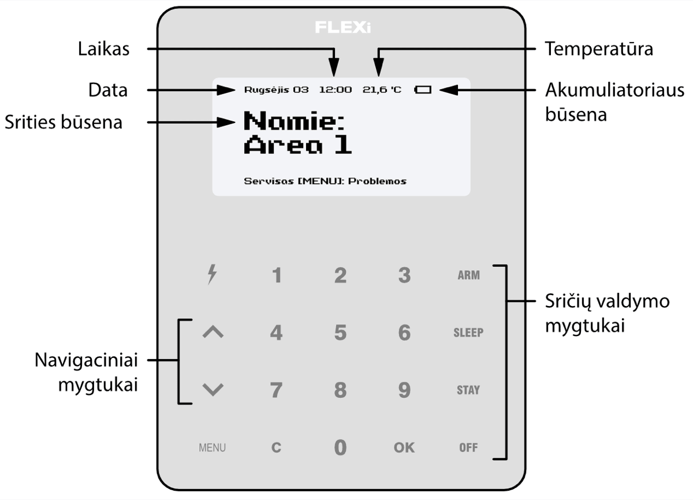

# **<u>Signalizacijos įjungimas (ARM):</u>**

  

## FLEXi / Klaviatūra SK-LCD TouchPad– Trumpa naudojimo instrukcija

## Klaviatūros apžvalga

## Signalizacijos įjungimas ir išjungimas

**<u>Signalizacijos įjungimas (ARM):</u>**

Įsitikinkite, kad visos zonos nėra pažeistos.

1.  Klaviatūra suveskite **[Vartotojo kodą]**.

2.  1.  Jeigu sistema turi tik vieną sritį, praleiskite 3, 4 žingsnius.

**Exit Delay** laiko atskaitos metu klaviatūros ekrane bus rodomas išėjimui skirtas laikas, o signalizacijai įsijungus klaviatūros ekrane atsiras tekstas: **Saugoma: Sritis**.

**<u>SLEEP režimo įjungimas:</u>**

(Saugomas patalpų perimetras. Viduje leidžiama judėti. Signalizacija suveiks nedelsiant, jei praversite įėjimo į patalpas duris):

**<u>Signalizacijos išjungimas (DISARM)</u>:**

1.  Klaviatūra suveskite **[Vartotojo kodą]**.

2.  1.  Jeigu sistema turi tik vieną sritį, praleiskite 3, 4 žingsnius.

**<u>STAY režimo įjungimas</u>**:

(Saugomas patalpų perimetras. Viduje leidžiama judėti. Jei praversite įėjimo į patalpas duris, įsijungs laiko atskaita, per kurią turite išjungti signalizaciją):

1.  Klaviatūra suveskite **[Vartotojo kodą]**.

2.  1.  Jeigu sistema turi tik vieną sritį, praleiskite 3, 4 žingsnius.

Srities būsenos pakeitimui į priešingą užtenka suvesti vartotojo kodą ir pasirinkti norimą sritį. / Norėdami ištrinti suvestus simbolius ar komandą, paspauskite mygtuką **[C]**.

## Pagalbos mygtukai

1.  Klaviatūra suveskite **[Vartotojo kodą]**.

2.  Patvirtinkite pasirinkimą paspaudus mygtuką **[OK]**.

#### Dvilaidžių gaisro (dūmų) jutiklių paleidimas veikti iš naujo

<u>Norėdami Jūsų apsaugos tarnybai išsiųsti pranešimą apie iškilusį pavojų:</u>

- **Pavojus** – 3 sek. palaikykite nuspaudę mygtuką **[1]**.

- **Medikai** – 3 sek. palaikykite nuspaudę mygtuką **[4]**.

- **Gaisrinė** – 3 sek. palaikykite nuspaudę mygtuką **[7]**.

<u>Norėdami dvilaidžius gaisro (dūmų) jutiklius paleisti veikti iš naujo:</u>

- 3 sekundes palaikykite paspaudę mygtuką **[**  **]**.

**<u>Pastaba.</u>** Užfiksavę gaisro pavojų, dvilaidžiai gaisro jutikliai automatiškai veikti iš naujo nepasileidžia. Jie paleidžiami veikti tik rankiniu būdu.

## Apšvietimo ryškumo ir indikacijos garsumo reguliavimas

#### Laikinas zonos stebėjimo išjungimas / (BYPASS funkcija)

<u>Norėdami nustatyti klaviatūros apšvietimo ryškumą ir indikacijų garsumą:</u>

**<u>BYPASS funkcijos įjungimas:</u>**

1.  Nuspauskite klaviatūros mygtuką **[3]**.

**<u>BYPASS funkcijos išjungimas:</u>**

Pakartokite tuos pačius veiksmus, kaip ir išjungiant konkrečios zonos stebėjimą.

1.  Nuspauskite klaviatūros mygtuką **[5]**.

## Vartotojo (User) arba Master kodų įvedimas arba pakeitimas

#### Vartotojo (*User*) kodų ištrynimas

**<u>Norėdami įvesti naują arba pakeisti esamą vartotojo kodą:</u>**

**<u>Norėdami ištrinti vartotojo kodą:</u>**

1.  Įveskite 6-ženklį **[Administratoriaus kodą]** (gamyklinis kodas: 123456).
1.  Įveskite 6-ženklį **[Administratoriaus** **kodą]** (gamyklinis kodas: 123456).

Signalizacijos valdymo klaviatūra SK-LCD TouchPad užtikrina 64 zonų ir 8 sričių atvaizdavimą. Taip pat klaviatūra SK-LCD TouchPad gali būti priskirta valdyti vieną ar kelias norimas sritis (klaviatūros veikimo programos versija nuo FW:1.41, centralės veikimo programos versija nuo FW:SP3_xxx4_0119. Klaviatūros programinės įrangos versiją galite pamatyti paspaudę [**MENU**] [**5**] [**0**].). Klaviatūroje bus atvaizduojamos priskirtos srities ir srities zonų būsenos.
