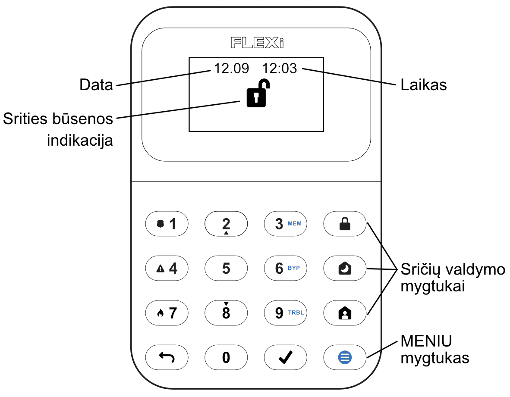
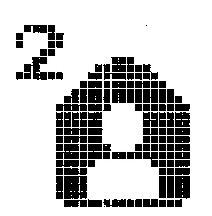
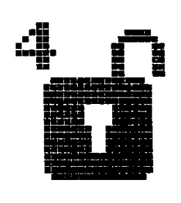
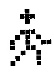

# FLEXi / Klaviatūra SK-LCD button – Trumpa naudojimo instrukcija

## Klaviatūros apžvalga

> [!NOTE]
> Signalizacijos valdymo klaviatūra „SK-LCD button“ užtikrina **64 zonų ir 8 sričių** atvaizdavimą. Taip pat klaviatūra „SK-LCD button“ gali būti priskirta valdyti vieną ar kelios norimos sritis (centralės veikimo programos versija nuo FW:SP3_xxx4_0121). Klaviatūroje bus atvaizduojamos priskirtos srities ir srities zonų būsenos.

## Signalizacijos įjungimas ir išjungimas

### Signalizacijos įjungimas (ARM)

1. Įsitikinkite, kad visos zonos nėra pažeistos.

2. Paspauskite mygtuką .

3. Surinkite vartotojo kodą.

4. Pasirinkite įjungiamos srities mygtuką.

5. Paspauskite mygtuką .

6. Per laiko atskaitą išeikite iš patalpų.

Įsijungus saugojimo režimui, pradės šviesti  ikona.

### SLEEP režimo įjungimas

(Saugomas patalpų perimetras. Viduje leidžiama judėti. Signalizacija suveiks nedelsiant, jei praversite įėjimo į patalpas duris):

1. Paspauskite mygtuką .

2. Surinkite vartotojo kodą.

3. Paspauskite įjungiamos srities mygtuką.

4. Paspauskite mygtuką .

5. SLEEP režimas įsijungs nedelsiant, be išėjimo laiko atskaitos.

Įsijungus SLEEP režimui, pradės šviesti  ikona.

### STAY režimo įjungimas
(Saugomas patalpų perimetras. Viduje leidžiama judėti. Jei praversite įėjimo į patalpas duris, įsijungs laiko atskaita, per kurią turite išjungti signalizaciją):

1. Paspauskite mygtuką .

2. Surinkite vartotojo kodą.

3. Paspauskite įjungiamos srities mygtuką.

4. Paspauskite mygtuką .

5. STAY režimas įsijungs nedelsiant, be išėjimo laiko atskaitos.

Įsijungus STAY režimui, pradės šviesti  ikona.

### Signalizacijos išjungimas

1. Surinkite vartotojo kodą.

2. Paspauskite mygtuką, kuris atitinka norimą išjungti sritį.

3. Paspauskite mygtuką .

Kai signalizacija išjungta šviečia ikona .

> [!NOTE]
> Srities būsenos pakeitimui į priešingą užtenka suvesti vartotojo kodą ir pasirinkti norimą sritį. Norėdami ištrinti suvestus simbolius ar komandą, paspauskite mygtuką .

## Pagalbos mygtukai

**<u>Norėdami Jūsų apsaugos tarnybai išsiųsti pranešimą apie iškilusį pavojų</u>**
- **Policija** – 3 sek. palaikykite nuspaudę mygtuką **1**.

- **Medikai** – 3 sek. palaikykite nuspaudę
mygtuką **4**.

- **Gaisrinė** – 3 sek. palaikykite nuspaudę mygtuką **7**.

## Apšvietimo ryškumo ir indikacijos garsumo reguliavimas

### Klaviatūros mygtukų ryškumas

1. Paspauskite mygtuką , po to **5** **3**.

2. Pasirinkite norimą klaviatūros mygtukų apšvietimo ryškumą mygtukais **2** ir **8**.

3. Naujai reikšmei užfiksuoti būtina paspausti .

**<u>LCD ekrano ryškumas</u>**

4. Paspauskite mygtuką , po to **5** **2**.

5. Pasirinkite norimą LCD ekrano pašvietimo ryškumą mygtukais **2** ir **8**.

6. Naujai reikšmei užfiksuoti būtina paspausti .

**<u>Klaviatūros mygtukų paspaudymo garsumas</u>**

7. Paspauskite mygtuką , po to **5** **1**.

8. Pasirinkite norimą mygtukų paspaudymo garsumą mygtukais **2** ir **8**.

9. Naujai reikšmei užfiksuoti būtina paspausti .
> [!NOTE]
> Ramybės būsenos klaviatūros pašvietimo išjungimas. Paspauskite  po to **5** **4**. Perjunkite klaviatūros pašvietimo būseną budėjimo režime paspausdami **1** (pašvietimas įjungtas) arba **2** (pašvietimas išjungtas). Naujai reikšmei užfiksuoti būtina paspausti .

## Vartotojo (User) arba Administratoriaus (Master) kodų įvedimas arba pakeitimas

### Norėdami įvesti naują arba pakeisti esamą vartotojo kodą

1. Paspauskite mygtuką , po to **0**.

2. Surinkite **Master** kodą, numatytasis – 1234.

3. Surinkite dviženklį vartotojo eilės numerį, pvz., **02**.
> [!NOTE]
> **Master** kodo eilės numeris yra **01**.

4. Du kartus surinkite naują vartotojo kodą.

5. Paspauskite sričių numerius, kurias vartotojas galės valdyti.

6. Paspauskite mygtuką . Išėjimui paspauskite mygtuką .

## Gaisro (dūmų) jutiklių atstatymas

### Norėdami gaisro (dūmų) jutiklius paleisti veikti iš naujo

- 3 sekundes palaikykite paspaudę mygtuką .
> [!NOTE]
> Užfiksavę gaisro pavojų, gaisro jutikliai automatiškai veikti iš naujo nepasileidžia. Jie paleidžiami veikti tik rankiniu būdu.

## Laikinas zonos stebėjimo išjungimas (BYPASS funkcija)

### BYPASS funkcijos įjungimas

1. Paspauskite mygtuką , po to **6**.

2. Surinkite signalizacijos valdymo kodą.

3. Surinkite dviženklį zonos, kurios stebėjimą norite išjungti, eilės numerį. Galite suvesti kelių zonų dviženklius numerius, jeigu norite išjungti kelių zonų stebėjimą.

4. Paspauskite mygtuką . Ekrane atsiras ikona [  ].
**<u>BYPASS funkcijos išjungimas:</u>**
Pakartokite tuos pačius veiksmus, kaip ir išjungiant konkrečios zonos stebėjimą.

## Vartotojo (User) kodų ištrynimas

### Norėdami ištrinti vartotojo kodą

1. Paspauskite mygtuką , po to **0**.

2. Surinkite **Master** kodą.

3. Surinkite dviženklį vartotojo eilės numerį, pvz., **02**.

4. Paspauskite klaviatūros mygtuką . Pasigirs garso signalas.

5. Paspauskite mygtuką .

## Grafiniai žymėjimai

| Simbolis | Aprašymas | Simbolis | Aprašymas |
|---|---|---|---|
|  | Valdymo pultas neprijungtas |  | Gaisro kilpos gedimas |
|  | Sritis 1 įjungta |  | Tinklo gedimų sąrašas |
|  | Sritis 4 išjungta |  | CMS 1 (2) gedimas |
|  | Sritis 2 STAY režime |  | Debesijos gedimas |
|  | Sritis 3 SLEEP režime |  | SIM kortelės gedimas |
|  | MENU mygtukas |  | SIM kortelės slaptažodžio gedimas |
|  | ENTER mygtukas |  | SIM kortelės tinklo gedimas |
|  | Sritis |  | WiFi gedimas |
|  | Aliarmas |  | RS485 sąsajos gedimas |
|  | Gaisras |  | SIM kortelės 2 gedimas |
|  | Vartotojo kodas |  | LAN gedimas |
|  | Vartotojas |  | Belaidžio įrenginio žema baterija |
|  | Įėjimas/Išėjimas |  | Maitinimo gedimas |
|  | Zona atvira |  | Sirenos gedimas |
|  | Bypass |  | Sabotažo gedimas |
|  | Atmintis |  | Antimaskingo gedimas |
|  | Gedimas |  | Belaidžio ryšio gedimas |
|  | Sistemos gedimų sąrašas |  | Išplėtimo modulio gedimas |
|  | AC maitinimo gedimas |  | Nustatymai |
|  | Baterijos gedimas |  | Garsumas |
|  | AUX viršsrovė |  | LCD ryškumas |
|  | Laikas nenustatytas |  | Klaviatūros ryškumas |
|  | Sirenos viršsrovė |  | Budėjimo šviesa O-Įjungta / I-Išjungta |
|  | Sirenos nėra |  | Informacija |
