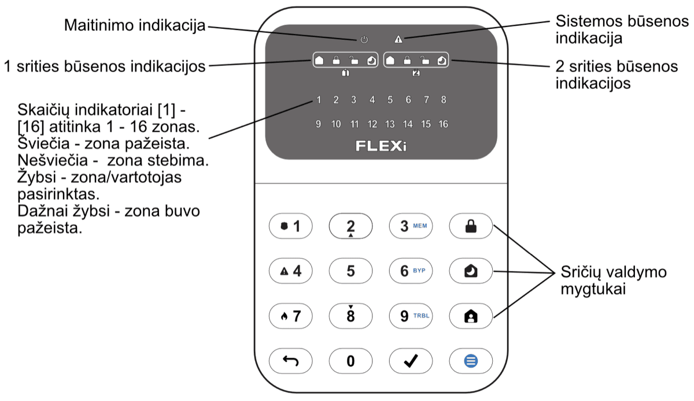

# **FLEXi** / **Klaviatūra SK-LED button – Trumpa naudojimo instrukcija**

## Klaviatūros apžvalga

  

## Signalizacijos įjungimas ir išjungimas

## <u>Signalizacijos įjungimas (ARM):</u>

1.  Įsitikinkite, kad visos zonos nėra pažeistos (nešviečia nei vienas iš zonų indikatorių).

2.  Paspauskite mygtuką [].

3.  Surinkite vartotojo kodą.

4.  Pasirinkite įjungiamos srities mygtuką.

5.  Paspauskite mygtuką [].

6.  Per laiko atskaitą išeikite iš patalpų.

Surinkus kodą, per laiko atskaitą mirksės indikatorius . Įsijungus saugojimo režimui, pradės šviesti  indikatorius.

## <u>SLEEP režimo įjungimas:</u>

(Saugomas patalpų perimetras. Viduje leidžiama judėti. Signalizacija suveiks nedelsiant, jei praversite įėjimo į patalpas duris):

1.  Paspauskite mygtuką [].

2.  Surinkite vartotojo kodą.

3.  Paspauskite įjungiamos srities mygtuką.

4.  Paspauskite mygtuką [].

5.  SLEEP režimas įsijungs nedelsiant, be išėjimo laiko atskaitos.

Įsijungus SLEEP režimui, pradės šviesti  indikatorius.

**<u>STAY režimo įjungimas</u>**:

(Saugomas patalpų perimetras. Viduje leidžiama judėti. Jei praversite įėjimo į patalpas duris, įsijungs laiko atskaita, per kurią turite išjungti signalizaciją):

6. Paspauskite mygtuką [].

2.  Surinkite vartotojo kodą.

3.  Paspauskite įjungiamos srities mygtuką.

4.  Paspauskite mygtuką [].

5.  STAY režimas įsijungs nedelsiant, be išėjimo laiko atskaitos.

Įsijungus STAY režimui, pradės šviesti  indikatorius.

## <u>Signalizacijos išjungimas</u>:

1.  Surinkite vartotojo kodą.

2.  Paspauskite mygtuką, kuris atitinka norimą išjungti sritį.

3.  Paspauskite mygtuką [].

Kai signalizacija išjungta šviečia indikatorius .

Srities būsenos pakeitimui į priešingą užtenka suvesti vartotojo kodą ir pasirinkti norimą sritį. Norėdami ištrinti suvestus simbolius ar komandą, paspauskite mygtuką [].

## Pagalbos mygtukai

Dvilaidžių gaisro (dūmų) jutiklių paleidimas veikti iš naujo

<u>Norėdami Jūsų apsaugos tarnybai išsiųsti pranešimą apie iškilusį pavojų:</u>

- **Policija** – 3 sek. palaikykite nuspaudę mygtuką [**1**].

- **Medikai** – 3 sek. palaikykite nuspaudę  
  mygtuką [**4**].

- **Gaisrinė** – 3 sek. palaikykite nuspaudę mygtuką [**7**].

<u>Norėdami dvilaidžius gaisro (dūmų) jutiklius paleisti veikti iš naujo:</u>

- 3 sekundes palaikykite paspaudę mygtuką [].

**<u>Pastaba.</u>** Užfiksavę gaisro pavojų, dvilaidžiai gaisro jutikliai automatiškai veikti iš naujo nepasileidžia. Jie paleidžiami veikti tik rankiniu būdu.

## Apšvietimo ryškumo ir indikacijos garsumo reguliavimas

Laikinas zonos stebėjimo išjungimas (BYPASS funkcija)

#### <u>Klaviatūros mygtukų ryškumas</u>

1.  Pasirinkite norimą apatinių mygtukų apšvietimo ryškumą mygtukais [**2**] ir [**8**].

#### <u>Zonų LED indikacijos ryškumas</u>

1.  Pasirinkite norimą zonų būsenų indikacijos apšvietimo ryškumą mygtukais [**2**] ir [**8].**

#### <u>Klaviatūros mygtukų paspaudymo garsumas</u>

1.  Pasirinkite norimą mygtukų paspaudymo garsumą mygtukais [**2**] ir [**8**].

**<u>Pastaba:</u>** Ramybės būsenos klaviatūros apšvietimo išjungimas. Paspaudus [] po to su [**5**] galima keisti ramybės būsenos apšvietimo įjungta/išjungta būsenas. Naujai reikšmei užfiksuoti būtina paspausti []. Išėjimui paspauskite mygtuką [].

**<u>BYPASS funkcijos įjungimas:</u>**

1.  Surinkite signalizacijos valdymo kodą. Indikatorius [] pradės mirksėti žaliai.

**<u>BYPASS funkcijos išjungimas:</u>**

Pakartokite tuos pačius veiksmus, kaip ir išjungiant konkrečios zonos stebėjimą.

## Vartotojo (User) arba Administratoriaus (Master) kodų įvedimas arba pakeitimas

#### Vartotojo (*User*) kodų ištrynimas

**<u>Norėdami įvesti naują arba pakeisti esamą vartotojo kodą:</u>**

1.  Surinkite *Master* kodą, numatytasis – 1234.

**<u>Pastaba:</u>** *Master* kodo eilės numeris yra [**01**].

**<u>Norėdami ištrinti vartotojo kodą:</u>**

1.  Paspauskite sričių numerius, kurias vartotojas galės valdyti.
1.  Surinkite *Master* kodą.

Signalizacijos valdymo klaviatūra „SK-LED button“ užtikrina 16 zonų ir 2 sričių atvaizdavimą. Taip pat klaviatūra „SK-LED button“ gali būti priskirta valdyti vieną ar dvi norimas sritis (klaviatūros veikimo programos versija nuo FW:1.0, centralės veikimo programos versija nuo FW:SP3_xxx4_0120). Klaviatūroje bus atvaizduojamos priskirtos srities ir srities zonų būsenos.
