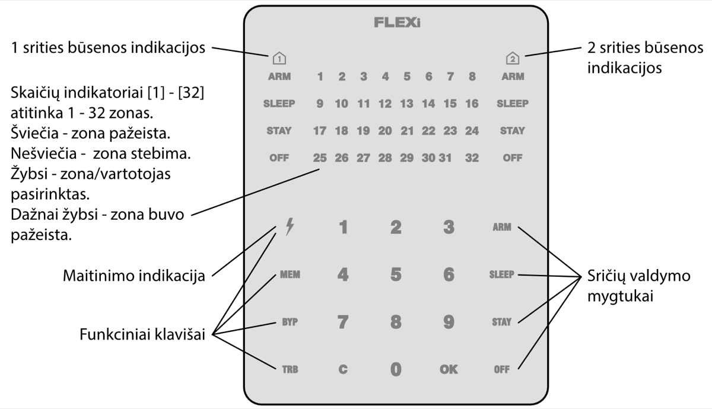

# FLEXi / Klaviatūra SK-LED TouchPad – Trumpa naudojimo instrukcija

## Klaviatūros apžvalga

> [!NOTE]
> Signalizacijos valdymo klaviatūra SK-LED TouchPad užtikrina 32 zonų ir 2 sričių atvaizdavimą. Taip pat klaviatūra SK-LED TouchPad gali būti priskirta valdyti vieną ar dvi norimas sritis (klaviatūros veikimo programos versija nuo FW:3.0, centralės veikimo programos versija nuo FW:SP3_xxx4_0119). Klaviatūroje bus atvaizduojamos priskirtos srities ir srities zonų būsenos.

## Signalizacijos įjungimas ir išjungimas

### Signalizacijos įjungimas (ARM)

1. Įsitikinkite, kad visos zonos nėra pažeistos (nešviečia nei vienas iš zonų indikatorių).

2. Surinkite vartotojo kodą.

3. Pasirinkite įjungiamos srities mygtuką.

4. Paspauskite mygtuką **OK**.

5. Per laiko atskaitą išeikite iš patalpų.

Surinkus kodą, per laiko atskaitą mirksės indikatorius ARM.

### SLEEP režimo įjungimas

(Saugomas patalpų perimetras. Viduje leidžiama judėti. Signalizacija suveiks nedelsiant, jei praversite įėjimo į patalpas duris):

1. Paspauskite mygtuką **SLEEP**.

2. Surinkite vartotojo kodą.

3. Paspauskite įjungiamos srities mygtuką.

4. Paspauskite mygtuką **OK**.

5. SLEEP režimas įsijungs nedelsiant, be išėjimo laiko atskaitos.

Įsijungus SLEEP režimui, pradės šviesti SLEEP indikatorius.

### STAY režimo įjungimas
(Saugomas patalpų perimetras. Viduje leidžiama judėti. Jei praversite įėjimo į patalpas duris, įsijungs laiko atskaita, per kurią turite išjungti signalizaciją):

1. Paspauskite mygtuką **STAY**.

2. Surinkite vartotojo kodą.

3. Paspauskite įjungiamos srities mygtuką.

4. Paspauskite mygtuką **OK**.

5. STAY režimas įsijungs nedelsiant, be išėjimo laiko atskaitos.

Įsijungus STAY režimui, pradės šviesti STAY indikatorius.

### Signalizacijos išjungimas

1. Paspauskite mygtuką **OFF**

2. Surinkite vartotojo kodą.

3. Paspauskite mygtuką, kuris atitinka norimą išjungti sritį.

4. Paspauskite mygtuką **OK**

Kai signalizacija išjungta, turi šviesti indikatorius OFF, o saugojimo režimų indikatoriai turi nešviesti.

> [!NOTE]
> Srities būsenos pakeitimui į priešingą užtenka suvesti vartotojo kodą ir pasirinkti norimą sritį. Norėdami ištrinti suvestus simbolius ar komandą, paspauskite mygtuką .

## Pagalbos mygtukai

**<u>Norėdami Jūsų apsaugos tarnybai išsiųsti pranešimą apie iškilusį pavojų</u>**
- **Policija** – 3 sek. palaikykite nuspaudę mygtuką **1**.

- **Medikai** – 3 sek. palaikykite nuspaudę
mygtuką **4**.

- **Gaisrinė** – 3 sek. palaikykite nuspaudę mygtuką **7**.

## Apšvietimo ryškumo ir indikacijos garsumo reguliavimas

### Norėdami nustatyti klaviatūros apšvietimo ryškumą ir indikacijų garsumą

1. 3 sek. palaikykite nuspaudę mygtuką **C**.

2. Pasirinkite norimą zonų būsenų indikacijos apšvietimo ryškumą mygtukais **1** ir **4**.

3. Pasirinkite norimą apatinių mygtukų apšvietimo ryškumą mygtukais **2** ir **5**.

4. Pasirinkite norimą garsinės indikacijos garsą mygtukais **3** ir **6**.

5. Pasirinkite klaviatūros LED indikacijos pašvietimo įjungimą/išjungimą budėjimo režime mygtuku **0**. Paspauskite **0**, jei dega kas antras zonų LED indikatorius – klaviatūros pašvietimas budėjimo režime išjungtas, jei dega visi zonų LED indikatoriai – klaviatūros pašvietimas budėjimo režime įjungtas.

6. Norint išsaugoti nustatymus, dar kartą paspauskite mygtuką .

## Vartotojo (User) arba Administratoriaus (Master) kodų įvedimas arba pakeitimas

### Norėdami įvesti naują arba pakeisti esamą vartotojo kodą

1. Paspauskite mygtuką .

2. Surinkite *Master* kodą, numatytasis – 1234. Pradės šviesti zonų indikatoriai, rodantys eilės numerius tų vartotojų, kurių kodai jau įvesti.

3. Surinkite dviženklį vartotojo eilės numerį, pvz., **02**.
> [!NOTE]
> *Master* kodo eilės numeris yra **01**.

4. Du kartus surinkite naują vartotojo kodą.

5. Paspauskite eilės numerius sričių, kurias vartotojas galės valdyti.

6. Paspauskite mygtuką . Išėjimui du kartus paspauskite mygtuką **C**.

## Dvilaidžių gaisro (dūmų) jutiklių atstatymas

### Norėdami dvilaidžius gaisro (dūmų) jutiklius paleisti veikti iš naujo

- 3 sekundes palaikykite paspaudę mygtuką

.
> [!NOTE]
> Užfiksavę gaisro pavojų, dvilaidžiai gaisro jutikliai automatiškai veikti iš naujo nepasileidžia. Jie paleidžiami veikti tik rankiniu būdu.

## Laikinas zonos stebėjimo išjungimas (BYPASS funkcija)

### BYPASS funkcijos įjungimas

1. Paspauskite mygtuką **BYP**.

2. Surinkite signalizacijos valdymo kodą. Indikatorius **BYP** pradės mirksėti.

3. Surinkite dviženklį zonos, kurios stebėjimą norite išjungti, eilės numerį. Galite suvesti kelių zonų dviženklius numerius, jeigu norite išjungti kelių zonų stebėjimą.

4. Paspauskite mygtuką . Indikatorius **BYP** pradės šviesti.
**<u>BYPASS funkcijos išjungimas:</u>**
Pakartokite tuos pačius veiksmus, kaip ir išjungiant konkrečios zonos stebėjimą.

## Vartotojo (User) kodų ištrynimas

### Norėdami ištrinti vartotojo kodą

1. Paspauskite mygtuką .

2. Surinkite *Master* kodą. Pradės šviesti zonų indikatoriai, rodantys eilės numerius tų vartotojų, kurių kodai jau įvesti.

3. Surinkite dviženklį vartotojo eilės numerį, pvz., **02**.

4. Paspauskite klaviatūros mygtuką **SLEEP**. Pasigirs garso signalas ir užges mygtukas, rodantis to vartotojo kodo eilės numerį, kurio kodą ištrynėte iš atminties.

5. Du kartus paspauskite mygtuką .
