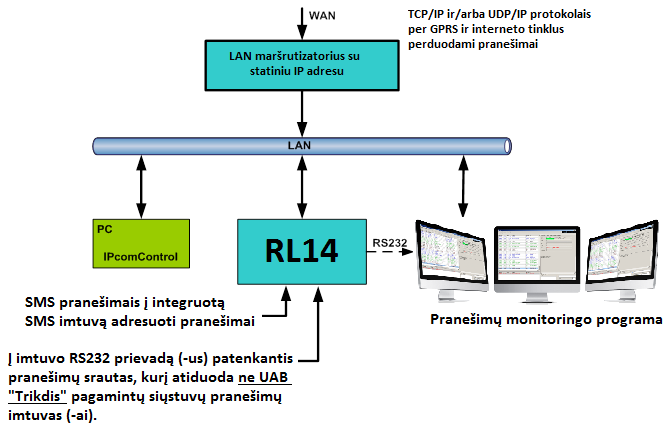
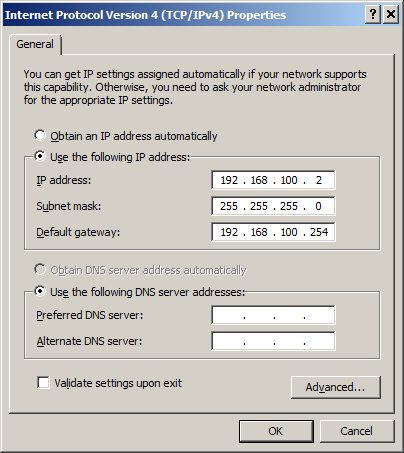
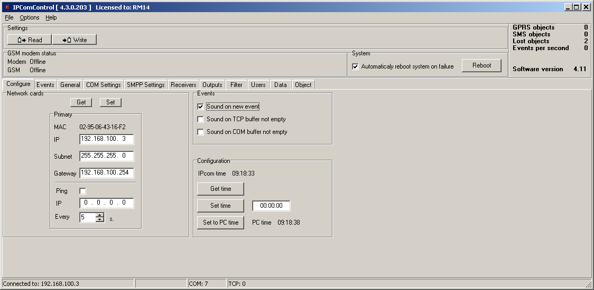
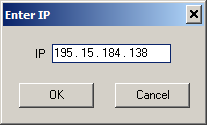

# RL14 IP/SMS Imtuvas

  

## Saugos reikalavimai

IP/SMS imtuvas RL14 – elektros įrenginys, todėl jį įrengti gali kvalifikuoti specialistai, vadovaudamiesi šia instrukcija ir elektros įrenginių įrengimo taisyklėmis ([http://www3.lrs.lt/pls/inter3/dokpaieska.showdoc_l?p_id=418124&p_query=&p_tr2=2](http://www3.lrs.lt/pls/inter3/dokpaieska.showdoc_l?p_id=418124&p_query=&p_tr2=2)).

IP/SMS imtuvas RL14 turi būti eksploatuojamas, vadovaujantis šia instrukcija ir saugos eksploatuojant elektros įrenginius taisyklėmis (<http://www3.lrs.lt/pls/inter3/dokpaieska.showdoc_l?p_id=368840&p_tr2=2>).

##  Imtuvo paskirtis

IP/SMS imtuvas RL14 naudojamas centralizuoto stebėjimo pultuose. Jis yra skirtas priimti TRIKDIS perdavimo modulių pranešimus, siunčiamus TCP/UDP protokolais ir (arba) SMS žinutėmis.

Apdorotus pranešimus imtuvas per LAN tinklą arba RS232 prievadą(-us) perduoda į pranešimų stebėjimo programą.

## Imtuvo veikimas

Imtuve integruotas pramoninis kompiuteris, veikiantis OS Linux aplinkoje, su įdiegta IPcom v4 programa. Programa IPcom v4 skirta apdoroti per 1) imtuvo tinklo plokštę, 2) integruotą SMS imtuvą ir 3) imtuvo RS232 įvadus patenkantį pranešimų srautą.

Imtuvo tinklo plokštė priima TCP/UDP protokolais siunčiamus perdavimo modulių pranešimus. SMS imtuvas priima SMS žinutėmis siunčiamus pranešimus Contact ID kodais. Per RS232 prievadus priimami Surgard MRL2-DG protokolu Contact ID kodais perduodami pranešimai.

Imtuvo veikimo galimybės nustatomos licencijoje, kuri įtakoja įdiegtos programos IPcom v4 veikimo parametrus. Imtuvo veikimo parametrai nustatomi konfigūruojant imtuvą programa IPcomControl v4, kuri diegiama į tame pat tinkle OS MS Windows aplinkoje veikiantį kompiuterį.

Pranešimų priėmimui numatyti keli programiniai priėmimo kanalai, kurių veikimo parametrai ir reikiami fiziniai priėmimo įrenginiai nustatomi konfigūruojant imtuvą. Priimtas pranešimų srautas nukreipiamas į programinį(-ius) pranešimų išvedimo kanalą(-us) (išėjimus), per kuriuos pranešimai perduodami į stebėjimo programą. Išvedimo kanalų veikimo parametrai ir reikiami fiziniai išėjimai nustatomi konfigūruojant imtuvą.

**Pranešimų priėmimas:**

| Priimami GPRS komunikatorių G10, G10C, G10T, G10D TCP/IP arba UDP/IP protokolais per GPRS ir (arba) SMS kanalus perduodami pranešimai. Pastaba: Kad būtų priimti pranešimai SMS kanalu, į integruoto SMS imtuvo SIM kortelės lizdą turi būti įstatyta pasirinkto GSM ryšio tiekėjo standartinio dydžio SIM kortelė. |
|---------------------------------------------------------------------------------------------------------------------------------------------------------------------------------------------------------------------------------------------------------------------------------------------------------------------|
| Priimami Ethernet komunikatorių E10, E10C, E10T TCP/IP arba UDP/IP protokolais per laidinio interneto tinklus perduodami pranešimai. |
| Priimami GPRS komunikatorių G10F, FireCom TCP/IP arba UDP/IP protokolais per GPRS ir (arba) SMS kanalus perduodami pranešimai. Pastaba: Kad būtų priimti pranešimai SMS kanalu, į integruoto SMS imtuvo SIM kortelės lizdą turi būti įstatyta pasirinkto GSM ryšio tiekėjo standartinio dydžio SIM kortelė. |
| Priimami centralių CG3, SP131 ir SP231 TCP/IP arba UDP/IP protokolais per GPRS ir (arba) SMS kanalus perduodami pranešimai. Pastaba: Kad būtų priimti pranešimai SMS kanalu, į integruoto SMS imtuvo SIM kortelės lizdą turi būti įstatyta pasirinkto GSM ryšio tiekėjo standartinio dydžio SIM kortelė. |
| Priimami retransliatorių RR-GSM ir R-IP12 UDP/IP protokolais per GPRS ir laidinio interneto tinklus perduodami pranešimai. |
| Priimami prie RS232 įvadų prijungtų kitų gamintojų imtuvų perduodami pranešimai. |

##  Imtuvo techniniai parametrai

|  |  |
|----|:---|
| IP komunikatorių, su kuriais kontroliuojamas ryšys, skaičius | Be apribojimų |
| Pranešimų priėmimo kanalų skaičius | Pradine licencija leista sukurti du pranešimų priėmimo kanalus |
| Ryšio protokolai /​ Pranešimų perdavimo protokolai | TCP/​IP ir UDP/​IP /​ TRK-3, TRK-6, TRK-7 |
| Tinklo plokštės fizinis prievadas | RJ-45 (Fast Ethernet 10/​100) |
| Integruoto SMS imtuvo modemo dažnių diapazonas | GSM 850/​ 900/​ 1800/​ 1900 MHz |
| Integruoto SMS imtuvo SIM kortelės tipas | Standartinio dydžio, su imtuvu nekomplektuojama |
| RS232 prievadų paskirtis | Bet kuris prievadas gali būti nustatomas kaip duomenų priėmimo įvadas „Input“ arba išvedimo išvadas „Output“ |
| RS232 prievadų skaičius | 3 |
| Duomenų išvadų protokolai | Surgard MLR2-DG, Monas3 |
| RS232 prievadų jungties tipas | Kištukinė DB9 jungtis (angl. male connection) |
| Parametrų nustatymas ir veikimo stebėjimas | OS MS Windows 32/​64 bitų Win7, Win8, Win8.1, Win10 aplinkoje veikiančio kompiuterio programa IPcomControl v4. Turi būti užtikrintas ryšys tarp programos ir imtuvo. |
| Darbo vietų skaičius | Pradine licencija leista sukurti 2 darbo vietas (du naudotojai) |
| Pagrindinio maitinimo šaltinis | 50/​60 Hz dažnio 230 V įtampos kintamos srovės tinklas. Leistinos įtampos kitimo ribos nuo 110 iki 240 V. Naudojama srovė neviršija 0,35 A. |
| Išorinis rezervinio maitinimo šaltinis | Ne mažesnės kaip 18 Ah. talpos 12 V akumuliatorius. Naudojama srovė neviršija 0,5 A. /​ Esant maitinimui iš kintamosios srovės tinklo, akumuliatoriaus stovis kontroliuojamas ir, reikalui esant, jis įkraunamas. Akumuliatoriaus krovimo srovė iki 900 mA. |
| Imtuvo naudojama galia | neviršija 60 W |
| Darbinė temperatūra | Nuo 0 °C iki +55 °C |
| Matmenys | 19” 1U (450 x 50 x 320 mm) |
| Masė | 2,1 kg |

## Imtuvo komplektas

- IP/SMS imtuvas RL14 1 vnt.

- 2,5 m ilgio GSM antena su magnetiniu padu 1 vnt.

- 1,5 m ilgio maitinimo kabelis 1 vnt.

- 1,8 m ilgio „Null Modem“ tipo COM kabelis (lizdas/lizdas (f/f)) 1 vnt.

- 5 m LAN kabelis 1 vnt.

- CD diskas su programa IPcomControl v4 ir naudojimo instrukcija 1 vnt.

## Imtuvo elementai 

## Vaizdas iš priekio ir šviesinė indikacija.

Imtuvo vaizdas iš priekio

Šviesinė indikacija

|  |  |
|----|:--:|
| Indikatorius | Veikimas |
| Power | Šviečia mėlynai, kai įjungtas maitinimas. |
| Status | Šviečia žaliai, kai yra fizinis ir protokolinis ryšys tarp imtuvo ir pranešimų stebėjimo programos. /​ Šviečia raudonai, kai nėra fizinio arba protokolinio ryšio tarp imtuvo ir pranešimų stebėjimo programos. /​ Šviečia geltonai, kai per dalį aprašytų ir aktyvių prievadų imtuvas turi fizinį ir protokolinį ryšį su pranešimų stebėjimo programa, o per dalį iš jų ryšys prarastas. /​ Nešviečia, kai imtuvo prievadas neaktyvus arba neaprašytas. |
| Event | Pranešimo siuntimo į pranešimų stebėjimo programą metu sušvinta mėlynai. |

## Vaizdas iš galo ir galinio skydo elementai.

Imtuvo vaizdas iš galo

|  |  |
|:--:|:--:|
| Elementas | Paskirtis |
| LAN | Tinklo plokštės RJ45 jungtis. |
| COM1 | 1-asis nuoseklusis RS232 prievadas, nustatomas kaip duomenų įvadas arba išvadas (kištukinė DB9 jungtis (angl. male connection)). |
| COM2 | 2-asis nuoseklusis RS232 prievadas, nustatomas kaip duomenų įvadas arba išvadas (kištukinė DB9 jungtis (angl. male connection)). |
| COM3 | 3-asis nuoseklusis RS232 prievadas, nustatomas kaip duomenų įvadas arba išvadas (kištukinė DB9 jungtis (angl. male connection)). |
| Reset | Mygtukas, kurį palaikius nuspaustu ilgiau nei 5 sekundes, atkuriami imtuvo tinklo plokštės pirminiai (gamyklos nustatyti) interneto adresai. |
| Antenna | Integruoto SMS imtuvo lizdinė (angl. female) SMA tipo GSM antenos jungtis. |
| HDMI | Monitoriaus HDMI jungtis. |
| USB | USB jungtis. |
|  | Imtuvo įžeminimo grandinės jungtis. |
| \- BAT + | Rezervinio maitinimo 12 V akumuliatoriaus jungtis. /​ Kai imtuvas maitinimas iš kintamos srovės tinklo, akumuliatoriaus įkrova kontroliuojama. Akumuliatoriaus krovimo srovė iki 900 mA. |
| 100-240 VAC | Maitinimo kabelio jungtis ir jungiklis O/​I. |

Galinio skydo elementai

##  Imtuvo paruošimas darbui

### Ruošiant imtuvą darbui, imtuvo maitinimas privalo būti išjungtas, t. y. 1) imtuvo maitinimo kabelis atjungtas nuo tinklo ir 2) ištraukta imtuvo rezervinio maitinimo „BAT“ jungtis, prie kurios prijungta rezervinio maitinimo grandinė.

**Pastaba:** Išjungus imtuvo maitinimą, jis pilnai nustos veikti tik po kelių minučių!

### Jei iš UAB „Trikdis“ pranešimų perdavimo modulių pranešimus ketinate priimti SMS kanalu, privalote į imtuvą integruoto SMS imtuvo SIM kortelės lizdą įstatyti jau tinkle priregistruotą pasirinkto ryšio tiekėjo standartinio dydžio SIM kortelę. 

### Kad į integruotą SMS imtuvą įstatytumėte SIM kortelę, išsukę tvirtinimo varžtus, nuimkite imtuvo viršutinį dangtį. Į integruoto SMS imtuvo SIM kortelės lizdą įstatykite SIM kortelę (žr. paveikslą). Prisukite viršutinį dangtį atgal.

Imtuvo vaizdas nuėmus viršutinį dangtį

### Pritvirtinkite imtuvą 19” serverių spintoje.

### Prisukite GSM anteną.

### Paruoškite darbui kompiuterių tinklą (LAN), atsižvelgdami į pateiktą principinę schemą.

> 

### Įdiekite programą IPcomControl v4 (žr. „Imtuvo konfigūravimas“).

### Pakeiskite kompiuterio kuriuo konfigūruosite imtuvą RL14, internetinį adresą į imtuvo gamintojo reikalaujamą (žr. sk. „Imtuvo konfigūravimas“ A punktą).

### LAN kabeliu sujunkite imtuvą RL14 su kompiuteriu, kuriuo konfigūruosite imtuvo parametrus. 

### Į imtuvo 110-240 V maitinimo iš kintamos srovės tinklo lizdą įstatykite maitinimo kabelio jungtį, o kabelio kištuką įstatykite į kintamos srovės tinklo lizdą.

### Įjunkite imtuvo maitinimą, t. y. maitinimo jungiklį O/I perjunkite į padėtį „I“. Maitinimą žymės mėlynai šviečiantis diodas „Power“. Pasigirdus garsiniam signalui, imtuvas bus paruoštas konfigūruoti.

### Konfigūruokite imtuvo RL14 parametrus **tokia tvarka**:

1)  Nustatykite tokius imtuvo tinklo plokštės parametrus, kad imtuvas galėtų veikti jam skirtame tinkle (žr. sk. „Prisijungimas prie naujo imtuvo“ ir sk. „Imtuvo konfigūravimas“ apie kortelę „Configure“);

2)  Aprašykite fizinių imtuvo prievadų paskirtį ir jų parametrus (žr. sk. „Imtuvo konfigūravimas“ apie kortelę „COM settings“);

3)  Sukurkite ir aprašykite pranešimų išvedimo kanalus, per kuriuos pranešimų srautas bus nukreipiamas į pranešimų stebėjimo programą (žr. sk. „Imtuvo konfigūravimas“ apie kortelę „Outputs“);

4)  Sukurkite ir aprašykite programinius priėmimo kanalus, per kuriuos pranešimų srautas bus priimamas (žr. sk. „Imtuvo konfigūravimas“ apie kortelę „Receivers“);

5)  Nustatykite imtuvo veikimo ir ryšio kontrolės parametrus (žr. sk. „Imtuvo konfigūravimas“ apie korteles „General“ ir, jei SMS pranešimai bus priimami per ryšio operatoriaus SMS centrą, „SMPP settings“);

6)  Sukurkite ir aprašykite naudotojus, kurie imtuvo eksploatacijos metu savo teisėmis galės prisijungti ir atlikti jiems pavestas funkcijas (žr. sk. „Imtuvo konfigūravimas“ apie kortelę „Users“).

### Nustatę reikiamus imtuvo parametrus, atjunkite LAN kabelį. Sujunkite imtuvą su numatytu programuojant tinklu. Sujunkite kompiuterį, kuriuo konfigūravote imtuvą, su prieš konfigūravimą naudotu tinklu ir atstatykite pakeistus kompiuterio parametrus.

### Sujunkite imtuvą RL14 su pranešimų stebėjimo programos kompiuteriu.

- Jei pranešimai į pranešimų stebėjimo programą bus perduodami per RS232 jungtį, pasirinktą imtuvo COM išvadą (RS232 prievadą) komplekte esančiu RS232 kabeliu sujunkite su pranešimų stebėjimo programos kompiuteriu;

- jei pranešimai į pranešimų stebėjimo programą bus perduodami per vietinį tinklą (LAN), imtuvo tinklo plokštės jungtį „LAN“ komplekte esančiu LAN kabeliu sujunkite su vietiniu tinklu, kuriame veikia ir pranešimų stebėjimo programos serveris-kompiuteris.

##  Imtuvo konfigūravimas

Imtuvo RL14 veikimo parametrai nustatomi ir keičiami bendrame tinkle OS MS Windows aplinkoje veikiančiu kompiuteriu su įdiegta IPcomControl v4 programa. Programą rasite pridėtame CD diske arba [www.trikdis.lt](http://www.trikdis.lt) . Įdiekite programą IPcomControl v4 į kompiuterį.

## Prisijungimas prie naujo imtuvo ir LAN tinklo adresų nustatymas

Pirminiai (angl. default) imtuvo RL14 tinklo plokštės adresai yra:

|                                     |                 |
|-------------------------------------|:---------------:|
| IP adresas (angl. IP address)       |  192.168.100.3  |
| Prievadas (angl. Port)              |      55000      |
| IP adreso kaukė (angl. Subnet mask) |  255.255.255.0  |
| Tinklo sietuvas (angl. Gateway)     | 192.168.100.254 |

Kaip, reikalui esant, atkurti pirminius adresus nurodyta IX skyriuje (žr. „Imtuvo pirminių veikimo parametrų atkūrimas“).

1.  Pakeiskite kompiuterio, kuriuo konfigūruosite imtuvą, tinklo plokštės adresus į tokius, kokie pateikti kortelėje.

2.  LAN kabeliu sujunkite imtuvą su kompiuteriu, kuriuo konfigūruosite imtuvą.

3.  Įjunkite imtuvo maitinimą iš tinklo ir palaukite kelias sekundes, kol pasigirs garsinis imtuvo signalas, rodantis, kad imtuvas jau įsijungė veikti.

4.  Paleiskite veikti kompiuterio programą IPcomControl v4. Į atsivėrusį IP adreso užklausos langą įrašykite pirminį imtuvo tinklo plokštės IP adresą ir paspauskite mygtuką OK.

> 

5.  Į atsivėrusį imtuvo vartotojo prisijungimo vardo ir slaptažodžio užklausos langą įveskite vartotojo vardo (angl. User name) *administrator* reikšmę, o į slaptažodžio (angl. Password) – *admin* reikšmę. Paspauskite mygtuką Login.

> 

6.  Pasirinkite programos IPcomControl v4 langą Configure. Paspauskite mygtuką Get. Į *Primary* IP, Subnet ir Gateway langelius įrašykite tokias LAN tinklo reikšmes, kad į tinklą įjungtas imtuvas taptų šio tinklo dalimi. Paspauskite mygtuką Set.

7.  Imtuvas automatiškai išsijungs ir pasileisti veikti iš naujo. Programa IPcomControl v4 išsijungs. Imtuvas paruoštas veikti nurodytame programuojant LAN tinkle.

8.  Iš imtuvo ištraukite konfigūravimo LAN kabelį, o į jo vietą įjunkite tinklo, kurio adresus nustatėte, kabelį.

9.  Atkurkite kompiuterio, kuriuo konfigūravote imtuvą, tinklo plokštės adresus, kad kompiuteris vėl galėtų veikti Jūsų tinkluose.

## Prisijungimas prie LAN tinkle veikiančio imtuvo

LAN tinkle veikiantis imtuvas konfigūruojamas programa IPcomControl v4, kuri instaliuota į tame pačiame tinkle veikiantį 32/64 bitų OS MS Windows Win7/8/8.1/10 kompiuterį. Prie imtuvo vienu metu gali būti prisijungę keli kompiuteriai su IPcomControl v4 programa. Darbo vietų skaičius apribotas licencija, kurią pažiūrėti galite paspaudę IPcomControl v4 funkciją **Help**.

1.  Paleiskite veikti kompiuterio programą IPcomControl v4. Į atsivėrusį IP adreso užklausos langą įrašykite nustatytą LAN tinklo imtuvo tinklo plokštės IP adresą, pvz., 195.15.184.138, ir paspauskite mygtuką OK.

> 

2.  Į atsivėrusį imtuvo vartotojo prisijungimo vardo ir slaptažodžio užklausos langą įveskite vartotojo vardo (angl. User name) reikšmę, pvz., *administrator*, o į slaptažodžio (angl. Password) reikšmę, pvz., *admin*. Paspauskite mygtuką Login.

> 

3.  Atsivėrusiame programos IPcomControl v4 lange nuspauskite mygtuką Read .

*Modem* – imtuvo fizinio ir programinio ryšio su SMS imtuvu Offline (liet. nėra ryšio) ir Online (liet. ryšys yra) būsenos (imtuvo įvykis E/R 753).

*GSM* – SMS imtuvu ryšio su GSM tinklu būsenos (imtuvo įvykis E/R 751).

Imtuvo veikimo programos IPcom versija.

Programos funkcinės kortelės (angl. tabs), kurių skaičius gali kisti priklausomai nuo leidimų, kuriuos imtuvo administratorius (angl. Administrator) suteikė imtuvo vartotojui (angl. User).

GPRS abonentų skaičius.

SMS abonentų skaičius.

Abonentų, su kuriais prarastas ryšys, skaičius.

Pranešimų srautas.

Imtuvo automatinis ir rankinis paleidimas veikti iš naujo (imtuvo įvykis R 313).

## Ryšio kanalo kontrolei skirto nutolusio serverio IP adreso, imtuvo garso signalų ir laikrodžio nustatymas (kortelė „Configure“).

Funkcija skirta pranešimų priėmimo iš GPRS tinklų ar atvirojo interneto (WAN) kokybei tikrinti (imtuvo įvykis E/R 732).

Tikrinama, kai varnele pažymėtas Ping langelis ir įrašytas išoriniuose tinkluose esančio serverio, kuris pajėgus nuolat ir, pvz., kas 5 sekundes, grąžinti užklausos signalą, IP adresas.

Imtuvo laiko peržiūra ir nustatymas.

Get time – parodyti laiką.

Set time – nustatyti į langelius įrašytą laiko reikšmę.

Set to PC time – imtuvo laiką nustatyti pagal kompiuterio laiką.

Imtuvo garso signalai.

1.  Kiekvienas priimtas pranešimas lydimas garso signalu.

2.  Garso signalas, pranešantis, kad TCP/IP buferyje pradėjo kauptis pranešimai.

3.  Garso signalas, pranešantis, kad RS232 buferyje pradėjo kauptis pranešimai.

## Imtuvo įvykių sąrašas (kortelė „Events“). 

Išjungti arba vėl įjungti įvykio pranešimo formavimą

Įvykio pavadinimas

Įvykio kodas

Įvykus nurodytiems šiame lange įvykiams, formuojamas ir į pranešimų stebėjimo programą siunčiamas atitinkamas pranešimas. Neaktualius pranešimus galima išjungti.

Konfigūruojant imtuvą leidžiama keisti pranešimo reikšmes: įvykio kodą, pogrupio numerį ir zoną. Kai kuriems pranešimams automatiškai nurodomas priėmimo ar išvedimo kanalo identifikatorius. Išsamus pranešimų sąrašas ir detalios pranešimų formavimo sąlygos nurodytos X skyriuje.

## Ryšio su GPRS ir GSM abonentais kontrolė (kortelė „General“). 

Imtuvo įvykis E762 „Prarastas ryšys su GPRS abonentu“ įvyks, jei per laiką T iš abonento per GPRS nebus gautas joks signalas:

T = GPRS PING periodas x GPRS *Multiplier* + *Tolerance*

Imtuvo įvykis E704 „Masiškai prarandamas ryšys su abonentais“ įvyks, jei per nurodytą laiką, pvz., 1 sekundę, bus prarastas ryšys iškart su *objects per* nurodytu skaičiumi abonentų.

Imtuvo įvykis R764 „Masiškai atkuriamas GPRS ryšys su abonentais“ įvyks, jei per nurodytą laiką, pvz., 1 sekundę, atsikurs GPRS ryšys iškart su *objects per* nurodytu skaičiumi abonentų.

Imtuvo įvykis R754 „Masiškai atkuriamas GSM ryšys su abonentais“ įvyks, jei per nurodytą laiką, pvz., 1 sekundę, atsikurs GSM ryšys iškart su *objects per* nurodytu skaičiumi abonentų.

Imtuvo įvykis E752 „Dingo ryšys su GSM abonentu“ įvyks, jei per laiką T iš abonento per SMS nebus gautas joks signalas:

T = SMS PING periodas x GSM *Multiplier* + *Tolerance*

Imtuvo įvykis R762 „Atkurtas ryšys su GPRS abonentu“ įvyks, jei per laiką T iš abonento per GPRS bus gautas nurodytas skaičius signalų:

T = GPRS PING periodas x GPRS msg

Imtuvo įvykis R752 „Atkurtas ryšys su GSM abonentu“ įvyks, jei per laiką T iš abonento per SMS bus gautas nurodytas skaičius signalų:

T = SMS PING periodas x Cellular modem msg

## Imtuvo COM prievadų paskirties nustatymai (kortelė „COM settings“).

Prievado paskirtis.

Parinkus Input, imtuvas RL14 veiks kaip kitais imtuvais priimtų pranešimų koncentratorius, t. y. per Input prievadus patenkantį pranešimų srautą nukreips į Output.

Output – duomenų išvedimo į pranešimų monitoringo programą RS232 prievadas.

Trikdis ir Wavecom – nustatomas ryšys su išoriniu SMS imtuvu.

Prievadų fiziniai parametrai.

Šie parametrai turi sutapti su prie imtuvo prijungtų kitų įrenginių atitinkamų prievadų nustatymais.

Fizinio imtuvo prievado pavadinimas.

Prievadų skaičių riboja imtuvo aparatinės galimybės ir licencija.

Prievado pavadinimas:

COM0 – integruoto SMS imtuvo duomenų mainų prievadas. Veikimo režimas privalo būti „Trikdis“;

COM1...COM3 – imtuvo RS232 prievadų pavadinimai;

Card_1...Card_4 – įstatomų plokščių lizdų pavadinimai (tik imtuvui RM14).

## SMS pranešimų priėmimas SMPP protokolu (kortelė „SMPP settings“).

Imtuvas RL14 gali priimti UAB „Trikdis“ pagamintų pranešimų perdavimo modulių siųstus SMS pranešimus ne tik per integruotą SMS imtuvą, bet ir per LAN tinklą. SMS žinučių konvertavimo į TCP/IP protokolą paslaugą (SMPP) teikia GSM ryšio tiekėjo SMS centras.

SMPP – SMS pranešimų transportavimo TCP/IP ryšiu protokolas.

Celės „Click to add new SMPP receiver“ dvigubu paspaudimu galimų sukurti SMS žinučių priėmimo kanalą, kurių skaičius ribojamas licencija.

Imtuvo prisijungimo prie SMS centro serverio IP adresą, prievado numerį, prisijungimo vardą ir slaptažodį suteikia GSM ryšio tiekėjas.

**Pastaba**: kad pranešimų monitoringo programa atpažintų, kad pranešimas gautas būtent iš SMPP imtuvo, SMPP imtuvo atpažinimo ženklai nustatomi kortelėje „Receivers“.

## Priėmimo kanalų sukūrimas ir jų parametrų nustatymas (kortelė „Receivers“). 

Celės „Click to add new receiver“ dvigubu paspaudimu sukuriamas priėmimo kanalas, kuriam suteikiamas pavadinimas ir nurodomas jo numeris.

Imtuvo numeris bus įrašomas į pranešimų monitoringo programai perduodamus pranešimus.

Galimų sukurti priėmimo kanalų skaičius nustatomas licencija.

Celės „Click to add new line“ dvigubu paspaudimu sukurtame priėmimo kanale galima sukurti pranešimų srauto liniją ir suteikti jai numerį (Line number).

Linijos numeris bus įrašomas į pranešimų monitoringo programai perduodamus pranešimus.

Pažymėtu IPCom priėmimo kanalu siunčiami įjungti kortelėje „Events“ vidiniai imtuvo pranešimai, kurie nukreipiami į pasirinktą duomenų išvedimo prievadą. Norint priimti pranešimus, siunčiamus iš saugomų objektų TCP/UDP protokolais, turi būti sukurtas dar vienas priėmimo kanalas. Per jį priimamas pranešimų srautas nukreipiamas į pasirinktą duomenų išvedimo prievadą.

Pranešimų srauto nukreipimo parametrai:

- Langelyje Line number suteikiamas linijos numeris;

- Langelyje Protocol nurodomas priimamų pranešimų srauto transportavimo protokolas;

- Langelyje Port nurodomas programinis įėjimo prievadas;

- Langelyje COM input nurodomas fizinis įėjimo prievadas;

- Langelyje SMPP input nurodomi SMPP serverio parametrai;

- Langelyje Encryption password nurodomas šešiaženklis priimamų pranešimų srauto šifravimo raktas;

- Langelyje Output nurodomas srauto išvedimo prievadas, kurio parametrai nustatomi kortelėje „Outputs“.

## Pranešimų išvedimas į pranešimų stebėjimo programą (kortelė „Outputs“).

Celės „Click to add new output“ dvigubu paspaudimu galima sukurti ir aprašyti pranešimų išvedimo į pranešimų monitoringo programą kanalus.

Galimų sukurti prievadų skaičius nustatomas licencija.

Pranešimų išvedimo į pranešimų stebėjimo programą prievadų parametrai:

- Langelyje Name nurodomas prievado pavadinimas;

- Langelyje Output type nurodomas ryšio su pranešimų stebėjimo programa tipas: TCP arba COM;

- Langelyje IP nurodomas pranešimų stebėjimo programos kompiuterio IP adresas;

- Langelyje Port arba COM port nurodomas išvado į pranešimų stebėjimo programą prievado numeris;

- Langelyje Heartbeat enabled nurodomas ryšio kanalo su pranešimų stebėjimo programa apklausos įjungimas;

- Langelyje Heartbeat interval nurodomas apklausos signalų siuntimo periodas;

- Langelyje Mode nurodomas pranešimų protokolas;

- Langelyje Identificator rodomas ryšio kanalo atpažinimo numeris, kad, įvykus ryšio šiuo kanalu praradimui, būtų galima identifikuoti, kuriuo kanalu prarastas ryšys;

- Langelyje Buffer size nurodoma pranešimų buferio talpa;

- Langelyje Enabled varnele įjungiamas sukurto prievado veikimas.

## Pranešimų filtravimas (kortelė „Filter“).

Kortelėje „Filter“ nustatomas IP adresas, į kurį papildomai nukreipiami visi priimti pranešimai.

Laukelyje *Raw data* įrašomas IP adresas [IP] ir prievado numeris [Port], į kurį bus siunčiami visi priimti pranešimai. Imtuvas persiųs pranešimus, Kai pažymėtas langelis [Started], nustatytu IP adresu bus siunčiami pranešimai be apdorojimo, o kai pažymėtas langelis [Standard messages], siunčiami pranešimai, pakeisti pagal Contact ID protokolą.

Laukelyje *Filter settings* nustatomi radijo pranešimų filtrų parametrai. Spustelėjus mygtuką *Add filter*, atveriama kortelė *Filter settings*. Joje nustatomos radijo pranešimų perdavimo į stebėjimo programą taisyklės:

- Langelyje Network įrašomas tinklo numeris. Filtruojami bus tik tie pranešimai, kurių pranešime perduodamo imtuvo numeris sutaps su nurodytu tinklo numeriu;

- Langelyje Time įrašomas nejautrumo tam pačiam signalui (arba nejautrumo pasikartojantiems pranešimams) laikas;

- Langelyje Receiver no įrašomas apdorotame pranešime rodomo imtuvo numeris;

- Langelyje Line no įrašomas apdorotame pranešime rodomo imtuvo linijos numeris;

- Pažymimas langelis Convert, jeigu reikia pakeisti filtruojamų pranešimų struktūrą;

- Pažymimas langelis Tunneling, jei nereikia keisti filtruojamų pranešimų struktūros;

- Lauke Events one per line įrašomi įvykių specialieji kodai, naudojami RAS-2M sistemoje retransliuotų pranešimų „gesinimui“;

  Spustelėjus mygtuką OK, patvirtinamos įrašytos reikšmės;

  Gali būti sudaryti ir naudojami keli skirtingi filtrai.

Laukelyje *Not filtered* pažymėjus langelį *Tunneling*, pranešimai į stebėjimo programą perduodami kortelėje „Receivers“ nurodytais imtuvo ir linijos numeriais. Jei *Tunneling* langelis lieka nepažymėtas, pranešimai perduodami su šiame langelyje nurodytais imtuvo ir linijos numeriais.

## Imtuvo naudotojų teisės (kortelė „Users“). 

Celės „Click to add new user“ dvigubu paspaudimu galima sukurti imtuvo naudotoją ir jam nustatyti naudojimosi imtuvu teises:

Disabled - teisė naudotojui išjungta.

Read-only - naudotojas turi teisę tik matyti pateikiamą informaciją.

Enabled - teisė naudotojui įjungta.

Galimų sukurti imtuvo naudotojų skaičius nustatomas licencija.

Imtuvo naudotojų teisės:

- Langelyje User name nurodomas imtuvo naudotojo vardas;

- Langelyje Password nurodomas imtuvo naudotojo prisijungimo slaptažodis;

- Langelyje Settings nurodomas leidimas naudotojui konfigūruoti imtuvo programą IPcom;

- Langelyje Device info nurodomas leidimas naudotojui matyti informaciją apie abonentus;

- Langelyje Remote configuration nurodomas leidimas naudotojui konfigūruoti pranešimų perdavimo modulį ir atnaujinti jo veikimo programą nuotoliniu būdu;

- Langelyje View events and objects nurodomas leidimas naudotojui atverti „Data“ ir „Objects“ korteles;

- Langelyje Set zone bypass nurodomas leidimas naudotojui laikinai atjungti/prijungti (funkcija „Zone bypass“) tam tikras saugomame objekte instaliuotos UAB „Trikdis“ centralės zonas nuotoliniu būdu;

- Langelyje Set PGM status nurodomas leidimas naudotojui perjungti pranešimų perdavimo modulių PGM išvadų būsenas nuotoliniu būdu;

- Langelyje Arm/Disarm system nurodomas leidimas naudotojui įjungti/išjungti saugomame objekte instaliuotą UAB „Trikdis“ centralę nuotoliniu būdu;

- Langelyje Perform Fire reset nurodomas leidimas naudotojui nusiųsti valdymo komandą į saugomame objekte instaliuotą UAB „Trikdis“ centralę, kad ši automatiškai paleistų prijungtus dūmų jutiklius veikti iš naujo;

- Langelyje Assigned receivers nurodomai imtuvai, kuriems galioja aukščiau nurodytos naudotojo teisės.

## Imtuvo pirminių veikimo parametrų atkūrimas.

Norint atkurti pirminius (angl. default) imtuvo tinklo plokštės internetinius adresus, nuspauskite imtuvo Reset mygtuką ir laikykite jį nuspaustu iki pasigirs imtuvo garsinis signalas.

## Imtuvo pranešimai

Imtuvas formuoja savus pranešimus apie įrangos veikimą ir siunčia juos į pranešimų stebėjimo programą. Pranešimai siunčiami su nustatytais programuojant imtuvo ir linijos numeriais ir objekto identifikavimo numeriu: 1) gaunamu iš perdavimo įrenginio objekte, jei įvykis susijęs su objektu; 2) 0000, jei įvykis susijęs su bendraisiais veikimo įvykiais.

| Įvykio kodas | Įvykio pavadinimas Objekto / numeris ID | Imtuvo pranešimo eilutės reikšmės Zonos / numeris | Pranešimo formavimo sąlygos |
|--------------|--------------------------------------------|------------------------------------------------------|-----------------------------|
| E301 | AC Power loss / Kintamos maitinimo įtampos dingimas | 0000 / Imtuvo ID | 000 |
| R301 | AC Power restore / Kintamos maitinimo Įtampos atsistatymas | 0000 / Imtuvo ID | 000 |
| R305 | System started / (Sistema pasileido veikti) | 0000 / Imtuvo ID | 000 |
| E308 | System shutdown / Sistemos išjungimas | 0000 / Imtuvo ID | 000 |
| E311 | Battery missing / Maitinimo akumuliatoriaus dingimas | 0000 / Imtuvo ID | 000 |
| R311 | Battery connected / Akumuliatorius prijungtas | 0000 / Imtuvo ID | 000 |
| R313 | System rebooted / Sistemos perkrovimas | 0000 / Imtuvo ID | ☑ |
| E330 | System peripheral trouble / Sistemos periferijos nesklandu-mas (prisijungė dubliuojantis objektas) | Perdavimo modulio ID | Besidubliuojančių objektų skaičius |
| E350 | Connection trouble / Prarastas ryšys su perdavimo moduliu | Perdavimo modulio ID | 000 |
| R350 | Connection restore / Atkurtas ryšys su perdavimo moduliu | Perdavimo modulio ID | 000 |
| E350 | Output connection trouble / Išėjimo ryšio sutrikimas | 0000 / Imtuvo ID | ☑ |

| R350 | Output connection restore / Išėjimo ryšio atsistatymas | 0000 / Imtuvo ID | ☑ | Jei duomenys iš imtuvo į stebėjimo programą perduodami TCP protokolu, užregistruotas atsijungimas/ryšio praradimas su priimančiąja programa (pranešimas E350) ir vėl prisijungiama prie priimančiosios programos. / Zonos numeris parodo prievado identifikatorių; |
|:--:|----|:--:|:--:|:---|
| E704 | Massive connection lost / Masinis ryšio su perdavimo moduliais praradimas | 0000 / Imtuvo ID | ☑ | Jei per nustatytą laiką įvyksta nustatytas skaičius GPRS arba GSM ryšio su perdavimo moduliais praradimų. / Zonos numeris parodo imtuvo identifikatorių; |
| E712 | Receiver i/o error / Imtuvo IN/IŠ klaida | 0000 / Imtuvo ID | ☑ | Jei skaitant informaciją iš prievado įvyksta aparatinė klaida. / Zonos numeris parodo prievado identifikatorių; |
| R712 | Receiver i/o restored / Imtuvo IN/IŠ atsistatymas | 0000 / Imtuvo ID | ☑ | Jei buvo užfiksuota prievado klaida (pranešimas E712) ir vėl gautas koks nors jo pranešimas. / Zonos numeris parodo prievado identifikatorių; |
| E713 | Receiver no heart beat / Negautas atsakas iš prievado | 0000 / Imtuvo ID | ☑ | Jei per 1 minutę negautas joks pranešimas iš prijungto imtuvo ar įstatytos priėmimo plokštės. / Zonos numeris parodo prievado identifikatorių; |
| R713 | Receiver heart beat restored / Prievado veikimas atsistatė | 0000 / Imtuvo ID | ☑ | Jei buvo užfiksuotas imtuvo dingimas (pranešimas E713) ir vėl gautas koks nors jo pranešimas. Zonos numeris parodo prievado identifikatorių; |
| E714 | Receiver card unnplugged / Priėmimo plokštė išimta | 0000 / Imtuvo ID | ☑ | Jei ištraukiama priėmimo plokštė. / Zonos numeris parodo prievado identifikatorių; |
| R714 | Receiver card plugged in / Priėmimo plokštė įstatyta | 0000 / Imtuvo ID | ☑ | Jei priėmimo plokštė įstatoma atgal. / Zonos numeris parodo prievado identifikatorių; |
| E732 | WAN ping timeout / Prarastas tinklo ryšys | 0000 / Imtuvo ID | ☒ | Jei tris kartus paeiliui nepavyksta gauti atsakymo į siunčiamas užklausas iš nurodyto tinklo adresato (pvz., nutolusio serverio). / Zonos numeris parodo tinklo identifikatorių; |
| R732 | WAN ping restored / Atkurtas tinklo ryšys | 0000 / Imtuvo ID | ☒ | Jei buvo užfiksuotas ryšio su tinklu praradimas (pranešimas E732) ir vėl gautas atsakymas iš nurodyto tinklo adresato (pvz., nutolusio serverio). Zonos numeris parodo tinklo identifikatorių; |
| E733 | WAN cable disconnected / Ištrauktas LAN tinklo kabelis | 0000 / Imtuvo ID | 000 | Jei ištrauktas LAN kabelis. |
| R733 | WAN cable connected / Prijungtas LAN tinklo kabelis | 0000 / Imtuvo ID | 000 | Jei buvo užfiksuotas LAN kabelio ištraukimas (pranešimas E733) ir iš jo gautas bent vienas pranešimas; |
| E751 | GSM connection is offline / Prarastas ryšys su GSM tinklu | 0000 / Imtuvo ID | 000 | Jei praėjo daugiau nei viena minutė po įrenginio programos pasileidimo veikti ir/arba GSM imtuvas tarnybiniu pranešimu perspėjo, kad prarado ryšį su GSM tinklu; |
| R751 | GSM connection is online / Atkurtas ryšys su GSM tinklu | 0000 / Imtuvo ID | 000 | Buvo užfiksuotas pranešimas apie GSM ryšio praradimą (pranešimas E751) ir GSM imtuvas tarnybiniu pranešimu informavo, jog GSM ryšys yra; |
| E752 | Lost GSM connection / GSM ryšio dingimas |  |  | Pranešimai NEFORMUOJAMI |
| R752 | Restored GSM connection / Atkurtas GSM ryšys |  |  | Pranešimai NEFORMUOJAMI |
| E753 | Cellular modem no response / Negautas atsakas iš GSM modemo | 0000 / Imtuvo ID | 000 | Jei per 10 sekundžių iš vidinio SMS imtuvo negautas joks pranešimas; |
| R753 | Cellular modem responded / Gautas atsakas iš GSM modemo | 0000 / Imtuvo ID | 000 | Jei buvo užfiksuotas ryšio su vidiniu SMS imtuvu dingimas (pranešimas E753) ir iš jo gautas vienas bent vienas pranešimas; |
| R754 | Massive GSM connection restore / Masinis GSM ryšio su perdavimo moduliais atkūrimas | 0000 / Imtuvo ID | 000 | Jei per nustatytą laiką įvyksta nustatytas skaičius GSM ryšio su perdavimo moduliais atkūrimų; |

| R755 | GSM receiver mode / Perdavimo modulis pradėjo veikti GSM režimu | Perdavimo modulio ID | ☑ | a\) Jei perdavimo modulis objekte veikia GPRS režimu, bet gautas bet koks SMS pranešimas GSM kanalu; / b) Jei perdavimo modulis objekte veikia GSM režimu ir gautas PIRMAS SMS pranešimas; / c) Jei buvo užfiksuotas ryšio su perdavimo moduliu praradimas (pranešimas E350) ir iš perdavimo modulio gautas nustatytas pranešimų/signalų per GSM skaičius, pagal kurį traktuojama, kad atkurtas GSM ryšys; / Zonos numeris parodo prievado identifikatorių |
|:--:|----|----|:--:|:---|
| E762 | Lost GPRS connection / Prarastas GPRS ryšys | Perdavimo modulio ID | ☑ | a\) Jei perdavimo modulis objekte veikia GPRS režimu, žinomas jo tipas ir per kontrolės laiką iš modulio negautas joks pranešimas. / *Pastaba: Nebuvo užfiksuotas masinis GPRS ryšio su perdavimo moduliais praradimas (pranešimas E704).* / b) Jei objekte įjungtas SMS pranešimų perdavimas, įjungtas pranešimų priėmimas per GSM modemą/SMPP, objektas yra įtrauktas į kontroliuojamų įrenginių sąrašą ir gautas iš jo SMS pranešimas; / Zonos numeris parodo prievado identifikatorių |
| R762 | Restored GPRS connection / Atkurtas GPRS ryšys | Perdavimo modulio ID | ☑ | Jei perdavimo modulis objekte veikia GPRS režimu ir gautas nustatytas pranešimų/signalų per GPRS skaičius, pagal kurį traktuojama, kad GPRS ryšys atkurtas. / *Pastaba: Nebuvo užfiksuotas masinis GPRS ryšio su perdavimo moduliais atkūrimas.* / Zonos numeris parodo prievado identifikatorių |
| R764 | Massive GPRS connection restore / Masinis GPRS ryšio su perdavimo moduliais atkūrimas | 0000 / Imtuvo ID | 000 | Jei per nustatytą laiką įvyksta nustatytas skaičius GPRS ryšio su perdavimo moduliais atkūrimų; |

## Licencijos keitimas

Pradinės licencijos leistini parametrai gali būti keičiami (papildomi) įdiegiant naują licenciją. Tam seka *Options → Activate product* atverkite tam skirtą langą ir nurodykite naują licencijos bylą su plėtiniu .lic.

Naujos licencijos įdiegimui nuspauskite mygtuką Apply.

## Garantija

Pagal šią imtuvo naudojimo instrukciją ir elektros įrenginių įrengimo bendrąsias taisykles įrengtam ir eksploatuojamam gaminiui gamintojas suteikia 24 mėnesių garantiją. Garantija įsigalioja nuo gaminio pirkimo-pardavimo sandorio momento, t.y. nuo sąskaitos – faktūros ar fiskalinio čekio išrašymo datos.
