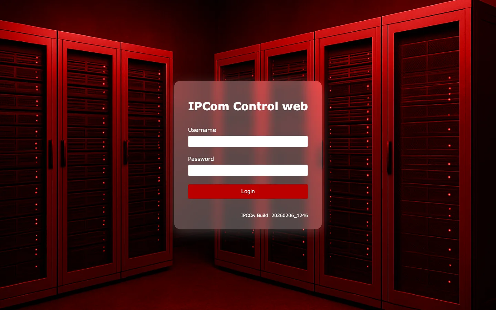

# Prieiga ir prisijungimas

**Paskirtis:** Paaiškinti, kaip operatoriai pasiekia IPcom5 Control ir prisijungia naudodami palaikomus diegimo būdus.

## Prieigos būdai

- `Žiniatinklio prieiga` prieinama visiems diegimo variantams per naršyklės URL / domeną ir valdymo prievadą.
- `Windows .exe prieiga` prieinama Windows diegimuose ir atidaro tą pačią IPcom Control aplinką per Windows kliento kelią.

## Žiniatinklio prieigos eiga

1. Atidarykite IPcom Control URL naršyklėje (`http(s)://<host>:<port>`).
2. Prisijungimo puslapyje prieš įvesdami kredencialus patvirtinkite tikslinę instanciją / versiją.
3. Prisijunkite savo naudotojo paskyra.
4. Po prisijungimo patikrinkite aplinką ir būseną kortelėje `Būsena`.

## Windows `.exe` prieigos eiga

1. Paleiskite IPcom Control `.exe` iš Windows diegimo vietos.
2. Pasirinkite arba įveskite tikslinę imtuvo instanciją (host / domeną ir prievadą).
3. Autentifikuokitės savo IPcom paskyros kredencialais.
4. Patikrinkite, kad dirbate numatytoje instancijoje, naudodami kortelės `Būsena` antraštės / poraštės kontekstą.

## Prieigos saugumo bazė

- Kai tik įmanoma, valdymo prieigai naudokite HTTPS.
- Valdymo UI pasiekiamumą ribokite iki patikimų tinklų (VPN / allowlist / ugniasienės politika).
- `administrator` paskyrą palikite avariniam naudojimui, o kasdieniam darbui naudokite vardines paskyras.
- Reguliariai keiskite kredencialus ir integracijų paslaptis.

## Greitas trikčių šalinimas

- `Nepavyksta prisijungti`: patikrinkite teisingą host / prievadą, paskyros kredencialus ir paskyros būseną kortelėje `Naudotojai`.
- `Atidaryta neteisinga instancija`: patvirtinkite antraštės instancijos žymą ir poraštės host / naudotojo kontekstą kortelėje `Būsena`.
- `Sesija baigiasi per greitai`: peržiūrėkite žetono nustatymus ir vaidmens politiką kortelėje `Naudotojai`.
- `Netikėta versija / leidinys`: stabdykite pakeitimus ir prieš tęsdami patvirtinkite diegimo taikinį.

## Susiję puslapiai

- Paskyrų valdymas: [Naudotojų kortelė](./screens/users.md)
- Pirmasis patikrinimas po prisijungimo: [Būsenos kortelė](./screens/status.md)
