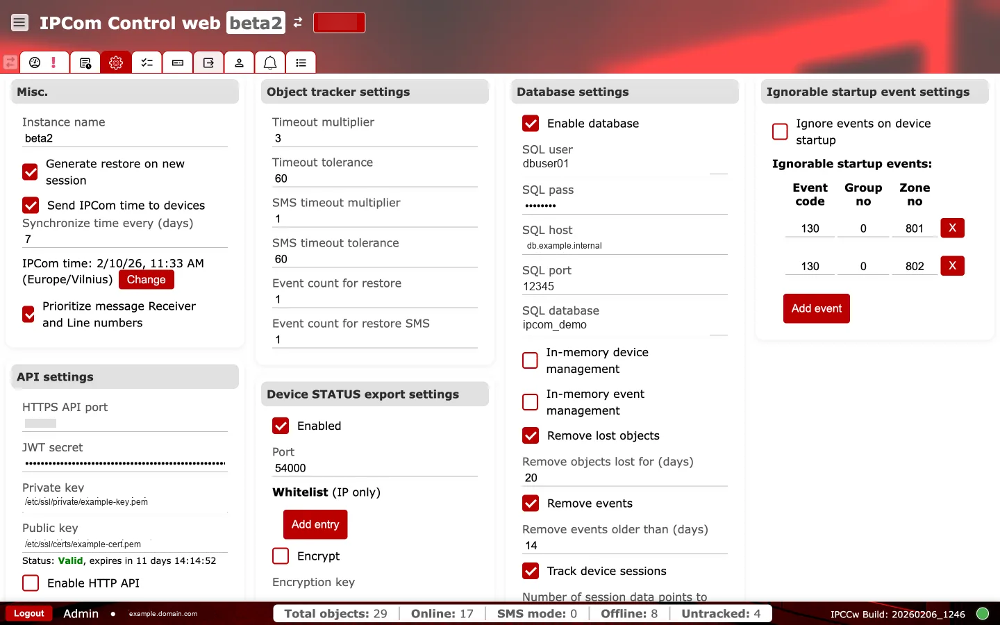
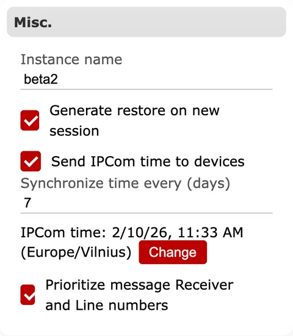
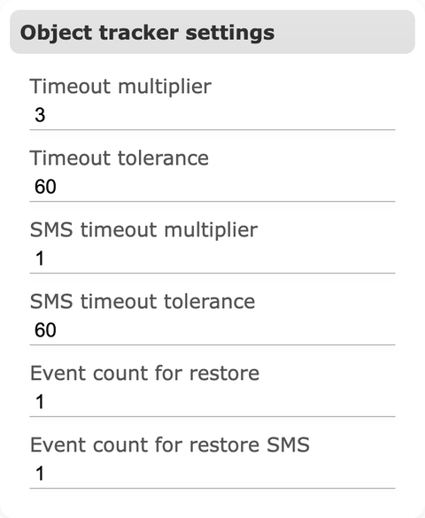
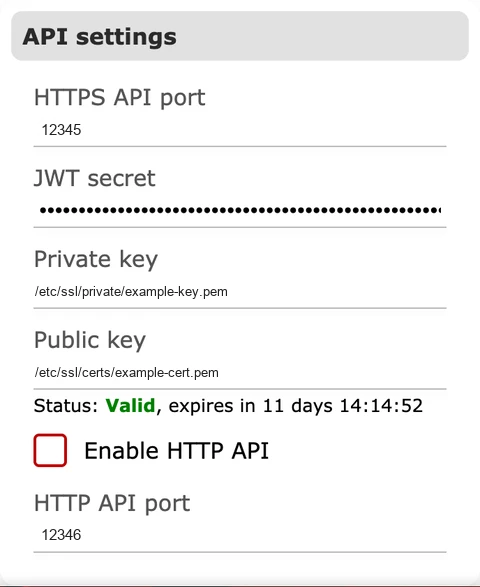
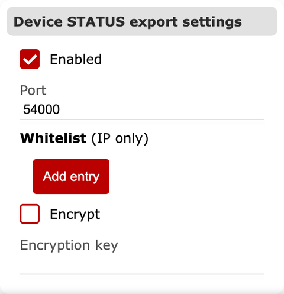
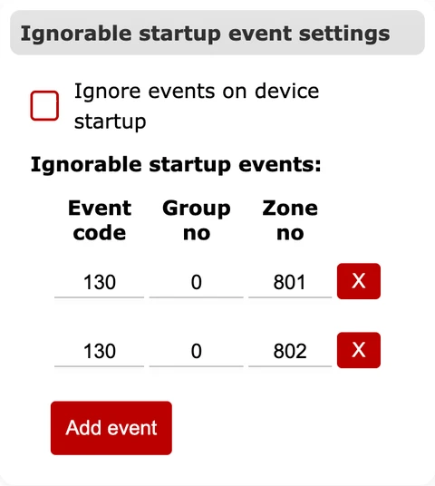

# Bendrieji nustatymai

**Paskirtis:** Konfigūruoti visos instancijos nustatymus, kurie daro įtaką laikui, priežiūrai, duomenų bazės veikimui, API prieigai ir paleidimo įvykių apdorojimui.

## Kada naudoti

- Pradinio diegimo metu, kai reikia nustatyti tapatybę, laiko sinchronizavimą, API ir duomenų bazės ryšį.
- Kai eksploatavimui reikia derinti priežiūros, saugojimo arba eksporto elgseną.

## Skiltys ir kodėl jos svarbios {#general-sections}

### Kita

Apibrėžia instancijos pavadinimą ir sesijų elgseną. Instancijos pavadinimas rodomas UI ir padeda operatoriams patvirtinti, kad jie dirba su tinkamu imtuvu. Tokios parinktys kaip `Generate restore on new session` daro įtaką tam, kaip po persijungimo generuojami restore įvykiai, o tai paveikia tolesnį stebėjimą. Laiko sinchronizavimo nustatymai valdo, ar IPcom siunčia savo laiką į įrenginius ir kaip dažnai tai daro, o tai tiesiogiai veikia įvykių laiko žymas.

**Veikimo patikros ir veiksmai:**

- Stebėkite: `Send IPcom time to devices` ir sinchronizavimo intervalą. Įspėjamasis požymis: laiko žymų dreifas tarp imtuvo ir CMS.
- Stebėkite: instancijos pavadinimo pakeitimus. Įspėjamasis požymis: operatoriai pasirenka neteisingą imtuvą.
- Patvirtinkite: `instance_name` negali būti tuščias.
- Patvirtinkite: `synchronize_device_time_interval` turi būti didesnis už `0`.

### Objektų stebėjimo nustatymai

Valdo prižiūrimų įrenginių priežiūros laiką. Timeout daugikliai ir tolerancijos nustato, kada įrenginys laikomas offline. Atskiros SMS reikšmės taikomos, kai įrenginiai atsiskaito per SMS. Restore įvykių skaičius reguliuoja, kada sistema išsiunčia atkūrimo pranešimus įrenginiui sugrįžus.

**Veikimo patikros ir veiksmai:**

- Stebėkite: timeout daugiklius ir tolerancijas. Įspėjamasis požymis: klaidingi offline aliarmai arba restore įvykių audros.
- Patvirtinkite: `timeout_multiplier` ir `sms_timeout_multiplier` turi būti `1..100`.
- Patvirtinkite: `timeout_tolerance` ir `sms_timeout_tolerance` turi būti `0..3600`.
- Patvirtinkite: `event_count_for_restore` ir `event_count_for_restore_sms` turi būti `1..10`.

### API nustatymai

Apibrėžia HTTPS API prieigą, prievadą ir paslaptis. Šie nustatymai valdo, kaip išorinės sistemos integruojasi su IPcom, todėl jie turi būti suderinti su ugniasienėmis ir reverse proxy. Šioje skiltyje rodoma TLS sertifikato būsena padeda patvirtinti saugią prieigą.

API prieigą reikėtų riboti patikimais administravimo / integracijų tinklais.

**Veikimo patikros ir veiksmai:**

- Stebėkite: `Enable HTTP API`, API prievadus ir TLS būseną. Įspėjamasis požymis: netikėtai atvertas valdymo kelias arba sertifikato problemos.
- Stebėkite: `Enable cluster`. Įspėjamasis požymis: mazgų būsenos išsiskyrimas arba failover anomalijos.
- Patvirtinkite: `api_port` ir `api_http_port` turi būti tarp `1` ir `65535`.
- Patvirtinkite: `api_jwt_secret` turi būti tiksliai 64 simbolių ilgio.
- Patvirtinkite: `private_key` ir `public_key` negali būti tušti ir turi rodyti į galiojančius PEM failus.

### Įrenginių STATUS eksporto nustatymai

Įjungia būsenos eksporto listenerį ir konfigūruoja jo prievadą bei IP whitelist. Naudokite šią funkciją tolesnėms sistemoms, kurios vartoja įrenginių būsenos atnaujinimus. Jei eksportas siunčiamas nepatikimais tinklais, galima įjungti šifravimą.

**Veikimo patikros ir veiksmai:**

- Stebėkite: `Enabled`, `Port`, `Whitelist` ir `Encrypt` reikšmes. Įspėjamasis požymis: dingęs būsenos eksportas arba srautas iš netikėtų šaltinių.
- Patvirtinkite: Device STATUS eksporto `port` turi būti `1..65535`.
- Patvirtinkite: jei STATUS eksporto šifravimas įjungtas, rakto ilgis turi būti tiksliai 16 simbolių.

### Duomenų bazės nustatymai

Įjungia SQL duomenų bazę ir konfigūruoja ryšio duomenis (naudotoją, slaptažodį, host'ą, prievadą, duomenų bazę). Atmintyje laikomų įrenginių ir įvykių valdymo parinktys valdo talpyklą ir valymą. `Remove lost objects` ir `Remove events` saugojimo reikšmės nustato, kiek laiko duomenys laikomi prieš pašalinimą, o tai daro įtaką saugyklai ir audito gyliui.

**Veikimo patikros ir veiksmai:**

- Stebėkite: `Enable database` ir SQL ryšio laukus. Įspėjamasis požymis: po perkrovimo dingę žurnalai / istorija.
- Stebėkite: `Remove lost objects` ir `Remove events` saugojimo reikšmes. Įspėjamasis požymis: duomenys dingsta anksčiau, nei numato politika.
- Patvirtinkite: jei duomenų bazė įjungta, `sqluser`, `sqlpass`, `sqlhost` ir `sqldatabase` negali būti tušti.
- Patvirtinkite: `sqlport` turi būti `1..65535` (`0` reiškia, kad IPcom naudos numatytąjį prievadą `3306`).
- Patvirtinkite: `remove_lost_objects_age` ir `remove_events_age` turi būti `1..365` dienos.
- Patvirtinkite: `device_session_log_count` turi būti `1..25`.

### Nepaisomų paleidimo įvykių nustatymai

Leidžia slopinti konkrečius įvykių kodus įrenginio paleidimo metu. Tai naudinga mažinant triukšmą masinių persijungimų arba planinės priežiūros metu. Naudokite įvykių sąrašą kodams, kurių reikia nepaisyti, pridėti arba pašalinti.

**Veikimo patikros ir veiksmai:**

- Stebėkite: `Ignore events on device startup` ir išimčių sąrašą. Įspėjamasis požymis: kritiniai paleidimo aliarmai nepasiekia CMS.
- Patvirtinkite: `event_code <= 0xFFF`, `group_no <= 0xFF`, `zone_no <= 0xFFF`, o kiekvienas trejetas turi būti unikalus.

## Pakeitimų valdymas

- API, duomenų bazės ir saugojimo nustatymų pakeitimus planuokite techninės priežiūros languose.
- Audito ir grąžinimo tikslams užfiksuokite reikšmes prieš pakeitimą ir po jo bei numatomą poveikį.
- Po kiekvieno pakeitimo patikrinkite `Būseną`, `Žurnalus` ir paskirties sistemų pristatymo kelius.
- Iš anksto pasiruoškite grąžinimo kelią duomenų bazės, API ir cluster tipo pakeitimams.
