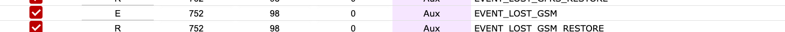

# Vidiniai įvykiai

**Paskirtis:** Peržiūrėti ir valdyti sistemos sugeneruotus įvykius bei kodus, siunčiamus į tolesnes paskirties sistemas.

## Kada naudoti

- Kai reikia susieti vidinius įvykius su CMS arba automatizavimo kodais.
- Kai reikia įjungti arba slopinti konkrečius vidinius įvykius.

## Skiltys ir kodėl jos svarbios

### Vidinių įvykių sąrašas {#internal-events-list}

Kiekviena eilutė apibrėžia, kaip vidinė sistemos būsena pateikiama išeinančiuose pranešimuose. Čia vidinių įvykių pavadinimus suderinate su skaitiniais kodais, kurių tikisi jūsų stebėjimo platforma.

### Paaiškinti stulpeliai {#internal-events-columns}

- `Enabled`: ar įvykis aktyvus (pažymėtas), ar slopinamas.
- `Classificator`: įvykio klasifikatorius (pavyzdžiui, `E` reiškia event, `R` reiškia restore).
- `Event code`: skaitinis kodas, siunčiamas įvykių išėjime.
- `Group no` ir `Zone no`: skaitiniai maršrutizavimo laukai, naudojami imtuvo integracijose.
- `Type`: kategorija, tokia kaip `System` arba `Aux`.
- `Name`: vidinis įvykio identifikatorius (pavyzdžiui, `EVENT_SYSTEM_STARTED`).

Išjungus įvykius arba pakeitus kodus, keičiasi tolesnis maršrutizavimas ir aliarmų interpretavimas, todėl pakeitimus reikia derinti su stebėjimo platforma.

### Veikimo patikros ir veiksmai {#internal-events-operational-checks}

Po bet kokio pakeitimo atlikite dvi greitas peržiūras: pirmiausia stebėkite įvykių elgseną tolesnėse sistemose, tada patikrinkite taisyklių integralumą lentelėje.

**Stebėkite vykdymo metu:**

- Netikėtai besikeičiančius Enabled / disabled perjungimus. Įspėjamasis požymis: vidiniai aliarmai nustoja rodytis tolesnėse sistemose.
- Netikėtus įvykių kodų pasikeitimus po atnaujinimų. Įspėjamasis požymis: CMS pradeda neteisingai dekoduoti vidinius įvykius.
- `Type` perjungimą tarp `System` ir `Aux` be pakeitimo užklausos. Įspėjamasis požymis: neteisinga klasifikacija tolesnėje sistemoje.
- Iš poros sudarytų `E` (event) ir `R` (restore) taisyklių išsiderinimą. Įspėjamasis požymis: trūksta restore įvykių.

**Patvirtinkite prieš naudojimą produkcijoje:**

- `classificator` yra `E` (event) arba `R` (restore).
- `event_code`, `group_no` ir `zone_no` patenka į leistinus skaitinius intervalus.
- `name` negali būti tuščias.
- `type` yra viena iš palaikomų reikšmių.
- Kodavimas suderintas su CMS parsingo taisyklėmis prieš įjungiant produkcijoje.
