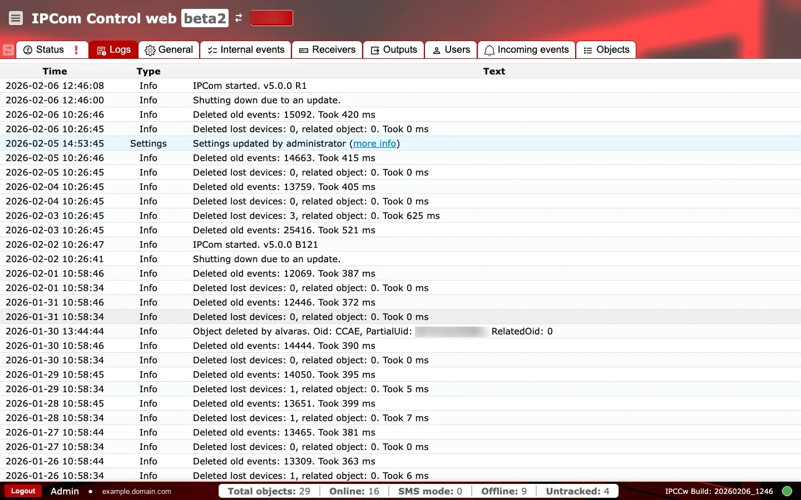

# Žurnalai

**Paskirtis:** Pateikti sistemos veiklos ir administracinių veiksmų auditinį pėdsaką trikčių šalinimui ir atitikties užtikrinimui.

## Kada naudoti

- Po konfigūracijos pakeitimų, kad patvirtintumėte, jog jie pritaikyti.
- Tiriant perkrovimus, valymo užduotis arba netikėtą elgseną.

## Skiltys ir kodėl jos svarbios

### Žurnalo lentelė {#logs-table}

Kiekviena eilutė registruoja sistemos arba administracinį įvykį su laiko žyma, tipu ir pranešimu. Tai pirmoji vieta, kur verta patvirtinti suplanuotą valymą, atnaujinimus arba konfigūracijos pakeitimus. Kai kuriuose įrašuose yra `more info` nuoroda su išsamesnėmis detalėmis, padedančiomis nustatyti, kas pasikeitė ir kas inicijavo veiksmą.

### Veikimo patikros ir veiksmai {#logs-operational-checks}

Atlikite dvi greitas peržiūras: pirmiausia stebėkite šablonus naujausiuose įrašuose, tada prieš eskalaciją patikrinkite įvykio metaduomenis.

**Stebėkite vykdymo metu:**

- Pasikartojančius `error` įrašus trumpuose laiko languose. Įspėjamasis požymis: pasikartojantis transporto arba paslaugos nestabilumas.
- Dažnus `Settings` tipo įrašus už techninės priežiūros langų ribų. Įspėjamasis požymis: neautorizuoti arba atsitiktiniai pakeitimai.
- `more info` aktoriaus / šaltinio reikšmę, kuri nesutampa su tikėtinu operatoriumi arba automatizavimo paskyra. Įspėjamasis požymis: neplanuoti administraciniai pakeitimai.

**Patvirtinkite prieš naudojimą produkcijoje:**

- `Type` žymos išlieka nuoseklios (`info`, `warning`, `error`, `settings`).
- Tos pačios incidento sekos laiko žymos laikosi tikėtinos chronologinės tvarkos.

## Incidento kontrolinis sąrašas {#logs-incident-checklist}

- `Paskirties pristatymo nesėkmės`: ieškokite pasikartojančių išėjimo ryšio klaidų ir timeout modelių.
- `Imtuvo priėmimo nesėkmės`: po prievadų ar tinklo pakeitimų ieškokite listenerio bind / start klaidų.
- `Autentifikacijos ir teisių problemos`: po paskyrų ar žetonų pakeitimų ieškokite nesėkmingų login / auth įvykių.
- `Atsilikimo simptomai`: susiekite valymo arba warning įrašus su buferio augimu kortelėje `Būsena`.
