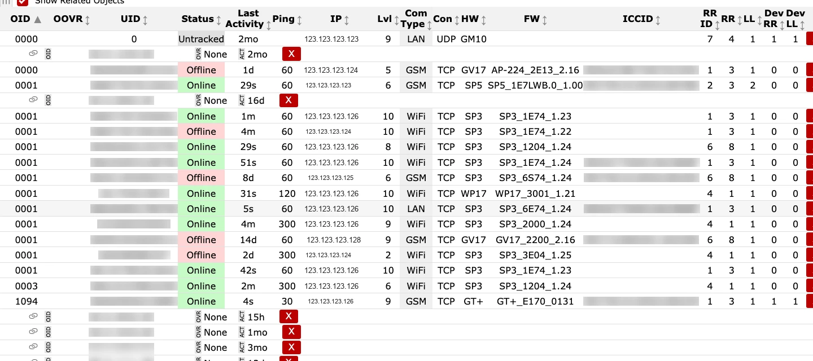

# Objektai

**Paskirtis:** Peržiūrėti ir valdyti stebimų objektų (įrenginių) sąrašą, jų būseną ir ryšio duomenis.

## Kada naudoti

- Kai ieškote konkretaus įrenginio arba tikrinate jo online būseną.
- Kai eksportuojate įrenginių sąrašus arba audituojate ryšio problemas.

## Skiltys ir kodėl jos svarbios

### Veiksmai ir filtrai {#objects-actions-filters}

- `Refresh` iš naujo įkelia sąrašą, kad būtų parodytos naujausios įrenginių būsenos.
- `Delete all objects` pašalina visus objektus iš sąrašo ir turi būti naudojamas tik gavus aiškų patvirtinimą.
- `Export` atsisiunčia sąrašą ataskaitoms arba analizei. [REVIEW]
- `OID` ir `UID` filtravimo laukai padeda susiaurinti didelius sąrašus, o `+` pritaiko filtrą, `Clear` jį atstato.
- `Show Related Objects` išplečia sąrašą susijusiais įrašais.

### Objektų sąrašo lentelė {#objects-object-list}

Pagrindiniai stulpeliai:

- Identifikavimas: `OID`, `UID` ir `ICCID` identifikuoja įrenginį bei SIM kortelę.
- Būsena: `Status` ir `Last Activity` rodo pasiekiamumą ir paskutinio atsiskaitymo laiką.
- Ryšys: `Ping`, `IP`, `Lvl` (signalo lygis), `Com Type` (GSM / WiFi / LAN) ir `Con` (TCP / UDP) parodo perdavimo būklę.
- Įrenginio versija: `HW` ir `FW` padeda susieti elgseną su programinės arba aparatinės įrangos leidimu.
- Maršrutizavimas: `RR ID` (maršruto identifikatorius), `RR` (imtuvo maršruto reikšmė) ir `LL` (linijos reikšmė) rodo maršrutizavimo kontekstą; `Dev RR` ir `Dev LL` yra įrenginio pateiktos maršrutizavimo reikšmės.
- `OOVR` yra objekto priežiūros laukas. Tiksli semantika vis dar [REVIEW].

Raudoni `X` indikatoriai stulpelyje `Ping` paprastai reiškia, kad neseniai nebuvo užfiksuotas ping.
Visas laukų reikšmes žr. `Žodynėlyje` IPcom navigacijoje.

### Veikimo patikros ir veiksmai {#objects-operational-checks}

Atlikite dvi greitas peržiūras: pirmiausia stebėkite objektų būsenos signalus laike, tada patikrinkite lentelės reikšmes pagal numatytą maršrutizavimą ir inventorių.

**Stebėkite vykdymo metu:**

- Atsitiktinius destruktyvius veiksmus (`Delete all objects`) eksploatacijos metu. Įspėjamasis požymis: staiga tuščias inventorius.
- Pasenusią filtro būseną. Įspėjamasis požymis: tikėti įrenginiai nerodomi dabartiniame vaizde.
- `Status` ir `Last Activity` išsiskyrimą. Įspėjamasis požymis: objektas rodomas online, bet veiklos laiko žyma pasenusi.
- Pasikartojančius `Ping` raudonus `X` toje pačioje perdavimo grupėje. Įspėjamasis požymis: kanalo arba kelio degradacija.
- Nepaaiškintas `OOVR` reikšmių kaitas incidento metu. Įspėjamasis požymis: galimas paslėptas priežiūros būsenos pokytis. [REVIEW]

**Patvirtinkite prieš naudojimą produkcijoje:**

- Prieš incidento analizės momentines kopijas naudojamas `Refresh`.
- Maršrutizavimo laukai (`RR ID`, `RR`, `LL`, `Dev RR`, `Dev LL`) atitinka imtuvų / išėjimų susiejimą.
- Aparatinės ir programinės įrangos laukai (`HW`, `FW`) pateikti tikėtiniems valdomų įrenginių tipams.
