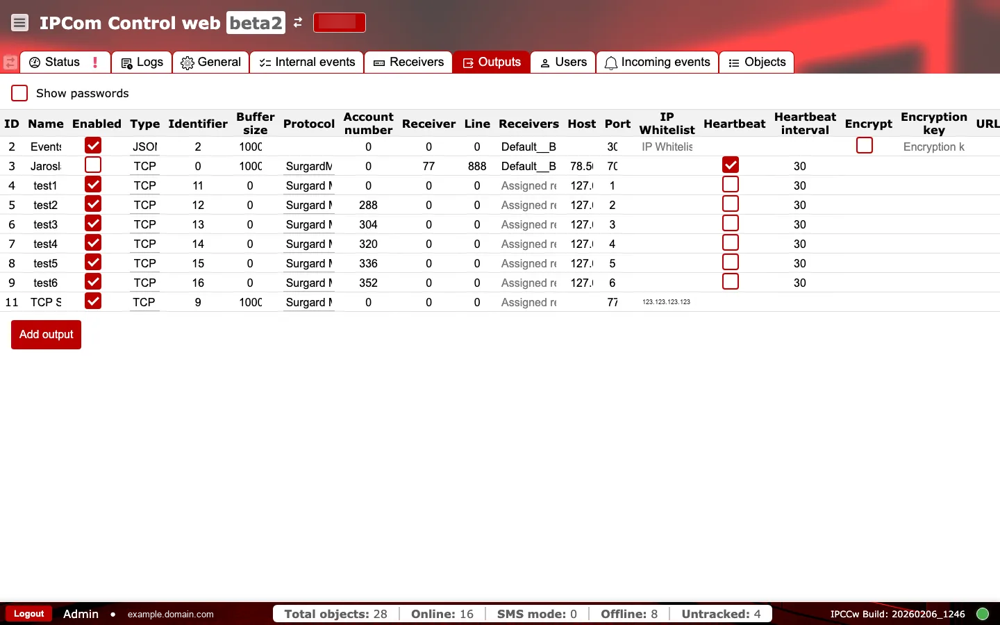

# Išėjimai

**Paskirtis:** Konfigūruoti įvykių pristatymo paskirties taškus ir automatizavimo integracijas.

## Kada naudoti

- Kai kuriate arba atnaujinate CMS ar automatizavimo maršrutus.
- Kai šalinate pristatymo į konkretų paskirties tašką triktis.

## Skiltys ir kodėl jos svarbios

### Išėjimų lentelė {#outputs-table}

Kiekviena eilutė reiškia vieną paskirties tašką ir jo maršrutizavimo konfigūraciją. Pagrindiniai laukai:

- `ID` ir `Name`: identifikuoja išėjimą.
- `Enabled`: valdo, ar į šį paskirties tašką siunčiami įvykiai.
- `Type` ir `Protocol`: apibūdina išėjimo transportą.
- `Identifier` ir `Account number`: paskirties sistemos tikėtini maršrutizavimo identifikatoriai.
- `Receiver` ir `Line`: imtuvo pusės maršrutizavimo identifikatoriai.
- `Receivers`: šiam išėjimui priskirta imtuvų grupė.
- `Host` ir `Port`: nuotolinio paskirties taško adresas.
- `Buffer size`: eilės limitas vienam išėjimui, naudojamas pristatymo siaurųjų vietų nustatymui.
- `Heartbeat` ir `Heartbeat interval`: ryšio būklės tikrinimas.
- `Encrypt` ir `Encryption key`: saugo transportą, kai to reikia (API integracijos naudoja fiksuoto ilgio raktą).
- `IP Whitelist`: riboja leidžiamus paskirties IP adresus.
- `Filters`: įvykių maršrutizavimo filtrai, valdantys, kurie įvykiai siunčiami.

Galimi `Type` pasirinkimai:

- `TCP`
- `COM Port`
- `JSON Server`
- `TCP Server`
- `Webhook`

Galimi `Protocol` pasirinkimai:

- `Surgard MLR2`
- `Monas 3`
- `Surgard MLR2 8`
- `Surgard MLR2 No End`
- `Ademco 685`
- `Ademco 685 CID`
- `SurgardMRL2000 CID`
- `SIA DC-09`
- `Surgard MLR2 Line with Account`

Neteisingi šios vietos laukai yra dažna nepristatytų įvykių priežastis, todėl pakeitimus tikrinkite pagal paskirties sistemos reikalavimus.

`Buffer size` yra eilės limitas vienam išėjimui. Didelis arba augantis eilės užpildymas rodo paskirties taško vėlavimą arba protokolo neatitikimą ir gali lemti pavėluotą aliarmų pristatymą.

Protokolui specifinių laukų naudojimas skiriasi pagal integraciją ir turi atitikti CMS parserio profilį, naudojamą jūsų diegime.

FYI: jei `buffer_size` nustatytas į `0`, IPcom naudoja numatytąjį `1000` įvykių eilės dydį.

### Pridėti išėjimą {#outputs-add-output}

Naudokite `Add output`, kai reikia sukurti naują paskirties tašką ir užpildyti maršrutizavimo identifikatorius bei tinklo reikšmes.

### Veikimo patikros ir veiksmai {#outputs-operational-checks}

Po bet kokio pakeitimo atlikite dvi greitas peržiūras: pirmiausia stebėkite veikimą vykdymo metu, tada prieš įjungdami produkcinį pristatymą patvirtinkite konfigūracijos detales.

**Stebėkite vykdymo metu:**

- `Buffer size` augimą aktyviuose išėjimuose. Įspėjamasis požymis: eilė neištuštėja, nors įrenginiai toliau generuoja įvykius.
- Endpoint'o / protokolo redagavimus be suderintų CMS pakeitimų. Įspėjamasis požymis: pristatymo nesėkmės arba dekodavimo klaidos.
- Naujai įjungtą išėjimą prieš paskirties taško parengtį. Įspėjamasis požymis: iškart augantis buferis ir nesėkmingi bandymai prisijungti.

**Patvirtinkite prieš naudojimą produkcijoje:**

- Išėjimo `id` yra unikalus ir didesnis už `0`; `name` negali būti tuščias.
- `Type`, `Protocol` ir `Identifier` atitinka CMS integracijos profilį.
- `OID`, `Receiver number` ir `Line` atitinka numatytą maršrutizavimą CMS.
- Jei įjungtas šifravimas, `encryption_key` ilgis yra tiksliai `16` simbolių.
- Išėjimo `IP Whitelist` ir `Host` politika atitinka `Tinklo ir ugniasienės gairių` rekomendacijas.
- Dėl šifravimo rakto simbolių rinkinio / koduotės sutarta su jūsų integracijų komanda.
- Jūsų diegime dokumentuota retry / backoff ir eilės išsaugojimo elgsena.
- Prieš įjungdami produkcijoje paleiskite kontroliuojamus testinius įvykius kiekvienam protokolui.

## Eksploatacijos gairės {#outputs-operations-runbook}

- `Įvykiai nepasiekia paskirties taško`: patikrinkite `Enabled`, paskirties `Host` / `Port`, protokolo pasirinkimą ir imtuvo / linijos susiejimą.
- `Dažni persijungimai`: suderinkite `Heartbeat interval`, patikrinkite tinklo stabilumą ir patvirtinkite, kad paskirties sistema priima sukonfigūruotą protokolą.
- `Vieno išėjimo eilė auga`: laikinai išjunkite probleminį išėjimą, sutvarkykite endpoint'o nustatymus, tada vėl įjunkite ir stebėkite buferio atsistatymą.
- `Pakeitimai sugadina pristatymą`: palyginkite su žinomai veikiančiu išėjimu ir grįžkite prie paskutinių stabilių reikšmių prieš bandydami dar kartą.
