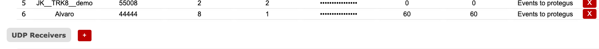

# Imtuvai

**Paskirtis:** Konfigūruoti imtuvų endpoint'us (TCP, UDP, COM ir Modem), kurie priima įeinantį įrenginių srautą, ir apibrėžti maršrutizavimo parametrus.

## Kada naudoti

- Kai prijungiate naują imtuvo endpoint'ą arba keičiate klausymo prievadus.
- Kai keičiasi maršrutizavimo identifikatoriai arba šifravimo nustatymai.

## Skiltys ir kodėl jos svarbios

### TCP imtuvai {#receivers-tcp}

Apibrėžia TCP klausymo endpoint'us. `Port` nustato, kur jungiasi įrenginiai. `Receiver #` ir `Line #` yra maršrutizavimo identifikatoriai, naudojami tolesnėse sistemose. `Encryption Password` saugo šifruotą srautą. `SIA - Time Dev.` laukai apibrėžia leistinas SIA protokolo laiko nuokrypio ribas (neigiamą ir teigiamą).

Naudokite nuoseklų imtuvo / linijos susiejimą su išėjimais ir CMS lūkesčiais.

**Veikimo patikros ir veiksmai:**

- Stebėkite: aktyvaus priėmimo kritimą pakeitus prievadą. Įspėjamasis požymis: kortelėje `Būsena` sesijos krenta iki nulio.
- Stebėkite: linijos / imtuvo peržymėjimą be CMS pakeitimų valdymo. Įspėjamasis požymis: įvykiai nukreipiami ne tam tenant'ui / skirsniui.
- Patvirtinkite: TCP prievadai turi būti `1..65535`.
- Patvirtinkite: TCP prievadai turi būti unikalūs TCP imtuvų rinkinyje.
- Patvirtinkite: imtuvo `id` turi būti unikalus ir didesnis už `0`; imtuvo `name` negali būti tuščias.
- Patvirtinkite: šifravimo slaptažodžio ilgis turi būti tiksliai `6` arba `16` simbolių.

### UDP imtuvai {#receivers-udp}

Apibrėžia UDP klausymo endpoint'us. Naudokite juos, kai įrenginiai atsiskaito per UDP. Laukų reikšmės analogiškos TCP imtuvams, naudojant tuos pačius maršrutizavimo identifikatorius.

**Veikimo patikros ir veiksmai:**

- Stebėkite: UDP paketų priėmimo neatitikimą numatytam įrenginių parko protokolui. Įspėjamasis požymis: aktyvūs įrenginiai nerodo įvykių.
- Patvirtinkite: UDP prievadai turi būti `1..65535`.
- Patvirtinkite: UDP prievadai turi būti unikalūs UDP imtuvų rinkinyje.

### COM imtuvai {#receivers-com}

Apibrėžia nuosekliuosius (RS232 / COM) imtuvus vietinėms integracijoms. Paprastai jie naudojami tada, kai aparatūra arba senesnės centralės atsiskaito per nuosekliąsias jungtis.

**Veikimo patikros ir veiksmai:**

- Stebėkite: įjungtą COM imtuvą be fizinio nuoseklaus ryšio. Įspėjamasis požymis: nėra gaunamų įvykių iš nuosekliųjų panelių.
- Patvirtinkite: COM imtuvo `port_id` rodo į egzistuojantį COM terminalą.

### Modemo imtuvai {#receivers-modem}

Apibrėžia modemų pagrindu veikiančius imtuvus SMS arba dial-up tipo srautui. Naudokite juos, kai diegime dalyvauja SMS arba modemų kanalai.

**Veikimo patikros ir veiksmai:**

- Stebėkite: modemo imtuvo maršruto kaitą ryšio sutrikimų laikotarpiais. Įspėjamasis požymis: trūkstami arba vėluojantys SMS įvykiai.
- Patvirtinkite: modemo imtuvo `port_id` rodo į egzistuojantį COM terminalą.
- Patvirtinkite: modemo šifravimo slaptažodžio ilgis yra `6` arba `16` simbolių.

### Priskirti išėjimai ir šalinimas {#receivers-assigned-outputs}

Stulpelis `Assigned outputs` rodo, kurie išėjimai susieti su kiekvienu imtuvu. Raudonas `X` veiksmas pašalina imtuvo įrašą, todėl jį naudokite tik gavę aiškų patvirtinimą.

**Veikimo patikros ir veiksmai:**

- Stebėkite: imtuvus be priskirtų išėjimų. Įspėjamasis požymis: priėmimas veikia, bet nėra tolesnio pristatymo.
- Stebėkite: atsitiktinį šalinimo veiksmą (`X`) aktyvios eksploatacijos metu. Įspėjamasis požymis: staiga dingęs imtuvas.
- Patvirtinkite: kiekvienas aktyvus imtuvas turi bent vieną numatytą išėjimo susiejimą.

## Tinklo pastabos

- Imtuvų kortelės apibrėžia įeinančius endpoint'us (įrenginys -> IPcom).
- Išėjimų kortelės apibrėžia išeinančius paskirties taškus (IPcom -> CMS / automatizavimas).
- Keisdami imtuvo prievadus, prieš perjungdami produkcinį srautą atnaujinkite ugniasienės ir NAT taisykles.
