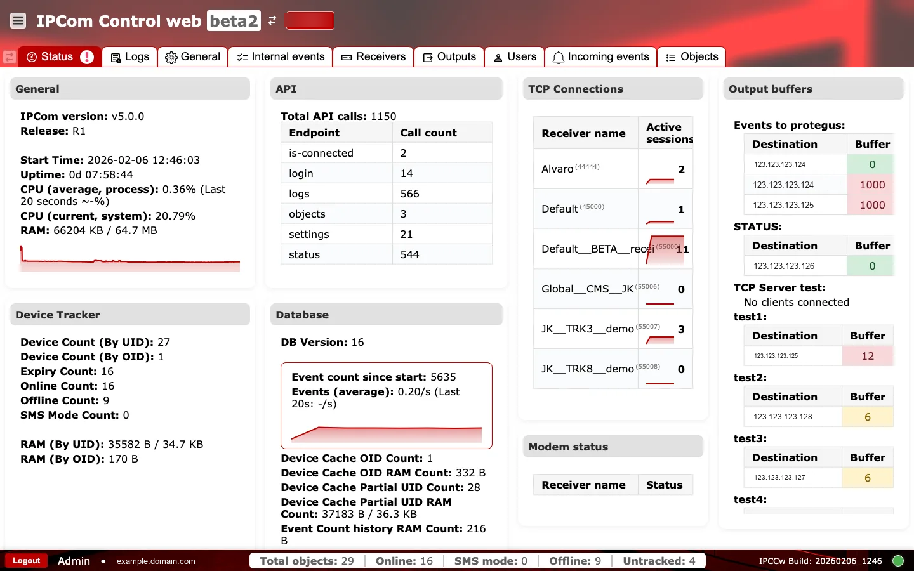
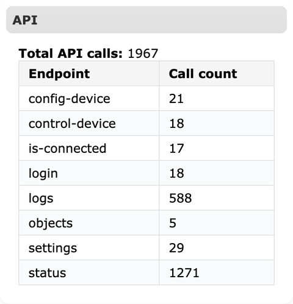
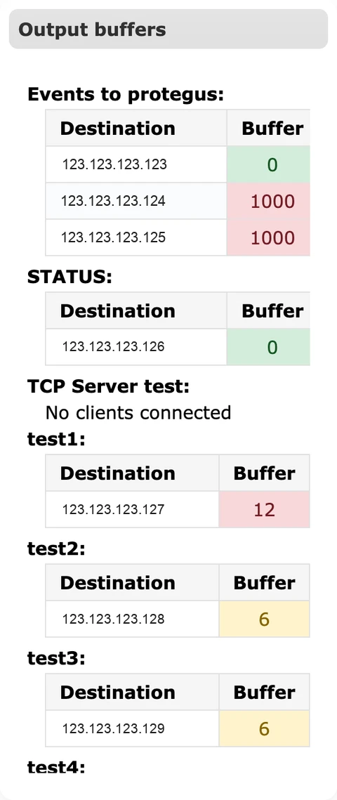

# Būsena

**Paskirtis:** Pateikti pasirinktai IPcom instancijai gyvą eksploatacinę apžvalgą, kad operatoriai galėtų iš pirmo žvilgsnio patvirtinti būseną, apkrovą ir ryšį.

## Kada naudoti

- Po prisijungimo, kad patvirtintumėte instancijos versiją, veikimo laiką ir bendrą būseną.
- Tiriant perdavimo problemas, buferių kaupimąsi arba ryšio nutrūkimus.

## Skiltys ir kodėl jos svarbios

### Poraštė

- `Kairysis blokas` rodo atsijungimo valdiklį, dabartinio naudotojo tapatybę ir prijungtą host'ą; tai naudojama patvirtinti, kad dirbate numatytoje aplinkoje ir su tinkama paskyra.  
  
- `Centrinis blokas` rodo priežiūros skaitiklius (`Total objects`, `Online`, `SMS mode`, `Offline`, `Untracked`) greitam patikrinimui prieš / po pakeitimų.  
  
- `Dešinysis blokas` rodo `IPCCw Build` ir gyvą ryšio indikatorių, kad būtų galima patvirtinti veikiančią versiją ir UI transporto būseną.  
  

### Bendra informacija

Rodo IPcom versiją ir leidimą, paleidimo laiką, veikimo trukmę, CPU naudojimą ir RAM naudojimą. Šie rodikliai padeda patvirtinti, kad imtuve veikia numatyta versija ir pakanka resursų esamai apkrovai. CPU tendencijos grafikas padeda pastebėti šuolius, galinčius paveikti įvykių apdorojimo delsą.

### API

Pateikia bendrą API iškvietimų skaičių pagal endpoint'ą. Tai greitas indikatorius, kiek aktyviai API naudoja išorinės integracijos arba UI veiksmai. Staigūs `login` arba `settings` iškvietimų šuoliai gali rodyti automatikos aktyvumą arba neteisingai sukonfigūruotą apklausą.

### TCP ryšiai

Rodo aktyvias sesijas pagal imtuvą. Kiekvienas imtuvo įrašas reiškia klausantį endpoint'ą su aktyviais įrenginių ryšiais. Staigus kritimas iki nulio dažniausiai rodo tinklo, ugniasienės arba imtuvo pusės problemas.

### Išėjimų buferiai

Parodo eilių dydžius pagal paskirties tašką tiek įvykiams, tiek būsenos atnaujinimams. Buferiai auga, kai IPcom nepajėgia pakankamai greitai pristatyti pranešimų. Nuolatinis augimas rodo ryšio su paskirties tašku problemas arba per didelius srauto pliūpsnius, kuriems reikia ribojimo.

### Įrenginių stebėjimas

Apibendrina įrenginių skaičių pagal UID / OID, online arba offline būseną, SMS mode naudojimą ir stebėjimui skirtą atminties naudojimą. Ši skiltis padeda įvertinti viso įrenginių parko būklę ir patvirtinti, kad įrenginių priežiūra veikia.

### Duomenų bazė

Rodo duomenų bazės versiją ir įvykių statistiką, įskaitant įvykių skaičių nuo paleidimo ir vidutinį įvykių dažnį. Tendencijos grafikas padeda aptikti aktyvumo kritimus ar šuolius. Talpyklos skaičiai ir RAM naudojimas leidžia spręsti apie duomenų saugojimo arba mastelio apribojimus.

### Modemo būsena

Pateikia modemų pagrindu veikiančio srauto imtuvų būseną. Naudokite šią skiltį, kai diegime naudojami SMS arba modemų kanalai, kad patikrintumėte, ar modemo imtuvas aktyvus.

### Prisijungę naudotojai

Rodo šiuo metu autentifikuotas UI sesijas ir jų šaltinio IP / prievadą. Tai naudinga nustatant lygiagrečias administratoriaus sesijas ir pastebint netikėtą prieigą incidentų metu.

## Tendencijos ir diagramos

Maži raudoni tendencijų grafikai po CPU ir įvykių statistika rodo pastarojo laiko aktyvumo pokyčius. Naudokite juos šuoliams ar kritimams nustatyti, jei reikia gilesnio tyrimo žurnaluose arba gaunamuose įvykiuose.

## Eksploatacijos gairės {#status-operations-runbook}

- `Išėjimo buferis nuolat auga`: patikrinkite paskirties taško pasiekiamumą, protokolo suderinamumą ir išėjimo kredencialus kortelėje `Išėjimai`.
- `Aktyvios sesijos nukrito iki 0`: patikrinkite listenerio prievadus ir ugniasienės taisykles kortelėje `Imtuvai`, tada peržiūrėkite tinklo kelią nuo įrenginių.
- `Vidutinis įvykių skaičius staiga sumažėjo`: patvirtinkite įrenginių ryšį kortelėje `Objektai` ir peržiūrėkite naujausias klaidas kortelėje `Žurnalai`.
- `CPU arba RAM šuoliai`: peržiūrėkite paskutinius konfigūracijos pakeitimus, sumažinkite triukšmingą srautą ir patikrinkite saugojimo nustatymus kortelėje `Bendrieji nustatymai`.

### Veikimo patikros ir veiksmai {#status-operational-checks}

Kasdienei priežiūrai atlikite dvi greitas peržiūras: pirmiausia stebėkite gyvus būsenos signalus, tada prieš eskalaciją patvirtinkite sesijos ir UI būseną.

**Stebėkite vykdymo metu:**

- `CPU (current/system)` ir `RAM`. Įspėjamasis požymis: ilgalaikis didelis naudojimas kartu su lėtesniu UI / API atsaku.
- `Active sessions` pagal imtuvą. Įspėjamasis požymis: staigus kritimas iki nulio aktyviuose imtuvuose.
- `Output buffer` tendencijas. Įspėjamasis požymis: buferis nuolat auga, o ne mažėja.
- `Online` / `Offline` / `Untracked` skaitiklius. Įspėjamasis požymis: staigus offline skaičiaus augimas po tinklo / konfigūracijos pakeitimų.
- `Events (average)` tendenciją. Įspėjamasis požymis: netikėtas kritimas ar šuolis, nepaaiškinamas grafiku.
- Pasikartojančius klaidų pranešimus įprastų veiksmų metu. Įspėjamasis požymis: apdorojimo arba būsenos sinchronizacijos problemos.

**Patvirtinkite prieš naudojimą produkcijoje:**

- Toast pranešimo tekstas atitinka ką tik atliktą veiksmą.
- Poraštės aplinkos tapatybė (`user`, `host`, `build`) sutampa su numatyta instancija.
