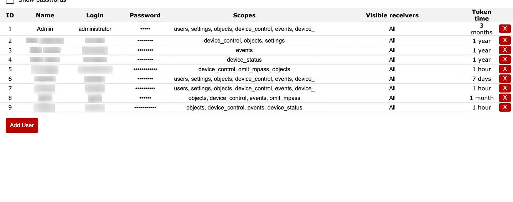
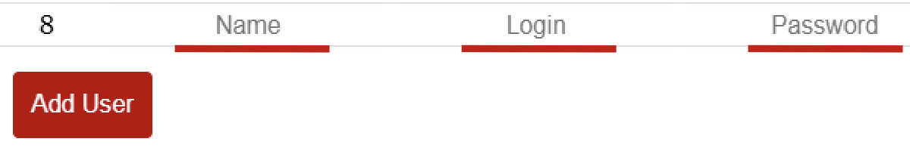
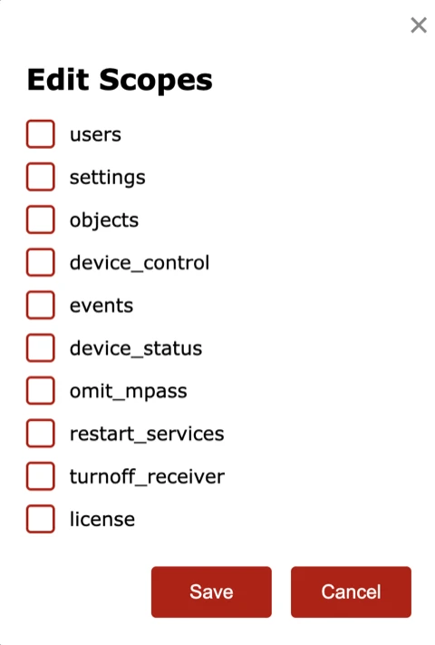
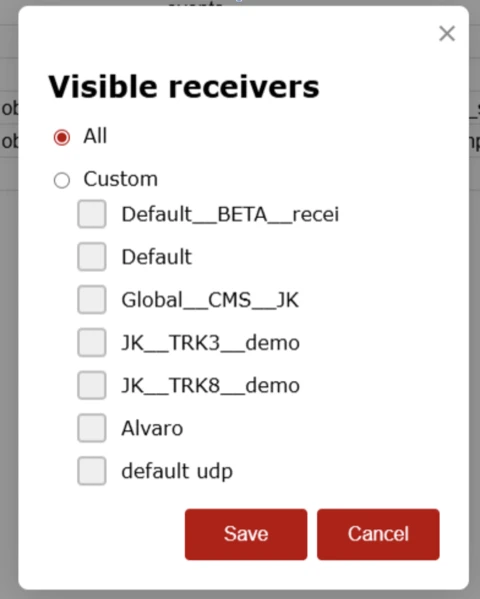
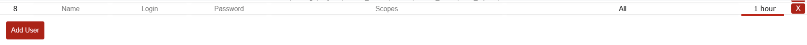
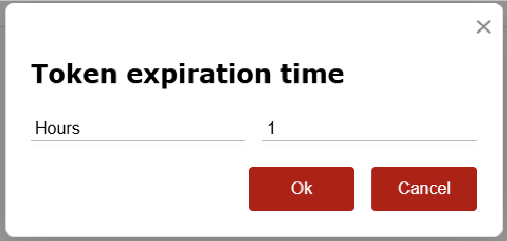

# Naudotojai

**Paskirtis:** Valdyti naudotojų paskyras, teises ir imtuvų matomumą.

## Kada naudoti

- Kai reikia pridėti arba pašalinti operatorius.
- Kai dėl saugumo reikia atnaujinti prieigos teises arba imtuvų matomumą.

## Skiltys ir kodėl jos svarbios

### Naudotojų lentelė {#users-table}

Kiekviena eilutė atitinka vieną naudotojo paskyrą.

- `ID`, `Name`, `Login`: tapatybės laukai, naudojami audite ir prisijungime.
- `Password`: pagal numatymą paslėptas.
- `Scopes`: naudotojui suteiktos teisės (pavyzdžiui, settings, events, objects). Ribokite scopes, kad sumažintumėte riziką.
- `Visible receivers`: prie kurių imtuvo instancijų naudotojas gali prisijungti.
- `Token time`: žetono galiojimo laikas, darantis įtaką sesijų trukmei ir saugos lygiui.

### Naudotojo pridėjimas ir šalinimas {#users-add-remove}

Naudokite `Add User`, kai kuriate naują paskyrą. Raudonas `X` veiksmas pašalina naudotoją ir turi būti naudojamas tik gavus aiškų patvirtinimą.

### Veikimo patikros ir veiksmai {#users-operational-checks}

Keisdami paskyras atlikite dvi greitas peržiūras: pirmiausia stebėkite aktyvius rizikos signalus, tada prieš perdavimą patvirtinkite atitiktį politikai.

**Stebėkite vykdymo metu:**

- Esamų paskyrų scope išplėtimą. Įspėjamasis požymis: naudotojai gauna settings / control teises už savo vaidmens ribų.
- Per ilgą `Token time` privilegijuotoms paskyroms. Įspėjamasis požymis: ilgai galiojančios padidintų teisių sesijos.
- Naudotojų šalinimą aktyvaus reagavimo langų metu. Įspėjamasis požymis: staigus prieigos praradimas budintiems operatoriams.

**Patvirtinkite prieš naudojimą produkcijoje:**

- Leidžiami scopes yra tik `users`, `settings`, `objects`, `device_control`, `events`, `omit_mpass`, `restart_services`, `turnoff_receiver`, `license`.
- `token_time` turi būti intervale `1..5,256,000` minučių.
- `id` turi būti unikalus ir didesnis už `0`; `login` ir `password` negali būti tušti.
- Jei `visible_receivers.all = false`, pasirinktinių imtuvų sąrašas negali būti tuščias.
- Naujos paskyros prisijungimas ir numatytas scope veikimas turi būti patikrinti prieš perduodant kredencialus.
- Naudotojų skaičius turi likti licencijos ribose.

## Dažnos procedūros

### Sukurti naują naudotoją

1. Kortelėje `Naudotojai` pasirinkite `Add User`.
   
2. Užpildykite paskyros tapatybės laukus (`Name`, `Login`, password).
   
3. Priskirkite rolei būtiniausius `Scopes`.
   
   
4. `Visible receivers` nustatykite tik reikiamoms instancijoms.
   
   
5. `Token time` nustatykite pagal saugos politiką.
   
   
6. Išsaugokite nustatymus ir patikrinkite prisijungimą naująja paskyra.
   

### Pakeisti naudotojo slaptažodį

1. Kortelės `Naudotojai` lentelėje raskite tikslinę paskyrą.
2. Slaptažodžio rodymą įjunkite tik tada, kai to reikia kontroliuojamam patikrinimui.
   
3. Atnaujinkite paskyros slaptažodį ir išsaugokite.
   
4. Patvirtinkite, kad naudotojas gali autentifikuotis nauju slaptažodžiu.
5. Po patikrinimo išjunkite slaptažodžio rodymą.

## Saugos stiprinimo kontrolinis sąrašas

- `administrator` paskyrą palikite tik avariniam naudojimui; kasdieniam darbui naudokite vardines paskyras.
- Kiekvienam vaidmeniui priskirkite mažiausias būtinas `Scopes` teises (stebėjimas, eksploatavimas, integracijų administravimas).
- `Visible receivers` apribokite taip, kad naudotojai matytų tik reikalingas instancijas.
- Didesnes teises turintiems naudotojams nustatykite trumpesnį `Token time` ir reguliariai keiskite kredencialus.
- Pašalinkite nebeaktualias paskyras ir planiniais intervalais patikrinkite jų savininką / vaidmenį.
