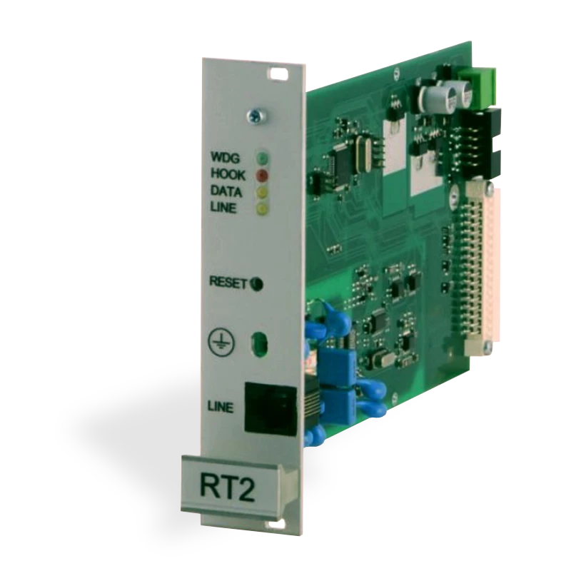

# RT2 Telefoninio Ryšio Priėmimo Modulis

  

Priėmimo modulis naudojamas kaip daugiakanalinio imtuvo RM10 ir RD10 komponentas. Jis skirtas trevogos pranešimams iš apsaugos kontrolės panelės priimti per telefonines linijas.

Duomenų mainai vykdomi pagal šiuos protokolus:

- Contact ID
- Ademco Express 4+2
- SIA FSK
- Pulse 3/1, 4/1, 4/2 protokolai
