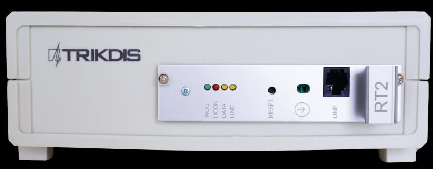
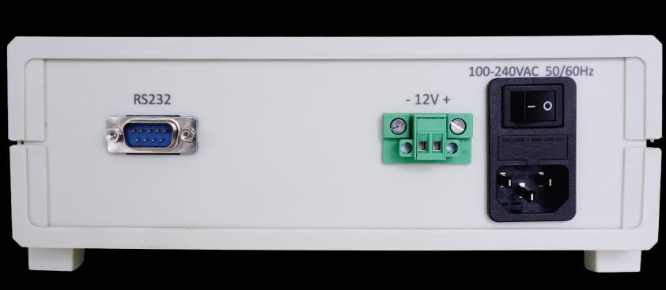
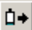
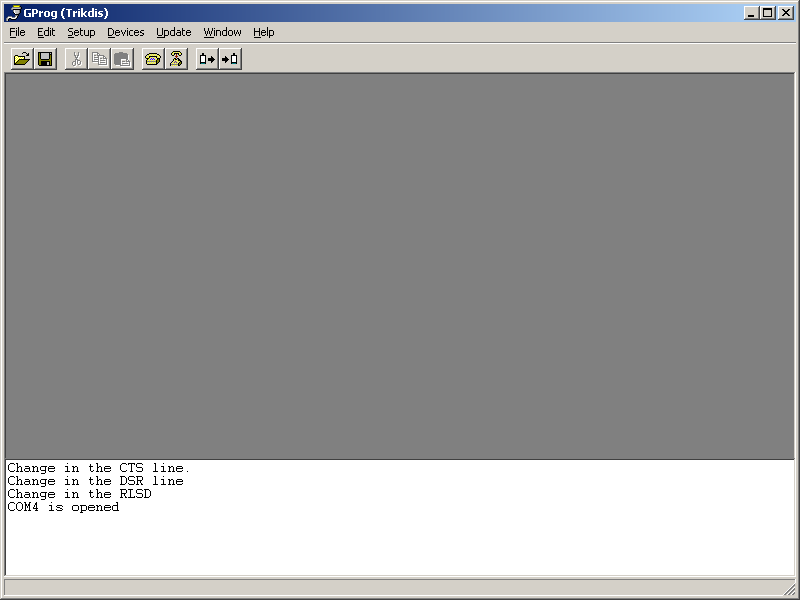
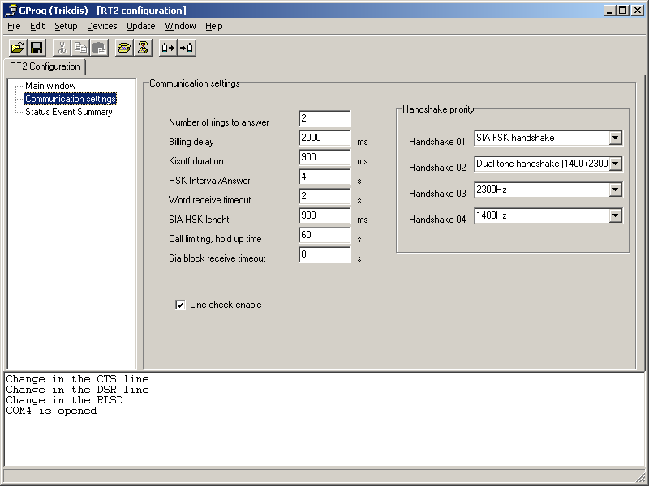

# RTH2 Telefoninio Ryšio Linijos Imtuvas

  

## Apie Telefoninio Ryšio Linijos Imtuvą

**Telefoninio ryšio linijos imtuvas RTH2** priima įvykių ataskaitas iš apsaugos valdymo pulto telefono ryšio modulio. Gauti įvykiai apdorojami ir perduodami į stebėjimo programinę įrangą.

!!! note
    Imtuvą galime sukonfigūruoti su išankstiniais nustatymais pagal kliento pageidavimą.

## Techniniai Parametrai

| Pavadinimas | Aprašymas |
|-------------|-----------|
| Ryšio kanalas | telefono linijos — toninės arba impulsinės |
| Priimami formatai | contact ID, SIA, Ademco Express 4+2 ir kiti |
| Pagrindinis maitinimo šaltinis | 100 – 240 V (50 / 60 Hz) kintamoji srovė |
| RS232 duomenų išvesties prievadai | 1 x DB9 |
| Darbo temperatūra | Nuo 0°C iki +55°C |
| Matmenys | 225 x 235 x 115 mm |
| Svoris | 1,21 kg, su kabeliais |

### Ataskaitų Priėmimo Technologija

| Pavadinimas | Aprašymas |
|-------------|-----------|
| 1. SIA protokolo formatas | Standartas SIA DC-03-1990.01 |
| 2. Contact ID | Standartas SIA DC-05-1999.09 |
| 3. Ademco Express 4+2 formatai | Standartas SIA DC-05-1999.09, 4+2 formatas su kontroline suma — 4 skaitmenų sąskaitos kodas, 2 skaitmenų įvykio kodas, 1 skaitmens kontrolinė suma |
| 4. Impulsiniai protokolai 3/1, 4/1, 4/2, naudojantys 2300 Hz HSK signalus | Veikia 10...40 baudų greičiu, naudojant 2300 Hz HSK ir kissoff signalus |
| 5. Impulsiniai protokolai 3/1, 4/1, 4/2, naudojantys 1400 Hz HSK signalus | Veikia 10...40 baudų greičiu, naudojant 1400 Hz HSK ir kissoff signalus |

## Imtuvo Komplektacija

| Elementas | Kiekis |
|-----------|--------|
| Imtuvas | 1 vnt. |
| 1,5 m maitinimo kabelis | 1 vnt. |
| 1,8 m RS232 Null Modem kabelis | 1 vnt. |

!!! note
    *SPROG-1 arba UP2* kabeliai imtuvo programavimui komplekte neįeina.

## Maitinimo Šaltinis

Imtuvas maitinamas iš kintamosios srovės (AC) šaltinio. Siekiant užtikrinti nepertraukiamą veikimą, imtuvas turi būti prijungtas prie 12 V, 7 Ah akumuliatoriaus, kuris užtikrins atsarginį maitinimą 12 valandų.

## Imtuvo Struktūra

### Priekinis vaizdas

| Nr. | Elementas |
|-----|-----------|
| 1 | Šviesos indikacija (WDG, HOOK, DATA, LINE šviesos diodai) |
| 2 | Įrenginio RESET mygtukas |
| 3 | Įžeminimo jungtis |
| 4 | Jungtis — telefoninio ryšio linijos įvestis |

### Galinis vaizdas

| Nr. | Elementas |
|-----|-----------|
| 5 | RS232 duomenų išvesties prievadas |
| 6 | Atsarginio akumuliatoriaus jungtis (-12V+) |
| 7 | Kintamosios srovės kabelio lizdas (100-240VAC 50/60Hz) ir įjungimo/išjungimo mygtukas |

### Šviesos Indikacija

| Šviesos diodas | Veikimas | Reikšmė |
|----------------|----------|---------|
| „LINE" geltonas — Telefoninio ryšio linijos veikimas | Nešviečia | Telefoninio ryšio linija neprijungta arba nepasiekiama |
| „HOOK" raudonas — Ragelio pakėlimas | Šviečia | Ragelis pakeltas |
| „DATA" geltonas — Duomenų priėmimas | Mirksi geltona | Priimant duomenis iš periferinio įrenginio |
| „WDG" žalias — Maitinimo šaltinio būsena | Mirksi trumpais intervalais | Maitinimo šaltinio įtampa budėjimo ir veikimo metu |

## Sistemos Montavimas

### Įrangos Montavimo Žingsniai

!!! note
    1) *SPROG-1 arba UP2* kabeliai imtuvo programavimui komplekte neįeina.
    2) Parametrams nustatyti reikia įdiegti GProg2 programinę įrangą. Norėdami atsisiųsti GProg2 diegimo failą, eikite į [www.trikdis.com](http://www.trikdis.com/)

1. Jei gautas įrenginys neturi iš anksto nustatytų eksploatacinių parametrų, nustatykite juos kaip aprašyta skyriuje **Eksploatacinių parametrų nustatymas** žemiau.
2. Prijunkite imtuvą prie kompiuterio RS232 kabeliu, kad perduotumėte įvykius į stebėjimo programinę įrangą.
3. Nustatykite stebėjimo programinę įrangą, kad būtų rodomi imtuvo pranešimai. Vadovaukitės stebėjimo programinės įrangos dokumentacijos instrukcijomis.
4. Prijunkite kintamosios srovės maitinimo kabelį.
5. Įjunkite imtuvą. Imtuvas veikia tinkamai, kai šviesos diodas *„WDG"* mirksi.
6. Paspauskite RESET mygtuką.
7. Patikrinkite, ar stebėjimo programinė įranga rodo pranešimus iš RTH2 imtuvo.

Jei nieko negauta: patikrinkite šviesos diodą „Line" — jis turi šviesti geltona spalva. Jei ne, patikrinkite jungtis iš naujo. Jei problema išlieka, įsitikinkite, kad eksploataciniai parametrai nustatyti teisingai, arba kreipkitės į techninę pagalbą.

!!! note
    Integruotas priėmimo modulis generuoja tarnybiniais pranešimus, nurodytus Priede A.

## Eksploatacinių Parametrų Nustatymas

### Imtuvo Eksploataciniai Parametrai

| Pavadinimas | Leistinas diapazonas | Nustatyta reikšmė |
|-------------|---------------------|------------------|
| Skambučių skaičius, kol bus pakeltas modulio ragelis | 1 – 8 | 2 |
| Telefoninio ryšio linijos kontrolė įjungta/išjungta | įjungti / išjungti | įjungti |
| Laikas nuo ragelio pakėlimo iki HSK signalo pradžios | 500 ms – 4000 ms | 2000 |
| Kissoff (ir patvirtinimo) signalų trukmė | 500 ms – 8000 ms | 900 |
| Laiko tarpas tarp HSK signalų | 1 s – 16 s | 4 |
| Leistina pranešimo priėmimo trukmė | 2 s – 16 s | 2 |
| SIA HSK trukmė | 500 ms – 2000 ms | 900 |
| Bendras vieno ryšio seanso laiko limitas | 15 s – 255 s | 60 s |
| Išvesties protokolas | Surgard arba Radionics D6600 | Surgard |
| SIA blokų priėmimo laiko limitas | 1 – 32 s | 8 s |
| HSK eilės tvarka (priėmimo protokolų prioritetas) — SIA FSK HSK | SIA FSK HSK | SIA FSK HSK |
| HSK eilės tvarka — Dvitonis HSK (1400+2300 Hz) | Dvitonis HSK (1400+2300 Hz) | Dvitonis HSK (1400+2300 Hz) |
| HSK eilės tvarka — Impulsinis 3/1, 4/1, 4/2 su 2300 Hz | 3/1, 4/1, 4/2 | 2300 Hz |
| HSK eilės tvarka — Impulsinis 3/1, 4/1, 4/2 su 1400 Hz | 3/1, 4/1, 4/2 | 1400 Hz |

### RTH2 Eksploatacinių Parametrų Nustatymas su GProg2

Imtuvo parametrus galima nustatyti naudojant SPROG-1 arba UP2 programuotoją su GProg2 programine įranga. Taip pat gali reikėti įdiegti USB tvarkyklę. GProg2 ir USB tvarkyklės yra prieinamos mūsų svetainėje www.trikdis.lt.

!!! note
    GProg2 programinė įranga turi būti įdiegta kompiuteryje, veikiančiame MS *Windows* 2000/XP/Vista/Win 7 operacine sistema.

#### Prisijungimas prie Kompiuterio

1. Atidarykite RTH2 korpusą ir išimkite modulį (nepamirškite atjungti atsarginio akumuliatoriaus).
2. Prijunkite modulį prie maitinimo šaltinio.
3. Prijunkite modulį prie kompiuterio naudodami *SPROG-1* arba *UP2* programuotoją.

#### USB Tvarkyklės Diegimas

Kompiuteryje turi būti įdiegtos USB tvarkyklės. Pirmą kartą prijungus modulį prie kompiuterio, MS Windows OS turėtų atidaryti langą *Found New Hardware Wizard*, skirtą USB tvarkyklėms įdiegti.

1. Atsisiųskite USB tvarkyklės failą *\*.inf*, skirtą MS Windows OS, iš svetainės www.trikdis.lt.
2. Vedlio lange pasirinkite funkciją [*Yes, this time only*] ir paspauskite mygtuką [*Next*].
3. Kai atsidarys langas *Please choose your search and installation options*, paspauskite mygtuką [*Browse*] ir pasirinkite vietą, kur buvo išsaugotas failas *\*.inf*.
4. Vykdykite likusias vedlio instrukcijas, kad užbaigtumėte USB tvarkyklės diegimą.

#### GProg2 Paleidimas

8. Paleiskite programą paspausdami GProg2 piktogramą , tada Nustatymų lange nurodykite nuoseklųjį prievadą (pvz.: COM3).
9. Meniu juostoje pasirinkite komandą [*Devices*] ir pasirinkite RT2.
10. Įrankių juostoje paspauskite  piktogramą, kad prisijungtumėte prie imtuvo.
11. Norėdami perskaityti įrenginio vidinėje atmintyje saugomus veiklos parametrus, paspauskite  mygtuką. Baigus duomenų atsisiuntimą, pasirodys langas *Configuration is received*.
12. Pasirodys langas *Configuration is received*.

#### Įrankių Juostos Piktogramų Aprašymas

| Piktograma | Funkcija |
|------------|---------|
|  **[Open]** | Atidaryti išsaugotą failą su plėtiniu „.tcfg" |
|  **[Save]** | Išsaugoti nustatytų parametrų failą su plėtiniu „.tcfg" |
|  **[Connect]** | Prisijungti prie nuosekliojo prievado |
|  **[Disconnect]** | Atsijungti nuo nuosekliojo prievado |
|  **[Receive config]** | Perskaityti įrenginio parametrus |
|  **[Send config]** | Įrašyti naujus parametrus į įrenginio atmintį |
|  **[Generate configuration report]** | Atspausdinti nustatytų parametrų ataskaitą |

#### Parametrų Nustatymas

13. Šakos Main lange nustatykite Surgard protokolą.
14. Jei reikia, galite keisti parametrus šakoje Communication settings — rekomenduojamos reikšmės nurodytos skyriuje **Imtuvo eksploataciniai parametrai** aukščiau.
15. Norėdami išsaugoti parametrus, meniu juostoje eikite į [*File/Write device*] arba paspauskite  piktogramą.
16. Norėdami išsaugoti nustatytus parametrus savo kompiuteryje, eikite į [*File/Save as*]. Failo pavadinimą ir išsaugojimo vietą galima pasirinkti laisvai. Vėliau tai galima naudoti kaip šabloną kitiems moduliams konfigūruoti.

## Priedas A — Tarnybiniai Pranešimai

Telefoninio ryšio imtuvo tarnybiniai pranešimai:

| Pranešimas | Kodas | Aprašymas |
|------------|-------|-----------|
| COM TROUBLE | 05 | Ryšio sutrikimas tarp įrenginio ir koncentratoriaus |
| COM RESTORE | 06 | Ryšys su koncentratoriumi atstatytas |
| TEL LINE ERROR | 20 | Telefoninio ryšio linijos sutrikimas arba atjungimas |
| TEL LINE OK | 30 | Telefoninio ryšio linija atstatyta |
| MODULE DISCONNECT | C0 | Įrenginys atjungtas |
| MODULE CONNECT | C1 | Įrenginys prijungtas |
| RECEIVER RESET | D0 | Paspaustas imtuvo RESET mygtukas |
