# R11 Radijo Imtuvas

  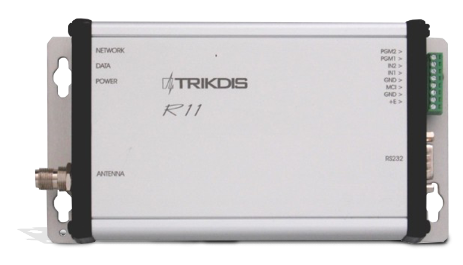

Radijo imtuvai R11 ir RF11 skirti koduotų pranešimų, siunčiamų radijo ryšio kanalu VHF ar UHF dažnių diapazonuose, priėmimui ir dekodavimui ir naudojami kaip sudėtinė radijo apsauginės sistemos RAS3 dalis.

Imtuvai priima ir dekoduoja signalus, siunčiamus RAS3, RAS2M, LARS, LARS1, Milcol-D kodavimo sistemomis.

Imtuvas R11 turi metalini korpusą ir gali būti naudojamas kaip atskiras įrenginys.

Imtuvas RF11 yra bekorpusinis. Jis skirtas naudoti kaip centrinio pulto imtuvų RD10 ir RM10 įstatomas modulis.

### **Veikimo aprašymas ir pagrindinės savybės**

Imtuvas R11 (RF11) tai dvigubo keitimo superheterodininis radijo imtuvas su skaitmeniniu priimto signalo atpažinimu. Priimtas ir atpažintas pranešimas apdorojamas bei perduodamas į išėjimą. Priimtų signalų apdorojimą atlieka mikrokontroleris. Jis atpažįsta siunčiamą signalą ir suformuoja nustatytos formos ir struktūros pranešimą. Pranešimas pagal nustatytus požymius filtruojamas bei perduodamas per nuoseklų prievadą į stebėjimo programą arba į kitus suderinamus perdavimo modulius. Imtuvas turi programinius filtrus, kurie leidžia filtruoti pranešimus pagal:

- kodavimo sistemą;

- kodavimo sistemos posistemes;

- ryšio trasą;

- abonentinių numerių seką;

- tų pačių pranešimų pasikartojimo intervalą;

Imtuvas matuoja priimamo signalo lygį, fiksuoja ryšio trasą ir visą tai nurodo išėjimo signale.

Imtuvas formuoja ir perduoda į išėjimus tarnybinius pranešimus, kurie gali būti atvaizduojami stebėjimo programoje arba perduodami ryšio kanalu.

Imtuvas turi nuoseklias RS232 ir MCI sąsajas. RS232 sąsaja naudojama kaip išėjimas priimtų pranešimų perdavimui arba kaip įėjimas, skirtas priimti pranešimus iš kitų imtuvų ar įrenginių. Šiuo atveju pranešimai išsiunčiami per MCI sąsają.

### **Techniniai parametrai**

1.  Imtuvo darbo dažnių diapazonas nuo 146 MHz iki 174 MHz (VHF) ir nuo 430 MHz iki 470 MHz (UHF). VHF diapazonas suskaidytas į du padiapazonius – VL (nuo 146 iki160) MHz ir VH (nuo 160 iki 174) MHz. UHF diapazonas taip pat suskaidytas į du padiapazonius – UL (nuo 430 iki 450) MHz ir UH (nuo 450 iki 470) MHz;

2.  Moduliacija FFSK ir FSK;

3.  Ryšio kanalų atskyrimas 12,5 kHz;

4.  Dažnio nustatymo paklaida ne didesnė nei ± 200 Hz;

5.  Imtuvo įėjimo varža 50 Ω;

6.  Jautrumas ne blogesnis kaip 0,5 μV;

7.  Selektyvumas gretutiniame kanale, ne mažiau 60 dB;

8.  Selektyvumas veidrodiniame kanale, ne mažiau 70 dB;

9.  Imtuvo parametrai tenkina standarte EN 300 113 nurodytus reikalavimus;

10. Duomenų perdavimo greitis radijo kanale iki 2,4 kb/s (FFSK moduliacija);

11. Imtuvas matuoja priimamo signalo stiprumą 1 ÷ 1000 μV ribose ir priskiria jį vienam iš šešiolikos lygių pagal apsauginės sistemos RAS3 lygių lentelę ([Priedas A. R11 imtuvo signalo lygius atitinkanti įėjimo galia](#_Ref371350067));

12. Pranešimų atminties talpa – 300 paskutinių pranešimų;

13. Imtuvas R11 turi du NC/NO/EOL=2,2 kΩ tipo įėjimus. RF11 ši savybė nenaudojama;

14. Nuoseklus RS232 prievadas naudojamas (skirtas) pranešimų perdavimui į stebėjimo programą arba pranešimų priėmimui iš kitų suderinamų įrenginių;

15. Imtuvas R11 turi nuoseklų MCI prievadą komunikacijai su perdavimo įrenginiais (pvz. siųstuvais). RF11 šis prievadas nenaudojamas;

16. Šviesos diodų indikacija, indikuojanti maitinimo įtampos/procesoriaus veikimą, pranešimų buferio/dekodavimo būklę bei pranešimo priėmimo iš eterio/eterio būklę;

17. Imtuvas maitinamas nuolatine 12,6 V įtampa. Leistinos įtampos kitimo ribos nuo 11 V iki 15 V;

18. Naudojama srovė neviršija 120 mA;

19. Imtuvas veikia esant aplinkos oro temperatūrai nuo -10°C iki +55°C ir santykinei oro drėgmei iki 90% prie +20°C;

20. Imtuvo R11 matmenys 200 x 105 x 40 mm;

21. Imtuvo R11 masė neviršija 0,5 kg;

### **Bendras imtuvo vaizdas bei jungčių išdėstymas**

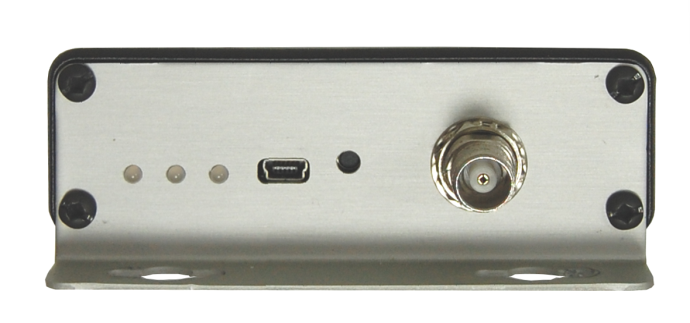

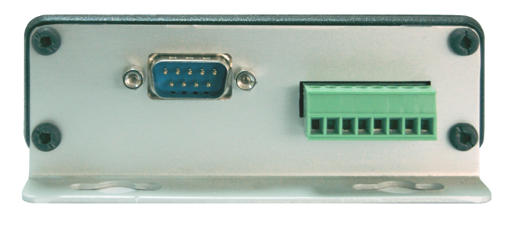

Maitinimo ir signalų jungtis

RS232 sąsaja

Antenos jungtis

Šviesos indikacija

RESET mygtukas

USB sąsaja

Lentelė 1. Maitinimo ir signalų jungtis

| Gnybtas  | Paskirtis                       |
|:---------|:--------------------------------|
| **+E**   | Maitinimas, +12,6V              |
| **GND**  | Maitinimas, bendras laidininkas |
| **MCI**  | MCI sąsaja                      |
| **GND**  | Bendras laidininkas             |
| **IN1**  | 1-as įėjimas                    |
| **IN2**  | 2-as įėjimas                    |
| **PGM1** | Numatytas tolesniam naudojimui  |
| **PGM2** | Numatytas tolesniam naudojimui  |

### **Šviesos indikacija**

Imtuvo veikimą rodo šviesinė indikacija. Šviesos indikatorių veikimas pateiktas [Lentelė 2. Šviesos indikacija](#_Ref371325959).

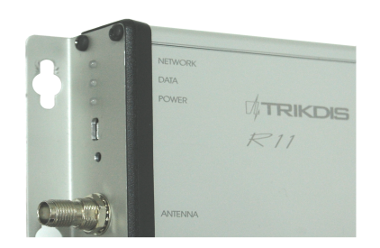

Lentelė 2. Šviesos indikacija

| Indikatorius | Veikimas | Reikšmė |
|--------------|----------|---------|
| „Network“ | Mirksi žaliai | Radijo kanalu priimamas pranešimas |
| „Network“ | Šviečia geltonai | Viršytas nustatytas ryšio kanalo fono lygis |
| „Data“ | Šviečia žaliai | Yra neišsiųstų pranešimų |
| „Data“ | Šviečia žaliai ir raudonai kartu | Perpildytas pranešimų buferis |
| „Power“ | Mirksi žaliai | Maitinimo įtampa pakankama |
| „Power“ | Mirksi geltonai | Žema maitinimo įtampa (mažiau 11,5 V) |
| „Power“ | Mirksi žaliai ir raudonai pakaitomis | Maitinama tik per USB sąsają (konfigūravimas) |

### **Imtuvo** **paruošimas** **darbui**

Paruošimo darbui eiga:

1.  Radijo imtuvai vartotojams pateikiami nustatyti pagal užsakymo reikalavimus. Yra galimybė nustatymus modifikuoti;

2.  Sumontuokite imtuvą į tam numatytą vietą;

3.  Prie antenos jungties prijunkite antenos kabelį;

4.  Prijunkite maitinimą ir išorinius įrenginius (stebėjimo programą ar perdavimo modulius);

5.  Patikrinkite imtuvo veikimą.

### **Veikimo parametrų nustatymas**

Veikimo parametrų nustatymas atliekamas parametrų nustatymo programa “R11config”, sujungus kompiuterį ir imtuvą USB kabeliu. Naudoti programą ir keisti nustatymus galima tiek esant įjungtam išoriniam maitinimui, tiek maitinant per USB jungtį. Įjungus programą R11config atsiveria pradinis langas:

Gamyklinisprisijungimo slaptažodis yra “1234”. Jį įvedus ir paspaudus klaviatūros “Enter” klavišą, atsivers “Main” langas.

Skiltyje “Settings” nurodykite kompiuterio USB prievado numerį ir mainų parametrus:

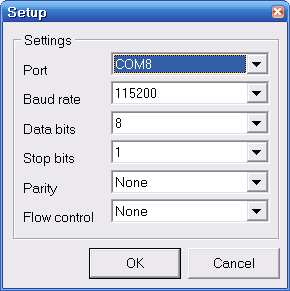

R11config programos mygtukai:

- 
- 
- 
- 
- 
- 

**Main** langas.

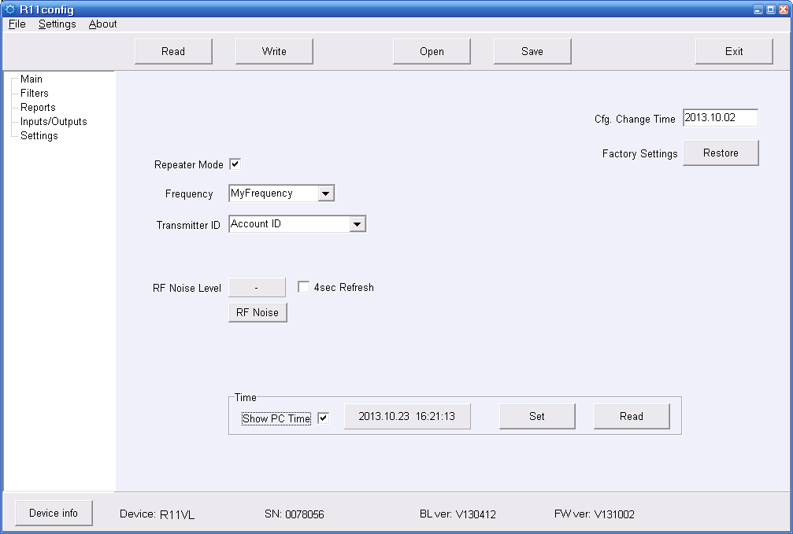

- **Repeater mode**. Retransliatoriaus režimas. Kai imtuvas numatytas būti retransliatoriaus imtuvu, šis požymis turi būti įjungtas, o kai centrinio pulto imtuvu – išjungtas.

- **Frequency**. Pranešimų iš saugomų objektų siųstuvų priėmimo dažnis.

- **Transmitter ID**. Objektų identifikaci. Parametras turi sutapti su siųstuvuose nustatytu saugomų objektų identifikavimo tipu. Galimi nustatyti šie tipai:

  - Account ID – objektas identifikuojamas pagal į siųstuvą įrašytą Account ID numerį ir posistemę

  - Transmitter SN – objektas identifikuojamas pagal siųstuvo unikalųjį serijos numerį SN

  - Transmitter SN+Account ID – objektas identifikuojamas pagal siųstuvo unikalųjį serijos numerį SN, įrašytą Account ID numerį ir posistemę

- **RF Noise Level**. Paspaudus mygtuką „RF Noise“ rodomas momentinis eterio fono lygis. Jei yra požymis „4sec Refresh“, fono lygis automatiškai atnaujinamas kas keturios sekundės.

- **Time**. Imtuvo laikrodžio nustatymas.

  - Show PC Time. Kai požymis aktyvus, laiko langelyje rodomas kompiuterio laikas.

  - Spragtelėjus du sykius kairį pelės klavišą ant laiko langelio, galima ranka redaguoti parenkamą laiką („Show PC Time“ turi būti išjungtas).

  - Set. Imtuvo laikrodis nustatomas pagal laiko langelyje rodomą laiką.

  - Read. Nuskaitomas esamas imtuvo laikrodžio laikas ir parodomas laiko langelyje („Show PC Time“ turi būti išjungtas).

- **Cfg. Change Time**. Imtuvo konfigūracijos paskutinio keitimo laikas. Saugomas imtuvo atmintyje ir automatiškai perrašomas, įrašant naują konfigūraciją pagal esamą kompiuterio laiką.

- **Factory Settings**. Paspaudus mygtuką „Restore“, atkuriami gamykliniai imtuvo parametrai.

**Filters** langas.

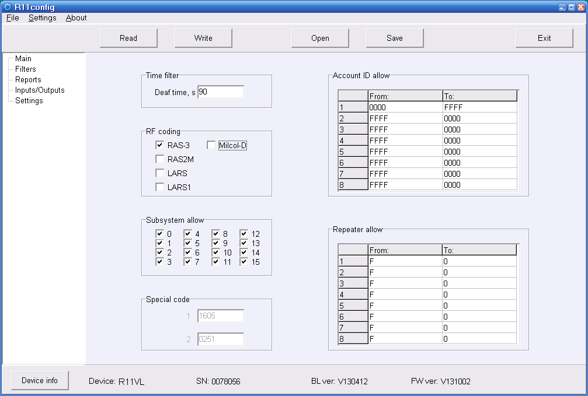

- **Time Filter**. Nurodo, kiek laiko imtuvas nepriima pasikartojančio pranešimo iš to paties objekto. Rekomenduojamas 90 sekundžių laikas.

- **RF coding**. Siųstuvų radijo pranešimų formatai. Rekomenduojama nustatyti tik tuos formatus, kurie naudojami.

- **Subsystem allow**. Nurodomos tinklo posistemės, kurių pranešimus imtuvas priims. Posistemės leidžia priimti pranešimus iš daugiau nei 65535 tuo pačiu dažniu veikiančių siųstuvų.

- **Account ID allow**. Imtuvas priims pranešimus iš tų siųstuvų, kurių objektų Account ID pateks į aprašytas grupes. Jei siųstuvų, kurių objektų Account ID nepateks į aprašytas grupes, tai jų pranešimai nebus priimti.

- **Repeater allow**. Leidžia išskirti retransliatorių grupes, iš kurių bus priimami pranešimai. Tų retransliatorių, kurių numeriai nepateks į aprašytas grupes, retransliuoti pranešimai nebus priimti. Jei naudojamas žvaigždės tipo tinklas, šis parametras retransliatorių imtuvuose paprastai nustatomas F..0, t. y. retransliatorių imtuvai nepriims kitų retransliatorių retransliuotų pranešimų. Centrinio pulto imtuve šis parametras bus 0..F, t. y. imtuvas priims visų retransliatorių pranešimus. Jei naudojamas grandinės tipo tinklas, tai retransliatoriaus, kurio retransliuoti pranešimai turi būti priimti arčiau centrinio imtuvo esančių retransliatorių, imtuve turi būti nurodyti arčiau centrinio imtuvo esančių retransliatorių numeriai.

**Reports** langas.

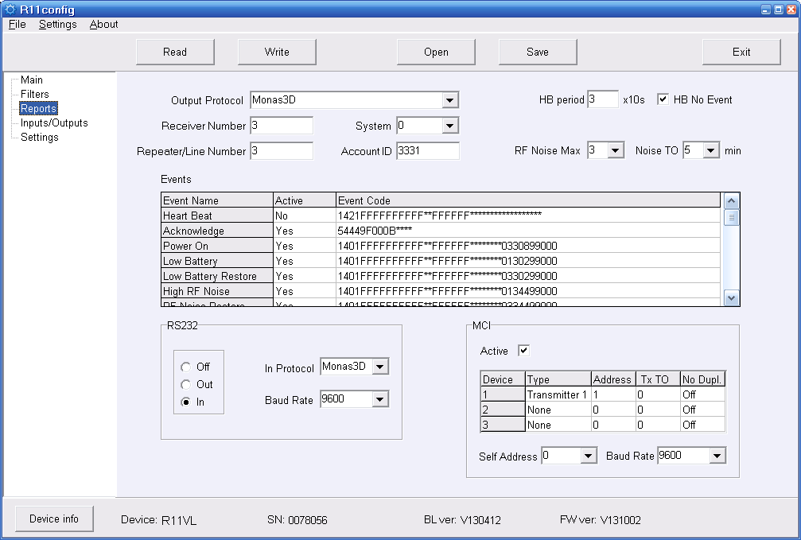

- **Output Protocol**. Nurodomas imtuvo duomenų išėjimo protokolas. Jei R11 imtuvas numatytas būti retransliatoriaus R-IP12 imtuvu, protokolas turi būti „Monas3D“.

- **Receiver Number**. Imtuvo numeris, kuris bus įtrauktas į imtuvo siunčiamą pranešimą. Retransliatoriuose šis parametras neaktualus.

- **Repeater/Line Number**. Retransliatoriaus arba linijos numeris. Nurodo, koks retransliatoriaus numeris bus išsiunčiamuose pranešimuose. Galimi retransliatorių numeriai nuo 1 iki 15. Jei retransliatoriai dirba grandinėlės tipo tinkle, centrinio pulto priimatame pranešime bus matomas pirmo ir paskutinio grandinėlės retransliatoriaus numeris. Jeigu R-IP12 yra du imtuvai ir jų retransliatorių numeriai skiriasi, centrinio pulto priimtame pranešime papildomo imtuvo retransliatoriaus numeris bus matomas taip, tarsi būtų dirbama grandinėle. Jei imtuvas naudojamas kaip centrinio pulto imtuvas, šis parametras nurodo linijos numerį.

- **System**. Posistemės numeris, kuris bus nurodomas vidiniuose R11 pranešimuose.

- **Account ID**. Account ID, kuris bus nurodomas vidiniuose R11 pranešimuose.

- **HB Period**. Heard Beat (ping) pranešimo siuntimo periodas (1=10s). Jei požymis „HB No Event“ aktyvus, pranešimas bus siunčiamas tik jei uždu otu periodu nebuvo siunčiamas joks kitas pranešimas.

- **RF Noise Max**. Eterio fono lygis, kurį viršyjus siunčiamas pranešimas apie aukštą fono lygį. **Noise TO** nurodo kiek minučių turi būti stebimas padidėjęs fonas prieš siunčiant pranešimą.

- **Events**.

Lentelėje „Events“ yra trys stulpeliai:

- Event Name – įvykio pavadinimas

- Active – įvykis aktyvus/neaktyvus. Jei įvykis neaktyvus, jam įvykus pranešimas nėra siunčiamas.

- Event Code – įvykio pranešimo turinys

Į lentelės redagavimo langą galima patekti spragtelėjus du sykius kairį pelės klavišą ant pasirinktos eilutės. Parametras įvykio aprašyme pažymėtas simboliais „#” R11 imtuvo programos yra pakeičiamas jo skaitine reikšme (išskyrus protokolą Monas3D, jame toks parametras žymimas simboliais “F”).

- **Heart Beat** – periodinis Heart Beat (ping) pranešimas, naudojamas R11 funkcionalumui įvertinti. Jis gali būti automatiškai tikrinamas priimančio įrenginio. Pranešimas gali būti naudojamas kaip ping pranešimas ir tikrinamas IP imtuve.

- **Acknowledge** – išsiųsto pranešimo patvirtinimo formatas.

- **Power On** – maitinimo įjungimo/restarto pranešimas.

- **Low Battery** – pranešimas, kad maitinimo įtampa nukrito žemiau 11,5 V.

- **Low Battery Restore** – pranešimas, kad maitinimo įtampa atsistatė iki 12,6 V.

- **High RF Noise** – pranešimas, kad eterio fono lygis viršyjo „**RF Noise Max“** nustatytą reikšmę ilgiau nei „**Noise TO“** nurodytas laikas.

- **RF Noise Restore** – pranešimas, kad eterio fono lygis nukrito žemiau „**RF Noise Max“** nustatytos reikšmės ilgiau nei „**Noise TO“** nurodytas laikas.

- **Cfg. Change** – pranešimas, kad pakeista imtuvo konfigūracija.

- **Time Fault** – nenustatytas laikas.

- **Time Set** – pakeistas/nustatytas laikas.

- **MCI Error** – neteisingai funkcionuoja per MCI sąsają prijungtas įrenginys. Kuris konkrečiai įrenginys parodo pranešimo zonos numeris.

- **MCI Restore** –per MCI sąsają prijungto įrenginio funkcionavimas atsistatė. Kuris konkrečiai įrenginys parodo pranešimo zonos numeris.

- **RS232 Error** – dingo Heart Beat signalas/pranešimai iš įrenginio, prijungto prie RS232 sąsajos (maksimalus periodas – 90 sekundžių).

- **RS232 Restore** –Heart Beat signalas/pranešimai iš įrenginio, prijungto prie RS232 sąsajos, atsistatė.

- **Self Test Fail** – aptikta klaida atliekant imtuvo savidiagnoze.

- **Transmitter Ping** – objektų siųstuvų ping pranešimų priėmimas/persiuntimas. Jei įvykis nėra aktyvus, <u>ping pranešimai iš objektų nėra priimami</u>.
- **RS232** – RS232 sąsajos nustatymai.
- **Off** – sąsaja nenaudojama. Šis nustatymas reikalingas tam, kad <u>teisingai veiktu duomenų buferio indikacija, kai duomenų atidavimui naudojama MCI sąsaja, o RS232 nenaudojama.</u>

- **Out** – RS232 sąsaja naudojama pranešimų perdavimui. Sąsajos duomenų perdavimo greitis „Boud Rate“ turi sutapti su priimančiame įrenginyje nustatytu greičių. Kiti sąsajos parametrai: 8N1.

- **In** – RS232 sąsaja naudojama pranešimų priėmimui iš kitų priėmimo įrenginių. Galimi pranešimų formatai:

  - Monas3D

  - SurGard MRL2-DG

  - Monas2

Sąsajos duomenų perdavimo greitis „Boud Rate“ turi sutapti su siunčiančiame įrenginyje nustatytu greičių. Kiti sąsajos parametrai: 8N1.

- **MCI** – MCI sąsajos nustatymai.
- **Active** – sąsajos įjungimas/išjungimas. Norint įjungti sąsaja „Output Protocol“ turi būti Monas3D.

**MCI konfigūracijos lentelėje** yra aprašomi siųstuvai, per MCI sąsają prijungti prie imtuvo R11. Norint atlikti pakeitimus lentelėje reikia kairiu pelės klavišu dusyk spragtelėti ant redaguomjamos eilutės ir padaryti pakeitimus atsiradusiame redagavimo lange.

- „*Type*“ nurodomas siųstuvo prioritetas. „Transmitter 1“ yra aukščiausias prioritetas „Transmitter 3“ – žemiausias. Imtuvas visada stengiasi perduoti pranešimus per kuo aukštesnio prioriteto siųstuvą, ir, tik esant ryšio sutrikimams, duomenys perduodami per žemesnio prioriteto siųstuvą.

- „*Address*“ nurodomas siųstuvo adresas MCI sąsajoje. Jis turi būti nesikartojantis ir toks pats kaip įrašytas siųstuve.

- „*Tx TO*“ nurodoma kiek laiko yra vėlinamas (1=250ms) pranešimo išsiuntimas <u>radijo</u> kanalu. Tuo laiku yra sekami kitų retransliatorių radijo kanalu siunčiami pranešimai.

- „*No Dupl.*“ Jei per „Tx TO“ laiką buvo priimtas kito retransliatoriaus išsiųstas tas pats pranešimas, radijo kanalu šis pranešimas nebesiunčiamas („gesinamas“).

**Inputs/Outputs** langas.

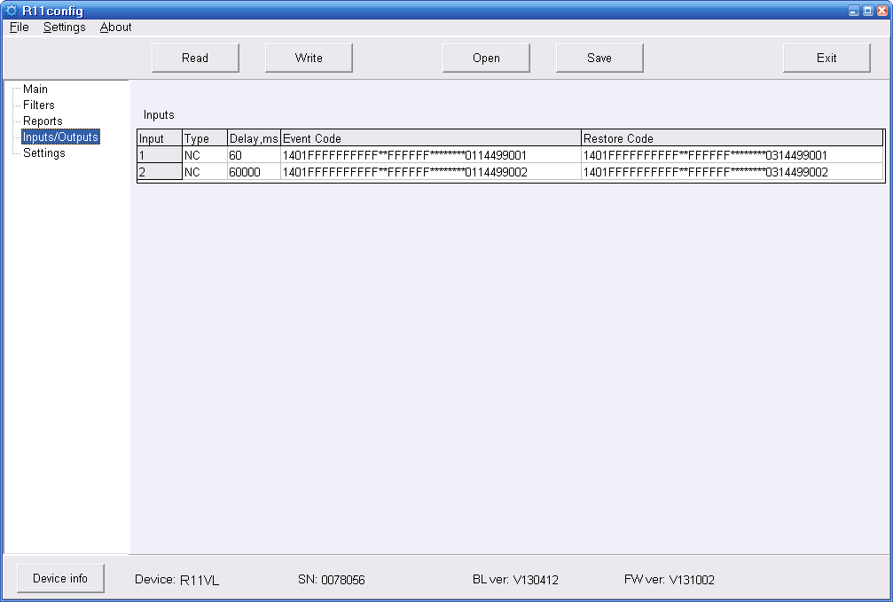

**Inputs**.

Lentelėje „Inputs“ yra penki stulpeliai:

- **Input** – įėjimo eilės numeris

- **Type** – įėjimo tipas None/NC/NO/EOL. „None“ – įėjimas išjungtas. EOL atveju naudojama 2,2kΩ varža.

- **Delay** – pranešimo išsiuntimo vėlinimas pasikeitus įėjimo būsenai.

- **Event Code** – įėjimo suveikimo įvykio pranešimo turinys.

- **Restore Code** – įėjimo atsistatymo įvykio pranešimo turinys.

Į lentelės redagavimo langą galima patekti spragtelėjus du sykius kairį pelės klavišą ant pasirinktos eilutės. Parametras įvykio aprašyme pažymėtas simboliais „#” R11 imtuvo programos yra pakeičiamas jo skaitine reikšme (išskyrus protokolą Monas3D, jame toks parametras žymimas simboliais “F”).

**Settings** langas.

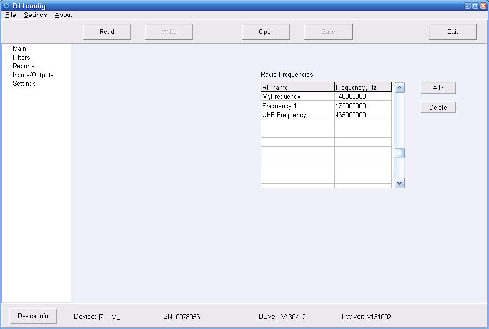

- **Radio Frequencies** lentelėje galima aprašyti naudojamus dažnius suteikiant jiems sąlyginius pavadinimus, kuriuos galima bus išsirinkti nustatant R11 dažni „Main“ lange.

### **Programinės įrangos (firmware) atnaujinimas**

Norint atnaujinti imtuvo programą, reikia jį USB kabeliu sujungti su kompiuteriu. Tada paspaudus mygtuką SW1 ir jį palaikius daugiau 3 sekundes (kai ims šviesti visi šviesos indikatoriai), atsidarys langas RF11 (arba atsiranda atminties įrenginys RF11).

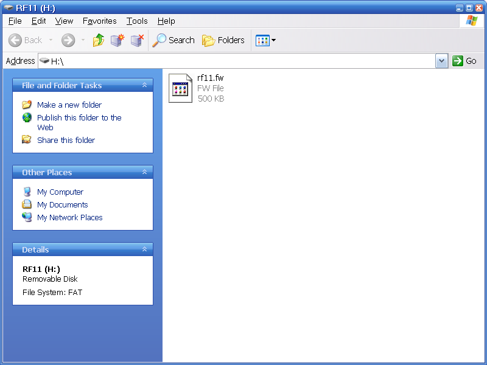

Jame esantį failą „rf11.fw“ reikia ištrinti ir į jo vietą įrašyti naują imtuvo veikimo programą. Jei įrašymas sėkmingas, po 1-2 sekundžių langas turi savaime užsidaryti. Po veikimo programos įrašymo, rekomenduojama pasitikslinti imtuvo programos versiją programa „R11config“.

DĖMESIO! Perrašant imtuvo veikimo programą, jo konfigūracija nėra išsaugoma, todėl norint ją išsaugoti, reikia prieš perrašant programą, nusiskaityti konfigūraciją programa „R11config“.

Priedas A. R11 imtuvo signalo lygius atitinkanti įėjimo galia

| Lygis | Uin dBm (iki) | Lygis µV (iki) | Uin dBm (iki) | Lygis µV (iki) | Uin dBm (iki) | Lygis µV (iki) | Uin dBm (iki) |
|-------|------------------|-------------------|------------------|-------------------|------------------|-------------------|------------------|
| 0 | -107 | 1 | 4 | -91 | 6,3 | 8 | -75 |
| 1 | -103 | 1,61 | 5 | -87 | 10 | 9 | -71 |
| 2 | -99 | 2,5 | 6 | -83 | 16,1 | 10 | -67 |
| 3 | -95 | 4 | 7 | -79 | 25 | 11 | -63 |

Priedas B. Monas3 protokolas (bazinio protokolo aprašymas)

**TDNMRRLLG_RRLAAAAAAAA_NNBBAAAAAA_DDDDDDDDD_YYMMDD/VVMMSSCCCC<CR><LF>**

TD – Monas3 identifier.

N – Data type identifier 0..F.

M – Data subtype identifier 0..9, A..Z.

RR – Receiver number 0..99.

LL – Line number 0..99.

G – Received message RF signal level 0..F.

RR – Repeater number 0..99.

L – Message RF signal level in repeater 0..F.

AAAAAAAA – Transmitter serial number 0..99999999.

NN – Object event number 0..FF.

BB – RF subsystem code 0..99.

AAAAAA –Account code 0..FFFFFF.

DDDDDDDDD – Message data, ASCII symbols (length depends on data type and subtype).

YY – Year 0..99.

MM – Month 1..12.

DD – Day 1..31.

VV – Hour 0..24.

MM – Minute 0..60.

SS – Second 0..60.

CCCC – CRC16 0..FFFF (calculation algorithm see below).

<CR><LF> - End of message ( 0D,0A hex )

„\_“ – Delimiter between data blocks ( 5F-hex ).

„\*“ – If some fields has no data, they must be filled with „\*“ symbol ( 2A hex ).

Priedas C. R11config konfigūruojama Monas3D protokolo dalis

1401FFFFFFFFFF\*\*FFFFFF\*\*\*\*\*\*\*\*0330899000

14 – ilgis, hex;

01 – įvykio protokolo tipas (01 – Contact ID protokolas);

FF – retransiatoriaus numeris (jei “FF” – imama reikšmė iš “Repeater/Line Number” laukelio);

F – signalo lygis retransliatoriuje;

F – signalo lygis imtuve;

FFFFFF – imtuvo serijinis numeris (jei “FFFFFF” – imama reali R11 SN reikšmė);

\*\* – pranešimo numerio vieta;

FF – tinklo posistemė (jei “FF” – imama reikšmė iš “System” laukelio);

FFFF – account ID (jei “FFFF” – imama reikšmė iš “Account ID” laukelio);

\*\*\*\*\*\*\*\* – įvykio laiko vieta;

0330899000 – Įvykio kodas, particija, zona;

- 03 – įvykio kvalifikatorius (01 – suveikimas; 03 – atsistatymas);

- 308 – įvykio kodas (Contact ID);

- 99 – particija;

- 000 – zona;
