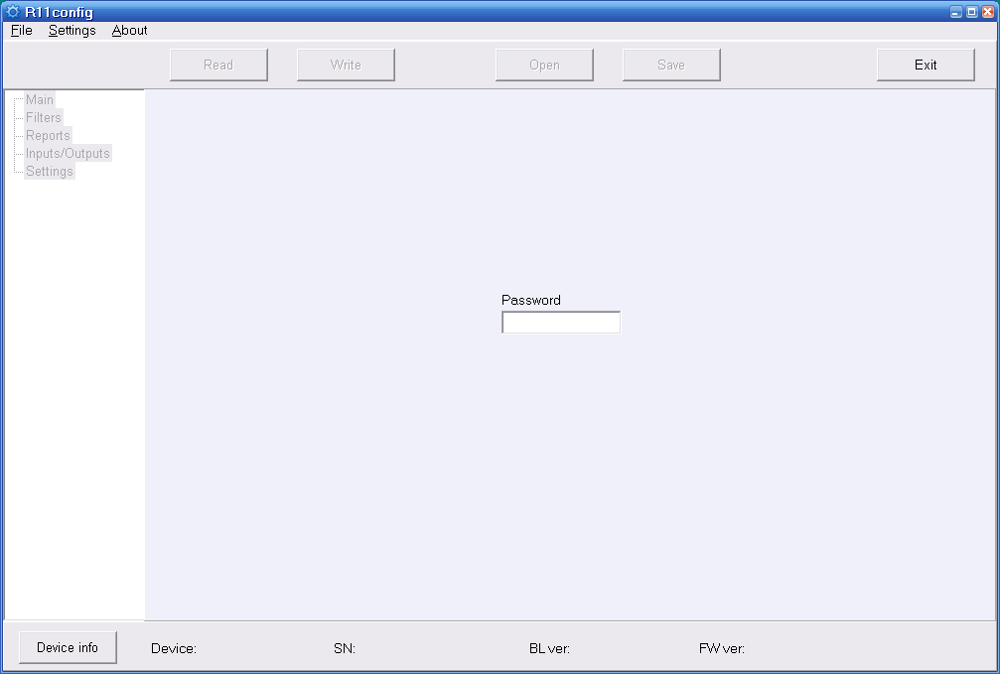
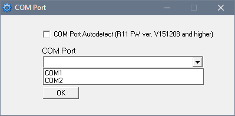
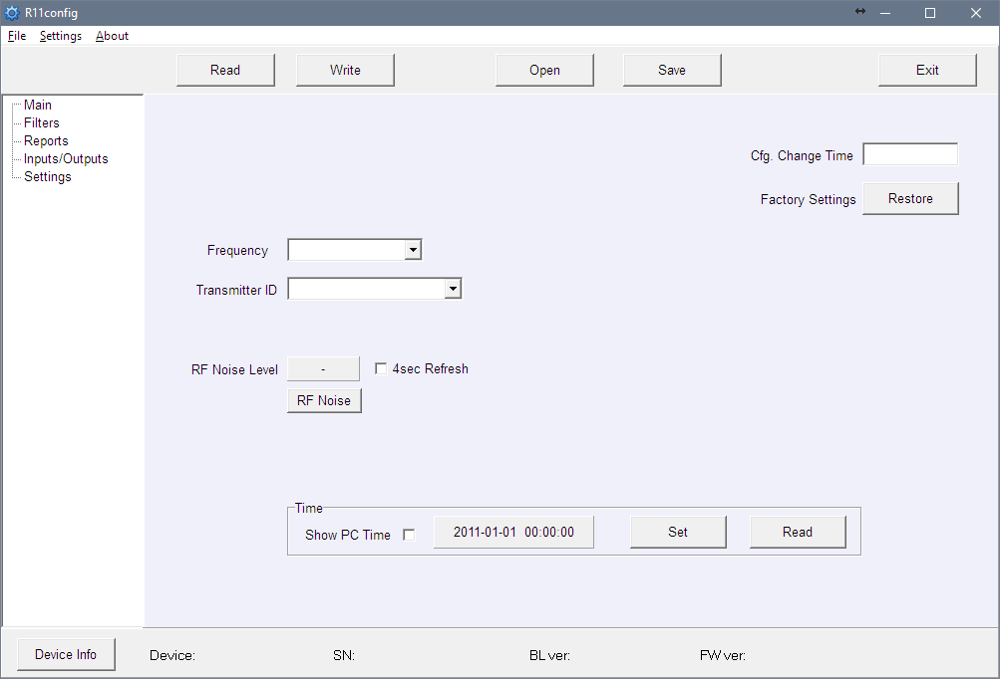
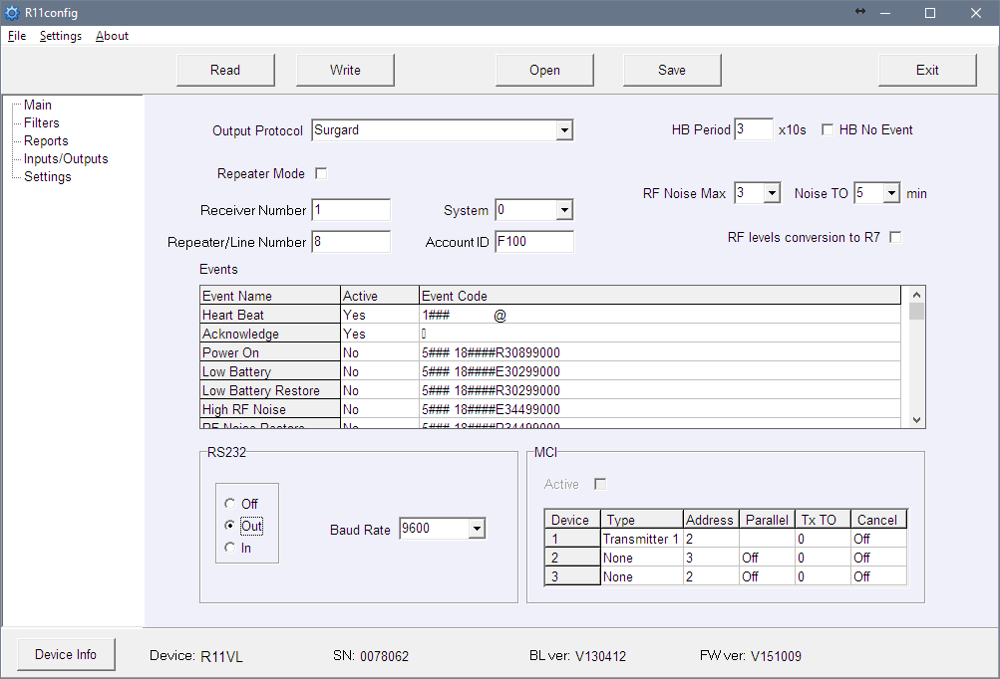
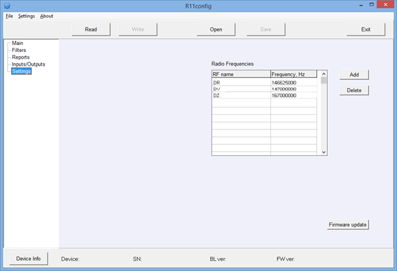

# RFH11 Radijo Imtuvas

  

## Apie Radijo Imtuvą

**Radijo imtuvas RFH11** skirtas priimti užkoduotus radijo pranešimus VHF arba UHF dažnių juostoje. Integruotas modulis veikia su RAS3, RAS2M, LARS, LARS1, Milcol-D kodavimo sistemomis.

Imtuvas turi programuojamus filtrus, leidžiančius filtruoti pranešimus pagal:

- Pranešimų kartojimo intervalą
- Kodavimo sistemos posistemes
- Ryšio maršrutą
- Sąskaitos numerių seką

> **Pastaba:** Imtuvą galime sukonfigūruoti su išankstiniais nustatymais pagal kliento pageidavimą.

## Pagrindiniai Techniniai Parametrai

| Pavadinimas | Aprašymas |
|-------------|-----------|
| Darbo dažnių juosta | 146 – 174 MHz (VHF) arba 430 – 470 MHz (UHF) |
| Kanalų atskyrimas | 12,5 kHz |
| Dažnio nustatymo paklaida | ne daugiau kaip ± 200 Hz |
| Jautrumas | Ne mažiau kaip 0,5 μV |
| Moduliacija | FFSK/FSK |
| Dekoduojami formatai | RAS-3, RAS-2M, LARS, LARS-1, Milcold-D |
| Išvesties formatai | Monas3 ir Surgard |
| Pranešimų saugojimas | 300 paskutinių gautų pranešimų |
| Pagrindinis maitinimo šaltinis | 100 – 240 V (50 / 60 Hz) kintamoji srovė |
| RS232 duomenų išvesties prievadai | 1 x DB9 |
| Darbo temperatūra | Nuo 0°C iki +55°C |
| Matmenys | 225 x 235 x 115 mm |
| Svoris | 1,21 kg, su kabeliais |

## Imtuvo Komplektacija

| Elementas | Kiekis |
|-----------|--------|
| Imtuvas | 1 vnt. |
| 1,5 m kintamosios srovės maitinimo kabelis | 1 vnt. |
| 1,8 m RS232 Null Modem kabelis | 1 vnt. |

> **Pastaba:** *USB* kabelis imtuvo programavimui komplekte neįeina.

## Maitinimo Šaltinis

Imtuvas maitinamas iš kintamosios srovės (AC) šaltinio. Siekiant užtikrinti nepertraukiamą veikimą, imtuvas turi būti prijungtas prie 12 V, 7 Ah akumuliatoriaus, kuris užtikrins atsarginį maitinimą 12 valandų.

## Imtuvo Struktūra

| Nr. | Elementas | Nr. | Elementas |
|-----|-----------|-----|-----------|
| 1 | Šviesos indikacija | 5 | RS232 duomenų išvesties prievadas |
| 2 | USB jungties prievadas | 6 | Atsarginio akumuliatoriaus jungtis |
| 3 | RESET mygtukas | 7 | Maitinimo jungties lizdas ir įjungimo/išjungimo mygtukas |
| 4 | Antenos jungtis | | |

### Šviesos Indikacija

| Šviesos diodas | Veikimas | Reikšmė |
|----------------|----------|---------|
| „Power" | Mirksi žalias šviesos diodas | Maitinimo įtampa pakankama |
| „Power" | Mirksi geltonas šviesos diodas | Maitinimo įtampa žema (žemiau 11,5 V) |
| „Power" | Pakaitomis mirksi žalias ir raudonas | Maitinimas tiekiamas tik per USB (konfigūravimo metu) |
| „Netw." | Mirksi žalias šviesos diodas | Gaunamas pranešimas |
| „Netw." | Šviečia geltonas šviesos diodas | Viršytas RF triukšmo lygis |
| „Data" | Žalias šviesos diodas | Yra neišsiųstų pranešimų |
| „Data" | Vienu metu šviečia žalias ir raudonas | Išvesties buferis perpildytas |

## Sistemos Montavimas

### Įrangos Montavimo Žingsniai

> **Pastaba:** Parametrams nustatyti reikalinga R11config programinė įranga. Kreipkitės į savo platintoją, kad gautumėte šią programinę įrangą.

1. Jei gautas įrenginys neturi iš anksto nustatytų eksploatacinių parametrų, nustatykite juos kaip aprašyta skyriuje **Eksploatacinių parametrų nustatymas su R11config** žemiau.
2. Prijunkite RFH11 prie kompiuterio RS232 kabeliu, kad perduotumėte įvykius į stebėjimo programinę įrangą.
3. Nustatykite stebėjimo programinę įrangą, kad būtų rodomi imtuvo pranešimai. Vadovaukitės stebėjimo programinės įrangos dokumentacijos instrukcijomis.
4. Prijunkite radijo anteną prie antenos prievado.
5. Prijunkite imtuvą prie maitinimo šaltinio maitinimo kabeliu.
6. Įjunkite imtuvą. Mirksintis žalias šviesos diodas rodo, kad imtuvas prijungtas prie maitinimo.
7. Patikrinkite, ar stebėjimo programinė įranga rodo pranešimus iš RFH11 imtuvo.

**Jei nieko negauta:** patikrinkite *„POWER"* šviesos diodo spalvą ir įsitikinkite, kad visi maitinimo jungtys tinkamai sujungtos. Jei problema išlieka, įsitikinkite, kad eksploataciniai parametrai nustatyti teisingai, arba kreipkitės į techninę pagalbą.

### Eksploatacinių Parametrų Nustatymas su R11config

1. Prijunkite imtuvą prie kompiuterio USB kabeliu ir paleiskite programą R11config (šią programą turite gauti iš savo platintojo).

   1.1. Atidarytame lange įveskite administratoriaus slaptažodį **1234** ir spustelėkite [Enter].

> **Pastaba:** Jei slaptažodis nežinomas, imtuvo tipą ir programinės / aparatinės įrangos versiją galite sužinoti paspaudę [Device info].

> **Pastaba:** **Kompiuteryje turi būti įdiegtos USB tvarkyklės.** Jei imtuvas pirmą kartą jungiamas prie kompiuterio, MS Windows OS turėtų atidaryti langą *Found New Hardware Wizard*, skirtą USB tvarkyklėms įdiegti. Atsisiųskite USB tvarkyklės failą *\*.inf*, skirtą jūsų MS Windows OS, iš svetainės [http://www.trikdis.com/en/](http://www.trikdis.com/en/). Vedlio lange pasirinkite funkciją *Yes, this time only* ir paspauskite mygtuką *Next*. Kai atsidarys langas *Please choose your search and installation options*, paspauskite mygtuką *Browse* ir pasirinkite vietą, kur buvo išsaugotas failas *\*.inf*. Vykdykite likusias vedlio instrukcijas, kad užbaigtumėte USB tvarkyklės diegimą.

2. Pasirinkite programos katalogą [Settings], tada [COM port] išskleidžiamame sąraše [COM Port] ir pasirinkite prievadą, prie kurio prijungtas modulis.

> **Pastaba:** Konkretus prievadas, prie kurio prijungtas įrenginys, bus rodomas tik tinkamai prijungus įrenginį.

**Nustatymai šakoje Main:**

3. Perskaitykite imtuvo parametrus paspausdami [Read].
4. Nustatykite [Frequency] ir [Transmitter ID] programos šakoje Main.
5. Išskleidžiamame sąraše [Transmitter ID] galite pasirinkti, pagal ką imtuvas identifikuos siųstuvą:

   - **Account ID** – siųstuvą identifikuos užprogramuotas sąskaitos ID numeris.
   - **Transmitter SN** – siųstuvą identifikuos unikalus serijos numeris.
   - **Transmitter SN + Account ID** – siųstuvas bus identifikuojamas pagal abu (Transmitter SN ir Account ID) numerius.

> **Pastaba:** Parametras [Transmitter ID] turi būti nustatytas vienodai visuose radijo siųstuvuose.

**Nustatymai šakoje Filters:**

- [Time filter] – laikotarpis, per kurį tas pats pranešimas bus atmetamas (rekomenduojamas laikas – 90 sekundžių).
- [RF Coding/Subsystem Filter] – dukart spustelėkite ant lentelės, pasirinkite reikalingas radijo kodavimo sistemas (RAS3, RAS2M, LARS, LARS1, Milcol-D) ir pažymėkite priimamas posistemes.
- [Account ID filter] – įveskite leistinų siųstuvo sąskaitos ID numerių diapazonus (Nuo – Iki).
- [Repeater filter] – įveskite leistinų retransliatoriaus numerių diapazonus (Nuo – Iki).

**Nustatymai šakoje Reports:**

Išvesties parametrų nustatymas stebėjimo programinei įrangai arba perdavimo moduliams:

6. Nustatykite išvesties protokolą:

   6.1. Naudojant MonasMS stebėjimo programinę įrangą, nustatykite [Output protocol] į *Monas3*. Kitu atveju pasirinkite Surgard arba Ademco protokolą.

   6.2. Atžymėkite [Repeater Mode].

   6.3. Nustatykite šiuos reikalingus parametrus: [Receiver Number], [Line number], [System], [Account ID], [HB Period] ir [Baud Rate] RS232.

7. Pasirinkite, kurie tarnybiniai pranešimai bus siunčiami:

   7.1. Lentelėje [Events] dukart spustelėkite ant įrašo eilutės. Pažymėkite žymės laukelį [Active], jei įvykio kodas turi būti siunčiamas. Rekomenduojami įvykių kodai nurodyti Priede A.

**Nustatymai šakoje Settings:**

8. Galima įvesti naujus dažnius arba ištrinti esamus. Vėliau šie dažniai bus prieinami šakoje Main.

9. Visus nustatymus galima išsaugoti paspaudus mygtuką [Save]. Vėliau tai galima naudoti kaip šabloną kitiems moduliams konfigūruoti. Norėdami juos atidaryti, spustelėkite [Open] ir nurodykite vietą. Norėdami uždaryti programą, paspauskite [Exit].

## Priedas A — Rekomenduojami Tarnybinių Pranešimų Įvykių Kodai

Įvykio kodo formato pavyzdys:
`1401FFFF 12345601001234********03 301 99 000`

Kur:

| Laukas | Reikšmė |
|--------|---------|
| 1234 | objekto numeris |
| 03 | įvykis / atstatymas |
| 301 | įvykio kodas |
| 99 | pogrupis |
| 000 | vieta |

| Įvykis | RAS-3D kodas | ECID kodas | Rekomendacija |
|--------|-------------|-----------|---------------|
| Power ON | 0330199000 | R301 99 000 | nesiųsti |
| Low Battery | 0130299000 | E302 99 000 | siųsti |
| Low Battery Restore | 0330299000 | R302 99 000 | siųsti |
| High RF Noise | 0135599000 | E355 99 000 | siųsti |
| RF Noise Restore | 0335599000 | R355 99 000 | siųsti |
| Cfg. Change | 0362899000 | R628 99 000 | siųsti |
| Time fault | 0170099000 | E700 99 000 | nesiųsti |
| Time Set | 0370099000 | R700 99 000 | nesiųsti |
| MCI Error | 0171299000 | E712 99 000 | nesiųsti |
| MCI Restore | 0371299000 | R712 99 000 | nesiųsti |
| RS232 Error | 0171399000 | E713 99 000 | nesiųsti |
| RS232 Restore | 0371399000 | R713 99 000 | nesiųsti |
| CRC Error | 0130799000 | E307 99 000 | nesiųsti |
| Transmitter PING | — | E770 99 00X (X = kitas PING periodas) | nesiųsti |
