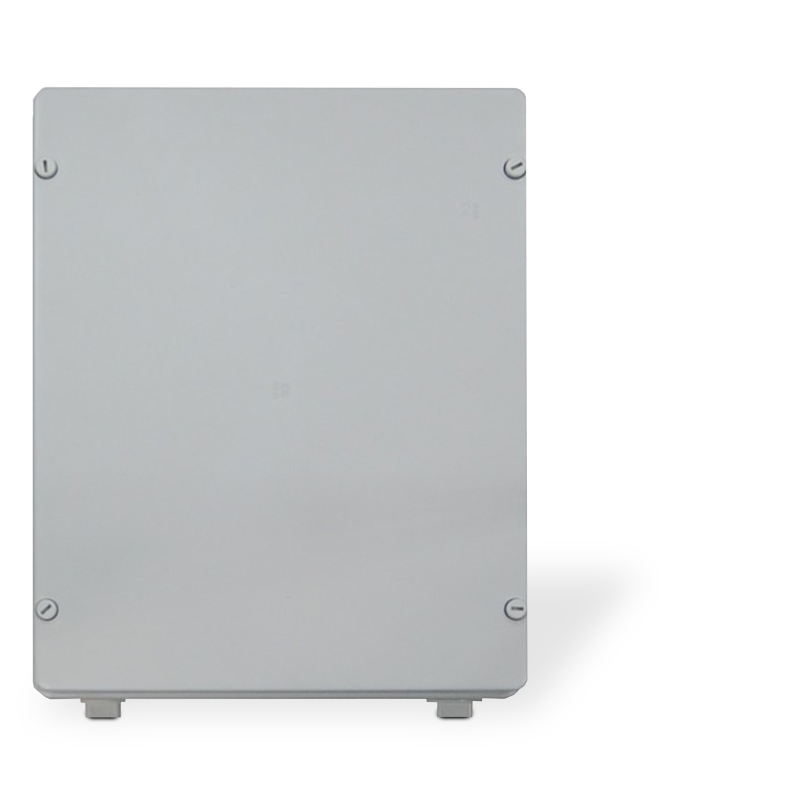
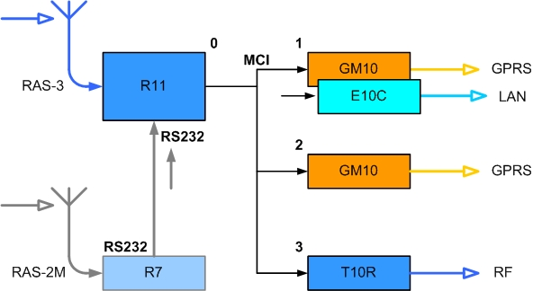

# Retransliatorius R-IP12

  

## Gaminio paskirtis

Retransliatorius R-IP12 daugiafunkcinis pranešimų perdavimo sistemos įrenginys skirtas priimtiems pranešimams retransliuoti į centralizuoto stebėjimo pultą.

## Pagrindinės savybės

- retransliatoriaus konfigūracija parenkama, atsižvelgiant į sprendžiamą užduotį;

- pagal poreikį pasirenkami ryšio su stebėjimo pultu kanalai: GPRS / Ethernet / Radijo;

- pranešimai į stebėjimo pultą siunčiami pagrindiniu arba rezerviniais ryšio kanalais;

## Taikymas

Retransliatorius R-IP12 gali būti naudojamas:

- radijo siųstuvų pranešimų retransliavimui radijo kanalu;

- radijo siųstuvų pranešimų retransliavimui IP ryšio kanalais;

- kitos nutolusios priėmimo įrangos pranešimų retransliavimui IP kanalais.

## Veikimo principas

Objektų įrangos siunčiami pranešimai yra priimami radijo imtuvu arba patenka į retransliatorių per nuoseklų RS232 prievadą. Pagal konfigūravimo metu nustatytus parametrus, priimti pranešimai filtruojami ir nukreipiami į perdavimo modulius.

Perdavimas į stebėjimo pultą vykdomas vienu arba keliais perdavimo moduliais, veikiančiais skirtingais ryšio kanalais. Gavęs pranešimą perdavimo modulis savuoju ryšio kanalu perduoda jį į stebėjimo pulto įrangą. Jeigu naudojami du (ir daugiau) perdavimo moduliai, pranešimai siunčiami nurodyta seka arba lygiagrečiai.

Retransliatoriaus R-IP12 struktūrinė schema pateikta 1 paveiksle.

1 pav. Struktūrinė retransliatoriaus R-IP12 schema

Žemiau pateiktoje lentelėje parodyti galimi retransliatoriaus naudojimo ir komplektavimo variantai, sudaryti atsižvelgiant į keliamus užduotyje reikalavimus.

| Varianto / pavadinimas | Naudojami / priėmimo ir perdavimo moduliai R11 | Pastabos GM10 |
|------------------------|---------------------------------------------------|------------------|
| Bazinis_1 | + | + x2 |
| Bazinis_2 | + | + |
| Radijo_1 | + | - |
| Dvigubas radijo_1 | + | + x2 |
| Dvigubas radijo_2 | + | + |
| Pastaba: / Reikiami perdavimo moduliai retransliatoriuje sumontuojami gamybos metu. |  |  |

Baziniuose variantuose stebimų objektų radijo pranešimai, siunčiami sistemos RAS-3 kodavimu, priimami radijo imtuvu R11. Prie jo įėjimų taip pat prijungtos retransliatoriaus kintamosios maitinimo įtampos kontrolės, korpuso apsaugos ir antenos komutatoriaus valdymo grandinės.

Radijo variante stebimų objektų radijo pranešimai, siunčiami sistemos RAS-3 kodavimu, priimami radijo imtuvu R11. Pranešimai retransliuojami vienu prijungtu radijo siųstuvu. Siuntimo metu antena prijungiama prie siųstuvo.

Išplėstiniuose radijo variantuose stebimų objektų radijo pranešimai, siunčiami sistemos RAS-2M, LARS, LARS1 kodavimais, priimami radijo imtuvu R7. Informacija iš imtuvo R7 per nuoseklų imtuvo prievadą RS232 nukreipiama į imtuvą R11. Reikalui esant, vietoj imtuvo R7 prie nuoseklaus prievado RS232 gali būti prijungtas kitas pranešimų priėmimo įrenginys.

Informacija iš imtuvo R11 per MCI sąsają nukreipiama į perdavimo modulius. Perdavimo modulis GM10 veikia GPRS kanalu, modulis E10C – Ethernet kanalu, siųstuvas T10R – radijo kanalu. Ryšys su perdavimo moduliais nuolatos kontroliuojamas. Praradus ryšį su perdavimo moduliu, pranešimai perduodami sekančiu eilėje moduliu.

Konfigūruojant retransliatorių nustatoma perdavimo tvarka. Nurodytas pirmuoju perdavimo įrenginys veikia pirmas ir duomenys siunčiami per jį. Jei duomenų per pirmąjį įrenginį išsiųsti nepavyksta, arba jeigu imtuvas R11 yra ankščiau užfiksavęs ryšio sutrikimą per pirmąjį, tuomet duomenys yra siunčiami per antrąjį, o šiam sutrikus – per trečiąjį ryšio modulį. Yra galimybė pasirinktus įrenginius nustatyti siųsti vienu metu (lygiagrečiai).

Naudojant dvipusio ryšio modulius (GPRS ir Ethernet) nuolatos kontroliuojamas ryšys su pulto įranga. Tam perdavimo moduliai siunčia specialius ryšio tikrinimo pranešimus PING, kuriuos kontroliuoja stebėjimo pulto IP imtuvas RL14, RM14 (arba kita analogiška įranga) ir atsiunčia priėmimo patvirtinimo pranešimą. Praradęs ryšį modulis apie tai informuoja imtuvą R11, kuris nukreipia pranešimus kitam veikiančiam moduliui ir pranešimai perduodami kitu ryšio kanalu.

## Techniniai parametrai

1\. Retransliatorius R-IP12 priima radijo pranešimus, siunčiamus RAS-3, RAS-2M, LARS ir LARS1 kodavimo sistemomis (atsižvelgiant į turimą retransliatoriaus konfigūraciją ir imtuvų nustatymus).

2\. Retransliatoriaus R-IP12 imtuvas R11 turi nuoseklų prievadą RS232 pranešimams, perduodamiems Surgard MLR2-DG protokolu, priimti.

3\. Retransliatoriaus R-IP12 imtuvas R11 turi keturis terminalus, kurie gali būti nustatomi kaip įėjimas arba išėjimas: įėjimo tipas NO/NC, išėjimo – atviras kolektorius OC, komutuojantis nuolatinę iki 30 V įtampą ir iki 0,1 A srovę.

4\. Retransliatoriuje montuojami perdavimo moduliai, veikiantys skirtingais ryšio kanalais:

- T10R – skirtas radijo pranešimams retransliuoti radijo kanalu. Įrenginys veikia RAS-3 kodavimu, Monas-3D protokolu. Pranešimus gali priimti imtuvai R11 ir RF11.

- GM10 – skirtas pranešimams retransliuoti GPRS kanalu. Veikia UDP/IP protokolu TRK_UDP kodavimu. Pranešimus gali priimti imtuvas RL10 (arba kita analogiška įranga).

- E10C – skirtas pranešimams retransliuoti Ethetnet kanalu. Veikia UDP/IP protokolu TRK_UDP kodavimu. Pranešimus gali priimti imtuvas RL10 (arba kita analogiška įranga).

Sprendžiant skirtingas užduotis ir sudarant komplektavimo variantus gali būti sumontuoti trys skirtingi perdavimo moduliai.

5\. Retransliatorius maitinamas iš 50±1 Hz dažnio 230 V įtampos kintamos srovės tinklo ir. Naudojama galia neviršija 60 W. Leistinos maitinimo įtampos kitimo ribos nuo 120 iki 250 V.

6\. Retransliatorius maitinamas iš rezervinio 12 V įtampos ir ne mažesnės kaip 7 Aval. talpos akumuliatoriaus. Naudojama srovė neviršija 1,8 A (esant maksimaliam komplektavimo variantui su trimis perdavimo ir dviem priėmimo moduliais). Leistinos maitinimo įtampos kitimo ribos nuo 10,5 iki 13,8 V. Esant kintamos srovės tinklo įtampai akumuliatorius įkraunamas automatiškai.

7\. Retransliatorius veikia užtikrina nurodytus parametrus esant aplinkos oro temperatūrai nuo -10 iki +55 °C ir santykinei oro drėgmei iki 90% esant +20 °C temperatūrai.

8\. Gabaritiniai retransliatoriaus matmenys neviršija 310x390x130 mm. Masė neviršija 4 kg.

## Retransliatoriaus R-IP12 bendras vaizdas ir konstrukcija

Visi retransliatoriaus R-IP12 mazgai sumontuoti ant metalinio pagrindo, patalpinto plastmasiniame korpuse. Bendras retransliatoriaus R-IP12 vaizdas pateiktas 2 paveiksle.

Rezervinio maitinimo akumuliatorius 12V ne mažiau 7Aval. talpos

Perdavimo moduliai

GM10, E10C ir T10R

Korpuso atidarymo jutiklis

Impulsinis maitinimo šaltinis

Kintamos srovės tinklo įvadas

Priėmimo moduliai R11 ir R7 (apačioje)

Antenos komutatorius

2 pav. Retransliatoriaus R-IP12 (priekinis dangtis nuimtas) bendras vaizdas

*Pastaba:*

*Priklausomai nuo pasirinkto komplektavimo varianto į pateikiamo retransliatoriaus konfigūraciją, įstatytų perdavimo ir priėmimo modulių skaičius gali būti kitas.*

Korpuso priekinis dangtis turi vyrius ir gali būti visai nuimtas. Darbo padėtyje priekinis dangtis uždaromas ir papildomai tvirtinamas keturiais varžtais.

Visi jungiamieji, antenų ir maitinimo kabeliai įvedami į retransliatorių per apatinėje korpuso dalyje išdėstytas kiaurymes.

## Retransliatoriaus paruošimas

Retransliatoriaus paruošimas pardavimui ir pateikimas užsakovui vykdomas sekančia tvarka:

1)  atsižvelgiant į sprendžiamą užduotį, pasirenkamas komplektavimo variantas;

2)  atliekamas retransliatoriaus surinkimas;

3)  pagal keliamus reikalavimus atliekamas priėmimo ir perdavimo modulių konfigūravimas;

4)  patikrinamas retransliatoriaus veikimas ir paruošiama lydinčioji dokumentacija.

*Pastaba:*

*Lydinčioje dokumentacijoje turi būti nurodyti užsakovo duomenys, retransliatoriaus komplektavimo variantas bei nustatyti priėmimo ir perdavimo modulių parametrai.*

## Retransliatoriaus konfigūravimas

Retransliatoriaus darbiniai parametrai nustatomi atskirų mazgų parametrų nustatymo programomis. Detali parametrų nustatymo eiga nurodyta įrengimo instrukcijose. Čia ir toliau pateikiamas parametrų nustatymas, būtinas retransliavimo režimui užtikrinti.

5)  <u>Imtuvo R11 parametrų nustatymas</u>

Radijo imtuvo R11 parametrai nustatomi parametrų nustatymo programa R11config. Turi būti nurodyti:

- Retransliatoriaus režimas, darbo dažnis, atpažinimo tipas;

Darbo dažnis

Atpažinimo tipas

Imtuvo einamojo laiko nustatymas

- Pranešimų filtravimo parametrai;

pagal ID seką

pagal kodavimo sistemas ir posistemes

pagal retransliatorių vidinius numerius

Nejautrumo tam pačiam signalui laikas

- Išėjimo protokolas ir mainų parametrai, perdavimo į siunčiamuosius modulius seka ir/ar įjungtas priėmimas per nuoseklųjį RS232 prievadą;

imtuvo ir linijos, posistemės ir ID numeriai rodomi pranešime

Formuojamų pranešimų sąrašas

Išėjimo protokolas

Aktyvuotas įėjimas,

Mainų protokolas ir greitis

Prijungtų perdavimo modulių veikimo eiliškumas

6)  <u>Perdavimo modulio GM10 parametrų nustatymas</u>

Perdavimo modulio GM10 parametrai nustatomi parametrų nustatymo programa G10config. Turi būti nurodyti:

- Perdavimo modulio atpažinimo parametrai;

Perdavimo modulio

eilės numeris

Perdavimo modulio ID

*Pastaba:*

*Negali būti dviejų modulių vienodais eilės numeriais.*

- Priėmimo įrangos, į kurią siunčiami pranešimai, adresas.

Šifravimo raktas

Naudojamo tinklo parametrai

Priėmimo adresas

7)  <u>Perdavimo modulio E10C parametrų nustatymas</u>

Perdavimo modulio E10C parametrai nustatomi parametrų nustatymo programa Econfig. Turi būti nurodyti:

- Perdavimo modulio atpažinimo parametrai;

Perdavimo modulio ID

- Priėmimo įrangos, į kurią siunčiami pranešimai, adresas.

Slaptažodis

Perdavimo modulio eilės numeris

Perdavimo modulio

ryšio protokolas

Perdavimo modulio

PING‘ų periodas

Tinklo ir imtuvo,

į kurį siunčiama, parametrai

Naudojamo tinklo,

iš kurio siunčiama, parametrai

8)  <u>Radijo siųstuvo T10R parametrų nustatymas</u>

Radijo siųstuvo T10R parametrai nustatomi parametrų nustatymo programa T10config. Turi būti nurodyti:

- Perdavimo modulio atpažinimo parametrai, darbo dažnis ir kodavimas, pranešimo kartojimų skaičius;

Pranešimo kartojimų skaičius retransliato-riuje =1

Kodavimo protokolas, modulio ID, posistemė, darbo dažnis ir išėjimo galia

- MCI sąsajos parametrai ir modulio eilės numeris.

Aktyvuoti MCI,

eilės numeris ir retransliatoriaus vidaus numeris

9)  <u>Imtuvo R7 parametrų nustatymas</u>

Radijo imtuvo R7 parametrai nustatomi parametrų nustatymo programa Hyper Terminal. Turi būti nurodyti:

- Nurodytas darbo dažnis, kodavimas ir pranešimų filtravimo parametrai;

- Nustatytas išėjimo protokolas Surgard MLR2-DG;

- Nurodyti imtuvo ir linijos numeriai;

*Pastaba:*

*Kitos priėmimo įrangos parametrai nustatomi tų prietaisų įrengimo instrukcijose nurodyta įranga.*

## Retransliatoriaus įrengimas

Retransliatoriaus įrengimo vieta parenkama atsižvelgiant į retransliatoriaus paskirtį, aptarnaujamos vietovės reljefą ir dydį, vertinant apsaugą nuo galimo nesankcionuoto įsikišimo į retransliatoriaus darbą. Retransliatorius įrengiamas negyvenamose patalpose, vietose, į kurias patekimas yra ribotas ir sudėtingas. Retransliatorius montuojamas patalpoje (gali būti nešildoma) ant vertikalios sienos.

Norint išvengti traumų (sužeidimu dėl šilumos ar elektros įtampos poveikio), o taip pat siekiant užtikrinti patikimą ilgalaikį retransliatoriaus darbą būtina laikytis saugos reikalavimų.

Rekomenduojama įrengimą vykdyti sekančia seka:

10. Radijo antenos įrengiamos 20-30 m aukštyje virš žemės paviršiaus ir praklojamas jungiamasis kabelis iki retransliatoriaus. Racionalu naudoti atskiras antenas priėmimui ir perdavimui. Sujungimui su antena turi būti naudojamas bendraašis kabelis turintis mažą slopinimą. Rekomenduojama naudoti RG213 arba geresnį kabelį.

Pastatykite stiebą, sumontuokite anteną, prijunkite kabelį ir patikrinkite antenos suderinimą darbo dažniui. Stovinčios bangos koeficientas turi būti ne didesnis kaip 1,5.

11. Pritvirtinkite retransliatorių prie vertikalios sienos. Retransliatoriaus korpuso tvirtinimo kiaurymių tarpusavio padėtis ir matmenys nurodyti ant įrenginio pakuotės. Retransliatorius tvirtinamas keturiais varžtais. Pritvirtinus retransliatorių, jungiami kintamos srovės tinklo ir antenos kabeliai.

12. Išėmę retransliatoriaus kintamos srovės tinklo įvado saugiklį, prie kintamos įtampos kaladėlės prijunkite kintamos srovės tinklo laidus ir įžeminimą. Kaladėlės kontaktų aprašymas pateiktas priede A „Maitinimo kaladėlės kontaktų paskirtis“. Fazinis laidas jungiamas prie kontakto, apsaugoto saugikliu. Patikimai pritvirtinkite maitinimo iš kintamos srovės tinklo kabelį.

13. Jei naudojami GPRS perdavimo moduliai GM10, į juos įdėkite SIM korteles. SIM kortelė ir mokėjimo planas privalo leisti siųsti duomenis GPRS ryšio kanalu UDP protokolu. SIM kortelės PIN kodo užklausa turi būti išjungta.

14. Jei naudojami Ethernet perdavimo moduliai E10C, prijunkite Ethernet tinklo kabelį. Iš anksto turi būti žinomi ir įvesti į modulius naudojamo tinklo parametrai.

15. Jei naudojamas radijo siųstuvas T10R, prijunkite antenos kabelį prie centrinės antenos komutatoriaus jungties (arba prie siųstuvo antenos jungties, jei naudojamos atskiros antenos priėmimui ir siuntimui).

16. Įstatykite įkrautą akumuliatorių ir prijunkite raudoną laidą prie akumuliatoriaus “+” gnybto, o juoda laidą prie akumuliatoriaus “-“ gnybto.

*Pastaba:*

*Esant maitinimui, mirksi R-IP12 įrenginių maitinimo/funkcionavimo šviesos indikatoriai.*

17. Įjunkite maitinimą iš kintamos srovės tinklo, įstatydami retransliatoriaus kintamos srovės tinklo saugiklį.

Maitinimo įjungimo metu (arba po imtuvo R11 RESET mygtuko nuspaudimo) tikrinama imtuvo R11 įėjimų būsena ir siunčiami pradiniai pranešimai. Per 1÷2 min. visi pranešimai išsiunčiami ir retransliatorius pasiruošęs retransliuoti pranešimus.

Rekomenduojama nustatyti imtuvo R11 einamąjį laiką.

## Ryšio patikrinimas

Pilnai įrengus retransliatorių, tikrinamas jo ryšys su centralizuoto stebėjimo pultu. Tam:

18) Patikrinkite ar stebėjimo pulte priimami GPRS ir Ethernet perdavimo modulių PING pranešimai.

19) Patikrinkite ar stebėjimo pulte priimami radijo siųstuvo siunčiami pranešimai.

20) Nuspaudę ir atleidę retransliatoriaus korpuso apsaugos jutiklį, patikrinkite ar pranešimai priimami stebėjimo pulte.

21) Suformuokite atskiro objektinio siųstuvo signalus ir patikrinkite ar jie priimti stebėjimo pulte. Jei retransliatorius priima kelių kodavimų ar dažnių signalus patikrinkite visas galimas kombinacijas.

*Pastaba:*

*Skirtingais kanalais perduodami tie patys pranešimai tarpusavyje skiriasi ir privalo būti teisingai aprašyti stebėjimo programoje.*

Retransliatorius laikomas įrengtu tinkamai, jei stebėjimo pulte teisingai priimti visi siųsti pranešimai.

Priedas A. Maitinimo kaladėlės kontaktų paskirtis

<table>
<colgroup>
<col style="width: 0%" />
<col style="width: 0%" />
</colgroup>
<tbody>
<tr>
<td style="text-align: center;">Laido spalva</td>
<td style="text-align: center;">Aprašas</td>
</tr>
<tr>
<td colspan="2" style="text-align: center;">Kintamos srovės tinklo jungiamasis kabelis privalo turėti dvigubą izoliaciją, o laidai būti ne plonesni kaip 0,75 mm2 skerspjūvio ploto. Kabelis turi turėti žalios su geltona spalvos apsauginio įžeminimo laidą.</td>
</tr>
<tr>
<td style="text-align: center;">Geltonas /​ žalias</td>
<td style="text-align: center;">įžeminimo gnybtas</td>
</tr>
<tr>
<td style="text-align: center;">Rudas</td>
<td style="text-align: center;">fazinis kintamosios srovės tinklo gnybtas</td>
</tr>
<tr>
<td style="text-align: center;">Mėlynas</td>
<td style="text-align: center;">neutralusis kintamosios srovės tinklo gnybtas</td>
</tr>
</tbody>
</table>

