# GSM коммуникатор G16T

  

## Описание 

GSM коммуникатор G16T может быть подключен к любой охранной панели, которая имеет телефонный коммуникатор и поддерживает протокол связи Contact ID, передаваемый DTMF тонами.

Коммуникатор передает полную информацию о событиях на приемник пульта охранного предприятия.

Коммуникатор работает с приложением Protegus. С Protegus пользователи могут удаленно управлять охранной сигнализацией и получать сообщения о событиях. Приложение Protegus работает с любой охранной панелью, к которой подключен коммуникатор G16Т. Коммуникатор может одновременно отправлять сообщения на ПЦН (пульт централизованного наблюдения) и в приложение Protegus.

GSM коммуникатор G16T соответствует стандарту Grade 4 EN50131.

**Функциональность**

Подключается к телефонному коммуникатору охранной панели:

- Подключается к телефонному коммуникатору охранной панели 2 или 4 проводами.

- Подключив 4 проводами, будет контролироваться телефонная линия между охранной панелью и коммуникатором.

Отправляет сообщения на приемник ПЦН:

- Отправляет сообщения на программные или аппаратурные приемники *Trikdis*, которые работают с любой программой мониторинга.

- Может отправлять сообщения на SIA DC-09 приемники.

- Может отправлять сообщения на SUR-GARD приемники. В приложении есть таблица конвертации Contact ID кодов в SIA коды.

- Контроль связи, отправляя PING сообщения на IP-приемник каждые 30 сек. (или другим установленным периодом).

- Резервный канал связи, который применяется при нарушении основного канала связи.

- Отправление SMS сообщений на ПЦН. SMS сообщение будет отправлено даже когда нарушается IP связь в сети оператора мобильной связи.

- Отправление SMS сообщений на ПЦН. SMS сообщение будет отправлено даже когда нарушается IP связь в сети оператора мобильной связи.

- При включении параллельного канала связи, сообщения о событиях будут отправляться на два приемника одновременно.

- Когда включен Protegus сервис, сообщения сперва отправляются на ПЦН и только потом пользователям приложения Protegus.

**Работает с приложением Protegus:**

- „Push“ и специальные голосовые оповещения о событиях.

- Удаленное включение/выключение системы.

- Удаленное управление подключенным оборудованием (освещением, ворота, отопление, кондиционирование, полив и т.д.).

- Контроль температуры (с расширителями iO или iO-WL ).

- Различные права пользователей для администратора, установщика и пользователя.

**Информирование пользователей:**

- Пользователей можно информировать не только с приложением Protegus, но и SMS сообщением и звонком.

**Управляемые выходы и входы:**

- 1 выход, который управляется:

  - Приложением Protegus.

  - SMS сообщением.

- 2 входа, типы которых можно задать: NC; NO; NC/EOL; NO/EOL; NC/DEOL; NO/DEOL.

- Добавление дополнительных входов и управляемых выходов с помощью беспроводных и проводных iO расширителей.

**Быстрая конфигурация:**

- Настройки можно сохранить в файле и быстро записать на другие коммуникаторы.

- Два уровня доступа к настройкам: установщика и администратора ПЦН.

- Удаленная конфигурация и обновление прошивки.

### Типы моделей коммуникаторов 

Данная инструкция предназначена для коммуникаторов следующих моделей:

- G16T_321x – 3 версия, 1 SIM, 2G модем.

- G16T_331x – 3 версия, 1 SIM, 3G модем.

- G16T_341x – 3 версия, 1 SIM, 4G модем.

- G16T_3M1x – 3 версия, 1 SIM, LTE CatM1 & EGPRS модем.

### Технические параметры 

| Параметр | Описание |
|----|----|
| Подключение к охранной панели | К телефонному коммуникатору (клеммы: TIP, RING) |
| Входы | 2, тип: NC;​ NO;​ NC/​EOL;​ NO/​EOL;​ NC/​DEOL;​ NO/​DEOL /​ Количество входов можно увеличить с помощью расширителей iO |
| Выходы | 1, тип: открытый коллектор (ОС), ток до 0,15 A постоянного тока, 30 В макс. /​ Количество выходов можно увеличить с помощью расширителей iO |
| Частота 2G модема | 850 /​ 900 /​ 1800 /​ 1900 MГц |
| Частота 3G модема | 800 /​ 850 /​ 900 /​ 1900 /​ 2100 MГц |
| Частота 4G модема | В зависимости от региона |
| Напряжение питания | 10-18 В постоянного тока |
| Потребляемый ток | 60-100 мA (в режиме ожидания) /​ До 250 мA (в режиме передачи данных) |
| Протокол передачи данных | TRK, DC-09_2007, DC-09_2012, TL150 |
| Шифрование сообщения | AES 128 |
| Конфигурация | С программой TrikdisConfig удаленно или подключив коммуникатор к компьютеру USB Mini-B кабелем. Удаленно SMS сообщениями |
| Память | До 60 сообщений |
| Условия эксплуатации | Температура от -10 °C до +50 °C, относительная влажность 0-80%, при температуре +20 °C (без конденсации). |
| Размер | 92 x 62 x 25 мм |
| Вес | 80 г |

### Элементы коммуникатора 

1.  Разъем SMA для GSM антенны.

2.  Световые индикаторы.

3.  Щель для снятия крышки коммуникатора.

4.  Клеммы для подключения внешних устройств.

5.  USB Mini-B разъем для программирования коммуникатора.

6.  Держатель SIM карты.

### Клеммы подключения 

| Клемма | Описание |
|----|----|
| +DC | Клемма подключения питания (10-18 В постоянного тока, положительная клемма) |
| -DC | Клемма подключения питания (10-18 В постоянного тока, отрицательная клемма) |
| TIP | Клемма, к которой подключается TIP клемма охранной панели |
| RING | Клемма, к которой подключается RING клемма охранной панели |
| T-1 /​ IN1 | Клемма для наблюдения за телефонной линией или клемма входа, тип: NC;​ NO;​ NC/​EOL;​ NO/​EOL;​ NC/​DEOL;​ NO/​DEOL |
| R-1 /​ IN2 | Клемма для наблюдения за телефонной линией или клемма входа, тип: NC;​ NO;​ NC/​EOL;​ NO/​EOL;​ NC/​DEOL;​ NO/​DEOL |
| COM | Общая клемма (отрицательная) |
| OUT | Выход, тип открытый коллектор (ОС), ток до 0,15А |
| A 485 | A клемма интерфейса *RS485* |
| B 485 | A клемма интерфейса *RS485* |

### Световая индикация 

#### NETWORK (сеть)

| Статус | Описание |
| --- | --- |
| Выключен | Нет подключения к GSM сети. |
| Мигает желтым | Идет подключение к GSM сети. |
| Светит зеленым и мигает желтым | Коммуникатор подключен к GSM сети. Достаточный уровень сигнала для сети 2G — 5 уровень (пять желтых вспышек), для 3G/4G — 3 уровень (три желтых вспышки). |

#### DATA (данные)

| Статус | Описание |
| --- | --- |
| Выключен | Нет неотправленных сообщений. |
| Зеленый | Есть неотправленные сообщения. |
| Мигает зеленым | *(Режим конфигурации)* перенос данных в коммуникатор или из него. |

#### POWER (электропитание)

| Статус | Описание |
| --- | --- |
| Выключен | Нет напряжения питания. |
| Зеленый | Питающее напряжение достаточное. |
| Желтый | Низкий уровень питающего напряжения (≤11,5 В). |
| Светит зеленым и мигает желтым | *(Режим конфигурации)* коммуникатор подготовлен к конфигурации. |
| Желтый (режим конфигурации) | *(Режим конфигурации)* нет связи с компьютером. |

#### TROUBLE (неисправность)

| Статус | Описание |
| --- | --- |
| Выключен | Нет неисправностей. |
| 1 вспышка красным | SIM карта не обнаружена. |
| 2 вспышки красным | Неправильный PIN код SIM карты. |
| 3 вспышки красным | Проблема программирования (нет APN). |
| 4 вспышки красным | Проблема с подключением к GSM сети. |
| 5 вспышек красным | Проблема с подключением к сети мобильного интернета. |
| 6 вспышек красным | Нет связи с приемником. |
| 7 вспышек красным | Пропала связь с охранной панелью. |
| Мигает красным | *(Режим конфигурации)* ошибка памяти. |
| Красный | *(Режим конфигурации)* ошибка программного обеспечения. |

### Структурная схема применения GSM коммуникатора G16T 

!!! note "Примечание"
    Перед установкой убедитесь, что имеете:
    
    1.  Кабель USB Mini-B для конфигурации.
    
    2.  4-ех жильный кабель для подключения к охранной панели.
    
    3.  Отвертка с плоским жалом 2,5 мм.
    
    4.  Внешняя GSM антенна, если слабая связь.
    
    5.  Активированная SIM карта (запрос PIN кода может быть отключен).
    
    6.  Инструкция охранной панели, к которой будет подключен коммуникатор.
    
    Необходимые материалы можете заказать у местного поставщика.
## Быстрая настройка с программой *TrikdisConfig* 

1.  Загрузите программу конфигурации TrikdisConfig со странички [www.trikdis.com/ru](http://www.trikdis.com/ru)/ (в поле поиска напишите „TrikdisConfig“), и установите ее на компьютер.

2.  Плоской отверткой снимите крышку, как показано на рисунке:

1.  Кабелем USB Mini-B подключите G16Т к компьютеру.

2.  Запустите программу TrikdisConfig. Программа автоматически определит подключенное изделие и откроет окно конфигурации G16Т.

3.  Нажмите на кнопку **Считать [F4]**, чтобы скачать установленные параметры на G16Т. Если необходимо введите код администратора или инсталлятора.

Ниже описываются настройки, которые необходимо сделать, чтобы коммуникатор начал отправлять сообщения на ПЦН (пульт централизованного наблюдения) и чтобы приложением Protegus можно было управлять охранной панелью.

### Настройка связи с приложением Protegus 

Окно „Сообщения пользователю“ закладка „Сервис Protegus “:

1.  Отметьте поле **Разрешить подключиться** к сервису Protegus.

2.  Измените **Пароль доступа к Protegus Cloud**. Запрос на ввод пароля будет поступать при добавлении системы к приложению Protegus (заводской пароль - 123456).

**Окно „SIM карта“:**

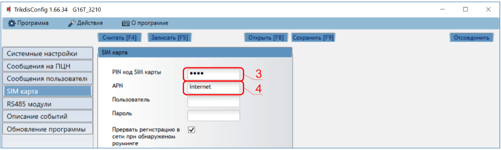

3. Введите **PIN код SIM карты**.

2.  Введите имя **APN**. **APN** найдете на страничке оператора SIM карты. „Internet” является универсальным и работает во многих сетях операторов мобильной связи.

Завершив конфигурацию, нажмите кнопку **Записать [F5]** и отключите кабель USB.

!!! note "Примечание"
    Настройки G16T с TrikdisConfig описаны
    п. 6 **„**Конфигурация с программой TrikdisConfig**".**
!!! note "Примечание"
    Не забудьте включить телефонный коммуникатор и правильно его с
    конфигурировать, чтобы охранная панель отправляла сообщения. В
    п. 4 „Программирование охранных панелей" описано как это сделать.
### Настройка связи с ПЦН 

**Окно „Системные настройки“:**

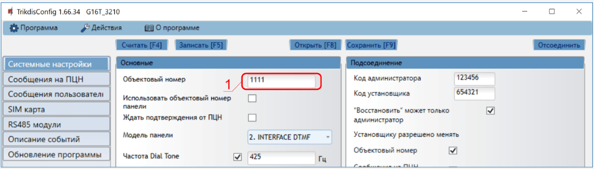

1.  Введите **Объектовый номер (Не используйте FFFE, FFFF объектовые номера**.**)**.

Окно „Сообщение на ПЦН“, группа „Основной канал связи“:

2. **Режим** – выберите **IP** режим связи (Не рекомендуется использовать SMS, как основной канал связи).

2.  **Протокол** – выберите кодировку, с которой будут отправляться сообщения: **TRK** (на приемники TRIKDIS), **DC-09_2007** или **DC-09_2012** (на универсальные приемники), **TL150** (на приемники SUR-GARD).

3.  **Ключ шифрования TRK** – введите ключ шифрования, который установлен на приемнике.

4.  **Домен или IP** – введите адрес домена или IP адрес приемника.

5.  **Порт** – введите номер порта приемника в сети.

6.  **TCP или UDP** – выберите протокол (TCP или UDP) передачи сообщений.

!!! note "Примечание"
    Если хотите установить связь с ПЦН только SMS сообщениями, то необходимо
    ввести **Ключ шифрования TRK** и **Номер телефона**. SMS сообщения может
    принимать **Trikdis** приемники RL14, многоканальный приемник RM14 и SMS
    приемник GM14. / Если выбрали **DC-09** кодировку передачи сообщений, то
    в окне „**Сообщения на ПЦН**" в закладке „**DC-09 настройки**"
    необходимо ввести номера объекта, линии и приемника.
7. (Рекомендуется) Сделайте настройки **Режима работы Резервного канала связи**.

2.  (Рекомендуется) Введите **Резервный номер телефона для оповещения SMS** сообщениями.

**Окно „SIM карта“:**

10. Введите **PIN код SIM карты**.

11. Введите имя **APN.** **APN** найдете на страничке оператора SIM карты. „Internet” является универсальным и работает во многих сетях операторов мобильной связи.

Завершив конфигурацию, нажмите кнопку **Записать [F5]** и отключите кабель USB.

!!! note "Примечание"
    Настройки G16Т с TrikdisConfig описаны п. 6 „Конфигурация с
    программой TrikdisConfig".
!!! note "Примечание"
    Не забудьте включить телефонный коммуникатор охранной панели и правильно
    его настроить, чтобы охранная панель отправляла сообщения. В
    п. 4 „Программирование охранных панелей" описано как это сделать.
## Установка и схемы соединений 

### Установка 

1.  Снимите верхнюю крышку. Снимите клеммные колодки.

2.  Установите нано-SIM карту.

3.  Снимите плату.

4.  Корпус прикрепите шурупами.

5.  Обратно установите плату и клеммные колодки.

6.  Подсоедините GSM антенну.

7.  Закройте верхнюю крышку.

!!! note "Примечание"
    Убедитесь, что SIM карта активирована. / Убедитесь, что включена услуга
    мобильного интернета, если будет использоваться приложение
    Protegus или связь с ПЦН по IP каналу. / Если хотите избежать
    ввода PIN кода SIM карты в TrikdisConfig, вставьте SIM карту в
    телефон и отключите функцию запроса PIN кода.
### Схемы подсоединения коммуникатора и охранной панели 

Подсоедините коммуникатор к охранной панели по одной из ниже указанных схем.

### Схема подсоединения G16Т к зоне выключателя (keyswitch) охранной панели 

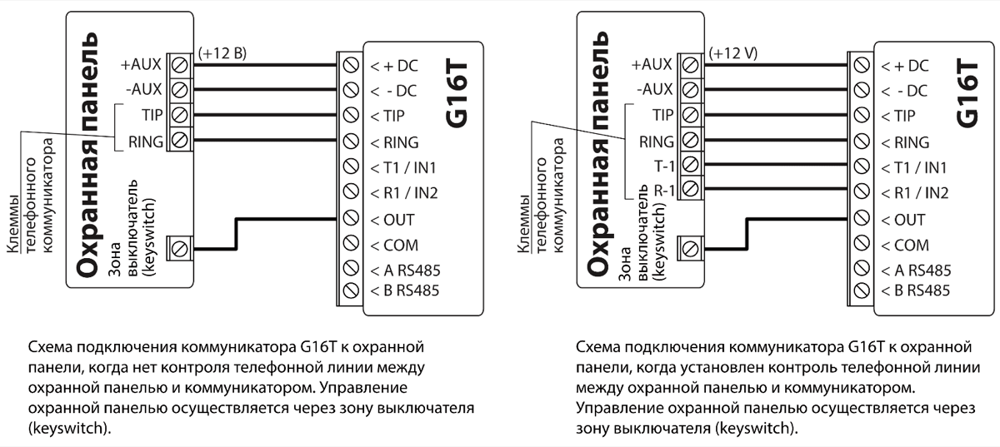

Руководствуйтесь этой схемой, при включении/выключении охранной панели зоной выключателя (keyswitch), которая управляется PGM выходом коммуникатора G16Т.

!!! note "Примечание"
    Коммуникатор G16Т имеет один PGM выход (OUT), который может
    управлять одной областью (разделом) охранной сигнализации. Для такого
    управления, необходимо в программе TrikdisConfig в окне „Системные
    настройки" в поле **Режим выхода OUT1** должно быть установлено
    **Удаленное управление** (заводская настройка).
### Схема подключения входа 

Коммуникатор имеет два входа (IN). Тип цепи: NC, NO, NO/EOL, NC/EOL, NO/DEOL, NC/DEOL. Заводская установка входа – NO (нормально открытый). Установка другого типа входа осуществляется с программой TrikdisConfig в окне „**Системные настройки**“ в поле **Тип входов IN1 и IN2**.

Cхемы типов входных цепей NC, NO, NO/EOL, NC/EOL, NO/DEOL, NC/DEOL:

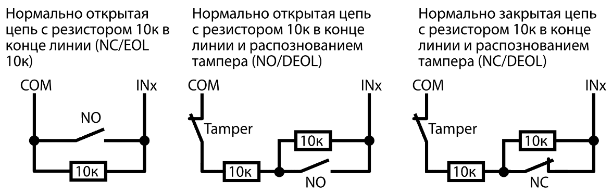

!!! note "Примечание"
    Подключив к коммуникатору проводные или беспроводные Trikdis iO
    расширители, можно увеличить количество входов (IN), выходов (OUT) и
    получить магистраль для подключения датчиков температуры.
### Схема подключения реле 

При помощи контактов реле можно удаленно управлять (включить/ выключить) различными электрическими приборами.

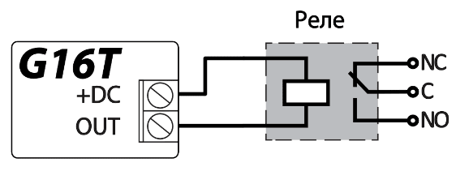

### Схема подключения расширителей серии iO 

Для увеличения количества входов (IN), выходов (OUT) или для возможности подключения датчиков температуры необходимо подключить проводной или беспроводный Trikdis iO расширитель. Конфигурация G16T с модулем расширения описаны в п. 6.6 „Окно „RS485 модули““.

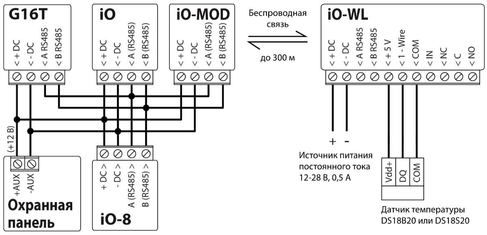

### Схема подключения WiFi модуля W485 

Модуль *W485* предназначен для передачи сообщений и управления через WiFi компьютерную сеть. Используя *W485* вместе с *G16Т*, сообщения на ПЦН и в *Protegus* передаются через WiFi компьютерную сеть и мобильный интернет не используется. При нарушении связи в WiFi сети данные передаются через сеть мобильного интернета. При восстановлении WiFi связи *G16Т* начинает вновь отправлять сообщения через *W485*. / Конфигурация *G16Т* с WiFi модулем *W485* описана в п. 6.6 „Окно „RS485 модули““. / В коммуникаторе *G16Т* должна быть установлена SIM карта, чтобы работал модуль *W485*.

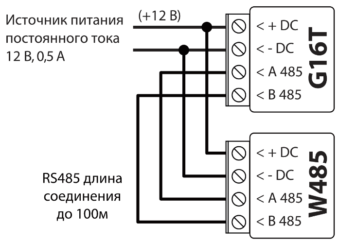

### Схема подключения „Ethernet“ модуля E485 

Модуль *Е485* предназначен для передачи сообщений и управления через проводную компьютерную сеть. Используя *Е485* вместе с *G16Т,* сообщения на ПЦН и в *Protegus* передаются через проводную компьютерную сеть и мобильный интернет не используется. При нарушении связи в компьютерной сети данные передаются через сеть мобильного интернета. При восстановлении связи в компьютерной сети *G16Т* начинает вновь отправлять сообщения через *Е485*. / Конфигурация *G16Т* с „Ethernet“модулем *Е485* описана в п. 6.6 „Окно „RS485 модули““. / В коммуникаторе *G16Т* должна быть установлена SIM карта, чтобы работал модуль *Е485*.

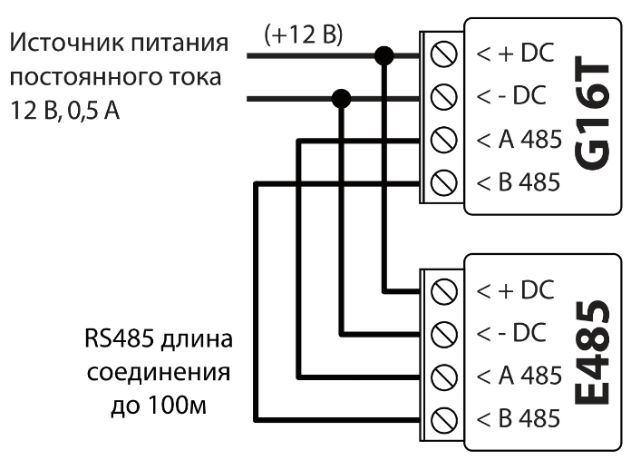

### Включение коммуникатора 

1.  Для запуска коммуникатора, необходимо включить питание охранной панели. На коммуникаторе должны загореться световые индикаторы:

- „POWER“ светит зеленым цветом (достаточный уровень питающего напряжения).

- „NETWORK“ светит зеленым и мигает желтым цветом, когда коммуникатор зарегистрировался в сети.

!!! note "Примечание"
    Достаточный уровень GSM сигнала -- 5 (5 вспышек желтым индикатора
    „NETWORK"). Достаточный уровень 3G сигнала - 3 (3 вспышки желтым
    индикатора „NETWORK"). / Если сосчитаете меньше желтых вспышек
    индикатора „NETWORK", то уровень сигнала GSM сети недостаточный.
    Рекомендуется подыскать другое место установки коммуникатора или
    применить внешнюю антенну. / Световая индикация индикаторов
    коммуникатора описана в п. 1.5 „Световая индикация". / Если индикаторы
    коммуникатора G16Т не светятся, то проверьте источник питания и
    соединения проводов.
## Программирование охранных панелей 

Чтобы охранная панель отправляла сообщения через телефонный коммуникатор, он должен быть включен и запрограммирован. Согласно руководству программирования охранной панели, запрограммируйте телефонный коммуникатор:

1.  Включите телефонный коммуникатор охранной панели.

2.  Введите номер телефона пульта (введите любой номер не менее двузначного. Коммуникатор G16T ответит на звонок охранной панели.).

3.  Выберите режим DTMF.

4.  Выберите формат связи Contact ID.

5.  Введите 4-ех значный номер объекта.

Зоне, к которой подсоединен выход OUT коммуникатора G16T, установите тип Выключатель (keyswitch), чтобы удаленно включать/выключать охранную панель.

!!! note "Примечание"
    Режим работы зоны выключателя (keyswitch) может быть Импульс или Сигнал.
    Заводская настройка выхода OUT G16T импульсный режим (3 сек.). В
    приложении Protegus можно изменить продолжительность импульсного
    режима, а так же можно задать режим работы выхода OUT как **Импульс**
    или **Сигнал.** См. п. 5.2 „Дополнительная настройка для
    Включения/Выключения системы зоной выключателя"**.**
### Программирование телефонного коммуникатора охранной панели Honeywell Vista 

Войдите в режим программирования и в ячейки запишите значения, которые указаны ниже:

- \*41 – введите телефонный номер приемника ПЦН (пульт централизованного наблюдения);

- \*43 – введите номер объекта охранной панели;

- \*47 – установите Тональный набор в [1] ячейку и введите количество попыток набора номера телефона;

- \*48 – Contact ID (используется заводская настройка). \*48 должно быть установлено 7;

- \*49 - Split / Dual сообщение. \*49 должно быть установлено 5;

- \*50 – задержка отправления сообщения о срабатывании охранной панели (необязательно). Заводская настройка [2,0], что дает 30 секундную задержку на отправление сообщения. Чтобы сообщение было отправлено сразу установите [0,0].

**Выйдите из режима программирования.**

После настройки необходимых параметров выйдите из режима программирования. На клавиатуре наберите \*99.

### Специальные настройки охранной панели „Honeywell Vista 48” 

Необходимые настройки охранной панели „**Honeywell Vista 48**“ для совместной работы с G16T приведены в таблице.

| Ячейка | Данные                               | Ячейка | Данные | Ячейка | Данные |
|:------:|--------------------------------------|:------:|:------:|:------:|:------:|
|  \*41  | 1111 (номер телефона приемника)      |  \*60  |   1    |  \*69  |   1    |
|  \*42  | 1111                                 |  \*61  |   1    |  \*70  |   1    |
|  \*43  | 1234 (номер объекта охранной панели) |  \*62  |   1    |  \*71  |   1    |
|  \*44  | 1234                                 |  \*63  |   1    |  \*72  |   1    |
|  \*45  | 1111                                 |  \*64  |   1    |  \*73  |   1    |
|  \*47  | 1                                    |  \*65  |   1    |  \*74  |   1    |
|  \*48  | 7                                    |  \*66  |   1    |  \*75  |   1    |
|  \*50  | 1                                    |  \*67  |   1    |  \*76  |   1    |
|  \*59  | 0                                    |  \*68  |   1    |        |        |

После настройки параметров выйдите из режима программирования. На клавиатуре наберите \*99.

## Удаленное управление 

### Добавление охранной системы к приложению Protegus 

С Protegus пользователи смогут удаленно управлять системой охраны. Пользователь будет иметь информацию о состоянии системы охраны, получать уведомления о событиях системы охраны.

1.  Скачайте и запустите приложение Prоtegus или используйте браузерную версию [www.protegus.app](https://www.protegus.app).

2.  Подключитесь к системе с помощью своего имени и пароля или создайте новую учетную запись.

!!! note "Примечание"
    При добавлении G16Т к Protegus должно быть:
    
    1.  Установлена активированная SIM карта и введен или отключен PIN код;
    
    2.  Включен Protegus сервис. См. п. 6.4 „Окно „Сообщения
        пользователю"";
    
    3.  Включено питание G16Т (индикатор „POWER" мигает зеленым
        цветом);
    
    4.  G16Т подключен к GSM сети (индикатор „NETWORK" светит зеленым
        цветом и мигает желтым).
3. Нажмите **Добавить объект** и введите „IMEI“ номер G16Т, который найдете на изделии или на упаковке. Нажмите кнопку **Далее.**

    

### Дополнительные настройки для включения/выключения системы зоной выключателя 

!!! note "Примечание"
    Зоне охранной панели, к которой подключен выход OUT коммуникатора
    G16Т, должен быть установлен тип - Выключатель (keyswitch).
Следуйте приведенным ниже инструкциям, если постановка/снятие с охраны будет осуществляться PGM выходом коммуникатора G16Т, который подключен к зоне выключателя (keyswitch) охранной панели:

1.  В новом окне в боковом меню нажмите „**Разделы**“. В открывшемся окне укажите количество разделов охранной сигнализации и нажмите „**Далее**“.

    

2.  В новом окне укажите номер каждого указанного раздела в охранной системе и нажмите „**Сохранить**“.

    

3.  В боковом меню нажмите „**Настройки**“ и в открывшемся окне нажмите „**Настройки**“. Отметьте поле „**Использовать PGM Выход для Включения/Выключения охранной системы**“ и укажите которым разделом будет управлять PGM выход. Один PGM выход коммуникатора G16T может управлять только одним разделом охранной сигнализации.

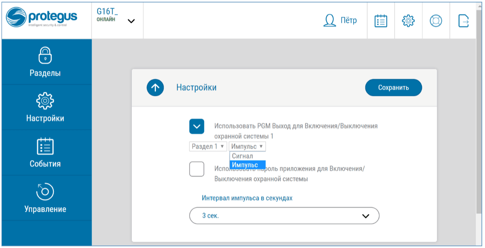

4. Выберите **Сигнал** или **Импульс**, в зависимости от того как настроен тип зоны выключателя (keyswitch). Если необходимо, можете изменить интервал импульса.

2.  Для дополнительной безопасности, можете выбрать „Использовать пароль приложения для Включения/Выключения охранной системы“. Тогда при нажатии кнопки **Поставить на охрану/Снять с охраны** появится окно ввода пароля приложения.

### Включение/выключение охранной системы с *Protegus* 

1.  Откройте в Protegus окно **Разделы**, чтобы управлять охранной системой.

2.  В окне „**Разделы**“ нажмите на кнопку раздела. В открывшемся окне выберите действие (**Снять с охраны/Поставить на охрану** раздел охранной системы).

3.  При необходимости введите код пользователя или пароль Protegus.

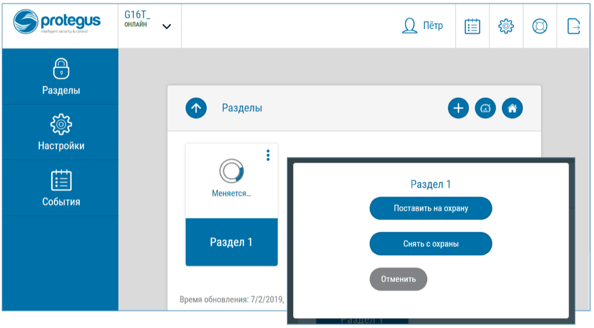

### Настройка и управление SMS сообщениями 

Коммуникатор можно удаленно настраивать SMS сообщениями и дистанционно управлять им.

Структура SMS сообщения: Пароль `[пробел]` Команда `[пробел]` Данные

В качестве пароля применяйте **Код администратора** (может выполнять команды: *INFO, RESET, OUTPUT1, CONNECT*) или **Код установщика** (может выполнять команды: *INFO, RESET, OUTPUT1*).

#### Список SMS команд

| Команда | Данные | Описание |
|---------|--------|----------|
| INFO |  | Запрос информации об устройстве. Ответ будет содержать информацию: тип устройства, номер IMEI, серийный номер, версию прошивки. / Например: 123456 INFO |
| RESET |  | Запуск работать коммуникатора заново. Например: 123456 RESET |
| OUTPUT1 | ON | Включить выход OUTPUT1. Например: 123456 OUTPUT1 ON |
| OUTPUT1 | OFF | Выключить выход OUTPUT1. Например: 123456 OUTPUT1 OFF |
| OUTPUT1 | PULSE=tttt | Включить выход OUTPUT1 на продолжительность импульса. „tttt“ – продолжительность импульса (вводится 4-значное число), сек.. / Например: 123456 OUTPUT1 PULSE=0002 |
| CONNECT | Protegus=ON | Подключиться к Protegus сервису. Например: 123456 CONNECT PROTEGUS=ON |
| CONNECT | Protegus=OFF | Отключиться от Protegus сервиса. Например: 123456 CONNECT PROTEGUS=OFF |
| CONNECT | IP=0.0.0.0:8000 | Указывается адрес TCP/IP и Port сервера основного канала связи. / Например: 123456 CONNECT IP=192.120.120.255:8000 |
| CONNECT | ENC=123456 | Установить ключ шифрования TRK. Например: 123456 CONNECT ENC=123456 |
| CONNECT | APN=Internet | Установить имя APN. Например: 123456 CONNECT APN=INTERNET |
| CONNECT | USER=user | Установить пользователя APN. Например: 123456 CONNECT USER=User |
| CONNECT | PASS=password | Установить пароль APN. Например: 123456 CONNECT PASS=Password |
| CONNECT | CP= | Включить/выключить DTMF интерфейс телефонной линии. (1 – Выключить; 2 - Включить). Например: 123456 CONNECT CP=2 |

Можно указать телефонные номера, команды которых будет принимать и исполнять коммуникатор. Настройка коммуникатора описана в п. 6.4 „Окно „Сообщения пользователю““, закладка „Управление SMS сообщением“.

## Конфигурация с программой TrikdisConfig 

### Строка состояния *TrikdisConfig* 

Подключив G16Т к TrikdisConfig и нажав на кнопку **Считать [F4]**, программа в строке состояния предоставит информацию о подключенном изделии:

| Наименование | Описание |
|----|----|
| IMEI/​Уникальный № | IMEI номер изделия |
| Состояние | Рабочее состояние |
| Устройство | Тип изделия (должно быть указано G16Т) |
| SN | Серийный номер изделия |
| BL | Версия программы |
| FW | Версия программы изделия |
| HW | Версия аппаратной части изделия |
| Состояние | Подключение программы к изделию (USB или Remote (удаленно)) |
| Роль | Уровень доступа (показывается после подтверждения кода доступа) |

Нажав кнопку **Считать [F4]**, программа TrikdisConfig считает и покажет настройки коммуникатора G16Т. С TrikdisConfig сделайте необходимые настройки, по приведенному ниже описанию.

### Окно „Системные настройки“ 

**Группа „Основные“**

- **Объектовый номер** – если сообщения будут отправляться на ПЦН (пульт централизованного наблюдения), то необходимо указать номер объекта (4-значный шестнадцатеричный номер, 0-9, А-F. **Не используйте FFFE, FFFF объектовые номера**.), который предоставлен ПЦН.

- **Использовать объектовый номер панели** – если поле отмечено, то коммуникатор будет отправлять сообщения с номером объекта введенным в охранной панели.

- **Ждать подтверждения от ПЦН** – если поле отмечено, то после каждого отправленного сообщения коммуникатор будет ждать подтверждения от IP приемника о получении сообщения. Если коммуникатор не получит подтверждения, то не сформирует сигнал конца связи (kiss off). Телефонный коммуникатор охранной панели, не получив сигнала конца связи, повторно отправит сообщение.

- **Модель панели –** включить/выключить DTMF интерфейс телефонной линии коммуникатора.

- **Частота Dial Tone –** частота, с которой G16T поддерживает связь с телефонным коммуникатором охранной панели.

- **Контроль линии –** отметив поле, будет проводиться контроль телефонной линии между коммуникатором и охранной панелью. Контроль телефонной линии будет осуществляться при 4-проводном соединении G16T c коммуникатором охранной панели (см. п. 3.2 „Схемы подсоединения коммуникатора и охранной панели“).

- **Тип входов IN1 и IN2** – выберите из списка тип входа (NO, NC, NO/EOL, NC/EOL, NO/DEOL, NC/DEOL)**.**

- **Режим выхода OUT1** – выберите из списка функцию работы выхода.

- **Установить время** – выберите сервер для синхронизации времени внутренних часов.

**Группа „Подсоединение“**

- **Код администратора** – дает полный доступ к конфигурации коммуникатора (заводской код - 123456).

- **Код установщика** – дает ограниченный доступ к конфигурации коммуникатора (заводской код – 654321).

- **„Восстановить” может только администратор** – отметив поле, восстановить заводские настройки коммуникатора можно будет только после ввода кода администратора.

**Примечание**: Если отмечено поле **„Восстановить“ может только администратор**, а кода администратора не знаете, то восстановить заводские настройки может производитель ЗАО „Trikdis“ (это платная услуга).

- **Установщику разрешено менять** – администратор устанавливает, какие параметры сможет менять установщик.

### Окно „Сообщения на ПЦН“ 

**Закладка „Настройки ПЦН“**

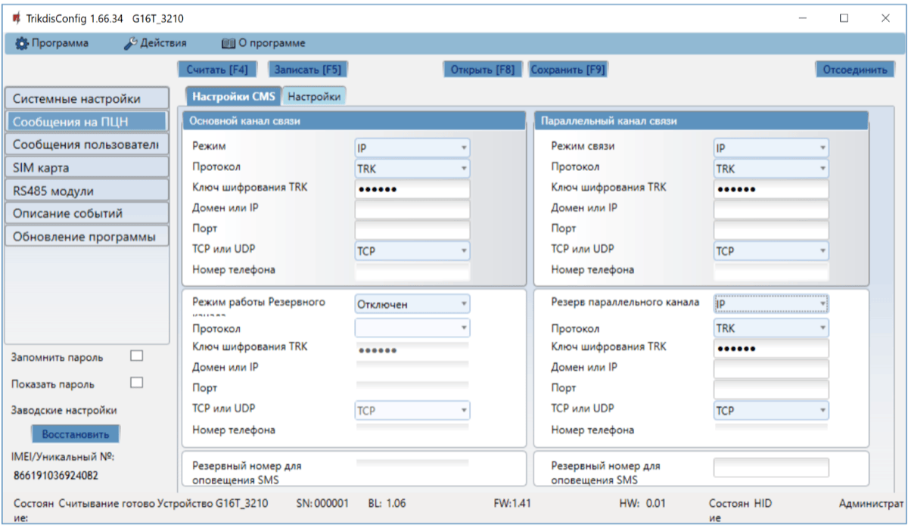

Коммуникатор отправляет сообщения на ПЦН через интернет (IP) или SMS сообщениями.

Сообщения могут отправляться по нескольким каналам связи. Основной и параллельный каналы связи могут работать параллельно, так коммуникатор отправляет сообщения на два приемника одновременно. Резервный канал связи может быть назначен как основному, так и параллельному каналам связи. Резервные каналы связи используются при нарушениях в основных каналах связи.

Сообщения на ПЦН отправляются шифрованными и защищены паролем. Для приема и передачи сообщений в программу мониторинга необходим приемник Trikdis:

- **IP сообщения** – программный приемник IPcom Windows/Linux, IP/SMS аппаратурный приемник RL14 или многоканальный приемник RM14.

- **SMS сообщения** – IP/SMS аппаратурный приемник RL14, многоканальный приемник RM14 или SMS приемник GM14.

Связь SMS сообщениями особенно полезна в качестве резервного канала связи, который работает при нарушениях IP связи в сети оператора мобильной связи. Не рекомендуется использовать SMS в качестве основного канала связи.

#### Группа „Основной канал связи”

- **Режим** – выберите способ связи (IP, SMS) с приемником ПЦН.

- **Протокол** – **TRK** передача данных на IP приемники Trikdis, **SIA DC-09** передача данных на универсальные IP приемники, **TL150** передача данных на IP приемники SUR-GARD.

- **Ключ шифрования TRK** – 6-значный ключ шифрования сообщений. Ключ шифрования, введенный в коммуникатор, должен совпадать с ключом шифрования, который записан в приемнике ПЦН.

- **Домен или IP** – введите адрес домена или IP адрес приемника.

- **Порт** – введите номер порта (port) приемника в сети.

- **TCP или UDP** – выберите протокол (TCP или UDP) передачи сообщений.

- **Номер телефона** (только для SMS сообщений) – введите телефонный номер TRIKDIS SMS приемника. Телефонный номер должен быть с международным кодом (пр.: 370xxxxxxxx).

#### Группа „Параллельный канал связи”

На этом канале связи сообщения передаются параллельно с основным каналом связи. При включении Параллельного канала связи, сообщение отправляются на два приемника одновременно (пр.: на местный и центральный приемники ПЦН). Поля настройки Параллельного канала связи аналогичны настройкам Основного канала связи.

#### Группа „Резервный канал связи”

Включите режим резервного канала, чтобы сообщения отправлялись резервным каналом связи при нарушении основного канала связи. Настройка резервного канала связи аналогична настройкам основного канала.

#### Резервный номер для оповещений SMS

Сообщения отправляются резервным SMS каналом связи, когда не удается отправить сообщения по основным и резервным каналам связи. Резервный SMS канал связи особенно полезен, когда пропадает IP связь у оператора мобильной сети.

Этот канал связи работает только если установлена GPRS связь на Основном и Резервном каналах связи. SMS сообщения будут отправляться на приемник ПЦН: 1) сразу после первого включения коммуникатора G16Т; 2) после прерывания TCP/IP и UDP/IP связи на Основном и Резервном каналах связи.

- **Резервный номер для оповещения SMS ** – введите телефонный номер Trikdis SMS приемника GM14 ПЦН. Телефонный номер должен быть с международным кодом (пр.: 370xxxxxxxx).

**Закладка „Настройки“**

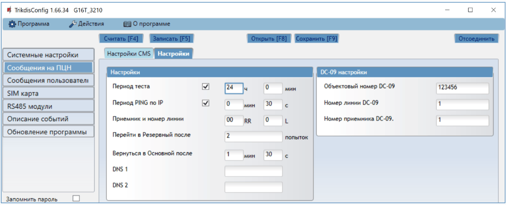

**Группа „Настройки“**

- **Период теста** – период отправки тестовых сообщений для проверки канала связи. Тестовые сообщения отправляются Contact ID кодами и передаются на программу мониторинга.

- **Период PING по IP** – период отправки внутренних PING сигналов проверки связи. Эти сообщения отправляются только по IP каналу. Приемник не передает PING сообщения на программу мониторинга, не перегружая ее. В программу мониторинга поступает информация только тогда, когда приемник не получает PING сообщения от коммуникатора в течение установленного периода времени.

По умолчанию приемник передаст сообщение о потере связи („*Connection lost*”) в программу мониторинга после того, как пройдет в три раза больший период времени, чем установлен период PING сообщения коммуникатора. Например: Если установлен период PING 3 минуты. Приемник передаст сообщение о потере связи после 9 минут.

Вместе PING сообщения поддерживают активный сеанс связи между устройством и приемником. Активный сеанс связи необходим для удаленной конфигурации и управления коммуникатором. Рекомендуется установить продолжительность PING периода не более 5 минут.

- **Перейти в Резервный после** – введите количество неудачных попыток передать сообщение по Основному каналу связи. После неудачной попытки передать сообщение установленное количество раз, коммуникатор переключится передавать сообщения по Резервному каналу связи.

- **Вернуться в основной после** – введите промежуток времени, по истечении которого коммуникатор G16Т попытается восстановить связь и передать сообщения по Основному каналу.

- **DNS1, DNS2** – (Domain Name System) введите IP адрес сервера домена. Используется, когда в поле **Домен или IP** указывается домен. По умолчанию, установлены адреса Google DNS серверов.

#### Группа „DC-09 настройки“

Настройки появляются, когда в поле канала связи **Протокол** выбрана **DC-09_2007** или **DC-09_2012** кодировка отправляемых сообщений.

- **Объектовый номер DC-09** – введите номер объекта, который будет использоваться при кодировке DC-09. Можете ввести 4-16 значный шестнадцатеричный номер, который предоставил ПЦН.

- **Номер линии DC-09** – введите номер линии.

- **Номер приемника DC-09** – введите номер приемника.

### Окно „Сообщения пользователю“ 

**Закладка „Сервис PROTEGUS“**

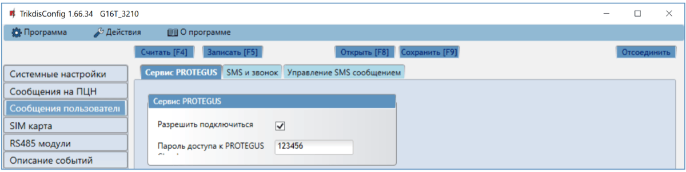

Protegus сервис позволяет пользователям удаленно наблюдать и управлять коммуникатором. Больше информации о Protegus сервисе найдете на [www.protegus.app](https://www.protegus.app).

#### Группа „Сервис Protegus“

- **Разрешить подключиться** – отметьте поле, чтобы включить Protegus сервис. Коммуникатор G16Т сможет обмениваться данными с приложением Protegus. С программой TrikdisConfig можно удаленно конфигурировать коммуникатор.

- **Пароль доступа к Protegus Cloud** – 6-значный код подключения к Protegus (заводской код - 123456).

**Закладка „SMS и звонок“**

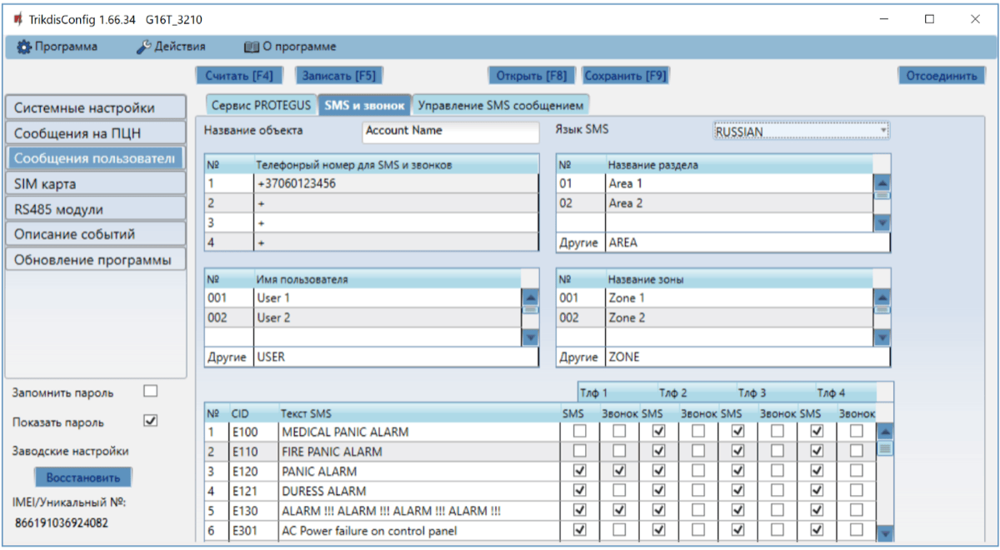

Можете установить, чтобы пользователь о событиях был информирован SMS сообщением или звонком.

- **Название объекта** – введите название системы, к которой подключен коммуникатор. Каждое SMS сообщение будет передаваться с названием объекта.

- **Язык SMS** – выберите язык SMS сообщений (SMS сообщения могут отправляться на разных языках).

- **Телефонный номер для SMS и звонков** – можно ввести до 4 телефонных номеров пользователей, которым будут отправляться SMS сообщения или звонки. Номера телефонов должны быть с международным кодом страны (например: +370xxxxxxxx, 00370xxxxxxxx или 370xxxxxxxx).

- **„Название раздела”, „Имя пользователя”, „Название зоны”** – каждому разделу, пользователю, зоне может быть присвоено название, которое будет использоваться в SMS сообщениях. В соответствующей таблице впишите порядковый номер раздела, пользователя, зоны и рядом введите название.

- **Таблица CID кодов** – вы можете отметить события, о которых пользователь будет информирован SMS сообщением и/или телефонным звонком.

Можете редактировать тексты SMS сообщений, изменять номера Contact ID (CID) кодов и вводить новые события и их описание.

**Закладка „Управление SMS сообщением“**

Можете отправить SMS команду коммуникатору G16Т, которая изменит настройки коммуникатора или активирует выход. SMS команды управления описаны в п. 5.4 „Настройки и управление SMS сообщениями“.

- **Текст ответа по SMS** – SMS текст, который получит пользователь после отправления SMS комaнды. Текст SMS сообщения можно редактировать.

- **Номера телефонов для удаленного управления** – введите номера телефонов, с которых отправляемые команды будут приниматься и выполняться коммуникатором.

!!! note "Примечание"
    Если не будет указан ни один телефонный номер, коммуникатор примет
    команды с любого телефонного номера. В любом случае, безопасность
    обеспечивается требованием ввести пароль администратора или установщика
    в SMS команде.
### Окно „SIM карта“ 

!!! note "Примечание"
    1\. Перед использованием SIM карты убедитесь, что она активирована. / 2.
    Включите услугу мобильного интернета SIM карты, если будет применяться
    мобильный интернет для передачи данных по IP каналу связи на приемник
    ПЦН или в приложение Protegus.
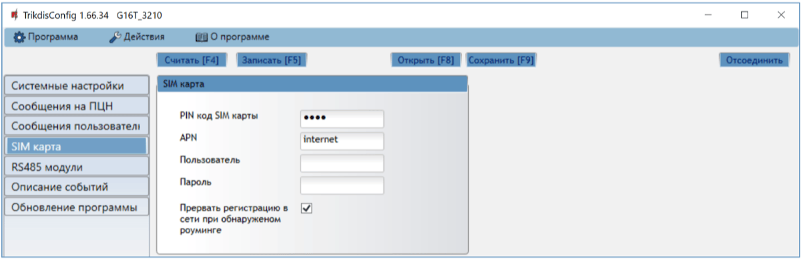

**Группа „SIM карта“**

- **PIN код SIM карты** – введите PIN код SIM карты. PIN код можете выключить, вставьте SIM карту в телефон и отключите запрос ввода PIN кода. Если запрос PIN кода отключили, то в поле оставьте заводской код.

- **APN** – введите APN (англ. Access Point Name). Он необходим для подключения коммуникатора к интернету. APN найдете на страничке оператора SIM карты. „Internet“ – является универсальным и работает в сетях многих операторов мобильной связи.

- **Пользователь, Пароль** – если необходимо, введите Пользователя и Пароль для подсоединения к APN.

- **Прервать регистрацию в сети при обнаруженном роуминге** – отметьте поле, если коммуникатор установлен в приграничной полосе. Эта функция запрещает коммуникатору подключаться к заграничным сетям мобильной связи.

### Окно „RS485 модули“ 

**Закладка „Список модулей“**

К коммуникатору можно подключить расширители серии iO, которые добавят дополнительные входы, выходы и магистраль температурных датчиков. Подключенные расширители должны быть внесены таблицу **Список модулей**.

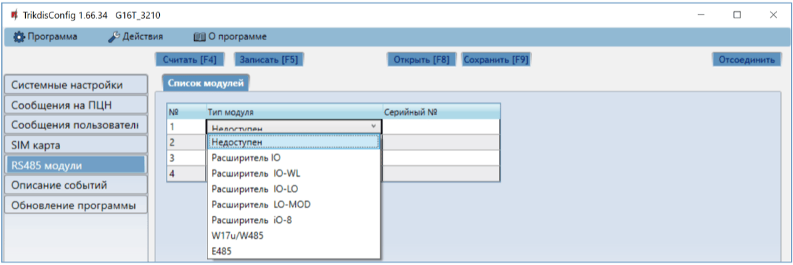

- **№** – порядковый номер модуля.

- **Тип модуля** – из списка выберите модуль, который подключен к RS485 шине коммуникатора.

- **Серийный №** – введите серийный (6-значный) номер модуля, который указан на упаковке или на корпусе модуля.

Выбрав подключенный модуль и указав его серийный номер, нажмите кнопку **Записать [F5]**. После записи настроек отключите кабель USB Mini-B от коммуникатора. Подождите около минуты (коммуникатор должен зарегистрировать подключенный модуль). Подключите кабель USB Mini-B к коммуникатору. Нажмите кнопку **Считать [F4]**. Перейдите в **RS485 модули** **→ Модуль.**

**Закладка „Модуль“**

Подсоединив к коммуникатору расширитель (как описано выше), в программном окне **RS485 модули** появится закладка для настроек данного модуля. Ниже описываются поля настроек модулей расширения **iO,** WiFi модулей W17u/W485, интернет модуля E485.

**Окно настроек расширителя iO-8**

Модуль расширения iO-8 имеет 8 универсальных (вход/выход) клемм. К коммуникатору можно подключить четыре iO- 8 расширителя.

- **Количество входов** – выберите, скольким клеммам присвоить режим работы вход (IN). оставшиеся клеммы станут управляемыми выходами (OUT).

Настройка управляемых выходов выполняется в приложении Protegus (выходы настраиваются для **Постановки на охрану/Снятие с охраны** или для **Удаленного управления**).

В таблице входам (Input) можно присвоить Contact ID коды события и восстановления. После активации входа, коммуникатор отправит сообщения с указанным кодом события на ПЦН, в приложение Protegus и SMS сообщением (на номер телефона пользователя).

**Contact ID код события:**

- **Включить** – разрешить отправление сообщений при активации входа.

- **С/В** – выберите, какого типа сообщение будет отправляться при активации входа – **Событие** или **Восстановление**.

- **CID** – входу указывается Contact ID код срабатывания.

- **Разд.** – укажите раздел, которому принадлежит вход. Номер раздела определяется автоматически: если модуль №1, то раздел 91; если модуль №4, то раздел 94.

- **Зона** – входу (зоне) присваивается номер, который будет записываться в сообщении.

**Contact ID коды восстановления**:

- **Включить** – разрешить отправление сообщений при восстановлении входа.

- **С/В** – выберите, какого типа сообщение будет отправляться при восстановлении входа – **Восстановление** или **Событие**.

- **CID** – входу указывается Contact ID код восстановления.

- **Разд.** – укажите раздел, которому принадлежит вход. Номер раздела определяется автоматически: если модуль №1, то раздел 91; если модуль №4, то раздел 94.

- **Зона** – входу (зоне) присваивается номер, который будет записываться в сообщении.

- **Объектовый номер** – входу (IN) можно задать объектовый номер, который будет отличаться от объектового номера коммуникатора G16T.

- **Тип входа** – укажите тип входа (NO или NC).

Для того, чтобы пользователи получали SMS сообщения и/или звонки, введите Contact ID код события входа в таблице в программном окне **„Сообщения пользователю“** **→ SMS и звонок.**

**Окно настроек расширителя iO**

Расширитель iO имеет: 1 вход, 1 выход (контакт реле) и шину 1-Wire, к которой можно подключить датчики температуры. Управление выходом возможен по выполнению логических условий (И, ИЛИ).

- **Тип входа IN1** – укажите тип входа (NO или NC).

- **Maкс ◦C(T1)** – наибольшее значение температуры, превысив которое будет сформировано сообщение о событии. Для формирования сообщения необходимо в таблице отметить поле **Включить**.

- **Mин ◦C(T2)** – наименьшее значение температуры, ниже которого будет сформировано сообщение о событии. Для формирования сообщения необходимо в таблице отметить поле **Включить**.

В таблице событиям можно указать Contact ID коды Событий и Восстановлений. При срабатывании входа, коммуникатор отправит сообщение, с указанным кодом входа, в приемник ПЦН и в приложение Protegus. Настройка Contact ID кодов Срабатывания/Восстановления описана выше в **Окне настроек расширителя iO-8.**

#### Окно настроек WiFi модуля W485/W17u

- **Режим DHCP** – выберите режим регистрации WiFi модуля в сети (автоматический – DHCP; или ручной – Статический).

- **Статический IP** – введите статический IP адрес (при ручном режиме регистрации).

- **Маска подсети** – введите маску подсети (при ручном режиме регистрации).

- **Шлюз по умолчанию** – введите адрес шлюза (при ручном режиме регистрации).

- **Wifi SSID имя** – введите имя WiFi сети, к которой будет подключен модуль W485/W17u.

- **Wifi SSID пароль** – введите пароль WiFi сети.

В таблице можно ввести Contact ID код нарушения/восстановления связи шины RS485 между коммуникатором и W485/W17u. При нарушении/восстановлении связи между коммуникатором G16Т и модулем W485/W17u, G16Т отправит сообщение с указанным CID кодом на ПЦН и в приложение Protegus.

!!! note "Примечание"
    G16Т необходимо настроить для отправки сообщений на ПЦН и в
    приложение Protegus, см. п.2.2 „Настройка связи с ПЦН" и
    п. 2.1 „Настройка связи с приложением Protegus". / В коммуникаторе
    G16T должна быть установлена SIM карта, чтобы работал модуль
    W485/W17u.
#### Окно настроек „Ethernet“ модуля E485

- **Режим DHCP** – выберите режим регистрации „Ethernet“ модуля в сети (автоматический – DHCP; или ручной – Статический).

- **Статический IP** – введите статический IP адрес (при ручном режиме регистрации).

- **Маска подсети** – введите маску подсети (при ручном режиме регистрации).

- **Шлюз по умолчанию** – введите адрес шлюза (при ручном режиме регистрации).

В таблице можно ввести Contact ID код нарушения/восстановления связи шины RS485 между коммуникатором и Е485. При нарушении/восстановлении связи между коммуникатором G16Т и модулем Е485, G16Т отправит сообщение с указанным CID кодом на ПЦН и в приложение Protegus.

!!! note "Примечание"
    G16Т необходимо настроить для отправки сообщений на ПЦН и в
    приложение Protegus, см. п.2.2 „Настройка связи с ПЦН" и
    п. 2.1 „Настройка связи с приложением Protegus ". / В коммуникаторе
    G16Т должна быть установлена SIM карта, чтобы работал модуль
    Е485.
### Окно „Описание событий“ 

В программном окне можно включить, выключить и изменить отправляемые внутренние события коммуникатора. Выключив внутреннее сообщение в этом программном окне, оно не будет отправляться независимо от других настроек.

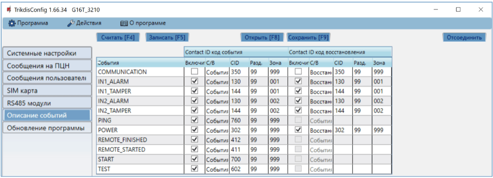

- **COMMUNICATION** – сообщение о нарушении связи между охранной панелью и коммуникатором G16Т.

- **IN_ALARM** – сообщение о срабатывании входа (IN).

- **IN_TAMPER** – сообщение о срабатывании тампера входа (IN).

- **PING** – сообщение проверки связи PING.

- **POWER** – сообщение о низком уровне питающего напряжения.

- **REMOTE_STARTED** – сообщение об удаленном подсоединении для конфигурации G16Т с TrikdisConfig.

- **REMOTE_FINISHED** – сообщение об отключении конфигурации удаленного подсоединения с TrikdisConfig.

- **START** – сообщение о подключении G16Т к сети мобильной связи.

- **TEST** – периодическое тестовое сообщение.

!!! note "Примечание"
    Настройка периодических тестовых сообщений производится в программном
    окне „**Cообщения на ПЦН**" **→ „Настройки" → Период теста.**
- **Включить** – отметьте поле и включите отправление сообщений.

Можете изменить Contact ID код любого события, изменить номер **Раздела** и номер **Зоны**, которые указываются в сообщении.

### Восстановление заводских настоек 

Для восстановления заводских настроек коммуникатора G16T необходимо в программном окне TrikdisConfig нажать кнопку **Восстановить.**

## Удаленная настройка параметров 

!!! note "Примечание"
    Удаленная настройка параметров возможна, если:
    
    1.  Установлена активированная SIM карта и введен или отключен PIN код.
    
    2.  Включен Protegus сервис, см. п. 6.4 Окно „Сообщения
        пользователю".
    
    3.  Включено питание G16Т (индикатор „POWER" мигает зеленым
        цветом).
    
    4.  G16T зарегистрирован в сети мобильной связи (индикатор
        „NETWORK" светит зеленым цветом и мигает желтым).
1.  В компьютере запустите программу TrikdisConfig.

2.  В поле „Уникальный №“ введите IMEI номер G16Т, который указан на упаковке или на изделии.

3. В поле „**Название системы**“ напишите название коммуникатора.

2.  Нажмите кнопку **Конфигурировать**.

3.  Откроется программное окно G16Т. Нажмите кнопку **Считать [F4],** чтобы были считаны настройки G16Т. Если всплывет окно запроса ввода **Кода администратора** или **Установщика**, введите 6-значный код администратора или установщика. Отметьте поле рядом с **Запомнить пароль** и нажмите кнопку **Записать [F5]**.

4.  Сделайте необходимые настройки для G16Т. Запишите эти изменения в G16Т, нажав на кнопку **Записать [F5]**. Нажмите кнопку **Отсоединить** и выйдите из программы TrikdisConfig.

## Тестирование GSM коммуникатора *G16Т* 

После установки и конфигурации выполните тестирование системы:

1.  Спровоцируйте событие:

- Включите/выключите режим охраны с клавиатурой охранной панели;

- При включенной охранной системе нарушьте зону.

1.  Проверьте получение сообщений на ПЦН и в приложении Protegus.

2.  Активируйте вход коммуникатора и убедитесь, что пользователи получают сообщения о событии.

3.  Активируйте выходы коммуникатора удаленно и убедитесь, что выходы срабатывают, а пользователи получают сообщения о событиях.

4.  Если будет применяться удаленное управление охранной панелью, то удаленно включите/отключите режим охраны охранной панели с приложением Protegus.

## Обновление прошивки G16Т 

!!! note "Примечание"
    Подключите G16Т к TrikdisConfig. Если есть новая прошивка
    для G16Т, то TrikdisConfig предложит обновить прошивку. Для
    обновления прошивки должно быть подключение к сети интернет. / Если в
    компьютере установлена антивирусная программа, то она может блокировать
    функцию автоматического обновления программного обеспечения. В этом
    случае придется изменить настройки в антивирусной программе.
Прошивку коммуникатора G16Т можно обновить или заменить вручную. После обновления все ранее установленные настройки коммуникатора остаются. Прошивка может быть заменена на новую или на старую версии. Выполните следующие шаги:

1.  Запустите программу ***TrikdisConfig**.*

2.  Подключите коммуникатор G16Т к компьютеру с помощью кабеля USB Mini-B или подсоединитесь удаленно. Если есть новая прошивка, то TrikdisConfig предложит обновить программное обеспечение G16Т.

3.  В программе TrikdisConfig откройте окно **Обновление программы**.

    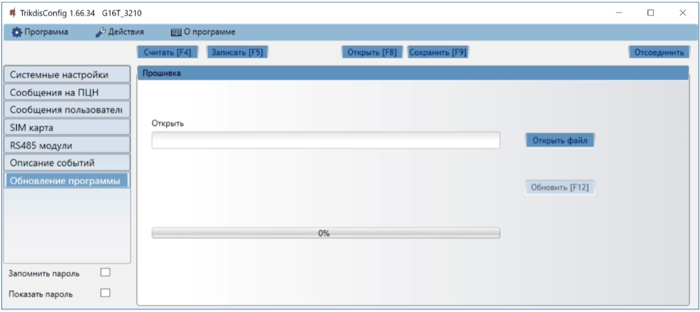

4.  Нажмите кнопку **Открыть файл** и выберите нужный файл для установки. Если такого файла не имеете, то зайдите на страничку [www.trikdis.com](http://www.trikdis.com) , как зарегистрированный пользователь, и скачайте новую прошивку для G16T.

5.  Нажмите кнопку **Обновить [F12]**.

6.  Подождите, пока произойдет обновление прошивки.

## Приложение

Коммуникатор может работать с приемником SUR-GARD. Коммуникатор, получаемые от охранной панели, Contact ID коды конвертирует в SIA коды.

Таблица конвертирования Contact ID кодов в SIA коды

| **События системы** | **CID код** | **SIA код** |
|----|:--:|:--:|
| Медицинская тревога | E100 | "MA" |
| Медицинская тревога в <z> зоне | E101 | "QA" |
| Пожарная тревога в зоне: <z> | E110 | "FA" |
| Обнаружена утечка воды в зоне: <z> | E113 | "SA" |
| Нажата пожарная кнопка в зоне: <z> | E115 | "FA" |
| Нажата кнопка паники в зоне: <z> | E120 | "PA" |
| Тревога принуждения пользователем: <v> | E121 | "HA" |
| Нажата кнопка паники в зоне: <z> | E122 | "HA" |
| Нажата кнопка паники в зоне: <z> | E123 | "HA" |
| Нажата кнопка паники в зоне: <z> | E124 | "HA" |
| Нажата кнопка паники в зоне: <z> | E125 | "HA" |
| Тревога в зоне: <z> | E130 | "BA" |
| Тревога в зоне: <z> | E131 | "BA" |
| Тревога в зоне: <z> | E132 | "BA" |
| Тревога в зоне: <z> | E133 | "BA" |
| Тревога в зоне: <z> | E134 | "BA" |
| Тревога в зоне: <z> | E135 | "BA" |
| Предварительная тревога в зоне: <z> | E138 | "TA" |
| Подтверждение проникновения в зоне: <z> | E139 | "BV" |
| Тревога в зоне: <z> | E140 | "UA" |
| Неисправность в системе (143) | E143 | "ET" |
| Тамперная тревога в зоне: <z> | E144 | "TA" |
| Тамперная тревога в зоне: <z> | E145 | "TA" |
| Тревога в зоне: <z> | E146 | "BA" |
| Тревога в зоне: <z> | E150 | "UA" |
| Обнаружен газ в зоне: <z> | E151 | "GA" |
| Обнаружена утечка воды в зоне: <z> | E154 | "WA" |
| Обнаружение разрыва фольги в зоне | E155 | "BA" |
| Высокая температура <n> датчика | E158 | "KA" |
| Низкая температура <n> датчика | E159 | "ZA" |
| Тревога, Угарный Газ в зоне: <z> | E162 | "GA" |
| Неисправность пожарной системы в зоне: <z> | E200 | "FS" |
| Мониторинг тревоги | E220 | "BA" |
| Неисправность в системе (300) | E300 | "YP" |
| Потеря питания переменного тока | E301 | "AT" |
| Низкий заряд батареи | E302 | "YT" |
| Неисправность в системе (304) | E304 | "YF" |
| Перезагрузка Системы | E305 | "RR" |
| Изменено программирование охранной панели | E306 | "YG" |
| Система отключена | E308 | "RR" |
| Неисправность батареи (309) | E309 | "YT" |
| Обрыв заземления | E310 | "US" |
| Неисправность батареи (311) | E311 | "YM" |
| Перегрузка тока (312) | E312 | "YP" |
| Инженерный сброс пользователем: <v>(313) | E313 | "RR" |
| Неисправность Сирены/Реле | E320 | "RC" |
| Неисправность в системе (321) | E321 | "YA" |
| Неисправность в системе (330) | E330 | "ET" |
| Неисправность в системе (332) | E332 | "ET" |
| Неисправность в системе (333) | E333 | "ET" |
| Неисправность в системе (336) | E336 | "VT" |
| Неисправность в системе (338) | E338 | "ET" |
| Неисправность в системе (341) | E341 | "ET" |
| Неисправность в системе (342) | E342 | "ET" |
| Неисправность в системе (343) | E343 | "ET" |
| Неисправность в системе (344) | E344 | "XQ" |
| Неисправность связи (350) | E350 | "YC" |
| Неисправность связи (351) | E351 | "LT" |
| Неисправность связи (352) | E352 | "LT" |
| Неисправность в системе (353) | E353 | "YC" |
| Неисправность связи (354) | E354 | "YC" |
| Неисправность в системе (355) | E355 | "UT" |
| Неисправность пожарной зоны: <z> | E373 | "FT" |
| Неисправность в зоне: <z> | E374 | "EE" |
| Неисправность в зоне: <z> | E378 | "BG" |
| Неисправность в зоне: <z> | E380 | "UT" |
| Неисправность беспроводной зоны: <z> | E381 | "US" |
| Неисправность беспроводного модуля (382) | E382 | "UY" |
| Тамперная тревога в зоне: <z> | E383 | "TA" |
| Низкий заряд батареи в беспроводной зоне: <z> | E384 | "XT" |
| Неисправность в зоне: <z> (389) | E389 | "ET" |
| Неисправность в зоне: <z> (391) | E391 | "NA" |
| Неисправность в зоне: <z> (393) | E393 | "NC" |
| Пользователь <v> снял систему с охраны | E400 | "OP" |
| Пользователь <v> снял систему с охраны | E401 | "OP" |
| Автоматическое снятие с охраны | E403 | "OA" |
| Отложенное снятие с охраны пользователем <v> | E405 | "OR" |
| Сброс тревоги пользователем <v> | E406 | "BC" |
| Удаленное снятие с охраны пользователем: <v> | E407 | "OP" |
| Быстрая постановка на охрану пользователем: <v> | E408 | "OP" |
| Удаленное снятие с охраны | E409 | "OS" |
| Запрос обратного вызова, сделанный ПЦН | E411 | "RB" |
| Загрузка завершена успешно | E412 | "RS" |
| Доступ запрещен для пользователя: <v> | E421 | "JA" |
| Вход пользователя <v> | E422 | "DG" |
| Принудительный доступ в зоне <z> | E423 | "DF" |
| Выход запрещен для пользователя <v> | E424 | "DD" |
| Выход пользователя <v> | E425 | "DR" |
| Раннее снятие с охраны пользователем: <v> | E451 | "OK" |
| Поздняя постановка на охрану пользователем: <v> | E452 | "OJ" |
| Снятие с охраны не удалось | E453 | "CT" |
| Постановка на охрану не удалась | E454 | "CI" |
| Авто-постановка на охрану не удалась | E455 | "CI" |
| Частичная постановка на охрану пользователем: <v> | E456 | "CG" |
| Нарушение Выход пользователя: <v> | E457 | "EE" |
| Снятие с охраны после тревоги пользователем: <v> | E458 | "OR" |
| Recent arm <v> user | E459 | "CR" |
| Введен неверный код | E461 | "JA" |
| Авто-постановка на охрану продлена пользователем: <v> | E464 | "CE" |
| Устройство отключено (501) | E501 | "RL" |
| Устройство отключено (520) | E520 | "RO" |
| Беспроводной датчик отключен в зоне: <z> (552) | E552 | "YS" |
| Отключение зоны: <z> | E570 | "UB" |
| Отключение зоны: <z> | E571 | "FB" |
| Отключение зоны: <z> | E572 | "MB" |
| Отключение зоны: <z> | E573 | "BB" |
| Отключение группы зон пользователем: <v> | E574 | "CG" |
| Отключение зоны: <z> | E576 | "UB" |
| Отменено отключение зоны: <z> | E577 | "UB" |
| Отключение вент зоны | E579 | "UB" |
| Ручное тестовое сообщение | E601 | "RX" |
| Периодическое тестовое сообщение | E602 | "RP" |
| Системное событие (605) | E605 | "JL" |
| Системное событие (606) | E606 | "LF" |
| Режим тест-прохода детекторов активирован пользователем: <v> | E607 | "TS" |
| Периодический тест с неисправностью | E608 | "RY" |
| Системное событие (622) | E622 | "JL" |
| Системное событие (623) | E623 | "JL" |
| Время/Дата установлена пользователем <v> | E625 | "JT" |
| Системное время/дата не корректна | E626 | "JT" |
| Начато программирование системы | E627 | "LB" |
| Закончено программирование системы | E628 | "LS" |
| Системное событие (631) | E631 | "JS" |
| Системное событие (632) | E632 | "JS" |
| Система не активна (654) | E654 | "CD" |
| Медицинская тревога в <z> зоне восстановилась | R100 | "MH" |
| Медицинская тревога в <z> зоне восстановилась | R101 | "QH" |
| Восстановление пожарной тревоги в зоне: <z> | R110 | "FH" |
| Восстановление утечки воды в зоне <z> | R113 | "SH" |
| Восстановлена кнопка паники в зоне: <z> | R120 | "PH" |
| Сброс тревоги принуждения пользователем <v> | R121 | "HH" |
| Восстановлена кнопка паники в зоне: <z> | R122 | "PH" |
| Восстановлена кнопка паники в зоне: <z> | R123 | "PH" |
| Восстановлена кнопка паники в зоне: <z> | R124 | "HH" |
| Восстановлена кнопка паники в зоне: <z> | R125 | "HH" |
| Восстановление тревоги в зоне: <z> | R130 | "BH" |
| Восстановление тревоги в зоне: <z> | R131 | "BH" |
| Восстановление тревоги в зоне: <z> | R132 | "BH" |
| Восстановление тревоги в зоне: <z> | R133 | "BH" |
| Восстановление тревоги в зоне: <z> | R134 | "BH" |
| Восстановление тревоги в зоне: <z> | R135 | "BH" |
| Восстановление тамперной тревоги в зоне: <z> | R137 | "TA" |
| Восстановление тревоги в зоне: <z> | R140 | "UH" |
| Неисправность в системе восстановлена (143) | R143 | "ER" |
| Восстановление тамперной тревоги в зоне: <z> | R144 | "TR" |
| Восстановление тамперной тревоги в зоне: <z> | R145 | "TR" |
| Восстановление тревоги в зоне: <z> | R146 | "BH" |
| Восстановление тревоги в зоне: <z> | R150 | "UH" |
| Восстановление тревоги газа в зоне: <z> | R151 | "GH" |
| Восстановление утечки воды в зоне <z> | R154 | "WH" |
| Сброс тревоги Обнаружение разрыва фольги в зоне: <z> | R155 | "BH" |
| Температура <n> датчика нормализовалась | R158 | "KH" |
| Температура <n> датчика нормализовалась | R159 | "ZH" |
| Восстановление тревоги угарного газа в зоне: <z> | R162 | "GH" |
| Восстановление неисправности пожарной системы в зоне: <z> | R200 | "FV" |
| Мониторинг восстановления тревоги | R220 | "BH" |
| Неисправность в системе восстановлена (300) | R300 | "YA" |
| Восстановление питания переменного тока | R301 | "AR" |
| Заряд батареи восстановлен | R302 | "YR" |
| Неисправность в системе восстановлена (304) | R304 | "YG" |
| Сброс Система восстановлена в зоне: <z> | R305 | "RR" |
| Неисправность батареи восстановлена (309) | R309 | "YR" |
| Восстановление замыкания заземления | R310 | "UR" |
| Неисправность батареи восстановлена (311) | R311 | "YR" |
| Восстановление перегрузки тока (312) | R312 | "YQ" |
| Восстановление неисправности Сирены/Реле | R320 | "RO" |
| Неисправность в системе восстановлена (321) | R321 | "YH" |
| Неисправность в системе восстановлена (330) | R330 | "ER" |
| Неисправность в системе восстановлена (332) | R332 | "ER" |
| Неисправность в системе восстановлена (333) | R333 | "ER" |
| Неисправность в системе восстановлена (336) | R336 | "VR" |
| Неисправность в системе восстановлена (338) | R338 | "ER" |
| Неисправность в системе восстановлена (341) | R341 | "ER" |
| Неисправность в системе восстановлена (342) | R342 | "ER" |
| Неисправность в системе восстановлена (344) | R344 | "XH" |
| Восстановление неисправности связи (350) | R350 | "YK" |
| Восстановление неисправности связи (351) | R351 | "LR" |
| Восстановление неисправности связи (352) | R352 | "LR" |
| Неисправность в системе восстановлена (353) | R353 | "YK" |
| Восстановление неисправности связи (354) | R354 | "YK" |
| Неисправность в системе восстановлена (355) | R355 | "UJ" |
| Восстановление неисправности пожарной зоны: <z> | R373 | "FJ" |
| Восстановление неисправности в зоне: <z> | R374 | "EA" |
| Восстановление неисправности в зоне: <z> | R380 | "UJ" |
| Восстановление неисправности беспроводной зоны: <z> | R381 | "UR" |
| Восстановление неисправности беспроводного модуля (382) | R382 | "BR" |
| Восстановление тамперной тревоги в зоне: <z> | R383 | "TR" |
| Заряд батареи в беспроводной зоне восстановлен: <z> | R384 | "XR" |
| Восстановление неисправности в зоне: <z> (391) | R391 | "NS" |
| Восстановление неисправности в зоне: <z> (393) | R393 | "NS" |
| Пользователь <v> поставил систему на охрану | R400 | "CL" |
| Пользователь <v> поставил систему на охрану | R401 | "CL" |
| Автоматическая постановка на охрану | R403 | "CA" |
| Удаленная постановка на охрану пользователем: <v> | R407 | "CL" |
| Быстрое снятие с охраны | R408 | "CL" |
| Удаленная постановка на охрану | R409 | “CS” |
| Постановка на охрану в дневном режиме пользователем: <v> | R441 | "CG" |
| Ранняя постановка на охрану пользователем: <v> | R451 | “CK” |
| Позднее снятие с охраны пользователем: <v> | R452 | “CJ” |
| Снятие с охраны не удалась | R454 | “CI” |
| Частичная постановка на охрану пользователем: <v> | R456 | "CG" |
| Recent disarm <v> user | R459 | “CR” |
| Устройство включено (501) | R501 | "RG" |
| Устройство включено (520) | R520 | "RC" |
| Беспроводной датчик включен в зоне: <z> (552) | R552 | "YK" |
| Отменено отключение зоны: <z> | R570 | "UU" |
| Отменено отключение зоны: <z> | R571 | "FU" |
| Отменено отключение зоны: <z> | R572 | "MU" |
| Отменено отключение зоны: <z> | R573 | "BU" |
| Отмена отключения группы зон пользователем: <v> | R574 | "CF" |
| Отменено отключение зоны: <z> | R576 | "UU" |
| Отключение зоны: <z> | R577 | "UU" |
| Отменено отключение вент зоны | R579 | "UU" |
| Режим тест-прохода детекторов выключен пользователем: <v> | R607 | "TE" |
| Время/Дата установлена пользователем <v> | R625 | "JT" |
| Система активна (654) | R654 | "CD" |

## Содержание

## Требования безопасности 

Устанавливать и обслуживать коммуникатор могут только квалифицированные специалисты.

Перед установкой оборудования внимательно ознакомьтесь с данным руководством, чтобы избежать ошибок при монтаже из-за чего оборудование будет плохо работать и может быть испорчено.

Выполняя работы по установке оборудования, обязательно должно быть выключено его внешнее питание.

Изменения внесенные в конструкцию изделия, самостоятельный ремонт лишают изделие гарантии производителя.

Соблюдайте нормы местного законодательства и не утилизируйте изделие или его компоненты вместе с другими бытовыми отходами.
