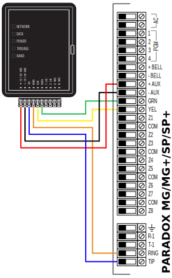
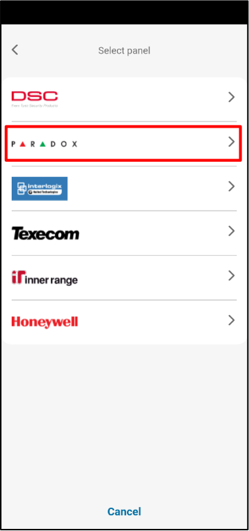
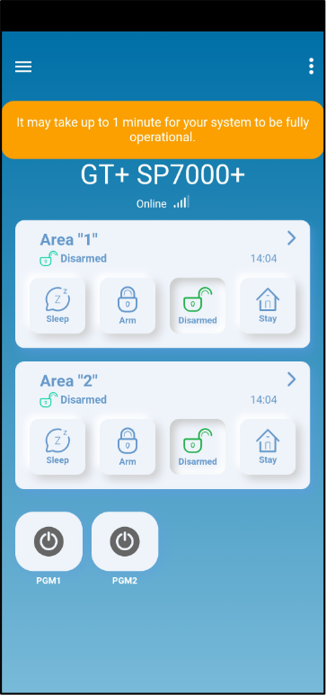

# Paradox SP(+)/MG(+) с GT/GT+/GET быстрая настройка

Краткие шаги по подключению и программированию для подключения коммуникатора GT/GT+/GET к панелям Paradox SP/SP+/MG/MG+ через TIP/RING и KeyBus, затем добавления системы в Protegus2. Используйте вместе с полными руководствами для остальных настроек. (Обозначения клемм на GT/GT+/GET могут немного отличаться, но подключения одинаковые.)

!!! caution "Осторожно"
    Установку и обслуживание должны выполнять только квалифицированные специалисты. Перед подключением отключите питание. Несанкционированные изменения аннулируют гарантию.

## Требования

1. Прошивка GT/GT+/GET 1.21, SIM-карта установлена, PIN отключен, активен тариф с передачей данных.
1. Панель Paradox SP/SP+/MG/MG+ с доступом к клавиатуре (есть код установщика).
1. Номер учетной записи CMS, если используется передача в CMS.
1. Учетная запись компании/установщика Protegus2 и IMEI коммуникатора.

## Подключение

Следуйте схеме ниже, чтобы подключить коммуникатор к панели:

| Клемма GT/GT+/GET | Панель Paradox | Примечания |
| --- | --- | --- |
| TIP / RING | TIP / RING | Эмуляция PSTN линии (Contact ID). |
| CLK / DATA (KeyBus) | YEL / GRN (KeyBus) | Управление по серийному BUS. |
| +12V / GND | AUX + / GND | Питание коммуникатора. |

## Программирование панели Paradox (LCD клавиатура)

Используйте клавиатуру панели, чтобы включить Contact ID и задать номера учетных записей:

1. Вход в программирование установщика: `[ENTER] 0000` (или ваш код установщика).
2. Раздел 801: общие параметры дозвона → оставьте по умолчанию, если не требуется иное.
3. Раздел 811: введите номер учетной записи Раздела 1 (пример `1111`; используйте значение от CMS).
4. Раздел 812: введите номер учетной записи Раздела 2 (пример `2222`; используйте значение от CMS).
5. Раздел 815: введите номер телефона для передачи (пример `123456`; используйте значение от CMS).
6. Раздел 911: задайте пароль ПК (пример `1234`; по вашей политике).
7. Нажмите `[CLEAR]`, чтобы выйти из программирования.

Если коды клавиатуры отличаются, используйте полное руководство Paradox.

## Добавление системы в Protegus2 (мобильное приложение или веб)

  

    <strong>Шаг 1.</strong> Нажмите <strong>Add new system</strong>.
    
  

  

    <strong>Шаг 2.</strong> Введите <strong>IMEI</strong> коммуникатора, нажмите <strong>Next</strong>.
    
  

  

    <strong>Шаг 3.</strong> Выберите <strong>TIP RING</strong>, нажмите <strong>Next</strong>.
    
  

  

    <strong>Шаг 4.</strong> Нажмите <strong>Back</strong>.
    
  

  

    <strong>Шаг 5.</strong> Выберите <strong>Serial BUS</strong>, нажмите <strong>Next</strong>.
    
  

  

    <strong>Шаг 6.</strong> Выберите <strong>PARADOX</strong>.
    
  

  

    <strong>Шаг 7.</strong> Выберите <strong>PARADOX SP+/MG+ series KeyBus</strong>.
    
  

  

    <strong>Шаг 8.</strong> Введите <strong>Primary Object ID</strong>, нажмите <strong>Next</strong>.
    
  

  

    <strong>Шаг 9.</strong> Подождите, пока записываются данные.
    
  

  

    <strong>Шаг 10.</strong> Нажмите <strong>Next</strong>.
    
  

  

    <strong>Шаг 11.</strong> Введите <strong>Name</strong> системы, нажмите <strong>Next</strong>.
    
  

  

    <strong>Шаг 12.</strong> Нажмите <strong>Skip</strong> (если не добавляете пользователей сейчас).
    
  

  

    <strong>Шаг 13.</strong> Подождите ~1 минуту для завершения.
    
  

  

    <strong>Шаг 14.</strong> Настройка завершена.
    
  

!!! tip "Совет"
    Если Protegus2 не может завершить запись данных, проверьте подключение KeyBus (YEL/GRN), ввод IMEI и сохранение настроек CMS/Contact ID на панели.
