# Ethernet модуль E16T

  

##  Описание 

Коммуникатор предназначен для передачи сообщений и управления охранной панелью, которая имеет телефонный коммуникатор, через проводную компьютерную сеть.

„Ethernet“ коммуникатор Е16T может быть подключен к любой охранной панели, которая имеет телефонный коммуникатор и поддерживает протокол связи Contact ID, передаваемый DTMF тонами.

Коммуникатор передает полную информацию о событиях на приемник ПЦН (пульт централизованного наблюдения) охранного предприятия.

Коммуникатор работает с приложением Protegus. С Protegus пользователи могут удаленно управлять охранной сигнализацией и получать сообщения о событиях. Приложение Protegus работает с любой охранной панелью, к которой подключен коммуникатор Е16Т. Коммуникатор может одновременно отправлять сообщения на ПЦН (пульт централизованного наблюдения) и в приложение Protegus.

**Функциональность**

Подключается к телефонному коммуникатору охранной панели:

- Подключается к телефонному коммуникатору охранной панели 2 или 4 проводами.

- Подключив 4 проводами, будет контролироваться телефонная линия между охранной панелью и коммуникатором.

Отправляет сообщения на приемник ПЦН:

- Отправляет сообщения на программные или аппаратные приемники *Trikdis*, которые работают с любой программой мониторинга.

- Может отправлять сообщения на приемники SIA DC-09.

- Контроль связи, отправляя PING сообщения на IP-приемник каждые 30 сек. (или другим установленным периодом).

- Резервный канал связи, который применяется при нарушении основного канала связи.

- Когда включен *Protegus* сервис, сообщения сперва отправляются на ПЦН и только потом пользователям приложения *Protegus*.

**Работает с приложением Protegus:**

- „Push“ и специальные голосовые оповещения о событиях.

- Удаленное включение/выключение системы охраны.

- Удаленное управление подключенным оборудованием (освещением, ворота, отопление, кондиционирование, полив и т.д.).

- Различные права пользователей для администратора, установщика и пользователя.

**Информирование пользователей:**

- Пользователей можно информировать с приложением Protegus.

**Управляемые выходы и входы:**

- 1 выход, который управляется приложением Protegus.
- 2 входа, тип входа: NC; NO; EOL.

**Быстрая конфигурация:**

- Настройки можно сохранить в файле и быстро записать на другие коммуникаторы.

- Два уровня доступа к настройкам: установщика и администратора ПЦН.

- Удаленная конфигурация и обновление прошивки.

### Технические параметры 

| Параметр | Описание |
|:---|----|
| Напряжение питания | 10-18 В постоянного тока |
| Потребляемый ток | До 0,5 A |
| „Ethernet“ связь | IEEE802.3, 10 Base-T, RJ45 разъем |
| Протокол передачи данных | Contact ID коды |
| Память | До 100 сообщений |
| Вход | 2, тип: NC;​ NO;​ EOL (2,2k |
| Выход | 1, тип выхода – открытый коллектор, до 0,15 A постоянного тока, 30 В макс. |
| Условия эксплуатации | Температура от -10 °C до +50 °C, относительная влажность 0-80%, при температуре +20 °C (без конденсации) |
| Размер | 88 x 62 x 26 мм |
| Вес | 80 г |

### Элементы коммуникатора 

1.  Световые индикаторы.

2.  Щель для снятия крышки коммуникатора.

3.  Клеммы для подключения внешних устройств.

4.  USB Mini-B разъем для программирования коммуникатора.

5.  RJ45 разъем для подключения LAN кабеля.

### Клеммы подключения 

| Клемма | Описание |
|----|----|
| +DC | Клемма подключения питания (10-18 В постоянного тока, положительная клемма) |
| -DC | Клемма подключения питания (10-18 В постоянного тока, отрицательная клемма) |
| TIP | Клемма, к которой подключается TIP клемма охранной панели |
| RING | Клемма, к которой подключается RING клемма охранной панели |
| T-1 /​ IN1 | Клемма для наблюдения за телефонной линией или клемма входа. Тип входа: NC;​ NO;​ EOL (2,2k |
| R-1 /​ IN2 | Клемма для наблюдения за телефонной линией или клемма входа. Тип входа: NC;​ NO;​ EOL (2,2k |
| OUT | Выход, тип открытый коллектор (ОС), ток до 0,15А |
| COM | Общая клемма (отрицательная) |
| A 485 | A клемма интерфейса *RS485* |
| B 485 | A клемма интерфейса *RS485* |

### Световая индикация 

| Индикатор | Статус | Описание |
|-----------|--------|----------|
| NETWORK / (Сеть) | Зеленый | Подключен к компьютерной сети |
| NETWORK / (Сеть) | Выключен | Нет подключения к компьютерной сети |
| DATA / (Данные) | Желтый | Есть неотправленные сообщения |
| DATA / (Данные) | Мигает зеленый | Идет передача сообщений |
| POWER (Электропитание) | Мигает зеленый | Хороший уровень питающего напряжения |
| POWER (Электропитание) | Мигает желтый | Низкий уровень питающего напряжения (≤ 11,5 В) |
| TROUBLE (Неисправность) | Красный | Проблема подключения к компьютерной сети |
| TROUBLE (Неисправность) | Выключен | Нет неисправностей |
| LINE / (Телефонная линия) | Зеленый | Охранная панель „подняла“ телефонный рожок |

### Структурная схема применения коммуникатора 

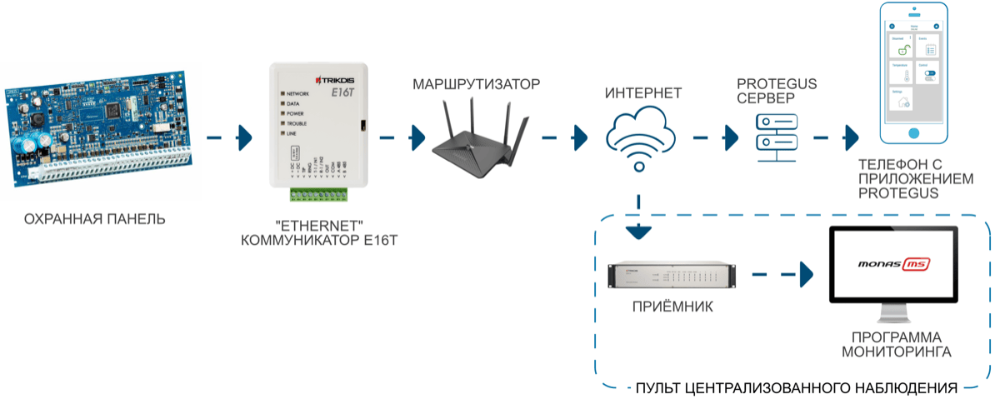

!!! note
    Перед установкой убедитесь, что имеете:
    
    1.  Кабель USB Mini-B для конфигурации.
    
    2.  Сетевой интернет кабель Cat-5 (до 100 м).
    
    3.  4-ех жильный кабель для подключения к охранной панели.
    
    4.  Отвертка с плоским жалом 2,5 мм.
    
    5.  Инструкция охранной панели, к которой будет подключен коммуникатор.
    
    Необходимые материалы можете заказать у местного поставщика.
## Быстрая настройка с программой *TrikdisConfig* 

1.  Загрузите программу конфигурации TrikdisConfig со странички [www.trikdis.com](http://www.trikdis.com) (в поле поиска напишите „TrikdisConfig“), и установите ее на компьютер.

2.  Плоской отверткой снимите крышку, как показано на рисунке:

1.  Кабелем USB Mini-B подключите Е16Т к компьютеру.

2.  Запустите программу TrikdisConfig. Программа автоматически определит подключенное изделие и откроет окно конфигурации Е16Т.

3.  Нажмите на кнопку **Считать [F4]**, чтобы скачать установленные параметры на Е16Т. Если необходимо введите код администратора или инсталлятора.

Ниже описываются настройки, которые необходимо сделать, чтобы коммуникатор начал отправлять сообщения на ПЦН (пульт централизованного наблюдения) и чтобы приложением Protegus можно было управлять охранной панелью.

### Настройка связи с приложением Protegus 

**Окно „Системные настройки“:**

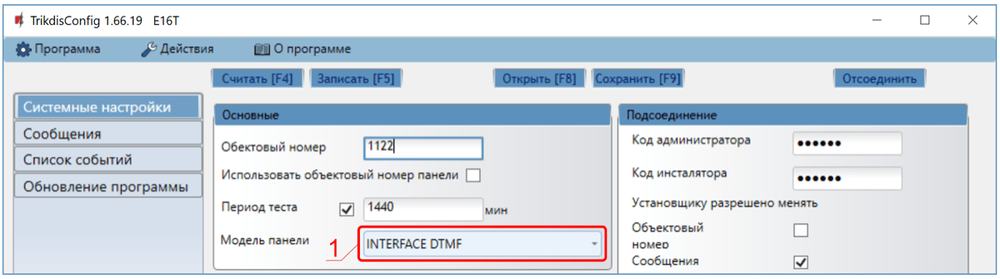

1.  Выберите **Модель панели**, к которой подключите коммуникатор.

**Окно „Сообщения“ закладка „Сервис Protegus“:**

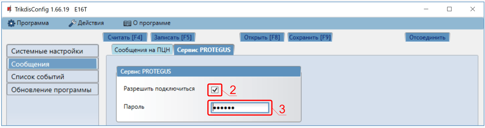

2. Отметьте поле **Разрешить подключиться** к сервису Protegus.

2.  Измените **Пароль** доступа к Protegus. Запрос на ввод пароля будет поступать при добавлении системы к приложению Protegus (заводской пароль - 123456).

3.  Завершив конфигурацию, нажмите кнопку **Записать [F5]** и отключите кабель USB.

!!! note
    Настройки Е16T с TrikdisConfig описаны п. 7 „Конфигурация с
    программой TrikdisConfig".
### Настройки связи с ПЦН 

**Окно „Системные настройки“:**

1.  Введите **Объектовый номер**.

2.  Выберите **Модель панели**, к которой подключите коммуникатор.

Окно „Сообщения“, группа „Основной канал“ связи:

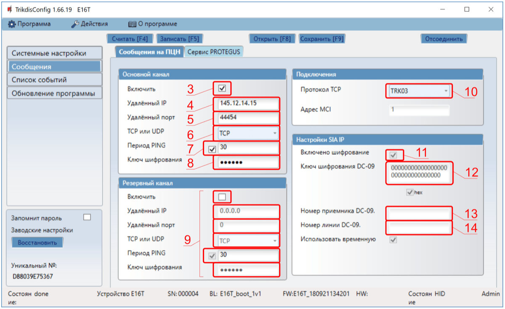

3.  **Включить** – включите основной канал связи.

4.  **Удаленный IP** – введите IP адрес приемника ПЦН.

5.  **Удаленный порт** – введите номер порта приемника в сети.

6.  **TCP или UDP** – выберите протокол (TCP или UDP) передачи сообщений.

7.  **Период PING** – отметьте поле и укажите период отправления PING сигнала.

8.  **Ключ шифрования** – введите ключ шифрования, который установлен на приемнике.

9.  (Рекомендуется) Сделайте настройки **Резервному каналу** связи.

10. **Протокол TCP** - выберите кодировку, с которой будут отправляться сообщения: **TRK** (на приемники TRIKDIS), **DC-09_2012** (на универсальные приемники).

11. **Включить шифрование** – отметьте поле, чтобы включить шифрование при выборе **Протокола ТСР** SIA DC09_2012.

12. **Ключ шифрования DC-09** – введите ключ шифрования, который установлен на приемнике.

13. **Номер приемника DC-09** - – введите номер приемника.

14. **Номер линии DC-09** – введите номер линии приемника.

!!! note
    Если выбрали **DC-09** кодировку передачи сообщений, то в закладке
    „**Сообщения на ПЦН**" в окне „**Настройки SIA IP**" необходимо ввести
    номер приемника и номер линии.
**Окно „Сообщения“ закладка „Сервис Protegus“:**

15. Отметьте поле **Разрешить подключиться** к сервису Protegus.

16. Измените **Пароль** доступа к Protegus. Запрос на ввод пароля будет поступать при добавлении системы к приложению Protegus (заводской пароль - 123456).

17. Завершив конфигурацию, нажмите кнопку **Записать [F5]** и отключите кабель USB.

!!! note
    Настройки Е16T с TrikdisConfig описаны п. 7 „Конфигурация с
    программой TrikdisConfig".
## Установка и схемы соединений 

### Подключение коммуникатора к охранным панелям 

Подсоедините коммуникатор к охранной панели, по одной из ниже приведенных схем.

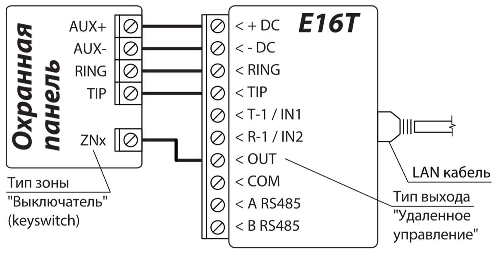

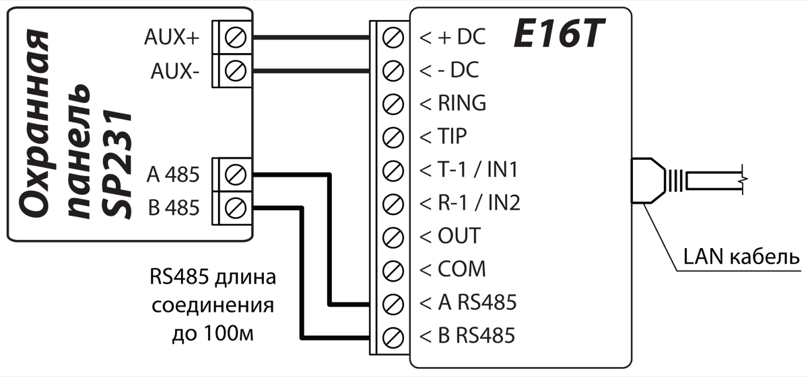

### Схема подключения входа 

Коммуникатор имеет 2 клеммы вход (IN1, IN2). Тип цепи: NC, NO, EOL (2,2kΩ). Заводская установка входа – NO (нормально открытый). Установка другого типа входа осуществляется с программой TrikdisConfig в окне „**Список событий**“ **→ Тип.**

Cхемы типов входных цепей NC, NO, EOL:

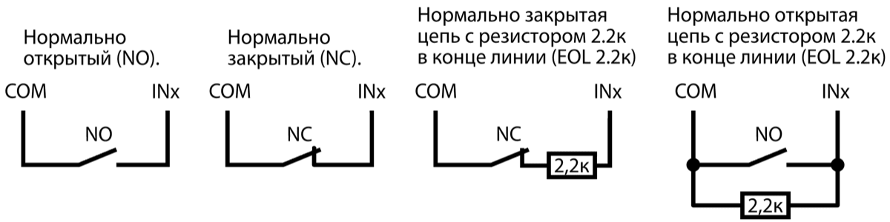

### Подключение LAN кабеля 

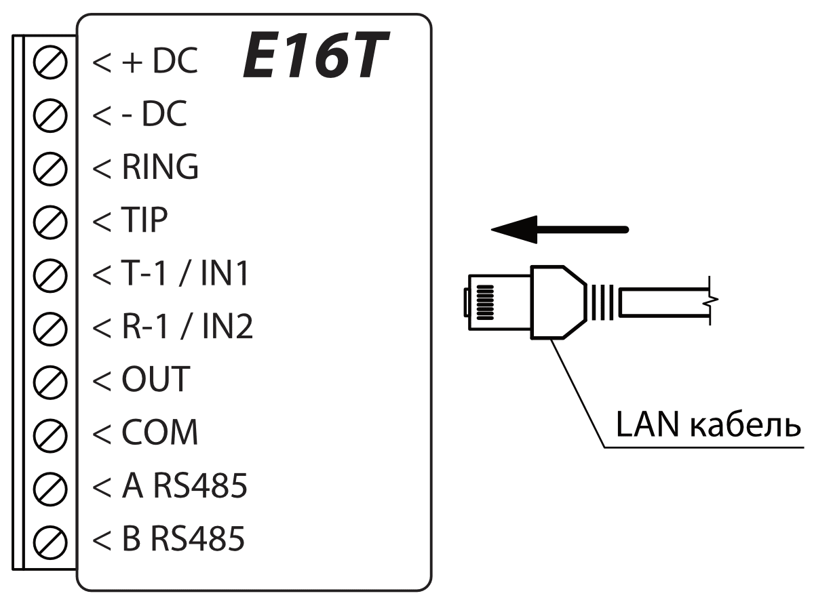

### Схема подключения реле и LED индикатора 

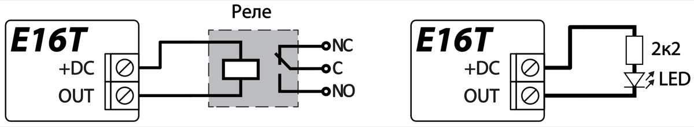

## Программирование охранный панелей 

Чтобы охранная панель отправляла сообщения через телефонный коммуникатор, она должна быть включена и запрограммирована. Согласно руководству программирования охранной панели, запрограммируйте телефонный коммуникатор:

1.  Включите телефонный коммуникатор охранной панели.

2.  Если коммуникатор подсоединен к телефонной линии, то введите номер телефона – 1234. Если коммуникатор подсоединен к клеммам (TIP/RING) охранной панели, то введите любой номер не менее двузначного.

3.  Выберите режим DTMF.

4.  Выберите формат связи Contact ID.

5.  Введите 4-ех значный номер объекта.

### Программирование телефонного коммуникатора охранной панели Honeywell Vista 

Войдите в режим программирования и в ячейки запишите значения, которые указаны ниже:

- \*41 - введите телефонный номер приемника ПЦН (пульт централизованного наблюдения);

- \*43 - введите номер объекта охранной панели;

- \*47 - установите Тональный набор, в [1] ячейку и введите количество попыток набора номера телефона;

- \*48 – Contact ID (используется заводская настройка). \*48 должно быть установлено 7;

- \*49 - сообщение. \*49 должно быть установлено 5;

- \*50 – задержка отправления сообщения о срабатывании охранной панели (необязательно). Заводская настройка [2,0], что дает 30 секундную задержку на отправление сообщения. Чтобы сообщение было отправлено сразу установите [0,0].

**Выйдите из режима программирования**.

После настройки необходимых параметров выйдите из режима программирования. На клавиатуре наберите \*99.

#### Специальные настройки охранной панели „Honeywell Vista 48” 

Необходимые настройки охранной панели „**Honeywell Vista 48**“ для совместной работы с Е16T приведены в таблице.

| Ячейка | Данные                               | Ячейка | Данные | Ячейка | Данные |
|:------:|:-------------------------------------|:------:|:------:|:------:|:------:|
|  \*41  | 1111 (номер телефона приемника)      |  \*60  |   1    |  \*69  |   1    |
|  \*42  | 1111                                 |  \*61  |   1    |  \*70  |   1    |
|  \*43  | 1234 (номер объекта охранной панели) |  \*62  |   1    |  \*71  |   1    |
|  \*44  | 1234                                 |  \*63  |   1    |  \*72  |   1    |
|  \*45  | 1111                                 |  \*64  |   1    |  \*73  |   1    |
|  \*47  | 1                                    |  \*65  |   1    |  \*74  |   1    |
|  \*48  | 7                                    |  \*66  |   1    |  \*75  |   1    |
|  \*50  | 1                                    |  \*67  |   1    |  \*76  |   1    |
|  \*59  | 0                                    |  \*68  |   1    |        |        |

После настройки параметров выйдите из режима программирования. На клавиатуре наберите \*99.

## Удаленное управление 

### Добавление охранной системы к приложению Protegus 

С Protegus пользователи смогут удаленно управлять системой охраны. Пользователь будет иметь информацию о состоянии системы охраны, получать уведомления о событиях системы охраны.

1.  Скачайте и запустите приложение Prоtegus или используйте браузерную версию [www.protegus.app](https://www.protegus.app)<u>.</u>

2.  Подключитесь к системе с помощью своего имени и пароля или создайте новую учетную запись.

!!! note
    При добавлении Е16Т к Protegus должно быть:
    
    1.  Включен Protegus сервис. См. п. 7.3 „Окно „Сообщения"".
    
    2.  Включено питание E16Т (индикатор „POWER" мигает зеленым
        цветом);
    
    3.  E16T подключен к интернет сети (подсоединен LAN кабель).
        Индикатор "NETWORK" светит зеленым цветом, когда есть соединение с
        интернет сетью.
3. Нажмите **Добавить объект** и введите „МАС“ адрес Е16Т, который найдете на изделии или на упаковке. Нажмите кнопку **Далее.**

    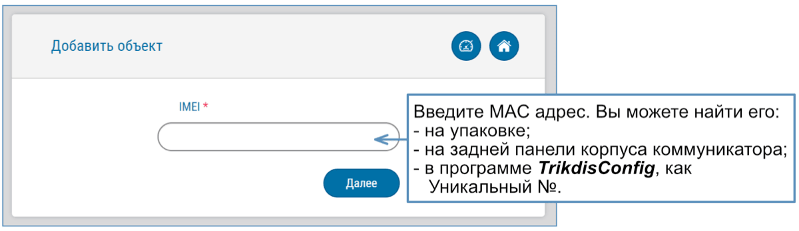

### Дополнительные настройки для включения/выключения системы зоной выключателя 

!!! note
    Зоне охранной панели, к которой подключен выход (OUT) коммуникатора
    Е16Т, должен быть установлен тип - Выключатель (keyswitch).
Следуйте приведенным ниже инструкциям, если постановка/снятие с охраны будет осуществляться PGM выходом коммуникатора Е16Т, который подключен к зоне выключателя (keyswitch) охранной панели.

1.  В новом окне в боковом меню нажмите „**Разделы**“. В открывшемся окне укажите 1 раздел охранной сигнализации (коммуникатор имеет один выход OUT) и нажмите „**Далее**“.

    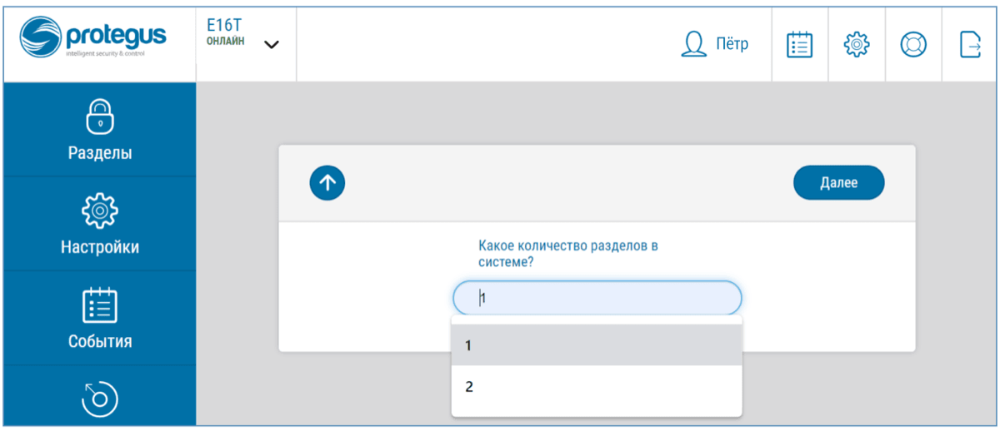

2.  В новом окне укажите номер раздела в охранной системе и нажмите „**Сохранить**“.

    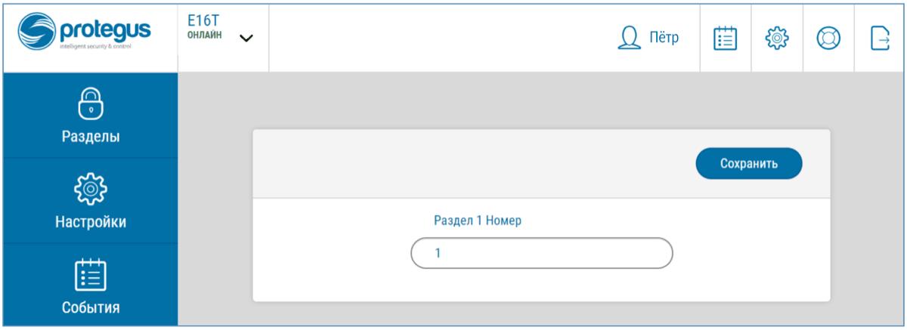

3.  В боковом меню нажмите „**Настройки**“ и в открывшемся окне нажмите „**Настройки**“. Отметьте поле „**Использовать PGM Выход для Включения/Выключения охранной системы**“ и укажите которым разделом будет управлять PGM выход. Один PGM выход коммуникатора Е16T может управлять только одним разделом охранной сигнализации.

4.  Выберите **Сигнал** или **Импульс**, в зависимости от того как настроен тип зоны выключателя (keyswitch). Если необходимо, можете изменить интервал импульса.

5.  Для дополнительной безопасности, можете выбрать „Использовать пароль приложения для Включения/Выключения охранной системы“. Тогда при нажатии кнопки **Поставить на охрану/Снять с охраны** появится окно ввода пароля приложения.

    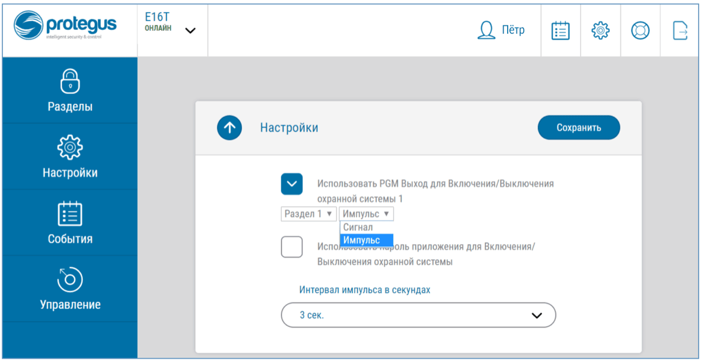

### Включение/выключение охранной системы с *Protegus* 

1.  Откройте в Protegus окно **Разделы**, чтобы управлять охранной системой.

2.  В окне **Разделы** нажмите на кнопку раздела. В открывшемся окне выберите действие (**Снять с охраны/Поставить на охрану** раздел охранной системы).

3.  При необходимости введите код пользователя или пароль Protegus.

    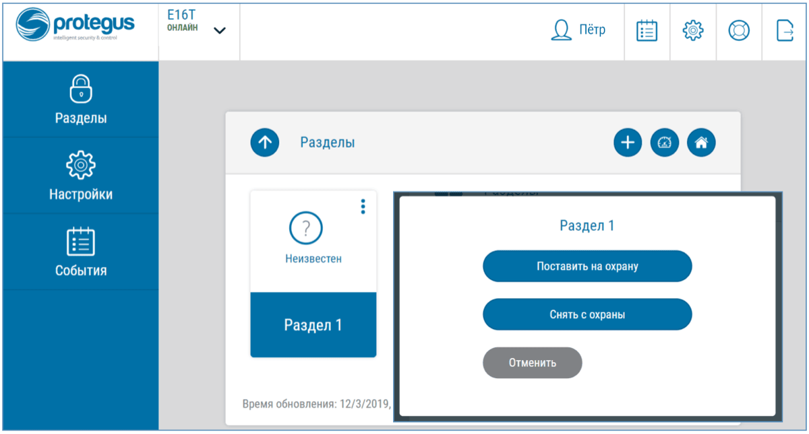

## Удаленная настройка параметров 

!!! note
    Удаленная настройка параметров возможна, если:
    
    1.  Включен Protegus сервис, см. п. 7.3 Окно „Сообщения".
    
    2.  Включено питание Е16Т (индикатор „POWER" мигает зеленым
        цветом).
    
    3.  E16T подключен к интернет сети (подсоединен LAN кабель).
        Индикатор "NETWORK" светит зеленым цветом, когда есть соединение с
        интернет сетью).
1.  Загрузите программу TrikdisConfig с [www.trikdis.соm.](http://www.trikdis.соm.)

2.  Убедитесь, что коммуникатор Е16Т подключен к интернет сети и ему включен Protegus сервис.

3.  В компьютере запустите программу TrikdisConfig. В поле „Уникальный №“ введите „МАС“ адрес E16Т, который указан на упаковке или на изделии.

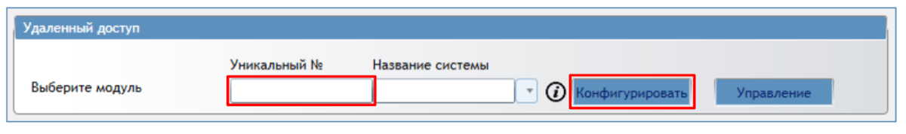

4. В поле „**Название системы**“ напишите название коммуникатора.

2.  Нажмите кнопку **Конфигурировать.**

3.  Откроется программное окно Е16Т. Нажмите кнопку **Считать [F4],** чтобы были считаны настройки Е16Т. Если всплывет окно запроса ввода **Кода администратора** или **Установщика**, введите 6-значный код администратора или установщика. Отметьте поле рядом с **Запомнить пароль** и нажмите кнопку **Записать [F5]**.

4.  Сделайте необходимые настройки для Е16Т. Запишите эти изменения в Е16Т, нажав на кнопку **Записать [F5]**. Нажмите кнопку **Отсоединить** и выйдите из программы TrikdisConfig.

## Конфигурация с программой TrikdisConfig 

### Строка состояния *TrikdisConfig* 

Подключив Е16Т к TrikdisConfig и нажав на кнопку **Считать [F4]**, программа в строке состояния предоставит информацию о подключенном изделии:

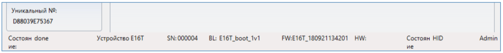

| Наименование | Описание |
|----|----|
| Уникальный № | MAC адрес изделия |
| Состояние | Рабочее состояние |
| Устройство | Тип изделия (должно быть указано E16T) |
| SN | Серийный номер изделия |
| BL | Версия программы |
| FW | Версия программы изделия |
| HW | Версия аппаратной части изделия |
| Состояние | Подключение программы к изделию (USB или Remote (удаленно)) |
| Роль | Уровень доступа (показывается после подтверждения кода доступа) |

Нажав кнопку **Считать [F4]**, программа TrikdisConfig считает и покажет настройки коммуникатора Е16Т. С TrikdisConfig сделайте необходимые настройки, по приведенному ниже описанию.

### Окно „Системные настройки“ 

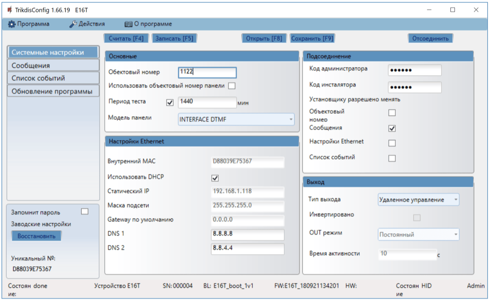

**Группа „Основные“**

- **Объектовый номер** – если сообщения будут отправляться на ПЦН (пульт централизованного наблюдения), то необходимо указать номер объекта (4-значный шестнадцатеричный номер, 0-9, А-F. **Не используйте FFFE, FFFF объектовые номера.**), который предоставлен ПЦН.

- **Использовать объектовый номер панели** – если поле отмечено, то коммуникатор будет отправлять сообщения с номером объекта введенным в охранной панели.

- **Период теста** – отметьте поле, чтобы включить отправку тестовых сообщений для проверки канала связи, и укажите время периода теста.

- **Модель панели** – включить/выключить DTMF интерфейс телефонной линии коммуникатора.

**Группа „Настройки Ethernet“**

- **Внутренний MAC** – автоматически определяется МАС адрес подключенного коммуникатора.

- **Использовать DHCP** – отметьте поле, чтобы коммуникатор автоматически зарегистрировался в сети. Если не удалось зарегистрироваться автоматически, то необходимо произвести регистрацию вручную и ввести:

  - **Статический IP** – IP адрес коммуникатора.

  - **Маска подсети** – введите маску подсети.

  - **Gateway по умолчанию** – для подсоединения к интернету.

  - **DNS1 и DNS2** – (англ. Domain Name System) введите IP адрес сервера домена. Используется, когда указывается домен, а не IP адрес канала связи. По умолчанию, установлены адреса Google DNS серверов.

**Группа „Подсоединение“**

Существует два уровня доступа (администратора и инсталлятора) при конфигурации коммуникатора Е16Т:

- **Код администратора** – дает полный доступ к конфигурации коммуникатора (заводской код - 123456).

- **Код инсталлятора** - дает ограниченный доступ к конфигурации коммуникатора (заводской код – 654321).

- **Установщику разрешено менять** – администратор устанавливает, какие параметры сможет менять установщик.

!!! note
    Коды администратора и инсталлятора состоят из шести цифр или латинских
    букв.
**Группа „Выход“**

- **Тип выхода** – выберите из списка функцию работы выхода (Выключено, LAN OK, Неисправность коммуникации, Удаленное управление).

- **Инвертировано** – отметьте поле если хотите инвертировать выход.

- **OUT режим** – установите режим работы выхода **Импульс** или **Постоянный:**

  - **Импульс** – состояние выхода изменится на продолжительность времени, которая указана в поле **Время активности** (сек.).

  - **Постоянный** – состояние выхода изменится и останется неизменной до получения следующей команды**.**
- **Время активности** – укажите время продолжительности импульса, сек.. Если выходу установлен режим работы **Импульс**, то выход OUT сработает на продолжительность импульса.

### Окно „Сообщения“ 

**Закладка „Сообщения на ПЦН“**

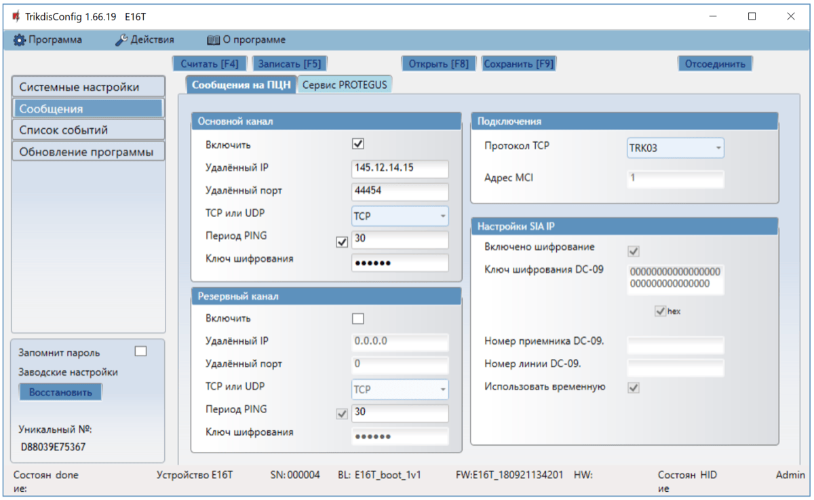

Коммуникатор отправляет сообщения на ПЦН через проводной интернет (IP).

Сообщения могут отправляться по основному или резервному каналам связи. Резервный канал связи используется при нарушении основного канала связи.

Сообщения на ПЦН отправляются шифрованными и защищены паролем. Для приема и передачи сообщений в программу мониторинга необходим приемник Trikdis:

- **IP сообщения** – программный приемник IPcom Windows/Linux, IP/SMS аппаратный приемник RL14 или многоканальный приемник RM14.

**Группа „Основной канал“**

- **Включить** – отметьте поле и будет включен основной канал связи для передачи сообщений на приемник ПЦН.

- **Удаленный IP** – введите IP адрес ПЦН приемника.

- **Удаленный порт** – введите номер порта (port) приемника в сети.

- **TCP или UDP** – выберите протокол (TCP или UDP) передачи сообщений.

- **Период PING** – отметьте поле и укажите период отправки PING сообщений. PING сообщения необходимы для проверки канала связи с ПЦН.

- **Ключ шифрования** – 6-значный ключ шифрования сообщений. Ключ шифрования, введенный в коммуникатор, должен совпадать с ключом шифрования, который записан в приемнике ПЦН.

**Группа „Резервный канал“**

Включите режим резервного канала, чтобы сообщения отправлялись резервным каналом связи при нарушении основного канала связи. Настройка резервного канала связи аналогична настройкам основного канала.

**Группа „Подключение“**

- **Протокол TCP** – выберите протокол отправки сообщений.

  **Группа „Настройки SIA IP“**

Настройки **SIA IP** осуществляются при выборе **DC-09_2012** **Протокола ТСР.**

- **Включено шифрование** – отметив поле можно включить шифрование, если выбран ТСР протокол SIA DC09_2012.

- **Ключ шифрования DC-09** – введите ключ шифрования.

- **Номер приемника DC-09** – введите номер приемника.

- **Номер линии DC-09** – введите номер линии.

- **Использовать временную отметку** – отметьте поле и в сообщение будет включено время.

**Закладка „Сервис Protegus“**

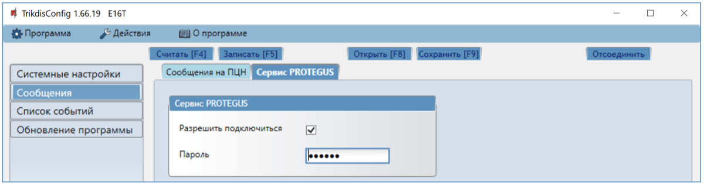

**Группа „Сервис Protegus“**

- **Разрешить подключиться** – отметьте поле, чтобы включить Protegus сервис. Коммуникатор Е16Т сможет обмениваться данными с приложением Protegus. С программой TrikdisConfig можно удаленно конфигурировать коммуникатор.

- **Пароль** – 6-значный код подключения к Protegus (заводской код - 123456). Изменив пароль, его необходимо будет ввести при добавлении коммуникатора к Protegus. Это дополнительная мера безопасности.

### Окно „Список событий“ 

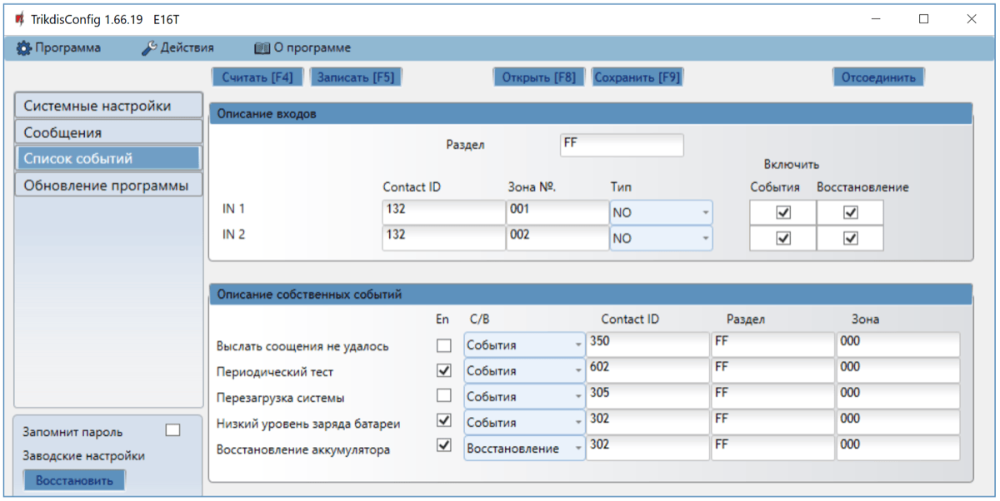

В программном окне можно включить, выключить и изменить отправляемые внутренние события коммуникатора и сообщения о состоянии входов. Выключив внутреннее сообщение в этом программном окне, оно не будет отправляться независимо от других настроек.

К входам коммуникатора можно подсоединить дополнительные датчики. При срабатывании датчика коммуникатор отправит сообщение (Contact ID кодом) на ПЦН и в Protegus.

Необходимо отметить поля событий, сообщения которых должны отправляться в Protegus и ПЦН.

**Группа „Описание входов“**

- **Раздел** – введите номер раздела.

- **Contact ID** – введите код события или оставьте заводской. При срабатывании входа код события будет отправлен в Protegus и ПЦН.

- **Зона № –** введите номер зоны, он будет фигурировать в отправляемых сообщениях.

- **Тип** – выберите тип входа (NO, NC, EOL).

- **Включить/События** – отметьте поле и будут отправляться сообщения о срабатывании входов IN1, IN2.

- **Включить/Восстановление** – отметьте поле и будут отправляться сообщения о восстановлении входов IN1, IN2.

**Группа „Описание собственных событий“**

- **En** – отметьте поля событий, сообщения которых будут отправляться в Protegus и ПЦН.

- **С/В** – укажите условие отправки внутреннего события (Событие/Восстановление) коммуникатора.

- **Contact ID**- код события.

- **Раздел** – введите номер раздела, который будет отправляться в сообщении.

- **Зона** – введите номер зоны, который будет отправляться в сообщении.

### Восстановление заводских настроек 

Для восстановления заводских настроек коммуникатора Е16T необходимо в программном окне TrikdisConfig нажать кнопку **Восстановить.**

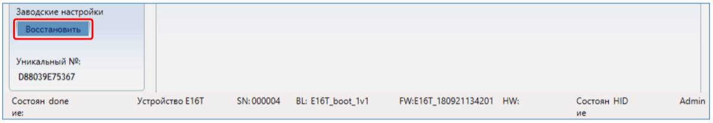

## Тестирование коммуникатора 

После установки и конфигурации выполните тестирование системы:

1.  Проверьте включено ли питание.

2.  Проверьте соединение с сетью (индикатор NETWORK светит зеленым цветом).

3.  Спровоцируйте событие:

- Включите/выключите режим охраны с клавиатурой охранной панели;

- При включенной охранной системе нарушьте зону.

1.  Проверьте получение сообщений на ПЦН и в приложении Protegus.

2.  Активируйте вход коммуникатора и убедитесь, что пользователи получают сообщения о событии.

3.  Активируйте выход коммуникатора удаленно и убедитесь, что выход срабатывает, а пользователи получают сообщения о событиях.

4.  Если будет применяться удаленное управление охранной панелью, то удаленно включите/отключите режим охраны охранной панели с приложением Protegus.

## Обновление прошивки 

!!! note
    Подключите Е16Т к TrikdisConfig. Если есть новая прошивка
    для Е16Т, то TrikdisConfig предложит обновить прошивку. Для
    обновления прошивки должно быть подключение к сети интернет. / Если в
    компьютере установлена антивирусная программа, то она может блокировать
    функцию автоматического обновления программного обеспечения. В этом
    случае придется изменить настройки в антивирусной программе.
Прошивку коммуникатора Е16Т можно обновить или заменить вручную. После обновления все ранее установленные настройки коммуникатора остаются. Прошивка может быть заменена на новую или на старую версии. Выполните следующие шаги:

1.  Запустите программу ***TrikdisConfig**.*

2.  Подключите коммуникатор Е16Т к компьютеру с помощью кабеля USB Mini-B или подсоединитесь удаленно. Если есть новая прошивка, то TrikdisConfig предложит обновить программное обеспечение Е16Т.

3.  В программе TrikdisConfig откройте окно **Обновление программы.**

4.  Нажмите кнопку **Открыть файл** и выберите нужный файл для установки. Если такого файла не имеете, то зайдите на страничку [www.trikdis.com](http://www.trikdis.com), как зарегистрированный пользователь, и скачайте новую прошивку для Е16T.

    

5.  Нажмите кнопку **Обновить [F12]**.

6.  Подождите, пока произойдет обновление прошивки.

## Требования безопасности 

Устанавливать и обслуживать коммуникатор могут только квалифицированные специалисты.

Перед установкой оборудования внимательно ознакомьтесь с данным руководством, чтобы избежать ошибок при монтаже из-за чего оборудование будет плохо работать и может быть испорчено.

Выполняя работы по установке оборудования, обязательно должно быть выключено его внешнее питание.

Изменения внесенные в конструкцию изделия, самостоятельный ремонт лишают изделие гарантии производителя.

Соблюдайте нормы местного законодательства и не утилизируйте изделие или его компоненты вместе с другими бытовыми отходами.
