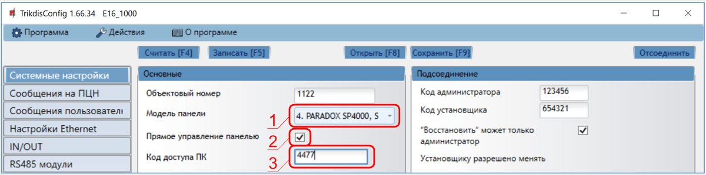
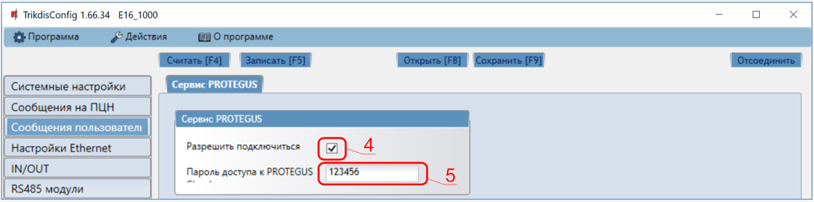
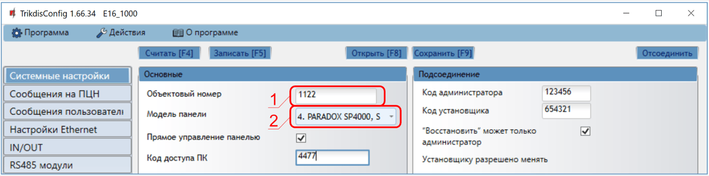
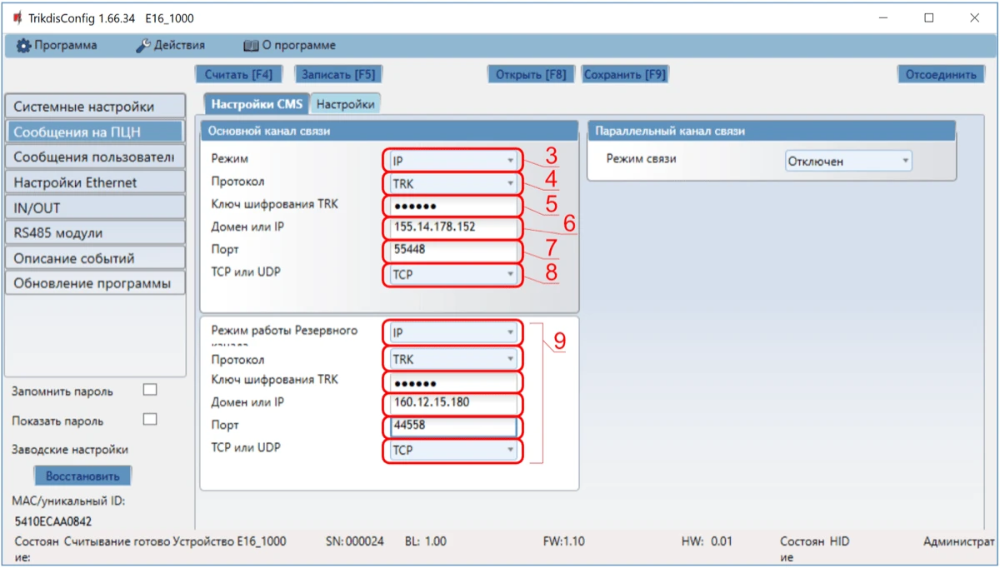
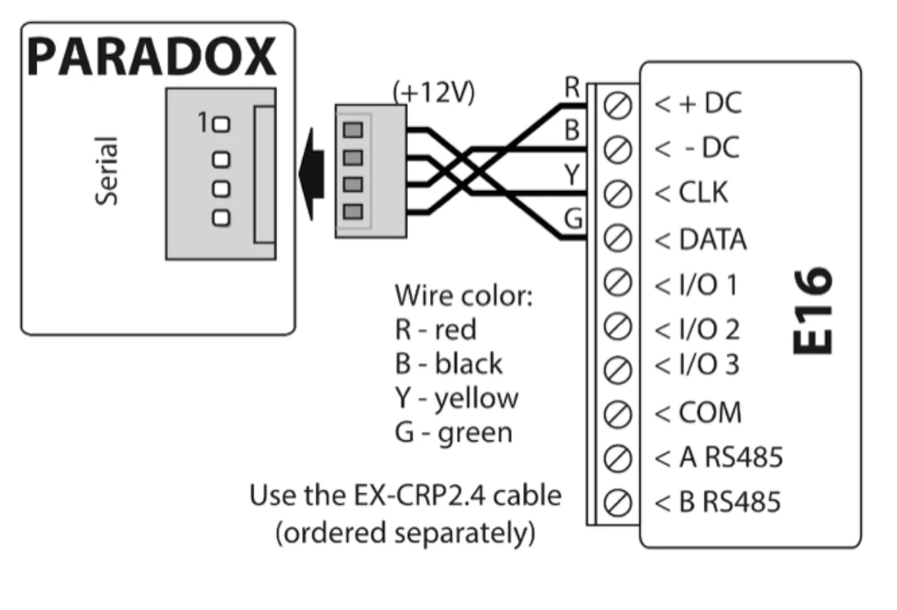

# Paradox SP(+)/MG(+) с E16 быстрая настройка

Краткие шаги по подключению коммуникатора E16 к панелям Paradox SP/SP+/MG/MG+, настройке E16 для передачи по IP и добавлению системы в Protegus2. Используйте эту инструкцию вместе с полным руководством E16 для остальных настроек.

!!! caution "Осторожно"
    Установку и обслуживание должны выполнять только квалифицированные специалисты. Перед подключением отключите питание. Несанкционированные изменения аннулируют гарантию.

## Требования

- Коммуникатор E16 с подключенным LAN и кабелем USB Mini-B для настройки.
- Панель Paradox SP/SP+/MG/MG+ с доступом через клавиатуру.
- Кабель `EX-CRP2.4` для последовательного подключения Paradox.
- Номер объекта / счета ПЦН, если сообщения будут передаваться на пульт.
- Учетная запись Protegus2 и MAC / Unique ID коммуникатора.

## Быстрая настройка с программой *TrikdisConfig*

1. Загрузите **TrikdisConfig** со страницы [www.trikdis.com](http://www.trikdis.com) и установите программу.
2. Плоской отверткой откройте корпус E16.

3. Подключите E16 к компьютеру кабелем USB Mini-B.
4. Запустите **TrikdisConfig**. Программа определит коммуникатор и откроет окно конфигурации.
5. Нажмите **Считать [F4]**, чтобы загрузить текущие настройки. Если потребуется, введите 6-значный код администратора или инсталлятора.

Выполните подраздел, который соответствует вашей установке:

- **Приложение Protegus2** если пользователи будут управлять системой удаленно.
- **ПЦН** если коммуникатор будет передавать сообщения на пульт централизованного наблюдения.
- Выполните оба подраздела, если коммуникатор должен работать и с ПЦН, и с Protegus2.

### Настройка связи с приложением Protegus2

**Окно "Системные настройки":**

1. Выберите **Модель панели**, которая будет подключена к коммуникатору.
2. Включите **Прямое управление панелью**, если пользователи должны управлять системой из Protegus2 своим кодом клавиатуры.
3. Для прямого управления панелями Paradox и Texecom введите **Код доступа ПК / UDL**. Он должен совпадать с паролем, заданным в панели.

!!! note "Примечание"
    Чтобы прямое управление работало, панель также необходимо запрограммировать, как описано ниже в разделе программирования панели.

**Окно "Сообщения пользователю", вкладка "Сервис PROTEGUS":**

4. Отметьте поле **Разрешить подключиться** к сервису Protegus.
5. Измените **Пароль доступа к PROTEGUS Cloud**, если хотите, чтобы его запрашивали при добавлении системы в Protegus2.

Завершив конфигурацию, нажмите **Записать [F5]** и отключите кабель USB.

### Настройка связи с ПЦН

**Окно "Системные настройки":**

1. Введите **Номер объекта**, предоставленный ПЦН.
2. Выберите **Модель панели**, которая будет подключена к коммуникатору.

**Окно "Сообщения на ПЦН", группа "Основной канал связи":**

3. Установите **Режим связи** в **IP**.
4. Выберите протокол, который требуется приемнику: **TRK**, **DC-09_2007**, **DC-09_2012** или **TL150**.
5. Введите ключ шифрования приемника, если выбранный протокол этого требует.
6. Введите **Домен или IP** и **Порт** приемника.
7. Выберите **TCP** или **UDP**.
8. Настройте резервный и параллельный каналы, если требуется резервирование.

!!! note "Примечание"
    Если вы выбрали протокол **DC-09**, в окне **Сообщения на ПЦН** на вкладке **Параметры** дополнительно введите номера объекта, линии и приемника.

Завершив конфигурацию, нажмите **Записать [F5]** и отключите кабель USB.

## Подключение

Подключите E16 к последовательному разъему Paradox кабелем `EX-CRP2.4` и подайте питание коммуникатору от панели:

## Программирование охранной панели

Для чтения событий панели Paradox не требуют дополнительного программирования. Программируйте панель только если нужен прямой контроль из Protegus2:

1. Войдите в режим программирования установщика с клавиатуры.
2. Откройте секцию `911`.
3. Введите 4-значный пароль **PC download**.
4. В TrikdisConfig в окне **Системные настройки** убедитесь, что введен тот же пароль.

## Добавление системы в Protegus2

1. Откройте [Protegus2](https://www.protegus.app) и нажмите **Добавить новую систему**.
1. Введите **MAC / Unique ID** коммуникатора E16.
1. Введите имя системы и завершите мастер добавления.
1. Если вместо прямого управления используется ключевая зона, оставьте **Прямое управление панелью** выключенным и после подключения выхода E16 к ключевой зоне настройте `PGM1` в Protegus2.
1. Дождитесь, пока система отобразится в сети.

## Проверка системы

1. Поставьте и снимите систему с охраны с клавиатуры.
1. Сымитируйте тестовую тревогу, когда система находится под охраной.
1. Убедитесь, что события поступают на ПЦН и в Protegus2.
