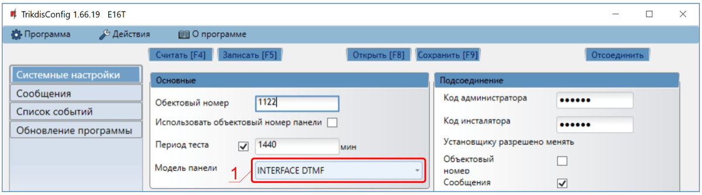
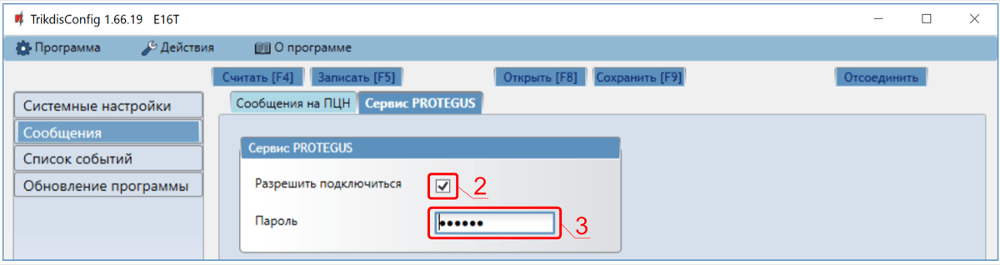
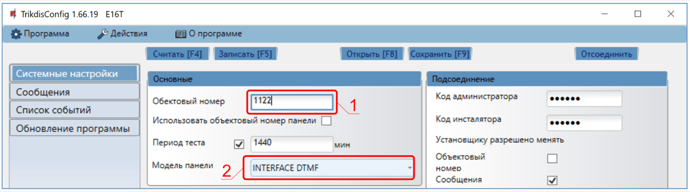
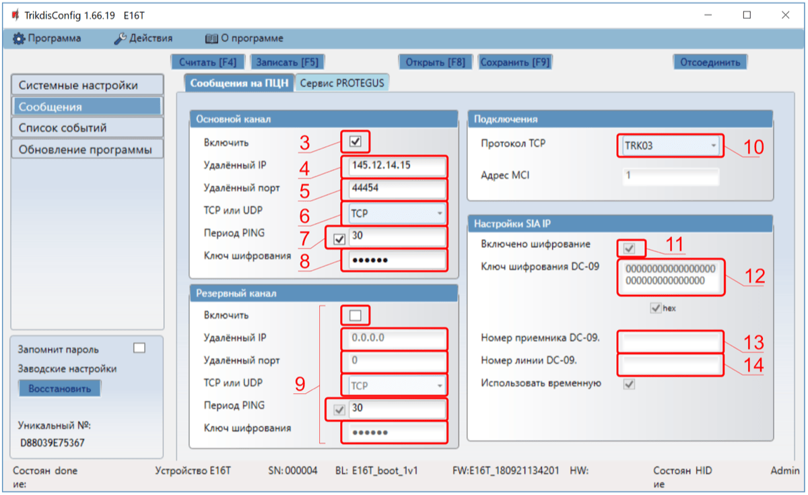
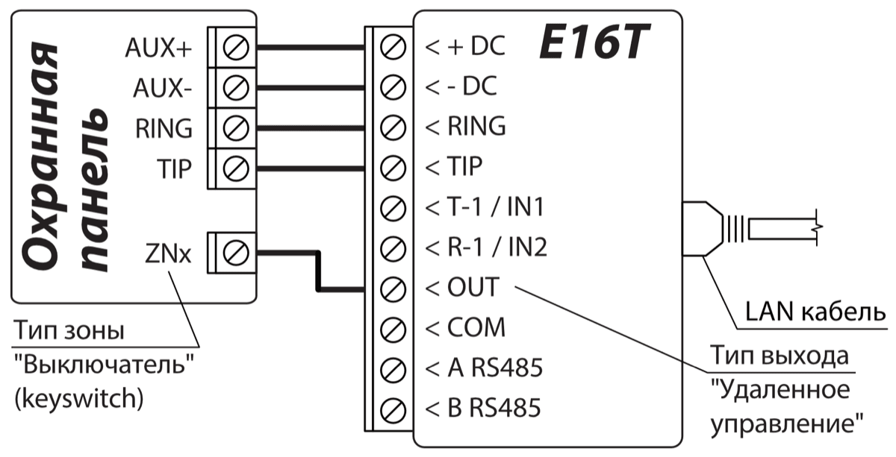
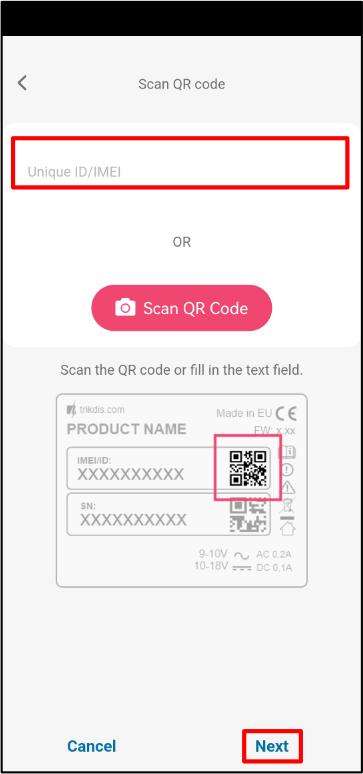

# E16T быстрая настройка

Краткие шаги по подключению коммуникатора E16T к телефонному коммуникатору панели, настройке передачи по IP и добавлению системы в Protegus. Используйте эту инструкцию вместе с полным руководством E16T для остальных настроек.

!!! caution "Осторожно"
    Установку и обслуживание должны выполнять только квалифицированные специалисты. Перед подключением отключите питание. Несанкционированные изменения аннулируют гарантию.

## Требования

- Коммуникатор E16T с подключенным LAN и кабелем USB Mini-B для настройки.
- Панель с телефонным коммуникатором, поддерживающим Contact ID через тональный набор DTMF.
- Доступ установщика / клавиатуры к панели.
- Номер счета ПЦН, если сообщения будут передаваться на пульт.
- Учетная запись Protegus и MAC / Unique ID коммуникатора.

## Быстрая настройка с программой *TrikdisConfig*

1. Загрузите **TrikdisConfig** со страницы [www.trikdis.com](http://www.trikdis.com) и установите программу.
2. Плоской отверткой откройте корпус E16T.

3. Подключите E16T к компьютеру кабелем USB Mini-B.
4. Запустите **TrikdisConfig**. Программа определит коммуникатор и откроет окно конфигурации.
5. Нажмите **Считать [F4]**, чтобы загрузить текущие настройки. Если потребуется, введите 6-значный код администратора или инсталлятора.

Выполните подраздел, который соответствует вашей установке:

- **Приложение Protegus** если пользователи будут управлять системой удаленно.
- **ПЦН** если коммуникатор будет передавать сообщения на пульт централизованного наблюдения.
- Выполните оба подраздела, если коммуникатор должен работать и с ПЦН, и с Protegus.

### Настройка связи с приложением Protegus

**Окно "Системные настройки":**

1. Выберите **Модель панели**, которая будет подключена к коммуникатору.

**Окно "Сообщения", вкладка "Сервис Protegus":**

2. Отметьте поле **Разрешить подключиться** в настройках сервиса Protegus.
3. Измените **Код сервиса**, если хотите, чтобы его запрашивали при добавлении системы в Protegus.

Завершив конфигурацию, нажмите **Записать [F5]** и отключите кабель USB.

### Настройка связи с ПЦН

**Окно "Системные настройки":**

1. Введите **Номер счета / объекта**, предоставленный ПЦН.
2. Выберите **Модель панели**, которая будет подключена к коммуникатору.

**Окно "Сообщения", настройки канала "Основной":**

3. Включите основной канал связи.
4. Введите **Удаленный IP / Host** и **Удаленный порт** приемника.
5. Выберите **TCP** или **UDP**.
6. Настройте **Период PING** и введите ключ шифрования, требуемый приемником.
7. При необходимости настройте параметры **Резервного** канала.
8. Выберите TCP-протокол, который требуется приемнику: **TRK**, **DC-09_2007** или **DC-09_2012**.
9. Если используется **DC-09_2012**, дополнительно настройте шифрование, а также номера приемника и линии.

**Окно "Сообщения", вкладка "Сервис Protegus":**

10. Отметьте поле **Разрешить подключиться** к Protegus, если пользователи будут использовать приложение.
11. Измените **Код сервиса**, если хотите, чтобы его запрашивали при добавлении системы в Protegus.

!!! note "Примечание"
    Если вы выбрали протокол **DC-09**, в окне **Сообщения** на вкладке **Настройки** дополнительно введите номера объекта, линии и приемника.

Завершив конфигурацию, нажмите **Записать [F5]** и отключите кабель USB.

## Подключение

Подключите E16T к питанию панели, `TIP` / `RING` и LAN, как показано ниже:

Если постановка и снятие с охраны будут выполняться через ключевую зону, подключите ключевую зону панели к `OUT`, как показано на той же схеме.

## Программирование охранной панели

Запрограммируйте телефонный коммуникатор панели следующим образом:

1. Включите телефонный коммуникатор панели.
2. Если E16T подключен напрямую к `TIP` / `RING`, введите любой телефонный номер длиной не менее 2 цифр.
3. Выберите режим набора `DTMF`.
4. Выберите формат связи `Contact ID`.
5. Введите 4-значный номер объекта панели.

## Специальные настройки Honeywell Vista 48

Если подключена панель Honeywell Vista 48, задайте следующие значения:

| Ячейка | Данные | Ячейка | Данные | Ячейка | Данные |
| --- | --- | --- | --- | --- | --- |
| `*41` | `1111` | `*60` | `1` | `*69` | `1` |
| `*42` | `1111` | `*61` | `1` | `*70` | `1` |
| `*43` | `1234` | `*62` | `1` | `*71` | `1` |
| `*44` | `1234` | `*63` | `1` | `*72` | `1` |
| `*45` | `1111` | `*64` | `1` | `*73` | `1` |
| `*47` | `1` | `*65` | `1` | `*74` | `1` |
| `*48` | `7` | `*66` | `1` | `*75` | `1` |
| `*50` | `1` | `*67` | `1` | `*76` | `1` |
| `*59` | `0` | `*68` | `1` |  |  |

Выйдите из режима программирования командой `*99`.

## Добавление системы в Protegus

1. Откройте [Protegus](https://www.protegus.app) и нажмите **Добавить новую систему**.
1. Введите **MAC / Unique ID** коммуникатора E16T.
1. Введите имя системы и завершите мастер добавления.
1. Если `OUT` подключен к ключевой зоне, откройте **Settings** в Protegus и включите **Arm/Disarm with PGM Output 1**.
1. Выберите режим **Pulse** или **Level** в соответствии с типом ключевой зоны панели.

## Проверка системы

1. Поставьте и снимите систему с охраны с клавиатуры.
1. Сымитируйте тестовую тревогу, когда система находится под охраной.
1. Убедитесь, что события поступают на ПЦН и в Protegus.
