# Коммуникатор FIRECOM соответствует требованиям стандарта EN 54-21:2006; EN 54-4:1997/AC:1999/A1:2002/A2:2006

  

## Описание 

Коммуникатор FIRECOM соответствует требованиям стандарта EN 54-21:2006; EN 54-4:1997/AC:1999/A1:2002/A2:2006.

Изделие соответствует эксплуатационным требованиям стандарта EN54-21 Приложение A Тип 1 для систем передачи данных.

Сертификат коммуникатора FIRECOM №: 1922-CPR-2083. Системы обнаружения пожара и пожарной сигнализации. Оборудование для отправки сигналов тревоги и маршрутизации сообщений о неисправностях. Силовое оборудование.

Продукт сертифицирован уполномоченным органом по сертификации продукции: № 1922 "Dedal", Nesebar Mladost str. 50, Bulgarija, 8230

Контакты технической поддержки Trikdis: support@trikdis.lt, +37067422877.

Коммуникатор предназначен для передачи сообщений пожарной панели через LAN и/или сети мобильной связи.

Принцип работы. При активации входа (зоны) коммуникатора, коммуникатор FIRECOM отправит сообщение на ПЦН (пульт централизованного наблюдения) или в приложение Protegus2 через мобильный интернет и/или LAN сеть. Коммуникатор может отправлять SMS сообщения и звонить. Коммуникатор имеет 4G модем.

**Функциональность**

Сообщения охранному предприятию

- Отправляет сообщения через локальную LAN сеть и (или) 4G сеть мобильного интернета.

- Сообщения отправляются по выбранным каналам связи с выбранным приоритетом.

- Сообщения на ПЦН принимаются Trikdis IP приемником или IP приемником, который работает SIA DC-09 IP протоколом.

- Назначение приоритета передачи сообщений на ПЦН: сообщения сначала передаются на ПЦН и только после сообщения отправляются пользователю системы.

- Может одновременно отправлять сообщения на 2 разных ПЦН приемника охранных предприятий.

- Сообщения о событиях передаются Contact ID или SIA кодами.

**Сообщения пользователям**

- Звонки на указанные телефонные номера (до 8 номеров пользователей).

- Отправляет SMS сообщения (до 8 номеров пользователей).

- „Push“ и специальные звуковые сообщения о событиях через приложение Protegus2.

- Удаленный мониторинг температуры.

**Удаленное управление выходами**

- Применяя приложение Protegus2.

- Звонком на номер SIМ карты, установленной в коммуникатор.

- Используя SMS сообщения.

**Настройки и установка**

- Быстрая и простая установка.

- Настройка осуществляется программой TrikdisConfig, подключив коммуникатор к компьютеру кабелем USB Type-C или удаленно.

- Удаленное обновление прошивки коммуникатора.

- Два уровня установки параметров: администратора и установщика.

**Входы и выходы**

- 3 релейных выхода (1 А, 30 В DC).

- Вход „FLOOP“ предназначен для подключения двухпроводных пожарных извещателей.

- 10 I/O клемм, каждая из которых может быть установлена как вход (IN) или как выход (OUT). Типы входов (IN): NC, NO, EOL, EOL-T, ATZ, ATZ-T. В цепях ATZ и EOL могут использоваться резисторы разных номиналов.

- Используя расширители серии iO, количество входов (IN) может быть увеличено до 32, а количество выходов (OUT) может быть увеличено до 16.

- Шина RS485 используется для подключения модулей расширения iO.

- Шина RS485 2 используется для подключения пожарных панелей.

### Технические параметры

| Параметр | Описание |
|----------|----------|
| Частота LTE модема: /​ EU (Европа) /​ LA (Латинская Америка) | LTE-FDD: B1/​B3/​B5/​B7/​B8/​B20/​B28 /​ LTE-FDD: B2/​B3/​B4/​B5/​B7/​B8/​B28/​B66 |
| Напряжение источника питания | 15-32 В постоянного тока. |
| Потребляемый ток | До 50 мA (в режиме ожидания). /​ До 200 мA (в режиме передачи данных). /​ До 2,5 А (при максимальном подключении внешних устройств) |
| Резервный источник питания [BAT] | 12 В аккумулятор свинцово-кислотный, 4 Ah/​7 Ah |
| Ток зарядки аккумулятора | до 500 мA |
| Напряжение и ток внешних подключаемых устройств [AUX] | 12 В постоянного тока, до 1 A |
| Протокол передачи данных | TRK, SIA DC-09_2007, SIA DC-09_2012, SIA DC-09_IPcom, TL150 |
| Ключ шифрования | 6-значный ключ шифрования |
| Связь с ПЦН | TCP/​IP или UDP/​IP |
| Кодирование сообщений | Contact ID, SIA |
| LAN модуль | Есть, интегрирован |
| Тип конфигурации LAN сети | DHCP или ручной |
| SIM карта | 1 шт., NANO размер |
| Варианты сообщений | До 2 IP и Port адресов;​ В iOS/​Android мобильные приложения Protegus2;​ SMS сообщения (до восьми номеров);​ Звонки (до восьми номеров). |
| Каналы передачи сообщений | 4G, Ethernet (LAN), SMS, звонок |
| Шифрование сообщений | Есть |
| Внутренние часы | Есть |
| Количество пользователей | 40 |
| Клеммы двойного назначения [I/​O] | 10, при конфигурации устанавливается функция IN или OUT. Вход (IN), тип: NC, NO, EOL, EOL_T, ATZ, ATZ_T. Выход (OUT), тип: открытый коллектор, коммутирует до 0,1 А |
| Количество групп | 8 |
| Количество зон | 10 (20 зон, применяя ATZ), (с расширителями до 32 зон) |
| Количество PGM выходов | 3 релейных (1 A, 30 В DC). (Установив I/​O клеммам режим работы Выход (OUT), можно получить 13 выходов. С расширителями количество выходов можно увеличить до 16) |
| Емкость буферной памяти | 60 событий |
| Емкость журнала событий | до 1000 событий. Ранние сообщения удаляются автоматически |
| Конфигурация | С программой TrikdisConfig удаленно или подключив коммуникатор к компьютеру USB Type-C кабелем. Удаленно SMS сообщениями |
| Длина шины данных 1-Wire | до 30 м |
| Совместимые датчики температуры | Maxim®/​Dallas® DS18S20, DS18B20;​ AM2301 серия |
| Наибольшее количество датчиков температуры, подключаемых к шине 1-Wire | 8 (Dallas) или 1 (если применяется датчик серии AM2301) |
| Шина RS485 | 2 шт. |
| Длина шины данных RS485 | До 100 м |
| Поддерживаемые модули | iO-8 – модуль расширения;​ /​ iO-MO – iO-WL радиоволновой приемник;​ /​ iO-LORA – модуль расширения;​ /​ iO8-LORA – модуль расширения;​ /​ PB-LORA – кнопка тревоги;​ /​ REL-LORA - модуль расширения;​ /​ пожарная панель с протоколом ESPA 4.4.4;​ /​ NSC Solution – пожарная панель;​ /​ INIM Smartline - пожарная панель;​ /​ C-TEC Cast ZFP – пожарная панель. |
| Условия эксплуатации | Температура от -10°C од +50°C, относительная влажность 0 - 80% при +20°C. |
| Размеры | 235 x 205 x 92 мм |
| Вес | 1.35 кг |

### Элементы коммуникатора FIRECOM

1. Световые индикаторы связи и рабочих режимов
2. Кнопка
3. Не используется
4. Клеммы для подключения источника резервного питания
5. Клеммы для подключения источника питания
6. Кнопка RESET
7. Клеммы для подключения внешних устройств

### Клеммы 

| Клемма | Описание |
|--------|----------|
| Клемма питания „+“ | Положительная клемма подключения питания (15-32 В постоянного тока) |
| Клемма питания „-“ | Отрицательная клемма подключения питания (15-32 В постоянного тока) |
| BAT+ | Положительная клемма для подключения аккумулятора 12 В |
| BAT- | Отрицательная клемма для подключения аккумулятора 12 В |
| AUX+ | Клемма для запитки внешних устройств (+12 В, положительная клемма) |
| AUX- | Общая (отрицательная) клемма |
| A1 RS485 | Шина RS485 для подключения расширителей iO |
| A2 RS485 | Шина RS485 для подключения пожарной панели |
| IO1 – IO10 | Клеммы вход/​выход (заводская настройка – вход) |
| C | Общая (отрицательная) клемма |
| AUX+ | Клемма для запитки внешних устройств (+12 В, положительная клемма) |
| FLOOP | Клемма для подключения 2-проводного пожарного извещателя |
| +5 V | Клемма питания для устройств „1-Wire“ |
| 1 WIRE | „1-Wire“ шина данных |
| C | Общая клемма (отрицательная) |
| NO1/​C1/​NC1 | 1-ый релейный PGM выход |
| NO2/​C2/​NC2 | 2-ой релейный PGM выход |
| NO3/​C3/​NC3 | 3-ий релейный PGM выход |

### Световая индикация 

| Индикатор | Статус | Описание |
|-----------|--------|----------|
| SIM | Выключен | Нет связи с мобильной сетью |
| SIM | Мигает зеленый | Идет подключение к сети мобильной связи. |
| SIM | Зеленый | SIM карта зарегистрирована в сети мобильной связи. |
| SIM | Светит зеленым и мигает желтым цветом | Коммуникатор подключен к сети мобильной связи. Достаточный уровень 4G сигнала –3 уровень (три желтых вспышки). |
| ETH | Мигает зеленый | Отключен LAN кабель или проблема DHCP |
| ETH | Зеленый | Подключен к LAN сети |
| DAT / DATA | Выключен | Отправлены все сообщения |
| DAT / DATA | Зеленый | Отправление сообщения |
| DAT / DATA | Желтый (DAT) | Есть неотправленные сообщения в памяти |
| STA / TROUBLE | Мигает зеленый (STA) | Нет неисправностей |
| STA / TROUBLE | Выключен (TROUBLE) | Нет неисправностей |
| STA / TROUBLE | 1 красная вспышка | Нет SIM карты |
| STA / TROUBLE | 2 красные вспышки | Неправильный PIN код SIM-карты |
| STA / TROUBLE | 3 красные вспышки | Не удается подсоединиться к сети мобильной связи |
| STA / TROUBLE | 4 красные вспышки | Не удается подключиться к IP приемнику по основному каналу |
| STA / TROUBLE | 5 красных вспышек | Не удается подключиться к IP приемнику по параллельному каналу |
| STA / TROUBLE | 6 красных вспышек | Нет питания от сети |
| STA / TROUBLE | 7 красных вспышек | Неисправность AUX (перегрузка по току) |
| STA / TROUBLE | 8 красных вспышек | Неисправность аккумулятора |
| STA / TROUBLE | 9 красных вспышек | Отключен кабель LAN |
| STA / TROUBLE | 10 красных вспышек | LAN DHCP проблема |
| FPS / POWER | Выключен | Не подключено напряжение питания |
| FPS / POWER | Зеленый | Достаточный уровень напряжения питания |
| FPS / POWER | 1 зеленая вспышка | Нет напряжения питания от сети переменного тока |
| FPS / POWER | 2 зеленые вспышки | Низкий уровень напряжения аккумулятора |

### Материалы необходимые для монтажных работ 

Перед началом монтажных работ убедитесь, что имеете:

1.  USB Type-С кабель, который необходим для конфигурации.

2.  4-жильный кабель для подключения коммуникатора к пожарной панели.

3.  Отвертку с плоским 2,5 мм жалом.

4.  Внешнюю GSM антенну, если на месте установки слабая связь.

5.  Активированную SIM карту (запрос PIN кода может быть отключен).

6.  Инструкция пожарной панели, к которой будет подключен коммуникатор.

Необходимые материалы закажите у местного диллера.

## Питание коммуникатора 

### Основное питание 

Коммуникатор должен быть запитан от источника питания постоянного тока. Для обеспечения бесперебойного питания, к коммуникатору должен быть подключен аккумулятор 12 В.

### Резервное питание 

При сбое основного источника питания, коммуникатор автоматически переключится на источник резервного питания (аккумулятор 12 В) и будет сформировано сообщение *„DC Fault“*. Когда напряжение на аккумуляторе уменьшится до 11,5 В, будет сформировано сообщение „*Low Battery“*. Аккумулятор будет отключен при напряжении ниже 9,5 В. При появлении напряжения на источнике питания будет сформировано сообщение „*DC Restore*“ и автоматически начнется зарядка аккумулятора. Когда напряжения на аккумуляторе восстановится до 12,6 В, то будет сформировано сообщение „*Battery Restore*“.

### Комплект коммуникатора 

| Наименование | Количество |
|----|:--:|
| Плата коммуникатора FIRECOM с антенной, встроенной в металлический корпус | 1 шт. |
| Металлический ящик с импульсным источником питания Mean Well | 1 шт. |
| Резистор 10 кΩ | 20 шт. |
| Провод для подсоединения аккумулятора | 1 шт. |
| Датчик саботажа (англ. Tamper) | 1 шт. |
| Клеммная колодка с предохранителем 3,15 A | 1 шт. |
| Элементы крепления (шуруп – 4шт., пластиковый дюбель – 4 шт.) | 1 компл. |

!!! note "Примечание"
    Кабель USB Type-C для программирования коммуникатора не входит в
    комплектацию.
## Установка коммуникатора 

**Размеры платы *FIRECOM***

На рисунке представлены размеры платы и отверстия ее крепления. Размеры указаны в миллиметрах.

### Последовательность подключения 

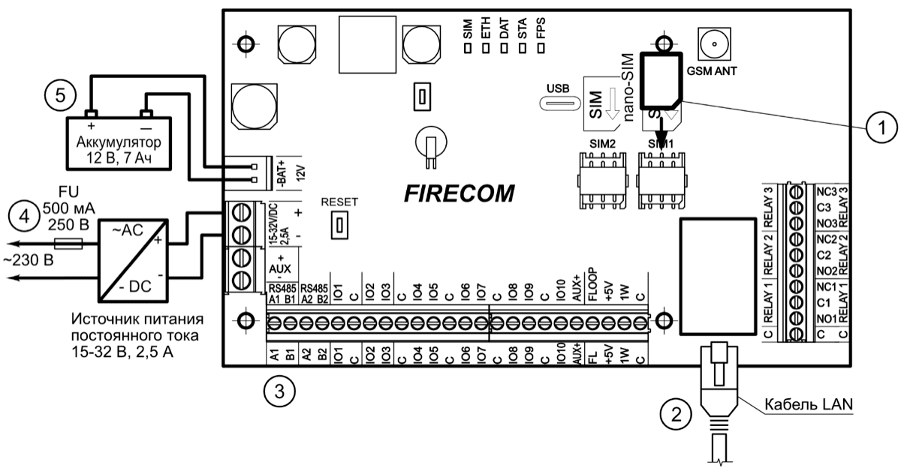

1.  Если используете SIM карту, установите SIM карту, которая активирована в мобильной сети, в держатель.

2.  Если используете LAN сеть, подсоедините LAN кабель.

3.  Подключите PGM-выходы пожарной панели, пожарные извещатели, сигнализаторы согласно представленным схемам.

4.  Подключите провода питания переменного тока к клеммам.

5.  В монтажный ящик установите аккумулятор. Провода от аккумулятора подключите к разъему ВАТ+/ВАТ- коммуникатора.

!!! note "Примечание"
    При выборе аккумулятора необходимо обратить внимание, что он должен быть
    заряжен до 80% в течение 24 часов, а оставшаяся емкость - в течение
    следующих 48 часов, чтобы соответствовать требованиям стандарта EN54.
### Схемы подключения входов (зон) 

Плата коммуникатора имеет 10 клемм IO1-IO10 (зоны) для подсоединения датчиков. Применив расширители (***iO-8, iO-MO, iO-LORA, iO8-LORA**),* количество входов можно увеличить до 32 шт. Любую IO клемму можно установить, как вход и установить атрибуты: тип входа (NO, NC, EOL, EOL_T, ATZ, ATZ_T); чувствительность и кратковременные события в цепи; функции входа (зоны), см. п.6.6 „Окно „Зоны““.

#### Схема подключения датчиков.

  <figure style="margin: 0;">
    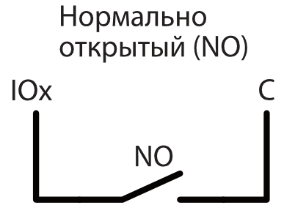
  </figure>
  <figure style="margin: 0;">
    
  </figure>
  <figure style="margin: 0;">
    
  </figure>

  <figure style="margin: 0;">
    
  </figure>
  <figure style="margin: 0;">
    
  </figure>
  <figure style="margin: 0;">
    
  </figure>

  <figure style="margin: 0;">
    
  </figure>
  <figure style="margin: 0;">
    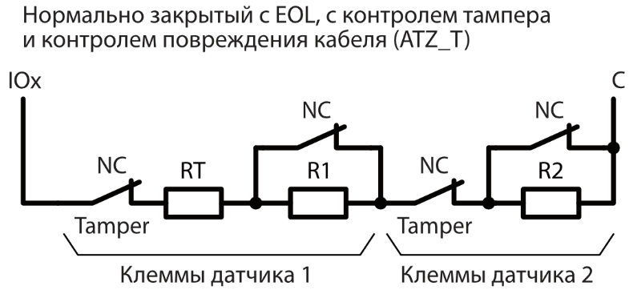
  </figure>

### Схемы подключения пожарных извещателей 

Схемы подключения двухпроводных пожарных извещателей.

Подключение двухпроводных пожарных извещателей к выходу „**FLOOP**“. Если применяется эта схема подключения, то необходимо в окне „Зоны“ входу (IOx) указать вход „**2-Wire loop (FLOOP)**“. Ток срабатывания пожарного извещателя должен быть больше 10 мА. К „**FLOOP**“ выходу можно подсоединить до 8 пожарных извещателей.

Схема подключения двухпроводных пожарных извещателей с релейным модулем SM1. Для подключения цепи датчика дыма к выбранному входу необходимо активировать вход (IOx) и установить тип цепи (NO, NC, EOL, EOL_T, ATZ, ATZ_T) (см. п.6.6 „„Окно „Зоны““). Выходу (IO10) должен быть установлен режим работы „**Сброс пожарного датчика“** (см. п.6.7 „Окно „PGM выходы““).

\* Реле (К1) используется для обнаружения обрыва провода и снятия пожарного извещателя. Если не используете реле (К1), то контакт К1 необходимо закоротить.

или

Подключение четырехпроводных пожарных извещателей.

Для подключения цепи извещателя дыма к выбранному входу необходимо активировать вход (IOx) и установить тип цепи (NO, NC, EOL, EOL_T, ATZ, ATZ_T) (см. п.6.6 „„Окно „Зоны““). Выходу (IO10) должен быть установлен режим работы „**Сброс пожарного датчика“** (см. п.6.7 „Окно „PGM выходы““).

\* Реле (К1) используется для обнаружения обрыва провода и снятия пожарного извещателя. Если не используете реле (К1), то контакт К1 необходимо закоротить.

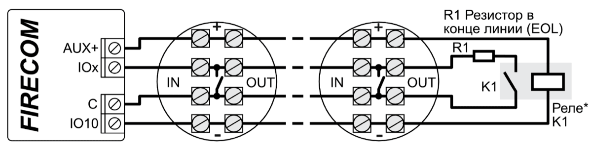

### Схема подключения пожарной панели и коммуникатора 

  <figure style="margin: 0;">
    
  </figure>
  <figure style="margin: 0;">
    
  </figure>

Если хотите контролировать состояние пожарной панели, подключите ее соответствующие выходы к входам FIRECOM. Выходы панели пожарной сигнализации (PGM1, PGM2, PGM3) должны быть настроены как выходы состояния панели (Тревога, Неисправность и т. д.).

### Схема подключения пожарной панели с протоколом ESPA4.4.4 

  <figure style="margin: 0;">
    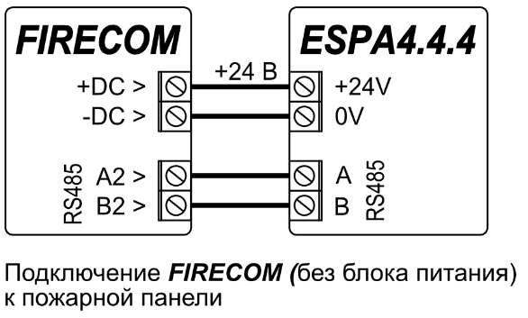
  </figure>
  <figure style="margin: 0;">
    
  </figure>

Настройки коммуникатора FIRECOM с TrikdisConfig при подключении пожарной панели с протоколом **ESPA4.4.4**.

1.  Выберите **ESPA4.4.4**.

2.  Выберите тип подключения.

3.  Коммуникатор FIRECOM и пожарная панель должны иметь одинаковые настройки передачи данных.

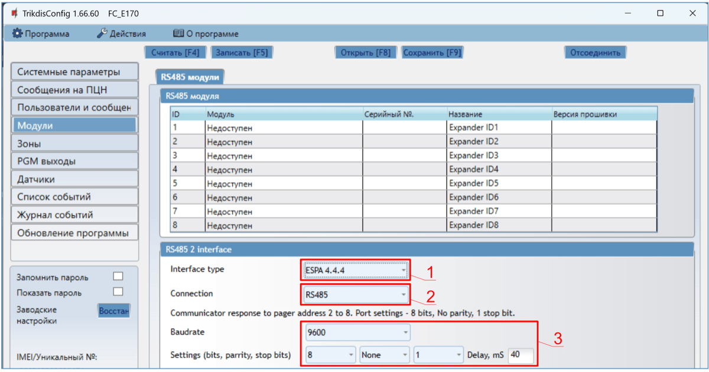

4. Введите номера телефонов, адреса электронной почты пользователей, которым должны приходить сообщения от FIRECOM.

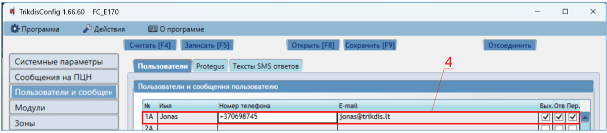

5. Если вы хотите, чтобы пользователь получал сообщения (или звонки) о событиях, отметьте галочкой поле **SMS** (или **Звонок**).

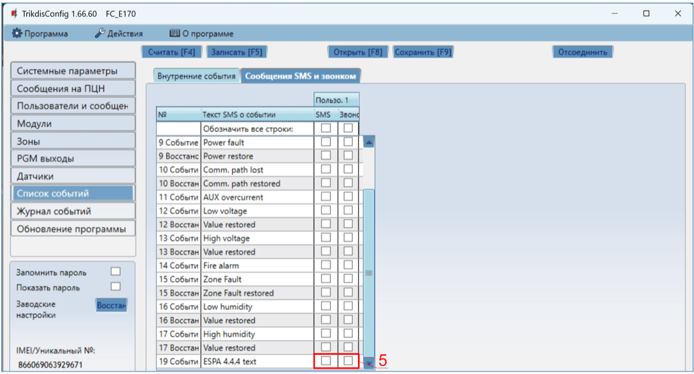

6. Настройте канал связи, если сообщения должны отправляться на приемник ПЦН. Сообщения о событиях передаются с использованием протокола SIA DC-09.

Протестируйте систему. Активируйте пожарные извещатели пожарной сигнализации и проверьте, что FIRECOM отправляет сообщения на приемник ПЦН и в Protegus2.

### Схема подключения пожарной панели NSC Solution 

  <figure style="margin: 0;">
    
  </figure>
  <figure style="margin: 0;">
    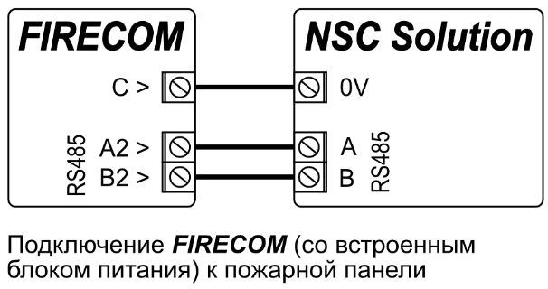
  </figure>

Настройки коммуникатора FIRECOM с TrikdisConfig при подключении пожарной панели сигнализации **NSC Solution.**

1.  Выберите пожарную панель **NSC solution**.

2.  “**NSC slave addres**” не должен совпадать с адресом подключенных модулей пожарной панели.

3. Введите номера телефонов, адреса электронной почты пользователей, которым должны приходить сообщения от FIRECOM.

4. Пользователи будут получать SMS-сообщения и телефонные звонки о событиях, отмеченных галочкой. Вы можете добавить дополнительные коды событий CID в столбце CID. Вы должны ввести текстовые SMS-сообщения рядом с новыми кодами. Если вы хотите, чтобы пользователь получал сообщения (или звонки) о событиях, отметьте поле **SMS** (или **Звонок**).

5. Настройте канал связи, если сообщения должны отправляться на приемник ПЦН.

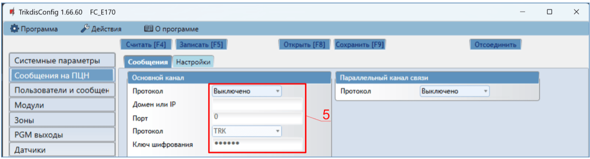

После настройки коммуникатора FIRECOM включите питание пожарной панели. Дождитесь загрузки программного обеспечения пожарной панели. Необходимо выполнить сканирование модулей, подключенных к шине RS485 пожарной панели. На пожарной панели нажмите: PROG.>INSTALLER>(Введите код установщика) 00000 OK>(Выберите) SETTINGS>ENTER>(Выберите) SCAN RS485>ENTER. Дождитесь завершения сканирования. Вернитесь на главный экран, дважды нажав “**CANCEL”**.

Протестируйте систему. Активируйте пожарные извещатели пожарной сигнализации и проверьте, что FIRECOM отправляет сообщения в приемник ПЦН и в Protegus2.

### Схема подключения пожарной панели INIM Smartline 

  <figure style="margin: 0;">
    
  </figure>
  <figure style="margin: 0;">
    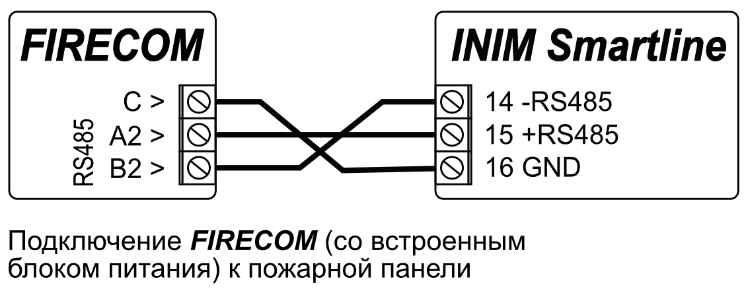
  </figure>

Пожарной панели **INIM Smartline** необходимо установить ведомый (Slave) режим работы, когда коммуникатор G17F подключен через шину RS485 к пожарной панели.

!!! note "Примечание"
    Если к пожарной панели **INIM Smartline** подключены повторители, то
    коммуникатор FIRECOM нельзя подключить к шине RS485. / Если
    коммуникатор FIRECOM подсоединен к шине RS485 пожарной панели
    **INIM Smartline,** то не поддерживаются iO модули расширения
    коммуникатора.
Настройки коммуникатора FIRECOM с TrikdisConfig при подключении пожарной панели сигнализации **INIM Smartline.**

1.  Выберите пожарную панель **INIM Smartline**.

2. Введите номера телефонов, адреса электронной почты пользователей, которым должны приходить сообщения от FIRECOM.

3. Пользователи будут получать SMS-сообщения и телефонные звонки о событиях, отмеченных галочкой. Вы можете добавить дополнительные коды событий CID в столбце CID. Вы должны ввести текстовые SMS-сообщения рядом с новыми кодами. Если вы хотите, чтобы пользователь получал сообщения (или звонки) о событиях, отметьте поле **SMS** (или **Звонок)**.

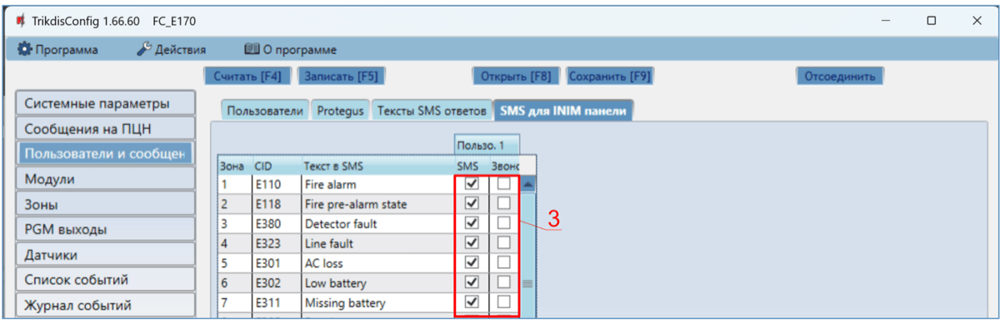

4. Настройте канал связи, если сообщения должны отправляться в приемник ПЦН.

Протестируйте систему. Активируйте пожарные извещатели пожарной сигнализации и проверьте, что FIRECOM отправляет сообщения в приемник ПЦН и в Protegus2.

### Схема подключения пожарной панели C-TEC Cast ZFP 

  <figure style="margin: 0;">
    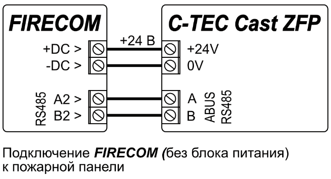
  </figure>
  <figure style="margin: 0;">
    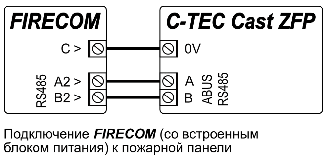
  </figure>

Настройки коммуникатора FIRECOM с TrikdisConfig при подключении пожарной панели сигнализации **C-TEC Cast ZFP.**

1.  Выберите пожарную панель **C-TEC Cast ZFP**.

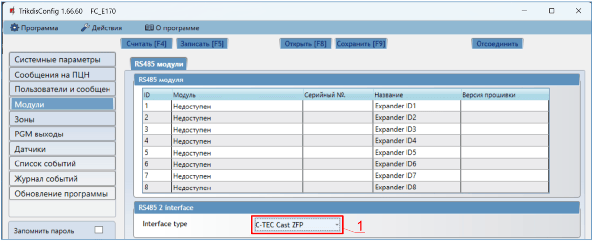

2. Введите номера телефонов, адреса электронной почты пользователей, которым должны приходить сообщения от FIRECOM.

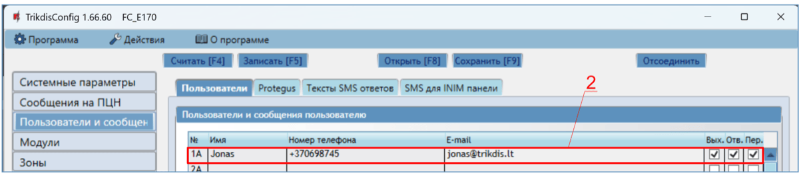

3. Пользователи будут получать SMS-сообщения и телефонные звонки о событиях, отмеченных галочкой. Вы можете добавить дополнительные коды событий CID в столбце CID. Вы должны ввести текстовые SMS-сообщения рядом с новыми кодами. Если вы хотите, чтобы пользователь получал сообщения (или звонки) о событиях, отметьте поле **SMS** (или **Звонок)**.

4. Настройте канал связи, если сообщения должны отправляться в приемник ПЦН.

Установите программу ZFPtools на свой компьютер. Запустите программу ZFPtools. Включите питание пожарной панели сигнализации. Дождитесь загрузки программного обеспечения пожарной панели. Подключите пожарную панель к компьютеру с помощью кабеля USB2.0 A-B.

5. Откройте вкладку "**Node View**".

6. Загрузите настройки пожарной панели на свой компьютер.

7. Введите код (заводской код – 4444).

2.  Нажмите „OK“.

3. Выберите „**BMS Interface**“.

2.  Нажмите на свободную икону.

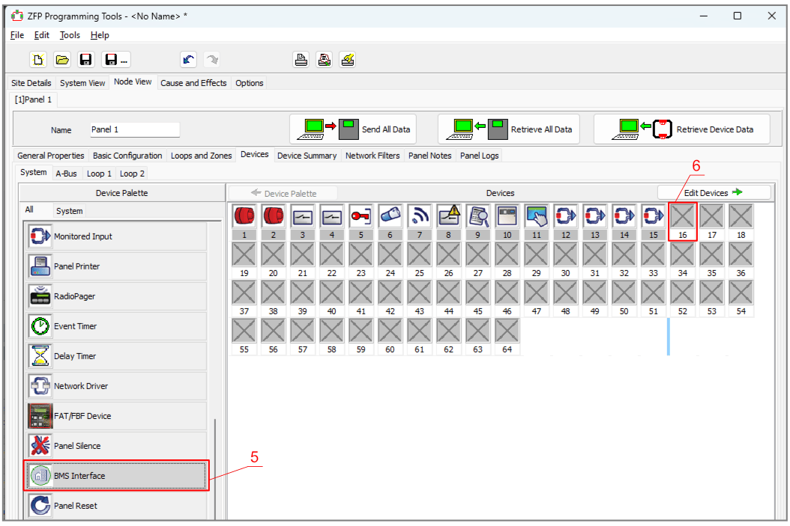

11. Нажмите на „**Edit Devices**“.

12. Во вкладке “**Device**” введите имя системы.

13. Во вкладке “**Properties**” введите имя системы.

14. Укажите шину „**ABUS RS485**”, к которой подключен коммуникатор FIRECOM.

15. Настройте сообщения.

16. Запишите настройки в пожарную панель.

17. Введите код (заводской код – 4444).

18. Нажмите „OK“.

Пожарная панель запрограммирована. Отсоедините кабель USB2.0 A-B от пожарной панели.

Протестируйте систему. Активируйте пожарные извещатели пожарной сигнализации и проверьте, что FIRECOM отправляет сообщения в приемник ПЦН и в Protegus2.

### Схема подключения датчика температуры 

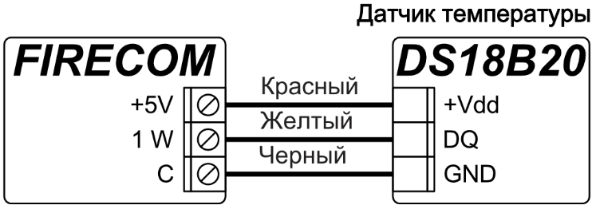 / 

### Схема подключения реле и LED индикатора 

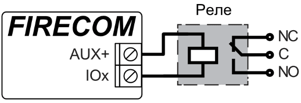 / 

### Схема подключения входов пожарной панели к коммуникатору 

Согласно стандарта EN54, пожарная панель от коммуникатора должна получать информацию о нарушении связи с ПЦН, а так же об успешном отправлении сообщений на ПЦН. К специальным входам пожарной панели подключитe ПГМ выходы (например: „Relay1“ и „Relay2“) коммуникатора. ПГМ выходу „Relay1“ должен быть устанавлен режим „CMS fail“. ПГМ выходу „Relay2“ должен быть устанавлен режим „ACK received“. Выход „Relay1“ активируется при нарушении канала связи с ПЦН. Выход „Relay2” активируется на 5 сек. при отправленном сообщении на ПЦН.

### Схема подключения расширителей серии iO 

Для увеличения количества зон (IN) и выходов (OUT) к коммуникатору подключите проводной или беспроводный Trikdis расширитель входов/выходов серии iO. Конфигурация FIRECOM с модулями расширения описана в п.6.5 „Окно „Модули““.

  <figure style="margin: 0;">
    
  </figure>
  <figure style="margin: 0;">
    
  </figure>

Схема подключения модулей расширения LORA.

### Включение коммуникатора 

Включите питание коммуникатору. Светодиоды коммуникатора должны работать следующим образом:

- Индикатор „**STA**“ должен мигать зеленым, указывая на наличие достаточного уровня напряжения питания;

- Индикатор „**SIM**“ должен светиться зеленым и периодически мигать желтым не менее 3 раз; и/или горит зеленым индикатор „**LAN**“, когда подключен к LAN сети.

!!! note "Примечание"
    Достаточный уровень мобильного сигнала -- 3 (три желтых вспышки
    индикатора „**SIM**"). / Если сосчитали меньше желтых вспышек индикатора
    „**SIM**", то уровень сигнала мобильной связи недостаточный. Рекомендуем
    выбрать другое место установки коммуникатора, или поменять место
    расположения антенны, или использовать более чувствительную
    антенну. / Световая индикация коммуникатора описана в п.1.4 „Световая
    индикация". / Если индикаторы коммуникатора не светят, проверьте
    источник питания и проводные соединения.
## Быстрая настройка с программой *TrikdisConfig* 

1.  Загрузите программу конфигурации TrikdisConfig со странички [www.trikdis.com/ru](http://www.trikdis.com/ru)/ (в поле поиска напишите „TrikdisConfig“), и установите ее на компьютер.

2.  Кабелем USB Type-C подключите FIRECOM к компьютеру.

3.  Запустите программу TrikdisConfig. Программа автоматически определит подключенное изделие и откроет окно конфигурации FIRECOM.

4.  Нажмите на кнопку **Считать [F4]**, чтобы скачать установленные параметры в FIRECOM. Если необходимо введите код администратора или инсталлятора.

Ниже мы опишем настройки, которые необходимо изменить, чтобы коммуникатор начал отправлять сообщения в приложение Protegus2 или в ПЦН (пульт централизованного наблюдения).

### Настройки связи с приложением *Protegus2* 

**Окно „Системные параметры“:**

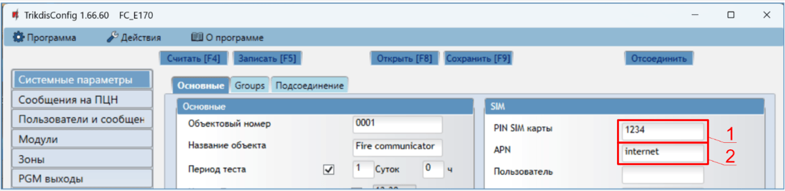

1.  Введите „**PIN SIM карты“**.

2.  Введите имя **APN**. **APN** можно найти на страничке оператора мобильной связи. „Internet” является универсальным и работает в сетях многих операторов мобильной связи.

**Окно „Пользователи и сообщения“:**

3. Отметьте поле „**Разрешить подключиться“**, чтобы разрешить доступ к серверу Protegus2.

2.  Измените „**Код доступа к** **Облаку**“. Пользователю придется ввести код доступа при добавлении коммуникатора к приложению Protegus2 (заводской код - 123456).

**Окно „Сообщения на ПЦН“:**

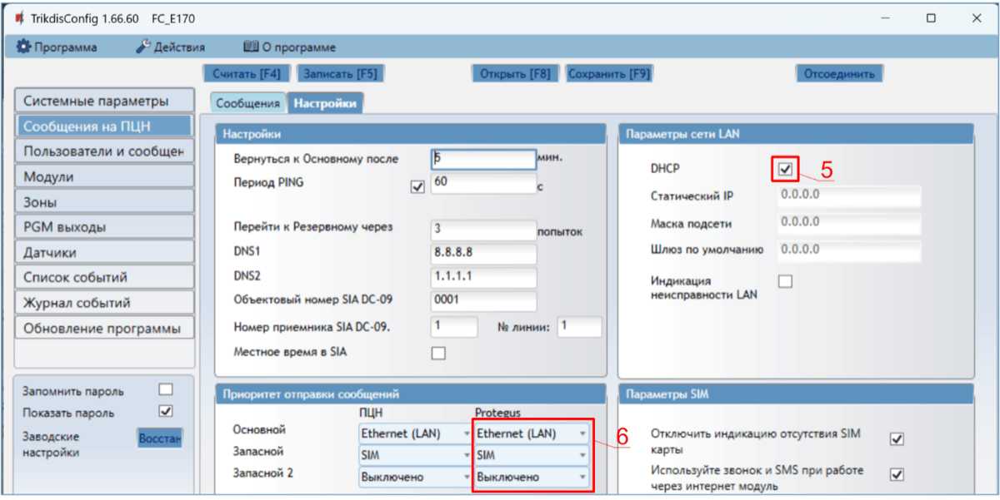

3. Если к коммуникатору подключен кабель LAN, установите флажок „DHCP“ (режим автоматической регистрации), чтобы коммуникатор FIRECOM автоматически считал сетевые настройки (маску подсети, шлюз) и ему был присвоен IP-адрес.

2.  Устанавливается предпочтительный порядок отправки сообщений по каналам связи в приложение Protegus2. Типы каналов связи устанавливаются по порядку. Если не удается установить соединение по „**Основному“** каналу связи производится переход на „**Запасной“** канал связи и т.д.. Если удалось передать сообщение по „**Запасному“** каналу связи, то коммуникатор с установленной периодичностью проверит и активно будет пытаться восстановить связь с Protegus2 по „**Основному“** каналу связи.

**Окно „Зоны“:**

3. Отметьте поле, если хотите, чтобы пользователь получал сообщения в Protegus2 об изменениях состояния зон.

**Окно „PGM выходы“:**

4. Отметьте поле, если хотите, чтобы пользователь получал сообщения в Protegus2 об изменениях состояния PGM выходов.

**Окно „Список событий“:**

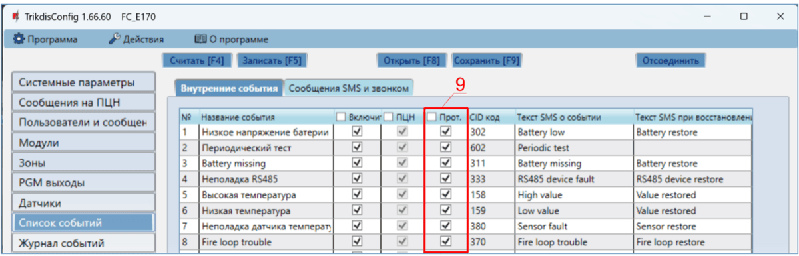

5. Отметьте поле, если хотите, чтобы пользователь получал сообщения в Protegus2 об изменениях внутренних событий коммуникатора.

Закончив конфигурацию, нажмите кнопку **Записать [F5]**. Отсоедините кабель USB.

!!! note "Примечание"
    Дополнительная информация о других настройках FIRECOM рассмотрена
    в п. 6 „Конфигурация с программой TrikdisConfig**".**
### Настройки связи с ПЦН 

**Окно „Системные параметры“:**

1.  Введите „**Объектовый номер“** (4-значный шестнадцатеричный номер. 0-9, А-F. **Не используйте FFFE, FFFF объектовые номера**).

2.  Введите „**PIN SIM карты“**.

3.  Введите имя **APN**. Имя **APN** можете найти на страничке оператора мобильной связи. „Internet” – универсален и работает в сетях многих операторов.

**Окно „Сообщения на ПЦН“:**

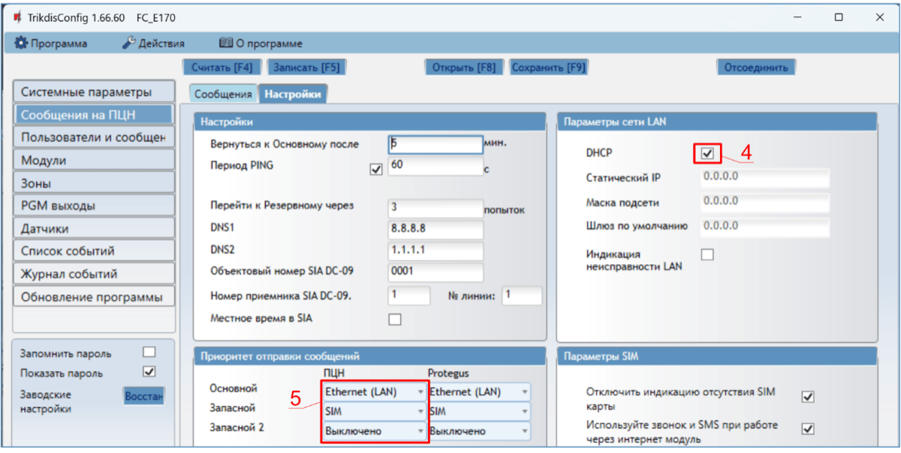

4. Если к коммуникатору подключен кабель LAN, установите флажок „DHCP“ (режим автоматической регистрации), чтобы коммуникатор FIRECOM автоматически считал сетевые настройки (маску подсети, шлюз) и ему был присвоен IP-адрес.

2.  Устанавливается предпочтительный порядок отправки сообщений по каналам связи на ПЦН. Типы каналов связи устанавливаются по порядку. Если не удается установить соединение по „**Основному“** каналу связи производится переход на „**Запасной“** канал связи и т.д.. Если удалось передать сообщение по „**Запасному“** каналу связи, то коммуникатор с установленной периодичностью проверит и активно будет пытаться восстановить связь с приемниками ПЦН по „**Основному“** каналу связи.

**Окно „Сообщения на ПЦН“:**

3. **Протокол** – выберите режим связи (TCP или UDP).

2.  **Домен или IP** – введите адрес домена или IP адрес приемника.

8\. **Порт** – введите номер порта приемника в сети.

9\. **Протокол** – выберите кодировку для отправления сообщений на ПЦН: **TRK** (на приемники TRIKDIS), **DC-09_2007** или **DC-09_2012** (на универсальные приемники), **TL150** (на приемники SUR-GARD).

3. **Ключ шифрования** – введите ключ шифрования, который установлен в приемнике ПЦН.

!!! note "Примечание"
    Если выбрали кодировку сообщений **DC-09**, то необходимо дополнительно
    ввести в группе „**Настройки":** „**Объектовый номер SIA DC-09"**;
    „**Номер приемника SIA DC-09"**; „**Номер линии SIA DC- 09"**.
4. (Рекомендуется) Настройте параметры „**Резервного канала“**.

2.  Настройте параметры „**Параллельного канала“,** если сообщения будут отправляться на второй приемник ПЦН.

Закончив конфигурацию, нажмите кнопку **Записать [F5]**. Отсоедините USB кабель.

!!! note "Примечание"
    Дополнительная информация о других настройках FIRECOM рассмотрена
    в п. 6 „Конфигурация с программой TrikdisConfig **".**
## Удаленное управление 

### Регистрация коммуникатора в приложении Protegus2 

С Protegus2 пользователи могут видеть состояние системы и получать сообщения о событиях.

1.  Скачайте и запустите приложение Prоtegus 2 или используйте браузерную версию [www.protegus.app](https://www.protegus.app):

    

      
      
      
    

2.  Подключитесь к системе с помощью своего имени и пароля или создайте новую учетную запись.

| ВАЖНО: | При добавлении коммуникатора FIRECOM к Protegus2 должно быть: Установлена активированная SIM-карта и введен или отключен PIN код. Включен Protegus2 сервис. См. в п. 6.4 Окно „Пользователи и сообщения“. Включено питание коммуникатору (мигает зеленый индикатор „STA“). Коммуникатор FIRECOM подключен к сети связи (горит зеленым и мигает желтым индикатор „SIM”;​ и/​или горит зеленым индикатор „LAN“, когда подключен к LAN сети). |
|--------|--------------------------------------------------------------------------------------------------------------------------------------------------------------------------------------------------------------------------------------------------------------------------------------------------------------------------------------------------------------------------------------------------------------------------------------------|
| Нажмите „ADD NEW SYSTEM“ и введите „IMEI“ номер FIRECOM, который найдете на изделии или на упаковке. Нажмите кнопку „NEXT“. |  |

### Конфигурация и управление SMS сообщениями 

1.  **Изменение пароля администратора**

В целях безопасности измените заводской SMS пароль администратора. Отправьте следующее SMS сообщение:

#### PSW 123456 xxxxxx

| **123456** | Заводской пароль администратора.       |
|------------|----------------------------------------|
| **xxxxxx** | Новый 6-значный пароль администратора. |

1.  **Разрешение управлять новым пользователям**

Системой могут управлять телефонные номера, которые занесены в список пользователей. Пользователь может управлять системой SМS сообщениями или телефонным звонком. Из телефона администратора отправьте SMS сообщение следующего формата, чтобы добавить пользователя:

#### SETN xxxxxx PHONEx=+PHONENR#NAME#EMAIL

| **xxxxxx** | 6- значный пароль администратора. |
|----|----|
| **x** | Номер пользователя в списке (записав 1 уступите права администратора другому лицу). |
| **PHONENR** | Номер телефона пользователя. |
| **NAME** | Имя пользователя. |
| **EMAIL** | Электронная почта пользователя. |

#### Список SMS команд (123456 - заводской код)

| Команда | Данные | Описание |
|---------|--------|----------|
| INFO |  | Запрос информации о коммуникаторе. В ответ будет включена информация: наименование объекта, тип коммуникатора, номер IMEI, уровень GSM сигнала, версия программного обеспечения, номер серии. Например: INFO 123456 |
| RESET |  | Запуск коммуникатора работать заново. Например: RESET 123456 |
| OUTPUTx | ON | Включить выход, где „x“ номер выхода. / Например: OUTPUT1 123456 ON |
| OUTPUTx | OFF | Выключить выход, где „x“ номер выхода. / Например: OUTPUT1 123456 OFF |
| OUTPUTx | PULSE=ttt | Включить выход OUT в импульсном режиме на несколько секунд. „x“ – номер выхода. „ttt“ – 3-значное значение продолжительности импульса (5 секунд надо указать - 005), в секундах. / Например: OUTPUT1 123456 PULSE=002 |
| PSW | Новый пароль | Замена пароля администратора. Например (заменить пароль с 123456 на 654123): PSW 123456 654123 |
| TIME | YYYY/MM/DD,hh:mm:ss | Установка даты и времени. / Например: TIME 123456 2023/05/09,12:23:00 |
| TXTA | Наименование объекта | Запись наименования объекта. Например: TXTA 123456 Магазин |
| RDR | PhoneNR#SMStext | Переадресация SMS сообщений на указанный номер телефона. Телефонный номер должен быть с „+“ и международным кодом страны. / Например: RDR 123456 +37061234567#Переадресация текста |
| ASKI |  | Информация о состоянии входов IN коммуникатора. / Например: ASKI 123456 |
| ASKO |  | Информация о состоянии выходов OUT коммуникатора. / Например: ASKO 123456 |
| ASKT |  | SMS сообщение запроса о значении температур датчиков температуры. / Например: ASKT 123456 |
| FRS |  | Запустить заново работать пожарный извещатель после срабатывания, если выходу (OUT) установлена функция „Сброс пожарного датчика“. / Например: FRS 123456 |
| SETN | PhoneX=PhoneNR#Name#email | Добавить нового пользователя системы, для этого надо ввести номер телефона, имя пользователя, адрес электронной посты пользователя. „X“ – порядковый номер пользователя в списке. Телефонный номер должен быть с „+“ и международным кодом страны. / Например: SETN 123456 PHONE5=+37061234567#Petr#petr@trikdis.lt |
| SETN | PhoneX=DEL | Удаление пользователя из списка. „X“ – порядковый номер пользователя в списке. Например: SETN 123456 PHONE5=DEL |
| UUSD | *Uusd code# | Отправление UUSD кода оператору. Например: UUSD 123456 *245# |
| CONNECT | Protegus=ON | Подключиться к Protegus сервису. / Например: CONNECT 123456 PROTEGUS=ON |
| CONNECT | Protegus=OFF | Отключиться от Protegus сервиса. / Например: CONNECT 123456 PROTEGUS=OFF |
| CONNECT | Code=123456 | Код подключения к Protegus сервису. / Например: CONNECT 123456 CODE=123456 |
| CONNECT | IP=0.0.0.0:8000 | Указывается адрес TCP/IP и Port сервера основного канала. / Например: CONNECT 123456 IP=0.0.0.0:8000 |
| CONNECT | IP=0 | Отключение основного канала. Например: CONNECT 123456 IP=0 |
| CONNECT | ENC=123456 | Ключ шифрования TRK. Например: CONNECT 123456 ENC=123456 |
| CONNECT | APN=Internet | Имя APN. Например: CONNECT 123456 APN=INTERNET |
| CONNECT | USER=user | Пользователь APN. Например: CONNECT 123456 USER=User |
| CONNECT | PSW=password | Пароль APN. Например : CONNECT 123456 PSW=Password |

### Управление звонком PGM выходами 

Для удаленного управления PGM выходами, выполните следующее:

- Пользователю должно быть разрешено дистанционно управлять PGM выходом. PGM выходу должен быть установлен тип „**Удаленное управление“**. Настройки делаются в TrikdisConfig.

- Позвоните на номер SIM-карты установленной в FIRECOM. FIRECOM ответит и с клавиатуры телефона введите команды (см. таблицу, которая предоставлена ниже).

#### Команды управления, набираемые с клавиатуры телефона

| Клавиш клавиатуры | Функция | Описание |
|-------------------|---------|----------|
| [№ выхода]*[№ состояния]# | Управление выходом OUT | Управление выбранным выходом OUT. Состояние: [0] – выключить вход; [1] – включить вход; [2] – выключить вход на продолжительность импульса; [3] – включить вход на продолжительность импульса. (продолжительность импульса задается в программе TrikdisConfig в окне „PGM выходы“ -> „Выход“). [#] – символ окончания кода. Например (включить выход №1): 1*1# Например (выключить выход №1): 1*0# Например (включить выход №2 на продолжительность импульса): 2*3# |
| # | Окончание ввода команды | Если при вводе команды совершили ошибку, то нажмите на клавиатуре знак решетки „#“ и введите команду сначала. |

## Конфигурация с программой *TrikdisConfig* 

### Строка состояния программы *TrikdisConfig* 

После подключения коммуникатора к программе TrikdisConfig, в строке состояния программы появится информация о подключенном коммуникаторе.

| Наименование | Описание |
|----|----|
| IMEI/​Уникальный № | IMEI номер устройства |
| Состояние | Рабочее состояние |
| Модуль | Тип изделия (должно быть указано – FC_xxxx) |
| SN | Серийный номер изделия |
| BL | Версия менеджера загрузки |
| FW | Версия программного обеспечения изделия |
| HW | Аппаратурная версия изделия |
| Cостояние | Тип подключения к программе (через USB или удаленно) |
| Роль | Уровень доступа (отображается после подтверждения кода доступа программой) |

Нажмите кнопку **Считать [F4]**. Программа считает и отобразит настройки коммуникатора FIRECOM. С программой TrikdisConfig сделайте необходимые настройки коммуникатора.

### Окно „Системные параметры“ 

**Закладка „Основные“**

**Группа „Основные“**

- **Объектовый номер** – если сообщения будут отправляться на ПЦН (пульт централизованного наблюдения), то необходимо ввести номер объекта (4-значный шестнадцатеричный номер, 0-9, A-F. **Не используйте FFFE, FFFF объектовые номера**), который предоставлен ПЦН.

- **Название объекта** – будет записываться в отправляемые SMS сообщения (до 20 символов, может включать буквы и цифры).

- **Период теста** – отметьте поле и установите период времени отправки тестовых сообщений.

- **Начать тест в** - отметь поле и укажите время, когда должно быть отправлено тестовое сообщение.

- **Очистить память после сброса** – удаляются все не отправленные сообщения после перезагрузки коммуникатора.

- **Язык текста** – SMS сообщения отправляются с использованием символов выбранного языка.

- **Приостановить передачу сообщений при ...**- если идет много повторяющихся **событий за** установленный промежуток времени.

- **Продолжить передачу сообщений после ...** – укажите период времени (0-999 мин.), после которого передача приостановленных сообщений будет продолжена.

- **Звонок** - при происшествии события, FIRECOM позвонит пользователю указанное количество раз. Если пользователь отклонит или ответит на звонок, FIRECOM прекратит звонки. Длительность звонка 20 сек..

- **Тип EOL** – укажите номиналы сопротивлений, которые будут подключены к датчикам (англ. EOL – End Of Line resistor. RТ+R1+R2. Резистор RТ – тампер; резистор R1 – датчик №1; резистор R2 – датчик №2).

- **Проверка канала связи** - укажите интервал времени, по истечении которого коммуникатор проверит резервные каналы связи, отправляя сообщения на ПЦН. Отправив сообщения по резервным каналам связи, коммуникатор переключится на основной канал связи.

**Группа „SIM“**

- **PIN SIM карты** – введите PIN код SIM карты**.**

  - **APN** – введите адрес мобильного интернета провайдера. **APN** должен быть записан, тогда сообщения отправляются в приложение Protegus2 и на ПЦН через мобильный интернет.
- **Пользователь** и **Пароль** – если оператор мобильной связи требует, то надо ввести в соответствующие поля имя пользователя и пароль.

- **SIM ICCID** - введите номер ICCID SIM-карты, если вы хотите, чтобы коммуникатор работал только с этой SIM-картой.

**Группа „Настройки времени“**

Установить время коммуникатора можно нажав на кнопку „**Установить время ПК“**. Если в поле „**Установить время“** установлено „**Выключено“**, то в коммуникаторе будет установлено время компьютера. Если в поле „**Синхронизация внутренних часов“** указан сервер или модем, то коммуникатор синхронизирует внутренние часы по указанному серверу или модему.

- **Часовой пояс (час)** – укажите часовой пояс страны.

- **Установить время** – укажите, с которым сервером коммуникатор синхронизирует внутренние часы. Синхронизация осуществляется, когда коммуникатор включен.

- **Летнее время** – отметьте поле и внутренние часы коммуникатора будут автоматически переводиться на летнее или зимнее время.

- **Задержка неисправности сети переменного тока** - в случае сбоя в электросети уведомление об отключении питания будет отправлено после указанной задержки времени. Когда напряжение питания восстановится, уведомление о восстановлении напряжения питания будет отправлено после указанной задержки времени.

**Закладка „Группы“**

Зоны могут быть объединены в группы. Название каждой группы можно изменить.

**Закладка „Подсоединение“**

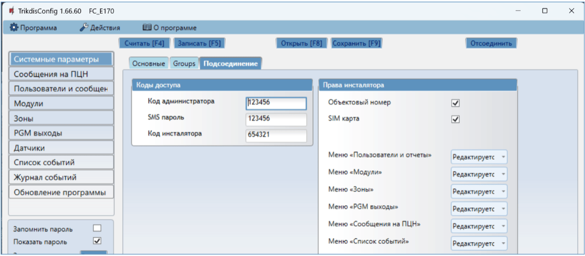

**Группа „Коды доступа“**

- **Код администратора** – (заводской код – 123456) дает полный доступ к конфигурации системы (код должен быть длиной 6 символов, он может состоять из латинских букв и / или цифр). Из соображений безопасности измените его на новый шестизначный код, который будете знать только вы.

- **SMS пароль** – (заводской код – 123456) используется для безопасного управления и программирования SMS сообщениями. Из соображений безопасности измените его на новый шестизначный код, который будете знать только вы.

- **Код инсталлятора** – (заводской код - 654321) дает доступ к конфигурации системы инсталлятору. Из соображений безопасности измените его на новый шестизначный код, который будете знать только вы.

!!! note "Примечание"
    Если установленный код администратора (123456), то программа не будет
    требовать его ввести и после нажатия на кнопку **Считать [F4]** будут
    считаны все значения настроек коммуникатора.
**Группа „Права инсталлятора“**

Администратор устанавливает, какие параметры установщик сможет изменять.

### Окно „Сообщения на ПЦН“ 

**Закладка „Сообщения“**

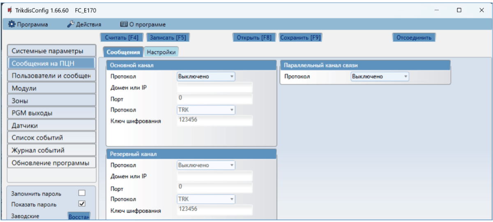

Коммуникатор отправляет сообщения на ПЦН через мобильный (и/или LAN) интернет.

Резервный канал связи используется при нарушении основного канала связи. Сообщения передаются на ПЦН зашифрованными и защищенными паролем. Приемник Trikdis необходим для приема и передачи сообщений на программу мониторинга:

- IP сообщения – программа приема IPCom Windows/Linux, аппаратурный IP/SMS приемник RL14 или многоканальный IP/SMS приемник RM14.

Группа „Основной канал“ („Параллельный канал связи“)

- **Протокол** – выберите протокол связи с приемником (TCP/IP, UPD/IP).

- **Домен или IP** – введите адрес домена или IP адрес приемника.

- **Порт** – введите номер порта приемника в сети.

- **Протокол** – **TRK** передача данных на IP приемники Trikdis, **SIA DC-09** передача данных на универсальные IP приемники (выбрав протокол SIA DC, можно выбрать формат передачи сообщений SIA-DCS), **TL150** передача данных на IP приемники SUR-GARD.

- **Ключ шифрования** - шестизначный ключ шифрования сообщений, который должен совпасть с ключом шифрования приемника ПЦН.

Группа „Резервный канал“ („Параллельный резервный канал“)

Включите „**Резервный канал“** связи. При нарушении „**Основного канала“** связи, сообщения будут передаваться по „**Резервному каналу“** связи. Настройка „**Резервного канала“** производится аналогично настройке „**Основного канала“** связи.

**Закладка „Настройки“**

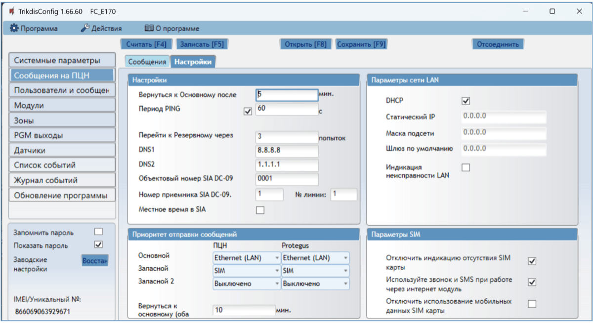

**Группа „Настройки“**

- **Вернуться к Основному после** – время по истечении которого FIRECOM попытается восстановить связь по „Основному каналу“, мин..
- **Период PING** – период отправки внутренних PING сигналов проверки связи. Эти сообщения отправляются только IP каналом связи. Их приемник не передает в программу мониторинга, тем самым не перегружая ее. В программу мониторинга передаются сообщения, когда приемник не получает PING сообщений в установленный период времени.

По умолчанию приемник передаст сообщение о потере соединения „*Connection lost*” на программу мониторинга, если PING сообщение не будет получено в течение времени в три раза превышающем период теста. Например: если установлен „**Период PING“** 3 минуты, то приемник передаст сообщение о нарушении связи на программу мониторинга после 9 минут.

Сообщения PING поддерживают активный сеанс связи между коммуникатором и приемником ПЦН. Активный сеанс связи необходим для удаленной настройки и управления коммуникатором. Рекомендуется устанавливать „**Период PING“** не более 5 минут.

- **Перейти к Резервному через** – указывается число неудачных попыток передать сообщение по „**Основному каналу“** связи, после чего коммуникатор перейдет на „**Резервный канал“** передачи сообщений.

- **DNS1, DNS2** – адреса DNS серверов (заводская настройка – адреса Google DNS серверов).

Настройки активны если в поле „**Протокола“** связи указана **DC-09_2007** или **DC-09_2012** кодировка отправляемых сообщений.

- **Объектовый номер SIA DC-09** – введите номер объекта. Если выбран протокол **SIA DC-09**, то будет использоваться объектовый номер, записанный в этом поле. Можете ввести 3-16-значный шестнадцатеричный номер, который предоставлен охранным предприятием.

- **Номер приемника SIA DC-09** – введите номер приемника.

- **Номер линии SIA DC-09** – введите номер линии в приемнике.

- **Местное время в SIA** – отметьте поле, чтобы в сообщениях, отправляемых на ПЦН, указывалось время установленное в модуле.

**Группа „Приоритет отправки сообщений“**

Устанавливается предпочтительный порядок отправки сообщений по каналам связи на ПЦН и в Protegus2. Типы каналов связи устанавливаются по порядку. Если не удается установить соединение по „**Основному“** каналу связи производится переход на „**Запасной“** канал связи и т.д.. Если удалось передать сообщение по „**Запасному“** каналу связи, то коммуникатор с установленной периодичностью проверит и активно будет пытаться восстановить связь с приемниками ПЦН и с Protegus2 по „**Основному“** каналу связи.

- **Основной** – укажите типы основного канала связи (SIM, Ethernet (LAN)) с приемниками ПЦН и Protegus2.

- **Запасной** – укажите типы запасного канала связи (SIM, Ethernet (LAN)) с приемниками ПЦН и Protegus2.

- **Запасной 2** – укажите типы второго запасного канала связи (SIM, Ethernet (LAN)) с приемниками ПЦН и Protegus2.

- **Вернуться к основному (оба канала)** – с заданной периодичностью (в минутах) коммуникатор будет пытаться восстановить связь с приемником ПЦН и с Protegus2 по указанному „**Основному“** каналу связи.

**Группа „ Параметры сети LAN “**

- **DHCP режим** – выберите режим регистрации к LAN сети (DHCP – автоматический; или ручной – Статический). Отметьте поле (автоматический режим регистрации) и коммуникатор FIRECOM автоматически считает настройки сети (маска подсети, шлюз) и ей будет присвоен IP адрес.

- **Статический IP** – введите статический IP адрес (при ручном режиме регистрации).

- **Маска подсети** – введите маску подсети (при ручном режиме регистрации).

- **Gateway по умолчанию** – введите адрес шлюза (при ручном режиме регистрации).

- **Индикация неисправности LAN** – отметьте поле, чтобы на плате коммуникатора была включена светодиодная индикация отсутствия подсоединения к LAN сети.

**Группа „Параметры SIM“**

- **Отключить индикацию отсутствия SIM карты** – отметьте поле и будет отключена индикация отсутствия SIM карты, когда FIRECOM работает без неё.

- **Используйте звонок и SMS при работе через интернет модуль** – отметьте поле и будет включено управление звонком и SMS сообщениями. Если поле не отмечено и есть LAN сеть, то звонок и SMS сообщения не используются. Если поле не отмечено и отсутствует LAN cеть, то коммуникатором FIRECOM можно управлять звонком и SMS сообщениями. Коммуникатор будет отправлять SMS сообщения пользователю.

- **Отключить использование мобильных данных SIM карты** – отметьте поле, чтобы отключить использование мобильных данных с SIM карты. Данные будут отправляться только через LAN сеть. Если LAN сеть отключится, то данные будут сохраняться в памяти коммуникатора FIRECOM. После восстановления LAN сети, FIRECOM отправит сохраненные данные через LAN сеть.

### Окно „Пользователи и сообщения“ 

**Закладка „Пользователи“**

Группа „Пользователи и сообщения пользователю“

- **№** – порядковый номер пользователя.

- **Имя** – имя пользователя, которое будет записываться в SMS сообщение и в Protegus2.

- **Номер телефона** – номер телефона пользователя, на который будут отправляться SMS сообщения. Номер должен быть введен с международным кодом. Первые 8 номеров в списке получат уведомления о событиях через SMS и звонок.

- **E-mail** – укажите электронную почту пользователя, чтобы он был приглашен в Protegus2 для управления коммуникатором.

- **Вых.** – отметьте поле и пользователь сможет удаленно управлять выходами OUT (звонком, SMS).

- **Отв.** – отметьте поле и FIRECOM будет отвечать SMS сообщением на каждое полученное SMS сообщение.

- **Пер.** – отметьте поле и включите переадресацию SMS сообщений от неизвестных телефонных номеров (например: случайные рекламные сообщения).

**Закладка „Protegus“**

**Группа „Облачное приложение“**

- **Разрешить подключиться** – разрешить доступ к серверу Protegus2. FIRECOM сможет обмениваться данными с приложением Protegus2. С программой TrikdisConfig можно будет удаленно конфигурировать FIRECOM.

- **Передача параллельно** – разрешается параллельная передача сообщений по Основному каналу на ПЦН и в Protegus2.

- **Код доступа к Облаку** – шестизначный код подключения к Protegus2 (заводской код - 123456), который должен совпадать с кодом, указанным в приложении Protegus2.

**Закладка „Тексты SMS ответов“**

**Группа „Текст SMS ответов“**

- Коммуникатор, получив SMS команду управления, может отправить SMS сообщение с ответом. Тексты SMS ответов редактируются в столбце „**Текст SMS“**. Также здесь приведены тексты SMS сообщений, которые используются при активации входов или выходов.

### Окно „Модули“ 

**Закладка „RS485 модули“**

**Группа „RS485 модули“**

- **ID** – порядковый номер модуля.

- **Модуль** – выберите из списка модуль, который будете использовать (модули: iO-8, iO-MO, iO-LORA, iO8-LORA, PB-LORA, REL-LORA).

- **Серийный №** – введите серийный номер модуля, который указан на упаковке или на корпусе модуля.

- **Название** –введите название модуля.

- **Версия прошивки** – будет показана версия прошивки модуля, когда коммуникатор FIRECOM идентифицирует подсоединенный модуль.

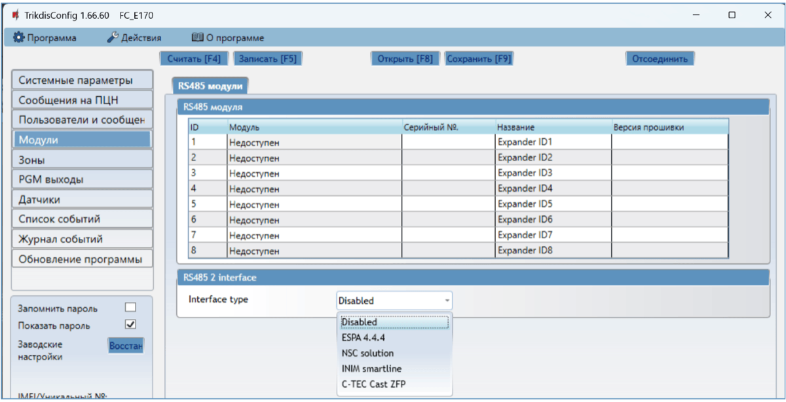

**Группа "RS485 2 interface"**

Пожарные панели (с протоколом **ESPA4.4.4**, **NSC solution**, **INIM Smartline**, **C-TEC Cast ZFP**) могут быть подключены к интерфейсу RS485 2 коммуникатора FIRECOM. Схемы подключения и настройки пожарных панелей приведены в пунктах 3.5-3.8.

### Окно „Зоны“ 

**Закладка „Настройки зон“**

- **№** – порядковый номер зоны.

- **Название** - зоне можно дать имя, которое будет использоваться в SMS-сообщениях и в Protegus2.

- **Вход** – можно выбрать, какой вход FIRECOM или расширителя присвоить зоне.

- **Группа** - назначение зоны группе.

- **Тип** – выберите из списка тип цепи подключаемый к входу IN (зоне). (NC – нормально закрытый контакт; NO – нормально открытый контакт; EOL – с резистором в конце линии; EOL_T – в резистором в конце линии и контролем тампера; ATZ – двух зонная нормально замкнутая цепь с резисторами в конце линии, без контроля тампера (при использовании этого типа в списке зон необходимо выбрать вторую ATZ зону); ATZ_T – двух зонная нормально замкнутая цепь с резисторами в конце линии, с контролем тампера (при использовании этого типа в списке зон необходимо выбрать вторую ATZ зону)).

- **ПЦН** – отметьте поле и сообщения о событиях будут отправляться на ПЦН (пульт централизованного наблюдения).

- **Прот**. – отметьте поле и сообщения о событиях будут отправляться в приложение Protegus2.

- **Реакция** – время реакции входов IN, миллисекунды.

**Закладка „Сообщения SMS и звонком“**

Закладка „Сообщения SMS и звонком“, появится если хоть один номер телефона пользователя будет описан в окне „Пользователи и сообщения“*.* Только для восьми первых пользователей можно сделать эти настройки.

- **Зона** – номер зоны с идентификационным знаком события. Может быть „Событие“ или „Восстановление“.

- **Пользователь SMS/Звонок** – отметьте поле, каким образом пользователь будет информирован о событии в зоне – SMS сообщением и/или Звонком.

**Закладка „Коды зон“**

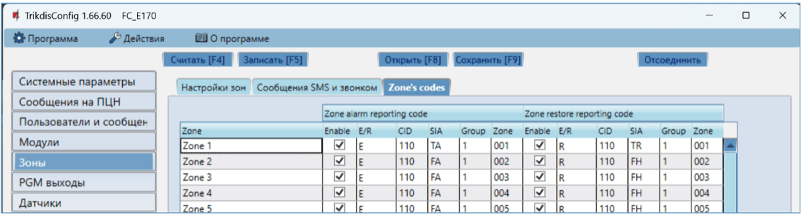

При активации зоны коммуникатор отправит сообщение о событии. Входу назначается код Contact ID (SIA), который будет отправлен ПЦН и Protegus2.

- **Зона** - впишите название зоны.

- **Enable** – отметьте поля событий, которые будут отправлять сообщения в CSP и Protegus2.

- **E/R** - укажите условие отправки события коммуникатором ("Событие" (E) или "Восстановление" (R)).

- **CID** - код события в формате Contact ID.

- **SIA** – код события в формате SIA.

- **Группа** – введите номер группы, который будет отправлен после возникновения cобытия.

- **Зона** - введите номер зоны, который будет отправлен при возникновении cобытия.

### Окно „PGM выходы“ 

**Закладка „Выходы“**

- **№** – порядковый номер выхода.

- **Название** - впишите название PGM выхода.

- **Выход** – назначьте выход FIRECOM или выход расширителя.

- **Описание выхода** – выберите режим работы выхода.

- **Время импульса, с** – установите продолжительность срабатывания выхода OUT в импульсном режиме (0- 9999 секунд).

- **ПЦН** – отметьте поле и на ПЦН будет отправлено сообщение об изменениях состояния выхода.

- **Прот**. – отметьте поле и в приложение Protegus2 будет отправлено сообщение об изменениях состояния выхода.

**Закладка „Действия“**

- **№** – порядковый номер строчки.
- **Вкл.** – отметьте поле и будет включен алгоритм срабатывания выхода OUT.

- **№ PGM** – укажите выход OUT, который будет управляться событиями, указанными в столбцах **„Фактор“, „№ фактора“, „Начать если“, „Значение“.**

- **Действие**:
- **Выкл. PGM** – выключить выход OUT.

- **Вкл. PGM** – включить выход OUT.

- **Выкл. импульсом** – выключение выхода OUT на продолжительность импульса (после получения команды выход выключается на продолжительность импульса и затем включается).

- **Вкл. импульсом** – включить выход OUT на продолжительность импульса (после получения команды выход включается на продолжительность импульса и затем выключается).
- **Время активации, с** – установите длительность импульса срабатывания (0-9999 сек.).

- **Фактор/№ фактора** – устанавливается условие (Вход, SMS получено, Zone tamper), которое определит включение выхода OUT.

  - В закладке** График** можно создать 10 графиков (которые можно назначить выходам OUT), когда выходы OUT должны будут включиться.

- **Начать, если** – можно установить дополнительное условие включения (от события „**Фактора“)** выхода OUT.

- **Значение** – в зависимости от выбранного условия в столбце „**Фактор“,** вы можете установить значение (текст входящего SMS сообщения), которое будет использоваться для управления PGM выходом. Текст SMS сообщения можно выделить знаком %. Знаком % выделяется ключевое слово в полученном SMS сообщении, по которому будет срабатывать PGM выход.

**%…..%** - часть входящего SMS сообщения должна соответствовать тексту записанному между знаками % (например: **%dOm%**. В SMS сообщении должен быть текст „**dOm**“. Пример SMS сообщения: **NadodOmoj**).

**…..%** - начало входящего SMS сообщения должно содержать текст записанного до знака % (например: **dOm%**. SMS сообщение должно начинаться текстом „**dOm**“. Пример SMS сообщения: **dOm1144**).

**%…..** - конец входящего SMS сообщения должен содержать текст записанного после знака % (например: **%dOm**. SMS сообщение должно заканчиваться текстом „**dOm**“. Пример SMS сообщения: **1144dOm**).

В SMS сообщении важны прописные и строчные буквы.

**Закладка „График“**

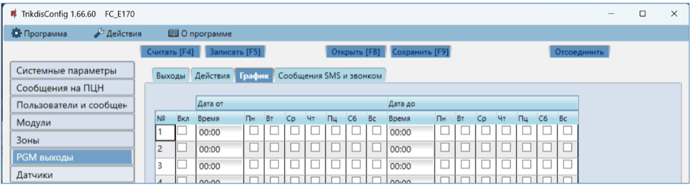

- **№** – порядковый номер графика.

- **Вкл.** – разрешение на включение графика.

- **Дата от** – устанавливается время начала графика, когда выход должен быть включен.

- **Дата до** – устанавливается время конца графика, когда выход должен быть выключен.

- **Пн – Вс** –укажите дни недели, когда выход должен быть включен/выключен.

**Закладка „Сообщения SMS и звонком“**

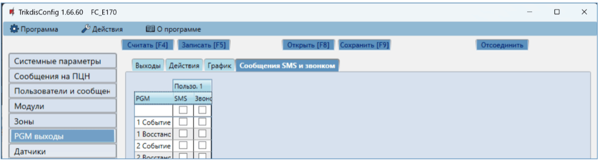

Закладка „Сообщения SMS и звонком“, появится если хоть один номер телефона пользователя будет описан в окне „Пользователи и сообщения“*.* Только для восьми первых пользователей можно сделать эти настройки.

- **PGM** – указывается номер выхода и тип события Событие/Восстановление (Событие – включение выхода OUT / Восстановление – выключение выхода OUT).

- **Пользователь SMS/Звонок** **–** можете выбрать каким образом (SMS сообщением и/или Звонком) пользователь будет информирован о включении/выключении выхода OUT.

### Окно „Датчики“ 

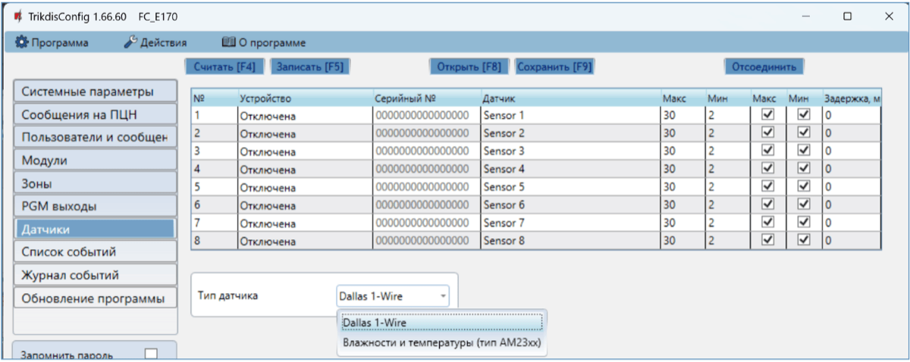

- **№** – порядковый номер датчика температуры.

- **Устройство** – датчик температуры (FIRECOM автоматически определяет подключенные датчики температуры).

- **Серийный номер** – серийный номер датчика температуры, который считывает коммуникатор.

- **Датчик** – введите название датчика температуры.

- **Макс** – наибольшее значение температуры, выше которого будет сформировано сообщение о событии. Чтобы сообщение было отправлено должно быть отмечено поле „**Макс“.**

- **Мин** – наименьшее значение температуры, ниже которого будет сформировано сообщение о событии. Чтобы сообщение было отправлено должно быть отмечено поле „**Мин“.**

- **Задержка** – событие будет отправлено, если измеренное значение („Макс“ или „Мин“) датчиком будет превышено в течении установленного времени. Время задержка вводится в минутах.

- **Тип датчика** – укажите тип датчика температуры: „**Dallas 1Wire“** – можно подключить до 8 шт. датчиков температуры, которые будут автоматически зарегистрированы коммуникатором; „**Влажности и температуры“** – можно подключить один АМ2301 датчик температуры и влажности. В столбце „**Устройство“** необходимо вручную указать датчик.

### Окно „Список событий“ 

**Закладка „Внутренние события“**

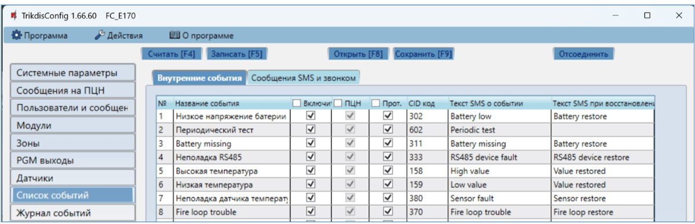

- **№** – порядковый номер события.

- **Название события** – наименование события.

- **Включить** – отметьте поле и будет разрешено отправлять сообщение о событии.

- **ПЦН** – отметьте поле и сообщения будут отправляться на ПЦН (пульт централизованного наблюдения).

- **Прот**. – отметьте поле и будет разрешено отправлять сообщения в Protegus2 сервис.

- **CID код** –код события в формате Contact ID.

- **Текст SMS о событии** – текст SMS сообщения о событии.

- **Текст SMS при восстановлении** - текст SMS сообщения при восстановлении события.

**Закладка „Сообщения SMS и звонком“**

Закладка „Сообщения SMS и звонком“, появится если хоть один номер телефона пользователя будет описан в окне „Пользователи и сообщения“*.* Только для восьми первых пользователей можно сделать эти настройки.

- **№** - номер и тип события Событие/Восстановление.

- **Текст SMS о событии** – текст события, который будет включен в SMS сообщение.

- **Пользователь SMS/Звонок** – отметьте поле, каким способом (SMS сообщением и/или звонком) пользователь будет извещен о событии.

### Окно „Журнал событий“ 

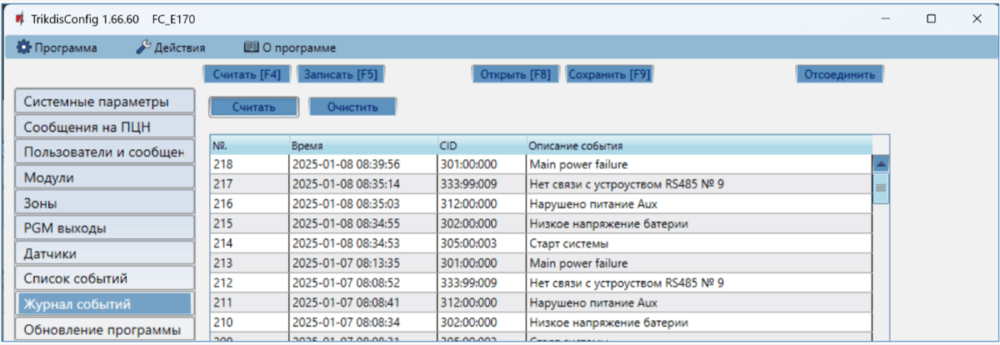

- Нажать кнопку „**Считать“** – будет считан журнал событий из памяти FIRECOM.

- Кнопка „**Очистить“** – если ее нажать, то будет очищен журнал событий в памяти FIRECOM.

- В таблице указаны „**№“** события**, „Время“, „CID“, „Описание события“**. В памяти FIRECOM может храниться до 1000 событий.

### Восстановление заводских настроек 

Для восстановления заводских настроек коммуникатора FIRECOM необходимо в программном окне TrikdisConfig нажать кнопку „**Восстановить“.**

## Удаленная настройка параметров 

!!! note "Примечание"
    Удаленная настройка параметров коммуникатора FIRECOM возможна,
    если:
    
    1.  Установлена активированная SIM карта и введен или отключен PIN код.
    
    2.  Включен Protegus2 сервис, см. п. 6.4 Окно „Пользователи и
        сообщения".
    
    3.  Включено напряжение питания (мигает зеленый индикатор „**STA**").
    
    4.  FIRECOM подключен к сети (горит зеленый и мигает желтым
        индикатор „**STA**"; и/или горит зеленый индикатор „**ETH**", когда
        подключен к LAN сети).
    
    Если горит желтый „**SIM**" индикатор или горит желтый „**DAT**"
    индикатор, то коммуникатор не может подключиться к сети мобильной связи
    и/или Protegus2 сервису.
1.  В компьютере запустите программу TrikdisConfig.

2.  В поле „**Уникальный №“** введите IMEI номер FIRECOM, который указан на упаковке или на изделии.

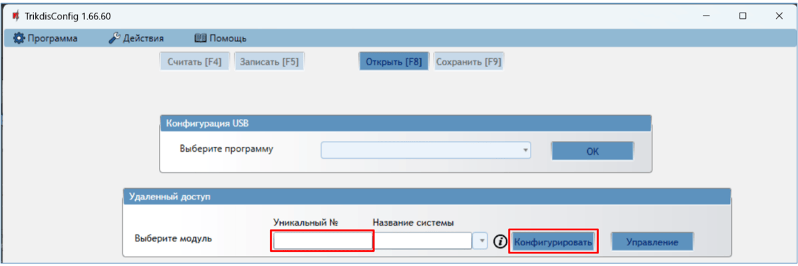

3. В поле „**Название системы“** напишите название объекта.

2.  Нажмите кнопку „**Конфигурировать“.**

3.  Откроется программное окно FIRECOM. Нажмите кнопку **Считать [F4],** чтобы были считаны настройки коммуникатора***.*** Если всплывет окно запроса ввода „**Кода администратора“**, введите 6-значный код администратора. Отметьте поле рядом с „**Запомнить пароль“** и нажмите кнопку **Записать [F5]**.

4.  Сделайте необходимые настройки для FIRECOM. Запишите эти изменения в FIRECOM, нажав на кнопку **Записать [F5]**. Нажмите кнопку „**Отсоединить“** и выйдите из программы TrikdisConfig.

## Тестирование коммуникатора 

После завершения настроек выполните тестирование системы:

1.  Проверьте входы IN коммуникатора. Активируйте вход коммуникатора. И убедитесь, что сообщения получены на ПЦН и приложением Protegus2.

2.  Проверьте выходы OUT коммуникатора. Удаленно активируйте выход коммуникатора. И убедитесь, что сообщения получены на ПЦН и приложением Protegus2.

3.  Выполните тестирование пожарной панели. И убедитесь, что ПЦН получает полную информацию о событиях.

## Обновление прошивки коммуникатора 

!!! note "Примечание"
    Подключите FIRECOM к TrikdisConfig. Если есть новая прошивка
    для FIRECOM, то TrikdisConfig предложит обновить прошивку.
    Для обновления прошивки должно быть подключение к сети интернет. / Если
    в компьютере установлена антивирусная программа, то она может
    блокировать функцию автоматического обновления программного обеспечения.
    В этом случае придется изменить настройки в антивирусной программе.
Прошивку коммуникатора FIRECOM можно обновить или заменить вручную. После обновления все ранее установленные параметры FIRECOM остаются. Прошивка может быть заменена на новую или на старую версию.

1.  Запустите программу TrikdisConfig.

2.  Подключите к компьютеру FIRECOM с помощью кабеля USB Type-C или подсоединитесь удаленно. Если есть новая прошивка изделия, то TrikdisConfig предложит обновить программное обеспечение FIRECOM.

3.  В программе TrikdisConfig откройте окно „**Обновление программы“.**

4.  Нажмите кнопку „**Открыть файл“** и выберите нужный файл для установки.

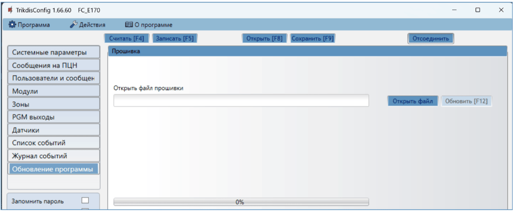

5. Нажмите кнопку **Обновить [F12]**.

2.  Подождите, пока произойдет обновление программного обеспечения.

## Требования безопасности 

Устанавливать и обслуживать коммуникатор могут только квалифицированные специалисты.

Перед установкой изделия внимательно ознакомьтесь с данным руководством, чтобы избежать ошибок при монтаже из-за чего оборудование будет плохо работать и может быть испорчено.

Выполняя работы по установке оборудования, обязательно должно быть выключено его внешнее питание.

Изменения внесенные в конструкцию изделия, самостоятельный ремонт лишают изделие гарантии производителя.

Соблюдайте нормы местного законодательства и не утилизируйте изделие или его компоненты вместе с другими бытовыми отходами.
