# GSM коммуникатор G17F

  

## Описание 

Коммуникатор G17F соответствует требованиям стандарта EN 54-21:2006.

Изделие соответствует требованиям стандарта EN54-21, Приложение A, для системы передачи типа 1.

Сертификат коммуникатора G17F №: 1922-CPR-1974. Системы обнаружения пожара и пожарной сигнализации. Передача сигнала и ошибочное предупреждение оборудования для прокладки.

Изделие сертифицировано уполномоченным учреждением по сертификации продукции: No.1922 "Dedal", Nesebar Mladost str. 50, Bulgaria, 8230

Контакты технической поддержки Trikdis: support@trikdis.lt, +37067422877.

Коммуникатор G17F предназначен для передачи сообщений пожарной панели через сети мобильной связи.

Принцип работы. При активации входа (зоны) коммуникатора, коммуникатор G17F отправит сообщение на ПЦН (пульт централизованного наблюдения) или в приложение Protegus2 через мобильный интернет. Коммуникатор может отправлять SMS сообщения и звонить. G17F может быть с 2G или 4G модемами.

**Функциональность**

Сообщения охранному предприятию

- Отправляет сообщения на Trikdis программные или аппаратурные приемники, которые работают с любой программой мониторинга.

- Может отправлять сообщения на приемники SIA DC-09.

- Отправляет сообщения на резервный приемник ПЦН при нарушении основного канала связи.

- Передача сообщений на пульт (ПЦН) SMS сообщениями. Приемник ПЦН получает SMS сообщения, даже если нарушается IP связь в сети оператора мобильной связи.

- Распознавание глушения мобильной связи.

- Может одновременно отправлять сообщения на ПЦН и в приложение *Protegus2*. Можно установить приоритет сообщениям, отправляемым на пульт.

- Сообщения о событиях передаются Contact ID кодами.

Сообщения пользователям

- Звонки на указанные телефонные номера (до 8 номеров пользователей).

- Отправляет SMS сообщения.

- „Push“ и специальные звуковые сообщения о событиях через приложение Protegus2.

**Удаленное управление выходами**

- Применяя приложение Protegus2.

- Звонком на номер SIМ карты, установленной в коммуникатор.

- Используя SMS сообщения.

**Настройки и установка**

- Быстрая и простая установка.

- Настройка осуществляется программой TrikdisConfig, подключив коммуникатор G17F к компьютеру кабелем USB Mini-B или удаленно.

- Удаленное обновление прошивки коммуникатора.

- Два уровня установки параметров: администратора и установщика.

**Входы и выходы**

- 3 входа. Тип: NO, NC, EOL (4,7кΩ, 10 кΩ).

- 3 универсальных I/O контакта, которые можно установить, как вход (IN) или как выход (OUT). Тип входа: NO, NC, EOL (4,7кΩ, 10 кΩ).

- Шина RS485 для подключения модулей расширения iO.

- Используя расширители серии iO, количество входов (IN) и выходов (OUT) может быть увеличено до 12.

### Технические параметры

| **Параметр** | **Описание** |
|:---|----|
| Частота GSM/​GPRS модема | 850 /​ 900 /​ 1800 /​ 1900 MГц |
| Частота LTE модема | 700 /​ 800 /​ 900 /​ 1800 /​ 2100 /​ 2600 MГц |
| Напряжение источника питания | 9-32 В постоянного тока. |
| Потребляемый ток | 50 мA (в режиме ожидания). /​ До 200 мA (в режиме передачи данных). |
| Протокол связи | TRK, SIA DC-09_2007, SIA DC-09_2012 |
| Шифрование | Шестизначный ключ шифрования |
| Канал связи с ПЦН | TCP/​IP или UDP/​IP или SMS |
| Коды событий | Contact ID коды |
| Память | До 60 сообщений |
| Входы и выходы | 3 входа. Тип: NO, NC, EOL (4,7кΩ, 10 кΩ) /​ 3 универсальных контакта (IN/​OUT), могут быть установлены как вход (тип: NO, NC, EOL (4,7кΩ, 10 кΩ)) или как выход (тип открытый коллектор, ток до 0,1 А) |
| Память событий | До 1000 событий |
| Установка параметров | С программой TrikdisConfig удаленно или подключив к компьютеру через USB Mini-B. Удаленно с помощью SMS сообщений. |
| Длина шины данных *RS485* | До 100 м |
| Поддерживаемые модули | iO – модуль расширения;​ /​ iO-WL - iO-MO – iO-WL радиоволновой приемник;​ /​ iO-8 - модуль расширения;​ /​ E485 – модуль „Ethernet“ ;​ /​ W485(W17u) – модуль WiFi;​ /​ iO-LORA – модуль расширения;​ /​ iO8-LORA – модуль расширения;​ /​ **PB-LORA** – тревожная кнопка;​ /​ **REL-LORA** - модуль расширения;​ /​ **INIM Smartline** – пожарная панель;​ /​ **NSC Solution** - пожарная панель;​ /​ **C-TEC Cast ZFP** – пожарная панель;​ /​ Пожарная панель с протоколом **ESPA 4.4.4**. |
| Условия эксплуатации | Температура от -10°C од +50°C, относительная влажность 0 - 80% при +20°C. |
| Размеры | 92 x 62x 25 мм |
| Вес | 80 г |

### Элементы коммуникатора G17F 

1.  Разъем SMA для GSM антенны.

2.  Световые индикаторы.

3.  Щель для снятия крышки коммуникатора.

4.  Клеммы для подключения внешних устройств.

5.  USB Mini-B для программирования коммуникатора.

6.  Держатель SIM карты.

### Клеммы 

| Клемма | Описание |
|--------|----------|
| +DC | Положительная клемма подключения питания (9-32 В постоянного тока) |
| -DC | Отрицательная клемма подключения питания (9-32 В постоянного тока) |
| 1 IN | Клемма входа №1. Тип: NO, NC, EOL (4,7кΩ, 10 кΩ) (заводская уставка: вход EOL =10 кΩ) |
| 2 IN | Клемма входа №2. Тип: NO, NC, EOL (4,7кΩ, 10 кΩ) (заводская уставка: вход EOL =10 кΩ) |
| COM | Общая (отрицательная) клемма |
| 3 I/​O | Универсальная клемма (вход/​выход) №3. Может быть установлена как вход (тип: NO, NC, EOL (4,7кΩ, 10 кΩ)) или как выход (тип открытый коллектор, ток до 0,1 А). Заводская уставка: вход EOL =10 кΩ |
| 4 I/​O | Универсальная клемма (вход/​выход) №5. Может быть установлена как вход (тип: NO, NC, EOL (4,7кΩ, 10 кΩ)) или как выход (тип открытый коллектор, ток до 0,1 А). Заводская уставка: вход EOL=10 кΩ |
| COM | Общая (отрицательная) клемма |
| 5 I/​O | Универсальная клемма (вход/​выход) №5. Может быть установлена как вход (тип: NO, NC, EOL (4,7кΩ, 10 кΩ)) или как выход (тип открытый коллектор, ток до 0,1 А). Заводская уставка: вход EOL=10 кΩ |
| 6 IN | Клемма входа №6. Тип: NO, NC, EOL (4,7кΩ, 10 кΩ) (заводская уставка: вход EOL =10 кΩ) |
| A RS485 | Шина RS485 для подключения расширителей iO, пожарной панели INIM Smartline, пожарной панели NSC Solution, пожарной панели C-TEC Cast ZFP, пожарной панели с протоколом ESPA4.4.4, модулей E485 ir W485 |

### Световая индикация 

| Индикатор | Статус | Описание |
|-----------|--------|----------|
| Network / (Сеть) | Выключен | Нет связи с мобильной сетью |
| Network / (Сеть) | Светит зеленым и мигает желтым цветом | Коммуникатор подключен к GSM сети. Достаточный уровень GSM сигнала – 5 уровень (пять желтых вспышек). Достаточный уровень сигнала 4G сети – 3 уровень (три желтых вспышки). |
| Data / (Данные) | Зеленый | Отправление сообщения |
| Data / (Данные) | Желтый | Есть неотправленные сообщения в памяти |
| Power / (Питание) | Мигает зеленый | Хороший уровень питающего напряжения |
| Power / (Питание) | Мигает желтый | Низкий уровень питающего напряжения |
| Power / (Питание) | Мигает зеленый и желтый | Включен режим конфигурации |
| Trouble / (Неисправность) | Выключен | Нет неисправностей |
| Trouble / (Неисправность) | 1 вспышка | Нет SIM карты |
| Trouble / (Неисправность) | 2 вспышки | Неправильный код SIM-карты |
| Trouble / (Неисправность) | 3 вспышки | Не удается подсоединиться к GSM сети |
| Trouble / (Неисправность) | 4 вспышки | Не удается подключиться к IP приемнику по основному каналу |
| Trouble / (Неисправность) | 5 вспышек | Не удается подключиться к IP приемнику по резервному каналу |
| Trouble / (Неисправность) | 6 вспышек | Не установлены внутренние часы G17F |
| Trouble / (Неисправность) | 7 вспышек | Низкий уровень напряжения питания |
| Trouble / (Неисправность) | 9 вспышек | Нет связи с устройствами по RS485 |

### Материалы необходимые для монтажных работ 

Перед началом монтажных работ убедитесь, что имеете:

1.  USB Mini-B кабель, который необходим для конфигурации.

2.  4-жильный кабель для подключения коммуникатора к пожарной панели.

3.  Отвертку с плоским 2,5 мм жалом.

4.  Внешняя GSM антенна, если связь в месте установки слабая.

5.  Активированную SIM карту (запрос PIN кода может быть отключен).

6.  Инструкция пожарной панели, к которой будет подключен коммуникатор.

Необходимые материалы закажите у местного продавца.

## Быстрая настройка с программой *TrikdisConfig* 

1.  Загрузите программу конфигурации TrikdisConfig со странички [www.trikdis.com/ru](http://www.trikdis.com/ru)/ (в поле поиска напишите „TrikdisConfig“), и установите ее на компьютер.

2.  Плоской отверткой снимите крышку, как показано на рисунке.

1.  Кабелем USB Mini-B подключите G17F к компьютеру.

2.  Запустите программу TrikdisConfig. Программа автоматически определит подключенное изделие и откроет окно конфигурации G17F.

3.  Нажмите на кнопку **Считать [F4]**, чтобы скачать установленные параметры в G17F. Если необходимо введите код администратора или инсталлятора.

Ниже мы опишем настройки, которые необходимо изменить, чтобы коммуникатор начал отправлять сообщения в приложение Protegus2 или на ПЦН (пульт централизованного наблюдения).

### Настройки связи с приложением Protegus2 

Окно „Пользователи и сообщения“ группа „Сервис PROTEGUS“:

1.  Отметьте поле „**Разрешить подключиться“**, чтобы разрешить доступ к серверу Protegus.

2.  Измените код доступа к облаку **Protegus**. Пользователю придется ввести код доступа при добавлении коммуникатора к приложению Protegus2 (заводской код - 123456).

**Окно „Системные параметры“ группа „SIM“:**

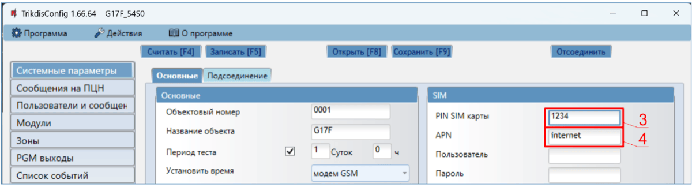

3. Введите „**PIN SIM карты“**.

2.  Введите имя „**APN“**. „**APN“** можно найти на страничке оператора мобильной связи. „Internet” является универсальным и работает в сетях многих операторов мобильной связи.

**Окно „Зоны“:**

3. Отметьте поле, если хотите, чтобы пользователь получал сообщения в Protegus2 об изменениях статуса зоны.

**Окно „PGM выходы“:**

4. Отметьте поле, если хотите, чтобы пользователь получал сообщения в Protegus2 об изменениях состояния PGM выходов.

**Окно „Список событий“:**

5. Отметьте поле, если хотите, чтобы пользователь получал сообщения в Protegus2 об изменениях внутренних событий коммуникатора.

Закончив конфигурацию, нажмите кнопку **Записать [F5]**. Отсоедините USB кабель.

!!! note
    Дополнительная информация о других настройках G17F рассмотрена в
    п. 5 „Настройка рабочих параметров с TrikdisConfig**".**
### Настройки связи с ПЦН 

**Окно „Системные настройки“:**

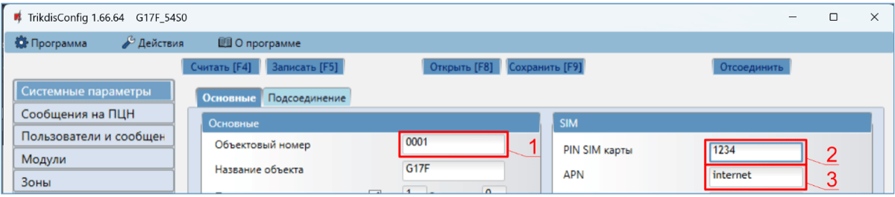

1.  Введите „**Объектовый номер“ (не используйте FFFE, FFFF объектовые номера**.**)**.

2.  Введите „**PIN SIM карты“**.

3.  Введите имя „**APN“**. Имя „**APN“** можете найти на страничке оператора мобильной связи. „Internet” – универсален и работает в сетях многих операторов.

**Окно „Сообщения на ПЦН“:**

4. **Протокол** – выберите режим связи (не рекомендуем использовать SMS в качестве основного канала).

2.  **Домен или IP** – введите адрес домена или IP адрес приемника.

3.  **Порт** – введите номер порта приемника в сети.

4.  **Протокол** – выберите кодировку для отправления сообщений на ПЦН: **TRK** (на приемник TRIKDIS), **DC-09_2007** или **DC-09_2012** (на универсальные приемники).

5.  **Ключ шифрования** – введите ключ шифрования, который установлен в приемнике ПЦН.

!!! note
    Для установления связи с ПЦН с помощью SMS сообщений необходимо ввести
    „**Ключ шифрования"** и „**Номер телефона"**. SMS сообщения могут быть
    приняты Trikdis IP/SMS приемником **RL14**, многоканальным IP/SMS
    приемником **RM14** или SMS приемником **GM14**. / Если выбрали
    кодировку сообщений DC-09, то необходимо дополнительно ввести в группе
    **Настройки:** **Объектовый номер SIA DC-09**; **Номер приемника
    SIA DC-09**; **Номер линии SIA DC-09**.
1.  (Рекомендуется) Настройте параметры „**Резервного канала“**.

2.  (Рекомендуется) Введите номер телефона для канала связи „**Резервный 2“**.

Закончив конфигурацию, нажмите кнопку **Записать [F5]**. Отсоедините USB кабель.

!!! note
    Дополнительная информация о других настройках G17F рассмотрена в
    п. 5 „Настройка рабочих параметров с TrikdisConfig **".**
## Установка и схема соединений 

### Установка 

1.  Перед установкой убедитесь, что на месте, где будет установлен *G17F*, есть устойчивый GSM сигнал.

2.  Снимите верхнюю крышку. Снимите клеммные колодки.

3.  Снимите плату.

4.  Корпус прикрепите шурупами.

5.  Обратно установите плату и клеммные колодки.

6.  Подсоедините GSM антенну.

7.  Вставьте nano-SIM-карту. SIM-карта должна быть зарегистрирована в сети GSM с уже активированными и работающими услугами, например, с возможностью совершать звонки, отправлять и получать SMS, а также иметь мобильный интернет. За информацией о том, как активировать необходимые услуги, обратитесь к оператору мобильной связи вашей SIM-карты.

!!! note
    Убедитесь, что SIM-карта активирована. / Убедитесь, что включена услуга
    мобильного интернета, если будет использоваться передача данных по IP
    каналу или приложение Protegus2. / У SIM-карты должен быть
    отключен запрос PIN кода.
8. Чтобы конфигурировать G17F удаленно, вставьте SIM карту с выключенным запросом PIN кода. Включите питание G17F. Отправьте SMS сообщение на номер SIM-карты G17F, чтобы включить Protegus сервис:

#### CONNECT 123456 PROTEGUS=ON,APN=INTERNET

1.  Удаленная конфигурация G17F описана в п. 6 „Удаленная настройка параметров“.

2.  Закройте верхнюю крышку.

### Схема подключения пожарной панели и коммуникатора G17F 

Для мониторинга состояния пожарной панели подключите её соответствующие выходы к входам G17F. Выходы пожарной панели управления (PGM1, PGM2, PGM3) должны быть настроены как выходы состояния панели управления (Тревога, Неисправность и т. д.).

## Схема подключения пожарной панели ESPA4.4.4 и коммуникатора G17F 

Настройки коммуникатора G17F с помощью TrikdisConfig при подключении к пожарной панели ESPA4.4.4.

1.  Выберите пожарную панель „**ESPA4.4.4“**.

2.  Выберите скорость передачи данных интерфейса.

3.  Параметры передачи данных коммуникатора G17F и пожарной панели должны быть одинаковыми.

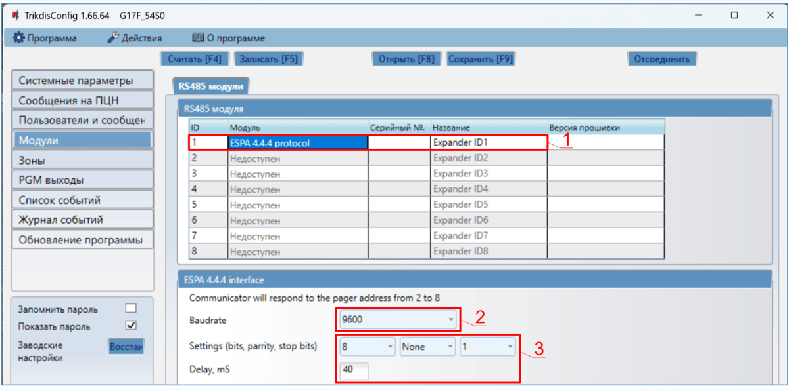

4. Укажите номера телефонов пользователей, которым коммуникатор G17F должен отправлять сообщения.

5. Отметьте поле и пользователь будет информирован SMS сообщением и/или звонком.

6. Настройте канал связи, если сообщения будут отправляться на приемник ПЦН. Сообщения о событиях передаются по протоколу SIA DC-09.

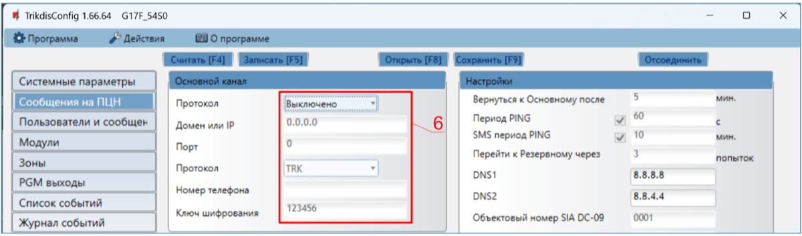

Протестируйте систему. Активируйте пожарную сигнализацию и убедитесь, что G17F отправляет сообщения на ПЦН и в приложение Protegus2.

## Схема подключения пожарной панели NSC Solution и коммуникатора G17F 

Настройки коммуникатора G17F с помощью TrikdisConfig при подключении к пожарной панели **NSC Solution**.

1.  Выберите пожарную панель „**NSC Solution“**.

2.  „**NSC slave address**“ не должен совпадать с адресами подключенных модулей пожарной панели.

3. Укажите номера телефонов пользователей, которым коммуникатор G17F должен отправлять сообщения.

4. Отметьте поле и пользователь будет информирован SMS сообщением и/или звонком. Дополнительные „**CID“** коды событий могут быть добавлены в столбце „**CID“.** Новым „**CID“** кодам необходимо записать тексты SMS сообщений в столбце „**Текст в SMS“**. Чтобы пользователь был информирован о событии SMS сообщением и/или звонком, отметьте соответствующие поля.

5. Настройте канал связи, если сообщения будут отправляться на приемник ПЦН.

После настройки коммуникатора G17F включите питание пожарной панели управления. Дождитесь загрузки программного обеспечения. Панель управления должна выполнить сканирование модулей, подключенных к шине RS485. На панели управления нажмите: PROG.>INSTALLER>(введите код инсталлятора) 00000 OK>(выберите) SETTINGS>ENTER>(выберите) SCAN RS485>ENTER. Дождитесь завершения сканирования. Чтобы вернуться на главный экран, дважды нажмите „**CANCEL**“.

Протестируйте систему. Активируйте пожарную сигнализацию и убедитесь, что G17F отправляет сообщения на ПЦН и Protegus2.

### Схема подключения пожарной панели INIM Smartline и коммуникатора G17F 

Пожарной панели **INIM Smartline** необходимо установить ведомый (Slave) режим работы, когда коммуникатор G17F подключен через шину RS485 к пожарной панели.

!!! note
    Если к пожарной панели **INIM Smartline** подключены повторители, то
    коммуникатор G17F нельзя подключить к шине RS485. / Если
    коммуникатор G17F подсоединен к шине RS485 пожарной панели
    **INIM Smartline,** то не поддерживаются iO модули расширения
    коммуникатора.
Настройка параметров коммуникатора для работы с пожарной панелью INIM Smartline

**Окно „Модули“:**

1.  Выберите модуль „**INIM Smartline“**.

**Окно „Пользователи и сообщения“:**

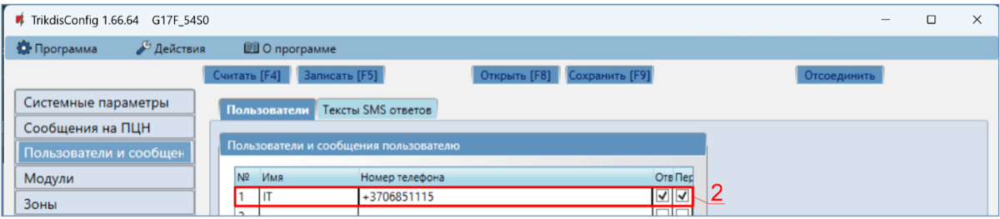

2. Укажите номера телефонов пользователей, которым коммуникатор G17F должен отправлять сообщения.

3. Отметьте поле и пользователь будет информирован SMS сообщением и/или звонком. Дополнительные „**CID“** коды событий могут быть добавлены в столбце „**CID“.** Новым „**CID“** кодам необходимо записать тексты SMS сообщений в столбце „**Текст в SMS“**. Чтобы пользователь был информирован о событии SMS сообщением и/или звонком, отметьте соответствующие поля.

2.  Настройте канал связи, если сообщения будут отправляться на приемник ПЦН.

Протестируйте систему. Активируйте пожарную сигнализацию и убедитесь, что G17F отправляет сообщения на ПЦН и Protegus2.

### Схема подключения пожарной панели управления C-TEC Cast ZFP и коммуникатора G17F

Настройки коммуникатора G17F с помощью TrikdisConfig при подключении к пожарной панели **C-TEC Cast ZFP**.

1.  Выберите пожарную панель **C-TEC Cast ZFP**.

1.  Укажите номера телефонов пользователей, которым коммуникатор G17F должен отправлять сообщения.

2. Отметьте поле и пользователь будет информирован SMS сообщением и/или звонком. Дополнительные „**CID“** коды событий могут быть добавлены в столбце „**CID“.** Новым „**CID“** кодам необходимо записать тексты SMS сообщений в столбце „**Текст в SMS“**. Чтобы пользователь был информирован о событии SMS сообщением и/или звонком, отметьте соответствующие поля.

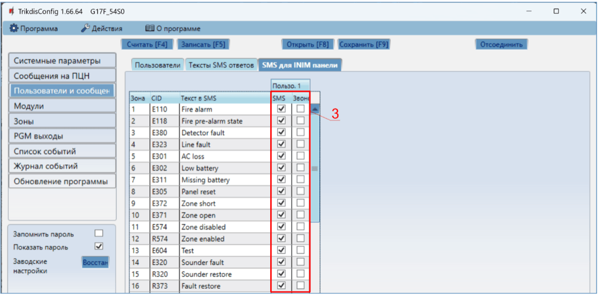

3. Настройте канал связи, если сообщения будут отправляться на приемник ПЦН.

Установите программу **ZFPtools** на компьютер. Запустите программу **ZFPtools**. Включите питание пожарной панели. Дождитесь загрузки программного обеспечения пожарной панели. Подключите пожарную панель к компьютеру с помощью кабеля USB 2.0 A-B.

4. Откройте вкладку „**Node View**“.

5. Считайте настройки пожарной панели.

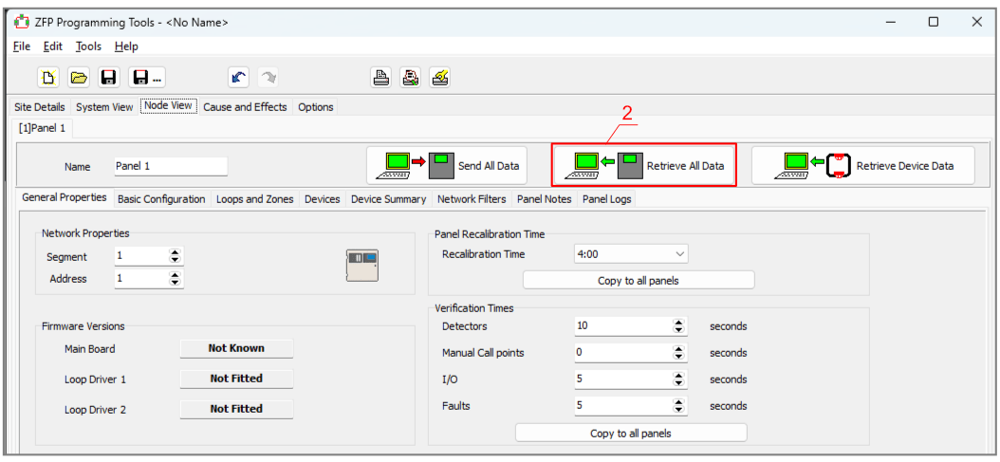

6. Введите код (заводской код – 4444).

2.  Нажмите „ОК“.

3. Выберите „**BMS Interface**“.

2.  Нажмите на свободную иконку.

11. Нажмите „**Edit Devices**“.

12. Во вкладке „**Device**“ введите название системы.

13. Во вкладке „**Properties**“ введите название системы.

14. Укажите интерфейс „**ABUS RS485**“, к которому подключен коммуникатор G17F.

15. Настройте уведомления.

16. Сохраните настройки в пожарной панели.

17. Введите код (заводской код – 4444).

18. Нажмите „OK“.

Пожарная панель запрограммирована. Отсоедините кабель USB2.0 A-B от пожарной панели.

Протестируйте систему. Активируйте пожарную сигнализацию и убедитесь, что G17F отправляет сообщения на ПЦН и Protegus2.

### Схемы подключения входов IN 

Коммуникатор имеет шесть (1IN – 6IN) клемм входов. Три клеммы универсальные (IN/OUT), которым можно установить тип NO, NC, EOL (4,7кΩ, 10 кΩ). Заводская настройка – EOL. Другой тип входа может быть установлен в TrikdisConfig в окне „Зоны“. Схемы соединений для NO, NC, EOL типов входов:

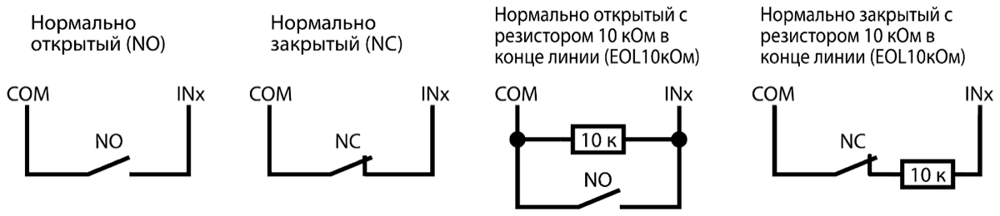

### Схема подключения расширителей серии iO 

Для увеличения количества входов и выходов подключите проводные или беспроводные iO расширители.

### Схема подключения расширителя iO-8 

Если вам необходимо, чтобы коммуникатор имел больше входов IN или выходов OUT, подключите проводной расширитель *iO-8*.

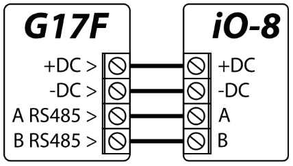

### Схема подключения расширителей серии LORA 

Схема подключения модулей расширения LORA.

### Схема подключения WiFi модуля W485 

Версия прошивки контроллера *G17F* от 1.08. / Модуль *W485* предназначен для передачи сообщений и управления через Wi-Fi компьютерную сеть. Используя *W485* вместе с *G17F*, сообщения на ПЦН и в *Protegus2* передаются через Wi-Fi компьютерную сеть и мобильный интернет не используется. При нарушении связи в Wi-Fi сети данные передаются через сеть мобильного интернета. При восстановлении Wi-Fi связи *G17F* начинает вновь отправлять сообщения через *W485*. / Конфигурация *G17F* с Wi-Fi модулем *W485* описана в п. 5.5 „Окно „Модули““. / SIM карта не обязательна, когда модуль *W485* используется вместе с *G17F*.

### Схема подключения “Ethernet” модуля E485 

Версия прошивки контроллера *G17F* от 1.08. / Модуль *Е485* предназначен для передачи сообщений и управления через проводную компьютерную сеть. Используя *Е485* вместе с *G17F,* сообщения на ПЦН и в *Protegus2* передаются через проводную компьютерную сеть и мобильный интернет не используется. При нарушении связи в компьютерной сети данные передаются через сеть мобильного интернета. При восстановлении связи в компьютерной сети *G17F* начинает вновь отправлять сообщения через *Е485*. / Конфигурация *G17F* с „Ethernet“модулем *Е485* описана в п. 5.5 „Окно „Модули““. / SIM карта не обязательна, когда модуль *E485* используется вместе с *G17F*.

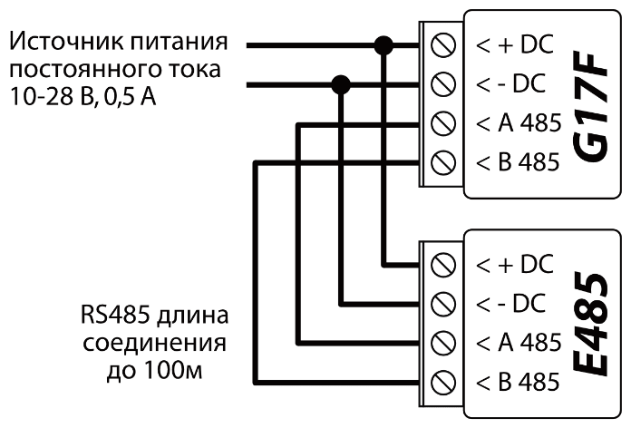

### Включение коммуникатора 

Коммуникатор G17F подключен к пожарной панели. Подайте напряжение питания пожарной панели, чтобы включить коммуникатор. Если коммуникатор G17F работает нормально, то должны загореться следующие индикаторы:

- Индикатор „POWER“ светится зеленым цветом (достаточный уровень напряжения).

- Индикатор „NETWORK“ светится зеленым цветом и мигает желтым, когда коммуникатор зарегистрировался в сети мобильной связи.

!!! note
    Достаточный уровень GSM сигнала -- 5 (5 вспышек желтого цвета индикатора
    „NETWORK"). Достаточный уровень 4G сигнала -- 3 (3 вспышки желтого цвета
    индикатора „NETWORK"). Уровень сигнала мобильной связи недостаточный,
    если сосчитаете менее 3 вспышек желтого цвета индикатора „NETWORK".
    Рекомендуем выбрать другое место установки коммуникатора или
    использовать более чувствительную GSM антенну. / Описание световой
    индикации индикаторов смотрите в п. 1.4 „Световая индикация". / Если не
    горят индикаторы коммуникатора, то проверьте источник питания и
    подключения проводов.
## Удаленное управление 

### Регистрация коммуникатора в Protegus2 облаке 

С Protegus2 пользователи могут видеть состояние системы и получать сообщения о событиях.

1.  Скачайте и запустите приложение Prоtegus2 или используйте браузерную версию [www.protegus.app](https://www.protegus.app):

2.  Подключитесь к системе с помощью своего имени и пароля или создайте новую учетную запись.

!!! note
    При добавлении коммуникатора G17F к Protegus2 должно быть:
    
    1.  Установлена активированная SIM-карта и введен или отключен PIN код.
    
    2.  Включен Protegus сервис. См. в п. 5.4 Окно „Пользователи и
        сообщения".
    
    3.  Включено питание коммуникатору (горит зеленый индикатор „POWER").
    
    4.  Коммуникатор G17F подключен к сети мобильной связи (горит
        зеленым и мигает желтым индикатор „NETWORK").
3. Нажмите „Добавить объект“ и введите „IMEI“ номер *G17F*, который найдете на изделии или на упаковке. Нажмите кнопку „Далее“.

### Конфигурация и управление SMS сообщениями 

1.  **Изменение пароля администратора**

В целях безопасности измените заводской SMS пароль администратора. Отправьте следующее SMS сообщение:

#### PSW 123456 xxxxxx

| **123456** | Заводской пароль администратора.       |
|------------|----------------------------------------|
| **xxxxxx** | Новый 6-значный пароль администратора. |

1.  **Разрешение управлять новым пользователям**

Системой могут управлять телефонные номера, которые занесены в список пользователей. Пользователь может управлять системой SМS сообщениями или телефонным звонком. Из телефона администратора отправьте SMS сообщение следующего формата, чтобы добавить пользователя:

#### SETN xxxxxx PHONEx=+PHONENR#NAME

| **xxxxxx** | 6- значный пароль администратора. |
|----|----|
| **x** | Номер пользователя в списке (записав 1 уступите права администратора другому лицу). |
| **PHONENR** | Номер телефона пользователя. |
| **NAME** | Имя пользователя. |

#### Список SMS команд (123456 - заводской код администратора)

| Команда | Данные | Описание |
|---------|--------|----------|
| INFO |  | Запрос информации о коммуникаторе. В ответ будет включена информация: тип коммуникатора, номер IMEI, номер серии, версия программного обеспечения. Например: INFO 123456 |
| RESET |  | Запуск коммуникатора работать заново. Например: RESET 123456 |
| OUTPUTx | ON | Включить выход, где „x“ номер выхода. Например: OUTPUT1 123456 ON |
| OUTPUTx | OFF | Выключить выход, где „x“ номер выхода. Например: OUTPUT1 123456 OFF |
| OUTPUTx | PULSE=ttt | Включить выход OUT в импульсном режиме на несколько секунд. „x“ – номер выхода. „ttt“ – 3-значное значение продолжительности импульса (5 секунд надо указать - 005), в секундах. / Например: OUTPUT1 123456 PULSE=002 |
| PSW | Новый пароль | Замена пароля администратора. Например (заменить пароль с 123456 на 654123): PSW 123456 654123 |
| TIME | YYYY/MM/DD,hh:mm:ss | Установка даты и времени. Например: TIME 123456 2019/01/09,12:23:00 |
| TXTA | Наименование объекта | Запись наименования объекта. Например: TXTA 123456 Магазин |
| TXTE | Z1=<Текст> / ........ / Z12=<Текст> | Редактирование текста SMS сообщения при срабатывании входа коммуникатора. Z1...Z12 – номер входа. / Например: TXTE 123456 Z1=ALARM in Zone1 |
| TXTR | Z1=<Текст> / ........ / Z12=<Текст> | Редактирование текста SMS сообщения при восстановлении входа коммуникатора. Z1...Z12 – номер входа. / Например: TXTR 123456 Z1=Restore Zone1 |
| RDR | PhoneNR#SMStext | Переадресация SMS сообщений на указанный номер телефона. Телефонный номер должен быть с „+“ и международным кодом страны. / Например: RDR 123456 +37061234567#Переадресация текста |
| ASKI |  | Информация о состоянии входов IN коммуникатора. / Например: ASKI 123456 |
| ASKO |  | Информация о состоянии выходов OUT коммуникатора. / Например: ASKO 123456 |
| SETN | PhoneX=PhoneNR#Name | Добавить нового пользователя системы, для этого надо ввести номер телефона и имя пользователя. „X“ – порядковый номер пользователя в списке. Телефонный номер должен быть с „+“ и международным кодом страны. Например: SETN 123456 PHONE5=+37061234567#Petr |
| SETN | PhoneX=DEL | Удаление пользователя из списка. „X“ – порядковый номер пользователя в списке. Например: SETN 123456 PHONE5=DEL |
| UUSD | *Uusd code# | Отправление UUSD кода оператору. Например: UUSD 123456 *245# |
| CONNECT | Protegus=ON | Подключиться к Protegus сервису. / Например: CONNECT 123456 PROTEGUS=ON |
| CONNECT | Protegus=OFF | Отключиться от Protegus сервиса. / Например: CONNECT 123456 PROTEGUS=OFF |
| CONNECT | Code=123456 | Код подключения к Protegus сервису. / Например: CONNECT 123456 CODE=123456 |
| CONNECT | IP=0.0.0.0:8000 | Указывается адрес TCP/IP и Port сервера основного канала. / Например: CONNECT 123456 IP=0.0.0.0:8000 |
| CONNECT | IP=0 | Отключение основного канала. Например: CONNECT 123456 IP=0 |
| CONNECT | ENC=123456 | Ключ шифрования TRK. Например: CONNECT 123456 ENC=123456 |
| CONNECT | APN=Internet | Имя APN. Например: CONNECT 123456 APN=INTERNET |
| CONNECT | USER=user | Пользователь APN. Например: CONNECT 123456 USER=User |
| CONNECT | PSW=password | Пароль APN. Например : CONNECT 123456 PSW=Password |

### Управление PGM выходами звонком 

!!! note
    Если система не имеет пользователей, первый позвонивший на номер SIM
    карты коммуникатора G17F становится администратором системы,
    который может управлять коммуникатором SMS сообщениями и телефонными
    звонками. Администратор может добавить пользователей коммуникатора SMS
    сообщением или с помощью TrikdisConfig.
Для удаленного управления PGM выходами, выполните следующее:

- Пользователю должно быть разрешено дистанционно управлять PGM выходом. PGM выходу должен быть установлен тип „**Удаленное управление“**. Настройки делаются в TrikdisConfig.

- Позвоните на номер SIM-карты установленной в G17F. G17F ответит и с клавиатуры телефона введите команды (см. таблицу, которая предоставлена ниже).

#### Команды управления, набираемые с клавиатуры телефона

| Клавиш клавиатуры | Функция | Описание |
|-------------------|---------|----------|
| [№ выхода]*[№ состояния]# | Управление выходом OUT | Управление выбранным выходом OUT. Состояние: [0] – выключить вход; [1] – включить вход; [2] – выключить вход на продолжительность импульса; [3] – включить вход на продолжительность импульса. (продолжительность импульса задается в программе TrikdisConfig в окне „PGM выходы“ -> „Выход“). [#] – символ окончания кода. Например (включить выход №1): 1*1# Например (выключить выход №1): 1*0# Например (включить выход №2 на продолжительность импульса): 2*3# |
| # | Окончание ввода команды | Если при вводе команды совершили ошибку, то нажмите на клавиатуре знак решетки # и введите команду с начала. |

## Настройка рабочих параметров с *TrikdisConfig* 

### Строка состояния программы TrikdisConfig 

После подключения G17F к программе TrikdisConfig, в строке состояния программы появится информация о подключенном коммуникаторе.

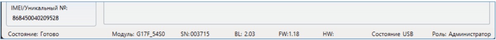

| **Наименование** | **Описание** |
|----|----|
| IMEI/​Уникальный № | IMEI номер устройства |
| Состояние | Рабочее состояние |
| Модуль | Тип изделия (должно быть указано - G17F) |
| SN | Серийный номер изделия |
| BL | Версия менеджера загрузки |
| FW | Версия программного обеспечения изделия |
| HW | Аппаратурная версия изделия |
| Cостояние | Тип подключения к программе (через USB или удаленно) |
| Роль | Уровень доступа (отображается после подтверждения кода доступа программой) |

Нажмите кнопку **Считать [F4]**. Программа считает и отобразит настройки контроллера G17F. С программой TrikdisConfig сделайте необходимые настройки контроллера.

### Окно „Системные параметры“ 

**Закладка „Основные“**

**Группа „Основные“**

- **Объектовый номер** – если сообщения будут отправляться на ПЦН (пульт централизованного наблюдения), то необходимо ввести номер объекта (4-значный шестнадцатеричный номер, 0-9, A-F. **Не используйте номера объектов FFFE, FFFF.**), который был назначен ПЦН.

- **Название объекта** – будет записываться в отправляемые SMS сообщения (до 20 символов, может включать буквы и цифры).

- **Период теста** – отметьте поле и установите период времени отправки тестовых сообщений.

- **Установить время** – выберите сервер (IP сервер, Модем GSM, Облачный сервис), с которым будет производиться синхронизация времени. Выбрав „IP сервер“ – будет производиться синхронизация с временем IP приемника.

- **Очистить память после сброса** – удаляются все не отправленные сообщения после перезагрузки коммуникатора.

- **Язык текста** – SMS сообщения отправляются с использованием символов выбранного языка.

- **Приостановить передачу сообщений при ...**- если идет много повторяющихся **событий за** установленный промежуток времени.

- **Продолжить передачу сообщений после ...** – укажите период времени (0-999 мин.), после которого передача приостановленных сообщений будет продолжена.

- **Предел падения напряжения** – укажите напряжение питания (12 В или 24 В) коммуникатора, по величине которого будет формироваться сообщение о низком уровне питающего напряжения.

**Группа „SIM“**

- **PIN SIM карты** – введите PIN код SIM карты**.**

  - **APN** – введите адрес мобильного интернета провайдера. **APN** должен быть записан, тогда сообщения отправляются в приложение Protegus2 и на ПЦН через мобильный интернет.
- **Пользователь** и **Пароль** – если оператор мобильной связи требует, то надо ввести в соответствующие поля имя пользователя и пароль.

**Группа „Настройки времени“**

- **Часовой пояс (час)** – укажите часовой пояс страны.

- **Летнее время** – отметьте поле и внутренние часы коммуникатора будут автоматически переводиться на летнее или зимнее время.

**Закладка „Подсоединение“**

**Группа „Коды доступа“**

- **Код администратора** – (заводской код – 123456) дает полный доступ к конфигурации системы (код должен быть длиной 6 символов, он может состоять из латинских букв и / или цифр). Из соображений безопасности измените его на новый шестизначный код, который будете знать только вы.

- **SMS пароль** – (заводской код – 123456) используется для безопасного управления и программирования SMS сообщениями. Из соображений безопасности измените его на новый шестизначный код, который будете знать только вы.

- **Код инсталлятора** – (заводской код - 654321) дает доступ к конфигурации системы инсталлятору. Из соображений безопасности измените его на новый шестизначный код, который будете знать только вы.

**Группа „Права инсталлятора“**

Администратор устанавливает, какие параметры установщик сможет изменять.

### Окно „Сообщения на ПЦН“ 

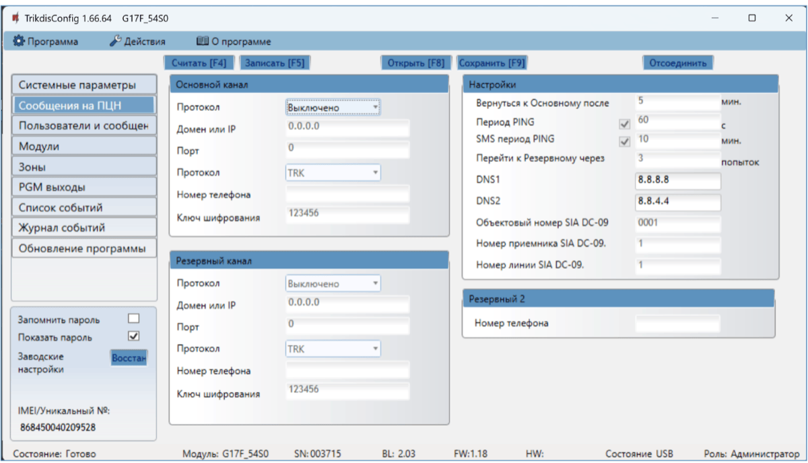

Коммуникатор может отправлять сообщения на ПЦН через мобильный интернет или SMS сообщениями.

Резервный канал связи используется при нарушении основного канала связи. Сообщения передаются на ПЦН зашифрованными и защищенными паролем. Приемник Trikdis необходим для приема и передачи сообщений на программу мониторинга:

- IP сообщения – программа приема IPCom Windows/Linux, аппаратурный IP/SMS приемник RL14 или многоканальный IP/SMS приемник RM14.

- SMS сообщения - аппаратурный IP/SMS приемник RL14, многоканальный IP/SMS приемник RM14 или SMS приемник GM14.

Связь SMS сообщениями особенно полезна в качестве резервного канала связи, потому что она работает при сбоях мобильного интернета в сети оператора мобильной связи. Не рекомендуется использование SMS канала связи как основного канала.

**Группа „Основной канал“**

- **Протокол** – выберите протокол связи с приемником (TCP/IP, UPD/IP, SMS).

- **Домен или IP** – введите адрес домена или IP адрес приемника.

- **Порт** – введите номер порта приемника в сети.

- **Протокол** – **TRK** передача данных на IP приемники Trikdis, **SIA DC-09** передача данных на универсальные приемники.

- **Номер телефона** – телефонный номер ПЦН Trikdis SMS приемника, который может принять SMS сообщения. Номер телефона должен быть с международным кодом страны (например: 370хххххххх).

- **Ключ шифрования** - шестизначный ключ шифрования сообщений, который должен совпасть с ключом шифрования приемника ПЦН.

**Группа „Резервный канал“**

Включите „**Резервный канал“** связи. При нарушении „**Основного канала“** связи, сообщения будут передаваться по „**Резервному каналу“** связи. Настройка "**Резервного канала“** производится аналогично настройке „**Основного канала“** связи.

**Группа „Настройки“**

- **Вернуться к Основному после** – время по истечении которого G17F попытается восстановить связь по Основному каналу, мин..
- **Период PING** – период отправки внутренних PING сигналов проверки связи. Эти сообщения отправляются только IP каналом связи. Их приемник не передает в программу мониторинга, тем самым не перегружая ее. В программу мониторинга передаются сообщения, когда приемник не получает PING сообщений в установленный период времени.

По умолчанию приемник передаст сообщение о потере соединения „*Connection lost*” на программу мониторинга, если PING сообщение не будет получено в течение времени в три раза превышающем период теста. Например: если установлен **Период PING** 3 минуты, то приемник передаст сообщение о нарушении связи на программу мониторинга после 9 минут.

Сообщения PING поддерживают активный сеанс связи между коммуникатором и приемником ПЦН. Активный сеанс связи необходим для удаленной настройки и управления коммуникатором. Рекомендуется устанавливать **Период PING** не более 5 минут.

- **SMS период PING** – период отправления PING сигнала по каналу отправки SMS сообщений, мин.. Отметьте поле, чтобы активировать проверку канала связи и укажите промежуток времени.

- **Перейти к Резервному через** – указывается число неудачных попыток передать сообщение по „**Основному каналу“** связи, после чего коммуникатор перейдет на „**Резервный канал“** передачи сообщений.

- **DNS1, DNS2** – адреса DNS серверов (заводская настройка – адреса Google DNS серверов).

Настройки активны если в поле „**Протокола“** связи указана **DC-09_2007** или **DC-09_2012** кодировка отправляемых сообщений.

- **Объектовый номер SIA DC-09** – введите номер объекта. Если выбран протокол **SIA DC-09**, то будет использоваться объектовый номер, записанный в этом поле. Можете ввести 4-16-значный шестнадцатеричный номер, который предоставлен охранным предприятием.

- **Номер приемника SIA DC-09** – введите номер приемника.

- **Номер линии SIA DC-09** – введите номер линии в приемнике.

**Группа „Резервный 2“**

- **Номер телефона** - номер телефона (вводится с международным кодом) приемника ПЦН, который может принять SMS сообщения. SMS сообщения отправляются по „**Резервному 2“** каналу, когда их не удается отправить по „**Основному“** и „**Резервному“ каналам**. Он особенно полезен, когда пропадает IP связь в сети оператора мобильной связи. Этот канал связи работает только если установлена GPRS связь на Основном и Резервном каналах связи. SMS сообщения будут отправляться на приемник ПЦН: 1) сразу после первого включения G17F; 2) после прерывания TCP/IP и UDP/IP на Основном и Резервном каналах связи.

### Окно „Пользователи и сообщения“ 

**Закладка „Пользователи“**

Группа „Пользователи и сообщения пользователю“

- **№** – порядковый номер пользователя.

- **Имя** – имя пользователя, которое будет записываться в SMS сообщение.

- **Номер телефона** – номер телефона пользователя, на который будут отправляться SMS сообщения. Номер должен быть введен с международным кодом.

- **Вых.** – отметьте поле и пользователь сможет удаленно управлять выходами OUT.

- **Отв.** – отметьте поле и G17F будет отвечать SMS сообщением на каждое полученное SMS сообщение.

- **Пер.** – отметьте поле и включите переадресацию SMS сообщений от неизвестных телефонных номеров (например: случайные рекламные сообщения).

**Группа „Облачное приложение“**

- **Разрешить подключиться** – разрешить доступ к серверу Protegus2. G17F сможет обмениваться данными с приложением Protegus2. С программой TrikdisConfig можно будет удаленно конфигурировать G17F.

- **Передача параллельно** – разрешается параллельная передача сообщений по Основному каналу на ПЦН и в Protegus2.

- **Код доступа к Облаку** – шестизначный код подключения к Protegus2 (заводской код - 123456), который должен совпадать с кодом, указанным в приложении Protegus2.

**Закладка „Тексты SMS ответов“**

**Группа „Текст ответа по SMS“**

- Коммуникатор, получив SMS команду управления, может отправить SMS сообщение с ответом. Тексты SMS ответов редактируются в столбце „**Текст SMS“**.

**Закладка „SMS панели INIM“**

Эта закладка появится если хоть один номер телефона пользователя будет описан в окне „Пользователи и сообщения“*.*

- **Зона** – порядковый номер события по списку.

- **CID** – Contact ID код события.

- **Текст в SMS** – текст SMS сообщения события.

- **Пользователь SMS/Звонок** – отметьте поле, каким образом пользователь будет информирован о событии в зоне – SMS сообщением и/или Звонком.

### Окно „Модули“ 

**Группа „RS485 модули“**

- **ID** – порядковый номер модуля.

- **Модуль** – выберите из списка модуль, который будете использовать (модули: iO, iO-WL, iO-8, Inim Smartline, E485, W485, iO-LORA, iO8-LORA, PB-LORA, REL-LORA, NSC Solution, C-TEC Cast ZFP, ESPA 4.4.4).

- **Серийный №** – введите серийный номер модуля, который указан на упаковке или на корпусе модуля.

- **Название** –введите название модуля.

- **Версия прошивки** – будет показана версия прошивки модуля, когда коммуникатор G17F идентифицирует подсоединенный модуль.

**Закладка „W485 настройки“**

**Окно настроек Wi-Fi модуля W485 (W17u)**

**Группа „Параметры сети коммуникатора“**

- **DHCP** **режим** – режим регистрации Wi-Fi модуля в сети (ручной или автоматический). Отметьте поле галочкой (автоматический режим регистрации) и WiFi модуль автоматически считает сетевые настройки (шлюз, маску подсети) и ему будет присвоен IP адрес.

- **Статический IP** – статический IP адрес (при ручной регистрации).

- **Маска подсети** – адрес маски подсети (при ручной регистрации).

- **Gateway по умолчанию** – адрес шлюза сети (при ручной регистрации).

- **WiFi SSID имя** – введите имя WiFi сети, к которой подключится модуль W485 (W17u).

- **WiFi SSID пароль** – введите пароль WiFi сети.

**Группа „Параметры SIM“**

- **Отключить индикацию отсутствия SIM карты** – отметив поле галочкой, будет отключена индикация отсутствия SIM карты в коммуникаторе G17F.

- **Используйте звонок и SMS при работе через интернет модуль** – отметив поле галочкой, будет включено управление контроллером SMS сообщениями и звонком. Если поле не отмечено и есть Wi-Fi сеть, то звонок и SMS сообщения не используются. Если поле не отмечено и отсутствует Wi-Fi cеть, то G17F можно управлять звонком и SMS сообщениями. G17F будет отправлять SMS cообщения пользователю.

- **Отключить использование мобильных данных SIM-карты** – отметив поле галочкой, будет запрещено использование мобильного интернета с SIM карты. Данные будут отправляться только через модуль W485. Если Wi-Fi сеть отключится, то данные будут сохраняться в памяти G17F. После восстановления Wi-Fi сети, G17F отправит сохраненные данные через модуль W485.

**Закладка „Е485 настройки“**

**Окно настроек „Ethernet“ модуля E485**

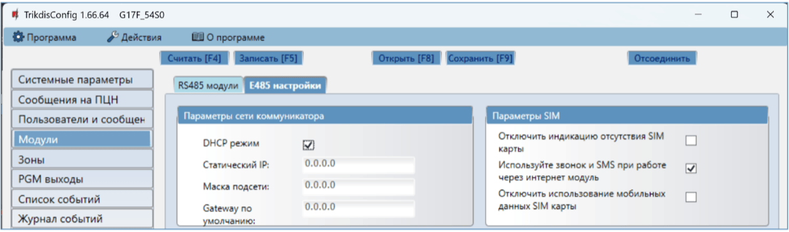

**Группа „Параметры сети коммуникатора“**

- **Режим DHCP** – режим регистрации „Ethernet“ модуля в сети (ручной или автоматический). Отметьте поле галочкой (автоматический режим регистрации) и „Ethernet“ модуль автоматически считает сетевые настройки (шлюз, маску подсети) и ему будет присвоен IP адрес.

- **Статический IP** – статический IP адрес (при ручной регистрации).

- **Маска подсети** – адрес маски подсети (при ручной регистрации).

- **Gateway по умолчанию** – адрес шлюза сети (при ручной регистрации).

**Группа „Параметры SIM“**

- **Отключить индикацию отсутствия SIM карты** – отметив поле галочкой, будет отключена индикация отсутствия SIM карты в коммуникаторе G17F.

- **Используйте звонок и SMS при работе через интернет модуль** – отметив поле галочкой, будет включено управление контроллером SMS сообщениями и звонком. Если поле не отмечено и есть интернет, то звонки и SMS сообщения не используются. Если поле не отмечено и нет интернета, то G17F можно управлять звонком и SMS сообщениями. G17F будет отправлять SMS cообщения пользователю.

- **Отключить использование мобильных данных SIM-карты** – отметив поле галочкой, будет запрещено использование мобильного интернета с SIM карты. Данные будут отправляться только через „Ethernet“ модуль Е485. Если исчезнет интернет, то G17F сохраняет данные с памяти. Когда интернет восстановится, G17F отправит сохраненные данные через „Ethernet“ модуль Е485.

### Окно „Зоны“ 

**Закладка „Настройки зон“**

- **№** – порядковый номер зоны.

- **Название** - зоне можно дать имя, которое будет использоваться в SMS-сообщениях.

- **Вход** – можно выбрать, какой вход G17F или расширителя присвоить зоне.

- **Назначение** – каждому входу назначена „**24-х час**.“ функция. Нарушив зону, немедленно будет отправлено сообщение о событии.

- **Тип** – выберите из списка тип цепи, подключаемый к входу IN (зоне). (NO – нормально открытый контакт; NC - нормально закрытый контакт; EOL – в конце линии сопротивление в 4,7 кΩ или 10 кΩ).

- **ПЦН** – отметьте поле и сообщения о событиях будут отправляться на ПЦН (пульт централизованного наблюдения).

- **Прот**. – отметьте поле и сообщения о событиях будут отправляться в приложение Protegus2.

- **Реакция** – время реакции входов IN, миллисекунды.

- **CID код** - код события в формате Contact ID.

- **SIA E** – код события в формате SIA.

- **SIA R** – код восстановления в формате SIA.

- **Шлейф** – номер шлейфа указывается в SMS сообщении**.**

**Закладка „Сообщения SMS и звонком“**

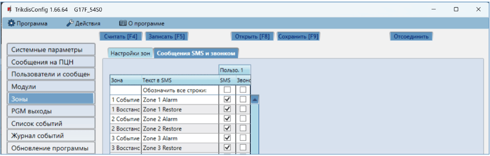

Закладка „Сообщения SMS и звонком“, появится если хоть один номер телефона пользователя будет описан в окне „Пользователи и сообщения“*.*

- **Зона** – номер зоны с идентификационным знаком события. Может быть „**Событие**“ (срабатывание) или „**Восстановление**“.

- **Текст в SMS** – описание события зоны, которое будет включено в отправляемое SMS сообщение пользователю.

- **Пользователь SMS/Звонок** – отметьте поле, каким образом пользователь будет информирован о событии в зоне – SMS сообщением и/или Звонком.

### Окно „PGM выходы“ 

**Закладка „Выходы“**

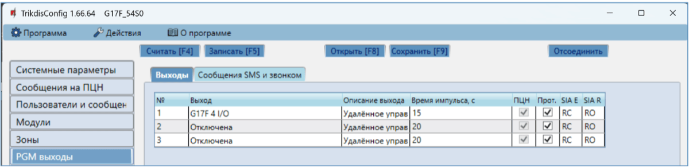

- **№** – порядковый номер выхода.

- **Выход** – назначьте выход G17F или выход расширителя.

- **Описание выхода** – выберите режим работы выхода.

- **Время импульса, с** – установите продолжительность срабатывания выхода OUT в импульсном режиме (0-9999 секунд).

- **ПЦН** – отметьте поле и на ПЦН будет отправлено сообщение об изменениях состояния выхода.

- **Прот**. – отметьте поле и в приложение Protegus2 будет отправлено сообщение об изменениях состояния выхода.

- **SIA E** – код события в формате SIA.

- **SIA R** – код восстановления в формате SIA.

**Закладка „Сообщения SMS и звонком“**

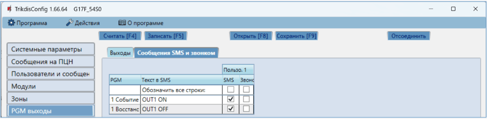

Закладка „Сообщения SMS и звонком“, появится если хоть один номер телефона пользователя будет описан в окне „Пользователи и сообщения“*.*

- **PGM** – указывается номер выхода и тип события Событие/Восстановление (Событие – включение выхода OUT / Восстановление – выключение выхода OUT).

- **Текст в SMS** – текст события (Событие/Восстановление) выхода OUT, которое будет включено в SMS сообщение.

- **Пользователь SMS/Звонок** **–** можете выбрать каким образом (SMS сообщением и/или Звонком) пользователь будет информирован о включении/выключении выхода OUT.

### Окно „Список событий“ 

**Закладка „Внутренние события“**

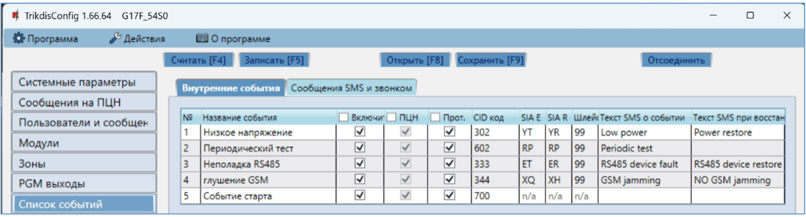

- **№** – порядковый номер события.

- **Название события** – наименование события.

- **Включить** – отметьте поле и будет разрешено отправлять сообщение о событии.

- **ПЦН** – отметьте поле и сообщения будут отправляться на ПЦН (пульт централизованного наблюдения).

- **Прот**. – отметьте поле и будет разрешено отправлять сообщения в приложение Protegus2.

- **CID код** –код события в формате Contact ID.

- **SIA E** – код события в формате SIA.

- **SIA R** – код восстановления в формате SIA.

- **Шлейф** – номер шлейфа указывается в SMS сообщении.

- **Текст SMS о событии** – текст SMS сообщения о событии.

- **Текст SMS при восстановлении** - текст SMS сообщения при восстановлении события.

**Закладка „Сообщения SMS и звонком“**

Закладка „Сообщения SMS и звонком“, появится если хоть один номер телефона пользователя будет описан в окне „Пользователи и сообщения“*.*

- **№** - номер и тип события Событие/Восстановление (Срабатывание / Восстановление).

- **Текст SMS о событии** – текст события, который будет включен в SMS сообщение.

- **Пользователь SMS/Звонок** – отметьте поле, каким способом (SMS сообщением и/или звонком) пользователь будет извещен о событии.

### Окно „Журнал событий“ 

- Нажать кнопку „**Считать“** – будет считан журнал событий из памяти G17F.

- Кнопка „**Очистить“** – если ее нажать, то будет очищен журнал событий в памяти G17F.

- В таблице указаны **№** события**, Время, CID, Описание события**. В памяти G17F может храниться до 1000 событий.

### Восстановление заводских настроек 

Для восстановления заводских настроек панели G17F необходимо в программном окне TrikdisConfig нажать кнопку „**Восстановить“.**

## Удаленная настройка параметров 

!!! note
    Удаленная настройка параметров коммуникатора G17F возможна, если:
    
    1.  Установлена активированная SIM карта и введен или отключен PIN код.
    
    2.  Включен Protegus сервис, см. п. 5.4 Окно „Пользователи и
        сообщения".
    
    3.  Включено напряжение питания (горит зеленый индикатор „POWER").
    
    4.  G17F подключен к GSM сети (горит зеленый и мигает желтым
        индикатор „NETWORK").
    
    Если горит желтый „NETWORK" индикатор или горит желтый „DATA" индикатор,
    то коммуникатор не может подключиться к GSM сети и/или Protegus
    сервису.
1.  В компьютере запустите программу TrikdisConfig.

2.  В поле „**Уникальный №“** введите IMEI номер G17F, который указан на упаковке или на изделии.

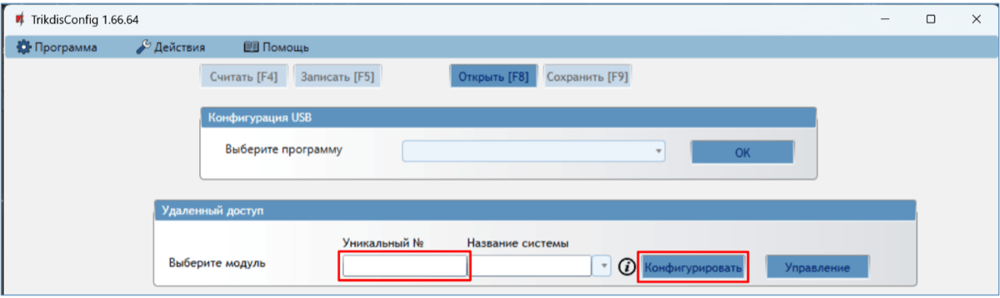

3. В поле „**Название системы“** напишите название объекта.

2.  Нажмите кнопку „**Конфигурировать“.**

3.  Откроется программное окно G17F. Нажмите кнопку **Считать [F4],** чтобы были считаны настройки G17F. Если всплывет окно запроса ввода „**Кода администратора“**, введите 6-значный код администратора. Отметьте поле рядом с „**Запомнить пароль“** и нажмите кнопку **Записать [F5]**.

4.  Сделайте необходимые настройки для G17F. Запишите эти изменения в G17F, нажав на кнопку **Записать [F5]**. Нажмите кнопку **Отсоединить** и выйдите из программы TrikdisConfig.

## Тестирование коммуникатора G17F 

После завершения настроек выполните тестирование системы:

1.  Проверьте входы IN коммуникатора. Активируйте вход коммуникатора. И убедитесь, что сообщения получены на ПЦН и приложением Protegus2.

2.  Проверьте выходы OUT коммуникатора. Удаленно активируйте выход коммуникатора. И убедитесь, что сообщения получены на ПЦН и приложением Protegus2.

3.  Выполните тестирование пожарной панели. И убедитесь, что ПЦН получает полную информацию о событиях.

## Обновление прошивки G17F 

!!! note
    Подключите G17F к TrikdisConfig. Если есть новая прошивка
    для G17F, то TrikdisConfig предложит обновить прошивку. Для
    обновления прошивки должно быть подключение к сети интернет. / Если в
    компьютере установлена антивирусная программа, то она может блокировать
    функцию автоматического обновления программного обеспечения. В этом
    случае придется изменить настройки в антивирусной программе.
Прошивку коммуникатора G17F можно обновить или заменить вручную. После обновления все ранее установленные параметры G17F остаются. Прошивка может быть заменена на новую или на старую версию.

1.  Запустите программу TrikdisConfig.

2.  Подключите к компьютеру G17F с помощью кабеля USB Mini-B или подсоединитесь удаленно. Если есть новая прошивка изделия, то TrikdisConfig предложит обновить программное обеспечение G17F.

3.  В программе TrikdisConfig откройте окно „**Обновление программы“.**

4.  Нажмите кнопку „**Открыть файл“** и выберите нужный файл для установки.

5. Нажмите кнопку **Обновить [F12]**.

2.  Подождите, пока произойдет обновление программного обеспечения.

## Требования безопасности 

Устанавливать и обслуживать коммуникатор могут только квалифицированные специалисты.

Перед установкой изделия внимательно ознакомьтесь с данным руководством, чтобы избежать ошибок при монтаже из-за чего оборудование будет плохо работать и может быть испорчено.

Выполняя работы по установке оборудования, обязательно должно быть выключено его внешнее питание.

Изменения внесенные в конструкцию изделия, самостоятельный ремонт лишают изделие гарантии производителя.

Соблюдайте нормы местного законодательства и не утилизируйте изделие или его компоненты вместе с другими бытовыми отходами.
