# GSM коммуникатор G16T

  

## Описание

Коммуникатор G16T предназначен для модернизации совместимых панелей охранной сигнализации под использование для передачи сигналов сотовой сети.

Коммуникатор передает все данные о событии в Центр приема сигналов тревоги.

Клиент получает уведомление системы безопасности с помощью приложения Protegus или SMS-сообщений.

**Характеристики**

#### Подключение

- Подключение к панелям управления:

  - Прямое подключение с помощью основной шины; или

  - Подключение с помощью последовательного порта

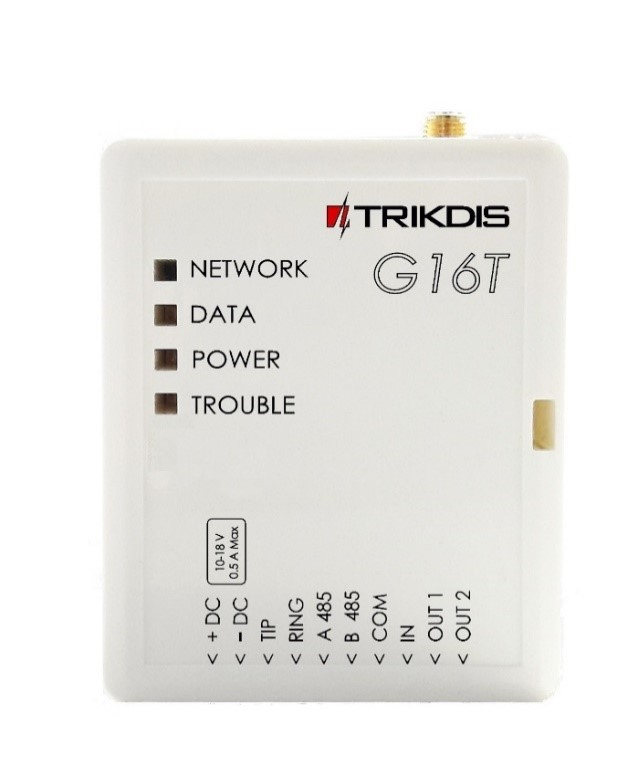

#### Связь

- Режимы связи:

  - C использованием клеммного соединения с телефонным коммуникатором.

- 2 основных канала связи, работающих одновременно

- У каждого канала связи имеется отдельный резервный канал

- Постоянный контроль связи с ПЦН

- Одновременный отчет о событиях для мобильного и Веб - приложения Protegus, позволяя пользователю удаленно контролировать и управлять своей сигнализацией

- Для оповещений используются коды Contact ID

- Отчеты о событиях с помощью SMS-сообщений 4-х различных пользователей (настраивается согласно требованиям пользователя)

#### Входы и выходы

- 2 выхода управляются с помощью:

  - Мобильного/веб-приложения или

  - SMS

- 1 вход, тип: NC, NO

#### Конфигурация

- Настройка и обновление прошивки осуществляются быстро и просто

- Удаленная конфигурация и обновления прошивки

- Два уровня доступа для установки рабочих параметров

### Технические параметры

| Параметр | Описание |
|----------|----------|
| Частота модема GSM | 850/​900/​1800/​1900 МГц |
| Частота модема 3G | 800/​850/​900/​1900/​2100 МГц |
| Источник питания | 10-18 В постоянного тока |
| Потребление тока | 60-100 мА (режим ожидания) До 250 мА (при отправке данных) |
| Протокол передачи | TRK, DC-09_2007, DC-09_2012 |
| Шифрование данных | AES 128 |
| Память | До 60 сообщений |
| Вход | 1, типа NC/​NO |
| Выход | 2, типа OC, коммутирование до 0,15 A постоянного тока, 30 В макс. |
| Конфигурирование параметров | Локально с помощью USB-порта или удаленно |
| Условия эксплуатации | Температура: от -10°C до 50°C;​ относительная влажность: до 80% при +20°C |
| Размерные характеристики | 65 x 77 x 25 мм |

### Плата коммуникатора

1.  Разъем SMA для антенны GSM

2.  Световые индикаторы

3.  Выемка для открытия переднего отсека
1.  Терминал для подключения внешних устройств

2.  Порт USB Mini-B для программирования коммуникатора

3.  Разъем для SIM-карты

1

2

3

5

4

6

### Назначение терминалов

| Терминал | Описание |
|----|----|
| +DC | Терминал питания (+10 В/​+18 В) |
| -DC | Общий (отрицательный) |
| TIP | Терминал последовательной шины для прямого подключения к панели управления |
| RING | Терминал последовательной шины для прямого подключения к панели управления |
| A 485 | Для последующего использования |
| B 485 | Для последующего использования |
| COM | Общий (отрицательный) |
| IN | Вход |
| OUT1 | 1-ый выход с открытым коллектором |
| OUT2 | 2-ой выход с открытым коллектором |

### Световая индикация

| Индикатор | Состояние | Описание |
|-----------|-----------|----------|
| Network | Выключен | Отсутствует подключение к сети GSM. |
| Network | Мигающий желтый | Осуществляется подключение к сети GSM |
| Network | Сплошной зеленый и мигающий желтый | Коммуникатор подключен к сети GSM. / Достаточная мощность сигнала GSM – уровень 5 (желтый индикатор мигает 5 раз) |
| Data | Выключен | Отсутствуют сообщения в буфере |
| Data | Сплошной зеленый | В памяти коммуникатора имеются неотправленные сообщения |
| Data | Мигающий зеленый | (Режим настройки) Коммуникатор передает/отправляет данные |
| Power | Выключен | Отсутствует питание |
| Power | Сплошной зеленый | Питание в норме; микроконтроллер функционирует |
| Power | Сплошной желтый | Недостаточное питание (≤ 11,5 В), микроконтроллер функционирует |
| Power | Сплошной зеленый и мигающий желтый | (Режим настройки) Коммуникатор готов к настройке |
| Power | Сплошной желтый | (Режим настройки) Отсутствует связь с компьютером |
| Trouble | OFF | Неисправностей нет |
| Trouble | Красный индикатор мигает один раз | Отсутствует SIM-карта |
| Trouble | Красный индикатор мигает два раза | Неисправность, связанная с PIN-кодом SIM-карты (неверно введен PIN-код) |
|  | Красный индикатор мигает три раза | Проблема программирования (нет APN) |
|  | Красный индикатор мигает четыре раза | Ошибка регистрации в сети GSM |
|  | Красный индикатор мигает пять раз | Ошибка регистрации в сети GPRS/UMTS |
|  | Красный индикатор мигает шесть раз | Отсутствует связь с получателем |
|  | Красный индикатор мигает семь раз | Потеря связи с панелью управления |
|  | Постоянное мигание красного индикатора | (Режим настройки) Ошибка памяти |
|  | Сплошной красный | (Режим настройки) Повреждение прошивки |

### Содержимое упаковки

!!! note
    1 шт.
### Перед началом работы

Перед началом работы убедитесь в наличии следующего:

1)  Кабель USB (тип Mini-B) для настройки.

2)  4-жильный кабель для подключения коммуникатора к панели управления.

3)  Отвертка с плоской головкой.

Вышеуказанные компоненты заказываются отдельно у местного поставщика.

## Подключение коммуникатора G16T к TrikdisConfig

Коммуникатор можно настроить как с помощью USB-кабеля, так и удаленно, используя программное обеспечение **TrikdisConfig** для ОС Windows.

**ПРИМЕЧАНИЕ**: Для удаленной настройки необходимо активировать службу Protegus.

1)  Установите **TrikdisConfig**, загрузив его с сайта [www.trikdis.com](http://www.trikdis.com/) (введите *TrikdisConfig* в поле поиска).

2)  Подключение коммуникатора к ПК с **TrikdisConfig**:

- **С помощью USB-кабеля:** Аккуратно откройте корпус с помощью отвертки (см. рис. ниже), Чтобы открыть корпус, вам понадобится плоская отвертка:

  <figure style="margin: 0;">
    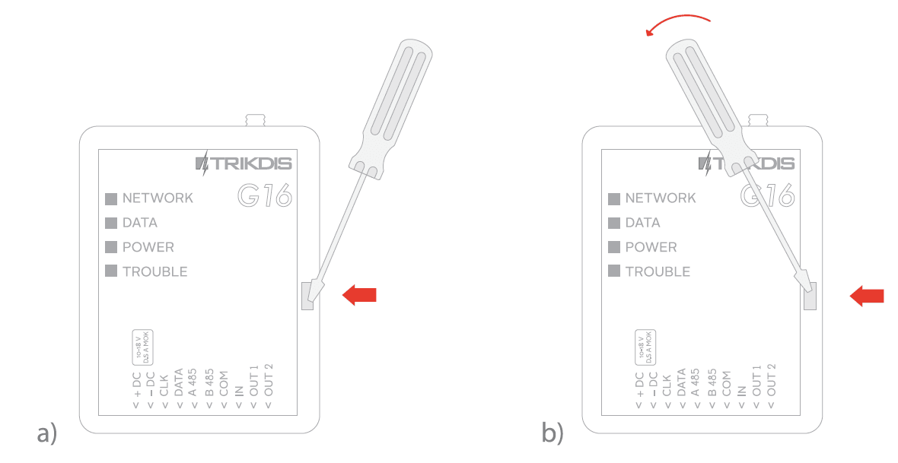
  </figure>

1)  Подключите USB-кабель. Запустите программу настройки **TrikdisConfig**. Программа автоматически распознает подключенное устройство и откроет окно настройки коммуникатора.

- **Дистанционное подключение:** запустите программу настройки **TrikdisConfig**. Введите IMEI-адрес коммуникатора (указан на упаковке) в поле **"Уникальный идентификатор"** в разделе *"Удаленный доступ"*. В поле **"Название системы"** введите желаемое имя коммуникатора (необязательно). Нажмите **"Конфигурировать "**.

  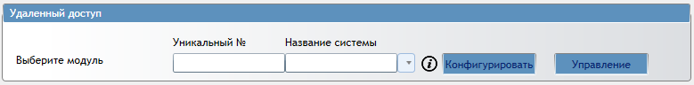

1)  Нажмите **Считать [F4]** для чтения параметров коммуникатора; во всплывающем окне введите код (пароль) администратора или установщика. Чтобы программа запомнила код, установите флажок **Запомнить пароль**.

**Примечание:** Если код (пароль) администратора установлен по умолчанию (123456), вводить его не требуется, и всплывающее окно не появится.

Чтобы настроить коммуникатор с помощью сохраненного файла настройки, нажмите **Открыть [F8]** и найдите файл настройки на вашем компьютере.

### Описание строки состояния 

После того, как параметры коммуникатора будут считаны, строка состояния отобразит информацию об устройстве.

**Строка состояния**

| Наименование | Описание |
|----|----|
| IMEI/​Unique ID | IMEI-номер устройства |
| Status | Состояние действия |
| Device | Тип устройства (G16T или G16T_3G) |
| SN | Серийный номер |
| BL | Версия загрузчика |
| FW | Версия прошивки |
| HW | Версия аппаратной части |
| State | Состояние подключения |
| Admin | Уровень доступа (отображается после подтверждения кода доступа) |

## Настройка эксплуатационных параметров

### Окно Системы настройки 

**Общие сведения**

- В поле **"Объектовый номер"** введите соответствующий номер объекта (4 символа, шестнадцатеричное число).

- **"Период теста":** периодическая отправка тестовых сообщений согласно временному интервалу, заданному в этом разделе.

- **Использовать объектовый номер панели**– идентификатор учетной записи можно задействовать на панели управления. При включении передача будет происходить на коммуникатор G16T.

- **Ждать ответа с ПЦН**– после успешного приема сообщения на ARC коммуникатор отправляет сигнал «kissoff» на панель управления. Если панель управления не получает тональный сигнал «kissoff» вовремя, система повторно передает сообщение.

- В строке выбора **Модель панели** опция **INTERFACE DTMF** означает, что коммуникатор будет получать информацию с помощью протокола **Contact ID** от телефонного коммуникатора панели управления, принимая DTMF сигналы.

- Активируйте (поставьте галочку) и введите частоту тонального сигнала в графе **Частота Dial Tone**, что укажет, работает ли связь и готова ли она к началу вызова.

- Выберите тип операции ввода из списка **IN1**.

- Выберите тип операции вывода из списка **OUT1-OUT2**.

- Укажите сервер для синхронизации времени и параметры вывода/ввода.

  **Доступ**

Для настройки коммуникатора G16T имеются два уровня доступа:

- **код администратора** обеспечивает полный доступ к настройкам.

- **код установщика** обеспечивает ограниченный доступ к настройкам.

**Примечание**: Коды администратора и установщика должны состоять из шести символов и содержать только цифры или латинские символы.

### Окно Передача на ПЦН → вкладка Параметры ПЦН

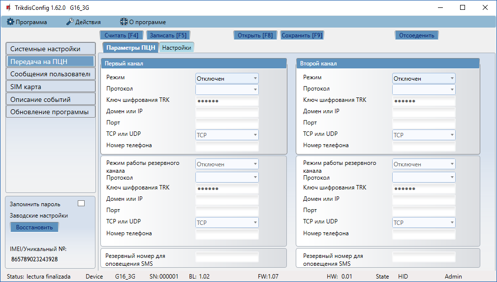

**Первый и второй каналы (включая резервные)**

Первый и второй каналы могут работать параллельно, позволяя одновременную передачу данных через оба канала.

- Выберите **Режим** и **Протокол** связи.

  - Если используется SMS-оповещение, введите **Ключ шифрования TRK** и номер телефона получателя.

- Введите **Домен** или **IP-адрес** и Порт получателя.

- Выберите протокол передачи сообщения: **TCP или UDP**.

- Введите **Номер телефона**, на который следует отправлять сообщения (номер должен содержать код страны, например +370xxxxxxxx, 00370xxxxxxxx или 370xxxxxxxx).

- Укажите номер **Резервный номер оповещения SMS**: если для первого и резервного каналов установлен режим GPRS, этот канал 1) уведомит ARC о начале работы коммуникатора и 2) будет служить третьим резервным каналом.

### Окно отчетов ПЦН → вкладка "Настройки"

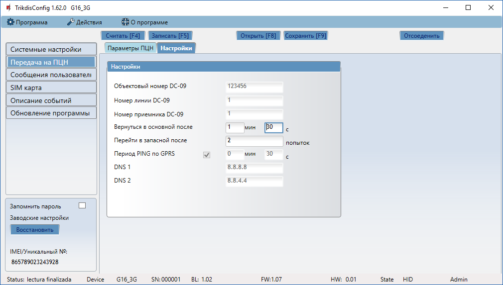

#### Настройки

- Введите необходимый идентификатор объекта (шестнадцатеричное число, 4-16 символов) в поле **"Объектовый номер DC-09"**, <u>если для передачи сообщения используется протокол SIA DC-09</u>.

- Введите необходимый номер строки DC-09 в поле **"Номер линии DC-09"**.

- Введите необходимый номер приемника DC-09 в поле **"Номер приемника DC-09".**
- В поле **"Bернуться в основной после"** укажите необходимое количество попыток повторного подключения, после которого система обратится к резервному каналу.

- Система попытается возобновить использование основного канала через то время, которое указано в поле **"Перейти в запасной после"**.

- В поле **"Период PING по GPRS"** укажите время между сигналами в секундах (требуется для контроля связи).

- В полях **"DNS"** укажите необходимые DNS-адреса.

### Окно пользовательских отчетов → вкладка Cервис Protegus

Служба Protegus позволяет управлять коммуникатором удаленно.

**ПРИМЕЧАНИЕ:** При активации службы Protegus вкладка отчетов о SMS и звонках автоматически отключается.

Служба Protegus позволяет одновременно передавать данные для мобильных и сетевых приложений. Для получения дополнительной информации о сервисе PROTEGUS посетите сайт [www.protegus.app](https://www.protegus.app).

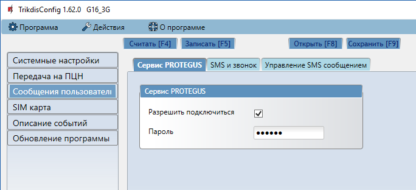

**Cервис Protegus**

- Включите облачный сервис в разделе **"Разрешить подключиться"** вкладка **Cервис Protegus**

- Введите **Пароль** **код**; код по умолчанию – 123456, для большей безопасности замените его на другой шестизначный код.

### Окно пользовательских отчетов → вкладка "Отчеты о SMS и звонках"

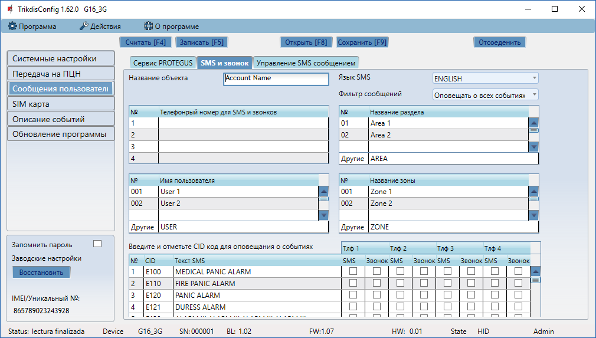

Коммуникатор может уведомлять пользователя о полученных сигналах и внутренних событиях с помощью SMS-сообщений и звонков.

- Каждое сообщение имеет имя объекта. Необходимое имя объекта вводится в поле **"Название объекта"**.

- Язык SMS-сообщения можно выбрать в раскрывающемся списке **"Язык SMS"** (устройство поддерживает широкий ряд кодировок).

- Режим оповещения можно выбрать в списке **"Фильтр сообщений"**:

  - **Оповещать о всех событиях** – сообщать обо всех, даже не описанных, событиях

  - **Оповещать только о описанных событиях** – сообщать о событии с помощью описанного SMS-сообщения (с указанием зон, областей и имен пользователей).

- Сообщение можно отправить на несколько телефонных номеров, вплоть до 4-х. Укажите необходимые номера в таблице **"Телефонрый номер для SMS и звонков"** (номер должен включать код страны, например +370xxxxxxxx, 00370xxxxxxxx или 370xxxxxxxx).

- Информация о полученных событиях **(Название раздела, пользователи и зоны)** кодируется с помощью цифр. Каждому событию может быть присвоено имя, которое впоследствии будет использоваться в отправляемых пользователю SMS-сообщениях. Укажите необходимые имена в соответствующих таблицах.

- Чтобы получать сообщения о CID-событиях, укажите необходимые события. Кроме того, можно выбрать, какие телефонные номера будут получать уведомления о событиях с помощью SMS или звонков.

### Окно пользовательских отчетов → вкладка Управление SMS сообщением

**Примечание:** Если в списке нет описанных номеров, SMS-команды могут быть отправлены с любых телефонных номеров.

**Удаленное управление**

- Настройка ответов на SMS-команды осуществляется с помощью текстового поля **"Текст ответа по SMS"**.

- Номер телефона для удаленного управления указывается в таблице **"Номера телефонов удаленного управления"**. Текст SMS-сообщения, которое пользователь получает после отправки команды (чтобы получить ответное SMS-сообщение, требуется ввести соответствующий **код доступа**).

#### Список SMS-команд

SMS-команды необходимы для удаленного управления устройством.

В качестве кода доступа используется **код администратора или код установщика**; "\_" – пробел.

Структура SMS-команд: AccessCode_Command_Data.

| Команда | Данные | Описание |
|---------|--------|----------|
| INFO |  | Запрос сведений об устройстве. В ответе будут указаны: тип устройства, номер IMEI, серийный номер и версия прошивки. |
| RESET |  | Перезагрузка устройства. |
| OUTPUTx | ON | Включение выхода ("x" обозначает номер выхода (1 или 2)). |
| OUTPUTx | OFF | Выключение выхода ("x" обозначает номер выхода (1 или 2)). |
| OUTPUTx | PULSE tttt | Включение выхода на определенное время ("x" обозначает номер выхода (1), а "tttt" – продолжительность выключения в секундах) |

#### Примеры

Например, код доступа – 123456.

Чтобы получить информацию об устройстве, введите:

“123456 INFO”

**Чтобы включить выход OUT1, введите:**

“123456 OUTPUT1 ON”

Чтобы отключить выход OUT1 на 3 секунды, введите:

“123456 OUTPUT1 PULSE=0003”

### Окно SIM-картa

Перед использованием SIM-карты убедитесь, что она исправна.

Если требуется GPRS- или 3G-связь, убедитесь, что служба мобильной передачи данных включена. <u>Информацию о том, как включить эту услугу, можно получить у поставщика услуг GSM.</u>

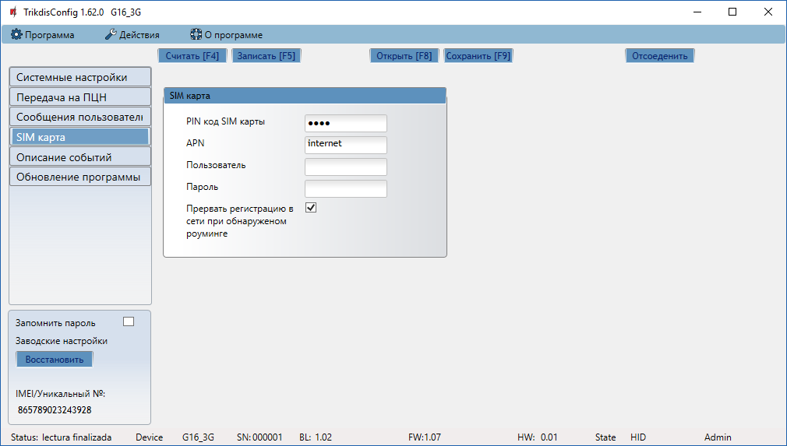

**SIM карта**

- Введите **PIN код SIM карты, APN**.

- Если необходимо, введите имя сети GSM и пароль в полях **"Пользователь"** и "**Пароль**" соответственно.
- <u>Запретить соединение при обнаружении роуминга</u>: используйте эту функцию, если система безопасности установлена вблизи границы страны; это предотвратит подключение к посторонней сети GSM.

### Окно Описание событий

Коммуникатор может периодически создавать тестовые сообщения.

Чтобы активировать создание тестовых сообщений и задать период их появления, выберите "Системные параметры → Общие → Период тестовых сообщений". Период указывается в днях и часах (максимальный период составляет 7 дней).

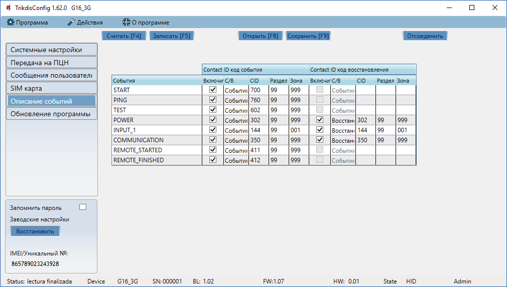

Локальные изменения периодических тестовых сообщений могут быть сделаны с помощью окна **Описание событий**:

- **Тестовые уведомления, а также уведомления о внутренних событиях** можно включать и отключать; кроме того, для всех таких уведомлений можно настроить номер "Contact-ID". Включить уведомление и задать номер Contact-ID можно с помощью таблицы **"** **Описание событий "**.

### Чтобы ввести новые параметры в коммуникатор, нажмите Записать [F5].

**Примечание:**

Чтобы восстановить стандартные настройки коммуникатора, нажмите кнопку **Восстановить** в разделе **"Настройки по умолчанию"** в нижнем левом углу окна настроек.

Чтобы создать файл сохранения текущих настроек, нажмите **"Сохранить", [F9]**.

### Отключение устройства:

- Нажмите **"Отсоеденить"**, чтобы отключить профиль установщика или администратора, когда коммуникатор подключен к компьютеру с помощью USB-кабеля.

- Если настройка выполняется с помощью USB-кабеля, отсоедините USB-кабель и нажмите **"Отсоеденить"**, чтобы вернуться в начальное окно.

## Физическая установка

### Вставьте SIM-карту в держатель.

4\)

1)  SIM-карта должна быть зарегистрирована в сети GSM; если необходимо использовать GPRS-связь, убедитесь, что услуга мобильной передачи данных включена.

2)  Чтобы настроить устройство удаленно, установите SIM-карту с отключенной функцией запроса PIN-кода.

### Установите коммуникатор в монтажный корпус. Если используется винтовое крепление:

b\) Поместите печатную плату обратно

1)  Снимите печатную плату с нижней части корпуса;

### Закройте корпус коммуникатора.

### Подключите антенну GSM.

**Примечание:** Достаточная мощность сигнала GSM – уровень 5 (желтый индикатор "Network" мигает 5 раз)

Достаточная мощность сигнала 3G – уровень 3 (желтый индикатор "Network" мигает 3 раза)

### Подключите контрольную панель, датчики и выходные разъемы согласно следующим схемам.

#### Монтажные схемы

#### Входное соединение (опция)

Коммуникатор оснащен входным терминалом (IN1) для подключения датчиков. Для настройки входного подключения см. [**"3.8 Общие системные настройки"**](#General_setup)

  <figure style="margin: 0;">
    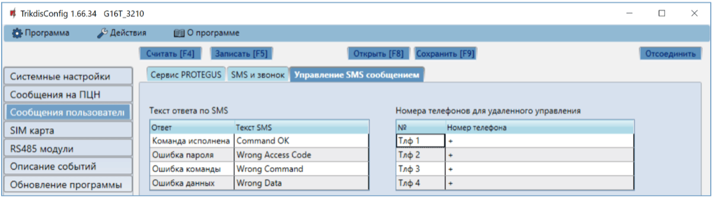
  </figure>
  <figure style="margin: 0;">
    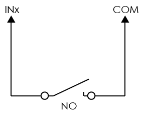
  </figure>

### Подключите источник постоянного тока.

### Включите электропитание.

### Проведите эксплуатационную проверку коммуникатора

1)  По завершении установки и настройки проведите системный тест. Активируйте сигнализацию с помощью панели управления и убедитесь, что оповещение поступает в центр приема сигналов тревоги или на мобильное приложение.

2)  Для проверки входа коммуникатора активируйте его и убедитесь, что на получающие устройства поступают корректные сообщения.

3)  Для проверки выходов коммуникатора активируйте их удаленно.

4)  Проведите проверку сигнализации, чтобы убедиться, что центр приема принимает корректные сигналы.

## Добавить коммуникатор в Protegus

Protegus сервис - это веб-сервис для удаленного управления и самоконтроля систем пожарной и охранной сигнализации, а также управления устройствами Trikdis и сторонними устройствами через Веб, или приложения для Android и iOS.

**Google Рlay магазин для Android:**

<https://play.google.com/store/apps/details?id=lt.apps.protegus&hl=lt>

**Apple App магазин:**

<https://itunes.apple.com/us/app/protegus-smart-security/id1092492126?mt=8>

1)  Войти или зарегистрироваться на [www.protegus.app](https://www.protegus.app).

2)  Добавьте систему в Protegus: нажмите «Выбрать систему»; затем «Добавить новую систему +», и введите необходимые данные, как показано ниже (вы можете пропустить поля и заполнить его позже).

Введите IMEI (его можно найти: на упаковочной коробке; задней части корпуса коммуникатора; в Trikdis Config в качестве уникального ID).

1)  (Дополнительно) Если вы будете использовать функцию дистанционного постановки/снятия с охраны, в главном окне Protegus выберите вкладку «Настройки» (“**Settings”)**, а затем поставьте галочку: «Постановка/ снятие с охраны с помощью PGM» (**“Arm/Disarm with PGM”).**.

**ВАЖНО:**

в приложении Protegus один PGM-выход может быть установлен для управления одной Партиции (1 PGM-1 Партиция, 2 PGM-2 Партиции) независимо от того, сколько партиций управляется той же самой зоной ключевого/кнопочного включателя (key-switch) панели.

Укажите, какая Партиция будет контролироваться от Protegus в системе «Настройки» (**"Settings").** Там установите галочку «Постановка/Снятие с охраны с помощью PGM», и номер Партиции, которую вы хотите контролировать.

В Protegus, в окне «Партиции» **("Areas"**), вы увидите все доступные в системе партиции с выделенными контролируемыми партициями.

## Дистанционное управление G16T

Коммуникатором G16T можно управлять удаленно с помощью программы TrikdisConfig. Для этого выполните следующие действия:

1)  Введите IMEI-адрес коммуникатора в поле «Уникальный №» в разделе **Remote access** («Удаленный доступ»). IMEI-адрес указан на упаковке.

2)  В поле «Название системы» введите желаемое имя коммуникатора и нажмите **управлениею**

3)  Введите код самообслуживания **Код самообслуживания** – он совпадает с кодом службы Protegus.

4)  В новом окне **Zones tab** можно управлять зонами. Кроме того, можно выбрать время обновления (во всех вкладках).

5)  На вкладках выходов **Выходы PGM** можно управлять выходами PGM – вкл/выкл.

## Обновление прошивки вручную

Прошивка коммуникатора может быть обновлена или изменена вручную. После обновления все предыдущие параметры коммуникатора останутся прежними.

При замене прошивки вручную можно выбрать более новую или более старую версию прошивки. Для обновления прошивки:

1)  Запустите TrikdisConfig.

2)  Подключите коммуникатор к компьютеру с помощью USB-кабеля или подключитесь к коммуникатору удаленно.

    - При наличии более новой версии прошивки программа предложит загрузить ПО новой версии.

3)  Выберите раздел меню **"Firmware"**.

**Примечание**: Антивирусное программное обеспечение может воспрепятствовать автоматическому обновлению прошивки. В этом случае следует перенастроить антивирусное программное обеспечение.

1)  Чтобы открыть файл прошивки, нажмите **"Open firmware"** **("Открыть файл прошивки")** и выберите необходимый файл.

    - Новейшую версию файла прошивки можно загрузить на сайте [www.trikdis.com](http://www.trikdis.com/) в разделе загрузок для коммуникатора G16T (<u>требуется регистрация</u>).

2)  Нажмите **"Update" ("Обновить", [F12])**.

3)  Дождитесь уведомления о завершении обновления.

4)  Нажмите **OK** в появившемся окне.

## Техника безопасности

Система охранной сигнализации устанавливается и обслуживается только квалифицированными сотрудниками.

Внимательно прочтите настоящее руководство перед установкой. Это поможет избежать ошибок, которые могут привести к неисправности или даже повреждению оборудования.

Отключите питание перед подключением каких-либо электрических компонентов.

При изменениях, модификации или ремонте изделия без разрешения производителя права гарантии аннулируются.

Соблюдайте нормы местного законодательства и не утилизируйте систему сигнализации или ее компоненты вместе с другими бытовыми отходами.
