# GSM коммуникатор GT

  

## Описание 

Коммуникатор предназначен для передачи сообщений о событиях охранной панели на ПЦН и приложение Protegus2.

Сотовый коммуникатор GT можно подключить напрямую к охранным панелям (DSC, Paradox, UTC Interlogix (CADDX), Texecom, Innerrange, Honeywell) или к телефонному коммуникатору (поддерживающему протокол связи Contact ID, передаваемый тонами DTMF) охранной панели.

Коммуникатор передает полную информацию о событии на ПЦН.

Коммуникатор работает с приложением Protegus2. С помощью Protegus2 пользователи могут удаленно управлять своей системой охранной сигнализации и получать уведомления о событиях в системе безопасности. Приложение Protegus2 совместимо со всеми панелями охранной сигнализации различных производителей, поддерживаемыми коммуникатором GT. Коммуникатор может передавать уведомления о событиях на ПЦН (пульт централизованного наблюдения) и одновременно работать с Protegus2.

**Функциональность**

Коммуникатор GT может быть подключен к последовательной шине (Serial bus) или к шине клавиатуры (Keypad bus) или к телефонному коммуникатору (TIP/RING) охранной панели.

Отправляет сообщения на приемник ПЦН:

- Отправляет сообщения на программные или аппаратурные приемники Trikdis, которые работают с любой программой мониторинга.

- Может отправлять сообщения на SIA DC-09 приемники. В приложении есть таблица конвертации Contact ID кодов в SIA коды.

- Может отправлять сообщения на SUR-GARD приемники.

- Контроль связи, отправляя PING сообщения на IP-приемник каждые 30 сек. (или другим установленным периодом).

- Резервный канал связи, который применяется при нарушении основного канала связи.

- При включении параллельного канала связи, сообщения о событиях будут отправляться на два приемника одновременно.

- Когда включен *Protegus* сервис, сообщения сперва отправляются на ПЦН и только потом пользователям приложения *Protegus2*.

Работает с приложением Protegus2:

- „Push“ и специальные звуковые оповещения о событиях.

- Удаленное включение/выключение системы охраны.

- Удаленное управление подключенным оборудованием (освещением, ворота, отопление, кондиционирование, полив и т.д.).

- Различные права пользователей для администратора, установщика и пользователя.

**Информирование пользователей:**

- Пользователи могут получать уведомления о событиях с помощью приложения Protegus2, SMS сообщениями и звонком.

**Управляемые выходы и входы:**

- 2 универсальных клеммы I/O (вход/выход).

- Выходы управляются приложением Protegus2 и SMS сообщениями.
- Добавление дополнительных входов и управляемых выходов с помощью iO-8 расширителей.

**Быстрая конфигурация:**

- Настройки можно сохранить в файле и быстро записать на другие коммуникаторы.

- Два уровня доступа к настройкам: установщика и администратора ПЦН.

- Удаленная конфигурация и обновление прошивки.

### Список совместимых охранных панелей 

| Производитель | Модель |
|---------------|--------|
| DSC® | <u>PC585</u>, PC1404, <u>PC1565</u>, <u>PC1616</u>, <u>PC1832</u>, <u>PC1864</u>, PC5020 |
| PARADOX® | <u>SPECTRA SP4000</u>, <u>SP5500</u>, <u>SP6000</u>, <u>SP7000</u>, <u>SP65</u>, <u>SP5500+</u>, <u>SP6000+</u>, <u>SP7000+</u> |
| PARADOX® | <u>MAGELLAN MG5000</u>, <u>MG5050</u>, <u>MG5050E</u>, <u>MG5075</u>, <u>MG5050+</u> |
| PARADOX® | <u>DIGIPLEX</u> EVO48, <u>EVO192</u>, <u>EVOHD</u>, <u>EVOHD+</u> |
| PARADOX® | SPECTRA 1727, 1728, 1738 |
| PARADOX® | ESPRIT E55 |
| UTC Interlogix® | <u>NetworX (Caddx) NX-4v2</u>, <u>NX-6v2</u>, <u>NX-8v2</u>, <u>NX-8e</u> |
| Texecom® | <u>Premier 24</u>, <u>48</u>, <u>88</u>, <u>168</u>, <u>640</u> /​ <u>Premier Elite 12</u>, <u>24</u>, <u>48</u>, <u>64</u>, <u>88</u>, <u>168</u>, <u>640</u> |
| Innerrange® | Inception, Integriti |
| Honeywell® | <u>Ademco Vista-15</u>, <u>Ademco Vista-20</u>, <u>Ademco Vista-48</u> |

\***<u>Подчеркнуто</u>** – охранные панели, которые напрямую управляются GT. Прошивка PARADOX охранных панелей, которые напрямую управляются, должна быть не ниже V.4.

\*Охранные панели других производителей подключаются к коммуникатору GT через клеммы TIP/RING (которые поддерживают протокол связи Contact ID, передаваемый тонами DTMF) охранной панели.

### Типы моделей коммуникаторов 

Данная инструкция предназначена для LTE коммуникаторов.

### Технические параметры 

| Параметр | Описание |
|----------|----------|
| Подключение к охранной панели | Последовательная шина (Serial bus), шина клавиатуры (Keypad bus) или телефонный коммуникатор охранной панели (TIP RING) |
| Универсальные клеммы I/​O (вход выход) | 2, можно установить режим работы как вход (IN): тип NC;​ NO;​ NC/​EOL;​ NO/​EOL;​ NC/​DEOL;​ NO/​DEOL;​ или как выход (OUT): тип OC (открытый коллектор), до 0,15 A, до 30 В постоянного тока /​ С помощью iO-8 расширителей можно добавить дополнительные входы и выходы. |
| Модем EG915U-EU /​ (Европа) | LTE FDD: B1/​B3/​B5/​B7/​B8/​B20/​B28 |
| Модем EG915U-EU /​ (Европа) | GSM: B2/​B3/​B5/​B8 |
| Модем EG915U-LA /​ (Латинская Америка) | LTE FDD: B2/​B3/​B4/​B5/​B7/​B8/​B28/​B66 |
| Модем EG915U-LA /​ (Латинская Америка) | GSM: B2/​B3/​B5/​B8 |
| Модем BG95-M5 (Cat M1) | LTE-FDD: B1/​B2/​B3/​B4/​B5/​B8/​B12/​B13/​B18/​B19/​B20/​B25/​B26/​B27/​B28/​B66/​B85 |
| Модем BG95-M5 (Cat M1) | EGPRS: 850/​900/​1800/​1900 MHz |
| Напряжение питания | 10-32 В постоянного тока |
| Потребляемый ток | 125 мA |
| Протокол передачи данных | TRK8, DC-09_2007, DC-09_2012, TL150 |
| Шифрование сообщения | AES 128 |
| Память | До 60 сообщений |
| Конфигурация | С программой TrikdisConfig удаленно или подключив коммуникатор к компьютеру USB-С кабелем. |
| Условия эксплуатации | Температура от -10 °C до +50 °C, относительная влажность 0-80%, при температуре +20 °C (без конденсации). |
| Размер | 92 x 62 x 25 мм |
| Вес | 80 г |

### Элементы коммуникатора 

1.  Разъем SMA для GSM антенны.

2.  Световые индикаторы.

3.  Отверстие для снятия крышки коммуникатора.

4.  Клеммы для подключения внешних устройств.

5.  USB-C разъем для программирования коммуникатора.

6.  Кнопка „RESET“.

7.  Держатель SIM карты.

### Клеммы подключения 

| Клемма | Описание |
|--------|----------|
| +12 VDC | Клемма подключения питания (10-32 В постоянного тока, положительная клемма) |
| -12 VDC | Клемма подключения питания (10-32 В постоянного тока, отрицательная клемма) |
| TIP | Клемма, к которой подключается TIP клемма охранной панели |
| RING | Клемма, к которой подключается RING клемма охранной панели |
| CLK | Клеммы последовательной шины или шины клавиатуры для прямого подключения охранной панели |
| 1 I/​O | 1ая I/​O (вход /​ выход) клемма (заводская настройка – IN (вход), тип входной цепи NO) |
| 2 I/​O | 2ая I/​O (вход /​ выход) клемма (заводская настройка – IN (вход), тип входной цепи NO) |
| A 485 | RS485 интерфейс для подключения iO-8 расширителей |

### Световая индикация 

| Индикатор | Статус | Описание |
|-----------|--------|----------|
| NETWORK / (Сеть) | Выключен | Нет подключения с мобильной сетью. |
| NETWORK / (Сеть) | Мигает желтым | Идет подключение к мобильной сети. |
| NETWORK / (Сеть) | Светит зеленым и мигает желтым | Коммуникатор подключен к мобильной сети. Достаточный уровень сигнала в сети 4G сети – 3 уровень (3 вспышки индикатора желтым цветом) |
| DATA / (Данные) | Выключен | Нет неотправленных сообщений. |
| DATA / (Данные) | Зеленый | Есть неотправленные сообщения |
| DATA / (Данные) | Мигает зеленый | (режим конфигурации) запись данных в коммуникатор или из него |
| POWER / (Электропитание) | Выключен | Нет напряжения питания |
| POWER / (Электропитание) | Зеленый | Хороший уровень питающего напряжения |
| POWER / (Электропитание) | Желтый | Низкий уровень питающего напряжения (≤11.5 В) |
| POWER / (Электропитание) | Светит зеленым и мигает желтым | (режим конфигурации) коммуникатор подготовлен к конфигурации |
| POWER / (Электропитание) | Желтый | (режим конфигурации) нет связи с компьютером |
| TROUBLE / (Неисправность) | Выключен | Нет неисправностей |
| TROUBLE / (Неисправность) | 1 вспышка красным | Нет SIM карты |
| TROUBLE / (Неисправность) | 2 вспышки красным | Неправильный PIN код SIM карты |
| TROUBLE / (Неисправность) | 3 вспышки красным | Проблемы программирования (нет APN) |
| TROUBLE / (Неисправность) | 4 вспышки красным | Проблемы с подключением к GSM сети |
| TROUBLE / (Неисправность) | 5 вспышек красным | Проблемы с подключением к сети мобильного интернета |
| TROUBLE / (Неисправность) | 6 вспышек красным | Нет связи с приемником |
| TROUBLE / (Неисправность) | 7 вспышек красным | Пропала связь с охранной панелью |
| TROUBLE / (Неисправность) | 8 вспышек красным | Введенный ICCID номер не соответствует ICCID номеру SIM карты |
| TROUBLE / (Неисправность) | Мигает красным | (режим конфигурации) ошибка памяти |
| TROUBLE / (Неисправность) | Красный | (режим конфигурации) ошибка программного обеспечения |
| BAND | 1 вспышка зеленым | Нет связи |
| BAND | 2 вспышки зеленым | GSM связь |
| BAND | 3 вспышки зеленым | GPRS связь |
| BAND | 4 вспышки зеленым | EDGE связь |
| BAND | 5 вспышек зеленым | HSDPA, HSUPA, HSPA+, WCDMA связь |
| BAND | 6 вспышек зеленым | LTE TDD, LTE FDD связь |

### Структурная схема применения GSM коммуникатора GT 

!!! note
    Перед установкой убедитесь, что имеете:
    
    1.  Кабель USB-С для конфигурации.
    
    2.  4-ех жильный кабель для подключения к охранной панели.
    
    3.  CRP2 кабель для подключения к последовательному порту охранной
        панели Paradox.
    
    4.  Отвертка с плоским жалом 2,5 мм.
    
    5.  Внешняя GSM антенна, если слабая связь.
    
    6.  Активированная SIM карта (запрос PIN кода может быть отключен).
    
    7.  Инструкция охранной панели, к которой будет подключен коммуникатор.
    
    Необходимые материалы можете заказать у местного поставщика.
## Быстрая настройка с программой *TrikdisConfig* 

1.  Загрузите программу конфигурации TrikdisConfig со странички [www.trikdis.com/ru](http://www.trikdis.com/ru)/ (в поле поиска напишите „TrikdisConfig“), и установите ее на компьютер.

2.  Плоской отверткой снимите крышку, как показано на рисунке:

    

3.  Кабелем USB-С подключите GT к компьютеру.

4.  Запустите программу TrikdisConfig. Программа автоматически определит подключенное изделие и откроет окно конфигурации GT.

5.  Нажмите на кнопку **Считать [F4]**, чтобы скачать установленные параметры на GT. Если необходимо введите код администратора или инсталлятора.

Ниже описываются настройки, которые необходимо сделать, чтобы коммуникатор начал отправлять сообщения на ПЦН (пульт централизованного наблюдения) и чтобы приложением Protegus2 можно было управлять охранной панелью.

### Настройка коммуникатора для связи с приложением Protegus2 

**Окно „Panel settings“:**

1.  Если коммуникатор подключен к клеммам TIP/RING охранной панели, то необходимо установить "**Dual tone**".

1.  Если коммуникатор подключен к шине клавиатуры или последовательной шине охранной панели, то выберите модель охранной панели, которая будет подключена к коммуникатору.

2.  Отметьте поле „**Прямое управление панелью“**, если хотите, чтобы пользователь мог с кодом (код пользователя охранной панели) и с приложением Protegus2 управлять охранной панелью. Эта настройка указывается для охранных панелей с прямым управлением.

3.  Для прямого управления охранными панелями Paradox и Texecom введите „**Код доступа ПК“**. Код должен совпасть с кодом, введенным в охранной панели.

!!! note
    Для прямого управления охранной панелью необходимо сделать определенные
    настройки охранной панели. В разделе
    п. 4 „Программирование охранных панелей" описано программирование
    „**Кода доступа ПК"** охранной панели.
Окно „Сообщения пользователю“, закладка „Сервис PROTEGUS“:

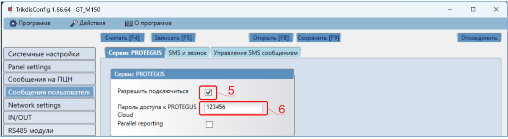

4. Отметьте поле „**Разрешить подключиться“** к сервису Protegus2.

2.  Измените „**Пароль доступа к Protegus Cloud“**. Запрос на ввод пароля будет поступать при добавлении системы к приложению Protegus2 (заводской пароль - 123456). Важно: если вы меняете код через TrikdisConfig, вам также необходимо изменить его и в приложении Protegus2.

**Окно „Network settings“:**

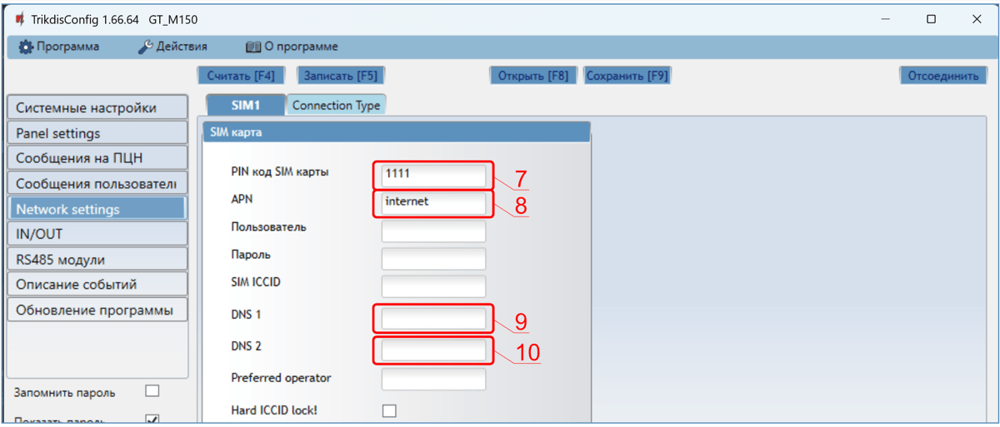

3. Введите „**PIN код SIM карты“**.

2.  Введите имя **APN**. **APN** найдете на страничке оператора SIM карты. „Internet” является универсальным и работает во многих сетях операторов мобильной связи.

3.  **DNS1** — по умолчанию адрес Google DNS-сервера. Независимо от настроек IP, убедитесь, что DNS-адреса соответствуют адресам, поддерживаемым вашим интернет-провайдером.

4.  **DNS2** — по умолчанию адрес Google DNS-сервера. Независимо от настроек IP, убедитесь, что DNS-адреса соответствуют адресам, поддерживаемым вашим интернет-провайдером.

Завершив конфигурацию, нажмите кнопку **Записать [F5]** и отключите кабель USB.

!!! note
    Настройки GT с TrikdisConfig описаны п.6 „Конфигурация с
    программой TrikdisConfig".
### Настройка связи с ПЦН 

**Окно „Системные настройки“:**

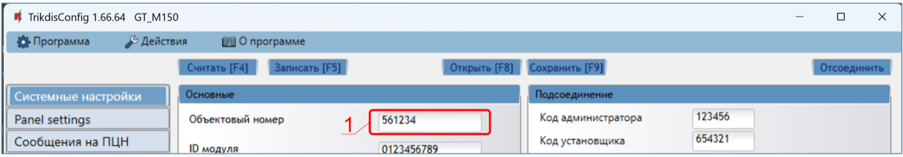

1.  Введите **Объектовый номер (Не используйте FFFE, FFFF объектовые номера**.**)**.

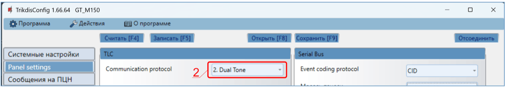

1.  Если коммуникатор подключен к клеммам TIP/RING охранной панели, то необходимо установить "**Dual tone**".

2. Если коммуникатор подключен к шине клавиатуры или последовательной шине охранной панели, то выберите модель охранной панели, которая будет подключена к коммуникатору.

Окно „Сообщение на ПЦН“, группа „Основной канал связи“:

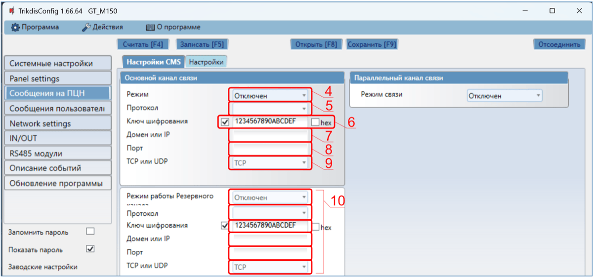

3. **Режим** – выберите **IP** режим связи.

2.  **Протокол** – выберите кодировку, с которой будут отправляться сообщения: **TRK8** (на приемники TRIKDIS), **DC-09_2007** или **DC-09_2012** (на универсальные приемники), **TL150** (на SUR-GARD приемники).

3.  **Ключ шифрования** – введите ключ шифрования, который установлен в приемнике.

4.  **Домен или IP** – введите адрес домена или IP адрес приемника.

5.  **Порт** – введите номер порта приемника в сети.

6.  **TCP или UDP** – выберите протокол (TCP или UDP) передачи сообщений.

7.  (Рекомендуется) Сделайте настройки „**Режима работы Резервного канала связи**“.

**Окно „Network settings“:**

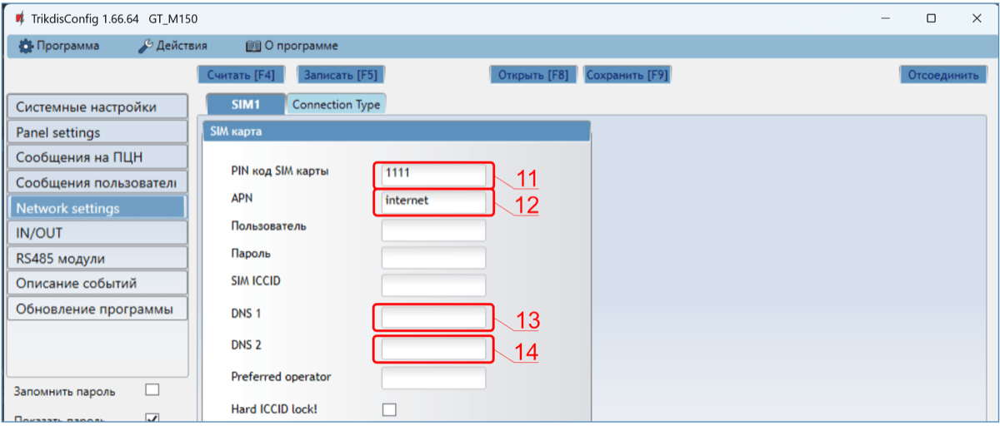

11. Введите „**PIN код SIM карты“**.

12. Введите имя **APN.** **APN** найдете на страничке оператора SIM карты. „Internet” является универсальным и работает во многих сетях операторов мобильной связи.

13. **DNS1** — по умолчанию адрес Google DNS-сервера. Независимо от настроек IP, убедитесь, что DNS-адреса соответствуют адресам, поддерживаемым вашим интернет-провайдером.

14. **DNS2** — по умолчанию адрес Google DNS-сервера. Независимо от настроек IP, убедитесь, что DNS-адреса соответствуют адресам, поддерживаемым вашим интернет-провайдером.

Завершив конфигурацию, нажмите кнопку **Записать [F5]** и отключите кабель USB.

!!! note
    Настройки GT с TrikdisConfig описаны п.6 „Конфигурация с
    программой TrikdisConfig".
## Установка и схемы соединений 

### Установка 

1.  Снимите верхнюю крышку. Снимите клеммные колодки.

2.  Установите нано-SIM карту.

3.  Снимите плату.

4.  Корпус прикрепите шурупами.

5.  Обратно установите плату и клеммные колодки.

6.  Подсоедините GSM антенну.

7.  Закройте верхнюю крышку.

!!! note
    Убедитесь, что SIM карта активирована. / Убедитесь, что включена услуга
    мобильного интернета, если будет использоваться приложение
    Protegus2 или связь с ПЦН по IP каналу. / Если хотите избежать
    ввода PIN кода SIM карты в TrikdisConfig, вставьте SIM карту в
    телефон и отключите функцию запроса PIN кода.
### Схемы подсоединения коммуникатора к охранным панелям 

Подсоедините коммуникатор к охранной панели по одной из ниже указанных схем.

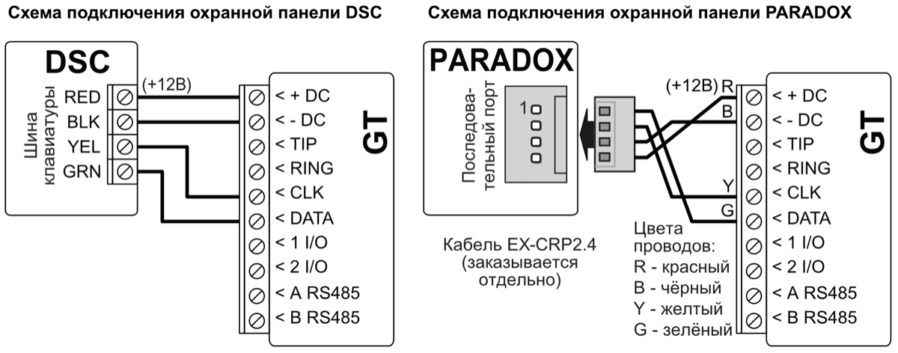

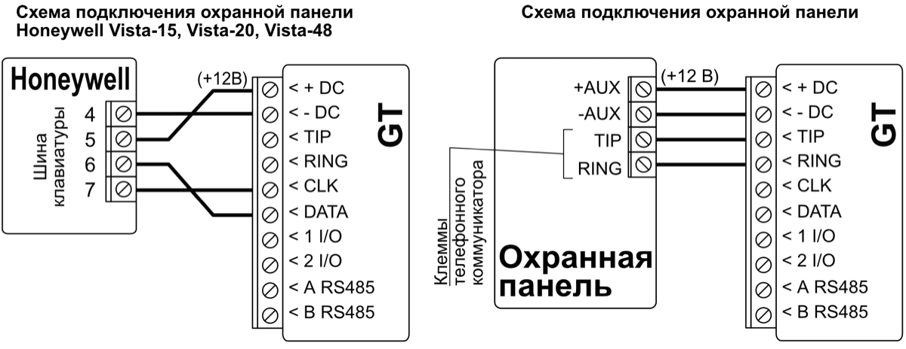

### Схема подключения коммуникатора к шине клавиатуры и телефонному коммуникатору (клеммы TIP/RING) охранной панели PARADOX SP/SP+/MG/MG+ 

При подключении коммуникатора к шине клавиатуры и клеммам TIP/RING охранной панели необходимо сделать следующие настройки коммуникатору GT:

1.  Выберите „**Dual tone**”.

2.  Выберите модель охранной панели „**7. Paradox SP+/MG+ series KeyBus**“.

3.  Выберите „**Прямое управление панелью**“, если вы хотите, чтобы пользователи могли управлять панелью с помощью приложения Protegus2, используя свой код клавиатуры.

4.  Для прямого управления охранной панелью введите „**Пароль доступа ПК**“. Он должен совпадать с паролем, введенным в охранной панели.

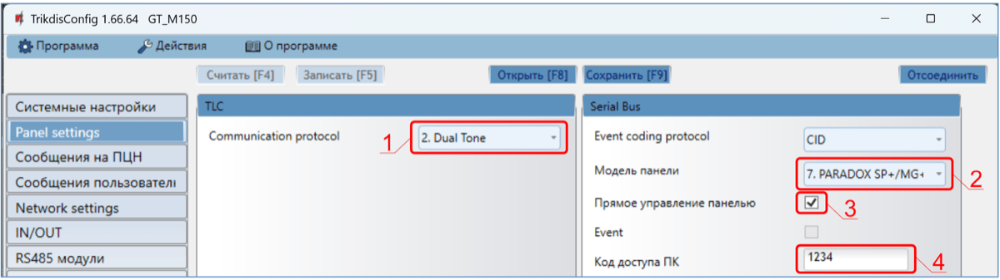

Охранную панель Paradox необходимо запрограммировать для передачи сообщений на ПЦН и для удаленного управления с приложения Protegus2.

| **Ячейка** |    **Данные**    | **Ячейка** | **Данные** |
|:----------:|:----------------:|:----------:|:----------:|
|    801     | \*\*\*\*\*\*\*\* |    815     |   123456   |
|    811     |       1111       |    911     |    1234    |
|    812     |       2222       |            |            |

### Схема подсоединения GT к зоне выключателя (keyswitch) охранной панели 

Руководствуйтесь этой схемой, при включении/выключении охранной панели зоной выключателя (keyswitch), которая управляется PGM выходом коммуникатора GT.

!!! note
    Коммуникатор GT имеет 2 универсальных клеммы I/O, которым можно
    установить режим работы Выход (OUT). PGM выходы (OUT) могут управлять
    двумя разделами охранной сигнализации. Для такого управления, необходимо
    в программе TrikdisConfig в окне „**Panel settings**" снять
    галочку с поля „**Прямое управление панелью"**. В приложении
    Protegus2 необходимо сделать настройки, которые описаны в
    п. 5.2 „Дополнительные настройки для включения/ выключения системы зоной
    выключателя".
Коммуникатор подключен к шине клавиатуры или последовательной шине охранной панели. / Постановка/снятие охранной панели с охраны осуществляется через зону выключателя.

Коммуникатор подключен к клеммам TIP/RING охранной панели. / Постановка/снятие охранной панели с охраны осуществляется через зону выключателя.

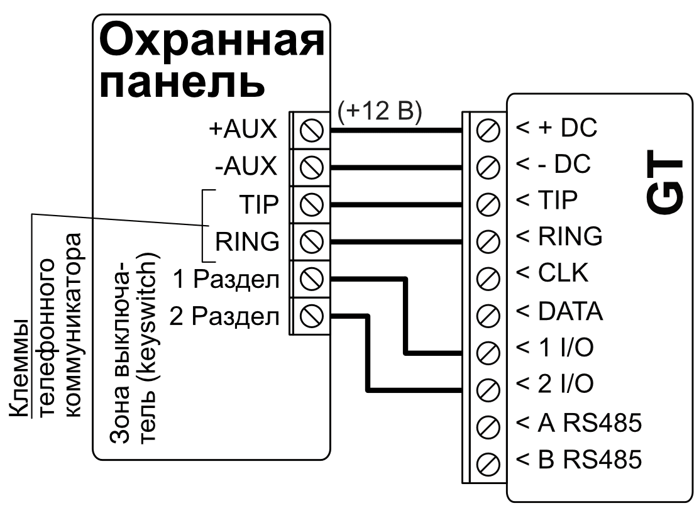

### Схема подключения входа 

Коммуникатор имеет две универсальных I/O клеммы, которым можно установить режим работы IN (вход). К клемме входа можно подключить цепь: NC, NO, NO/EOL, NC/EOL, NO/DEOL, NC/DEOL. Заводская установка входа: **1 I/O** – NO (нормально открытый); **2 I/O** – NO (нормально открытый). Установка другого типа входа осуществляется с программой TrikdisConfig в окне „**IN/OUT**“ **-> Тип**.

Cхемы типов входных цепей NC, NO, NO/EOL, NC/EOL, NO/DEOL, NC/DEOL:

!!! note
    Подключив к коммуникатору Trikdis iO-8 расширители, можно
    увеличить количество входов (IN), выходов (OUT).
### Схема подключения реле 

При помощи контактов реле можно удаленно управлять (включить/выключить) различными электрическими приборами. I/O клемме коммуникатора должен быть установлен режим работы выход (OUT).

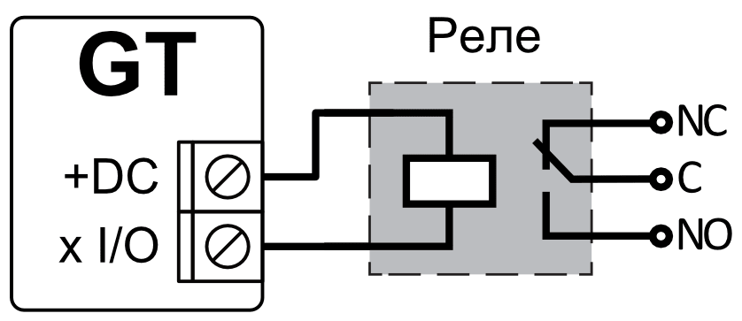

### Схема подключения расширителей iO-8 

Для увеличения количества входов (IN), выходов (OUT) необходимо подключить проводной Trikdis *iO-8* расширитель. Конфигурация *GT* с модулем расширения описаны в п. 6.8 „Окно „RS485 модули“.

### Включение коммуникатора 

Для запуска коммуникатора, необходимо включить питание охранной панели. На коммуникаторе должны загореться световые индикаторы:

- „POWER“ светит зеленым цветом (достаточный уровень питающего напряжения).

- „NETWORK“ светит зеленым и мигает желтым цветом, когда коммуникатор зарегистрировался в сети.

!!! note
    Достаточный уровень 4G сигнала - 3 (3 желтых вспышки индикатора
    „NETWORK"). / Если сосчитаете меньше желтых вспышек индикатора
    „NETWORK", то уровень сигнала GSM сети недостаточный. Рекомендуется
    подыскать другое место установки коммуникатора или применить внешнюю
    антенну. / Световая индикация индикаторов коммуникатора описана в
    п. 1.6 „Световая индикация". / Если индикаторы коммуникатора GT не
    светятся, то проверьте источник питания и соединения проводов.
## Программирование охранных панелей 

### Программирование охранных панелей при подключении коммуникатора к шине клавиатуры или последовательному шине 

Ниже описывается программирование охранных панелей для совместной работы с коммуникатором GT, чтобы коммуникатор мог получать и передавать сообщения. Отправляя команды на коммуникатор, можно управлять охранной панелью удаленно.

Чтобы включить удаленное управление охранной панелью, необходимо галочкой отметить поле „**Прямое управление панелью**“ в программном окне „**Panel settings**“.

#### DSC

Охранные панели DSC программировать не требуется.

#### PARADOX

Охранные панели Paradox необходимо программировать только для прямого управления с Protegus2. Для получения данных коммуникатором, охранные панели Paradox программировать не требуется.

Для удаленного управления Paradox панелями необходимо установить „**Пароль подключения ПК“** („*PC download password*“). Этот пароль должен совпасть с паролем, который ввели в программе TrikdisConfig в окне „**Panel settings**“ в поле „**Код доступа ПК“**. Поле „**Код доступа ПК“** для удаленного управления появится после того, как отметите поле „**Прямое управление панелью“**.

Программирование охранной панели для установки „**Пароля подключения ПК“**:

- Панель серии MAGELLAN, SPECTRA. В ячейке 911 введите 4-значный пароль подключения.

- Панель серии DIGIPLEX EVO. В ячейке 3012 введите 4-значный пароль подключения.

#### TEXECOM

Охранную панель Texecom необходимо запрограммировать для передачи сообщений и для удаленного управления.

Необходимо ввести пароль „**UDL** **passcode“** охранной панели Texecom. Этот пароль должен совпасть с паролем, который ввели в программе TrikdisConfig в окне „**Panel settings**“ в поле „**Код доступа ПК“**. Поле „**Код доступа ПК“** для удаленного управления появится после того, как отметите поле „**Прямое управление панелью“**.

Охранную панель Texecom можете запрограммировать с Wintex программой. Введите „**UDL passcode“** (4-значный пароль) в программном окне „**Communication Option“**, закладка „**Options“.**

Программирование охранной панели можно осуществить с клавиатуры панели:

1.  Введите 4-значный код установщика и нажмите кнопку [Menu].

2.  Нажмите кнопку [9].

3.  Нажмите кнопки [7][6] и потом нажмите кнопку [2]. Введите 4-значный пароль „**UDL** **passcode“** („**UDL passcode“** должен совпасть с „**Кодом доступа ПК“** коммуникатора GT).

4.  Нажмите кнопку [Yes]. Выйдите из режима программирования, нажав кнопку [Menu].

#### UTC INTERLOGIX(CADDX)

Программирование охранной панели осуществите с клавиатуры панели:

1.  Нажмите кнопки [\*][8] и введите код установщика (заводской код 9713).

2.  Введите номер оборудования, который назначен для подключенного коммуникатора (заводской - 0).

3.  Сделайте настройки панели, которые указаны в таблице ниже. По порядку введите номер „**Ячейки“**, „**Сегмент“** и введите „**Данные“**. Нажав [\*], вернетесь в поле ввода „**Ячейки“**.

| Ячейка | Сегмент | Данные |
|--------|---------|--------|
| 23 | 3 | 12345678 |
| 37 (необязательно) | 3 | 12345678 |
| 37 (необязательно) | 4 | 1234567* |
| 90 | 3 | 12345678 |
| 93 | 3 | 12345678 |
| 96 | 3 | 12345678 |
| 99 | 3 | 12345678 |
| 102 | 3 | 12345678 |
| 105 | 3 | 12345678 |
| 108 | 3 | 12345678 |

Окончив ввод данных, нажмите кнопку [Exit] два раза, чтобы выйти из режима программирования.

#### INNERRANGE

Охранная панель **Innerrange Inception** должна иметь прошивку **2.3.0.3507-r0** или более высокую.

Охранная панель должна быть подключена к интернету. Подключитесь к охранной панели **Innerrange Inception**, набрав в браузере: <https://skytunnel.com.au/inception/SERIALNUMBER> . Где SERIALNUMBER – вводится серийный номер охранной панели, который указан на корпусе панели.

Войдите в **Configuration>General>Alarm Reporting**. В группе **3rd Party Device Reporting** необходимо установить:

1.  **Enable 3rd Party Device Reporting** – отметьте поле.

2.  **3rd Party Device Type** – введите „Trikdis“.

3.  **Serial port** – введите „Serial Port 1 (Plugged In, In Use By 3rd Party Device)“.

4.  Сохраните настройки и выйдите из программы.

#### HONEYWELL ADEMCO VISTA

Программирование охранных панелей **Honeywell Ademco Vista-20** и **Honeywell Ademco Vista-48**. **Прошивка охранных панелей должна быть V5.3 и выше**. Программирование осуществляется с подключенной клавиатуры:

1.  Войдите в режим программирования. Введите код установщика [4][1][1][2] и затем введите [8][0][0]. Или включите питание охранной панели и в течение 50 сек., после включения питания, нажмите одновременно кнопки [\*] и [#] (такой метод входа в режим программирования применяется, когда вышли из режима программирования, нажав на клавиатуре кнопки [\*][9][8]).

2.  Включите отправление CID через LRR. На клавиатуре нажмите кнопки [\*][2][9][1][#].

3.  Используя функцию „**Прямое управление панелью“**, разрешите использовать второй AUI адрес. Наберите на клавиатуре [\*][1][8][9][1][1][#] .

4.  Выйдите из режима программирования. Наберите на клавиатуре [\*][9][9] .

### Программирование охранных панелей при подключении коммуникатора к клеммам TIP/RING охранной панели 

Чтобы охранная панель отправляла сообщения через телефонный коммуникатор, он должен быть включен и запрограммирован. Согласно руководству программирования охранной панели, запрограммируйте телефонный коммуникатор:

1.  Включите телефонный коммуникатор охранной панели.

2.  Введите номер телефона пульта (введите любой номер не менее четырехзначного. Коммуникатор GT ответит на звонок охранной панели.).

3.  Выберите режим DTMF.

4.  Выберите формат связи Contact ID.

5.  Введите 4-ехзначный номер объекта.

Зоне, к которой подсоединен выход OUT коммуникатора GT, установите тип Выключатель (keyswitch), чтобы удаленно включать/выключать охранную панель.

!!! note
    Режим работы зоны выключателя (keyswitch) может быть „**Импульс"** или
    „**Сигнал"**. Заводская настройка выхода (OUT) GT импульсный режим
    (3 сек.). В приложении Protegus2 можно изменить продолжительность
    импульсного режима, а так же можно задать режим работы выхода (OUT) как
    „**Импульс"** или „**Сигнал".** См. п. 5.2 „Дополнительная настройка для
    Включения/Выключения системы зоной выключателя"**.**
Программирование телефонного коммуникатора охранной панели Honeywell Vista

Войдите в режим программирования и в ячейки запишите значения, которые указаны ниже:

- \*41 – введите телефонный номер приемника ПЦН (пульт централизованного наблюдения);

- \*43 – введите номер объекта охранной панели;

- \*47 – установите Тональный набор в [1] ячейку и введите количество попыток набора номера телефона;

- \*48 – Contact ID (используется заводская настройка). \*48 должно быть установлено 7;

- \*49 - Split / Dual сообщение. \*49 должно быть установлено 5;

- \*50 – задержка отправления сообщения о срабатывании охранной панели (необязательно). Заводская настройка [2,0], что дает 30 секундную задержку на отправление сообщения. Чтобы сообщение было отправлено сразу установите [0,0].

**Выйдите из режима программирования.**

После настройки необходимых параметров выйдите из режима программирования. На клавиатуре наберите \*99.

Специальные настройки охранной панели „Honeywell Vista 48”

Необходимые настройки охранной панели „**Honeywell Vista 48**“ для совместной работы с GT приведены в таблице.

| **Ячейка** | **Данные** | **Ячейка** | **Данные** | **Ячейка** | **Данные** |
|:--:|----|:--:|:--:|:--:|:--:|
| \*41 | 1111 (номер телефона приемника) | \*60 | 1 | \*69 | 1 |
| \*42 | 1111 | \*61 | 1 | \*70 | 1 |
| \*43 | 1234 (номер объекта охранной панели) | \*62 | 1 | \*71 | 1 |
| \*44 | 1234 | \*63 | 1 | \*72 | 1 |
| \*45 | 1111 | \*64 | 1 | \*73 | 1 |
| \*47 | 1 | \*65 | 1 | \*74 | 1 |
| \*48 | 7 | \*66 | 1 | \*75 | 1 |
| \*50 | 1 | \*67 | 1 | \*76 | 1 |
| \*59 | 0 | \*68 | 1 |  |  |

После настройки параметров выйдите из режима программирования. На клавиатуре наберите \*99.

#### UTC INTERLOGIX(CADDX)

Программирование охранной панели **Interlogix NX-4V2** (**NX-6V2, NX-8V2**) при подключении коммуникатора к клеммам TIP/RING охранной панели.

|  | Ввод с клавиатуры | Описание |
|--|-------------------|----------|
|  | *89713 | Вход в режим программирования |
|  | 0# |  |
| Location 0 | 0# |  |
| Location 0 | 1*2*3*4*# |  |
| Location 1 | 1# |  |
| Location 1 | 1*2*3*4*# |  |
| Location 2 | 2# |  |
| Location 2 | 1*# |  |
| Location 4 | 4# | Светодиоды всех зон горят (segment 1) |
| Location 4 | 12345678* | Светодиоды всех зон горят (segment 2) |
| Location 4 | 12345678*# |  |
| Location 23 | 23# | Светодиоды всех зон горят (segment 3) |
| Location 23 | ** | Светодиоды всех зон горят (segment 3) |
| Location 23 | 12345678*# | Светодиоды всех зон горят (segment 3) |
| Location 37 | 37# | Светодиоды всех зон горят (segment 3) |
| Location 37 | ** | Светодиоды всех зон горят (segment 4) |
| Location 37 | 12345678* |  |
| Location 37 | 12345678*# |  |
|  | EXIT EXIT | Выход из режима программирования |

## Удаленное управление 

### Добавление охранной системы к приложению Protegus2 

С Protegus2 пользователи смогут удаленно управлять системой охраны. Пользователь будет иметь информацию о состоянии системы охраны, получать уведомления о событиях системы охраны.

1.  Скачайте и запустите приложение Prоtegus2 или используйте браузерную версию [www.protegus.app](https://www.protegus.app).

    

      
      
      
    

2.  Подключитесь к системе с помощью своего имени и пароля или создайте новую учетную запись.

!!! note
    При добавлении GT к Protegus2 должно быть:
    
    1.  Установлена активированная SIM карта и введен или отключен PIN код;
    
    2.  Включен Protegus сервис. См. п. 6.4 „Окно „Сообщения
        пользователю"";
    
    3.  Включено питание GT (индикатор „POWER" светит зеленым цветом);
    
    4.  GT подключен к GSM сети (индикатор „NETWORK" светит зеленым
        цветом и мигает желтым).
3. Нажмите „**Add new system“** и введите „Unique ID/IMEI“ номер GT, который найдете на изделии или на упаковке. Нажмите кнопку „**Next“**.

4. Введите название системы. Нажмите кнопку „**Next**“.

### Дополнительные настройки для включения/выключения системы зоной выключателя 

!!! note
    Зоне охранной панели, к которой подключен выход OUT коммуникатора
    GT, должен быть установлен тип - Выключатель (keyswitch).
Следуйте приведенным ниже инструкциям, если постановка/снятие с охраны будет осуществляться PGM выходом коммуникатора GT, который подключен к зоне выключателя (keyswitch) охранной панели.

1.  Нажмите кнопку „**Continue**“.

2. Введите “**Area name**“. Включите управление PGM выходом приложением Protegus2.
3. Выберите „**Pulse“** или „**Level“**, в зависимости от того, как настроен тип зоны выключателя (keyswitch). Если необходимо, можете изменить интервал импульса.

2.  Нажмите кнопку „**Save**“.

3. Если будет еще один раздел охранной сигнализации, то необходимо нажать „**Click to add an area**“. Настройка PGM выхода аналогично описанной выше.

2.  После окончания настроек нажмите кнопку „**Skip**“.

### Включение/выключение охранной системы с *Protegus2* 

1.  Нажмите на икону статуса системы „Disarm“.

2.  В *Protegus2* придет сообщение об изменении статуса системы охраны и икона статуса изменит свое состояние.

### Управление SMS сообщениями 

Коммуникатором можно управлять с помощью SMS сообщений.

Структура SMS сообщения: Пароль `[пробел]` Команда `[пробел]` Данные

В качестве пароля применяйте **Код администратора** (может выполнять команды: *INFO, RESET, OUTPUTx*) или **Код установщика** (может выполнять команды: *INFO, OUTPUTx*).

#### Список SMS команд

| Команда | Данные | Описание |
|---------|--------|----------|
| INFO |  | Запрос информации об устройстве. Ответ будет содержать информацию: номер IMEI, серийный номер, версию прошивки. Например: 123456 INFO |
| RESET |  | Запуск работать контроллера заново. Например: 123456 RESET |
| OUTPUTx | ON | x – номер выхода коммуникатора GТ (1, 2) |
| OUTPUTx | OFF | Включить выход OUTPUT1. Например: 123456 OUTPUT1 ON |
| OUTPUTx | PULSE=tttt | Выключить выход OUTPUT1. Например: 123456 OUTPUT1 OFF |
| OUTPUTx |  | Включить выход OUTPUT2 на продолжительность импульса. „tttt“ – продолжительность импульса (вводится 4-значное число), сек.. / Например: 123456 OUTPUT2 PULSE=0002 |

Можно указать телефонные номера, команды которых будет принимать и исполнять коммуникатор. Настройка коммуникатора описана в п. 6.5 „Окно „Сообщения пользователю““, закладка „Управление SMS сообщением“.

## Конфигурация с программой TrikdisConfig 

### Строка состояния *TrikdisConfig* 

Подключив GT и TrikdisConfig и нажав на кнопку **Считать [F4]**, программа в строке состояния предоставит информацию о подключенном изделии.

| Наименование | Описание |
|----|----|
| IMEI/​Уникальный № | IMEI номер изделия |
| Состояние | Рабочее состояние |
| Модуль | Тип изделия (должно быть указано GT) |
| SN | Серийный номер изделия |
| BL | Версия программы |
| FW | Версия программы изделия |
| HW | Версия аппаратной части изделия |
| Состояние | Подключение программы к изделию (USB или Remote (удаленно)) |
| Роль | Уровень доступа (показывается после подтверждения кода доступа) |

Нажав кнопку **Считать [F4]**, программа TrikdisConfig считает и покажет настройки коммуникатора GT. С TrikdisConfig сделайте необходимые настройки, по приведенному ниже описанию.

### Окно „Системные настройки“ 

Группа „Основные“

- **Объектовый номер** – если сообщения будут отправляться на ПЦН (пульт централизованного наблюдения), то необходимо указать номер объекта (6-значный шестнадцатеричный номер, 0-9, А-F. **Не используйте FFFE, FFFF объектовые номера**.), который предоставлен ПЦН.

- **ID модуля** - введите ID номер модуля.

- **Установить время** – выберите сервер для синхронизации времени внутренних часов.

Группа „Подсоединение“

- **Код администратора** – дает полный доступ к конфигурации коммуникатора (заводской код - 123456).

- **Код установщика** – дает ограниченный доступ к конфигурации коммуникатора (заводской код – 654321).

- **„Восстановить” может только администратор** – отметив поле, восстановить заводские настройки коммуникатора можно будет только после ввода кода администратора.

**Примечание**: Если отмечено поле „**„Восстановить“ может только администратор**“, а кода администратора не знаете, то восстановить заводские настройки может производитель ЗАО „Trikdis“ (это платная услуга).

- **Установщику разрешено менять** – администратор устанавливает, какие параметры сможет менять установщик.

### Окно „Panel settings“ 

**Группа „TLC”**

Коммуникатор подсоединен к клеммам TIP/RING охранной панели.

- **Communication protocol -** установите "**Dual tone**".

- **Использовать объектовый номер панели –** если поле отмечено, то коммуникатор будет отправлять сообщения с номером объекта, введенным в охранной панели.

- **Ждать подтверждения от ПЦН** – если поле отмечено, то после каждого отправленного сообщения коммуникатор будет ждать подтверждения от IP приемника о получении сообщения. Если коммуникатор не получит подтверждения, то не сформирует сигнал конца связи (kiss off). Телефонный коммуникатор охранной панели, не получив сигнала конца связи, повторно отправит сообщение.

- **Частота Dial tone** - частота, с которой коммуникатор GT поддерживает связь с телефонным коммуникатором охранной панели.

Группа „Serial bus”

Коммуникатор подсоединен к шине клавиатуры или последовательной (serial) шине охранной панели.

- **Event coding protocol** - выберите протокол уведомления о событии (CID или SIA).

- Выберите **Модель панели**, к которой подключен коммуникатор.

- **Прямое управление панелью** – отметьте поле и коммуникатор GT будет осуществлять прямое управление охранной панелью. Этот параметр отображается для охранных панелей с прямым управлением. В п. 4.1 „Программирование охранных панелей при подключении коммуникатора к шине клавиатуры или последовательному порту*“* описана настройка охранных панелей с прямым управлением.

- **Event -** отметьте поле, чтобы коммуникатор отправлял сообщения о событиях на ПЦН и в Protegus2.

- **Код доступа ПК** – для прямого управления охранными панелями Paradox и Texecom необходимо ввести код PC/UDL. Код должен совпасть с кодом, который введен в охранной панели. Программирование охранных панелей описано в разделе 4.1 *„*Программирование охранных панелей при подключении коммуникатора к шине клавиатуры или последовательному порту“.

### Окно „Сообщения на ПЦН” 

**Закладка „Настройки ПЦН“**

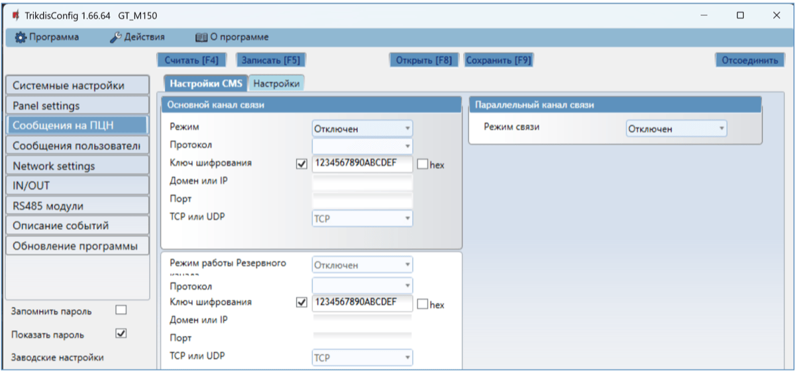

Настройте параметры „**Основных**“ и „**Резервных**“ каналов связи, если коммуникатор будет отправлять сообщения на ПЦН охранной фирмы.

Сообщения могут отправляться по нескольким каналам связи. Основной и параллельный каналы связи могут работать параллельно, так коммуникатор отправляет сообщения на два приемника одновременно. Резервный канал связи может быть назначен как основному, так и параллельному каналам связи. Резервные каналы связи используются при нарушениях в основных каналах связи.

Сообщения на ПЦН отправляются шифрованными и защищены паролем. Для приема и передачи сообщений в программу мониторинга необходим приемник Trikdis:

- **IP сообщения** – программный приемник IPcom Windows/Linux, IP/SMS аппаратурный приемник RL14 или многоканальный приемник RM14.

Группа „Основной канал связи”

- **Режим** – выберите способ связи (IP) с приемником ПЦН.

- **Протокол** – **TRK8** передача данных на IP приемники Trikdis, **SIA DC-09** передача данных на универсальные IP приемники, **TL150** передача данных на SUR-GARD приемники.

- **Ключ шифрования** – ключ шифрования сообщений. Ключ шифрования, введенный в коммуникатор, должен совпадать с ключoм шифрования, который записан в приемнике ПЦН.

- **Домен или IP** – введите адрес домена или IP адрес приемника.

- **Порт** – введите номер порта (port) приемника в сети.

- **TCP или UDP** – выберите протокол (TCP или UDP) передачи сообщений.

Группа „Параллельный канал связи”

На этом канале связи сообщения передаются параллельно с основным каналом связи. При включении Параллельного канала связи, сообщение отправляются на два приемника одновременно (пр.: на местный и центральный приемники ПЦН). Поля настройки Параллельного канала связи аналогичны настройкам Основного канала связи.

Группа „Резервный канал связи”

Включите режим резервного канала, чтобы сообщения отправлялись резервным каналом связи при нарушении основного канала связи. Настройка резервного канала связи аналогична настройкам основного канала.

**Закладка „Настройки“**

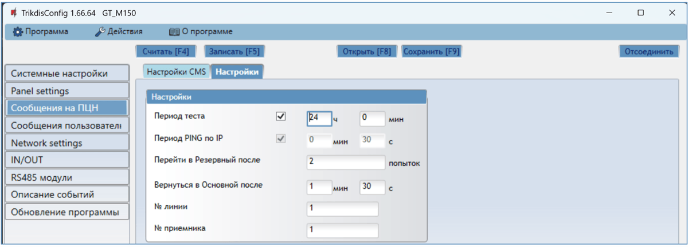

Группа „Настройки“

- **Период теста** – период отправки тестовых сообщений для проверки канала связи. Тестовые сообщения отправляются Contact ID кодами и передаются на программу мониторинга.

- **Период PING по IP** – период отправки внутренних PING сигналов проверки связи. Эти сообщения отправляются только по IP каналу. Приемник не передает PING сообщения на программу мониторинга, не перегружая ее. В программу мониторинга поступает информация только тогда, когда приемник не получает PING сообщения от коммуникатора в течение установленного периода времени.

  По умолчанию приемник передаст сообщение о потере связи („*Connection lost*”) в программу мониторинга после того, как пройдет в три раза больший период времени, чем установлен период PING сообщения коммуникатора. Например: Если установлен период PING 3 минуты. Приемник передаст сообщение о потере связи после 9 минут.

  Вместе PING сообщения поддерживают активный сеанс связи между устройством и приемником. Активный сеанс связи необходим для удаленной конфигурации и управления коммуникатором. Рекомендуется установить продолжительность PING периода не более 5 минут.

- **Перейти в Резервный после** – введите количество неудачных попыток передать сообщение по Основному каналу связи. После неудачной попытки передать сообщение установленное количество раз, коммуникатор переключится передавать сообщения по Резервному каналу связи.

- **Вернуться в основной после** – введите промежуток времени, по истечении которого коммуникатор GT попытается восстановить связь и передать сообщения по Основному каналу.

  - **№ линии** – введите номер линии.

  - **№ приемника** – введите номер приемника.

### Окно „Сообщения пользователю” 

**Закладка “Сервис Protegus”**

Protegus сервис позволяет пользователям удаленно наблюдать и управлять коммуникатором. Больше информации о Protegus сервисе найдете на [www.protegus.app](https://www.protegus.app).

**Группа „Сервис Protegus“**

- **Разрешить подключиться** – отметьте поле, чтобы включить Protegus сервис. Коммуникатор GT сможет обмениваться данными с приложением Protegus2. С программой TrikdisConfig можно удаленно конфигурировать коммуникатор.

- **Пароль доступа к Protegus Cloud** – 6-значный код подключения к Protegus2 (заводской код - 123456). Важно: если вы меняете код через TrikdisConfig, вам также необходимо изменить его и в приложении Protegus2.

- **Передача параллельно** – отметьте поле и будет разрешена одновременная передача сообщений по **Основному каналу** (на ПЦН) и в Protegus2.

**Закладка “SMS и звонок”**

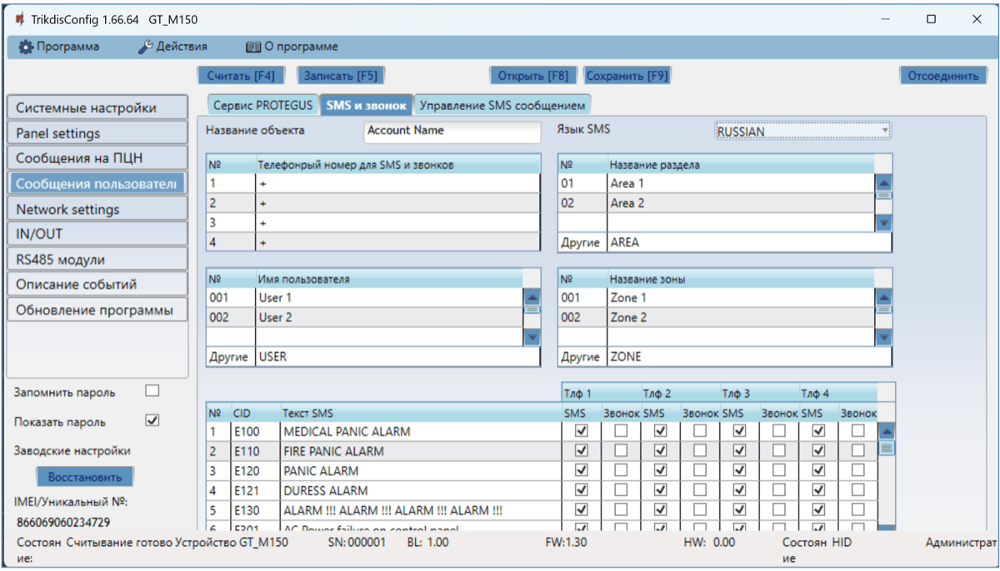

Можете установить, чтобы пользователь о событиях был информирован SMS сообщением или звонком.

- **Название объекта** – введите название системы, к которой подключен коммуникатор. Каждое SMS сообщение будет передаваться с названием объекта.

- **Язык SMS** – выберите язык SMS сообщений (SMS сообщения могут отправляться на разных языках).

- **Телефонный номер для SMS и звонков** – можно ввести до 4 телефонных номеров пользователей, которым будут отправляться SMS сообщения или звонки. Номера телефонов должны быть с международным кодом страны (например: +370xxxxxxxx, 00370xxxxxxxx или 370xxxxxxxx).

- **„Название раздела”, „Имя пользователя”, „Название зоны”** – каждому разделу, пользователю, зоне может быть присвоено название, которое будет использоваться в SMS сообщениях. В соответствующей таблице впишите порядковый номер раздела, пользователя, зоны и рядом введите название.

- **Таблица CID кодов** – вы можете отметить события, о которых пользователь будет информирован SMS сообщением и/или телефонным звонком.

  Можете редактировать тексты SMS сообщений, изменять номера Contact ID (CID) кодов и вводить новые события и их описание.

**Закладка “Управление SMS сообщением”**

Можете отправить SMS команду коммуникатору GT, которая активирует выход или отправит информацию о коммуникаторе. SMS команды управления описаны в п. 5.4 „Управление SMS сообщениями“.

- **Текст ответа по SMS** – SMS текст, который получит пользователь после отправления SMS комaнды. Текст SMS сообщения можно редактировать.

- **Номера телефонов для удаленного управления** – введите номера телефонов, с которых отправляемые команды будут приниматься и выполняться коммуникатором.

!!! note
    Если не будет указан ни один телефонный номер, коммуникатор примет
    команды с любого телефонного номера. В любом случае, безопасность
    обеспечивается требованием ввести пароль администратора или установщика
    в SMS команде.
### Окно “Network settings”

!!! note
    1\. Перед использованием SIM карты убедитесь, что она активирована. / 2.
    Включите услугу мобильного интернета SIM карты, если будет применяться
    мобильный интернет для передачи данных по IP каналу связи на приемник
    ПЦН или в приложение Protegus2.
Закладка “SIM1”

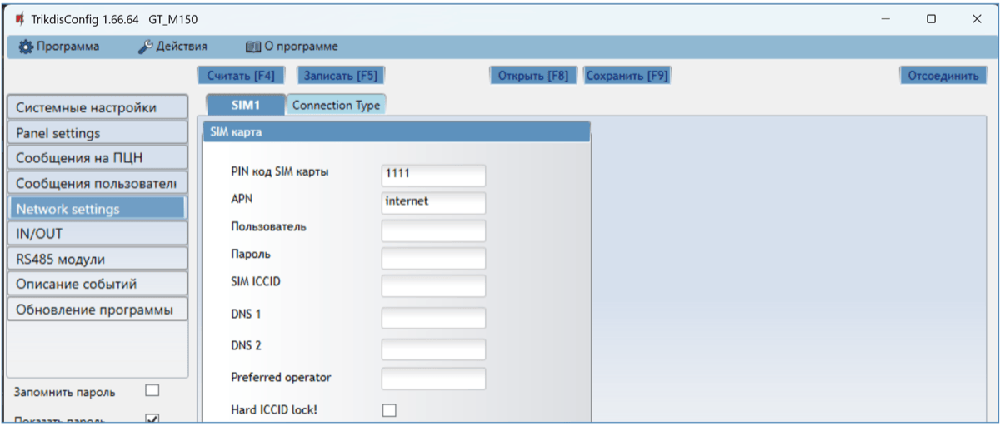

Группа „SIM карта“

- **PIN код SIM карты** – введите PIN код SIM карты. PIN код можете выключить, вставьте SIM карту в телефон и отключите запрос ввода PIN кода. Если запрос PIN кода отключили, то в поле оставьте заводской код.

- **APN** – введите APN (англ. Access Point Name). Он необходим для подключения коммуникатора к интернету. **APN** найдете на страничке оператора SIM карты. „Internet“ – является универсальным и работает в сетях многих операторов мобильной связи.

- **Пользователь, Пароль** – если необходимо, введите „**Пользователя“** и „**Пароль“** для подсоединения к **APN**.

- **SIM ICCID** – введите номер ICCID SIM-карты, если хотите, чтобы коммуникатор работал только с этой SIM-картой.

- **DNS1 и DNS2** - (англ. Domain Name System) введите IP адрес сервера домена. Используется, когда в поле Домен или IP указывается домен. По умолчанию, установлены адреса Google DNS серверов. Независимо от настроек IP, убедитесь, что DNS-адреса соответствуют адресам, которые поддерживаются вашим интернет-провайдером.
- **Preferred operator** – после ввода кода оператора мобильной сети коммуникатор подключится только к сети выбранного оператора. Код оператора мобильной связи состоит из кодов MCC и MNS.

- **Hard ICCID lock** - отметив поле и перезагрузив коммуникатор он будет строго привязан к указанному ICCID коду SIM-карты.

  **Закладка “Connection Type”**

  

  Эти настройки действительны для коммуникаторов с модемом CAT-M1. Вы можете указать частоты, на которых будет работать модем коммуникатора.

### Окно „IN/OUT“ 

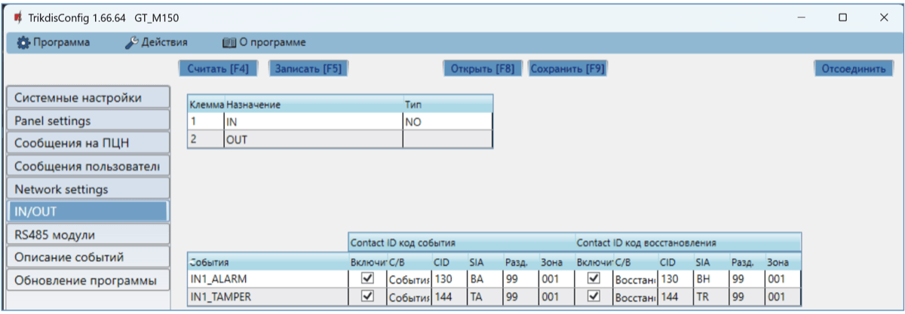

Коммуникатор имеет 2 универсальных клеммы I/O (вход/выход). В таблице устанавливается режим работы клеммы (Выключено; IN; OUT). Входу необходимо указать тип подключаемой цепи NC, NO, NO/EOL, NC/EOL, NO/DEOL, NC/DEOL.

К входам коммуникатора можно подключить дополнительные датчики. При срабатывании датчика, коммуникатор отправит сообщение о событии. Входу назначается Contact ID (SIA) код, который будет отправлен в ПЦН и в приложение Protegus2.

- **Включить** – отметьте поля событий, сообщения которых будут отправлены в ПЦН и в приложение Protegus2.

- **С/В** – укажите условие отправления внутреннего события (Событие или Восстановление).

- **CID** – код события.

- **SIA** – код события.

- **Разд**. – укажите номер раздела, который будет отправляться при срабатывании и восстановлении внутреннего события коммуникатора.

- **Зона** – укажите номер зоны, которая будет отправляться при срабатывании и восстановлении внутреннего события коммуникатора.

### Окно „RS485 модули“ 

К коммуникатору можно подключить расширители iO-8, которые добавят дополнительные входы и выходы. Подключенные модули должны быть внесены в таблицу „**Список модулей**“.

**Закладка „Список модулей“**

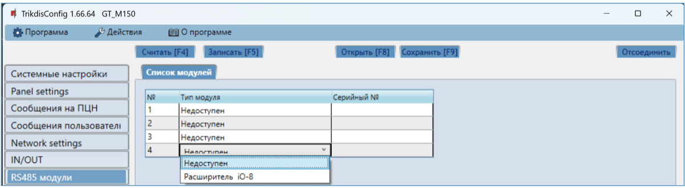

- **№** – порядковый номер модуля.

- **Тип модуля** – из списка выберите модуль, который подключен к RS485 шине коммуникатора.

- **Серийный №** – введите серийный (6-значный) номер модуля, который указан на упаковке или на корпусе модуля.

Выбрав подключенный модуль и указав его серийный номер, перейдите в **RS485 модули** **→ Модуль.**

**Закладка „Модуль1“**

Подсоединив к коммуникатору расширитель (как описано выше), в программном окне **RS485 модули** появится закладка для настроек данного модуля. Ниже описываются поля настроек модулей расширения iO-8.

**Окно настроек расширителя iO-8**

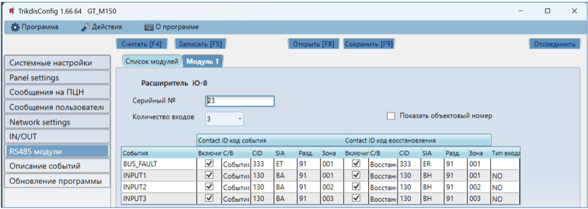

Модуль расширения iO-8 имеет 8 универсальных (вход/выход) клемм. К коммуникатору можно подключить четыре iO- 8 расширителя.

- **Количество входов** – выберите, скольким клеммам присвоить режим работы вход (IN). оставшиеся клеммы станут управляемыми выходами (OUT).

Настройка управляемых выходов выполняется в приложении Protegus2 (выходы настраиваются для „**Постановки на охрану/Снятие с охраны“** или для „**Удаленного управления“**).

В таблице входам (Input) можно присвоить Contact ID коды События и Восстановления. После активации входа, коммуникатор отправит сообщения с указанным кодом события на ПЦН, в приложение Protegus2.

**Contact ID код события:**

- **Включить** – разрешить отправление сообщений при активации входа.

- **С/В** – выберите, какого типа сообщение будет отправляться при активации входа – „**Событие“** или „**Восстановление“**.

- **CID** – входу указывается Contact ID код срабатывания.

- **SIA** – входу указывается SIA код срабатывания.

- **Разд.** – укажите раздел, которому принадлежит вход. Номер раздела определяется автоматически: если модуль №1, то раздел 91; если модуль №4, то раздел 94.

- **Зона** – входу (зоне) присваивается номер, который будет записываться в сообщении.

**Contact ID код восстановления**:

- **Включить** – разрешить отправление сообщений при восстановлении входа.

- **С/В** – выберите, какого типа сообщение будет отправляться при восстановлении входа – „**Восстановление“** или **„Событие“**.

- **CID** – входу указывается Contact ID код восстановления.

- **SIA** – входу указывается SIA код восстановления.

- **Разд.** – укажите раздел, которому принадлежит вход. Номер раздела определяется автоматически: если модуль №1, то раздел 91; если модуль №4, то раздел 94.

- **Зона** – входу (зоне) присваивается номер, который будет записываться в сообщении.

- **Объектовый номер** – входу (IN) можно задать объектовый номер, который будет отличаться от объектового номера коммуникатора GT.

- **Тип входа** – укажите тип входа (NO, NC или EOL).

### Окно „Описание событий” 

В программном окне можно включить, выключить и изменить отправляемые внутренние события коммуникатора. Выключив внутреннее сообщение в этом программном окне, оно не будет отправляться независимо от других настроек.

- **COMMUNICATION** – сообщение о нарушении связи между охранной панелью и коммуникатором GT.

- **POWER** – сообщение о низком уровне питающего напряжения.

- **REMOTE_FINISHED** – сообщение об отключении конфигурации удаленного подсоединения с TrikdisConfig.

- **REMOTE_STARTED** – сообщение об удаленном подсоединении для конфигурации GT с TrikdisConfig.

- **TEST** – периодическое тестовое сообщение.

!!! note
    Настройка периодических тестовых сообщений производится в программном
    окне „**Cообщения на ПЦН**" **→ „Настройки" → Период теста.**
- **Включить** – отметьте поле и включите отправление сообщений.

Можете изменить Contact ID код любого события, изменить номер „**Раздела“** и номер „**Зоны“**, которые указываются в сообщении.

### Восстановление заводских настоек 

Для восстановления заводских настроек коммуникатора GT необходимо в программном окне TrikdisConfig нажать кнопку „**Восстановить“**.

Другой способ восстановления заводских настроек.

К коммуникатору подключено напряжение питания. Нажмите и удерживайте кнопку «RESET» на плате коммуникатора в течение 10 секунд. Удерживайте кнопку „RESET”, пока LED индикаторы („NETWORK“, „POWER“, „TROUBLE“) погаснут и загорится „POWER“ LED индикатор. Отпустите кнопку „RESET”. Заводские параметры коммуникатора восстановлены.

1.  **Удаленная настройка параметров**

!!! note
    Удаленная настройка параметров возможна, если:
    
    1.  Установлена активированная SIM карта и введен или отключен PIN код.
    
    2.  Включен Protegus сервис, см. п. 6.4 Окно „Сообщения
        пользователю".
    
    3.  Включено питание GT (индикатор „POWER" светит зеленым цветом).
    
    4.  GT зарегистрирован в сети мобильной связи (индикатор „NETWORK"
        светит зеленым цветом и мигает желтым).
2. В компьютере запустите программу TrikdisConfig.

2.  В поле „Уникальный №“ введите IMEI номер GT, который указан на упаковке или на изделии.

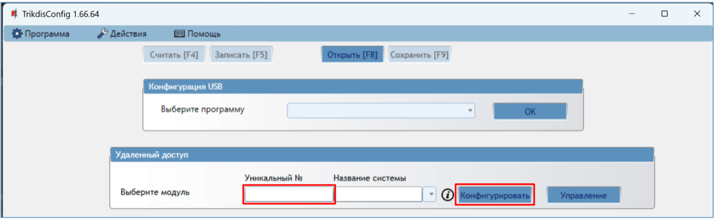

3. В поле „**Название системы**“ напишите название коммуникатора.

2.  Нажмите кнопку „**Конфигурировать“**.

3.  Откроется программное окно GT. Нажмите кнопку **Считать [F4],** чтобы были считаны настройки GT. Если всплывет окно запроса ввода „**Кода администратора“** или **„Кода установщика“**, введите 6-значный код администратора или установщика. Отметьте поле рядом с „**Запомнить пароль“** и нажмите кнопку **Записать [F5]**.

4.  Сделайте необходимые настройки для GT. Запишите эти изменения в GT, нажав на кнопку **Записать [F5]**. Нажмите кнопку „**Отсоединить**“ и выйдите из программы TrikdisConfig.

## Тестирование GSM коммуникатора *GT* 

После установки и конфигурации выполните тестирование системы:

1.  Спровоцируйте событие:

- Включите/выключите режим охраны с клавиатурой охранной панели;

- При включенной охранной системе активируйте зону.

1.  Проверьте получение сообщений на ПЦН и в приложении Protegus2.

2.  Активируйте вход коммуникатора и убедитесь, что пользователи получают сообщения о событии.

3.  Активируйте выходы коммуникатора удаленно и убедитесь, что выходы срабатывают, а пользователи получают сообщения о событиях.

4.  Если будет применяться удаленное управление охранной панелью, то удаленно включите/отключите режим охраны охранной панели с приложением Protegus2.

## Обновление прошивки GT 

!!! note
    Подключите GT к TrikdisConfig. Если есть новая прошивка для
    GT, то TrikdisConfig предложит обновить прошивку. Для
    обновления прошивки должно быть подключение к сети интернет. / Если в
    компьютере установлена антивирусная программа, то она может блокировать
    функцию автоматического обновления программного обеспечения. В этом
    случае придется изменить настройки в антивирусной программе.
Прошивку коммуникатора GT можно обновить или заменить вручную. После обновления все ранее установленные настройки коммуникатора остаются. Прошивка может быть заменена на новую или на старую версии. Выполните следующие шаги:

1.  Запустите программу ***TrikdisConfig**.*

2.  Подключите коммуникатор GT к компьютеру с помощью кабеля USB-С или подсоединитесь удаленно. Если есть новая прошивка, то TrikdisConfig предложит обновить программное обеспечение GT.

3.  В программе TrikdisConfig откройте окно „**Обновление программы**“**.**

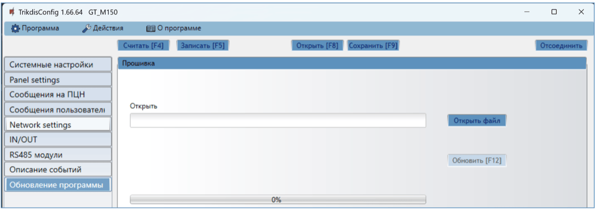

4. Нажмите кнопку „**Открыть файл**“ и выберите нужный файл для установки.

2.  Нажмите кнопку **Обновить [F12]**.

3.  Подождите, пока произойдет обновление прошивки.

## Приложение 

Коммуникатор, получаемые от охранной панели, Contact ID коды конвертирует в SIA коды.

Таблица конвертирования Contact ID кодов в SIA коды

| **События системы** | **CID код** | **SIA код** |
|----|:--:|:--:|
| Медицинская тревога | E100 | "MA" |
| Медицинская тревога в <z> зоне | E101 | "QA" |
| Пожарная тревога в зоне: <z> | E110 | "FA" |
| Обнаружена утечка воды в зоне: <z> | E113 | "SA" |
| Нажата пожарная кнопка в зоне: <z> | E115 | "FA" |
| Нажата кнопка паники в зоне: <z> | E120 | "PA" |
| Тревога принуждения пользователем: <v> | E121 | "HA" |
| Нажата кнопка паники в зоне: <z> | E122 | "HA" |
| Нажата кнопка паники в зоне: <z> | E123 | "HA" |
| Нажата кнопка паники в зоне: <z> | E124 | "HA" |
| Нажата кнопка паники в зоне: <z> | E125 | "HA" |
| Тревога в зоне: <z> | E130 | "BA" |
| Тревога в зоне: <z> | E131 | "BA" |
| Тревога в зоне: <z> | E132 | "BA" |
| Тревога в зоне: <z> | E133 | "BA" |
| Тревога в зоне: <z> | E134 | "BA" |
| Тревога в зоне: <z> | E135 | "BA" |
| Предварительная тревога в зоне: <z> | E138 | "TA" |
| Подтверждение проникновения в зоне: <z> | E139 | "BV" |
| Тревога в зоне: <z> | E140 | "UA" |
| Неисправность в системе (143) | E143 | "ET" |
| Тамперная тревога в зоне: <z> | E144 | "TA" |
| Тамперная тревога в зоне: <z> | E145 | "TA" |
| Тревога в зоне: <z> | E146 | "BA" |
| Тревога в зоне: <z> | E150 | "UA" |
| Обнаружен газ в зоне: <z> | E151 | "GA" |
| Обнаружена утечка воды в зоне: <z> | E154 | "WA" |
| Обнаружение разрыва фольги в зоне | E155 | "BA" |
| Высокая температура <n> датчика | E158 | "KA" |
| Низкая температура <n> датчика | E159 | "ZA" |
| Тревога, Угарный Газ в зоне: <z> | E162 | "GA" |
| Неисправность пожарной системы в зоне: <z> | E200 | "FS" |
| Мониторинг тревоги | E220 | "BA" |
| Неисправность в системе (300) | E300 | "YP" |
| Потеря питания переменного тока | E301 | "AT" |
| Низкий заряд батареи | E302 | "YT" |
| Неисправность в системе (304) | E304 | "YF" |
| Перезагрузка Системы | E305 | "RR" |
| Изменено программирование охранной панели | E306 | "YG" |
| Система отключена | E308 | "RR" |
| Неисправность батареи (309) | E309 | "YT" |
| Обрыв заземления | E310 | "US" |
| Неисправность батареи (311) | E311 | "YM" |
| Перегрузка тока (312) | E312 | "YP" |
| Инженерный сброс пользователем: <v>(313) | E313 | "RR" |
| Неисправность Сирены/Реле | E320 | "RC" |
| Неисправность в системе (321) | E321 | "YA" |
| Неисправность в системе (330) | E330 | "ET" |
| Неисправность в системе (332) | E332 | "ET" |
| Неисправность в системе (333) | E333 | "ET" |
| Неисправность в системе (336) | E336 | "VT" |
| Неисправность в системе (338) | E338 | "ET" |
| Неисправность в системе (341) | E341 | "ET" |
| Неисправность в системе (342) | E342 | "ET" |
| Неисправность в системе (343) | E343 | "ET" |
| Неисправность в системе (344) | E344 | "XQ" |
| Неисправность связи (350) | E350 | "YC" |
| Неисправность связи (351) | E351 | "LT" |
| Неисправность связи (352) | E352 | "LT" |
| Неисправность в системе (353) | E353 | "YC" |
| Неисправность связи (354) | E354 | "YC" |
| Неисправность в системе (355) | E355 | "UT" |
| Неисправность пожарной зоны: <z> | E373 | "FT" |
| Неисправность в зоне: <z> | E374 | "EE" |
| Неисправность в зоне: <z> | E378 | "BG" |
| Неисправность в зоне: <z> | E380 | "UT" |
| Неисправность беспроводной зоны: <z> | E381 | "US" |
| Неисправность беспроводного модуля (382) | E382 | "UY" |
| Тамперная тревога в зоне: <z> | E383 | "TA" |
| Низкий заряд батареи в беспроводной зоне: <z> | E384 | "XT" |
| Неисправность в зоне: <z> (389) | E389 | "ET" |
| Неисправность в зоне: <z> (391) | E391 | "NA" |
| Неисправность в зоне: <z> (393) | E393 | "NC" |
| Пользователь <v> снял систему с охраны | E400 | "OP" |
| Пользователь <v> снял систему с охраны | E401 | "OP" |
| Автоматическое снятие с охраны | E403 | "OA" |
| Отложенное снятие с охраны пользователем <v> | E405 | "OR" |
| Сброс тревоги пользователем <v> | E406 | "BC" |
| Удаленное снятие с охраны пользователем: <v> | E407 | "OP" |
| Быстрая постановка на охрану пользователем: <v> | E408 | "OP" |
| Удаленное снятие с охраны | E409 | "OS" |
| Запрос обратного вызова, сделанный ПЦН | E411 | "RB" |
| Загрузка завершена успешно | E412 | "RS" |
| Доступ запрещен для пользователя: <v> | E421 | "JA" |
| Вход пользователя <v> | E422 | "DG" |
| Принудительный доступ в зоне <z> | E423 | "DF" |
| Выход запрещен для пользователя <v> | E424 | "DD" |
| Выход пользователя <v> | E425 | "DR" |
| Раннее снятие с охраны пользователем: <v> | E451 | "OK" |
| Поздняя постановка на охрану пользователем: <v> | E452 | "OJ" |
| Снятие с охраны не удалось | E453 | "CT" |
| Постановка на охрану не удалась | E454 | "CI" |
| Авто-постановка на охрану не удалась | E455 | "CI" |
| Частичная постановка на охрану пользователем: <v> | E456 | "CG" |
| Нарушение Выход пользователя: <v> | E457 | "EE" |
| Снятие с охраны после тревоги пользователем: <v> | E458 | "OR" |
| Recent arm <v> user | E459 | "CR" |
| Введен неверный код | E461 | "JA" |
| Авто-постановка на охрану продлена пользователем: <v> | E464 | "CE" |
| Устройство отключено (501) | E501 | "RL" |
| Устройство отключено (520) | E520 | "RO" |
| Беспроводной датчик отключен в зоне: <z> (552) | E552 | "YS" |
| Отключение зоны: <z> | E570 | "UB" |
| Отключение зоны: <z> | E571 | "FB" |
| Отключение зоны: <z> | E572 | "MB" |
| Отключение зоны: <z> | E573 | "BB" |
| Отключение группы зон пользователем: <v> | E574 | "CG" |
| Отключение зоны: <z> | E576 | "UB" |
| Отменено отключение зоны: <z> | E577 | "UB" |
| Отключение вент зоны | E579 | "UB" |
| Ручное тестовое сообщение | E601 | "RX" |
| Периодическое тестовое сообщение | E602 | "RP" |
| Системное событие (605) | E605 | "JL" |
| Системное событие (606) | E606 | "LF" |
| Режим тест-прохода детекторов активирован пользователем: <v> | E607 | "TS" |
| Периодический тест с неисправностью | E608 | "RY" |
| Системное событие (622) | E622 | "JL" |
| Системное событие (623) | E623 | "JL" |
| Время/Дата установлена пользователем <v> | E625 | "JT" |
| Системное время/дата не корректна | E626 | "JT" |
| Начато программирование системы | E627 | "LB" |
| Закончено программирование системы | E628 | "LS" |
| Системное событие (631) | E631 | "JS" |
| Системное событие (632) | E632 | "JS" |
| Система не активна (654) | E654 | "CD" |
| Медицинская тревога в <z> зоне восстановилась | R100 | "MH" |
| Медицинская тревога в <z> зоне восстановилась | R101 | "QH" |
| Восстановление пожарной тревоги в зоне: <z> | R110 | "FH" |
| Восстановление утечки воды в зоне <z> | R113 | "SH" |
| Восстановлена кнопка паники в зоне: <z> | R120 | "PH" |
| Сброс тревоги принуждения пользователем <v> | R121 | "HH" |
| Восстановлена кнопка паники в зоне: <z> | R122 | "PH" |
| Восстановлена кнопка паники в зоне: <z> | R123 | "PH" |
| Восстановлена кнопка паники в зоне: <z> | R124 | "HH" |
| Восстановлена кнопка паники в зоне: <z> | R125 | "HH" |
| Восстановление тревоги в зоне: <z> | R130 | "BH" |
| Восстановление тревоги в зоне: <z> | R131 | "BH" |
| Восстановление тревоги в зоне: <z> | R132 | "BH" |
| Восстановление тревоги в зоне: <z> | R133 | "BH" |
| Восстановление тревоги в зоне: <z> | R134 | "BH" |
| Восстановление тревоги в зоне: <z> | R135 | "BH" |
| Восстановление тамперной тревоги в зоне: <z> | R137 | "TA" |
| Восстановление тревоги в зоне: <z> | R140 | "UH" |
| Неисправность в системе восстановлена (143) | R143 | "ER" |
| Восстановление тамперной тревоги в зоне: <z> | R144 | "TR" |
| Восстановление тамперной тревоги в зоне: <z> | R145 | "TR" |
| Восстановление тревоги в зоне: <z> | R146 | "BH" |
| Восстановление тревоги в зоне: <z> | R150 | "UH" |
| Восстановление тревоги газа в зоне: <z> | R151 | "GH" |
| Восстановление утечки воды в зоне <z> | R154 | "WH" |
| Сброс тревоги Обнаружение разрыва фольги в зоне: <z> | R155 | "BH" |
| Температура <n> датчика нормализовалась | R158 | "KH" |
| Температура <n> датчика нормализовалась | R159 | "ZH" |
| Восстановление тревоги угарного газа в зоне: <z> | R162 | "GH" |
| Восстановление неисправности пожарной системы в зоне: <z> | R200 | "FV" |
| Мониторинг восстановления тревоги | R220 | "BH" |
| Неисправность в системе восстановлена (300) | R300 | "YA" |
| Восстановление питания переменного тока | R301 | "AR" |
| Заряд батареи восстановлен | R302 | "YR" |
| Неисправность в системе восстановлена (304) | R304 | "YG" |
| Сброс Система восстановлена в зоне: <z> | R305 | "RR" |
| Неисправность батареи восстановлена (309) | R309 | "YR" |
| Восстановление замыкания заземления | R310 | "UR" |
| Неисправность батареи восстановлена (311) | R311 | "YR" |
| Восстановление перегрузки тока (312) | R312 | "YQ" |
| Восстановление неисправности Сирены/Реле | R320 | "RO" |
| Неисправность в системе восстановлена (321) | R321 | "YH" |
| Неисправность в системе восстановлена (330) | R330 | "ER" |
| Неисправность в системе восстановлена (332) | R332 | "ER" |
| Неисправность в системе восстановлена (333) | R333 | "ER" |
| Неисправность в системе восстановлена (336) | R336 | "VR" |
| Неисправность в системе восстановлена (338) | R338 | "ER" |
| Неисправность в системе восстановлена (341) | R341 | "ER" |
| Неисправность в системе восстановлена (342) | R342 | "ER" |
| Неисправность в системе восстановлена (344) | R344 | "XH" |
| Восстановление неисправности связи (350) | R350 | "YK" |
| Восстановление неисправности связи (351) | R351 | "LR" |
| Восстановление неисправности связи (352) | R352 | "LR" |
| Неисправность в системе восстановлена (353) | R353 | "YK" |
| Восстановление неисправности связи (354) | R354 | "YK" |
| Неисправность в системе восстановлена (355) | R355 | "UJ" |
| Восстановление неисправности пожарной зоны: <z> | R373 | "FJ" |
| Восстановление неисправности в зоне: <z> | R374 | "EA" |
| Восстановление неисправности в зоне: <z> | R380 | "UJ" |
| Восстановление неисправности беспроводной зоны: <z> | R381 | "UR" |
| Восстановление неисправности беспроводного модуля (382) | R382 | "BR" |
| Восстановление тамперной тревоги в зоне: <z> | R383 | "TR" |
| Заряд батареи в беспроводной зоне восстановлен: <z> | R384 | "XR" |
| Восстановление неисправности в зоне: <z> (391) | R391 | "NS" |
| Восстановление неисправности в зоне: <z> (393) | R393 | "NS" |
| Пользователь <v> поставил систему на охрану | R400 | "CL" |
| Пользователь <v> поставил систему на охрану | R401 | "CL" |
| Автоматическая постановка на охрану | R403 | "CA" |
| Удаленная постановка на охрану пользователем: <v> | R407 | "CL" |
| Быстрое снятие с охраны | R408 | "CL" |
| Удаленная постановка на охрану | R409 | “CS” |
| Постановка на охрану в дневном режиме пользователем: <v> | R441 | "CG" |
| Ранняя постановка на охрану пользователем: <v> | R451 | “CK” |
| Позднее снятие с охраны пользователем: <v> | R452 | “CJ” |
| Снятие с охраны не удалась | R454 | “CI” |
| Частичная постановка на охрану пользователем: <v> | R456 | "CG" |
| Recent disarm <v> user | R459 | “CR” |
| Устройство включено (501) | R501 | "RG" |
| Устройство включено (520) | R520 | "RC" |
| Беспроводной датчик включен в зоне: <z> (552) | R552 | "YK" |
| Отменено отключение зоны: <z> | R570 | "UU" |
| Отменено отключение зоны: <z> | R571 | "FU" |
| Отменено отключение зоны: <z> | R572 | "MU" |
| Отменено отключение зоны: <z> | R573 | "BU" |
| Отмена отключения группы зон пользователем: <v> | R574 | "CF" |
| Отменено отключение зоны: <z> | R576 | "UU" |
| Отключение зоны: <z> | R577 | "UU" |
| Отменено отключение вент зоны | R579 | "UU" |
| Режим тест-прохода детекторов выключен пользователем: <v> | R607 | "TE" |
| Время/Дата установлена пользователем <v> | R625 | "JT" |
| Система активна (654) | R654 | "CD" |

## Содержание 

## Требования безопасности 

Устанавливать и обслуживать коммуникатор могут только квалифицированные специалисты.

Перед установкой оборудования внимательно ознакомьтесь с данным руководством, чтобы избежать ошибок при монтаже из-за чего оборудование будет плохо работать и может быть испорчено.

Выполняя работы по установке оборудования, обязательно должно быть выключено его внешнее питание.

Изменения внесенные в конструкцию изделия, самостоятельный ремонт лишают изделие гарантии производителя.

Соблюдайте нормы местного законодательства и не утилизируйте изделие или его компоненты вместе с другими бытовыми отходами.
