# Радиопередатчик Т16

## Описание 

Радиопередатчик Т16 это многофункциональное устройство, используемое для передачи сообщений охранных панелей через радиосети „Trikdis”.

Передатчик может отправлять собственные сообщения и сообщения охранной панели на ПЦН (пульт централизованного наблюдения) с возможностью из ПЦН направить сообщение конечному пользователю.

#### Функциональность

Связь

- Отправка сообщений на ПЦН.

- Протокол радио сети: RAS3, RAS2M, LARS1, LARS.

- Выходная мощность от 1 Вт до 5 Вт.

- Возможность использования внешнего IP модуля как основного канала связи.

- Передача сообщений о событиях Contact ID и 4+2 кодами.

- Использование идентификатора учетной записи охранной панели для охранной системы, которая разделена на несколько разделов.

Настройка

- Простая и быстрая установка.

- Обновление заводской прошивки радиопередатчика.

- Два уровня настройки параметров: установщик и администратор.

- Возможность настраивать удаленно, когда используется IP передатчик.

**Последовательный порт, входы и выходы**

- Универсальный последовательный порт для подключения разных охранных панелей.

- TIP/RING шина телефонного коммуникатора, которая может принять сообщения от охранной панели Contact ID и 4+2 кодами.

- Шина RS485 предназначена для подсоединения IP передатчика и считывателя электронных ключей.

- 6 входов, тип: NC, NO, EOL (2,2 кΩ). (T16V, T16U)

5 входов, тип: NC, NO, EOL (2,2 кΩ). (T16U5)

- 1 выход. (T16V, T16U)

2 выхода. (T16U5)

### Описание функционирования 

Радиопередатчик подсоединяется к охранной панели, считывает сигналы и преобразует их в сообщения, соответствующие Contact ID кодам.

Если радиопередатчик настроен на вещание с кодированием RAS-3, то сообщение Contact ID передается без изменений. Если радиопередатчик настроен для передачи сообщений другими радиокодами, то сообщения конвертируются в соответствующие коды системы. Таблица преобразования кодов хранится в памяти радиопередатчика и при необходимости может быть изменена. Если для приема используется оборудование Trikdis, то полученные сообщения (в любой кодировке) передаются в программу мониторинга с их точными значениями.

К входам IN радиопередатчика можно подключить *NC, NO* или *EOL* (2,2 кΩ) тип цепи. При активации входной цепи или ее восстановлении, радиопередатчик отправит сообщение этого события.

Принятые сообщения охранной панели, радиопередатчик установленной радиочастотой и кодировкой передает в эфир. Тоже самое сообщение может быть повторено от 1 до 10 раз. Можно установить, чтобы радиопередатчик передавал сообщения на двух разных радиочастотах, двумя разными кодировками и разными идентификационными номерами охраняемого объекта.

Радиопередатчик периодически отправляет тестовые сообщения для проверки радиосвязи. Своевременный прием тестовых сообщений контролируется программой мониторинга сообщений. Можно непрерывно отправлять PING сообщения, своевременный прием которых контролирует приемное оборудование пульта централизованного наблюдения.

Радиопередатчик автоматически проверяет питающее напряжение. Если напряжение упадет ниже 11,5 ±0,2 В, радиопередатчик отправит сообщение о недостаточном напряжении питания. Если напряжение возрастет выше 12,6 ±0,2 В, радиопередатчик отправит сообщение о восстановлении напряжения питания.

Если напряжение питания упадет ниже 10 ±0,2 В, то радиопередатчик перейдет в „спящий“ режим. Перед отключением, радиопередатчик отправит об этом сообщение. Находясь в „спящем“ режиме радиопередатчик не копит и не отправляет сообщений. Радиопередатчик выйдет из „спящего“ режима, если напряжение питания 12,6 В останется стабильным при включении радиопередатчика.

**Источник питания постоянного тока.** Т16 должен быть подключен прямо к клеммам AUX или к клеммам 12 В аккумулятора. Сечение провода питания радиопередатчика не менее 1 мм2. В режиме передачи данных Т16 потребляет ток 1,2 А, поэтому стабильность питающего напряжения очень важна для надежной работы радиопередатчика.

**Антенна.** Антенна очень важна для обеспечения качественной связи. Используйте антенну соответствующей частоты и мощности. Если применяется 1/4 λ антенна, то она должна быть вертикально ориентирована и установлена как можно выше. Не устанавливайте антенны в местах, которые закрыты от приемной антенны металлическими экранами или железобетонными перегородками. Наилучшее качество связи обеспечивается при прямой видимости антенн приемника и передатчика. Кроме того, качество связи можно улучшить, подняв антенну на максимально возможную высоту. Антенна к радиопередатчику подключается коаксиальным кабелем 50 Ω. Чем длиннее кабель, тем больше потери сигнала. Рекомендуется использовать кабель длиной до 10 м. При длине кабеля до 5 м рекомендуется применять RG-58U или другой более лучший кабель. Для длинного кабеля применяйте кабель с низким затуханием. После установки радиопередатчика, вы должны проверить качество связи. Для этого необходимо отправить несколько сообщений и проверить уровень сигнала в приемнике. Уровень сигнала должен быть не ниже 3.

**Кабель данных.** Кабель данных между радиопередатчиком и охранной панелью не должен превышать 50 см. Если кабель данных длиннее 50 см, то необходимо применять экранированный кабель. Кабель данных подключается к магистрали клавиатуры, к последовательному порту или телефонному коммуникатору охранной панели. Избегайте прокладки кабеля параллельно с силовыми кабелями переменного тока, с антенными кабелями и другими сильными источниками электромагнитных полей.

**Интерфейс RS485**. К интерфейсу RS485 можно подключить модули W485, Е485 и TM17. Для RS485 шины длиной более 1 м используйте кабель витой пары (STP4x2x0,5). Избегайте прокладки кабеля параллельно с силовыми кабелями переменного тока, с антенными кабелями и другими сильными источниками электромагнитных полей.

### Технические параметры 

| Параметр | T16V | T16U | T16U5 |
|----------|------|------|-------|
| Напряжение питания | 10-15 В постоянного тока |  |  |
| Потребляемый ток | До 50 мA (в режиме ожидания) До 1,2 A (в режиме передачи данных) |  |  |
| Радио частоты | 136 MГц – 174 MГц (VHF) | 430 MГц – 512 MГц (UHF) | 430 MГц – 470 MГц (UHF) |
| Радио канал | 2 |  |  |
| RF выходное сопротивление | 50 Ω |  |  |
| Побочные излучения | Соответствует EN 300 113 |  |  |
| RF протокол передачи данных | RAS3, RAS2M, LARS, LARS1, LARS_RAS2M, LARS1_RAS2M |  |  |
| Продолжительность передачи сообщения | 60-400 мсек. (зависит от выбранного радио протокола) |  |  |
| Память | до 32 сообщений |  |  |
| Вход | 6, тип: NC, NO, EOL (2,2 кΩ) | 6, тип: NC, NO, EOL (2,2 кΩ) | 5, тип: NC, NO, EOL (2,2 кΩ) |
| Выход | 1, тип: открытый коллектор;​ 1 А;​ 15 В | 1, тип: открытый коллектор;​ 1 А;​ 15 В | 2, тип: открытый коллектор;​ 1 А;​ 15 В |
| Формат сообщений о событиях | Contact ID;​ 4+2 |  |  |
| Условия эксплуатации | Температура от -20 °C до +50 °C, относительная влажность 0-80%, при температуре +20 °C (без конденсации) |  |  |
| Размер | 113 x 71 x 26 мм |  |  |
| Вес | 0,10 кг |  |  |

Приемники, получающие сообщения, отправляемые радиопередатчиком *Т16* в различных форматах радиосистем

|                      | RAS-002 | RAS-2M | LARS  | LARS1 | RAS-3 |
|----------------------|:-------:|:------:|:-----:|:-----:|:-----:|
| TRIKDIS R7           |  **+**  | **+**  | **+** | **+** |       |
| TRIKDIS RF7          |  **+**  | **+**  | **+** | **+** |       |
| TRIKDIS R11          |  **+**  | **+**  | **+** | **+** | **+** |
| TRIKDIS RF11         |  **+**  | **+**  | **+** | **+** | **+** |
| Другие производители |         |        | **+** | **+** |       |

### Элементы радиопередатчика 

|  |  | Разъем SMA для антенны. Световые индикаторы. Щель для снятия верхней крышки. Клеммы для подключения внешних устройств. |
|--|--|------------------------------------------------------------------------------------------------------------------------|
| T16V, T16U | T16U5 |  |

### Клеммы подключения 

| Клемма | Описание |
|----|----|
| +DC | Клемма подключения питания (10-15 В постоянного тока, положительная клемма) |
| -DC | Клемма подключения питания (10-15 В постоянного тока, отрицательная клемма) |
| Rx/​CLK | CLK клемма последовательного порта охранной панели |
| Tx/​DATA | DATA клемма последовательного порта охранной панели |
| A RS485 | Клемма А интерфейса *RS485* |
| B RS485 | Клемма B интерфейса *RS485* |
| COM/​RING | Общая (отрицательная) клемма или RING клемма телефонного коммуникатора |
| TIP | TIP клемма телефонного коммуникатора |
| IN1/​R-1 | Клемма входа №1, тип: NO, NC, EOL (2,2 кΩ). (заводская настройка - NO). Или клемма мониторинга телефонной линии |
| IN2/​T-1 | Клемма входа №2, тип: NO, NC, EOL (2,2 кΩ). (заводская настройка - NO). Или клемма мониторинга телефонной линии |
| IN3 | Клемма входа №3, тип: NO, NC, EOL (2,2 кΩ). (заводская настройка – NO) |
| IN4 | Клемма входа №4, тип: NO, NC, EOL (2,2 кΩ). (заводская настройка – NO) |
| COM | Общая клемма |
| IN5 | Клемма входа №5, тип: NO, NC, EOL (2,2 кΩ). (заводская настройка – NO) |
| IN6 /​ или | Клемма входа №3, тип: NO, NC, EOL (2,2 кΩ). (заводская настройка – NO). (T16V, T16U) |
| OUT1 | Клемма выхода, тип: открытый коллектор, ток до 1 А. (T16U5) |
| OUT1 /​ или | Клемма выхода, тип: открытый коллектор, ток до 1 А. (T16V, T16U) |
| OUT2 | Клемма выхода, тип: открытый коллектор, ток до 1 А. (T16U5) |

### Световая индикация 

| Индикатор | Статус | Описание |
|-----------|--------|----------|
| NETWORK / (Сеть) | Мигает зеленым | Радиопередатчик отправляет данные |
| DATA / (Данные) | Зеленый | Есть неотправленные сообщения в памяти |
| DATA / (Данные) | Красный | Переполнена буферная память |
| DATA / (Данные) | Мигает красный (1/1) | Проблема соединения с охранной панелью |
| DATA / (Данные) | Мигает красный (1/10) | Проблема соединения модулей в шине RS-485 |
| POWER / (Электропитание) | Мигает зеленый | Хороший уровень питающего напряжения |
| POWER / (Электропитание) | Мигает желтый | Низкий уровень питающего напряжения |
| POWER / (Электропитание) | Мигает зеленый и желтый | (Режим конфигурации) подсоединен USB кабель |

### Материалы необходимые для монтажных работ 

Перед началом работ убедитесь, что имеете:

1.  USB кабель (тип Mini-B) необходимый для конфигурации;

2.  4-жильный кабель для подключения к охранной панели;

3.  Инструкция охранной панели, к которой подключите радиопередатчик;

4.  Антенну;

5.  Отвертку 2,5 мм с плоским жалом.

Необходимые материалы можете заказать у местного дистрибьютера.

## Установка и схемы соединений 

### Схемы подсоединения охранных панелей 

Список охранных панелей, к которым можно подсоединить радиопередатчик *T16V, T16U* или *T16U5*

| Производитель | Модель охранной панели | T16V, T16U, T16U5 |
|---------------|------------------------|-------------------|
| DSC® | PC1616, PC1832, PC1864, PC1616, PC1832, PC1864 | + |
| PYRONIX® | MATRIX 424, MATRIX 832, MATRIX 832+, MATRIX 6, MATRIX 816 | + |
| GE® | CADDX NX-4, NX-6, NX-8, NX-8E | + |
| PARADOX® | SPECTRA SPxxxx, 1727, 1728, 1738 | + |
| PARADOX® | MAGELLAN MG5000, MG5050 | + |
| PARADOX® | DIGIPLEX EVO48, EVO192, EVOHD, NE96, EVO96 | + |
| PARADOX® | ESPRIT E55, E65, 728ULT, 738ULT | + |
| SECOlink | PAS832 | + |
| TEXECOM | PREMIER 412, 816, 816+, 832 / PREMIER ELITE 12, 24, 48, 88, 168, 640 | + |
| CROW | RUNNER | + |
| ARGUS-SPECTR | Strelec RROP | + |
| BOLID | C2000 | + |
| ROVALANT | A6-06 (LARS / MAYAK) | + |
| RISCO | LightSYS | + |
| Honeywell | Vista | + |
| INIM | Smartline | + |
| Охранные панели, которые имеют телефонный коммуникатор | Формат: Contact ID; 3/1, 4/1, 4/2 2300; 3/1, 4/1, 4/2 1400 | + |

Входы (IN) радиопередатчиков T16V, T16U, T16U5 могут быть непосредственно подключены к различным устройствам (например: датчикам, тревожной кнопке, выходу сирены) или к программируемым (PGM) выходам охранной панели. Необходимо оценить работу подключаемого устройства и выбрать соответствующий тип зоны (входа IN).

**Источник питания постоянного тока.** Для подключения радиопередатчика к источнику питания применяйте провод сечением не менее 1 мм2. Избегайте длинных кабелей (рекомендуемая длина до 1 м). Избегайте прокладки кабеля параллельно с силовыми кабелями переменного тока, антенными кабелями или другими сильными источниками электромагнитных полей. Радиопередатчик потребляет ток 1,2 А во время отправления сообщения, поэтому требуется стабильный источник питания (AUX клеммы охранной панели или подключение к клеммам аккумулятора).

**Кабель данных.** Кабель данных соединяющий радиопередатчик и охранную панель должен быть не длиннее 50 см. Если кабель данных длиннее, то следует использовать экранированный кабель. Кабель данных подключается в охранной панели к шине клавиатуры, или к последовательному порту или к телефонному коммуникатору. Избегайте прокладки кабеля параллельно с силовыми кабелями переменного тока, антенными кабелями или другими сильными источниками электромагнитных полей.

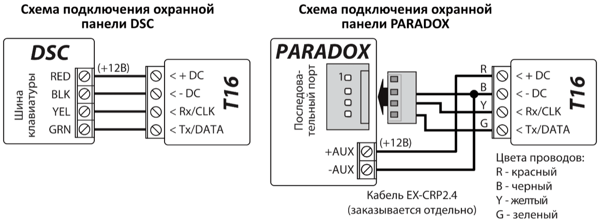

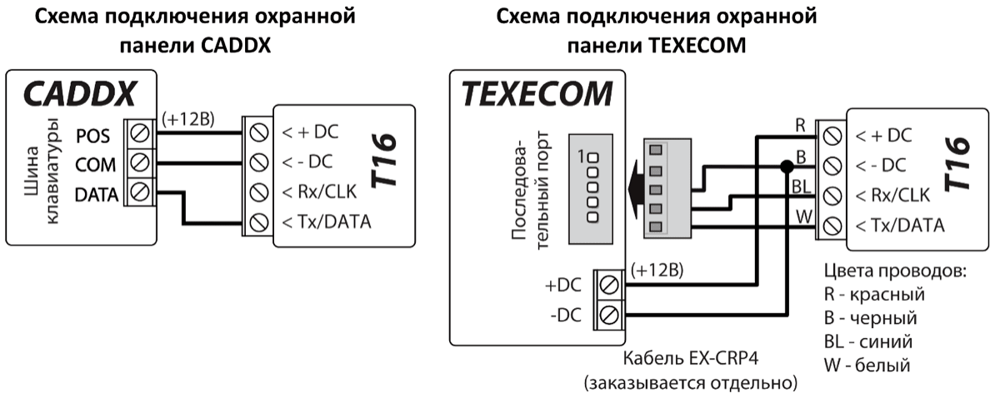

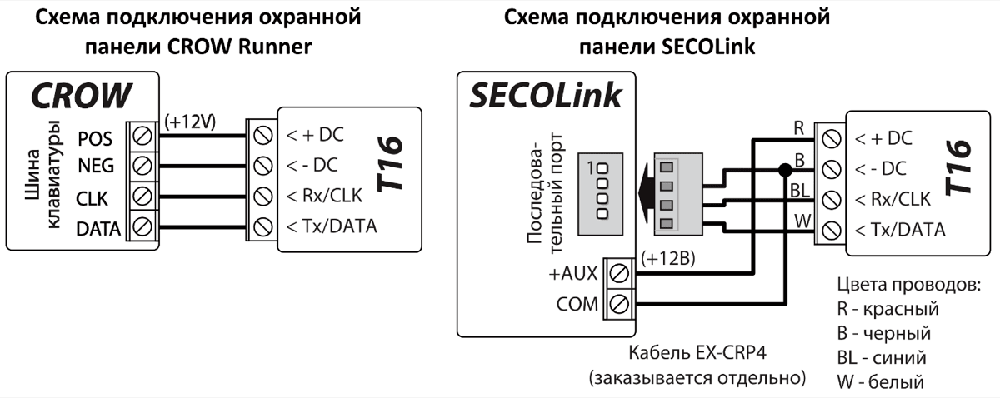

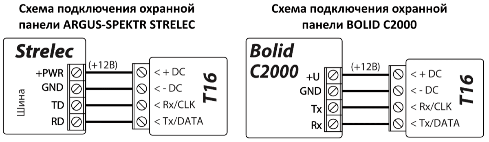

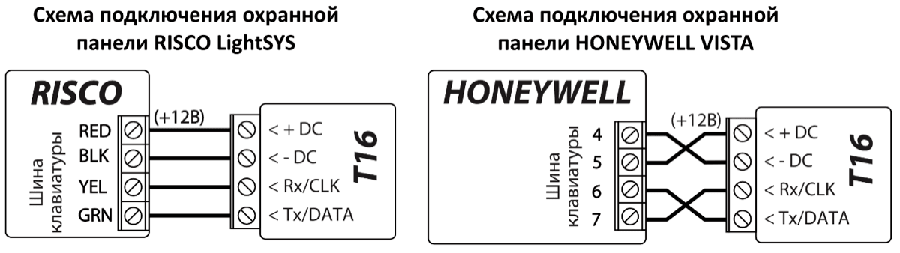

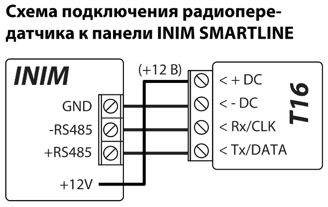

### Схема подключения телефонного коммуникатора охранной панели 

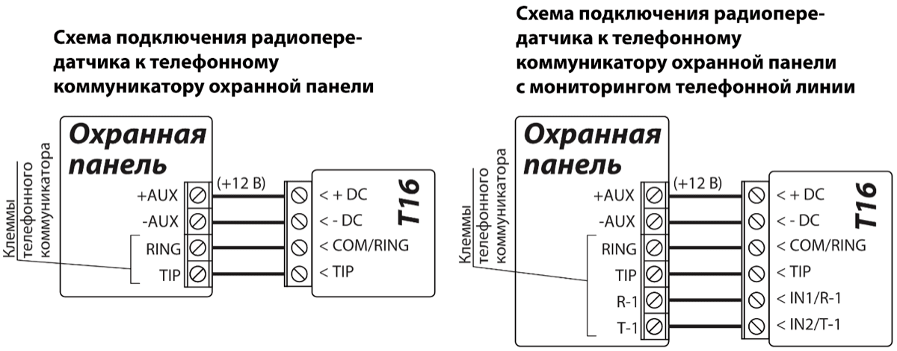

!!! note "Примечание"
    T16 нельзя подключать к городской телефонной линии.
Согласно инструкции программирования охранной панели, установите рабочие параметры телефонного коммуникатора охранной панели:

- Введите четырехзначный идентификационный номер охранной панели (англ. Account number, 0-9, A-F);

- Введите двузначный номер телефонного приемника (например: 12), на который охранная панель будет звонить после события. Если инструкция программирования охранной панели требует, то введите знак окончания телефонного номера;

- Установите тип передачи данных DTMF тонами;

- Установите автоматический протокол передачи сообщений Contact ID;

- Если хотите отправить специальные сообщения или охранная панель не имеет автоматического формирования Contact ID кодов, то необходимо вручную ввести требуемые коды событий.

Активируйте сообщения охранной панели и проверьте работу радиопередатчика. Световой индикатор DATA будет мигать зеленым, что означает что радиопередатчик принимает сообщения от охранной панели.

Убедитесь, что радиопередатчик правильно передал все сообщения охранной панели (сгенерированные во время теста) на приемник ПЦН (пульт централизованного управления).

### Схемы подключения зон (входов IN) 

Радиопередатчик имеет 6 (или 5) входных (зон) клемм (IN1, IN2, IN3, IN4, IN5, IN6). Тип входа: NO, NC, EOL (2,2 кΩ). Заводская настройка входов – NO тип цепи. Другой тип входа (зоны) можно установить в TrikdisConfig окне **События → Входы**.

Схемы подключения зон (входов IN) NO, NC, EOL типов:

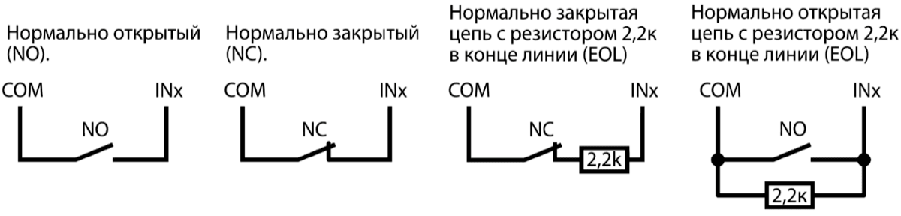

### Схема подключения PGM выходов охранной панели 

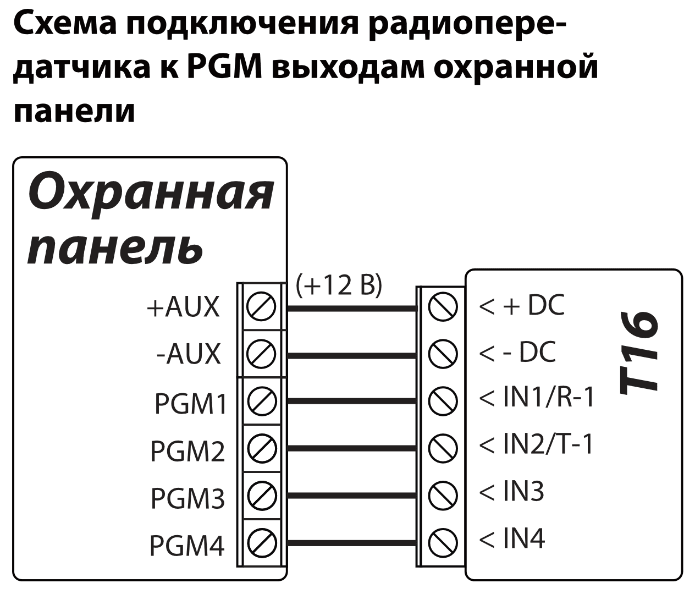

Типы входов радиопередатчика NO или NC.

### Схема подключения сирены 

Сирена подключается, когда к радиопередатчику подключен считыватель электронных ключей *ТМ17*. Сирена, использующая ток до 1 А, может быть подключена к выходу OUT1 (или OUT2) радиопередатчика *Т16*. Она активируется, если в режиме охраны срабатывает один из входов (IN) радиопередатчика. Сирена отключится через 3 минуты или с помощью электронного ключа (iButton).

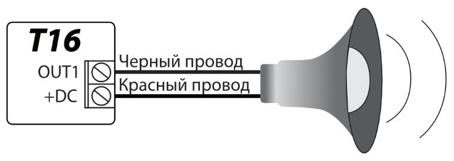

### Схемы подключения модулей RS485 

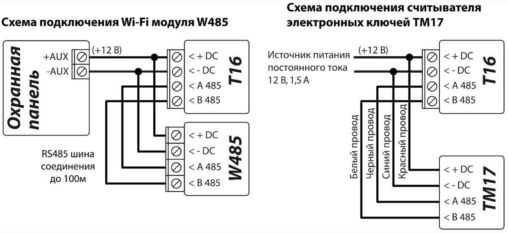

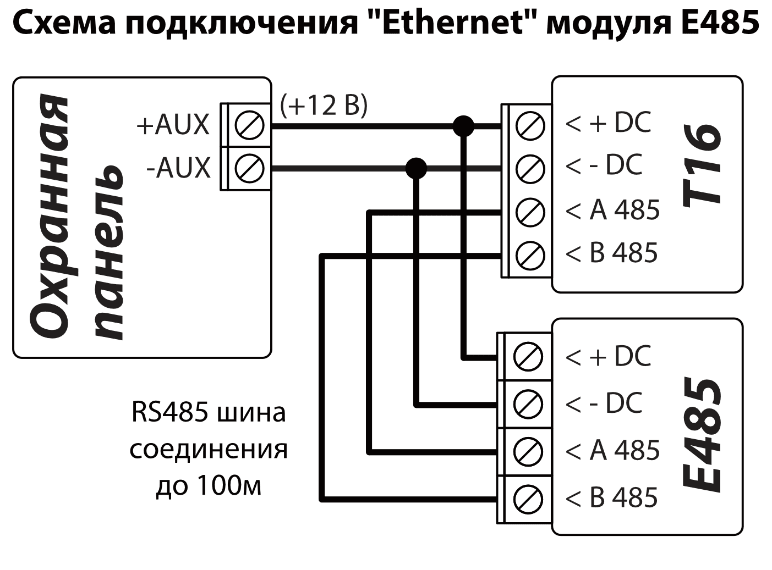

Используйте кабель витой пары (STP 4x2x0.5) для шины RS485, если длина шины более 1 м. Избегайте прокладки кабеля параллельно с силовыми кабелями переменного тока, антенными кабелями или другими сильными источниками электромагнитных полей.

Wi-Fi модуль W485 совместим с радиопередатчиком Т16. После установки и конфигурации W485 будет отправлять сообщения с Т16 через беспроводную компьютерную сеть на приемник ПЦН (пульт централизованного наблюдения).

“Ethernet” модуль Е485 совместим с радиопередатчиком Т16. После установки и конфигурации Е485 будет отправлять сообщения с Т16 через проводную компьютерную сеть на приемник ПЦН (пульт централизованного наблюдения).

## Конфигурация с программой TrikdisConfig 

1.  Загрузите программу конфигурации TrikdisConfig со странички [www.trikdis.com/ru](http://www.trikdis.com/ru)/ (в поле поиска напишите „TrikdisConfig“), и установите ее на компьютер.

2.  Плоской отверткой снимите крышку, как показано на рисунке.

1.  Кабелем USB Mini-B подключите Т16 к компьютеру.

2.  Запустите программу TrikdisConfig. Программа автоматически определит подключенное изделие и откроет окно конфигурации Т16.

3.  Нажмите на кнопку **Считать [F4]**, чтобы скачать установленные параметры на Т16. Если необходимо введите код администратора или инсталлятора.

### Строка состояния TrikdisConfig 

Подключив Т16 к TrikdisConfig и нажав на кнопку **Считать [F4]**, программа в строке состояния предоставит информацию о подключенном изделии:

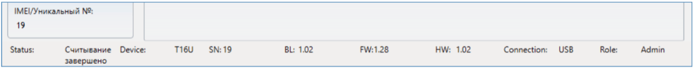

| Наименование | Описание |
|----|----|
| IMEI/​Уникальный № | Серийный номер изделия |
| Состояние | Рабочее состояние |
| Модуль | Тип изделия (должно быть указано T16) |
| SN | Серийный номер изделия |
| BL | Версия программы |
| FW | Версия программы изделия |
| HW | Версия аппаратной части изделия |
| Состояние | Подключение программы к изделию (USB или Remote (удаленно)) |
| Роль | Уровень доступа (показывается после подтверждения кода доступа) |

!!! note "Примечание"
    Кнопка **Считать [F4]**, при нажатии которой программа считает и
    отобразит настройки, которые записаны в изделии. / Кнопка
    **Записать [F5]**, при нажатии которой программа запишет настройки в
    изделие. / Кнопка **Сохранить [F9]**, при нажатии которой программа
    сохранит настройки в файле. Позже сохраненные настройки можно будет
    загрузить в другие изделия. Это позволит быстро настроить несколько
    изделий с одинаковыми настройками. / Кнопка **Открыть [F8]**, нажав
    которую и выбрав файл с настройками изделия программа откроет и
    отобразит настройки. / Для восстановления заводских настроек нажмите
    кнопку **Восстановить**, которая находится в левом нижнем углу
    программного окна.
При первом программировании Т16 сначала надо считать его заводские настройки, нажав кнопку **Считать [F4]**. С TrikdisConfig сделайте необходимые настройки, по приведенному ниже описанию.

### Окно “Настройки”

**Закладка „Настройки“**

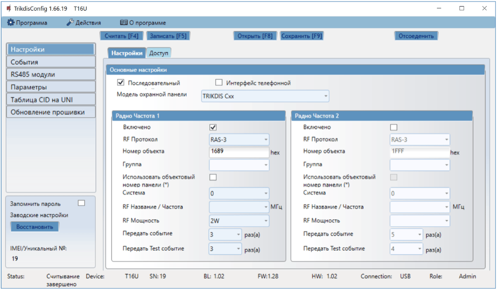

**Группа „Основные настройки“**

- **Последовательный порт** – отметьте, если Т16 подключен к последовательному порту.

- **Интерфейс телефонной линии** – отметьте, если Т16 подключен к телефонному коммуникатору охранной панели.

- **Модель охранной панели** – укажите тип охранной панели, к которой будет подключен радиопередатчик.

**Группа „Радио Частота 1“**

- **Включено** – отметьте поле и будет включен радиоканал передатчика.

- **RF Протокол** – укажите протокол радиосвязи, который будет использоваться (RAS-2M, RAS-3, RAS-3UID, LARS, LARS1, LARS_RAS2M, LARS1_RAS2M).

- **Номер объекта** – введите идентификационный номер пользователя, отправляемый радиопередатчиком, для внутренних событий и событий подключенной охранной панели.

- **Группа** – введите частичный идентификатор пользователя (используется только с протоколом LARS RF).

- **Использовать объектовый номер панели (\*)** – отметьте поле и события охранной панели будут отправляться с идентификационным номером (ID) охранной панели. Не все охранные панели позволяют использовать идентификационный номер.

- **Система** – номер системы радиосети. Используется для разделения объектов (пользователей) на группы в сети радиосвязи.

- **RF Название/Частота** – название частоты радиоканала, которое можно описать в окне **Параметры > Доступные радиочастоты**.

- **RF Мощность** – выберите мощность (1-5 Вт) радиопередатчика.

- **Передать событие** – укажите количество передачи событий повторно (1-10 раз). (Рекомендуется оставить заводские настройки).

- **Передать Test событие** – укажите количество передачи ТЕСТ сообщений повторно (1-10 раз). (Рекомендуется оставить заводские настройки).

**Группа „Радио Частота 2“**

Настройки аналогичны, как и для **Радио Частота 1**.

**Закладка „Доступ“**

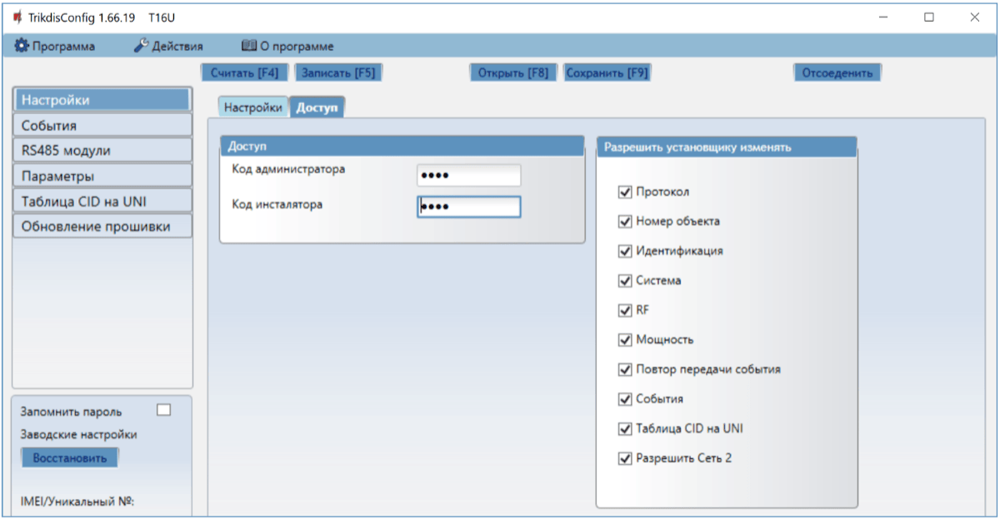

**Группа „Доступ“**

- **Код администратора** – обеспечивает полный доступ к конфигурации радиопередатчика. Код должен быть длиной до 6 символов, он может состоять из латинских букв и / или цифр. (Заводской код - 1234).

- **Код инсталлятора** – обеспечивает ограниченный доступ к конфигурации радиопередатчика. (Заводской код - 1234).

**Группа „Разрешить установщику изменять“**

Существует два уровня доступа (администратора и инсталлятора) при настройке радиопередатчика Т16. Доступ администратора позволяет полностью изменять настройки радиопередатчика. Доступ инсталлятора позволяет ограничено изменять настройки радиопередатчика. Администратор определяет, какие параметры инсталлятор сможет изменить.

### Окно “События” 

**Закладка „Входы“**

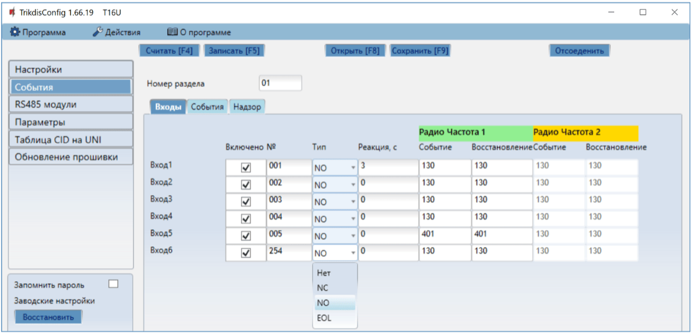

- **Включено** – отметьте поле, чтобы разрешить отправку события при срабатывании входа.

- **№** – введите номер входа.

- **Тип** – укажите тип входа (NO, NC, EOL).

- **Реакция** – укажите время задержки срабатывания входа (сек.).

- **Событие РЧ1** – код события (активация входа) радиопередатчик отправляет по первому радиоканалу (CID код устанавливается автоматически).

- **Восстановление РЧ1** – код восстановления входа радиопередатчик отправляет по первому радиоканалу (CID код устанавливается автоматически).

- **Событие РЧ2** – код события (активация входа) радиопередатчик отправляет по второму радиоканалу (CID код устанавливается автоматически).

- **Восстановление РЧ2** – код восстановления входа радиопередатчик отправляет по второму радиоканалу (CID код устанавливается автоматически).

**Закладка „События“**

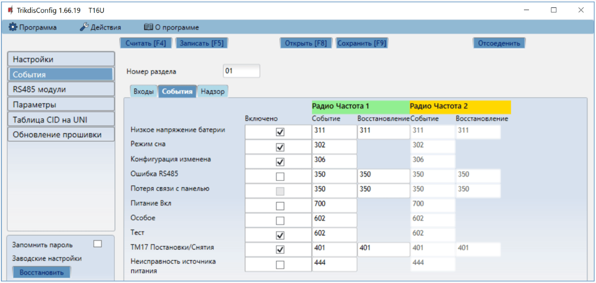

- **Включено** – отметьте поле, чтобы включить отправление сообщений внутренних событий:
- **Низкое напряжение аккумулятора** – напряжение питания ниже 11,5 В.

- **Режим сна** – напряжение питания ниже 10 В.

- **Конфигурация изменена** – изменение настроек радиопередатчика.

- **Ошибка RS485** – нарушение связи между модулями, которые подключены к шине RS485.

- **Потеря связи с панелью** – нарушена связь между радиопередатчиком и охранной панелью.

- **Питание Вкл** – включено питание радиопередатчику.

- **Особое** – использование специального кода в радиосети, когда применяется ретранслятор радиосигнала с режимом „прослушивания“ и „отмены“.

- **Тест** – периодическое тестовое сообщение.

- **TM17 Постановка/Снятие** – отправление сообщений о Постановке/Снятии с охраны, при использовании считывателя электронных ключей ТМ17.

- **Неисправность источника питания** – отправление сообщения о неисправности источника питания, когда напряжение источника питания постоянного тока ниже 11,5 В.
- **Радио частота 1** – коды внутренних событий первого радиоканала, которые будут отправляться при Срабатывании/Восстановлении внутреннего события.
- **Радио частота 2** – коды внутренних событий второго радиоканала, которые будут отправляться при Срабатывании/Восстановлении внутреннего события.

**Закладка „Надзор“**

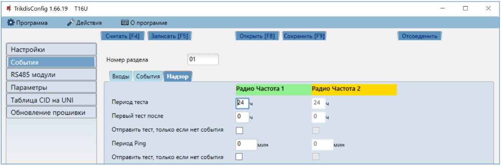

- **Период теста** – укажите интервал времени между отправкой тестовых сообщений по 1 и 2 каналам связи. Цель периодических тестовых сообщений является проверка функциональности радиосистемы. Типичный период тестирования 24 часа, однако он может быть сокращен до 1 часа. Тестовые сообщения автоматически контролируются программным обеспечением ПЦН. Если тестовое сообщение не поступает с объекта, то генерируется предупреждение.
- **Первый тест после** – укажите время задержки отправления первого тестового сообщения после включения напряжения питания радиопередатчику. Цель состоит в том, чтобы иметь возможность отправлять сообщения, распределенные в течение суток (24 часа), чтобы избежать перегрузок в радиосети. Указывается время для 1 и 2 каналов связи.

- **Отправить тест, только если нет события** – отметьте поле и тестовые сообщения будут отправляться, когда нет отправки сообщений о событиях.

- **Период PING** – укажите период времени между отправкой PING сообщений. Основная цель PING сообщений является контролировать работоспособность оборудования охраняемого объекта. PING сообщение генерируется за короткий промежуток времени (каждые 5-10 минут) и отправляется. Сообщения PING автоматически контролируются приемником ПЦН. Важно понимать, что радиосеть предназначена для передачи сообщений о событиях, что означает, что PING сообщения могут быть использованы только для самых важных охраняемых объектов в радиосети, чтобы предотвратить перегрузку радиосети.

- **Отправить Ping, только если нет события** – отметьте поле и PING сигнал будет отправляться, когда нет отправления сообщений о событиях.

### Окно “RS485 модули” 

**Закладка „Список модулей“**

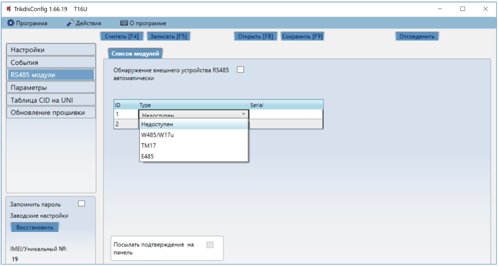

- **Обнаружение внешнего устройства RS485 автоматически** – отметьте поле и будет включено автоматическое распознавание подключенного модуля к шине RS485.

- **Тип модуля** – выберите из списка подключаемый к шине RS485 модуль.

- **Серийный №** - укажите серийный номер модуля, который можно найти на наклейке, приклеенной на модуле или его упаковочной коробке.

- **Посылать подтверждение на панель** – если IP-передатчик (Wi-Fi, LAN) подключен к шине RS485 в качестве основного канала. Отметив поле, охранная панель получает подтверждение о получении отправленного сообщения приемником ПЦН. Так обеспечивается большая надежность передачи сообщений. Не все охранные панели имеют такую возможность. Если вы выберете охранную панель, у которой нет такой функции, то поле будет неактивным.

!!! note "Примечание"
    К радиопередатчику Т16 можно подключить только по одному
    TM17, W485 (или E485) модулю.
**Закладка „ТМ17“**

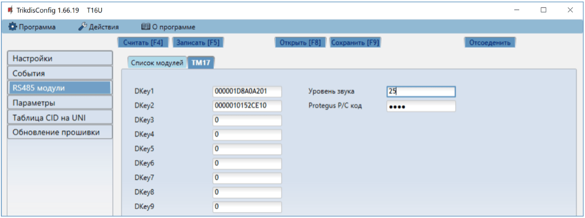

К Т16 существует возможность подключить считыватель ТМ17. Подключив считыватель электронных ключей ТМ17, радиопередатчик можно использовать как охранную панель. ТМ17 можно назначить 9 электронных (iButton) ключей (один из которых „Основной ключ“), которыми можно будет управлять охранной панелью (Поставить/Снять с охраны).

- **Dkey 1 – Dkey 9** – в поле записываются идентификационные номера электронных ключей (iButton).

- **Уровень звука** – введите уровень звукового сигнала считывателя электронных ключей (возможные значения от 0 до 100).

- **Protegus P/C код** – введите код, который позволит удаленно через Protegus осуществлять Постановку/Снятие с охраны. Поле видно при конфигурации изделия через кабель USB (при удаленной конфигурации поле не показывается).

#### Регистрация электронных ключей (iButton) 

1.  Если список электронных ключей пуст, первый ключ приложенный к считывателю ТМ17 будет записан в первую строчку списка и ему будет присвоена функция „Основного ключа“.

2.  Включение регистрации электронных ключей. Приложите „Основной ключ“ к считывателю ТМ17 и удерживайте его не менее 10 секунд. Индикатор „STATE“ погаснет. Когда режим регистрации будет активирован, LED индикатор считывателя ТМ17 начнет мигать зеленым цветом и раздастся звуковой сигнал.

3.  К считывателю приложите и подержите регистрируемый ключ. Выключится звуковой сигнал. Ключ внесен в список. Уберите ключ от считывателя. Зеленый индикатор считывателя перестанет мигать и загорится зеленым цветом. Через несколько секунд считыватель автоматически выйдет из режима регистрации ключей. Индикатор „STATE“ загорится зеленым цветом, а зеленый индикатор считывателя погаснет.

4.  Для регистрации другого электронного ключа (iButton) необходимо повторно включить режим регистрации ключей.

5.  Для удаления всех ключей из списка необходимо „Основной ключ“ приложить к считывателю и удерживать его не менее 20 секунд.

#### Использование радиопередатчика в качестве охранной панели 

Подключив считыватель ТМ17 к T16, радиопередатчик можно использовать как охранную панель. К входам (IN1 – IN6) можно подключить контакты датчиков охранной системы. Если дополнительно к радиопередатчику подсоединить модуль W485 (или E485), то охранной системой можно управлять дистанционно через компьютерную сеть.

#### Заводские настройки входов (IN) и выхода (OUT)

| Клемма | Описание |
|--------|----------|
| IN1 | 1 вход, тип: NC, NO, EOL (2,2 кΩ). (Заводская настройка NO). /​ Зона Входа/​Выхода. Когда осуществляется постановка на охрану, в течении установленного времени выхода разрешено нарушение зоны. Если после окончания времени выхода зона осталась нарушенной, то активируется выход OUT1 и отправляется сообщение. /​ Нарушив зону, при включенной охранной системе, начинается отсчет времени, в течении которого необходимо выключить режим охраны. Если по истечении входного времени режим охраны не был выключен, то активируется выход OUT1 и отправляется сообщение. |
| IN2 (IN3, IN4, IN5, IN6) | 2 (3, 4, 5, 6) вход, тип: NC, NO, EOL (2,2 кΩ). (Заводская настройка NO). Зона Мгновенного типа. Нарушив зону, при включенной охранной системе, активируется выход OUT1 (или OUT2) и отправляется сообщение. |
| OUT1 /​ или | Выход, тип: открытый коллектор, ток до 1 А. Выход предназначен для подключения сирены. (T16V, T16U) |
| OUT2 | Выход, тип: открытый коллектор, ток до 1 А. Выход предназначен для подключения сирены. (T16U5) |

Информацию о сработавших Входах, при включенном режиме охраны, информируют мигающие индикаторы на считывателе ТМ17. После снятия с охраны (приложив электронный ключ (iButton) к считывателю) индикаторы не перестают мигать. Чтобы индикаторы перестали мигать необходимо еще раз приложить электронный ключ к считывателю.

##### Световая индикация считывателя TM17

| Индикатор | Статус | Описание |
|-----------|--------|----------|
| 1 (2, 3, 4, 5, 6) | Выключен | Зона не активна |
| 1 (2, 3, 4, 5, 6) | Красный | Зона сработала |
| 1 (2, 3, 4, 5, 6) | Мигает красным | Зона, которая вызвала срабатывание системы охраны |
| State / (Статус) | Зеленый | Выключена система охранной сигнализации |
| State / (Статус) | Мигает зеленый | Идет отсчет времени выхода |
| State / (Статус) | Красный | Включена система охранной сигнализации |
| State / (Статус) | Мигает красный | Идет отсчет времени входа |
| Trouble / (Неисправность) | Выключен | Нет неисправностей |
| Trouble / (Неисправность) | 9 вспышек красным | Нарушение связи с устройствами по RS485 |

**Закладка „W485“**

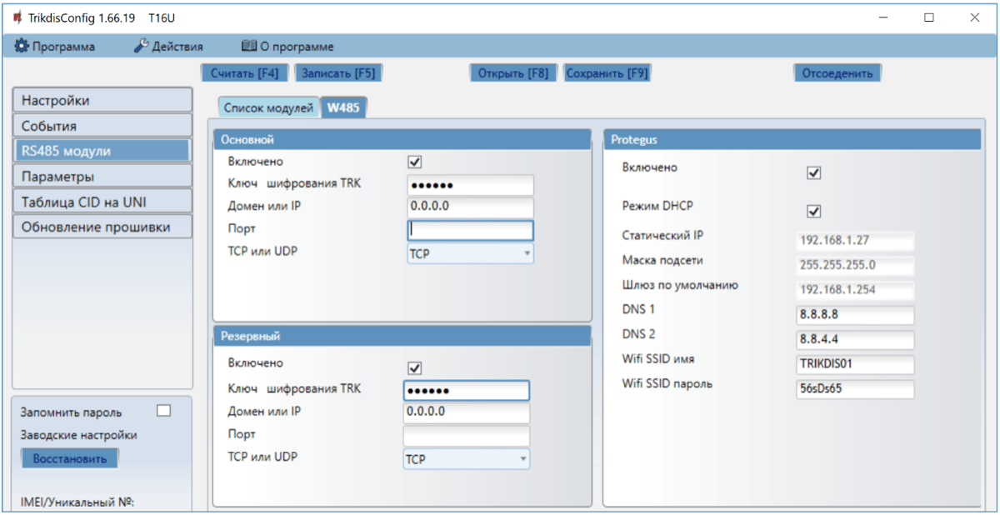

**Группа „Основной“**

- **Включено** – отметив поле, будет включен Основной канал связи.

- **Ключ шифрования TRK** – введите ключ шифрования, который установлен на приемнике ПЦН.

- **Домен или IP** – введите адрес домена или IP адрес приемника.

- **Порт** – введите номер порта приемника в сети.

- **TCP или UDP** – выберите протокол (TCP или UDP) передачи сообщений.

**Группа „Резервный“**

Включите Резервный канал связи, чтобы при нарушении связи в Основном канале сообщения могли быть отправлены по резервному каналу связи. Сделайте настройки Резервного канала, которые аналогичны настройкам Основного канала.

**Группа „Protegus“**

- **Включено** – отметив поле, будет включен Protegus сервис. Т16 сможет обмениваться данными с приложением Protegus и с TrikdisConfig можно будет удаленно выполнить конфигурацию.

- **Режим DHCP** – выберите режим регистрации WiFi модуля в сети (автоматический – DHCP; или ручной – Статический).

- **Статический IP** – введите статический IP адрес (при ручном режиме регистрации).

- **Маска подсети** – введите маску подсети (при ручном режиме регистрации).

- **Шлюз по умолчанию** – введите адрес шлюза (при ручном режиме регистрации).

- **DNS1, DNS2** – (Domain Name System) введите IP адрес сервера домена. Используется, когда в поле **Домен или IP** указывается домен. По умолчанию, установлены адреса Google DNS серверов.

- **Wifi SSID имя** – название WiFi сети, к которой подключится модуль W485.
- **Wifi SSID пароль** – пароль WiFi сети.

**Закладка „E485“**

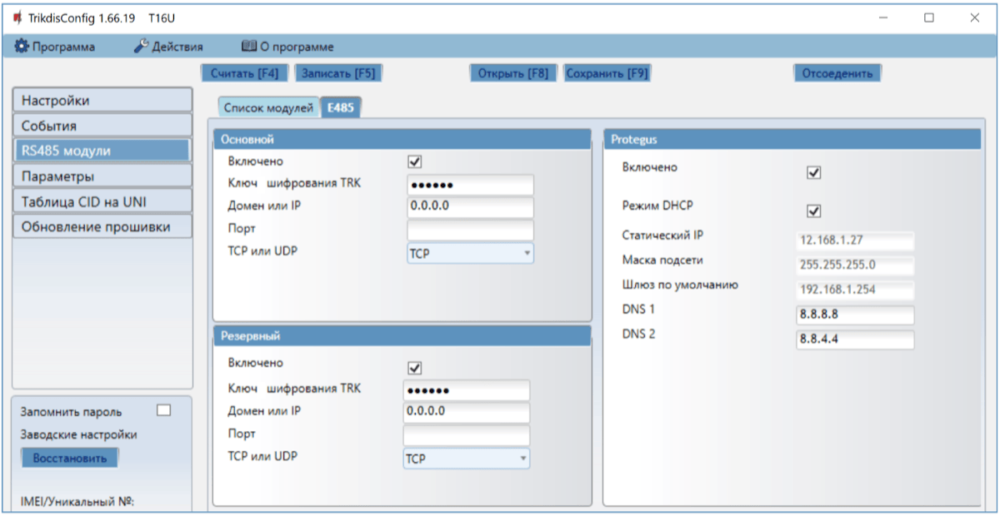

**Группа „Основной“**

- **Включено** – отметив поле, будет включен Основной канал связи.

- **Ключ шифрования TRK** – введите ключ шифрования, который установлен на приемнике ПЦН.

- **Домен или IP** – введите адрес домена или IP адрес приемника.

- **Порт** – введите номер порта приемника в сети.

- **TCP или UDP** – выберите протокол (TCP или UDP) передачи сообщений.

**Группа „Резервный“**

Включите Резервный канал связи, чтобы при нарушении связи в Основном канале сообщения могли быть отправлены по Резервному каналу связи. Сделайте настройки Резервного канала, которые аналогичны настройкам Основного канала.

**Группа „Protegus“**

- **Включено** - отметив поле, будет включен Protegus сервис. Т16 сможет обмениваться данными с приложением Protegus и с TrikdisConfig можно будет удаленно выполнить конфигурацию.

- **Режим DHCP** – выберите режим регистрации „Ethernet“ модуля в сети (автоматический – DHCP; или ручной – Статический).

- **Статический IP** – введите статический IP адрес (при ручном режиме регистрации).

- **Маска подсети** – введите маску подсети (при ручном режиме регистрации).

- **Шлюз по умолчанию** – введите адрес шлюза (при ручном режиме регистрации).

- **DNS1, DNS2** – (Domain Name System) введите IP адрес сервера домена. Используется, когда в поле **Домен или IP** указывается домен. По умолчанию, установлены адреса Google DNS серверов.

### Окно “Параметры” 

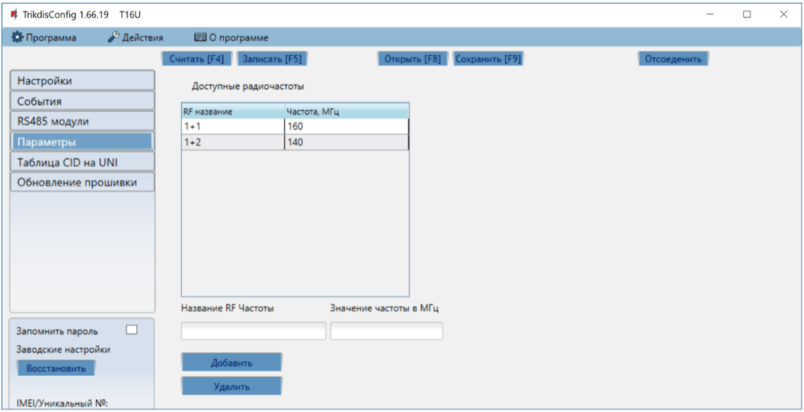

**Группа „Доступные радиочастоты“**

К списку можно Добавить/Удалить радиочастоты, на которых будет работать радиопередатчик Т16. Радиочастотам присваиваются „Названия“.

### Окно „Таблица CID на UNI”

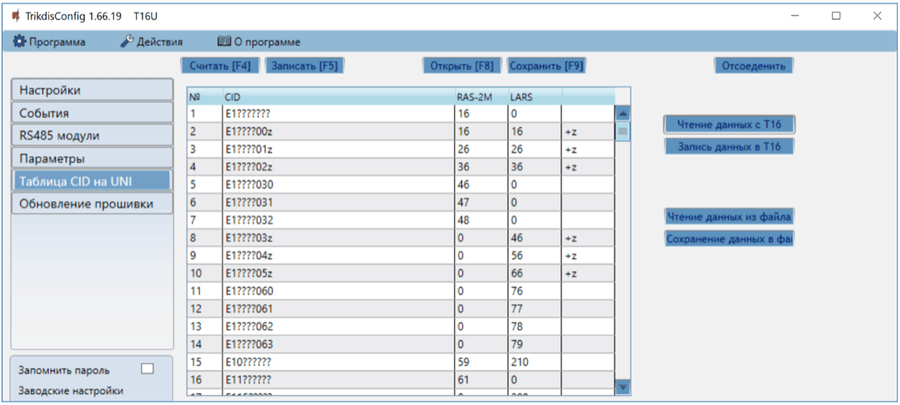

Contact ID коды, принимаемые от охранной панели, конвертируются в коды радиосистемы (RAS2M, LARS). Только Сontact ID сообщения, которые описаны в таблице в столбце CID, будут конвертированы в коды радиосистемы и отправлены на ПЦН. Символ „?“ представляет любое число в позиции. Символ „z“ указывает, что число в позиции добавляется к основному коду радиосистемы. <u>Таблица редактируется, но делайте это ответственно и только в том случае, если это действительно необходимо. Если в таблице будут ошибки, то система будет работать неправильно.</u>

!!! note "Примечание"
    Окончив делать настройки, нажмите кнопку **Записать [F5]**. Подождите
    пока данные будут записаны и отсоедините USB кабель.
### Восстановление заводских настроек 

Для восстановления заводских настроек необходимо в программном окне TrikdisConfig нажать кнопку **Восстановить.**

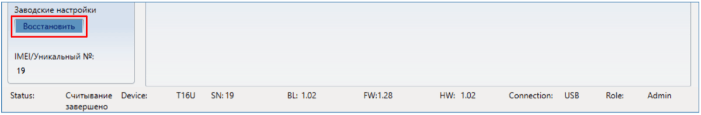

## Тестирование радиопередатчика 

После установки и конфигурации выполните тестирование системы:

1.  Проверьте, включено ли питание;

2.  Для проверки входов Т16 активируйте их и убедитесь, что приемник ПЦН получает соответствующие сообщения.

3.  Выполните проверку охранной сигнализации, чтобы убедиться в том, что ПЦН (пульт централизованного наблюдения) получает сообщения о событиях.

## Обновление прошивки радиопередатчика 

!!! note "Примечание"
    Подключите Т16 к TrikdisConfig. Если есть новая прошивка для
    Т16, то TrikdisConfig предложит обновить прошивку. Для
    обновления прошивки должно быть подключение к сети интернет. / Если в
    компьютере установлена антивирусная программа, то она может блокировать
    функцию автоматического обновления программного обеспечения. В этом
    случае придется изменить настройки в антивирусной программе.
Прошивку Т16 можно обновить или заменить вручную. После обновления все ранее установленные настройки Т16 остаются. Прошивка может быть заменена на новую или на старую версии. Выполните следующие шаги:

1.  Запустите программу ***TrikdisConfig**.*

2.  Подключите коммуникатор Т16 к компьютеру с помощью кабеля USB Mini-B. Если есть новая прошивка, то TrikdisConfig предложит обновить программное обеспечение Т16.

3.  В программе TrikdisConfig откройте окно **Обновление программы**.

    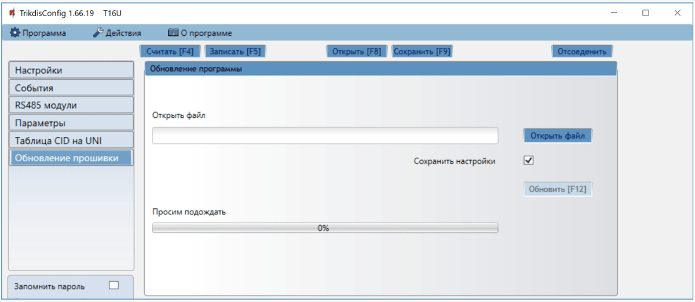

4.  Нажмите кнопку **Открыть файл** и выберите нужный файл для установки. Если такого файла не имеете, то зайдите на страничку [www.trikdis.com](http://www.trikdis.com) , как зарегистрированный пользователь, и скачайте новую прошивку для Т16.

5.  Нажмите кнопку **Обновить [F12]**.

6.  Подождите, пока произойдет обновление прошивки.

## Требования безопасности

Устанавливать и обслуживать радиопередатчик могут только квалифицированные специалисты.

Перед установкой оборудования внимательно ознакомьтесь с данным руководством, чтобы избежать ошибок при монтаже из-за чего оборудование будет плохо работать и может быть испорчено.

Выполняя работы по установке оборудования, обязательно должно быть выключено его внешнее питание.

Изменения внесенные в конструкцию изделия, самостоятельный ремонт лишают изделие гарантии производителя.

