# GSM oхранная панель CG17

  

## Описание 

CG17 - многофункциональная панель охранной сигнализации со встроенным 2G/4G коммуникатором. Охранная панель дает возможность создать систему из 12 проводных или беспроводных зон, разделенных на 8 разделов.

С CG17 можете:

- Оборудовать простую систему охранной сигнализации, которую можно удаленно контролировать и управлять с приложением Protegus2.

- Управлять различным подключенным оборудованием удаленно (например: системы отопления и вентиляции, автоматика ворот, освещение и т.д.)

- Контролировать температуру, уровень топлива, уровень постоянного напряжения.

- Оповещать пользователей о событиях.

- Отправлять отчеты о событиях на приемник ПЦН (пульт централизованного наблюдения).

**Функциональность**

Отправляет сообщения на приемник пульта централизованного наблюдения

- Отправляет сообщения на Trikdis программные или аппаратурные приемники, которые работают с любой программой мониторинга.

- Может отправлять сообщения на приемники SIA DC-09.

- Контроль соединения осуществляется путем отправки PING сообщений на IP приемник каждые 30 секунд (или в течение времени, указанного пользователем).

- Резервный канал связи будет использоваться, если будет потеряна связь по основному каналу.

- Передача сообщений на пульт (ПЦН) SMS сообщениями. Приемник ПЦН получает SMS сообщения, даже если нарушается IP связь в сети оператора мобильной связи.

- Когда включен *Protegus* сервис, сообщения сначала отправляются на приемник ПЦН и только потом пользователям приложения *Protegus2*.

Работает с приложением Protegus2

- „Push“ и специальные звуковые оповещения о событиях.

- Удаленное управление системой (включить/выключить охранную систему).

- Удаленное управление подключенным оборудованием (освещением, воротами, системой вентиляции, отоплением, поливом и т.д.).

- Удаленный контроль температуры (подсоединив расширители iO, iO-WL или iO-LORA).

- Различные права администратора, установщика и пользователя.

- Пользователи могут быть информированы о событиях SMS сообщением и звонком.

**Сообщения пользователям**

- Панель звонит на указанные номера пользователей (до 8 телефонных номеров).

- Отправляет SMS сообщения о событиях.

- Приложение Protegus2 отправляет „Push“ и специальные звуковые оповещения о событиях.

**Удаленное управление панелью и выходами**

- Применяя приложение Protegus2.

- Применяя считыватель контактных ключей (iButton).

- Применяя RFID считыватель с клавиатурой (Wiegand 26/34).

- Звонком на номер установленной SIM карты.

- Используя SMS сообщения.

- Используя алгоритм логики „если…то“. Например: при активации входа или температура превышает установленный предел, то включается выход.

**Поддерживает расширители**

- Расширители серии iO, LORA, которые увеличивают количество входов (IN) и выходов (OUT).

- Приемник GPS (применяется при охране банкоматов и автоматов продаж).

- Датчик уровня топлива. Защита и контроль уровня топлива в резервуарах.

- Подключение резервного источника питания (аккумулятора 12 В) и его зарядка.

**Входы и выходы**

- 1 вход (IN). 2 выхода (OUT). 3 универсальных I/O контакта, которые можно установить, как вход (IN) или как выход (OUT).

- Шина данных „**1-Wire**“, к которой подключаются датчики температуры (до 8 шт.) и считыватели контактных ключей (iButton).

- Используя расширители серии iO, LORA количество входов (IN) и выходов (OUT) может быть увеличено до 12.

**Простая установка**

- Заводские настройки позволяют использовать контроллер в качестве охранной панели или в качестве коммуникатора.

- Настройки можно сохранить в файле и быстро записать на другие устройства.

- Настройка осуществляется программой TrikdisConfig, подключив CG17 к компьютеру кабелем USB Mini-B или удаленно.

- Два уровня установки параметров: администратора и установщика.

### Типы оборудования 

Данное руководство подходит для всех типов CG17:

- CG17_2G, панель охранной сигнализации с модемом 2G.

- CG17_14, CG17_1E, CG17_1S, панель охранной сигнализации с модемом 4G.

### Технические параметры 

| Параметр | Описание |
|----------|----------|
| Частота GSM/​GPRS модема | 850 /​ 900 /​ 1800 /​ 1900 MГц |
| Частота 4G модема: Европа Латинская Америка | - LTE-FDD частоты: B1/​B3/​B5/​B7/​B8/​B20/​B28 /​ - GSM частоты: B2/​B3/​B5/​B8 /​ - LTE-FDD частоты: B2/​B3/​B4/​B5/​B7/​B8/​B28/​B66 /​ - GSM частоты: B2/​B3/​B5/​B8 |
| Напряжение источника питания [AC /​ DC] | 16-24 В постоянного тока или /​ 16-18 В переменного тока |
| Потребляемый ток | до 50 мA (в режиме ожидания), /​ до 200 мА (кратковременный, в режиме отправления сообщений) |
| Резервный источник питания [BAT] | 12 В, аккумулятор |
| Ток зарядки аккумулятора | до 500 мА |
| Напряжение и ток внешних подключаемых устройств [+12 V] | 12 В постоянного тока, до 1 A |
| Входы [IN] | 1 шт., тип: NC, NO, EOL=10 kΩ или EOL_T |
| Выходы [OUT] | 2 шт., тип: открытый коллектор (ОС), коммутирует до 1 A |
| Контакты двойного назначения [IN/​OUT] | 3 шт., вход (тип: NC, NO, EOL=10 кΩ или EOL_T), или выход (тип: открытый коллектор, коммутирует до 0,1 А) |
| Количество разделов (областей) сигнализации | 8 |
| Количество зон | 4, (с расширителями до 12 зон) |
| Количество PGM выходов | 2 (установив IO клеммам режим работы Выход (OUT), можно получить 5 выходов. С расширителями количество выходов можно увеличить до 12.) |
| Длина „1-Wire“ шины [1 WIRE] | До 30 м |
| Детекторы температуры | Maxim®/​Dallas® DS18S20, DS18B20 |
| Число детекторов температуры подключаемых к „1-Wire“ шине | 8 шт. |
| Тип контактных ключей (iButton) | Maxim®/​Dallas® DS1990A |
| Количество контактных ключей (iButton) | 12 шт. |
| Длина шины RS485 | до 100 м |
| Количество подключаемых модулей к шине RS485 | 8 шт. |
| Поддерживаемая клавиатура | Crow CR-16, Crow LCD, Crow touch keypad |
| Поддерживаемые модули | iO-8 – модуль расширения;​ /​ iO – модуль расширения;​ /​ iO-MOD – iO-WL радиоволновой приемник;​ /​ iO-WL – беспроводный модуль расширения;​ /​ RF-SH – радиоприемник беспроводных датчиков Crow;​ /​ E485 – модуль „Ethernet“ для подключения к проводной компьютерной сети;​ /​ W485 – модуль WiFi для подключения к беспроводной компьютерной сети;​ /​ TM17 – считыватель контактных (iButton) ключей;​ /​ CZ-Dallas – считыватель контактных (iButton) ключей;​ /​ FLS - датчик уровня топлива „Strela RS485“;​ /​ iO-LORA - модуль расширения;​ /​ iO8-LORA - модуль расширения;​ /​ PB-LORA – кнопка тревоги;​ /​ REL-LORA – модуль расширения. |
| Емкость буферной памяти | До 60 событий |
| Связь с ПЦН (пульт централизованного наблюдения) | 2 канала (первый канал: основной, резервный;​ второй канал: Protegus) |
| Внутренние часы | Есть |
| Каналы передачи сообщений о происшествиях | GPRS или 4G, SMS |
| Связь с ПЦН | TCP /​ IP или UDP /​ IP или SMS |
| Протоколы связи | TRK, SIA DC-09_2007, SIA DC-09_2012, SIA DC-09_IPcom |
| Условия эксплуатации | от -10 °C до + 50 °C, относительная влажность 0-80%, при 0- +20 °C (без конденсации) |
| Размеры | 113x 70 x 25 мм |
| Вес | 0,10 кг |

### Элементы многофункциональной панели CG17 

1.  Разъем SMA для GSM антенны.

2.  Световые индикаторы.

3.  Отверстие для снятия крышки охранной панели.

4.  Клеммы для подключения внешних устройств.

5.  USB Mini-B для программирования охранной панели.

6.  Держатель нано-SIM карты.

### Клеммы подключения 

| Клемма | Описание |
|----|----|
| AC /​ +DC | Клемма подключения питания (16-18 В переменного тока или положительная клемма 16-24 V постоянного тока) |
| AC /​ -DC | Клемма подключения питания (16-18 В переменного тока или отрицательная клемма 16-24 V постоянного тока) |
| BAT+ | Положительная клемма для подключения аккумулятора 12 В |
| BAT- | Отрицательная клемма для подключения аккумулятора 12 В |
| +5 V | Клемма питания для устройств *1-Wire* |
| 1 WIRE | Клемма шины данных для устройств *1-Wire* |
| A RS485 | Клемма А интерфейса *RS485* |
| B RS485 | Клемма B интерфейса *RS485* |
| 1 IN | Клемма входа №1 (заводская настройка – „Входа“, тип EOL) |
| 2 I/​O | Клемма вход/​выход: вход №2 или выход (открытый коллектор). (заводская настройка – вход, „Внутренний“, тип EOL) |
| COM | Общая клемма |
| 3 I/​O | Клемма вход/​выход: вход №3 или выход (открытый коллектор). (заводская настройка – вход, „Мгновенная“, тип EOL) |
| 4 I/​O | Клемма вход/​выход: вход №4 или выход (открытый коллектор). (заводская настройка – вход, „Пожарная“, тип EOL) |
| \+ 12 V | Клемма для запитки внешних устройств (12 В, до 1 А) |
| 5 OUT | Клемма выхода (открытый коллектор), (заводская настройка – „Сброс пожарного датчика“) |
| 6 OUT | Клемма выхода (открытый коллектор), (заводская настройка – „Сирена“) |

### Световая индикация

| Индикатор | Статус | Описание |
|-----------|--------|----------|
| NETWORK / (сеть) | Зеленый | Подключен к GSM сети |
| NETWORK / (сеть) | Мигает желтым | Уровень GSM сигнала от 0-5. Достаточно 3 |
| DATA / (Данные) | Зеленый | Отправление сообщения |
| DATA / (Данные) | Желтый | Есть неотправленные сообщения в памяти |
| POWER / (Электропитание) | Мигает зеленый | Хороший уровень питающего напряжения |
| POWER / (Электропитание) | Мигает желтый | Низкий уровень питающего напряжения |
| POWER / (Электропитание) | Мигает поочередно зеленый желтый | Включен режим конфигурации |
| TROUBLE / (Неисправность) | Выключен | Нет неисправностей |
| TROUBLE / (Неисправность) | 1 вспышка | Нет SIM карты |
| TROUBLE / (Неисправность) | 2 вспышки | Неправильный код SIM-карты |
| TROUBLE / (Неисправность) | 3 вспышки | Не удается подсоединиться к сети GSM |
| TROUBLE / (Неисправность) | 4 вспышки | Не удается подключиться к IP приемнику по первому каналу |
| TROUBLE / (Неисправность) | 5 вспышек | Не удается подключиться к IP приемнику по запасному каналу |
| TROUBLE / (Неисправность) | 6 вспышек | Не установлены внутренние часы CG17 |
| TROUBLE / (Неисправность) | 7 вспышек | Низкий уровень напряжения питания на аккумуляторе |
| TROUBLE / (Неисправность) | 8 вспышек | Нет питания от основного источника |
| TROUBLE / (Неисправность) | 9 вспышек | Нет связи с устройствами по RS485 |

### Материалы необходимые для монтажных работ 

Перед началом работ убедитесь, что имеете все необходимые материалы.

## Быстрая настройка с программой *TrikdisConfig* 

1.  Загрузите программу конфигурации TrikdisConfig со странички [www.trikdis.com/ru](http://www.trikdis.com/ru)/ (в поле поиска напишите „TrikdisConfig“), и установите ее на компьютер.

2.  Плоской отверткой снимите крышку, как показано на рисунке:

1.  Кабелем USB Mini-B подключите CG17 к компьютеру.

2.  Запустите программу TrikdisConfig. Программа автоматически определит подключенное изделие и откроет окно конфигурации CG17.

3.  Нажмите на кнопку **Считать [F4]**, чтобы скачать установленные параметры на CG17. Если необходимо введите код администратора или инсталлятора.

Ниже описываются настройки, которые необходимо сделать, чтобы коммуникатор начал отправлять сообщения на ПЦН (пульт централизованного наблюдения) и чтобы приложением Protegus2 можно было управлять охранной панелью.

### Настройка связи с приложением Protegus2 

**Окно „Cистемные параметры“:**

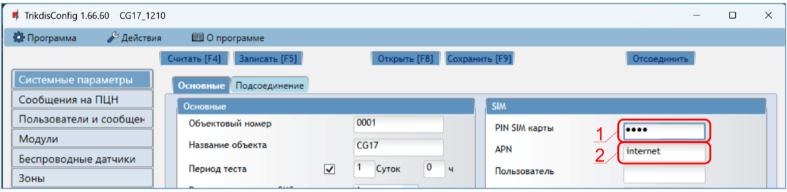

1.  Введите „**PIN код SIM карты**“.

2.  Введите имя „**APN**“. „**APN**“ найдете на страничке оператора SIM карты. „Internet” является универсальным и работает во многих сетях операторов мобильной связи.

Окно „Сообщения пользователю“, закладка „Облачное приложение“:

3. Отметьте поле „**Разрешить подключиться**“ к сервису Protegus.

2.  Измените „**Код доступа к Облаку**“. Запрос на ввод пароля будет поступать при добавлении системы к приложению Protegus2 (заводской пароль - 123456).

Завершив конфигурацию, нажмите кнопку **Записать [F5]** и отключите кабель USB.

!!! note "Примечание"
    Настройки CG17 с TrikdisConfig описаны п. 4 „Конфигурация с
    программой TrikdisConfig".
### Настройка связи с ПЦН 

**Окно „Системные параметры“:**

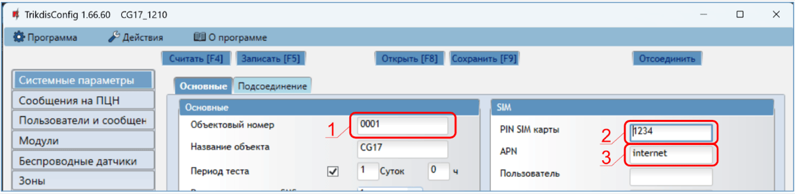

1.  Введите „**Объектовый номер**“ **(Не используйте FFFE, FFFF объектовые номера)**.

2.  Введите „**PIN SIM карты**“.

3.  Введите имя „**APN**“. „**APN**“ найдете на страничке оператора SIM карты. „Internet” является универсальным и работает во многих сетях операторов мобильной связи.

Окно „Сообщение на ПЦН“, группа „Основной канал“:

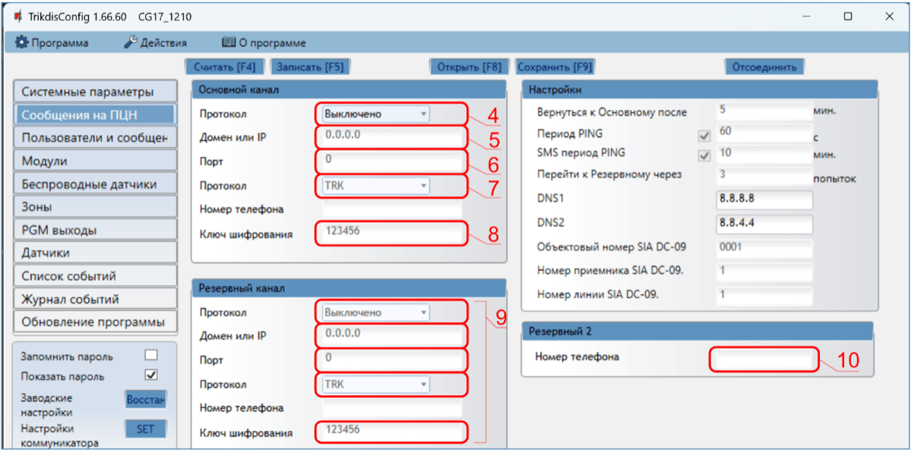

4. **Протокол** – выберите **IP** режим связи (Не рекомендуется использовать SMS, как основной канал связи).

2.  **Домен или IP** – введите адрес домена или IP адрес приемника.

3.  **Порт** – введите номер порта приемника в сети.

4.  **Протокол** – выберите кодировку, с которой будут отправляться сообщения: **TRK** (на приемники TRIKDIS); **DC-09_2007, DC-09_2012** или **DC-09_IPcom** (на универсальные приемники).

5.  **Ключ шифрования** – введите ключ шифрования, который установлен в приемнике.

!!! note "Примечание"
    Если хотите установить связь с ПЦН только SMS сообщениями, то необходимо
    ввести „**Ключ шифрования**" и „**Номер телефона**". SMS сообщения может
    принимать Trikdis приемники: RL14, многоканальный приемник
    RM14 и SMS приемник GM14. / Если выбрали **DC-09** кодировку
    передачи сообщений, то в окне „**Сообщения на ПЦН**" в группе
    „**Настройки**" необходимо ввести номера объекта, линии и приемника.
6. (Рекомендуется) Сделайте настройки режима работы „**Резервного канала**“ связи.

2.  (Рекомендуется) Введите в „**Резервный 2“ „Номер телефона**“ для оповещения SMS сообщениями.

Завершив конфигурацию, нажмите кнопку **Записать [F5]** и отключите кабель USB.

!!! note "Примечание"
    Настройки CG17 с TrikdisConfig описаны п. 4 „ Конфигурация с
    программой TrikdisConfig".
## Установка и схема соединений 

### Установка 

1.  Перед установкой убедитесь, что на месте, где будет установлен *CG17*, есть устойчивый GSM сигнал.

2.  Снимите верхнюю крышку. Снимите клеммные колодки.

3.  Снимите плату.

4.  Корпус прикрепите шурупами.

5.  Обратно установите плату и клеммные колодки.

6.  Подсоедините GSM антенну.

7.  Вставьте нано-SIM карту. SIM карта должна быть зарегистрирована в GSM сети оператора. Должны быть включены услуги: звонить, SMS сообщения, мобильный интернет. Для получения информации о том, как активировать нужные услуги, обратитесь к оператору мобильной связи.

!!! note "Примечание"
    \*\*
    
    Убедитесь, что SIM карта активирована.
    
    Убедитесь, что включена услуга мобильного интернета, если будет
    использоваться передача данных по IP каналу.
    
    У SIM карты должен быть отключен запрос PIN кода.
1.  Чтобы конфигурировать CG17 удаленно, вставьте SIM карту с выключенным запросом PIN кода. Включите питание CG17. Отправьте SMS сообщение на номер SIM карты CG17: **CONNECT 123456 PROTEGUS=ON,APN=INTERNET**

2.  Удаленная конфигурация CG17 описана в п. 5.5 „Удаленная настройка параметров“.

3.  Закройте верхнюю крышку.

### Схемы подключения входов IN (зон) 

CG17 имеет 4 зоны (IN) для подключения различных датчиков. Возможные следующие типы подключения датчиков: NO – нормально открытый контакт; NC – нормально закрытый контакт; EOL – нормально закрытый контакт с резистором 10 кОм в конце цепи; EOL_T – нормально закрытый с резистором в конце линии, с контролем повреждения кабеля.

**Заводская настройка зон**

| Зона  | Описание                                                    |
|-------|-------------------------------------------------------------|
| 1 IN  | Заводская настройка – „Входа“, тип EOL, 1 раздел            |
| 2 I/​O | Заводская настройка – вход, „Внутренний“, тип EOL, 1 раздел |
| 3 I/​O | Заводская настройка – вход, „Мгновенная“, тип EOL, 1 раздел |
| 4 I/​O | Заводская настройка – вход, „Пожарная“, тип EOL, 1 раздел   |

Изменение настроек зон, назначение разделов описано в п. 4.7 „Окно „Зоны“”.

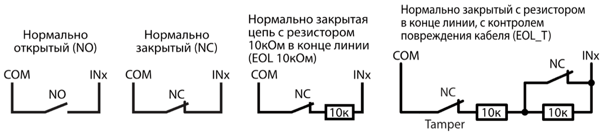

### Схемы подключения пожарных извещателей 

Администратор или пользователь может запустить работать заново пожарный извещатель после срабатывания. Выходу OUT должна быть присвоена функция „Сброс пожарного датчика“ (см. п. 4.8 Окно „PGM выходы“-> Закладка „Выходы“).

- Подключение четырех проводного пожарного извещателя.

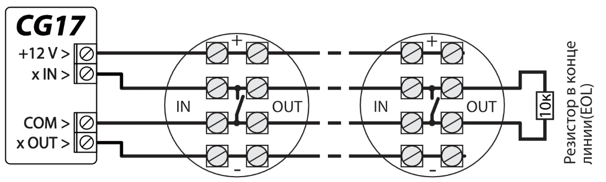

- Подключение двух проводного пожарного извещателя.

1.  EOL зона (или NC, если без резистора 10 кОм).

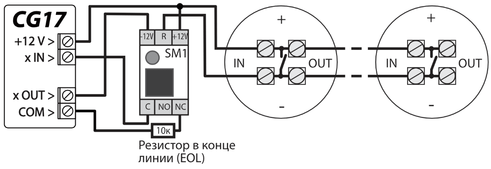

2. EOL зона (или NO, если без резистора 10 кОм).

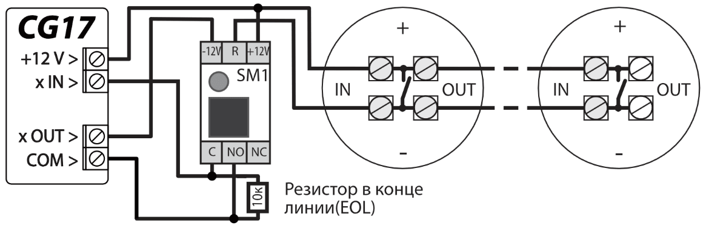

\*SM1 – модуль сопряжения производства Trikdis, позволяет удаленно запустить заново работать двухпроводный пожарный извещатель после срабатывания.

### Схема подключения датчика температуры 

- Датчики температуры подключаются по предоставленной схеме. К *CG17* можно подключить до 8 шт. датчиков температуры Maxim®/Dallas® DS18S20, DS18B20.

- Для подключения датчиков температуры рекомендуется применять кабель с витой парой (UTP4x2x0,5 или STP4x2x0,5).

Цвета проводов:

**Vdd -** красный, подключить к клемме +5 V;

**DQ -** желтый, подключить к клемме 1-Wire;

**GND -** черный, подключить к клемме COM.

### Схема подключения реле и LED индикатора

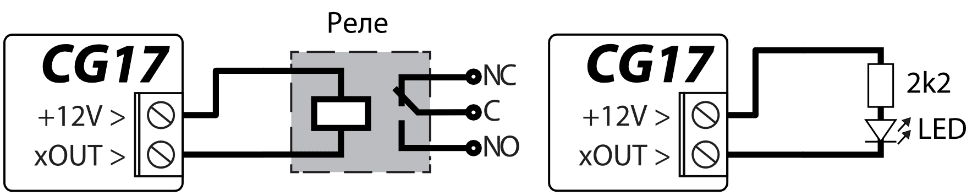

### Схема подключения считывателя контактных ключей

Индикаторная панель ТМ17 со считывателем контактных ключей подключается к CG17 через RS485 шину**.** Длина кабеля до 100 м. К CG17 можно подключить до 8 считывателей ТМ17.

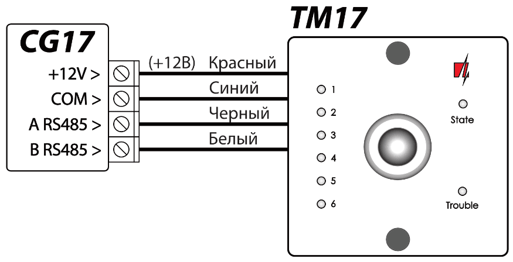

Считыватель контактных (**iButton**) ключей к CG17 подключается через „1-Wire“ шину. Длина кабеля до 30 м.

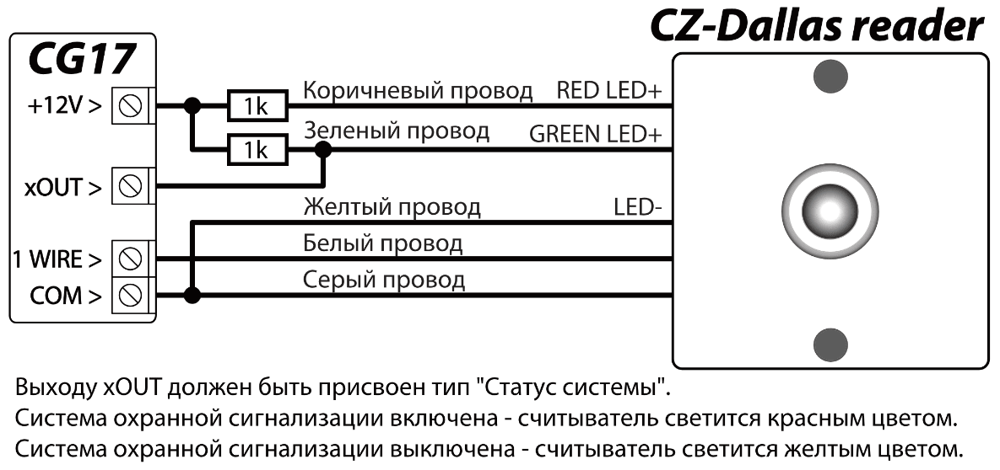

!!! note "Примечание"
    Регистрация контактных ключей к CG17 описана в
    п. 4.4.1 „Регистрация контактных (iButton) ключей".
### Схема подключения RF-SH приемника беспроводных датчиков 

*RF-SH* приемник беспроводных датчиков предназначен для работы с беспроводными изделиями фирмы Crow (ИК извещатель, магнитный датчик, сирена, беспроводная клавиатура и т.д.). К *CG17* можно подключить один *RF-SH* приемник.

### Схема подключения модулей расширения

Подключите проводные или беспроводные расширители серии iO к охранной панели CG17 для увеличения входов (IN) и выходов (OUT). Конфигурация CG17 с модулями расширения описана в п. 4.5 „Окно „Модули““. К CG17 можно подключить до 8 iO-8 модулей расширения. В модуле iO-8 можно активировать все или только несколько входов (IN). Общее количество входов (зон) в охранной панели CG17 12 шт..

  <figure style="margin: 0;">
    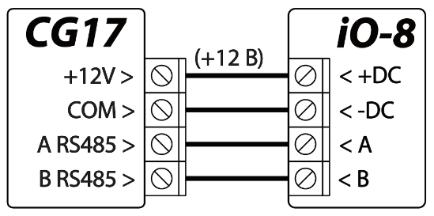
  </figure>
  <figure style="margin: 0;">
    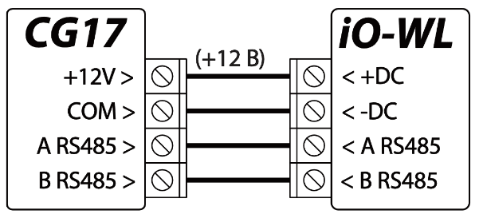
  </figure>

### Схема подключения клавиатуры Crow CR-16 

К охранной панели *CG17* можно подключить до 8 клавиатур (Crow CR-16 Runner, Crow LCD Runner, Crow Touch Runner или Crow CR-16 PowerWave). В программе необходимо отметить, что будет применяться клавиатура Crow CR-16 (см. п.4.2 „Окно „Системные параметры““).

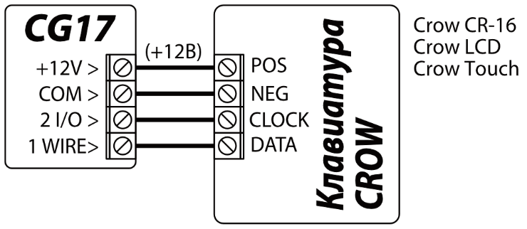

### Схема подключения сирены 

- К выходам „5 OUT“ или „6 OUT“ можно подключить сирену, номинальный ток которой до 1 А.

- К любым другим выходам OUT можно подключить сирену, номинальный ток которой до 0,1 А.

- Выходу OUT должна быть присвоена функция „Сирена“ и указан раздел (область) охранной сигнализации.

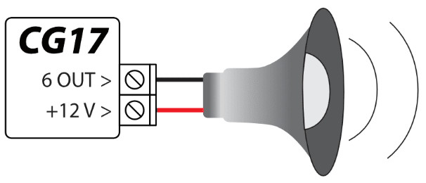

### Схема подключения расширителей серии iO 

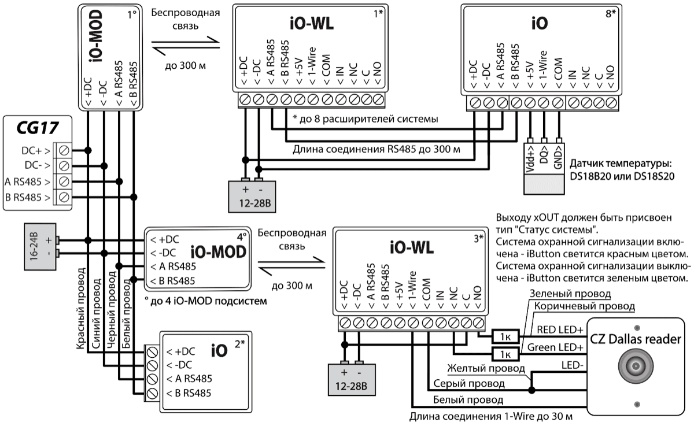

**Примечание:**

- При подключении датчиков температуры рекомендуется применять кабель витой пары (**UTP4x2x0,5 или STP4x2x0,5**).

- К одному CG17 можно подключить:

  - До 4 шт. модулей **iO-MOD**.

  - До 8 шт. модулей **iO** и/или **iO-WL**.

- Датчики температуры и считыватели iButton ключей подсоединяются к клемме „1-Wire“.

### Схема подключения датчика уровня топлива Strela RS485 

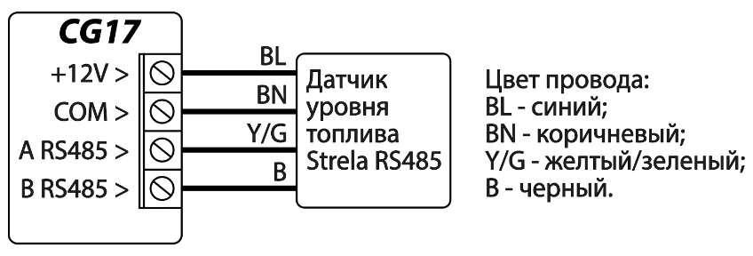

К CG17 можно подключить один датчик уровня топлива „**Strela RS485**“. Когда датчик топлива подключен, другие модули (iO-8, iO, iO-WL, RF-SH, TM17, E485, W485, iO-LORA, iO8-LORA, PB-LORA, REL-LORA) не подключаются к CG17.

#### Калибровка датчика уровня топлива и подготовка к работе с CG17.

Датчик уровня топлива „**STRELA S485**“ (http://strela-fls.com/products/fuel_level_sensors_strela.html) должен быть откалиброван с помощью программного обеспечения производителя „**DUTConfig**“ (<http://strela-fls.com/programs.html>). Необходимо указать емкость топливного бака - в противном случае измерения датчика могут быть неточными.

1.  Подсоедините датчик уровня топлива к компьютеру, с помощью адаптера программирования. Нажмите коричневую кнопку на адаптере, чтобы загорелся зеленый индикатор RS-485 в секции UART.

2.  Запустите „**DUTConfig**“. Выберите „**Interface sensor**“.

1.  **„View**“ режим „**Standart**“.

2.  Нажмите „**Connect**“ и подождите.

3. Когда датчик уровня топлива подключен к „DUTConfig“ появляется икона **„Connection: ON**“.

    

2.  Нажмите кнопку „**Edit**“ и произведите калибровку датчика уровня топлива с полным и пустым топливным баком.

3.  Калибровка в реальных условиях: а) полный топливный бак и датчик уровня топлива помещен в бак – нажмите кнопку „**Full tank**“; б)** **пустой топливный бак (датчик уровня топлива вытащен из бака) - нажмите кнопку „**Empty tank**“**.**

4.  Нажмите кнопку „**OK**“ и значения будут записаны.

    

5.  Переключите „**View**“ в режим „**Extended**“.

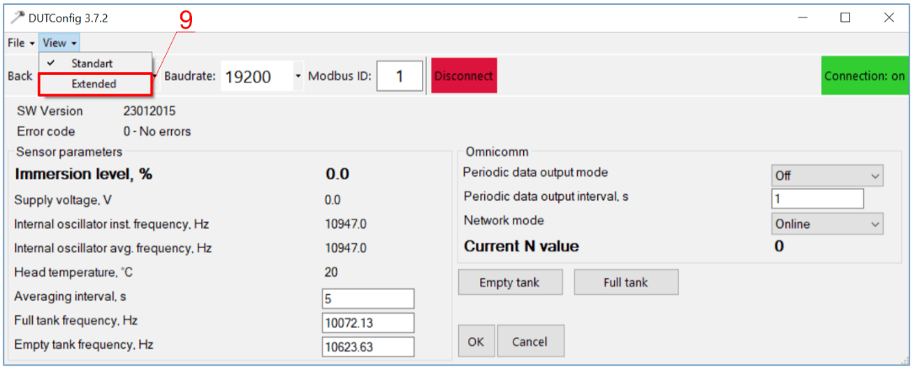

10. Заполните эту таблицу в соответствии с формой топливного бака. Простой способ заполнения, 0% процентов погружения датчика уровня топлива - 0 л топлива, а 100% погружения – это емкость вашего топливного бака (в примере указана емкость топливного бака 200 л).

11. Заполнив эту таблицу, нажмите кнопку „**OK**“.

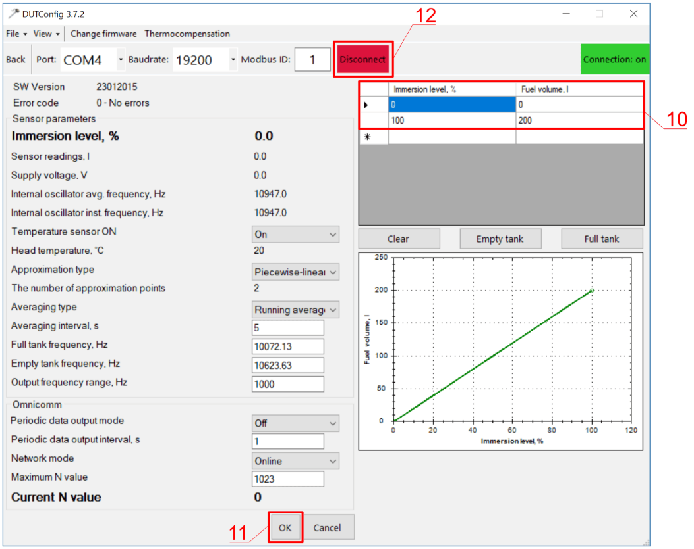

12. Нажмите кнопку „**Disconnect**“.

13. Отсоедините датчик уровня топлива и подсоедините его к CG17.

### Схема подключения аккумулятора 

К CG17 может быть подключен аккумулятор. При исчезновении напряжения в сети переменного тока, CG17 автоматически переключится на аккумулятор и будет отправлено сообщение „Пропажа сети“ („AC fault“).

- Если напряжение на аккумуляторе упадет до 11,5 В, то будет отправлено сообщение „Низкое напряжение батареи“ („Battery low“).

- CG17 отключится если не будет напряжения в сети и напряжение на аккумуляторе упадет ниже 9,5 В.

- При восстановлении напряжения в сети будет отправлено сообщение „Восстановление сети“ („AC restore“). Начнется зарядка аккумулятора.

- При достижении напряжения на аккумуляторе 12,6 В, будет отправлено сообщение „Аккумулятор заряжен“ („Battery restore“).

**Подключение аккумулятора:**

- Вставьте аккумулятор в ящик сигнализации.

- Подключите провода от аккумулятора к клеммам ВАТ+/ВАТ-.

- Проверьте, что аккумулятор заряжается.

### Cхема подключения CG17 к охранной панели 

*CG17* работает в режиме коммуникатора. Входам *CG17* должен быть установлен режим работы „24-х час“ и указан тип цепи NO или NC. / Входам *CG17* можно записать тексты SMS сообщений, которые будет получать пользователь при срабатывании/восстановлении входов. / PGM выходам охранной панели должны быть назначены события.

### Измерение постоянного напряжения с CG17 

С *CG17* можно выполнять измерение постоянного напряжения. Четыре входа *CG17* 1IN, 2IN, 3IN, 4IN можно выбрать для измерения напряжения. Уровень измеряемого напряжения от 0 В до 30 В (охранная панель будет испорчена если напряжение будет выше 30 В). К клеммам 1IN и COM подключается источник измеряемого напряжения. 1IN – положительная клемма. СОМ – отрицательная клемма.

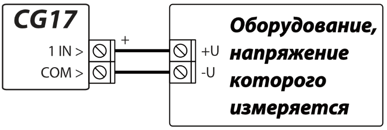

Кабелем USB Mini-B подключите CG17 к компьютеру. Запустите программу TrikdisConfig. Программа автоматически определит подключенное изделие и откроет окно конфигурации CG17. В окне программы „**Датчики**“ укажите „**In1 Напряжение**“ и укажите величину напряжения, при превышении которого будет сформировано сообщение.

- **Макс** – наибольшее значение измеряемого напряжения, превысив которое будет сформировано сообщение о событии. Чтобы сообщение было отправлено должно быть отмечено поле „**Макс**“.

- **Мин** - наименьшее значение измеряемого напряжения, ниже которого будет сформировано сообщение о событии. Чтобы сообщение было отправлено должно быть отмечено поле „**Мин**“.

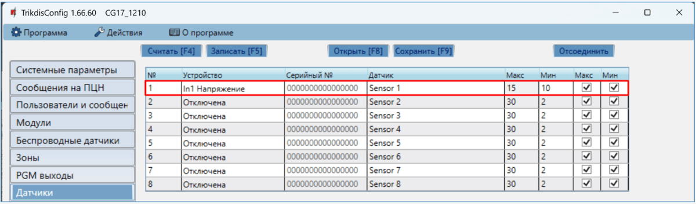

Можно задать активацию PGM выхода если уровень измеряемого напряжения выходит за рамки установленного значения. В программе TrikdisConfig необходимо выбрать PGM выход и установить режим работы „**Удаленное управление**“.

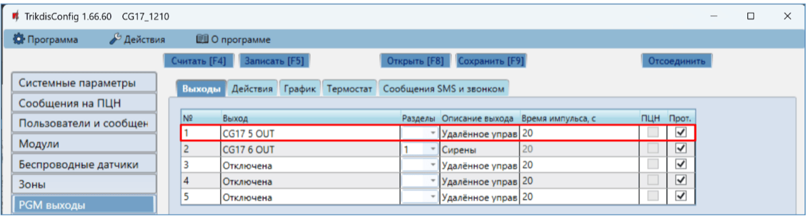

Перейдите к закладке „**Действия**“.

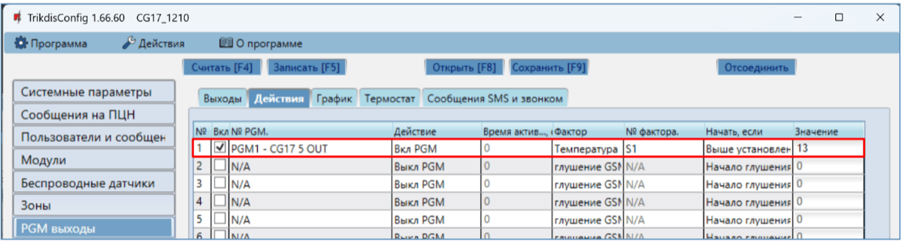

- **Вкл.** – отметьте поле галочкой, чтобы включить управление PGM выходом.

- **№ PGM** – укажите PGM выход, которым будет управлять вход 1IN.

- **Действие** – установите режим работы PGM выхода:
- **Выкл. PGM –** выключить выход PGM.

- **Вкл. PGM** – включить выход PGM.

- **Вкл. импульсом** – включить PGM выход на продолжительность импульса (после получения команды выход включается на продолжительность импульса и затем выключается).

- **Выкл. импульсом** – выключение PGM выхода на продолжительность импульса (после получения команды выход выключается на продолжительность импульса и затем включается).
- **Время активности** – установите длительность импульса срабатывания (0-9999 сек.).

- **Фактор** – установите „**Температура**“.

  - **№ фактора** – выберите вход (1IN) измерения напряжения.

- **Начать если** – установите дополнительное условие включения PGM выхода.
- **Значение** – введите значение напряжения (В), по величине которого будет управляться PGM выход.

### Схема подключения WiFi модуля W485

Модуль *W485* предназначен для передачи сообщений и управления через Wi-Fi компьютерную сеть. Используя *W485* вместе с *СG17* (версия прошивки от Ver.1.13), сообщения на ПЦН и в *Protegus2* передаются через Wi-Fi компьютерную сеть и мобильный интернет не используется. При нарушении связи в Wi-Fi сети данные передаются через сеть мобильного интернета. При восстановлении Wi-Fi связи *CG17* начинает вновь отправлять сообщения через *W485*. / Конфигурация *CG17* с Wi-Fi модулем *W485* описана в п. 4.5 „Окно „Модули““. / Используя W485 вместе с CG17, SIM карта не обязательна. / К *CG17* можно подключить один модуль *W485*.

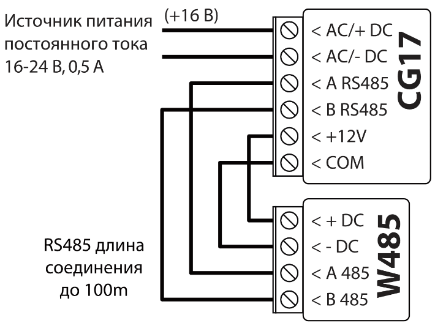

### Схема подключения „Ethernet“ модуля E485 

Модуль *Е485* предназначен для передачи сообщений и управления через проводную компьютерную сеть. Используя *Е485* вместе с *CG17* (версия прошивки от Ver.1.13), сообщения на ПЦН и в *Protegus2* передаются через проводную компьютерную сеть и мобильный интернет не используется. При нарушении связи в компьютерной сети данные передаются через сеть мобильного интернета. При восстановлении связи в компьютерной сети *CG17* начинает вновь отправлять сообщения через *Е485*. / Конфигурация *CG17* с „Ethernet“модулем *Е485* описана в п. 4.5 „Окно „Модули““. / Используя E485 вместе с CG17, SIM карта не обязательна. / К *CG17* можно подключить один модуль *Е485*.

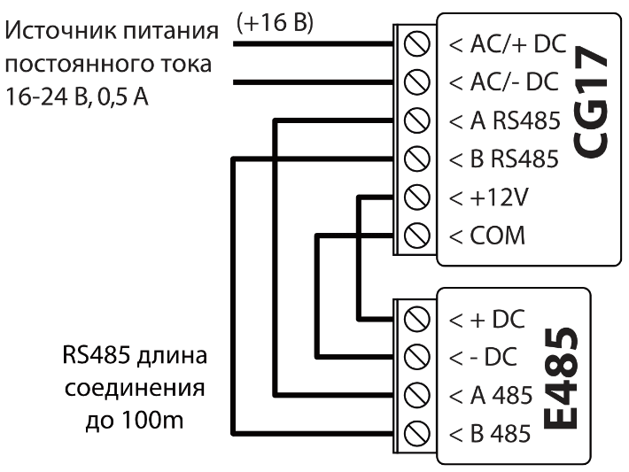

### Схема подключения модулей расширения iO-LORA 

Версия прошивки контроллера CG17 от 1.18 и выше.

Подключите трансивер RF-LORA к CG17. После этого вы можете использовать модули iO-LORA, iO8-LORA, PB-LORA, REL-LORA. К CG17 можно подключить один трансивер RF-LORA.

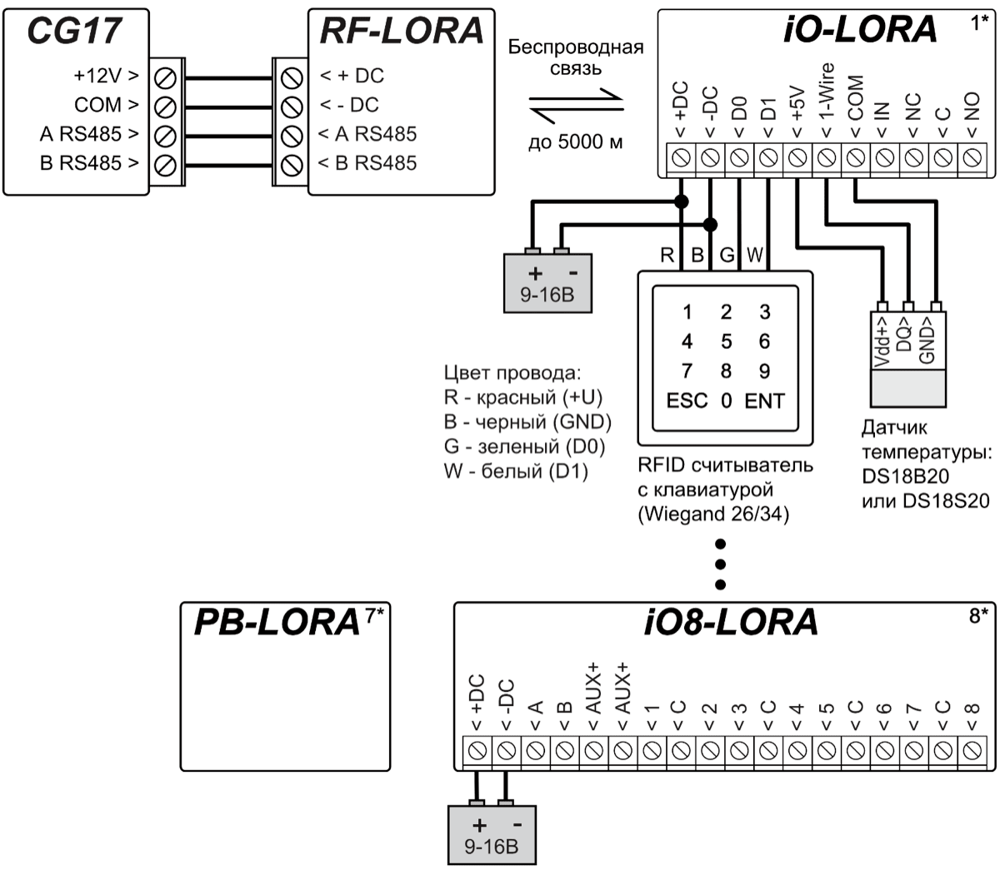

Запустите TrikdisConfig. Подключите CG17 через кабель USB Mini-B к компьютеру или удаленно. Нажмите кнопку **Считать [F4]** в программе TrikdisConfig, чтобы отобразить текущие значения рабочих параметров контроллера. При появлении запроса введите код администратора или установщика во всплывающем окне. В списке „**Модули**“ выберите модуль LORA, который вы используете. В поле „**Серийный №**“ введите серийный номер модуля.

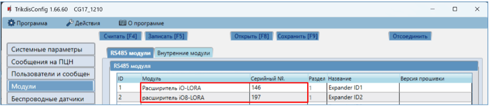

Нажмите **Записать [F5]** после внесения изменений. Дождитесь завершения обновления. Нажмите „**Отсоединить**“ и отсоедините USB-кабель.

## Конфигурация с программой *TrikdisConfig*

1.  Загрузите программу конфигурации TrikdisConfig со странички [www.trikdis.com/ru](http://www.trikdis.com/ru)/ (в поле поиска напишите „TrikdisConfig“), и установите ее на компьютер.

2.  Плоской отверткой снимите крышку, как показано на рисунке:

1.  Кабелем USB Mini-B подключите CG17 к компьютеру.

2.  Запустите программу TrikdisConfig. Программа автоматически определит подключенное изделие и откроет окно конфигурации CG17.

3.  Нажмите на кнопку **Считать [F4]**, чтобы скачать установленные параметры на CG17. Если необходимо введите код администратора или инсталлятора.

### Строка состояния TrikdisConfig 

Подключив CG17 к TrikdisConfig и нажав на кнопку **Считать [F4]**, программа в строке состояния предоставит информацию о подключенном изделии.

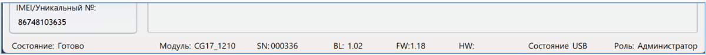

#### Строка состояния

| Наименование | Описание |
|----|----|
| IMEI/​Уникальный № | IMEI номер изделия |
| Состояние | Рабочее состояние |
| Модуль | Тип изделия (должно быть указано CG17) |
| SN | Серийный номер изделия |
| BL | Версия программы |
| FW | Версия программы изделия |
| HW | Версия аппаратной части изделия |
| Состояние | Подключение программы к изделию (USB или Remote (удаленно)) |
| Роль | Уровень доступа (показывается после подтверждения кода доступа) |

!!! note "Примечание"
    Нажмите **Считать [F4]**, чтобы программа считала и показала
    конфигурацию устройства. / Нажмите **Записать [F5]**, чтобы записать
    данные установленные в программе на устройство. / Нажмите
    **Сохранить [F9]**, чтобы сохранить настройки в файл конфигурации,
    который сможете использовать для загрузки на другие изделия. Это
    позволяет быстро конфигурировать изделия с аналогичными
    настройками. / Нажмите **Открыть [F8]** и выберите ранее сохраненный
    файл. Программа откроет файл и покажет настройки, которые были ранее
    сохранены. / Для восстановления заводских настроек нажмите на кнопку
    „**Восстановить**" (находится слева внизу в программном окне).
Нажмите **Считать [F4]**, чтобы программа считала и показала конфигурацию устройства CG17. С TrikdisConfig сделайте необходимые настройки по приведенному ниже описанию.

### Окно „Системные параметры“ 

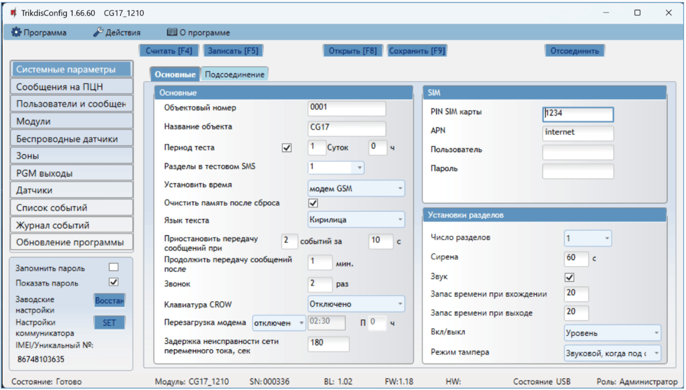

**Закладка „Основные“**

**Группа „Основные“**

- **Объектовый номер** – если сообщения будут отправляться на ПЦН, то надо указать номер объекта, выданный ПЦН (4-ехзначное шестнадцатеричное число, 0-9, A-F. **Не используйте FFFE, FFFF объектовые номера.**).

- **Название объекта** – будет записываться в отправляемые SMS сообщения (до 20 символов, может включать буквы и цифры).

- **Период теста** – отметьте поле и укажите период времени когда будут отправляться тестовые сообщения.

- **Разделы в тестовом SMS** – отметьте номера разделов, статус которых будет отправлен в тестовом сообщении.

- **Установить время** –выберите сервер (IP сервер, Модем GSM, Облачный сервис), с которым будет производиться синхронизация времени. Выбрав „IP сервер“ – синхронизация с временем IP приемника.

- **Очистить память после сброса** – отметьте поле и все не отправленные сообщения после перезагрузки системы будут удалены.

- **Язык текста** – укажите язык и в сообщениях будут применяться специфические символы этого языка.

- **Приостановить передачу сообщений при** – если идет много повторяющихся **событий за** установленный промежуток времени.

- **Продолжить передачу сообщений после** – укажите период времени (0-999 мин.), после которого передача приостановленных сообщений будет продолжена.

- **Звонок** – при происшествии события, CG17 позвонит пользователю указанное количество раз. Если пользователь отклонит или ответит на звонок, CG17 прекратит звонки. Длительность звонка 20 сек..

- **Клавиатура CROW** – укажите тип клавиатуры (Crow CR-16, Crow LCD, Crow Touch), которая будет подсоединена к охранной панели.

- **Перезагрузка модема –** можно настроить перезапуск модема в указанное время**.**

- **Задержка неисправности сети переменного тока -** в случае сбоя в электросети уведомление об отключении питания будет отправлено после указанной задержки времени. Когда напряжение питания восстановится, уведомление о восстановлении напряжения питания будет отправлено после указанной задержки времени.

**Группа „SIM“**

- **PIN SIM карты** – введите PIN код SIM карты.

  - **APN** – введите адрес подключения мобильного интернета провайдера. „**APN**“ необходимо вводить, когда уведомления отправляются в Protegus или в ПЦН через GPRS.
- **Пользователь** и **Пароль** – если провайдер мобильной связи требует, то надо ввести в соответствующие поля имя пользователя и пароль.

**Группа „Установки разделов“**

- **Число разделов** – укажите на сколько разделов (областей) будет поделена охранная сигнализация.

Если подключена сирена, то выходу OUT надо присвоить тип „Сирена“ и указать „Раздел“ (область) сигнализации.

- **Сирена** – укажите продолжительность работы сирены при срабатывании сигнализации. (0-999 сек.).

- **Звук** – отметьте поле и при включении сигнализации сирена один раз коротко подает звуковой сигнал, при выключении сигнализации – сирена подает два раза звуковой сигнал.

- **Запас времени при вхождении** – введите продолжительность задержки времени, предназначенной для входа через зону „Входа“, для отключения сигнализации. (0-999 сек.).

- **Запас времени при выходе** – введите продолжительность задержки времени, предназначенной для выхода через зону „Входа“, при включении сигнализации. (0-999 сек.). Если сигнализация включается/выключатся приложением Protegus2 или телефонным звонком система не будет отсчитывать задержку времени.

- **Вкл/выкл**. – укажите режим управления „**Уровень**“ или „**Импульс**“, если применяем активацию зоны (Переключатель) для включения/выключения сигнализации.

- **Режим тампера** - укажите тип реакции (Тихий; Звуковой, когда под охраной; Всегда звуковой) системы охраны, когда произойдет срабатывание тампера. „**Тихий**“ – будут отправляться сообщения о событии, но сирена не включится. „**Звуковой, когда под охраной**“ – будут отправляться сообщения о событии, но сирена включится при срабатывании тампера при включенной системе охраны. „**Всегда звуковой**“ – будут отправляться сообщения о событии и всегда будет срабатывать сирена.

**Закладка „Подсоединение“**

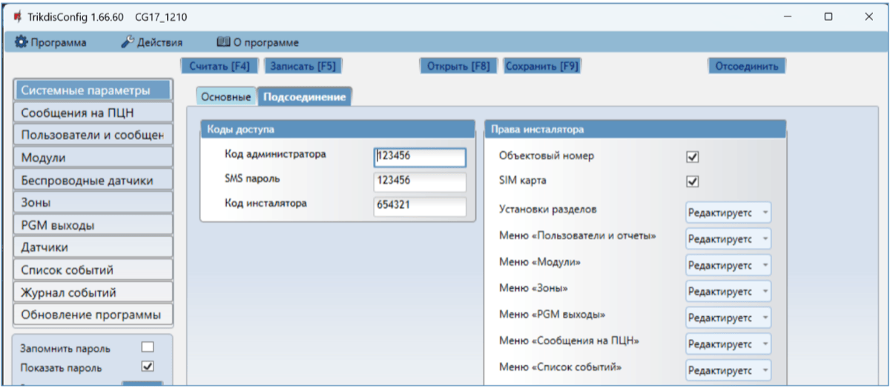

**Группа „Коды доступа“**

- **Код администратора** – (заводской код – 123456) дает полный доступ к конфигурации системы (код должен быть длиной 6 символов, он может состоять из латинских букв и / или цифр). Из соображений безопасности измените его на новый шестизначный код, который будете знать только вы.
- **SMS пароль** - (заводской код – 123456) используется для безопасного управления SMS сообщениями. Из соображений безопасности измените его на новый шестизначный код, который будете знать только вы.

- **Код инсталлятора** – (заводской код - 654321) дает доступ к конфигурации системы инсталлятору. Из соображений безопасности измените его на новый шестизначный код, который будете знать только вы.

!!! note "Примечание"
    Если установленный код администратора (123456), то программа не будет
    требовать его ввести и после нажатия на кнопку **Считать [F4]** будут
    считаны все значения настроек CG17.
**Группа „Права инсталлятора“**

- Администратор устанавливает, какие параметры инсталлятор сможет изменять.

### Окно „Сообщения на ПЦН“ 

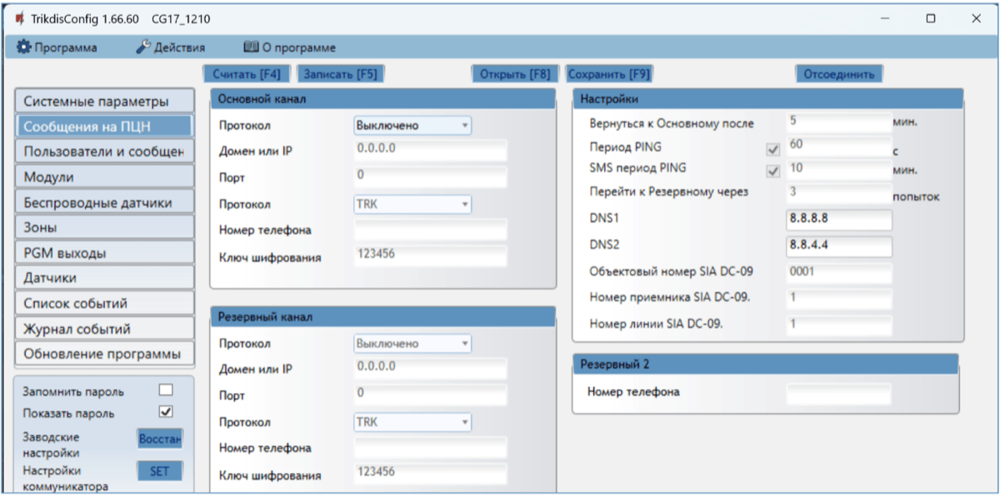

**Группа „Основной канал“** и **„Резервный канал“**

- **Протокол** – выберите протокол связи с приемником (TCP/IP, UPD/IP, SMS).

- **Домен или IP** – введите адрес домена или IP адрес приемника.

- **Порт** – введите номер порта приемника в сети.

- **Протокол – TRK** передача данных на приемники Trikdis, **SIA DC-09** передача данных на универсальные приемники.

- **Номер телефона** – телефонный номер ПЦН Trikdis SMS приемника, который может принять SMS сообщения. Номер телефона должен быть с международным кодом страны (например: 370хххххххх).

- **Ключ шифрования** – шестизначный ключ шифрования сообщений, который должен совпасть с ключом шифрования ПЦН приемника сообщения.

**Группа „Настройки“**

- **Вернуться к основному после** – время по истечении которого, CG17 попытается восстановить связь по основному каналу, мин..

- **Период PING** – период отправления PING сигнала для проверки GPRS канала связи, сек.. Отметьте поле, чтобы активировать проверку канала связи.

- **SMS период PING** – период отправления PING сигнала по каналу отправки SMS сообщений, мин.. Отметьте поле, чтобы активировать проверку канала связи.

- **Перейти к резервному после** – указывается число неудачных попыток передать сообщение по „Основному каналу“ связи, после чего будет попытка передать сообщения по „Резервному каналу“.

- **DNS1-DNS2** – адреса DNS серверов.

- **Объектовый номер SIA DC-09** – введите номер объекта.

- **Номер приемника SIA DC-09** – введите номер приемника.

- **Номер линии SIA DC-09** – введите номер линии.

**Группа „Резервный 2“**

- **Номер телефона** – номер телефона (вводится с международным кодом) приемника ПЦН, который может принять SMS сообщения. SMS сообщения отправляются по „**Резервному 2“** каналу, когда их не удается отправить по „**Основному“** и „**Резервному**“ **каналам**. Он особенно полезен, когда пропадает IP связь в сети оператора мобильной связи. Этот канал связи работает только если установлена GPRS связь на „Основном“ и „Резервном“ каналах связи. SMS сообщения будут отправляться на приемник ПЦН: 1) сразу после первого включения СG17; 2) после прерывания TCP/IP и UDP/IP на „Основном“ и „Резервном‘ каналах связи.

### Окно „Пользователи и сообщения“ 

**Закладка „Пользователи“**

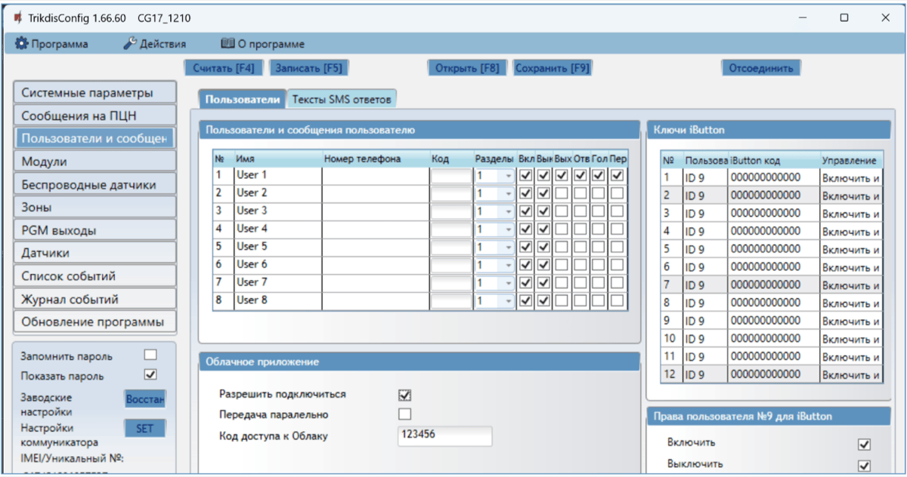

Группа „Пользователи и сообщения пользователю“

- **№** - порядковый номер пользователя.

- **Имя** – имя или адрес электронной почты пользователя. Имя будет записываться в SMS сообщение. Администратор может указать адрес электронной почты пользователя. Это позволит пользователю использовать приложение Protegus2.

- **Номер телефона** – номер телефона пользователя, с которого удаленно будет управляться сигнализация и на который будут отправляться SMS сообщения. Номер должен быть введен с международным кодом.

- **Код** – код предназначен для управления (включить/выключить) сигнализацией.

- **Разделы** – пользователю назначаются разделы (области) сигнализации, которыми он может управлять. Пользователь ID9 может управлять только 1 разделом охранной сигнализации и этот параметр не изменяется.

- **Вкл** – отметьте поле и пользователю будет разрешено включать сигнализацию.

- **Выкл –** отметьте поле и пользователю будет разрешено выключать сигнализацию.

**Вых. Голос** не отмечены. „**Вкл.**“ и „**Вык**.“ отмечены. При звонке пользователя CG17 отклонит звонок, а сигнализация переключит режим охраны на противоположный, т.е. сигнализация будет включена или выключена.

- **Вых.** – если выбрано только это поле, то CG17 разрешит пользователю позвонить и удаленно включить/выключить выходы OUT.
- **Голос** – будет использоваться в будущем.

  - **Отв.** – отметьте поле и CG17 будет отвечать SMS сообщением на каждое полученное SMS сообщение.

- **Пер.** – отметьте поле и будет включена переадресация SMS сообщений от неизвестных телефонных номеров.

**Группа „Облачное приложение“**

- **Разрешить подключиться** – отметьте поле, чтобы разрешить доступ к серверу Protegus. CG17 сможет обмениваться данными с приложением Protegus2. С программой TrikdisConfig можно будет удаленно конфигурировать CG17.

- **Передача параллельно** – отметьте поле и будет разрешена параллельная передача сообщений по „**Основному каналу**“ и в Protegus2.

- **Код доступа к Облаку** – шестизначный код подключения к Protegus2, который должен совпадать с кодом, указанным в приложении Protegus2.

**Группа „Ключи *iButton*“**

!!! note "Примечание"
    Одному пользователю можно присвоить более одного ключа! Все новые
    зарегистрированные ключи будут присвоены пользователю ID9 (без имени).
    Только восьми пользователям (ID1 -- ID8) можно присвоить имена.
    Разрешение для управления пользователем ID9 устанавливаются в „**Права
    пользователя №9 для iButton"**.
- **№** - порядковый номер ключа.

- **Пользователь** – номер пользователя (ID1-ID8), которому присвоен ключ. Чтобы присвоить ключ пользователю, нужно заменить „ID9“ на любой другой номер пользователя из таблицы „**Пользователи о сообщения пользователю“.** (Например, чтобы присвоить ключ пользователю № 3, „ID9“ необходимо заменить на „ID3“).

- **iButton код** – идентификационный номер iButton ключа или ID номер RFID карты.

- **Управление** – выберите действие, которое должна будет выполнить система после считывания iButton ключа. (Включить / Выключить / Включить и выключить).

#### Регистрация контактных (iButton) ключей 

**Регистрация контактных ключей с помощью считывателя *ТМ17***.

1.  Если список „**Ключи iButton**“ пуст, первый приложенный контактный ключ к считывателю ТМ17 записывается в первую строку списка и ему назначается функция „**Основного ключа**“.

2.  Чтобы включить режим регистрации контактных ключей необходимо приложить „**Основной ключ**“ к считывателю и удерживать его не менее 10 секунд. Когда включится режим регистрации, у считывателя ТМ17 начнет мигать „**State”** индикатор зеленым цветом.

3.  Регистрация контактных ключей пользователей. Приложите к считывателю и подержите контактный ключ. Три звуковых сигнала сообщат о регистрации контактного ключа. Уберите контактный ключ от считывателя. Если необходимо произвести регистрацию еще одного ключа, то повторите действия, которые описаны выше.

4.  Окончив регистрацию контактных ключей, приложите „**Основной ключ**“ к считывателю и режим регистрации будет отключен. На считывателе ТМ17 перестанет мигать индикатор **„State”.**

5.  Удаление всех контактных ключей (и „**Основного ключа**“) из памяти CG17. К считывателю ТМ17 приложите и удерживайте „**Основной ключ**“ не менее 20 секунд.

    **Регистрация контактных ключей с помощью iButton считывателя ключей**.
1.  Если список „**Ключи iButton**“ пуст, первый приложенный контактный ключ к считывателю iButton записывается в первую строку списка и ему назначается функция „**Основного ключа**“.

2.  Чтобы включить режим регистрации контактных ключей необходимо приложить „**Основной ключ**“ к считывателю и удерживать его не менее 10 секунд.

3.  Регистрация контактных ключей пользователей. Приложите к считывателю контактный ключ. Уберите контактный ключ от считывателя. Если необходимо произвести регистрацию еще одного ключа, то повторите действия, которые описаны выше.

4.  Окончив регистрацию контактных ключей, приложите „**Основной ключ**“ к считывателю и режим регистрации будет отключен.

5.  Удаление всех контактных ключей (и „**Основного ключа**“) из памяти CG17. К iButton считывателю приложите и удерживайте „**Основной ключ**“ не менее 20 секунд.

!!! note "Примечание"
    „**Основной ключ**" предназначен для регистрации дополнительных
    контактных ключей.
#### Регистрация RFID карт 

Используется охранная панель CG17 с модулем iO-LORA, к которому подключен RFID-считыватель с клавиатурой. В поле „**iButton код**“ вводится ID номер RFID-карты.

Нажмите **Записать [F5]** после внесения изменений. Дождитесь завершения обновления.

**Закладка „Тексты SMS ответов“**

**Группа „Текст ответа по SMS“**

- **Текст SMS** – ответное SMS сообщение (текст можно редактировать) на полученные командные SMS сообщения управления.

### Окно „Модули“ 

**Закладка „ RS485 модули “**

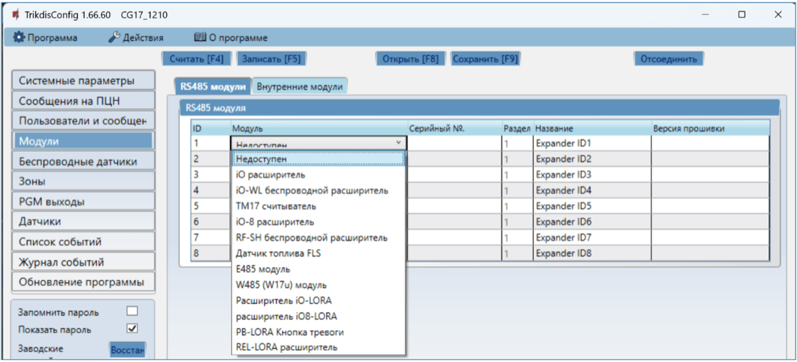

**Группа „RS485 модули“**

- **ID** - порядковый номер модуля.

- **Модуль** – выберите модуль, который будете использовать, из списка (iO, iO-WL, TM17, iO-8, RF-SH, FLS, E485, W485, iO-LORA, iO8-LORA, PB-LORA, REL-LORA).

- **Серийный №** – введите серийный номер модуля, который указан на упаковке или на корпусе модуля.

- **Раздел** – присвоение модуля разделу (области) сигнализации (индикация ТМ17 будет показывать состояние области, к которой присвоен, и состояние зон этой области охранной сигнализации).

- **Название** – введите название модуля.
- **Версия прошивки** – версия программного обеспечения модуля будет отображена, когда CG17 идентифицирует подсоединенный модуль.

#### Окно настроек WiFi модуля W485/W17u

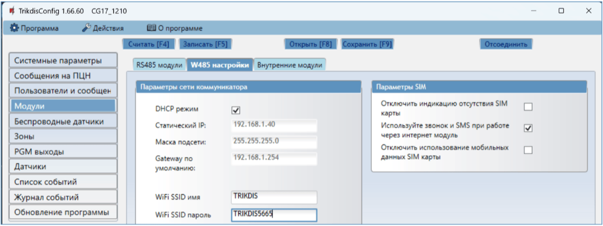

**Группа „Параметры сети коммуникатора“**

- **DHCP Режим** – выберите режим регистрации WiFi модуля в сети (автоматический – DHCP; или ручной – Статический).

- **Статический IP** – введите статический IP адрес (при ручном режиме регистрации).

- **Маска подсети** – введите маску подсети (при ручном режиме регистрации).

- **Gateway по умолчанию** – введите адрес шлюза (при ручном режиме регистрации).

- **Wifi SSID имя** – введите имя WiFi сети, к которой будет подключен модуль W485/W17u.

- **Wifi SSID пароль** – введите пароль WiFi сети.

**Группа „Параметры SIM“**

- **Отключить индикацию отсутствия SIM карты** – отметьте поле и будет отключена индикация отсутствия SIM карты, когда CG17 работает без неё.

- **Используйте звонок и SMS при через интернет модуль** – отметьте поле и будет использоваться звонок и SMS сообщения для передачи данных совместно с модулем W485. Если поле не отмечено и есть Wi-Fi сеть, то звонок и SMS сообщения не используются. Если поле не отмечено и отсутствует Wi-Fi cеть, то CG17 будет звонить и отправлять SMS сообщения пользователю.

- **Отключить использование мобильных данных SIM карты** – отметьте поле, чтобы отключить использование мобильных данных с SIM карты. Данные будут отправляться только через модуль W485. Если Wi-Fi сеть отключится, то данные будут сохраняться в памяти CG17. После восстановления Wi-Fi сети, CG17 отправит сохраненные данные через модуль W485.

!!! note "Примечание"
    CG17 необходимо настроить для отправки сообщений на ПЦН и в
    приложение Protegus2, см. п.2.2 „Настройка связи с ПЦН" и
    п. 2.1 „Настройка связи с приложением Protegus2". / При совместной
    работе модуля W485/W17u и охранной панели CG17 (версия
    прошивки от Ver.1.13) SIM карта не обязательна.
#### Окно настроек „Ethernet“ модуля E485

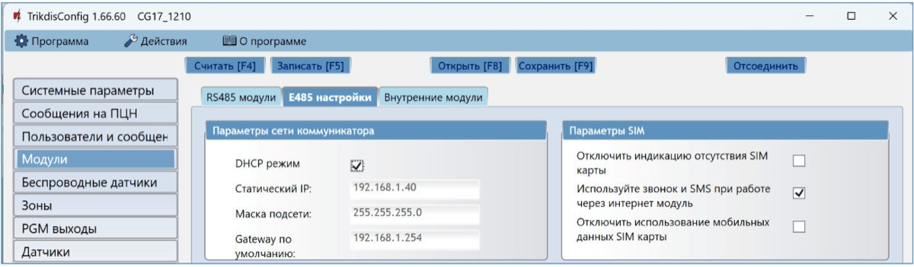

**Группа „Параметры сети коммуникатора“**

- **Режим DHCP** – выберите режим регистрации „Ethernet“ модуля в сети (автоматический – DHCP; или ручной – Статический).

- **Статический IP** – введите статический IP адрес (при ручном режиме регистрации).

- **Маска подсети** – введите маску подсети (при ручном режиме регистрации).

- **Шлюз по умолчанию** – введите адрес шлюза (при ручном режиме регистрации).

**Группа „ Параметры SIM “**

- **Отключить индикацию отсутствия SIM карты** – отметив поле, будет отключена индикация отсутствия SIM карты в CG17.

- **Используйте звонок и SMS при работе через интернет модуль** – отметьте поле и будет использоваться звонок и SMS сообщения для передачи данных вместе с подключенным модулем Е485. Если поле не отмечено и есть интернет, то звонки и SMS сообщения не используются. Если поле не отмечено и нет интернета, то CG17 будет звонить и отправлять SMS сообщения пользователю.

- **Отключить использование мобильных данных SIM карты** – отметив поле, отключите использование мобильных данных с SIM карты. Данные будут отправляться только через модуль Е485. Если исчезнет интернет, то CG17 сохраняет данные в памяти. Когда интернет восстановится, CG17 отправит сохраненные данные через модуль Е485.

!!! note "Примечание"
    CG17 необходимо настроить для отправки сообщений на ПЦН и в
    приложение Protegus2, см. п.2.2 „Настройка связи с ПЦН" и
    п. 2.1 „Настройка связи с приложением Protegus2 ". / При совместной
    работе модуля E485 и охранной панели CG17 (версия прошивки
    от Ver.1.13) SIM карта не обязательна.
**Закладка** **„Внутренние модули“**

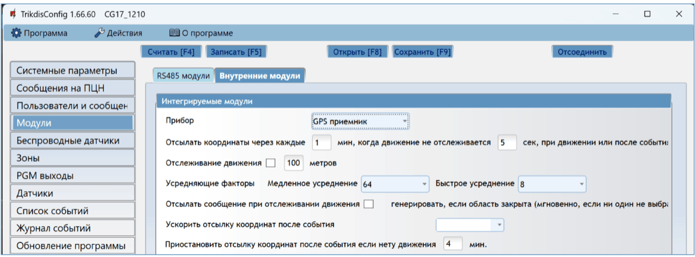

**Группа „Интегрируемые модули“**

- **Прибор** – выберите модуль „**GPS приемник**“. „GPS-приемник“ передает координаты каждые 5 минут (интервал времени передачи координат может быть изменен), когда нет движения или не сработал назначенный детектор. Когда обнаружено движение или срабатывает детектор, „GPS-приемник“ передает координаты каждые 5 секунд (период передачи координат можно изменить). CG17 может отправлять СID коды событий. CG17 отправляет сообщения с координатами в программу Monas MS на ПЦН.

- Отсылать координаты через каждые \_\_\_ мин., когда движение не отслеживается \_\_\_ сек., при движении или после события – указываются интервалы времени передачи координат, когда нормальный режим и когда обнаруживается движение или срабатывание зоны.

- **Отслеживание движения** – если поле отмечено, то изменение координат более чем на указанную величину будет трактоваться как тревога. Координаты будут отправляться ускоренным порядком.

- **Усредняющие факторы, Медленное усреднение** – отправление усредненных координат, когда нет тревоги. Усреднение производится по указанному (256) количеству координат, или должно быть указано другое число координат.

- **Усредняющие факторы, Быстрое усреднение** – отправление усредненных координат, когда обнаружено движение или сработала зона. Усреднение производится по указанному (8) количеству координат, или должно быть указано другое число координат.

- **Отсылать сообщение при отслеживании движения** – отметьте поле и CID код будет отправляться на ПЦН и в приложение Protegus2 при обнаружении движения.

- **Ускорить отсылку координат после события** – отметьте зону, к которой подключен датчик. Срабатывание датчика (рассматривается как сигнал тревоги) ускоряет отправление координат CG17.

- Приостановить отсылку координат после события если нету движения – укажите интервал времени (в минутах). Если координаты не меняются в течении указанного времени и нет срабатывания зоны, то отправка координат переходит в обычный режим.

Сообщения с координатами отправляются в программу Monas MS на ПЦН.

#### Регистрация датчика уровня топлива STRELA RS485 

!!! note "Примечание"
    Перед применением, датчик уровня топлива „**Strela RS485**" нужно
    откалибровать. Калибровка производится с программой производителя
    „**DUTconfig**"**,** подключив датчик уровня топлива через адаптер к
    компьютеру. После подключения датчика уровня топлива „**Strela RS485**"
    к CG17, другие модули (***iO, iO-WL, TM17, iO-8, RH-SH, E485,
    W485, iO-LORA, iO8-LORA, PB-LORA, REL-LORA***)
    будут не активны.
**Группа „RS485 модули“**

- **Модуль** – выберите „**Датчик топлива FLS**“.

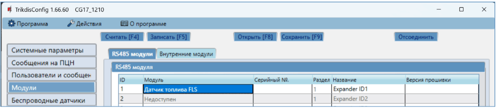

Нажмите кнопку **Записать [F5]**. Дождитесь пока данные будут записаны. Отсоедините USB Mini-B кабель от CG17. Подождите около 1 минуты. Подсоедините USB Mini-B кабель к CG17. Нажмите кнопку **Считать [F4]**. Программа TrikdisConfig отобразит настройки CG17. В окне „Модули“ будет указан серийный номер и версия микропрограммы датчика уровня топлива „**Strela RS485**“.

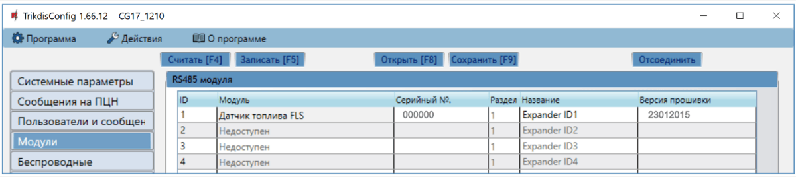

Перейдите к окну „Датчики“.

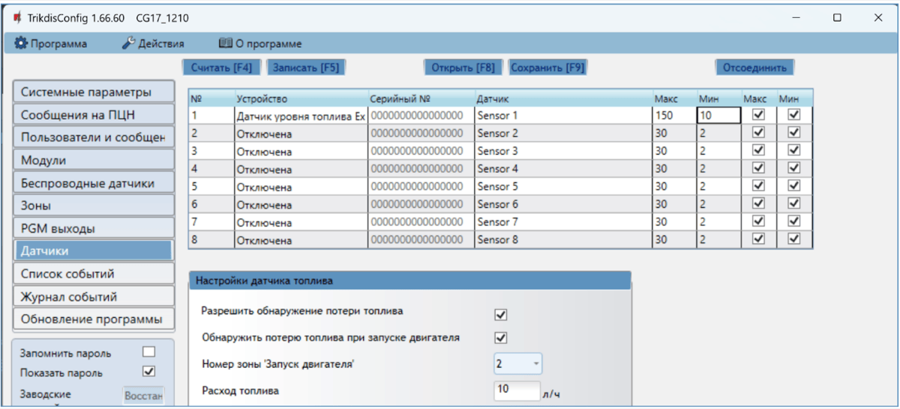

- **Устройство** – выберите „**Датчик уровня топлива**“.

- **Датчик** – введите название датчика.

- **Макс.** – введите наибольшее предельное значение топлива (в литрах), превысив которое будет сформировано сообщение о событии. Чтобы сообщение было отправлено, отметьте поле „**Макс.**“.

- **Мин.** - введите наименьшее предельное значение топлива (в литрах), ниже которого будет сформировано сообщение о событии. Чтобы сообщение было отправлено, отметьте поле „**Мин.**“.

**Группа „Настройки датчика топлива“**

- **Разрешить обнаружение потери топлива** – отметьте поле, чтобы начать мониторинг уровня топлива.

- **Обнаружить потерю топлива при запуске двигателя** – отметьте поле, чтобы начать мониторинг топлива после запуска двигателя. Сигнал запуска двигателя должен быть подан на вход (IN) CG17.

- **Номер зоны „Запуск двигателя“** – введите номер входа (IN) CG17, по срабатыванию которого будет устанавливаться работа двигателя.

- **Расход топлива** – введите норму расхода топлива.

Пользователь будет информирован SMS сообщением о внезапном изменении уровня топлива. Текст SMS сообщения может быть изменен пользователем.

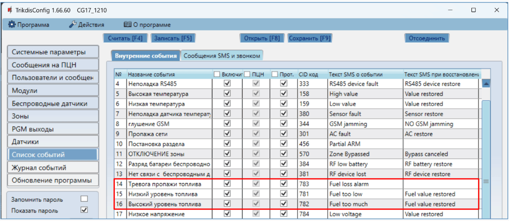

**Описание работы датчика уровня топлива**.

Датчик уровня топлива „**Strela  RS485**“ подключается к CG17 (см.3.10 „Схема подключения датчика уровня топлива Strela RS485“). В CG17 устанавливаются параметры измерения. Датчик уровня топлива начинает измерения, если:

1.  Отмечено поле „**Разрешить обнаружение потери топлива**“. Включив питание CG17, датчик уровня топлива начинает измерять расход топлива. Датчик уровня топлива прекращает измерения после отключения питания CG17.

2.  Отмечены поля „**Разрешить обнаружение потери топлива**“ и „**Обнаружить потерю топлива при запуске двигателя**“. Так же необходимо указать номер входа (IN), при срабатывании (включение двигателя) которого начнется измерение уровня топлива. При восстановлении входа (IN) (двигатель выключен) измерение уровня топлива прекращаются.

Каждый раз, когда включаете датчик уровня топлива, он измеряет настоящий уровень топлива и сравнивает его с предыдущим уровнем, записанным в памяти CG17. Если настоящий уровень топлива меньше, то CG17 отправляет сообщение на ПЦН (пульт централизованного наблюдения) и/или пользователю об уменьшении уровня топлива.

Во время работы датчик уровня топлива измеряет разницу уровня топлива в определенном интервале времени и сравнивает его с нормой расхода топлива. Если расход топлива выше установленной нормы, то CG17 отправляет сообщение на ПЦН и/или пользователю.

### Окно „Беспроводные дачики“ 

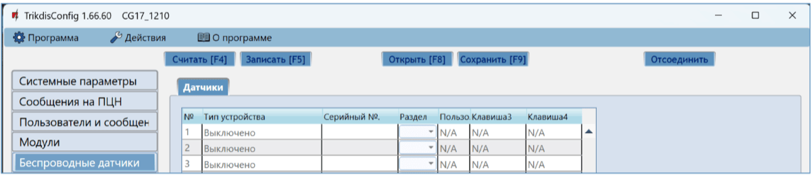

CG17, с подключенным RF-SH модулем, может использовать беспроводные датчики, сирены, клавиатуры, брелоки фирмы Crow (серия FW2, Shepherd).

#### Регистрация приемника беспроводных датчиков RF-SH к *CG17* 

1.  Подключите приемник **RF-SH** и CG17 согласно схеме, см. п.3.7 „Схема подключения RF-SH приемника беспроводных датчиков“.

2.  Включите питание.

3.  Подсоедините кабель USB Mini-B к CG17.

4.  Запустите программу TrikdisConfig и нажмите кнопку **Считать [F4]**.

5.  В окне „**Модули“** из списка выберите „**RF-SH беспроводный расширитель**“.

6.  В поле „**Серийный №**“ введите серийный номер расширителя **RF-SH**.

7.  Нажмите кнопку **Записать [F5]**.

8.  Отсоедините кабель USB Mini-B.

9.  Подождите одну минуту, чтобы СG17 идентифицировал модуль расширения **RF-SH**.

10. Подсоедините кабель USB Mini-B к CG17.

11. Нажмите кнопку **Считать [F4]**.

12. В окне „**Модули**“ в поле „**Версия прошивки**“ будет указана версия программного обеспечения модуля **RF-SH**.

13. СG17 зарегистрировал модуль расширения **RF-SH**.

Теперь можно выполнить регистрацию всех беспроводных датчиков.

#### Регистрация беспроводных датчиков серии FW2 

1.  Убедитесь, что CG17 зарегистрировал приемник беспроводных датчиков **RF-SH**. (см. п.4.6.1).

2.  Включите питание.

3.  Снимите крышку с **RF-SH**.

4.  Нажмите и удерживайте кнопку „**LEARN**“ на модуле **RF-SH**, пока светодиод „**LEARN**“ не начнет мигать зеленым цветом.

5.  Отпустите кнопку.

6.  Мигающий зеленый индикатор „**LEARN**“ указывает, что **RF-SH** находится в режиме регистрации беспроводных датчиков.

7.  Вставьте аккумулятор в беспроводный датчик и дождитесь, пока светодиоды на датчике перестанут мигать.

8.  Нажмите и удерживайте кнопку „**LEARN**“ на приемнике **RF-SH**, пока светодиод „**LEARN**“ не перестанет мигать зеленым. Приемник **RF-SH** вышел из режима регистрации.

9.  Подсоедините кабель USB Mini-B к CG17.

10. Запустите программу TrikdisConfig и нажмите кнопку **Считать [F4]**.

11. Программа TrikdisConfig отобразит список с зарегистрированным беспроводным датчиком в окне „**Беспроводные**“. В поле „**Серийный №**“ будет записан 7-значный серийный номер. Номер должен совпасть с серийным номером датчика, который записан на задней стороне корпуса или на плате.

12. Датчики должны быть распределены по зонам и разделам (областям) охранной панели CG17 (окно „**Зоны**“). После внесения изменений нажмите **Сохранить [F5]**.

13. Беспроводный датчик полностью зарегистрирован.

!!! note "Примечание"
    Удаление беспроводных датчиков из памяти CG17:
    
    1.  Подсоедините кабель USB Mini-B к CG17.
    
    2.  Запустите программу TrikdisConfig и нажмите кнопку
        **Считать [F4]**.
    
    3.  В окне „**Беспроводные**" в поле „**Тип устройства**", где записаны
        зарегистрированные датчики**,** укажите „**Выключено**". Нажмите
        кнопку **Записать [F5].** Беспроводный датчик удален из памяти
        CG17.
#### Регистрация беспроводного брелока серии FW2 

1.  Убедитесь, что *CG17* зарегистрировал приемник беспроводных датчиков RF-SH. (см. п.4.6.1).

2.  Включите питание.

3.  Снимите крышку с RF-SH.

4.  Нажмите и удерживайте кнопку „LEARN“ на модуле RF-SH, пока светодиод „LEARN“ не начнет мигать зеленым цветом.

5.  Отпустите кнопку.

6.  Мигающий зеленый индикатор „LEARN“ указывает, что RF-SH находится в режиме регистрации беспроводных датчиков.

7.  На брелоке одновременно нажмите и удерживайте 3 и 4 кнопки. Индикатор будет мигать желтым. Через несколько секунд он погаснет и на короткое время загорится зеленый индикатор.

8. Отпустите кнопки 3 и 4. Брелок зарегистрирован к CG17.

2.  Нажмите и удерживайте кнопку „**LEARN**“ на приемнике **RF-SH**, пока светодиод „**LEARN**“ не перестанет мигать зеленым. Приемник **RF-SH** вышел из режима регистрации.

3.  Подсоедините кабель USB Mini-B к **CG17**.

4.  Запустите программу TrikdisConfig и нажмите кнопку **Считать [F4]**.

5.  Программа TrikdisConfig отобразит список с зарегистрированным брелоком в окне „**Беспроводные**“. В поле „**Серийный №**“ будет записан 7-значный серийный номер. Номер должен совпадать с серийным номером брелока, который записан на задней стороне брелока.

6.  Брелоку должен быть присвоен „**Раздел**“ (область) охранной панели CG17, которой он будет управлять.

7.  В поле „**Пользователь**“ введите номер пользователя.

8.  Кнопкам 3 и 4 брелока можете присвоить дополнительные функции управления (Снято с охраны; Поставлено на охрану; Тихая паника; Паника; Управление PGM выходом).

9.  После внесения изменений нажмите **Сохранить [F5]**.

10. Беспроводный брелок полностью зарегистрирован.

!!! note "Примечание"
    Восстановление заводских настроек брелока:
    
    1.  Одновременно нажмите и подержите 2 и 3 кнопки брелока. Начнет мигать
        индикатор зеленым и красным цветом.
    
    2.  Погаснут индикаторы. Отпустите кнопки. У брелока восстановлены
        заводские настройки.
#### Регистрация беспроводной сирены серии FW2 

1.  Убедитесь, что CG17 зарегистрировал приемник беспроводных датчиков **RF-SH**. (см. п.4.6.1).

2.  Включите питание.

3.  Снимите крышку с **RF-SH**.

4.  Нажмите и удерживайте кнопку „**LEARN**“ на модуле **RF-SH**, пока светодиод „**LEARN**“ не начнет мигать зеленым цветом.

5.  Отпустите кнопку.

6.  Мигающий зеленый индикатор „**LEARN**“ указывает, что **RF-SH** находится в режиме регистрации беспроводных датчиков.

7.  Снимите крышку с сирены.

8.  Подсоедините питание сирены.

9.  Вспышка сирены будет 30 секунд медленно мигать. Когда вспышка перестанет мигать, сирена готова к регистрации.

10. Нажмите и удерживайте кнопку „**LEARN**“ на плате сирены.

11. Вспышка начнет мигать. Когда вспышка перестанет мигать, сирена будет успешно зарегистрирована.

12. Отпустите кнопку „**LEARN**“.

13. Нажмите и удерживайте кнопку „**LEARN**“ на приемнике **RF-SH**, пока светодиод „**LEARN**“ не перестанет мигать зеленым. Приемник **RF-SH** вышел из режима регистрации.

14. Подсоедините кабель USB Mini-B к CG17.

15. Запустите программу TrikdisConfig и нажмите кнопку **Считать [F4]**.

16. Программа TrikdisConfig отобразит список с зарегистрированной беспроводной сиреной в окне „**Беспроводные**“. В поле „**Серийный №**“ будет записан 7-значный серийный номер. Номер должен совпадать с серийным номером сирены, который записан на плате.

17. Укажите номер „**Раздел**“ охранной панели CG17 сирене. После внесения изменений нажмите **Сохранить [F5]**.

18. Беспроводная сирена полностью зарегистрирована.

!!! note "Примечание"
    Восстановление заводских настроек сирены:
    
    1.  Снимите крышку сирены.
    
    2.  Отключите питание сирены.
    
    3.  Нажмите и удерживайте кнопку „**LEARN**" на плате сирены и
        подсоедините питание.
    
    4.  Удерживайте нажатой кнопку „**LEARN**", пока вспышка сирены не
        мигнет 3 раза.
    
    5.  Отпустите кнопку „**LEARN**". Вспышка сирены редко будет мигать еще
        30 секунд.
    
    6.  Перестает мигать вспышка. Восстановлены заводские настройки
        беспроводной сирены.
#### Регистрация беспроводных датчиков серии SH 

1.  Убедитесь, что CG17 зарегистрировал приемник беспроводных датчиков **RF-SH**. (см. п.4.6.1).

2.  Включите питание.

3.  Снимите крышку с **RF-SH**.

4.  Нажмите и удерживайте кнопку „**LEARN**“ на модуле **RF-SH**, пока светодиод „**LEARN**“ не начнет мигать зеленым цветом.

5.  Отпустите кнопку.

6.  Мигающий зеленый индикатор „**LEARN**“ указывает, что **RF-SH** находится в режиме регистрации беспроводных датчиков.

7.  Вставьте аккумулятор в беспроводный датчик и подождите, пока светодиодный индикатор датчика не перестанет мигать зеленым или красным. Когда процесс регистрации завершится, зеленый светодиод загорится на 3 секунды и погаснет.

8.  Если процесс регистрации не пройден, светодиод перестанет мигать. Извлеките аккумулятор, подождите десять секунд и повторите процесс регистрации.

9.  Нажмите и удерживайте кнопку „**LEARN**“ на приемнике **RF-SH**, пока светодиод „**LEARN**“ не перестанет мигать зеленым. Приемник **RF-SH** вышел из режима регистрации.

10. Подсоедините кабель USB Mini-B к CG17.

11. Запустите программу TrikdisConfig и нажмите кнопку **Считать [F4]**.

12. Программа TrikdisConfig отобразит список зарегистрированных беспроводных датчиков в окне „**Беспроводные**“. В поле „**Серийный №**“ будут записаны 7-значные серийные номера. Номера должны совпадать с серийными номерами датчиков, которые записаны на задней стороне корпуса или на плате.

13. Датчики должны быть распределены по зонам и разделам охранной панели CG17 (окно „**Зоны**“). После внесения изменений нажмите **Сохранить [F5]**.

14. Беспроводный датчик полностью зарегистрирован.

!!! note "Примечание"
    Удаление беспроводных датчиков из памяти CG17:
    
    1.  Подсоедините кабель USB Mini-B к CG17.
    
    2.  Запустите программу TrikdisConfig и нажмите кнопку
        **Считать [F4]**.
    
    3.  В окне „**Беспроводные**" в поле „**Тип устройства**", где записаны
        зарегистрированные датчики**,** укажите „**Выключено**". Нажмите
        кнопку **Записать [F5].** Беспроводный датчик удален из памяти
        CG17.
#### Регистрация беспроводной клавиатуры серии SH 

1.  Убедитесь, что CG17 зарегистрировал приемник беспроводных датчиков **RF-SH**. (см. п.4.6.1).

2.  Включите питание.

3.  Снимите крышку с **RF-SH**.

4.  Нажмите и удерживайте кнопку „**LEARN**“ на модуле **RF-SH**, пока светодиод „**LEARN**“ не начнет мигать зеленым цветом.

5.  Отпустите кнопку.

6.  Мигающий зеленый индикатор „**LEARN**“ указывает, что **RF-SH** находится в режиме регистрации беспроводных датчиков.

7.  Вставьте аккумулятор в клавиатуру и подождите, пока зеленый красный индикатор на клавиатуре не перестанет мигать. Когда процесс регистрации завершится, зеленый индикатор  загорится на 3 секунды на клавиатуре и погаснет

8.  Нажмите и удерживайте кнопку „**LEARN**“ на приемнике **RF-SH**, пока светодиод „**LEARN**“ не перестанет мигать зеленым. Приемник **RF-SH** вышел из режима регистрации.

9.  Подсоедините кабель USB Mini-B к CG17.

10. Запустите программу TrikdisConfig и нажмите кнопку **Считать [F4]**.

11. Программа TrikdisConfig отобразит список зарегистрированной беспроводной клавиатуры в окне „**Беспроводные“**. В поле „**Серийный №**“ будет записан 7-значный серийный номер. Номер должен совпадать с серийным номером клавиатуры, который записан на задней стороне корпуса или на плате.

12. В поле „**Раздел**“ укажите номер раздела охранной сигнализации.

13. После завершения настроек нажмите **Сохранить [F5]**.

14. Беспроводная клавиатура полностью зарегистрирована.

!!! note "Примечание"
    Удаление беспроводной клавиатуры из памяти CG17:
    
    1.  Подсоедините кабель USB Mini-B к CG17.
    
    2.  Запустите программу TrikdisConfig и нажмите кнопку
        **Считать [F4]**.
    
    3.  В окне „**Беспроводные**" в поле „**Тип устройства**", где записана
        зарегистрированная клавиатура „**Пульт SH**"**,** укажите
        „**Выключено**". Нажмите кнопку **Записать [F5].** Беспроводная
        клавиатура удалена из памяти CG17.
### Окно „Зоны“ 

**Закладка „Настройки зон“**

- **№** - порядковый номер зоны.

- **Название** - впишите название зоны.

- **Вход** – можно выбрать, какой вход CG17 или расширителя присвоить зоне.

- **Раздел** – назначение зоны разделу (области) охранной сигнализации.

- **Назначение** – каждой зоне можно назначить одну из функций:

  - **Входа** – подключение магнитоконтактного извещателя входной двери. Для этого типа зоны устанавливается время задержки на вход и на выход.

Сигнализация включена. Зону можно активировать на время установленной задержки времени входа. Если за установленную задержку времени сигнализация не будет снята с охраны выходы ОUT „Сирена“ и „Вспышка“ срабатывают и отправляется сигнал тревоги о срабатывании сигнализации.

Сигнализация выключена. Активация зоны допустима. При включении сигнализации зона может быть нарушена в течение задержки времени выхода. Если по истечению задержки времени выхода зона осталась нарушенной, то выходы ОUT „Сирена“ и „Вспышка“ срабатывают и отправляется сигнал тревоги о срабатывании сигнализации.

- **Внутренний** – предназначена для подключения пассивного инфракрасного извещателя около входной двери. Сигнализация включена. Нарушив зону выходы ОUT „Сирена“ и „Вспышка“ срабатывают мгновенно и отправляется сигнал тревоги о срабатывании сигнализации. Если сначала нарушается зона „**Входа**“, то после можно нарушить „**Внутреннюю**“ зону, в течении задержки времени входа нужно выключить сигнализацию. Если сигнализация не будет выключена, то выходы ОUT „Сирена“ и „Вспышка“ срабатывают и отправляется сигнал тревоги о срабатывании сигнализации.
- **Мгновенная** - предназначена для подключения пассивного инфракрасного извещателя или магнитоконтактного извещателя. Когда сигнализация включена, нарушив зону мгновенно срабатывают выходы ОUT „Сирена“ и „Вспышка“ и отправляется сигнал тревоги о срабатывании сигнализации.

- **Пожарная** – предназначена для подключения пожарных извещателей. При активации зоны мгновенно срабатывают выходы ОUT „Сирена“ и „Вспышка“ и отправляется сигнал тревоги о срабатывании сигнализации.

  - **Переключатель** – предназначен для подключения кодовой клавиатуры или выключателя. Активировав зону будет переключен режим охранной сигнализации (включена или выключена). Сигнализация включится через задержку времени выхода.

  - **24-x час.** – предназначена для подключения акустического извещателя разбития стекла или антисаботажной зоны. Активировав зону мгновенно срабатывают выходы ОUT „Сирена“ и „Вспышка“ и отправляется сигнал тревоги о срабатывании сигнализации.

  - **Тихий** - активировав зону мгновенно отправляется сигнал тревоги о срабатывании сигнализации, а выходы ОUT „Сирена“ и „Вспышка“ остаются выключены.

  - **Тихий 24-х час.** – предназначена для подключения тревожной кнопки. При активации зоны мгновенно срабатывают выходы ОUT „Сирена“ и „Вспышка“ и отправляется сигнал тревоги о срабатывании сигнализации.
- **Тип** – выберите из списка тип цепи подключаемый к входу IN (зоне). (NO – нормально открытый контакт; NC - нормально закрытый контакт; EOL – в конце линии сопротивление в 10 кΩ; EOL_T – с резистором в конце линии и контролем тампера).

- **Обход** – отметьте поле, если хотите разрешить обойти (bypass) зону и не реагировать на срабатывания зоны.

- **Форс** – отметьте поле, если хотите включать сигнализацию с нарушенной зоной. Включите сигнализацию (сигнализация включится с нарушенной зоной), состояние активной зоны может оставаться нарушенным (сигнализация не сработает). Активная зона восстановилась – сигнализация не сработает. Активировав зону сработает сигнализация.

- **ПЦН** – отметьте поле и сообщения о событиях будут отсылаться на ПЦН (пульт централизованного наблюдения).

- **Прот**. –отметьте поле и сообщения о событиях будут отправляться в приложение Protegus2.

- **Реакция** – время реакции входов IN, миллисекунды.

- **CID код** – Contact ID код события. Когда будет выбрана функция зоны, значение CID кода автоматически установится.

**Закладка „Сообщения SMS и звонком“**

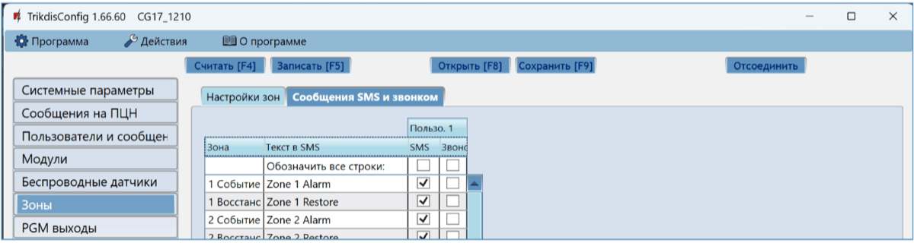

Закладка „Сообщения SMS и звонком“, появится если хоть один номер телефона пользователя будет описан в окне „Пользователи и сообщения“*.*

- **Зона** – номер зоны с идентификационным знаком события. Может быть „Событие“ (срабатывание) или „Восстановление“.

- **Текст в SMS** – описание события зоны, которое будет включено в отправляемое SMS сообщение пользователю.

- **SMS/Звонок** – отметьте поле каким образом пользователь будет информирован о событии в зоне – SMS сообщение и/или звонком.

### Окно „PGM выходы“ 

**Закладка „Выходы“**

- **№** - порядковый номер PGM выхода.

- **Выход –** назначьте выходы OUT CG17 или внешнего расширителя.

- **Разделы** – присвоение выхода OUT разделу (области) сигнализации.

- **Описание выхода** – выберите режим работы выхода OUT:
- **Сирена** – предназначен для подключения сирены.

- **Удаленное управление** – предназначен для управления электротехническим оборудованием.

- **Сброс пожарного датчика** – предназначен для запуска работы пожарного извещателя заново, после его срабатывания.

- **Статус системы** – предназначен для подключения индикации состояния системы сигнализации (сигнализация выключена выход выключен; сигнализация включена – выход включен).

- **Вспышка** – сигнализация включена – формируется сплошной сигнал (выход включен). Сработала сигнализация – формируется импульсный сигнал. Сигнализация выключена – выход выключен.

- **Термостат** – управление PGM выходом осуществляется по установленной температуре датчика температуры.
- **Время импульса** – установите продолжительность срабатывания выхода OUT в импульсном режиме (0-9999 секунд).

- **ПЦН** – отметьте поле, чтобы сообщения отправлялись на ПЦН (пульт централизованного наблюдения).

- **Прот**. – отметьте поле, чтобы сообщения отправлялись в Protegus2.

**Закладка** **„Действия“**

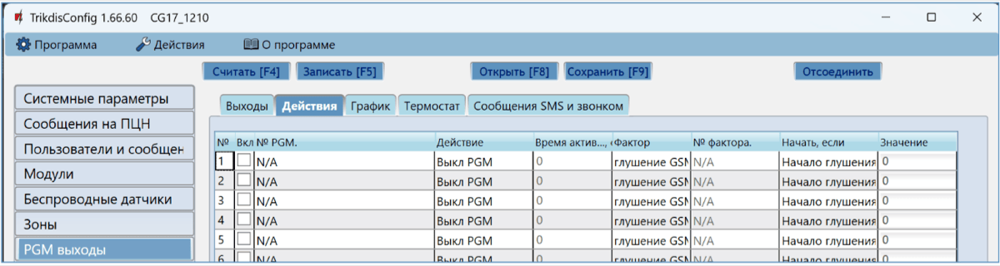

- **№** - порядковый номер строчки.
- **Вкл.** – разрешение на срабатывание выхода.

- **№ PGM** – укажите выход OUT, который будет управляться событиями, указанными в столбцах „**Фактор**“**,** „**№ фактора**“**,** „**Начать если**“**,** „**Значение**“**.**

- **Действие :**
- **Выкл. PGM –** выключить выход PGM.

- **Вкл. PGM** – включить выход PGM.

- **Вкл. импульсом** – включить PGM выход на продолжительность импульса (после получения команды выход включается на продолжительность импульса и затем выключается).

- **Выкл. импульсом** – выключение PGM выхода на продолжительность импульса (после получения команды выход выключается на продолжительность импульса и затем включается).
- **Время активности** – устанавливается длительность импульса срабатывания (0-9999 сек.).

  - **Фактор/№ фактора** – устанавливается условие (Вход, Температура, График Глушение GSM, Неполадка датчика температуры, iButton, Поставлено под охрану, Снято с охраны, SMS получено), которое определит включение PGM выхода. В закладке** **„**График**“ можно создать 10 графиков (которые можно назначить выходам OUT), когда выходы OUT должны будут включиться.

- **Начать если** – можно установить дополнительное условие включения (от события „**Фактора**“**)** выхода OUT.

- **Значение** – в зависимости от выбранного условия в столбце „**Фактор**“ (SMS получено, Температура)**,** вы можете установить значение (текст входящего SMS сообщения или указать значение напряжения или температуры), которое будет использоваться для управления PGM выходом. Текст SMS сообщения можно выделить знаком %. Знаком % выделяется ключевое слово в полученном SMS сообщении, по которому будет срабатывать PGM выход.

**%…..%** - часть входящего SMS сообщения должна соответствовать тексту записанному между знаками % (например: **%dOm%**. В SMS сообщении должен быть текст „**dOm**“. Пример SMS сообщения: **NadodOmoj**).

**…..%** - начало входящего SMS сообщения должно содержать текст записанного до знака % (например: **dOm%**. SMS сообщение должно начинаться текстом „**dOm**“. Пример SMS сообщения: **dOm1144**).

**%…..** - конец входящего SMS сообщения должен содержать текст записанного после знака % (например: **%dOm**. SMS сообщение должно заканчиваться текстом „**dOm**“. Пример SMS сообщения: **1144dOm**).

В SMS сообщении важны прописные и строчные буквы.

**Закладка „График“**

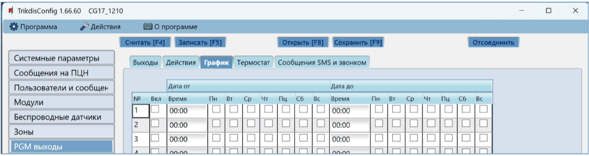

- **№** - порядковый номер графика.

- **Вкл.** – разрешение на включение графика.

- **Время (Дата от)** – устанавливается время начала графика, когда выход должен быть включен.

- **Время (Дата до)** – устанавливается время конца графика, когда выход должен быть выключен.
- **Пн-Вс** – можно указать дни недели, когда выход должен быть включен/выключен.

**Закладка „Термостат“**

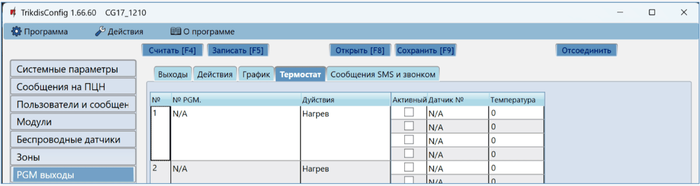

- **Nr.** – порядковый номер термостата.

- **№ PGM** – укажите номер PGM выхода, которым будет управлять термостат.

- **Действия** – установите режим работы термостата (нагрев, охлаждение).

- **Активный** – отметьте поле и термостат будет работать с выбранным датчиком температуры и поддерживать заданную температуру.

- **Датчик №** – назначьте датчик температуры термостату.

- **Температура** – введите значение температуры, которую будет поддерживать термостат.

**Закладка** **„Сообщения SMS и звонком“**

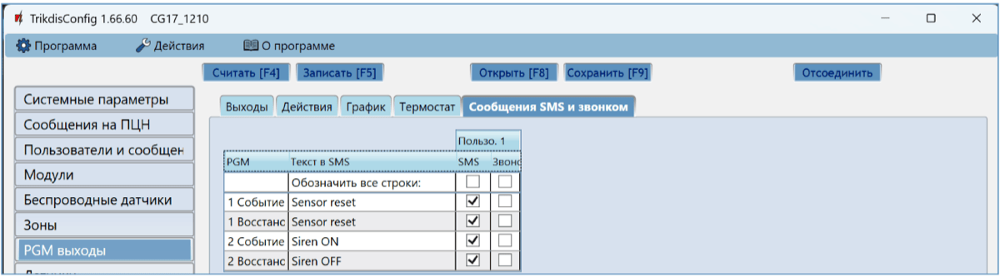

Закладка „Сообщения SMS и звонком“, появится если хоть один номер телефона пользователя будет записан в окне „Пользователи и сообщения“*.*

- **PGM** – указывается номер выхода и тип события Событие/Восстановление (Событие – включение выхода OUT / Восстановление – выключение выхода OUT).

- **Teкст в SMS** – текст события (Событие/Восстановление) выхода OUT, которое будет включено в SMS сообщение.

- **Пользователь/SMS и Звонок** – выберите каким образом (SMS сообщением и/или Звонком) пользователь будет информирован о включении/выключении выхода OUT.

### Окно „Датчики“ 

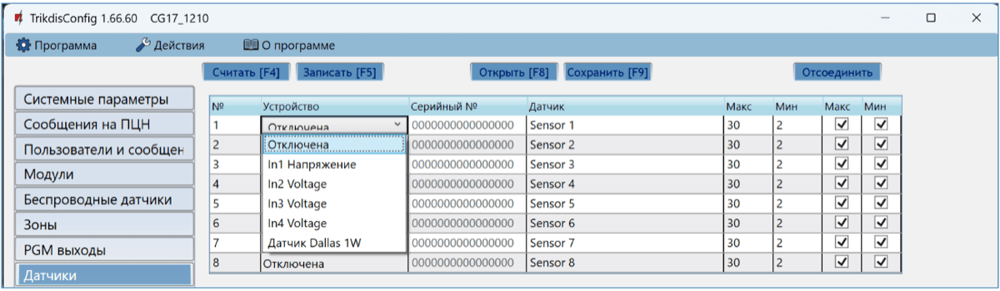

- **№** - порядковый номер датчика температуры.

- **Устройство** – датчик температуры (CG17 автоматически определяет подключенные датчики температуры).

- **Серийный номер** - серийный номер датчика температуры, который считывает охранная панель.

- **Датчик** – введите название датчика температуры.

- **Макс** – наибольшее значение температуры, выше которого будет сформировано сообщение о событии. Чтобы сообщение было отправлено должно быть отмечено поле „**Макс**“.

- **Мин** - наименьшее значение температуры, ниже которого будет сформировано сообщение о событии. Чтобы сообщение было отправлено должно быть отмечено поле „**Мин**“.

### Окно „Список событий“ 

**Закладка „Внутренние события“**

- **№** - порядковый номер события.

- **Название события** – наименование события.

- **Включить** – отметьте поле, чтобы разрешить отправлять сообщение о событии.

- **ПЦН** – отметьте поле, чтобы разрешить отправлять сообщения на ПЦН (пульт централизованного наблюдения).

- **Прот.** – отметьте поле, чтобы разрешить отправлять сообщения в Protegus сервис.

- **CID код** – Contact ID код события.

- **Текст SMS о событии** – текст SMS сообщения о событии.

- **Текст SMS при восстановлении** – текст SMS сообщения при восстановлении события.

**Закладка „Сообщения SMS и звонком“**

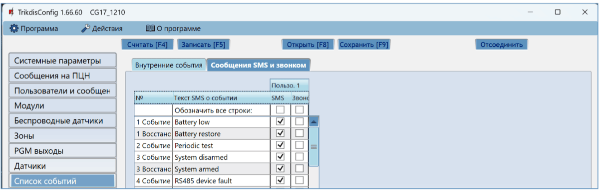

Закладка „Сообщения SMS и звонком“, появится если хоть один номер телефона пользователя будет записан в окне „Пользователи и сообщения“*.*

- **№** - номер и тип события Событие/Восстановление (Срабатывание / Восстановление).

- **Текст SMS о событии** – текст о событии, который будет включен в SMS сообщение.

- **Пользователь/SMS и Звонок** – отметьте поле каким способом (SMS сообщением и/или звонком) пользователь будет извещен о событии.

### Окно „Журнал событий“ 

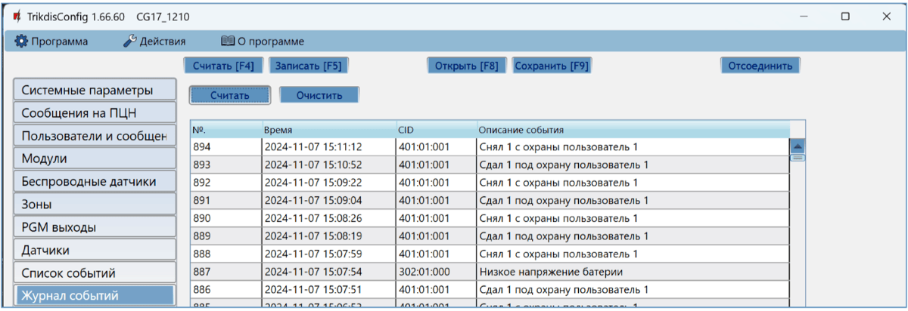

- Нажать кнопку **Считать** – будет считан журнал событий из памяти CG17.

- Кнопка **Очистить** – если ее нажать, то будет очищен журнал событий в памяти CG17.

- В таблице указаны „**№**“ события**,** „**Время**“**,** „**CID**“**,** „**Описание события**“. В памяти CG17 может храниться до 1000 событий.

### Восстановление заводских настроек 

Для восстановления заводских настроек панели CG17 необходимо в программном окне TrikdisConfig нажать кнопку „**Восстановить**“**.**

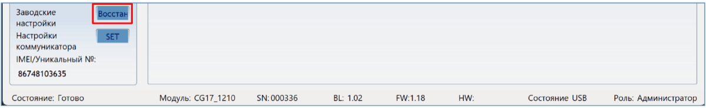

## Удаленное управление 

### Управление через сервис Protegus2 

С сервисом Protegus2 пользователи смогут управлять охранной сигнализацией дистанционно. Пользователь будет видеть состояние системы и получать сообщения о событиях.

1.  Скачайте и запустите приложение Prоtegus2 или используйте браузерную версию [www.protegus.app](https://www.protegus.app) .

    

      
      
      
    

2. Подключитесь к системе с помощью своего имени и пароля или создайте новую учетную запись.

2.  Нажмите „Добавить объект“ и введите „IMEI“ номер *CG17*, который найдете на изделии или на упаковке.

!!! note "Примечание"
    При добавлении CG17 к Protegus2 должно быть:
    
    1.  Включен Protegus сервис. В пункте 4.4 Окно „Пользователи и
        сообщения" в группе „Облачное приложение" описано включение
        Protegus сервиса. Или отправьте SMS сообщение на номер SIM
        карты, установленной в CG17:
    
        CONNECT xxxxxx PROTEGUS=ON,APN=INTERNET
    
    |     | xxxxxx | новый 6-значный пароль администратора; |
    |-----|--------------|----------------------------------------|
    
    2.  Установлена активированная SIM карта и введен или отключен PIN код.
    
    3.  Включено питание CG17 (индикатор „**POWER**" светит зеленым
        цветом).
    
    4.  CG17 подключен к GSM сети (индикатор „**NETWORK**" светит
        зеленым цветом и мигает желтым).
    
    Если индикатор „**NETWORK**" светит желтым цветом или индикатор
    „**DATA**" светит желтым цветом это значит, что CG17 не может
    подключиться к GSM сети и/или Protegus2.
С приложением Protegus2 пользователь сможет:

1.  Получать сообщения о событиях. Приложение Protegus2 все полученные сообщения будет хранить в регистре сообщений.

2.  Наблюдать за состоянием зон (IN1 – IN4).

3.  Иметь информацию о состоянии охранной сигнализации (включена/выключена), а также менять состояние.

4.  Наблюдать за показаниями подключенных датчиков температуры к CG17.

5.  Включать или выключать выходы CG17 (5OUT, 6OUT и др.), когда им присвоен тип „Удаленное управление“.

6.  Администратор сможет добавить новых пользователей для управления CG17.

#### Управление панелью CG17 с приложением *Protegus2* 

1.  В приложении *Protegus2*, в системном окне нажмите кнопку „ARM“.

2.  Введите код пользователя.

#### Добавление других пользователей в Protegus2 

Запустите приложение Protegus2 на своем телефоне. Войдите в систему, используя свой аккаунт.

1.  Нажмите „**Настройки**“.

1.  Нажмите „**System configuration**“ (конфигурация системы).

2. Нажмите „**Users**“ (пользователи).

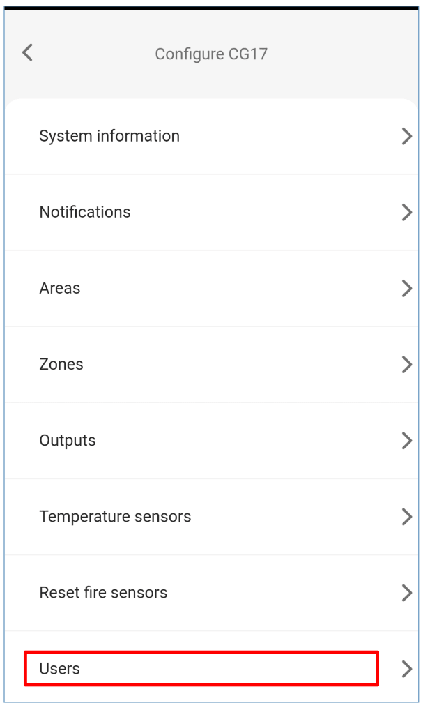

3. Нажмите „**Add new user**“ (добавить нового пользователя).

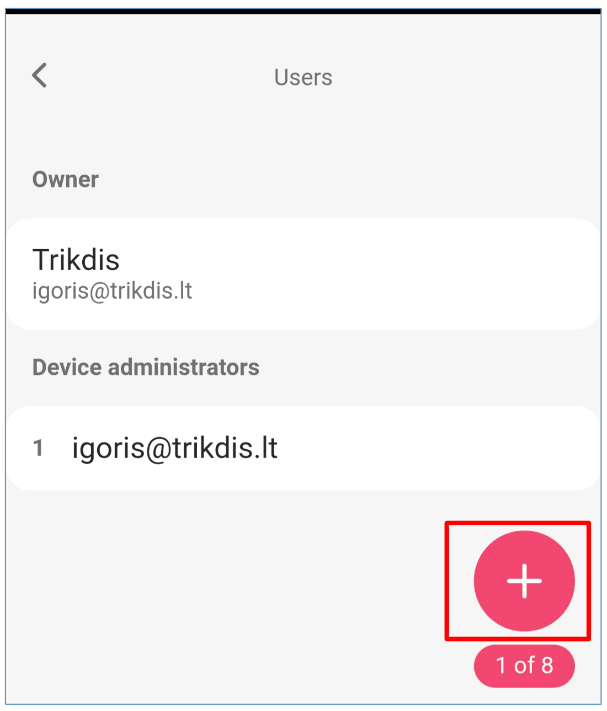

4. Введите адрес электронной почты или имя пользователя.

2.  Введите номер телефона пользователя.

3.  Введите код.

4.  Отметьте раздел, которым будет управлять пользователь.

5.  Отметьте PGM выход , которым будет управлять пользователь.

6.  Нажмите „**Add user**“.

11. В списке пользователей появится новый пользователь.

12. Нажмите „**Назад**“, чтобы вернуть в основное окно.

### Управление SMS командами 

1.  Включить или выключить систему сигнализации

Включить и выключить охранную сигнализацию SMS сообщением:

> #### ARM xxxxxx SYS:x
>
> #### DISARM xxxxxx SYS:x

| xxxxxx | 6-значный пароль администратора.                     |
|--------------|------------------------------------------------------|
| ***x***      | Номер раздела (области) охранной сигнализации (1-8). |

1.  **Изменение пароля администратора**

В целях безопасности измените заводской SMS пароль администратора. Отправьте следующее SMS сообщение:

#### PSW 123456 xxxxxx

| 123456 | Заводской пароль администратора.       |
|--------------|----------------------------------------|
| xxxxxx | Новый 6-значный пароль администратора. |

1.  **Разрешение управлять новым пользователям**

## Системой могут управлять телефонные номера, которые занесены в список пользователей. Пользователь может управлять системой SМS сообщениями или телефонным звонком. Из телефона администратора отправьте SMS сообщение следующего формата, чтобы добавить пользователя: 

### SETN xxxxxx PHONEx=+PHONENR#NAME

| хxxxxx | 6-значный пароль администратора. |
|:---|:---|
| ***x*** | Номер пользователя в списке (записав 1 уступите права администратора другому лицу). |
| PHONENR | Номер телефона пользователя. |
| NAME | Имя пользователя. |

1.  **Сброс пожарных извещателей**

Отправьте SMS сообщение, чтобы удаленно запустить заново работать пожарный извещатель после срабатывания (выходу OUT должна быть присвоена функция „Сброс пожарного датчика“):

### FRS xxxxxx

|     | xxxxxx | 6- значный пароль администратора. |
|-----|--------------|-----------------------------------|

!!! note "Примечание"
    Выходу OUT, к которому подключены дымовые пожарные извещатели, должен
    быть присвоен тип „Сброс пожарного датчика". Заводская настройка такого
    типа сделана выходу „5OUT".
#### Список SMS команд (123456 - заводской код администратора)

| Команда | Данные | Описание |
|:--:|----|----|
| *INFO* |  | Запрос информации о контроллере. В ответ будет включена информация: тип контроллера, IMEI номер, номер серии, версия программного обеспечения. / Например: INFO 123456 |
| *RESET* |  | Запуск работать контроллера заново. Например: RESET 123456 |
| *OUTPUTx* | *ON* | Включить выход, где „x“ номер выхода. Например: OUTPUT1 123456 ON |
|  | *OFF* | Выключить выход, где „x“ номер выхода. Например: OUTPUT1 123456 OFF |
|  | *PULSE=ttt* | Включить выход OUT в импульсном режиме на несколько секунд. „x“ – номер выхода. „ttt“ – 3-значное значение продолжительности импульса (5 секунд надо указать - 005), в секундах. Например: OUTPUT1 123456 PULSE=002 |
| *PSW* | *Новый пароль* | Замена пароля администратора (с 123456 на 654123). / Например: PSW 123456 654123 |
| *TIME* | *YYYY/MM/DD,HH:MM:SS* | Установка даты и времени. Например: TIME 123456 2019/04/03,12:23:00 |
| *TXTA* | *Наименование объекта* | Запись наименования объекта. Например: TXTA 123456 Dom |
| *TXTE* | *Z1=<Teкст>* / *........* / *Z12=<Teкст>* | Редактирование текста SMS сообщения при срабатывании зоны охранной сигнализации. Например: TXTE 123456 Z1=ALARM in Zone1 |
| *TXTR* | *Z1=<Teкст>* / *........* / *Z12=<Teкст>* | Редактирование текста SMS сообщения при восстановлении зоны охранной сигнализации. Например: TXTR 123456 Z1=Restore Zone1 |
| *RDR* | *PhoneNR#SMStext* | Переадресация SMS сообщений на указанный номер телефона. Телефонный номер должен быть с „+“ и международным кодом страны. / Например: RDR 123456 +74951234567#pereadresacija |
| *ASKI* |  | Информация о состоянии входов IN сигнализации. Например: ASKI 123456 |
| *ASKO* |  | Информация о состоянии выходов OUT сигнализации. / Например: ASKO 123456 |
| *ASKT* |  | Информация о показаниях температуры датчиков температуры. / Например: ASKТ 123456 |
| *DISARM* | *SYS:x* | Выключить систему охранной сигнализации, где „x“- номер раздела (области) охранной сигнализации (1-8). Например: DISARM 123456 SYS:1 |
| *ARM* | *SYS:x* | Включить систему охранной сигнализации, где „x“- номер раздела (области) охранной сигнализации (1-8). Например: *ARM 123456 SYS:1* |
| *FRS* |  | Запустить заново работать пожарный извещатель после срабатывания (выходу OUT должна быть присвоена функция „Сброс пожарного датчика“). / Например: FRS 123456 |
| *SETN* | *PhoneX=PhoneNR#Name* | Добавить нового пользователя системы, для этого надо ввести номер телефона и имя пользователя. „X“ – порядковый номер пользователя в списке. Телефонный номер должен быть с „+“ и международным кодом страны. Например: SETN 123456 PHONE5=+74951234567#Petr |
|  | *PhoneX=DEL* | Удаление пользователя из списка. „X“ – порядковый номер пользователя в списке. Например: SETN 123456 PHONE5=DEL |
| *UUSD* | *\*Uusd code#* | Отправление UUSD кода оператору. Например: ***UUSD 123456 \*245#*** |
| *CONNECT* | *Protegus=ON* | Подключиться к Protegus сервису. Например: CONNECT 123456 PROTEGUS=ON |
|  | *Protegus=OFF* | Отключиться от Protegus сервиса. Например: CONNECT 123456 PROTEGUS=OFF |
|  | *Code=159487* | Код подключения к Protegus сервису. / Например: CONNECT 123456 CODE=159487 |
|  | *IP=0.0.0.0:8000* | Указывается адрес TCP/IP и Port сервера основного канала. / Например: CONNECT 123456 IP=0.0.0.0:8000 |
|  | *IP=0* | Отключение основного канала. Например: CONNECT 123456 IP=0 |
|  | *ENC=123456* | Ключ шифрования TRK. Например: CONNECT 123456 ENC=123456 |
|  | *APN=Internet* | Имя APN. Например: CONNECT 123456 APN=INTERNET |
|  | *USER=user* | Пользователь APN. Например: CONNECT 123456 USER=User |
|  | *PSW=password* | Пароль APN. Например: CONNECT 123456 PSW=Password |
| *SETHx* |  | Настройки для „x“ термостата. / „x“ – номер термостата, который может быть 1, 2, 3, 4. |
|  | *Ty=45* | Установка температурного режима термостату „y“ (можно установить 4 температурных режима). / Например (термостату №1 установить 2 температурный режим в +45оС): / SETH1 123456 T2=45 |
|  | *Sy=2* | Установка термостату номера датчика температуры для температурного режима „y“. Термостат по указанному датчику температуры будет производить измерение температуры. Термостату может быть назначены четыре датчика температуры. / Например (второму термостату первому режиму назначить датчик температуры №2): SETH2 123456 S1=2 |
|  | *O=1* | Назначение термостату выхода OUT (выходу должно быть установлен режим работы „Удаленное управление“ или „Термостат“). / Например (термостату №1 назначить выход №1): SETH1 123456 O=1 |
|  | *A=2* | Выберите датчик температуры рабочего режима термостата (необходимо выбрать один из четырех датчиков температуры термостата). / Например (назначить термостату №1 датчик температуры №3): / SETH1 123456 A=3 |
|  | *M=C* | Установить режим работы термостата: ***С – охлаждение; Н – нагрев. / Например (установить термостату №1 режим работы - охлаждение): / SETH1 123456 M=С*** |
|  |  | Одним SMS сообщением можно устанавливать один или несколько параметров. Разные устанавливаемые параметры отделяются запятой. / Например (термостату №2 устанавливается вторая температура +55оС. Третий режим термостата будет работать по датчику температуры №5. Термостату назначен выход №1. Режим работы термостата - нагрев): / SETH2 123465 T2=55,S3=5,A=3,O=1,M=H |
| ASKH |  | Команда запроса настроек термостатов. Предоставляет информацию: 1) включен ли термостат; 2) режим работы термостата (нагрев или охлаждение); 3) номер датчика температуры по которому работает термостат; 4) значения установок температур. Например: ASKH 123456 |

### Управление звонком 

!!! note "Примечание"
    Если система не имеет пользователей, первый позвонивший на CG17
    становится администратором системы, который может управлять SMS
    сообщениями и телефонными звонками. Администратор может добавить
    пользователей к системе SMS сообщением или с помощью
    TrikdisConfig.
**Команды управления CG17 телефонным звонком**

Управление выходами OUT и разделами (областями) охранной сигнализации:

1.  Охранная сигнализация имеет 1 раздел (область). Пользователю не назначено управление выходами OUT. Позвоните на номер SIM карты установленной в CG17. Контроллер отклонит звонок, режим охраны охранной сигнализации изменится на противоположный.

2.  Пользователю предоставлены права дистанционно управлять выходами, или сигнализация разделена на области. Позвоните на номер SIM карты установленной в CG17. CG17 ответит и с клавиатуры телефона введите команды (см. таблицу, которая предоставлена ниже).

    Команды управления, набираемые с клавиатуры телефона

| Клавиш клавиатуры | Функция | Описание |
|-------------------|---------|----------|
| [1] | Изменить режим охраны | Изменяет режим охраны на противоположный. / Например: 1 |
| [2][№ выхода][#][№ состояния][*] | Управления выбранного выхода OUT | Управление выбранным выходом OUT. Состояние: [0] – выключить выход; [1] – включить выход; [2] – выключить выход на продолжительность импульса; [3] – включить выход на продолжительность импульса (продолжительность импульса задается в программе TrikdisConfig „PGM выходы“ ->“Выходы“). [*] – символ окончания кода. Например (включить выход 5OUT): 21#1* Например (включить выход 6OUT на продолжительность импульса): 22#3* |
| [6][№ раздела][#] | Включение сигнализации выбранного раздела (области) охранной сигнализации | Например (включить 2 раздел (область) охранной сигнализации): 62# |
| [7][№ раздела][#] | Выключение сигнализации выбранного раздела (области) охранной сигнализации | Например (выключить 1 раздел (область) охранной сигнализации): 71# |

### Удаленная настройка параметров 

!!! note "Примечание"
    Удаленная настройка параметров возможна, если:
    
    1.  Включен Protegus сервис. В пункте 4.3 Окно „Сообщения на ПЦН"
        в группе „Сервис Protegus" описано включение Protegus сервиса.
    
    2.  Установлена SIM карта и введен или отключен PIN код.
    
    3.  Включено питание CG17 (индикатор „**POWER**" светит зеленым
        цветом).
    
    4.  CG17 подключен к GSM сети (индикатор „**NETWORK**" светит
        зеленым цветом и мигает желтым).
1.  Скачайте программу TrikdisConfig с [www.trikdis.com](http://www.trikdis.com) .

2.  Убедитесь, что CG17 подключен к мобильному интернету и ему включен сервис Protegus.

3.  Запустите программу TrikdisConfig. В поле „**Уникальный №**“ введите IMEI номер CG17, который указан на упаковке или на изделии.

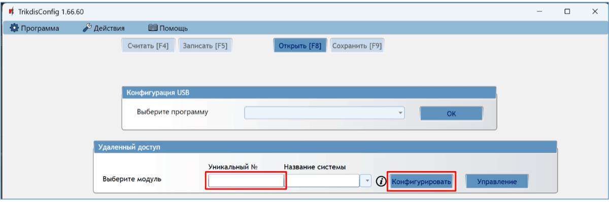

4. В поле „**Название системы**“ напишите название объекта. Нажмите кнопку „**Конфигурировать**“.

2.  Откроется программное окно CG17. Нажмите кнопку **Считать [F4],** чтобы были считаны настройки CG17. Если всплывет окно запроса ввода „**Кода администратора**“, введите 6-значный код администратора. Отметьте поле рядом с „**Запомнить пароль**“ и нажмите кнопку **Записать [F5]**.

3.  Сделайте необходимые настройки для CG17. Запишите эти изменения в CG17, нажав на кнопку **Записать [F5]**. Нажмите кнопку „**Отсоединить**“ и выйдите из программы TrikdisConfig.

### Управление через TrikdisConfig 

1.  Скачайте программу TrikdisConfig с [www.trikdis.com](http://www.trikdis.com) .

2.  Убедитесь, что CG17 подключен к мобильному интернету и ему включен сервис Protegus.

3.  Запустите программу TrikdisConfig. В поле „**Уникальный №**“ введите IMEI номер CG17, который указан на упаковке или на изделии.

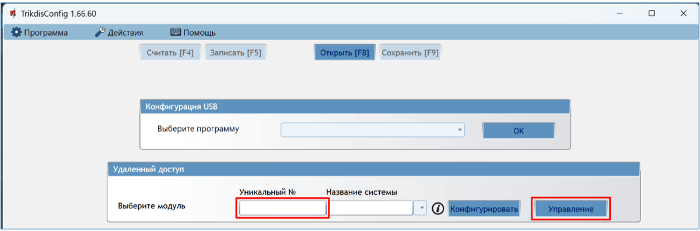

1.  Нажмите кнопку „**Управление**“.

2.  Введите код самообслуживания (заводской – 123456) и нажмите „**Ввести**“.

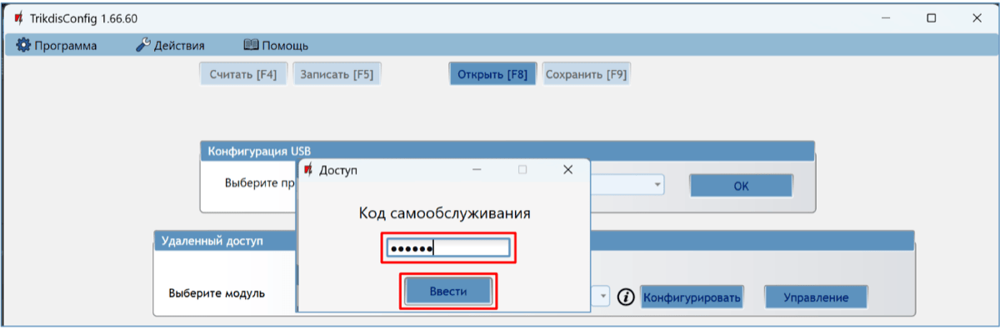

3. Появится программное окно дистанционного управления, у котором можно будет управлять „**Разделами**“ охранной сигнализации, наблюдать за статусом „**Зон**“, управлять „**Выходами PGM**“, контролировать „**Температуру**“.

2.  Закладка „**Разделы**“. Нажмите кнопку „**Снять**“ (или „**Поставить**“) и введите код пользователя. Раздел охранной сигнализации будет поставлен на охрану (или снят с охраны).

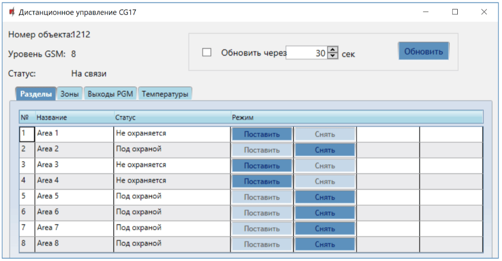

3. Закладка „**Зоны**“. В данном окне можете контролировать статус зон. Так же можете отключить (Bypass) зону.

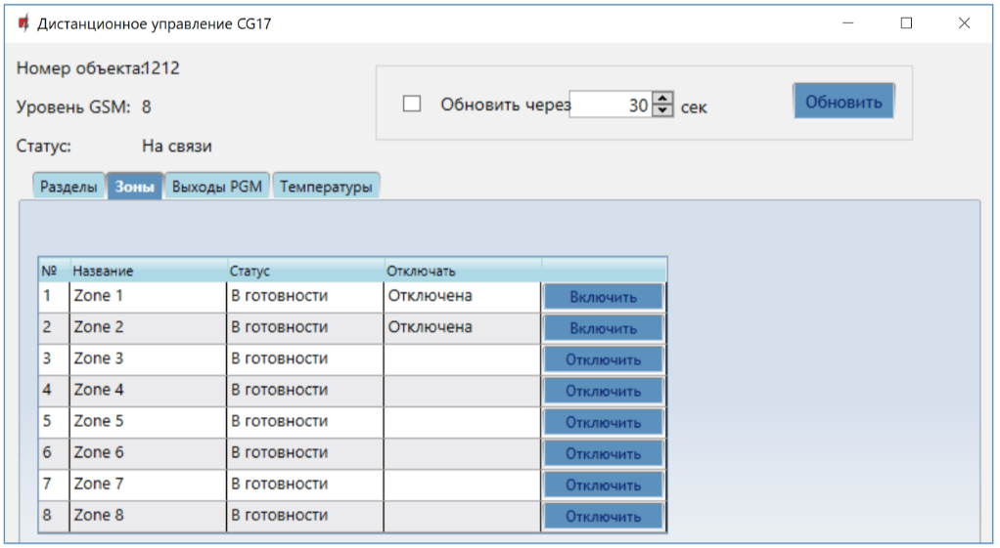

4. Закладка „**Выходы PGM**“. В данном окне можете управлять выходами PGM, которым установлен режим „**Удаленное управление**“.

10. Закладка „**Температуры**“. В данном окне можете контролировать показания датчиков температуры.

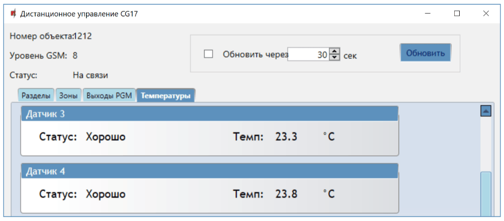

## Тестирование CG17 

После установки и конфигурации выполните тестирование системы:

1.  Проверьте подключено ли питание к CG17.

2.  Проверьте связь (индикатор „**NETWORK**“). Достаточным является 5 уровень GSM сигнала („**NETWORK**“ - 4 секунды светит зеленым и пять раз мигает желтым). Достаточным является 3 уровень 3G сигнала („**NETWORK**“ -4 секунды светит зеленым и три раза мигает желтым). Если индикатор „**TROUBLE**“ 5 раз мигает красным, то надо найти другое место для установки CG17.

3.  Проверьте работу входов. Активируйте входы и убедитесь, что получатели получают сообщение о событиях.

4.  Проверьте работу выходов CG17. Активируйте их удаленно и убедитесь, что пользователи получают сообщения о событиях, а выходы срабатывают.

5.  Проверьте систему охранной сигнализации, чтобы убедиться, что ПЦН получает сообщения по событиях.

## Обновление прошивки CG17 

!!! note "Примечание"
    Подключите CG17 к TrikdisConfig. Если есть новая прошивка
    для CG17, то TrikdisConfig предложит обновить прошивку. Для
    обновления прошивки должно быть подключение к сети интернет. / Если в
    компьютере установлена антивирусная программа, то она может блокировать
    функцию автоматического обновления программного обеспечения. В этом
    случае придется изменить настройки в антивирусной программе.
Прошивку CG17 можно обновить или заменить вручную. После обновления все ранее установленные параметры CG17 остаются. Прошивка может быть заменена на новую или на старую версию.

1.  Запустите программу TrikdisConfig.

2.  Подключите CG17 к компьютеру с помощью кабеля USB Mini-B или подсоединитесь удаленно. Если есть новая прошивка изделия, то TrikdisConfig предложит обновить программное обеспечение CG17.

3.  В программе TrikdisConfig откройте окно „**Обновление программы**“**.**

4.  Нажмите кнопку „**Открыть файл**“ и выберите нужный файл для установки.

    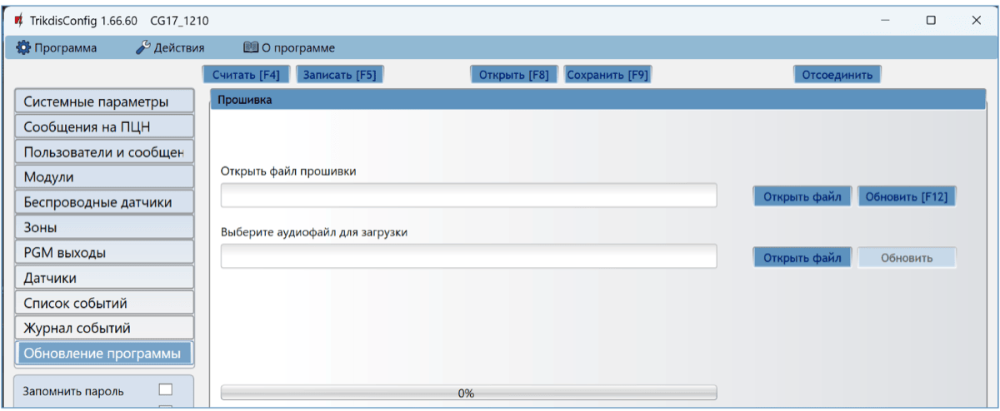

5.  Нажмите кнопку **Обновить [F12]**.

6.  Подождите, пока произойдет обновление программного обеспечения.

## Требования безопасности

Устанавливать и обслуживать систему охранной сигнализации могут только квалифицированные специалисты.

Перед установкой оборудования внимательно ознакомьтесь с данным руководством, чтобы избежать ошибок при монтаже из-за чего оборудование будет плохо работать и может быть испорчено.

Выполняя работы по установке оборудования, обязательно должно быть выключено его внешнее питание.

Изменения внесенные в конструкцию изделия, самостоятельный ремонт лишают изделие гарантии производителя.

Соблюдайте нормы местного законодательства и не утилизируйте систему сигнализации или ее компоненты вместе с другими бытовыми отходами.
