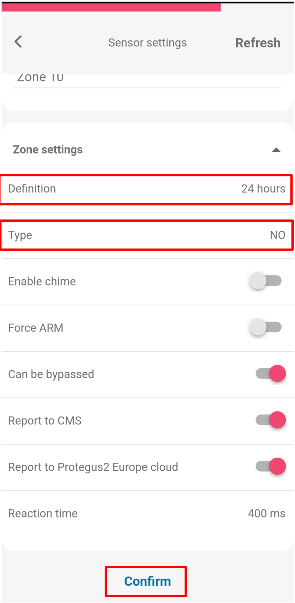
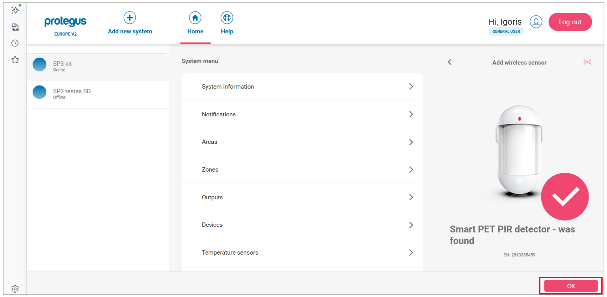
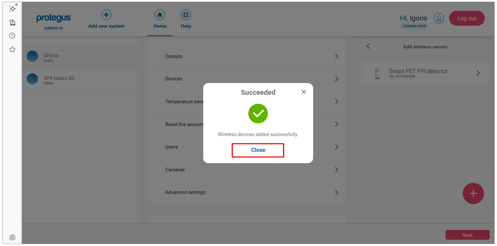
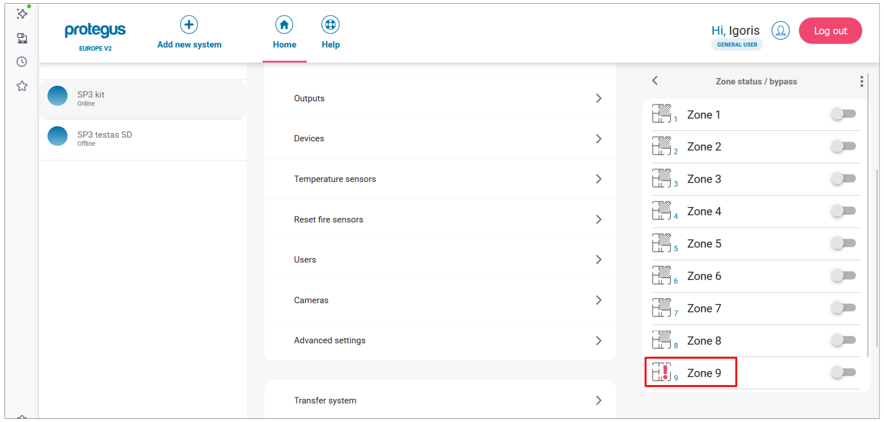
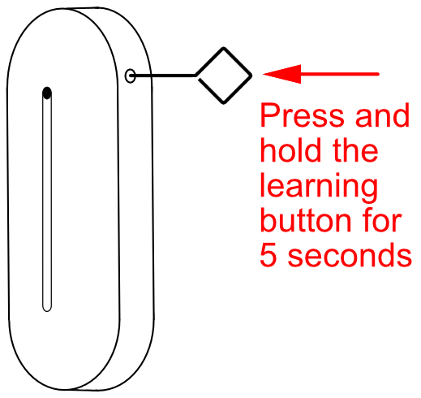
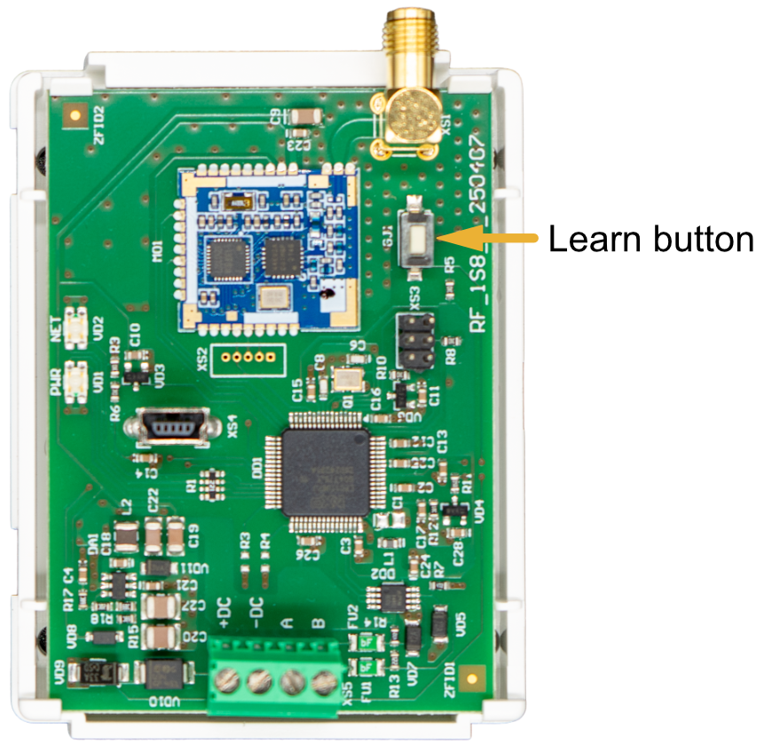

# Добавление беспроводных датчиков S8/S9 к FLEXi SP3

{ .trik-hero-img }

> [!NOTE]
> **Язык скриншотов:** в этом руководстве интерфейсы Protegus и TrikdisConfig показаны на английском языке. Выделенные полужирным названия кнопок и меню в шагах соответствуют английским надписям на скриншотах.

Привяжите беспроводные датчики S8 (PIR-датчики, магнитные контакты двери и окна, дымовые датчики, сирены и брелоки) к охранной панели FLEXi SP3. Выберите способ настройки.

> [!IMPORTANT]
> **Требование к прошивке:** для работы с беспроводными датчиками S8 на FLEXi SP3 должна быть установлена прошивка ревизии 4 (`SP3_xxx4_0122.fw`, версия 1.22 или выше).

> [!NOTE]
> **Требование к оборудованию:** перед регистрацией датчиков подключите трансивер RF-S8 к шине RS485 SP3 – см. [раздел 3.13 «Схема подключения приемника RF-S8»](index.md) – и зарегистрируйте его в окне «Модули» программы TrikdisConfig.

**Перед началом работы подготовьте датчики** (для всех способов):

- Если датчик ранее был привязан к любой панели, сначала отвяжите его: удерживайте **кнопку обучения 5 секунд** и отпустите ее, когда индикатор **три раза мигнет зеленым**.
- Установите батарейки во все датчики, которые будете привязывать.
- Во время регистрации держите трансивер RF-S8 **не ближе 1 м** от датчиков.

---

=== "Protegus для мобильных устройств"

    На телефоне должно быть установлено приложение Protegus, а система SP3 уже добавлена в вашу учетную запись.

    1. Откройте приложение Protegus и выберите систему **SP3 kit**. Нажмите **⋮** в правом верхнем углу.

        { .trik-mob-img }

    2. Нажмите **System configuration**.

        { .trik-mob-img }

    3. Нажмите **Devices**.

        { .trik-mob-img }

    4. Нажмите кнопку **+**, чтобы добавить новый датчик.

        { .trik-mob-img }

    5. Выберите тип датчика, который хотите привязать (например, **Smart PET PIR detector**).

        { .trik-mob-img }

    6. Приложение показывает датчик в режиме **Learning** со схемой кнопки обучения. **Нажмите и удерживайте кнопку обучения**, пока зеленый индикатор не будет гореть непрерывно в течение 2 секунд.

        { .trik-mob-img }

    7. После обнаружения датчика появится подтверждение с его серийным номером. Нажмите **OK**.

        { .trik-mob-img }

    8. Датчик появится в списке с меткой **NEW**. Нажмите датчик, чтобы открыть его настройки.

        { .trik-mob-img }

    **Настройте параметры зоны:**

    9. Нажмите **Zone settings**, чтобы развернуть раздел.

        { .trik-mob-img }

    10. Задайте **Definition** (например, 24 hours) и **Type** (например, NO), затем нажмите **Confirm**.

        { .trik-mob-img }

    11. Чтобы добавить другой датчик, нажмите **+** и повторите шаги 5–10. После регистрации всех датчиков нажмите **Next**.

        { .trik-mob-img }

    12. В диалоговом окне будет подтверждена успешная регистрация. Нажмите **Close**.

        { .trik-mob-img }

    **Проверьте состояние зон:**

    13. На главном экране системы нажмите плитку **Area 1**.

        { .trik-mob-img }

    14. Нажмите **Zone statuses**.

        { .trik-mob-img }

    15. На экране **Zone status / bypass** перечислены все зоны. Красный значок предупреждения означает, что датчик сейчас открыт или сработал. Переключатели bypass позволяют временно отключать отдельные зоны.

        { .trik-mob-img }

=== "Protegus web"

    Откройте [web.protegus.app](https://web.protegus.app) в браузере на компьютере. Система SP3 уже должна быть добавлена в вашу учетную запись.

    1. Выберите систему SP3 на левой панели, затем нажмите **Devices** в меню системы.

        

    2. Нажмите кнопку **+**, чтобы добавить новый беспроводной датчик.

        

    3. Откроется панель **Add wireless sensor** со всеми поддерживаемыми типами датчиков. Нажмите тип датчика, который хотите привязать (например, **Smart PET PIR detector**).

        

    4. Приложение перейдет в режим **Learning** и покажет датчик со схемой расположения кнопки обучения.

        **Нажмите и удерживайте кнопку обучения**, пока зеленый индикатор не будет гореть непрерывно в течение 2 секунд (примерно 4–5 секунд).

        

    5. Когда панель обнаружит датчик, появится подтверждение с его серийным номером. Нажмите **OK**.

        

    6. Датчик появится в списке с меткой **NEW**. Чтобы добавить другой датчик, нажмите **+** и повторите шаги 3–5. После регистрации всех датчиков нажмите **Next**.

        

    7. В диалоговом окне будет подтверждена успешная регистрация. Нажмите **Close**.

        

    **Настройте параметры зоны:**

    8. В списке **Devices** нажмите привязанный датчик, чтобы открыть его настройки. Нажмите **Zone settings**, чтобы развернуть раздел.

        

    9. Задайте для зоны **Definition** (например, Instant) и **Type** (например, NO).

        

    **Проверьте состояние зон:**

    10. На главном экране нажмите плитку **Area 1**.

        

    11. Нажмите **Zone statuses**.

        

    12. На панели **Zone status / bypass** перечислены все зоны. Красный значок предупреждения у зоны означает, что датчик сейчас открыт или сработал. Переключатели bypass позволяют временно отключать отдельные зоны.

        

=== "TrikdisConfig"

    Есть два способа: **удаленный** (по сети) или **локальный** (USB, сеть не нужна).

    #### Удаленная регистрация

    Требования: активированная SIM-карта с отключенным PIN-кодом, включенный на SIM-карте мобильный интернет, включенная облачная служба Protegus, включенное питание SP3 (**PWR** мигает зеленым), SP3 подключена к сети (**NET** горит зеленым и мигает желтым).

    > [!WARNING]
    > Не регистрируйте и не отвязывайте датчики, когда панель находится в режиме обучения для другой операции. Перед регистрацией отвяжите каждый датчик: удерживайте кнопку обучения 5 с, пока индикатор не мигнет три раза зеленым. **Если датчик случайно отвязать, он не будет работать, пока его не зарегистрируют снова.**

    1. Откройте TrikdisConfig. В разделе **Remote access** введите **Unique ID** панели (напечатан на наклейке устройства), затем нажмите **Configure**.

        

    2. Нажмите **Read [F4]**. При необходимости введите код администратора или установщика.

    3. Перейдите в **Wireless sensors** и нажмите **Learn sensors**.

        

    4. Откроется диалоговое окно **Learning mode**. Для каждого датчика удерживайте кнопку обучения 5 секунд, пока она не мигнет **четыре раза зеленым**.

        

        

    5. После обнаружения датчика откроется диалоговое окно **New device was found**. Задайте **Zone number** и **Zone definition** (например, Instant), затем нажмите **Save**.

        

    6. Строка состояния Learning mode подтвердит регистрацию устройства. Для каждого следующего датчика повторите шаги 4–5.

        

    7. Нажмите **Stop learning**. Когда появится запрос на сохранение новых параметров, нажмите **Yes**.

        

    8. Нажмите **Read [F4]**. На вкладке **Wireless sensors** появится список всех зарегистрированных датчиков с их серийными номерами.

        

    9. Откройте вкладку **Zones**. Проверьте назначение зон и областей. Установите **Type** в `EOL-T`, чтобы включить контроль вскрытия. Нажмите **Write [F5]**.

        

    #### Локальная регистрация (без сети)

    На плате трансивера RF-S8 есть кнопка **LEARN**; используйте ее для входа и выхода из режима обучения без компьютера.

    

    1. Убедитесь, что RF-S8 зарегистрирован в SP3 (он отображается в списке модулей после настройки прошивки).
    2. Включите питание SP3.
    3. Снимите крышку RF-S8.
    4. Удерживайте кнопку **LEARN** на RF-S8, пока светодиод NETWORK не начнет мигать зеленым/красным. Отпустите кнопку.
    5. Зарегистрируйте каждый датчик: удерживайте кнопку обучения 5 с, пока индикатор не мигнет четыре раза зеленым. После каждой успешной регистрации светодиод NETWORK кратко загорается зеленым.
    6. После завершения удерживайте кнопку **LEARN** на RF-S8, пока светодиод NETWORK не перестанет мигать. Отпустите кнопку – трансивер выйдет из режима обучения.
    7. Подключите USB Mini-B к SP3. Откройте TrikdisConfig → **Read [F4]**.
    8. Проверьте серийные номера на вкладке **Wireless sensors**.
    9. Назначьте зоны и области на вкладке **Zones** → **Write [F5]**.

    #### Удаление беспроводного датчика

    1. Подключитесь к SP3 (через USB или удаленно) → **Read [F4]**.
    2. В **Wireless sensors** установите для датчика **Device type** значение `Disabled`.
    3. Нажмите **Write [F5]**.

---

## Светодиодная индикация трансивера RF-S8

| LED | Состояние | Значение |
|-----|-----------|----------|
| NETWORK | Мигает зеленым/красным | Активен режим обучения |
| NETWORK | Горит зеленым (5 с) | Датчик успешно зарегистрирован |
| POWER | Выключен | Нет напряжения питания |
| POWER | Мигает зеленым | Нормальная работа |
| POWER | Мигает желтым | Низкое напряжение питания (≤ 11,5 В) |
| POWER | Горит желтым | Нет связи RS485 со SP3 |
