# **Охранная панель „*FLEXI“ SP3 – это система охранно-пожарной сигнализации со встроенным модулем WiFi и 2G/4G модемом. Охранная панель дает возможность создать систему из 32 проводных или беспроводных зон, разделенных на 8 разделов. Управлять системой охраны можно удаленно (приложением Protegus2***, SMS, звонком), клавиатурами и считывателями RFID. Информация о состоянии охранной панели может быть отправлена на приемник ПЦН (пульт централизованного наблюдения) и пользователю через сети WiFi и (или) через сети мобильного интернета

## Описание

Охранная панель „*FLEXI“ SP3 – это система охранно-пожарной сигнализации со встроенным модулем WiFi и 2G/4G модемом. Охранная панель дает возможность создать систему из 32 проводных или беспроводных зон, разделенных на 8 разделов. Управлять системой охраны можно удаленно (приложением Protegus2*, SMS, звонком), клавиатурами и считывателями RFID. Информация о состоянии охранной панели может быть отправлена на приемник ПЦН (пульт централизованного наблюдения) и пользователю через сети WiFi и (или) через сети мобильного интернета.

Когда мы рекомендуем выбирать панель управления „*FLEXi“ SP3*“.

- Для установки системы охраны в небольших и средних помещениях, используя проводные и беспроводные датчики.

- Для замены существующей системы охраны – в настройках охранной панели **„*FLEXi“ SP3*** можно указать номиналы резисторов проводных зон, которые использовались в старой охранной панели. Отпадает необходимость менять резисторы в датчиках.

- Необходимы функции умного дома. Существует возможность удаленного мониторинга и управления электрическими устройствами, возможность создания алгоритма автоматического включения и отключения электрических устройств.

**Функциональность**

Отправление сообщений на приемник пульта централизованного наблюдения (ПЦН):

- Через локальную WiFi сеть и (или) 2G/4G сеть мобильного интернета.

- Подключив дополнительные модули связи, сообщения можно отправлять через локальную сеть Ethernet, VHF/UHF каналы радиосвязи, Sigfox каналы связи.

- Сообщения отправляются по выбранным каналам связи с выбранным приоритетом.

- Сообщения на ПЦН принимаются Trikdis IP приемником или IP приемником, который работает SIA DC-09 IP протоколом.

- Назначение приоритета передачи сообщений на ПЦН: сообщения сначала передаются на ПЦН и только после сообщения отправляются пользователю системы.

- Сообщения могут передаваться на два разных IP приемника ПЦН.

**Передача сообщений пользователям:**

- Приложением Protegus2.

- SMS сообщениями (до восьми номеров).

- Звонком с голосовым сообщением (до восьми номеров. Для охранной панели SP3_12xx с версией прошивки до 1.13 включительно).

- Удаленное управление охранной панелью (Arm/Disarm/Stay/Sleep).

- Удаленное управление подключенным оборудованием (освещением, воротами, системой вентиляции, отоплением, поливом и т.д.).

- Удаленный мониторинг температуры.

**Входы и выходы:**

- 10 I/O клемм, каждая из которых может быть установлена как вход (IN) или как выход (OUT). Типы входов (IN): ATZ, EOL, NC, NO. В цепях ATZ и EOL могут использоваться резисторы разных номиналов. С помощью клавиатур, расширителей iO-8 и iO-WL количество входов (IN) может быть увеличено до 32.

- Плата имеет 2 выхода – „BELL” и „LED”. „BELL“ - предназначен для управления сиреной. „LED“ - предназначен для светового индикатора. С помощью расширителей iO-8 и iO-WL количество выходов (OUT) может быть увеличено до 16.

- Семь режимов работы выходов (OUT): каждому выходу может быть назначен алгоритм работы по заранее установленному расписанию и критериям (например: режим термостата).

- „1-Wire” шина данных предназначена для подключения датчиков температуры (до 8 шт.) или датчика температуры и влажности (1 шт.) и считывателей контактных ключей (iButton).

- GRN-YEL шина данных предназначена для подключения до восьми клавиатур одного типа.

- RS485 шина данных предназначена для подключения: модулей расширения серии iO; RF-SH радиоприемника беспроводных датчиков; модуля Е485 „Ethernet“; T16 VHF и UHF радиопередатчика; модуля Sigfox.

**Управление системой охраны:**

- 40 кодов управления системой охраны (4-ехзначный код). Можно установить способ, которым код пользователя, набранный на клавиатуре, становится кодом принуждения (Duress), т.е. таким образом введенный код, отключит систему охраны и на ПЦН будет отправлено специальное сообщение о том, что система охраны отключена под принуждением.

- Клавиатуры управления: SL-LED TouchPad (Protegus SK232LED W), SK-LCD TouchPad (FLEXi SK232LCD); „Paradox“ K636, K10H(V), K32+LED, K32LED, K32LCD+, K35, ТМ50, ТМ70; „Crow“ CR16, CR-LCD; CZ-Dallas считыватель контактных ключей („iButton“), TM17 считыватель контактных ключей, RFID считыватель (Wiegand 26/34).

- Удаленное управление: приложение Protegus2, телефонный звонок или SMS сообщение.

**Простая установка:**

- Несколько вариантов монтажных комплектов „FLEXi“ SP3, состоящие из декоративного белого металлического корпуса с установленным понижающим трансформатором или импульсным источником питания.

- Заводские настройки охранной панели „FLEXi“ SP3 позволяют быстро установить систему охраны для небольших и средних объектов.

- „FLEXi“ SP3 охранную панель можно установить вместо существующей охранной панели без замены резисторов (EOL) в датчиках.

- Выполненные настройки можно сохранить в файле, которые можно будет использовать в дальнейшем.

- Настройка охранной панели производится программой TrikdisConfig через кабель USB или удаленно.

- При удаленном подключении с помощью TrikdisConfig можно не только изменять системные параметры охранной панели „FLEXi“ SP3, но и контролировать ее работу.

- Два уровня установки параметров: администратора и установщика.

### Технические параметры

| Параметр | Описание |
|----|----|
| Напряжение питания \[AC /​ DC\] | 16 В переменного тока или /​ 16-24 В постоянного тока, 2,5 A |
| Потребляемый ток | до 50 мA (в режиме ожидания), /​ до 200 мA (кратковременный в режиме отправления сообщений) /​ до 2,5 A (при максимальном подключении внешних устройств) |
| Резервный источник питания \[BAT\] | 12 В аккумулятор свинцово-кислотный, 4 Ah/​7 Ah |
| Ток зарядки аккумулятора | до 500 мA |
| Напряжение и ток внешних подключаемых устройств \[AUX\] | 12 В постоянного тока, до 1 A |
| Выход сирены \[BELL\] | 1 A |
| Выход \[LED\] | 0,1 A |
| PGM выход | 0,1 A |
| WiFi модуль | Есть, интегрирован |
| WiFi частота, протокол, тип шифрования | 2,4 ГГц, 802.11 b/​g/​n, WPA, WPA2, WPA mixed |
| Тип конфигурации WiFi сети | DHCP или ручной |
| SIM карта | 1 шт., размер NANO |
| Частота GSM/​GPRS модема “FLEXI” SP3_12xx | 850 /​ 900 /​ 1800 /​ 1900 MГц |
| Частота 4G модема „FLEXi” SP3_14E /​ „FLEXi” SP3_24E /​ EMEA /​ Tайланд | B1/​B3/​B7/​B8/​B20/​B28 |
| Частота 4G модема „FLEXi” SP3_24S /​ Латинская Америка /​ Австралия /​ Новая Зеландия | B1/​B3/​B4/​B5/​B7/​B8/​B28 |
| Частота 4G модема „FLEXi” SP3_24A /​ Северная Америка | B2/​B4/​B12 |
| Варианты сообщений | До 2 IP и Port адресов;​ В iOS/​Android мобильные приложения Protegus2;​ SMS сообщения (до восьми номеров);​ Звонки с голосовыми сообщениями (до восьми номеров. Для охранной панели SP3_12xx с версией прошивки до 1.13 включительно). |
| Каналы передачи сообщений о cобытиях | GPRS или 4G, WiFi, LAN (модуль E485), SMS, звонок с голосовым сообщением (до восьми номеров. Для охранной панели SP3_12xx с версией прошивки до 1.13 включительно), VHF/​UHF радиосвязь (радиопередатчик T16), Sigfox (модуль SF485) |
| Связь с ПЦН | TCP /​ IP или UDP /​ IP, или SMS |
| Кодирование сообщений | Contact ID коды |
| Шифрование сообщений | TRK AES 128, SIA IP AES 128 |
| Внутренние часы | Есть |
| Емкость буферной памяти | 60 событий |
| Емкость журнала событий | до 1000 событий. Ранние сообщения удаляются автоматически |
| Код пользователя | 40 |
| Специальный код отключения охраны, указывающий, что охрана была отключена под принуждением (англ. Duress code) | При конфигурации можно выбрать один из двух способов ввода кода пользователя |
| Клеммы двойного назначения \[I/​O\] | 10, при конфигурации устанавливается функция IN или OUT. Вход (IN), тип: NC, NO, EOL, EOL_T, 3EOL, ATZ, ATZ_T. Выход (OUT), тип: открытый коллектор, коммутирует до 0,1 А |
| Количество разделов сигнализации | 8 |
| Количество зон | 10 (20 зон, применяя ATZ), (с расширителями до 32 зон) |
| Количество PGM выходов | 2 (установив IO клеммам режим работы Выход (OUT), можно получить 12 выходов. С расширителями количество выходов можно увеличить до 16.) |
| Количество подключаемых клавиатур | 8 |
| Поддерживаемые клавиатуры | SK-LED TouchPad (Protegus SK232 LED W) /​ SK-LCD TouchPad (FLEXi SK232 LCD) /​ Paradox K636 /​ Paradox K10H(V) /​ Paradox K32 LED /​ Paradox K32+ LED /​ Paradox K32LCD+ /​ Paradox K35 /​ Paradox ТМ50 /​ Paradox ТМ70 /​ Crow CR16 /​ Crow CR-LCD |
| Наибольшее количество RFID считывателей (Wiegand 26/​34) | 2 |
| Длина шины данных 1-Wire \[1 WIRE\] | до 30 м |
| Совместимые датчики температуры | Maxim®/​Dallas® DS18S20, DS18B20;​ AM2301 серия |
| Наибольшее количество датчиков температуры, подключаемых к шине 1-Wire | 8 (Dallas) или 1 (если применяется датчик серии AM2301) |
| Совместимые контактные (iButton) ключи \[1 WIRE\] | Maxim®/​Dallas® DS1990A |
| Наибольшее количество контактных (iButton) ключей | 40 |
| Длина шины данных RS485 | До 100 м |
| Наибольшее количество модулей, которые подключаются к шине RS485 | 8 |
| Поддерживаемые модули | iO-8 – модуль расширения;​ /​ iO – модуль расширения;​ /​ iO-MOD – iO-WL радиоволновой приемник;​ /​ iO-WL – беспроводный модуль расширения;​ /​ RF-SH – радиоприемник беспроводных датчиков;​ /​ E485 – модуль „Ethernet“ для подключения к проводной компьютерной сети;​ /​ TM17 – считыватель контактных (iButton) ключей;​ /​ CZ-Dallas – считыватель контактных (iButton) ключей;​ /​ T16 – VHF или UHF радиопередатчик;​ /​ SF485 – модуль для подключения к сети Sigfox;​ /​ iO-LORA - модуль расширения;​ /​ iO8-LORA - модуль расширения;​ /​ RFID считыватель (Wiegand 26/​34). |
| Условия эксплуатации | Температура от -10°C до +50°C, относительная влажность – до 80%, при +20°C, без конденсации. |
| Размеры | 117x79x25 мм |
| Вес | 0,1 кг |

### Список согласуемых модулей

| Наименование модулей | Ток |
|----|----|
| Клавиатура SK-LED TouchPad (Protegus SK232 LED W) | Мин. 60 мA, макс. 150 мA |
| Клавиатура SK-LCD TouchPad (FLEXi SK232LCD) | Мин. 25 мA, макс. 60 мA |
| Клавиатура Paradox K636 | Мин. 40 мA, макс. 70 мA |
| Клавиатура Paradox K10H(V) | Мин. 44 мA, макс. 72 мA |
| Клавиатура Paradox K32 LED | Мин. 49 мA, макс. 150 мA |
| Клавиатура Paradox K32+ LED | Мин. 49 мA, макс. 150 мA |
| Клавиатура Paradox K32LCD+ | Мин. 70 мA, макс. 150 мA |
| Клавиатура Paradox K35 | Мин. 30 мA, макс. 70 мA |
| Клавиатура Paradox ТМ50 | Мин. 100 мA, макс. 230 мA |
| Клавиатура Paradox ТМ70 | Мин. 200 мA, макс. 330 мA |
| Клавиатура Crow CR16 | Мин. 40 мА, макс. 75 мА |
| Клавиатура Crow CR-LCD | Мин. 40 мА, макс. 75 мА |
| iO-8 модуль расширения | До 20 мА |
| iO модуль расширения | До 50 мА |
| iO-MOD - iO-WL радиоприемник | Мин. 50 мА, макс. 150 мА |
| iO-WL беспроводный модуль расширения | До 200 мА |
| RF-SH приемник беспроводных датчиков | До 100 мА |
| E485 „Ethernet“ модуль | Мин. 50 мА, макс. 150 мА |
| TM17 считыватель контактных (iButton) ключей | До 50 мА |
| CZ-Dallas считыватель контактных (iButton) ключей | До 25 mА |
| T16 (VHF или UHF) радиопередатчик | Мин. 100 мА, макс. 1,2 A |
| SF485 Sigfox коммуникатор | До 100 мА |
| RFID считыватель (Wiegand 26/​34) | До 100 мА |
| iO-LORA модуль расширения | До 50 мА |
| iO8-LORA модуль расширения | До 50 мА |

### Клеммы подключения

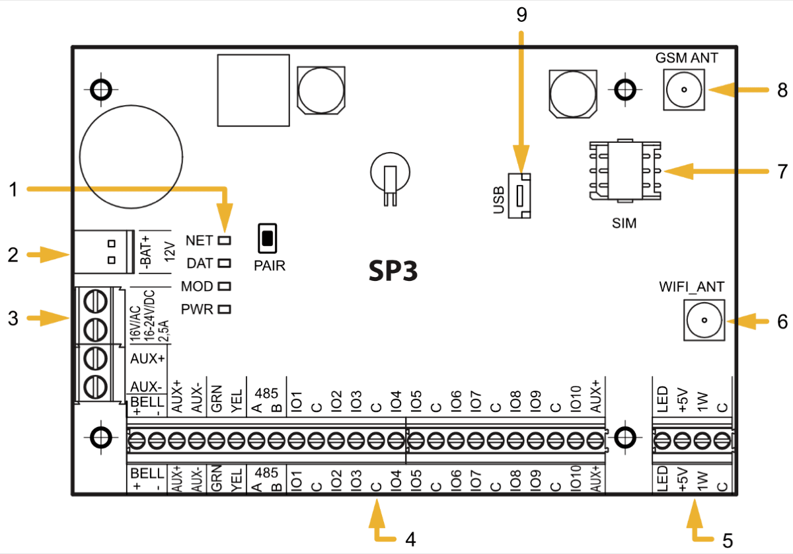

1.  Световые индикаторы связи и рабочих режимов.
2.  Клеммы для подключения источника резервного питания.
3.  Клеммы для подключения источника питания.
4.  Клеммы для подключения внешних устройств.
5.  Клемма 1-WIRE шины данных.
6.  Разъем SMA для WiFi антенны.
7.  Держатель nano-SIM карты.
8.  Разъем SMA для GSM антенны.
9.  USB Mini-B для программирования охранной панели.

| Клемма | Описание |
|----|----|
| Клемма питания | Клемма подключения питания (16 В переменного тока или положительная клемма 16-24 В постоянного тока) |
| Клемма питания | Клемма подключения питания (16 В переменного тока или отрицательная клемма 16-24 В постоянного тока) |
| BAT+ | Положительная клемма для подключения аккумулятора 12 В |
| BAT- | Отрицательная клемма для подключения аккумулятора 12 В |
| AUX+ | Клемма для запитки внешних устройств (12 В, положительная клемма) |
| AUX- | Общая клемма (отрицательная) |
| GRN | Шина данных клавиатуры |
| YEL | Шина данных клавиатуры |
| A 485 | Клемма А интерфейса *RS485* |
| B 485 | Клемма В интерфейса *RS485* |
| IO1 – IO9 | Клеммы вход/​выход (заводская настройка – вход) |
| IO10 | Клемма вход/​выход (заводская настройка – PGM выход, Сброс пожарного датчика) |
| C | Общая клемма (отрицательная) |
| LED | PGM выход (заводская настройка – Статус системы) |
| +5 V | Клемма питания для устройств *1-Wire* |
| 1 WIRE | *1-Wire* шина данных |
| C | Общая клемма (отрицательная) |

### Световая индикация

| Индикатор | Статус | Описание |
|----|----|----|
| NET / (Сеть) | Мигает зеленый | Осуществляется регистрация SIM карты в сети мобильной связи |
| NET / (Сеть) | Зеленый | SIM карта зарегистрирована в сети мобильной связи |
| NET / (Сеть) | Мигает желтый | Уровень GSM сигнала от 0 до 5. Достаточно 3 |
| DAT / (Данные) | Выключен | Нет неотправленных сообщений |
| DAT / (Данные) | Зеленый | Отправление сообщения |
| DAT / (Данные) | Желтый | Есть неотправленные сообщения в памяти |
| MOD / (Индикатор подключения к WiFi сети) | Мигает зеленый | Осуществляется подключение к WiFi сети |
| MOD / (Индикатор подключения к WiFi сети) | Зеленый | Подключено к WiFi сети |
| PWR / (Электропитание) | Мигает зеленый | Нет неисправностей |
| PWR / (Электропитание) | 1 красная вспышка | Нет SIM карты |
| PWR / (Электропитание) | 2 красных вспышки | Неправильный PIN код SIM карты |
| PWR / (Электропитание) | 3 красных вспышки | Не удается подсоединиться к сети GSM |
| PWR / (Электропитание) | 4 красных вспышки | Не удается подключиться к IP приемнику ПЦН по первому каналу |
| PWR / (Электропитание) | 5 красных вспышек | Не удается подключиться к IP приемнику ПЦН по второму каналу |
| PWR / (Электропитание) | 6 красных вспышек | Не установлены внутренние часы |
| PWR / (Электропитание) | 7 красных вспышек | Низкий уровень напряжения аккумулятора |
| PWR / (Электропитание) | 8 красных вспышек | Нет питания от сети переменного тока |
| PWR / (Электропитание) | 9 красных вспышек | Не удается подсоединиться к WiFi сети |

## Питание охранной панели

### Основное питание

Охранная панель и вся система охраны может быть запитана от источника питания переменного или постоянного тока. Для обеспечения бесперебойного питания, к охранной панели должен быть подключен аккумулятор 12 В. Чтобы соответствовать требованиям стандарта EN50131, источник резервного питания (аккумулятор) должен быть такой, чтобы система охраны могла работать 12 часов после потери питания от основного источника в соответствии с II классом защиты или 60 часов в соответствии с III классом защиты. Оцените потребляемый ток устройств, которые подсоединены к охранной панели (см. п.1.2 „Список согласуемых модулей“).

### Резервное питание

При сбое основного источника питания, охранная панель автоматически переключится на источник резервного питания (аккумулятор 12 В) и будет сформировано сообщение *AC Fault*. Когда напряжение на аккумуляторе уменьшится до 11,5 В, будет сформировано сообщение *Low Battery*. Аккумулятор будет отключен при напряжении ниже 9,5 В. При появлении напряжения на источнике питания будет сформировано сообщение *AC Restore* и автоматически начнется зарядка аккумулятора. Когда напряжения на аккумуляторе восстановится до 12,6 В, то будет сформировано сообщение *Battery Restore*.

### Комплекты охранной панели

#### Охранная панель „*FLEXi” SP3*

| Наименование                                | Количество |
|:--------------------------------------------|:----------:|
| Плата охранной панели „FLEXi“ SP3           |   1 шт.    |
| Провод для подсоединения аккумулятора       |   1 шт.    |
| Резистор 2,2 кΩ                             |   20 шт.   |
| Резистор 4,7 кΩ                             |   10 шт.   |
| Пластмассовый держатель (элемент крепления) |   4 шт.    |
| Антенна ME301M с кабелем длиной 2,5 м       |   2 шт.    |

#### Охранная панель *“FLEXi” SP3* KIT

| Наименование | Количество |
|:---|:--:|
| Плата охранной панели „FLEXI“ SP3, установленная в металлическом ящике | 1 шт. |
| Металлический ящик К01 с трансформатором 40 ВА | 1 шт. |
| Резистор 2,2 кΩ | 20 шт. |
| Резистор 4,7 кΩ | 10 шт. |
| Антенна ME301M с кабелем длиной 2,5 м | 2 шт. |
| Провод для подсоединения аккумулятора | 1 шт. |
| Датчик саботажа (англ. Tamper) | 1 шт. |
| Клеммная колодка с предохранителем 0,5 A | 1 шт. |

#### Охранная панель *“FLEXi” SP3* KITi

| Наименование | Количество |
|:---|:--:|
| Плата охранной панели „FLEXI“ SP3, установленная в металлическом ящике | 1 шт. |
| Металлический ящик K02 с импульсным источником питания Mean Well | 1 шт. |
| Резистор 2,2 kΩ | 20 шт. |
| Резистор 4,7 кΩ | 10 шт. |
| Антенна ME301M с кабелем длиной 2,5 м | 2 шт. |
| Провод для подсоединения аккумулятора | 1 шт. |
| Датчик саботажа (англ. Tamper) | 1 шт. |
| Клеммная колодка с предохранителем 3,15 A | 1 шт. |

!!! note "Примечание"
    Кабель USB (тип: Mini-B) для программирование охранной панели не входит в комплектацию. 
    ## Установка охранной панели

### Рекомендуемая последовательность установки

**Планирование системы:**

- Начертите план помещений и на нем отметьте места, где будут установлены охранная панель, клавиатура, датчики, оборудование, которое будет управляться удаленно и автоматически.

- Оцените помещения и предъявляемые требования к их охране. Подберите типы датчиков, количество датчиков и места их установки.

#### Крепление в монтажном ящике

Плата охранной панели устанавливается с монтажный ящик, в котором установлен понижающий трансформатор с предохранителем 500 мА. В монтажном ящике предусмотрено место для установки аккумулятора (источника резервного питания). С помощью пластмассовых держателей закрепите плату охранной панели в монтажном ящике. Металлический монтажный ящик заземлите. Монтажный ящик должен удовлетворять требованиям стандарта EN 60950 и EN 50131.

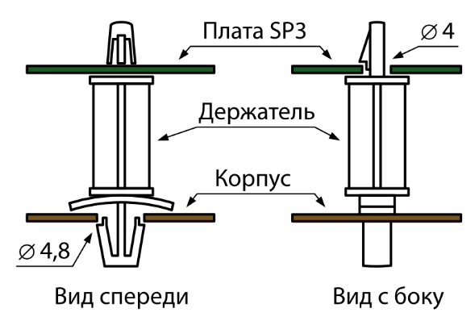

**Размеры платы “FLEXI” SP3**

На рисунке представлены размеры платы и отверстия ее крепления. Размеры указаны в миллиметрах.

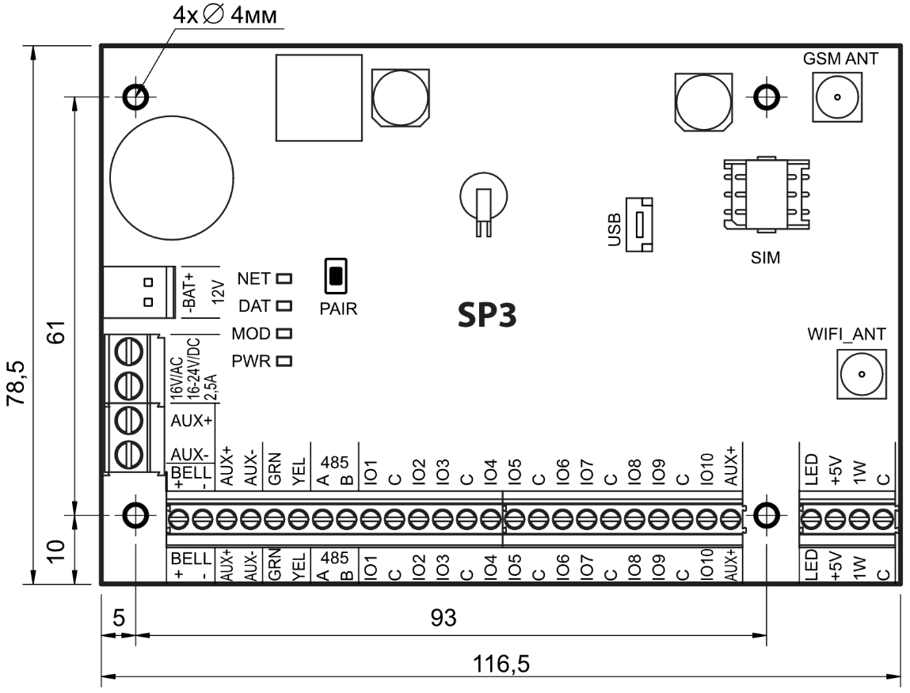

#### Последовательность подключения

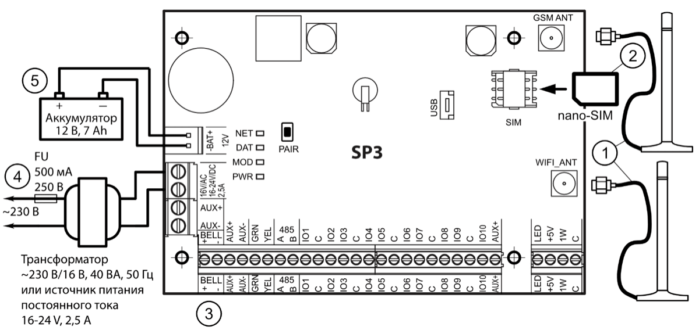

1.  Подсоедините GSM и WiFi антенны к разъемам.

2.  Установите SIM карту, которая активирована в мобильной сети, в держатель.

3.  Подключите дверные и оконные магнитные контакты, датчики движения, пожарные извещатели, сигнализаторы, клавиатуры, управляемые устройства в соответствии с предоставленными схемами и схемами подключения изделий. К охранной панели подключите датчики вскрытия монтажного ящика охранной панели.

4.  К клеммам AC/DC охранной панели подключите провода основного источника питания. Включите основной источник питания. „FLEXi“ SP3 распознает клавиатуры, расширители, которые правильно подключены к шинам YEL/GRN и 1-WIRE.

5.  В монтажный ящик установите аккумулятор. Провода от аккумулятора подключите к разъему ВАТ+/ВАТ- охранной панели.

!!! note "Примечание"
    Аккумулятор должен заряжаться не более 72 часов, чтобы система охраны соответствовала II классу охраны или 24 часа, чтобы соответствовала III классу охраны. 
    #### Рекомендации по конфигурации параметров охранной панели

1.  Как выполнить конфигурацию охранной панели см. п.5 „Конфигурация с программой TrikdisConfig“.

2.  Системные настройки:

    1.  **Разделы**. Если существует необходимость некоторое количество зон включать отдельно, то охранную систему можно разделить на разделы. Как охранную систему разделить и установить необходимые атрибуты см. п.5.2 „Окно „Системные параметры““.

    2.  **Зоны.** См. п.5.7 „Окно „Зоны““, чтобы установить каждую зону в соответствии с характеристиками датчиков и желаемым алгоритмом работы охранной системы после срабатывания зоны. Если охранная система разделена на разделы, то любую зону можно назначить определенному разделу.

    3.  **Пользователи.** Для управления охранной системой с помощью клавиатуры, контактным (iButton) ключом, телефонным звонком, SMS сообщением необходимо создать пользователей охранной системы. См. п.5.4 „Окно „Пользователи и сообщения““, где описано как создать пользователя и назначить ему права.

3.  Отправление сообщений:

    1.  **Установка времени.** Для получения сообщений в точной временной меткой, необходимо установить часы охранной панели, см. п.5.2 „Окно „Системные параметры““.

    2.  **Включение отправки сообщений.** В начальной конфигурации охранной панели включена функция отправки всех сообщений о событиях. Когда происходит какое-либо событие, его сообщение будет отправлено указанным контактам через указанные каналы связи. Чтобы отключить отправку сообщений см. п.5.10 „Окно „Список событий““.

    3.  **Параметры SIM карты.** Если вы планируете отправлять сообщения через мобильные сети, то необходимо установить параметры SIM карты, см. п.5.2 „Окно „Системные параметры““.

    4.  **Сообщения на ПЦН (пульт централизованного наблюдения).** В начальной конфигурации охранной панели отправление сообщений на ПЦН отключено. Чтобы настроить параметры отправки сообщений на ПЦН см. п.5.3 „Окно „Сообщения на ПЦН““.

    5.  **Сообщения пользователю**. В начальной конфигурации охранной панели включена связь с облаком Protegus, а отправка SMS сообщений и звонки отключены. Настройка параметров отправки сообщений на мобильный телефон пользователю описано в п.5.10 „Окно „Список событий““.

4.  Удаленное управление системой:

    1.  **Доступ пользователя.** Управлять охранной системой удаленно (звонком или SMS сообщением) могут только те пользователи, чьи телефонные номера внесены в список пользователей охранной системы. В п.5.5 Окно „Пользователи и сообщения“ описано как внести номер телефона в список.

    2.  **Управление телефонным звонком.** Телефонный звонок используется для включения/отключения охраной панели. Телефонным звонком можно управлять оборудованием, которое подключено к PGM выходу. В п. 4.4 „Управление звонком“ описано как установить параметры, чтобы телефонным звонком можно было менять состояние PGM выхода.

    3.  **Управление SMS сообщениями.** SMS сообщениями можно: включать/выключать систему охраны; включать/выключать разделы охранной системы; управлять PGM выходами, к которым подключено оборудование. Список SMS команд описан в п.4.3 „Конфигурация и управление SMS командами“.

5.  Дополнительно:

    1.  **Изменение кодов управления.** Рекомендуем изменить заводские коды управления панелью и коды конфигурации на коды, которые известны только вам.

        - **Код администратора** меняется в программном меню **Системные параметры** закладка **Подсоединение**.

        - **Код удаленного SMS управления** меняется в программном меню **Системные параметры** закладка **Подсоединение** в поле **SMS пароль**.

        - **Код инсталлятора** меняется в программном меню **Системные параметры** закладка **Подсоединение**.

### Схемы подключения входов (зон)

Плата охранной панели имеет 10 клемм IO1-IO10 (зоны) для подсоединения датчиков. Применив расширители (***iO, iO8, iO-WL, RF-SH, iO-LORA, iO8-LORA**),* количество входов можно увеличить до 32 шт. Любую IO клемму можно установить, как вход и установить атрибуты: тип входа (NO, NC, EOL, EOL_T, 3EOL, ATZ, ATZ_T); чувствительность и кратковременные события в цепи; функции входа (зоны) („Delay“, „Instant“, „Instant Stay“, „Interior“, „Interior Stay“, „Fire“, „Keyswitch“, „24_hour“, „Silent“, „Silent 24h“), см. п.5.7 „Окно „Зоны““. Расширители iO8 и iO8-LORA поддерживают все номиналы сопротивлений зон (типы EOL) охранной панели.

#### Схема подключения датчиков.

<figure style="margin: 0;">

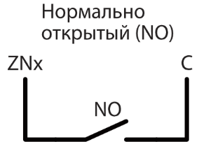
</figure>

<figure style="margin: 0;">

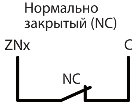
</figure>

<figure style="margin: 0;">

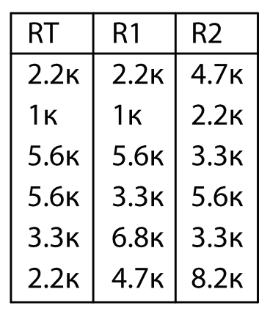
</figure>

<figure style="margin: 0;">

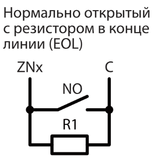
</figure>

<figure style="margin: 0;">

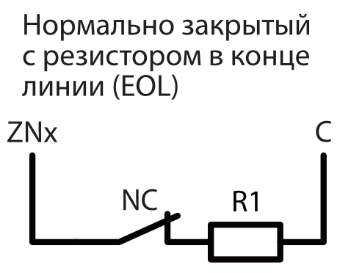
</figure>

<figure style="margin: 0;">

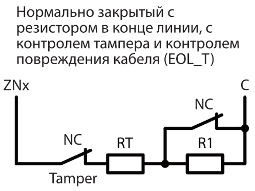
</figure>

<figure style="margin: 0;">

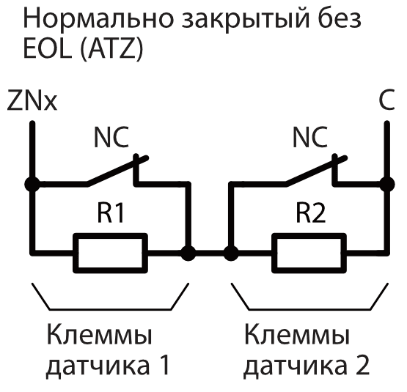
</figure>

<figure style="margin: 0;">

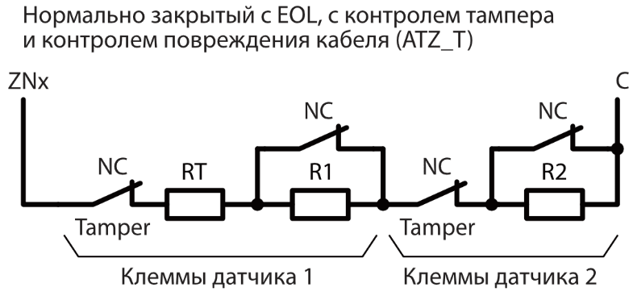
</figure>

<figure style="margin: 0;">

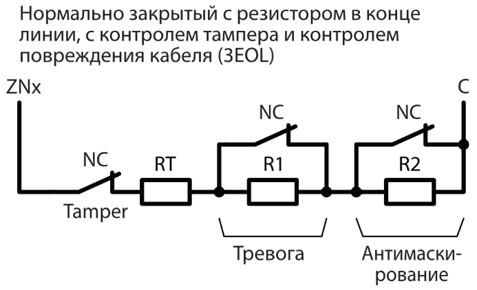
</figure>

### Схемы подключения пожарных извещателей

Схемы подключения двух проводных пожарных извещателей.

Подключение двух проводных пожарных извещателей к PGM (LED) выходу. При использовании этой схемы подключения пожарных извещателей, необходимо отметить **Для подключения пожарного шлейфа применяется LED выход** поле галочкой (см. 5.2 „Окно „Системные параметры““).

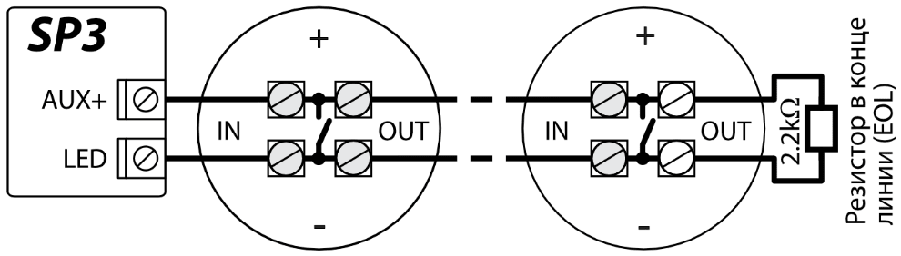

Схема подключения двух проводных пожарных извещателей с релейным модулем SM1. Входу (IOx) должна быть установлена функция **Пожарная** (см. п.5.7 „„Окно „Зоны““). Выходу (IO10) должен быть установлен режим работы **Сброс пожарного датчика** (см. п.5.8 „Окно „PGM выходы““).

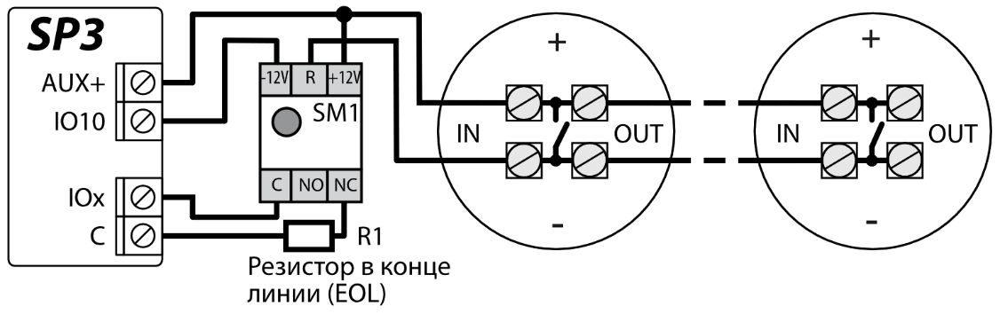

или

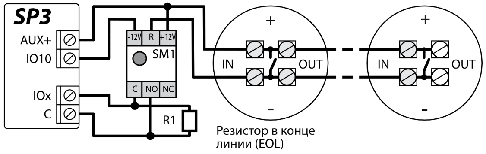

Подключение четырех проводных пожарных извещателей.

Входу (IOx) должна быть установлена функция **Пожарная** (см. п.5.7 „„Окно „Зоны““). Выходу (IO10) должен быть установлен режим работы **Сброс пожарного датчика** (см. п.5.8 „Окно „PGM выходы““).

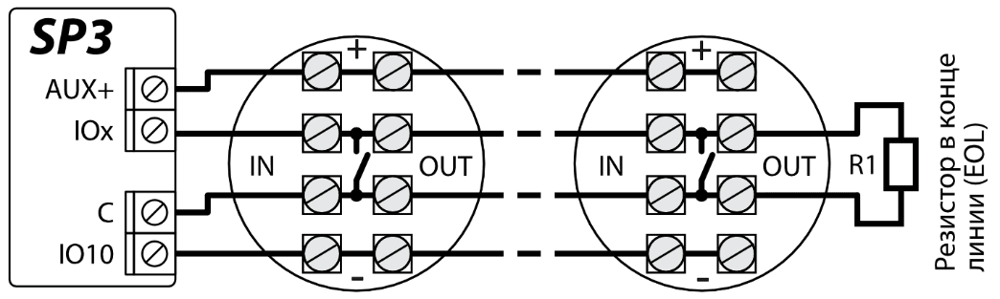

### Схема подключения сирены

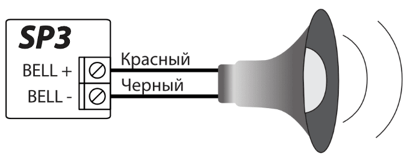

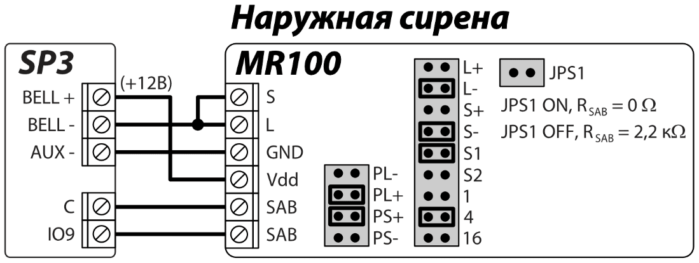

На схеме показано подключение и настройка наружной сирены **MR100**. Если охранная панель будет использовать другой метод контроля EOL цепи тампера (клеммы SAB) сирены (заводская настройка EOL 2,2 кОм), то необходимо замкнуть контакты JPS1 и последовательно в цепь тампера подключить резистор соответствующего номинала.

**24-х часовой** тип зоны установлен на заводе для входа IO9.

### Схемы подключения клавиатур, RFID считывателей (Wiegand 26/34)

К шине клавиатуры можно подключить до 8 клавиатур. В программе TrikdisConfig необходимо указать тип подключаемой клавиатуры (см. п. 5.5 „Окно „Модули““). Охранная панель автоматически распознает и зарегистрирует подключенные клавиатуры.

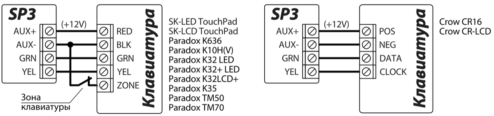

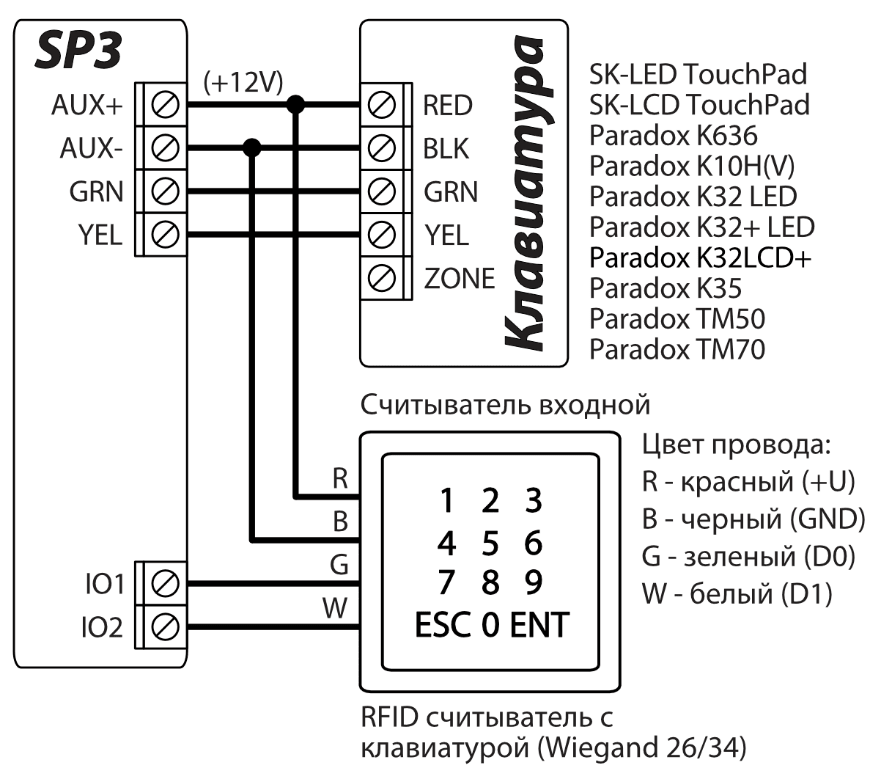

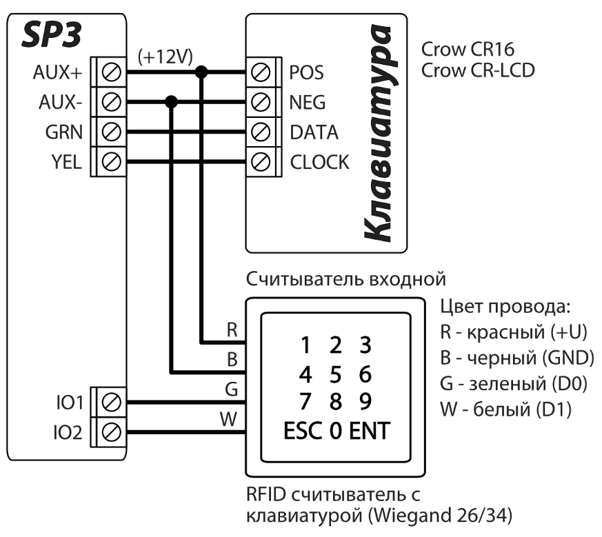

К охранной панели можно подсоединить до 2 RFID считывателей. Клавиатуры к охранной панели не подключаются, когда подсоединены два RFID считывателя.

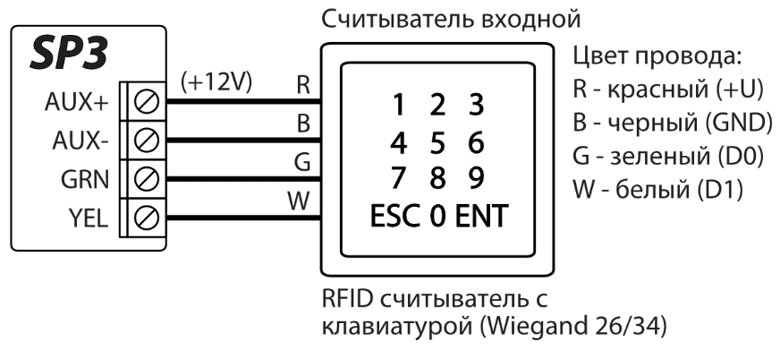

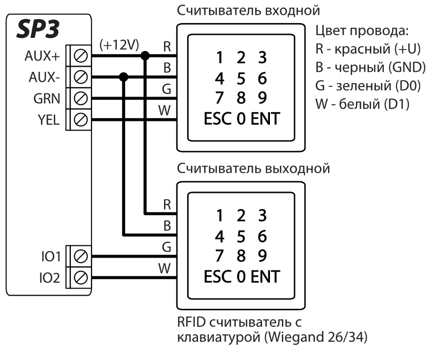

### Схема подключения считывателя контактных ключей TM17, CZ-Dallas

**CZ-Dallas** считыватель контактных (iButton) ключей подключается к шине *1-WIRE***.** Длина проводов шины *1-WIRE* до 30 м.

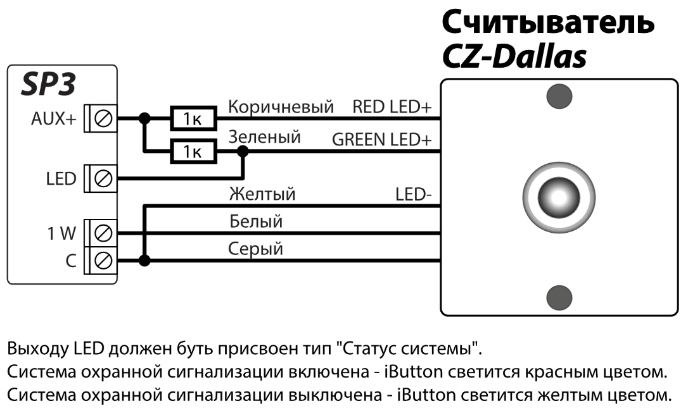

**TM17** считыватель подключается к шине RS485. Длина проводов шины *RS485* до 100 м.

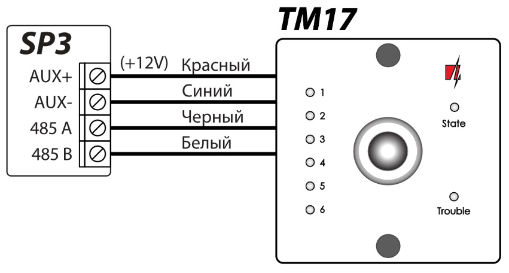

### Схема подключения датчика температуры

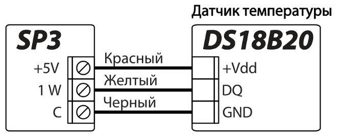 / 

### Схема подключения реле и LED индикатора

Различные электрические устройства могут управляться (вкл/выкл) удаленно с помощью контактов реле. Универсальная IO (вход/выход) клемма охранной панели должна быть установлена в режим работы Выход (OUT) и назначен тип Удаленное управление.

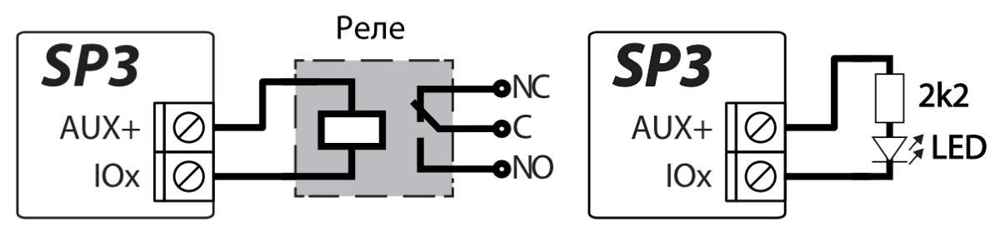

### Схема подключения „Ethernet“ модуля E485

Модуль *Е485* предназначен для передачи сообщений и управления через проводную компьютерную сеть. Используя *Е485* вместе с охранной панелью*,* сообщения на ПЦН и в *Protegus2* передаются через проводную компьютерную сеть и мобильный интернет не используется. При нарушении связи в проводной компьютерной сети данные передаются через сеть мобильного интернета. При восстановлении связи в компьютерной сети *„FLEXi“ SP3* начинает вновь отправлять сообщения через *Е485*.

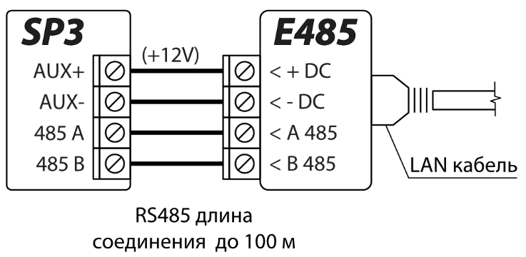

В разделе п.5.3 „Окно „Сообщения на ПЦН““ устанавливается приоритет канала связи (GPRS, LAN, WiFi) охранной панели с ПЦН и Protegus2. Конфигурация „FLEXi“ SP3 с „Ethernet“ модулем Е485 описана в п. 5.5 „Окно „Модули““. Подключив модуль Е485 к охранной панели и если не используется мобильный интернет, то SIM карта не нужна.

### Схема подключения RF-SH приемника беспроводных датчиков

С модулем *RF-SH* к охранной системе можно добавить до 42 беспроводных брелоков, 16 беспроводных сирен, 32 беспроводных датчиков, 8 беспроводных клавиатур. / Конфигурация *„FLEXi“ SP3* с модулями описана в п.5.5 „Окно „Модули““.

### Схема подключения расширителей серии iO

Для увеличения количества зон (IN) и выходов (OUT) охранной панели подключите проводной или беспроводный Trikdis расширитель входов/выходов серии iO. Конфигурация „FLEXi“ SP3 с модулями расширения описана в п.5.5 „Окно „Модули““.

<figure style="margin: 0;">

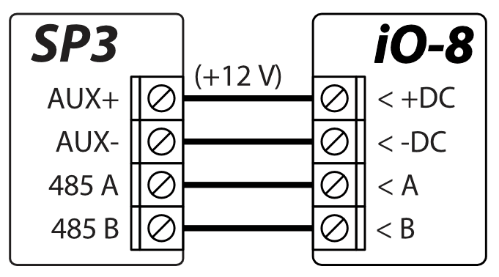
</figure>

<figure style="margin: 0;">

</figure>

### Схема подключения радиопередатчика Т16

Радиопередатчик *Т16* используется для передачи сообщений охранной панели через радиосети „Trikdis”. / Передатчик может отправлять собственные сообщения и сообщения охранной панели на ПЦН (пульт централизованного наблюдения) с возможностью из ПЦН направить сообщение конечному пользователю.

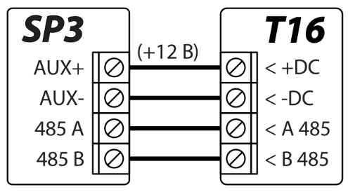

### Схема подключения модуля SF485

*SF485* действует как резервный канал связи для передачи событий охранной панели на ПЦН (пульт централизованного наблюдения) или в мобильное приложение *Protegus2* по сети SigFox, когда события не могут быть переданы по Основному каналу связи. Сообщения передаются в формате Contact ID кодов.

### Включение охранной панели

Включите питание охранной панели. Светодиоды охранной панели должны работать следующим образом:

- Индикатор „PWR“ должен мигать зеленым, указывая на наличие достаточного уровня напряжения питания;

- Индикатор „NET“ должен светиться зеленым и периодически мигать желтым не менее 3 раз. Зеленый цвет означает, что SIM карта успешно зарегистрирована в мобильной сети, а количество желтых вспышек указывает уровень сигнала мобильной связи.

!!! note "Примечание"
    Достаточный уровень мобильного сигнала – 3 (три желтых вспышки индикатора „NET”). / Если сосчитали меньше желтых вспышек индикатора „NET”, то уровень сигнала мобильной связи недостаточный. Рекомендуем выбрать другое место установки охранной панели, или поменять место расположения антенны, или использовать более чувствительную антенну. / Световая индикация охранной панели описана в п.1.4 „Световая индикация”. / Если индикаторы охранной панели не светят, проверьте источник питания и проводные соединения. 
    ## Удаленное управление

### Присвоение *“FLEXi” SP3* учетной записи пользователя *Protegus*

С Protegus2 пользователи смогут удаленно управлять системой охраны. Пользователь будет иметь информацию о состоянии системы охраны, получать уведомления о событиях системы охраны.

1.  Если вы еще не создали личную учетную запись в облаке Protegus, скачайте и запустите приложение Prоtegus2 или используйте браузерную версию [www.protegus.app](https://www.protegus.app) и создайте личную учетную запись.

    

      

    

2.  Нажмите на полученную ссылку в электронном письме, чтобы подтвердить создание аккаунта. Запустите приложение Protegus2 на своем телефоне и войдите под своим именем пользователя и паролем.

!!! note "Примечание"
    При добавлении охранной панели „FLEXi” SP3 к Protegus2 должно быть:

    1.  Установлена активированная SIM карта и введен или отключен PIN код;

    2.  Включен Protegus сервис. См. п. 5.4 „Окно „Пользователи и
        сообщения"";

    3.  Включено напряжение питания (индикатор „PWR" мигает зеленым);

    4.  Зарегистрирован в сети (индикатор „NET" светит зеленым, когда
        зарегистрирован в мобильной сети; и/или индикатор „MOD" светит
        зеленым, при подключении к WiFi сети).

3.  Нажмите „Add new system“ и введите „Unique ID/IMEI“ номер *„Flexi” SP3*, который найдете на изделии или на упаковке. Нажмите кнопку „Next“.

### Управление охранной панелью с приложением *Protegus2*

1.  Для управления охранной панелью, войдите в *Protegus2*.

2.  В *Protegus2* нажмите на кнопку „Armed“ (или „Disarmed“). В открывшемся окне введите код пользователя охранной панели.

3.  Если программа предоставляет совершенно другое изображение или не выполняет ваши команды, выберите Settings -\> System configuration -\> System out of sync? и нажмите кнопку „Sync“.

### Конфигурация и управление SMS командами

Охранную панель „FLEXi” SP3 можно удаленно конфигурировать и управлять SMS сообщениями.

Структура SMS сообщения: Команда `[пробел]` Пароль `[пробел]` Данные

Заводской SMS пароль **123456**. В целях безопасности, рекомендуется изменить его и не забывать его!

#### Список SMS команд

| Команда | Данные | Описание |
|----|----|----|
| *INFO* |  | Запрос информации об охранной панели. Ответ будет включать: имя объекта; состояние раздела; номер IMEI; уровень сигнала GSM; версию программного обеспечения и серийный номер. Например: INFO 123456 |
| *RESET* |  | Запуск охранной панели работать заново. Например: RESET 123456 |
| *OUTPUTx* | *ON* | Включить выход, где „x“ – номер выхода. Например: OUTPUT1 123456 ON |
|  | *OFF* | Выключить выход, где „x“ – номер выхода. Например: OUTPUT1 123456 OFF |
|  | *PULSE=ttt* | Включить выход „x“ на продолжительность импульса. „ttt“ – продолжительность импульса (вводится 3-значное число), сек.. / Например: OUTPUT1 123456 PULSE=002 |
| *PSW* | *Новый пароль* | Смена пароля. Например: PSW 123456 654123 |
| *TIME* | *YYYY/MM/DD,12:00:00* | Установка даты и времени. Например: TIME 123456 2020/06/03,12:23:00 |
| *TXTA* | *Наименование объекта* | Ввод названия объекта. Например: TXTA 123456 Дом |
| *RDR* | *PhoneNR#SMStext* | Переадресация SMS сообщений на указанный номер телефона. Номер телефона должен содержать знак „+“ и код страны. / Например: RDR 123456 +37061234567#текст переадресации |
| *ASKI* |  | SMS сообщение запроса о состоянии входов (IN). Например: ASKI 123456 |
| *ASKO* |  | SMS сообщение запроса о состоянии выходов (OUT). / Например: ASKO 123456 |
| *ASKA* |  | SMS сообщение запроса о состоянии разделов охранной панели. / Например: ASKA 123456 |
| *ASKT* |  | SMS сообщение запроса о значении температур датчиков температуры. / Например: ASKT 123456 |
| *DISARM* | *SYS:x* | Выключить систему охраной сигнализации, где „x“ – номер раздела (1-8) охранной системы. Например: DISARM 123456 SYS:1 |
| *ARM* | *SYS:x* | Включить систему охраной сигнализации, где „x“ – номер раздела (1-8) охранной системы. Например: ARM 123456 SYS:1 |
| *STAY* | *SYS:x* | Включить систему охраной сигнализации в режиме STAY, где „x“ – номер раздела (1-8) охранной системы. Например: STAY 123456 SYS:1 |
| *SLEEP* | *SYS:x* | Включить систему охраной сигнализации в режиме SLEEP, где „x“ – номер раздела (1-8) охранной системы. Например: SLEEP 123456 SYS:1 |
| *FRS* |  | Запустить заново работать пожарный извещатель после срабатывания, если выходу (OUT) установлена функция „Сброс пожарного датчика“. / Например: FRS 123456 |
| *SETN* | *PhoneX=PhoneNR#Name#email* | Добавить номер телефона, имя пользователя и назначить его пользователю „x“. Где „x“ – порядковый номер пользователя в списке. Номер телефона должен содержать знак „+“ и код страны. Номер телефона должен быть отделен от имени символом „#“. / Например: SETN 123456 PHONE5=+37061234567#Петр#petr@mail.ru |
|  | *PhoneX=DEL* | Удаление телефонного номера и имени пользователя из списка. „X“ – порядковый номер пользователя в списке. / Например: SETN 123456 PHONE5=DEL |
| *UUSD* | *\*Uusd code#* | Отправление UUSD кода оператору. Например: ***UUSD 123456 \*245#*** |
| *CONNECT* | *Protegus=ON* | Подключиться к Protegus сервису. / Например: CONNECT 123456 PROTEGUS=ON |
|  | *Protegus=OFF* | Отключиться от Protegus сервиса. / Например: CONNECT 123456 PROTEGUS=OFF |
|  | *Code=123456* | Код подключения к Protegus сервису. / Например: CONNECT 123456 CODE=123456 |
|  | *IP=0.0.0.0:8000* | Указывается адрес TCP/IP и Port сервера основного канала. / Например: CONNECT 123456 IP=0.0.0.0:8000 |
|  | *IP=0* | Отключение основного канала. Например: CONNECT 123456 IP=0 |
|  | *ENC=123456* | Ключ шифрования TRK. Например: CONNECT 123456 ENC=123456 |
|  | *APN=Internet* | Имя APN. Например: CONNECT 123456 APN=INTERNET |
|  | *USER=user* | Пользователь APN. Например: CONNECT 123456 USER=User |
|  | *PSW=password* | Пароль APN. Например: CONNECT 123456 PSW=Password |

### Управление звонком

!!! note "Примечание"
    Администратор системы может управлять охранной панелью SMS сообщениями и телефонным звонком. Если хотите разрешить управлять системой другим пользователям, то введите пользователей с программой TrikdisConfig или SMS командой. / **<u>Управление звонком не работает с охранными панелями *SP3_хх7х*. В охранных панелях *SP3_12xx* нет голосового сообщения c прошивкой 1.14 и выше.</u>** Команды управления „*FLEXi“ SP3* телефонным звонком

Управление выходами (OUT) и разделами охранной сигнализации:

1.  Пользователю предоставлены права удаленно управлять выходами (OUT), а выходу назначен тип „Удаленное управление“, или система охраны состоит из 1 или более разделов. Позвоните на номер SIM карты охранной панели. „FLEXi“ SP3 ответит и с клавиатуры телефона введите команду (см. таблицу, которая предоставлена ниже).

#### Команды управления, набираемые с клавиатуры телефона

| Клавиш клавиатуры | Функция | Описание |
|----|----|----|
| \[1\]\[№ раздела\]\[#\] | Включение охраны выбранного раздела охранной панели | Например: (включить охрану 1 раздела охранной системы): 11# |
| \[2\]\[ № раздела\]\[#\] | Выключение охраны выбранного раздела охранной панели | Например: (выключить охрану 1 раздела охранной системы): 21# |
| \[3\]\[№ выхода\]\[#\]\[№ состояния\] | Управление выбранным выходом (OUT) | Управление определенным выходом (OUT). Состояние: \[0\] – выключить выход; \[1\] – включить выход; \[2\] – выключить выход на продолжительность импульса; \[3\] – включить вход на продолжительность импульса; (продолжительность импульса задается в программе TrikdisConfig, в таблице Выходы). Например: (включить выход номер 1): 31#1 Например: (включить выход номер 2 на продолжительность импульса): 32#3 |
| \[4\]\[#\]\[№ записи\]\[#\] | Начать запись выбранного (1-5) голос / ового сообщения с помощью звонка | Например: (записать голосовое сообщение номер 1): 4#1# |
| \[5\] | Воспроизвести запись записанного голосового сообщения | Например: 5 |
| \[6\] | Сохранить записанное голосовое сообщение | Например: 6 |

Начало и конец записи голосового сообщения сопровождаются звуковым сигналом. Продолжительность записи голосового сообщения составляет 15 сек. Окончание воспроизведения голосового сообщения сопровождается звуковым сигналом. Окончание сохранения голосового сообщения сопровождается звуковым сигналом. Только после звукового сигнала можно начать выполнять другие действия.

## Конфигурация с программой TrikdisConfig

1.  Загрузите программу конфигурации TrikdisConfig со странички [www.trikdis.com/ru](http://www.trikdis.com/ru) (в поле поиска напишите „TrikdisConfig“).

2.  Кабелем USB Mini-B подключите „FLEXi” SP3 к компьютеру.

!!! note "Примечание"
    Если работающую охранную панель „FLEXi” SP3 кабелем USB подключить к компьютеру, то охранная панель перейдет в режим программирования и прекратит выполнять свои функции. 3. Запустите программу TrokdisConfig. Программа автоматически определит подключенное изделие и откроет окно конфигурации охранной панели „FLEXi” SP3.

2.  Нажмите кнопку **Считать \[F4\]**, чтобы скачать установленные параметры „FLEXi” SP3. Если необходимо введите код администратора или инсталлятора.

### Строка состояния TrikdisConfig

Подключив “FLEXI” SP3 к TrikdisConfig и нажав на кнопку **Считать \[F4\],** программа в строке состояния предоставит информацию о подключенном изделии.

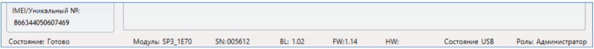

| Наименование | Описание |
|----|----|
| IMEI/​Уникальный № | IMEI номер изделия |
| Состояние | Рабочее состояние |
| Модуль | Тип изделия (должно быть указано SP3_хххх) |
| SN | Серийный номер изделия |
| BL | Версия программы |
| FW | Версия программы изделия |
| HW | Версия аппаратной части изделия |
| Состояние | Подключение программы к изделию (USB или Remote (удаленно)) |
| Роль | Уровень доступа (показывается после подтверждения кода доступа) |

Нажав кнопку **Считать \[F4\]**, программа TrikdisConfig считает и покажет настройки коммуникатора „FLEXi” SP3. С TrikdisConfig сделайте необходимые настройки, по приведенному ниже описанию.

### Окно „Системные параметры“

**Закладка „Основные”**

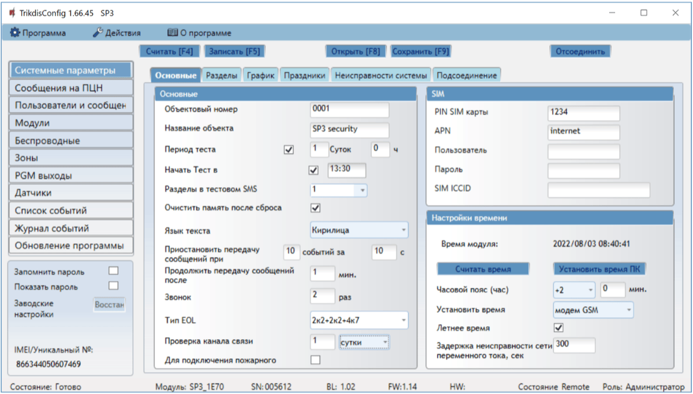

**Группа „Основные“**

- **Объектовый номер** – если сообщения будут отправляться на ПЦН (пульт централизованного наблюдения), то необходимо указать номер объекта (4-значный шестнадцатеричный номер. 0-9, А-F. **Не используйте FFFE, FFFF объектовые номера**), который предоставлен ПЦН.

- **Название объекта** – будет вписано в SMS сообщение события (до 20 символов, можно использовать буквы и числа).

- **Период теста** – отметьте поле и будет включено периодическое отправление тестовых сообщений в установленный период.

- **Начать тест в** – отметь поле и укажите время, когда должно быть отправлено тестовое сообщение.

- **Разделы в тестовом SMS** – укажите номера разделов, состояние статусов охранных режимов которых будет включено в периодическое тестовое сообщение.

- **Очистить память после сброса** – при перезапуске охранной панели все неотправленные сообщения о событиях, которые были в буферной памяти, будут удалены.

- **Язык текста** – укажите язык и в сообщениях будут применяться специфические символы этого языка.

- Можно **Приостановить передачу сообщений при …** повторяющихся одинаковых **событиях за … (с)** установленный промежуток времени**.**

- **Продолжить передачу сообщений после** – укажите период времени (0-999 минут), после которого передача приостановленных сообщений будет продолжена.

- **Звонок** – при происшествии события, „FLEXi“ SP3 позвонит пользователю указанное количество раз. Если пользователь отклонит или ответит на звонок, „FLEXi“ SP3 прекратит звонки. Длительность звонка 20 сек..

- **Тип EOL** – укажите номиналы сопротивлений, которые будут подключены к датчикам (англ. EOL – End Of Line resistor. RТ+R1+R2. Резистор RТ – тампер; резистор R1 – датчик №1; резистор R2 – датчик №2).

- **Проверка канала связи** – укажите интервал времени, по истечении которого охранная панель проверит резервные каналы связи, отправляя сообщения на ПЦН. Отправив сообщения по резервным каналам связи, охранная панель переключится на основной канал связи.

- **Для подключения пожарного шлейфа применяется LED выход** - отметьте поле, если двухпроводные пожарные извещатели будут подключены к LED выходу.

**Группа „SIM“**

- **PIN** **SIM карты** – введите PIN код SIM карты. Если PIN код SIM карты отключен, то оставьте в программе заводскую настройку кода.

  - **APN** – введите адрес подключения мобильного интернета провайдера. APN необходимо вводить, когда уведомления отправляются в Protegus2 или в ПЦН через GPRS.

- **Пользователь** и **Пароль** – если провайдер мобильной связи требует, то надо ввести в соответствующие поля имя пользователя и пароль**.**

- **SIM ICCID** - введите номер ICCID SIM-карты, если вы хотите, чтобы охранная панель работала только с этой SIM-картой.

**Группа „Настройки времени“**

Установить время охранной панели можно нажав на кнопку **Установить время ПК**. Если в поле **Установить время** установлено **Выключено**, то охранной панели будет установлено время компьютера. Если в поле **Синхронизация внутренних часов** указан сервер или модем, то охранная панель синхронизирует внутренний часы по указанному серверу или модему.

- **Часовой пояс (час)** – укажите часовой пояс страны.

- **Установить время** – укажите, с которым сервером охранная панель синхронизирует внутренние часы. Синхронизация осуществляется, когда охранная панель включена.

- **Летнее время** – отметьте поле и внутренние часы охранной панели будут автоматически переводиться на летнее или зимнее время.

- **Задержка неисправности сети переменного тока** - в случае сбоя в электросети уведомление об отключении питания будет отправлено после указанной задержки времени. Когда напряжение питания восстановится, уведомление о восстановлении напряжения питания будет отправлено после указанной задержки времени.

**Закладка „Разделы“**

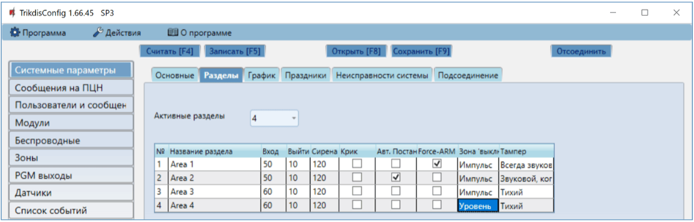

- **Активные разделы** – укажите на сколько разделов будет поделена охранная сигнализация.

- **Название раздела** – укажите наименование раздела охранной сигнализации.

- **Вход** – введите продолжительность задержки времени, предназначенной для входа через зону „Входа“, для отключения сигнализации. (0-999 сек.).

- **Выход** – введите продолжительность задержки времени, предназначенной для выхода через зону „Входа“, при включении сигнализации. (0-999 сек.). Если сигнализация включается/выключатся приложением Protegus или телефонным звонком система не будет отсчитывать задержку времени.

- **Сирена** – укажите продолжительность работы сирены при срабатывании сигнализации. (0-999 сек.).

- **Крик** – отметьте поле и при включении сигнализации сирена один раз коротко подает звуковой сигнал, при выключении сигнализации – сирена подает два раза звуковой сигнал.

- **Авт. постановка** – отметьте поле, чтобы система охраны автоматически встала на охрану, после того как охранная система была выключена удаленно, а за задержку времени входа не была нарушена зона „Входа“.

- **Force-ARM** – отметьте поле и охранная панель будет включена в ARM режим охраны, даже если не была нарушена зона „Входа“.

- **Зона выключатель** – определяет, как должна быть нарушена зона „Выключатель“ (импульс или уровень), чтобы система охраны была включена или выключена.

- **Тампер** – укажите тип реакции (Тихий; Звуковой, когда под охраной; Всегда звуковой ) системы охраны, когда произойдет срабатывание тампера. **Тихий** – будут отправляться сообщения о событии, но сирена не включится. **Звуковой, когда под охраной** – будут отправляться сообщения о событии, но сирена включится при срабатывании тампера при включенной системе охраны. **Всегда звуковой** – будут отправляться сообщения о событии и всегда будет срабатывать сирена.

**Закладка „График“**

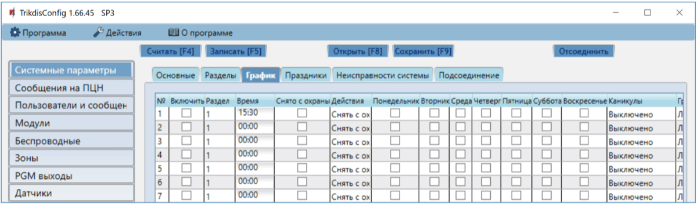

В таблице можете установить сценарии автоматического включения и выключения системы охраны, выбирая дни недели и праздничные дни.

- **Включить** – включите график, чтобы система охраны автоматически включала или выключала режимы охраны.

- **Раздел** – укажите раздел охранной системы, которой будет предназначен этот график.

- **Время** – укажите время, когда должно быть выполнено действие.

- **Снято с охраны** – отметьте поле и действие графика будет выполнено, только если охранная панель не поставлена в режим охраны AWAY.

- **Действия** – укажите режим охраны (Disarm/Arm/Sleep/Stay), который охранная панель должна будет активировать.

- **Понедельник, … Воскресенье** – укажите дни недели, для которых должен быть активирован выбранный режим охраны.

- **Каникулы** – укажите условия действия графика в дни каникул (Выключено/ Игнорировать во время каникул/ Дополнительно во время каникул/ Только во время каникул). **Выключено** – нет каникул. **Игнорировать во время каникул** – в дни каникул график игнорировать. **Дополнительно во время каникул** – по время каникул дополнительно выполнить действие. **Только во время каникул** – график выполняется только в дни каникул.

- **Группа каникул** – укажите группу (Любой/1/2/3/4) праздничных дней, по которой будет выполняться график в праздничные дни. Выбрав „Любой“, выполнение графика в праздничные дни будет выполняться по любому активному праздничному дню.

**Закладка „Праздники“**

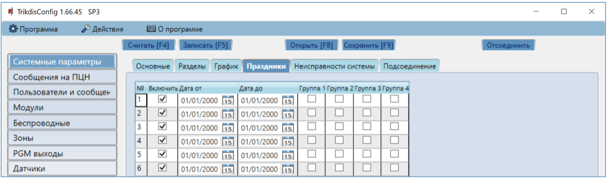

- **Включить** – отметьте поле, для включения графика праздничных дней.

- **Дата от** – укажите период начала праздничных дней.

- **Дата до** – укажите период окончания праздничных дней. Если праздничный день только один, то значение должно соответствовать значению, указанному в графе **Дата от.**

- **Группа1, Группа2, Группа3, Группа4** – сгруппируйте праздничные дни.

**Закладка „Неисправности системы“**

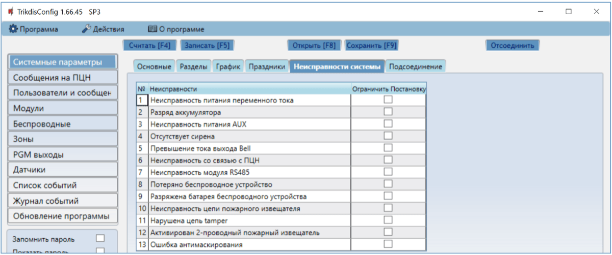

Если отмечено хотя бы одно поле внутренней неисправности охранной панели, то охранную панель нельзя будет установить под охрану при наличии этой неисправности.

**Закладка „Подсоединение“**

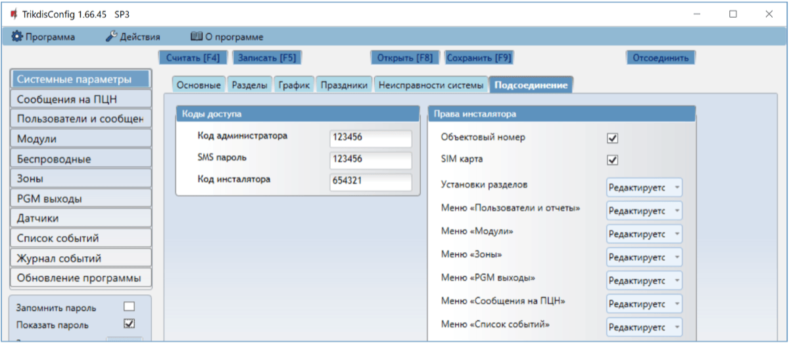

**Группа „Коды доступа“**

- **Код администратора** – (заводской код - 123456) дает полный доступ к конфигурации системы (код должен быть длиной 6 символов, он может состоять из латинских букв и / или цифр). Из соображений безопасности измените его на новый шестизначный код, который будете знать только вы.

- **SMS пароль** – (заводской код – 123456) используется для безопасного управления SMS сообщениями. Из соображений безопасности измените его на новый шестизначный код, который будете знать только вы.

- **Код инсталлятора** – (заводской код - 654321) дает доступ к конфигурации системы инсталлятору. Из соображений безопасности измените его на новый шестизначный код, который будете знать только вы.

!!! note "Примечание"
    Если установленный код администратора (123456), то программа не будет требовать его ввести и после нажатия на кнопку **Считать \[F4\]** будут считаны все значения настроек охранной панели. **Группа „Права инсталлятора“**

- Администратор устанавливает, какие параметры инсталлятор сможет изменять.

### Окно „Сообщения на ПЦН“

**Закладка „Сообщения“**

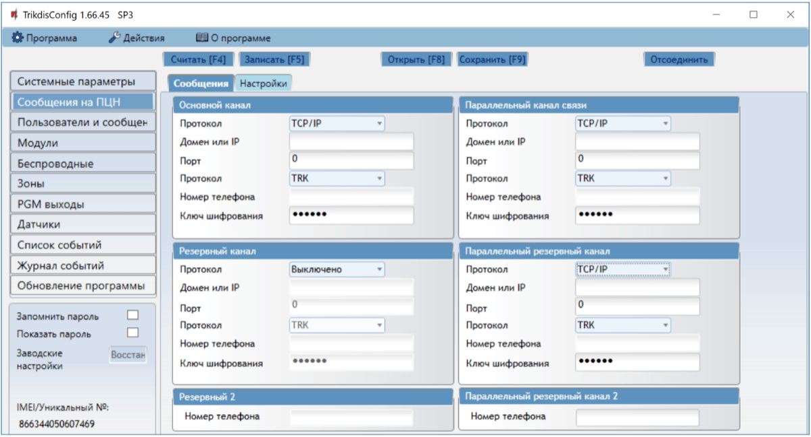

Группа „Основной канал“ и „Резервный канал“

- **Протокол** – выберите протокол связи с приемником (TCP/IP, UPD/IP, SMS).

- **Домен или IP** – введите адрес домена или IP адрес приемника.

- **Порт** - введите номер порта приемника в сети.

- **Протокол** – **TRK** передача данных на приемники Trikdis; **SIA DC-09** передача данных на универсальные приемники.

- **Номер телефона** – (только для SMS сообщений) телефонный номер ПЦН Trikdis SMS приемника, который может принять SMS сообщения. Номер телефона должен быть с международным кодом страны (например: 370хххххххх).

- **Ключ шифрования** – шестизначный ключ шифрования сообщений, который должен совпасть с ключом шифрования ПЦН приемника сообщения.

Установив параметры параллельного канала связи, сообщения будут одновременно отправляться по двум каналам. Оба канала не могут иметь одинаковые настройки приемника.

Группа „Резервный 2“ и „Параллельный резервный канал 2“

**Номер телефона** – (только для SMS сообщений) телефонный номер ПЦН Trikdis SMS приемника, который может принять SMS сообщения. Номер телефона должен быть с международным кодом страны (например: 370хххххххх).

**Закладка „Настройки“**

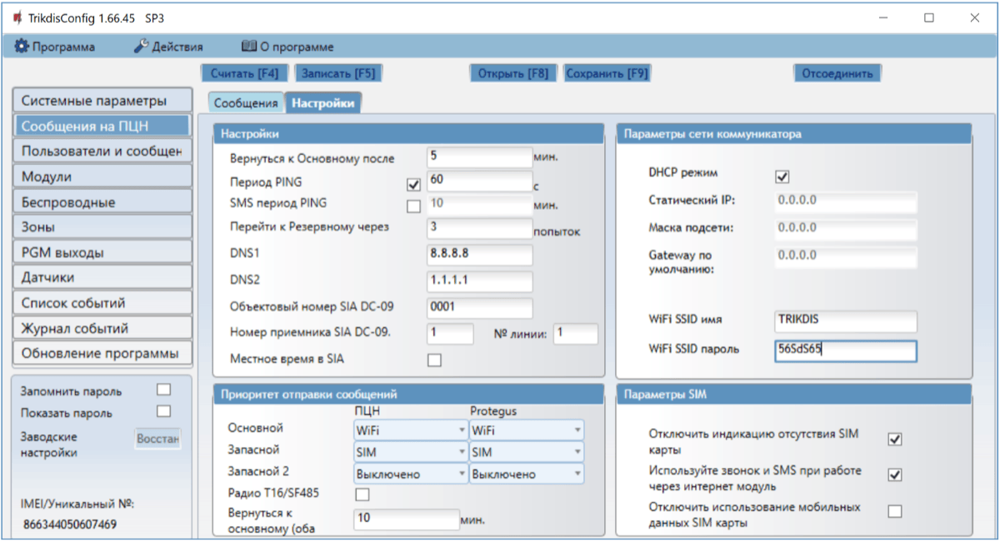

**Группа „Настройки“**

- **Вернуться к Основному после** – время по истечении которого, „FLEXi“ SP3 попытается восстановить связь по основному каналу, мин..

- **Период PING** – период отправления PING сигнала для проверки GPRS канала связи, сек.. Отметьте поле, чтобы активировать проверку канала связи.

- **SMS период PING** – период отправления PING сигнала по каналу отправки SMS сообщений, мин.. Отметьте поле, чтобы активировать проверку канала связи.

- **Перейти к Резервному через** – указывается число неудачных попыток передать сообщение по Основному каналу связи, после чего будет попытка передать сообщения по Резервному каналу.

- **DNS1, DNS2** – адреса DNS серверов.

- **Объектовый номер SIA DC-09** – введите номер объекта.

- **Номер приемника SIA DC-09** – введите номер приемника.

- **Номер линии SIA DC-09** – введите номер линии.

- **Местное время в SIA** – отметьте поле, чтобы в сообщениях, отправляемых на ПЦН, указывалось время установленное в модуле.

!!! note "Примечание"
    Независимо от настроек IP, убедитесь, что адреса DNS соответствуют адресам, поддерживаемым вашим интернет-провайдером. **Группа „Приоритет отправки сообщений“**

Устанавливается предпочтительный порядок отправки сообщений по каналам связи на ПЦН и в Protegus2. Типы каналов связи устанавливаются по порядку. Если не удается установить соединение по **Основному** каналу связи производится переход на **Запасной** канал связи и т.д.. Если удалось передать сообщение по **Запасному** каналу связи, то охранная панель с установленной периодичностью проверит и активно будет пытаться восстановить связь с приемниками ПЦН и с Protegus2 по **Основному** каналу связи.

- **Основной** – укажите типы основного канала связи (SIM, WiFi, E485(LAN)) с приемниками ПЦН и Protegus2. E485(LAN) канал связи через подключенный к RS485 шине модуль связи Е485.

- **Запасной** – укажите типы запасного канала связи (SIM, WiFi, E485(LAN)) с приемниками ПЦН и Protegus2. E485(LAN) канал связи через подключенный к RS485 шине модуль связи Е485.

- **Запасной 2** – укажите типы второго запасного канала связи (SIM, WiFi, E485(LAN)) с приемниками ПЦН и Protegus2. E485(LAN) канал связи через подключенный к RS485 шине модуль связи Е485.

- **Радио T16 / SF485** – отметьте поле только тогда, если радиопередатчик Т16 подключен проводами к шине RS485. T16 установленным порядком будет отправлять сообщения на ПЦН VHF или UHF радио волнами. Передатчик Т16 применяется только для передачи сообщений на ПЦН. Если в полях каналов связи с ПЦН установлено **Выключено** и отмечено поле **Радио Т16 /SF485**, то радио передатчик Т16 будет выступать в качестве основного и единственного отправителя сообщений на ПЦН. Если в полях каналов связи с ПЦН установлено **SIM, WiFi** или **E485(LAN)** и отмечено поле **Радио Т16 / SF485**, то радио передатчик Т16 будет выступать в качестве запасного канала связи отправления сообщений на ПЦН.

- **Вернуться к основному (оба канала)** – с заданной периодичностью (в минутах) охранная панель будет пытаться восстановить связь с приемником ПЦН и с Protegus2 по указанному **Основному** каналу связи.

**Группа „Параметры сети коммуникатора“**

- **DHCP режим** – выберите режим регистрации к WiFi сети (DHCP – автоматический; или ручной – Статический). Отметьте поле (автоматический режим регистрации) и охранная панель „FLEXi“ SP3 автоматически считает настройки сети (маска подсети, шлюз) и ей будет присвоен IP адрес.

- **Статический IP** – введите статический IP адрес (при ручном режиме регистрации).

- **Маска подсети** – введите маску подсети (при ручном режиме регистрации).

- **Gateway по умолчанию** – введите адрес шлюза (при ручном режиме регистрации).

- **WiFi SSID имя** – введите имя WiFi сети, к которой будет подключена охранная панель „FLEXi“ SP3.

- **WiFi SSID пароль** – введите пароль WiFi сети.

**Группа „Параметры SIM“**

- **Отключить индикацию отсутствия SIM карты** – отметьте поле и будет отключена индикация отсутствия SIM карты, когда „FLEXi“ SP3 работает без неё.

- **Используйте звонок и SMS при работе через интернет модуля** – отметьте поле и будет включено управление звонком и SMS сообщениями. Если поле не отмечено и есть Wi-Fi сеть, то звонок и SMS сообщения не используются. Если поле не отмечено и отсутствует Wi-Fi cеть, то охранной панелью „FLEXi“ SP3 можно управлять звонком и SMS сообщениями. Охранная панель будет отправлять SMS сообщения пользователю.

- **Отключить использование мобильных данных SIM карты** – отметьте поле, чтобы отключить использование мобильных данных с SIM карты. Данные будут отправляться только через WiFi сеть. Если Wi-Fi сеть отключится, то данные будут сохраняться в памяти охранной панели „FLEXi“ SP3. После восстановления Wi-Fi сети, „FLEXi“ SP3 отправит сохраненные данные через WiFi сеть.

### Окно „Пользователи и сообщения“

**Закладка „Пользователи“**

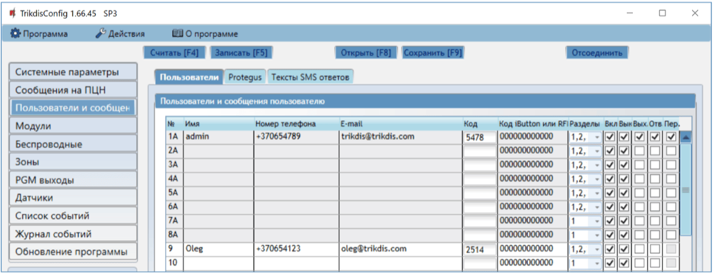

Группа „Пользователи и сообщения пользователю“

- **Имя** – имя пользователя, которое будет записываться в SMS сообщения.

- **Номер телефона** – номер телефона пользователя, с которого удаленно будет управляться сигнализация и на который будут отправляться SMS сообщения. Номер должен быть введен с международным кодом. Первые восемь номеров будут получать сообщения о событиях SMS сообщениями и звонком.

- **E-mail** – укажите электронную почту пользователя, чтобы он был приглашен в Protegus2 для управления системой охраны.

- **Код** – код предназначен для управления (включить/выключить) сигнализацией.

- **Код iButton или RFID брелока** – укажите идентификационный номер iButton контактного ключа, RFID карточки или брелока.

- **Разделы** – пользователю назначаются разделы охранной системы, которыми он может управлять.

- **Вкл.** – отметьте поле, и пользователь сможет включать систему охраны.

- **Выкл.** – отметьте поле, и пользователь сможет выключать систему охраны.

- **Вых.** – отметьте поле и пользователь сможет позвонить на „FLEXi“ SP3 и DTMF тонами управлять (включать/выключать) выходами.

- **Отв.** – отметьте поле и „FLEXi“ SP3 будет отвечать SMS сообщением на каждое полученное SMS сообщение.

- **Пер.** – отметьте поле и будет включена переадресация SMS сообщений от неизвестных телефонных номеров.

#### Регистрация RFID карточек (брелоков)

Регистрация RFID карточек (брелоков) производится в программе *TrikdisConfig*, вводя их идентификационные номера в поле Код iButton или RFID брелока. Нажмите кнопку Записать \[F5\], чтобы список идентификационные номера RFID карточек были записаны в охранную панель.

#### Регистрация контактных (iButton) ключей

Регистрация контактных ключей с помощью считывателя TM17.

1.  Если список **Код iButton или RFID брелока** пуст, первый приложенный контактный ключ к считывателю ТМ17 записывается в первую строку списка и ему назначается функция **Основного ключа**.

2.  Чтобы включить режим регистрации контактных ключей необходимо приложить **Основной ключ** к считывателю и удерживать его не менее 10 секунд. Когда включится режим регистрации, у считывателя ТМ17 начнет мигать „**State”** индикатор зеленым цветом.

3.  Регистрация контактных ключей пользователей. Приложите к считывателю и подержите контактный ключ. Три звуковых сигнала сообщат о регистрации контактного ключа. Уберите контактный ключ от считывателя. Если необходимо произвести регистрацию еще одного ключа, то повторите действия, которые описаны выше.

4.  Окончив регистрацию контактных (iButton) ключей, приложите **Основной ключ** к считывателю и режим регистрации будет отключен. На считывателе ТМ17 перестанет мигать индикатор **„State”.**

5.  Удаление всех контактных ключей (и **Основного ключа**) из памяти „FLEXi“ SP3. К считывателю ТМ17 приложите и удерживайте **Основной ключ** не менее 20 секунд.

Регистрация контактных ключей с помощью считывателя CZ-Dallas.

1.  Если список **Код iButton или RFID брелка** пуст, первый приложенный контактный ключ к считывателю iButton записывается в первую строку списка и ему назначается функция **Основного ключа**.

2.  Чтобы включить режим регистрации контактных ключей необходимо приложить **Основной ключ** к считывателю и удерживать его не менее 10 секунд.

3.  Регистрация контактных ключей пользователей. Приложите к считывателю контактный ключ. Уберите контактный ключ от считывателя. Если необходимо произвести регистрацию еще одного ключа, то повторите действия, которые описаны выше.

4.  Окончив регистрацию контактных ключей, приложите **Основной ключ** к считывателю и режим регистрации будет отключен.

5.  Удаление всех контактных ключей (и **Основного ключа**) из памяти „FLEXi“ SP3. К iButton считывателю приложите и удерживайте **Основной ключ** не менее 20 секунд.

!!! note "Примечание"
    **Основной ключ** предназначен для регистрации дополнительных контактных ключей. Применяя **Основной ключ,** выполнение команд (ARM/DISARM) будет иметь задержку времени. **Закладка „Protegus“**

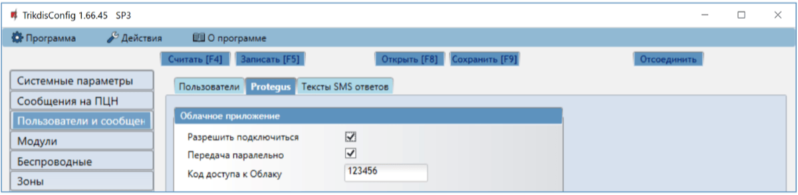

**Группа „Облачное приложение“**

- **Разрешить подключиться** – отметьте поле, чтобы разрешить доступ к серверу Protegus. „FLEXi“ SP3 сможет обмениваться данными с приложением Protegus2. С программой TrikdisConfig можно будет удаленно конфигурировать охранную панель „FLEXi“ SP3.

- **Передача параллельно** – отметьте поле и будет разрешена одновременная передача сообщений по **Основному каналу** (на ПЦН) и в Protegus2.

- **Код доступа к Облаку** – шестизначный код подключения к Protegus2, который должен совпадать с кодом, указанным в приложении Protegus2.

**Закладка „Тексты SMS ответов“**

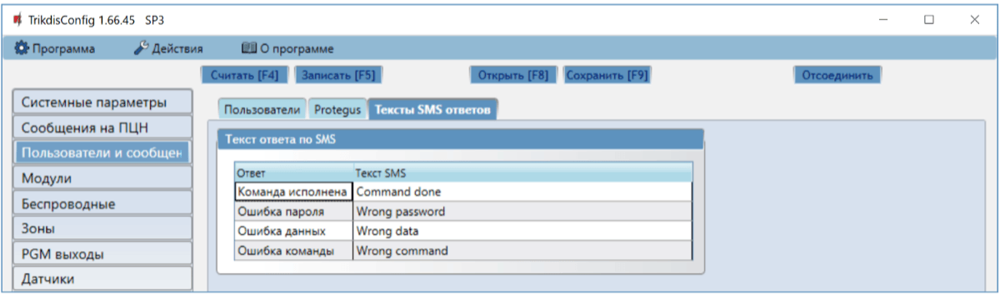

**Группа „Текст ответа по SMS“**

- **Текст SMS** – ответное SMS сообщение (текст можно редактировать) на полученные командные SMS сообщения управления.

### Окно „Moдули“

**Закладка „Клавиатуры“**

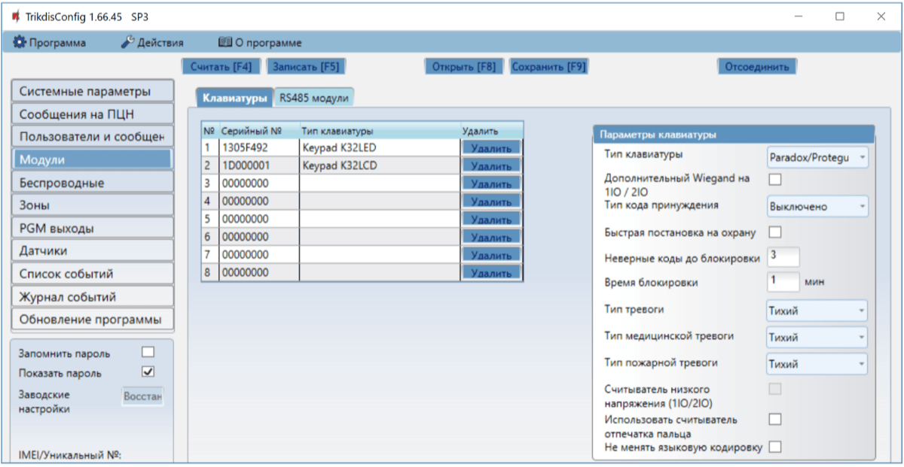

- **Серийный №** – серийный номер клавиатуры, который охранная панель определяет автоматически. Чтобы удалить клавиатуру, необходимо записать нули в поле или нажать на кнопку **Удалить**.

- **Тип клавиатуры** – тип клавиатуры, который считывает охранная панель.

- **Удалить** – кнопка для удаления клавиатуры из списка.

**Группа „Параметры клавиатуры“**

- **Тип клавиатуры** – укажите тип клавиатуры (Paradox/Protegus; Crow CR Icon/LCD; считыватель Wiegand), которая будет подсоединена к охранной панели (клеммы GRN, YEL).

- **Дополнительный Wiegand на 1IO/2IO** – отметь поле, если будет дополнительно подключен RFID считыватель. Дополнительный считыватель подключается к клеммам IO1 и IO2, которые нельзя будет использовать как вход или выход.

- **Тип кода принуждения** – выберите тип кода принуждения (Duress). Если вынуждены включить или выключить систему охраны с кодом принуждения, система охраны включится или выключится и немедленно передаст на ПЦН предупреждение.

- **Быстрая постановка на охрану** – отметьте поле, чтобы включить возможность использовать быстрое включение системы охраны (ARM, STAY, SLEEP) без ввода кода.

- **Неверные коды до блокировки** – укажите количество неверно введенных кодов, после чего клавиатура заблокируется.

- **Время блокировки** – укажите время блокировки клавиатуры.

- **Тип тревоги** – укажите какой сигнал (**Звуковой** / **Тихий** / **Отключено**) тревоги будет звучать при нажатии функциональных клавишей **Тревоги** на клавиатуре. Когда установлен **Звуковой** сигнал тревоги, сообщения о тревоге отправляются в Protegus2 и в ПЦН (пульт централизованного наблюдения), и охранная панель подает звуковой сигнал тревоги на клавиатуре и включает сирену. Когда установлен **Тихий** сигнал тревоги тревожные сообщения отправляются в Protegus2 и в ПЦН, и охранная панель отключает звуковые сигналы. Если установлено значение **Отключено** - то в Protegus2 и в ПЦН сообщения о тревоге не отправляются.

- **Тип медицинской тревоги** – укажите какой сигнал (**Звуковой** / **Тихий** / **Отключено**) тревоги будет звучать при нажатии функциональных клавишей **Медицинской тревоги** на клавиатуре. Когда установлен **Звуковой** сигнал тревоги, сообщения о тревоге отправляются в Protegus2 и в ПЦН (пульт централизованного наблюдения), и охранная панель подает звуковой сигнал тревоги на клавиатуре и включает сирену. Когда установлен **Тихий** сигнал тревоги тревожные сообщения отправляются в Protegus2 и в ПЦН, и охранная панель отключает звуковые сигналы. Если установлено значение **Отключено** - то в Protegus2 и в ПЦН сообщения о тревоге не отправляются.

- **Тип пожарной тревоги** - укажите какой сигнал (**Звуковой** / **Тихий** / **Отключено**) тревоги будет звучать при нажатии функциональных клавишей **Пожарной тревоги** на клавиатуре. Когда установлен **Звуковой** сигнал тревоги, сообщения о тревоге отправляются в Protegus2 и в ПЦН (пульт централизованного наблюдения), и охранная панель подает звуковой сигнал тревоги на клавиатуре и включает сирену. Когда установлен **Тихий** сигнал тревоги тревожные сообщения отправляются в Protegus2 и в ПЦН, и охранная панель отключает звуковые сигналы. Если установлено значение **Отключено** - то в Protegus2 и в ПЦН сообщения о тревоге не отправляются.

- **Считыватель низкого напряжения (1IO/2IO)** – отметьте поле, чтобы изменить протокол обмена данными между охранной панелью и считывателем, если подключенный RFID считыватель не работает.

- **Использовать считыватель отпечатка пальца** – отметьте поле, если будет подключен считыватель отпечатков пальцев с Wiegand 26/34 протоколом.

- **Не менять языковую кодировку** – отметьте поле, чтобы не менять кодировку текста названий зон и разделов для клавиатуры SK-LCD TouchPad.

**Закладка „RS485 модули“**

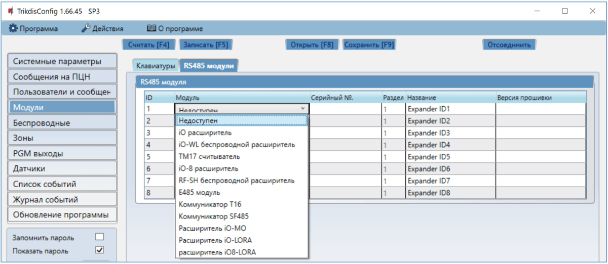

**Группа „RS485 модули“**

- **ID** – порядковый номер модуля.

- **Модуль** – выберите используемый модуль (iO, iO-WL, TM17, iO-8, RF-SH, E485, T16, SF485, iO-MO, iO-LORA, iO8-LORA) из списка.

- **Серийный №** – обязательно укажите шестизначный серийный номер модуля, который указан на корпусе и на упаковке модуля.

- **Раздел** – присвоение модуля разделу сигнализации (индикация ТМ17 будет показывать состояние раздела, к которой присвоен, и состояние зон этой области охранной сигнализации).

- **Название** – введите название модуля.

- **Версия прошивки** – версия программного обеспечения модуля будет отображена, когда „FLEXi“ SP3 идентифицирует подсоединенный модуль.

**Закладка „Е485 настройки“**

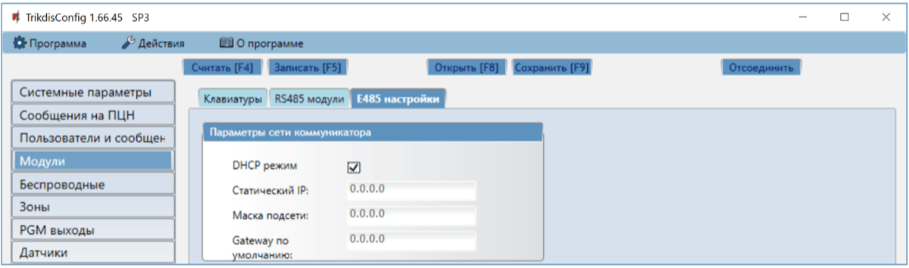

**Группа „Параметры сети коммуникатора“**

- **DHCP режим** – выберите режим регистрации к LAN сети (DHCP – автоматический; или ручной – Статический). Отметьте поле (автоматический режим регистрации) и охранная панель „FLEXi“ SP3 автоматически считает настройки сети (маска подсети, шлюз) и ей будет присвоен IP адрес.

- **Статический IP** – введите статический IP адрес (при ручном режиме регистрации).

- **Маска подсети** – введите маску подсети (при ручном режиме регистрации).

- **Gateway по умолчанию** – введите адрес шлюза (при ручном режиме регистрации).

### Окно „Беспроводные“

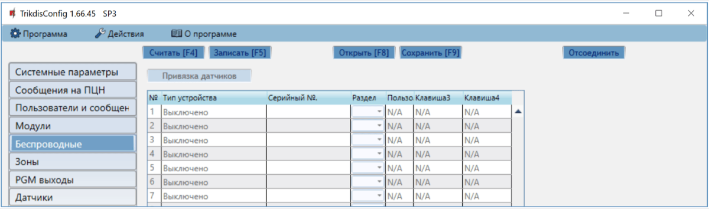

“FLEXI” SP3, с подключенным **RF-SH** модулем, может использовать беспроводные датчики, сирены, клавиатуры, брелоки фирмы Crow (серия FW2, Shepherd).

#### Регистрация RF-SH приемника беспроводных датчиков к „*FLEXi“ SP3*

1.  Подключите приемник RF-SH к „FLEXi“ SP3 согласно схеме, см. п.3.10 „Схема подключения RF-SH приемника беспроводных датчиков“.

2.  Включите питание.

3.  Подсоедините кабель USB Mini-B к охранной панели „***FLEXi“ SP3*.**

4.  Запустите программу TrikdisConfig и нажмите кнопку **Считать \[F4\]**.

5.  В окне „**Модули“** из списка выберите **RF-SH беспроводный расширитель**.

6.  В поле **Серийный №** введите серийный номер расширителя **RF-SH**.

7.  Нажмите кнопку **Записать \[F5\]**.

8.  Отсоедините кабель USB Mini-B.

9.  Подождите одну минуту, чтобы „FLEXi“ SP3 идентифицировал модуль расширения **RF-SH**.

10. Подсоедините кабель USB Mini-B к „FLEXi“ SP3.

11. Нажмите кнопку **Считать \[F4\]**.

12. В окне **Модули** в поле **Версия прошивки** будет указана версия программного обеспечения модуля **RF-SH**.

13. „FLEXi“ SP3 зарегистрировал модуль расширения **RF-SH**.

Теперь можно выполнить регистрацию всех беспроводных датчиков.

#### Регистрация беспроводных датчиков (серии FW2)

1.  Убедитесь, что „FLEXi“ SP3 зарегистрировал приемник беспроводных датчиков RF-SH (см. п. 5.6.1).

2.  Включите питание.

3.  Снимите крышку с **RF-SH**.

4.  Нажмите и удерживайте кнопку **LEARN** на модуле **RF-SH**, пока светодиод **LEARN** не начнет мигать зеленым цветом.

5.  Отпустите кнопку.

6.  Мигающий зеленый индикатор **LEARN** указывает, что **RF-SH** находится в режиме регистрации беспроводных датчиков.

7.  Вставьте аккумулятор в беспроводный датчик и дождитесь, пока светодиоды на датчике перестанут мигать.

8.  Нажмите и удерживайте кнопку **LEARN** на приемнике **RF-SH**, пока светодиод **LEARN** перестанет мигать зеленым. Приемник **RF-SH** вышел из режима регистрации.

9.  Подсоедините кабель USB Mini-B к „FLEXi“ SP3.

10. Запустите программу TrikdisConfig и нажмите кнопку **Считать \[F4\]**.

11. Программа TrikdisConfig отобразит список с зарегистрированным беспроводным датчиком в окне **Беспроводные**. В поле **Серийный №** будет записан 7-значный серийный номер. Номер должен совпасть с серийным номером датчика, который записан на задней стороне корпуса или на плате.

12. Датчики должны быть распределены по зонам и разделам охранной панели „FLEXi“ SP3 (окно **Зоны**). После внесения изменений нажмите **Сохранить \[F5\]**.

13. Беспроводный датчик полностью зарегистрирован.

!!! note "Примечание"
    Удаление беспроводных датчиков из памяти „FLEXi” SP3:

    1.  Подсоедините кабель USB Mini-B к „FLEXi" SP3.

    2.  Запустите программу TrikdisConfig и нажмите кнопку
        **Считать [F4]**.

    3.  В окне **Беспроводные** в поле **Тип устройства**, где записаны
        зарегистрированные датчики**,** укажите **Выключено**. Нажмите
        кнопку **Записать [F5].** Беспроводный датчик удален из памяти
        „FLEXi" SP3.

#### Регистрация беспроводного брелока серии FW2

1.  Убедитесь, что „*FLEXi“ SP3* зарегистрировал приемник беспроводных датчиков *RF-SH* (см. п. 5.6.1).

2.  Включите питание.

3.  Снимите крышку с RF-SH.

4.  Нажмите и удерживайте кнопку LEARN на модуле RF-SH, пока светодиод LEARN не начнет мигать зеленым цветом.

5.  Отпустите кнопку.

6.  Мигающий зеленый индикатор LEARN указывает, что RF-SH находится в режиме регистрации беспроводных датчиков.

7.  На брелоке одновременно нажмите и удерживайте 3 и 4 кнопки. Индикатор будет мигать желтым. Через несколько секунд он погаснет и на короткое время загорится зеленый индикатор.

8.  Отпустите кнопки 3 и 4. Брелок зарегистрирован к „FLEXi“ SP3.

9.  Нажмите и удерживайте кнопку **LEARN** на приемнике **RF-SH**, пока светодиод **LEARN** перестанет мигать зеленым. Приемник **RF-SH** вышел из режима регистрации.

10. Подсоедините кабель USB Mini-B к „FLEXi“ SP3.

11. Запустите программу TrikdisConfig и нажмите кнопку **Считать \[F4\]**.

12. Программа TrikdisConfig отобразит список с зарегистрированным брелоком в окне **Беспроводные**. В поле **Серийный №** будет записан 7-значный серийный номер. Номер должен совпадать с серийным номером брелока, который записан на задней стороне брелока.

13. Брелоку должен быть присвоен **Раздел** охранной панели „FLEXi“ SP3, которым он будет управлять.

14. В поле **Пользователь** введите номер пользователя.

15. Кнопкам 3 и 4 брелока можете присвоить дополнительные функции управления (Снято с охраны; Поставлено на охрану; Тихая паника; Паника; Управление PGM выходом).

16. После внесения изменений нажмите **Сохранить \[F5\]**.

17. Беспроводный брелок полностью зарегистрирован.

!!! note "Примечание"
    Восстановление заводских настроек брелока:

    1.  Одновременно нажмите и подержите 2 и 3 кнопки брелока. Начнет мигать
        индикатор зеленым и красным цветом.

    2.  Погаснут индикаторы. Отпустите кнопки. У брелока восстановлены
        заводские настройки.

#### Регистрация беспроводной сирены серии FW2

1.  Убедитесь, что „FLEXi“ SP3 зарегистрировал приемник беспроводных датчиков RF-SH (см. п. 5.6.1).

2.  Включите питание.

3.  Снимите крышку с **RF-SH**.

4.  Нажмите и удерживайте кнопку **LEARN** на модуле **RF-SH**, пока светодиод **LEARN** не начнет мигать зеленым цветом.

5.  Отпустите кнопку.

6.  Мигающий зеленый индикатор **LEARN** указывает, что **RF-SH** находится в режиме регистрации беспроводных датчиков.

7.  Снимите крышку с сирены.

8.  Подсоедините питание сирены.

9.  Вспышка сирены будет 30 секунд медленно мигать. Когда вспышка перестанет мигать, сирена готова к регистрации.

10. Нажмите и удерживайте кнопку **LEARN** на плате сирены.

11. Вспышка начнет мигать.

12. Отпустите кнопку **LEARN.** Когда вспышка перестанет мигать, сирена будет успешно зарегистрирована.

13. Нажмите и удерживайте кнопку **LEARN** на приемнике **RF-SH**, пока светодиод **LEARN** перестанет мигать зеленым. Приемник **RF-SH** вышел из режима регистрации.

14. Подсоедините кабель USB Mini-B к „FLEXi“ SP3.

15. Запустите программу TrikdisConfig и нажмите кнопку **Считать \[F4\]**.

16. Программа TrikdisConfig отобразит список с зарегистрированной беспроводной сирены в окне **Беспроводные**. В поле **Серийный №** будет записан 7-значный серийный номер. Номер должен совпадать с серийным номером сирены, который записан на плате.

17. Укажите номер **Раздела** сирене охранной панели „FLEXi“ SP3. После внесения изменений нажмите **Сохранить \[F5\]**.

18. Беспроводная сирена полностью зарегистрирована.

!!! note "Примечание"
    Восстановление заводских настроек сирены:

    1.  Снимите крышку сирены.

    2.  Отключите питание сирены.

    3.  Нажмите и удерживайте кнопку **LEARN** на плате сирены и
        подсоедините питание.

    4.  Удерживайте нажатой кнопку **LEARN**, пока вспышка сирены не мигнет
        3 раза.

    5.  Отпустите кнопку **LEARN**. Вспышка сирены редко будет мигать еще 30
        секунд.

    6.  Перестает мигать вспышка. Восстановлены заводские настройки
        беспроводной сирены.

#### Регистрация беспроводных датчиков серии SH

1.  Убедитесь, что „FLEXi“ SP3 зарегистрировал приемник беспроводных датчиков RF-SH (см. п. 5.6.1).

2.  Включите питание.

3.  Снимите крышку с **RF-SH**.

4.  Нажмите и удерживайте кнопку **LEARN** на модуле **RF-SH**, пока светодиод **LEARN** не начнет мигать зеленым цветом.

5.  Отпустите кнопку.

6.  Мигающий зеленый индикатор **LEARN** указывает, что **RF-SH** находится в режиме регистрации беспроводных датчиков.

7.  Вставьте аккумулятор в беспроводный датчик и подождите, пока светодиодный индикатор датчика не перестанет мигать зеленым или красным. Когда процесс регистрации завершится, зеленый светодиод загорится на 3 секунды и погаснет.

8.  Если процесс регистрации не пройден, светодиод перестанет мигать. Извлеките аккумулятор, подождите десять секунд и повторите процесс регистрации.

9.  Нажмите и удерживайте кнопку **LEARN** на приемнике **RF-SH**, пока светодиод **LEARN** перестанет мигать зеленым. Приемник **RF-SH** вышел из режима регистрации.

10. Подсоедините кабель USB Mini-B к „FLEXi“ SP3.

11. Запустите программу TrikdisConfig и нажмите кнопку **Считать \[F4\]**.

12. Программа TrikdisConfig отобразит список зарегистрированных беспроводных датчиков в окне **Беспроводные**. В поле **Серийный №** будут записаны 7-значные серийные номера. Номера должны совпадать с серийными номерами датчиков, которые записаны на задней стороне корпуса или на плате.

13. Датчики должны быть распределены по зонам и разделам охранной панели „FLEXi“ SP3 (окно **Зоны**). После внесения изменений нажмите **Сохранить \[F5\]**.

14. Беспроводный датчик полностью зарегистрирован.

!!! note "Примечание"
    Удаление беспроводных датчиков из памяти „FLEXi” SP3:

    1.  Подсоедините кабель USB Mini-B к „FLEXi" SP3.

    2.  Запустите программу TrikdisConfig и нажмите кнопку
        **Считать [F4]**.

    3.  В окне **Беспроводные** в поле **Тип устройства**, где записаны
        зарегистрированные датчики**,** укажите **Выключено**. Нажмите
        кнопку **Записать [F5].** Беспроводный датчик удален из памяти
        „FLEXi" SP3.

#### Регистрация беспроводной клавиатуры серии SH

1.  Убедитесь, что „FLEXi“ SP3 зарегистрировал приемник беспроводных датчиков RF-SH (см. п. 5.6.1).

2.  Включите питание.

3.  Снимите крышку с **RF-SH**.

4.  Нажмите и удерживайте кнопку **LEARN** на модуле **RF-SH**, пока светодиод **LEARN** не начнет мигать зеленым цветом.

5.  Отпустите кнопку.

6.  Мигающий зеленый индикатор **LEARN** указывает, что **RF-SH** находится в режиме регистрации беспроводных датчиков.

7.  Вставьте аккумулятор в клавиатуру и подождите, пока зеленый красный индикатор на клавиатуре не перестанет мигать. Когда процесс регистрации завершится, зеленый индикатор  загорится на 3 секунды на клавиатуре и погаснет.

8.  Нажмите и удерживайте кнопку **LEARN** на приемнике **RF-SH**, пока светодиод **LEARN** перестанет мигать зеленым. Приемник **RF-SH** вышел из режима регистрации.

9.  Подсоедините кабель USB Mini-B к „FLEXi“ SP3.

10. Запустите программу TrikdisConfig и нажмите кнопку **Считать \[F4\]**.

11. Программа TrikdisConfig отобразит список зарегистрированной беспроводной клавиатуры в окне **Беспроводные**. В поле **Серийный №** будет записан 7-значный серийный номер. Номер должен совпадать с серийным номером клавиатуры, который записан на задней стороне корпуса или на плате.

12. В поле **Раздел** укажите номер раздела охранной сигнализации.

13. После завершения настроек нажмите **Сохранить \[F5\]**.

14. Беспроводная клавиатура полностью зарегистрирована.

!!! note "Примечание"
    Удаление беспроводной клавиатуры из памяти „FLEXi” SP3:

    1.  Подсоедините кабель USB Mini-B к „FLEXi" SP3.

    2.  Запустите программу TrikdisConfig и нажмите кнопку
        **Считать [F4]**.

    3.  В окне **Беспроводные** в поле **Тип устройства**, где записана
        зарегистрированная клавиатура **Пульт SH,** укажите **Выключено**.
        Нажмите кнопку **Записать [F5].** Беспроводная клавиатура удалена
        из памяти „FLEXi" SP3.

### Окно „Зоны“

**Закладка „Настройки зон“**

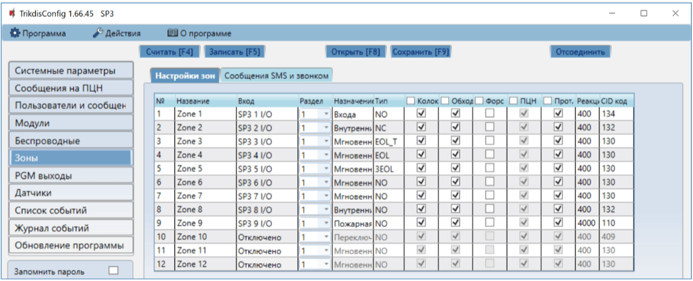

- **№ зоны** – порядковый номер зоны.

- **Название** – впишите название зоны.

- **Вход** – можно выбрать, какой вход „FLEXi“ SP3 или расширителя присвоить зоне.

- **Раздел** – назначение зоны разделу охранной сигнализации.

- **Назначение** – каждой зоне можно назначить одну из функций:

  - **Входа** – подключение магнитоконтактного извещателя входной двери. Для этого типа зоны устанавливается время задержки на вход и на выход.

Сигнализация включена. Зону можно нарушить на время установленной задержки времени входа. Если за установленную задержку времени сигнализация не будет снята с охраны выходы ОUT „Сирена“ и „Вспышка“ срабатывают и отправляется сигнал тревоги о срабатывании сигнализации.

Сигнализация выключена. Нарушение зоны допустимо. При включении сигнализации зона может быть нарушена в течение задержки времени выхода. Если по истечению задержки времени выхода зона осталась нарушенной, то выходы ОUT „Сирена“ и „Вспышка“ срабатывают и отправляется сигнал тревоги о срабатывании сигнализации.

- **Внутренний** – предназначена для подключения пассивного инфракрасного извещателя около входной двери. Сигнализация включена. Нарушив зону выходы ОUT „Сирена“ и „Вспышка“ срабатывают мгновенно и отправляется сигнал тревоги о срабатывании сигнализации. Если сначала нарушается зона **Входа**, то после можно нарушить **Внутреннюю** зону, в течении задержки времени входа нужно выключить сигнализацию. Если сигнализация не будет выключена, то выходы ОUT „Сирена“ и „Вспышка“ срабатывают и отправляется сигнал тревоги о срабатывании сигнализации.

- **Внутренний (Stay)** – предназначен для подключения пассивного инфракрасного извещателя около входной двери.

Сигнализация включена в ARM режиме. Нарушив зону выходы ОUT „Сирена“ и „Вспышка“ срабатывают мгновенно и отправляется сигнал тревоги о срабатывании сигнализации.

Сигнализация включена в ARM режиме. Если сначала нарушается зона **Входа**, то после можно нарушить **Внутреннюю (Stay)** зону, в течении задержки времени входа нужно выключить сигнализацию. Если сигнализация не будет выключена, то выходы ОUT „Сирена“ и „Вспышка“ срабатывают и отправляется сигнал тревоги о срабатывании сигнализации.

Сигнализация включена в STAY режиме. **Внутренняя (Stay)** зона не охраняется.

- **Мгновенный** – предназначена для подключения пассивного инфракрасного извещателя или магнитоконтактного извещателя. Когда сигнализация включена, нарушив зону мгновенно срабатывают выходы ОUT „Сирена“ и „Вспышка“ и отправляется сигнал тревоги о срабатывании сигнализации.

- **Мгновенный (Stay)** – предназначена для подключения пассивного инфракрасного извещателя или магнитоконтактного извещателя.

Сигнализация включена в ARM режиме. Нарушив зону выходы ОUT „Сирена“ и „Вспышка“ срабатывают мгновенно и отправляется сигнал тревоги о срабатывании сигнализации.

Сигнализация включена в STAY режиме. **Мгновенная (Stay)** зона не охраняется.

- **Пожарная** – предназначена для подключения пожарных извещателей. Нарушив зону мгновенно срабатывают выходы ОUT „Сирена“ и „Вспышка“ и отправляется сигнал тревоги о срабатывании сигнализации.

  - **Переключатель** – предназначен для подключения кодовой клавиатуры или выключателя. Нарушив зону будет переключен режим охранной сигнализации (включена или выключена). Сигнализация включится через задержку времени выхода.

  - **24-х час** – предназначена для подключения акустического извещателя разбития стекла или антисаботажной зоны. Нарушив зону мгновенно срабатывают выходы ОUT „Сирена“ и „Вспышка“ и отправляется сигнал тревоги о срабатывании сигнализации.

  - **Тихий** – сигнализация включена, нарушив зону мгновенно отправляется сигнал тревоги о срабатывании сигнализации, а выходы ОUT „Сирена“ и „Вспышка“ остаются выключены.

  - **Тихий 24-х час** – предназначена для подключения тревожной кнопки. Нарушив зону мгновенно отправляется сигнал тревоги о срабатывании сигнализации, а выходы ОUT „Сирена“ и „Вспышка“ остаются выключены.

- **Тип** – из списка выберите тип подключенной зоны: NC – нормально закрытый контакт; NO – нормально открытый контакт; EOL – с резистором в конце линии; EOL_T – в резистором в конце линии и контролем тампера; ATZ – двух зонная нормально замкнутая цепь с резисторами в конце линии, без контроля тампера (при использовании этого типа в списке зон необходимо выбрать вторую ATZ зону); ATZ_T – двух зонная нормально замкнутая цепь с резисторами в конце линии, с контролем тампера (при использовании этого типа в списке зон необходимо выбрать вторую ATZ зону); 3EOL – в резистором в конце линии и контролем тампера (эта настройка предназначена когда применяется детектор движения с функцией антимаскинга).

- **Колокольчик** – отметьте поле и включите функцию колокольчик для зоны. Клавиатура будет издавать звуковой оповещающий сигнал, когда зона будет активирована.

- **Обход** – отметьте поле, если хотите разрешить обойти (англ. Bypass) зону и не реагировать на ее срабатывание.

- **Форс** – отметьте поле, если хотите включать систему охраны с нарушенной зоной (англ. Force). Включив сигнализацию, активная зона с атрибутом **Форс** будет временно снята с охраны. Зона будет вновь под охраной после ее восстановления. Активация зоны вызовет тревогу.

- **ПЦН** – отметьте поле и сообщения о событиях будут отправляться на ПЦН (пульт централизованного наблюдения).

- **Прот.** – отметьте поле и сообщения о событиях будут отправляться в приложение Protegus2.

- **Реакция** – время реакции входов, миллисекунды.

- **CID код** – Contact ID код события. Когда будет выбрана функция зоны, значение CID кода установится автоматически.

- **Голос** – укажите номер голосового сообщения, которое будет воспроизведено пользователю, когда охранная панель „FLEXi“ SP3 позвонит во время тревоги (эта функция действительна для охранной панели SP3_12xx с версией прошивки до 1.13 включительно).

**Закладка „Сообщения SMS и звонком“**

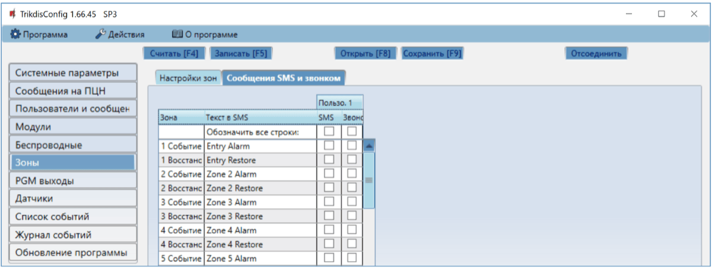

Это окно появится, если хоть один пользователь будет описан в окне „Пользователи и сообщения“.

- **Зона** – номер зоны с идентификационным словом (Событие или Восстановление).

- **Текст в SMS** – описание события зоны, которое будет отправлено пользователю в SMS сообщении.

- **Пользователь / SMS и Звонок** – отметьте поле, каким образом пользователь будет информирован о событии в зоне – SMS сообщением и/или звонком.

### Окно „PGM выходы“

**Закладка „Выходы“**

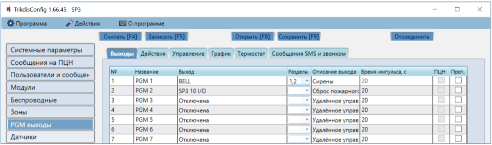

- **№**– порядковый номер PGM выхода.

- **Название** - впишите название PGM выхода.

- **Выход** – назначьте выходы охранной панели или внешнего расширителя**.**

- **Разделы** – укажите раздел охранной системы, которому присвоен выход OUT.

- **Описание выхода** – выберите режим работы выхода OUT.

- **Сирены** – предназначен для подключения сирены.

- **Удаленное управление** – предназначен для управления электротехническим оборудованием.

- **Сброс пожарного датчика** – предназначен для запуска работы пожарного извещателя заново, после его срабатывания.

- **Статус системы** – предназначен для подключения индикации состояния системы сигнализации (например: подключенный световой индикатор будет показывать когда система охраны включена или выключена).

- **Вспышка** – сигнализация включена – формируется сплошной сигнал (выход включен). Сработала сигнализация – формируется импульсный сигнал. Сигнализация выключена – выход выключен.

- **Термостат** – выход OUT работает в режиме термостата. К охранной панели должен быть подключен датчик температуры. Выходу OUT должен быть установлен режим термостата и указана поддерживаемая температура.

- **Зуммер** – выход предназначен для повтора звукового сигнала клавиатуры.

- **Время импульса, с** – установите продолжительность срабатывания выхода OUT в импульсном режиме (от 0 до 9999 сек.).

- **ПЦН** – отметьте поле, чтобы события о срабатывании/восстановлении выхода OUT отправлялись на ПЦН.

- **Прот.** – отметьте поле, чтобы события о срабатывании/восстановлении выхода OUT отправлялись в приложение Protegus2.

**Закладка „Действия“**

- **№** – порядковый номер строчки.

- **Вкл.** – отметьте поле и будет включен алгоритм срабатывания выхода OUT.

- **№ PGM** – укажите выход OUT, который будет управляться событиями, указанными в столбцах **Фактор, № фактора, Начать если, Значение.**

- **Действие**:

- **Выкл. PGM** – выключить выход OUT.

- **Вкл. PGM** – включить выход OUT.

- **Выкл. импульсом** – выключение выхода OUT на продолжительность импульса (после получения команды выход выключается на продолжительность импульса и затем включается).

- **Вкл. импульсом** – включить выход OUT на продолжительность импульса (после получения команды выход включается на продолжительность импульса и затем выключается).

- **Время активации, с** – установите длительность импульса срабатывания (0-9999 сек.).

- **Фактор/№ фактора** – устанавливается условие (Вход, Температура, Глушение GSM, Неполадка датчика температуры, iButton, Поставлено под охрану, Снято с охраны, SMS получено, Зона (повторить), Stay, Sleep), которое определит включение выхода OUT.

  - В закладке** График** можно создать 10 графиков (которые можно назначить выходам OUT), когда выходы OUT должны будут включиться.

- **Начать, если** – можно установить дополнительное условие включения (от события **Фактора)** выхода OUT.

- **Значение** – в зависимости от выбранного условия в столбце **Фактор** (SMS получено, Температура)**,** вы можете установить значение (текст входящего SMS сообщения или указать значение напряжения или температуры), которое будет использоваться для управления PGM выходом. Текст SMS сообщения можно выделить знаком %. Знаком % выделяется ключевое слово в полученном SMS сообщении, по которому будет срабатывать PGM выход.

**%…..%** - часть входящего SMS сообщения должна соответствовать тексту записанному между знаками % (например: **%dOm%**. В SMS сообщении должен быть текст „**dOm**“. Пример SMS сообщения: **NadodOmoj**).

**…..%** - начало входящего SMS сообщения должно содержать текст записанного до знака % (например: **dOm%**. SMS сообщение должно начинаться текстом „**dOm**“. Пример SMS сообщения: **dOm1144**).

**%…..** - конец входящего SMS сообщения должен содержать текст записанного после знака % (например: **%dOm**. SMS сообщение должно заканчиваться текстом „**dOm**“. Пример SMS сообщения: **1144dOm**).

В SMS сообщении важны прописные и строчные буквы.

**Закладка „Управление“**

**Группа „Управление Входом/Выходом“**

- **Считыватель** – указаны считыватели, которые могут быть подключены к охранной панели.

- **Вкл.** – отметьте поле, чтобы считыватель мог управлять PGM выходом.

- **Код** - отметьте поле, чтобы считыватель мог управлять указанным PGM выходом с помощью кода.

- **PGM** – укажите PGM выход, которым будет управлять считыватель. PGM выходу должен быть установлен режим работы **Удаленное управление.**

- **PGM режим** – установите режим срабатывания PGM выхода (**Импульс** или **Уровень**).

- **Действие** – укажите изменение режима охраны охранной панели, когда к считывателю будет приложен iButton ключ или RFID карточка.

**Группа „Управление клавиатурой Paradox“**

- **Функциональная клавиша** – нажатие и удерживание функциональных клавишей в течение 3 секунд вызовет срабатывание PGM выхода. PGM выход сработает на продолжительность импульса (если установлен режим работы **Импульс**) или изменится уровень сигнала PGM выхода (если установлен режим работы **Уровень**).

**Закладка „График“**

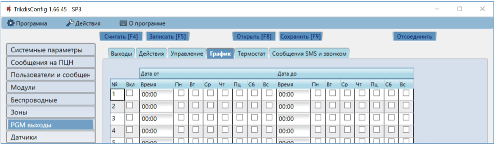

- **№** – порядковый номер графика.

- **Вкл.** – разрешение на включение графика.

- **Дата от** – устанавливается время начала графика, когда выход должен быть включен.

- **Дата до** – устанавливается время конца графика, когда выход должен быть выключен.

- **Пн – Вс** –укажите дни недели, когда выход должен быть включен/выключен.

**Закладка „Термостат“**

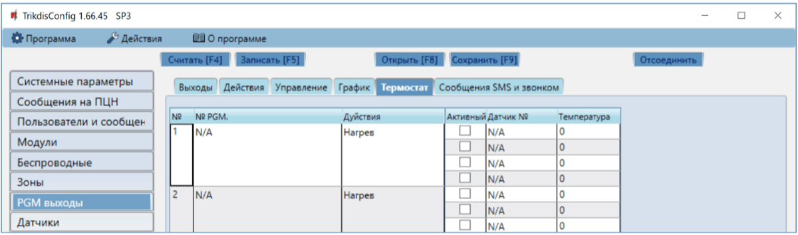

- **№** – порядковый номер термостата.

- **№ PGM** – укажите номер PGM выхода, которым будет управлять термостат.

- **Действия** – установите режим работы термостата (нагрев, охлаждение).

- **Активный** – отметьте поле и термостат будет работать с выбранным датчиком температуры и поддерживать заданную температуру.

- **Датчик № –** назначьте датчик температуры термостату.

- **Температура –** введите значение температуры, которую будет поддерживать термостат.

**Закладка „Сообщения SMS и звонком“**

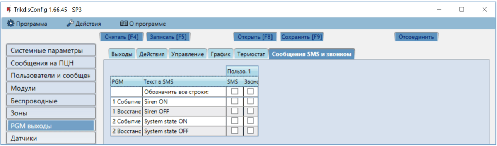

Закладка „Сообщения SMS и звонком“ появится если хоть один пользователь будет описан в окне „Пользователи и сообщения“*.* Только для восьми первых пользователей можно сделать эти настройки.

- **PGM** – указывается номер выхода и тип события Событие/Восстановление (Событие – включение выхода OUT / Восстановление – выключение выхода OUT).

- **Текст в SMS** – текст события (Событие/Восстановление) выхода OUT, которое будет включено в SMS сообщение.

- **Пользователь / SMS и Звонок** – выберите каким образом (SMS сообщением и/или Звонком) пользователь будет информирован о включении/выключении выхода OUT.

### Окно „Датчики“

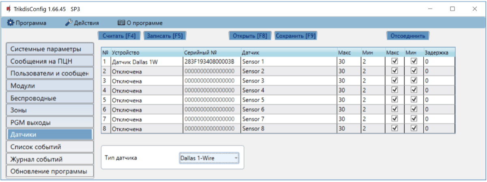

- **№** – порядковый номер датчика температуры.

- **Устройство** – датчик температуры („FLEXi“ SP3 автоматически определяет подключенные датчики температуры).

- **Серийный номер** - серийный номер датчика температуры, который считывает охранная панель.

- **Датчик** – введите название датчика температуры.

- **Макс** – наибольшее значение температуры, выше которого будет сформировано сообщение о событии. Чтобы сообщение было отправлено должно быть отмечено поле **Макс.**

- **Мин** – наименьшее значение температуры, ниже которого будет сформировано сообщение о событии. Чтобы сообщение было отправлено должно быть отмечено поле **Мин.**

- **Задержка** – событие будет отправлено, если измеренное значение (Макс или Мин) датчиком будет превышено в течении установленного времени. Время задержка вводится в минутах.

- **Тип датчика** – укажите тип датчика температуры: **Dallas 1Wire** – можно подключить до 8 шт. датчиков температуры, которые будут автоматически зарегистрированы охранной панелью; **Влажности и температуры** – можно подключить один АМ2301 датчик температуры и влажности. В столбце **Устройство** необходимо вручную указать датчик.

### Окно „Список событий“

**Закладка „Внутренние события“**

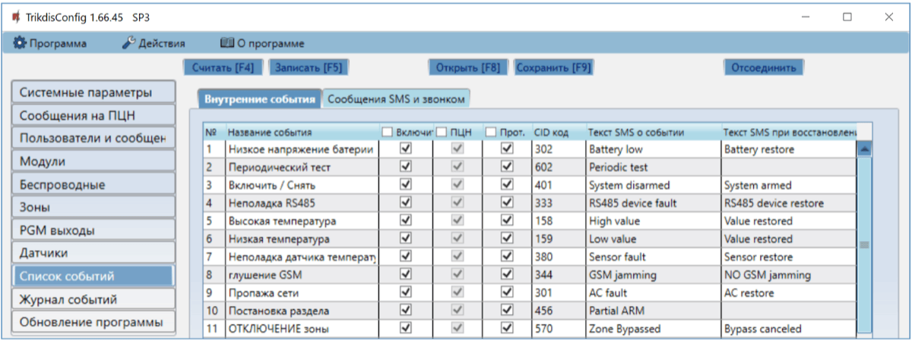

- **№** – порядковый номер события.

- **Название события** – наименование события.

- **Включить** – отметьте поле, чтобы разрешить отправлять сообщение о событии.

- **ПЦН / Прот.** – отметьте поле, чтобы разрешить отправлять сообщения на ПЦН (пульт централизованного наблюдения) и/или в приложение Protegus2.

- **CID код** – Contact ID код события.

- **Текст SMS о событии** – текст SMS сообщения о событии.

- **Текст SMS при восстановлении** – текст SMS сообщения при восстановлении события.

**Закладка „Сообщения SMS и звонком“**

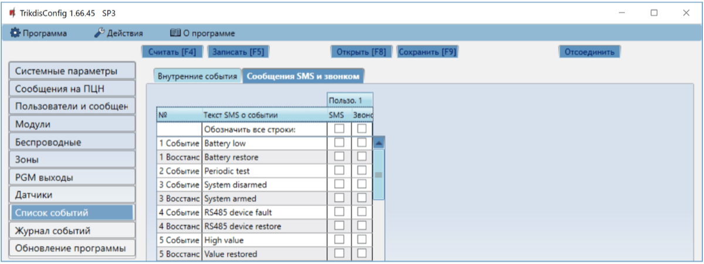

Закладка „Сообщения SMS и звонком“ появится если хоть один пользователь будет описан в окне „Пользователи и сообщения“*.*

- **№** – номер и тип события Событие/Восстановление.

- **Текст SMS о событии** – текст о событии, который будет включен в SMS сообщение.

- **Пользователь / SMS и Звонок**– отметьте поле каким способом (SMS сообщением и/или звонком) пользователь будет извещен о событии.

### Окно „Журнал событий“

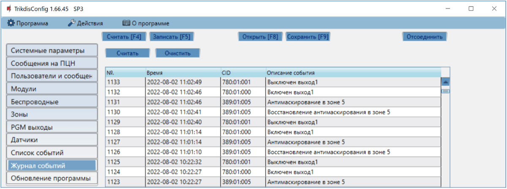

- Нажать кнопку **Считать** – будет считан журнал событий из памяти „FLEXi“ SP3.

- Кнопка **Очистить** – если ее нажать, то будет очищен журнал событий в памяти „FLEXi“ SP3.

- В таблице указаны **№** события**, Время, CID, Описание события**. В памяти „FLEXi“ SP3 может храниться до 1000 событий.

### Восстановление заводских настроек

Для восстановления заводских настроек необходимо в программном окне TrikdisConfig нажать кнопку **Восстановить.**

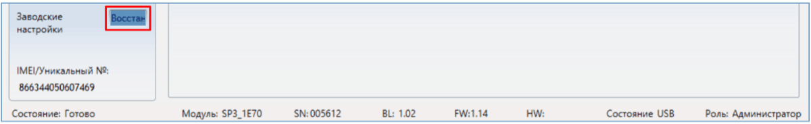

### Обновление прошивки „FLEXi“ SP3

!!! note "Примечание"
    Подключите „FLEXi” SP3 к TrikdisConfig. Если есть новая прошивка для „FLEXi” SP3, то TrikdisConfig предложит обновить прошивку. Для обновления прошивки должно быть подключение к сети интернет. / Если в компьютере установлена антивирусная программа, то она может блокировать функцию автоматического обновления программного обеспечения. В этом случае придется изменить настройки в антивирусной программе. Прошивку охранной панели можно обновить или заменить вручную. После обновления все ранее установленные настройки „FLEXi“ SP3 остаются. Прошивка может быть заменена на новую или на старую версии. Выполните следующие шаги:

1.  Запустите программу ***TrikdisConfig**.*

2.  Подключите „FLEXi“ SP3 к компьютеру с помощью кабеля USB Mini-B или подсоединитесь удаленно. Если есть новая прошивка, то TrikdisConfig предложит обновить программное обеспечение охранной панели „FLEXi“ SP3.

3.  В программе TrikdisConfig откройте окно **Обновление программы.**

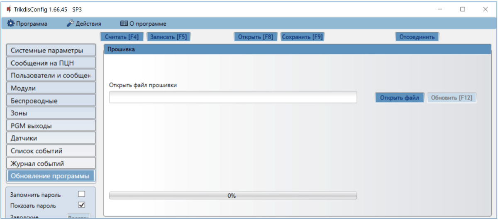

4.  Нажмите кнопку **Открыть файл** и выберите нужный файл для установки. Если такого файла не имеете, то зайдите на страничку [www.trikdis.com](http://www.trikdis.com), как зарегистрированный пользователь, и скачайте новую прошивку для „FLEXi“ SP3.

5.  Нажмите кнопку **Обновить \[F12\]**.

6.  Подождите, пока произойдет обновление прошивки.

Окончив конфигурацию, нажмите кнопку **Записать \[F5\]** и отключите кабель USB.

## Содержание

**Гарантия и ограничение ответственности**

Охранной панели предоставляется 24 месяцев гарантия со дня купли-продажи. В течение гарантийного периода осуществляется бесплатный гарантийный ремонт изделия из-за неисправностей по вине производителя.

Гарантия действует, если панель управления была установлена квалифицированными специалистами в соответствии с правилами установки электрооборудования.

Во время гарантийного периода, при дефекте охранная панель предоставляется производителю в упаковке производителя и дефектным актом, где указан характер неисправности.

После окончания гарантийного периода обслуживание и ремонт охранной панели осуществляется за счет покупателя.

Гарантия может быть прекращена преждевременно, если:

- Охранная панель была отремонтирована или принималась попытка ремонта посторонним лицом;

- Охранная панель не использовалась по прямому назначению;

- Охранная панель хранится и/или установлена в неподходящем помещении, в котором агрессивная химическая среда или неподходящие климатические условия;

- Охранная панель механически сломана и/или намеренно повреждена;

- Охранная панель повреждена из-за форс-мажорных обстоятельств (разряд молнии и т.д.).

Производитель не несет ответственности:

- За неисправности охранной панели, если она установлена или не используется в соответствии с ее инструкцией;

- При неисправностях охранной панели, которые произошли при потере GSM/GPRS/Интернета связи или из-за сбоев в сети оператора мобильной связи;

- За прекращение или ограничение услуг связи (GSM/GRPRS/Интернет) покупателю или пользователю охранной системы. В связи с этим, производитель не возмещает покупателю или пользователю охранной системы возникшие имущественные и неимущественные убытки;

- За прекращение или ограничение подачи электроэнергии покупателю или пользователю охранной системы. В связи с этим, производитель не возмещает покупателю или пользователю охранной системы возникшие имущественные и неимущественные убытки;

- За ограбление, пожар или другие убытки, причиненные пользователю охранной панели, производитель не несет ответственности. В связи с этим, производитель не возмещает покупателю или пользователю охранной системы возникшие имущественные и неимущественные убытки.

**Требования безопасности**

Ознакомьтесь с руководством перед использованием охранной панели.

Устанавливать и обслуживать систему охранной сигнализации могут только квалифицированные специалисты.

Выполняя работы по установке оборудования, обязательно должно быть выключено его внешнее питание.

Охранная панель должна быть установлена в помещениях с ограниченным доступом и на безопасном расстоянии от чувствительного электронного оборудования. Охранная панель не устойчива к вибрациям, другим механическим воздействиям, влаге и агрессивной химической среде. Охранная панель соответствует требованиям стандарта EN50131 II классу устойчивости к окружающей среде.

!!! warning "Предупреждение"

    Используемые корпуса, трансформаторы, аккумуляторы и устройства
    программирования должны соответствовать требованиям безопасности
    стандарта EN 60950. / Устройство питается от сети переменного тока 230 В
    50 Гц через трансформатор II класса, который понижает напряжение до
    16-18 В, или от источника постоянного тока 16 - 24 В. Аккумулятор 12 В
    емкостью не менее 7 Ач используется для обеспечения резервного питания.
    Потребляемый ток зависит от мощности подключенных внешних
    устройств. / Для защиты в цепи электропитания должен быть установлен
    двухполюсный автоматический выключатель. Зазор между размыкающими
    контактами автоматического выключателя должен быть не менее 3 мм.
    Автоматический выключатель должен быть установлен в щите, место
    установки которого известно специалистам, обслуживающим панель
    управления. / Отключение охранной панели от сети: / - от сети
    переменного тока - выключением автоматического выключателя; / - от
    аккумулятора -- отсоединяются провода от клемм аккумулятора.
